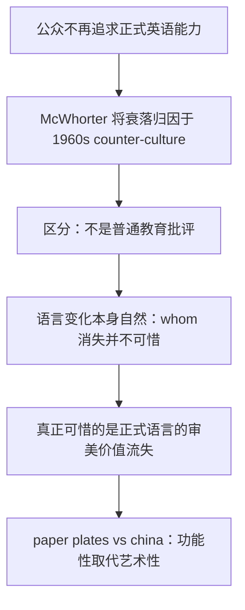

# 2005 Passage 4 — The Decline of Formal English 精读笔记

## 背景

本文选自 **2005 年全国硕士研究生入学统一考试英语（一）Text 4**，主题围绕 **formal English（正式英语）衰落** 展开。文章讨论语言学家 John McWhorter 对 20 世纪 60 年代反主流文化、口语化表达、正式写作与审美价值流失之间关系的看法。

> [!abstract] 文章主线
> 作者并不是简单批评教育衰落，而是通过 McWhorter 的观点引出一个更细腻的问题：正式语言是否仍有必要？它的价值究竟是“实用”还是“审美”？



> [!tip]
> 本文命题重点不在“正式英语是否必要”，而在区分 **语言自然变化** 与 **审美文化损失**。阅读时要特别留意作者如何排除误解，再提出真正立场。

---

## 文章原文

## Text 4

Americans no longer expect **public figures**, whether in speech or in writing, to command the **English language** with skill and gift.

> [!abstract]- 长难句分析
> **原句**：Americans no longer expect **public figures**, whether in speech or in writing, to command the **English language** with skill and gift.
>
> ### 1. 主干提取
>
> | 层级 | 成分 | 内容 |
> |------|------|------|
> | 主句主语 S | Americans | 动作和心理预期的发出者 |
> | 状语 A | no longer | 修饰 expect，表示“不再” |
> | 主句谓语 V | expect | 谓语动词，后接复合宾语结构 |
> | 宾语 O | **public figures** | expect 的宾语，即被期待具备能力的人 |
> | 宾语补足语 C | to command the **English language** with skill and gift | 不定式短语作宾语补足语，说明公众人物应具备的能力 |
>
> **简化主干**：Americans no longer expect public figures to command the English language.
>
> ### 2. 修饰成分
>
> | 类型 | 引导词 / 标志 | 修饰对象 | 说明 |
> |------|--------------|----------|------|
> | 插入语 / 省略状语结构 | whether...or... | command the English language 的表达场景 | whether in speech or in writing 省略了完整谓语，表示“无论是在演讲中还是写作中”，限定“驾驭英语”发生的语境 |
> | 非谓语短语 | to command | public figures | expect + O + to do 复合宾语结构，to command 作宾语补足语 |
> | 名词短语作宾语 | the **English language** | command | command 的宾语，表示“驾驭英语” |
> | 介词短语 | with | command | with skill and gift 修饰 command，说明“以技巧和天赋”驾驭语言 |
> | 并列名词 | and | skill / gift | skill 与 gift 并列作 with 的宾语，分别强调训练所得的技巧与天赋 |
>
> ### 3. 结构图解
>
> ```text
> [主句] Americans no longer expect public figures to command the English language with skill and gift
>   ├── 主语：Americans
>   ├── 状语：no longer → 修饰 expect
>   ├── 谓语：expect
>   └── 复合宾语：public figures to command the English language with skill and gift
>         ├── 宾语：public figures
>         └── 宾语补足语：to command the English language with skill and gift
>               ├── 动词：command（驾驭 / 熟练掌握）
>               ├── 宾语：the English language
>               └── 方式状语：with skill and gift
> [插入语 / 场景状语] whether in speech or in writing
>   └── 表示范围：无论在口头表达还是书面表达中
> ```
>
> ### 4. 参考译文
> 美国人不再期望公众人物无论是在演讲中还是写作中，都能熟练而富有才华地驾驭英语。
>
> ### 5. 考点提示
> - **expect + 宾语 + to do**：这是典型复合宾语结构，`public figures` 是 expect 的宾语，`to command...` 是宾语补足语，不要误判为目的状语。
> - **whether...or... 的省略结构**：`whether in speech or in writing` 中省略了完整谓语，插入句中补充表达场景，翻译时可前置为“无论……还是……”。
> - **command 的熟词僻义**：此处不是“命令”，而是“熟练掌握 / 驾驭”。考研阅读常考熟词僻义，需要结合宾语 `the English language` 判断。
> - **with + 抽象名词作方式状语**：`with skill and gift` 说明驾驭语言的方式和水平，翻译为“熟练而富有才华地”。

Nor do they aspire to such command themselves.

> [!abstract]- 长难句分析
> **原句**：Nor do they aspire to such command themselves.
>
> ### 1. 主干提取
>
> | 层级 | 成分 | 内容 |
> |------|------|------|
> | 连接 / 否定成分 | Nor | 承接上一句的否定，表示“也不”；置于句首触发部分倒装 |
> | 助动词 / 倒装标志 | do | 因否定词 Nor 置于句首而提前到主语前 |
> | 主句主语 S | they | 指代 Americans |
> | 主句谓语 V | aspire | 实义动词，表示“渴望 / 追求” |
> | 介词补足成分 | to such command | aspire to 的固定搭配，表示“追求这种驾驭能力” |
> | 强调成分 | themselves | 反身代词作同位强调，强调“他们自己”也不追求 |
>
> **还原语序**：They do not aspire to such command themselves.
>
> **简化主干**：they do not aspire to such command.
>
> ### 2. 修饰成分
>
> | 类型 | 引导词 / 标志 | 修饰对象 | 说明 |
> |------|--------------|----------|------|
> | 否定副词 / 并列连接 | Nor | 整个句子 | 承接上文 no longer，表示“也不”，形成连续否定 |
> | 部分倒装 | Nor + do + S + V | 主句结构 | 否定词 Nor 位于句首，助动词 do 提前，主语 they 后置 |
> | 介词短语 / 固定搭配补足语 | to | aspire | aspire to sth. 表示“渴望 / 追求某事物”，to 是介词 |
> | 指示限定语 | such | command | such command 回指上一句的 command the English language with skill and gift |
> | 反身代词强调 | themselves | they | 不是宾语，而是强调主语“他们自己” |
>
> ### 3. 结构图解
>
> ```text
> [否定连接] Nor
>   └── 承接上一句：Americans no longer expect...
> [倒装主句] do they aspire to such command themselves
>   ├── 助动词提前：do
>   ├── 主语：they (= Americans)
>   ├── 谓语：aspire
>   ├── 介词补足成分：to such command
>   │     ├── to：介词，构成 aspire to sth.
>   │     └── such command：回指“熟练而富有才华地驾驭英语”
>   └── 强调成分：themselves → 强调 they
>
> [还原语序] They do not aspire to such command themselves.
> ```
>
> ### 4. 参考译文
> 他们自己也不再追求这种驾驭语言的能力。
>
> ### 5. 考点提示
> - **否定词置首引起部分倒装**：`Nor do they...` 的正常语序是 `They do not...`。考研中遇到 Nor / Neither / Never / Seldom 等否定词置首，要先还原语序再理解。
> - **Nor 的承接关系**：Nor 不是单纯的“但是”，而是承接上一句否定，表示“也不”，形成“公众不期待；他们自己也不追求”的递进否定。
> - **aspire to 中 to 是介词**：`aspire to such command` 中 to 后接名词短语，不是不定式标志；固定搭配译为“渴望 / 追求……”。
> - **themselves 作强调而非宾语**：这里强调 Americans 自身也不追求这种语言能力，不能译成“追求他们自己”。

In his latest book, *Doing Our Own Thing: The Degradation of Language and Music and Why We Should, Like, Care*, John McWhorter, a **linguist** and **controversialist** of mixed liberal and conservative views, sees the triumph of 1960s **counter-culture** as responsible for the decline of **formal English**.

> [!abstract]- 长难句分析
> **原句**：In his latest book, *Doing Our Own Thing: The Degradation of Language and Music and Why We Should, Like, Care*, John McWhorter, a **linguist** and **controversialist** of mixed liberal and conservative views, sees the triumph of 1960s **counter-culture** as responsible for the decline of **formal English**.
>
> ### 1. 主干提取
>
> | 层级 | 成分 | 内容 |
> |------|------|------|
> | 句首状语 A | In his latest book, *Doing Our Own Thing: The Degradation of Language and Music and Why We Should, Like, Care* | 说明观点出现的载体：在其最新著作中 |
> | 主句主语 S | John McWhorter | 观点的提出者 |
> | 同位语 | a **linguist** and **controversialist** of mixed liberal and conservative views | 补充说明 John McWhorter 的身份与立场特点 |
> | 主句谓语 V | sees | “认为 / 看作”，后接 see A as B 结构 |
> | 宾语 O | the triumph of 1960s **counter-culture** | 被看作原因的对象，即“20 世纪 60 年代反主流文化的胜利” |
> | 宾语补足语 C | as responsible for the decline of **formal English** | as 引出的宾语补足语，说明他如何评价这个 triumph |
>
> **简化主干**：John McWhorter sees the triumph as responsible for the decline.
>
> ### 2. 修饰成分
>
> | 类型 | 引导词 / 标志 | 修饰对象 | 说明 |
> |------|--------------|----------|------|
> | 介词短语 / 句首状语 | In | 整个主句 | In his latest book 表示观点来源或出现位置 |
> | 同位语 / 书名说明 | 逗号 + 书名 | his latest book | 书名解释 latest book 的具体所指 |
> | 同位语 | 逗号 | John McWhorter | a linguist and controversialist... 补充说明人物身份 |
> | 介词短语作后置定语 | of | controversialist / views | of mixed liberal and conservative views 说明其观点兼具自由派和保守派色彩 |
> | 介词短语作后置定语 | of | triumph | of 1960s counter-culture 修饰 triumph，说明“什么的胜利” |
> | 介词短语 / 宾补标志 | as | the triumph | see A as B 结构中的 as 引出宾语补足语 |
> | 介词短语作补足成分 | for | responsible | responsible for... 说明“对……负责 / 是……的原因” |
> | 介词短语作后置定语 | of | decline | of formal English 修饰 decline，说明“正式英语的衰落” |
>
> ### 3. 结构图解
>
> ```text
> [句首状语] In his latest book
>   └── [同位语 / 书名] Doing Our Own Thing: The Degradation of Language and Music and Why We Should, Like, Care
>
> [主句] John McWhorter sees the triumph as responsible for the decline
>   ├── 主语：John McWhorter
>   │     └── [同位语] a linguist and controversialist of mixed liberal and conservative views
>   │           ├── 身份 1：a linguist
>   │           ├── 身份 2：controversialist
>   │           └── 后置定语：of mixed liberal and conservative views
>   ├── 谓语：sees
>   └── 复合宾语：the triumph ... as responsible ...
>         ├── 宾语：the triumph
>         │     └── 后置定语：of 1960s counter-culture
>         └── 宾语补足语：as responsible for the decline of formal English
>               ├── as：引出评价结果
>               ├── responsible for the decline：对衰落负有责任 / 是衰落原因
>               └── of formal English → 修饰 decline
> ```
>
> ### 4. 参考译文
> 在其最新著作《我行我素：语言与音乐的退化，以及我们为什么，呃，应该在意》中，约翰·麦克沃特——一位观点兼有自由派和保守派色彩的语言学家兼争议性评论家——认为 20 世纪 60 年代反主流文化的胜利导致了正式英语的衰落。
>
> ### 5. 考点提示
> - **see A as B 复合宾语结构**：`the triumph` 是宾语，`as responsible...` 是宾语补足语，核心意思是“把 A 看作 B / 认为 A 是 B”。
> - **长主语前后插入信息多**：句首状语、书名同位语、人物同位语都容易遮蔽主干；阅读时先抓 `John McWhorter sees the triumph as responsible`。
> - **同位语识别**：`a linguist and controversialist...` 不是新主语，而是对 John McWhorter 的补充说明。
> - **responsible for 的语义转换**：在此不是“负责任的”直译，而是“对……负有责任 / 是……的原因”，与后文 decline 构成因果判断。
> - **多重 of 短语层层后置**：`the triumph of...`、`the decline of...` 都是名词后置修饰，翻译时需前置为“……的胜利 / ……的衰落”。

Blaming the **permissive** 1960s is nothing new, but this is not yet another criticism against the decline in education.

> [!abstract]- 长难句分析
> **原句**：Blaming the **permissive** 1960s is nothing new, but this is not yet another criticism against the decline in education.
>
> ### 1. 主干提取
>
> | 层级 | 成分 | 内容 |
> |------|------|------|
> | 第一分句主语 S | Blaming the **permissive** 1960s | 动名词短语作主语，表示“责怪放任的 20 世纪 60 年代”这一行为 |
> | 第一分句系动词 V | is | 连接主语与表语 |
> | 第一分句表语 C | nothing new | 表示“并不是什么新鲜事” |
> | 并列连词 | but | 连接前后两个并列分句，构成转折 |
> | 第二分句主语 S | this | 指代前面“责怪 60 年代”这一话题 / 做法在本文中的具体讨论 |
> | 第二分句系动词 V | is | 连接主语与表语 |
> | 第二分句表语 C | not yet another criticism against the decline in education | 说明“这并不是又一种对教育衰落的批评” |
>
> **简化主干**：Blaming the 1960s is nothing new, but this is not another criticism.
>
> ### 2. 修饰成分
>
> | 类型 | 引导词 / 标志 | 修饰对象 | 说明 |
> |------|--------------|----------|------|
> | 动名词短语 | Blaming | 第一分句主语 | Blaming... 整体名词化，作句子主语 |
> | 名词短语作宾语 | the **permissive** 1960s | Blaming | blame 的宾语，表示被归咎的时代 |
> | 形容词前置定语 | **permissive** | 1960s | 表示“放任的 / 纵容的”，带有对 60 年代文化氛围的评价 |
> | 表语结构 | nothing new | Blaming... | nothing + adjective 表示“并不……” |
> | 并列连词 / 转折 | but | 两个分句 | 前句承认“责怪 60 年代并不新鲜”，后句转折说明本文不是普通教育批评 |
> | 限定词短语 | yet another | criticism | yet another 表示“又一个 / 又一种”，常带有“老调重弹”的意味 |
> | 介词短语作后置定语 | against | criticism | against the decline in education 修饰 criticism，说明批评所针对的问题 |
> | 介词短语作后置定语 | in | decline | in education 修饰 decline，说明“教育领域的衰落” |
>
> ### 3. 结构图解
>
> ```text
> [并列分句 1] Blaming the permissive 1960s is nothing new
>   ├── 主语：Blaming the permissive 1960s
>   │     ├── 动名词：Blaming
>   │     └── 宾语：the permissive 1960s
>   │           └── 前置定语：permissive → 修饰 1960s
>   ├── 系动词：is
>   └── 表语：nothing new
>
> but
>
> [并列分句 2] this is not yet another criticism against the decline in education
>   ├── 主语：this
>   ├── 系动词：is
>   └── 表语：not yet another criticism against the decline in education
>         ├── 核心名词：criticism
>         ├── 限定：not yet another → 不是又一种 / 并非老调重弹式的
>         └── 后置定语：against the decline in education
>               └── in education → 修饰 decline
> ```
>
> ### 4. 参考译文
> 把责任归咎于放任的 20 世纪 60 年代并不是什么新鲜事，但这并不是又一种针对教育衰落的批评。
>
> ### 5. 考点提示
> - **动名词短语作主语**：`Blaming the permissive 1960s` 是主语，谓语是 `is`；不要把 Blaming 当成现在分词状语。
> - **but 连接并列分句**：前后都有完整主系表结构，阅读时应拆成“承认旧观点”与“排除误解”两层。
> - **nothing new 的否定表达**：不是“没有新东西”，而是“并不新鲜 / 老生常谈”。
> - **yet another 的语气**：表示“又一个 / 又一种”，常暗含“重复、老套”的语气。
> - **against 的修饰关系**：`against the decline in education` 修饰 `criticism`，表示“针对教育衰落的批评”，不是“反对教育衰落本身”。

Mr. McWhorter’s academic speciality is **language history and change**, and he sees the gradual disappearance of “**whom**”, for example, to be natural and no more regrettable than the loss of the case — endings of Old English.

> [!abstract]- 长难句分析
> **原句**：Mr. McWhorter’s academic speciality is **language history and change**, and he sees the gradual disappearance of “**whom**”, for example, to be natural and no more regrettable than the loss of the case — endings of Old English.
>
> ### 1. 主干提取
>
> | 层级 | 成分 | 内容 |
> |------|------|------|
> | 并列分句 1 主语 S | Mr. McWhorter’s academic speciality | “麦克沃特先生的学术专长” |
> | 并列分句 1 系动词 V | is | 连接主语和表语 |
> | 并列分句 1 表语 C | **language history and change** | 整体说明其专业方向是“语言史与语言变化” |
> | 并列连词 | and | 连接两个完整并列分句 |
> | 并列分句 2 主语 S | he | 指 Mr. McWhorter |
> | 并列分句 2 谓语 V | sees | “认为 / 看作”，后接 `see + O + to be + C` 复合宾语结构 |
> | 并列分句 2 宾语 O | the gradual disappearance of “**whom**” | 被评价的语言现象，即 whom 的逐渐消失 |
> | 并列分句 2 宾语补足语 C | to be natural and no more regrettable than the loss of the case — endings of Old English | 说明他对该现象的判断：自然，而且并不比古英语格尾的消失更令人遗憾 |
>
> **简化主干**：Mr. McWhorter’s academic speciality is language history and change, and he sees the disappearance of “whom” to be natural and no more regrettable than the loss of Old English case-endings.
>
> ### 2. 修饰成分
>
> | 类型 | 引导词 / 标志 | 修饰对象 | 说明 |
> |------|--------------|----------|------|
> | 名词所有格 | ’s | academic speciality | 表示“麦克沃特先生的学术专长” |
> | 名词短语内部并列 | and | history / change | `language` 限定研究领域，`history` 与 `change` 并列，共同构成表语中心 |
> | 介词短语作后置定语 | of | disappearance | `of “whom”` 说明“什么的消失” |
> | 插入语 | for example | 整个 `the gradual disappearance of “whom”` 这一例子 | 举例说明语言变化中的具体案例，不参与主干 |
> | 不定式短语作宾语补足语 | to be | the gradual disappearance of “whom” | `see + O + to be + C`，说明“认为 O 是 C”，不是目的状语 |
> | 表语内部并列 | and | natural / no more regrettable... | `natural` 与 `no more regrettable...` 共同作 `to be` 后的补足语内容 |
> | 比较结构 | no more...than... | regrettable | 表示“A 并不比 B 更令人遗憾”，不可误译为“更不令人遗憾” |
> | 介词短语作后置定语 | of | loss | `of the case — endings of Old English` 说明“古英语格尾的消失” |
> | 介词短语作后置定语 | of | case — endings | `of Old English` 说明这些格尾属于古英语 |
>
> ### 3. 结构图解
>
> ```text
> [并列句]
> ├── 分句 1：Mr. McWhorter’s academic speciality is language history and change
> │     ├── 主语：Mr. McWhorter’s academic speciality
> │     ├── 系动词：is
> │     └── 表语：language history and change
> │           ├── 前置限定：language
> │           └── 并列中心：history and change
> ├── 并列连词：and
> └── 分句 2：he sees the gradual disappearance of “whom”, for example, to be natural and no more regrettable...
>       ├── 主语：he
>       ├── 谓语：sees
>       ├── 宾语：the gradual disappearance of “whom”
>       │     ├── 前置修饰：gradual
>       │     └── 后置定语：of “whom”
>       ├── 插入语：for example → 说明 whom 的消失只是一个例子
>       └── 宾语补足语：to be natural and no more regrettable than...
>             ├── 补足语 1：natural
>             └── 补足语 2：no more regrettable than the loss of the case — endings of Old English
>                   ├── 比较核心：no more regrettable
>                   └── 比较基准：than the loss of the case — endings of Old English
>                         └── loss 的后置定语：of the case — endings of Old English
>                               └── case — endings 的后置定语：of Old English
> ```
>
> ### 4. 参考译文
> 麦克沃特先生的学术专长是语言史与语言变化；例如，他认为 “whom” 一词的逐渐消失是一种自然现象，并不比古英语格尾的消失更值得惋惜。
>
> ### 5. 考点提示
> - **并列句拆分**：`and` 连接两个完整分句，前一分句是主系表结构，后一分句是 `see + O + to be + C` 复合宾语结构。
> - **see + O + to be + C**：`the gradual disappearance of “whom”` 是宾语，`to be natural and no more regrettable...` 是宾语补足语；阅读时不要把 `to be` 误判为目的状语。
> - **no more...than... 比较结构**：这里表示“并不比……更令人遗憾”，借古英语格尾消失这一历史变化来说明 whom 的消失也属自然演变，不应译成“更不令人遗憾”。
> - **插入语 for example**：插在宾语后，对 `the gradual disappearance of “whom”` 作例证说明；可先跳过插入语，再抓 `he sees O to be C` 主干。
> - **of 短语层层后置**：`disappearance of “whom”`、`loss of the case — endings of Old English` 都是名词 + of 后置定语，翻译时应前置为“whom 的消失 / 古英语格尾的消失”。

But the cult of the **authentic** and the personal, “doing our own thing”, has spelt the death of **formal speech**, **writing**, **poetry** and **music**.

> [!abstract]- 长难句分析
> **原句**：But the cult of the **authentic** and the personal, “doing our own thing”, has spelt the death of **formal speech**, **writing**, **poetry** and **music**.
>
> ### 1. 主干提取
>
> | 层级 | 成分 | 内容 |
> |------|------|------|
> | 转折连接词 | But | 承接上文：虽然 McWhorter 承认语言变化有自然性，但他仍批评某种文化倾向造成了正式表达的衰落 |
> | 主语 S | the cult of the **authentic** and the personal | “崇尚真实与个人化的风气 / 崇拜” |
> | 同位语 | “doing our own thing” | 对这种 cult 的具体说明，即“我行我素、做自己的事”的观念 |
> | 谓语 V | has spelt | 现在完成时，spell 在此意为“导致 / 意味着” |
> | 宾语 O | the death of **formal speech**, **writing**, **poetry** and **music** | “正式演说、写作、诗歌和音乐的消亡” |
>
> **简化主干**：But the cult has spelt the death of formal speech, writing, poetry and music.
>
> ### 2. 修饰成分
>
> | 类型 | 引导词 / 标志 | 修饰对象 | 说明 |
> |------|--------------|----------|------|
> | 介词短语作后置定语 | of | cult | `of the authentic and the personal` 说明崇拜的对象：真实感与个人化 |
> | 名词化形容词 | the | authentic / personal | `the authentic`、`the personal` 表示抽象概念：“真实的东西 / 个人化的东西” |
> | 同位语 / 插入说明 | 逗号 + 引号短语 | the cult of the authentic and the personal | `doing our own thing` 解释这种文化风气的口号或核心精神 |
> | 介词短语作后置定语 | of | death | `of formal speech, writing, poetry and music` 说明“哪些东西的消亡” |
> | 并列名词结构 | 逗号 + and | formal speech / writing / poetry / music | 四个名词并列，共同作 `of` 的宾语，表示受影响的正式艺术与表达形式 |
>
> ### 3. 结构图解
>
> ```text
> [主句] But the cult ... has spelt the death ...
> ├── 转折：But → 与上文“whom 的消失属自然变化”形成语义转折
> ├── 主语：the cult
> │     └── 后置定语：of the authentic and the personal
> │           ├── 名词化形容词 1：the authentic
> │           └── 名词化形容词 2：the personal
> ├── 同位语：“doing our own thing”
> │     └── 解释 cult 的文化口号：我行我素 / 做自己的事
> ├── 谓语：has spelt
> │     └── 现在完成时：表示这种影响已经造成结果
> └── 宾语：the death
>       └── 后置定语：of formal speech, writing, poetry and music
>             ├── formal speech
>             ├── writing
>             ├── poetry
>             └── music
> ```
>
> ### 4. 参考译文
> 但是，对“真实”与“个人化”的崇尚——也就是“我行我素”——已经导致了正式演说、写作、诗歌和音乐的消亡。
>
> ### 5. 考点提示
> - **But 的转折方向**：上文说 McWhorter 认为某些语言形式消失属自然变化；本句转而指出，他真正哀叹的是 20 世纪 60 年代后“崇尚个人真实”的文化风气摧毁了正式表达。
> - **cult 的抽象含义**：这里不是“邪教”，而是“狂热崇拜 / 风气 / 潮流”；`the cult of...` 常译为“对……的崇尚”。
> - **名词化形容词**：`the authentic`、`the personal` 用 `the + 形容词` 表抽象概念，不能机械译为“真实的人 / 个人的人”。
> - **spell 的熟词僻义**：`has spelt the death of...` 中 spell 不是“拼写”，而是“意味着 / 导致”，相当于 `has caused`。
> - **同位语插入识别**：`“doing our own thing”` 被逗号隔开，是对前面 cult 的解释，阅读时可先跳过，抓主干 `the cult has spelt the death`。

While even the modestly educated sought an **elevated tone** when they put pen to paper before the 1960s, even the most well regarded writing since then has sought to capture **spoken English** on the page.

> [!abstract]- 长难句分析
> **原句**：While even the modestly educated sought an **elevated tone** when they put pen to paper before the 1960s, even the most well regarded writing since then has sought to capture **spoken English** on the page.
>
> ### 1. 主干提取
>
> | 层级 | 成分 | 内容 |
> |------|------|------|
> | 让步 / 对比状语从句 | While even the modestly educated sought an **elevated tone** when they put pen to paper before the 1960s | 先交代 20 世纪 60 年代以前的写作取向：即使受教育程度不高的人写作时也追求高雅语调 |
> | 主句主语 S | even the most well regarded writing since then | “自那以后，即便是最受推崇的文字作品” |
> | 主句谓语 V | has sought | 现在完成时，表示从那以后延续至今的写作倾向；`seek to do` 意为“试图 / 力图做……” |
> | 主句宾语 O | to capture **spoken English** on the page | 不定式短语作 seek 的宾语，表示“试图在书面上捕捉口语英语” |
>
> **简化主干**：While the modestly educated sought an elevated tone, even the most well regarded writing has sought to capture spoken English.
>
> ### 2. 修饰成分
>
> | 类型 | 引导词 / 标志 | 修饰对象 | 说明 |
> |------|--------------|----------|------|
> | 让步 / 对比状语从句 | While | 整个主句 | `While... , ...` 形成“过去追求高雅语调”与“后来追求口语化”的对比 |
> | 名词化形容词 | the + 形容词 | the modestly educated | 表示“一类人”：受教育程度一般的人 |
> | 副词修饰 | even | the modestly educated / the most well regarded writing | 两个 even 构成强烈对照：过去连普通受教育者都追求高雅；后来连最受推崇的作品也追求口语化 |
> | 时间状语从句 | when | sought an elevated tone | `when they put pen to paper` 说明追求高雅语调发生在“动笔写作时” |
> | 习语结构 | put pen to paper | they | 表示“动笔写作”，不是字面上的“把笔放到纸上” |
> | 时间状语 | before the 1960s | sought / put pen to paper | 限定前半句所描述的时代背景：20 世纪 60 年代以前 |
> | 后置时间状语 | since then | writing / has sought | 说明主句所谈的是“自那以后”的写作趋势 |
> | 非谓语短语作宾语 | to capture | has sought | `seek to do` 结构，to capture 是 sought 的宾语内容 |
> | 介词短语作地点状语 | on | capture **spoken English** | `on the page` 表示把口语英语呈现在书面页面上 |
>
> ### 3. 结构图解
>
> ```text
> [复合句]
> ├── 让步 / 对比状语从句：While even the modestly educated sought an elevated tone...
> │     ├── 引导词：While
> │     ├── 主语：even the modestly educated
> │     │     └── the + 形容词：the modestly educated → 受教育程度一般的人
> │     ├── 谓语：sought
> │     ├── 宾语：an elevated tone
> │     └── 时间状语从句：when they put pen to paper before the 1960s
> │           ├── 主语：they
> │           ├── 谓语习语：put pen to paper
> │           └── 时间状语：before the 1960s
> └── 主句：even the most well regarded writing since then has sought to capture spoken English on the page
>       ├── 主语：even the most well regarded writing
>       │     └── 时间限定：since then
>       ├── 谓语：has sought
>       └── 宾语：to capture spoken English on the page
>             ├── 动词：capture
>             ├── 宾语：spoken English
>             └── 地点状语：on the page
> ```
>
> ### 4. 参考译文
> 在 20 世纪 60 年代以前，即使受教育程度一般的人动笔写作时也会追求一种高雅的语调；而自那以后，即便是最受推崇的文字作品，也一直力图在纸面上捕捉口语英语。
>
> ### 5. 考点提示
> - **While 引导对比 / 让步状语从句**：这里不是单纯的“当……时候”，而是把 60 年代以前与之后的写作风格对照起来，译为“虽然 / 而”。
> - **两个 even 的对照作用**：`even the modestly educated` 与 `even the most well regarded writing` 形成反差，突出正式书面语标准的变化之大。
> - **the + 形容词表示一类人**：`the modestly educated` 指“受教育程度一般的人”，不是某个具体的人。
> - **put pen to paper 习语**：表示“动笔写作”，常见于阅读理解中的熟词短语，不能逐词硬译。
> - **seek to do 结构**：`has sought to capture...` 中 `to capture` 是 seek 的宾语内容，表示“试图做……”，不是目的状语。
> - **spoken English on the page 的矛盾张力**：`spoken English` 属口语，`on the page` 属书面页面，二者并置正好体现“书面表达口语化”的趋势。

Equally, in poetry, the highly personal, **performative genre** is the only form that could claim real liveliness.

In both oral and written English, **talking** is triumphing over **speaking**, **spontaneity** over **craft**.

> [!abstract]- 长难句分析
> **原句**：In both oral and written English, **talking** is triumphing over **speaking**, **spontaneity** over **craft**.
>
> ### 1. 主干提取
>
> | 层级 | 成分 | 内容 |
> |------|------|------|
> | 句首状语 A | In both oral and written English | 限定讨论范围：在口头英语和书面英语两方面 |
> | 并列分句 1 主语 S | **talking** | 动名词名词化，指随意、口语化的“闲谈 / 说话方式” |
> | 并列分句 1 谓语 V | is triumphing | 现在进行时，表示正在占上风 / 正在获胜 |
> | 并列分句 1 状语 / 补足成分 | over **speaking** | `triumph over...` 表示“胜过 / 战胜……”，speaking 指较正式、有技巧的表达 |
> | 并列分句 2 主语 S | **spontaneity** | “自发性 / 随意性” |
> | 并列分句 2 省略谓语 V | is triumphing | 承前省略，完整形式为 `spontaneity is triumphing over craft` |
> | 并列分句 2 状语 / 补足成分 | over **craft** | 表示“胜过精心打磨的技艺” |
>
> **简化主干**：Talking is triumphing over speaking, and spontaneity is triumphing over craft.
>
> ### 2. 修饰成分
>
> | 类型 | 引导词 / 标志 | 修饰对象 | 说明 |
> |------|--------------|----------|------|
> | 介词短语作范围状语 | In | 整个句子 | `In ... English` 说明这种趋势发生在英语表达领域 |
> | 并列结构 | both...and... | oral / written English | 同时涵盖口语英语和书面英语，强调影响范围全面 |
> | 动名词名词化 | -ing | talking / speaking | 两者都作名词使用，但语义不同：talking 偏随意闲谈，speaking 偏正式表达 |
> | 固定搭配 | triumph over | speaking / craft | 表示“胜过 / 压倒”，不是普通的空间意义“在……上方” |
> | 省略结构 | 逗号 | spontaneity over craft | 后半部分省略了 `is triumphing`，与前半句形成平行结构 |
> | 抽象名词对比 | spontaneity / craft | 整个判断 | spontaneity 与 craft 构成价值取向对立：即兴随意压过精心技艺 |
>
> ### 3. 结构图解
>
> ```text
> [并列 / 省略结构]
> ├── 范围状语：In both oral and written English
> │     └── both...and...：oral English + written English
> ├── 分句 1：talking is triumphing over speaking
> │     ├── 主语：talking
> │     ├── 谓语：is triumphing
> │     └── over 短语：over speaking
> └── 分句 2：spontaneity [is triumphing] over craft
>       ├── 主语：spontaneity
>       ├── 省略谓语：[is triumphing]
>       └── over 短语：over craft
> ```
>
> ### 4. 参考译文
> 无论是在口头英语还是书面英语中，“闲谈式表达”正在压倒“正式表达”，即兴随意正在压倒精心技艺。
>
> ### 5. 考点提示
> - **省略与平行结构**：`spontaneity over craft` 省略了前面的 `is triumphing`，还原后是 `spontaneity is triumphing over craft`；考研阅读中这类省略常依靠前半句补全。
> - **talking 与 speaking 的语义对比**：两者都可指“说话”，但此处 talking 偏随意、口语化，speaking 偏正式、讲究技巧的表达，与全文“formal English 衰落”主题呼应。
> - **triumph over 熟词搭配**：不是“在……上方凯旋”，而是“战胜 / 压倒 / 占上风”。
> - **both...and... 范围扩展**：`both oral and written English` 表明口语和书面语都受到这种趋势影响，不只是说话方式改变。
> - **抽象名词对照**：`spontaneity` 与 `craft` 是价值取向的对比，前者指自然随意，后者指经过训练和打磨的表达技艺。

Illustrated with an entertaining array of examples from both high and low culture, the trend that Mr. McWhorter documents is unmistakable.

> [!abstract]- 长难句分析
> **原句**：Illustrated with an entertaining array of examples from both high and low culture, the trend that Mr. McWhorter documents is unmistakable.
>
> ### 1. 主干提取
>
> | 层级 | 成分 | 内容 |
> |------|------|------|
> | 句首非谓语状语 A | Illustrated with an entertaining array of examples from both high and low culture | 过去分词短语，说明这个 trend 是如何被展示 / 佐证的 |
> | 主句主语 S | the trend that Mr. McWhorter documents | “麦克沃特先生所记录的这一趋势” |
> | 主句系动词 V | is | 连接主语和表语 |
> | 主句表语 C | unmistakable | “明显的 / 不容误认的” |
>
> **简化主干**：The trend is unmistakable.
>
> ### 2. 修饰成分
>
> | 类型 | 引导词 / 标志 | 修饰对象 | 说明 |
> |------|--------------|----------|------|
> | 过去分词短语作状语 | Illustrated | the trend / 整个主句 | 逻辑主语是 `the trend`，可理解为 “the trend is illustrated with...” |
> | 介词短语 | with | Illustrated | `with an entertaining array...` 说明“用一系列有趣例子来说明” |
> | 介词短语作后置定语 | of | array | `of examples` 说明 array 的内容是一组例子 |
> | 介词短语作后置定语 | from | examples | `from both high and low culture` 说明例子来自高雅文化和通俗文化两个层面 |
> | 并列结构 | both...and... | high culture / low culture | 强调例子来源覆盖范围广，既有高雅文化也有通俗文化 |
> | 定语从句 | that | trend | `that Mr. McWhorter documents` 修饰 trend；that 在从句中作 `documents` 的宾语 |
>
> ### 3. 结构图解
>
> ```text
> [主句] the trend ... is unmistakable
> ├── 句首状语：Illustrated with an entertaining array of examples from both high and low culture
> │     ├── 过去分词：Illustrated
> │     └── with 短语：with an entertaining array
> │           └── 后置定语：of examples
> │                 └── 来源：from both high and low culture
> │                       └── both...and...：high culture + low culture
> ├── 主语：the trend
> │     └── 定语从句：that Mr. McWhorter documents
> │           ├── 主语：Mr. McWhorter
> │           ├── 谓语：documents
> │           └── 宾语：that → 指代 trend
> ├── 系动词：is
> └── 表语：unmistakable
> ```
>
> ### 4. 参考译文
> 以一系列来自高雅文化和通俗文化的有趣例子为佐证，麦克沃特先生所记录的这一趋势是显而易见的。
>
> ### 5. 考点提示
> - **句首过去分词短语**：`Illustrated with...` 不是谓语，真正谓语是 `is`；阅读时先跳过句首非谓语，抓主干 `the trend is unmistakable`。
> - **非谓语的逻辑主语**：`Illustrated` 的逻辑主语是 `the trend`，可还原为 `the trend is illustrated with...`。
> - **定语从句识别**：`that Mr. McWhorter documents` 修饰 `the trend`，that 在从句中作宾语，因此从句主干是 `Mr. McWhorter documents the trend`。
> - **with 短语的工具 / 方式含义**：`with an entertaining array of examples` 表示“用一系列有趣例子”，不是简单的伴随“带着”。
> - **both high and low culture**：指例子既来自高雅文化，也来自通俗文化，说明作者举例范围广，服务于后面的 `unmistakable`。

But it is less clear, to take the question of his subtitle, why we should, like, care. As a linguist, he acknowledges that all varieties of human language, including non-standard ones like **Black English**, can be powerfully expressive — there exists no language or dialect in the world that cannot convey complex ideas. He is not arguing, as many do, that we can no longer think straight because we do not talk proper.

> [!abstract]- 长难句分析
> **原句**：He is not arguing, as many do, that we can no longer think straight because we do not talk proper.
>
> ### 1. 主干提取
>
> | 层级 | 成分 | 内容 |
> |------|------|------|
> | 主句主语 S | He | 指 Mr. McWhorter |
> | 主句谓语 V | is not arguing | 现在进行时的否定形式，表示“他并不是在主张 / 论证” |
> | 宾语 O | that we can no longer think straight because we do not talk proper | that 引导的宾语从句，说明他并未提出的观点 |
> | 插入成分 | as many do | 省略结构，表示“正如许多人所做的那样”，补充说明这种观点很常见 |
>
> **简化主干**：He is not arguing that we can no longer think straight.
>
> ### 2. 修饰成分
>
> | 类型 | 引导词 / 标志 | 修饰对象 | 说明 |
> |------|--------------|----------|------|
> | 插入语 / 方式比较从句 | as | is not arguing | `as many do` 中 `do` 代替前面的 `argue`，完整含义是“as many people argue”，说明许多人确实如此主张 |
> | 宾语从句 / 名词性从句 | that | arguing | `that we can no longer think straight...` 作 argue 的宾语，说明被否定的论点内容 |
> | 否定状语 | no longer | can think | 表示“不再”，修饰宾语从句中的谓语结构 |
> | 副词 / 方式状语 | straight | think | 修饰 think，表示“清晰地 / 正常地”思考 |
> | 原因状语从句 | because | can no longer think straight | `because we do not talk proper` 解释“不能清晰思考”的原因 |
> | 非标准副词用法 | proper | talk | `talk proper` 是非正式 / 非标准表达，标准说法应为 `talk properly`，此处呼应文章对非正式英语的讨论 |
>
> ### 3. 结构图解
>
> ```text
> [主句] He is not arguing that...
> ├── 主语：He (= Mr. McWhorter)
> ├── 谓语：is not arguing
> ├── 插入语：as many do
> │     └── 省略还原：as many people argue
> └── 宾语从句：that we can no longer think straight because we do not talk proper
>       ├── 从句主语：we
>       ├── 情态谓语：can no longer think
>       │     └── 方式状语：straight
>       └── 原因状语从句：because we do not talk proper
>             ├── 主语：we
>             ├── 谓语：do not talk
>             └── 方式状语：proper（非标准用法，相当于 properly）
> ```
>
> ### 4. 参考译文
> 他并不是像许多人那样主张：因为我们说话不规范，所以我们就不再能够清晰地思考。
>
> ### 5. 考点提示
> - **否定范围与作者立场**：`He is not arguing that...` 否定的是“他在主张该观点”这一动作，而不是把宾语从句内部简单改成反义。阅读时要把握作者在排除误解。
> - **that 宾语从句**：`that we can no longer think straight...` 是 argue 的内容，遇到长宾语从句时先回到主干 `He is not arguing that...`。
> - **as many do 的省略**：`do` 代替前面的 `argue`，避免重复；翻译时补出“像许多人那样主张”。
> - **because 引导原因状语从句**：原因从句解释宾语从句中的“不能清晰思考”，构成“语言不规范 → 思维不清晰”的被否定论点。
> - **proper 的非标准用法**：`talk proper` 本身故意使用非标准表达，相当于 `talk properly`，与文章主题“正式英语衰落”形成呼应。

Russians have a deep love for their own language and carry large chunks of **memorized poetry** in their heads, while Italian politicians tend to elaborate speech that would seem old-fashioned to most English-speakers.

> [!abstract]- 长难句分析
> **原句**：Russians have a deep love for their own language and carry large chunks of **memorized poetry** in their heads, while Italian politicians tend to elaborate speech that would seem old-fashioned to most English-speakers.
>
> ### 1. 主干提取
>
> | 层级 | 成分 | 内容 |
> |------|------|------|
> | 第一分句主语 S | Russians | 俄罗斯人 |
> | 第一分句谓语 V1 | have | 与后面的 `carry` 并列，表示“拥有” |
> | 第一分句宾语 O1 | a deep love for their own language | have 的宾语，表示“对本国语言的深厚热爱” |
> | 第一分句谓语 V2 | carry | 与 `have` 并列，表示“携带 / 记着” |
> | 第一分句宾语 O2 | large chunks of **memorized poetry** | carry 的宾语，表示“大段背熟的诗歌” |
> | 第一分句地点状语 A | in their heads | 修饰 carry，表示“记在脑子里” |
> | 第二分句连接标志 | while | 连接前后两个分句，此处偏对比含义 |
> | 第二分句主语 S | Italian politicians | 意大利政治家 |
> | 第二分句谓语 V | tend to elaborate | tend to do 结构，表示“往往 / 倾向于精心组织” |
> | 第二分句宾语 O | speech that would seem old-fashioned to most English-speakers | elaborate 的宾语，核心是 speech，后接定语从句 |
>
> **简化主干**：Russians have a love and carry poetry, while Italian politicians tend to elaborate speech.
>
> ### 2. 修饰成分
>
> | 类型 | 引导词 / 标志 | 修饰对象 | 说明 |
> |------|--------------|----------|------|
> | 并列谓语 | and | have / carry | `have` 与 `carry` 共用主语 Russians，说明俄罗斯人与本国语言关系的两个表现 |
> | 介词短语作后置定语 | for | love | `for their own language` 修饰 love，说明热爱的对象 |
> | 介词短语作后置定语 | of | chunks | `of memorized poetry` 修饰 chunks，说明“大段内容”的性质 |
> | 过去分词作前置定语 | memorized | poetry | 表示“已经背熟的 / 记住的”诗歌 |
> | 介词短语作地点状语 | in | carry | `in their heads` 表示诗歌储存在脑中，即“熟记于心” |
> | 对比状语从句 / 并列连接 | while | 前后两个分句 | while 在此不是单纯时间“当……时”，而是对比俄罗斯人与意大利政治家的语言文化现象 |
> | tend to do 结构 | tend to | elaborate | `tend to do` 表示“倾向于 / 往往会做某事”，其中 `elaborate` 是动词，作 `to` 后的不定式核心 |
> | 定语从句 | that | speech | `that would seem old-fashioned to most English-speakers` 修饰 speech，that 在从句中作主语 |
> | 情态动词 | would | seem | 表示从多数英语使用者角度推测出的评价，“会显得” |
> | 介词短语作评价视角状语 | to | would seem old-fashioned | `to most English-speakers` 说明“在谁看来显得过时” |
>
> ### 3. 结构图解
>
> ```text
> [对比复合句]
> ├── 分句 1：Russians have a deep love ... and carry large chunks ... in their heads
> │     ├── 主语：Russians
> │     ├── 并列谓语 1：have
> │     │     └── 宾语：a deep love for their own language
> │     │           └── 后置定语：for their own language
> │     └── 并列谓语 2：carry
> │           ├── 宾语：large chunks of memorized poetry
> │           │     ├── 后置定语：of memorized poetry
> │           │     └── 前置定语：memorized → 修饰 poetry
> │           └── 地点状语：in their heads
> ├── 连接词：while（对比）
> └── 分句 2：Italian politicians tend to elaborate speech that would seem old-fashioned...
>       ├── 主语：Italian politicians
>       ├── 谓语：tend to elaborate
>       └── 宾语：speech
>             └── 定语从句：that would seem old-fashioned to most English-speakers
>                   ├── 主语：that (= speech)
>                   ├── 系动词：would seem
>                   ├── 表语：old-fashioned
>                   └── 评价对象 / 视角：to most English-speakers
> ```
>
> ### 4. 参考译文
> 俄罗斯人深深热爱自己的语言，并在脑中记着大段背熟的诗歌；而意大利政治家则往往会精心组织一套在多数英语使用者看来显得过时的讲话。
>
> ### 5. 考点提示
> - **while 的对比含义**：这里不是时间状语“当……时候”，而是连接两个民族 / 文化现象，表示“而 / 相比之下”。
> - **并列谓语识别**：`have` 和 `carry` 共用主语 Russians；不要把 `carry` 误解为修饰 love 的非谓语。
> - **定语从句中的 that 作主语**：`that would seem old-fashioned...` 修饰 `speech`，从句主干是 `speech would seem old-fashioned`。
> - **tend to do 结构**：表示倾向或常态，翻译为“往往会 / 倾向于”；这里 `elaborate` 是动词，后接抽象名词 `speech`。
> - **抽象名词 speech 的语境义**：此处不是“演讲活动”本身，而是“讲话方式 / 言辞表达”，与正式语言风格相关。

Mr. McWhorter acknowledges that **formal language** is not strictly necessary, and proposes no radical education reforms — he is really grieving over the loss of something beautiful more than useful.

> [!abstract]- 长难句分析
> **原句**：Mr. McWhorter acknowledges that **formal language** is not strictly necessary, and proposes no radical education reforms — he is really grieving over the loss of something beautiful more than useful.
>
> ### 1. 主干提取
>
> | 层级 | 成分 | 内容 |
> |------|------|------|
> | 第一分句主语 S | Mr. McWhorter | 动作发出者 |
> | 第一分句谓语 V1 | acknowledges | 谓语动词，后接 that 宾语从句 |
> | 第一分句宾语 O1 | that **formal language** is not strictly necessary | that 引导的宾语从句，说明他承认的内容 |
> | 并列谓语 V2 | proposes | 与 acknowledges 共用主语 Mr. McWhorter |
> | 并列谓语宾语 O2 | no radical education reforms | proposes 的宾语；`no` 否定宾语，整体表示“没有提出激进的教育改革” |
> | 破折号后分句主语 S | he | 指 Mr. McWhorter |
> | 破折号后分句谓语 V | is really grieving | 现在进行时，表示“真正感到悲伤 / 惋惜” |
> | 破折号后状语 A | over the loss of something beautiful more than useful | over 引出的原因 / 对象状语，说明他悲伤的对象 |
>
> **简化主干**：Mr. McWhorter acknowledges that formal language is not necessary, and proposes no reforms — he is grieving over the loss.
>
> ### 2. 修饰成分
>
> | 类型 | 引导词 / 标志 | 修饰对象 | 说明 |
> |------|--------------|----------|------|
> | 宾语从句 / 名词性从句 | that | acknowledges | `that formal language is not strictly necessary` 作 acknowledges 的宾语，说明他承认的事实 |
> | 否定副词 | not | strictly necessary | 构成否定判断，“并非严格必要 / 并非绝对必要” |
> | 程度副词 | strictly | necessary | 限定 necessary，表示“严格意义上 / 绝对地”必要 |
> | 并列连词 | and | acknowledges / proposes | 连接两个并列谓语；`acknowledges` 与 `proposes` 共用主语 Mr. McWhorter |
> | 否定限定词 | no | radical education reforms | 表示“没有任何激进的教育改革方案” |
> | 前置定语 / 名词作定语 | radical / education | reforms | radical 是形容词前置定语，education 是名词作定语，限定 reforms 的领域 |
> | 破折号解释说明 | — | 前半句整体 | 破折号后分句解释他并非主张改革，而是在哀悼一种美的丧失 |
> | 程度副词 | really | is grieving | 强调真正的心理状态，与前文“并非提出改革”形成对照 |
> | 介词短语作对象 / 原因状语 | over | is grieving | `over the loss...` 表示悲伤所针对的对象或原因 |
> | 介词短语作后置定语 | of | loss | `of something beautiful more than useful` 说明“什么东西的失去” |
> | 后置形容词短语 / 比较结构 | beautiful more than useful | something | 不定代词 something 后置修饰；`more than` 表示“与其说……不如说……”，突出 beautiful 而弱化 useful |
>
> ### 3. 结构图解
>
> ```text
> [并列谓语主句] Mr. McWhorter acknowledges ... and proposes ...
> ├── 主语：Mr. McWhorter
> ├── 谓语 1：acknowledges
> │     └── 宾语从句：that formal language is not strictly necessary
> │           ├── 主语：formal language
> │           ├── 系动词：is
> │           └── 表语：not strictly necessary
> ├── 并列连词：and
> └── 谓语 2：proposes
>       └── 宾语：no radical education reforms
>
> [破折号解释分句] he is really grieving over the loss of something beautiful more than useful
> ├── 主语：he (= Mr. McWhorter)
> ├── 谓语：is grieving
> │     └── 程度副词：really
> └── 对象 / 原因状语：over the loss of something beautiful more than useful
>       ├── 中心名词：loss
>       └── 后置定语：of something beautiful more than useful
>             └── something 的后置修饰：beautiful more than useful
> ```
>
> ### 4. 参考译文
> 麦克沃特先生承认，正式语言并非绝对必要，也没有提出什么激进的教育改革方案——他真正哀叹的，是某种与其说有用、不如说美好的东西正在失去。
>
> ### 5. 考点提示
> - **acknowledge + that 宾语从句**：`that formal language is not strictly necessary` 是 acknowledge 的宾语，不要把 that 从句误判为定语从句。
> - **并列谓语共用主语**：`acknowledges` 和 `proposes` 共用主语 Mr. McWhorter，第二个谓语前省略了主语。
> - **破折号解释作者真实立场**：破折号后 `he is really grieving...` 对前文进行解释，说明他不是主张激进改革，而是在惋惜正式语言的审美价值流失。
> - **grieve over sth.**：`over` 引出悲伤的对象或原因，译为“为……悲伤 / 哀叹”。
> - **more than 的比较语义**：`beautiful more than useful` 不是简单“更美且更有用”，而是“与其说有用，不如说美好”，强调审美价值高于实用价值。

We now take our English “on paper plates instead of china”. A shame, perhaps, but probably an inevitable one.

## Questions

36. According to McWhorter, the decline of **formal English**

[A] is inevitable in radical education reforms

[B] is but all too natural in language development

[C] has caused the controversy over the counter-culture

[D] brought about changes in public attitudes in the 1960s

37. The word “**talking**” (Line 5, Paragraph 3) denotes

[A] modesty

[B] personality

[C] liveliness

[D] informality

38. To which of the following statements would McWhorter most likely agree?

[A] Logical thinking is not necessarily related to the way we talk.

[B] Black English can be more expressive than standard English.

[C] Non-standard varieties of human language are just as entertaining.

[D] Of all the varieties, standard English can best convey complex ideas.

39. The description of Russians’ love of memorizing poetry shows the author’s

[A] interest in their language

[B] appreciation of their efforts

[C] admiration for their memory

[D] contempt for their old-fashionedness

40. According to the last paragraph, “paper plates” is to “china” as

[A] “temporary” is to “permanent”

[B] “radical” is to “conservative”

[C] “functional” is to “artistic”

[D] “humble” is to “noble”

---

## 翻译对照

# Text 4 — The Decline of Formal English 正式英语的衰落 中英对照

## Text 4 正文

Americans no longer expect **public figures**, whether in speech or in writing, to command the **English language** with skill and gift. Nor do they aspire to such command themselves. In his latest book, *Doing Our Own Thing: The Degradation of Language and Music and Why We Should, Like, Care*, John McWhorter, a **linguist** and **controversialist** of mixed liberal and conservative views, sees the triumph of 1960s **counter-culture** as responsible for the decline of **formal English**.

美国人不再期望**公众人物**无论在演讲还是写作中，都能熟练而富有才华地驾驭**英语**。他们自己也不再追求这种驾驭能力。在其最新著作《我行我素：语言与音乐的退化，以及我们为什么，呃，应该在意》中，约翰·麦克沃特——一位观点兼有自由派和保守派色彩的**语言学家**兼**争议性评论家**——认为 20 世纪 60 年代**反主流文化**的胜利，是**正式英语**衰落的原因。

> [!note] 翻译说明
> “command the English language” 不是“命令英语”，而是“驾驭 / 掌握英语”。标题中的 “Like” 带有口语填充词色彩，译作“呃”以体现作者对口语化表达的讽刺意味。

Blaming the permissive 1960s is nothing new, but this is not yet another criticism against the decline in education. Mr. McWhorter’s academic speciality is **language history and change**, and he sees the gradual disappearance of “**whom**”, for example, to be natural and no more regrettable than the loss of the case — endings of Old English.

把责任归咎于放任的 20 世纪 60 年代并不新鲜，但这并不是又一篇对教育衰落的批评。麦克沃特先生的学术专长是**语言历史与语言变化**；例如，他认为 “**whom**” 逐渐消失是自然现象，并不比古英语中格词尾的消失更令人惋惜。

But the cult of the **authentic** and the personal, “doing our own thing”, has spelt the death of **formal speech**, **writing**, **poetry** and **music**. While even the modestly educated sought an **elevated tone** when they put pen to paper before the 1960s, even the most well regarded writing since then has sought to capture **spoken English** on the page. Equally, in poetry, the highly personal, **performative genre** is the only form that could claim real liveliness. In both oral and written English, **talking** is triumphing over **speaking**, **spontaneity** over **craft**.

但是，对**真实自我**和个人化的崇拜，也就是所谓“做我们自己的事”，已经宣告了**正式演说**、**写作**、**诗歌**和**音乐**的死亡。20 世纪 60 年代以前，即使受教育程度一般的人落笔写作时，也会追求一种**较高雅的语调**；而自那以后，即便是最受推崇的写作，也一直试图在纸面上捕捉**口语英语**。同样，在诗歌领域，高度个人化、带有**表演性质的体裁**成了唯一还能称得上真正有活力的形式。无论在口头英语还是书面英语中，**随意交谈**正在压倒**正式表达**，**自发随意**正在压倒**精心雕琢**。

> [!note] 翻译说明
> “talking” 与 “speaking” 在此形成对照：前者偏随意、口语化，后者偏正式、有修辞意识；“spontaneity over craft” 可理解为“自然即兴压倒技艺雕琢”。

Illustrated with an entertaining array of examples from both high and low culture, the trend that Mr. McWhorter documents is unmistakable. But it is less clear, to take the question of his subtitle, why we should, like, care. As a linguist, he acknowledges that all varieties of human language, including non-standard ones like **Black English**, can be powerfully expressive — there exists no language or dialect in the world that cannot convey complex ideas. He is not arguing, as many do, that we can no longer think straight because we do not talk proper.

麦克沃特先生用一系列来自高雅文化和通俗文化的有趣例子加以说明，他所记录的这种趋势是显而易见的。但如果借用其副标题提出的问题，我们为什么，呃，应该在意，这一点却不那么清楚。作为语言学家，他承认人类语言的所有变体，包括像**黑人英语**这样的非标准变体，都可以具有强大的表达力——世界上不存在不能传达复杂思想的语言或方言。他并不像许多人那样主张：因为我们说话不规范，所以我们就无法清晰思考。

Russians have a deep love for their own language and carry large chunks of **memorized poetry** in their heads, while Italian politicians tend to elaborate speech that would seem old-fashioned to most English-speakers. Mr. McWhorter acknowledges that **formal language** is not strictly necessary, and proposes no radical education reforms — he is really grieving over the loss of something beautiful more than useful. We now take our English “on paper plates instead of china”. A shame, perhaps, but probably an inevitable one.

俄罗斯人深爱自己的语言，脑中装着大段**背诵下来的诗歌**；而意大利政治家往往会发表在多数英语使用者看来显得过时的繁复演说。麦克沃特先生承认，**正式语言**并非绝对必要，他也没有提出激进的教育改革方案——他其实是在为一种美丽多于实用的东西的消逝而悲伤。如今，我们享用英语时，已是“用纸盘，而不是用瓷器”。这也许可惜，但大概是不可避免的。

> [!note] 翻译说明
> “paper plates” 与 “china” 构成比喻：纸盘实用、简便但不精致；瓷器高雅、讲究、具有审美价值。末句强调正式英语的审美价值虽在衰落，但这种衰落可能难以避免。

## Questions 题目

36. According to McWhorter, the decline of **formal English**

36. 根据麦克沃特的观点，**正式英语**的衰落

[A] is inevitable in radical education reforms

[A] 在激进的教育改革中是不可避免的

[B] is but all too natural in language development

[B] 不过是语言发展中再自然不过的现象

[C] has caused the controversy over the counter-culture

[C] 引发了关于反主流文化的争议

[D] brought about changes in public attitudes in the 1960s

[D] 导致了 20 世纪 60 年代公众态度的变化

37. The word “**talking**” (Line 5, Paragraph 3) denotes

37. “**talking**”（第三段第五行）一词表示

[A] modesty

[A] 谦逊

[B] personality

[B] 个性

[C] liveliness

[C] 活力

[D] informality

[D] 非正式性

38. To which of the following statements would McWhorter most likely agree?

38. 麦克沃特最可能同意以下哪一项说法？

[A] Logical thinking is not necessarily related to the way we talk.

[A] 逻辑思维并不一定与我们的说话方式有关。

[B] Black English can be more expressive than standard English.

[B] 黑人英语可能比标准英语更有表现力。

[C] Non-standard varieties of human language are just as entertaining.

[C] 人类语言的非标准变体同样具有娱乐性。

[D] Of all the varieties, standard English can best convey complex ideas.

[D] 在所有变体中，标准英语最能传达复杂思想。

39. The description of Russians’ love of memorizing poetry shows the author’s

39. 作者描述俄罗斯人热爱背诵诗歌，表现出作者的

[A] interest in their language

[A] 对他们语言的兴趣

[B] appreciation of their efforts

[B] 对他们努力的赞赏

[C] admiration for their memory

[C] 对他们记忆力的钦佩

[D] contempt for their old-fashionedness

[D] 对他们守旧作风的轻蔑

40. According to the last paragraph, “paper plates” is to “china” as

40. 根据最后一段，“纸盘”之于“瓷器”就如同

[A] “temporary” is to “permanent”

[A] “临时的”之于“永久的”

[B] “radical” is to “conservative”

[B] “激进的”之于“保守的”

[C] “functional” is to “artistic”

[C] “实用的”之于“艺术的”

[D] “humble” is to “noble”

[D] “卑微的”之于“高贵的”

---

## 语法要点

# 2005 Passage 4 语法整理

> [!note]
> 本笔记整理自 `passage_4_语法.md`，按考研阅读常见语法类别重组。重点包括：部分倒装、否定副词居首倒装、`see / regard / think of A as B`、`yet another`、`nothing new`、`no more...than...`、因果推进信号，以及 `grad / gress` 词根拓展。

---

### 倒装与强调：So / Nor / Neither 部分倒装

当英语中要简短表达“某人 / 某物也一样”或“也同样不……”时，常使用**部分倒装**：把助动词、系动词或情态动词提到主语前面。

> [!tip]
> **核心公式**：肯定句用 `So + be动词/助动词/情态动词 + 主语`；否定句用 `Nor / Neither + be动词/助动词/情态动词 + 主语`。

> [!warning]
> 倒装句中的助动词必须与前句保持**时态和类型一致**。前句若是系动词，就不能误用 `do`；前句若是情态动词，就沿用对应情态动词。

| 结构 | 用法 | 例句 |
|------|------|------|
| **So** + be动词/助动词/情态动词 + 主语 | 前句为肯定句，表示“……也一样（是/做/会）” | Tom likes reading, **so do I**. |
| **Nor / Neither** + be动词/助动词/情态动词 + 主语 | 前句为否定句，表示“……也同样不（是/做/会）” | **nor do you.** |
| So + 主语 + 助动词 | 不倒装，表示“确实如此”，用于强调 / 确认 | — Tom works hard. — **So he does**. |

**例句精准拆解**：

> **A:** I **do not** like to play soccer in my school. （否定句）  
> **B:** **nor do you.**（你也不喜欢）

- 为什么用 **nor**？前句含有 **do not**，是典型否定句，所以必须用否定词 **nor / neither**。
- 为什么用 **do**？倒装句的动词要与前句保持**时态和类型一致**。前句是一般现在时实义动词 `like`，否定借助助动词 `do`，所以倒装也用 `do`。
- **句意对等**：`nor do you` ≈ `You don't like to play soccer in your school either.`

**助动词“高仿陷阱”**：

| 前句类型 | 例句 | 倒装 |
|---------|------|------|
| **系动词** | He **is** a student. | So **am** I.（❌ So do I） |
| **情态动词** | I **can** speak English. | So **can** he. |
| **完成时态** | She **has** finished her work. | Neither **have** I. |

**倒装与不倒装的语意偷换**：

| 结构 | 含义 | 前后主语 | 例句 |
|------|------|---------|------|
| **So + 助动词 + 主语**（倒装） | 后者与前者一样 | 不同主语 | Tom likes reading, **so do I**. |
| **So + 主语 + 助动词**（不倒装） | 确实如此（强调/确认） | 同一主语 | — Tom works hard. — **So he does**. |

> [!note]
> 联动复习：本节的 `Nor / Neither + 助动词 + 主语` 与下一节“否定副词居首倒装”共享同一机制：**否定成分前置 → 部分倒装**。

---

### 倒装与强调：否定副词居首的倒装

否定或半否定副词放在句首时，句子通常发生**部分倒装**，结构与一般疑问句相似。

> [!tip]
> **口诀：否定副词在句首，主谓必须变倒装。**  
> **公式**：`否定/半否定副词 + 助动词/情态动词/be动词 + 主语 + 动词原形/其他`

| 结构 | 用法 | 例句 |
|------|------|------|
| 否定 / 半否定副词 + 助动词 / 情态动词 / be动词 + 主语 + 其他 | 否定词居首，强调否定语气，触发部分倒装 | **Hardly can I** see my computer. |

**考研必背否定词群**：

| 否定词 | 含义 |
|-------|------|
| **hardly** | 几乎不 |
| **seldom** | 很少 |
| **rarely** | 罕见地 |
| **neither / nor** | 也不 |
| **little** | 几乎没有 ⭐ **考研极爱考 little 居首** |

**例句对比**：

| 语序 | 例句 |
|------|------|
| **正常语序**（语气平淡） | I **can hardly** see my computer. |
| **倒装语序**（强烈强调） | **Hardly can I** see my computer. |

> [!note]
> **机制解析**：把半否定词 `Hardly` 提到句首，后面紧跟情态动词 `can`，然后再接主语 `I`。

> [!warning]
> 联动复习：`nor / neither` 既可用于“也不”的省略回应，也属于否定词居首倒装体系。看到句首否定词，优先检查后面是否为“助动词 / 情态动词 / be + 主语”。

---

### 语态：See / Regard / Think of A as B 及其被动结构

`See A as B`、`Regard A as B`、`Think of A as B` 在考研阅读中常互为同义替换，表示“把 A 看作 B”。真题中尤其常以**被动语态**出现。

> [!tip]
> **核心意思完全同义替换**：`See A as B` = `Regard A as B` = `Think of A as B`，都可译为“把 A 看作 B”。

> [!warning]
> **被动语态重灾区**：`A is thought of as B` 中 `of as` 挨在一起不是语法错误，而是 `think of...as...` 变成被动后的结果。

| 结构 | 用法 | 例句 |
|------|------|------|
| **See A as B** | 把 A 看作 B | See A as B |
| **Regard A as B** | 把 A 看作 B | Regard A as B |
| **Think of A as B** | 把 A 看作 B | Think of A as B |
| A **is seen as** B | 被动语态：A 被看作是 B | A **is seen as** B |
| A **is regarded as** B | 被动语态：A 被看作是 B | A **is regarded as** B |
| A **is thought of as** B | 被动语态：A 被看作是 B；`of as` 连用需识别 | A **is thought of as** B |

**大纲同义替换全打包**：

| 同义替换 | 说明 |
|---------|------|
| **View A as B** | 与 see / regard A as B 同义 |
| **Perceive A as B** ⭐ | 高频核心，侧重“从认知上觉察 / 看作” |
| **Look on A as B** | 与 see / regard A as B 同义 |
| **Identify A as B** | 把 A 认定为 B |

---

### 介词与连词：Yet another

`Yet another` 表示“还有一个；又一个；另外一个”，常作为并列与列举的强信号词。

> [!note]
> **底层逻辑**：`yet` 在这里充当副词，相当于 **even** 或 **still**（更加、还要），用来加强语气，暗示“前面已经有一堆了，这里竟然又冒出来一个”。

| 结构 | 用法 | 例句 |
|------|------|------|
| **Yet another** + 名词 | 表示“又一个 / 另外一个”，提示在已有内容上继续列举 | **Yet another** peril of the digital age is the erosion of personal privacy. |

> [!tip]
> **考研阅读逻辑**：如果某一段句首写着 **Yet another factor is…**，不需要看前文也能立刻反应过来——上一段肯定已经讲了至少一个其他因素，这一段是在并列列举新因素。

> [!note]
> **七选五（新题型）线索**：`Yet another` 是并列与列举的核心解题线索。

真题风示例：

- **Yet another** peril of the digital age is the erosion of personal privacy. → 数字时代的**又一个**危险便是个人隐私的遭侵蚀。（暗示前面已经讲过数字时代的其他危险了）

---

### 补充要点：Nothing new

`Nothing new` 不宜字面死译为“没有新东西”，在考研语境中常表示“并不新鲜；屡见不鲜；老生常谈”。

> [!warning]
> **翻译避坑**：`nothing new` 的精准语意是 **并不新鲜；屡见不鲜；老生常谈**，不要译成“没有新东西”。

| 翻译方式 | 说明 | 例句 |
|---------|------|------|
| ❌ 字面死译：没有新东西 | 极易导致翻译题丢分 | ~~没有新东西~~ |
| ✅ 考研精准语意：并不新鲜；屡见不鲜；老生常谈 | 侧重强调某种现象或观点早已存在 | The conflict between tech giants and regulators is **nothing new**. |

> [!tip]
> **阅读逻辑**：作者抛出 `nothing new` 往往不是为了单纯叙事，而是为接下来的**逻辑转折**做铺垫。常见套路是先说某现象并不新鲜，后面接 `But / However / Yet`，引出作者真正新颖的观点。

真题风示例：

- The conflict between tech giants and regulators is **nothing new**. → 科技巨头与监管机构之间的冲突早已不是什么新鲜事。

**考研高频同义替换**：

| 表达 | 含义 |
|------|------|
| **commonplace** (adj./n.) | 平凡的；陈词滥调 |
| **nothing novel** | 毫无新意（novel 在考研中常作形容词，表“新颖的”） |
| **cliché** (n.) | 陈词滥调；老生常谈 |
| **old hat** (idiom) | 老一套的；过时的 |

> [!note]
> 联动复习：`nothing new` 常用于“铺垫旧观点”，而 `Yet another` 常用于“继续列举新因素”。二者都服务于段落逻辑判断，尤其要关注后续转折或并列推进。

---

### 从句与比较结构：No more...than...

`No more...than...` 是考研阅读与翻译中的核心比较结构。它表面是比较，底层常体现“双重否定”：A 与 B 一样都不……。

> [!tip]
> **核心公式**：`A + be + no more + 形容词/to be done + than + B`。  
> 字面是“A 并不比 B 更……”，底层逻辑是 **A 和 B 一样都不……**。

| 结构 | 用法 | 例句 |
|------|------|------|
| A + be + **no more** + 形容词 / to be done + **than** + B | 彻底否定整个比较，表示“两者都不……” | A whale **is no more a fish than** a horse is. |
| **not more...than...** | 程度对比，表示“不如…… / 不比……更” | He is **not more** diligent **than** his brother. |

**经典教材例句**：

> A whale **is no more a fish than** a horse is.

| 翻译 | 说明 |
|------|------|
| ❌ 死译 | ~~鲸鱼不比马更是一条鱼~~ |
| ✅ **精译** | **鲸鱼不是鱼，就像马不是鱼一样。**（利用常识：B 否定 A） |

**真题长难句还原**：

> **The loss of the accusative "whom" is no more to be regretted than the loss of the old case endings of the nouns.**

- A = The loss of the accusative "whom"（宾格 whom 的消失）
- B = the loss of the old case endings of the nouns（名词古格尾的消失）

**考研阅卷标准翻译**：

> 宾格 whom 的消失，并不比名词古格尾的消失更令人遗憾。  
> （或更符合中文习惯：正如名词古格尾的消失并不值得遗憾一样，宾格 whom 的消失也同样不值得遗憾。）

> [!warning]
> **雷区一**：译成“更不令人遗憾”会扣分。这样等于承认“古格尾的消失有一点遗憾，而 whom 的消失比它还少一点”，违背作者观点：两者都是历史发展的自然演变，**两者都完全不值得遗憾**。

> [!warning]
> **雷区二**：不要与 `not more...than...` 混淆。`no more...than...` 彻底否定整个比较；`not more...than...` 是程度对比。

---

### 固定搭配：Bring about / Lead to 因果推进

`bring about` 与 `lead to` 在语意上完全对等，是考研中基础的**因果推进信号**。

> [!tip]
> **大局观公式**：A（原因）+ **bring about / lead to** + B（结果）。  
> **脑内画箭头**：A → B（因为有 A，所以催生了 B）。

| 词组 / 表达 | 用法 | 例句 |
|-------------|------|------|
| **bring about** | 导致；引起；带来（某种改变） | A（原因）+ **bring about** + B（结果） |
| **lead to** | 导致；通向 | A（原因）+ **lead to** + B（结果） |
| **give rise to** 🔥 | 引起；导致；常用于不良后果或现象产生 | 大作文高分替换 |
| **result in** | 导致；结果是 | 注意与表示原因的 **result from** 区分 |
| **contribute to** | 促成；有助于；导致；不一定都是好事 | contribute to the crisis（导致危机） |
| **trigger** (v.) | 触发；诱发 | 侧重导火索直接引爆结果 |
| **induce** (v.) | 诱发；引起 | 高级因果替换 |

> [!warning]
> `result in` 表示“导致结果”，而 `result from` 表示“由……造成”。二者方向相反，做阅读定位和写作替换时必须区分。

---

### 补充要点：Grade 词根拓展

本节属于词根与真题词义辨析，不是纯语法，但与本篇 `degradation` 主题直接相关。

> [!note]
> **核心词根**：**grad / gress** = 步、级别。

| 单词 | 词性 | 含义 | 结构 |
|------|------|------|------|
| **grade** | n./v. | 年级；等级；成绩；分级；评分 | 词根本身 |
| **upgrade** | v./n. | 升级；提高；提升 | up-（向上）+ grade |
| **degrade** | v. | 降低；贬低；（使）降解；恶化 | de-（向下/变坏）+ grade |

**考研真题核心命题点：degrade**：

| 场景 | 含义与例子 |
|------|------------|
| 环境 / 科学类文章（最常考） | 翻译为“（物质）降解”或“（环境）恶化”；**environmental degradation** — 环境退化 / 恶化（超高频）；**biodegradable** (adj.) — 可生物降解的（完型填空常考干扰项） |
| 人文 / 社会类文章 | 翻译为“贬低（人格 / 身份）”或“使堕落”；Commercializing art may **degrade** its spiritual value. → 将艺术商业化可能会贬低其精神价值。 |

**词根 grad / gress 拓展**：

| 单词 | 含义 | 助记 |
|------|------|------|
| **gradual** (adj.) | 逐渐的；渐进的 | 一步一步来的 |
| **progress** (n./v.) | 进步；前进 | pro-（向前）+ gress（步） |
| **aggressive** (adj.) | 侵略性的；积极进取的 | ag-（朝向）+ gress（步）→ 咄咄逼人走过去 |

> [!note]
> 联动复习：`degrade / degradation` 与本篇标题 *The Degradation of Language and Music* 直接呼应；`gradual` 又可联动文章中语言变化“逐渐消失”的表达。

<!-- VOCABULARY_SLOT -->

## 心得

> [!tip] 解题抓手
> 这篇文章的关键不是判断 McWhorter 是否“保守”，而是抓住他对 **formal language** 的双重态度：他承认正式语言并非严格必要，但仍为其审美价值的流失感到惋惜。

> [!warning] 易错点
> 不要把文章中的批评对象误读为“教育改革不足”。原文明确说 `this is not yet another criticism against the decline in education`，作者是在排除这种常见解释。

核心阅读心得：

1. **先排除误解，再定位观点**：文章多次用否定结构说明 McWhorter“不是什么观点”，例如不是普通教育批评，也不是认为非标准语言不能表达复杂思想。
2. **识别让步与转折**：`acknowledges that formal language is not strictly necessary` 是让步，破折号后的 `he is really grieving...` 才是重心。
3. **注意比喻结尾**：`paper plates instead of china` 将语言风格从“实用容器”与“精致瓷器”的对比中呈现出来，对应选项中的 **functional vs artistic**。
4. **词义题依赖语境**：如 `talking`、`paper plates`、`china` 都不能孤立翻译，要回到文章关于正式 / 非正式语言的整体论证。

> [!question] 反思问题
> 如果一种语言形式“不严格必要”，它是否仍可能具有文化价值？本文对“有用”和“美”的区分，能否迁移到其他文化现象中？

---

## 延伸

建议后续复习方向：

- 复盘 [[语法总结笔记]] 中的 **倒装结构**、**比较结构** 与 **名词性从句**。
- 将本文与其他讨论文化变迁、语言变化、教育批评的文章对照阅读。
- 重点积累以下主题词：**formal English**、**counter-culture**、**authentic**、**spoken English**、**linguist**、**degradation**。

> [!note] 主题迁移
> 本文可用于写作中讨论“传统审美价值被效率和便利替代”的主题，例如纸盘与瓷器的比喻可以迁移到数字阅读、快餐文化、社交媒体表达等话题。

---

## 思考题

1. **主旨题**：本文主要讨论 formal English 衰落背后的哪一层核心问题？  
   A. 教育改革失败  
   B. 语言自然演化与审美价值流失之间的张力  
   C. 非标准英语无法表达复杂思想  
   D. 1960 年代文化完全毁坏英语语法

2. **细节题**：McWhorter 如何看待 “whom” 的逐渐消失？  
   A. 完全不可接受  
   B. 是教育衰落的证据  
   C. 是自然的语言变化  
   D. 是反主流文化直接造成的灾难

3. **推断题**：作者提到 Russians 和 Italian politicians 的例子，主要为了说明什么？  
   A. 其他文化中仍保留对语言形式美的尊重  
   B. 俄罗斯人记忆力普遍强于英语使用者  
   C. 意大利政治家语言效率低下  
   D. 英语已经不能表达复杂思想

4. **词义 / 比喻题**：`paper plates` 与 `china` 的对比最接近哪组关系？  
   A. temporary vs permanent  
   B. radical vs conservative  
   C. functional vs artistic  
   D. humble vs noble

5. **态度题**：作者对 formal language 的衰落最可能持什么态度？  
   A. 完全赞成  
   B. 冷漠旁观  
   C. 承认其可能不可避免，但仍感到惋惜  
   D. 认为应通过激进教育改革恢复它

---

## 相关笔记

- [[intermediate/2005-passage4-formal-english/formatted-article.md]]
- [[intermediate/2005-passage4-formal-english/translation.md]]
- [[intermediate/2005-passage4-formal-english/grammar-notes.md]]
- [[语法总结笔记]]
- [[固定搭配与词组笔记]]
