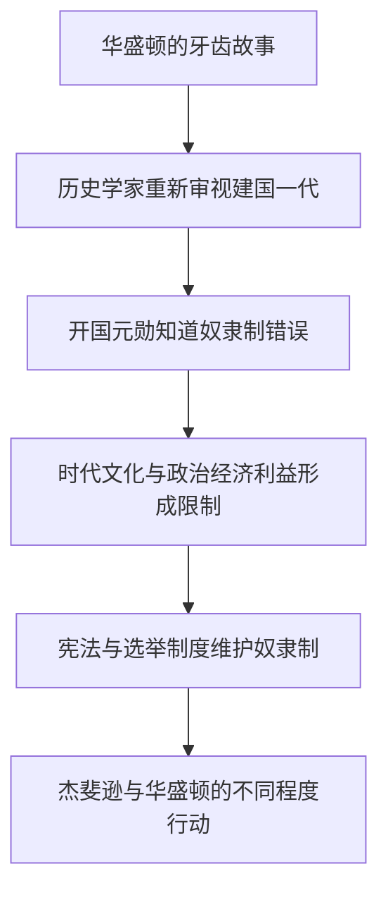

# George Washington, Slavery, and the Founding Fathers 精读笔记

## 背景

本文围绕美国建国先贤与奴隶制之间的复杂关系展开，重点讨论乔治·华盛顿和托马斯·杰斐逊在道德认识、政治现实与经济利益之间的矛盾。文章通过华盛顿使用奴隶牙齿这一细节切入，再结合DNA证据、宪法中的“五分之三”条款、路易斯安购地以及华盛顿遗嘱等材料，说明早期美国领导人虽然意识到奴隶制的错误，却很少真正采取行动反对它。

文章难度为考研英语阅读中等偏上，重点考查**历史论述中的转折、让步、因果关系**，以及长难句中的定语从句、宾语从句、非谓语和部分倒装。

> [!tip] **阅读主线**
> 文章并非简单评价某一位历史人物，而是揭示：个人的道德判断，常常受到时代文化、政治制度和经济利益的共同限制。

---

## 文章原文

# George Washington, Slavery, and the Founding Fathers

In 1784, five years before he became president of the United States, George Washington, 52, was nearly toothless.

So he hired a dentist to transplant nine teeth into his jaw—having extracted them from the mouths of his slaves.

> [!abstract]- 长难句分析
> **原句**：So he hired a dentist to transplant nine teeth into his jaw—having extracted them from the mouths of his slaves.
>
> **主干提取**：
> - 主语 S：he
> - 谓语 V：hired
> - 宾语 O：a dentist
> - 目的状语 A：to transplant nine teeth into his jaw
> - 伴随状语 A：having extracted them from the mouths of his slaves
>
> **修饰成分**：
>
> | 类型 | 引导词/形式 | 修饰对象 |
> |---|---|---|
> | 不定式短语 | to transplant... | 表示雇用牙医的目的 |
> | 完成式分词短语 | having extracted... | 表示牙齿被移植前已经完成的动作，逻辑主语是 dentist |
> | 介词短语 | into his jaw | 修饰 transplant，说明移植位置 |
> | 介词短语 | from the mouths of his slaves | 修饰 extracted，说明牙齿的来源 |
>
> **结构图解**：
> ```text
> 主句: he hired a dentist
>   ├── 目的状语: to transplant nine teeth into his jaw
>   │     └── 介词短语: into his jaw
>   └── 伴随状语: having extracted them from the mouths of his slaves
>         └── 介词短语: from the mouths of his slaves
> ```
>
> **参考译文**：因此，他雇用了一名牙医，将9颗牙齿移植到自己的颌骨中——这些牙齿此前是从他的奴隶口中拔出来的。
>
> **考点提示**：`to transplant` 是目的不定式；`having + 过去分词` 表示先于主句发生的动作。注意分词短语的逻辑主语通常与主句主语一致，但本句中 `having extracted` 的实际施动者应根据语义判断为 dentist。

That's a far different image from the cherry-tree-chopping George most people remember from their history books.

> [!abstract]- 长难句分析
> **原句**：That's a far different image from the cherry-tree-chopping George most people remember from their history books.
>
> **主干提取**：
> - 主语 S：That
> - 系动词 V：is
> - 表语 C：a far different image
> - 表语补充 C：from the cherry-tree-chopping George
>
> **修饰成分**：
>
> | 类型 | 引导词/形式 | 修饰对象 |
> |---|---|---|
> | 介词短语 | from the cherry-tree-chopping George | 补充说明 image 与什么形象不同 |
> | 复合形容词 | cherry-tree-chopping | 修饰 George，意为“砍樱桃树的” |
> | 省略关系从句 | most people remember from their history books | 修饰 George，完整形式可理解为 George whom/that most people remember... |
> | 介词短语 | from their history books | 修饰 remember，表示记忆来源 |
>
> **结构图解**：
> ```text
> 主句: That is a far different image
>   └── 介词短语: from the cherry-tree-chopping George
>         ├── 复合形容词: cherry-tree-chopping → 修饰 George
>         └── 省略关系从句: most people remember...
>               └── 介词短语: from their history books
> ```
>
> **参考译文**：这与大多数人在历史课本中记得的那个“砍樱桃树的乔治”形象大相径庭。
>
> **考点提示**：`George most people remember...` 是“名词 + 省略关系代词的定语从句”，`George` 在从句中作 `remember` 的宾语。`cherry-tree-chopping` 是由名词和现在分词构成的复合形容词，整体修饰 George。

But recently, many historians have begun to focus on the roles slavery played in the lives of the founding generation.

> [!abstract]- 长难句分析
> **原句**：But recently, many historians have begun to focus on the roles slavery played in the lives of the founding generation.
>
> **主干提取**：
> - 转折连词：But
> - 时间状语 A：recently
> - 主语 S：many historians
> - 谓语 V：have begun to focus
> - 介词宾语 O：the roles slavery played in the lives of the founding generation
>
> 宾语内部：
> - 核心名词：the roles
> - 定语从句：slavery played in the lives of the founding generation
>
> **修饰成分**：
>
> | 类型 | 引导词/形式 | 修饰对象 |
> |---|---|---|
> | 转折状语 | But | 与前文形成转折 |
> | 时间状语 | recently | 修饰 have begun，表示“最近” |
> | 不定式短语 | to focus on... | 作 begun 的补足成分，说明开始做什么 |
> | 省略关系代词的定语从句 | slavery played... | 修饰 roles，完整形式可理解为 roles that/which slavery played... |
> | 介词短语 | in the lives of the founding generation | 与 played 搭配，说明奴隶制发挥作用的范围 |
>
> **结构图解**：
> ```text
> 主句: many historians have begun to focus on the roles
>   ├── 转折状语: But
>   ├── 时间状语: recently
>   └── 定语从句: slavery played in the lives of the founding generation
>         └── 介词短语: in the lives of the founding generation
> ```
>
> **参考译文**：但是，最近许多历史学家开始关注奴隶制在建国一代人的生活中所扮演的角色。
>
> **考点提示**：`slavery played...` 是修饰 `roles` 的定语从句，关系代词在从句中作 `played` 的宾语而被省略；不要误把 `slavery` 识别为 `roles` 的同位语。`begin to do` 表示“开始做某事”，其中 `to focus on` 不是目的状语，而是 `begin` 的补足成分。

They have been spurred in part by DNA evidence made available in 1998, which almost certainly proved Thomas Jefferson had fathered at least one child with his slave Sally Hemings.

> [!abstract]- 长难句分析
> **原句**：They have been spurred in part by DNA evidence made available in 1998, which almost certainly proved Thomas Jefferson had fathered at least one child with his slave Sally Hemings.
>
> **主干提取**：
> - 主语 S：They
> - 谓语 V：have been spurred
> - 状语 A：in part
> - 介词宾语 O：DNA evidence
>
> 从句主干：
> - 主语 S：which
> - 谓语 V：proved
> - 宾语 O：Thomas Jefferson had fathered at least one child with his slave Sally Hemings
>
> **修饰成分**：
>
> | 类型 | 引导词/形式 | 修饰对象 |
> |---|---|---|
> | 被动语态 | have been spurred | 说明 historians 受到推动 |
> | 过去分词短语 | made available in 1998 | 修饰 DNA evidence |
> | 非限制性定语从句 | which... | 补充说明 DNA evidence 的作用 |
> | 宾语从句 | Thomas Jefferson had fathered... | 作 proved 的宾语 |
>
> **结构图解**：
> ```text
> 主句: They have been spurred by DNA evidence
>   ├── 状语: in part
>   ├── 定语: made available in 1998 → 修饰 DNA evidence
>   └── 非限制性定从: which proved...
>         └── 宾语从句: Thomas Jefferson had fathered one child...
> ```
>
> **参考译文**：这些历史学家在一定程度上受到了1998年公布的DNA证据的推动；该证据几乎可以确定，托马斯·杰斐逊与他的奴隶萨莉·海明斯至少生育过一个孩子。
>
> **考点提示**：`which` 引导非限制性定语从句，指代前面的 `DNA evidence`；`proved` 后面的完整句子是宾语从句，省略了连接词 `that`。`had fathered` 使用过去完成时，表示生育行为发生在“证据证明”之前。

And only over the past 30 years have scholars examined history from the bottom up.

> [!abstract]- 长难句分析
> **原句**：And only over the past 30 years have scholars examined history from the bottom up.
>
> **主干提取**：
> - 并列连词：And
> - 时间状语 A：only over the past 30 years
> - 主语 S：scholars
> - 谓语 V：have examined
> - 宾语 O：history
> - 方式/范围状语 A：from the bottom up
>
> **修饰成分**：
>
> | 类型 | 引导词/形式 | 修饰对象 |
> |---|---|---|
> | 并列连词 | And | 承接前文，补充说明历史研究的变化 |
> | 限制性时间状语 | only over the past 30 years | 限定 have examined 的时间范围 |
> | 方式状语 | from the bottom up | 修饰 examined，表示“自下而上地”研究 |
> | 部分倒装 | only + 状语置于句首 | 将助动词 have 提到主语 scholars 前 |
>
> **结构图解**：
> ```text
> 并列分句: And only over the past 30 years have scholars examined history
>   ├── 时间状语: only over the past 30 years
>   ├── 主语: scholars
>   ├── 谓语: have examined
>   ├── 宾语: history
>   └── 方式状语: from the bottom up
> ```
>
> **参考译文**：而且，直到过去30年，学者们才开始自下而上地研究历史。
>
> **考点提示**：`only + 状语` 位于句首时，主句使用部分倒装，即 `have scholars examined` 的语序；还原后是 `scholars have examined history only over the past 30 years`。`from the bottom up` 是固定表达，意为“自下而上地”，此处指从普通民众或社会底层的视角研究历史。

Works of several historians reveal the moral compromises made by the nation's early leaders and the fragile nature of the country's **infancy**. More significantly, they argue that many of the Founding Fathers knew slavery was wrong—and yet most did little to fight it.

> [!abstract]- 长难句分析
> **原句**：More significantly, they argue that many of the Founding Fathers knew slavery was wrong—and yet most did little to fight it.
>
> **主干提取**：
> - 状语 A：More significantly
> - 主语 S：they
> - 谓语 V：argue
> - 宾语 O：that many of the Founding Fathers knew slavery was wrong—and yet most did little to fight it
>
> 宾语从句内部：
> - 主语 S：many of the Founding Fathers
> - 谓语 V：knew
> - 宾语从句 O：slavery was wrong
>
> 转折分句：
> - 主语 S：most
> - 谓语 V：did little
> - 目的状语 A：to fight it
>
> **修饰成分**：
>
> | 类型 | 引导词/形式 | 修饰对象 |
> |---|---|---|
> | 句子状语 | More significantly | 修饰整个主句，表示递进强调 |
> | 宾语从句 | that... | 作 argue 的宾语 |
> | 宾语从句 | slavery was wrong | 作 knew 的宾语 |
> | 转折并列结构 | and yet | 连接前后两个分句，表示转折 |
> | 不定式短语 | to fight it | 表示行动目的 |
>
> **结构图解**：
> ```text
> 主句: they argue...
>   └── 宾语从句: many Founding Fathers knew...
>         └── 宾语从句: slavery was wrong
>   └── 转折分句: yet most did little
>         └── 目的状语: to fight it
> ```
>
> **参考译文**：更重要的是，他们认为，许多开国元勋知道奴隶制是错误的——然而大多数人却没有采取多少行动去反对它。
>
> **考点提示**：一个句子中连续出现多个宾语从句时，要根据谓语动词判断从句层级；`and yet` 表示“然而”，揭示“认识到错误”与“缺乏行动”之间的矛盾。`did little` 中的 `did` 是代动词，代替前文的实义动词，避免重复。

More than anything, the historians say, the founders were hampered by the culture of their time. While Washington and Jefferson privately expressed **distaste** for slavery, they also understood that it was part of the political and economic **bedrock** of the country they helped to create.

> [!abstract]- 长难句分析
> **原句**：While Washington and Jefferson privately expressed distaste for slavery, they also understood that it was part of the political and economic bedrock of the country they helped to create.
>
> **主干提取**：
> - 让步状语从句：While Washington and Jefferson privately expressed distaste for slavery
> - 主语 S：they
> - 谓语 V：understood
> - 宾语 O：that it was part of the political and economic bedrock of the country they helped to create
>
> 宾语从句内部：
> - 主语 S：it（指 slavery）
> - 系动词 V：was
> - 表语 C：part of the political and economic bedrock of the country they helped to create
>
> **修饰成分**：
>
> | 类型 | 引导词/形式 | 修饰对象 |
> |---|---|---|
> | 让步状语从句 | While... | 表示“虽然”私下厌恶奴隶制，但仍承认其重要性 |
> | 宾语从句 | that it was part... | 作 understood 的宾语 |
> | 介词短语 | of the political and economic bedrock | 修饰 part，说明所属关系 |
> | 介词短语 | of the country... | 修饰 bedrock，说明这一政治经济基础属于哪个国家 |
> | 省略关系代词的定语从句 | they helped to create | 修饰 country，完整形式可理解为 country that/which they helped to create |
>
> **结构图解**：
> ```text
> 让步状语从句: While Washington and Jefferson expressed distaste for slavery
> 主句: they understood...
>   └── 宾语从句: it was part of the political and economic bedrock
>         └── 介词短语: of the country...
>               └── 定语从句: they helped to create
> ```
>
> **参考译文**：华盛顿和杰斐逊虽然私下表达过对奴隶制的厌恶，但他们也明白，奴隶制是他们参与创建的这个国家赖以建立的政治和经济基础的一部分。
>
> **考点提示**：`while` 在句首引导让步状语从句，不能只理解为“当……时”。`understood that...` 后接宾语从句；在 `the country they helped to create` 中，关系代词被省略，`country` 是 `create` 的宾语。


For one thing, the South could not afford to part with its slaves. Owning slaves was “like having a large bank account,” says Wiencek, author of An Imperfect God: George Washington, His Slaves, and the Creation of America. The southern states would not have signed the **Constitution** without protections for the “peculiar institution,” including a clause that counted a slave as three fifths of a man for purposes of congressional representation.

> [!abstract]- 长难句分析
> **原句**：The southern states would not have signed the Constitution without protections for the “peculiar institution,” including a clause that counted a slave as three fifths of a man for purposes of congressional representation.
>
> **主干提取**：
> - 主语 S：The southern states
> - 谓语 V：would not have signed
> - 宾语 O：the Constitution
> - 条件/伴随状语 A：without protections for the “peculiar institution”
>
> **修饰成分**：
>
> | 类型 | 引导词/形式 | 修饰对象 |
> |---|---|---|
> | 虚拟条件结构 | without... | 表示缺少保护这一条件 |
> | 现在分词短语 | including a clause... | 补充说明 protections 的具体内容 |
> | 定语从句 | that counted... | 修饰 a clause |
> | 介词短语 | for purposes of congressional representation | 说明 counted 的目的或适用范围 |
>
> **结构图解**：
> ```text
> 主句: The southern states would not have signed the Constitution
>   └── 条件状语: without protections for the “peculiar institution”
>         └── 补充说明: including a clause
>               └── 定语从句: that counted a slave as three fifths of a man
>                     └── 介词短语: for purposes of congressional representation
> ```
>
> **参考译文**：如果没有对这种“特殊制度”的保护，南方各州就不会签署《宪法》；这些保护包括一项条款，即在计算国会代表人数时，一个奴隶按五分之三个人计算。
>
> **考点提示**：`would have signed` 构成与过去事实相反的虚拟语气；`without` 引导含蓄条件，相当于“if there had been no...”。`including` 是现在分词短语，补充说明前面 protections 的内容。

And the statesmen's political lives depended on slavery. The three-fifths formula handed Jefferson his narrow victory in the presidential election of 1800 by inflating the votes of the southern states in the Electoral College.

> [!abstract]- 长难句分析
> **原句**：The three-fifths formula handed Jefferson his narrow victory in the presidential election of 1800 by inflating the votes of the southern states in the Electoral College.
>
> **主干提取**：
> - 主语 S：The three-fifths formula
> - 谓语 V：handed
> - 间接宾语 O：Jefferson
> - 直接宾语 O：his narrow victory
> - 时间/范围状语 A：in the presidential election of 1800
> - 方式状语 A：by inflating the votes of the southern states in the Electoral College
>
> **修饰成分**：
>
> | 类型 | 引导词/形式 | 修饰对象 |
> |---|---|---|
> | 双宾语结构 | handed Jefferson his narrow victory | handed + 人 + 物，表示“使某人获得某物” |
> | 介词短语 | in the presidential election of 1800 | 修饰 victory，说明胜利发生的选举及时间 |
> | 介词短语 | of 1800 | 修饰 election |
> | 介词短语 | by inflating... | 表示取得胜利的方式或原因 |
> | 动名词短语 | inflating the votes... | 作 by 的宾语，说明“增加票数”这一行为 |
> | 介词短语 | in the Electoral College | 修饰 votes，说明选票所属的选举人团体系 |
>
> **结构图解**：
> ```text
> 主句: The three-fifths formula handed Jefferson his narrow victory
>   ├── 间接宾语: Jefferson
>   ├── 直接宾语: his narrow victory
>   │     └── 介词短语: in the presidential election of 1800
>   └── 方式状语: by inflating the votes...
>         └── 介词短语: in the Electoral College
> ```
>
> **参考译文**： “五分之三”条款通过增加南方各州在选举人团中的票数，使杰斐逊在1800年的总统选举中险胜。
>
> **考点提示**：`hand` 可接双宾语，结构为 `hand + 人 + 物`；`by + 动名词` 常表示“通过做某事”，说明方式或手段。`narrow victory` 中 `narrow` 表示“勉强的、险胜的”，不是“狭窄的”。

Once in office, Jefferson extended slavery with the Louisiana Purchase in 1803; the new land was carved into 13 states, including three slave states.

Still, Jefferson freed Hemings's children—though not Hemings herself or his approximately 150 other slaves. Washington, who had begun to believe that all men were created equal after observing the bravery of the black soldiers during the Revolutionary War, overcame the strong opposition of his relatives to grant his slaves their freedom in his will.

> [!abstract]- 长难句分析
> **原句**：Washington, who had begun to believe that all men were created equal after observing the bravery of the black soldiers during the Revolutionary War, overcame the strong opposition of his relatives to grant his slaves their freedom in his will.
>
> **主干提取**：
> - 主语 S：Washington
> - 谓语 V：overcame
> - 宾语 O：the strong opposition of his relatives
> - 目的状语 A：to grant his slaves their freedom in his will
>
> 定语从句内部：
> - 主语 S：who（指 Washington）
> - 谓语 V：had begun to believe
> - 宾语从句 O：that all men were created equal
> - 时间状语 A：after observing the bravery of the black soldiers during the Revolutionary War
>
> **修饰成分**：
>
> | 类型 | 引导词/形式 | 修饰对象 |
> |---|---|---|
> | 非限制性定语从句 | who... | 补充说明 Washington 的思想变化 |
> | 宾语从句 | that all men were created equal | 作 believe 的宾语 |
> | 时间状语从句省略结构 | after observing... | 表示开始相信的时间背景 |
> | 不定式短语 | to grant... | 表示克服反对的目的或结果 |
> | 双宾语结构 | grant his slaves their freedom | grant + 人 + 物，表示“给予某人某物” |
>
> **结构图解**：
> ```text
> 主句: Washington overcame the opposition
>   ├── 非限制性定从: who had begun to believe...
>   │     ├── 宾语从句: all men were created equal
>   │     └── 时间状语: after observing the bravery...
>   └── 目的状语: to grant his slaves their freedom in his will
> ```
>
> **参考译文**：华盛顿在观察到黑人士兵在独立战争中的英勇表现后，开始相信人人生而平等；后来，他克服了亲属们的强烈反对，在遗嘱中给予自己的奴隶自由。
>
> **考点提示**：`who` 引导非限制性定语从句，不能用 `that` 替换；`after observing` 是省略了主语和系动词的时间状语结构，其逻辑主语与 Washington 一致。`grant his slaves their freedom` 是典型的“动词 + 间接宾语 + 直接宾语”结构。

Only a decade earlier, such an act would have required legislative approval in Virginia.

## Questions

### 36.

George Washington's dental surgery is mentioned to ____.

- [A] show the primitive medical practice in the past
- [B] demonstrate the cruelty of slavery in his days
- [C] stress the role of slaves in the U.S. history
- [D] reveal some unknown aspect of his life

### 37.

We may infer from the second paragraph that ____.

- [A] DNA technology has been widely applied to history research
- [B] in its early days the U.S. was confronted with delicate situations
- [C] historians deliberately made up some stories of Jefferson's life
- [D] political compromises are easily found throughout the U.S. history

### 38.

What do we learn about Thomas Jefferson?

- [A] His political view changed his attitude towards slavery.
- [B] His status as a father made him free the child slaves.
- [C] His attitude towards slavery was complex.
- [D] His affair with a slave stained his prestige.

### 39.

Which of the following is true according to the text?

- [A] Some Founding Fathers benefit politically from slavery.
- [B] Slaves in the old days did not have the right to vote.
- [C] Slave owners usually had large savings accounts.
- [D] Slavery was regarded as a peculiar institution.

### 40.

Washington's decision to free slaves originated from his ____.

- [A] moral considerations
- [B] military experience
- [C] financial conditions
- [D] political stand

---

## 翻译对照

# George Washington, Slavery, and the Founding Fathers

## 乔治·华盛顿、奴隶制与美国建国先贤

In 1784, five years before he became president of the United States, George Washington, 52, was nearly toothless. So he hired a dentist to transplant nine teeth into his jaw—having extracted them from the mouths of his slaves.

1784年，乔治·华盛顿52岁，距离他成为美国总统还有五年，当时他几乎已经没有牙齿了。因此，他雇用了一名牙医，将9颗牙齿移植到自己的颌骨中——这些牙齿是从他的奴隶口中拔出来的。

That's a far different image from the cherry-tree-chopping George most people remember from their history books. But recently, many historians have begun to focus on the roles slavery played in the lives of the founding generation. They have been spurred in part by DNA evidence made available in 1998, which almost certainly proved Thomas Jefferson had fathered at least one child with his slave Sally Hemings. And only over the past 30 years have scholars examined history from the bottom up. Works of several historians reveal the moral compromises made by the nation's early leaders and the fragile nature of the country's infancy. More significantly, they argue that many of the Founding Fathers knew slavery was wrong—and yet most did little to fight it.

这与大多数人在历史课本中记得的那个“砍樱桃树的乔治”形象大相径庭。不过，近来许多历史学家开始关注奴隶制在美国建国一代人的生活中所扮演的角色。这在一定程度上是受到1998年公布的DNA证据的推动；这些证据几乎可以确定，托马斯·杰斐逊与他的奴隶萨莉·海明斯至少生育过一个孩子。而且，直到过去30年，学者们才开始自下而上地研究历史。几位历史学家的著作揭示了美国早期领导人所作出的道德妥协，以及这个国家幼年时期的脆弱性。更重要的是，他们认为，许多开国元勋知道奴隶制是错误的——然而其中大多数人却没有采取多少行动去反对它。

More than anything, the historians say, the founders were hampered by the culture of their time. While Washington and Jefferson privately expressed distaste for slavery, they also understood that it was part of the political and economic bedrock of the country they helped to create.

历史学家们说，最重要的是，建国者们受到了他们所处时代文化的束缚。华盛顿和杰斐逊虽然私下表达过对奴隶制的厌恶，但他们也明白，奴隶制是他们参与创建的这个国家赖以建立的政治和经济基础的一部分。

For one thing, the South could not afford to part with its slaves. Owning slaves was “like having a large bank account,” says Wiencek, author of An Imperfect God: George Washington, His Slaves, and the Creation of America. The southern states would not have signed the Constitution without protections for the “peculiar institution,” including a clause that counted a slave as three fifths of a man for purposes of congressional representation.

首先，南方没有能力放弃自己的奴隶。著有《不完美的上帝：乔治·华盛顿、他的奴隶与美国的创建》一书的温塞克说，拥有奴隶“就像拥有一个巨额银行账户”。如果没有对这种“特殊制度”的保护——其中包括一项规定：在计算国会代表人数时，一个奴隶按五分之三个人计算——南方各州就不会签署《宪法》。

And the statesmen's political lives depended on slavery. The three-fifths formula handed Jefferson his narrow victory in the presidential election of 1800 by inflating the votes of the southern states in the Electoral College. Once in office, Jefferson extended slavery with the Louisiana Purchase in 1803; the new land was carved into 13 states, including three slave states.

而且，这些政治家的政治生涯依赖于奴隶制。“五分之三”条款通过增加南方各州在选举人团中的票数，使杰斐逊在1800年的总统选举中险胜。杰斐逊上任后，又通过1803年的路易斯安购地扩张了奴隶制；这片新土地被划分为13个州，其中包括3个蓄奴州。

Still, Jefferson freed Hemings's children—though not Hemings herself or his approximately 150 other slaves. Washington, who had begun to believe that all men were created equal after observing the bravery of the black soldiers during the Revolutionary War, overcame the strong opposition of his relatives to grant his slaves their freedom in his will. Only a decade earlier, such an act would have required legislative approval in Virginia.

尽管如此，杰斐逊还是释放了海明斯的孩子们——但没有释放海明斯本人，也没有释放他大约150名其他奴隶。华盛顿在观察到黑人士兵在独立战争中的英勇表现后，开始相信人人生而平等；他克服亲属们的强烈反对，在遗嘱中给予自己的奴隶自由。仅仅早十年，这样的行为在弗吉尼亚州还需要得到立法机构的批准。

## Questions

## 题目

### 36.

George Washington's dental surgery is mentioned to ____.

提到乔治·华盛顿的牙科手术是为了____。

- [A] show the primitive medical practice in the past
  展示过去原始的医疗实践
- [B] demonstrate the cruelty of slavery in his days
  说明他那个时代奴隶制的残酷
- [C] stress the role of slaves in the U.S. history
  强调奴隶在美国历史中的作用
- [D] reveal some unknown aspect of his life
  揭示他生活中某些不为人知的方面

### 37.

We may infer from the second paragraph that ____.

从第二段中我们可以推断出____。

- [A] DNA technology has been widely applied to history research
  DNA技术已经广泛应用于历史研究
- [B] in its early days the U.S. was confronted with delicate situations
  美国早期曾面临微妙而棘手的局面
- [C] historians deliberately made up some stories of Jefferson's life
  历史学家故意编造了一些关于杰斐逊生活的故事
- [D] political compromises are easily found throughout the U.S. history
  政治妥协在美国历史中随处可见

### 38.

What do we learn about Thomas Jefferson?

关于托马斯·杰斐逊，我们了解到什么？

- [A] His political view changed his attitude towards slavery.
  他的政治观点改变了他对奴隶制的态度。
- [B] His status as a father made him free the child slaves.
  他作为父亲的身份促使他释放了儿童奴隶。
- [C] His attitude towards slavery was complex.
  他对奴隶制的态度是复杂的。
- [D] His affair with a slave stained his prestige.
  他与一名奴隶的风流关系玷污了他的声望。

### 39.

Which of the following is true according to the text?

根据文章，下列哪项是正确的？

- [A] Some Founding Fathers benefit politically from slavery.
  一些开国元勋从奴隶制中获得了政治利益。
- [B] Slaves in the old days did not have the right to vote.
  过去的奴隶没有投票权。
- [C] Slave owners usually had large savings accounts.
  奴隶主通常拥有巨额储蓄账户。
- [D] Slavery was regarded as a peculiar institution.
  奴隶制被视为一种特殊制度。

### 40.

Washington's decision to free slaves originated from his ____.

华盛顿释放奴隶的决定源于他的____。

- [A] moral considerations
  道德考量
- [B] military experience
  军事经历
- [C] financial conditions
  财务状况
- [D] political stand
  政治立场

---

## 语法要点

# 部分倒装（Partial Inversion）完全攻略

部分倒装是指将助动词、情态动词或 be 动词置于主语之前，使句子局部呈现一般疑问句语序。考研中常由**否定/半否定词**、**Only + 状语**等结构触发。

### 核心倒装公式

> [!note] **基本公式**
> **【否定词 / Only + 状语】+ 【助动词 / 情态动词 / be 动词】+ 主语 + 动词原形/其他**

若句中没有助动词、情态动词或 be 动词，必须借助 `do / does / did` 完成倒装。

### 否定/半否定词置于句首

#### 常见否定词清单

| 类别 | 词汇 | 含义 |
|---|---|---|
| **半否定副词** | hardly, scarcely, barely | 几乎不 |
| **频度副词** | seldom, rarely | 很少 |
| **程度副词** | little | 几乎没有 |
| **纯否定词** | never | 从不 |
| **并列否定词** | neither, nor | 也不 |

#### 倒装规则：助动词处理

| 句中原有动词 | 倒装方法 |
|---|---|
| 有助动词 / 情态动词 / be 动词 | 直接提到主语前 |
| 只有实义动词 | **必须借助 do / does / did** 提前 |

> [!warning] **实义动词不能直接倒装**
> 只有实义动词时，不能写成“否定词 + 实义动词 + 主语”，而要借助 `do / does / did`。

| 正常语序 | 倒装语序（✅ 正确） | 错误写法（❌ 必避） |
|---|---|---|
| I knew little about the plan. | **Little did I know** about the plan. | ~~Little knew I...~~ |
| He seldom comes late. | **Seldom does he come** late. | ~~Seldom comes he...~~ |

### 高频固定句型：一……就……

> [!tip] **完形/语法填空必考固定搭配**
> `hardly` 配 `when`，`no sooner` 配 `than`，二者不能混搭。

| 句型 | 结构 | 时间搭配 |
|---|---|---|
| **Hardly... when...** | Hardly had + 主语 + done... **when** + 主语 + did... | 前面分句用**过去完成时** |
| **No sooner... than...** | No sooner had + 主语 + done... **than** + 主语 + did... | 前面分句用**过去完成时** |

- **Hardly had** he entered the room **when** the phone rang.

  他**刚一**进房间，电话就响了。

- **No sooner had** she finished the speech **than** the audience applauded.

  她**刚一**结束演讲，观众就鼓掌了。

> [!warning] **搭配锁死**
> `hardly` 配 `when`，`no sooner` 配 `than`；混搭即错。前面的倒装分句必须使用过去完成时 `had done`。

### Only + 状语置于句首

#### 三种 Only 倒装结构

| 结构 | 例句 | 翻译 |
|---|---|---|
| **Only + 副词** 在句首 | Only then **did I realize** how important health is. | 直到那时我才意识到健康有多重要。 |
| **Only + 介词短语** 在句首 | Only in this way **can you** improve your English. | 只有通过这种方式你才能提高英语。 |
| **Only + 状语从句** 在句首 | Only when you finish your homework **can you** go out to play. | 只有当你完成作业时，你才能出去玩。 |

#### “主倒从不倒”黄金法则

> [!tip] **Only + 状语从句**
> - ✅ `Only` 后面的状语从句保持正常语序。
> - ✅ 主句进行部分倒装。

```text
Only when you finish your homework | can you go out to play.
       └── 从句（不倒装） ──┘     └──── 主句（倒装） ────┘
```

> [!note] **与本文例句联动**
> `And only over the past 30 years have scholars examined history from the bottom up.` 使用的是 `Only + 时间状语` 置于句首，主句部分倒装；可结合 [[intermediate/2008-passage4-topic/formatted-article.md]] 中的长难句分析复习。

### 避坑：Only + 主语不倒装

> [!warning] **只有 Only 修饰状语才倒装；修饰主语时绝不能倒装。**

| 情况 | 处理方式 | 例句 |
|---|---|---|
| Only 修饰**状语** | ✅ 必须倒装 | Only **then** did I realize... |
| Only 修饰**主语** | ❌ **绝对不倒装** | Only you can solve this problem.（只有你能解决这个问题。） |

### 避坑：否定介词短语置于句首

下列否定介词短语放在句首时，同样必须使用部分倒装：

| 短语 | 含义 |
|---|---|
| Under no circumstances | 在任何情况下都不 |
| In no case | 决不 |
| At no time | 决不 |
| By no means | 绝不 |
| On no account | 绝不 |

- **Under no circumstances** should you give up.

  在任何情况下你都不应该放弃。

- **By no means** should we look down on others.

  我们绝不应该看不起别人。

### 避坑：Hardly / No sooner 的时态锁死

> [!warning] **前面分句必须用过去完成时（had done）**
> 不论是 `Hardly...when...` 还是 `No sooner...than...`，前置分句都使用 `had done`。

| 错误写法（❌） | 正确写法（✅） |
|---|---|
| ~~Hardly he entered...~~ | **Hardly had he entered**... |
| ~~No sooner she finished...~~ | **No sooner had she finished**... |

### 综合联动复习

- **否定词倒装 ↔ Only + 状语倒装**：两者都遵循“触发成分置于句首，助动词提前”的原则；区别在于 `Only + 主语` 不触发倒装。
- **Only + 时间状语 ↔ 部分倒装**：`only over the past 30 years` 与 `Only then`、`Only in this way` 同属 Only 修饰状语的结构。
- **Hardly...when... ↔ No sooner...than...**：二者都表示“刚……就……”，都要求前置分句使用过去完成时，但搭配词不同。
- **否定介词短语 ↔ 否定副词**：`Under no circumstances`、`By no means` 与 `never`、`seldom` 一样，置于句首时都要求部分倒装。

### 记忆口诀

> **“否定 Only 站句首，助动提前变疑问；**
> **实义动词加 do/did；**
> **Hardly when，No sooner than；**
> **从句不倒主句倒；**
> **Only 修主别乱动！”**

### 速查总表

| 触发条件 | 是否倒装 | 关键标志 |
|---|---|---|
| 否定副词在句首 | ✅ 必须倒装 | never, seldom, hardly, little... |
| Only + 状语在句首 | ✅ 必须倒装 | Only then / in this way / when... |
| Only + 主语在句首 | ❌ **不倒装** | Only you / he / the teacher... |
| 否定介词短语在句首 | ✅ 必须倒装 | Under no circumstances, By no means... |
| Hardly / No sooner 在句首 | ✅ 过去完成时倒装 | had + 主语 + done |

### 一句话终极总结

> **“否定 Only 提前必倒装，助动提前实义加 do；**
> **Hardly/Scarcely when，No sooner than；**
> **从句不倒主句倒，Only 修主是例外！”**

---

## 生词表

| 词汇 | 词性 | 含义 | 原文例句 |
|---|---|---|---|
| **bedrock** | n. | 基础；根基 | While Washington and Jefferson privately expressed distaste for slavery, they also understood that it was part of the political and economic **bedrock** of the country they helped to create. |
| **Constitution** | n. | 宪法 | The southern states would not have signed the **Constitution** without protections for the “peculiar institution.” |
| **distaste** | n. | 厌恶；反感 | While Washington and Jefferson privately expressed **distaste** for slavery, they also understood that it was part of the political and economic bedrock of the country they helped to create. |
| **infancy** | n. | 初期；幼年期 | Works of several historians reveal the moral compromises made by the nation's early leaders and the fragile nature of the country's **infancy**. |

### 生词练习

**一、选词填空**

从方框中选择合适的词汇填入空白处（本组词汇可重复使用）：

> **bedrock** / **Constitution** / **distaste** / **infancy**

1. Trust is the ________ of a successful long-term relationship.

2. The country was still in its economic ________ when the new policy was introduced.

3. She expressed strong ________ for corruption in public office.

4. The rights are protected by the national ________.

5. Family support can become the emotional ________ of a person’s development.

6. The organization’s ________ was marked by rapid growth and uncertainty.

7. His visible ________ for violence made his position clear.

8. The amendment was added to the ________ after a long debate.

> [!abstract]- 答案
> 1. **bedrock**（基础；根基）
> 2. **infancy**（初期；幼年期）
> 3. **distaste**（厌恶；反感）
> 4. **Constitution**（宪法）
> 5. **bedrock**（基础；根基）
> 6. **infancy**（初期；幼年期）
> 7. **distaste**（厌恶；反感）
> 8. **Constitution**（宪法）

**二、短语翻译**

将下列短语翻译成中文：

1. the political and economic bedrock of a country
2. from the bottom up
3. the fragile nature of a country's infancy

> [!abstract]- 答案
> 1. **the political and economic bedrock of a country** = 一个国家的政治和经济基础
> 2. **from the bottom up** = 自下而上地；从社会底层开始
> 3. **the fragile nature of a country's infancy** = 一个国家初创时期的脆弱性

**三、语境理解**

根据上下文，选择括号中粗体词的正确含义：

1. “Works of several historians reveal ... the fragile nature of the country's **infancy**.” 中 **infancy** 的含义是：
   - A. 婴儿的身体状况
   - B. 国家的初创时期
   - C. 人口增长阶段
   - D. 经济成熟阶段

2. “the political and economic **bedrock** of the country” 中 **bedrock** 的含义是：
   - A. 地下岩层
   - B. 建筑材料
   - C. 政治和经济基础
   - D. 自然资源

3. “privately expressed **distaste** for slavery” 中 **distaste** 的含义是：
   - A. 对奴隶制的厌恶
   - B. 对奴隶制的支持
   - C. 对奴隶制的无知
   - D. 对奴隶制的恐惧

> [!abstract]- 答案
> 1. **B** — `infancy` 在这里是比喻用法，指国家发展的早期、初创阶段。
> 2. **C** — `bedrock` 的核心义是“基岩”，引申为不可或缺的基础或根基。
> 3. **A** — `distaste` 表示强烈的不喜欢或厌恶，符合华盛顿和杰斐逊私下的态度。

---

## 心得

### 1. 抓住转折关系

文章多次使用 `But`、`While`、`Still`、`yet` 等词推进论证。尤其要注意：作者不是说华盛顿和杰斐逊完全支持奴隶制，而是强调他们在私下厌恶奴隶制的同时，又承认奴隶制是国家政治和经济基础的一部分。

> [!warning] **转折后常是命题重点**
> 看到 `While...`、`and yet`、`Still` 等结构时，应重点关注前后观点的差异，以及作者真正想强调的结论。

### 2. 关注具体事例背后的论点

第一段的牙齿故事并不是为了介绍过去医疗技术，而是通过一个反常、具体的细节，揭示奴隶在美国历史和建国先贤生活中的真实存在。做细节题时，应结合后文判断例子在全文论证中的功能。

### 3. 熟悉部分倒装的识别方法

`And only over the past 30 years have scholars examined history from the bottom up.` 中，`only + 时间状语` 位于句首，触发主句部分倒装。还原语序是：`scholars have examined history only over the past 30 years`。

> [!tip] **倒装识别三步法**
> 1. 先找句首的否定词或 `Only + 状语`。
> 2. 再确认提前的是助动词、情态动词还是 be 动词。
> 3. 将主语和谓语恢复为正常语序，再判断句意。

### 4. 警惕熟词生义和结构误判

- `bedrock` 不是“床岩”，而是“基础、根基”。
- `narrow victory` 不是“狭窄的胜利”，而是“险胜、勉强获胜”。
- `from the bottom up` 表示“自下而上地”，指从普通民众或社会底层的视角研究历史。
- `hand + 人 + 物` 表示“把某物交给某人”或“使某人获得某物”。

### 5. 文章论证结构



---

## 延伸

- 复习 [[intermediate/2008-passage4-topic/grammar-notes.md]] 中的部分倒装、`Hardly...when...` 和 `No sooner...than...`。
- 对比学习美国早期政治中的**奴隶制、宪法妥协与联邦制度**。
- 继续积累历史议论文中的评价词：`moral compromise`、`political bedrock`、`fragile nature`、`privately express distaste`。
- 可进一步阅读关于美国建国先贤、奴隶制和废奴运动的英文历史短文，训练复杂背景下的作者态度判断。

---

## 思考题

1. 第一段为什么选择华盛顿的牙齿故事作为开头？它在全文中承担什么论证功能？
2. 文章如何解释开国元勋“知道奴隶制错误”却“很少采取行动”的矛盾？
3. `While Washington and Jefferson privately expressed distaste for slavery...` 中的 `While` 表达时间关系还是让步关系？为什么？
4. “五分之三”条款如何影响1800年的总统选举？
5. 华盛顿释放奴隶的决定主要源于道德考虑、军事经历、经济状况还是政治立场？请结合原文说明理由。

---

## 相关笔记

- [[intermediate/2008-passage4-topic/formatted-article.md]]
- [[intermediate/2008-passage4-topic/translation.md]]
- [[intermediate/2008-passage4-topic/grammar-notes.md]]
