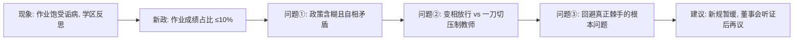

# 2012 Passage 1 精读笔记

---

## 背景

本文选自 **2012 年考研英语阅读理解 Passage 1**，主题是**洛杉矶联合学区（L. A. Unified）的作业新政**。文章批评该学区出台了一项"一刀切"的僵化政策——规定除少数高级课程外，作业在学业成绩中所占比重不得超过 10%——并指出这项政策不仅自相矛盾，而且完全没有触及家庭作业真正棘手的问题。

> [!abstract] 文章概要
> 文章采用"现象引入 → 政策概述 → 政策的问题①（含糊矛盾）→ 问题②（纵容与一刀切）→ 问题③（回避根本问题）→ 建议（暂缓执行 + 公开听证）"的论证结构。作者对 L. A. Unified 的新政持**明确批评**态度，属于典型的"问题—批驳—建议"型议论文。理解这种层层递进的结构有助于快速锁定主旨题与态度题。

- **文章来源**：2012 年考研英语真题，Reading Comprehension Passage 1
- **核心主题**：作业政策、教育公平、学区管理与"一刀切"式改革
- **文章难度**：intermediate
- **体裁**：议论文（问题—批驳—建议）
- **题源出处**：源自 2012 年考研英语（一）真题 Text 1，原文改编自 *Los Angeles Times* 评论文章

---

## 文章原文

# The L.A. Unified Homework Policy

Homework has never been terribly popular with students and even many parents, but in recent years it has been particularly **scorned**. School **districts** across the country, most recently Los Angeles Unified, are **revising** their thinking on this educational **ritual**.

Unfortunately, L. A. Unified has produced an **inflexible policy** which **mandates** that with the exception of some advanced courses, homework may no longer count for more than 10% of a student's **academic grade**.

> [!abstract]- 长难句分析
> **原句**：Unfortunately, L. A. Unified has produced an **inflexible policy** which **mandates** that with the exception of some advanced courses, homework may no longer count for more than 10% of a student's **academic grade**.
>
> **主干提取**
> - 状语 A: Unfortunately
> - 主语 S: L. A. Unified（洛杉矶联合学区）
> - 谓语 V: has produced（已出台）
> - 宾语 O: an inflexible policy（一项僵化的政策）
> - 定语从句（修饰 O）: which mandates that ... academic grade
>
> **修饰成分**：
>
> | 修饰成分 | 类型 | 引导词 | 修饰对象 |
> |------|------|--------|----------|
> | which mandates that ... academic grade | 定语从句 | which | an inflexible policy |
> | that with the exception ... academic grade | 名词性从句（宾语从句） | that | mandates 的宾语 |
> | with the exception of some advanced courses | 介词短语（宾语从句内状语） | with | may no longer count 的让步限定条件 |
> | no longer | 否定副词 | — | count，表示“不再” |
> | for more than 10% of a student's academic grade | 介词短语 | for | count，说明所占比例 |
>
> **结构图解**：
> ```
> 主句: L. A. Unified has produced an inflexible policy
>   └── 定语从句: which mandates [宾语从句]
>         └── 宾语从句: homework may no longer count for more than 10%...
>               ├── 插入状语: with the exception of some advanced courses
>               ├── 主语: homework
>               └── 谓语 + 比例状语: may no longer count for more than 10% of a student's academic grade
> ```
>
> **参考译文**：不幸的是，洛杉矶联合学区出台了一项僵化的政策，规定除一些高级课程之外，作业在学生的学业成绩中所占比重不得超过 10%。
>
> **考点提示**：which 引导定语从句修饰 policy，其谓语 mandates 后接 that 宾语从句，形成“定语从句套宾语从句”的双层嵌套；宾语从句中 with the exception of ... 插入主谓之间，阅读时可先跳过；count for 意为“（在……中）占比例、算数”。

This rule is meant to address the difficulty that students from **impoverished** or **chaotic** homes might have in completing their homework. But the policy is **unclear** and **contradictory**.

Certainly, no homework should be assigned that students cannot complete on their own or that they cannot do without expensive equipment.

> [!abstract]- 长难句分析
> **原句**：Certainly, no homework should be assigned that students cannot complete on their own or that they cannot do without expensive equipment.
>
> **主干提取**
> - 状语 A: Certainly
> - 主语 S: no homework
> - 谓语 V: should be assigned（被动语态）
> - 分隔后置定语从句（修饰 S，被谓语隔开）: that students cannot complete on their own or that they cannot do without expensive equipment
>
> **修饰成分**：
>
> | 修饰成分 | 类型 | 引导词 | 修饰对象 |
> |------|------|--------|----------|
> | that students cannot complete on their own | 定语从句（与先行词被谓语分隔） | that | homework（同时作 complete 的逻辑宾语） |
> | on their own | 固定介词短语（方式状语） | on | complete，意为“独立地” |
> | or that they cannot do without expensive equipment | 并列定语从句 | or + that | homework（与前一从句并列，作 do 的逻辑宾语） |
> | without expensive equipment | 介词短语 | without | do，表示“没有……的情况下” |
>
> **结构图解**：
> ```
> 主句: no homework should be assigned
>   ├── 状语: Certainly
>   └── 后置定语从句（分隔定语，修饰 homework）:
>         ├── that students cannot complete on their own
>         └── or that they cannot do without expensive equipment
> ```
>
> **参考译文**：当然，任何学生无法独立完成、或没有昂贵设备就完不成的作业，本来就不应该布置。
>
> **考点提示**：that 引导的定语从句修饰主语 no homework，却被谓语 should be assigned 隔开，构成“分隔定语从句”，理解时应把从句还原到先行词 homework 之后；两个 that 定语从句由 or 并列；without expensive equipment 是介词短语作状语修饰 do，表示“没有昂贵设备（就完不成）”，do 的宾语是前面的 that（指 homework），不要把 do without 误当作固定短语。

But if the district is essentially **giving a pass** to students who do not do their homework because of complicated family lives, it is going riskily close to the **implication** that standards need to be lowered for poor children.

> [!abstract]- 长难句分析
> **原句**：But if the district is essentially **giving a pass** to students who do not do their homework because of complicated family lives, it is going riskily close to the **implication** that standards need to be lowered for poor children.
>
> **主干提取**
> - 条件状语从句 A: if the district is essentially giving a pass to students
> - 主句主语 S: it（指代前面这种“放行”做法）
> - 主句谓语 V: is going（变得）
> - 主句补语 C: close to the implication（形容词短语，作表语）
> - 副词状语 A: riskily（修饰 close，意为“危险地”）
> - 同位语从句（修饰 implication）: that standards need to be lowered for poor children
>
> **修饰成分**：
>
> | 修饰成分 | 类型 | 引导词 | 修饰对象 |
> |------|------|--------|----------|
> | if the district is ... to students | 状语从句（条件） | if | 主句整体 |
> | essentially | 副词 | — | giving a pass |
> | who do not do their homework ... | 定语从句 | who | students |
> | because of complicated family lives | 介词短语（原因状语） | because of | do not do their homework |
> | that standards need to be lowered ... | 名词性从句（同位语从句） | that | the implication |
> | for poor children | 介词短语 | for | lowered，说明对象 |
>
> **结构图解**：
> ```
> 条件状语从句: if the district is essentially giving a pass to students
>   ├── 主语: the district
>   ├── 谓语: is giving
>   ├── 宾语: a pass
>   ├── 介短: to students
>   └── 定语从句: who do not do their homework because of complicated family lives
>         └── 原因状语: because of complicated family lives
> 主句: it is going riskily close to the implication
>   └── 同位语从句: that standards need to be lowered for poor children
> ```
>
> **参考译文**：但是，如果学区实际上是在对那些因家庭生活复杂而不做作业的学生“放行”，那就危险地接近于一种暗示：需要为贫困儿童降低标准。
>
> **考点提示**：句首 if 引导条件状语从句，内嵌 who 定语从句修饰 students，because of 是介词短语作原因状语而非从句；主句 is going close to ... 中 riskily 是副词，修饰形容词 close；句末 that 引导同位语从句，具体说明 implication 的内容，注意不要误判为定语从句。

District **administrators** say that homework will still be a part of schooling; teachers are allowed to **assign** as much of it as they want.

But with homework counting for no more than 10% of their grades, students can easily **skip** half their homework and see very little difference on their **report cards**.

> [!abstract]- 长难句分析
> **原句**：But with homework counting for no more than 10% of their grades, students can easily **skip** half their homework and see very little difference on their **report cards**.
>
> **主干提取**
> - 状语 A（with 复合结构）: with homework counting for no more than 10% of their grades
> - 主语 S: students
> - 谓语 V: can skip ... and (can) see（并列谓语，后者省略 can）
> - 宾语 O1: half their homework
> - 宾语 O2: very little difference
> - 状语 A: easily；on their report cards
>
> **修饰成分**：
>
> | 修饰成分 | 类型 | 引导词 | 修饰对象 |
> |------|------|--------|----------|
> | with homework counting for no more than 10% ... | with 复合结构（作原因/条件状语） | with | 主句 |
> | homework counting for ... | 名词 + 现在分词（逻辑主谓） | — | with 复合结构的内部：homework 为逻辑主语，counting 为逻辑谓语 |
> | for no more than 10% of their grades | 介词短语 | for | counting，说明所占比例 |
> | easily | 副词 | — | skip |
> | half their homework | 名词短语 | — | skip 的宾语，half 限定 homework |
> | on their report cards | 介词短语 | on | see，说明“在成绩单上” |
>
> **结构图解**：
> ```
> 状语（with 复合结构）: with homework counting for no more than 10% of their grades
>   ├── 逻辑主语: homework
>   └── 现在分词: counting for no more than 10% of their grades
> 主句: students can easily skip half their homework and (can) see very little difference
>   ├── 主语: students
>   ├── 并列谓语: can skip / (can) see
>   ├── 宾语1: half their homework
>   └── 宾语2: very little difference
>         └── 介短: on their report cards
> ```
>
> **参考译文**：但由于作业在成绩中所占比重不超过 10%，学生可以轻易地跳过一半作业，成绩单上却几乎看不出什么差别。
>
> **考点提示**：句首是 with + 名词 + 现在分词（counting）的复合结构作原因状语，其中 homework 是逻辑主语；no more than 表示“不超过、仅仅”，含“少”的倾向；and 连接两个并列谓语，第二个 (can) see 省略了情态动词 can。

Some students might do well on state tests without completing their homework, but what about the students who performed well on the tests and did their homework? It is quite possible that the homework helped.

Yet rather than **empowering** teachers to find what works best for their students, the policy **imposes** a flat, **across-the-board** rule.

> [!abstract]- 长难句分析
> **原句**：Yet rather than **empowering** teachers to find what works best for their students, the policy **imposes** a flat, **across-the-board** rule.
>
> **主干提取**
> - 状语 A（否定/对比）: Rather than empowering teachers to find what works best for their students
> - 主语 S: the policy
> - 谓语 V: imposes
> - 宾语 O: a flat, across-the-board rule
>
> **修饰成分**：
>
> | 修饰成分 | 类型 | 引导词 | 修饰对象 |
> |------|------|--------|----------|
> | Rather than empowering teachers ... | 介词短语（否定对比状语） | Rather than | 主句，意为“而不是……” |
> | to find what works best for their students | 非谓语（不定式，宾语补足语） | to | teachers，说明教师被赋权去做的事 |
> | what works best for their students | 名词性从句（宾语从句） | what | find 的宾语 |
> | for their students | 介词短语 | for | works best，说明受益对象 |
> | flat, across-the-board | 形容词（并列定语） | — | rule，强调规则“一律、一刀切” |
>
> **结构图解**：
> ```
> 状语（否定对比）: Rather than empowering teachers to find what works best for their students
>   ├── 动名词: empowering teachers
>   └── 不定式（宾补，修饰 teachers）: to find what works best for their students
>         └── 宾语从句: what works best for their students
>               └── 介短: for their students
> 主句: the policy imposes a flat, across-the-board rule
>   ├── 主语: the policy
>   ├── 谓语: imposes
>   └── 宾语: a flat, across-the-board rule
> ```
>
> **参考译文**：然而，这项政策并没有赋权给教师去摸索对学生最有效的做法，而是强加了一条僵化死板、一刀切的规定。
>
> **考点提示**：rather than 后接动名词 empowering，表示“而不是……”，否定的是主句动作的对立面；what 引导宾语从句作 find 的宾语；across-the-board 是带连字符的合成形容词，意为“全面的、一刀切的”，与 flat 并列修饰 rule。

At the same time, the policy addresses none of the truly **thorny** questions about homework. If the district finds homework to be unimportant to its students' academic achievement, it should move to reduce or **eliminate** the assignments, not make them count for almost nothing. **Conversely**, if homework **matters**, it should **account for** a significant portion of the grade.

Meanwhile, this policy does nothing to ensure that the homework students receive is **meaningful** or **appropriate** to their age and the subject, or that teachers are not assigning more than they are willing to review and correct.

> [!abstract]- 长难句分析
> **原句**：Meanwhile, this policy does nothing to ensure that the homework students receive is **meaningful** or **appropriate** to their age and the subject, or that teachers are not assigning more than they are willing to review and correct.
>
> **主干提取**
> - 状语 A: Meanwhile
> - 主语 S: this policy
> - 谓语 V: does
> - 宾语 O: nothing
> - 不定式（目的状语）: to ensure 后接两个并列的 that 宾语从句
> - 宾语从句1: the homework students receive is meaningful or appropriate to their age and the subject
> - 宾语从句2: teachers are not assigning more than they are willing to review and correct
>
> **修饰成分**：
>
> | 修饰成分 | 类型 | 引导词 | 修饰对象 |
> |------|------|--------|----------|
> | to ensure that ... or that ... | 非谓语（不定式，目的状语） | to | does nothing，说明“未能保证……” |
> | that the homework ... is meaningful ... | 名词性从句（宾语从句） | that | ensure 的宾语（从句1） |
> | (that) students receive | 定语从句（省略关系代词） | 省略 that | homework |
> | meaningful or appropriate to their age and the subject | 形容词短语（表语） | — | the homework，说明作业应具备的性质 |
> | appropriate to their age and the subject | 形容词 + 介词短语 | to | appropriate，说明“与……相称” |
> | that teachers are not assigning more ... | 名词性从句（宾语从句） | that | ensure 的宾语（从句2，与从句1并列） |
> | than they are willing to review and correct | 比较状语从句 | than | more，说明“超过愿意批改的量” |
>
> **结构图解**：
> ```
> 主句: this policy does nothing
>   ├── 状语: Meanwhile
>   └── 不定式目的状语: to ensure [宾语从句1] or [宾语从句2]
>         宾语从句1: the homework (that) students receive is meaningful or appropriate to their age and the subject
>           ├── 定语从句(省略that): students receive → 修饰 homework
>           └── 表语: meaningful / appropriate to their age and the subject
>         宾语从句2: teachers are not assigning more than they are willing to review and correct
>           └── 比较状语从句: than they are willing to review and correct
> ```
>
> **参考译文**：与此同时，这项政策也完全没有保证：学生所做的作业是有意义的、与其年龄和学科相称的，也没有保证教师布置的作业量不超过他们愿意批改的量。
>
> **考点提示**：to ensure 后接由 or 连接的两个 that 宾语从句，共同作 ensure 的宾语；第一个宾语从句中 homework 后省略了关系代词 that 的定语从句 students receive，阅读时应还原为 the homework (that) students receive；more than 是比较结构，此处 more 实指“更多的作业量”。

The homework rules should be **put on hold** while the **school board**, which is responsible for setting educational policy, looks into the matter and conducts **public hearings**.

> [!abstract]- 长难句分析
> **原句**：The homework rules should be **put on hold** while the **school board**, which is responsible for setting educational policy, looks into the matter and conducts **public hearings**.
>
> **主干提取**
> - 主语 S: The homework rules
> - 谓语 V: should be put（被动语态）
> - 主语补足语/固定短语 C: on hold（与 put 构成 put sth. on hold，意为“暂缓”）
> - 时间状语从句 A: while the school board looks into the matter and conducts public hearings
> - 从句主语 S: the school board
> - 从句谓语 V: looks into ... and conducts（并列谓语）
> - 从句宾语 O: the matter / public hearings
>
> **修饰成分**：
>
> | 修饰成分 | 类型 | 引导词 | 修饰对象 |
> |------|------|--------|----------|
> | while the school board ... public hearings | 状语从句（时间） | while | 主句，表示“在……期间” |
> | which is responsible for setting educational policy | 定语从句（非限制性） | which | the school board |
> | for setting educational policy | 介词短语 | for | responsible，说明“负责的内容” |
> | setting educational policy | 非谓语（动名词短语） | — | for 的宾语 |
> | looks into the matter and conducts public hearings | 并列谓语 | and | 从句主语 the school board |
>
> **结构图解**：
> ```
> 主句: The homework rules should be put on hold
>   ├── 主语: The homework rules
>   └── 谓语 + 固定短语: should be put on hold
> 时间状语从句: while the school board looks into the matter and conducts public hearings
>   ├── 主语: the school board
>   ├── 非限制性定语从句（插在主谓之间）: which is responsible for setting educational policy
>   └── 并列谓语: looks into the matter and conducts public hearings
> ```
>
> **参考译文**：在负责制定教育政策的学校董事会调查此事并举行公开听证会期间，这些作业规定应当暂缓执行。
>
> **考点提示**：while 引导时间状语从句；which 引导的非限制性定语从句插在从句主语 the school board 与谓语之间，造成主谓分隔，阅读时可先跳过这个插入的定语从句；put ... on hold 是固定搭配，意为“搁置、暂缓”；be responsible for 后接动名词 setting。

==It is not too late for L. A. Unified to do homework right.==

## Reading Comprehension Questions

### 21.

It is implied in Paragraph 1 that nowadays homework ____.

- **A.** is receiving more criticism
- **B.** is gaining more preferences
- **C.** is no longer an educational ritual
- **D.** is not required for advanced courses

### 22.

L. A. Unified has made the rule about homework mainly because poor students ____.

- **A.** tend to have moderate expectations for their education
- **B.** have asked for a different educational standard
- **C.** may have problems finishing their homework
- **D.** have voiced their complaints about homework

### 23.

According to Paragraph 3, one problem with the policy is that it may ____.

- **A.** result in students' indifference to their report cards
- **B.** undermine the authority of state tests
- **C.** restrict teachers' power in education
- **D.** discourage students from doing homework

### 24.

As mentioned in Paragraph 4, a key question unanswered about homework is whether ____.

- **A.** it should be eliminated
- **B.** it **counts** much in schooling
- **C.** it places extra burdens on teachers
- **D.** it is important for grades

### 25.

A suitable title for this text could be ____.

- **A.** A Faulty Approach to Homework
- **B.** A Welcomed Policy for Poor Students
- **C.** Thorny Questions about Homework
- **D.** Wrong Interpretations of an Educational Policy

---

## 翻译对照

# The L.A. Unified Homework Policy 洛杉矶联合学区的作业政策

Homework has never been terribly popular with students and even many parents, but in recent years it has been particularly **scorned**. School districts across the country, most recently Los Angeles Unified, are **revising** their thinking on this educational **ritual**. Unfortunately, L. A. Unified has produced an **inflexible policy** which **mandates** that with the exception of some advanced courses, homework may no longer count for more than 10% of a student's **academic grade**.

家庭作业从来就不太受学生甚至许多家长的欢迎，但近年来它尤其备受**诟病**。全国各地的学区——最近的是洛杉矶联合学区——都在**反思**这一教育**惯例**。不幸的是，洛杉矶联合学区出台了一项**僵化的政策**，**规定**除某些高级课程外，家庭作业在学生的**学业成绩**中所占比重不得超过 10%。

> [!note] 翻译说明
> **count for** 表示“（在……中）占比重、有意义”，如 `count for nothing` = “毫无价值”；**academic grade** 指“学业成绩/课程分数”，不要译成“年级”。

This rule is meant to address the difficulty that students from **impoverished** or **chaotic** homes might have in completing their homework. But the policy is **unclear** and **contradictory**. Certainly, no homework should be assigned that students cannot complete on their own or that they cannot do without expensive equipment. But if the district is essentially **giving a pass** to students who do not do their homework because of complicated family lives, it is going riskily close to the **implication** that standards need to be lowered for poor children.

这项规定意在解决来自**贫困**或**混乱**家庭的学生在完成家庭作业时可能遇到的困难。但这项政策**含糊不清**，而且**自相矛盾**。诚然，不应该布置学生无法独立完成、或没有昂贵设备就无法完成的作业。但如果学区实际上是在**放过**那些因家庭生活复杂而不完成作业的学生，那就危险地接近于一种**暗示**：需要为穷人家的孩子降低标准。

> [!note] 翻译说明
> **give sb. a pass** 原指在考试或关卡处“给某人放行/免于追究”，此处指学区对不做作业的学生不加约束；句中暗含批评：这种做法近乎承认“贫困生可以享受更低标准”。

District **administrators** say that homework will still be a part of schooling; teachers are allowed to **assign** as much of it as they want. But with homework counting for no more than 10% of their grades, students can easily **skip** half their homework and see very little difference on their **report cards**. Some students might do well on state tests without completing their homework, but what about the students who performed well on the tests and did their homework? It is quite possible that the homework helped. Yet rather than **empowering** teachers to find what works best for their students, the policy **imposes** a flat, **across-the-board** rule.

学区**管理者**称，家庭作业仍将是学校教育的一部分；教师可以随心所欲地**布置**尽可能多的作业。但由于作业在成绩中所占比重不超过 10%，学生可以轻易地**跳过**一半作业，而成绩单上几乎看不出任何差别。有些学生不完成作业也能在州考中取得好成绩，但那些考得不错又完成了作业的学生又怎么说呢？作业很可能确实起了作用。然而，这项政策非但没有**赋权**给教师去摸索对学生最有效的做法，反而**强加**了一条固定不变、**一刀切**的规定。

> [!note] 翻译说明
> **across-the-board** 意为“全面的、一律适用的”，与 **flat**（无差别的）叠加，强调政策“一刀切”、缺乏灵活性；**state tests** 指美国的州级统一考试。

At the same time, the policy addresses none of the truly **thorny** questions about homework. If the district finds homework to be unimportant to its students' academic achievement, it should move to reduce or **eliminate** the assignments, not make them count for almost nothing. **Conversely**, if homework matters, it should **account for** a significant portion of the grade. Meanwhile, this policy does nothing to ensure that the homework students receive is **meaningful** or **appropriate** to their age and the subject, or that teachers are not assigning more than they are willing to review and correct.

与此同时，这项政策完全没有触及有关家庭作业的那些真正**棘手**的问题。如果学区认为家庭作业对学生的学业成绩并不重要，就应该着手减少甚至**取消**作业，而不是让它们几乎毫无分量。**反之**，如果作业很重要，它就应该在成绩中**占**相当大的比重。此外，这项政策丝毫未能保证学生所做的作业是**有意义**的、与其年龄和所学学科**相称**的，也未能保证教师布置的作业不超过他们愿意批改的量。

The homework rules should be **put on hold** while the **school board**, which is responsible for setting educational policy, looks into the matter and conducts **public hearings**. ==It is not too late for L. A. Unified to do homework right.==

在负责制定教育政策的**学校董事会**调查此事并举行**公开听证会**期间，这项作业规定应当**暂缓执行**。==洛杉矶联合学区想要把作业这件事处理好，现在还为时不晚。==

> [!note] 翻译说明
> 结尾 **do homework right** 是一处文字游戏：既指“把家庭作业布置/完成得当”，又借上文的政策争议引申为“把作业政策做对”；作者认为 L.A. Unified 仍有纠正错误的机会。

## Reading Comprehension Questions 阅读理解题

### 21.

It is implied in Paragraph 1 that nowadays homework ____.

文章第一段暗示，如今家庭作业____。

- **A.** is receiving more criticism
  - 正受到更多的批评
- **B.** is gaining more preferences
  - 正获得更多的青睐
- **C.** is no longer an educational ritual
  - 不再是一种教育惯例
- **D.** is not required for advanced courses
  - 高级课程不要求布置作业

### 22.

L. A. Unified has made the rule about homework mainly because poor students ____.

洛杉矶联合学区制定这项关于作业的规定，主要是因为贫困学生____。

- **A.** tend to have moderate expectations for their education
  - 往往对自己的教育期望不高
- **B.** have asked for a different educational standard
  - 要求采用一种不同的教育标准
- **C.** may have problems finishing their homework
  - 可能在完成作业方面存在困难
- **D.** have voiced their complaints about homework
  - 表达了对家庭作业的不满

### 23.

According to Paragraph 3, one problem with the policy is that it may ____.

根据第三段，这项政策的一个问题在于，它可能____。

- **A.** result in students' indifference to their report cards
  - 导致学生对成绩单漠不关心
- **B.** undermine the authority of state tests
  - 削弱州考的权威性
- **C.** restrict teachers' power in education
  - 限制教师在教学中的权力
- **D.** discourage students from doing homework
  - 打击学生做家庭作业的积极性

### 24.

As mentioned in Paragraph 4, a key question unanswered about homework is whether ____.

如第四段所述，关于家庭作业的一个尚未得到解答的关键问题是，是否____。

- **A.** it should be eliminated
  - 应该被取消
- **B.** it counts much in schooling
  - 它在学业中占很大比重
- **C.** it places extra burdens on teachers
  - 它给教师带来额外负担
- **D.** it is important for grades
  - 它对成绩很重要

### 25.

A suitable title for this text could be ____.

这篇文章合适的标题可能是____。

- **A.** A Faulty Approach to Homework
  - 一种错误的家庭作业处理方式
- **B.** A Welcomed Policy for Poor Students
  - 一项受贫困学生欢迎的政策
- **C.** Thorny Questions about Homework
  - 关于家庭作业的棘手问题
- **D.** Wrong Interpretations of an Educational Policy
  - 对一项教育政策的错误解读

---

## 语法要点

# 2012 Passage 1 语法要点整理

本篇源笔记主要整理 **terribly / terrible** 的词性功能与 **put sth on hold** 短语结构。完整的词义谱系、语体差异、感情色彩及全部例句收录在本章下方「固定搭配与词组合集（语义完整版）」；此处只提取可迁移的语法结构。

---

### 副词：程度副词与修饰实义动词 (Adverbs)

terribly 在句中的语法功能取决于其修饰对象：修饰**形容词/副词**时作程度副词，相当于 very / extremely，且不限定褒贬；修饰**实义动词**时则保留 terrible 的本义，表示“糟糕地 / 严重地”。

| 结构 | 用法 | 例句 |
|------|------|------|
| **terribly + 形容词/副词** | 程度副词，表示“非常、极其”，可修饰中性甚至褒义形容词 | Homework has never been **terribly** popular with students. |
| **实义动词 + terribly** | 修饰动作的执行质量，表示“糟糕地、恶劣地、严重地” | He played **terribly** in the second half. |

> [!tip] 识别技巧
> 判断 terribly 的词义，先看它修饰的对象：后面是**形容词/副词** → 程度副词（“非常”）；后面是**实义动词** → 本义（“糟糕地”）。如 `terribly sorry` = 非常抱歉，`played terribly` = 踢得糟糕。

> [!note] 完整语义谱系
> terribly 修饰褒义 / 贬义词的语感差异、terrible 形容词三大义项与例句，见本章下方 [[#固定搭配与词组合集（语义完整版）|固定搭配与词组合集]] 第一部分。

---

### 固定搭配句法：put sth on hold 的主动 / 被动 / 系表形态 (Fixed Collocations)

put sth on hold 意为“把……暂时搁置”，其中 **on hold** 作宾语补足语，补充说明宾语所处的“挂起 / 暂缓”状态。同一短语可按句子结构呈现为主动、被动与系表三种形态。

| 结构 | 用法 | 例句 |
|------|------|------|
| **put + 名词 + on hold** | 主动语态：把……搁置 / 暂停（宾语为名词） | The company decided to **put** the new project **on hold**. |
| **put + it/them + on hold** | 主动语态：宾语为代词时必须置于 put 与 on hold 之间 | We'll have to **put it on hold** until next year. |
| **be put on hold** | 被动语态：被搁置（情态动词 + be + 过去分词 + 补足语） | The homework rules should be **put on hold**. |
| **be on hold** | 系表结构：处于搁置 / 等待状态 | Her travel plans are **on hold** until she gets her passport. |

> [!warning] 常见错误
> 代词宾语不能后置：`put on hold it` ❌ → `put it on hold` ✅。凡“动词 + 宾语 + 补足语”类结构，宾语为代词时一律紧跟动词之后。

> [!note] 场景与近义辨析
> put sth on hold 的“项目搁置”与“电话等待”两大场景，以及与 postpone / suspend / call off 的语义强度差异，见本章下方 [[#固定搭配与词组合集（语义完整版）|固定搭配与词组合集]] 第二部分。

---

### 补充要点 (Supplementary Notes)

> [!note] 联动复习
> - 本文原文句 *Homework has never been **terribly** popular...* 与 *The homework rules should be **put on hold**...* 的具体语境用法，见下方合集开篇背景。
> - 两处语言点在「文章原文」的长难句分析中分别对应 **副词修饰功能** 与 **被动语态 put on hold** 的考点提示。

---

# 固定搭配与词组合集（语义完整版）

> 📌 **本笔记背景：** 以下两个语言点均出自 2012 年考研英语阅读 Passage 1（洛杉矶联合学区的作业新规之争）：
>
> - *"Homework has never been **terribly** popular with students and even many parents..."*（对学生们、甚至许多家长而言，作业从来就不那么受欢迎。）→ terribly 在此作**程度副词**，修饰中性形容词 popular。
> - *"The homework rules should be **put on hold** while the school board, which is responsible for setting educational policy, looks into the matter and conducts public hearings."*（在学校董事会调查此事并举行公开听证期间，作业新规应当先被**搁置**。）→ 判断新规的对错，先暂缓执行。

可迁移的语法结构整理见上文「语法要点」开篇。

---

## 📘 第一部分：terribly / terrible —— 从"可怕、糟糕"到"极度强调"

### 引言：为什么这个词容易被误解

> 很多人初学时只知道它来自 **terrible**（可怕的、糟糕的），误以为它只能用于负面糟糕的事情。实际上，它在日常英语和文学中已经泛化为一个**通用的极度强调词**，既能修饰贬义，也能修饰中性甚至褒义词。

---

### 一、terribly（adv.）的双重核心用法

#### 用法 1：程度副词 —— 非常 / 极其（= very / extremely）

> 💡 在口语与英式英语中极高频。它可以修饰形容词或副词，不仅能修饰负面词，还能修饰中性甚至极度积极的词。

**① 修饰负面 / 表歉意（最常见）**

| 例句 | 翻译 |
|------|------|
| I am **terribly** sorry for being late. | 我迟到了，实在太抱歉了。 |
| It was **terribly** cold last night. | 昨晚冷得出奇 / 极其寒冷。 |

**② 修饰积极 / 褒义（高分考点）**

| 例句 | 翻译 |
|------|------|
| She is **terribly** clever. | 她聪明极了。 |
| That's **terribly** kind of you. | 你真是太好 / 太客气了。 |

#### 用法 2：副词本义 —— 糟糕地 / 恶劣地 / 严重地

> 💡 修饰**实义动词**，表示动作完成的质量极差或受损严重。

| 例句 | 翻译 |
|------|------|
| He played **terribly** in the second half. | 他下半场踢得极度糟糕。 |
| The bridge was **terribly** damaged in the earthquake. | 大桥在地震中受损极其严重。 |

---

### 二、terrible（adj.）的核心释义谱系

| 义项 | 含义 | 例句 |
|------|------|------|
| ① 糟糕透顶的 / 极坏的 | 强调质量极差 | a **terrible** mistake（一个严重的 / 可怕的错误）<br>**terrible** weather / **terrible** service（糟糕的天气 / 恶劣的服务） |
| ② 令人害怕的 / 骇人的 | 强调恐惧感 | a **terrible** accident（一场可怕的车祸） |
| ③ 感到身体不适的 / 极度内疚的（作表语） | 强调人的主观感受 | I feel **terrible** about what happened.（发生这种事，我深感内疚。）<br>I ate something bad and my stomach feels **terrible**.（我吃坏了肚子，胃里难受极了。） |

> ⚠️ **待补充：** 原稿承诺的"**三大顶级考点雷区**"部分目前缺失，待补充。（当前仅整理了上述"双重核心用法"与"形容词释义谱系"两大部分。）

---

## 📘 第二部分：put sth on hold —— "搁置 / 暂停"的两大场景与近义词辨析

### 词义核心

> **put sth on hold** 字面意思是"把某物放在保持 / 挂起状态"，引申为"**暂停、延缓、搁置**"。在实际应用和考试中，它主要分为两大核心场景，并常与"推迟、取消"等同义词以及 hold 家族其他动词短语一起考查。

---

### 一、两大核心应用场景

#### 场景 1：项目 / 计划 / 决策 → 暂时搁置 / 暂停推进

> 💡 常用于因**预算短缺、突发意外或策略调整**而暂时停下手头的工作，等条件成熟再**重新启动**（并非彻底取消）。

**主动结构：put sth on hold**

> Due to the budget cut, the company decided to **put** the new project **on hold**.
> （由于预算削减，公司决定暂停推进 / 搁置新项目。）

**状态结构：sth is on hold**（某事处于搁置 / 暂停状态）

> Her travel plans are **on hold** until she gets her passport.
> （在拿到护照之前，她的旅行计划暂时搁置。）

#### 场景 2：电话沟通 / 客服语境 → 让某人在线等待（保留通话）

> 💡 在听力对话和职场电话中极高频，指接线员把电话置于"通话保持（hold）"状态，让对方听背景音乐稍等。

**搭配结构：put sb on hold（让某人在线稍等） / be on hold（在线等待）**

> Could you please **put me on hold** while you check that file?
> （你去查文件的时候，能先让我在线稍等一下吗？）

> I was **on hold** for twenty minutes before an agent answered.
> （我在电话那头等了二十分钟，才有人工客服接听。）

---

### 二、"暂停 / 推迟 / 取消" 近义表达谱系对比

> 📌 在写作与阅读理解中，这类词汇常被作为**同义转换选项**，但它们的处理程度完全不同：

| 表达 | 动作本质 | 事情最终是否还会做？ | 典型例句 |
|------|---------|--------------------|---------|
| **put on hold** | 暂时搁置 / 挂起 | 会，等条件成熟继续推进 | Let's **put** this issue **on hold** for now.（我们暂时搁置这个问题吧。） |
| **postpone / delay** | 推迟 / 延期 | 会，改到一个明确或更晚的具体时间 | The match was **postponed** until next Friday.（比赛被推迟到了下周五。） |
| **suspend** | 中止 / 暂停（偏官方与正式） | 视整改 / 裁决情况而定（常伴随强制性） | Trading in the shares was **suspended**.（股票暂停交易。） |
| **call off** (= cancel) | 彻底取消 | 彻底不做、完全作废 ❌ | The sports meet was **called off** due to rain.（运动会因下雨而取消了。） |

> 🎯 **速记：** put on hold 只是**暂存待续**，postpone / delay 是**定个晚点的日子**，suspend 是**官方叫停看情况**，call off 才是**彻底拜拜**——程度层层递进，不可混用。

---

## 生词表

### A-C

| 词汇 | 词性 | 含义 | 原文例句 |
|------|------|------|----------|
| **academic grade** | n. | 学业成绩；课程分数 | "homework may no longer count for more than 10% of a student's **academic grade**." |
| **account for** | v. | 占（比重）；是……的原因 | "if homework matters, it should **account for** a significant portion of the grade." |
| **across-the-board** | adj. | 全面适用的；一刀切的 | "the policy imposes a flat, **across-the-board** rule." |
| **administrators** | n. | 管理者；行政人员 | "District **administrators** say that homework will still be a part of schooling." |
| **appropriate** | adj. | 合适的；相称的 | "the homework students receive is meaningful or **appropriate** to their age and the subject." |
| **assign** | v. | 布置（作业）；分配 | "teachers are allowed to **assign** as much of it as they want." |
| **chaotic** | adj. | 混乱的 | "students from impoverished or **chaotic** homes might have difficulty completing their homework." |
| **contradictory** | adj. | 自相矛盾的 | "But the policy is unclear and **contradictory**." |
| **conversely** | adv. | 相反地 | "**Conversely**, if homework matters, it should account for a significant portion of the grade." |
| **count (for)** | v. | 占（比重）；要紧 | "homework may no longer **count for** more than 10% of a student's academic grade." |

### D-F

| 词汇 | 词性 | 含义 | 原文例句 |
|------|------|------|----------|
| **districts** | n. | 学区 | "School **districts** across the country, most recently Los Angeles Unified, are revising their thinking." |
| **eliminate** | v. | 取消；消除 | "it should move to reduce or **eliminate** the assignments, not make them count for almost nothing." |
| **empower** | v. | 赋权给 | "Yet rather than **empowering** teachers to find what works best for their students." |

### G-L

| 词汇 | 词性 | 含义 | 原文例句 |
|------|------|------|----------|
| **give sb. a pass** | v. phr. | 放行；不加追究 | "the district is essentially **giving a pass** to students who do not do their homework." |
| **implication** | n. | 暗示；含意 | "close to the **implication** that standards need to be lowered for poor children." |
| **impose** | v. | 强加 | "the policy **imposes** a flat, across-the-board rule." |
| **inflexible** | adj. | 僵化的；缺乏灵活性的 | "L. A. Unified has produced an **inflexible** policy which mandates that ..." |
| **impoverished** | adj. | 贫困的 | "students from **impoverished** or chaotic homes might have difficulty completing their homework." |

### M-R

| 词汇 | 词性 | 含义 | 原文例句 |
|------|------|------|----------|
| **mandate** | v. | 规定；强制要求 | "an inflexible policy which **mandates** that homework may no longer count for more than 10%." |
| **matter** | v. | 重要；要紧 | "if homework **matters**, it should account for a significant portion of the grade." |
| **meaningful** | adj. | 有意义的 | "this policy does nothing to ensure that the homework students receive is **meaningful** or appropriate." |
| **put ... on hold** | v. phr. | 暂缓；搁置 | "The homework rules should be **put on hold** while the school board looks into the matter." |
| **public hearings** | n. phr. | 公开听证会 | "the school board ... looks into the matter and conducts **public hearings**." |
| **report cards** | n. phr. | 成绩单 | "students can easily skip half their homework and see very little difference on their **report cards**." |
| **revise** | v. | 反思后修订；改变（看法） | "School districts across the country ... are **revising** their thinking on this educational ritual." |
| **ritual** | n. | 惯例；例行公事 | "are revising their thinking on this educational **ritual**." |

### S-Z

| 词汇 | 词性 | 含义 | 原文例句 |
|------|------|------|----------|
| **school board** | n. phr. | 学校董事会 | "while the **school board**, which is responsible for setting educational policy, looks into the matter." |
| **scorn** | v. | 鄙视；对……嗤之以鼻 | "in recent years it has been particularly **scorned**." |
| **skip** | v. | 跳过；略过 | "students can easily **skip** half their homework." |
| **thorny** | adj. | 棘手的 | "the policy addresses none of the truly **thorny** questions about homework." |
| **unclear** | adj. | 含糊不清的 | "But the policy is **unclear** and contradictory." |

### 生词练习

**一、选词填空**

从方框中选择合适的词汇填入空白处（每词限用一次）：

> across-the-board / contradictory / conversely / eliminate / empower / inflexible / impoverished / ritual / skip / thorny

1. Children from ________ families may struggle to finish homework without extra help.

2. The new policy is ________: it claims to help poor students but may actually set a lower bar for them.

3. ________, if homework matters a lot, it should be graded more heavily.

4. A smarter approach would ________ teachers to decide what works best for their students.

5. Critics argue the ________ cut treats all courses alike and ignores real differences.

6. The district does not need to ________ homework; it needs to make it count.

7. For many families, supervising homework has become a nightly ________.

8. When homework is worth almost nothing, students may ________ it without worry.

9. Whether to weight homework at all is a ________ question the board has so far avoided.

10. The rule is too ________ to allow teachers to adapt assignments to their students.

> [!abstract]- 答案
> 1. **impoverished**（贫困的）
> 2. **contradictory**（自相矛盾的）
> 3. **Conversely**（相反地）
> 4. **empower**（赋权）
> 5. **across-the-board**（一刀切的）
> 6. **eliminate**（取消）
> 7. **ritual**（惯例）
> 8. **skip**（跳过）
> 9. **thorny**（棘手的）
> 10. **inflexible**（僵化的）

**二、短语翻译**

将下列短语翻译成中文：

1. The homework rules should be put on hold while the school board investigates.

2. Giving a pass to students who never hand in homework lowers the bar for everyone.

3. If homework really matters, it should account for a significant portion of the grade.

> [!abstract]- 答案
> 1. 在学校董事会调查期间，这些作业规定应当暂缓执行。
> 2. 对从不交作业的学生"放行"，等于为所有人降低了标准。
> 3. 如果作业真的重要，它就应该在成绩中占相当大的比重。

**三、语境理解**

根据上下文，选择加粗词在句中的准确含义：

1. "in recent years it has been particularly **scorned**." 中 **scorned** 表示：
   - A. 被忽视
   - B. 被鄙视；遭诟病
   - C. 被取消
   - D. 被高估

2. "close to the **implication** that standards need to be lowered" 中 **implication** 表示：
   - A. 明确的声明
   - B. 暗示；含意
   - C. 否认
   - D. 借口

3. "rather than **empowering** teachers to find what works best" 中 **empowering** 表示：
   - A. 授权；赋权
   - B. 强迫
   - C. 培训
   - D. 监督

> [!abstract]- 答案
> 1. **B** — scorned 意为"被鄙视、遭诟病"，对应首句"家庭作业近年来尤其备受诟病"。
> 2. **B** — implication 指"暗示、隐含之意"，后接 that 同位语从句说明暗示的内容，而非明说。
> 3. **A** — empower = 赋予权力；政策"而非 empowering 教师，反而 imposed 一刀切规则"，两者语义对立。

## 心得

> [!tip] 阅读技巧
> 这篇是典型的"**批驳政策型**"议论文：作者并非中立介绍 L.A. Unified 的作业新规，而是从第二段起用 `unclear and contradictory`、`riskily close to the implication`、`imposes a flat, across-the-board rule`、`addresses none of the truly thorny questions` 连续递进的批判信号词展开驳斥。读这类文章要紧盯**评价性形容词与动词**（inflexible / contradictory / faulty / imposes），它们共同指向第 25 题的主旨：`A Faulty Approach to Homework`。

> [!warning] 易错点
> 1. 第 23 题易误选 A：第三段说学生"跳过一半作业、成绩单几乎没差别"，**诱因是作业占比太低**，而非学生对成绩单本身漠不关心——注意题干问的是 policy 的**直接后果**。
> 2. `give sb. a pass` 不是"给作业判及格"，而是"放行 / 不加追究"，暗含"对贫困生降标"的批评，切勿望文生义。
> 3. `across-the-board` 是"一刀切、全面适用"，是作者批判的靶子；选项若用 flexible / individualized 之类词义题替换需能识别。

> [!note] 真题自查答案（21–25）
> 21. **A**（如今作业受到更多批评——对应首段 `particularly scorned`）
> 22. **C**（贫困生可能难以完成作业——对应 `address the difficulty that students from impoverished homes might have in completing their homework`）
> 23. **D**（可能打击学生做作业的积极性——对应第三段 `skip half their homework and see very little difference`）
> 24. **B**（作业在学业中是否占很大比重——对应 `a key question unanswered ... whether homework matters`）
> 25. **A**（一种错误的作业处理方式——全文批驳一刀切新政）

### 文章论证结构



> [!question] 反思
> 1. 作者认为"给贫困生放行"和"对所有学生一刀切"之间，合理的政策边界在哪里？
> 2. 为什么作者在第三段专门用"有些学生不做作业也考得好"这个反例？它在论证中起什么作用？
> 3. 结尾 `do homework right` 的文字游戏，如何呼应全文的标题 `Faulty Approach`？

---

## 延伸

### 相关话题

- 教育政策与学区治理（homework policy、school board）
- 教育公平："降标照顾"与"统一标准"之争
- 政策制定中的"一刀切"（across-the-board）思维批判
- 议论文"问题—批驳—建议"论证模型

### 推荐复习方向

- 结合 [[语法总结笔记]] 复习 with 复合结构、分隔定语从句、rather than + 动名词、同位语从句。
- 结合 [[固定搭配与词组笔记]] 复习 `put ... on hold`、`count for`、`give sb. a pass`、`account for`、`look into` 等本文高频词组。
- 结合 [[阅读心得]] 复盘"态度题 / 主旨题"的定位方法（抓评价性形容词与句首转折词）。
- 对照同题材教育政策类文章，训练"先立靶 → 再批驳 → 后建议"的快速结构阅读。

### 补充资源

- 考研英语《阅读的逻辑》中"态度题""主旨题"章节
- 真题 2012 年 Text 1 逐题精讲（原文同源 *Los Angeles Times*）

---

## 思考题

1. **主旨题**：What is the author's main purpose in writing this article?
   - A. To defend the L. A. Unified homework policy
   - B. To criticize the L. A. Unified homework policy as a faulty across-the-board approach
   - C. To explain why homework is unpopular among students
   - D. To compare different districts' homework rules

2. **细节题**：According to Paragraph 2, the new rule is *meant* to help students who ____.
   - A. have no access to expensive equipment
   - B. come from impoverished or chaotic family backgrounds
   - C. complain that homework is meaningless
   - D. refuse to do their homework on purpose

3. **推断题**：The phrase "giving a pass" (Paragraph 2) most probably means ____.
   - A. letting students pass exams without homework
   - B. exempting students from consequences without scrutiny
   - C. assigning a passing grade to everyone
   - D. offering extra homework to poor students

4. **词义题**：The word "across-the-board" (Paragraph 3) is closest in meaning to ____.
   - A. applying to all cases without exception
   - B. measured by a board of experts
   - C. flexible and individualized
   - D. restricted to advanced courses

5. **结构题**：Which of the following best describes the organization of the text?
   - A. Problem → causes → solutions
   - B. Phenomenon → policy → criticisms → suggestion
   - C. Comparison → contrast → conclusion
   - D. Definition → examples → evaluation

> [!note] 参考答案
> 1. B　2. B　3. B　4. A　5. B

---

## 相关笔记

- [[语法总结笔记]]
- [[固定搭配与词组笔记]]
- [[阅读心得]]
- [[单词辨析]]
- [[../2011阅读/2011-passage1-精读笔记]]
