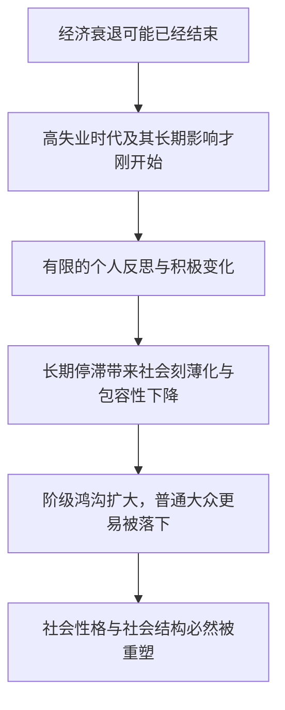

# The Great Recession and Its Impact on Society 精读笔记

## 背景

本文讨论 **2008 年前后经济衰退对美国社会的长期影响**。作者承认失业者可能从危机中获得一些反思，例如减少物质主义、提高财务审慎程度，但文章的核心判断偏向警惕：长期经济停滞可能加剧阶级分化、削弱包容性，并影响权利、自由和社会关系。

文章尤其关注三个层面：

- **个人层面**：年轻人的生命历程、就业机会与生活前景。
- **阶级层面**：收入不平等、阶级鸿沟以及名校毕业生与普通大众之间的差距。
- **社会层面**：反移民情绪、种族与阶级冲突，以及美国社会结构和价值观的变化。

本文已保留排版原文中的长难句分析 callout；`sentence-analysis.md` 未单独提供，因此不再重复建立独立分析章节。

---

## 文章原文

# The Great Recession and Its Impact on Society

The **great recession** may be over, but this era of **high joblessness** is probably beginning. Before it ends, it will likely change the **life course** and character of a generation of young adults. And ultimately, it is likely to **reshape** our politics, our culture, and the character of our society for years.

No one tries harder than the jobless ==to find silver linings== in this national economic disaster. Many said that unemployment, while extremely painful, had improved them in some ways: they had become less **materialistic** and more **financially prudent**; they were more aware of the struggles of others. In limited respects, perhaps the recession will leave society **better off**. At the very least, it has awoken us from our ==national fever dream== of easy riches and bigger houses, and put a necessary end to an era of **reckless personal spending**.

> [!abstract]- 长难句分析
> **原句**：Many said that unemployment, while extremely painful, had improved them in some ways: they had become less materialistic and more financially prudent; they were more aware of the struggles of others.
>
> **主干提取**
> - 主语 S: Many（许多人）
> - 谓语 V: said（说）
> - 宾语 O: that 引导的宾语从句（unemployment ... had improved them in some ways）
> - 状语 A: 无（主句无状语）
>
> **修饰成分**：
>
> | 类型 | 引导词 | 修饰对象 |
> |------|--------|----------|
> | 宾语从句 | that | said 的宾语 |
> | 让步状语从句（省略 it was） | while | 宾语从句谓语 had improved（省略主语 it，指 unemployment） |
> | 介词短语 | in some ways | 宾语从句谓语 had improved，作方式状语 |
> | 冒号解释分句 | : | 说明宾语从句"改善在哪些方面" |
> | 并列分句 | ; | 与冒号后第一分句并列 |
> | 介词短语 | of others | 修饰 the struggles |
>
> **结构图解**：
> ```
> 主句: Many + said + [that 宾从]
>   └── 宾从: unemployment (while 让步) + had improved + them + (in some ways)
>         ├── 让步状从(省略): (while extremely painful) → 修饰 had improved（省略主语 it = unemployment）
>         ├── 介短: (in some ways) → 方式状语
>         └── 冒号解释（两个并列分句，说明"改善在哪些方面"）
>               ├── 分句1: they + had become + less materialistic and more financially prudent
>               └── 分句2: they + were + more aware of (the struggles of others)
>                     └── 介短: (of others) → 修饰 the struggles
> ```
>
> **参考译文**：许多人说，失业虽然极其痛苦，却在某些方面改善了他们自身：他们变得不那么物质主义，在财务上更加审慎；也更体察他人的艰难。
>
> **考点提示**：while 在此引导让步状语从句，且省略了主语和系动词（while (it was) extremely painful）——while 既可表时间也可表让步，判断依据是与主句的逻辑关系；冒号在考研阅读中常引出对前文论断的解释，定位题时须把冒号后的并列分句一并纳入。

> [!abstract]- 长难句分析
> **原句**：At the very least, it has awoken us from our national fever dream of easy riches and bigger houses, and put a necessary end to an era of reckless personal spending.
>
> **主干提取**
> - 主语 S: it（它，指代上文 the recession）
> - 谓语 V: has awoken（已唤醒）
> - 宾语 O: us（我们）
> - 并列谓语 V2: (has) put（划上）
> - 宾语 O2: a necessary end（必要的句号）
> - 状语 A: At the very least（至少）
>
> **修饰成分**：
>
> | 类型 | 引导词 | 修饰对象 |
> |------|--------|----------|
> | 介词短语 | At the very least | 全句状语 |
> | 介词短语 | from our national fever dream | 修饰 awoken，表"从……中唤醒" |
> | 介词短语 | of easy riches and bigger houses | 修饰 fever dream |
> | 并列谓语（助动词 has 承前省略） | and | 与 has awoken 并列 |
> | 介词短语 | to an era | 与 put 构成 put an end to |
> | 介词短语 | of reckless personal spending | 修饰 an era |
>
> **结构图解**：
> ```
> 主句: it + has awoken + us + (from ...) and (has) put + a necessary end + (to ...)
>   ├── 介短: (At the very least) → 全句状语
>   ├── 谓1: has awoken us (from our national fever dream)
>   │     └── 介短: (of easy riches and bigger houses) → 修饰 fever dream
>   └── 谓2: and (has) put a necessary end (to an era)
>         └── 介短: (of reckless personal spending) → 修饰 an era
> ```
>
> **参考译文**：至少，它把我们从"轻松致富、住更大房子"的全国性狂热迷梦中唤醒，为一个肆意个人消费的时代划上了必要的句号。
>
> **考点提示**：并列谓语的识别——and 后的 put 之前省略了 has，判断依据是 and 前后属于同一时态结构（现在完成时）；两个固定搭配 awake sb from sth（把某人从……中唤醒）与 put an end to sth（终结……）是本题的词汇考点。

But for the most part, these benefits seem thin, uncertain, and far off. In *The Moral Consequences of Economic Growth*, the economic historian Benjamin Friedman argues that both inside and outside the U.S., **lengthy** periods of economic **stagnation** or decline have almost always left society more **mean-spirited** and less **inclusive**, and have usually stopped or reversed the advance of rights and freedoms. **Anti-immigrant sentiment** typically increases, as does conflict between races and classes.

> [!abstract]- 长难句分析
> **原句**：In The Moral Consequences of Economic Growth, the economic historian Benjamin Friedman argues that both inside and outside the U.S., lengthy periods of economic stagnation or decline have almost always left society more mean-spirited and less inclusive, and have usually stopped or reversed the advance of rights and freedoms.
>
> **主干提取**
> - 主语 S: the economic historian Benjamin Friedman（经济历史学家本杰明·弗里德曼）
> - 谓语 V: argues（认为／指出）
> - 宾语 O: that 引导的宾语从句
> - 状语 A: In The Moral Consequences of Economic Growth（在《经济增长的道德后果》一书中）
>
> **修饰成分**：
>
> | 类型 | 引导词 | 修饰对象 |
> |------|--------|----------|
> | 介词短语 | In The Moral Consequences ... | 全句状语（标明出处） |
> | 同位语 | the economic historian | Benjamin Friedman（身份 = 人名） |
> | 宾语从句 | that | argues 的宾语 |
> | 介词短语 | both inside and outside the U.S. | 从句状语（范围） |
> | 介词短语 | of economic stagnation or decline | 修饰 periods |
> | 并列谓语 | and | 与 have left 并列（have stopped / reversed） |
> | 并列谓语 | or | 与 stopped 并列（reversed） |
> | 介词短语 | of rights and freedoms | 修饰 the advance |
>
> **结构图解**：
> ```
> 主句: The economic historian (Benjamin Friedman) + argues + [that 宾从]
>   ├── 同位语: (Benjamin Friedman) → 与 the economic historian 同指一人
>   ├── 介短: (In The Moral Consequences of Economic Growth) → 全句状语
>   └── 宾从: lengthy periods (of ...) + have left + society + more ... and have (stopped or reversed) ...
>         ├── 介短: (both inside and outside the U.S.) → 从句状语
>         ├── 介短: (of economic stagnation or decline) → 修饰 periods
>         ├── 谓1 + 宾 + 宾补: have ... left society (more mean-spirited and less inclusive)
>         └── 谓2: and have usually stopped or reversed + the advance (of rights and freedoms)
>               └── 介短: (of rights and freedoms) → 修饰 the advance
> ```
>
> **参考译文**：在《经济增长的道德后果》一书中，经济历史学家本杰明·弗里德曼指出，无论在美国国内还是国外，长期的经济停滞或衰退几乎总是让社会变得更加刻薄、更缺乏包容，并且通常会中止甚至逆转权利与自由的进步。
>
> **考点提示**：同位语"身份 + 人名"（the economic historian Benjamin Friedman）同指一人，不可误译为"弗里德曼的历史学家"；宾语从句中两个并列谓语共享主语 lengthy periods（复数），故用 have left / have stopped；left society more mean-spirited 为 SVOC 结构（宾语 society + 宾补 more mean-spirited and less inclusive），是考研"宾语补足语"的典型考法。

> [!abstract]- 长难句分析
> **原句**：Anti-immigrant sentiment typically increases, as does conflict between races and classes.
>
> **主干提取**
> - 主语 S: Anti-immigrant sentiment（反移民情绪）
> - 谓语 V: increases（上升）
> - 状语 A: typically（通常）
> - 从句: as does conflict between races and classes（方式／比较状语从句）
>
> **修饰成分**：
>
> | 类型 | 引导词 | 修饰对象 |
> |------|--------|----------|
> | 方式／比较状语从句（倒装） | as | 说明主句谓语 increases 所对应的同样情形 |
> | 替代动词（倒装后的助动词） | does | 替代 increases，避免重复 |
> | 介词短语 | between races and classes | 修饰 conflict |
>
> **结构图解**：
> ```
> 主句: Anti-immigrant sentiment + typically + increases
>   └── 方式／比较状从(倒装): as + does + conflict (between races and classes)
>         ├── 主语后置: conflict (between races and classes)
>         └── 替代谓语: does = increases
> ```
>
> **参考译文**：反移民情绪通常会上升，种族与阶级之间的冲突同样如此。
>
> **考点提示**：`as + 助动词 + 主语` 的倒装替代结构（as does conflict = conflict also increases）是考研高频考点；此处 as 引导方式／比较状语从句，而非定语从句——as 后接的是完整的主谓倒装结构，前面也没有被修饰的先行词。同类结构还有 so does / nor did / as did。

**Income inequality** usually falls during a recession, but it has not **shrunk** in this one. Indeed, this period of economic weakness may **reinforce class divides**, and decrease opportunities to cross them—especially for young people. The research of Till Von Wachter, the economist at Columbia University, suggests that not all people graduating into a recession see their ==life chances dimmed==: those with degrees from **elite universities** catch up fairly quickly to where they otherwise would have been if they had graduated in better times; it is ==the masses beneath them that are left behind==.

> [!abstract]- 长难句分析
> **原句**：The research of Till Von Wachter, the economist at Columbia University, suggests that not all people graduating into a recession see their life chances dimmed: those with degrees from elite universities catch up fairly quickly to where they otherwise would have been if they had graduated in better times; it is the masses beneath them that are left behind.
>
> **主干提取**
> - 主语 S: The research of Till Von Wachter（蒂尔·冯·瓦赫特的研究）
> - 谓语 V: suggests（表明）
> - 宾语 O: that 引导的宾语从句
> - 同位语: the economist at Columbia University（哥伦比亚大学经济学家）
>
> **修饰成分**：
>
> | 类型 | 引导词 | 修饰对象 |
> |------|--------|----------|
> | 同位语 | the economist | Till Von Wachter |
> | 宾语从句 | that | suggests 的宾语 |
> | 非谓语（V-ing 短语） | graduating | 后置定语，修饰 people |
> | 介词短语 | into a recession | 修饰 graduating |
> | 宾语补足语 | dimmed | 补充说明 their life chances（see sth done） |
> | 冒号解释分句 | : | 对宾语从句作展开说明 |
> | 介词短语 | with degrees from elite universities | 后置定语，修饰 those |
> | 宾语从句 | where | 作 catch up to 的宾语 |
> | 虚拟条件状语从句 | if | 修饰 would have been（与过去事实相反） |
> | 强调句 | It is ... that ... | 强调主语 the masses beneath them |
> | 介词短语 | beneath them | 修饰 the masses |
>
> **结构图解**：
> ```
> 主句: The research (of Till Von Wachter) + suggests + [that 宾从]
>   ├── 同位语: (the economist at Columbia University) → 与 Till Von Wachter 同指一人
>   └── 宾从: not all people (graduating into a recession) + see + their life chances + dimmed
>         └── 冒号解释（两个并列分句）
>               ├── 分句1: those (with degrees from elite universities) + catch up + to [where 宾从]
>               │     └── where 宾从: they + otherwise would have been
>               │           └── 虚拟条件状从: (if they had graduated in better times)
>               └── 分句2: 强调句 It is + the masses (beneath them) + that + are left behind
> ```
>
> **参考译文**：哥伦比亚大学经济学家蒂尔·冯·瓦赫特的研究表明，并非所有"毕业即遇上衰退"的人都会感到人生机会变得渺茫：那些拥有名校学位的人能相当快地追上他们在经济景气时毕业本应达到的位置；被甩在后面的，是他们之下的普罗大众。
>
> **考点提示**：not all 表部分否定（"并非所有都……"），不可译为"所有都不"；see their life chances dimmed 为 see + 宾语 + 过去分词宾补（宾补与宾语是被动关系）；catch up to where ... would have been if ... had done 是"介词 + 宾语从句 + 虚拟语气"的综合考点；末句 It is ... that ... 为强调句型，强调主语 the masses beneath them——去掉 it is 与 that 后句子依然完整，这是它与主语从句的区分点。

> [!abstract]- 长难句分析
> **原句**：those with degrees from elite universities catch up fairly quickly to where they otherwise would have been if they had graduated in better times
>
> **说明**：本句为上一句冒号后的第一个分句，此处单独拆解其"介词 + 宾语从句 + 虚拟语气"结构。
>
> **主干提取**
> - 主语 S: those（那些人）
> - 谓语 V: catch up（追上）
> - 宾语 O: to + where 引导的宾语从句
> - 状语 A: fairly quickly（相当快）
>
> **修饰成分**：
>
> | 类型 | 引导词 | 修饰对象 |
> |------|--------|----------|
> | 介词短语 | with degrees from elite universities | 后置定语，修饰 those |
> | 介词 + 宾语从句 | to + where | 作 catch up 的宾语 |
> | 副词 | otherwise | 修饰 would have been（表"本应"） |
> | 虚拟条件状语从句 | if | 修饰 would have been，与过去事实相反 |
>
> **结构图解**：
> ```
> 主句: those (with degrees from elite universities) + catch up + (fairly quickly) + to [where 宾从]
>   ├── 介短: (with degrees from elite universities) → 后置定语，修饰 those
>   └── 宾从: where + they + otherwise would have been
>         └── 虚拟条件状从: (if they had graduated in better times) → 与过去事实相反
> ```
>
> **参考译文**：那些拥有名校学位的人能相当快地追上他们在经济景气时毕业本应达到的位置。
>
> **考点提示**：介词 to 后接 where 引导的宾语从句（catch up to where ...），此处 where 不是定语从句的引导词——判断依据是句中没有可被 where 修饰的先行词名词，where 在此相当于 the place in which，整个从句作介词 to 的宾语；if they had graduated in better times 为与过去事实相反的虚拟条件句，主句用 would have been；otherwise 在此替代了整个条件句（otherwise = if they had not graduated in a recession），考研常考"otherwise 隐含虚拟"。

In the Internet age, it is particularly easy to see the **resentment** that has always been hidden within American society. More difficult, in the moment, is **discerning** precisely how these **lean times** are affecting society's character. In many respects, the U.S. was more **socially tolerant** entering this recession than at any time in its history, and a variety of national polls on social conflict since then have shown mixed results. We will have to wait and see exactly how these hard times will reshape our **social fabric**. But they certainly will reshape it, and ==all the more so the longer they extend==.

> [!abstract]- 长难句分析
> **原句**：More difficult, in the moment, is discerning precisely how these lean times are affecting society's character.
>
> **主干提取**
> - 表语 C: More difficult（更困难的）——前置
> - 系动词 V: is
> - 主语 S: discerning precisely how ...（准确辨别……）——后置
> - 状语 A: in the moment（在当下）
>
> **修饰成分**：
>
> | 类型 | 引导词 | 修饰对象 |
> |------|--------|----------|
> | 表语前置（完全倒装） | More difficult | 正常语序中位于 is 之后 |
> | 介词短语 | in the moment | 插入状语 |
> | 非谓语（V-ing 动名词） | discerning | 后置主语，谓语用单数 is |
> | 副词 | precisely | 修饰 discerning |
> | 宾语从句 | how | 作 discerning 的宾语 |
>
> **结构图解**：
> ```
> 主句(倒装): More difficult + (in the moment) + is + discerning + [how 宾从]
>   ├── 表语前置: (More difficult) → 正常语序为 Discerning ... is more difficult
>   ├── 介短: (in the moment) → 插入状语
>   └── 后置主语: discerning + (precisely) + [how 宾从]
>         └── how 宾从: these lean times + are affecting + society's character
> ```
>
> **参考译文**：更困难的是，在当下准确辨别这些艰难岁月正在如何影响社会的性格。
>
> **考点提示**：形容词短语作表语前置引起的完全倒装（More difficult ... is discerning ...），还原后为 Discerning ... is more difficult——考研阅读中遇到"形容词 + is/was + V-ing"结构，应先锁定系动词再回找真正的主语；动名词短语 discerning ... 作主语时谓语用单数 is；how 引导的宾语从句须用陈述语序（are affecting，而非 are they affecting），且 how 在从句中作方式状语。

## Questions

36. By saying “to find silver linings” (Para. 2) the author suggests that the jobless try to ____.

   - [A] seek subsidies from the government
   - [B] make profits from the troubled economy
   - [C] explore reasons for the unemployment
   - [D] look on the bright side of the recession

37. According to Paragraph 2, the recession has made people ____.

   - [A] struggle against each other
   - [B] realize the national dream
   - [C] challenge their prudence
   - [D] reconsider their lifestyle

38. Benjamin Friedman believes that economic recessions may ____.

   - [A] impose a heavier burden on immigrants
   - [B] bring out more evils of human nature
   - [C] promote the advance of rights and freedoms
   - [D] ease conflicts between races and classes

39. The research of Till Von Wachter suggests that in the recession graduates from elite universities tend to ____.

   - [A] lag behind the others due to decreased opportunities
   - [B] catch up quickly with experienced employees
   - [C] see their life chances as dimmed as the others'
   - [D] recover more quickly than the others

40. The author thinks that the influence of hard times on society is ____.

   - [A] trivial
   - [B] positive
   - [C] certain
   - [D] destructive

---

## 翻译对照

# The Great Recession and Its Impact on Society 大衰退及其对社会的影响 中英对照

The **great recession** may be over, but this era of **high joblessness** is probably beginning. Before it ends, it will likely change the **life course** and character of a generation of young adults. And ultimately, it is likely to **reshape** our politics, our culture, and the character of our society for years.

大**衰退**或许已经结束，但这个**高失业率**的时代很可能才刚刚开始。在它结束之前，它很可能会改变一代年轻人的**生命历程**和性格。而最终，它很可能在未来数年间**重塑**我们的政治、我们的文化，以及我们社会的性格。

> [!note] 翻译说明
> "character" 在本段出现两次，指人与社会的"内在特质"。形容社会时译为"性格"（社会的性格／特质），比"特征"更贴合原文的拟人化表达。

No one tries harder than the jobless ==to find silver linings== in this national economic disaster. Many said that unemployment, while extremely painful, had improved them in some ways: they had become less **materialistic** and more **financially prudent**; they were more aware of the struggles of others. In limited respects, perhaps the recession will leave society **better off**. At the very least, it has awoken us from our ==national fever dream== of easy riches and bigger houses, and put a necessary end to an era of **reckless personal spending**.

在这场全国性的经济灾难中，没有人比失业者更努力地==去寻找一线希望==。许多人说，失业虽然极其痛苦，却在某些方面改善了他们自身：他们变得不那么**物质主义**，在财务上更加**审慎**；也更体察他人的艰难。在有限的方面，这场衰退或许会让社会变得**更好**。至少，它把我们从"轻松致富、住更大房子"的==全国性狂热迷梦==中唤醒，为一个**肆意个人消费**的时代划上了必要的句号。

> [!note] 翻译说明
> "to find silver linings" 出自谚语 "Every cloud has a silver lining"（乌云亦有银边），意为"在困境中寻找光明面／一线希望"。此处不可直译为"寻找银色衬里"。第 36 题正是对该短语的考查。
> "better off" 是"经济状况更好、境况更优"的固定说法，此处指社会整体受益。

But for the most part, these benefits seem thin, uncertain, and far off. In *The Moral Consequences of Economic Growth*, the economic historian Benjamin Friedman argues that both inside and outside the U.S., lengthy periods of economic **stagnation** or decline have almost always left society more **mean-spirited** and less **inclusive**, and have usually stopped or reversed the advance of rights and freedoms. **Anti-immigrant sentiment** typically increases, as does conflict between races and classes.

但就总体而言，这些好处显得单薄、不确定且遥不可及。在《经济增长的道德后果》一书中，经济历史学家本杰明·弗里德曼指出，无论在美国国内还是国外，长期的经济**停滞**或衰退几乎总是让社会变得更加**刻薄**、更缺乏**包容**，并且通常会中止甚至逆转权利与自由的进步。**反移民情绪**通常会上升，种族与阶级之间的冲突同样如此。

> [!note] 翻译说明
> "as does conflict between races and classes" 为倒装结构，`as does + 主语` 表示"……也同样如此"，还原后即 conflict between races and classes also increases。
> "mean-spirited" 指"心胸狭隘、刻薄小气"，形容社会氛围时译"刻薄"最贴切；"less inclusive" 与上文 "more mean-spirited" 并列，构成递进式负面评价。

**Income inequality** usually falls during a recession, but it has not shrunk in this one. Indeed, this period of economic weakness may **reinforce class divides**, and decrease opportunities to cross them—especially for young people. The research of Till Von Wachter, the economist at Columbia University, suggests that not all people graduating into a recession see their ==life chances dimmed==: those with degrees from **elite universities** catch up fairly quickly to where they otherwise would have been if they had graduated in better times; it is ==the masses beneath them that are left behind==.

**收入不平等**通常会在衰退期间缩小，但这一次并未缩小。事实上，这段经济疲软期可能会**强化阶级鸿沟**，并减少跨越鸿沟的机会——对年轻人尤其如此。哥伦比亚大学经济学家蒂尔·冯·瓦赫特的研究表明，并非所有"毕业即遇上衰退"的人都会感到==人生机会变得渺茫==：那些拥有**名校**学位的人能相当快地追上他们在经济景气时毕业本应达到的位置；==被甩在后面的，是他们之下的普罗大众==。

> [!note] 翻译说明
> "graduating into a recession" 指"毕业时恰逢经济衰退"，中文用"毕业即遇上衰退"更紧凑。
> "it is the masses beneath them that are left behind" 是强调句（It is ... that ...），强调主语 the masses beneath them，故译文用"……的，是……"结构突出这一对比：名校生能追上，被落下的是底层大众。

In the Internet age, it is particularly easy to see the **resentment** that has always been hidden within American society. More difficult, in the moment, is **discerning** precisely how these **lean times** are affecting society's character. In many respects, the U.S. was more **socially tolerant** entering this recession than at any time in its history, and a variety of national polls on social conflict since then have shown mixed results. We will have to wait and see exactly how these hard times will reshape our **social fabric**. But they certainly will reshape it, and ==all the more so the longer they extend==.

在互联网时代，人们特别容易看到一直潜藏于美国社会之中的**怨恨**情绪。更困难的是，在当下**辨别**这些**艰难时期**正如何影响社会的性格。在许多方面，美国进入这场衰退时的**社会宽容度**高于其历史上任何时期，而此后各种关于社会冲突的全国性民调结果喜忧参半。这些艰难岁月究竟会如何重塑我们的**社会结构**，我们只能拭目以待。但它们必定会重塑它，而且==持续得越久，重塑得越彻底==。

> [!note] 翻译说明
> "in the moment" 意为"眼下、当下这一刻"，与"事后来看"相对，强调身处其中难以判断。
> "mixed results" 指结果有好有坏、并不一致，译"喜忧参半"比"混合的结果"自然。
> "all the more so the longer they extend" 是比较结构 + 条件含义：the longer they extend, the more so they will reshape it（持续越久，重塑越甚）。译文保留其递进语气。

## Questions 题目

36. By saying “to find silver linings” (Para. 2) the author suggests that the jobless try to ____.

作者说“to find silver linings”（第 2 段），意在表明失业者试图____。

   - [A] seek subsidies from the government
   - [A] 向政府寻求补贴
   - [B] make profits from the troubled economy
   - [B] 从陷入困境的经济中获利
   - [C] explore reasons for the unemployment
   - [C] 探究失业的原因
   - [D] look on the bright side of the recession
   - [D] 看到衰退的光明面

> [!note] 翻译说明
> 本题考 "silver linings" 的引申义。"look on the bright side"（往好处想）与 "find silver linings"（寻找一线希望）语义对应，故 [D] 正确；[B] 把 "silver linings" 误解为金钱收益。

37. According to Paragraph 2, the recession has made people ____.

根据第 2 段，这场衰退使人们____。

   - [A] struggle against each other
   - [A] 相互争斗
   - [B] realize the national dream
   - [B] 实现国家梦想
   - [C] challenge their prudence
   - [C] 质疑自己的审慎
   - [D] reconsider their lifestyle
   - [D] 重新审视自己的生活方式

> [!note] 翻译说明
> 第 2 段说人们 "became less materialistic and more financially prudent"、"put a necessary end to ... reckless personal spending"，即对生活方式的反思，[D] 与之对应。[B] 是原文 "fever dream"（迷梦）的反向曲解。

38. Benjamin Friedman believes that economic recessions may ____.

本杰明·弗里德曼认为，经济衰退可能____。

   - [A] impose a heavier burden on immigrants
   - [A] 给移民带来更沉重的负担
   - [B] bring out more evils of human nature
   - [B] 暴露人性中更多的丑恶
   - [C] promote the advance of rights and freedoms
   - [C] 促进权利与自由的进步
   - [D] ease conflicts between races and classes
   - [D] 缓解种族与阶级之间的冲突

> [!note] 翻译说明
> 原文 "leave society more mean-spirited and less inclusive" 与 "stopped or reversed the advance of rights and freedoms" 均为负面判断，[B] 与之相符。[B] 中的 "evils of human nature" 是对 "mean-spirited" 的概括化改写。[D] 与原文 "as does conflict ... increases"（冲突上升）相反。

39. The research of Till Von Wachter suggests that in the recession graduates from elite universities tend to ____.

蒂尔·冯·瓦赫特的研究表明，在衰退中，名校毕业生往往____。

   - [A] lag behind the others due to decreased opportunities
   - [A] 因机会减少而落后于他人
   - [B] catch up quickly with experienced employees
   - [B] 迅速追上经验丰富的员工
   - [C] see their life chances as dimmed as the others'
   - [C] 认为自己的人生机会与他人一样渺茫
   - [D] recover more quickly than the others
   - [D] 比其他人恢复得更快

> [!note] 翻译说明
> 原文 "catch up fairly quickly to where they otherwise would have been" 指名校生能迅速"追回到"本来应有的水平，[D] 的 "recover"（恢复）是对此的概括。[B] 属偷换概念：原文并未与 "experienced employees" 比较。

40. The author thinks that the influence of hard times on society is ____.

作者认为，艰难时期对社会的影响是____。

   - [A] trivial
   - [A] 微不足道的
   - [B] positive
   - [B] 积极的
   - [C] certain
   - [C] 确定的
   - [D] destructive
   - [D] 破坏性的

> [!note] 翻译说明
> 末段 "But they certainly will reshape it" 中 "certainly" 直接给出答案，[C] 与之对应。文章虽列举负面影响，但作者未将影响定性为"破坏性"，[D] 属过度推断。

---

## 语法要点

# The Great Recession and Its Impact on Society 语法整理

> [!abstract] 说明
> 本笔记整理 2012 年考研英语阅读 Passage 4（经济衰退与美国社会性格之变）中的两个语言点，例句均取自本篇原文或由原文考点延伸。纯语法结构另见 [[语法总结笔记]]，动词短语与习惯搭配另见 [[固定搭配与词组笔记]]。
>
> - *In limited respects, perhaps the recession will leave society **better off**.*（在某些有限的方面，这场衰退或许会让社会变得**更好**。）→ `better off` 在此取"处境更好"义，而非"更富裕"。
> - *Anti-immigrant sentiment typically increases, **as does** conflict between races and classes.*（反移民情绪通常会上涨，**种族与阶级之间的冲突也同样如此**。）→ `as does` 引导倒装，替代前面重复的谓语 `increases`。

---

### 固定搭配：better off —— 两大核心语义

> [!note] 语法本质
> `better off` 本质是**复合形容词短语**，作**表语**（常构成 `be better off`），是形容词短语 **well-off**（富裕的、小康的）的**比较级**形式。

**语义 1：经济 / 生活层面 —— 家境更富裕 / 经济状况更好**

| 例句 | 翻译 |
|------|------|
| His family is much **better off** than mine. | 他的家境比我富裕 / 宽裕得多。 |
| Most families are **better off** than they were a decade ago. | 比起十年前，大多数家庭的生活水平都有所改善 / 更加宽裕。 |

**语义 2：处境与决策层面 —— 境况更好 / 这么做更明智（🔥 最高频考点）**

> [!tip] 语义重心
> 强调在**做出某种选择、摆脱某种麻烦或改变环境后**，整个人的心理状态或现实处境比以前更好。

**句型 A：be better off without sb / sth（没有某人 / 某物反而过得更好）**

> She realized that she would be **better off without** him.
> （她意识到，离开了他，自己反而能过得更好。）

**句型 B：be better off doing sth（做某事会更好 / 不妨做某事）**

> It's raining heavily; you'd be **better off staying** indoors.
> （雨下得很大，你待在室内会更明智 / 更好一些。）

> [!warning] 顶级必考陷阱：be better off doing vs had better do
> 这是语法填空与单选题中最容易"杀人诛心"的易错点——两者意思相近，**后接形式却完全不同**。
>
> | 句型 | 后接形式 | 语义重心 | 典型例句 |
> |------|---------|---------|---------|
> | **be better off** | 接**动名词 doing** | 描述**处境更好、更明智**（客观结果分析） | You are better off **taking** the subway. ✅ |
> | **had better** | 接**动词原形 do** | 提出**直接建议或轻微告诫**（"最好做某事"） | You had better **take** the subway. ✅ |
>
> 🎯 **速记：** `better off` 后面跟 **-ing**（是"比较下来更划算"的客观判断），`had better` 后面跟**原形**（是"你最好……"的主观告诫）。

> [!tip] 🔗 联动复习
> - `better off doing` 中的 `doing` 是**介词 `off` 后的动名词**，不要与情态动词 `had better do` 的原形混用；介词后接动名词的通则见 [[语法总结笔记]] 的「非谓语动词」章节。
> - `better off` 是 `well-off` 的**不规则比较级**（good / well → better），同类还有 `well-known → better-known`。

---

### 倒装与强调：as + 助动词 + 主语 —— 倒装替代结构

> [!note] 结构功能
> **as + 助动词 + 主语** 是考研高频考点，用倒装替代前文**重复的谓语**，避免重复。

| 结构 | 含义 | 例句 |
|------|------|------|
| **as + 助动词 + 主语** | 正如……也一样（肯定） | Anti-immigrant sentiment typically increases, **as does** conflict between races and classes.（反移民情绪通常会上涨，种族与阶级之间的冲突**也同样如此**。） |

**还原理解**

> `as does conflict between races and classes` = `conflict between races and classes` **also increases**
> （种族与阶级之间的冲突**也**增加。）

**易混点：as 是引导什么从句？**

> [!warning] as 引导**方式 / 比较状语从句**，而非定语从句

| 判据 | 说明 |
|------|------|
| ① as 后接**完整的主谓倒装结构** | `does + conflict between races and classes`，主谓齐全 |
| ② 前面**没有**被修饰的先行词 | 无先行词，故不可能作定语从句的关系代词 |

**同类倒装替代结构**

| 结构 | 含义 | 例句 |
|------|------|------|
| **as + 助动词 + 主语** | 正如……也一样（肯定） | He traveled a lot, **as did** his sister. |
| **so + 助动词 + 主语** | ……也是如此（肯定） | He likes coffee, and **so does** she. |
| **nor / neither + 助动词 + 主语** | ……也不（否定） | He didn't go, **nor did** she. |

> [!tip] 🔗 联动复习
> - `as does` 与 `so does` 结构功能相同，区别在语体：`as` 更书面，`so` 更口语；两者都是**部分倒装**（只把助动词提到主语前）。
> - 否定形式 `nor / neither + 助动词 + 主语` 常与**暗含否定、部分否定**考点同题出现，可对照 [[语法总结笔记]] 的「倒装与强调」章节一并复习。
> - 判断 `as` 从句性质的关键是**有无先行词**：有先行词才是定语从句；本篇 `as does conflict...` 前无先行词，故为状语从句。

---

## 生词表

### A-C

| 词汇 | 词性 | 含义 | 原文例句 |
|------|------|------|----------|
| **anti-immigrant** | adj. | 反移民的 | **Anti-immigrant** sentiment typically increases. |
| **anti-immigrant sentiment** | n. | 反移民情绪 | **Anti-immigrant sentiment** typically increases, as does conflict between races and classes. |
| **chance** | n. | 机会；可能性 | Not all people graduating into a recession see their life **chances** dimmed. |
| **character** | n. | 性格；特质 | It will likely change the life course and **character** of a generation of young adults. |
| **class divide** | n. | 阶级鸿沟 | This period of economic weakness may reinforce **class divides**. |
| **conflict** | n. | 冲突 | Anti-immigrant sentiment typically increases, as does **conflict** between races and classes. |

### D-L

| 词汇 | 词性 | 含义 | 原文例句 |
|------|------|------|----------|
| **discerning** | v./gerund | 辨别；识别 | More difficult, in the moment, is **discerning** precisely how these lean times are affecting society's character. |
| **economic stagnation** | n. | 经济停滞 | Lengthy periods of **economic stagnation** or decline have almost always left society more mean-spirited. |
| **elite university** | n. | 名牌大学；精英大学 | Those with degrees from **elite universities** catch up fairly quickly to where they otherwise would have been. |
| **fabric** | n. | 结构；纽带 | We will have to wait and see exactly how these hard times will reshape our social **fabric**. |
| **financially prudent** | adj. | 财务上审慎的 | They had become less materialistic and more **financially prudent**. |
| **great recession** | n. | 大衰退；严重经济衰退 | The **great recession** may be over, but this era of high joblessness is probably beginning. |
| **high joblessness** | n. | 高失业率 | This era of **high joblessness** is probably beginning. |
| **inclusive** | adj. | 包容的 | Lengthy periods of economic stagnation or decline have almost always left society less **inclusive**. |
| **income inequality** | n. | 收入不平等 | **Income inequality** usually falls during a recession, but it has not shrunk in this one. |
| **joblessness** | n. | 失业；无工作状态 | This era of high **joblessness** is probably beginning. |
| **lean times** | n. | 经济困难时期；艰难岁月 | More difficult, in the moment, is discerning precisely how these **lean times** are affecting society's character. |
| **life chances** | n. | 人生机会；发展前景 | Not all people graduating into a recession see their **life chances** dimmed. |
| **life course** | n. | 生命历程；人生轨迹 | It will likely change the **life course** and character of a generation of young adults. |

### M-R

| 词汇 | 词性 | 含义 | 原文例句 |
|------|------|------|----------|
| **materialistic** | adj. | 物质主义的 | They had become less **materialistic** and more financially prudent. |
| **mean-spirited** | adj. | 刻薄的；心胸狭隘的 | Lengthy periods of economic stagnation or decline have almost always left society more **mean-spirited**. |
| **prudent** | adj. | 审慎的；谨慎的 | They had become less materialistic and more financially **prudent**. |
| **recession** | n. | 经济衰退 | The great **recession** may be over, but this era of high joblessness is probably beginning. |
| **reckless** | adj. | 鲁莽的；不计后果的 | It has put a necessary end to an era of **reckless** personal spending. |
| **reinforce** | v. | 加强；巩固 | This period of economic weakness may **reinforce** class divides. |
| **resentment** | n. | 怨恨；愤懑 | In the Internet age, it is particularly easy to see the **resentment** that has always been hidden within American society. |
| **reshape** | v. | 重塑；重新塑造 | It is likely to **reshape** our politics, our culture, and the character of our society for years. |

### S-W

| 词汇 | 词性 | 含义 | 原文例句 |
|------|------|------|----------|
| **shrink** | v. | 缩小；减少 | Income inequality usually falls during a recession, but it has not **shrunk** in this one. |
| **silver lining** | n. | 困境中的一线希望 | No one tries harder than the jobless to find **silver linings** in this national economic disaster. |
| **social fabric** | n. | 社会结构；社会纽带 | We will have to wait and see exactly how these hard times will reshape our **social fabric**. |
| **socially tolerant** | adj. | 社会宽容的 | The U.S. was more **socially tolerant** entering this recession than at any time in its history. |
| **stagnation** | n. | 停滞；萧条 | Lengthy periods of economic **stagnation** or decline have almost always left society more mean-spirited. |
| **well-off** | adj. | 富裕的；境况良好的 | `better off` is the comparative form of **well-off**. |

### 生词练习

**一、选词填空**

从方框中选择合适的词汇填入空白处（每词限用一次）：

> stagnation / inclusive / joblessness / resentment / prudent / reinforce / discerning / reckless / reshape / social fabric

1. A prolonged period of economic ________ can weaken public confidence and reduce social mobility.
2. The new policy aims to make the workplace more ________ of people from different backgrounds.
3. High ________ may affect not only household income but also young people's career choices.
4. The survey helps researchers understand the public's growing ________ toward unequal opportunities.
5. Families may become more financially ________ after experiencing an economic crisis.
6. The government hopes the program will ________ cooperation between different social groups.
7. It takes time to ________ how a crisis has changed a society's values.
8. The article warns that ________ spending can make a difficult economic situation worse.
9. A major crisis may ________ the political landscape for many years.
10. Trust is an important part of a society's ________.

> [!abstract]- 答案
> 1. **stagnation**（停滞）
> 2. **inclusive**（包容的）
> 3. **joblessness**（失业）
> 4. **resentment**（怨恨；愤懑）
> 5. **prudent**（审慎的）
> 6. **reinforce**（加强）
> 7. **discerning**（辨别）
> 8. **reckless**（不计后果的）
> 9. **reshape**（重塑）
> 10. **social fabric**（社会结构；社会纽带）

**二、短语翻译**

将下列短语翻译成中文：

1. find silver linings in an economic disaster
2. be better off doing sth
3. reinforce class divides

> [!abstract]- 答案
> 1. **find silver linings in an economic disaster** = 在经济灾难中寻找一线希望
> 2. **be better off doing sth** = 做某事会更好、更明智
> 3. **reinforce class divides** = 加剧／强化阶级鸿沟

**三、语境理解**

根据上下文，选择画线词在原文中的正确含义：

1. “No one tries harder than the jobless to find **silver linings**...” 中 **silver linings** 指：
   - A. 政府发放的经济补贴
   - B. 困境中仍存在的积极方面
   - C. 从经济危机中获得的利润
   - D. 失业的根本原因

2. “these **lean times** are affecting society's character” 中 **lean times** 指：
   - A. 社会休闲时间减少的时期
   - B. 经济和生活较为困难的时期
   - C. 社会人口减少的时期
   - D. 人们饮食习惯改变的时期

3. “it is **the masses beneath them that are left behind**” 中 **left behind** 最接近：
   - A. 被留下、在发展中落后
   - B. 被邀请参与竞争
   - C. 被安排到更好的职位
   - D. 被提前送回学校

> [!abstract]- 答案
> 1. **B** — `silver linings` 指困难中的光明面。
> 2. **B** — `lean times` 指经济不景气、资源紧张的艰难时期。
> 3. **A** — 普通大众无法像名校毕业生那样迅速恢复到原本应有的水平。
## 心得

> [!tip] 主旨把握
> 文章并非简单讨论经济衰退的短期经济后果，而是把论述重点放在其**长期社会后果**上。首段提出总论点，第二段先承认有限的积极变化，第三、四段转向阶级分化与社会排斥，末段进一步指出社会性格的改变几乎不可避免。

> [!tip] 命题线索
> - 遇到 **silver lining**、**better off** 等表达时，应优先结合上下文判断其引申义，避免望文生义。
> - 冒号后的内容通常是对前面抽象判断的具体解释；阅读时不能只看冒号前的主句。
> - **not all** 表示部分否定，不能误读成“所有人都不”。
> - **It is ... that ...** 要通过去掉 `it is` 和 `that` 进行验证，以区别强调句和主语从句。
> - 文章末句的 **certainly** 是解答第 40 题的直接依据，说明作者强调影响的“确定性”，而非简单断言其一定具有破坏性。

> [!warning] 易错点
> `as does conflict between races and classes` 中的 `does` 替代前面的 `increases`；`where they otherwise would have been` 中的 `otherwise` 含有“如果不是在衰退期毕业”的隐含条件，不能按普通副词机械翻译。

### 论证结构



---

## 延伸

- 复习经济与社会议题词汇：`stagnation`、`inclusive`、`resentment`、`social fabric`、`class divide`。
- 对照复习本库中的 [[2012-passage1-精读笔记]]、[[2012-passage2-pink-精读笔记]] 和 [[2012-passage3-gene-patent-精读笔记]]，关注不同文章如何通过转折、举例和研究证据推进主旨。
- 语法结构可联动复习 [[语法总结笔记]]；固定搭配可联动复习 [[固定搭配与词组笔记]]。
- 建议进一步整理“经济变化 → 阶级关系 → 社会价值观”的因果链，并用英文复述文章主旨。

---

## 思考题

1. 文章为什么先承认经济衰退可能带来的有限好处，再转向强调其社会危害？这种安排对作者立场有何作用？
2. `as does conflict between races and classes` 中的倒装如何还原？如果改写为普通语序，句意是否发生变化？
3. 为什么名校毕业生能够较快恢复到原本应有的水平，而“the masses beneath them”更容易被落下？这说明了什么社会机制？
4. 结合全文，解释作者为什么用 **reshape** 而不是 **destroy** 来概括经济衰退对社会的影响。
5. 文章末段的 `all the more so the longer they extend` 在逻辑上如何承接前文？请用自己的话概括其隐含的比较关系。

---

## 相关笔记

- [[语法总结笔记]]
- [[固定搭配与词组笔记]]
- [[2012-passage1-精读笔记]]
- [[2012-passage2-pink-精读笔记]]
- [[2012-passage3-gene-patent-精读笔记]]
