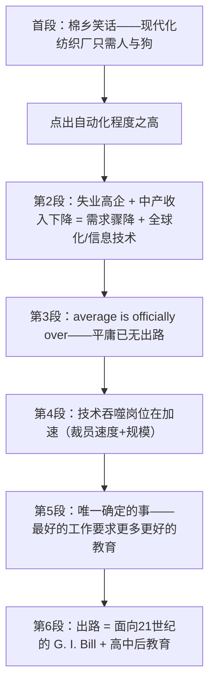

# Average Is Over 精读笔记

## 背景

本文是 2013 年考研英语一 Text 1，选自美国经济学家亚当·戴维森（Adam Davidson）的文章，核心论点是 **"average is over"（平庸的时代已经终结）**。

作者从一则棉乡笑话切入——"现代化的纺织厂只要两个人：一个人和一条狗，人负责喂狗，狗负责让人远离机器"——用幽默的方式点出**自动化程度之高**。随后他给出三点层层递进的判断：

- **技术一直在吞噬岗位，但近来出现"加速"**：全球化与信息技术革命正以空前速度用机器或外国工人取代人力，导致失业率居高不下、中产阶级收入持续下降。
- **"做个平庸的人"已无出路**：雇主获得廉价外国劳动力、廉价机器人、廉价软件、廉价自动化和廉价"天才"的成本都空前之低，因此每个人都必须找到自己**高于平均水平**的独特价值。
- **出路在于教育**：作者呼吁通过一部面向 21 世纪的《退伍军人法案》（G. I. Bill），确保每个美国人都能获得**高中后教育**（post-high school education）。

本文已保留排版原文中的长难句分析 callout；`sentence-analysis.md` 未单独提供，因此不再重复建立独立分析章节。

---

## 文章原文

# Average Is Over

In an essay entitled "Making It in America," the author Adam Davidson relates a joke from **cotton** country about just how much a modern textile **mill** has been automated: The average mill has only two employees today, "a man and a dog. The man is there to feed the dog, and the dog is there to keep the man away from the machines."

> [!abstract]- 长难句分析
> **原句**：In an essay entitled "Making It in America," the author Adam Davidson relates a joke from cotton country about just how much a modern textile mill has been automated: The average mill has only two employees today, "a man and a dog. The man is there to feed the dog, and the dog is there to keep the man away from the machines."
>
> **主干提取**：
>
> - 主语 S: the author Adam Davidson（作者亚当·戴维森）
> - 谓语 V: relates（讲述）
> - 宾语 O: a joke（一个笑话）
> - 同位语: Adam Davidson（说明 the author）
>
> **修饰成分**：
>
> | 类型 | 引导词 | 修饰对象 |
> |------|--------|----------|
> | 非谓语（过去分词） | entitled | essay（修饰 In an essay） |
> | 介短 | from | joke（笑话的来源） |
> | 介短 | about | joke（笑话的内容） |
> | 名从（宾语从句） | how much | 作 about 的宾语（自动化程度） |
> | 同位语从句 | 冒号 | a joke（冒号后整句即笑话内容） |
> | 并列句 | and | 两个 is there to... 结构 |
>
> **结构图解**：
>
> ```
> 主句: the author Adam Davidson + relates + a joke
>   ├── 同位语: (Adam Davidson) → 说明 the author
>   ├── 非谓语: (entitled "Making It in America") → 修饰 an essay
>   ├── 介短: (from cotton country) → 修饰 a joke
>   ├── 介短: (about how much a modern textile mill has been automated) → 修饰 a joke
>   │     └── 名从: (how much ...) → 作 about 的宾语
>   └── 同位语: (冒号后 The average mill has ...) → 具体说明 a joke 的内容
>         └── 引语并列: (The man is there to ... and the dog is there to ...)
> ```
>
> **参考译文**：在亚当·戴维森一篇题为《在美国出人头地》的文章中，他讲了一个来自棉花产区的笑话，讲的是现代纺织厂的自动化程度有多高：如今，一般纺织厂里只有两名员工——"一个人和一条狗。人在那儿是为了喂狗，而狗在那儿是为了让人远离机器。"
>
> **考点提示**：冒号在此起解释说明作用，冒号之后的内容就是前面 the joke 的同位语从句。第 1 段首句常用于"例证/引言题"，问"这个笑话说明了什么"时，答案往往指向冒号后那句话的核心——自动化程度之高，而非笑话本身。

Davidson's article is one of a number of **pieces** that have recently appeared making the point that the reason we have such **stubbornly high unemployment** and **declining middle-class incomes** today is largely because of the big drop in demand because of the Great Recession, but it is also because of the advances in both **globalization** and the **information technology revolution**, which are more rapidly than ever replacing labor with machines or foreign workers.

> [!abstract]- 长难句分析
> **原句**：Davidson's article is one of a number of pieces that have recently appeared making the point that the reason we have such stubbornly high unemployment and declining middle-class incomes today is largely because of the big drop in demand because of the Great Recession, but it is also because of the advances in both globalization and the information technology revolution, which are more rapidly than ever replacing labor with machines or foreign workers.
>
> **主干提取**：
>
> - 主语 S: Davidson's article（戴维森的文章）
> - 系动词 V: is
> - 表语 C: one of a number of pieces（众多文章之一）
>
> **修饰成分**：
>
> | 类型 | 引导词 | 修饰对象 |
> |------|--------|----------|
> | 定从 | that | pieces |
> | 非谓语（现在分词） | making | pieces（补充说明这些文章的作用） |
> | 同位语从句 | that | the point（说明"观点"的具体内容） |
> | 定从（省略 that） | — | the reason |
> | 介短 | because of | the reason is ... |
> | 定从 | which | globalization 和 the information technology revolution |
>
> **结构图解**：
>
> ```
> 主句: Davidson's article + is + one of a number of pieces
>   ├── 定从: (that have recently appeared) → 修饰 pieces
>   │     └── 非谓语: (making the point ...) → 补充说明 pieces 的作用
>   │           └── 同位语从句: (that the reason ... ) → 说明 the point 的内容
>   │                 ├── 定从: (we have ... today) → 修饰 the reason
>   │                 ├── 表语 1: (largely because of the big drop in demand)
>   │                 │     └── 介短: (because of the Great Recession) → 说明需求骤降的原因
>   │                 └── 表语 2: (also because of the advances in both globalization and the information technology revolution)
>   │                       └── 定从: (which are more rapidly than ever replacing ...) → 修饰两大 advances
> ```
>
> **参考译文**：戴维森的这篇文章只是近来涌现的众多同类文章之一。这些文章都指出：如今我们之所以面临居高不下的失业率和不断下降的中产阶级收入，很大程度上是因为大衰退（the Great Recession）导致的需求骤降，但同时也是因为全球化与信息技术革命的推进——它们正以空前的速度用机器或外国工人取代人力。
>
> **考点提示**：此类长句的核心是 "A, but (it is) also B" 的"主因 + 次因"结构，常命制因果细节题。注意两个 because of 层级不同：`because of the Great Recession` 修饰的是 the big drop in demand（需求骤降的原因），并非与 globalization 并列；真正并列的只有"需求骤降"与"全球化 + 信息技术"两项。which 的先行词是 both...and... 连接的两个名词，故用复数 are。

In the past, workers with average skills, doing an average job, could earn an average lifestyle. But, today, **average is officially over**. Being average just won't earn you what it used to.

It can't when so many more employers have so much more access to so much more **above average** cheap foreign labor, cheap robotics, cheap software, cheap automation and cheap genius.

> [!abstract]- 长难句分析
> **原句**：It can't when so many more employers have so much more access to so much more **above average** cheap foreign labor, cheap robotics, cheap software, cheap automation and cheap genius.
>
> **主干提取**：
>
> - 主语 S: It（指代上句 Being average“做一个平庸的人”）
> - 谓语 V: can't（= cannot earn you what it used to，后省略重复谓语）
> - 状语 A: when 引导的时间/原因状语从句
>
> **修饰成分**：
>
> | 类型 | 引导词 | 修饰对象 |
> |------|--------|----------|
> | 状从 | when | 修饰整个主句（说明“赚不到”的原因/背景） |
> | 比较修饰语 | so much more | access（层层递进的强调） |
> | 介短 | to | access |
> | 并列名词短语 | and | 五个 cheap... 并列，作 to 的宾语 |
>
> **结构图解**：
>
> ```
> 主句: It + can't （省略 earn you what it used to）
>   └── 状从: (when so many more employers have so much more access ...)
>         └── 介词宾语: so much more above average cheap foreign labor ...
>               ├── cheap robotics
>               ├── cheap software
>               ├── cheap automation
>               └── cheap genius
> ```
>
> **参考译文**：当越来越多的雇主能越来越方便地获得越来越多的高于平均水平的廉价外国劳动力、廉价机器人、廉价软件、廉价自动化设备和廉价天才时，平庸者自然赚不到。
>
> **考点提示**：`It can't` 后省略了与前句重复的谓语（earn you what it used to），属于“替代与省略”考点；`when` 在此引导时间/原因状语从句，不宜译成“什么时候”。so many more … so much more … so much more … 是三个 much/many more 的叠加递进，是作者刻意营造的强调语气，不是严格的比例比较；并列名词短语需按“廉价（的）+ 五类资源”整体理解。

Therefore, everyone needs to find their extra—their **unique value contribution** that makes them stand out in whatever is their field of employment.

Yes, new technology has been eating jobs forever, and always will.

> [!abstract]- 长难句分析
> **原句**：Yes, new technology has been eating jobs forever, and always will.
>
> **主干提取**：
>
> - 主语 S: new technology（新技术）
> - 谓语 V: has been eating（一直吞噬）
> - 宾语 O: jobs（工作岗位）
> - 并列谓语: (and) will (eat jobs) — 省略宾语
>
> **修饰成分**：
>
> | 类型 | 引导词 | 修饰对象 |
> |------|--------|----------|
> | 时间状语 | forever | has been eating（一直） |
> | 并列省略句 | and | always will 后省略 eat jobs |
>
> **结构图解**：
>
> ```
> 主句: new technology + has been eating + jobs
>   ├── 状语: (forever) → 修饰 has been eating
>   └── 并列句: (and always will) → 省略 eat jobs（避免重复）
> ```
>
> **参考译文**：是的，新技术一直在吞噬工作岗位，将来也会如此。
>
> **考点提示**：`has been eating` 为现在完成进行时，强调动作从过去持续至今并将继续，与单纯一般过去时不同。`and always will` 后省略了 eat jobs，是"并列句的省略"考点。此句为让步—转折结构，先承认"技术一直在吞噬岗位"，再用下一句转到"但近来出现加速"，是作者引出论点的过渡句。

But there's been an **acceleration**.
As Davidson notes, "In the 10 years ending in 2009, [U.S.] factories shed workers so fast that they erased almost all the gains of the previous 70 years; roughly one out of every three manufacturing jobs—about 6 million in total—disappeared."

> [!abstract]- 长难句分析
> **原句**：As Davidson notes, "In the 10 years ending in 2009, [U.S.] factories shed workers so fast that they erased almost all the gains of the previous 70 years; roughly one out of every three manufacturing jobs—about 6 million in total—disappeared."
>
> **主干提取**：
>
> - 引导语: As Davidson notes（正如戴维森所指出的）— as 引导非限制性定语从句（as 为关系代词，指代整个引语），整个从句作状语
> - 主干（引语内）: [U.S.] factories（主语）+ shed（谓语）+ workers（宾语）
> - 结果状语: so fast that...（如此之快，以至于……）
> - 并列句 2: roughly one out of every three manufacturing jobs ... disappeared
>
> **修饰成分**：
>
> | 类型 | 引导词 | 修饰对象 |
> |------|--------|----------|
> | 定从（非限制性） | as（关系代词） | 整个主句（作状语，表"正如……"） |
> | 非谓语（现在分词） | ending | the 10 years（截至 2009 年的十年） |
> | 结果状从 | so...that | workers shed 的速度（so fast 的程度） |
> | 同位语 | 破折号 about 6 million in total | one out of every three manufacturing jobs |
> | 介短 | of | all the gains（前 70 年的全部增长） |
>
> **结构图解**：
>
> ```
> 引导: As Davidson notes （as 为关系代词，引导非限制性定语从句，指代整个引语，整个从句作状语）
>   └── 引语主干: [U.S.] factories + shed + workers + so fast
>         ├── 非谓语: (ending in 2009) → 修饰 the 10 years
>         └── 结果状从: (that they erased almost all the gains ...)
>               └── 介短: (of the previous 70 years) → 修饰 the gains
>   └── 并列句 2: roughly one out of every three manufacturing jobs ... disappeared
>         └── 同位语: (破折号 about 6 million in total) → 说明消失岗位的总量
> ```
>
> **参考译文**：正如戴维森所指出的："在截至 2009 年的那 10 年里，［美国］工厂裁减工人的速度之快，几乎抹平了此前 70 年的全部增长；大约每三个制造业岗位中就有一个——总计约 600 万个——消失了。"
>
> **考点提示**：so...that... 结果状语从句是考研高频结构，注意 so 后常接形容词/副词（so fast），不可与 such...that（后接名词）混淆。破折号引出的是同位语（about 6 million in total 说明消失岗位的数量），并非新的主语。本句是第 23 题"引文说明了什么"的出处，核心是工厂裁员"速度极快、规模极大"。

There will always be changed—new jobs, new products, new services. But the one thing we know for sure is that with each advance in globalization and the I. T. revolution, the best jobs will require workers to have **more and better education** to make themselves **above average**.

> [!abstract]- 长难句分析
> **原句**：But the one thing we know for sure is that with each advance in globalization and the I. T. revolution, the best jobs will require workers to have **more and better education** to make themselves **above average**.
>
> **主干提取**：
>
> - 主语 S: the one thing（我们确定的那一件事）
> - 系动词 V: is
> - 表语从句 C: that with each advance ..., the best jobs will require workers to have more and better education
>   - 表语从句内部主干: the best jobs（主语）+ will require（谓语）+ workers（宾语）+ to have more and better education（宾补）
>
> **修饰成分**：
>
> | 类型 | 引导词 | 修饰对象 |
> |------|--------|----------|
> | 定从（省略 that） | — | the one thing |
> | 表语从句 | that | is |
> | 介短（伴随状语） | with | 表语从句（表"随着……"） |
> | 不定式短语 | to make | require workers to...（目的状语） |
>
> **结构图解**：
>
> ```
> 主句: the one thing + is + that 表语从句
>   ├── 定从: (we know for sure) → 修饰 the one thing
>   └── 表语从句: the best jobs + will require + workers + to have more education
>         ├── 介短: (with each advance in globalization and the I. T. revolution) → 伴随/条件状语
>         └── 非谓语: (to make themselves above average) → 目的状语
> ```
>
> **参考译文**：但有一点我们可以确定：随着全球化和信息技术革命的每一次推进，最好的工作都将要求劳动者接受更多、更好的教育，从而让自己高于平均水平。
>
> **考点提示**：`the one thing we know for sure` 中省略了关系代词 that（that 在从句中作 know 的宾语，故可省略），此为"定语从句的省略"考点。with each advance... 是"随着……"的伴随状语，与主干构成条件—结果关系。末句 to make themselves above average 的逻辑主语是 workers（使工人自己高于平均水平），不是修饰 jobs。

In a world where average is officially over, there are many things we need to do to support employment, but nothing would be more important than passing some kind of G. I. Bill for the 21st century that ensures that every American has access to **post-high school education**.

> [!abstract]- 长难句分析
> **原句**：In a world where average is officially over, there are many things we need to do to support employment, but nothing would be more important than passing some kind of G. I. Bill for the 21st century that ensures that every American has access to **post-high school education**.
>
> **主干提取**：
>
> - 主句 1: there are many things（存在许多要做的事）
> - 并列句（转折）: but nothing would be more important than passing some kind of G. I. Bill（但没有比通过某种法案更重要的事）
> - 主句 2 内部: 主语 S: nothing / 谓语 V: would be / 表语 C: more important / 比较对象: than passing some kind of G. I. Bill
>
> **修饰成分**：
>
> | 类型 | 引导词 | 修饰对象 |
> |------|--------|----------|
> | 介短（前置状语） | In | 全句 |
> | 定从 | where | a world（"……的世界"） |
> | 定从（省略 that） | — | many things |
> | 非谓语（不定式） | to do / to support | many things / we need to do |
> | 定从 | that | some kind of G. I. Bill |
> | 名从（宾语从句） | that | ensures |
>
> **结构图解**：
>
> ```
> 主句 1: there are + many things
>   ├── 介短: (In a world where average is officially over) → 前置状语
>   │     └── 定从: (where average is officially over) → 修饰 a world
>   ├── 定从: (we need to do) → 修饰 many things
>   │     └── 非谓语: (to support employment) → 目的状语
> 并列句（转折）: but nothing + would be + more important + than passing some kind of G. I. Bill
>   └── 定从: (that ensures that every American has access to post-high school education) → 修饰 G. I. Bill
>         └── 名从（宾语从句）: (that every American has access to ...) → ensures 的宾语
> ```
>
> **参考译文**：在一个"中等"已正式终结的世界里，我们需要做很多事情来支撑就业，但没有什么比通过某种面向 21 世纪的《退伍军人法案》（G. I. Bill）更重要——它要确保每个美国人都能获得高中后教育。
>
> **考点提示**：`nothing would be more important than ...` 是比较级表最高级（"没有什么比……更重要"），属强调句式考点。句中两个 that 作用不同：第一个 that 引导定语从句修饰 G. I. Bill；第二个 that（ensures that every American...）引导宾语从句。`have access to` = 有机会获得/享受，是考研高频词组。本句是第 24 题"降低失业最重要的是什么"的出处——答案落在"让更多人接受高中后教育"。

## 题目

21. The joke in Paragraph 1 is used to illustrate ____.

- [A] the impact of technological advances
- [B] the alleviation of job pressure
- [C] the shrinkage of textile mills
- [D] the decline of middle-class incomes

22. According to Paragraph 3, to be a successful employee, one has to ____.

- [A] adopt an average lifestyle
- [B] work on cheap software
- [C] contribute something unique
- [D] ask for a moderate salary

23. The quotation in Paragraph 4 explains that ____.

- [A] gains of technology have been erased
- [B] job opportunities are disappearing at a high speed
- [C] factories are making much less money than before
- [D] new jobs and services have been offered

24. According to the author, to reduce unemployment, the most important is ____.

- [A] to accelerate the I.T. revolution
- [B] to ensure more education for people
- [C] to advance economic globalization
- [D] to pass more bills in the 21st century

25. Which of the following would be the most appropriate title for the text?

- [A] Technology Goes Cheap
- [B] New Law Takes Effect
- [C] Recession Is Bad
- [D] Average Is Over

---

## 翻译对照

# Average Is Over

In an essay entitled "Making It in America," the author Adam Davidson relates a joke from cotton country about just how much a modern textile mill has been automated: The average mill has only two employees today, "a man and a dog. The man is there to feed the dog, and the dog is there to keep the man away from the machines."

在亚当·戴维森（Adam Davidson）一篇题为《在美国出人头地》（Making It in America）的文章中，他讲了一个来自棉花产区的笑话，讲的是现代纺织厂的自动化程度有多高：如今，一般纺织厂里只有两名员工——"一个人和一条狗。人在那儿是为了喂狗，而狗在那儿是为了让人远离机器。"

> [!note] 翻译说明
> `cotton country` 指美国南部的棉花种植区（棉乡），是纺织业兴起的传统地区。末句的幽默在于：人的工作只剩"喂狗"，狗的工作则是"看住人"，暗示机器已完全取代人工，人反而成了添乱的一方。

Davidson's article is one of a number of pieces that have recently appeared making the point that the reason we have such **stubbornly high unemployment** and **declining middle-class incomes** today is largely because of the big drop in demand because of the Great Recession, but it is also because of the advances in both **globalization** and the **information technology revolution**, which are more rapidly than ever replacing labor with machines or foreign workers.

戴维森的这篇文章只是近来涌现的众多同类文章之一。这些文章都指出：如今我们之所以面临**居高不下的失业率**和**不断下降的中产阶级收入**，很大程度上是因为大衰退（the Great Recession）导致的需求骤降，但同时也是因为**全球化**与**信息技术革命**的推进——它们正以空前的速度用机器或外国工人取代人力。

> [!note]- 长难句解析（第 2 段）
> **结构切分**
>
> - 主干：`Davidson's article is one of a number of pieces`（戴维森的文章只是众多文章之一）
> - 定语从句 1（修饰 `pieces`）：`that have recently appeared making the point...` —— 这些文章近来出现，并提出了一个观点
> - 同位语从句（说明 `the point`）：`that the reason ... is largely because of A, but it is also because of B`
> - 定语从句 2（修饰 `globalization` 和 `the information technology revolution`）：`which are more rapidly than ever replacing labor with machines or foreign workers`
>
> **翻译难点**
>
> - `making the point that...` = "（文章）提出/主张这样的观点：……"，注意 `make the point that` 是固定表达，等于 `argue that`。
> - 句子核心是 `the reason ... is A, but it is also B` 的"主因 + 附加因"结构：`largely because of` 表主因（大衰退），`but it is also because of` 表并列次因（全球化 + 信息技术）。
> - 两个 `because of` 不可混为一谈：`because of the Great Recession` 是**修饰** `the big drop in demand` 的，即"需求骤降的原因是大衰退"，而非与"全球化"并列。
> - `which` 的先行词是 `both globalization and the information technology revolution`（两者），故用复数 `are`。

In the past, workers with average skills, doing an average job, could earn an average lifestyle. But, today, **average is officially over**. Being average just won't earn you what it used to. It can't when so many more employers have so much more access to so much more **above average** cheap foreign labor, cheap robotics, cheap software, cheap automation and cheap genius. Therefore, everyone needs to find their extra—their **unique value contribution** that makes them stand out in whatever is their field of employment.

过去，技能平平、干着普通工作的劳动者，也能过上中等水平的生活。但如今，**"中等"已正式终结**。做一个平庸之辈，再也赚不到过去那份收入了。当越来越多的雇主能越来越方便地获得越来越多的**高于平均水平**的廉价外国劳动力、廉价机器人、廉价软件、廉价自动化设备和廉价天才时，平庸者自然赚不到。因此，每个人都需要找到自己的"加分项"——那个让你在自己的就业领域中脱颖而出的**独特价值贡献**。

> [!note]- 长难句解析（第 3 段）
> **结构切分**
>
> - `It can't` = `Being average can't earn you what it used to`（省略重复谓语的替代形式，`can't` 后省略了 `earn you...`）
> - 时间状语从句：`when so many more employers have so much more access to ...`
> - 不定式短语：`to make themselves above average` 表目的
>
> **翻译难点**
>
> - `It can't when...`：`It` 指代前句"平庸赚不到钱"，`can't` 后省略了 `earn you what it used to`。`when` 引导原因/条件状语从句，译作"因为/当……时"，此处顺译为"当……时，自然赚不到"最通顺。
> - `so many more employers have so much more access to so much more ...`：三个 `much/many more` 叠加是**修辞性递进**（层层加码起强调作用），并非严格的比例比较，翻译时保持"越来越多……越来越多……"的堆叠感。
> - `their extra`：`extra` 此处名词化，指"额外的那份价值/过人之处"，与后文 `unique value contribution` 同义复指。
> - `whatever is their field of employment`：`whatever` 引导宾语从句（"无论……是什么"），`their` 指 `everyone`。

Yes, new technology has been eating jobs forever, and always will. But there's been an **acceleration**. As Davidson notes, "In the 10 years ending in 2009, [U.S.] factories shed workers so fast that they erased almost all the gains of the previous 70 years; roughly one out of every three manufacturing jobs—about 6 million in total—disappeared."

是的，新技术一直在吞噬工作岗位，将来也会如此。但近来出现了**加速**。正如戴维森所指出的："在截至 2009 年的那 10 年里，［美国］工厂裁减工人的速度之快，几乎抹平了此前 70 年的全部增长；大约每三个制造业岗位中就有一个——总计约 600 万个——消失了。"

> [!note] 翻译说明
> - `[U.S.]` 是引文中编者补充的说明，译为"［美国］"以方括号保留。
> - `shed workers` = 裁员、裁减工人；`shed` 本义"脱去、脱落"，此处指工厂"甩掉"工人。
> - `gains` 指经济或就业上的"增长、收获"，此处指此前 70 年制造业积累的成果。

There will always be changed—new jobs, new products, new services. But the one thing we know for sure is that with each advance in globalization and the I. T. revolution, the best jobs will require workers to have **more and better education** to make themselves **above average**.

（原文如此：`There will always be changed`，疑为原书笔误，应为 `change`；译文按 `change` 理解。）

总会有变化——新工作、新产品、新服务。但有一点我们可以确定：随着全球化和信息技术革命的每一次推进，最好的工作都将要求劳动者接受**更多、更好的教育**，从而让自己**高于平均水平**。

> [!note]- 长难句解析（第 5 段）
> **结构切分**
>
> - 主句：`the one thing we know for sure is that...`（我们唯一确定的一件事是……）
>   - 定语从句：`we know for sure` 修饰 `the one thing`（省略关系代词 that）
>   - 表语从句：`that with each advance ..., the best jobs will require workers to have ...`
> - 表语从句内部：`with each advance...` 为伴随状语 → 主句 `the best jobs will require workers to have more and better education` → `to make themselves above average` 为目的状语
>
> **翻译难点**
>
> - `the one thing we know for sure` 中 `we know for sure` 后省略了关系代词 `that`（先行词被 `the one` 修饰时的常见省略），翻译时顺译为"我们确定的一点"。
> - `with each advance in ...` 是"随着……每一次进步"的伴随状语，与主干构成条件—结果关系。
> - `require sb. to do sth.` 结构：`require workers to have...`，宾语补足语是 `to have...`。
> - 末句 `to make themselves above average` 的逻辑主语是 `workers`（使工人自己高于平均水平），不要误读为修饰 `jobs`。

In a world where average is officially over, there are many things we need to do to support employment, but nothing would be more important than passing some kind of G. I. Bill for the 21st century that ensures that every American has access to **post-high school education**.

在一个"中等"已正式终结的世界里，我们需要做很多事情来支撑就业，但没有什么比通过某种面向 21 世纪的《退伍军人法案》（G. I. Bill）更重要——它要确保每个美国人都能获得**高中后教育**。

> [!note] 翻译说明
> - `G. I. Bill`：全称 GI Bill，即 1944 年美国《退伍军人权利法案》，为二战退伍军人提供免费上大学等福利，是美国扩大高等教育机会的标志性法案。作者借此主张：应为 21 世纪出台一部类似的"人人可上大学"法案。
> - `post-high school education` = 高中毕业后的教育（大学、社区学院、职业培训等），非单指"大学"。

> [!note]- 长难句解析（第 6 段）
> **结构切分**
>
> - 主句：`there are many things ..., but nothing would be more important than passing ...`
> - 介词短语作前置状语：`In a world where average is officially over`（`where` 引导定语从句修饰 `world`）
> - 定语从句（修饰 `some kind of G. I. Bill`）：`that ensures that every American has access to post-high school education`
>
> **翻译难点**
>
> - `nothing would be more important than ...`：比较级表最高级（"没有什么比……更重要"），是强调句式。
> - `some kind of` 表示"某种（类似的）"，暗示作者主张的不是现成法案，而是仿照 G. I. Bill 制定的新法案。
> - 句中两个 `that` 含义不同：第一个 `that` 引导定语从句修饰 `Bill`；第二个 `that`（`ensures that every American...`）引导宾语从句。
> - `have access to` = "有机会获得/能够享受到"，是考研高频词组。

## 题目

21. The joke in Paragraph 1 is used to illustrate ____.
第 1 段中的笑话用来说明 ____。

- [A] the impact of technological advances（技术进步的影响）
- [B] the alleviation of job pressure（工作压力的减轻）
- [C] the shrinkage of textile mills（纺织厂的萎缩）
- [D] the decline of middle-class incomes（中产阶级收入的下降）

22. According to Paragraph 3, to be a successful employee, one has to ____.
根据第 3 段，要想成为成功的雇员，一个人必须 ____。

- [A] adopt an average lifestyle（采取中等的生活方式）
- [B] work on cheap software（从事廉价软件工作）
- [C] contribute something unique（贡献某种独特的东西）
- [D] ask for a moderate salary（索要适中的薪水）

23. The quotation in Paragraph 4 explains that ____.
第 4 段中的引文说明了 ____。

- [A] gains of technology have been erased（技术的成果已被抹去）
- [B] job opportunities are disappearing at a high speed（工作机会正在快速消失）
- [C] factories are making much less money than before（工厂赚的钱比以前少得多）
- [D] new jobs and services have been offered（已有新的工作和服务被提供）

24. According to the author, to reduce unemployment, the most important is ____.
根据作者的观点，要降低失业率，最重要的是 ____。

- [A] to accelerate the I.T. revolution（加速信息技术革命）
- [B] to ensure more education for people（确保人们接受更多教育）
- [C] to advance economic globalization（推进经济全球化）
- [D] to pass more bills in the 21st century（在 21 世纪通过更多法案）

25. Which of the following would be the most appropriate title for the text?
下列哪一项最适合作为本文的标题？

- [A] Technology Goes Cheap（技术变得廉价）
- [B] New Law Takes Effect（新法律生效）
- [C] Recession Is Bad（衰退很糟糕）
- [D] Average Is Over（平庸已终结）

---

## 语法要点

# Average Is Over 语法整理

> [!abstract] 说明
> 本笔记整理 2013 年考研英语一 Text 1（"Average Is Over"）中的语法结构，例句均取自本篇原文。纯语法结构另见 [[语法总结笔记]]，动词短语与习惯搭配另见 [[固定搭配与词组笔记]]。
>
> - *Being average just won't earn you what it used to.* → `what it used to (earn you)` 是**省略**。
> - *nothing would be more important than passing some kind of G. I. Bill* → `nothing + 比较级` 是**比较级表最高级**。
> - *As Davidson notes, "..."* → `as` 为**关系代词**，引导非限制性定语从句。

---

### 从句：定语从句的省略与分隔

> [!note] 语法本质
> 关系代词在**限制性定语从句中作宾语**时，可以省略（作主语则不可省略）。判断是否省略，只需看从句是否**缺宾语**。

| 结构 | 省略条件 | 例句 |
|------|---------|------|
| 省略关系代词 that/which（作宾语） | 从句谓语后**缺宾语** | But the one thing **（that）we know for sure** is that ...（但我们确定的一点是……） |
| 同上 | 先行词为 reason 时 | the reason **（why/that）** we have ... today（我们今天……的原因） |
| **不可**省略（作主语） | 从句缺主语 | the pieces **that have recently appeared**（近来出现的那些文章） |

> [!warning] 常见误区
> - `the one thing we know for sure`——`that` 是 **know 的宾语**（我们"知道"某件事），故可省略；**不要**误记成"先行词被 the one 修饰时必须用 that"（那是 the only / the very 的规则）。
> - 本篇的省略集中在**名词性从句（宾语从句）**，与定语从句的省略是两条不同规则，勿混。

> [!tip] 🔗 联动复习
> - 定语从句的拆分与"分隔式定语从句"见 [[语法总结笔记]] 的「从句」章节。
> - 本句中 `the pieces that have recently appeared making the point that ...` 存在**定从 + 非谓语 + 同位语从句**的连缀，可对照 [[固定搭配与词组笔记]] 的 `make the point that` 一并理解。

---

### 从句：同位语从句（that 与冒号两种引导方式）

> [!note] 语法本质
> 同位语从句用来说明前面**抽象名词**（the point、the fact、the idea、the reason 等）的**具体内容**。本篇出现了两种引导方式：**that** 与**冒号**。

| 引导方式 | 说明 | 例句 |
|---------|------|------|
| 名词 + **that** + 完整句 | that 只起引导作用，不作成分、不可省略 | pieces ... making the point **that** the reason we have ... is largely because of ... |
| 名词 + **冒号** + 完整句 | 冒号起解释说明作用，后接句子即前文名词的内容 | relates a joke ... : **The average mill has only two employees today** ...（他讲了个笑话：……） |

> [!warning] that 引导同位语从句 vs 定语从句
> - **同位语从句**：that 后是**完整的句子**，that 不作任何成分，只连词化 → 说明名词"是什么"。
> - **定语从句**：that 在从句中**充当成分**（主语/宾语）→ 说明名词"哪一个"。
> - 例：`the point that the reason is ...`（同位语，说明"观点"的内容）≠ `the pieces that have appeared`（定语，限定"哪些文章"）。

> [!tip] 🔗 联动复习
> - 冒号引出同位语，是本篇 `a joke ... : "a man and a dog..."` 的结构，也是第 1 段首句"例证题"的答案落点。
> - 名词性从句（含同位语从句、表语从句、宾语从句）的完整体系见 [[语法总结笔记]] 的「从句」章节。

---

### 从句：表语从句 the reason ... is that ...

> [!note] 语法本质
> 表语从句位于**系动词之后**，说明主语的内容。本篇最高频的形式是 `the reason ... is that ...`（原因是……）。

| 结构 | 用法 | 例句 |
|------|------|------|
| the reason (why/that) ... is **that** ... | 解释"原因是什么" | the reason we have such stubbornly high unemployment ... is largely **because of** the big drop in demand ... |
| **the one thing ... is that ...** | 强调"唯一确定的是……" | But **the one thing we know for sure is that** with each advance ..., the best jobs will require ... |

> [!tip] 🔗 联动复习
> - 主句主语为 `the reason` 时，正式书面语中表语从句**仍可用 because/because of**（口语与非正式语体），考研中 `the reason is that` 最稳妥。
> - 表语从句与宾语从句的辨析见 [[语法总结笔记]] 的「从句」章节。

---

### 从句：as 引导非限制性定语从句 vs 方式状语从句

> [!note] 语法本质
> `as` 是**一词多性**的词，判定它引导何种从句，关键看两点：**① as 后是否主谓齐全；② 前面有无先行词 / as 是否在从句中充当成分**。

| 结构 | 判定要点 | 例句 |
|------|---------|------|
| **as 引导非限制性定语从句** | `as` 是**关系代词**，指代**整个主句/引语**，在从句中作 `notes` 的宾语；从句作状语 | **As Davidson notes**（as = 后面整个引语，作 notes 的宾语，"正如戴维森所指出的"） |
| **as 引导方式状语从句** | `as` 是**连词**，后面**完整的主谓结构**，无先行词，表示"按照、正如" | Do **as** the instructions say.（按说明去做。） |
| **as + 助动词 + 主语**（倒装） | 倒装替代前面重复的谓语，无先行词 | Anti-immigrant sentiment typically increases, **as does** conflict between races and classes. |

> [!warning] 本句为何判为定语从句
> `As Davidson notes, "..."` 中 `notes` 是**及物动词**，需要宾语；`as` 正是指代**后面整个引语**的**关系代词**，作 notes 的宾语。若视为纯方式状语从句（把 as 当连词），则无法解释 `notes` 的宾语从何而来。
> 由于该从句位于句首、修饰**整个主句**，语用上又发挥状语作用，故描述为"**as 引导非限制性定语从句，整个从句作状语**"最准确。

> [!tip] 🔗 联动复习
> - 同类"as 指代整句"的用法（as we all know、as is often the case）见 [[语法总结笔记]] 的「从句」章节。
> - 倒装替代结构 `as does ...` 与本篇 `and always will` 同属"替代与省略"，可对照本文件「省略与替代」章节及 [[语法总结笔记]] 的「倒装与强调」章节。

---

### 省略与替代：It 替代前句 + 并列句省略

> [!note] 语法本质
> 英语**忌重复**，常用 `do / does / did / will` 或 `it` 替代/省略前文已出现的内容，是"替代与省略"考点。

| 结构 | 还原 | 例句 |
|------|------|------|
| **It** 替代前句内容 + 情态动词后省略谓语 | It (= Being average) **can't** (earn you what it used to) when ... | **It can't** when so many more employers have so much more access to ... |
| 并列句中省略重复谓语/宾语 | (and) **will** (eat jobs) | new technology has been eating jobs forever, **and always will** |

> [!warning] 易错点
> - `It can't when ...` 的 `It` 指代上一句"做一个平庸的人（Being average）就赚不到过去的收入"，**不是**形式主语。
> - `and always will` 后省略的是 `eat jobs`，翻译时要**补出来**："将来也会如此"。

> [!tip] 🔗 联动复习
> - 替代与省略常与**倒装**同题出现（如 `as does`、`so does`），见 [[语法总结笔记]] 的「倒装与强调」章节。

---

### 时态与语态：现在完成进行时 + 现在完成时被动

> [!note] 语法本质
> 本篇的核心时态点是**现在完成进行时**（持续并在继续）与**现在完成时的被动语态**（被动 + 影响延续至今）。

| 结构 | 用法 | 例句 |
|------|------|------|
| **has/have been doing**（现在完成进行时） | 动作从过去持续至今，且**仍将继续** | new technology **has been eating** jobs forever（新技术一直在吞噬工作岗位） |
| **has/have been done**（现在完成时被动） | 被动动作已完成，且影响延续到现在 | a modern textile mill **has been automated**（现代纺织厂已（被）实现自动化） |
| **the 10 years ending in 2009**（非谓语表过去完成） | 定位一个已结束的时间段 | In the 10 years **ending** in 2009, [U.S.] factories shed workers ... |

> [!warning] 现在完成进行时 vs 现在完成时
> - `has been eating`（进行）强调**持续不断、还要继续**；`has eaten`（完成）只强调**已完成，结果留存**。作者用进行时，正为下一句"但近来出现加速"作铺垫。

> [!tip] 🔗 联动复习
> - 被动语态与主动语态的转换见 [[语法总结笔记]] 的「语态」章节；时态体系（含完成进行时）见「时态」章节。

---

### 特殊句式：so ... that ... 结果状语从句

> [!note] 语法本质
> `so + 形容词/副词 + that ...` 表示"如此……以至于……"，that 引导**结果状语从句**。

| 结构 | 用法 | 例句 |
|------|------|------|
| **so + adj./adv. + that** | so 后接形容词或副词 | [U.S.] factories shed workers **so fast that** they erased almost all the gains of the previous 70 years. |
| so + many/much/few/little + n. + that | so 后直接接数量限定词 | so **many** more employers ... |

> [!warning] so ... that vs such ... that
> - `so` 修饰**形容词/副词**：so **fast** that ...
> - `such` 修饰**名词短语**：such **a fast decline** that ...
> - 牢记口诀：**so 后形副，such 后名词**。

> [!tip] 🔗 联动复习
> - 结果状语从句与 `such ... that`、`so that`（目的）的区分见 [[语法总结笔记]] 的「从句」章节。

---

### 比较结构：比较级表最高级 + much/many more 叠加

> [!note] 语法本质
> 本篇有两处典型的比较结构：**否定词 + 比较级 = 最高级**，以及**三个 much/many more 的叠加递进**。

| 结构 | 用法 | 例句 |
|------|------|------|
| **nothing + 比较级 + than** | 比较级表最高级（"无出其右"） | **nothing would be more important than** passing some kind of G. I. Bill（没有什么比通过某种法案更重要） |
| much/many + more + n. 的**叠加递进** | 层层加码，强化语气（非严格比例比较） | **so many more** employers have **so much more** access to **so much more** above average cheap foreign labor ... |
| 比较级 + than ever | 空前的 | which are **more rapidly than ever** replacing labor with machines（以空前速度取代人力） |

> [!warning] 叠加递进不等于三重比较
> `so many more ... so much more ... so much more ...` 是作者刻意堆叠的**修辞性递进**（层层加码制造语势），翻译作"越来越多的……越来越多……"即可，勿强行拆成三组逻辑比较。

> [!tip] 🔗 联动复习
> - 比较级表最高级、the more ... the more ... 等结构见 [[语法总结笔记]] 的「比较结构」相关章节。

---

### 介词短语：前置状语 + 伴随状语 + 不定式目的状语

> [!note] 语法本质
> 本篇长句的"骨架"多由**介词短语/不定式短语**作状语搭起，识别它们能快速剥离修饰、抓住主干。

| 结构 | 功能 | 例句 |
|------|------|------|
| **In + 名词**（前置状语） | 交代背景 | **In a world where average is officially over**, there are many things ... |
| **with + 名词**（伴随状语） | 表"随着……" | **with each advance in globalization and the I. T. revolution**, the best jobs will require ... |
| **to + V**（目的状语） | 表目的 | to **make** themselves above average / measures **to support** employment |

> [!tip] 🔗 联动复习
> - 介词短语与连词的用法汇总见 [[语法总结笔记]] 的「介词与连词」章节；动作短语（make the point that、have access to 等）见 [[固定搭配与词组笔记]]。

---

## 固定搭配与词组

# Average Is Over 固定搭配与词组

> 📌 **本笔记背景：** 以下语言点均出自 2013 年考研英语一 Text 1（"Average Is Over"，平均主义终结）：
>
> - *Davidson's article ... **making the point that** the reason we have such stubbornly high unemployment ... is largely because of ...*（戴维森的文章……指出：我们失业率居高不下的原因主要是……）→ `make the point that` 引出**观点**。
> - *nothing would be more important than passing some kind of G. I. Bill ... **has access to** post-high school education.*（没有什么比通过某种法案、确保每个美国人都**有机会获得**高中后教育更重要。）→ `have access to` 表"有机会获得"。
> - *everyone needs to find their extra—their unique value contribution that makes them **stand out** ...*（每个人都要找到自己的"加分项"——让自己**脱颖而出**的独特价值。）

纯语法结构整理见 [[grammar-notes]]，跨篇章汇总见 [[固定搭配与词组笔记]]、[[语法总结笔记]]。

---

### 📘 第一部分：论证与观点表达

#### make the point that —— 指出 / 提出（某个观点）

> 💡 `make the point that + 从句` = "（文章 / 某人）指出这样一个观点：……"，相当于 `argue that`、`point out that`，是阅读中**引出论点**的高频表达。

| 搭配 | 用法 | 例句 |
|------|------|------|
| **make the point that + 从句** | 引出作者论点 | Davidson's article ... **making the point that** the reason we have ... is largely because of ... |
| **make a point of doing sth** | 特意 / 坚持做某事 | She **makes a point of** arriving early. |

> ⚠️ **易混辨析：** `make the point that`（指出观点）≠ `make a point`（得一分 / 说明一个道理）≠ `to the point`（切题）。判断关键看是否**后接 that 从句**。

#### one of a number of —— 众多……之一

| 搭配 | 用法 | 例句 |
|------|------|------|
| **one of a number of + 复数名词** | 强调"一大批同类中的一员" | Davidson's article is **one of a number of** pieces that have recently appeared ... |

> 💡 注意：`one of the + 最高级 + 复数名词 + that 从句` 中，定语从句的谓语**用复数**（因为先行词是复数名词）。

---

### 📘 第二部分：就业与经济

#### shed workers —— 裁减工人（=`lay off`）

> 💡 `shed` 本义"脱去、脱落"（如树木落叶、动物脱毛），引申为工厂"甩掉"工人，即**裁员**。比 `fire` 更中性、更书面。

| 搭配 | 用法 | 例句 |
|------|------|------|
| **shed workers / jobs** | 裁员 / 削减岗位 | [U.S.] factories **shed workers** so fast that ... |
| **shed tears** | 落泪（本义） | She **shed** a few **tears**. |

#### stubbornly high —— 居高不下

| 搭配 | 用法 | 例句 |
|------|------|------|
| **stubbornly high + 名词** | （问题）顽固地高企 | we have such **stubbornly high** unemployment |
| **stubbornly refuse / persist** | 顽固地拒绝 / 坚持 | He **stubbornly refused** to change. |

> 💡 `stubbornly`（顽固地）常修饰**负面且难消除**的事物：stubbornly high inflation / unemployment / resistant。

#### declining middle-class incomes —— 不断下降的中产阶级收入

| 搭配 | 用法 | 例句 |
|------|------|------|
| **declining + 名词** | 正在下降的 | **declining middle-class incomes** |

> 💡 `declining` 作**前置定语**，= that is declining。

#### erase the gains —— 抹平 / 抵消增长

| 搭配 | 用法 | 例句 |
|------|------|------|
| **erase the gains** | 抹平增长（成果归零） | they **erased almost all the gains** of the previous 70 years |

> 💡 `erase` 与 `gain` 常搭配：`erase` 还可接 `the deficit`（抹平赤字）、`the memory`（抹去记忆）。

#### one out of every three —— 每三个中有一个

| 搭配 | 用法 | 例句 |
|------|------|------|
| **one out of every + 数词** | 每……个中有……个 | roughly **one out of every three** manufacturing jobs ... disappeared |
| **one in + 数词** | 同义替换 | One in three workers lost their jobs. |

---

### 📘 第三部分：教育、政策与法案

#### post-high school education —— 高中后教育

> 💡 指**高中毕业以后**接受的教育，包括大学、社区学院、职业培训等，**不等于**大学（college）。这是一个中性、包容的表述。

| 搭配 | 用法 | 例句 |
|------|------|------|
| **post-high school education** | 高中后教育 | every American has access to **post-high school education** |
| **post- 前缀** | "……之后" | post-war（战后）、post-graduate（研究生）、post-2008（2008 年之后） |

#### G. I. Bill ——《退伍军人权利法案》

> 💡 **G. I. Bill**（正式名 Servicemen's Readjustment Act of 1944）是美国为二战退伍军人提供免费上大学等福利的**标志性法案**。作者借此呼吁"为 21 世纪再出台一部类似法案"，故原文用 `some kind of G. I. Bill for the 21st century`（某种 21 世纪版的 G. I. Bill）。

| 搭配 | 用法 | 例句 |
|------|------|------|
| **some kind of** | 某种（类似的） | passing **some kind of** G. I. Bill for the 21st century |

> ⚠️ `some kind of` 暗示"并非现成的某部法案，而是仿照制定的新法案"——是第 24 题的关键。

#### the Great Recession —— 大衰退

| 搭配 | 用法 | 例句 |
|------|------|------|
| **the Great Recession** | 特指 2007–2009 年全球金融危机后的大衰退 | the big drop in demand because of **the Great Recession** |

> 💡 与 `the Great Depression`（1929 年大萧条）并列记忆，前者 21 世纪，后者 20 世纪 30 年代。

---

### 📘 第四部分：数量与程度

#### have access to —— 有机会获得 / 能够使用

> 💡 考研高频词组，`access` 为**不可数名词**，前面**不加 a/an**。强调"获得、使用、接近"某个资源的机会或权利。

| 搭配 | 用法 | 例句 |
|------|------|------|
| **have access to + sth** | 有机会获得 / 使用 | every American **has access to** post-high school education |
| **give sb access to sth** | 让某人有权使用 | The new law **gives** students **access to** free tuition. |
| **gain / get access to** | 获得……的机会 | Foreign firms **gained access to** the market. |

> ⚠️ **易错：** 不说 `have an access to`（✗）；`access` 前一般无冠词。

#### above average vs on average —— "高于平均" 与 "平均来看"

> 💡 这是本篇的核心对比词组。`average` 既可作**名词**（平均水平）也可作**形容词**（平均的、平庸的），搭配不同，含义差别很大。

| 搭配 | 词性 | 含义 | 例句 |
|------|------|------|------|
| **above average** | 介词短语 / 形容词性 | 高于中等水平的、**出众的** | cheap foreign labor, ... cheap genius（都是 "**above average**" 的廉价替代） |
| **on average** | 固定短语 | 平均来看、一般说来 | **On average**, workers earn less than before. |
| **average**（形容词） | adj. | 平均的；**平庸的** | workers with **average** skills（技能平平的劳动者） |
| **average is over** | 名词作主语 | "中等（水平）已经终结" | **average is officially over**（"中等"已正式终结） |

> 🎯 **速记：** `above average`（出众）↔ `below average`（平庸）↔ `on average`（平均而言，与"水平高低"无关，只表统计）。
> 本篇反复出现的 `above average` 是全文题眼——"做一个 average 的人已无出路，必须使自己 above average"。

---

### 📘 第五部分：动作与描述性短语

#### stand out —— 脱颖而出 / 显眼

| 搭配 | 用法 | 例句 |
|------|------|------|
| **stand out (from / in ...)** | 脱颖而出、突出 | their unique value contribution that makes them **stand out** in whatever is their field of employment |
| **stand out against** | 在……衬托下显眼 | Her red coat **stood out against** the snow. |

#### more and better —— 又更多又更好

| 搭配 | 用法 | 例句 |
|------|------|------|
| **more and better + 名词** | 数量更多、质量更好（双重递进） | the best jobs will require workers to have **more and better education** |

> 💡 此处 `more` 修饰**数量**、`better` 修饰**质量**，二者并列修饰 `education`——是作者强调"既要更多、也要更好"的双重递进。

#### eat jobs —— 吞噬工作岗位

| 搭配 | 用法 | 例句 |
|------|------|------|
| **eat jobs / eat into profits** | （逐渐）吞掉、侵蚀 | new technology has been **eating jobs** forever |

> 💡 `eat` 的引申义"侵蚀、消耗"常与抽象名词搭配：`eat into savings`（侵蚀储蓄）、`eat away at`（逐渐侵蚀）。

#### be officially over —— 正式终结

| 搭配 | 用法 | 例句 |
|------|------|------|
| **be officially over** | 正式落幕、宣告终结 | today, **average is officially over** |

> 💡 用 `officially`（官方地、正式地）与 `over`（结束）搭配，语气斩钉截铁，是全文的**中心论点句**。

---

### 📌 本篇高频搭配速览

| 搭配 | 中文 | 出现位置 |
|------|------|---------|
| make the point that | 指出（观点） | 第 2 段 |
| be one of a number of | 是众多……之一 | 第 2 段 |
| have access to | 有机会获得 | 第 2 / 6 段 |
| stubbornly high | 居高不下 | 第 2 段 |
| above average | 高于平均水平 | 第 3 / 5 段 |
| stand out | 脱颖而出 | 第 3 段 |
| shed workers | 裁减工人 | 第 4 段 |
| one out of every three | 每三个中有一个 | 第 4 段 |
| erase the gains | 抹平增长 | 第 4 段 |
| more and better education | 更多更好的教育 | 第 5 段 |
| some kind of | 某种（类似的） | 第 6 段 |
| post-high school education | 高中后教育 | 第 6 段 |

---

## 生词表

### A-C

| 词汇 | 词性 | 含义 | 原文例句 |
|------|------|------|----------|
| **acceleration** | n. | 加速；加快 | But there's been an **acceleration**. |
| **above average** | 介词短语/形容词性 | 高于平均水平的；出众的 | ...have so much more access to so much more **above average** cheap foreign labor... |
| **automation** | n. | 自动化 | cheap robotics, cheap software, cheap **automation** and cheap genius |
| **average** | adj./n. | 平均的；平庸的；（作名词）平均水平 | workers with **average** skills, doing an **average** job |
| **contribution** | n. | 贡献 | their **unique value contribution** that makes them stand out |
| **cotton** | n. | 棉花；棉 | a joke from **cotton** country |

### D-L

| 词汇 | 词性 | 含义 | 原文例句 |
|------|------|------|----------|
| **declining** | adj. | 下降的；衰退的 | such stubbornly high unemployment and **declining** middle-class incomes |
| **declining middle-class incomes** | n. phr. | 不断下降的中产阶级收入 | the reason we have such stubbornly high unemployment and **declining middle-class incomes** |
| **education** | n. | 教育 | require workers to have more and better **education** |
| **erase** | v. | 抹去；抹平 | they **erased** almost all the gains of the previous 70 years |
| **gains** | n. | 增长；收益；成果 | almost all the **gains** of the previous 70 years |
| **genius** | n. | 天才（此处指廉价的高端人才） | cheap automation and cheap **genius** |
| **globalization** | n. | 全球化 | the advances in both **globalization** and the information technology revolution |
| **information technology revolution** | n. phr. | 信息技术革命 | the advances in both globalization and the **information technology revolution** |

### M-R

| 词汇 | 词性 | 含义 | 原文例句 |
|------|------|------|----------|
| **manufacturing** | n./adj. | 制造业（的） | roughly one out of every three **manufacturing** jobs ... disappeared |
| **middle-class** | adj. | 中产阶级的 | declining **middle-class** incomes |
| **mill** | n. | 工厂；磨坊 | a modern textile **mill** has been automated |
| **more and better education** | n. phr. | 更多、更好的教育 | the best jobs will require workers to have **more and better education** |
| **pieces** | n. | 文章；作品（piece 的复数） | one of a number of **pieces** that have recently appeared |
| **post-high school education** | n. phr. | 高中后教育（含大学、社区学院、职业培训） | every American has access to **post-high school education** |
| **revolution** | n. | 革命 | the information technology **revolution** |
| **robotics** | n. | 机器人技术 | cheap foreign labor, cheap **robotics**, cheap software |

### S-W

| 词汇 | 词性 | 含义 | 原文例句 |
|------|------|------|----------|
| **shed** | v. | 裁减（工人）；脱去、脱落 | [U.S.] factories **shed** workers so fast that ... |
| **stubbornly** | adv. | 顽固地；固执地 | we have such **stubbornly** high unemployment |
| **stubbornly high unemployment** | n. phr. | 居高不下的失业率 | the reason we have such **stubbornly high unemployment** |
| **textile** | adj./n. | 纺织的；纺织品 | a modern **textile** mill |
| **unemployment** | n. | 失业；失业率 | such stubbornly high **unemployment** |
| **unique value contribution** | n. phr. | 独特的价值贡献 | their **unique value contribution** that makes them stand out |

### 生词练习

**一、选词填空**

从方框中选择合适的词汇填入空白处（每词限用一次）：

> acceleration / automation / declining / shed / erase / stubbornly / globalization / contribution / textile / revolution

1. The rapid ________ of AI has changed how factories operate.
2. Cheap ________ has replaced many assembly-line workers.
3. Many factories have ________ workers as machines take over routine tasks.
4. The company tried to ________ its losses by cutting costs.
5. Prices have remained ________ high despite government efforts to bring them down.
6. ________ has made it easier for firms to hire cheaper labor abroad.
7. Everyone must find a unique ________ that makes them stand out.
8. The old ________ mill was finally closed last year.
9. An aging population and a ________ birth rate worry economists.
10. The information technology ________ has reshaped the job market.

> [!abstract]- 答案
> 1. **acceleration**（加速）
> 2. **automation**（自动化）
> 3. **shed**（裁减）
> 4. **erase**（抹去）
> 5. **stubbornly**（顽固地）
> 6. **globalization**（全球化）
> 7. **contribution**（贡献）
> 8. **textile**（纺织）
> 9. **declining**（下降的）
> 10. **revolution**（革命）

**二、短语翻译**

将下列短语翻译成中文：

1. stubbornly high unemployment
2. one of a number of pieces
3. post-high school education

> [!abstract]- 答案
> 1. **stubbornly high unemployment** = 居高不下的失业率
> 2. **one of a number of pieces** = 众多文章之一
> 3. **post-high school education** = 高中后教育（含大学、社区学院、职业培训）

**三、语境理解**

根据上下文，选择画线词在原文中的正确含义：

1. “today, **average** is officially over” 中 **average** 的含义是：
   - A. 平均数、平均值
   - B. 平庸、中等水平（正确）
   - C. 平均地、平均算来
   - D. 损坏、毁坏

2. “[U.S.] factories **shed** workers so fast” 中 **shed** 最接近：
   - A. 搭建、建造
   - B. 脱落、裁减（正确）
   - C. 庇护、遮蔽
   - D. 散布、传播

3. “access to so much more **above average** cheap foreign labor” 中 **above average** 的含义是：
   - A. 平均来看、一般说来
   - B. 高于平均水平的、出众的（正确）
   - C. 低于平均水平的、平庸的
   - D. 平均分配的

> [!abstract]- 答案
> 1. **B** — 与 `officially over` 搭配，指"平庸（中等水平）已正式终结"，是全文的中心论点。
> 2. **B** — `shed` 本义"脱去、脱落"，此处引申为工厂"甩掉"工人，即裁员。
> 3. **B** — `above average` 指"高于平均水平的"，与 `below average`（平庸）相对；`on average` 才表"平均来看"。

## 心得

> [!tip] 主旨把握
> 全文围绕 **"average is over"（平庸终结）** 这一中心论点展开：技术一直在吞噬岗位，但全球化与信息技术革命让这一进程**加速**；当雇主能廉价获得外国劳动力、机器人、软件、自动化与"天才"时，"做个平庸的人"就再也赚不到过去的收入。作者的结论落在教育政策上——通过 21 世纪的 G. I. Bill，让每个美国人都能接受高中后教育，从而成为 **above average** 的人。

> [!tip] 命题线索
> - **例证题（第 21 题）**：首段"人和狗"的笑话是例子，答案要往**冒号后**的核心找——说明的是**自动化程度之高**（[A] 技术的影响），而非笑话本身或纺织厂规模。
> - **细节题（第 22 题）**：定位第 3 段末句 `find their extra—their unique value contribution`，同义替换为 **contribute something unique**（[C]）。
> - **引文题（第 23 题）**：第 4 段引文的核心是 `shed workers so fast` / `one out of every three ... disappeared`，即**工作机会正快速消失**（[B]），不是"技术成果被抹去"（[A] 偷换 `gains` 的主语）。
> - **细节题（第 24 题）**：末段 `nothing would be more important than ... G. I. Bill` + `post-high school education` → **ensure more education for people**（[B]）。
> - **主旨/标题题（第 25 题）**：全文反复出现 `average` 与 `officially over`，故标题为 **[D] Average Is Over**。

> [!warning] 易错点
> - `It can't when ...` 的 `It` 指代"做个平庸的人就赚不到钱"整句，**不是**形式主语；`when` 表"当……时"的条件/原因，不是"什么时候"。
> - `because of the Great Recession` 只修饰 `the big drop in demand`，**不与** globalization 并列，勿读成"三个并列原因"。
> - `and always will` 后省略了 `eat jobs`；`the one thing we know for sure` 中省略了作宾语的关系代词 `that`。
> - `post-high school education` ≠ college，译为"高中**后**教育"（含职业培训、社区学院），不可译成"高中教育"。

### 论证结构



---

## 延伸

- **背景延伸**：亚当·戴维森（Adam Davidson）是《纽约时报》经济记者，也是 NPR 播客 *Planet Money* 的联合创始人；"average is over"这一命题后被经济学家泰勒·考恩（Tyler Cowen）写成同名著作 *Average Is Over*（2013），讨论自动化与全球化如何奖励"高技能者"、惩罚"平庸者"。
- **政策背景**：`G. I. Bill`（1944 年《退伍军人权利法案》）被认为是美国中产阶级扩张的引擎之一；作者用它类比，主张为 21 世纪再出台一部"人人都能上大学"的法案。
- **词汇复习**：`automate`、`shed workers`、`stubbornly high`、`erase the gains`、`have access to`、`post-high school education`、`stand out`、`above average`。
- **联动复习**：语法结构见 [[语法总结笔记]]，固定搭配见 [[固定搭配与词组笔记]]；可对照 [[2012-passage4-recession-精读笔记]]，比较"经济衰退—就业—社会结构"这一主题在两篇文章中的不同论证角度。
- **建议**：用英文复述"技术加速取代人力 → 平庸者被淘汰 → 出路在教育政策"这条因果链。

---

## 思考题

1. 作者为什么在首段用一个笑话开篇？这个笑话与全文"average is over"的论点之间是什么关系？
2. 第 2 段中 `the reason ... is largely because of A, but it is also because of B` 的表语从句如何切分？两个 `because of` 的层级为何不同？
3. `It can't when so many more employers have so much more access to ...` 中三个 `more` 叠加在修辞上起什么作用？若改成平铺直叙会损失什么？
4. `As Davidson notes, "..."` 中的 `as` 是关系代词还是连词？请说明判定依据，并与其他 `as` 用法（`as does`、`do as ... say`）对比。
5. 作者把"降低失业"的答案落在教育政策上，而不是直接限制技术或贸易。结合全文，评价这一主张的说服力与局限。

---

## 相关笔记

- [[语法总结笔记]]
- [[固定搭配与词组笔记]]
- [[2012-passage4-recession-精读笔记]]
- [[grammar-notes]]
