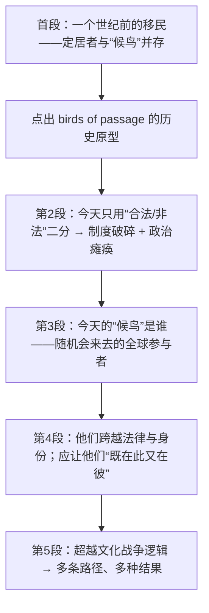

# The New Birds of Passage 精读笔记

## 背景

本文是 2013 年考研英语一 Text 2，主题是美国移民政策，核心概念是 **"birds of passage"（候鸟移民）**——那些并非打算永久定居，而是随机会而来、赚够钱就走的跨国流动者。

作者的论证分四步推进：

- **历史回溯**：一个世纪前（1908–1915）横渡大西洋的移民中，既有想在美国安家的**定居者**（settlers），也有无意久留的**旅居者**（sojourners）；约四分之一意大利移民最终**永久返回**故乡，他们被称为"候鸟"。
- **批评现状**：今天我们把移民简单划分为"合法／非法、好／坏"两类，要么**称赞**他们"正在成为美国人"，要么**打上**"应被驱逐的外国人"的标签。这种二元框架造就了破碎的移民制度与长期的政治瘫痪。
- **刻画新候鸟**：今天的"候鸟"是采摘工、小提琴手、建筑工人、创业者、工程师、护理员与物理学家；他们随机会来去，能在异地有工作、在故乡有家庭，轻松跨越法律与身份的界限。
- **提出主张**：要接纳这个"流动的世界"，双方都需要新态度——**超越"对与错"的文化战争逻辑**，承认移民管理需要多条路径、多种结果。

本文已保留排版原文中的长难句分析 callout（共 7 处）；`sentence-analysis.md` 未单独提供，因此不再重复建立独立分析章节。

---

## 文章原文

# The New Birds of Passage

A century ago, the **immigrants** from across the Atlantic included settlers and **sojourners**.

Along with the many folks looking to make a **permanent** home in the United States came those who had no intention to stay, and who would make some money and then go home.

> [!abstract]- 长难句分析
> **原句**：Along with the many folks looking to make a **permanent** home in the United States came those who had no intention to stay, and who would make some money and then go home.
>
> **主干提取**
> - 状语 A: Along with the many folks looking to make a permanent home in the United States
> - 谓语 V: came（完全倒装，谓语前置）
> - 主语 S: those（真正的主语在谓语之后）
> - 定语从句1: who had no intention to stay（修饰 those）
> - 定语从句2: who would make some money and then go home（与从句1并列，修饰 those）
>
> **修饰成分**：
>
> | 修饰成分 | 类型 | 引导词 | 修饰对象 |
> |------|------|--------|----------|
> | Along with the many folks ... in the United States | 介词短语（伴随状语） | Along with | came，说明"与……一同到来" |
> | looking to make a permanent home in the United States | 非谓语（现在分词短语作后置定语） | — | the many folks，说明这些人的目的 |
> | to make a permanent home | 非谓语（不定式作宾语） | to | looking，说明"谋求什么" |
> | who had no intention to stay | 定语从句（并列从句1） | who | those |
> | who would make some money and then go home | 定语从句（并列从句2） | who | those |
> | to stay | 非谓语（不定式作定语） | to | intention |
> | make some money and then go home | 并列谓语 | and | who（从句2内部） |
>
> **结构图解**：
> ```
> 倒装主句: Along with the many folks [looking to make a permanent home in the US] came those
>   ├── 状语（介词短语，句首）: Along with the many folks
>   │     └── 后置定语（现在分词）: looking to make a permanent home in the United States
>   ├── 谓语 V（前置）: came
>   └── 主语 S（后置）: those
>         ├── 定语从句1: who had no intention to stay
>         └── 定语从句2: who would make some money and then go home
> ```
>
> **参考译文**：与众多想在美国安下永久之家的人一同到来的，还有那些无意久留、打算挣些钱就回国的人。
>
> **考点提示**：本句是**完全倒装**——主语 those 后置、谓语 came 前置，只因句首是 Along with ... 这一介词短语；正常语序为 Those who ... came along with the many folks ...。识别方法：当主语带 who 定语从句且较长时，作者常把它移到句尾以保持平衡。两个 who 从句由 and 并列，共同修饰 those，切勿把第二个 who 误判为修饰 money。

Between 1908 and 1915, about 7 million people arrived while about 2 million **departed**.

About a quarter of all Italian immigrants, for example, eventually returned to Italy **for good**.

They even had an **affectionate** nickname, “uccelli di passaggio,” **birds of passage**.

Today, we are much more **rigid** about immigrants.

We divide **newcomers** into two categories: legal or illegal, good or bad.

We **hail** them as Americans in the making, or **brand** them as **aliens** to be kicked out.

> [!abstract]- 长难句分析
> **原句**：We **hail** them as Americans in the making, or **brand** them as **aliens** to be kicked out.
>
> **主干提取**
> - 主语 S: We
> - 谓语 V: hail ... or brand（两个并列谓语）
> - 宾语 O: them
> - 宾语补足语 C1: as Americans in the making
> - 宾语补足语 C2: as aliens to be kicked out
>
> **修饰成分**：
>
> | 修饰成分 | 类型 | 引导词 | 修饰对象 |
> |------|------|--------|----------|
> | as Americans in the making | 介词短语（宾语补足语） | as | them，与 hail 构成 hail sb. as sth. |
> | in the making | 介词短语（后置定语） | in | Americans，意为"正在形成中的" |
> | or brand | 并列谓语 | or | 与 hail 并列，构成正反两面的对照 |
> | as aliens | 介词短语（宾语补足语） | as | them，与 brand 构成 brand sb. as sth. |
> | to be kicked out | 非谓语（不定式被动，作后置定语） | to | aliens，说明这些"外国人"的处境 |
>
> **结构图解**：
> ```
> 主句: We hail them as Americans in the making, or brand them as aliens
>   ├── S: We
>   ├── 并列谓语1: hail
>   │     ├── O: them
>   │     └── 宾补: as Americans in the making
>   └── 并列谓语2: brand
>         ├── O: them
>         └── 宾补: as aliens
>               └── 后置定语: to be kicked out
> ```
>
> **参考译文**：我们要么称赞他们是正在成长中的美国人，要么把他们标定为应被驱逐的外国人。
>
> **考点提示**：hail / brand 是一对褒贬反义词，搭配同为 `V + sb. + as + n.`，构成强烈对照，是作者态度题的标志词。`in the making` 意为"正在形成中的、未来的"，不要直译"在制作中"。`to be kicked out` 是不定式的**被动式**作后置定语，修饰 aliens，表"将被驱逐的"；kick out 是口语化短语动词，与全篇正式语体形成反差，暗含作者对这种标签化做法的不认同。

That **framework** has contributed mightily to our broken immigration system and the long political **paralysis** over how to fix it.

> [!abstract]- 长难句分析
> **原句**：That **framework** has contributed mightily to our broken immigration system and the long political **paralysis** over how to fix it.
>
> **主干提取**
> - 主语 S: That framework（这种思维框架）
> - 谓语 V: has contributed（现在完成时）
> - 状语 A: mightily（极大地）
> - 介词宾语 O: our broken immigration system and the long political paralysis（contribute to 的两个并列宾语）
> - 后置定语: over how to fix it（修饰 paralysis）
>
> **修饰成分**：
>
> | 修饰成分 | 类型 | 引导词 | 修饰对象 |
> |------|------|--------|----------|
> | mightily | 副词（程度状语） | — | has contributed，强调影响之大 |
> | to our broken immigration system and the long political paralysis | 介词短语（介词宾语） | to | contributed，构成 contribute to |
> | our broken immigration system / the long political paralysis | 并列名词短语 | and | to 的两个并列宾语 |
> | over how to fix it | 介词短语（后置定语） | over | the long political paralysis，说明"围绕……的瘫痪" |
> | how to fix it | 名词性短语（疑问词 + 不定式） | how | over 的宾语 |
>
> **结构图解**：
> ```
> 主句: That framework has contributed mightily
>   ├── S: That framework
>   ├── V: has contributed
>   ├── A: mightily
>   └── 介词宾语（to 的两个并列宾语）:
>         ├── our broken immigration system
>         └── the long political paralysis
>               └── 后置定语（介词短语）: over how to fix it
>                     └── 疑问词 + 不定式: how to fix it
> ```
>
> **参考译文**：这种思维框架在很大程度上造就了我们支离破碎的移民制度，以及在如何修复它的问题上长期的政治瘫痪。
>
> **考点提示**：`contribute to` 在此不是"捐献"，而是"造成、助长（不良结果）"。`over` 在此不是"在……上方"，而是"关于、围绕"，与 paralysis / debate / dispute 等词搭配时表示争议围绕的对象；`how to fix it` 是"疑问词 + 不定式"结构，整体作 over 的宾语，不要当成从句。

We don't need more categories, but we need to change the way we think about categories.

==We need to look beyond strict definitions of legal and illegal.==

To start, we can recognize the new birds of passage, those living and **thriving** in the **gray areas**.

We might then begin to solve our immigration challenges.

Crop pickers, violinists, construction workers, **entrepreneurs**, engineers, home health-care aides and physicists are among today's birds of passage.

They are **energetic** participants in a global economy driven by the **flow** of work, money and ideas.

> [!abstract]- 长难句分析
> **原句**：They are **energetic** participants in a global economy driven by the **flow** of work, money and ideas.
>
> **主干提取**
> - 主语 S: They
> - 谓语 V: are
> - 表语 C: energetic participants
> - 后置定语: in a global economy driven by the flow of work, money and ideas
>
> **修饰成分**：
>
> | 修饰成分 | 类型 | 引导词 | 修饰对象 |
> |------|------|--------|----------|
> | in a global economy | 介词短语（后置定语） | in | participants，说明"哪一领域的参与者" |
> | driven by the flow of work, money and ideas | 非谓语（过去分词短语作后置定语） | — | a global economy，被动关系：经济"被……驱动" |
> | by the flow of work, money and ideas | 介词短语（施动者） | by | driven，说明驱动力 |
> | work, money and ideas | 并列名词短语 | and | of 的三个并列宾语 |
>
> **结构图解**：
> ```
> 主句: They are energetic participants
>   ├── S: They
>   ├── V: are
>   └── C: energetic participants
>         └── 后置定语（介词短语）: in a global economy
>               └── 后置定语（过去分词短语）: driven by the flow of work, money and ideas
>                     └── 施动者: by the flow of work, money and ideas
> ```
>
> **参考译文**：在由工作、资金和思想的流动所驱动的全球经济中，他们是充满活力的参与者。
>
> **考点提示**：`driven by ...` 是过去分词短语作后置定语，与所修饰的 a global economy 是**被动**关系（经济被流动所驱动），不要误读为句子谓语。注意区分 `a global economy driven by`（被动、已完成）与 `a global economy driving`（主动）。`the flow of work, money and ideas` 是三个名词并列作 of 的宾语，与全篇"流动"的主题呼应。

They prefer to come and go as opportunity calls them.

They can manage to have a job in one place and a family in another.

With or without permission, they **straddle** laws, **jurisdictions** and **identities** with ease.

We need them to imagine the United States as a place where they can be productive for a while without **committing** themselves to staying forever.

> [!abstract]- 长难句分析
> **原句**：We need them to imagine the United States as a place where they can be productive for a while without **committing** themselves to staying forever.
>
> **主干提取**
> - 主语 S: We
> - 谓语 V: need
> - 宾语 O: them
> - 宾语补足语 C: to imagine the United States as a place ...（不定式作宾补）
> - 状语 A: for a while（在 where 从句内）
> - 定语从句: where they can be productive for a while without committing themselves to staying forever（修饰 a place）
>
> **修饰成分**：
>
> | 修饰成分 | 类型 | 引导词 | 修饰对象 |
> |------|------|--------|----------|
> | to imagine the United States as a place ... | 非谓语（不定式作宾语补足语） | to | them，与 need 构成 need sb. to do |
> | the United States | 名词短语（imagine 的宾语） | — | imagine |
> | as a place ... | 介词短语（宾语补足语） | as | the United States，构成 imagine A as B |
> | where they can be productive ... | 定语从句 | where | a place |
> | for a while | 介词短语（时间状语） | for | can be productive |
> | without committing themselves to staying forever | 介词短语（否定条件状语） | without | can be productive，说明"无须……" |
> | committing themselves to staying forever | 非谓语（动名词短语） | — | without 的宾语 |
> | to staying forever | 介词短语 | to | committing，构成 commit oneself to doing |
>
> **结构图解**：
> ```
> 主句: We need them [to imagine the United States as a place]
>   ├── S: We
>   ├── V: need
>   ├── O: them
>   └── 宾补（不定式）: to imagine the United States as a place
>         ├── O: the United States
>         └── 宾补: as a place
>               └── 定语从句（where）: they can be productive for a while without committing themselves to staying forever
>                     ├── A: for a while
>                     └── 否定条件状语: without committing themselves to staying forever
>                           └── 动名词: committing themselves to (doing)
> ```
>
> **参考译文**：我们需要让他们把美国想象成一个可以暂时有所作为、而无须承诺永久居留的地方。
>
> **考点提示**：`need sb. to do sth.` 中不定式作**宾语补足语**，不是目的状语；`imagine A as B` 意为"把 A 想象成 B"。`where` 引导定语从句修饰 a place，在从句中作地点状语。`commit oneself to doing` 中 to 是**介词**，后接动名词 staying，是考研高频易错点（不可接动词原形）；without 引导的介词短语在此含"不必、无须"的否定条件意味。

We need them to feel that home can be both here and there and that they can belong to two nations **honorably**.

> [!abstract]- 长难句分析
> **原句**：We need them to feel that home can be both here and there and that they can belong to two nations **honorably**.
>
> **主干提取**
> - 主语 S: We
> - 谓语 V: need
> - 宾语 O: them
> - 宾语补足语 C: to feel + 两个并列 that 宾语从句
> - 宾语从句1: that home can be both here and there
> - 宾语从句2: that they can belong to two nations honorably
>
> **修饰成分**：
>
> | 修饰成分 | 类型 | 引导词 | 修饰对象 |
> |------|------|--------|----------|
> | to feel that ... and that ... | 非谓语（不定式作宾语补足语） | to | them，与 need 构成 need sb. to do |
> | that home can be both here and there | 名词性从句（宾语从句1） | that | feel 的宾语 |
> | both here and there | 并列结构（表语） | both ... and | can be，说明 home 的双重属性 |
> | that they can belong to two nations honorably | 名词性从句（宾语从句2） | that | feel 的宾语，与从句1并列 |
> | to two nations | 介词短语 | to | belong，构成 belong to |
> | honorably | 副词（方式状语） | — | belong，说明"体面地、有尊严地" |
>
> **结构图解**：
> ```
> 主句: We need them [to feel [宾从1] and [宾从2]]
>   ├── S: We
>   ├── V: need
>   ├── O: them
>   └── 宾补（不定式）: to feel
>         ├── 宾语从句1: that home can be both here and there
>         │     └── 表语: both here and there
>         └── 宾语从句2: that they can belong to two nations honorably
>               ├── V: can belong to
>               ├── O: two nations
>               └── A: honorably
> ```
>
> **参考译文**：我们需要让他们感到，家可以既在此处又在彼处，他们可以有尊严地同时属于两个国家。
>
> **考点提示**：两个 that 从句由 and 并列，**同时**作 feel 的宾语，第二个 that 不可省略（长并列结构中省略会导致歧义）。识别技巧：看到 `V + that ... and that ...` 时，先数 that 的个数再划分从句边界。`belong to` 表示"属于"，此处指身份归属；honorably 修饰 belong，强调这种双重归属是体面的而非需要隐瞒的，与上文 **gray areas** 的正面评价相呼应。

**Accommodating** this new world of people in motion will require new attitudes on both sides of the immigration battle.

Looking beyond the culture war logic of right or wrong means opening up the middle ground and understanding that managing immigration today requires **multiple paths** and **multiple outcomes**, including some that are not easy to accomplish legally in the existing system.

> [!abstract]- 长难句分析
> **原句**：Looking beyond the culture war logic of right or wrong means opening up the middle ground and understanding that managing immigration today requires **multiple paths** and **multiple outcomes**, including some that are not easy to accomplish legally in the existing system.
>
> **主干提取**
> - 主语 S: Looking beyond the culture war logic of right or wrong（动名词短语作主语）
> - 谓语 V: means
> - 宾语 O1: opening up the middle ground（动名词短语）
> - 宾语 O2: understanding that ...（动名词短语 + that 宾语从句）
> - 宾语从句: managing immigration today requires multiple paths and multiple outcomes
> - 补充说明: including some that are not easy to accomplish legally in the existing system
>
> **修饰成分**：
>
> | 修饰成分 | 类型 | 引导词 | 修饰对象 |
> |------|------|--------|----------|
> | Looking beyond the culture war logic of right or wrong | 非谓语（动名词短语作主语） | — | 全句主语，指"超越……这一做法" |
> | beyond | 介词 | beyond | 构成 look beyond，意为"超越、不被……限制" |
> | of right or wrong | 介词短语（后置定语） | of | the culture war logic，说明该逻辑的内容 |
> | opening up the middle ground | 非谓语（动名词短语作宾语） | — | means 的宾语1 |
> | understanding that ... | 非谓语（动名词短语作宾语） | — | means 的宾语2，与宾语1并列 |
> | that managing immigration today requires ... | 名词性从句（宾语从句） | that | understanding 的宾语 |
> | multiple paths and multiple outcomes | 并列名词短语 | and | requires 的两个并列宾语 |
> | including some that ... | 介词短语（补充说明） | including | multiple outcomes，作补充举例 |
> | that are not easy to accomplish legally in the existing system | 定语从句 | that | some（指代 some outcomes） |
> | legally / in the existing system | 副词 + 介词短语（状语） | in | to accomplish |
>
> **结构图解**：
> ```
> 主句: [动名词主语] means [动名词宾语1] and [动名词宾语2]
>   ├── S（动名词短语）: Looking beyond the culture war logic of right or wrong
>   │     └── 后置定语: of right or wrong
>   ├── V: means
>   ├── O1（动名词短语）: opening up the middle ground
>   └── O2（动名词短语）: understanding
>         └── 宾语从句: that managing immigration today requires multiple paths and multiple outcomes
>               ├── S: managing immigration today
>               ├── V: requires
>               └── O: multiple paths and multiple outcomes
>                     └── 补充说明（介词短语）: including some
>                           └── 定语从句: that are not easy to accomplish legally in the existing system
> ```
>
> **参考译文**：超越"对与错"的文化战争逻辑，意味着打开中间地带，并认识到当今的移民管理需要多条路径和多种结果，其中一些在现行体制下难以合法实现。
>
> **考点提示**：全句主干是 **动名词作主语 + means + 动名词作宾语**：`Looking ... means opening ... and understanding ...`。识别关键是找准两个并列的动名词宾语，不要被中间的长定语迷惑；means 后接动名词而非不定式（mean to do 意为"打算做"，语义完全不同，是高频辨析点）。`including some that ...` 中 some 后接 that 定语从句，翻译时须补出"其中一些（结果）"。

## 题目

26. “Birds of passage” refers to those who ____.

- [A] find permanent jobs overseas
- [B] leave their home countries for good
- [C] immigrate across the Atlantic
- [D] stay in a foreign country temporarily

27. It is implied in Paragraph 2 that the current immigration system in the US ____.

- [A] needs new immigrant categories
- [B] has loosened control over immigrants
- [C] should be adapted to meet challenges
- [D] has been fixed via political means

28. According to the author, today's birds of passage want ____.

- [A] financial incentives
- [B] a global recognition
- [C] opportunities to get regular jobs
- [D] the freedom to stay and leave

29. The author suggests that the birds of passage today should be treated ____.

- [A] as faithful partners
- [B] with legal tolerance
- [C] with economic favors
- [D] as mighty rivals

30. The most appropriate title for this text would be ____.

- [A] Come and Go: Big Mistake
- [B] Living and Thriving: Great Risk
- [C] Legal or Illegal: Big Mistake
- [D] With or Without: Great Risk

---

## 翻译对照

# The New Birds of Passage 新的“候鸟”

A century ago, the **immigrants** from across the Atlantic included settlers and **sojourners**. Along with the many folks looking to make a **permanent** home in the United States came those who had no intention to stay, and who would make some money and then go home. Between 1908 and 1915, about 7 million people arrived while about 2 million **departed**. About a quarter of all Italian immigrants, for example, eventually returned to Italy **for good**. They even had an **affectionate** nickname, “uccelli di passaggio,” **birds of passage**.

一个世纪前，横渡大西洋而来的**移民**中既有定居者，也有**旅居者**。与众多想在美国安下**永久**之家的人一同到来的，还有那些无意久留、打算挣些钱就回国的人。1908 年至 1915 年间，约 700 万人抵达，而约 200 万人**离开**。例如，在所有意大利移民中，约有四分之一最终**永久**返回了意大利。他们甚至有一个**亲切的**绰号——“uccelli di passaggio”，即**“候鸟”**。

> [!note] 翻译说明
> **sojourner** 指“旅居者、暂居者”，与 settler（定居者）相对，是本文关键词；**for good** 意为“永久地、一劳永逸地”，不要译成“为了好”；末句 `Along with ... came those who ...` 是**完全倒装**（主语 those who ... 后置），翻译时应按“与……一同到来的，还有……”的语序还原。

Today, we are much more **rigid** about immigrants. We divide **newcomers** into two categories: legal or illegal, good or bad. We **hail** them as Americans in the making, or **brand** them as **aliens** to be kicked out. That **framework** has contributed mightily to our broken immigration system and the long political **paralysis** over how to fix it. We don't need more categories, but we need to change the way we think about categories. ==We need to look beyond strict definitions of legal and illegal.== To start, we can recognize the new birds of passage, those living and **thriving** in the **gray areas**. We might then begin to solve our immigration challenges.

如今，我们对移民的态度**僵化**得多。我们把**新来者**划分为两类：合法或非法，好人或坏人。我们要么**称赞**他们是成长中的美国人，要么把他们**打上**应被驱逐的**外国人**的烙印。这种**思维框架**在很大程度上造成了我们支离破碎的移民制度，以及围绕如何修复它而产生的长期政治**瘫痪**。我们不需要更多分类，而是需要改变我们看待分类的方式。==我们需要超越对“合法”与“非法”的严格界定。==首先，我们可以承认新的“候鸟”——那些在**灰色地带**生活和**兴旺发展**的人。这样，我们或许才能着手解决移民难题。

> [!note] 翻译说明
> **hail ... as** 与 **brand ... as** 构成褒贬对照，分别译“称赞为”“污名为/打上……烙印”；**in the making** 意为“正在形成中的、未来的”；**gray areas** 指法律界定模糊的“灰色地带”，是全篇立论的关键比喻。

Crop pickers, violinists, construction workers, **entrepreneurs**, engineers, home health-care aides and physicists are among today's birds of passage. They are **energetic** participants in a global economy driven by the **flow** of work, money and ideas. They prefer to come and go as opportunity calls them. They can manage to have a job in one place and a family in another.

今天的“候鸟”中包括农作物采摘工、小提琴手、建筑工人、**创业者**、工程师、家庭护理员和物理学家。在由工作、资金和思想**流动**所驱动的全球经济中，他们是**充满活力**的参与者。他们宁愿随着机会的召唤来来去去。他们完全能够在一个地方拥有一份工作，而在另一个地方拥有一个家庭。

> [!note] 翻译说明
> **as opportunity calls them** 是拟人化表达，意为“哪里有（工作）机会就去哪里”；**manage to do** 在此不是“勉强做到”，而是“有能力做到、能设法做到”，译“完全能够”更贴合语境。

With or without permission, they **straddle** laws, **jurisdictions** and **identities** with ease. We need them to imagine the United States as a place where they can be productive for a while without **committing** themselves to staying forever. We need them to feel that home can be both here and there and that they can belong to two nations **honorably**.

无论有无许可，他们都轻易地**跨越**法律、**司法辖区**和**身份**的界限。我们需要让他们把美国想象成一个可以在一段时间内有所作为、而无须**承诺**永久居留的地方。我们需要让他们感到，家可以既在此处又在彼处，他们可以**体面地**同时属于两个国家。

> [!note] 翻译说明
> **straddle** 本义“跨坐、横跨”，此处引申为“同时处于（两种规则/身份）之上”，是理解“候鸟”生存状态的核心动词；**jurisdictions** 是法律术语，译“司法辖区/管辖范围”，不可译成“司法权”。

**Accommodating** this new world of people in motion will require new attitudes on both sides of the immigration battle. Looking beyond the culture war logic of right or wrong means opening up the middle ground and understanding that managing immigration today requires **multiple paths** and **multiple outcomes**, including some that are not easy to accomplish legally in the existing system.

要**接纳**这个人口流动的新世界，移民之争的双方都需要新的态度。超越“对与错”的文化战争逻辑，意味着打开中间地带，并认识到当今的移民管理需要**多条路径**和**多种结果**，其中一些在现行体制下难以合法实现。

> [!note] 翻译说明
> **Accommodating** 在此不是“提供住宿”，而是“容纳、接纳（新事物）”；**people in motion** 直译“流动中的人”，与上文 birds of passage 呼应；**culture war** 指美国社会中围绕价值观的“文化战争”；结尾 some that ... 中的 that 指代 outcomes，翻译时需补出“其中一些（结果）”。

## 题目

26. “Birds of passage” refers to those who ____.

“候鸟”指的是那些____的人。

- [A] find permanent jobs overseas
  - 在海外找到固定工作
- [B] leave their home countries for good
  - 永久离开自己的祖国
- [C] immigrate across the Atlantic
  - 横渡大西洋移民
- [D] stay in a foreign country temporarily
  - 暂时待在外国

27. It is implied in Paragraph 2 that the current immigration system in the US ____.

第二段暗示，美国现行的移民制度____。

- [A] needs new immigrant categories
  - 需要新的移民类别
- [B] has loosened control over immigrants
  - 已放松了对移民的管控
- [C] should be adapted to meet challenges
  - 应当作出调整以应对挑战
- [D] has been fixed via political means
  - 已通过政治手段得到修复

28. According to the author, today's birds of passage want ____.

根据作者的观点，今天的“候鸟”想要____。

- [A] financial incentives
  - 经济上的激励
- [B] a global recognition
  - 全球性的认可
- [C] opportunities to get regular jobs
  - 获得正规工作的机会
- [D] the freedom to stay and leave
  - 来去自由

29. The author suggests that the birds of passage today should be treated ____.

作者建议，今天的“候鸟”应当被____。

- [A] as faithful partners
  - 视为忠实的伙伴
- [B] with legal tolerance
  - 以法律上的宽容相待
- [C] with economic favors
  - 给予经济上的优待
- [D] as mighty rivals
  - 视为强大的对手

30. The most appropriate title for this text would be ____.

这篇文章最恰当的标题是____。

- [A] Come and Go: Big Mistake
  - 来去自如：大错特错
- [B] Living and Thriving: Great Risk
  - 生活与兴旺：巨大风险
- [C] Legal or Illegal: Big Mistake
  - 合法或非法：大错特错
- [D] With or Without: Great Risk
  - 有许可或无许可：巨大风险

---

## 语法要点

# 2013 Passage 2 语法要点整理

本篇源笔记主要整理 **for good** 及其四大易混短语（for the good of / do sb good / as good as）的用法。完整的词义谱系、应用场景、感情色彩及全部例句保存在 [[固定搭配与词组笔记]]；本笔记只提取可迁移的语法结构。

---

### 介词短语与副词短语作状语 (Prepositional & Adverbial Phrases as Adverbials)

同一组短语在句中的语法身份并不相同：**for good** 已固化为副词短语，只能作状语且不带宾语；**for the good of** 则是介词短语，必须带名词宾语作目的状语。两者的语法分工，正是易混淆的根源。

| 结构 | 用法 | 例句 |
|------|------|------|
| **for good**（副词短语） | 位于句尾作状语，表示"永久地、一去不复返地"，**后不接宾语** | She left her hometown **for good**. |
| **for the good of + n.**（介词短语） | 作目的状语，表示"为了……的利益"，of 后**必须接名词宾语** | He resigned **for the good of** the company. |
| **give up / quit sth for good** | 动宾结构 + 副词短语作状语，表示"彻底戒除、永久放弃" | He decided to **give up smoking for good**. |
| **close / shut down for good** | 表示"永久关闭、彻底停业"，for good 修饰整个动作 | The old bookstore is **closing for good** next week. |
| **for good and all** | 副词短语的强化形式，作状语，语气更决绝，"一劳永逸地、彻底且毫无保留地" | Let's settle this dispute **for good and all**. |

> [!tip] 识别技巧
> 看 for good 后面**有没有名词**：没有 → 副词短语作状语，"永久地"；有（且中间有 the）→ 介词短语作目的状语，"为了……的利益"。一句话：**for good 不带宾语，for the good of 必须带宾语**。

> [!warning] 常见错误
> 表达"为了……的利益"时漏掉定冠词：`He quit his job for good of his health.` ❌ → `He quit his job for the good of his health.` ✅。漏掉 the 后句子会退化为副词短语 for good，"为了健康而彻底辞职"与"彻底辞了这份工作"语义完全走偏。

---

### 主谓宾结构中的名词作宾语 (Noun as Object)

**do sb good** 是"动词 + 间接宾语 + 名词宾语"的双宾结构，其中 good 已由形容词转为**名词**，表示"好处、益处"。

| 结构 | 用法 | 例句 |
|------|------|------|
| **do sb good** | good 为**名词**作宾语，sb 为间接宾语，表示"对某人有好处" | A cup of hot tea will **do you good**. |

> [!note] 词性辨析
> 三个短语中的 good 词性各不相同，判定词性是区分它们的关键：**for good** 中 good 已固化进副词短语（不独立表意）；**do sb good** 中 good 是名词（好处）；**as good as** 中 good 是形容词（好的）。

---

### 比较结构的引申用法 (Comparison)

**as good as** 由同级比较结构 `as + 形容词原级 + as` 引申而来，作"几乎、实际上等于"讲时**已不表示比较**，而是表示程度接近。

| 结构 | 用法 | 例句 |
|------|------|------|
| **as good as + 过去分词 / 形容词** | 表示"几乎、实际上等于"（= almost / practically） | The project is **as good as** finished. |

> [!warning] 易混淆点
> as good as 有**两副面孔**：真比较义"和……一样好"（This one is as good as that one.）与引申义"几乎、等于"（as good as finished）。判断依据在语境——后面接**过去分词或表状态的形容词**时，通常取"几乎"义，不表示两者比较。

---

### 补充要点

- **定冠词的强制使用**：`for the good of` 中的定冠词 **the** 不可省略。它既是"特指某人的利益"的语义需要，也是与该短语的副词短语形式 **for good** 相区分的语法标记。

---

> 📌 完整的词义谱系（for good 的基本释义、与 forever 的语感差异、三大应用场景）、四大易混短语对照表、典型错误诊断与速记口诀，见 [[固定搭配与词组笔记]]。

---

## 固定搭配与词组

# for good 核心语义 + 四大易混短语辨析 合集

> 📌 **本笔记背景：** 本语言点出自 2013 年考研英语阅读 Passage 2（美国移民政策中的 "birds of passage" 候鸟移民）：
>
> - *"About a quarter of all Italian immigrants, for example, eventually returned to Italy **for good**."*（例如，大约四分之一的意大利移民最终**永久地**回到了意大利。）→ for good 在此取"一去不复返"义，与下文的 *birds of passage*（候鸟般来来去去）形成对照。

纯语法结构整理见 [[grammar-notes]]，跨篇章汇总见 [[固定搭配与词组笔记]]、[[语法总结笔记]]。

---

### 📘 第一部分：for good —— 核心语义与高频场景

#### 一、核心含义

> 💡 for good 表面看似"为了好"，实际是英语中极其高频的**固定成语**，准确含义正是 **永久地 / 彻底地 / 一去不复返地**（= permanently / forever）。

| 对比项 | 说明 |
|--------|------|
| **基本释义** | 永久地 / 彻底地 / 一去不复返地（= permanently / forever） |
| **与 forever 的差异** | 带有一种**"不可逆的终结感"**——通常用来形容离开、关闭、放弃习惯或彻底告别 |

---

#### 二、三大核心应用场景

##### 场景 1：戒除习惯 / 放弃 —— quit / give up sth for good

> He decided to **give up smoking for good**.
> （他下定决心彻底把烟戒了，再也不抽。）

##### 场景 2：彻底离开、不再回来 —— leave for good

> After graduating from college, she **left her hometown for good**.
> （大学毕业后，她永远离开了家乡。）

##### 场景 3：永久关闭 / 破产停业 —— shut down / close for good

> The old bookstore across the street is **closing for good** next week.
> （街对面那家老书店下周就要永久关门停业了。）

---

#### 三、完整形态拓展：for good and all

> 📌 口语和文学中常加长为 **for good and all**，语气更加决绝，强调"**一劳永逸地 / 彻底且毫无保留地**"。

> Let's settle this dispute **for good and all**.
> （让我们一劳永逸地彻底解决这场争端。）

---

### 📘 第二部分：四大易混短语辨析（考试极易混淆）

#### 一、对照表

| 短语 | 词义与考点 | 典型例句 |
|------|-----------|---------|
| **for good** | 永久地、彻底地（**副词短语，后不接宾语**） | She left him **for good**. |
| **for the good of...** | 为了……的利益 / 好处（**接名词宾语**） | He resigned **for the good of** the company.（为了公司的利益） |
| **do sb good** | 对某人有好处（**动词短语，good 为名词**） | A cup of hot tea will **do you good**.（喝杯热茶会对你有好处。） |
| **as good as** | 几乎 / 实际上等于（= almost / practically） | The project is **as good as** finished.（项目几乎已经完成了。） |

---

#### 二、典型错误诊断

> ⚠️ 最容易错在"**为了……的好处**"这一义项上——必须加定冠词 **the**。

| 句子 | 判断 | 说明 |
|------|------|------|
| He quit his job **for good of** his health. | ❌ | 表达"为了健康"，必须加定冠词 the：**for the good of** his health |
| He quit his job **for good**. | ✅ | 他彻底辞去了这份工作，再也不干了。 |

---

#### 三、速记卡片

> 🎯 for good 单独放句尾，不是"为了好"，而是"永久了"；
> 若是为了谁的好，中间必须把 **the** 找（**for the good of**）；
> 加长变成 **for good and all**，一劳永逸彻底搞好。

---

## 生词表

### A-C

| 词汇 | 词性 | 含义 | 原文例句 |
|------|------|------|----------|
| **Accommodating** | 现在分词（作动名词）/ adj. | 接纳；容纳；（作形容词）乐于助人的 | "**Accommodating** this new world of people in motion will require new attitudes on both sides of the immigration battle." |
| **affectionate** | adj. | 亲切的；充满深情的 | "They even had an **affectionate** nickname, “uccelli di passaggio,” **birds of passage**." |
| **aliens** | n. | 外国人；外侨（考研常考义项，非"外星人"） | "We **hail** them as Americans in the making, or **brand** them as **aliens** to be kicked out." |
| **birds of passage** | n. phr. | "候鸟"（喻指随机会来去、不长期定居的人）；旅居者 | "They even had an affectionate nickname, “uccelli di passaggio,” **birds of passage**." |
| **brand** | v. / n. | v. 打上烙印；给……贴上（贬义）标签；n. 品牌 | "We hail them as Americans in the making, or **brand** them as aliens to be kicked out." |
| **committing** | 现在分词（commit） | 承诺；投入；犯（错）；**commit oneself to doing sth** 承诺做某事 | "...without **committing** themselves to staying forever." |

### D-L

| 词汇 | 词性 | 含义 | 原文例句 |
|------|------|------|----------|
| **departed** | v.（depart 的过去式/过去分词） | 离开；出发（正式用语） | "Between 1908 and 1915, about 7 million people arrived while about 2 million **departed**." |
| **energetic** | adj. | 精力充沛的；充满活力的 | "They are **energetic** participants in a global economy driven by the **flow** of work, money and ideas." |
| **entrepreneurs** | n. | 创业者；企业家 | "Crop pickers, violinists, construction workers, **entrepreneurs**, engineers, home health-care aides and physicists are among today's birds of passage." |
| **flow** | n. / v. | n. 流动；流量；v. 流动；流出 | "...driven by the **flow** of work, money and ideas." |
| **for good** | 副词短语 | 永久地；一去不复返地（**不是**"为了好"） | "About a quarter of all Italian immigrants, for example, eventually returned to Italy **for good**." |
| **framework** | n. | 框架；思维框架；体制 | "That **framework** has contributed mightily to our broken immigration system and the long political **paralysis** over how to fix it." |
| **gray areas** | n. phr. | 灰色地带；界定模糊的领域 | "To start, we can recognize the new birds of passage, those living and **thriving** in the **gray areas**." |
| **hail** | v. / n. | v. 称赞；把……誉为；招呼；n. 冰雹 | "We **hail** them as Americans in the making, or **brand** them as aliens to be kicked out." |
| **honorably** | adv. | 体面地；光明正大地；有尊严地 | "We need them to feel that home can be both here and there and that they can belong to two nations **honorably**." |
| **identities** | n. | 身份；特性；认同 | "With or without permission, they **straddle** laws, **jurisdictions** and **identities** with ease." |
| **immigrants** | n. | 移民（迁入者） | "A century ago, the **immigrants** from across the Atlantic included settlers and **sojourners**." |
| **jurisdictions** | n. | 司法辖区；管辖范围（法律术语） | "With or without permission, they straddle laws, **jurisdictions** and identities with ease." |

### M-R

| 词汇 | 词性 | 含义 | 原文例句 |
|------|------|------|----------|
| **multiple outcomes** | n. phr. | 多种结果 | "...requires **multiple paths** and **multiple outcomes**, including some that are not easy to accomplish legally in the existing system." |
| **multiple paths** | n. phr. | 多条路径 | "...managing immigration today requires **multiple paths** and **multiple outcomes**..." |
| **newcomers** | n. | 新来者；新移民 | "We divide **newcomers** into two categories: legal or illegal, good or bad." |
| **paralysis** | n. | 瘫痪；停滞不前 | "...and the long political **paralysis** over how to fix it." |
| **permanent** | adj. | 永久的；长期的（↔ temporary 暂时的） | "Along with the many folks looking to make a **permanent** home in the United States came those who had no intention to stay..." |
| **rigid** | adj. | 僵化的；死板的；（物理上）僵硬的（↔ flexible 灵活的） | "Today, we are much more **rigid** about immigrants." |

### S-W

| 词汇 | 词性 | 含义 | 原文例句 |
|------|------|------|----------|
| **sojourners** | n. | 旅居者；暂居者（与 settler 定居者相对，本文关键词） | "A century ago, the immigrants from across the Atlantic included settlers and **sojourners**." |
| **straddle** | v. | 跨越；横跨；（同时）处于两种状态 | "With or without permission, they **straddle** laws, **jurisdictions** and **identities** with ease." |
| **thriving** | 现在分词（thrive） | 兴旺发达；茁壮成长 | "...those living and **thriving** in the **gray areas**." |

### 生词练习

**一、选词填空**

从方框中选择合适的词汇填入空白处（每词限用一次）：

> rigid / brand / straddle / departed / permanent / thriving / paralysis / sojourners / framework / hail

1. The old firm stayed ________ about remote work, so half of its best engineers quit.

2. Critics often ________ such plans as short-sighted and wasteful.

3. The new metro line will ________ three districts and cut commuting time in half.

4. My grandfather ________ from Shanghai in 1938 and never went back.

5. Few of these seasonal workers want ________ residence; most go home after the harvest.

6. Small independent bookshops are still ________ in this city, despite the online giants.

7. Political ________ over the budget has frozen the government for months.

8. A century ago, many Italian ________ made some money in America and then went home.

9. That legal ________ treats every migrant as either legal or illegal, leaving no middle ground.

10. Instead of treating them as a burden, we should ________ these new arrivals as partners.

> [!abstract]- 答案
> 1. **rigid**（僵化的；死板的）
> 2. **brand**（把……贴上标签）
> 3. **straddle**（跨越；横跨）
> 4. **departed**（离开；出发）
> 5. **permanent**（永久的）
> 6. **thriving**（兴旺发达）
> 7. **paralysis**（瘫痪；停滞）
> 8. **sojourners**（旅居者）
> 9. **framework**（框架；思维框架）
> 10. **hail**（称赞；把……誉为）

**二、短语翻译**

将下列短语翻译成中文：

1. return to Italy **for good**

2. living and thriving in the **gray areas**

3. come and go **as opportunity calls them**

> [!abstract]- 答案
> 1. **return to Italy for good** = 永久地回到意大利（一去不复返；**不是**"为了好处回到意大利"）
> 2. **living and thriving in the gray areas** = 在（法律界定模糊的）灰色地带生活和兴旺发展
> 3. **come and go as opportunity calls them** = 随机会的召唤来去自如；哪里有机会就去哪里

**三、语境理解**

根据上下文，选择正确的词义：

1. "About a quarter of all Italian immigrants, for example, eventually returned to Italy **for good**." 中 **for good** 的含义是：
   - A. 为了得到好处
   - B. 出于善意
   - C. 永久地，一去不复返地
   - D. 为了健康

2. "We **hail** them as Americans in the making, or **brand** them as aliens to be kicked out." 中 **hail** 的含义是：
   - A. 下冰雹
   - B. 称赞；把……誉为
   - C. 大声呼喊以引起注意
   - D. 驱赶

3. "With or without permission, they **straddle** laws, jurisdictions and identities with ease." 中 **straddle** 的含义是：
   - A. 骑马前行
   - B. 严厉限制
   - C. 严格遵守
   - D. 跨越；同时处于（两种规则或状态）之中

> [!abstract]- 答案
> 1. **C** — for good 是固定副词短语，意为"永久地、一去不复返地"，与下文 birds of passage（来来去去）形成对照；若理解为"为了好处"，第 26 题的定位就会出错。
> 2. **B** — hail sb. as sth. 意为"把某人誉为/称赞为……"，与后半句 brand ... as ...（贴上贬义标签）构成褒贬对照，是作者态度题的标志词；hail 作名词时才表示"冰雹"。
> 3. **D** — straddle 本义"跨坐、横跨"，此处引申为"同时处于（法律、辖区、身份）两种状态之上"，正是"候鸟"生存状态的核心动词。

---

## 心得

> [!tip] 主旨把握
> 全文围绕 **"birds of passage"（候鸟移民）** 这一核心比喻展开。作者先做**历史对照**：一个世纪前的移民中，定居者与"赚够就走"的旅居者并存，后者甚至有个亲切的绰号；再做**现实批判**：今天只用"合法／非法"的二分法看待移民，这种框架正是移民制度破碎与政治瘫痪的根源。最后给出**主张**：承认并接纳新的"候鸟"，超越"对与错"的文化战争逻辑，因为移民管理需要**多条路径、多种结果**。

> [!tip] 命题线索
> - **词义题（第 26 题）**：定位首段 `had no intention to stay` / `make some money and then go home` / `returned to Italy for good`，三者同指**短暂居留、终将离开** → [D] stay in a foreign country temporarily。
> - **推断题（第 27 题）**：第 2 段先说框架"造就了破碎的制度与长期瘫痪"，随后说 `We don't need more categories`，直接排除 [A]；作者主张改变思考方式，即制度**应当调整以应对挑战** → [C]。
> - **细节题（第 28 题）**：第 3 段 `They prefer to come and go as opportunity calls them` → 想要的是**来去自由** → [D] the freedom to stay and leave。
> - **态度/建议题（第 29 题）**：第 4 段 `With or without permission, they straddle laws ...` 与末段 `including some that are not easy to accomplish legally` 都指向**法律上的宽容**，而非经济优待或敌对 → [B] with legal tolerance。
> - **主旨/标题题（第 30 题）**：全文批判的正是"合法或非法"这一二元框架（`We don't need more categories`、`look beyond strict definitions of legal and illegal`），故标题为 [C] **Legal or Illegal: Big Mistake**。

> [!warning] 易错点
> - **`for good` ≠ "为了好"**：首段的 `returned to Italy for good` 是"永久返回"，不是"为了好处返回"，这是第 26 题的定位关键。
> - **`contribute to` 在此是"造成（坏结果）"**，不是"捐献"；`over` 是"关于、围绕"而非"在……上方"。
> - **`to be kicked out`** 是不定式**被动式**作后置定语，修饰 aliens，不是句子谓语。
> - **`commit oneself to doing`** 中 to 是介词，后接动名词；误接动词原形是最高频失分点。
> - **`hail ... as` 与 `brand ... as`** 是褒贬对照的标志词，态度题常据此设选项。
> - `Long looking / Looking beyond ...` 作**动名词主语**时，谓语用单数 `means`。

### 论证结构



---

## 延伸

- **背景延伸**：`birds of passage` 是移民研究中的经典概念，最初用来描述 19 世纪末至 20 世纪初大量**往返于欧美之间**的意大利、东欧移民——他们赴美打工数年便回乡，并非"一去不回"。article 正是借这一历史概念反衬今天"非定居即非法"的单一想象。
- **文化背景**：`culture war`（文化战争）指美国社会中围绕价值观与身份认同的长期对立；作者把它作为需要**超越**的思维框架，与 `the middle ground`（中间地带）相对。
- **词汇复习**：`sojourner`、`for good`、`rigid`、`hail`、`brand`、`alien`、`framework`、`paralysis`、`thrive`、`gray area`、`straddle`、`jurisdiction`、`accommodate`、`multiple paths / outcomes`。
- **联动复习**：语法结构见 [[语法总结笔记]]，固定搭配见 [[固定搭配与词组笔记]]；可对照 [[2013-passage1-average-is-over-精读笔记]]（同为 2013 年真题，均以"旧框架已失效、需要新思路"立论），并比较 [[2012-passage4-recession-精读笔记]] 中"结构性变化"的论证方式。
- **建议**：用英文复述"历史对照 → 现实批判 → 新对象刻画 → 政策主张"这条论证链，并练习把 `legal or illegal` 这一对立框架改写为作者主张的表述。

---

## 思考题

1. 作者为什么先写 1908–1915 年的移民数据，再转入"Today, we are much more rigid"？这种**古今对照**的结构对全文论点起了什么作用？
2. 首段 `Along with the many folks looking to make a permanent home ... came those who had no intention to stay` 是何种句式？把它还原为正常语序后，作者为什么不那样写？
3. 第 2 段 `We hail them as Americans in the making, or brand them as aliens to be kicked out` 中，hail 与 brand 的对立体现了作者怎样的态度？若把 brand 换成 call，表达效果有何损失？
4. 第 4 段 `without committing themselves to staying forever` 中 commit 后为何接 staying 而非 stay？请说明 `commit oneself to doing sth` 的语法依据，并再举一例。
5. 末段 `including some that are not easy to accomplish legally in the existing system` 是否意味着作者主张**违法**？请结合全文立场，评价这一表述的分寸与风险。

---

## 相关笔记

- [[语法总结笔记]]
- [[固定搭配与词组笔记]]
- [[2013-passage1-average-is-over-精读笔记]]
- [[2012-passage4-recession-精读笔记]]
- [[grammar-notes]]
