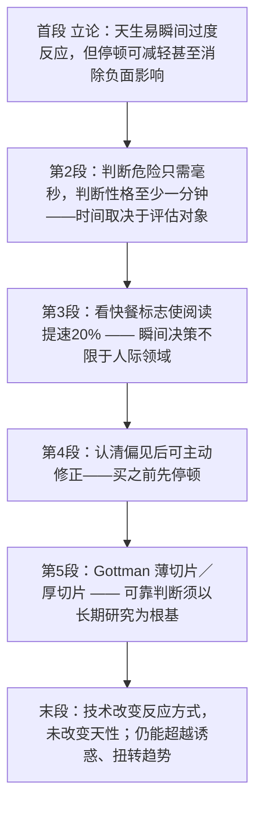

# Snap Decisions 精读笔记

## 背景

本文是 2013 年考研英语一 Text 3，主题是**"瞬间决策"（snap decisions）与自我控制**。文章从生物学与心理学两条线解释：我们为何天生就容易作出瞬间的过度反应，以及为什么这种能力既可能是保护性的"防御机制"，也可能带来偏差。

作者的论证分五步推进：

- **提出论断**：我们天生（**hard-wired**）容易对刺激作出瞬间的过度反应；但只要**稍作停顿**、想一想自己可能如何反应，就能减轻甚至消除其负面影响。
- **区分时限**：判断一个人是否**危险**只需几毫秒，而要判断其**性格**（如神经质、思想开明程度）则至少需要一分钟，**最好是五分钟**——所需时间取决于评估对象。
- **拓展领域**：瞬间决策并不**仅限于**人际交往领域。仅仅观看快餐标志几毫秒，就能促使我们阅读提速 20%——因为我们会无意识地把快餐与"快速、急躁"联系在一起，并把这种冲动**带入**其他事情。
- **给出出路**：既然知道看到笑脸会对消费品反应过度、知道女性招聘者更易拒绝有魅力的女性应聘者，我们就可以**主动修正**——购买前稍作停顿，或聘请外部筛选人员。
- **深化并收束**：婚姻专家 Gottman 指出，可靠的瞬间判断（"**薄切片**"）必须建立在"**厚切片**"式的长期研究之上。技术可能改变我们作出反应的方式，却**没有改变我们的天性**；我们仍然拥有超越诱惑、扭转高速趋势的想象力。

本文已保留排版原文中的长难句分析 callout（共 5 处）；`sentence-analysis.md` 未单独提供，因此不再重复建立独立分析章节。

---

## 文章原文

# 2013 Passage 3

Scientists have found that although we are **prone** to **snap** overreactions, if we take a moment and think about how we are likely to react, we can reduce or even eliminate the negative effects of our quick, **hard-wired** responses.

> [!abstract]- 长难句分析
> **原句**：Scientists have found that although we are prone to snap overreactions, if we take a moment and think about how we are likely to react, we can reduce or even eliminate the negative effects of our quick, hard-wired responses.
>
> **主干提取**：
>
> - 主语 S: Scientists（科学家们）
> - 谓语 V: have found（已经发现）
> - 宾语 O: that 引导的宾语从句（整个 that ... responses）
>
> **修饰成分**：
>
> | 类型 | 引导词 | 修饰对象 |
> |------|--------|----------|
> | 名从（宾语从句） | that | 作 have found 的宾语 |
> | 状从（让步） | although | 宾语从句内部的让步状语 |
> | 介短 | to（be prone to） | 与 prone 搭配，引出"易于……"的对象 |
> | 状从（条件） | if | 宾语从句内部的条件状语 |
> | 名从（宾语从句） | how | 作 think about 的宾语 |
> | 介短 | of | the negative effects（说明"负面影响"的来源） |
>
> **结构图解**：
>
> ```
> 主句: Scientists + have found + [that 宾语从句]
>   └── 宾语从句: (that ...) → 作 have found 的宾语
>         ├── 让步状语从句: (although we are prone to snap overreactions) → 先让步
>         ├── 条件状语从句: (if we take a moment and think about ...) → 再条件
>         │     └── 宾语从句: (how we are likely to react) → 作 think about 的宾语
>         └── 从句主干: (we can reduce or even eliminate the negative effects)
>               ├── 谓语并列: (reduce or even eliminate) → or 连接，even 表递进
>               └── 介短: (of our quick, hard-wired responses) → 修饰 the negative effects
> ```
>
> **参考译文**：科学家们发现，尽管我们容易作出瞬间的过度反应，但如果我们稍作停顿，想一想自己可能会如何反应，就能减轻甚至消除这种快速、本能的反应所带来的负面影响。
>
> **考点提示**：宾语从句内部"先让步、再条件、主句最后出现"，是考研长难句最典型的"主句后置"结构——阅读时应先跳过 although / if 两个从句，直接锁定从句主干 we can reduce or even eliminate the negative effects；另需注意 be prone to 中的 to 是介词（后接名词），不可误判为不定式符号。

Snap decisions can be important defense **mechanisms**; if we are judging whether someone is dangerous, our brains and bodies are hard-wired to react very quickly, within milliseconds. But we need more time to assess other factors. To accurately tell whether someone is sociable, studies show, we need at least a minute, **preferably** five. It takes a while to judge complex aspects of personality, like neuroticism or open-mindedness.

But snap decisions in reaction to rapid stimuli aren't **exclusive** to the interpersonal realm. Psychologists at the University of Toronto found that viewing a fast-food logo for just a few milliseconds primes us to read 20 percent faster, even though reading has little to do with eating. We unconsciously associate fast food with speed and impatience and carry those impulses into whatever else we're doing. Subjects exposed to fast-food **flashes** also tend to think a musical piece lasts too long.

> [!abstract]- 长难句分析
> **原句**：Psychologists at the University of Toronto found that viewing a fast-food logo for just a few milliseconds primes us to read 20 percent faster, even though reading has little to do with eating.
>
> **主干提取**：
>
> - 主语 S: Psychologists（心理学家）
> - 谓语 V: found（发现）
> - 宾语 O: that 引导的宾语从句
>
> **修饰成分**：
>
> | 类型 | 引导词 | 修饰对象 |
> |------|--------|----------|
> | 介短 | at | Psychologists（说明所属机构） |
> | 名从（宾语从句） | that | 作 found 的宾语 |
> | 非谓语（动名词短语） | viewing | 作宾语从句的主语 |
> | 介短 | for | viewing（说明观看时长） |
> | 非谓语（不定式） | to read | 作宾语补足语，补充说明 us |
> | 状从（让步） | even though | 说明"阅读提速"与"进食无关"的反差 |
>
> **结构图解**：
>
> ```
> 主句: Psychologists + found + [that 宾语从句]
>   ├── 介短: (at the University of Toronto) → 修饰 Psychologists
>   └── 宾语从句: (that ...) → 作 found 的宾语
>         ├── 主语: (viewing a fast-food logo for just a few milliseconds) → 动名词短语作主语
>         │     └── 介短: (for just a few milliseconds) → 修饰 viewing
>         ├── 谓语: (primes) → 第三人称单数，与动名词主语一致
>         ├── 宾语: (us)
>         ├── 宾语补足语: (to read 20 percent faster) → 补充说明 us
>         └── 让步状语从句: (even though reading has little to do with eating)
> ```
>
> **参考译文**：多伦多大学的心理学家发现，仅仅观看快餐标志几毫秒，就会促使我们的阅读速度提高 20%，尽管阅读与进食几乎毫无关系。
>
> **考点提示**：宾语从句的主语是动名词短语 viewing a fast-food logo，谓语用第三人称单数 primes——考场上须先找到谓语，才能从长定语中锁定主语；prime sb. to do sth. 意为"使某人准备好做某事"，us 为宾语、to read 为宾语补足语，不可误判为目的状语；have little to do with 意为"与……几乎无关"，是含否定意味的固定搭配，不可按字面译成"几乎没有事情要做"。

Yet we can reverse such influences. If we know we will overreact to consumer products or housing options when we see a happy face (one reason good sales representatives and real estate agents are always smiling), we can take a moment before buying. If we know female job screeners are more likely to reject attractive female applicants, we can help screeners understand their biases—or hire outside screeners.

> [!abstract]- 长难句分析
> **原句**：If we know we will overreact to consumer products or housing options when we see a happy face (one reason good sales representatives and real estate agents are always smiling), we can take a moment before buying.
>
> **主干提取**：
>
> - 主语 S: we（我们）
> - 谓语 V: can take（可以拿出）
> - 宾语 O: a moment（片刻）
> - 状语 A: before buying（购买之前）；If ... 条件状语从句
>
> **修饰成分**：
>
> | 类型 | 引导词 | 修饰对象 |
> |------|--------|----------|
> | 状从（条件） | if | 主句 we can take a moment |
> | 名从（宾语从句，省略 that） | — | 作 know 的宾语 |
> | 状从（时间） | when | 宾语从句谓语 will overreact |
> | 插入语（同位语） | 括号 | 说明优秀销售代表和房地产经纪人总是面带微笑的原因（即顾客看到笑脸容易反应过度） |
> | 定从（省略 that） | — | one reason |
> | 介词 + 动名词 | before + buying | 逻辑主语与主句主语 we 一致 |
> | 介短 | to（overreact to） | 与 overreact 搭配，引出反应对象 |
>
> **结构图解**：
>
> ```
> 主句: we + can take + a moment
>   ├── 条件状语从句: (If we know ...) → 条件
>   │     └── 宾语从句: (that) we will overreact to consumer products or housing options  ← that 省略
>   │           ├── 介短: (to consumer products or housing options) → 与 overreact 搭配
>   │           └── 时间状语从句: (when we see a happy face)
>   │                 └── 插入语: (one reason ...) → 说明销售代表和经纪人总是面带微笑的原因
>   │                       └── 定语从句: (that) good sales representatives ... are always smiling  ← that 省略
>   └── 时间状语: (before buying) → 修饰 take a moment
> ```
>
> **参考译文**：如果我们知道自己看到笑脸时会对消费品或住房选择反应过度（这正是优秀销售代表和房地产经纪人总是面带微笑的原因之一），我们就可以在购买之前稍作停顿。
>
> **考点提示**：本句在条件状语从句内连续省略两处 that（know 后的宾语从句、one reason 后的定语从句），是考研高频的"省略 that 的识别"考点；括号内容为插入语，阅读时应先跳过、锁定主干 If we know ..., we can take a moment；before buying 是"介词 + 动名词"，其逻辑主语与主句主语 we 一致（若按连词分析，buying 则视为现在分词，考研资料两说并存，本笔记统一按介词处理）。

John Gottman, the marriage expert, explains that we quickly “thin slice” information reliably only after we ground such snap reactions in “thick sliced” long-term study. When Dr. Gottman really wants to assess whether a couple will stay together, he invites them to his island retreat for a much longer evaluation: two days, not two seconds.

> [!abstract]- 长难句分析
> **原句**：John Gottman, the marriage expert, explains that we quickly “thin slice” information reliably only after we ground such snap reactions in “thick sliced” long-term study.
>
> **主干提取**：
>
> - 主语 S: John Gottman（约翰·戈特曼）
> - 同位语: the marriage expert（婚姻专家，说明主语身份）
> - 谓语 V: explains（解释说）
> - 宾语 O: that 引导的宾语从句
>
> **修饰成分**：
>
> | 类型 | 引导词 | 修饰对象 |
> |------|--------|----------|
> | 同位语 | 双逗号 | John Gottman |
> | 名从（宾语从句） | that | 作 explains 的宾语 |
> | 状从（时间） | only after | 宾语从句谓语 thin slice |
> | 介短 | in（ground ... in） | 与 ground 搭配，引出"建立于其上的基础" |
>
> **结构图解**：
>
> ```
> 主句: John Gottman + explains + [that 宾语从句]
>   ├── 同位语: (the marriage expert) → 说明 John Gottman 的身份
>   └── 宾语从句: (that ...) → 作 explains 的宾语
>         ├── 主语: (we)
>         ├── 谓语: ("thin slice") → 名词动用，加引号表术语借用
>         ├── 宾语: (information)
>         ├── 状语: (quickly) (reliably) → 方式与程度
>         └── 时间状语从句: (only after we ground such snap reactions ...)
>               └── 介短: (in "thick sliced" long-term study) → 与 ground 搭配
> ```
>
> **参考译文**：婚姻专家约翰·戈特曼解释说，只有当我们把这种瞬间反应建立在"厚切片"式的长期研究之上，我们才能可靠地快速"薄切片"信息。
>
> **考点提示**：only 修饰状语且位于句首时，其后主句须部分倒装（only + 状语 + 助动词 + 主语）；本句中 only after 从句出现在宾语从句谓语之后、并未置于句首，故不倒装——"倒装与不倒装"的辨析是同一考点上的常见陷阱。ground A in B 意为"把 A 建立在 B 的基础之上"，in 与 ground 是固定搭配而非地点状语；thin slice 此处名词动用（thin-slicing 指凭极少信息快速判断）。

Our ability to mute our hard-wired reactions by pausing is what differentiates us from animals: dogs can think about the future only intermittently or for a few minutes. But historically we have spent about 12 percent of our days contemplating the longer term. Although technology might change the way we react, it hasn't changed our nature. We still have the imaginative capacity to rise above temptation and reverse the high-speed trend.

> [!abstract]- 长难句分析
> **原句**：Our ability to mute our hard-wired reactions by pausing is what differentiates us from animals: dogs can think about the future only intermittently or for a few minutes.
>
> **主干提取**：
>
> - 主语 S: Our ability（我们的能力）
> - 系动词 V: is（正是）
> - 表语 C: what 引导的表语从句
>
> **修饰成分**：
>
> | 类型 | 引导词 | 修饰对象 |
> |------|--------|----------|
> | 非谓语（不定式） | to mute | Our ability（作后置定语） |
> | 介短 | by | mute（说明手段） |
> | 名从（表语从句） | what | 作 is 的表语 |
> | 介短 | from（differentiate ... from） | 与 differentiate 搭配 |
> | 补充说明 | 冒号 | 对主句论断作具体例证 |
>
> **结构图解**：
>
> ```
> 主句: Our ability + is + [what 表语从句]
>   ├── 非谓语: (to mute our hard-wired reactions) → 修饰 Our ability
>   │     └── 介短: (by pausing) → 修饰 mute，说明方式
>   └── 表语从句: (what differentiates us from animals)
>         ├── 主语: (what = the thing that) → 在从句中作主语
>         ├── 谓语: (differentiates)
>         ├── 宾语: (us)
>         └── 介短: (from animals) → 与 differentiate 搭配
> 冒号后分句: (dogs can think about the future only intermittently or for a few minutes) → 例证
> ```
>
> **参考译文**：我们通过暂停来抑制本能反应的能力，正是我们区别于动物之处：狗只能断断续续地思考未来，或者只能思考几分钟。
>
> **考点提示**：what 引导表语从句且自身在从句中充当主语（= the thing that），不能换成 that，这是名词性从句的核心考点；主语 Our ability 后的不定式 to mute ... 作后置定语，把谓语 is 推远，须先越过修饰再定位主干；differentiate A from B 意为"使 A 区别于 B"，冒号后内容是对前面论断的具体例证，翻译时用"："保留层次。

## 题目

### 31. The time needed in making decisions may ____.

- [A] vary according to the urgency of the situation
- [B] prove the complexity of our brain reaction
- [C] depend on the importance of the assessment
- [D] **predetermine** the accuracy of our judgment

### 32. Our reaction to a fast-food logo shows that snap decisions ____.

- [A] can be associative
- [B] are not unconscious
- [C] can be dangerous
- [D] are not impulsive

### 33. To reverse the negative influences of snap decisions, we should ____.

- [A] trust our first impression
- [B] do as people usually do
- [C] think before we act
- [D] ask for expert advice

### 34. John Gottman says that reliable snap reactions are based on ____.

- [A] critical assessment
- [B] "thin sliced" study
- [C] sensible explanation
- [D] adequate information

### 35. The author's attitude toward reversing the high-speed trend is ____.

- [A] tolerant
- [B] uncertain
- [C] optimistic
- [D] doubtful

---

## 翻译对照

# 2013 Passage 3 快速决策与自我控制 中英对照

Scientists have found that although we are **prone** to **snap** overreactions, if we take a moment and think about how we are likely to react, we can reduce or even eliminate the negative effects of our quick, **hard-wired** responses.

科学家们发现，尽管我们容易作出瞬间的过度反应，但如果我们稍作停顿，想一想自己可能会如何反应，就能减轻甚至消除这种快速、本能的反应所带来的负面影响。

> [!note] 翻译说明
> **be prone to** 意为“易于……的、有……倾向的”，后接名词或动名词，不可译成“倾向于做某事”之外的引申义；**snap** 本义“咔嚓一声、猝然的”，此处修饰 overreactions 表“瞬间的、不假思索的”；**hard-wired** 原指硬件“硬接线的”，引申为“天生的、本能的、刻在骨子里的”，是本文核心比喻，与后文 mute（抑制）形成对照。

Snap decisions can be important defense **mechanisms**; if we are judging whether someone is dangerous, our brains and bodies are hard-wired to react very quickly, within milliseconds. But we need more time to assess other factors. To accurately tell whether someone is sociable, studies show, we need at least a minute, preferably five. It takes a while to judge complex aspects of personality, like neuroticism or open-mindedness.

瞬间决策可以是重要的防御机制；如果我们在判断某人是否有危险，我们的大脑和身体会本能地在几毫秒之内迅速作出反应。但要评估其他因素，我们则需要更多时间。研究表明，要准确判断一个人是否善于社交，我们至少需要一分钟，最好是五分钟。判断性格中复杂的方面——比如神经质或思想开明程度——是需要花些时间的。

> [!note] 翻译说明
> **within milliseconds** 中的 within 表“在……之内”，强调极短时限，译“几毫秒之内”；**preferably five** 承前省略，补全为 preferably five minutes，译“最好是五分钟”；**neuroticism** 是心理学专业术语，译“神经质”（大五人格维度之一），不要意译成“神经病倾向”。

But snap decisions in reaction to rapid stimuli aren't exclusive to the interpersonal realm. Psychologists at the University of Toronto found that viewing a fast-food logo for just a few milliseconds primes us to read 20 percent faster, even though reading has little to do with eating. We unconsciously associate fast food with speed and impatience and carry those impulses into whatever else we're doing. Subjects exposed to fast-food flashes also tend to think a musical piece lasts too long.

但是，针对快速刺激作出的瞬间决策并不只限于人际交往领域。多伦多大学的心理学家发现，仅仅观看快餐标志几毫秒，就会促使我们的阅读速度提高 20%——尽管阅读与进食几乎毫无关系。我们无意识地会把快餐与快速、急躁联系在一起，并把这种冲动带入我们所做的其他任何事情当中。接触过快餐画面闪现的受试者，还倾向于认为一段音乐持续得太久。

> [!note] 翻译说明
> **stimuli** 是 stimulus 的复数，译“刺激（物）”；**exclusive to** = “仅……独有的、为……所专有的”，此处 `aren't exclusive to the interpersonal realm` 译“并不只限于人际交往领域”；**primes us to do** 意为“使我们做好准备去……、促发我们去……”，是心理学术语 prime（启动/促发效应）的动词用法；**Subjects exposed to ...** 中 exposed to 是后置定语修饰 subjects，译“接触过……的受试者”，不可误读为谓语。

Yet we can reverse such influences. If we know we will overreact to consumer products or housing options when we see a happy face (one reason good sales representatives and real estate agents are always smiling), we can take a moment before buying. If we know female job screeners are more likely to reject attractive female applicants, we can help screeners understand their biases—or hire outside screeners.

然而，我们可以扭转这类影响。如果我们知道自己看到笑脸时会对消费品或住房选择反应过度（这正是优秀销售代表和房地产经纪人总是面带微笑的原因之一），我们就可以在购买之前稍作停顿。如果我们知道女性招聘人员更有可能拒绝有魅力的女性应聘者，我们就可以帮助招聘人员认识到自己的偏见——或者聘请外部招聘人员。

> [!note] 翻译说明
> **reverse** 在此为动词，译“扭转、逆转”，不是“相反”；**housing options** 指“住房（选择）方案”，不宜译成“房屋选项”；**screeners** 指负责初筛简历/面试的“招聘筛选人员”，**outside screeners** 则指“外部（第三方）筛选人员”，作者以此避免内部偏见；括号内 one reason ... 是插入语，解释“笑脸为何出现在销售场景中”，翻译时可保持括号形式。

John Gottman, the marriage expert, explains that we quickly “thin slice” information reliably only after we ground such snap reactions in “thick sliced” long-term study. When Dr. Gottman really wants to assess whether a couple will stay together, he invites them to his island retreat for a much longer evaluation: two days, not two seconds.

婚姻专家约翰·戈特曼（John Gottman）解释说，只有当我们把这种瞬间反应建立在“厚切片”式的长期研究之上，我们才能可靠地快速“薄切片”信息。当戈特曼博士真正想要评估一对夫妇是否会白头偕老时，他会邀请他们到自己的岛上静修处，进行为期长得多的评估：两天，而不是两秒。

> [!note] 翻译说明
> **thin slice** / **thick slice** 源自心理学上的“薄切片”（thin-slicing）理论，指凭极少量的信息快速判断；作者借“厚切片”（长期、大量的观察研究）与之对照，说明可靠的瞬间判断必须以长期研究为根基。**ground A in B** = “把 A 建立在 B 的基础上”，此处 `only after we ground ...` 是时间状语从句，与前面的 only 呼应，译为“只有……之后才……”。**island retreat** 指戈特曼用于研究/静修的岛上住所，译“岛上静修处”。**stay together** 在此指夫妻“不离婚、长相厮守”，译“白头偕老”更贴合语境。

Our ability to mute our hard-wired reactions by pausing is what differentiates us from animals: dogs can think about the future only intermittently or for a few minutes. But historically we have spent about 12 percent of our days contemplating the longer term. Although technology might change the way we react, it hasn't changed our nature. We still have the imaginative capacity to rise above temptation and reverse the high-speed trend.

我们通过暂停来抑制本能反应的能力，正是我们区别于动物之处：狗只能断断续续地思考未来，或者只能思考几分钟。但从历史上看，我们每天约有 12% 的时间在思考更为长远的事情。尽管技术可能改变我们作出反应的方式，但它并没有改变我们的天性。我们仍然拥有超越诱惑、扭转这种高速趋势的想象力。

> [!note] 翻译说明
> **mute** 本义“使（声音）减弱、静音”，此处引申为“抑制、压低”，与前文 hard-wired 形成“本能—抑制”的对照；**differentiate A from B** = “使 A 区别于 B”，句中 what 引导表语从句，译“正是我们区别于动物之处”；**intermittently** 译“断断续续地”；**contemplate** 是“沉思、考虑”，比 think about 更正式，译“思考/沉思”即可；**rise above temptation** 译“超越诱惑”，**reverse the high-speed trend** 即前文 reverse such influences 的呼应，译“扭转这种高速趋势”。

## 题目

### 31.

The time needed in making decisions may ____.

作出决策所需的时间可能____。

- **A.** vary according to the urgency of the situation
  - 因情况的紧迫程度而异
- **B.** prove the complexity of our brain reaction
  - 证明我们大脑反应的复杂性
- **C.** depend on the importance of the assessment
  - 取决于评估的重要性
- **D.** predetermine the accuracy of our judgment
  - 预先决定我们判断的准确性

### 32.

Our reaction to a fast-food logo shows that snap decisions ____.

我们对快餐标志的反应表明，瞬间决策____。

- **A.** can be associative
  - 可以是联想性的
- **B.** are not unconscious
  - 并非无意识的
- **C.** can be dangerous
  - 可能是危险的
- **D.** are not impulsive
  - 并非冲动的

### 33.

To reverse the negative influences of snap decisions, we should ____.

要扭转瞬间决策的负面影响，我们应该____。

- **A.** trust our first impression
  - 相信我们的第一印象
- **B.** do as people usually do
  - 像人们通常那样做
- **C.** think before we act
  - 行动之前先思考
- **D.** ask for expert advice
  - 征求专家意见

### 34.

John Gottman says that reliable snap reactions are based on ____.

约翰·戈特曼说，可靠的瞬间反应建立在____的基础上。

- **A.** critical assessment
  - 批判性的评估
- **B.** "thin sliced" study
  - “薄切片”式研究
- **C.** sensible explanation
  - 合理的解释
- **D.** adequate information
  - 充分的信息

### 35.

The author's attitude toward reversing the high-speed trend is ____.

作者对扭转这种高速趋势所持的态度是____。

- **A.** tolerant
  - 宽容的
- **B.** uncertain
  - 不确定的
- **C.** optimistic
  - 乐观的
- **D.** doubtful
  - 怀疑的

---

## 语法要点

# 2013 Passage 3 语法要点整理

> [!note] 来源说明
> 本篇**用户未提供语法源笔记**，以下语法点由 `formatted-article.md` 与已内联的长难句分析**推断提取**，仅收录本篇实际出现的结构，不引入原文不存在的语法规则。全部例句均取自本篇原文。

本篇主题为"瞬间决策（snap decisions）与自我控制"，说明文语体，句式特点是**从句嵌套密集**与**非谓语高密度后置**。完整的固定搭配与词组释义、应用场景及辨析保存在 [[固定搭配与词组笔记]]；本笔记只提取可迁移的语法结构。

---

### 从句：宾语从句与 that 的省略

宾语从句是**名词性从句**的一种，在整个句子中充当及物动词或介词的宾语。引导词 `that` 只起连接作用，**不作任何句子成分**，因此在动词后常可省略；而 `whether / how / whatever` 等疑问词本身**必须在从句中充当成分**，故不可省略。

| 结构 | 用法 | 例句 |
|------|------|------|
| 动词 + **that** 从句 | that 无实义、不作成分，仅连接 | Scientists have found **that** we can reduce the negative effects of our responses. |
| 动词 + **(that)** 从句（that 省略） | 常见于 know / think / say / show / believe 等后 | If we **know** (that) we will overreact to consumer products…；studies **show** (that) we need at least a minute |
| 动词 + **whether** 从句 | 表"是否"，在从句中不作成分但**不可省略**；介词后、不定式前只能用 whether | To accurately tell **whether** someone is sociable…；assess **whether** a couple will stay together；judging **whether** someone is dangerous |
| **how** 引导宾语从句 | how 在从句中作**方式状语**，从句整体作介词 about 的宾语 | think about **how** we are likely to react |
| **whatever** 引导宾语从句 | whatever = anything that，本身在从句中作宾语 | carry those impulses into **whatever** else we're doing |

> [!tip] 解题技巧：that 能不能省？
> 一句话记牢：**宾语从句的 that 可省，其余一律不可省**。主语从句（*That he lied* is clear）、同位语从句（the fact *that*…）、表语从句（The reason is *that*…）中的 that 都**不能**省略——这是考研语法题的常设陷阱。

> [!warning] 常见错误
> `whether` 与 `if` 并非处处可换。以下三种情况**只能用 whether**：① 介词后（about *whether*…）；② 与 or not 直接连用（*whether* or not）；③ 不定式前（*whether* to go）。本篇 `tell whether someone is sociable` 属于动词后，理论上 if 可换，但**在正式书面语与考研真题中，whether 更稳**。

---

### 从句：表语从句与 what 的指代

表语从句位于**系动词之后**，说明主语的内容。`what` 是**连接代词**，等于 `the thing(s) that`，它**必须在从句中充当成分**（本句中作主语）。

| 结构 | 用法 | 例句 |
|------|------|------|
| 主语 + be + **what** 从句 | what 在从句中作主语/宾语，**不可换成 that** | Our ability to mute our hard-wired reactions by pausing is **what** differentiates us from animals. |
| 主语 + be + **that** 从句 | that 只连接、不作成分，从句本身结构完整 | The fact is **that** technology hasn't changed our nature. |

> [!warning] what 与 that 的根本分野
> 判断口诀：**看从句缺不缺成分**。从句 `… differentiates us from animals` 缺主语 → 用 **what**；若从句主谓宾齐全 → 用 **that**。把本句的 what 换成 that，从句立刻少了主语，句子崩塌。参见根笔记 [[语法总结笔记]] 中"What 从句的镜像反转（主语从句 ⇌ 表语从句）"一节。

---

### 从句：让步状语从句（although / even though）

让步状语从句表示"尽管、纵然"，与主句构成**转折**关系。`although` 与 `though` 通用，`even though` 语气更强，多用于**已知事实**的让步。

| 结构 | 用法 | 例句 |
|------|------|------|
| **although / though** + 从句 | 引导让步，可置于句首或句中 | **Although** technology might change the way we react, it hasn't changed our nature.；**although** we are prone to snap overreactions |
| **even though** + 从句 | 语气更强，表"纵然、即使（事实如此）" | …primes us to read 20 percent faster, **even though** reading has little to do with eating. |
| 让步从句后置 | 先出主句、后补让步，阅读时先抓主句 | Snap decisions… must be assessed, **although** they can be important defense mechanisms. |

> [!warning] although 与 but 不能共存
> `Although he is young, but he is capable.` ❌ —— 中文"虽然……但是……"的习惯不能迁移。英语中**although 与 but 只能用其一**；若要加重转折，可在主句加 `yet` 或 `still`：*Although* he is young, *yet* he is capable. ✅

---

### 从句：条件状语从句与"主句后置"

条件状语从句由 `if / unless / as long as` 等引导，表"如果、除非"。本篇首句是**典型的主句后置结构**：从句连着出现两个（先让步、再条件），主句被推到句末。

| 结构 | 用法 | 例句 |
|------|------|------|
| **if** + 从句, 主句 | 真实条件，从句用现在时，主句用 can / will | **If** we take a moment and think about how we are likely to react, we can reduce or even eliminate the negative effects. |
| 让步从句 + **条件从句** + 主句 | **主句后置**，须先跳过从句锁定主句 | Scientists have found that *although* we are prone to snap overreactions, *if* we take a moment…, **we can reduce or even eliminate the negative effects**. |
| **if** + 从句, 主句（后置宾语从句内） | 条件从句内部再嵌宾语从句 | **If** we know (that) we will overreact…, we can take a moment before buying. |

> [!tip] 解题技巧：主句后置怎么读
> 当句首连续出现**两个及以上从句引导词**（although… if… / if… when…），主句通常落在**最后一个逗号之后**。阅读时先划出每个引导词到其从句末尾，剩下的就是主句——这是考研长难句最高频的拆解手段。

---

### 从句：时间状语从句（when / only after）

时间状语从句由 `when / while / before / after / until / since / as soon as` 等引导。`only after` 是"**only + 时间从句**"结构，`only` 起强调作用，是本篇的倒装考点来源。

| 结构 | 用法 | 例句 |
|------|------|------|
| **when** + 从句 | 表"当……时"，可表时间点或条件 | **when** we see a happy face |
| **only after** + 从句 | only 强调"只有在……之后"，从句内用**陈述语序** | …we quickly "thin slice" information reliably **only after** we ground such snap reactions in "thick sliced" long-term study. |
| **before** + 动名词 | 介词短语作时间状语，逻辑主语须与主句主语一致 | we can take a moment **before buying**. |

> [!warning] only after 的位置决定是否倒装
> **only + 状语置于句首 → 主句部分倒装**：*Only after we ground such snap reactions in long-term study **can we** quickly "thin slice" information.* 本篇把 only after 从句放在**句末**，故主句用正常语序、**不倒装**。"倒装与不倒装"的辨析是同一考点上的常见陷阱。

---

### 非谓语：动名词短语作主语

动名词（V-ing）兼具动词与名词性质，可作主语、宾语、介词宾语。作主语时视为**单数第三人称**，谓语用单数形式。

| 结构 | 用法 | 例句 |
|------|------|------|
| **V-ing** 作主语 | 谓语用**第三人称单数** | **Viewing** a fast-food logo for just a few milliseconds **primes** us to read 20 percent faster. |
| **V-ing** 作介词宾语 | 位于介词之后 | by **pausing**；before **buying**；have little to do with **eating** |
| **spend + 时间 + (in) doing** | 动名词固定搭配，介词 in 常省略 | we have spent about 12 percent of our days **contemplating** the longer term |

> [!tip] 解题技巧：先找谓语，再定主语
> 动名词短语作主语时会把谓语"推远"，容易被误判成伴随状语。判断依据：**若 V-ing 短语后紧跟一个第三人称单数谓语，且全句再无其他主语 → 它是主语**。本篇 `viewing a fast-food logo… primes us` 即是：`primes` 的三单形式反过来锁定了动名词主语。

---

### 非谓语：不定式的三大句法功能

不定式（to do）在本篇承担三种完全不同的句法角色，**须靠位置与逻辑关系区分**。

| 结构 | 用法 | 例句 |
|------|------|------|
| 作**后置定语** | 修饰 ability / capacity / reason 等抽象名词 | Our ability **to mute** our hard-wired reactions by pausing；the imaginative capacity **to rise above** temptation |
| 作**宾语补足语** | prime sb. to do sth. 结构，宾语与不定式有主谓关系 | primes us **to read** 20 percent faster |
| 作**目的状语** | 置于句首或句末，表"为了……" | **To accurately tell** whether someone is sociable, we need at least a minute. |

> [!warning] 宾补还是目的状语？
> 关键看**宾语与不定式之间有无逻辑主谓关系**。`primes us to read` 中 "us read" 成立 → 不定式是**宾补**；`To tell whether…, we need a minute` 中 "we tell" 不成立、而是"为了判断" → 是**目的状语**。

---

### 非谓语：过去分词作后置定语

过去分词（V-ed）表**被动**或**完成**，作后置定语时相当于一个省略的被动定语从句。

| 结构 | 用法 | 例句 |
|------|------|------|
| **V-ed** 作后置定语 | 表被动，= which is/was + V-ed | **Subjects exposed to fast-food flashes** also tend to think a musical piece lasts too long.（= subjects *who were exposed to*…） |
| **V-ed** 作复合形容词 | 与副词构成整体修饰名词 | our quick, **hard-wired** responses |

> [!note] 补充
> `exposed to fast-food flashes` 若还原成定语从句为 `who are exposed to fast-food flashes`。考研中此类"分词短语后置"极常见，**去掉后修饰的对象仍然是紧跟其前的名词**，翻译时按"主动/被动"关系译成中文定语即可。

---

### 句型：形式主语 It（It takes + 时间 + to do）

`It` 作**形式主语**时本身无实义，真正的逻辑主语是后面的不定式或从句，借用 It 占据句首以避免头重脚轻。

| 结构 | 用法 | 例句 |
|------|------|------|
| **It takes + 时间 + to do** | 表"做某事需要花多长时间" | **It takes** a while **to judge** complex aspects of personality. |
| It is + adj. + that/to do | 表评价 | **It** is hard **to tell** whether someone is sociable at a glance. |
| It occurs to sb. that… | 表"某人突然想到" | **It** never occurred to him **that** his reactions were hard-wired. |

> [!tip] 形式主语的识别
> 句首的 It 若**指代不了任何具体事物**，就是形式主语。翻译时把后面的不定式/从句**提到句首**：本句译作"判断性格中复杂的方面是需要花些时间的"。

---

### 倒装：only + 状语前置才倒装

`only` 修饰状语（副词、介词短语或状语从句）并置于**句首**时，其后主句须用**部分倒装**（助动词/情态动词/be 提前）。

| 结构 | 用法 | 例句 |
|------|------|------|
| **Only + 状语 + 助动词 + 主语 + 谓语** | only 修饰状语且前置 → 部分倒装 | **Only after** we ground such snap reactions in long-term study **can we** quickly "thin slice" information.（改写自本篇） |
| 主句用正常语序 | only after 从句**后置**时不倒装 | 本篇原句：we quickly "thin slice" information reliably **only after** we ground such snap reactions in "thick sliced" long-term study. |
| only 修饰**主语**时不倒装 | Only 直接限定主语，非状语 | **Only the imaginative capacity** enables us to reverse the trend.（不倒装） |

> [!warning] 两类"假倒装"陷阱
> ① `only` 修饰的是**主语**而非状语时不倒装；② `only + 状语` 若**不在句首**也不倒装。本篇正是第 ② 种——原句不倒装，改为句首后才需要倒装。

---

### 比较结构：倍数与程度修饰比较级

比较级前可加**倍数、百分比或程度副词**（much / far / even / still / a lot）来修饰，这是考研中表"程度差异"的常用手段。

| 结构 | 用法 | 例句 |
|------|------|------|
| **倍数/百分比 + 比较级** | 表"快/多了多少倍（百分之多少）" | primes us to read **20 percent faster** |
| **much + 比较级** | much 修饰比较级，表"……得多" | he invites them to his island retreat for a **much longer** evaluation |
| **be more likely to do** | 表"更有可能做某事" | female job screeners are **more likely to reject** attractive female applicants |
| **nothing would be more important than** | 比较级表最高级 | nothing would be more important than a pause before buying.（改写） |

> [!note] 补充
> 修饰比较级只能用 **much / far / even / still / a lot / rather**，**不能用 very**。`very faster` ❌ → `much faster` ✅。

---

### 补充要点

- **冒号的解释功能**：`Our ability to mute our hard-wired reactions by pausing is what differentiates us from animals: dogs can think about the future only intermittently or for a few minutes.` 冒号后是对前述论断的**具体例证**，并非独立分句，翻译时保留冒号层次，不可与主句混为一句。
- **like 作介词表"例如"**：`It takes a while to judge complex aspects of personality, like neuroticism or open-mindedness.` 中 `like` 等于 `such as`，作介词引出例证，后接名词或动名词，**不接从句**。
- **`the way` 后定语的省略**：`technology might change the way we react` 中 `the way` 后的定语从句省略了 `that` 或 `in which`。这是 `the way` 作先行词时的固定习惯，不可再补 `how`（`the way how` ❌）。
- **`by + 动名词` 表手段**：`our ability to mute our hard-wired reactions **by pausing**` —— by 后接动名词表"通过……方式"，是方式状语的最高频形式。
- **`help sb. (to) do sth.` 省略 to**：`we can help screeners (to) understand their biases` —— help 后作**宾语补足语**的不定式可省略 `to`，这是考研语法题中"省略 to 的动词"高频考点（同类还有 make / let / have + sb. + do）。注意：**变为被动语态后 to 必须还原**（*screeners are helped **to** understand*）。
- **`tend to do sth.` 表倾向**：`Subjects … also **tend to** think a musical piece lasts too long.` —— tend 后只接不定式，不接动名词。此句中 `think` 后又省略了宾语从句的 that（think **(that)** a musical piece lasts too long），是本篇"宾语从句 that 省略"的又一实例。

---

### 跨节联动复习

> [!tip] 与根笔记的联动
> - **that 的省略** ↔ 本篇"宾语从句与 that 的省略"与 [[语法总结笔记]] 中 `2012-passage3-gene-patent`、`2013-passage1-average-is-over` 的"定语从句的省略与分隔"互参：**省略 that 的位置不同（宾语从句 / 定语从句），但识别方法一致——回读主谓是否完整**。
> - **what vs that** ↔ [[语法总结笔记]] "What 从句的镜像反转（主语从句 ⇌ 表语从句）"。
> - **although / even though 让步** ↔ 同篇根笔记"状语从句：although 与 unless（来源：2010-passage4-jury-system）"。
> - **only + 状语倒装** ↔ 与本篇"时间状语从句（when / only after）"合并复习，两节的侧重点不同：前者管**结构识别**，后者管**是否倒装**。

---

> 📌 本篇全部固定搭配与词组的释义、应用场景、易混辨析及速记口诀，见 [[固定搭配与词组笔记]]。

---

## 固定搭配与词组

# 2013 Passage 3 固定搭配与词组 合集

> 📌 **本笔记背景：** 本篇出自 2013 年考研英语阅读 Passage 3，讨论"瞬间决策（snap decisions）"的利弊与自我控制：
>
> - *"Scientists have found that although we are **prone to** snap overreactions, if we take a moment…, we can reduce or even eliminate the negative effects of our quick, **hard-wired** responses."*（科学家发现，尽管我们**容易**作出瞬间的过度反应，但只要稍作停顿……就能减轻甚至消除这种快速、**本能的**反应带来的负面影响。）

相关语法结构整理见 [[grammar-notes]]。

---

### 一、形容词 + 介词 / 不定式搭配

本篇最值得记的一组对比：**同样是"易于/倾向于"，有的形容词后接介词 + 名词，有的直接接不定式**——这是考研语法题与完形填空的高频鉴别点。

| 短语 | 接续形式 | 词义与考点 | 例句 |
|------|---------|-----------|------|
| **be prone to** | **介词 to** + 名词/动名词 | 易于……的、有……倾向的（多指不良倾向） | we are **prone to** snap overreactions（**易于**作出瞬间过度反应） |
| **be hard-wired to do** | **不定式** | 天生就会做、本能地会做 | our brains and bodies are **hard-wired to react** very quickly（我们的大脑和身体**本能地**迅速反应） |
| **be exclusive to** | **介词 to** + 名词 | 仅限于……、为……所专有 | snap decisions aren't **exclusive to** the interpersonal realm（瞬间决策并不**限于**人际交往领域） |
| **be likely to do** | **不定式** | 可能做某事 | female job screeners are **more likely to reject** attractive female applicants（女性招聘人员**更有可能拒绝**有魅力的女性应聘者） |

> [!warning] prone to 的 to 是介词，不是不定式符号
> `be prone to` 后面跟**名词或动名词**：be prone to **error** ✅ / be prone to **making** mistakes ✅ / be prone to **make** mistakes ⚠️（非正式用法，考试中避免）。对比记忆：**hard-wired to do** 与 **likely to do** 才是接不定式的。

---

### 二、动词 + 介词搭配

| 短语 | 释义 | 例句 |
|------|------|------|
| **overreact to sth** | 对……反应过度 | If we know we will **overreact to** consumer products or housing options…（如果我们知道自己会对消费品或住房选择**反应过度**） |
| **ground A in B** | 把 A 建立在 B 的基础之上 | only after we **ground** such snap reactions **in** "thick sliced" long-term study（只有当我们把这种瞬间反应**建立在**"厚切片"的长期研究**之上**） |
| **differentiate A from B** | 使 A 区别于 B | what **differentiates** us **from** animals（正是我们**区别于**动物之处） |
| **associate A with B** | 把 A 与 B 联系起来 | We unconsciously **associate** fast food **with** speed and impatience.（我们无意识地把快餐与快速、急躁**联系在一起**。） |
| **prime sb. to do sth** | 促发某人做某事、使某人做好准备 | viewing a fast-food logo… **primes** us **to read** 20 percent faster（观看快餐标志会**促使我们**读得快 20%） |
| **carry sth into sth** | 把……带入……之中 | **carry** those impulses **into** whatever else we're doing（把这种冲动**带入**我们所做的其他任何事中） |
| **have little to do with** | 与……几乎无关（含否定意味） | reading **has little to do with** eating（阅读与进食**几乎毫无关系**） |
| **rise above sth** | 超越、不受……影响 | the imaginative capacity to **rise above** temptation（超越诱惑的想象力） |
| **invite sb to sth** | 邀请某人到（某地） | he **invites** them **to** his island retreat（他邀请他们到自己的岛上静修处） |
| **in reaction to sth** | 对……作出的反应（名词性介词短语） | snap decisions **in reaction to** rapid stimuli（针对快速刺激作出的瞬间决策） |

> [!tip] ground 与 prime 都是"熟词生义"
> `ground` 本义"地面"，此处作**动词**表"把……建立在……基础上"，与介词 **in** 固定搭配；`prime` 本义"首要的"，此处作**动词**表示心理学上的"**促发/启动**"（priming effect），后接**宾语 + 不定式**。两者都是考研阅读中容易被当作"认识但读不通"的词。

---

### 三、名词性固定表达与术语

| 表达 | 释义 | 例句 / 说明 |
|------|------|------------|
| **snap decision / snap reaction** | 瞬间决策 / 瞬间反应 | Snap decisions can be important defense mechanisms.（瞬间决策可以是重要的防御机制。） |
| **snap overreaction** | 瞬间的过度反应 | we are prone to snap overreactions |
| **defense mechanism** | 防御机制（心理学术语） | 指大脑在察觉危险时的本能保护反应 |
| **thin slice / thick slice** | 薄切片 / 厚切片（心理学术语） | thin-slicing 指凭极小量信息快速判断；thick-slicing 指基于长期、大量观察的深入研究 |
| **island retreat** | 岛上静修处、岛上居所 | he invites them to his island retreat for a much longer evaluation |
| **job screener** | 招聘筛选人员 | female job screeners；outside screeners（外部筛选人员） |
| **housing options** | 住房（选择）方案 | consumer products or housing options |
| **bias / biases** | 偏见、偏差 | we can help screeners understand their **biases**（帮助招聘人员认识到自己的**偏见**）；注意 biased adj. 有偏见的 |

> [!note] thin slice 的用法亮点
> `thin slice` 在本篇被**名词动用**（加引号表示术语借用）：*we quickly **"thin slice"** information* —— 译"我们快速地**薄切片**信息"。理解这一比喻是把握全文论点的关键：**瞬间判断（薄切片）必须建立在长期研究（厚切片）之上才可靠**。

---

### 四、熟词生义

| 单词 | 常见义 | 本篇义 | 例句 |
|------|--------|--------|------|
| **mute** | adj. 沉默的；n. 静音键 | **v. 抑制、减弱** | Our ability to **mute** our hard-wired reactions by pausing（我们通过暂停来**抑制**本能反应的能力） |
| **ground** | n. 地面 | **v. 把……建立在……基础上** | **ground** such snap reactions **in** long-term study |
| **prime** | adj. 首要的 | **v. 促发、使做好准备** | **primes** us to read 20 percent faster |
| **flash** | v. 闪光 | **n. 闪现（的画面）** | Subjects exposed to fast-food **flashes** |
| **contemplate** | — | **v. 沉思、考虑** | we have spent about 12 percent of our days **contemplating** the longer term |

---

### 五、易混辨析

#### 1. have little to do with / have nothing to do with / have much to do with

| 短语 | 程度 | 译文 |
|------|------|------|
| have **nothing** to do with | 完全无关 | 与……毫无关系 |
| have **little** to do with | 几乎无关（弱否定） | 与……几乎无关 |
| have **something** to do with | 有些关联 | 与……有些关系 |
| have **much** to do with | 关系很大 | 与……关系很大 |

> [!warning] 不能按字面翻译
> `have little to do with` 字面像"几乎没有事情可做"，实际含义是"**与……几乎无关**"。本篇 `reading has little to do with eating` 必须译成"阅读与进食几乎毫无关系"，译成"阅读和吃几乎没什么可做的"就完全走偏。参见根笔记 [[固定搭配与词组笔记]] 中"have...to do with（相关性表达）"一节。

#### 2. rise above / get over / overcome

| 短语 | 侧重 | 例句 |
|------|------|------|
| **rise above** | 超然于其上、不受其影响（境界意味） | rise above temptation（超越诱惑） |
| **get over** | 从（疾病、情绪、打击）中恢复过来 | get over an illness（病愈） |
| **overcome** | 战胜、克服（困难、障碍） | overcome difficulties（克服困难） |

> [!note] 选择依据
> 宾语是**抽象诱惑、偏见、琐碎纷争**这类"高于其上的东西"时用 `rise above`；宾语是**疾病、失落等需要恢复的状态**用 `get over`；宾语是**具体困难与障碍**用 `overcome`。

#### 3. prone to + n. / v-ing（介词） vs hard-wired to do（不定式）

> [!warning] 一眼分辨
> 若 `to` 后是**名词或动名词** → `to` 是**介词**（prone to, exclusive to）；若 `to` 后是**动词原形** → `to` 是**不定式符号**（hard-wired to do, likely to do）。判断只需看 to 后面那个词是什么词性。

---

### 六、速记卡片

> 🎯 **prone 配名词，hard-wired 配原形**——to 后词性定身份；
> **ground A in B** 打地基，**differentiate from** 辨差异；
> **associate with** 相联系，**prime sb. to do** 促发动；
> **little to do with** 不是"没事做"，而是"几乎不相关"；
> **薄切片**快判断、**厚切片**靠长期——瞬间决策要立得住，先有厚积再薄发。

---

> 📌 本篇可迁移的语法结构（宾语从句与 that 省略、what 表语从句、主句后置、only 倒装、非谓语三大功能等）见 [[grammar-notes]]。

---

## 生词表

### A-C

| 词汇 | 词性 | 含义 | 原文例句 |
|------|------|------|----------|
| **bias / biases** | n. | 偏见；偏差（biased adj. 有偏见的） | "we can help screeners understand their **biases**—or hire outside screeners." |
| **contemplate** | v. | 沉思；考虑（比 think about 更正式） | "But historically we have spent about 12 percent of our days **contemplating** the longer term." |

### D-L

| 词汇 | 词性 | 含义 | 原文例句 |
|------|------|------|----------|
| **defense mechanism** | n. phr. | 防御机制（心理学术语） | "Snap decisions can be important **defense mechanisms**; if we are judging whether someone is dangerous..." |
| **differentiate** | v. | 区分；使……有别于（differentiate A from B） | "Our ability to mute our hard-wired reactions by pausing is what **differentiates** us from animals..." |
| **exclusive** | adj. | 独有的；专有的（be exclusive to 仅限于） | "But snap decisions in reaction to rapid stimuli aren't **exclusive** to the interpersonal realm." |
| **flashes** | n.（flash 的复数） | 闪现；闪光 | "Subjects exposed to fast-food **flashes** also tend to think a musical piece lasts too long." |
| **ground** | v. / n. | v. 把……建立在（……基础上）（ground A in B）；n. 地面 | "...we quickly “thin slice” information reliably only after we **ground** such snap reactions in “thick sliced” long-term study." |
| **hard-wired** | adj. | 天生的；本能的；刻在骨子里的 | "we can reduce or even eliminate the negative effects of our quick, **hard-wired** responses." |
| **have little to do with** | phr. | 与……几乎无关（**不是**"几乎没事可做"） | "even though reading **has little to do with** eating." |
| **intermittently** | adv. | 断断续续地；间歇地 | "dogs can think about the future only **intermittently** or for a few minutes." |
| **island retreat** | n. phr. | 岛上静修处；岛上居所 | "he invites them to his **island retreat** for a much longer evaluation" |

### M-R

| 词汇 | 词性 | 含义 | 原文例句 |
|------|------|------|----------|
| **mechanisms** | n.（mechanism 的复数） | 机制；机理；办法 | "Snap decisions can be important defense **mechanisms**; ..." |
| **mute** | v. / adj. | v. 抑制；减弱；adj. 沉默的 | "Our ability to **mute** our hard-wired reactions by pausing is what differentiates us from animals..." |
| **neuroticism** | n. | 神经质（心理学"大五人格"维度之一） | "It takes a while to judge complex aspects of personality, like **neuroticism** or open-mindedness." |
| **predetermine** | v. | 预先决定；事先确定 | "[D] **predetermine** the accuracy of our judgment"（第 31 题 D 项） |
| **preferably** | adv. | 最好是；更可取地 | "To accurately tell whether someone is sociable, studies show, we need at least a minute, **preferably** five." |
| **prime** | v. / adj. | v. 促发；使做好准备（prime sb. to do sth.）；adj. 首要的 | "viewing a fast-food logo for just a few milliseconds **primes** us to read 20 percent faster" |
| **prone** | adj. | 易于……的；有……倾向的（be prone to + n./doing） | "although we are **prone** to **snap** overreactions" |
| **reverse** | v. / adj. | v. 扭转；逆转；adj. 相反的 | "Yet we can **reverse** such influences." / "We still have the imaginative capacity to rise above temptation and **reverse** the high-speed trend." |
| **rise above** | phr. | 超越；不受……影响 | "We still have the imaginative capacity to **rise above** temptation..." |

### S-W

| 词汇 | 词性 | 含义 | 原文例句 |
|------|------|------|----------|
| **screeners** | n. | 筛选人员（负责初筛简历／面试者）；outside screeners 外部（第三方）筛选人员 | "If we know female job **screeners** are more likely to reject attractive female applicants, we can help **screeners** understand their biases—or hire outside **screeners**." |
| **snap** | adj. / n. / v. | adj. 瞬间的；不假思索的；n. 咔嚓声；v. 啪地折断 | "Scientists have found that although we are prone to **snap** overreactions..." |
| **stay together** | phr. | （夫妻）不分开；长相厮守 | "When Dr. Gottman really wants to assess whether a couple will **stay together**, he invites them to his island retreat..." |
| **stimuli** | n.（stimulus 的复数） | 刺激（物） | "But snap decisions in reaction to rapid **stimuli** aren't exclusive to the interpersonal realm." |
| **temptation** | n. | 诱惑；诱惑物 | "...the imaginative capacity to rise above **temptation** and reverse the high-speed trend." |
| **thin slice / thick slice** | n. phr. | 薄切片／厚切片（心理学术语：凭极少信息快速判断／基于长期大量观察的研究） | "John Gottman ... explains that we quickly “**thin slice**” information reliably only after we ground such snap reactions in “**thick slice**d” long-term study." |

### 生词练习

**一、选词填空**

从方框中选择合适的词汇填入空白处（每词限用一次）：

> prone / snap / hard-wired / exclusive / prime / mute / reverse / contemplate / temptation / intermittently

1. Humans are ________ to overreact to a smiling face, because a happy expression is usually a good sign.

2. Our brains are ________ to react to danger within milliseconds — a gift of evolution.

3. Flashy packaging can ________ shoppers to buy things they do not need.

4. Such behaviour is not ________ to big cities; it happens in small towns too.

5. She learned to ________ her anger by taking a deep breath before answering.

6. No single policy can ________ the long-term trend of falling birth rates.

7. He spent the whole evening ________ whether to accept the offer.

8. He resisted the ________ to check his phone during the lecture.

9. The old machine worked ________, stopping for a few seconds every minute.

10. A ________ judgment made in two seconds is often wrong.

> [!abstract]- 答案
> 1. **prone**（易于……的；be prone to + n./doing）
> 2. **hard-wired**（天生的；本能的）
> 3. **prime**（促发；prime sb. to do）
> 4. **exclusive**（独有的；be exclusive to 仅限于）
> 5. **mute**（抑制；减弱）
> 6. **reverse**（扭转；逆转）
> 7. **contemplate**（沉思；考虑）
> 8. **temptation**（诱惑）
> 9. **intermittently**（断断续续地）
> 10. **snap**（瞬间的；不假思索的）

**二、短语翻译**

将下列短语翻译成中文：

1. be prone to snap overreactions

2. ground such snap reactions in "thick sliced" long-term study

3. reading has little to do with eating

> [!abstract]- 答案
> 1. **be prone to snap overreactions** = 容易作出瞬间的过度反应（prone 后的 to 是**介词**，后接名词）
> 2. **ground such snap reactions in "thick sliced" long-term study** = 把这种瞬间反应建立在"厚切片"式的长期研究之上（ground A in B = 把 A 建立在 B 的基础上）
> 3. **reading has little to do with eating** = 阅读与进食几乎毫无关系（**不是**"阅读和吃几乎没什么可做的"）

**三、语境理解**

根据上下文，选择正确的词义：

1. "we can reduce or even eliminate the negative effects of our quick, **hard-wired** responses." 中 **hard-wired** 的含义是：
   - A. 硬接线的
   - B. 天生的；本能的
   - C. 电路故障的
   - D. 固执的

2. "viewing a fast-food logo for just a few milliseconds **primes** us to read 20 percent faster" 中 **primes** 的含义是：
   - A. 涂底漆
   - B. 事先指导
   - C. 促发；使做好准备
   - D. 使达到最佳状态

3. "only after we **ground** such snap reactions in 'thick sliced' long-term study" 中 **ground** 的含义是：
   - A. 地面
   - B. 磨碎
   - C. 禁止外出
   - D. 把……建立在……基础上

> [!abstract]- 答案
> 1. **B** — hard-wired 原指硬件"硬接线的"，引申为"天生的、本能的、刻在骨子里的"；本文用它说明瞬间反应是进化赋予的本能，与后文 mute（抑制）形成对照。
> 2. **C** — prime 在此是心理学术语"启动／促发"（priming effect）的动词用法，prime sb. to do sth. 意为"促发某人做某事"；此处不定式 to read 作宾语补足语，不是目的状语。
> 3. **D** — ground 在此是动词，与介词 in 固定搭配，意为"把……建立在……基础上"，in 引出的不是地点状语而是所依据的基础。

---

## 心得

> [!tip] 主旨把握
> 全文围绕 **"瞬间决策"（snap decisions）** 展开。作者先立论：我们天生（**hard-wired**）容易作出瞬间的过度反应，但只要**稍作停顿**、想一想自己会如何反应，就能减轻甚至消除其负面影响。接着用两组证据铺开——判断危险只需毫秒，判断性格却至少需要一分钟；快餐标志能让阅读提速 20%，说明瞬间决策并不限于人际领域。随后给出出路：认清偏见（看到笑脸会过度反应、女性招聘者更易拒绝有魅力的女性）后主动修正；并借 Gottman 的"薄切片／厚切片"指出，**可靠的瞬间判断必须建立在长期研究之上**。最后收束于乐观的立场：技术只改变了我们作出反应的方式，没有改变我们的天性，我们仍有超越诱惑、扭转高速趋势的想象力。

> [!tip] 命题线索
> - **细节题（第 31 题）**：第 2 段先说判断危险"within milliseconds"，再说判断性格"we need at least a minute, preferably five"，结论句 `It takes a while to judge complex aspects of personality`——所需时间**随评估对象的重要/复杂程度而变** → [C] depend on the importance of the assessment。
> - **细节题（第 32 题）**：第 3 段 `viewing a fast-food logo ... primes us to read 20 percent faster` 与 `We unconsciously **associate** fast food with speed and impatience` 同指瞬间决策的**联想性**（由 A 联想到 B） → [A] can be associative。
> - **细节题（第 33 题）**：第 4 段 `we can take a moment **before buying**` 对应"行动之前先思考" → [C] think before we act。
> - **细节题（第 34 题）**：第 5 段 `we quickly "thin slice" information reliably **only after we ground** such snap reactions **in** "thick sliced" long-term study`——可靠的瞬间反应建立在**长期、充分的信息**之上，而非"薄切片"本身 → [D] adequate information。
> - **态度题（第 35 题）**：末段 `We still have the imaginative capacity to **rise above** temptation and **reverse** the high-speed trend` 句中 still / capacity / rise above 均为积极信号 → [C] optimistic。

> [!warning] 易错点
> - **`be prone to` 的 to 是介词**，后接名词/动名词（prone to snap overreactions）；而 **`be hard-wired to do`** 中的 to 才是不定式符号——**同一个 to 的两种身份**，极易张冠李戴。
> - **`have little to do with`** = "与……几乎无关"，不是"几乎没什么事可做"。
> - **`ground` 在此是动词**："把……建立在……基础上"，与介词 **in** 搭配，不是名词"地面"、更不是地点状语。
> - **`only after` 从句置于句末时不倒装**：本篇原句不倒装，只有把它提到句首才须部分倒装。
> - **`prime sb. to do`** 中不定式 to read 作**宾语补足语**，不是目的状语。
> - **`"thin slice"` 是名词动用**：加引号表示术语借用，指凭极少信息快速判断，不要望文生义为"切成薄片"。
> - **`Subjects exposed to ...`** 中 exposed to 是**后置定语**修饰 Subjects，不是句子谓语。

### 论证结构



---

## 延伸

- **背景延伸**：本篇涉及的 **thin-slicing（薄切片）** 是心理学的经典概念，指人凭极少量信息即可作出相当准确的判断；作者借用它，并强调其可靠性**必须以 thick-slicing（长期、大量的观察研究）为前提**——这一层限定正是第 34 题的命题点。
- **人物背景**：John Gottman 是著名的婚姻研究专家，以通过短时观察高准确率预测夫妻是否会离婚而闻名，正是"薄切片"在现实中的著名验证者。
- **词汇复习**：`prone`、`snap`、`hard-wired`、`mechanism`、`preferably`、`exclusive`、`flash`、`prime`、`ground`、`differentiate`、`mute`、`intermittently`、`contemplate`、`temptation`、`bias`。
- **联动复习**：语法结构见 [[语法总结笔记]]，固定搭配见 [[固定搭配与词组笔记]]；可对照 [[2013-passage1-average-is-over-精读笔记]]、[[2013-passage2-birds-of-passage-精读笔记]]（同属 2013 年真题），并比较 [[2012-passage4-recession-精读笔记]] 中"结构性变化"的论证方式。
- **建议**：用英文复述"生物本能 → 证据铺陈 → 认知偏差 → 长期研究 → 乐观收束"这条论证链，并练习用 `be prone to` / `be hard-wired to` / `have little to do with` 各写一句。

---

## 思考题

1. 首句 `although ... if ... we can reduce or even eliminate ...` 把主句推到了句末，作者为何要如此安排？这种"主句后置"对读者的理解顺序提出了什么要求？
2. 第 2 段说判断危险只需"几毫秒"，判断性格却"至少一分钟，最好五分钟"。作者为什么要在同一段里给出这一快一慢的对照？
3. 第 3 段用"看快餐标志"这一实验说明什么？它与第 2 段关于"人际领域"的判断构成了怎样的逻辑关系？
4. `Our ability to mute our hard-wired reactions by pausing is what differentiates us from animals` 中，为什么表语从句用 what 而不用 that？请从句法成分的角度说明。
5. 末段说"技术可能改变我们作出反应的方式，但没有改变我们的天性"，这一判断是客观描述，还是为全文的乐观结论作铺垫？请说明理由。

---

## 相关笔记

- [[语法总结笔记]]
- [[固定搭配与词组笔记]]
- [[2013-passage1-average-is-over-精读笔记]]
- [[2013-passage2-birds-of-passage-精读笔记]]
- [[2012-passage4-recession-精读笔记]]
- [[grammar-notes]]
