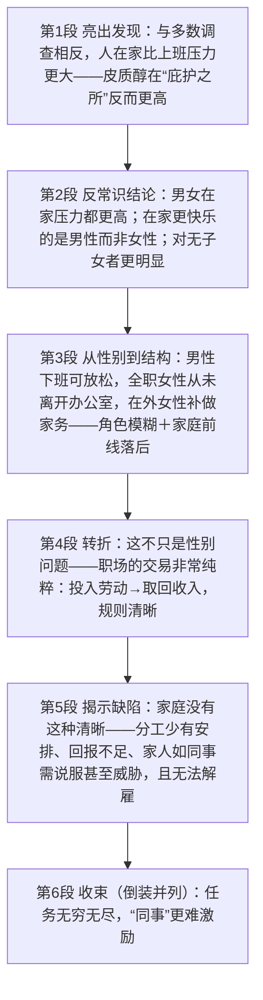

# Home Is More Stressful Than Work 精读笔记

## 背景

本文是 2015 年考研英语一 Text 1（第 21—25 题），主题是**“家比职场更让人有压力”**这一反直觉的研究发现——“庇护之所”反而是压力最高的地方。文章从“一项新研究与以往大多数调查**相反**”切入，先给出**皮质醇（cortisol）**这一生理证据，再借研究者达马斯克（Sarah Damaske）之口抛出三个“反常识”结论：**女性与男性一样在家压力更大**、**在家更快乐的是男性而非女性**、**结论对无子女者尤为明显**；随后把性别差异**升级为家庭结构问题**——职场有清晰的交易规则（雇员投入劳动、取回收入），家庭却没有清晰的分工、没有明确回报，还“无法解雇家人”。

全文语体特点鲜明：**学术词与俚语同篇**（cortisol、conventional wisdom、division of labor 与 moola、kick back、pretty much 并置），既有研究报告的客观语气，又有生活议论的俏皮口吻。句式难点集中在三处：一是**名词性从句嵌套**（what 主语从句 + whether 表语从句 + 同位语从句 the fact that）；二是**三种评价性倒装与强调**（`Rare is ...`、`Not only are ...`、`It is ... who ...`），它们全部承担“强化结论”的功能；三是**大量后置定语**（过去分词、不定式、介词短语），全篇的修饰负担几乎都由它们承担。

作者的论证分五步推进：

- **亮出发现（第 1 段）**：新研究表明人们**在家**其实**比上班**压力更大，与以往大多数调查**相反**。研究人员测量了工作与居家两种情境下的**皮质醇**——一种**压力标志物**——结果发现在本应是**庇护之所**的家中反而更高。
- **给出反常识结论（第 2 段）**：研究者达马斯克指出，这**进一步与常识相悖**：不仅女性，男性在家的压力同样高于职场；而说自己**在家比上班更快乐**的，恰恰是**男性而非女性**。另一个意外是结论对**有、无子女者都成立**，但对**无子女者更明显**——这正是“在外工作者身体更健康”的原因。
- **把性别问题升级为结构问题（第 3—4 段）**：研究未能衡量的是“在家是否仍在工作”。男性下班即可**放松**，全职在家的女性**从未离开办公室**，在外工作的女性则常要**补做积压的家务**——**角色界限的模糊**加上家庭前线在照顾职业女性方面**远落后于**职场，使女性在家压力更大显得顺理成章。但作者随即指出这**不只是性别问题**：职场的交易**非常纯粹**（投入劳动—取回收入），规则清晰。
- **揭示家庭的结构缺陷（第 5 段）**：家庭前线恰恰**没有这样的清晰界定**——**很少有**家庭能把**分工**安排得条理分明；任务无穷而**回报不足**，家人如同“**同事**”却得不到明确报酬，只能**说服**甚至**威胁**；而家人终究**解雇不了**，也**永远无法从家里真正下班**。
- **收束全文（第 6 段）**：以 `Not only are ...` 的部分倒装并列收束两个分论点——**任务无穷无尽，“同事”更难激励**，把“在家压力更大”的结论落到家庭劳动的两个结构性特征上。

本文已保留排版原文中的长难句分析 callout（共 **10 处**，逐句内联在对应句子之后）；`sentence-analysis.md` 未单独提供，因此不再重复建立独立分析章节。

---

## 文章原文

# Home Is More Stressful Than Work

A new study suggests that **contrary to** most surveys, people are actually more **stressed** at home than at work. Researchers measured people's **cortisol**, which is a **stress marker**, while they were at work and while they were at home and found it higher at what is supposed to be a **place of refuge**.

> [!abstract]- 长难句分析
> **原句**：Researchers measured people's **cortisol**, which is a **stress marker**, while they were at work and while they were at home and found it higher at what is supposed to be a **place of refuge**.
>
> **主干提取**：
>
> - 主语 S: Researchers（研究人员）
> - 谓语 V1: measured（测量了）
> - 宾语 O1: people's cortisol（人们的皮质醇）
> - 谓语 V2: found（发现，与 measured 并列）
> - 宾语 O2: it（指代 cortisol）
> - 宾语补足语 C: higher（更高）
> - 地点状语 A: at what is supposed to be a place of refuge（在本应是庇护之所的地方）
>
> **修饰成分**：
>
> | 类型 | 引导词 | 修饰对象 |
> |------|--------|----------|
> | 非限制性定语从句 | which | cortisol（补充说明"一种压力标志物"） |
> | 时间状语从句 | while | measured（说明测量时机，两个 while 并列） |
> | 名词性从句（介词宾语） | what | 介词 at 的宾语（"本应是……的地方"） |
> | 固定结构 | be supposed to be | what 从句的谓语，表"本应是" |
> | 并列连词 | and | 连接两个并列谓语 measured 与 found |
>
> **结构图解**：
>
> ```
> 主句: Researchers measured [cortisol] and found [it higher]
>   ├── 宾语1: people's cortisol
>   │     └── 非限制性定从: (which is a stress marker) → 补充说明 cortisol
>   ├── 时间状语从句1: (while they were at work) → 修饰 measured
>   ├── 时间状语从句2: (while they were at home) → 与前者并列
>   └── 地点状语: (at what is supposed to be a place of refuge)
>         └── 名词性从句: (what is supposed to be a place of refuge) → 作介词 at 的宾语
> ```
>
> **参考译文**：研究人员测量了人们上班时和在家时的皮质醇——一种压力标志物——结果发现在本应是庇护之所的家中，皮质醇水平反而更高。
>
> **考点提示**：本句主干是 `Researchers measured ... and found ...` 的**双谓语并列**，中间的 which 从句与两个 while 从句全是插入成分，读到 found 时须记起它与 measured 并列，否则容易把 found 误当成 while 从句内部的动词。`at what is supposed to be a place of refuge` 中介词 at 后接 **what 名词性从句**（不是定语从句）；`be supposed to be` 译"本应是"，三字点出"家本应放松、实际却更紧张"的反讽，是本篇立论的关键。

"Further **contradicting** **conventional wisdom**, we found that women as well as men have lower levels of stress at work than at home," writes one of the researchers, Sarah Damaske.

> [!abstract]- 长难句分析
> **原句**："Further **contradicting** **conventional wisdom**, we found that women as well as men have lower levels of stress at work than at home," writes one of the researchers, Sarah Damaske.
>
> **主干提取**：
>
> - 宾语 O（引语，前置）: "Further contradicting conventional wisdom, we found that ..."
> - 谓语 V: writes（写道）
> - 主语 S: one of the researchers（研究人员之一）
> - 同位语: Sarah Damaske（莎拉·达马斯克）
>
> **修饰成分**：
>
> | 类型 | 引导词 | 修饰对象 |
> |------|--------|----------|
> | 现在分词短语（状语） | contradicting | found，作伴随状语 |
> | 宾语从句 | that | found 的宾语 |
> | 并列连词（主谓一致） | as well as | 连接 women 与 men（谓语依 women） |
> | 比较结构 | lower ... than | 比较 at work 与 at home 的压力水平 |
> | 完全倒装 | writes（引语前置） | 引语作宾语提前至句首，主谓倒装 |
>
> **结构图解**：
>
> ```
> 主句（倒装）: [引语 = 宾语] + writes + [主语 one of the researchers]
>   ├── 现在分词状语: (Further contradicting conventional wisdom) → 伴随说明 found
>   ├── 宾语从句: (that women as well as men have lower levels of stress ...)
>   │     ├── 并列主语: women as well as men（谓语依 women → have）
>   │     └── 比较: (lower ... at work than at home)
>   └── 同位语: (Sarah Damaske) → 说明 one of the researchers
> ```
>
> **参考译文**：“进一步与常识相悖的是，我们发现无论女性还是男性，在上班时的压力水平都低于在家时，”研究人员之一莎拉·达马斯克（Sarah Damaske）写道。
>
> **考点提示**：本句有两个正式书面语特征。① **引语前置引起的完全倒装**：直接把宾语（引语）提到句首，谓语 writes 提到主语之前，构成 `"...", writes sb.` 的结构；若按正常语序写作 `One of the researchers writes, "..."` 亦正确，但报道文体中前者更常见。② **A as well as B 的主谓一致**：谓语与 A（women）一致，故用 have，不要被后置的 men 干扰，也不能与 `both A and B`（谓语用复数）混淆。另外，`Further contradicting conventional wisdom` 是现在分词短语作状语，其逻辑主语须与主句主语 we 一致。

In fact women even say they feel better at work, she notes. "It is men, **not** women, who report being happier at home than at work."

> [!abstract]- 长难句分析
> **原句**："It is men, **not** women, who report being happier at home than at work."
>
> **主干提取**：
>
> - 强调框架: It is ... who ...
> - 被强调成分（主语）: men（男性）
> - 插入对比成分: not women（而不是女性）
> - 谓语 V: report（说、声称）
> - 宾语 O: being happier at home than at work（在家比在上班时更快乐）
>
> **修饰成分**：
>
> | 类型 | 引导词 | 修饰对象 |
> |------|--------|----------|
> | 强调句型 | It is ... who ... | 强调主语 men |
> | 插入语（对比） | not women | 用逗号隔开，形成男女对照 |
> | 动名词短语 | being happier | report 的宾语 |
> | 比较结构 | happier ... than | 比较 at home 与 at work |
>
> **结构图解**：
>
> ```
> 强调句: It is [men], not women, who report [being happier at home than at work]
>   ├── 被强调成分: men（原为主语，被 It is ... who 框住）
>   ├── 插入对比: (not women) → 男女对照
>   ├── 谓语: report
>   └── 宾语: (being happier at home than at work)
>         └── 比较: happier ... than → at home vs at work
> ```
>
> **参考译文**：“说自己在家里比在上班时更快乐的，是男性，而不是女性。”
>
> **考点提示**：① **强调句用"删除法"验证**：删掉 `It is` 与 `who`，得 `Men, not women, report being happier at home than at work.` 完整成立，故为强调句；若删掉后不成立，则为形式主语（如 `It is not surprising that ...`）。② **not women 是插入的对比成分**，不参与主干，翻译须译出对比意味。③ `report being happier` 中 report 后接**动名词**（report doing sth. 表"说自己在做某事"），不可换成不定式。本句是第 22 题的定位关键句，**"男性而非女性"正是命题人设置性别选项的直接依据**。

Another surprise is that the findings **hold true** for both those with children and without, but more so for **nonparents**.

> [!abstract]- 长难句分析
> **原句**：Another surprise is that the findings **hold true** for both those with children and without, but more so for **nonparents**.
>
> **主干提取**：
>
> - 主语 S: Another surprise（另一个令人意外之处）
> - 系动词 V: is（是）
> - 表语 C: that 从句（说明 surprise 的内容）
>
> **修饰成分**：
>
> | 类型 | 引导词 | 修饰对象 |
> |------|--------|----------|
> | 名词性从句（表语从句） | that | is 的表语，说明 surprise 的内容 |
> | 并列结构中的省略 | and without | without 后省略 children（= and those without children） |
> | 介词短语（后置定语） | with children | 修饰 those |
> | 隐性比较 | more so | so 代指 hold true，more 表"程度上更甚" |
> | 转折连词 | but | 转折补充，进一步收窄结论范围 |
>
> **结构图解**：
>
> ```
> 主句: Another surprise + is + [表语从句 that ...]
>   └── 表语从句: the findings hold true for both those with children and without, but more so for nonparents
>         ├── 并列宾语: [those with children] and [without (= those without children)]
>         │     └── 省略: (children) → 承前省略，须回补
>         └── 隐性比较: (more so for nonparents) → so = hold true
> ```
>
> **参考译文**：另一个令人意外之处是，这一结论对有孩子的人和没孩子的人都成立，但对没有孩子的人更为明显。
>
> **考点提示**：本句有两个"看不见的坑"。① **并列结构中的省略**：`both those with children **and without**` 中，and 后是 `and those without children` 的省略形式，须回补中心词才能读懂，否则会误读成"没有的那些"。② **more so 是隐性比较**：句中并没有 than，so 代替前面的谓语 `hold true`，more 表程度，全句等于 `hold true even more for nonparents`（对没有孩子的人更加成立）。**"男性 + 无子女"两条件的交集**正是第 22 题答案 childless husbands 的逻辑基础。

This is why people who work outside the home have better health.

What the study doesn't measure is whether people are still doing work when they're at home, whether it is **household** work or work brought home from the office.

> [!abstract]- 长难句分析
> **原句**：What the study doesn't measure is whether people are still doing work when they're at home, whether it is **household** work or work brought home from the office.
>
> **主干提取**：
>
> - 主语 S: What the study doesn't measure（这项研究没有衡量的内容，what 引导主语从句）
> - 系动词 V: is（是）
> - 表语 C: whether people are still doing work（人们是否仍在工作）
> - 让步状语从句（隶属表语从句，非并列表语）: whether it is household work or work brought home from the office（无论是家务还是从办公室带回家的工作）
>
> **修饰成分**：
>
> | 类型 | 引导词 | 修饰对象 |
> |------|--------|----------|
> | 名词性从句（主语从句） | what | 整个主语，what 在从句中作 measure 的宾语 |
> | 名词性从句（表语从句） | whether | 作 is 的表语，说明"没有衡量的内容" |
> | 时间状语从句 | when | doing work（"在家时是否仍在工作"） |
> | 让步状语从句 | whether ... or ... | 补充说明 work 的两种情况，不表疑问 |
> | 过去分词短语（后置定语） | brought | work（"被从办公室带回家的"） |
>
> **结构图解**：
>
> ```
> 主句: [主语从句 What ... measure] + is + [表语从句 whether ...]
>   ├── 主语从句: What the study doesn't measure（what 作 measure 的宾语）
>   └── 表语从句: whether people are still doing work
>         ├── 时间状语从句: (when they're at home) → 修饰 doing work
>         └── 让步状语从句: (whether it is household work or work brought home from the office) → 说明 work 的种类
>               └── 后置定语: (brought home from the office) → 修饰 work
> ```
>
> **参考译文**：这项研究没有衡量的是：人们在家时是否仍在工作，无论那是家务，还是从办公室带回家的工作。
>
> **考点提示**：本句是"**主语从句 + 系动词 + 表语从句**"的经典框架，what 与 whether 两个引导词同时出现，容易误判结构。判别要点有二：① **what 从句自带缺口**（measure 后缺宾语），故为名词性从句而非定语从句；② **第二个 whether 不表疑问而表让步**（"无论是……还是……"），与第一个 whether（表语从句，"是否"）功能不同，两者紧邻出现是本句最大的理解障碍。另注意 `work brought home from the office` 是"名词 + 过去分词短语"的后置定语，可还原为 `work which is brought home from the office`。主语从句作主语时谓语用**单数** is，不因为从句中出现 people 而变复数。

For many men, the end of the workday is a time to **kick back**. For women who **stay home**, they never get to leave the office. And for women who work outside the home, they often are playing **catch-up-with-household tasks**. With the **blurring of roles**, and the fact that the **home front lags** well behind the workplace in making adjustments for working women, it's not surprising that women are more stressed at home.

> [!abstract]- 长难句分析
> **原句**：With the **blurring of roles**, and the fact that the **home front lags** well behind the workplace in making adjustments for working women, it's not surprising that women are more stressed at home.
>
> **主干提取**：
>
> - 形式主语: it（它）
> - 系动词 V: is（是）
> - 表语 C: not surprising（不足为奇的）
> - 真主语 S（that 从句）: that women are more stressed at home
> - 原因状语 A: With the blurring of roles, and the fact that ...
>
> **修饰成分**：
>
> | 类型 | 引导词 | 修饰对象 |
> |------|--------|----------|
> | 介词短语（原因状语） | With | 引导两个并列宾语，表"由于" |
> | 动名词短语 | the blurring of | 并列宾语 1（角色模糊） |
> | 同位语从句 | that | 解释并列宾语 2 the fact 的内容 |
> | 介词短语（后置定语） | of roles | blurring |
> | 程度状语 | well | behind，加强"远远落后" |
> | 介词短语（状语） | in making adjustments for | lags，说明落后所涉及的方面 |
> | 名词性从句（真主语） | that | is 的真主语，it 为形式主语 |
>
> **结构图解**：
>
> ```
> 主句: It + is + not surprising + [that 从句]（it 为形式主语）
>   ├── 原因状语: With [the blurring of roles] and [the fact that ...]
>   │     ├── 并列宾语1: the blurring of roles（动名词短语）
>   │     │     └── 后置定语: (of roles) → 修饰 blurring
>   │     └── 并列宾语2: the fact that the home front lags well behind the workplace
>   │           ├── 同位语从句: (that ...) → 解释 the fact 的内容
>   │           └── 状语: (in making adjustments for working women) → 说明落后涉及的方面
>   └── 真主语: (that women are more stressed at home) → 由形式主语 it 提前的 that 从句
> ```
>
> **参考译文**：由于角色界限的模糊，也由于在为职业女性作出调整方面"家庭前线"远远落后于职场，女性在家压力更大就不足为奇了。
>
> **考点提示**：本句有两个易错点。① **With 后接两个并列宾语**：一个是动名词短语 `the blurring of roles`，一个是名词短语 `the fact that ...`，翻译时必须译出"由于……，也由于……"两层并列，只译一个会丢一半信息。② **it 是形式主语而非强调句**：还原为 `That women are more stressed at home is not surprising.` 后句子成立，且 that 从句整体作主语——这与强调句（还原后被强调词回到原位、that/who 消失）的判别方法不同。另注意 `well behind` 中 well 修饰介词 behind（"远远落后"），不是"好"。

But it's not just a **gender** thing. At work, people pretty much know what they're supposed to be doing: working, making money, doing the tasks they have to do in order to **draw an income**. The **bargain** is very pure: Employee **puts in** hours of physical or mental labor and employee **draws out** life-sustaining **moola**.

> [!abstract]- 长难句分析
> **原句**：The **bargain** is very pure: Employee **puts in** hours of physical or mental labor and employee **draws out** life-sustaining **moola**.
>
> **主干提取**：
>
> - 主语 S1: The bargain（这笔交易）
> - 系动词 V1: is（是）
> - 表语 C1: very pure（非常纯粹的）
> - 主语 S2: Employee（雇员）
> - 谓语 V2: puts in（投入）
> - 宾语 O2: hours of physical or mental labor（数小时的体力或脑力劳动）
> - 主语 S3: employee（雇员）
> - 谓语 V3: draws out（取出）
> - 宾语 O3: life-sustaining moola（维持生计的钱）
>
> **修饰成分**：
>
> | 类型 | 引导词 | 修饰对象 |
> |------|--------|----------|
> | 冒号（具体化） | : | 引出对"交易纯粹"的具体解释 |
> | 介词短语（后置定语） | of physical or mental labor | hours |
> | 并列连词 | and | 连接两个完全对称的分句 |
> | 复合形容词 | life-sustaining | moola（"维持生计的"） |
>
> **结构图解**：
>
> ```
> 主句 + 具体化解释（冒号连接）:
>   ├── 分句1: The bargain + is + very pure
>   └── 分句2（冒号后具体化）: Employee puts in [hours of labor] and employee draws out [moola]
>         ├── 对称分句A: Employee + puts in + hours of physical or mental labor
>         │     └── 后置定语: (of physical or mental labor) → 修饰 hours
>         └── 对称分句B: employee + draws out + life-sustaining moola
>               └── 复合形容词: (life-sustaining) → 修饰 moola
> ```
>
> **参考译文**：这笔交易非常纯粹：雇员投入数小时的体力或脑力劳动，雇员取出维持生计的钱。
>
> **考点提示**：① **冒号后不是独立句子**，而是对前句 `the bargain is very pure` 的具体化解释，翻译时保留冒号层次。② **两句完全对称**（Employee puts in ... and employee draws out ...），这一"一进一出"的对称正是"交易纯粹"的语言证据，也是判断 **bargain** 词义的依据（此处为名词"交易"，不是"便宜货"）。③ 三处熟词生义集中在同一句：**put in**（投入时间 / 劳动，非"放进"）、**draw out**（支取、取出）、**moola**（俚语"钱"）。第 24 题考 moola 的词义，**"投入劳动—取回收入"的语义链**即是解题线索。

On the home front, however, people have no such **clarity**. Rare is the household in which the **division of labor** is so **clinically** and **methodically** laid out.

> [!abstract]- 长难句分析
> **原句**：Rare is the household in which the **division of labor** is so **clinically** and **methodically** laid out.
>
> **主干提取**：
>
> - 表语 C: Rare（很少见的，前置）
> - 系动词 V: is（是）
> - 主语 S: the household（家庭）
> - 定语从句: in which the division of labor is so clinically and methodically laid out
>
> **修饰成分**：
>
> | 类型 | 引导词 | 修饰对象 |
> |------|--------|----------|
> | 定语从句（介词 + 关系代词） | in which | the household |
> | 被动语态 | be + laid out | 说明分工"被安排" |
> | 方式状语 | so clinically and methodically | laid out，说明安排方式 |
> | 完全倒装 | 表语 Rare 前置 | 主语 the household 与 is 倒装 |
>
> **结构图解**：
>
> ```
> 完全倒装句: [表语 Rare] + is + [主语 the household]
>   └── 定语从句: (in which the division of labor is ... laid out) → 修饰 the household
>         ├── 被动语态: (is ... laid out) → 说明分工被安排
>         └── 方式状语: (so clinically and methodically) → 修饰 laid out
> ```
>
> **参考译文**：很少有家庭能把分工安排得如此条理分明、有条不紊。
>
> **考点提示**：本句是**表语前置引起的完全倒装**（`Rare is the household` = `The household ... is rare`），还原为 `The household in which ... is rare.` 即懂。倒装的原因是主语带了很长的 in which 从句，若按正常语序，表语 rare 会被推到句末，读者读到最后才知道"很少见"——**倒装是为了让评价词先出现**。注意两点：① **只有 is 提前，in which 从句内部语序完全正常**，写作时若把从句内部也倒装（`in which is the division of labor laid out`）即出错；② 只能用 **in which**，不能用 which，因为从句末尾的 laid out 需要介词 in 才能接 the household。

There are a lot of tasks to be done, there are **inadequate** rewards for most of them. Your home **colleagues**—your family—have no clear rewards for their labor; they need to be **talked into** it, or if they're teenagers, threatened with complete removal of all electronic devices.

> [!abstract]- 长难句分析
> **原句**：Your home **colleagues**—your family—have no clear rewards for their labor; they need to be **talked into** it, or if they're teenagers, threatened with complete removal of all electronic devices.
>
> **主干提取**：
>
> - 主语 S1: Your home colleagues（你的家庭同事）
> - 同位语: your family（你的家人）
> - 谓语 V1: have（拥有）
> - 宾语 O1: no clear rewards（没有明确的回报）
> - 状语 A1: for their labor（为他们的劳动）
> - 主语 S2: they（他们）
> - 谓语 V2: need（需要）
> - 宾语 O2: to be talked into it（被说服才肯去做）
> - 条件状语从句 A2: or if they're teenagers（若他们是青少年）
> - 宾语 O2 的并列项（与 to be talked into it 并列，承前省略 be）: threatened with complete removal of all electronic devices
>
> **修饰成分**：
>
> | 类型 | 引导词 | 修饰对象 |
> |------|--------|----------|
> | 同位语（破折号） | — your family — | your home colleagues |
> | 介词短语（后置定语） | for their labor | rewards |
> | 被动语态（短语动词） | be talked into | need 的宾语，into 不可省 |
> | 条件状语从句 | if | 补充说明另一种情形 |
> | 被动语态（承前省略 be） | threatened with | 与 to be talked into 并列 |
> | 介词短语 | with complete removal of | 说明威胁的内容 |
>
> **结构图解**：
>
> ```
> 并列句: [Your home colleagues—your family—have no clear rewards], [they need to be talked into it, or ... threatened with ...]
>   ├── 分句1: 主语 + [同位语 (your family)] + have + no clear rewards + (for their labor)
>   └── 分句2: they + need + [to be talked into it] + or + [if they're teenagers] + [threatened with ...]
>         ├── 短语动词被动: (be talked into it) → into 是固定部分，不可省
>         ├── 条件状语从句: (if they're teenagers) → 补充另一种情形
>         └── 并列被动（承前省略 be）: (threatened with ...) → 与 to be talked into 并列
> ```
>
> **参考译文**：你的家庭同事——你的家人——为他们的劳动得不到明确的回报；得说服他们去做，或者，如果他们是青少年，就拿"彻底没收所有电子设备"来威胁。
>
> **考点提示**：① **短语动词的被动式必须保留介词 / 小品词**：`be talked **into** it`、`threatened **with**` 中 into / with 是短语动词的固定部分，被动后不可省略（误作 `be talked it` 即错）。② **并列结构中的省略**：`threatened with ...` 前省略了 `they need to be`，与前面的 `to be talked into it` 并列。③ 破折号内的 **your family** 是同位语，补充说明 your home colleagues，翻译时保留破折号或改用括号。本段全程借用"职场语汇"讲家庭（colleagues 同事、fire 解雇、motivate 激励），是本篇的修辞骨架。

Plus, they're your family. You cannot **fire** your family. You never really get to go home from home.

So it's not surprising that people are more stressed at home. **Not only are** the tasks apparently **infinite**, the **co-workers** are much harder to **motivate**.

> [!abstract]- 长难句分析
> **原句**：**Not only are** the tasks apparently **infinite**, the **co-workers** are much harder to **motivate**.
>
> **主干提取**：
>
> - 主语 S1: the tasks（任务）
> - 系动词 V1: are（是）
> - 表语 C1: apparently infinite（显然无穷无尽的）
> - 主语 S2: the co-workers（"同事"，指家人）
> - 系动词 V2: are（是）
> - 表语 C2: much harder to motivate（更难激励的）
>
> **修饰成分**：
>
> | 类型 | 引导词 | 修饰对象 |
> |------|--------|----------|
> | 部分倒装 | Not only（句首触发） | 助动词 are 提至主语 the tasks 之前 |
> | 副词状语 | apparently | infinite |
> | 比较结构 | much harder | much 修饰比较级 harder，加强程度 |
> | 不定式 | to motivate | harder，说明"在哪方面更难" |
>
> **结构图解**：
>
> ```
> 并列句（前分句倒装）: [Not only are the tasks apparently infinite], [the co-workers are much harder to motivate]
>   ├── 分句1（部分倒装）: Not only + are + the tasks + apparently infinite
>   │     └── 还原: The tasks are not only apparently infinite
>   └── 分句2（正常语序）: the co-workers + are + much harder to motivate
>         └── much 修饰比较级 harder
> ```
>
> **参考译文**：不仅任务显然无穷无尽，而且"同事"也更难激励。
>
> **考点提示**：① **Not only 置于句首引起的部分倒装是句法强制**，只能写 `Not only **are** the tasks ...`，不能写 `Not only the tasks **are** ...`；若 Not only 不在句首则用正常语序（`The tasks are not only infinite but also ...`）。② **倒装只发生在第一个分句**，第二个分句用正常语序。③ **much 修饰比较级**（much harder 正确），不能用 very（very harder 错误）。本句位于全文最后，**以倒装 + 并列双句收束两个分论点**（任务无穷 / 同事难激励），分别对应第 5 段的两处铺垫，是末段的总结信号。

## 题目

### 21. According to Paragraph 1, most previous surveys found that home ____.

- [A] was an unrealistic place for relaxation
- [B] generated more stress than the workplace
- [C] was an ideal place for stress measurement
- [D] offered greater relaxation than the workplace

### 22. According to Damaske, who are likely to be the happiest at home?

- [A] Working mothers.
- [B] Childless husbands.
- [C] Childless wives.
- [D] Working fathers.

### 23. The blurring of working women's roles refers to the fact that ____.

- [A] they are both bread winners and housewives
- [B] their home is also a place for kicking back
- [C] there is often much housework left behind
- [D] it is difficult for them to leave their office

### 24. The word "moola" (Para. 4) most probably means ____.

- [A] energy
- [B] skills
- [C] earnings
- [D] nutrition

### 25. The home front differs from the workplace in that ____.

- [A] home is hardly a cozier working environment
- [B] division of labor at home is seldom clear-cut
- [C] household tasks are generally more motivating
- [D] family labor is often adequately rewarded

---

## 翻译对照

# Home Is More Stressful Than Work 家比职场更让人有压力 中英对照

## 文章原文

A new study suggests that **contrary to** most surveys, people are actually more **stressed** at home than at work. Researchers measured people's **cortisol**, which is a **stress marker**, while they were at work and while they were at home and found it higher at what is supposed to be a **place of refuge**.

一项新研究表明，与大多数调查结果相反，人们在家时其实比上班时压力更大。研究人员测量了人们的皮质醇——一种压力标志物——在他们上班时和在家时的水平，结果发现在本应是庇护之所的家中，皮质醇水平反而更高。

> [!note] 翻译说明
> **contrary to** 意为“与……相反”，是第 21 题定位词；**cortisol** 是医学词“皮质醇”，**stress marker** 即“压力标志物”，两者构成同位解释（which 引导非限制性定语从句），考研中此类“专业术语 + 同位说明”结构不必逐字直译，可译“皮质醇——一种压力标志物”；**while** 在此引导时间状语从句，表“在……时”，两个 while 并列对举“上班时 / 在家时”；`found it higher` 中 it 指代 cortisol，译“发现（皮质醇水平）更高”；**what is supposed to be a place of refuge** 是名词性从句作介词 at 的宾语，`be supposed to be` 译“本应是”，**place of refuge** 译“庇护之所”，暗含“本应放松却反而紧张”的反讽，是第一段的立论关键。

"Further **contradicting conventional wisdom**, we found that women as well as men have lower levels of stress at work than at home," writes one of the researchers, Sarah Damaske. In fact women even say they feel better at work, she notes. "It is men, **not** women, who report being happier at home than at work." Another surprise is that the findings **hold true** for both those with children and without, but more so for **nonparents**. This is why people who work outside the home have better health.

“进一步与常识相悖的是，我们发现无论女性还是男性，在上班时的压力水平都低于在家时，”研究人员之一莎拉·达马斯克（Sarah Damaske）写道。她指出，事实上女性甚至说自己在上班时感觉更好。“说自己在家里比在上班时更快乐的，是男性，而不是女性。”另一个令人意外之处是，这一结论对有孩子的人和没孩子的人都成立，但对没有孩子的人更为明显。这就是为什么在外工作的人身体更健康。

> [!note] 翻译说明
> **conventional wisdom** 是考研高频表达，译“传统观念、普遍看法”，不是“传统智慧”；**women as well as men** 中 `A as well as B` 的语义重心在 A，译“无论女性还是男性”或“不仅男性，女性也”，不可颠倒为“男性以及女性”而丢失重心；`It is men, not women, who report ...` 是 **It is ... who ...** 强调句型，强调主语 men，译“是男性，而不是女性……”，第 22 题正是据此定位；**hold true for** 译“对……成立、适用于”，**nonparents** 译“没有子女的人”，与 those with children and without 呼应；`but more so for nonparents` 中 so 代指前面的 findings hold true，译“但对没有孩子的人更明显”，是本段的比较级考点。

What the study doesn't measure is whether people are still doing work when they're at home, whether it is **household** work or work brought home from the office. For many men, the end of the workday is a time to **kick back**. For women who **stay home**, they never get to leave the office. And for women who work outside the home, they often are playing **catch-up-with-household tasks**. With the **blurring of roles**, and the fact that the **home front lags** well behind the workplace in making adjustments for working women, it's not surprising that women are more stressed at home.

这项研究没有衡量的是：人们在家时是否仍在工作，无论那是家务还是从办公室带回家的工作。对许多男性来说，工作日结束时正是放松休息的时候。对全职在家的女性来说，她们从来没能“离开办公室”。而对在外工作的女性来说，她们常常在补做积压的家务。由于角色界限的模糊，也由于在为职业女性作出调整方面“家庭前线”远远落后于职场，女性在家压力更大就不足为奇了。

> [!note] 翻译说明
> 本段连用三个 **For ...** 介词短语构成排比，分别写男性、全职在家女性、在外工作女性，翻译时保留三段的对照节奏；**kick back** 是口语表达，译“放松休息”，不可直译“踢回去”；**stay home** 在此特指“全职在家（不外出工作）”，与下句 work outside the home 对立；**catch-up-with-household tasks** 是复合前置定语，译“补做积压的家务”，`catch-up` 强调“追赶、补上落下的进度”，是第 23 题 C 项设置的干扰来源；**blurring of roles** 译“角色（界限）模糊”，指职业女性“既要赚钱又要持家”的双重身份；**home front** 借自战时的“后方、家庭前线”，指相对于职场的家庭领域；**lag behind** 译“落后于”，与 in making adjustments for working women 合起来译“在为职业女性作出调整方面落后”；`the fact that ...` 是同位语从句，说明与角色模糊并列为两个原因。

But it's not just a **gender** thing. At work, people pretty much know what they're supposed to be doing: working, making money, doing the tasks they have to do in order to **draw an income**. The **bargain** is very pure: Employee **puts in** hours of physical or mental labor and employee **draws out** life-sustaining **moola**.

但这不仅仅是性别问题。在工作中，人们基本上清楚自己该做什么：工作、赚钱、完成那些为了领取收入而不得不完成的任务。这笔交易非常纯粹：雇员投入数小时的体力或脑力劳动，雇员取出维持生计的钱。

> [!note] 翻译说明
> **gender** 译“性别”，`a gender thing` 译“性别问题”，本句是过渡句，把上文“女性压力更大”的性别视角提升为更普适的“工作—家庭”结构差异；**pretty much** 是口语程度副词，译“基本上、差不多”；**draw an income** 中 draw 意为“领取、支取”，译“领取收入”，与下句 draws out 同源呼应；**bargain** 译“交易、买卖”，指雇佣关系这笔交换；`Employee puts in ... and employee draws out ...` 是并列对称句，**put in** 译“投入（时间、劳动）”，**draw out** 译“取出”，一进一出构成“纯粹交易”的比喻；**life-sustaining** 译“维持生计的”，**moola** 是英语俚语，意为“钱”，第 24 题即考此词，可根据上文 draw an income 的语境推断。

On the home front, however, people have no such **clarity**. **Rare is** the household in which the **division of labor** is so **clinically** and **methodically** laid out. There are a lot of tasks to be done, there are **inadequate** rewards for most of them. Your home **colleagues**—your family—have no clear rewards for their labor; they need to be **talked into** it, or if they're teenagers, threatened with complete removal of all electronic devices. Plus, they're your family. You cannot **fire** your family. You never really get to go home from home.

然而在家庭前线，人们没有这样的清晰界定。很少有家庭能把分工安排得如此条理分明、有条不紊。有大量任务要做，而其中大多数得到的回报又不够。你的家庭同事——你的家人——为他们的劳动得不到明确的回报；得说服他们去做，或者，如果他们是青少年，就拿“彻底没收所有电子设备”来威胁。况且，他们是你的家人。你不能解雇家人。你永远无法从家里真正“下班回家”。

> [!note] 翻译说明
> **clarity** 译“清晰（界定）”，与上段 at work 的清晰形成对照，是第 25 题的答案落点；`Rare is the household in which ...` 是**完全倒装**（表语 Rare 提前，主语 the household 后置，因主语带 in which 从句而显长），还原为 The household in which ... is rare，译“很少有家庭能……”；**division of labor** 译“分工”，**clinically** 本义“临床地”，此处引申为“冷静客观、条理分明地”，**methodically** 译“有条不紊地”，二者都由副词修饰 laid out（安排、布局）；**inadequate** 译“不足的、不够的”；**colleagues** 在此是比喻用法，指“家人如同同事”，故译“家庭同事”；**talk sb. into sth.** 译“说服某人做某事”，是被动 need to be talked into it；**fire** 译“解雇”，`You cannot fire your family` 与上句的“同事”比喻一脉相承；`You never really get to go home from home` 是双关，`get to` 译“有机会、能够”，全句译“你永远无法从家里真正下班回家”，意为家没有“下班”这一出口。

So it's not surprising that people are more stressed at home. **Not only are** the tasks apparently **infinite**, the **co-workers** are much harder to **motivate**.

所以，人们在家压力更大并不令人意外。不仅任务显然无穷无尽，而且“同事”也更难激励。

> [!note] 翻译说明
> `So it's not surprising that ...` 收束全文，译“所以……并不令人意外”，与第 3、5 段的 it's not surprising that women are more stressed at home 呼应；`Not only are the tasks ...` 是 **Not only 置于句首引起的部分倒装**（助动词 are 提前），翻译时按正常语序“不仅任务……而且……”处理即可；**infinite** 译“无穷无尽的”，**co-workers** 与上段 colleagues 同义复现，仍按“同事”的比喻译；**motivate** 译“激励、调动积极性”，`much harder to motivate` 译“更难激励”，与职场中“同事易管理”形成收尾对照。

## 题目

### 21. According to Paragraph 1, most previous surveys found that home ____.

根据第 1 段，以往大多数调查发现，家____。

- **A.** was an unrealistic place for relaxation
  - 是一个不切实际的放松场所
- **B.** generated more stress than the workplace
  - 比职场产生更多压力
- **C.** was an ideal place for stress measurement
  - 是测量压力的理想场所
- **D.** offered greater relaxation than the workplace
  - 比职场提供了更多的放松

> [!note] 翻译说明
> 题干关键在 **most previous surveys**（以往大多数调查）与 **found**（当时的结论），必须与首段新研究的结论严格区分。首句 `contrary to most surveys, people are actually more stressed at home than at work` 中 contrary to 表明：以往调查的看法与新研究相反，即以往认为**家比职场更能让人放松**，故 D 为正确项；`offered greater relaxation` 译“提供了更多的放松”，是对 place of refuge 的同义转述。B 项是**新研究**的结论，被错置为以往调查的结论，属张冠李戴；A 项 **unrealistic** 译“不切实际的”，原文只说“本应是庇护之所（what is supposed to be）”，并未否定家作为放松之所的“合理性”，属无中生有；C 项把 **stress measurement**（压力测量）与 place of refuge 混搭，原文说的是“测量人的皮质醇”，不是“把家当作测量场所”。

### 22. According to Damaske, who are likely to be the happiest at home?

根据达马斯克的观点，谁最可能在家最快乐？

- **A.** Working mothers.
  - 在职母亲
- **B.** Childless husbands.
  - 没有孩子的丈夫
- **C.** Childless wives.
  - 没有孩子的妻子
- **D.** Working fathers.
  - 在职父亲

> [!note] 翻译说明
> 题干关键词 **happiest at home**（在家最快乐）对应第 2 段 `report being happier at home than at work`。原文给出两条限定：`It is men, not women, who report being happier at home`（是男性而非女性）+ `the findings hold true for both those with children and without, but more so for nonparents`（对无子女者更明显），两条件交集即 **childless husbands**（没有孩子的丈夫），B 为正确项；**childless** 译“没有子女的”，与 **nonparents** 同义。C 项 childless wives（没有孩子的妻子）性别不符，与 men, not women 直接矛盾；D 项 working fathers（在职父亲）虽有子女，被 children 条件排除，注意题干问的是"最可能"（likely to be the happiest）；A 项与女性相关，同样与原文相反。

### 23. The blurring of working women's roles refers to the fact that ____.

职业女性角色的模糊，指的是这样的事实：____。

- **A.** they are both bread winners and housewives
  - 她们既是养家者又是家庭主妇
- **B.** their home is also a place for kicking back
  - 她们的家也是放松休息的地方
- **C.** there is often much housework left behind
  - 常常有大量家务被落下
- **D.** it is difficult for them to leave their office
  - 她们很难离开自己的办公室

> [!note] 翻译说明
> **the blurring of working women's roles** 译“职业女性角色的模糊”，其含义要看第 3 段对 working women 的两句描述：`For women who work outside the home, they often are playing catch-up-with-household tasks`（在外工作却仍要补做家务）——即她们同时承担“在外赚钱”与“在家持家”两种角色，A 项 **bread winners and housewives**（养家者与家庭主妇）正是这一双重身份的概括，为正确项；**bread winner** 译“养家的人、breadwinner”。B 项 **kick back** 是原文描写**男性**的（For many men, the end of the workday is a time to kick back），对象错位；C 项 **housework left behind** 译“被落下的家务”，看似接近，但原文强调的是她们“playing catch-up（主动补做）”，而非“有家务被搁置”，主语与语态均被偷换；D 项 **leave their office** 对应的是 **women who stay home**（全职在家女性 never get to leave the office），与该题的主语 working women 不是同一群体。

### 24. The word "moola" (Para. 4) most probably means ____.

第 4 段中“moola”一词最可能的意思是____。

- **A.** energy
  - 精力
- **B.** skills
  - 技能
- **C.** earnings
  - 收入
- **D.** nutrition
  - 营养

> [!note] 翻译说明
> 词义猜测题须回到上下文。第 4 段先给出 `At work, people ... making money ... in order to draw an income`（工作、赚钱、为了领取收入），再以 `Employee puts in hours of physical or mental labor and employee draws out life-sustaining moola` 收束——**puts in**（投入劳动）与 **draws out**（取出）构成“一进一出”的交换，取出的自然是钱，故 **moola = earnings**（收入、报酬），C 为正确项；**moola** 是英语俚语，意为“钱”。A、D 项只抓住了 `physical ... labor` 与 `life-sustaining` 的字面联想（精力、营养），属于脱离“投入—取出”语义链的干扰；B 项 skills 与 puts in hours of labor 无对应关系。

### 25. The home front differs from the workplace in that ____.

家庭前线与职场的不同之处在于：____。

- **A.** home is hardly a cozier working environment
  - 家很难说是一个更舒适的工作环境
- **B.** division of labor at home is seldom clear-cut
  - 家里的分工很少是清晰明确的
- **C.** household tasks are generally more motivating
  - 家务通常更令人有动力
- **D.** family labor is often adequately rewarded
  - 家庭劳动常常得到充分的回报

> [!note] 翻译说明
> **differs from ... in that ...** 译“在……方面与……不同”，in that 引导原因/区别从句。第 5 段开门见山给出差别：`On the home front, however, people have no such clarity. Rare is the household in which the division of labor is so clinically and methodically laid out.`——即家与职场不同在于**分工不清晰、少有明确安排**，B 项 **seldom clear-cut**（很少是清晰明确的）正是 no such clarity 的同义转述，**clear-cut** 译“清晰明确的、界限分明的”。C、D 两项均与原文相反：原文说 `there are inadequate rewards for most of them`（回报不足）与 `the co-workers are much harder to motivate`（更难激励），故 D 的 adequately rewarded、C 的 more motivating 都是反向设置；A 项 **cozier**（更舒适的）译自 cozier working environment，原文只比较“分工清晰与否”，从未比较“舒适度”，属无中生有。

---

## 语法要点

# 2015 Passage 1 语法要点整理

> [!note] 来源说明
> 本篇**用户提供的语法源笔记（`passage_1_语法.md`）为空文件**，以下语法点由 `formatted-article.md` 与 `translation.md` **推断提取**，仅收录本篇实际出现的结构，不引入原文不存在的语法规则。
>
> **例句标注约定**：表格中**未加标注**的英文例句**全部取自本篇原文**；标注 **（自拟例）** 的是为讲清规则而编的中性短句，标注 **（改写自本篇）** 的是本篇原句的变形（如改为倒装、强调句或陈述语气）。标注 ❌ / ✅ 的是对错对照示例。

本篇主题为"在家比上班压力更大"的**研究报道类议论文**，语体特点有二：一是**口语与书面语交织**——引语（Damaske 的话）、俚语（moola）、口语短语（kick back、pretty much、talk sb. into）与学术表达（cortisol、division of labor、conventional wisdom）同篇并置，这正是考研阅读"看似简单却读不透"的典型语体；二是**评价性句式密集**，全篇以 `it's not surprising that ...`、`not only ...`、`Rare is ...` 三种句式反复强化"在家压力更大"这一结论。完整的固定搭配与词组释义、应用场景及辨析保存在 [[固定搭配与词组笔记]]；本笔记只提取可迁移的语法结构。

---

### 从句：名词性从句（what 引导主语从句 + whether 引导表语从句）

**what** 引导的从句在句中充当主语，其后必须接谓语（本篇是 is）；**whether** 引导的从句在本篇充当表语，说明主语"是什么"。两者合用构成本篇第 3 段的骨架句。

| 结构 | 用法 | 例句 |
|------|------|------|
| **What** + 不完整句 + be + 表语从句 | what 在从句中充当成分（本篇作 measure 的宾语），整个从句作**主语** | **What** the study doesn't **measure** is whether people are still doing work … |
| **whether** + 完整句 | 作**表语**，说明主语的内容 | What the study doesn't measure **is whether** people are still doing work when they're at home |
| **why** + 完整句 | 作**表语**，表原因（This / That is why … = 这就是……的原因） | This **is why** people who work outside the home have better health. |

> [!tip] what 与 that 的一句话判别
> **what 从句自带"缺口"**（从句里少一个成分：measure 少了宾语），**that 从句完全不缺**（that 只起引导作用，不作成分）。本篇 `What the study doesn't measure` 中 measure 后无宾语，缺口在 what 身上，故只能用 what；若写成 `That the study doesn't measure` ❌ 从句就没有宾语，句子不成立。

> [!warning] 主语从句作主语时，谓语用单数
> `What the study doesn't measure **is** whether …` —— 主语从句整体视为**单数**，谓语用 is，不能因为从句里出现 people、tasks 就写成 are。同类：`What matters **is** …`、`What they need **is** …`。

---

### 从句：让步状语从句（whether ... or ...）

`whether ... or ...` 除了引导"是否"的疑问性从句外，还可引导**让步状语从句**，意为"无论……还是……"，此时从句内容已确定、不表疑问。

| 结构 | 用法 | 例句 |
|------|------|------|
| **whether A or B**（让步） | 表"无论是 A 还是 B"，主句结论不受影响 | whether it is **household work** or **work brought home from the office**（无论是家务还是从办公室带回家的工作） |
| **whether A or B**（疑问） | 表"是 A 还是 B（尚未确定）" | I don't know **whether** he will come **or** not.（**自拟例**） |
| **whether ... or not**（让步，独立） | 无论是否…… | Whether or not it rains, we'll go.（**自拟例**） |

> [!note] 本篇的 whether 是"让步"不是"疑问"
> `whether it is household work or work brought home from the office` 出现在 `What the study doesn't measure is whether people are still doing work …, whether it is household work or …` 之中：**第一个 whether 是表语从句**（"是否"），**第二个 whether 是让步状语从句**（"无论是……还是……"），对前一个 whether 的内容作"不分情况"的补充说明。两个 whether 紧邻出现而功能不同，是考研长难句的常见混淆点——判别方法：**看它是否表"尚未确定"**，本篇第二个 whether 显然不表疑问。
>
> 与 `no matter how`（见 2013-passage4）同属让步家族：**no matter how / however 管"程度"，whether ... or ... 管"选项"**。

---

### 从句：定语从句（非限制性 which、介词 + 关系代词 in which、who）

本篇三种定语从句并存：逗号隔开的**非限制性 which**（补充说明）、**in which**（关系代词前带介词）、**who**（先行词指人）。三者的共同点是：**先行词都在从句前，且从句都自带完整的主谓**。

| 结构 | 用法 | 例句 |
|------|------|------|
| 先行词 + **, which** + 完整句 | **非限制性**定语从句，补充说明而非限定 | Researchers measured people's **cortisol, which is a stress marker** |
| 先行词 + **in which** + 完整句 | 关系代词前带介词，in which = where（此处指 household） | Rare is the **household in which** the division of labor is so clinically and methodically laid out |
| 先行词（指人）+ **who** + 不完整句 | **限制性**定语从句，who 在从句中作主语 | people **who work outside the home** have better health |

> [!tip] 非限制性 which 的翻译处理
> `cortisol, which is a stress marker` 中 which 从句是**补充说明**，不是限定——翻译时或前置为定语"一种压力标志物的皮质醇"，或后置为独立小句"（皮质醇）——一种压力标志物"，**后置处理更符合中文习惯**。判别非限制性的唯一标志是**逗号**：有逗号 → 补充信息，删掉不影响主句成立；无逗号 → 限定信息，删掉主句意思会变。

> [!warning] in which 不等于 which
> `the household **in which** the division of labor is … laid out` 中，以及其后的 `is laid out` 是**及物动词短语的被动式**，必须带介词 in 才能接 the household。若写成 `the household **which** the division of labor is laid out in` 虽语法可通但语体不正式；若写成 `the household **which** the division of labor is laid out` ❌ 则缺了介词，句子不成立。**判断用 in which 还是 which，看从句里缺的是"名词性成分"还是"介词 + 名词"**。

---

### 从句：同位语从句（the fact that）

`the fact that ...` 中 that 引导**同位语从句**，解释 the fact 的具体内容；that 只起引导作用，**不作任何成分**，也**不能省略**。本篇与 `the fact that` 并列的还有一个由 and 连接的动名词短语，构成"两个原因"。

| 结构 | 用法 | 例句 |
|------|------|------|
| **the fact that** + 完整句 | 同位语从句，解释 the fact 的内容 | With the blurring of roles, **and the fact that** the home front lags well behind the workplace |
| **介词 + the fact that** | 同位语从句整体作介词宾语 | **With** the blurring of roles, and the fact **that** … |
| n. + **that** + 完整句（抽象名词后） | 抽象名词（fact / idea / belief / news / evidence）后的 that 从句多为同位语从句 | the **evidence that** women are more stressed（**自拟例**） |

> [!tip] 同位语从句 vs 定语从句的唯一判别法
> **把 that 后面的句子单独拿出来读**：如果它**本身完整、能独立成句**，且前面的名词是 fact / idea / belief / news 这类"抽象容器词"→ **同位语从句**（that 不作成分）；如果 that 后面的句子**缺主语或宾语**，that 正好补上 → **定语从句**（that 作成分）。
> 本篇 `the fact that the home front lags well behind the workplace` —— that 后的句子主谓状俱全（the home front lags …），不缺成分，故为**同位语从句**。

> [!note] 两个原因并列的结构
> `With the blurring of roles, **and** the fact that …` —— With 后接**两个并列宾语**：一个是动名词短语 `the blurring of roles`，一个是名词短语 `the fact that …`。翻译时须译出"由于……，也由于……"的两层并列，不能只译出一个。

---

### 倒装：完全倒装（表语 Rare 前置）

当**表语**（本篇是形容词 rare）提到句首时，主语与谓语**完全倒装**（谓语全部前置于主语之前）。这种倒装多见于书面语，起强调作用。

| 结构 | 用法 | 例句 |
|------|------|------|
| **表语 + be + 主语** | 表语前置引起的完全倒装，主语较长时常用 | **Rare is** the household in which the division of labor is so clinically and methodically laid out. |
| 还原后 | 便于理解原意 | The household **in which** the division of labor is …, **is rare**. |
| **Among / Such / Present + be + 主语** | 同类完全倒装（介词短语 / 代词 / 形容词前置） | **Such was** the reaction that …（**自拟例**） |

> [!tip] 完全倒装的识别与还原
> 读到时先**还原语序**再理解：`Rare is the household in which …` = `The household in which … is rare`（能把分工安排得如此条理分明的家庭很少见）。**为什么倒装？** 因为主语 the household 带了很长的 in which 从句，若按正常语序写，谓语 is rare 会被推到句子最末尾，读者要读到最后才知道"很少见"——**倒装是为了让评价词 rare 先出现，句意先立**。这与 `Not only are the tasks …` 的倒装动机不同（后者是句法强制），须区分。

> [!warning] 倒装只倒"主语与（助）动词"，不倒其他成分
> `Rare is the household **in which** …` 中，**只有 is 提到 the household 之前**，in which 从句内部语序完全正常（the division of labor is … laid out），**不倒装**。写作时若把从句内部也倒装（`in which is the division of labor laid out` ❌），即出错。

---

### 倒装：部分倒装（Not only 置于句首）

**Not only** 位于句首时，其所在分句必须**部分倒装**（助动词 / be / 情态动词提到主语之前），但后半句（由 but also / 或省略 also 的第二分句）**用正常语序**。

| 结构 | 用法 | 例句 |
|------|------|------|
| **Not only + be/助动词 + 主语 + v.**, **+ 第二分句（正常语序）** | 表"不仅……而且……"，强调前者 | **Not only are** the tasks apparently infinite, the co-workers are much harder to motivate. |
| 还原后 | 便于理解 | The tasks **are not only** apparently infinite; the co-workers **are** much harder to motivate. |
| **Not only ... but also ...** | 并列主语时谓语依 but also 后的主语定 | **Not only** the students **but also** the teacher **was** late.（**自拟例**） |

> [!warning] 倒装与 not only 的"强绑定"
> 只要 **Not only 出现在句首且修饰该分句的谓语**，倒装就是**句法强制**的，不是修辞选择。常见错误：`Not only the tasks **are** apparently infinite` ❌ —— 应写作 `Not only **are** the tasks apparently infinite` ✅。
> 反之，**Not only 不在句首时不倒装**：`The tasks are not only infinite but also …` ✅。

> [!tip] 本篇 Not only 句的双重身价
> `Not only are the tasks apparently infinite, the co-workers are much harder to motivate.` 是全文**最后一句**，以倒装+并列双句的形式收束两个分论点（**任务无穷** + **同事难激励**），分别对应第 5 段的两处铺垫（a lot of tasks / harder to motivate）。考研阅读末段句常含"总结信号"，**倒装正是这种"总结重点"的形式标记**。

---

### 强调：It is ... who ... 强调句型

**It is / was + 被强调成分 + that / who + 其余部分**。被强调成分为**人**时用 who（也可用 that），为**物或状语**时用 that。去掉 It is / that 后句子仍成立。

| 结构 | 用法 | 例句 |
|------|------|------|
| **It is + 人 + who + 其余** | 强调主语（人） | **It is men**, not women, **who report** being happier at home than at work. |
| **It is + 状语 + that + 其余** | 强调时间 / 地点 / 原因状语 | **It is at home that** people feel more stressed.（**改写自本篇**） |
| **It is not until ... that ...** | 强调时间状语从句（not until 提前） | **It is not until** women are part of the decisions **that** things change.（**自拟例**） |

> [!tip] 强调句的"删除法"验证
> 把 `It is` 与 `who / that` 一起删掉，剩下的部分若能组成**完整句子**，就是强调句：
> `It is men, not women, who report being happier at home than at work.` → 删掉后 `**Men, not women, report** being happier at home than at work.` ✅ 完整成立，故为强调句。
> 若删掉后不成立，则 It 是**形式主语**（如 `It is not surprising that …`，见下文），**切勿混淆**。

> [!warning] 强调句中的 not women 是插入成分
> `It is men, **not women**, who report …` 中 `not women` 是**插入的对比成分**（用逗号隔开），不参与句子主干。翻译时须译出对比意味："是**男性**，而不是女性"。这是第 22 题的定位关键句，命题人正是靠这个对比设置"性别"选项。

---

### 非谓语：过去分词短语作后置定语

过去分词短语（brought home、laid out、given 等）作后置定语时，与所修饰名词构成**被动关系**（名词是动作的承受者）。

| 结构 | 用法 | 例句 |
|------|------|------|
| n. + **过去分词短语** | 表被动、已完成 | work **brought home from the office**（被从办公室带回家的 a 工作） |
| n. + **过去分词短语**（后置，因修饰语过长） | 语序为"名词 + 定语"，与中文相反 | the division of labor **laid out** so clinically and methodically（被安排得如此条理分明的分工） |
| n. + **形容词短语**后置 | 形容词带自身修饰语时后置 | the tasks apparently **infinite**（显然无穷无尽的任务） |

> [!tip] 分词作后置定语的还原
> `work **brought home** from the office` 还原为定语从句即 `work **which is brought home** from the office`；`the division of labor **[which is] laid out** so clinically and methodically` 同理。**中考规律：凡是"名词 + 分词短语"且分词与名词是被动关系，一律可还原为"which is / are + 过去分词"**。

> [!warning] 后置定语是考研"长名词短语"的主要来源
> 本篇 `the fact that the home front lags well behind the workplace in making adjustments for working women`、`work brought home from the office`、`the tasks apparently infinite` 三处，都是"名词 + 后置修饰"结构。读到"名词后面跟了一长串"时，**先圈出名词，再把后面的修饰语整体括起来**，主干立刻清楚——这是破解考研长难句最实用的一步。

---

### 非谓语：不定式作后置定语（表被动含义）

There be 句型中的名词后接**不定式**作定语，且不定式与名词构成**被动关系**，须用**不定式的被动式**（to be done）。

| 结构 | 用法 | 例句 |
|------|------|------|
| **There be + n. + to be done** | 不定式作定语，表被动（"有待被……的"） | There are a lot of tasks **to be done** |
| **There be + n. + to do**（主动 / 不及物） | 名词与不定式是主动关系 | There is nothing **to worry about**.（**自拟例**） |
| n. + **to do**（同位关系） | 不定式说明名词的内容 / 用途 | For many men, the end of the workday is a time **to kick back**. |

> [!tip] 为什么是 to be done 而不是 to do
> `There are a lot of tasks **to be done**` 中，tasks 是"被做"的对象，故用**被动式**；若写成 `tasks to do` 则暗示"（某人）要去做的任务"，重心落在人而非任务。本篇用被动式，是为了强调**任务躺在那里、无人认领**——与下文 `they need to be talked into it`（得靠说服才有人做）在语气上一致，是作者论证"家务缺乏内在动力"的一环。

> [!note] 不定式作定语 vs 作状语
> `a time **to kick back**` 中不定式修饰名词 time（"放松的时间"）→ **作定语**；`in order to draw an income` 中不定式修饰整个谓语（表目的）→ **作状语**。判别方法：**不定式紧跟在名词后、解释该名词 → 定语；不定式位于句末、解释动作的目的 → 状语**。

---

### 比较结构：比较级、much 修饰比较级与 more so

本篇比较结构极为密集，是命题的集中区域（第 21、22、25 题都靠比较关系定位）。

| 结构 | 用法 | 例句 |
|------|------|------|
| **比较级 + than** | 两者相比 | people are actually **more stressed at home than** at work |
| **less / lower + than** | 表"更少 / 更低"，重心在后 | women as well as men have **lower levels of stress at work than** at home |
| **much / far / a lot + 比较级** | 副词修饰比较级，**加强程度** | the co-workers are **much harder** to motivate |
| **more so for + n.** | so 代指前文谓语，表"对……（该情况）更明显" | the findings hold true for both those with children and without, but **more so for nonparents** |
| **better + 名词** | well 的比较级作形容词，修饰名词 | have **better health** |

> [!warning] much / very 修饰比较级的区别
> 修饰比较级只能用 **much / far / a lot / still / even**（`much harder` ✅），**不能用 very**（`very harder` ❌）。这是考研完形与改错的高频送分点。本篇 `much harder to motivate` 是标准搭配。

> [!tip] more so 是"隐性比较"
> `but **more so** for nonparents` 中，so 代替前面的 `the findings hold true`，more 表示"程度上更甚"，全句 = `the findings hold true even more for nonparents`（这一结论对没有孩子的人更加成立）。**more so 是考研阅读的"隐性比较"标志**——它没有 than，但暗含比较关系，第 22 题"谁最快乐"正是靠这个"更"字把答案锁定在 **childless husbands**（男性 + 无子女两项条件的交集）。

> [!note] 本篇比较级的"两级递进"结构
> 第 2 段的论证链条完全建筑在比较级上：`lower ... at work than at home`（女性）→ `happier at home than at work`（男性）→ `more so for nonparents`（无子女者更明显）。**三级比较层层收窄，最后落到 nonparents**，这正是命题人设置第 22 题的逻辑基础。

---

### 主谓一致：A as well as B

`A as well as B` 连接的并列主语，**谓语与 A（前者）一致**，as well as 部分视为插入补充。

| 结构 | 用法 | 例句 |
|------|------|------|
| **A as well as B + 谓语（依 A 定）** | 谓语与 A 一致，B 是补充 | **women as well as men** have lower levels of stress at work（women 为复数 → have） |
| **A as well as B**（单数 A） | 谓语用单数 | The teacher **as well as** the students **is** coming.（**自拟例**） |
| **both A and B + 复数谓语** | 与 as well as 相反，两者并列 → 复数 | **both those with children and without** hold true（**改写自本篇**） |

> [!warning] as well as 与 both ... and ... 的一致性规则相反
> - `A **as well as** B` → 谓语**依 A**（本篇 women as well as men **have**）
> - `**both** A **and** B` → 谓语**用复数**
> 本篇 `women as well as men **have** lower levels of stress` 中，have 是复数，看似与 women 一致即可，实则在考"是否误按 men 或整体判断"；若 A 是单数就要特别小心：`The manager as well as the workers **is** …` ✅。

> [!note] as well as 还有"以及"以外的含义
> `women **as well as** men` 在此译"女性以及男性"，语义重心在**前者 women**（这也是为什么谓语依 women 定）；此外 as well as 还可作"和……一样好"（`She sings as well as you do.`），需靠语境区分。

---

### 被动语态：be supposed to be / be threatened with / be talked into

本篇被动语态集中于第 2、3、5 段，且多为**短语动词的被动式**（含介词或小品词）。

| 结构 | 用法 | 例句 |
|------|------|------|
| **be supposed to be** | 表"本应、按理说"（**非"被假设"**） | found it higher at what **is supposed to be** a place of refuge |
| **be threatened with sth.** | 表"被以……威胁" | [they] **threatened with** complete removal of all electronic devices |
| **need to be talked into sth.** | 短语动词 talk sb. into 的被动式 | they **need to be talked into** it |
| **be laid out** | 短语动词 lay out 的被动式 | the division of labor is so clinically and methodically **laid out** |

> [!warning] be supposed to 不是"被假设"
> `what **is supposed to be** a place of refuge` 意为"**本应是**庇护之所的地方"，**不是**"被假设为庇护所的地方"。`be supposed to do / be` 是固定结构，表"按理应……、本该……"，含**"实际与预期不符"**的意味——正是它与 `found it higher`（实际更高）形成反差，构成第 1 段的立论张力。

> [!tip] 短语动词被动的"介词不能丢"
> `they need to be **talked into** it`、`threatened **with**` 中，into / with 是短语动词的固定部分，**被动后必须保留**（❌ `be talked it`）。同理 `be laid **out**` 的 out 也不能省。这是考研英译汉与改错的常见考点。

---

### 形式主语：it is not surprising that ...（与强调句的分辨）

`It` 作**形式主语**，真正的主语是后面的 that 从句。本篇用这个句式**两次**（第 3 段、第 6 段），是全文的结论句标志。

| 结构 | 用法 | 例句 |
|------|------|------|
| **It is + adj. + that + 主语从句** | it 为形式主语，that 从句为真主语 | **it's not surprising that** women are more stressed at home |
| **It is + adj. + that**（本篇第 6 段） | 同结构重复出现，强化结论 | So **it's not surprising that** people are more stressed at home. |
| 强调句对照 | `It is + 被强调成分 + that/who + 其余` | **It is men**, not women, **who** report … |

> [!warning] 形式主语的 it 与强调句的 it 怎么分
> 用**"还原成正常语序"**来判：
> - `It is not surprising **that** women are more stressed at home.` → 还原为 `**That** women are more stressed at home **is** not surprising.` ✅ 成立 → **形式主语**
> - `It is men, not women, **who** report …` → 还原为 `**Men, not women, report** …` ✅ 成立 → **强调句**
> 关键差别：形式主语句还原后 **that 从句整体作主语**；强调句还原后**被强调的词回到原位置，that/who 消失**。

> [!note] 同一句式两次出现 ＝ 作者的结论回环
> 第 3 段 `it's not surprising that **women** are more stressed at home`（收束性别视角）→ 第 6 段 `So it's not surprising that **people** are more stressed at home`（收束全文，主语从 women 扩到 people）。**同一句式的"复用"是考研阅读识别"分论点 vs 总论点"的形式线索**：第 3 段是分论点收尾，第 6 段是全篇总结。

---

### 后置修饰：介词短语作后置定语

介词短语作后置定语是英语"名词短语可以很长"的根本原因。本篇每段都有，且多为**多层嵌套**。

| 结构 | 用法 | 例句 |
|------|------|------|
| n. + **of** + n. | 表所属 / 范围 | a place **of refuge**；the **division of labor**；levels **of stress** |
| n. + **for** + n. | 表对象 / 用途 | a place **for relaxation**（第 21 题 [A] 项） |
| n. + **to** + n. | 表方向 / 对象 | the **adjustments for** working women |
| 多层嵌套 | 由大到小逐层限定 | the **end of the workday**；**levels of stress at work** |

> [!tip] 拆解多层后置定语的顺序
> 遇到 `the findings hold true for both those with children and without` 这类结构，按**"从右往左、由外到内"**拆分：`those [with children] and [without children]` —— 两个介词短语并列修饰 those。翻译时中文要**倒过来**：先说修饰语，再说中心词（"有孩子的人和没孩子的人"），这是英译汉语序调整的基本功。

> [!warning] without 后省略了中心词
> `both those with children **and without**` 中，and 后的 `without` 是 `without children` 的**省略形式**（承前省），完整写作 `and those without children`。考研中这类"**并列结构中的省略**"极常见，须回补成分后再理解，否则容易读成"没有的那些"而语义不明。

---

### 补充要点

- **一般现在时表"普遍规律 / 客观事实"**：本篇结论句一律用一般现在时——`people **are** actually more stressed at home`、`It is men … who **report**`、`the co-workers **are** much harder to motivate`。研究报道类文章用一般现在时陈述"研究发现的普遍规律"，这一点是考研阅读判断"事实 vs 观点"的时态依据。
- **现在完成时表"至今如此"**：`they never **get to** leave the office` 用一般现在（表常态），而 `the findings **hold true**` 亦为一般现在。全篇**未出现完成时**，说明作者陈述的是"一贯状态"而非"阶段性变化"——这与文章"研究结论具普遍性"的立场一致。
- **破折号的补充说明功能**：本篇 3 处破折号——`Your home colleagues—your family—have no clear rewards`、`moola`（无）等，均用于**插入同位补充**（your family 即 your home colleagues），**不构成独立分句**。翻译时保留破折号或改用括号（"你的家庭同事——你的家人——"）。
- **引号的引用与保留态度**：`"Further contradicting conventional wisdom, we found …"` 用引号标明**直接引语**（研究者原话），是"研究报道类"文章区分"作者观点"与"被引者观点"的形式标记；第 22 题题干 `According to Damaske` 正是要求回到这处引语定位，**不要把引语内容当成作者自己的判断**。
- **连接副词作段落路标**：`In fact,`（事实上，加强）、`However,`（然而，转折）、`So,`（所以，总结）均位于**句首并用逗号与主句隔开**。本篇的论证骨架即由这三个词串起：`In fact`（第 2 段，补充反直觉证据）→ `But it's not just a gender thing.`（第 4 段，"不仅仅"完成话题升级）→ `On the home front, **however**, …`（第 5 段，转折到家庭领域）→ `**So** it's not surprising …`（第 6 段，总收）。**"段落关系题""作者如何展开论证"的答案就在这几个词上。**
- **"不仅仅"式的论点升级**：`But it's **not just** a gender thing.` 是本篇的结构枢纽句——它把上文"女性在家压力更大"（性别差异）**升级**为"家庭本身的结构问题"（普遍差异），从而为第 5、6 段对"分工不清 + 家人难激励"的论述打开空间。这类 `not just / not merely / more than` 句型是考研阅读"承上启下句"的典型标记。
- **冒号的具体化功能**：`At work, people pretty much know what they're supposed to be doing: working, making money, doing the tasks they have to do in order to draw an income.` —— 冒号后用**三个并列动名词短语**具体化"该做的事"，与后文家庭领域"没有 such clarity"形成鲜明对照。冒号后不是独立句子，翻译时保留冒号层次。
- **反义词组的对照铺设**：本篇靠"职场 / 家庭"两组反义表达对立推进：`at work ↔ at home`、`clarity ↔ no such clarity`、`pure bargain ↔ no clear rewards`、`draw an income ↔ inadequate rewards`、`easier to motivate ↔ much harder to motivate`。**抓住这组对照，全文论证走向一目了然**，也是第 25 题（家与职场不同之处）的解题地图。

---

### 跨节联动复习

> [!tip] 与根笔记的联动
> - **名词性从句 what / that** ↔ 本篇「what 引导主语从句」与 2013-passage4 的「宾语从句与 that 的省略」互参：**that 可省（宾语从句），what 不可省且自带缺口**——同一条判别口诀的两种应用场景。
> - **让步状语从句** ↔ 本篇「whether ... or ...」与 2013-passage4 的「no matter how」合看：**no matter how / however 管"程度"，whether ... or ... 管"选项"**，两者都表"无论"，但疑问域不同。
> - **倒装** ↔ 本篇的「完全倒装（Rare is …）」与「部分倒装（Not only …）」是一组对照：**部分倒装多由否定词 / only 句首触发（句法强制），完全倒装多由表语或状语前置触发（修辞强调）**。可与根笔记 [[语法总结笔记]] 中「倒装与强调 (Inversion & Emphasis)」合看。
> - **强调句 vs 形式主语** ↔ 本篇「It is ... who ...」与「it is not surprising that ...」同篇并存，是**"删除法 / 还原法"**最理想的对比材料：删掉 It is … who 后**原句仍成立** → 强调句；还原后**that 从句作主语** → 形式主语。
> - **非谓语后置定语** ↔ 本篇「过去分词作后置定语」「不定式作后置定语」与 2013-passage4 的「分词作定语（现在分词 / 过去分词）」「介词短语作后置定语」是同一考点的两处实例：**英语名词短语之所以能很长，全靠后置修饰**。
> - **主谓一致** ↔ 本篇「A as well as B（谓语依 A）」与 2013-passage4 的「A as well as B（谓语依前者）」完全相同，且本篇另有 `both ... and ...`（谓语用复数）作为**反例对照**：两条规则方向相反，务必成对记忆。
> - **比较结构** ↔ 本篇「more so」的隐性比较与 2013-passage4 的「no more ... than」的降级比较互为补充：前者**暗含比较无 than**，后者**有 than 却表"两者皆不"**——考研比较结构的两大陷阱恰好在两篇中各出现一次。

---

> 📌 本篇全部固定搭配与词组的释义、应用场景、易混辨析及速记口诀，见 [[固定搭配与词组笔记]]。

---

## 固定搭配与词组

# 2015 Passage 1 固定搭配与词组 合集

> 📌 **本笔记背景：** 本篇出自 2015 年考研英语阅读 Passage 1，报道一项"**在家比上班压力更大**"的研究，进而把性别差异升级为家庭结构问题：
>
> - *"A new study suggests that **contrary to** most surveys, people are actually more **stressed** at home **than** at work."*（一项新研究表明，与大多数调查结果**相反**，人们在家其实**比**上班压力更大。）
> - *"On the **home front**, however, people have **no such clarity**. Rare is the household in which the **division of labor** is so clinically and methodically **laid out**."*（然而在**家庭前线**，人们没有这样的清晰界定。很少有家庭能把**分工**安排得如此条理分明。）
>
> 本篇是典型的"**研究报道 + 生活议论**"语体：**俚语与学术词同篇**（moola 与 cortisol 并存），"每个词都认识、但句子读不通"正是本篇最大的阅读障碍，故熟词生义与口语短语是本笔记的重点。

相关语法结构整理见 [[grammar-notes]]。

> 📎 **例句标注约定**：表格中**未加标注**的英文片段**全部取自本篇原文**；标注 **（自拟例）** 的是为对比辨析而编的中性短句，标注 **（改写自本篇）** 的是本篇原句的变形。辨析类表格（如 stress / pressure 对比）中只有本篇实际使用的那个词带出处。

---

### 一、主题名词短语与术语

本篇围绕"**压力**"这一主题展开，术语层（cortisol、stress marker）与生活层（household work、home front）交织。抓住这条"**从生理指标到家事分工**"的降维链条，主旨即可把握。

| 短语 | 释义 | 例句 / 说明 |
|------|------|------------|
| **cortisol** | 皮质醇（压力激素） | Researchers measured people's **cortisol** |
| **stress marker** | 压力标志物 | cortisol, which is a **stress marker** |
| **place of refuge** | 庇护之所、避难所 | found it higher at what is supposed to be a **place of refuge** |
| **conventional wisdom** | 传统看法、普遍观念 | Further contradicting **conventional wisdom** |
| **a new study** | 一项新研究 | **A new study** suggests that … |
| **survey** | 调查 | contrary to most **surveys** |
| **household work** | 家务 | whether it is **household work** or work brought home from the office |
| **the home front** | 家庭前线（借自战时的"后方"） | On the **home front**, however, people have no such clarity. |
| **the workplace** | 职场 | the home front lags well behind **the workplace** |
| **division of labor** | 分工 | Rare is the household in which the **division of labor** is so clinically and methodically laid out |
| **home colleagues** | 家庭同事（家人的比喻说法） | Your **home colleagues**—your family—have no clear rewards |
| **co-workers** | 同事（此处指家人） | the **co-workers** are much harder to motivate |
| **gender** | 性别 | But it's not just a **gender** thing. |
| **blurring of roles** | 角色（界限）模糊 | With the **blurring of roles** … |
| **clarity** | 清晰（界定） | people have no such **clarity** |
| **bargain** | 交易、买卖 | The **bargain** is very pure |
| **moola** | 钱（俚语） | employee draws out life-sustaining **moola** |
| **electronic devices** | 电子设备 | threatened with complete removal of all **electronic devices** |

> [!note] 一条链条串起全部名词
> `cortisol（生理指标）→ stress marker（术语定性）→ place of refuge（预期）→ home front（领域）→ division of labor（结构）→ home colleagues（关系）`：作者的论证是**层层"降维"的**——从医学指标（皮质醇）一路落到家务分工与家人关系。**抓住这条"从实验室到客厅"的链条，全文主旨一目了然**：压力之源不在"家"这个地点，而在**家里没有分工、没有回报、也无法解雇**。

> [!warning] home front 不是"家庭前面的部分"
> `the home front` 是借自**战时用语**的固定说法（"大后方、后方战线"），本篇用来指**相对于职场（the workplace）的家庭领域**，译"家庭前线"。若按字面译成"家的前面"，全句不通。同类以"战线"作比喻的表达还有 `the work front`（工作战线）。

---

### 二、动词 + 介词 / 宾语搭配

本篇动词短语以**口语化小品词结构**为主（kick back、talk sb. into、get to），这也是本篇"读得懂单词却抓不住语气"的根源。

| 短语 | 释义 | 例句 |
|------|------|------|
| **contrary to sth.** | 与……相反 | **contrary to** most surveys, people are actually more stressed at home |
| **hold true for sb.** | 对……成立、适用于 | the findings **hold true for** both those with children and without |
| **work outside the home** | 在外工作（不待在家里） | people who **work outside the home** have better health |
| **stay home** | 全职在家、待在家里 | For women who **stay home**, they never get to leave the office. |
| **kick back** | 放松休息（口语） | the end of the workday is a time to **kick back** |
| **get to do sth.** | 有机会做、能够做 | they never **get to** leave the office；You never really **get to** go home from home. |
| **catch up on / catch up with sth.** | 补做（积压的事） | they often are playing **catch-up-with-household tasks** |
| **lag behind sth.** | 落后于 | the home front **lags** well **behind** the workplace |
| **make adjustments for sb.** | 为……作出调整 | in **making adjustments for** working women |
| **draw an income** | 领取收入 | doing the tasks they have to do in order to **draw an income** |
| **put in (hours)** | 投入（数小时的时间、劳动） | Employee **puts in** hours of physical or mental labor |
| **draw out** | 取出（钱） | employee **draws out** life-sustaining moola |
| **lay out** | 安排、布局、摆放 | the division of labor is so clinically and methodically **laid out** |
| **talk sb. into sth.** | 说服某人做某事 | they need to be **talked into** it |
| **threaten sb. with sth.** | 以……威胁某人 | **threatened with** complete removal of all electronic devices |
| **fire sb.** | 解雇某人 | You cannot **fire** your family. |
| **motivate sb.** | 激励某人 | the co-workers are much harder to **motivate** |
| **do work** | 干活、做功 | whether people are still **doing work** when they're at home |

> [!warning] kick back 与"踢回去"无关
> `the end of the workday is a time to **kick back**` 中 `kick back` = "**放松、歇着**"，是美式口语的固定说法。若按字面"踢回去"理解，句子逻辑断裂。**同族记忆**：kick back（放松）／kick off（开始）／kick in（起作用、见效）／kick out（赶走）——**小品词决定词义**。

> [!tip] play catch-up 的比喻来源
> `they often are playing **catch-up-with-household tasks**` 中，`play catch-up` 原指比赛中**落后方追赶比分**，此处比喻**在落下的家务上"追赶进度"**。全词译"补做积压的家务"。**这个"追赶"的比喻与下句 `lags well behind`（落后）前后呼应**——作者的用词是成体系的：职场"领先"、家庭"落后"、女性在"追赶"。

> [!note] draw 系列：一"领"一"取"
> `draw an income`（领取收入）与 `draw out ... moola`（取出钱）中的 draw 都是"**支取、领取**"义，与 `put in`（投入）构成**一进一出**的对称："雇员投入数小时的体力或脑力劳动，雇员取出维持生计的钱"。**这一进一出正是本段"the bargain is very pure（交易纯粹）"这一判断的语言基础**，也是第 24 题猜 moola 词义的语境依据。

---

### 三、形容词 / 名词 + 介词搭配

| 短语 | 接续形式 | 释义 | 例句 |
|------|---------|------|------|
| **be stressed** | 形容词 / 被动 | 有压力的、紧张的 | people are actually more **stressed** at home than at work |
| **be contrary to sth.** | 形容词 + to | 与……相反的 | contrary **to** most surveys |
| **be supposed to be** | 固定结构 | 本应是、按理应是 | what **is supposed to be** a place of refuge |
| **hold true** | 动词短语 | 成立、属实 | the findings **hold true** for both … |
| **be inadequate** | 形容词 | 不足的、不够的 | there are **inadequate** rewards for most of them |
| **be infinite** | 形容词 | 无穷无尽的 | the tasks apparently **infinite** |
| **be pure** | 形容词 | 纯粹的、单纯的 | The bargain is very **pure** |
| **be clinically and methodically laid out** | 副词 + 副词 + 分词 | 条理分明、有条不紊地安排 | the division of labor is so **clinically and methodically laid out** |
| **be life-sustaining** | 复合形容词 | 维持生计的 | **life-sustaining** moola |
| **nonparents** | 名词 | 没有子女的人 | but more so for **nonparents** |
| **better health** | 形容词比较级 + 名词 | 更好的健康状况 | people who work outside the home have **better health** |

> [!warning] be supposed to 与 be contrary to 的 to 都是介词
> `what **is supposed to be** a place of refuge`、`contrary **to** most surveys` 中，to 后接**名词或动词原形的固定结构**（be supposed **to do / be**），**不是不定式符号**。区分方法：**be supposed to 后接动词原形**（to 是不定式符号）；**contrary to / be contrary to 后接名词**（to 是介词）。本篇两者同段出现，是最理想的对比材料。

> [!note] clinically 的引申义
> `clinically` 本义"**临床地**"（与 cortisol 这类医学词同源），本篇引申为"**冷静、客观、条理分明地**"；`methodically` 译"有条不紊地"。两词并列修饰 `laid out`（安排），共同刻画"职场分工清晰、家庭分工模糊"的对照。**注意这是本篇唯一一处"医学词作生活比喻"的用法**，与 cortisol 形成呼应。

---

### 四、介词短语与逻辑连接表达

| 表达 | 释义 | 例句 / 功能 |
|------|------|------------|
| **contrary to sth.** | 与……相反 | **contrary to** most surveys, people are actually more stressed at home |
| **at work / at home** | 上班时 / 在家时 | people are actually more stressed **at home** than **at work** |
| **in fact** | 事实上（加强） | **In fact** women even say they feel better at work |
| **with + 名词** | 表原因（"由于"） | **With** the blurring of roles, and the fact that … |
| **more so for sb.** | 对……更是如此 | but **more so for** nonparents |
| **as well as** | 以及（谓语与前者一致） | women **as well as** men have lower levels of stress |
| **for many men** | 对许多男性来说 | **For many men**, the end of the workday is a time to kick back. |
| **on the home front** | 在家庭前线 | **On the home front**, however, people have no such clarity. |
| **not just a ... thing** | 不仅仅是……的问题 | But it's **not just a gender thing**. |
| **in order to do** | 为了做（目的） | doing the tasks they have to do **in order to** draw an income |
| **plus** | 况且、再说（口语） | **Plus**, they're your family. |
| **not only ...** | 不仅……（句首须倒装） | **Not only are** the tasks apparently infinite … |

> [!tip] 三个路标词 = 四段论证的骨架
> `In fact`（第 2 段，补充反直觉证据）→ `But it's not just a gender thing.`（第 4 段，**论点升级**：从性别差异升为家庭结构）→ `On the home front, however,`（第 5 段，转折到家庭领域）→ `So it's not surprising that …`（第 6 段，总收）。**考研阅读问"作者如何展开论证""段落之间是什么关系"时，先找这几个词，答案通常就在它们身上。**

> [!warning] not just a gender thing 是全文的结构枢纽句
> `But it's **not just** a gender thing.` 看似平常，实则是**承上启下的关键**：上文的"女性在家压力更大"属**性别差异**，本句把它**升级**为"家庭本身的普遍结构问题"，下文（第 5、6 段）才有资格不再谈男女、只谈"分工与激励"。**这类"not just / not merely / more than"句型是考研阅读识别"论点升级"的标志**，也是主旨题的高频落点。

> [!note] rather than / not ... 的对照手法
> `It is men, **not** women, who report being happier at home than at work.` —— 用 `not women` 作插入对比，凸显"性别"这一变量；第 21 题的干扰项 B 正是利用读者把"新研究的结论"误当成"以往调查的结论"。**本篇凡出现男女对照处，几乎都是命题点**（第 22 题同样落在此句）。

---

### 五、熟词生义

本篇熟词生义密度高，且集中在**日常高频词**上——这正是"每个词都认识、但读不通"的根本原因。

| 单词 | 常见义 | 本篇义 | 例句 |
|------|--------|--------|------|
| **fire** | n. 火 | **v. 解雇** | You cannot **fire** your family.（你不能解雇家人） |
| **draw** | v. 画画、拉、吸引 | **v. 支取、领取** | **draw** an income；**draws out** life-sustaining moola |
| **put in** | 放进 | **v. 投入（时间、劳动）** | Employee **puts in** hours of physical or mental labor |
| **bargain** | n. 便宜货；v. 讨价还价 | **n. 交易、交换** | The **bargain** is very pure.（这笔交易非常纯粹） |
| **refuge** | n. 避难、庇护 | **n. 庇护之所** | what is supposed to be a place of **refuge** |
| **clarity** | n. 清楚、明晰 | **n. 清晰（的界定）** | people have no such **clarity**（人们没有这样的清晰界定） |
| **infinite** | adj. 无限的 | **adj. 无穷无尽的** | the tasks apparently **infinite** |
| **motivate** | v. 激发（积极性） | **v. 激励、调动积极性** | the co-workers are much harder to **motivate** |
| **marker** | n. 记号笔、标记 | **n. 标志物、指标** | which is a **stress marker** |
| **colleague** | n. 同事 | **n. "同事"（家人之喻）** | Your home **colleagues**—your family— |
| **pure** | adj. 纯净的 | **adj. 纯粹的、单纯的** | The bargain is very **pure**. |
| **plus** | prep. 加上 | **conj. 况且、再说**（口语） | **Plus**, they're your family. |
| **front** | n. 前面 | **n. 前线、领域** | on the home **front** |

> [!warning] 三个"一读就错"的词
> ① `You cannot **fire** your family.` —— fire 是**动词"解雇"**，译"你不能解雇家人"，**不是名词"火"**；
> ② `The **bargain** is very pure.` —— bargain 是**名词"交易"**（指雇佣这笔交换），译"这笔交易非常纯粹"，**不是"便宜货"**；
> ③ `people have no such **clarity**` —— clarity 是**名词"清晰（界定）"**，译"人们没有这样的清晰界定"，**不是"透明度"**。
> 这三处都在关键句上，误读直接导致主旨理解偏差。

> [!tip] fire 的"职场梗"是本文的幽默所在
> `Your home colleagues—your family—have no clear rewards for their labor; they need to be talked into it … Plus, they're your family. **You cannot fire your family.**` —— 作者**全程用"职场语汇"讲家庭**（colleagues 同事、co-workers 同事、fire 解雇、motivate 激励），最后用一句"**你不能解雇家人**"点破比喻的极限。**这一组"职场词借用"是本篇的修辞骨架**，也是理解第 25 题（家与职场的区别）的钥匙：职场可以"解雇"，家庭不可以。

---

### 六、易混辨析

#### 1. stress / pressure / strain / tension

| 词 | 侧重 | 搭配 |
|------|------|------|
| **stress** | 压力（**心理 / 生理的紧张状态**，本篇核心词） | people are actually more **stressed** at home；lower levels of **stress** |
| **pressure** | 压力（**外界施加的、可来自舆论 / 工作**） | "soft **pressure**"（2013-passage4 用例） |
| **strain** | 紧张（**持续负荷造成的损耗**） | the **strain** of overwork（**自拟例**） |
| **tension** | 紧张（**关系 / 局势的紧绷**） | racial **tension**（**自拟例**） |

> [!tip] 快速区分
> 谈"人感到的压力（可测量、有生理指标）"→ **stress**（本篇测 cortisol 正是 stress）；谈"外界加于人的压力"→ **pressure**；谈"长期负荷带来的损耗"→ **strain**；谈"人与人 / 国与国关系的紧张"→ **tension**。

#### 2. home / house / household / housing

| 词 | 侧重 | 搭配 |
|------|------|------|
| **home** | 家（**有情感色彩的"家"，副词可直接用**） | at **home**；stay **home**；the **home** front |
| **house** | 房子（**建筑物本身**） | a big **house**（**自拟例**） |
| **household** | 家庭（**作为经济 / 生活单位**） | **household** work；Rare is the **household** in which … |
| **housing** | 住房（**作为社会问题 / 供给的集合概念**） | the **housing** crisis（**自拟例**） |

> [!note] 本篇为什么用 household 而不用 house
> `Rare is the **household** in which the division of labor is so clinically and methodically laid out` —— 此处谈的是"**家庭这个单位内部的分工**"，属经济 / 生活单位概念，故用 **household**；若用 house 则变成"房子里的分工"，语义错位。**household 是考研高频词**，常与 income / work / chores 搭配。

#### 3. motivate / stimulate / inspire / encourage

| 动词 | 侧重 | 例句 |
|------|------|------|
| **motivate** | 激发**行动的动力**（尤指让人愿意去干某事） | the co-workers are much harder to **motivate** |
| **stimulate** | 刺激（**兴趣、经济、生长**） | **stimulate** the economy（**自拟例**） |
| **inspire** | 鼓舞（**精神、信心、灵感**） | **inspired** by her teacher（**自拟例**） |
| **encourage** | 鼓励（**给予支持，语气最弱**） | **encourage** sb. to try again（**自拟例**） |

> [!warning] 本篇用 motivate，因为它的宾语是"人做的事"
> `the co-workers are much harder to motivate` —— 家庭"同事"（家人）**不是不愿意干，而是没有回报、没有约束**，因此难点在"**如何调动其积极性**"，正是 motivate 的语义核心（**使有动力**）。这与上文 `they need to be talked into it`（得说服他们）一脉相承。

#### 4. inadequate / insufficient / deficient

| 词 | 侧重 | 例句 |
|------|------|------|
| **inadequate** | 不充分的（**数量 / 质量达不到要求**） | there are **inadequate** rewards for most of them |
| **insufficient** | 不足的（**数量不够**，中性） | **insufficient** evidence（**自拟例**） |
| **deficient** | 缺乏的（**有缺陷、欠缺必要成分**） | **deficient** in vitamin C（**自拟例**） |

> [!tip] inadequate 隐含"本该更多"
> 本篇用 `**inadequate** rewards`（回报不充分）而非 insufficient，暗含"**家务劳动的回报理应更多**"的评价色彩，与下文 `no clear rewards`、`harder to motivate` 共同支撑作者对家庭劳动缺乏激励机制的批评。

#### 5. contrary to / opposite to / against

| 表达 | 接续形式 | 释义 | 例句 |
|------|---------|------|------|
| **contrary to sth.** | 形容词短语 + 名词 | 与……相反（**常作句首状语**） | **contrary to** most surveys, people are actually more stressed at home |
| **opposite to sth.** | 形容词短语 + 名词 | 与……正好相对 | the **opposite** direction **to** ours（**自拟例**） |
| **against sth.** | 介词 | 反对、逆着 | **against** the rules（**自拟例**） |

> [!warning] contrary to 置于句首 = 命题信号
> `contrary to most surveys, people are actually more stressed at home than at work` —— 这个句首状语**标明"新旧结论相反"**，是第 21 题的全部解题依据：题干 `most previous surveys found`（**以往调查**）问的正是 contrary to 之前的那一方，故答案为 **D. offered greater relaxation than the workplace**。**读到 contrary to / in contrast to / unlike 开头的句子，先分清"谁和谁相反"。**

#### 6. refuge / shelter / sanctuary

| 词 | 侧重 | 例句 |
|------|------|------|
| **refuge** | 庇护（**躲避危险 / 烦扰的地方或状态**） | a place of **refuge**（本篇：家本应是躲避压力的地方） |
| **shelter** | 遮蔽处（**遮风挡雨的具体处所**） | take **shelter** from the rain（**自拟例**） |
| **sanctuary** | 圣所、避难所（**神圣不可侵犯之地**，色彩庄重） | a wildlife **sanctuary**（**自拟例**） |

> [!note] place of refuge 的反讽用法
> `found it higher at what is supposed to be a place of refuge` —— 家被称作"**庇护之所**"，可皮质醇却**更高**。`be supposed to be`（本应是）三字点出**名实不符**，是全文最精妙的一处反讽。**"本应 X 却非 X"是考研阅读中作者态度信号**，此句与第 6 段的 `it's not surprising that …` 一同构成作者的态度基调。

---

### 七、速记卡片

> 🎯 **contrary to** 正相反，**place of refuge** 本应安——**cortisol** 却偏偏更高，**be supposed to** 暗藏反讽；
> **kick back** 是放松不是踢，**catch up** 是追赶不是抓——**lag behind** 落后，**home front** 是后方；
> 一**put in**（投入）一**draw out**（取出），**the bargain is pure** 交易纯粹；
> **fire** 是解雇不是火，**bargain** 是交易不是便宜货，**clarity** 是清晰不是透明——熟词生义三连，考场必查；
> **talk sb. into** 说服，**threaten sb. with** 威胁，**get to do** 有机会——**家人不能辞退，家务没有回报**，这才是"家比职场更累"的真相。

---

> 📌 本篇可迁移的语法结构（what 主语从句、whether ... or ... 让步、完全倒装 Rare is …、部分倒装 Not only …、It is ... who ... 强调句、形式主语 it is not surprising that、分词与不定式后置定语、more so 隐性比较、A as well as B 主谓一致等）见 [[grammar-notes]]。

---

## 生词表

### A-C

| 词汇 | 词性 | 含义 | 原文例句 |
|------|------|------|----------|
| **bargain** | n. | 交易；协议（**不是**“便宜货”） | "The **bargain** is very pure: Employee puts in hours of physical or mental labor and employee draws out life-sustaining moola." |
| **blurring of roles** | n. phr. | 角色（界限）的模糊（blur v. 使模糊；blurring 动名词） | "With the **blurring of roles**, and the fact that the home front lags well behind the workplace in making adjustments for working women" |
| **bread winner** | n. | 养家糊口的人（breadwinner；第 23 题 [A] 项） | "[A] they are both **bread winners** and housewives（第 23 题）" |
| **catch-up-with-household tasks** | n. phr. | 补做积压的家务（catch up 追赶、补上落下的进度） | "they often are playing **catch-up-with-household tasks**." |
| **childless** | adj. | 没有子女的（第 22 题 [B] [C] 项；= nonparents） | "[B] **Childless** husbands.（第 22 题）" |
| **clarity** | n. | 清晰（界定）；明确（形容词为 clear） | "On the home front, however, people have no such **clarity**." |
| **clear-cut** | adj. | 清晰明确的；界限分明的（第 25 题 [B] 项） | "[B] division of labor at home is seldom **clear-cut**（第 25 题）" |
| **clinically** | adv. | 冷静客观地；（引申）条理分明地（本义“临床地”） | "Rare is the household in which the division of labor is so **clinically** and methodically laid out." |
| **colleague** | n. | 同事（本文为比喻用法：家人如同事） | "Your home **colleagues**—your family—have no clear rewards for their labor" |
| **contradict** | v. | 反驳；与……相悖（contradicting 现在分词作状语） | "Further **contradicting** conventional wisdom, we found that women as well as men have lower levels of stress at work than at home" |
| **contrary to** | phr. | 与……相反（第 21 题定位词） | "A new study suggests that **contrary to** most surveys, people are actually more stressed at home than at work." |
| **conventional wisdom** | n. phr. | 传统观念；普遍看法（**不是**“传统智慧”） | "Further contradicting **conventional wisdom**, we found that ..." |
| **cortisol** | n. | 皮质醇（肾上腺分泌的应激激素，本文用作客观压力指标） | "Researchers measured people's **cortisol**, which is a stress marker" |
| **co-worker** | n. | 同事（本文同样指“家人”） | "the **co-workers** are much harder to motivate." |

### D-L

| 词汇 | 词性 | 含义 | 原文例句 |
|------|------|------|----------|
| **division of labor** | n. phr. | 分工（第 25 题核心词） | "Rare is the household in which the **division of labor** is so clinically and methodically laid out." |
| **draw an income** | phr. | 领取收入（draw 支取、领取） | "doing the tasks they have to do in order to **draw an income**." |
| **draw out** | phr. | 取出；支取（与 puts in 对举，构成“一进一出”的交换） | "Employee puts in hours of physical or mental labor and employee **draws out** life-sustaining moola." |
| **earnings** | n. | 收入；报酬（第 24 题 [C] 项，= moola） | "[C] **earnings**（第 24 题）" |
| **fire** | v. | 解雇；开除（本文用于家人，构成“职场比喻”） | "You cannot **fire** your family." |
| **gender** | n. | 性别（a gender thing 性别问题） | "But it's not just a **gender** thing." |
| **hold true** | phr. | 成立；适用（hold true for sth.） | "the findings **hold true** for both those with children and without" |
| **home front** | n. phr. | 家庭前线（借自战时“后方”，指相对于职场的家庭领域） | "On the **home front**, however, people have no such clarity." |
| **household** | adj. / n. | adj. 家庭的、家用的；n. 家庭、一家人（≠ house 房子；≠ housing 住房） | "whether it is **household** work or work brought home from the office" |
| **inadequate** | adj. | 不足的；不够的（inadequate rewards 回报不足） | "there are **inadequate** rewards for most of them." |
| **infinite** | adj. | 无穷无尽的；无限的 | "Not only are the tasks apparently **infinite**" |
| **kick back** | phr. | 放松；休息（口语表达，**不是**“踢回去”） | "For many men, the end of the workday is a time to **kick back**." |
| **lag behind** | phr. | 落后于（well behind 远远落后，well 为程度副词） | "the home front **lags** well **behind** the workplace in making adjustments for working women" |
| **laid out** | phr. | 安排；布置（lay out 的过去分词，被动 is laid out） | "Rare is the household in which the division of labor is so clinically and methodically **laid out**." |

### M-R

| 词汇 | 词性 | 含义 | 原文例句 |
|------|------|------|----------|
| **methodically** | adv. | 有条不紊地；按部就班地 | "the division of labor is so clinically and **methodically** laid out." |
| **moola** | n. | 钱（英语俚语；第 24 题词义题） | "employee draws out life-sustaining **moola**." |
| **motivate** | v. | 激励；调动积极性（≠ stimulate 刺激；≠ inspire 启发） | "the co-workers are much harder to **motivate**." |
| **nonparents** | n. | 没有子女的人（= those without children；第 22 题关键） | "the findings hold true for both those with children and without, but more so for **nonparents**." |
| **place of refuge** | n. phr. | 庇护之所；避难处（refuge n. 庇护、避难所） | "found it higher at what is supposed to be a **place of refuge**." |
| **puts in** | phr. | 投入（时间、劳动）（put in hours of work） | "Employee **puts in** hours of physical or mental labor" |
| **report** | v. | 说；声称（report doing sth. 说自己在做某事；**不是**“报告”） | "It is men, not women, who **report** being happier at home than at work." |
| **reward** | n. / v. | n. 回报、报酬；v. 奖励（no clear rewards for their labor） | "Your home colleagues—your family—have no clear **rewards** for their labor" |

### S-W

| 词汇 | 词性 | 含义 | 原文例句 |
|------|------|------|----------|
| **stay home** | phr. | 全职在家（不外出工作）（↔ work outside the home） | "For women who **stay home**, they never get to leave the office." |
| **stress** | n. / v. | n. 压力；v. 强调、使紧张（stressed adj. 有压力的；≠ pressure 压强／压力；≠ strain 拉紧、劳损） | "people are actually more **stressed** at home than at work." |
| **stress marker** | n. phr. | 压力标志物（生理指标） | "people's cortisol, which is a **stress marker**" |
| **talk sb. into** | phr. | 说服某人做某事（被动式 be talked into it，into 不可省） | "they need to be **talked into** it" |
| **threatened with** | phr. | 被以……威胁（threaten sb. with sth. 的被动式，with 不可省） | "or if they're teenagers, **threatened with** complete removal of all electronic devices." |
| **work outside the home** | phr. | 在外工作（↔ stay home） | "why people who **work outside the home** have better health." |

### 生词练习

**一、选词填空**

从方框中选择合适的词汇填入空白处（每词限用一次）：

> bargain / clarity / colleague / cortisol / fire / household / inadequate / infinite / motivate / reward

1. Researchers measured people's ________, which is a stress marker, while they were at work and while they were at home.
2. On the home front, however, people have no such ________.
3. The ________ is very pure: Employee puts in hours of physical or mental labor and employee draws out life-sustaining moola.
4. Not only are the tasks apparently ________, the "co-workers" are much harder to ________.
5. You cannot ________ your family. You never really get to go home from home.
6. Your home ________—your family—have no clear ________ for their labor.
7. The study didn't measure whether people are still doing ________ work when they're at home.
8. There are a lot of tasks to be done, and there are ________ rewards for most of them.

> [!abstract]- 答案
> 1. **cortisol**（皮质醇——一种压力标志物）
> 2. **clarity**（清晰界定；no such clarity 没有这样的清晰界定）
> 3. **bargain**（交易；此处指雇佣这笔交换）
> 4. **infinite**（无穷无尽的）；**motivate**（激励——"同事"更难激励）
> 5. **fire**（解雇——你无法解雇家人）
> 6. **colleague**（同事——家庭同事）；**reward**（回报——为他们的劳动得不到明确回报）
> 7. **household**（家庭的——家务活）
> 8. **inadequate**（不足的——回报不足）

**二、短语翻译**

将下列短语翻译成中文：

1. contrary to most surveys

2. the blurring of roles

3. the home front lags well behind the workplace

> [!abstract]- 答案
> 1. **contrary to most surveys** = 与大多数调查（的结果）相反
> 2. **the blurring of roles** = 角色（界限）的模糊——指职业女性既要赚钱又要持家的双重身份
> 3. **the home front lags well behind the workplace** = 家庭前线远远落后于职场（well 修饰 behind，表"远远"）

**三、语境理解**

根据上下文，选择正确的词义：

1. "employee draws out life-sustaining **moola**" 中 **moola** 的含义是：
   - A. 精力
   - B. 技能
   - C. 收入、钱
   - D. 营养

2. "You cannot **fire** your family." 中 **fire** 的含义是：
   - A. 点燃
   - B. 解雇、开除
   - C. 开火、射击
   - D. 激发

3. "Rare is the household in which the division of labor is so **clinically** and methodically laid out." 中 **clinically** 的含义是：
   - A. 在临床上
   - B. 冷淡地、漠然地
   - C. 条理分明地、精确地
   - D. 从医学角度上

> [!abstract]- 答案
> 1. **C** — 上文 `making money` 与 `in order to draw an income` 已给出线索；`puts in`（投入劳动）与 `draws out`（取出）构成"一进一出"的交换，取出的自然是钱。moola 是俚语"钱"。
> 2. **B** — 本段全程借用职场语汇讲家庭：colleagues（同事）、fire（解雇）、motivate（激励）。`You cannot fire your family` 意为"你不能解雇家人"，与上句"家庭同事"的比喻一脉相承。
> 3. **C** — clinically 本义"临床地"，此处与 methodically（有条不紊地）并列，由副词修饰 laid out（安排、布置），引申为"冷静客观、条理分明地"。A、D 项固守本义，B 项错在"冷淡"，均未抓住并列结构给出的语义提示。

---

## 心得

> [!tip] 主旨把握
> 全文围绕 **“为什么在家比上班更有压力”** 展开。研究发现本身是**反直觉的**（`contrary to most surveys`），而全文的解释链条是**从生理到结构**的：先由 cortisol 这一客观指标确认“在家压力更高”不是主观错觉，再把性别差异**降维**为家庭与职场的**结构差异**——职场是“投入劳动—取回收入”的**纯粹交易**（`The bargain is very pure`），家庭则是**任务无穷**（`the tasks apparently infinite`）却**回报不足**（`inadequate rewards`）、**分工不清**（`no such clarity`）、**同事难激励**（`much harder to motivate`）的场合。抓住 `cortisol → contrary to surveys → not a gender thing → no such clarity → Not only ... much harder to motivate` 这条链条，全文的论证骨架就清晰了。

> [!tip] 命题线索
> - **细节题（第 21 题）**：第 1 段 `A new study suggests that **contrary to** most surveys, people are actually more **stressed** at home than at work`。contrary to 表明**以往调查的看法与新研究相反**，即以往认为**家比职场更能放松** → [D] offered greater relaxation than the workplace。[B] 是**新研究**的结论，被错置成“以往调查”的结论，属张冠李戴。
> - **细节 / 推断题（第 22 题）**：第 2 段两条限定条件取交集——`It is men, **not** women, who report being happier at home than at work`（**男性**）+ `the findings hold true for both those with children and without, but more so for **nonparents**`（**无子女者更明显**）→ [B] Childless husbands。[C] 性别不符；[D] 被 children 条件排除。
> - **词义指代题（第 23 题）**：`the **blurring of** working women's roles` 所指要看第 3 段 `For women who work outside the home, they often are playing **catch-up-with-household tasks**`——即**既要在外赚钱、又要在家持家** → [A] they are both bread winners and housewives。[B] kick back 是描写**男性**的；[D] leave their office 说的是**全职在家**女性，对象均被偷换。
> - **词义题（第 24 题）**：第 4 段 `Employee **puts in** hours of physical or mental labor and employee **draws out** life-sustaining **moola**`——**投入劳动**与**取出**构成“一进一出”的交换，取出的只能是钱 → [C] earnings。上文 `making money ... in order to **draw an income**` 是直接提示。
> - **细节题（第 25 题）**：第 5 段 `On the home front, however, people have **no such clarity**. Rare is the household in which the **division of labor** is so clinically and methodically laid out`——家与职场之别在于**分工不清晰** → [B] division of labor at home is seldom clear-cut。[C] [D] 与原文 `inadequate rewards` / `much harder to motivate` **方向相反**；[A] 比较“舒适度”，原文从未涉及。

> [!warning] 易错点
> - **`contrary to` 是“与……相反”**，其后的内容才是**新研究**的看法；第 21 题考查的正是“以往调查”与之**相反**的那一面，读题时务必先分清“谁的观点”。
> - **`most surveys` 与 `a new study` 是对立的两方**。题干问 `most previous surveys found`，就不能用新研究的结论作答——这是本篇第一题的陷阱设置逻辑。
> - **`A as well as B` 谓语依 A**：`women as well as men **have**`，中心词是 women，故用 have；不可与 `both A and B`（谓语用复数）混淆。
> - **强调句用“删除法”验证**：`It is men, not women, who report ...` 删掉 `It is` 与 `who` 后句子完整，故为**强调句**；`It is not surprising that ...` 删掉后不成立，是**形式主语**。两者形状相似、结构完全不同，是本篇语法的最大辨识点。
> - **`more so` 中的 so 是代词**，代指 `hold true`，**不是**“所以”；`more so for nonparents` = “对无子女者更是如此”。
> - **倒装是句法强制，不是修辞选择**：`Not only **are** the tasks ...` 不能写成 `Not only the tasks **are** ...`（❌）；`Rare is the household ...` 不能写成 `Rare the household is ...`（❌）。还原成正常语序即可验证。
> - **短语动词的被动式须保留介词 / 小品词**：`be talked **into** it`、`threatened **with** ...`，省略 into / with 即错。
> - **熟词生义集中区**：`put in`（投入劳动，非“放进”）、`draw out`（支取，非“拉出”）、`draw an income`（领取收入）、**`moola`**（俚语“钱”）、`bargain`（名词“交易”，非“便宜货”）、`fire`（解雇）、`stay home`（全职在家）、`kick back`（放松）、`home front`（家庭前线）、`clinically`（条理分明地，非“临床地”）。
> - **`well behind` 中 well 是程度副词**，修饰 behind（“远远落后”），不是“好”。
> - **`at what is supposed to be ...`**：介词 at 后接 **what 名词性从句**，不是定语从句；判断依据是 at 后缺宾语。

### 论证结构



---

## 延伸

- **研究背景**：文中研究出自社会学者 **Sarah Damaske** 等人对“工作—家庭”压力的追踪研究，其核心发现是“**对许多人而言，工作场所是压力的避难所而非来源**”，与本文 `what is supposed to be a place of refuge` 的措辞互为表里。**皮质醇（cortisol）** 是肾上腺分泌的应激激素，其水平被广泛用作**客观压力指标**，因此研究能绕开“自我报告”的主观偏差——这正是首段强调“与调查相反”的底气。
- **概念延伸**：**home front** 借自战争语汇（“后方、家庭前线”），与 workplace 形成“前线—战场”的对举；**division of labor**（分工）本是经济学与社会学概念，作者把它从“工厂车间”搬到“家庭内部”。用**职场语汇讲家庭**（colleagues、fire、co-workers、motivate、bargain）是全文的修辞骨架，也是第 25 题“家庭与职场之别”的语义来源。
- **对比阅读**：本篇讨论**性别与家庭劳动分工**，可对照同样涉及性别议题的 [[2013-passage4-gender-quota-精读笔记]]（配额制与玻璃天花板）——两者结论方向相反：一篇主张**外部制度干预**，本篇则揭示“**家庭内部缺乏制度**”的困境；亦可对照 [[2012-passage1-精读笔记]] 中“以**研究结论**开篇、再用**结构解释**收束”的行文套路。
- **词汇复习**：`contrary to`、`conventional wisdom`、`cortisol`、`stress marker`、`place of refuge`、`household`、`kick back`、`stay home`、`catch-up`、`blurring of roles`、`home front`、`lag behind`、`gender`、`draw an income`、`bargain`、`put in`、`draw out`、`moola`、`clarity`、`division of labor`、`clinically`、`methodically`、`inadequate`、`colleague`、`talk sb. into`、`fire`、`infinite`、`co-worker`、`motivate`。
- **联动复习**：语法结构见 [[语法总结笔记]]，固定搭配见 [[固定搭配与词组笔记]]；建议用 `contrary to` / `hold true for` / `be supposed to be` / `talk sb. into doing` / `lag behind` 各写一句。

---

## 思考题

1. 第 1 段先说 `contrary to most surveys`，再说 `what is supposed to be a place of refuge`。这两个表述在逻辑上如何互相支持？如果删掉后者，文章的说服力会损失在哪里？
2. 第 2 段用 `It is men, **not** women, who report being happier at home`，而不直接写 `Men are happier at home`。强调句带来了什么额外的表达效果？
3. 第 4 段把雇佣关系称为 `The bargain is very pure`。这个比喻是赞美还是批评？结合第 5 段 `people have no such clarity` 回答。
4. 第 5 段连用 `colleagues` / `fire` / `co-workers` / `motivate` 等**职场语汇**来描写家庭。这种“错位用词”的修辞目的是什么？
5. 末段用 `Not only are the tasks apparently infinite, the co-workers are much harder to motivate` 收束，而不是再作一次总结性陈述。这种收尾方式在论证上有什么作用？

---

## 相关笔记

- [[语法总结笔记]]
- [[固定搭配与词组笔记]]
- [[2013-passage4-gender-quota-精读笔记]]
- [[2013-passage1-average-is-over-精读笔记]]
- [[2012-passage1-精读笔记]]
- [[grammar-notes]]
