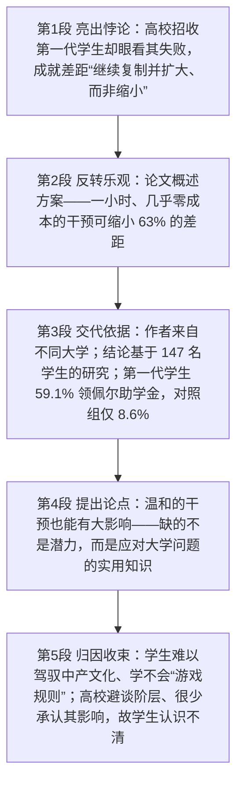

# Closing the Achievement Gap for First-Generation Students 精读笔记

## 背景

本文是 2015 年考研英语一 Text 2（第 26—30 题），主题是**第一代大学生（first-generation college students）的成就差距**。一篇即将发表于《心理科学》（*Psychological Science*）的论文报告了一个令人沮丧的事实：**高校几十年来努力招收第一代学生，却眼睁睁看着他们中的许多人失败，成就差距“继续复制并扩大、而非缩小”**；但论文随后给出了一线希望——**一项耗时一小时、几乎零成本的干预，就能缩小 63% 的差距**。

文章**不是论文本身，而是对论文的报道**（学术论文转述体）：作者几乎不表态，全篇由 `studies have found that ...`、`their findings are based on ...`、`They cite past research ... to show that ...` 这类**元话语**推进。这一语体决定了本篇的三大特征：一是**从句密集嵌套**（in that 原因状语从句、多层 that 宾语从句、同位语从句）；二是**插入语频繁**（破折号作强调性插入、括号作弱化性补充）；三是**被动语态密集**（be defined as、be based on、measured by）——把施动者隐去，正是学术报道的标志。由此也带来本篇最集中的句式难点：**后置修饰层层套叠**（`involving` 分词短语、`with a parent with a four-year degree` 的嵌套介词短语、`between ... and ...` 跨括号回挂）。

作者的论证分五步推进：

- **亮出悖论（第 1 段）**：多年来研究发现，第一代学生在一系列教育成就指标上**落后**于其他学生——成绩更低、**辍学率**更高。既然他们只有靠高等教育才能**向上流动**，高校几十年来一直努力**招收**更多这样的人。但这造成了一个“**悖论**”：招进来，却又眼看他们失败，意味着高等教育“继续**复制**并**扩大**、而非缩小”基于**社会阶层**的**成就差距**——这正是第 26 题的定位句。
- **给出希望（第 2 段）**：文章的基调其实**乐观**，因为它概述了解决之道——一种（含一小时、**几乎零成本**项目的）方法能缩小 **63%** 的成就差距。**这是第 27 题的定位句**：作者乐观的原因是“问题可解”。
- **交代依据（第 3 段）**：论文作者来自不同大学，结论基于一项**涉及 147 名学生**的研究，研究对象来自一所未具名的私立大学。“**第一代**”被定义为父母没有四年制大学学位；大多数第一代学生（**59.1%**）是**佩尔助学金**受助者，而在至少一位家长拥有四年制学位的学生中，这一比例仅为 **8.6%**——**第 28 题正落在“financial need”上**。
- **提出论点（第 4 段）**：他们的**论点**是——**温和的干预也能产生巨大影响**。这一论点基于这样一种看法：第一代学生最欠缺的**不是潜力，而是应对大学生普遍所面临问题的实用知识**（`not in potential but in practical knowledge`）；作者引用以往研究说明，正是这一“认知差距”必须被缩小，才能弥合“成就差距”——**第 29 题的定位句，也是全篇语法密度最高的一句**。
- **归因与收束（第 5 段）**：许多第一代学生“**难以**驾驭高等教育的中产阶级文化、学会其中的‘**游戏规则**’、**利用**大学资源”。而当高校不谈论不同群体的阶层优劣、**很少承认**社会阶层会影响学生的教育经历时，学生便**对自己的困境缺乏认识**，也不理解“像他们这样”的人如何才能进步——**矛头因此指向高校，这是第 30 题的推断依据**。

> [!note] 本篇的两组关键对立词
> 一是**动词轴**：`reproduce and widen`（扩大）vs. `close / narrow`（缩小）——现状是“扩大”，方案是“缩小 63%”，第 26、27 题都落在这组对立上。二是**名词轴**：`potential`（潜力，**名词**）vs. `practical knowledge`（实用知识）——命题人第 29 题 B 项正是利用了 potential 的**词性歧义**（把名词“潜力”读成形容词“潜在的”）。

本文已保留排版原文中的长难句分析 callout（共 **8 处**，逐句内联在对应句子之后）；`sentence-analysis.md` 未单独提供，因此不再重复建立独立分析章节。

---

## 文章原文

# Closing the Achievement Gap for First-Generation Students

For years, studies have found that **first-generation college students**—those who do not have a parent with a college degree—**lag** other students on a range of education achievement factors. Their grades are lower and their **dropout rates** are higher. But since such students are most likely to **advance economically** if they succeed in higher education, colleges and universities have pushed for decades to **recruit** more of them.

This has created "a **paradox**" **in that** recruiting first-generation students, but then watching many of them fail, means that higher education has "continued to **reproduce** and **widen**, rather than close" an **achievement gap** based on **social class**, according to the depressing beginning of a paper **forthcoming** in the journal *Psychological Science*.

> [!abstract]- 长难句分析
> **原句**：This has created "a **paradox**" **in that** recruiting first-generation students, but then watching many of them fail, means that higher education has "continued to **reproduce** and **widen**, rather than close" an **achievement gap** based on **social class**, according to the depressing beginning of a paper **forthcoming** in the journal *Psychological Science*.
>
> **主干提取**：
>
> - 主语 S1: This（这，指代上句"招收却眼看其失败"的做法）
> - 谓语 V1: has created（造成了）
> - 宾语 O1: "a paradox"（一种"悖论"）
> - 连词（原因状语从句引导词）: in that（在于、因为）
> - 主语 S2（从句内，两个动名词短语并列）: recruiting first-generation students, but then watching many of them fail（招收第一代学生，却又眼看其中许多人失败）
> - 谓语 V2（从句内）: means（意味着，**单数**）
> - 宾语 O2（that 从句）: that higher education has "continued to reproduce and widen, rather than close" an achievement gap（高等教育"继续复制并扩大、而非缩小"一种成就差距）
>
> **修饰成分**：
>
> | 类型 | 引导词 | 修饰对象 |
> |------|--------|----------|
> | 名词性从句（宾语从句） | that | means 的宾语（说明"意味着什么"） |
> | 原因状语从句 | in that | 解释"悖论"具体悖在哪里 |
> | 动名词短语（并列作主语） | recruiting / watching | in that 从句的主语 |
> | 并列连词（转折） | but then | 连接两个动名词短语（"招进来"↔"眼看其失败"） |
> | 不定式并列（承前省 to） | rather than | 与 continued to 的不定式并列（同形原则） |
> | 过去分词短语（后置定语） | based on | an achievement gap |
> | 过去分词短语（后置定语） | forthcoming | a paper |
> | 介词短语（信息来源状语） | according to | 全句的信息出处 |
>
> **结构图解**：
>
> ```
> 主句: This + has created + [a paradox]
>   ├── 原因状语从句: (in that [动名词主语] + means + [that 宾语从句])
>   │     ├── 并列动名词主语: (recruiting …) but then (watching … fail)
>   │     │     └── 谓语: means（单数——动名词短语整体视为一件事）
>   │     └── 宾语从句: (that higher education has continued to [reproduce and widen], rather than [close], an achievement gap)
>   │           └── 后置定语: (based on social class) → 修饰 an achievement gap
>   └── 信息来源状语: (according to the depressing beginning of a paper)
>         └── 后置定语: (forthcoming in the journal Psychological Science) → 修饰 a paper
> ```
>
> **参考译文**：这造成了一种"悖论"：招收第一代大学生，却又眼看他们中的许多人失败，这意味着高等教育"继续复制并扩大、而非缩小"基于社会阶层的成就差距——这是《心理科学》期刊上一篇即将发表的论文令人沮丧的开篇结论。
>
> **考点提示**：本句是全文最长句，也是**第 26 题的定位句**。四个要点：① **in that 是两词一体的连词**（"在于、因为"），不是"介词 + 指示代词"，判别方法是**删掉 in that 后前后两个分句各自完整**；② **两个动名词短语作主语时谓语用单数**——`recruiting …, but then watching … fail` 指"招收却眼看其失败"**这一件事**，故用 means 而非 mean，不要因为出现 students、them 而误用复数；③ **rather than 要求同形并列**，前面是 `continued to reproduce and widen`，故 rather than 后用**动词原形 close**（承前省 to），写成 rather than closing 即形式失衡；④ 句末 `according to … a paper forthcoming in the journal …` 是**信息来源状语**，其中 forthcoming 作后置定语修饰 a paper，译"即将发表的"，这是**学术报道交代出处**的标准写法，翻译时宜用破折号引出。

But the article is actually quite **optimistic**, as it **outlines** a potential solution to this problem, **suggesting that** an approach (which involves a one-hour, **next-to-no-cost** program) can close **63 percent** of the achievement gap (measured by such factors as grades) between first-generation and other students.

> [!abstract]- 长难句分析
> **原句**：But the article is actually quite **optimistic**, as it **outlines** a potential solution to this problem, **suggesting that** an approach (which involves a one-hour, **next-to-no-cost** program) can close **63 percent** of the achievement gap (measured by such factors as grades) between first-generation and other students.
>
> **主干提取**：
>
> - 主语 S: the article（这篇文章）
> - 系动词 V: is（是）
> - 表语 C: actually quite optimistic（实际上相当乐观）
> - 原因状语从句: as it outlines a potential solution to this problem（因为它概述了这一难题的可行方案）
> - 现在分词状语（逻辑主语 = it）: suggesting that …（表明……）
> - 宾语从句: that an approach can close 63 percent of the achievement gap（一种方法能缩小 63% 的成就差距）
>
> **修饰成分**：
>
> | 类型 | 引导词 | 修饰对象 |
> |------|--------|----------|
> | 原因状语从句 | as | 说明"乐观"的理由 |
> | 现在分词短语（结果/伴随状语） | suggesting | 逻辑主语为主句主语 it（= the article） |
> | 名词性从句（宾语从句） | that | suggesting 的宾语 |
> | 定语从句（非限制性，括号内） | which | an approach（补充说明该方法的形式） |
> | 过去分词短语（括号插入） | measured by | the achievement gap |
> | 介词短语（后置定语/比较范围） | between … and … | the achievement gap（被括号隔开，须回挂） |
> | 举例结构 | such … as | factors（"如成绩等"） |
> | 复合形容词（前置定语） | next-to-no-cost | program |
>
> **结构图解**：
>
> ```
> 主句: the article + is + actually quite optimistic
>   ├── 原因状语从句: (as it outlines a potential solution to this problem)
>   ├── 现在分词状语: (suggesting that …) → 逻辑主语 = it（the article）
>   │     └── 宾语从句: (that an approach can close 63 percent of the achievement gap)
>   │           ├── 括号定语从句: (which involves a one-hour, next-to-no-cost program) → 修饰 an approach
>   │           └── 后置定语: (measured by such factors as grades) → 修饰 the achievement gap
>   │                 └── 比较范围: (between first-generation and other students) → 跨越括号修饰 the achievement gap
> ```
>
> **参考译文**：但这篇文章其实相当乐观，因为它概述了解决这一难题的可行方案，指出一种方法（包含一个耗时一小时、几乎零成本的项目）能缩小第一代学生与其他学生之间成就差距的 63%（以成绩等指标衡量）。
>
> **考点提示**：**第 27 题的定位句**。三个要点：① **as 在此引导原因状语从句**（"因为"），不是"当……时"——`the article is optimistic **as** it outlines a potential solution`，作者"乐观"的原因是"问题有解"，这正是第 27 题 A 项 the problem is solvable 的来源，而 B 项 costless 是对 next-to-no-cost（**几乎**零成本）的绝对化改写；② **suggesting 的逻辑主语是主句主语 it（the article）**，补回后读作"这篇文章概述了方案，（因而）表明一种方法能……"，分词短语作结果状语时，其逻辑主语必须与主句主语一致；③ 句中**两个括号都是可跳跃的插入语**，但 `between first-generation and other students` **跨越了括号、回挂到 the achievement gap 上**——遇到括号时先跳过，把括号前后的成分接起来读，否则会误以为 between 短语修饰 grades。

The authors of the paper are from different universities, and their findings are based on a study **involving** 147 students (who completed the project) at an **unnamed private university**.

> [!abstract]- 长难句分析
> **原句**：The authors of the paper are from different universities, and their findings are based on a study **involving** 147 students (who completed the project) at an **unnamed private university**.
>
> **主干提取**：
>
> - 主语 S1: The authors of the paper（该论文的作者）
> - 系动词 V1: are（是）
> - 表语 C1: from different universities（来自不同的大学）
> - 并列连词: and
> - 主语 S2: their findings（他们的研究结论）
> - 谓语 V2: are based on（以……为基础，被动）
> - 宾语 O2: a study（一项研究）
>
> **修饰成分**：
>
> | 类型 | 引导词 | 修饰对象 |
> |------|--------|----------|
> | 介词短语（表语） | from | 说明作者的所属机构 |
> | 现在分词短语（后置定语） | involving | a study（"涉及 147 名学生的"） |
> | 定语从句（限制性，括号插入） | who | 147 students |
> | 介词短语（后置定语） | at an unnamed private university | a study（说明研究在何处开展） |
> | 被动语态 | are based on | findings 与 study 的关系 |
>
> **结构图解**：
>
> ```
> 并列句: [The authors of the paper + are + from different universities], and [their findings + are based on + a study]
>   ├── 分句1: 主语 + 系动词 + 表语（说明作者来源）
>   └── 分句2: 主语 + 被动谓语 + 宾语
>         └── 后置定语: (involving 147 students) → 修饰 a study
>               ├── 括号定语从句: (who completed the project) → 修饰 147 students
>               └── 后置定语: (at an unnamed private university) → 修饰 a study
> ```
>
> **参考译文**：该论文的作者来自不同的大学，其研究结论基于一项涉及 147 名学生的研究（这些学生完成了项目），研究对象来自一所未具名的私立大学。
>
> **考点提示**：本句是**学术"方法论交代"的模板句**，考点集中在后置修饰的层层套叠。① **involving 与 involved 的分工**：involving 表"研究**包含**多少人"（研究是施动者），involved in 表"这些人**被卷入**研究"（人是受动者）；本句说 study involving 147 students（研究涉及 147 人），若写 `the 147 students involving the study` 即语义颠倒。② **括号内的 who 从句是限制性定语从句**，语法上不可省，但在理解主干时可以先跳过，读到 `at an unnamed private university` 时须记得它**回挂到 a study**（研究在何处开展），而不是修饰 students。③ 本句主语 `The authors of the paper` 是 **A of B 结构**，中心词是 authors（作者），谓语用 are；第 29 题题干 `The authors of the paper believe that …` 正用同一主语，问的是**作者的主张**（对应第 4 段的 thesis），与第 28 题 `The study suggests that …`（研究**发现**了什么，对应第 3 段数据）定位区间不同。

First generation was defined as not having a parent with a four-year college degree.

Most of the first-generation students (**59.1 percent**) were **recipients** of **Pell Grants**, a federal **grant** for undergraduates with financial need, while this was true only for **8.6 percent** of the students with at least one parent with a four-year degree.

> [!abstract]- 长难句分析
> **原句**：Most of the first-generation students (**59.1 percent**) were **recipients** of **Pell Grants**, a federal **grant** for undergraduates with financial need, while this was true only for **8.6 percent** of the students with at least one parent with a four-year degree.
>
> **主干提取**：
>
> - 主语 S1: Most of the first-generation students（大多数第一代学生）
> - 谓语 V1: were（是）
> - 表语 C1: recipients of Pell Grants（佩尔助学金的受助者）
> - 连词（对比）: while（而、然而）
> - 主语 S2: this（这一情况，指代前句整件事）
> - 系动词 V2: was（是）
> - 表语 C2: true only for 8.6 percent of the students（仅对 8.6% 的学生成立）
>
> **修饰成分**：
>
> | 类型 | 引导词 | 修饰对象 |
> |------|--------|----------|
> | 括号插入（数据补充） | (59.1 percent) | Most of the first-generation students |
> | 同位语 | a federal grant for undergraduates with financial need | Pell Grants（解释其性质） |
> | 对比状语从句 | while | 与前分句构成"59.1% ↔ 8.6%"的数据对照 |
> | 代词指代（替代整句） | this | 前句"是佩尔助学金受助者"这一情况 |
> | 形容词短语 | be true for | 表"对……成立" |
> | 介词短语（后置定语） | with financial need | undergraduates |
> | 介词短语（后置定语，嵌套） | with at least one parent with a four-year degree | the students（其中第二个 with 又修饰 parent） |
>
> **结构图解**：
>
> ```
> 对比复句（while 连接）:
>   ├── 分句1: Most of the first-generation students + were + recipients of Pell Grants
>   │     ├── 括号插入数据: (59.1 percent)
>   │     └── 同位语: (a federal grant for undergraduates with financial need) → 解释 Pell Grants
>   │           └── 后置定语: (with financial need) → 修饰 undergraduates
>   └── 分句2: this + was + true only for 8.6 percent of the students
>         ├── 代词指代: this = 前句整件事
>         └── 后置定语: (with at least one parent with a four-year degree) → 修饰 the students
>               └── 嵌套后置定语: (with a four-year degree) → 修饰 parent
> ```
>
> **参考译文**：大多数第一代学生（59.1%）是佩尔助学金（Pell Grants）的受助者——这是一项面向有经济需要的本科生的联邦助学金——而在至少有一位家长拥有四年制大学学位的学生中，这一比例仅为 8.6%。
>
> **考点提示**：**第 28 题的定位句**。三个要点：① **while 在此表对比**（"而……"），不是"当……时"——判别方法是**看 while 前后是否构成"同一维度的两个数值/情形"**，此处 59.1% 与 8.6% 是同一指标在两个群体中的对照，故为对比；译成时间关系即丢失数据对照。② **this 指代前句整件事**，回填后是"是佩尔助学金受助者这一情况仅对 8.6% 的学生成立"；遇到 this / that 作主语，定位方法固定：**往前找最近的一个完整分句**，替换回去再读。③ **`a federal grant for undergraduates with financial need` 是 Pell Grants 的同位语**，"有经济需要"即第 28 题 C 项 are in need of financial support 的命题依据；同时注意本句三处 with / of 后置定语**层层嵌套**（students with a parent with a degree），须逐层剥离，不可把 `with a four-year degree` 误挂到 students 上。

Their **thesis**—that a relatively **modest** **intervention** could have a big impact—was based on the view that first-generation students may be most **lacking** not in potential but in **practical knowledge** about how to deal with the issues that face most college students.

> [!abstract]- 长难句分析
> **原句**：Their **thesis**—that a relatively **modest** **intervention** could have a big impact—was based on the view that first-generation students may be most **lacking** not in potential but in **practical knowledge** about how to deal with the issues that face most college students.
>
> **主干提取**：
>
> - 主语 S: Their thesis（他们的论点）
> - 谓语 V: was based on（基于，被动）
> - 宾语 O: the view（这样一种看法）
> - 同位语从句 1（破折号插入，解释 thesis）: that a relatively modest intervention could have a big impact
> - 同位语从句 2（解释 the view）: that first-generation students may be most lacking not in potential but in practical knowledge about how to deal with the issues that face most college students
>
> **修饰成分**：
>
> | 类型 | 引导词 | 修饰对象 |
> |------|--------|----------|
> | 同位语从句（破折号插入） | that | Their thesis（说明"论点是什么"） |
> | 程度副词 + 形容词 | relatively modest / big | 构成"投入小 ↔ 影响大"的反差 |
> | 同位语从句 | that | the view（说明"看法是什么"） |
> | 对比结构（介词层） | not in A but in B | 否定 potential、肯定 practical knowledge |
> | 介词短语（后置定语） | about how to deal with the issues | practical knowledge |
> | 名词性从句（介词宾语） | how + 不定式 | about 的宾语 |
> | 定语从句（限制性） | that | the issues（that 在从句中作主语） |
> | 及物动词 | face | the issues（"摆在……面前"，不是名词"脸"） |
>
> **结构图解**：
>
> ```
> 主句: Their thesis + was based on + the view
>   ├── 破折号插入同位语从句: (that a relatively modest intervention could have a big impact) → 说明 thesis
>   │     └── 反差点: modest（不大的）↔ big（巨大的）
>   └── 同位语从句: (that first-generation students may be most lacking not in potential but in practical knowledge …) → 说明 the view
>         ├── 介词层对比: not [in potential] but [in practical knowledge] → 重心在 but 之后
>         │     └── 后置定语: (about how to deal with the issues) → 修饰 practical knowledge
>         │           └── 名词性从句: (how to deal with the issues) → about 的宾语
>         └── 定语从句: (that face most college students) → 修饰 the issues
>               └── face 为及物动词: "问题面对学生"（= 学生面对问题）
> ```
>
> **参考译文**：他们的论点是：相对温和的干预也能产生巨大影响。这一论点基于这样一种看法：第一代学生最欠缺的可能不是潜力，而是应对大多数大学生所面临问题的实用知识。
>
> **考点提示**：本句是**全篇语法密度最高的一句**，也是**第 29 题的定位句**。四个要点：① **破折号插入的同位语从句要先跳读**——把 `—that a relatively modest intervention could have a big impact—` 整块跳过，主干立刻显示为 `Their thesis was based on the view that …`（他们的论点基于这样一种看法）；若被从句里的 could have 带偏，会误把"论点能有巨大影响"当主句，丢掉 was based on 这一层。② **`not in potential but in practical knowledge` 是 not A but B 的介词变体**——**介词 in 必须重复**（not in … but in …），**语义重心永远在 but 之后**，译"最欠缺的不是潜力，而是实用知识"，这正是第 29 题 D 项 inexperienced in handling their issues at college 的命题依据。③ **句中两个 that 从句功能完全不同**：破折号内的 that 从句**主谓俱全**（intervention could have …）→ **同位语从句**；句末 `the issues that face most college students` 中 that 后**缺主语** → **定语从句**。④ **face 是及物动词且方向双向**：`the issues that face most college students`（问题面对学生）与 `students face many issues`（学生面对问题）同义，不能因为它读来"别扭"就否定前者。

They **cite** past research by several authors to show that this is the gap that must be **narrowed** to close the achievement gap.

> [!abstract]- 长难句分析
> **原句**：They **cite** past research by several authors to show that this is the gap that must be **narrowed** to close the achievement gap.
>
> **主干提取**：
>
> - 主语 S: They（他们，指论文作者）
> - 谓语 V: cite（引用）
> - 宾语 O: past research by several authors（数位作者以往的研究）
> - 目的状语 A: to show that …（以表明……）
> - 宾语从句: that this is the gap（说明"表明了什么"）
> - 定语从句: that must be narrowed to close the achievement gap
>
> **修饰成分**：
>
> | 类型 | 引导词 | 修饰对象 |
> |------|--------|----------|
> | 介词短语（后置定语） | by several authors | past research |
> | 不定式（目的状语） | to show | They cite past research（"引用是为了表明"） |
> | 名词性从句（宾语从句） | that | to show 的宾语 |
> | 代词指代 | this | 前句"第一代学生缺乏实用知识"这一差距 |
> | 定语从句（限制性） | that | the gap（that 在从句中作主语） |
> | 被动语态 + 不定式（目的状语，从句内） | must be narrowed to close | 说明"缩小"的目的 |
>
> **结构图解**：
>
> ```
> 主句: They + cite + [past research by several authors] + (to show that …)
>   ├── 后置定语: (by several authors) → 修饰 past research
>   └── 目的状语（不定式）: (to show that this is the gap)
>         └── 宾语从句: this is the gap
>               ├── 代词指代: this = 前句"实用知识上的差距"
>               └── 定语从句: (that must be narrowed to close the achievement gap)
>                     └── 目的状语（不定式）: (to close the achievement gap) → 修饰 must be narrowed
> ```
>
> **参考译文**：他们引用了数位作者以往的研究来表明，正是这一差距必须被缩小，才能弥合成就差距。
>
> **考点提示**：句子短，但**两个 gap 的层次**是全篇理解的枢纽。① `this is the **gap** that must be narrowed to close the **achievement gap**` —— 两个 gap **不是同一件事**：前一个是"**实用知识上的差距**"（第一代学生与其他学生在"如何应付大学"方面的认知落差，即第 4 段首句所述），后一个是全文讨论的"**成就差距**"（成绩、辍学率等指标）。**前者是因、后者是果**：只有先缩小"认知差距"，才能弥合"成就差距"。这里正是第 29 题的逻辑基础。② **句中出现两个不定式目的状语且层级不同**：`to show that …` 说明 cite 的**目的**，`to close the achievement gap` 说明 narrowed 的**目的**，两者不在同一层，翻译时须分别处理（"引用研究来表明……" / "为弥合……而必须缩小"）。③ **cite 是"为论证而引用"**，后接 to show / to argue that，考研阅读中出现此结构即提示"**论据在此，不在作者本人身上**"。

Many first-generation students "**struggle to** **navigate** the middle-class culture of higher education, learn the '**rules of the game**,' and **take advantage of** college resources," they write.

> [!abstract]- 长难句分析
> **原句**：Many first-generation students "**struggle to** **navigate** the middle-class culture of higher education, learn the '**rules of the game**,' and **take advantage of** college resources," they write.
>
> **主干提取**：
>
> - 宾语 O（引语，前置）: "Many first-generation students struggle to navigate …, learn …, and take advantage of …"
> - 谓语 V: write（写道）
> - 主语 S: they（他们，指论文作者）
> - 引语内主干:
>   - 主语: Many first-generation students（许多第一代学生）
>   - 谓语: struggle to navigate（难以驾驭）
>   - 宾语: the middle-class culture of higher education
>   - 并列谓语 2（承前省 to）: (to) learn the 'rules of the game'
>   - 并列谓语 3（承前省 to）: (to) take advantage of college resources
>
> **修饰成分**：
>
> | 类型 | 引导词 | 修饰对象 |
> |------|--------|----------|
> | 完全倒装 | 引语前置 | 谓语 write 提到主语 they 之前 |
> | 并列不定式（省 to） | and | 三个不定式共用 struggle to，后两项省去 to |
> | 介词短语（后置定语） | of higher education | the middle-class culture |
> | 引号（引内引） | 'rules of the game' | 表示"他人给定的说法"，带引号保留比喻 |
>
> **结构图解**：
>
> ```
> 主句（完全倒装）: [引语 = 宾语，前置] + write + [主语 they]
>   └── 引语内部: Many first-generation students + struggle to [navigate …], [learn …], and [take advantage of …]
>         ├── 不定式 1: (to navigate the middle-class culture of higher education)
>         │     └── 后置定语: (of higher education) → 修饰 the middle-class culture
>         ├── 不定式 2（省 to）: (learn the 'rules of the game')
>         └── 不定式 3（省 to）: (take advantage of college resources)
> ```
>
> **参考译文**：他们写道，许多第一代学生"难以驾驭高等教育的中产阶级文化，难以学会其中的'游戏规则'，也难以利用大学资源"。
>
> **考点提示**：本句有两个正式书面语特征。① **引语前置引起的完全倒装**：把宾语（引语）提到句首，谓语 write 提到主语 they 之前，构成 `"…," they write.` 的结构；若按正常语序写作 `They write, "…"` 亦正确，但**报道文体中前者更常见**（2015 Passage 1 的 `writes one of the researchers, Sarah Damaske` 是同一手法的变体）。判读时先**跳过引语、直取主语和谓语**（they write），再回头读引语内容。② **并列不定式的"省 to"规律**：由 and / or 连接的并列不定式，**第二项及以后通常省去 to**——本句是 `struggle to navigate …, (to) learn …, and (to) take advantage of …` 三个不定式并列，翻译时宜**重复"难以……"以保留排比的三个动作**（难以驾驭文化 / 难以学会规则 / 难以利用资源）。这三个动作恰好对应末段"学生不知如何 improve"的困境，也是**第 30 题的背景铺垫**。

And this becomes more of a problem when colleges don't talk about the class advantages and disadvantages of different groups of students.

"Because US colleges and universities **seldom** **acknowledge** how social class can affect students' educational experiences, many first-generation students **lack insight** about why they are struggling and do not understand how students 'like them' can improve."

> [!abstract]- 长难句分析
> **原句**："Because US colleges and universities **seldom** **acknowledge** how social class can affect students' educational experiences, many first-generation students **lack insight** about why they are struggling and do not understand how students 'like them' can improve."
>
> **主干提取**：
>
> - 原因状语从句（前置）: Because US colleges and universities seldom acknowledge how social class can affect students' educational experiences
> - 主语 S1: many first-generation students（许多第一代学生）
> - 谓语 V1: lack（缺乏）
> - 宾语 O1: insight about why they are struggling（关于"自己为何struggle"的认识）
> - 并列连词: and
> - 谓语 V2: do not understand（不理解，**补出助动词 do** 与 lack 并列）
> - 宾语 O2: how students 'like them' can improve（"像他们这样"的学生如何进步）
>
> **修饰成分**：
>
> | 类型 | 引导词 | 修饰对象 |
> |------|--------|----------|
> | 原因状语从句（前置） | Because | 说明主句的原因 |
> | 半否定副词 | seldom | acknowledge（"很少"= 几乎不） |
> | 名词性从句（宾语从句） | how | acknowledge 的宾语 |
> | 介词短语（后置定语） | about why they are struggling | insight |
> | 名词性从句（介词宾语） | why | about 的宾语 |
> | 介词（不是连词） | like | "'like them'" = "像他们这样的" |
> | 名词性从句（宾语从句） | how | understand 的宾语 |
> | 助动词 do（否定式） | do not | 补齐第二个并列谓语的否定 |
>
> **结构图解**：
>
> ```
> 主句: many first-generation students + [lack insight about …] and [do not understand how …]
>   ├── 原因状语从句（前置）: (Because US colleges seldom acknowledge how social class can affect students' educational experiences)
>   │     ├── 半否定副词: (seldom) → 使从句整体语义为否定（"很少承认"）
>   │     └── 宾语从句: (how social class can affect students' educational experiences)
>   ├── 谓语 1: lack
>   │     └── 宾语 + 后置定语: (insight about why they are struggling)
>   │           └── 宾语从句（介词宾语）: (why they are struggling)
>   └── 谓语 2（并列）: do not understand
>         └── 宾语从句: (how students 'like them' can improve)
>               └── 介词短语作后置定语: ('like them') → 修饰 students
> ```
>
> **参考译文**："由于美国高校很少承认社会阶层会如何影响学生的教育经历，许多第一代学生对自己为何吃力缺乏认识，也不理解'像他们这样'的学生如何才能进步。"
>
> **考点提示**：**第 30 题的定位句**，也是全篇的归因结论。四个要点：① **seldom 是半否定副词**（"很少、几乎不"）——所在句子**形式上肯定、意义上否定**，译"很少承认"而非"不承认"；若它置于句首须**部分倒装**（Seldom **do** colleges acknowledge …），且因其含否定，**反意疑问句用肯定形式**。② **`do not understand` 与前面的 `lack` 并列**——前一个谓语是实义动词肯定式（lack），后一个是否定式，故**必须补出助动词 do**；两个谓语共用一个主语 many first-generation students。③ **两处 how 从句功能不同**：`how social class **can affect** …` 作 acknowledge 的宾语（陈述句语序），`how students 'like them' **can improve**` 作 understand 的宾语——**how 引导宾语从句时用陈述语序，不用疑问语序**（写成 `how can students improve` 即错）。④ **`'like them'` 中 like 是介词**（"像……一样的"），不是动词"喜欢"，译"'像他们这样'的学生"，加引号体现这是**他人贴的标签视角**。⑤ **作者的归因落在高校身上**——两处批评（`don't talk about`、`seldom acknowledge`）都指向"高校避谈阶层"，故可推出第 30 题 D 项 colleges are partly responsible for the problem in question；**partly（部分）二字正对应作者克制的措辞**（只说"很少承认"，不说"故意隐瞒"）。

## 题目

### 26. Recruiting more first-generation students has ____.

- [A] reduced their dropout rates
- [B] narrowed the achievement gap
- [C] missed its original purpose
- [D] depressed college students

### 27. The authors of the research article are optimistic because ____.

- [A] the problem is solvable
- [B] their approach is costless
- [C] the recruiting rate has increased
- [D] their findings appeal to students

### 28. The study suggests that most first-generation students ____.

- [A] study at private universities
- [B] are from single-parent families
- [C] are in need of financial support
- [D] have failed their college

### 29. The authors of the paper believe that first-generation students ____.

- [A] are actually indifferent to the achievement gap
- [B] can have a potential influence on other students
- [C] may lack opportunities to apply for research projects
- [D] are inexperienced in handling their issues at college

### 30. We may infer from the last paragraph that ____.

- [A] universities often reject the culture of the middle-class
- [B] students are usually to blame for their lack of resources
- [C] social class greatly helps enrich educational experiences
- [D] colleges are partly responsible for the problem in question

---

## 翻译对照

# Closing the Achievement Gap for First-Generation Students 缩小第一代大学生的成就差距 中英对照

## 文章原文

For years, studies have found that **first-generation college students**—those who do not have a parent with a college degree—**lag** other students on a range of education achievement factors. Their grades are lower and their **dropout rates** are higher. But since such students are most likely to **advance economically** if they succeed in higher education, colleges and universities have pushed for decades to **recruit** more of them. This has created "a **paradox**" **in that** recruiting first-generation students, but then watching many of them fail, means that higher education has "continued to **reproduce** and **widen**, rather than close" an **achievement gap** based on **social class**, according to the depressing beginning of a paper **forthcoming** in the journal *Psychological Science*.

多年来，研究一直发现，第一代大学生——即父母没有大学学位的学生——在一系列教育成就指标上都**落后于**其他学生。他们的成绩更低，**辍学率**更高。但既然这类学生只有在高等教育中取得成功才最有可能**实现经济地位的提升**，高校几十年来一直努力**招收**更多这样的学生。这造成了一种“**悖论**”：招收第一代大学生，却又眼看着他们中的许多人失败，这意味着高等教育“继续**复制**并**扩大**、而非缩小”基于**社会阶层**的**成就差距**——这是《心理科学》期刊上一篇**即将发表**的论文令人沮丧的开篇结论。

> [!note] 翻译说明
> **first-generation college students** 译“第一代大学生”，指父母双方均无大学学历的学生（即家中第一个上大学的人），后文 `not having a parent with a four-year college degree` 是本文给出的操作性定义，另有同位解释 `those who do not have a parent with a college degree`；**lag** 作动词，译“落后于”，`lag other students on ...` 即“在……方面落后于其他学生”，**dropout rates** 译“辍学率”（drop out 退学、辍学）；**advance economically** 译“在经济上向上流动、实现经济地位的提升”，不可直译“经济地前进”；**recruit** 译“招收、招募”，本文主语是高校，故为“招生”语境；**paradox** 译“悖论、自相矛盾之事”，本段末尾正是第 26 题的定位句；`in that` 引导**原因状语从句**（“在于、因为”），此处解释悖论的内容，不要误当作 that 定语从句；**reproduce and widen, rather than close** 是三个动词并列，`rather than` 表取舍，译“复制并扩大，而非缩小”，修饰对象是 achievement gap；**achievement gap** 译“成就差距、学业差距”，**based on social class** 是过去分词短语作后置定语，译“基于社会阶层的”；**forthcoming** 译“即将出版的、即将发表的”，**according to ...** 说明上述判断的出处。

But the article is actually quite **optimistic**, as it **outlines** a potential solution to this problem, **suggesting that** an approach (which involves a one-hour, **next-to-no-cost** program) can close **63 percent** of the achievement gap (measured by such factors as grades) between first-generation and other students.

但这篇文章其实相当**乐观**，因为它**概述**了解决这一难题的可行方案，**指出**一种方法（包含一个耗时一小时、**几乎零成本**的项目）能缩小第一代学生与其他学生之间成就差距的 **63%**（以成绩等指标衡量）。

> [!note] 翻译说明
> `as it outlines ...` 中 **as** 引导**原因状语从句**，译“因为”，不是“当……时”；**be optimistic as ...** 结构上“乐观”的原因是 it outlines a potential solution——**“问题可以解决”正是第 27 题 A 项的来源**，命题人把 outlines a potential solution 同义转述为 the problem is solvable；**outline** 译“概述、勾勒”，**potential** 译“潜在的、可能的”；**next-to-no-cost** 是复合形容词，译“几乎零成本的”（next to 意为“几乎、近乎”），B 项 costless 是其绝对化改写，属干扰；**close 63 percent of the achievement gap** 中 **close** 是熟词生义，译“缩小、弥合”（不是“关闭”），后文 `narrowed to close the achievement gap` 中的 narrow 与之同义复现；两处括号均为**插入语**（which 定语从句 + 过去分词短语），翻译时保留括号，不影响主干 `an approach can close 63 percent of the gap`。

The authors of the paper are from different universities, and their findings are based on a study **involving** 147 students (who completed the project) at an **unnamed private university**. First generation was defined as not having a parent with a four-year college degree. Most of the first-generation students (**59.1 percent**) were **recipients** of **Pell Grants**, a federal **grant** for undergraduates with financial need, while this was true only for **8.6 percent** of the students with at least one parent with a four-year degree.

该论文的作者来自不同的大学，其研究结论基于一项**涉及** 147 名学生的研究（这些学生完成了项目），研究对象来自一所**未具名的私立大学**。第一代学生被定义为父母中没有四年制大学学位的学生。大多数第一代学生（**59.1%**）是**佩尔助学金**（**Pell Grants**）的**受助者**——这是一项面向有经济需要的本科生的联邦**助学金**——而在至少有一位家长拥有四年制大学学位的学生中，这一比例仅为 **8.6%**。

> [!note] 翻译说明
> **involving 147 students** 是现在分词短语作后置定语，译“涉及 147 名学生的”，注意 **involve** 在此表“包含、涉及”，不是“卷入”；**unnamed private university** 译“未具名的私立大学”（unnamed 匿名、未点名）；**four-year college degree** 译“四年制大学学位”，即通常的本科学位，是本文区分“第一代 / 非第一代”的唯一标准，不要与后文的 Pell Grants 混淆；**recipients** 译“领取者、受助者”（动词 receive）；**Pell Grants** 是专有名词，译“佩尔助学金”，同位语 `a federal grant for undergraduates with financial need` 补充说明其性质——**with financial need** 译“有经济需要的”，**“需经济资助”即第 28 题 C 项 in need of financial support 的出处**；`while this was true only for 8.6 percent ...` 中 **while** 表**对比**（“而……”，不是“当……时”），`this` 指代前文“是佩尔助学金受助者”这一情况，两组数字（59.1% vs 8.6%）的悬殊对比是本文论证的统计学基础。

Their **thesis**—that a relatively **modest** **intervention** could have a big impact—was based on the view that first-generation students may be most **lacking** not in potential but in **practical knowledge** about how to deal with the issues that face most college students. They **cite** past research by several authors to show that this is the gap that must be **narrowed** to close the achievement gap.

他们的**论点是**：相对**温和**的**干预**也能产生巨大影响。这一论点基于这样一种看法：第一代学生最**欠缺**的可能不是潜力，而是应对大多数大学生所面临问题的**实用知识**。他们**引用**了数位作者以往的研究来表明，正是这一差距必须被**缩小**，才能弥合成就差距。

> [!note] 翻译说明
> **thesis** 译“论点、论题”（此处指论文的核心主张），破折号内 `that ... could have a big impact` 是 thesis 的**同位语从句**，翻译时拆成冒号后的独立短句更通顺；**modest** 译“温和的、不大的”（与 big 形成对照），**intervention** 译“干预、介入”，考研高频词，指研究者施加的介入措施（即上文的 one-hour program）；`not in potential but in practical knowledge` 是 **not A but B** 的对比结构，且带介词 in，译“不是……而是……”——**“缺的是实用知识而非潜力”正是第 29 题 D 项 inexperienced in handling their issues at college 的同义转述**；**practical knowledge** 译“实用知识、实践性知识”；`the issues that face most college students` 中 **face** 是动词“面对、摆在……面前”，不是名词“脸”；**cite** 译“引用、援引”；`the gap that must be narrowed to close the achievement gap` 中不定式 **to close** 作目的状语，译“为弥合（成就差距）而必须缩小的（差距）”，注意本句两个 gap 层次不同：前者指“实用知识上的差距”，后者指全文的“成就差距”。

Many first-generation students "**struggle to** **navigate** the middle-class culture of higher education, learn the '**rules of the game**,' and **take advantage of** college resources," they write. And this becomes more of a problem when colleges don't talk about the class advantages and disadvantages of different groups of students. "Because US colleges and universities **seldom** **acknowledge** how social class can affect students' educational experiences, many first-generation students **lack insight** about why they are struggling and do not understand how students 'like them' can improve."

他们写道，许多第一代学生“**难以**驾驭高等教育的中产阶级文化，难以学会其中的‘**游戏规则**’，也难以**利用**大学资源”。而当大学不谈论不同学生群体的阶层优势与劣势时，这个问题会变得更严重。“由于美国高校**很少**承认社会阶层会如何影响学生的教育经历，许多第一代学生**对自己为何struggle缺乏洞察**，也不理解‘像他们这样’的学生如何才能进步。”

> [!note] 翻译说明
> `struggle to navigate ..., learn ..., and take advantage of ...` 是**三个并列的不定式**共用 struggle to，译时宜重复“难以……”以保留排比节奏；**navigate** 本义“航海、导航”，此处引申为“应对、驾驭（陌生的体制与文化）”，**the middle-class culture of higher education** 译“高等教育的中产阶级文化”（指大学默认的、中产家庭子女从小耳濡目染的行为规范）；**rules of the game** 译“游戏规则”，用引号保留原文的比喻；**take advantage of** 译“利用（有利条件）”，是褒义用法，**college resources** 译“大学（提供的）资源”；`this becomes more of a problem when ...` 中 **when** 引导时间/条件状语从句，译“当……时（问题更严重）”；**seldom** 是**否定副词**（“很少、几乎不”），**seldom acknowledge** 译“很少承认”，**acknowledge** 译“承认、认可”，**not ... talk about** / **seldom acknowledge** 两处呼应，共同指向高校的沉默——**“高校本身有责任”正是第 30 题 D 项 colleges are partly responsible for the problem in question 的推断依据**；**lack insight about** 译“对……缺乏洞察 / 认识不足”，`lack` 此处为动词；`students 'like them'` 中 like 是**介词**“像……一样的”，译“‘像他们这样’的学生”，加引号体现这是他人给的标签视角；**why they are struggling** 是宾语从句，译“自己为何struggle（吃力、挣扎）”。

## 题目翻译

### 26. Recruiting more first-generation students has ____.

招收更多第一代大学生这一做法 ____。

- **A.** reduced their dropout rates
  - 降低了他们的辍学率
- **B.** narrowed the achievement gap
  - 缩小了成就差距
- **C.** missed its original purpose
  - 未能实现其初衷
- **D.** depressed college students
  - 使大学生感到沮丧

> [!note] 翻译说明
> 题干 `has ____` 后省略了宾语补足语，考查“招收更多第一代学生造成了什么结果”。第 1 段末句给出答案依据：`This has created "a paradox" in that recruiting first-generation students, but then watching many of them fail, means that higher education has "continued to reproduce and widen, rather than close" an achievement gap`——**招收 → 却眼看着他们失败 → 差距不缩反扩**，即“招收”的初衷（帮助其成功、缩小差距）落了空，故 C 项 **missed its original purpose**（未能实现其初衷）正确，**purpose** 译“目的、初衷”，miss 此处译“未达到、错过”。A、B 两项（辍学率降低、差距缩小）正是原文明确否定的方向：原文说 dropout rates are higher、continued to reproduce and widen rather than close；D 项 **depressed** 是词形干扰，原文的 depressing 是修饰 paper 的开篇（令人沮丧的开篇），并非“使大学生沮丧”。

### 27. The authors of the research article are optimistic because ____.

这篇研究论文的作者们之所以乐观，是因为 ____。

- **A.** the problem is solvable
  - 这个问题是可以解决的
- **B.** their approach is costless
  - 他们的方法是不花钱的
- **C.** the recruiting rate has increased
  - 招生率提高了
- **D.** their findings appeal to students
  - 他们的研究结果对学生有吸引力

> [!note] 翻译说明
> 定位第 2 段首句：`the article is actually quite optimistic, as it outlines a potential solution to this problem`——`as` 引导原因状语从句，**乐观的原因**是文章“勾勒出了这一难题的潜在解决方案”，即 A 项 **the problem is solvable**（问题可解），这是对 potential solution 的**同义转述**。B 项 **costless**（不花钱的）是对原文 `next-to-no-cost`（几乎零成本）的**绝对化改写**，几乎零成本 ≠ 不花钱，且“成本低”只是方法的特征，不是作者乐观的原因；C 项 recruiting rate 在原文中从未提及上升；D 项 **appeal to students**（对学生有吸引力）属无中生有，原文的 appeal 并无此语。

### 28. The study suggests that most first-generation students ____.

这项研究表明，大多数第一代学生 ____。

- **A.** study at private universities
  - 就读于私立大学
- **B.** are from single-parent families
  - 来自单亲家庭
- **C.** are in need of financial support
  - 需要经济资助
- **D.** have failed their college
  - 大学未能毕业

> [!note] 翻译说明
> 定位第 3 段：`Most of the first-generation students (59.1 percent) were recipients of Pell Grants, a federal grant for undergraduates with financial need`——大多数第一代学生是**佩尔助学金**受助者，而该项助学金专门面向 **with financial need**（有经济需要）的本科生，据此可推 C 项 **are in need of financial support**（需要经济资助），**in need of** 译“需要”，**financial support** 与 financial need 同义呼应。A 项是**偷换主体**：私立大学（unnamed private university）是研究对象所在的学校类型，并不等于“大多数第一代学生都就读于私立大学”，且原文只说该研究在“一所”私立大学开展；B 项 **single-parent families** 是对第一代（父母无大学学位）定义的曲解，原文从未提单亲；D 项 **failed their college**（未能完成大学学业）把第一段“整体辍学率偏高”的群体统计偷换成“大多数人都失败了”，与 59.1% 这一数据所表达的内容无关。

### 29. The authors of the paper believe that first-generation students ____.

论文作者认为，第一代学生 ____。

- **A.** are actually indifferent to the achievement gap
  - 实际上对成就差距漠不关心
- **B.** can have a potential influence on other students
  - 能够对其他学生产生潜在影响
- **C.** may lack opportunities to apply for research projects
  - 可能缺少申请研究项目的机会
- **D.** are inexperienced in handling their issues at college
  - 在应对大学中的自身问题方面缺乏经验

> [!note] 翻译说明
> 定位第 4 段：`first-generation students may be most lacking not in potential but in practical knowledge about how to deal with the issues that face most college students`——所缺的“不是潜力，而是**如何应对大学生普遍所面临问题的实用知识**”，D 项 **are inexperienced in handling their issues at college**（在应对大学里自身问题的方面缺乏经验）正是这一表述的同义转述，**inexperienced** 译“缺乏经验的”，**handle** 与 deal with 同义。A 项 **indifferent**（漠不关心的）无中生有，原文说他们 lack insight（缺乏认识）、struggle（挣扎），是“不了解”而非“不在乎”；B 项 **have a potential influence on other students** 把原文的 **potential**（潜力，指学生自身的潜能）误置到“对他人的影响”上，属**同词异义干扰**；C 项 **research projects** 与原文的“实用知识（practical knowledge）”完全无关，属无中生有。

### 30. We may infer from the last paragraph that ____.

从最后一段我们可以推断出 ____。

- **A.** universities often reject the culture of the middle-class
  - 大学常常排斥中产阶级文化
- **B.** students are usually to blame for their lack of resources
  - 学生通常要为自己缺少资源而受责备
- **C.** social class greatly helps enrich educational experiences
  - 社会阶层极大地有助于丰富教育经历
- **D.** colleges are partly responsible for the problem in question
  - 高校对所述问题负有部分责任

> [!note] 翻译说明
> 末段两处批评指向同一对象：`this becomes more of a problem when colleges don't talk about the class advantages and disadvantages`、`Because US colleges and universities seldom acknowledge how social class can affect students' educational experiences, many first-generation students lack insight about why they are struggling`——**高校避谈阶层、不承认阶层的影响，才使学生认识不清、无从改进**，故推断 D 项 **colleges are partly responsible for the problem in question**（高校对所述问题负有部分责任），**partly responsible** 译“负有部分责任”，**in question** 译“所谈论的、所述的”。A 项 **reject**（排斥、拒绝）与原文不搭：原文说的是学生 struggle to navigate the middle-class culture（学生“难以驾驭”中产文化），主客体和动词都被偷换，大学并未“排斥中产文化”；B 项 **to blame**（该受责备）把责任推给学生，与原文把矛头指向高校的态度**正相反**；C 项 **enrich educational experiences** 把原文 `social class can affect students' educational experiences`（阶层**影响**教育经历）中的中性词 affect 改写为褒义词 enrich（丰富），且原文强调的是负面影响，属**感情色彩偷换**。

---

## 语法要点

# 2015 Passage 2 语法要点整理

> [!note] 来源说明
> 本篇**用户未提供语法源笔记**，以下语法点由 `formatted-article.md` 与 `translation.md` **推断提取**，仅收录本篇实际出现的结构，不引入原文不存在的语法规则。
>
> **例句标注约定**：表格中**未加标注**的英文例句**全部取自本篇原文**；标注 **（自拟例）** 的是为讲清规则而编的中性短句，标注 **（改写自本篇）** 的是本篇原句的变形。标注 ❌ / ✅ 的是对错对照示例。

本篇主题为"第一代大学生成就差距的成因与对策"的**论文报道类说明文**（adaptation of an academic paper report），语体特点是**学术报道腔浓厚**：全篇以 `studies have found that ...`、`their findings are based on a study involving ...`、`They cite past research ... to show that ...` 这类**"研究—发现—依据"的元话语框架**展开，句句都在转述他人研究而非作者表态。这决定了本篇的两大语法特征：一是**宾语从句与同位语从句密集嵌套**（一个句子要连转两层"某项研究指出……，该研究认为……"），二是**括号、破折号插入语频繁**（用 which 从句、过去分词短语、that 同位语从句把补充信息塞进主干中间）。完整的固定搭配与词组释义、应用场景及辨析保存在 [[固定搭配与词组笔记]]；本笔记只提取可迁移的语法结构。

---

### 从句：原因状语从句（in that）

**in that** 引导**原因状语从句**，意为"在于、因为、由于"，用来解释前文某个判断的**具体内容或理由**。它与 because 的最大差别是**语体更正式、更书面**，且**只能后置**（不能放句首）。

| 结构 | 用法 | 例句 |
|------|------|------|
| 主句 + **in that** + 完整句 | 解释前句"何以成立"，书面语 | This has created "a paradox" **in that** recruiting first-generation students … means that higher education has "continued to reproduce and widen, rather than close" an achievement gap |
| **in that** 前必须有主句 | in that 引导的从句**不可前置** | ❌ **In that** recruiting … , this has created a paradox.（**自拟例**） |
| **because / since / as / for** 对比 | 口语与书面均可，位置灵活 | **Because** US colleges seldom acknowledge … , many first-generation students lack insight … |

> [!tip] in that 与 because 的一句话判别
> **in that 是"限定解释"，because 是"直接归因"**。本篇 `created a paradox **in that** ...`——"悖论"不是一个独立事件，而是**对前面那个"招收却失败"的事实本身的命名**，in that 引出的是"这个悖论具体悖在哪里"；若换成 because，会读成"因为招收学生，所以产生了悖论"，因果方向被读歪。参见 [[语法总结笔记]] 的「原因状语从句：in that vs because」。

> [!warning] in that 不要与 that 定语从句混淆
> `in that` 是**两词一体的连词**（that 不作成分）；若把 in 与 that 拆开读成"介词 + that 从句"，则句子结构全错。判别法：**把 in that 整体删掉，前后两个分句各自完整** → 是原因状语从句。本篇 `This has created a paradox`（完整） + `recruiting ... means that ...`（完整），删掉 in that 后两句都成立，故为原因状语从句。

---

### 从句：宾语从句（多层嵌套的 that）

本篇是"转述型"文本，`that` 宾语从句层层嵌套，常出现"**主句 + that 从句 + 从句里再套一个 that 从句**"的三层结构。这一类句子只要**从最外层动词往里剥**，就不会读乱。

| 结构 | 用法 | 例句 |
|------|------|------|
| V + **that** + 完整句（一层） | 最外层：studies have found + 内容 | studies have found **that** first-generation college students lag other students |
| V + that + **V + that**（两层） | 从句内再套一层宾语从句 | recruiting … means **that** higher education has "continued to reproduce and widen …, rather than close" an **achievement gap** |
| 非谓语作从句主语 | 动名词短语整体作 that 从句的主语 | **recruiting first-generation students, but then watching many of them fail**, means that …（两个动名词短语并列作主语，谓语用**单数** means） |
| 介词短语作后置定语（从句内） | 修饰从句末尾的名词 | an achievement gap **based on social class** |

> [!tip] 嵌套宾语从句的"剥洋葱"读法
> 遇到长句先找**最外层的谓语动词**，再一层层往里剥：`This has created "a paradox" [in that] [recruiting …, but then watching … fail] means [that] higher education has "continued to …" an achievement gap [based on social class]`。剥到最里层，会发现**主干只有三块**：*招而不成 → 意味着 → 差距在扩大*。所有中间成分都是"谁做的、什么样的差距"这类补充信息。

> [!warning] 动名词短语作主语时，谓语用单数
> `recruiting first-generation students, but then watching many of them fail, **means** that …` —— 两个 -ing 短语由 but then 连接，整体仍是**一个动名词主语**（指"招收却眼看其失败"这一件事），谓语必须用**单数 means**，不能因为出现 students、them 就写成 mean。同理：`Reading and writing **is** essential.`（**自拟例**）

---

### 从句：原因状语从句（as）

**as** 引导原因状语从句时意为"因为、由于"，语体介于 because 与 since 之间，**通常后置或前置均可**，但语气比 because 弱，多用于**已知理由的顺带说明**（"既然……"）。

| 结构 | 用法 | 例句 |
|------|------|------|
| 主句 + **, as** + 完整句 | 补充说明理由，书面常用 | the article is actually quite optimistic, **as it outlines a potential solution** to this problem |
| **as** 引导原因（前置） | "由于……"，较正式 | **As** it was getting dark, we went home.（**自拟例**） |
| **since** 引导原因 | "既然"，理由为双方已知 | **Since** such students are most likely to advance economically … , colleges have pushed to recruit more |
| **because** 引导原因 | 最强因果，回答 why | colleges pushed to recruit more **because** such students may advance economically（**改写自本篇**） |

> [!tip] as 的三副面孔：本篇就能一次看全
> 本篇的 as 出现了不同功能，读时必须逐一定性：① **`as it outlines a potential solution`** —— **原因状语从句**（"因为"），本句是第 27 题的定位句；② **`as it was defined as not having ...` 的 `be defined as`** —— **介词 as**（"作为、被定义为"），不是连词；③ **`such factors as grades`** —— **介词 as 表举例**（"如、诸如"）。**判别口诀：as 后面跟完整句 → 连词（原因/时间/方式）；as 后面跟名词/形容词/分词 → 介词。**

---

### 从句：定语从句（that 修饰 issues）与 face 作及物动词

`that face most college students` 中 that 引导**限制性定语从句**，先行词是 issues，**that 在从句中作主语**。本句的真正难点不在从句，而在 **face 的词性判断**：这里是**动词**"面对、摆在……面前"，不是名词"脸"。

| 结构 | 用法 | 例句 |
|------|------|------|
| n. + **that** + V + O | that 在从句中作主语，先行词为物 | the issues **that face most college students** |
| **face + 宾语**（动词） | "面对、面临"，主语可以是人也可以是**事物** | the issues that **face** most college students（问题摆在学生面前） |
| **face + 宾语**（动词，另一方向） | 人也常作 face 的主语 | students **face** many issues（**改写自本篇**） |
| **in the face of / face to face** | 名词用法 | **in the face of** difficulties（**自拟例**） |

> [!warning] face 的双向用法是考研常设的陷阱
> `the issues that **face** most college students` 与 `students **face** many issues` **含义相同但主宾颠倒**：前者"问题面对学生"，后者"学生面对问题"。**face 是双向动词**，两种语序都成立，做题时不能因为"学生怎么会是被面对的对象"就否定前者。同理：`the challenge **facing** us` = `the challenge we **face**`（**自拟例**）。

> [!note] 定语从句与同位语从句的分辨（本篇两处同现）
> 本篇 `the issues **that** face most college students` 中，that 后**缺主语**（face 需要主语），that 正好补上 → **定语从句**；而后文 `based on the view **that** first-generation students may be most lacking not in potential but in practical knowledge` 中，that 后的句子**主谓宾俱全**（students may be lacking …），that 不作成分 → **同位语从句**。**同一篇文章里两种 that 并现，是命题人最爱的结构混淆点。**

---

### 从句：同位语从句（thesis / the view that）与破折号插入

本篇用**破折号**把同位语从句插在主语与谓语之间：`Their thesis—that a relatively modest intervention could have a big impact—was based on the view that ...`。这类"**主语 + 破折号插入同位语从句 + 谓语**"的结构，是学术文本用来说明"论点是什么"的标准写法。

| 结构 | 用法 | 例句 |
|------|------|------|
| n. **—that 从句—** V … | 破折号插入同位语从句，解释主语内容 | Their **thesis—that** a relatively modest intervention could have a big impact**—was** based on the view … |
| n. + **that** + 完整句 | 抽象名词后的同位语从句，that 不作成分 | was based on the **view that** first-generation students may be most lacking not in potential but in practical knowledge |
| **介词 + the fact that** | 同位语从句整体作介词宾语 | is based on the view that …（介词 on 的宾语是 the view） |

> [!tip] 插入同位语从句时，先"跳读"再回填
> 读 `Their thesis—…—was based on the view that …` 时，**先把破折号里的内容整块跳过**，主干立刻显示为 `Their thesis was based on the view that …`（他们的论点基于这样一种看法），然后再回填破折号内的"论点是什么"。若被破折号内的 could have 带偏、误把它当成主句谓语，就会读成"论点能有巨大影响"而丢失 was based on 这一层。

> [!warning] 同位语从句中的 that 不可省略，也不可换成 which
> `the view **that** first-generation students may be most lacking …` 中 that 只引导、不作成分，**必须保留**；写成 `the view **which** …` ❌ 会被读成定语从句（which 须在从句中作成分，而此处从句已完整）。对比：`the view **that** he holds`（定语从句，that 作 holds 的宾语）与 `the view **that** he is right`（同位语从句）——**看从句是否缺成分**。

---

### 并列谓语：continued to reproduce and widen, rather than close

`higher education has "continued to reproduce and widen, rather than close" an achievement gap` 是**不定式内部的三个动词并列**：`to reproduce`、`(to) widen`、`rather than (to) close`，共用 continued to 的框架，宾语是 an achievement gap。

| 结构 | 用法 | 例句 |
|------|------|------|
| **continue to A and (to) B** | 不定式并列，第二个 to 可省 | has continued **to reproduce and widen** |
| **rather than + 动词原形** | "而不是"，与前面**同形并列**（保持平行） | has continued to reproduce and widen, **rather than close**, an achievement gap |
| **rather than + doing / n.** | 前后形式须一致 | Rather than **closing** the gap, it widened it.（**改写自本篇**） |

> [!tip] rather than 的"同形原则"
> `rather than` 要求**前后语法形式一致**（都是不定式、都是动名词、都是名词）：本篇前面是 `to reproduce and widen`，故 rather than 后用**动词原形 close**（承前省 to）。若写成 `rather than to close` 亦可，但 `rather than closing` ❌ 则形式失衡。**形式上与前面的并列项对齐，语义上表"取前者、舍后者"**——本篇"continues to reproduce and widen **rather than** close"正是第 26 题 C 项 missed its original purpose 的语义依据。

---

### 非谓语：现在分词短语作状语（suggesting that）

`the article is actually quite optimistic, as it outlines a potential solution to this problem, suggesting that an approach … can close 63 percent of the achievement gap` —— **suggesting** 是现在分词短语作**结果/伴随状语**，其逻辑主语是主句主语 **it**（= the article），扩展为一个完整的宾语从句 `that an approach can close 63 percent …`。

| 结构 | 用法 | 例句 |
|------|------|------|
| 主句 + **, suggesting that** + 从句 | 现在分词作结果/伴随状语，逻辑主语 = 主句主语 | as it outlines a potential solution …, **suggesting that** an approach … can close 63 percent of the gap |
| 主句 + **, which suggests that** + 从句 | 同义改写为定语从句（which 指代前句） | …, **which suggests that** an approach …（**改写自本篇**） |
| **suggest doing / suggest that sb. (should) do** | suggest 后不接不定式 | it **suggests that** the gap can be closed（**改写自本篇**） |

> [!warning] suggesting 的逻辑主语必须是主句主语
> `as **it** outlines a potential solution …, **suggesting** that …` 中，suggesting 的逻辑主语只能是 **it**（the article）——译"这篇文章概述了解决方案，**（因而）表明**一种方法能……"。**判别方法：把分词短语的主语补回主句主语，看语义是否通顺**。另注意 **suggest 后不可接 to do**：`suggest to close` ❌ / `suggest closing` ✅ 或 `suggest that ...` ✅。

> [!tip] suggesting that 是"作者转述链"的最后一环
> 本篇的转述层层递进：`studies have found that …`（研究早已发现）→ `the article … outlines … suggesting that …`（论文概述并表明）→ `They cite past research … to show that …`（作者引用研究以证明）。**suggest 在此不是"建议"而是"表明、意味着"**，是学术文本中**引出研究结论的最常用动词**，考研阅读中它后面的内容往往是**正确项的所在**（第 27、28 题均落在 suggest / findings 之后）。

---

### 非谓语：现在分词短语作后置定语（involving）与括号插入

`a study involving 147 students (who completed the project) at an unnamed private university` —— **involving** 是现在分词短语作后置定语，等价于 `a study which involved 147 students`；其后的**括号**内嵌一个 who 定语从句，**at an unnamed private university** 仍是 study 的后置修饰。

| 结构 | 用法 | 例句 |
|------|------|------|
| n. + **involving + 宾语** | 现在分词作后置定语（主动、进行） | their findings are based on a **study involving 147 students** |
| n. + **involved in + 宾语** | 过去分词作后置定语（被动） | the students **involved in** the project（**改写自本篇**） |
| 括号内嵌从句 | 补充信息不打断主干 | **a study involving 147 students (who completed the project) at an unnamed private university** |

> [!warning] involving 与 involved 的分工
> **involving** 表"这项研究**包含**了多少人"（研究是施动者）；**involved in** 表"这些人**被卷入/参与**了研究"（人是受动者）。本篇说 study involving 147 students 是"一项涉及 147 人的研究"，主语是研究；若写 `the 147 students involving the study` ❌ 语义颠倒。**-ing 与 -ed 的取舍，看中心词是主动还是被动。**

> [!note] 括号与破折号的"信息分层"功能
> 本篇同时使用了**括号**（`(who completed the project)`、`(measured by such factors as grades)`）和**破折号**（`—those who do not have a parent with a college degree—`、`Their thesis—that …—`）。约定俗成的分层是：**破折号 = 强调性插入**（读时必须回填，如第一段对"第一代"的定义），**括号 = 弱化性补充**（可跳过，如研究细节）。考研长难句里这两种标记都是"主干中断信号"，见到就先跳过包围部分。

---

### 对比结构：not A but B 的介词变体（not in potential but in practical knowledge）

本篇把 `not A but B` 用在**介词短语层面**：`may be most lacking **not in potential but in practical knowledge**` —— 被否定的不是名词，而是**"in + 名词"这个介词短语**。

| 结构 | 用法 | 例句 |
|------|------|------|
| **not + prep. + A + but + prep. + B** | 介词短语层面的对比，介词不可省 | most lacking **not in potential but in practical knowledge** |
| **not A but B**（名词层） | 最常见的形态 | The gap is **not about money but about knowledge**（**改写自本篇**） |
| **not that A but that B**（从句层） | 对比两个原因/判断 | **Not that** he is unwilling, **but that** he is unable.（**自拟例**） |
| **not so much A as B** | "与其说 A 不如说 B"，平行结构 | They lack **not so much** potential **as** practical knowledge（**改写自本篇**） |

> [!tip] not A but B 的"介词必须重复"
> 介词短语层级的对比，**两个介词都要写出来**：`not **in** potential but **in** practical knowledge` ✅；写成 `not in potential but practical knowledge` ❌ 会让 but 后缺少介词、结构失衡。这与 `not so much A as B`（不加介词，靠 as 收束）不同，须逐类区分。参见 [[语法总结笔记]] 的「Not A but B / Not only A but also B」。

> [!warning] 本句的语义重心在 but 之后
> `first-generation students may be most **lacking not in potential but in practical knowledge**`（最欠缺的不是潜力，而是实用知识）——**not A but B 的强调重心永远在 B**，这正是第 29 题 D 项 inexperienced in handling their issues at college 的命题依据。翻译时必须译出"不是……而是……"的纠偏语气，若只译"缺乏实用知识"会丢失作者对"潜力论"的否定。

---

### 不定式作目的状语：must be narrowed to close

`this is the gap that must be narrowed to close the achievement gap` —— **to close** 是不定式作**目的状语**，说明"缩小这个差距"的目的乃是"弥合成就差距"。本句同时含**定语从句**（that must be narrowed）与**不定式目的状语**，是本篇结构最紧凑的一句。

| 结构 | 用法 | 例句 |
|------|------|------|
| n. + that + **be + V-ed + to do** | 定语从句内嵌目的状语 | this is the **gap that must be narrowed to close** the achievement gap |
| V + **to do**（目的） | 不定式表目的，可换成 in order to | They cite past research **to show** that … |
| **so as to / in order to** | 目的状语的显性形式 | must be narrowed **in order to** close the gap（**改写自本篇**） |

> [!tip] 本篇两个 gap 的层次必须分清
> `this is the **gap** that must be narrowed to close the **achievement gap**` —— 两个 gap 指的**不是同一件事**：前一个是"**实用知识上的差距**"（第一代学生与其他学生在"如何应付大学"方面的认知落差），后一个是全文讨论的"**成就差距**"（成绩、辍学率等指标）。**前者是因、后者是果**：只有先缩小"认知差距"，才能弥合"成就差距"。命题人第 29 题正是考查学生能否读出这个因果层级。

---

### 并列不定式：struggle to A, B, and C

`Many first-generation students "struggle to navigate the middle-class culture of higher education, learn the 'rules of the game,' and take advantage of college resources"` —— **三个动词共用一个 struggle to**，后两个不定式省去 to。

| 结构 | 用法 | 例句 |
|------|------|------|
| **struggle to A, B, and C** | 三项并列共用一个 to，后项省 to | **struggle to** navigate …, learn …, and take advantage of college resources |
| **struggle with / against sth.** | struggle 作不及物动词的搭配 | students **struggle with** the culture of higher education（**改写自本篇**） |
| **have difficulty (in) doing sth.** | 同义替换 | students **have difficulty** navigating the culture（**改写自本篇**） |

> [!tip] 并列不定式的"省 to"规律
> 由 **and / or** 连接的并列不定式，**第二个及以后通常省去 to**：`to navigate …, (to) learn …, and (to) take advantage of …`。本篇若补全即为三个不定式并列。**翻译时宜重复"难以……"以保留排比的三个动作**（难以驾驭文化 / 难以学会规则 / 难以利用资源），这三个动作正好对应后文"学生不知如何 improve"的困境，也是第 30 题的背景铺垫。

---

### 对比连词：while 表对比

`while` 在本篇第 3 段**表对比**（"而……"），而不是时间（"当……时"）。它连接的两项是**同一指标在两个群体中的悬殊差异**：59.1% 对 8.6%。

| 结构 | 用法 | 例句 |
|------|------|------|
| 主句 + **, while** + 完整句 | **表对比/对照**（"而、然而"），两项并列对照 | Most of the first-generation students (59.1 percent) were recipients of Pell Grants, **while** this was true only for 8.6 percent of the students with at least one parent with a four-year degree |
| **while** + 完整句（时间） | "当……时"，主句动作同时或先后发生 | **While** they were at work, researchers measured their cortisol（参见 2015-passage1） |
| **while** + 完整句（让步） | "虽然、尽管" | **While** the problem is serious, a solution exists.（**自拟例**） |
| **whereas** vs **while** | whereas 只表对比，语气更正式 | … were recipients of Pell Grants, **whereas** only 8.6 percent …（**改写自本篇**） |

> [!warning] while 表对比时不能译成"当……时"
> `while this was true only for 8.6 percent …` 若译成"当这一情况仅对 8.6% 的学生成立时"，句子会读成时间关系而**丢掉 59.1% 与 8.6% 的数据对照**。**判别方法：看 while 引导的从句是否与前句构成"同一维度的两个数值/两种情形"**——是，则为对比。参见 [[语法总结笔记]] 的「While 的三大核心用法」。

> [!note] 与 2015 Passage 1 的 while 对照复习
> 同一年的 Passage 1 也用到 while，但那是**时间状语从句**：`Researchers measured people's cortisol …, while they were at work and while they were at home`。**同一虚词、同一考试年份、两种功能**——这正是考研要求"依语境定功能"的典型例子，建议两篇对照复习。

---

### 省略与替代：this was true only for

`while this was true only for 8.6 percent of the students` —— **this 指代前文整句所述情况**（"是佩尔助学金受助者"这件事），**was true for** 表"对……成立"，两者合起来构成**指代与省略**的复合考点。

| 结构 | 用法 | 例句 |
|------|------|------|
| **this / that** 指代前句整件事 | 代词替代整个分句，避免重复 | … were recipients of Pell Grants, while **this** was true only for 8.6 percent |
| **be true for / of sb.** | "对……成立、适用于"；for 与 of 皆可 | the same **is true for** first-generation students（**改写自本篇**） |
| **be true that** + 从句 | 形式主语 it + 真主语 that 从句 | It **is true that** the gap is widening.（**自拟例**） |
| **do so / so do I** 类替代 | 谓语层面的替代 | Some close the gap; others fail to **do so**（**自拟例**） |

> [!tip] 指代题的定位公式
> 考研阅读出现 `this / that / it / such` 时，**定位方法固定**：**往前找最近的一个完整分句或名词短语**，把代词替换回原文再读一遍，看语义是否通顺。本篇 `this` 回填后是"**是佩尔助学金受助者**这一情况仅对 8.6% 的学生成立"，与前半句的 59.1% 直接构成对照。同理，第 4 段的 `this is the gap` 中 this 指代的是"第一代学生缺乏实用知识"这一差距。

---

### 半否定：seldom acknowledge

**seldom** 是**半否定副词**（"很少、几乎不"），本身含否定意义，故所在句子**形式上肯定、意义上否定**。本篇两处批评高校的措辞都用半否定：`don't talk about`（否定）+ `seldom acknowledge`（半否定），共同指向"高校的沉默"。

| 结构 | 用法 | 例句 |
|------|------|------|
| **seldom / rarely / hardly / scarcely** + V | 半否定副词，句义为否定，**不使用助动词否定** | US colleges and universities **seldom acknowledge** how social class can affect students' educational experiences |
| 半否定词置句首 → **部分倒装** | 语法强制 | **Seldom do** colleges acknowledge the effect of social class.（**改写自本篇**） |
| **not ... talk about** | 完全否定，语体较口语 | when colleges **don't talk about** the class advantages and disadvantages |
| **few / little** 作限定词 | 半否定限定词 | **Few** colleges acknowledge it.（**自拟例**） |

> [!warning] 半否定词不改变"反意疑问句"的方向
> `He seldom goes there, **does he**?`（**自拟例**）——**seldom 含否定，故反意疑问句用肯定形式**；若按肯定处理写成 `doesn't he` ❌ 即错。同理，`seldom` 置句首时须**部分倒装**（Seldom **do** colleges acknowledge …），与 never / hardly / not only 同一规律。参见 [[语法总结笔记]] 的「半否定词 (Semi-negatives)」与「否定副词居首的倒装」。

> [!note] 双重否定式的"委婉批评"
> 本篇批评高校用了**两重否定叠加**：`this becomes more of a problem when colleges **don't** talk about …` + `Because US colleges and universities **seldom** acknowledge …`。**不是直接说"高校失职"，而是说"高校很少做某事"**，语气更克制、更学术。第 30 题 D 项 colleges are **partly** responsible（**部分**责任）正是对这种克制语气的准确回应——作者并未说高校负全责。

---

### 被动语态：be defined as / be based on

本篇是被动语态的密集文本，因为"研究报道"要把动作的执行者让位于方法本身。三个被动结构承担了论文的"方法论交代"。

| 结构 | 用法 | 例句 |
|------|------|------|
| **be defined as** + n./doing | "被定义为"，as 为介词 | First generation **was defined as** not having a parent with a four-year college degree |
| **be based on** + n. | "以……为基础"，on 不可换成 in | their findings **are based on** a study involving 147 students |
| **be based on the view that** | 被动 + 同位语从句，交代论据 | was **based on the view that** first-generation students may be most lacking not in potential but in practical knowledge |
| **be measured by** | "以……衡量" | the achievement gap (**measured by** such factors as grades) |

> [!tip] be defined as 后接动名词的合理性
> `was defined as **not having** a parent with a four-year college degree` —— **介词 as 后必须接名词性成分**，动词 have 须变为**动名词 having**；写成 `defined as not have` ❌ 即错。同理 `defined as **not having**` 中的否定词 not 直接否定动名词，译"被定义为**没有**……"。

> [!warning] 被动语态的"施动者隐藏"是学术语体的标志
> 本篇几乎不说"**谁**定义了第一代""**谁**做了这项研究"，而用 `was defined as`、`are based on`、`was based on`、`(measured by)` 把执行者隐去。**审题启示**：题目问"the study suggests""the authors believe"时，**主语往往是研究本身或论文本身**，而非某个具体的人——第 28、29 题的题干正是 `The study suggests that ...` / `The authors of the paper believe that ...`，与这种被动语体一脉相承。

---

### 补充要点：数字与百分数表达法

本篇数据密集（147、59.1 percent、8.6 percent、63 percent、one-hour），是考研阅读中**数字信息题的典型语料**。

| 结构 | 用法 | 例句 |
|------|------|------|
| **基数 + percent** | 百分数，percent 单数、不加 s | Most of the first-generation students (**59.1 percent**) were recipients of Pell Grants |
| **close / reduce + 数字 + percent of + n.** | "缩小/减少……的百分之几" | can **close 63 percent of** the achievement gap |
| **a X percent + n.** | 作前置定语（percent 仍单数） | a **63 percent** reduction（**改写自本篇**） |
| **分数表达：分子基数词 + 分母序数词** | 分子 > 1 时分母加 s | **two-thirds** of the students（**自拟例**）；**one-third** |
| **勿混淆：percentage / percent** | percent 前接数字；percentage 前不接数字 | a large **percentage** of students（**自拟例**）；63 **percent** |

> [!warning] 数字题必须回到"谁和谁比"
> 本篇两组数字的对照关系是解题关键：**59.1%** 指第一代学生中领佩尔助学金的比例，**8.6%** 指"至少有一位家长有四年制学位"的学生中的同一比例；**63%** 则是"一种方法可以缩小的成就差距的比例"——三者**计量对象各不相同**，命题人第 28 题正是用"59.1% 是助学金受助者"推出 C 项 are in need of financial support。**读数字时务必问清：这个百分比的分母是谁？**

---

### 跨节联动复习

| 本篇语法点 | 联动复习对象 | 联动要点 |
|------|------|------|
| in that 原因状语从句 | [[语法总结笔记]]「原因状语从句：in that vs because」 | in that 表"限定解释"、只能后置；because 表直接归因、位置灵活 |
| as 引导原因状语从句 | [[语法总结笔记]]「As 的核心用法」 | as 后跟**完整句** → 连词；as 后跟**名词/形容词** → 介词（be defined as / such as） |
| not in A but in B | [[语法总结笔记]]「Not A but B / Not only A but also B」 | 介词层级对比须重复介词；语义重心永远在 but 之后 |
| while 表对比 | [[语法总结笔记]]「While 的三大核心用法」；**2015 Passage 1 的 while 时间状语从句** | 同词同年两功能：看 while 前后是否构成"同一维度的两个数值/情形" |
| seldom 半否定 | [[语法总结笔记]]「半否定词 (Semi-negatives)」「否定副词居首的倒装」 | 半否定句的反意疑问句用肯定形式；置句首须部分倒装 |
| that 定语从句 vs 同位语从句 | [[语法总结笔记]]「定语从句」与「同位语从句」；**2015 Passage 1 的 the fact that** | 唯一判别法：从句**缺成分**→定语从句；从句**完整**→同位语从句 |
| 现在分词作后置定语（involving） | [[语法总结笔记]]「非谓语动词」；**2015 Passage 1 的过去分词后置定语** | -ing 主动 / -ed 被动，看中心词是施动还是受动 |
| 被动语态（was defined as / be based on） | [[语法总结笔记]]「被动语态」；**2015 Passage 1 的 be supposed to be** | 学术语体常隐去施动者，题干主语多为研究/论文本身 |
| 数字与百分数 | [[语法总结笔记]]「分数与百分数表达法」 | percent 前接数字；percentage 前不接数字；先辨清分母是谁 |

> [!tip] 与 2015 Passage 1 的横向对照
> 同年两篇的语体差异恰好构成一组对照：**Passage 1 是口语化的研究报道**（俚语 moola、口语短语 kick back），语法亮点在**倒装与强调**（Rare is …、Not only are …）；**Passage 2 是学术化的论文转述**，语法亮点在**从句嵌套与被动**（in that、多层 that、be based on）。**倒装少、从句多、被动多**是学术报道体的三项标志，建议把这两篇的语法笔记并读，体会语体与句法的对应关系。

---

## 固定搭配与词组

# 2015 Passage 2 固定搭配与词组 合集

> 📌 **本笔记背景：** 本篇出自 2015 年考研英语阅读 Passage 2，转述一篇即将发表于《心理科学》的论文：**高校招收第一代大学生却眼睁睁看着他们失败，成就差距不缩反扩；而一项耗时一小时、几乎零成本的干预，就能缩小 63% 的差距**——因为第一代学生真正缺的不是潜力，而是"如何应对大学"的**实用知识**。
>
> - *"**first-generation college students**—those who do not have a parent with a college degree—**lag** other students on a range of education achievement factors."*（**第一代大学生**——父母没有大学学位的学生——在一系列教育成就指标上**落后于**其他学生。）
> - *"first-generation students may be most **lacking not in potential but in practical knowledge** about how to **deal with** the issues that **face** most college students."*（第一代学生最**欠缺的不是潜力，而是应对**大多数大学生所面临问题的**实用知识**。）
>
> 本篇是典型的"**学术论文转述体**"：全篇由 `studies have found that ...`、`their findings are based on ...`、`They cite past research ... to show that ...` 这类**元话语**串起，作者本人几乎不表态。因此本笔记的重点是**学术高频搭配**（be defined as / be based on / cite research / lack insight about）与**熟词生义**（close 缩小、face 面对、lag 落后）。

相关语法结构整理见 [[grammar-notes]]。

> 📎 **例句标注约定**：表格中**未加标注**的英文片段**全部取自本篇原文**；标注 **（自拟例）** 的是为对比辨析而编的中性短句，标注 **（改写自本篇）** 的是本篇原句的变形。辨析类表格中只有本篇实际使用的那个词带出处。

---

## 一、主题名词短语与术语

本篇围绕"**阶层与教育**"展开，术语分三层：**群体标签**（first-generation college students / undergraduates with financial need）→ **考评指标**（achievement gap / dropout rates / grades）→ **社会结构**（social class / middle-class culture）。抓住这条"**从学生个体到社会结构**"的上升链，主旨即可把握。

| 短语 | 释义 | 例句 / 说明 |
|------|------|------|
| **first-generation college students** | 第一代大学生（家中第一个上大学的人） | **first-generation college students**—those who do not have a parent with a college degree |
| **a college degree** | 大学学位 | those who do not have a parent with a **college degree** |
| **a four-year college degree** | 四年制大学学位（本科学位） | with at least one parent with a **four-year college degree** |
| **education achievement factors** | 教育成就指标 | lag other students on a range of **education achievement factors** |
| **dropout rates** | 辍学率 | their grades are lower and their **dropout rates** are higher |
| **higher education** | 高等教育 | if they succeed in **higher education** |
| **an achievement gap** | 成就差距、学业差距 | continued to reproduce and widen, rather than close, an **achievement gap** |
| **social class** | 社会阶层 | an achievement gap based on **social class** |
| **the middle-class culture** | 中产阶级文化 | struggle to navigate the **middle-class culture** of higher education |
| **Pell Grants** | 佩尔助学金（联邦助学金） | were recipients of **Pell Grants** |
| **a federal grant** | 联邦助学金 | **a federal grant** for undergraduates with financial need |
| **financial need** | 经济需要、经济困难 | a federal grant for undergraduates with **financial need** |
| **an unnamed private university** | 未具名的私立大学 | 147 students … at an **unnamed private university** |
| **the journal *Psychological Science*** | 《心理科学》期刊 | a paper forthcoming in the journal ***Psychological Science*** |
| **a thesis** | 论点、论题 | Their **thesis**—that a relatively modest intervention could have a big impact |
| **an intervention** | 干预、介入措施 | a relatively modest **intervention** |
| **practical knowledge** | 实用知识、实践性知识 | most lacking not in potential but in **practical knowledge** |
| **the rules of the game** | 游戏规则（喻不成文的行事规范） | learn the '**rules of the game**' |
| **college resources** | 大学资源 | take advantage of **college resources** |
| **educational experiences** | 教育经历 | how social class can affect students' **educational experiences** |

> [!note] 一条链条串起全部名词
> 本篇的名词看似零散，实则是一条**因果链**：`social class`（社会阶层）→ `first-generation college students`（第一代学生）→ `practical knowledge / rules of the game`（实用知识的缺乏）→ `education achievement factors / grades / dropout rates`（指标落后）→ `achievement gap`（成就差距）。**作者主张：要弥合最末端的"成就差距"，必须先在中间环节"实用知识"上补课**——这正是第 29 题的逻辑基础。

> [!warning] first-generation 的定义是命题人反复利用的点
> `first-generation` 在本篇**只看父母学历**（not having a parent with a **four-year college degree**），**与家庭经济状况、单亲与否无关**：经济状况由 Pell Grants（financial need）另行体现。第 28 题 B 项 **single-parent families**（单亲家庭）正是利用读者把"第一代"望文生义为"家庭结构异常"而设的干扰——**原文从未提及单亲**。凡见到文中"被明确定义过的术语"，都要按定义理解，不要凭常识联想。

---

## 二、动词 + 介词 / 宾语搭配

本篇动词以"**学术动作**"为主：研究者**招募、引用、定义、衡量**，学生**落后、挣扎、缺乏**。两类动词的搭配必须精准，因为命题人常在这些地方设置同义替换。

| 短语 | 释义 | 例句 |
|------|------|------|
| **lag other students on sth.** | 在……方面落后于其他学生 | first-generation college students **lag** other students **on** a range of education achievement factors |
| **advance economically** | 实现经济地位的提升 | most likely to **advance economically** if they succeed in higher education |
| **push for decades to do sth.** | 几十年来一直力争做某事 | colleges have **pushed for decades to recruit** more of them |
| **recruit sb.** | 招收、招募（学生） | **recruiting** first-generation students |
| **reproduce and widen an achievement gap** | 复制并扩大成就差距 | has continued to **reproduce and widen** … an achievement gap |
| **close an achievement gap** | 缩小成就差距 | rather than **close** an achievement gap |
| **narrow the gap** | 缩小差距 | this is the gap that must be **narrowed** |
| **outline a potential solution** | 概述一种可行方案 | as it **outlines** a potential solution to this problem |
| **involve 147 students** | 涉及 147 名学生 | a study **involving** 147 students |
| **be defined as** | 被定义为 | First generation **was defined as** not having a parent with a four-year college degree |
| **complete the project** | 完成该项目 | (who **completed the project**) |
| **be based on** | 以……为基础 | their findings are **based on** a study involving 147 students |
| **cite past research** | 引用以往研究 | They **cite** past research by several authors |
| **be most lacking in sth.** | 最欠缺某物 | may be most **lacking** not in potential but **in** practical knowledge |
| **deal with the issues** | 应对问题 | how to **deal with the issues** that face most college students |
| **struggle to do sth.** | 艰难地做、难以做到 | **struggle to navigate** the middle-class culture of higher education |
| **navigate the culture** | 驾驭、应对（陌生的体制与文化） | struggle to **navigate** the middle-class culture of higher education |
| **learn the rules of the game** | 学会游戏规则 | **learn** the 'rules of the game' |
| **take advantage of sth.** | 利用（有利条件） | **take advantage of** college resources |
| **affect students' experiences** | 影响学生的经历 | how social class can **affect** students' educational experiences |
| **lack insight about sth.** | 对……缺乏洞察、认识不足 | many first-generation students **lack insight about** why they are struggling |
| **acknowledge sth.** | 承认、认可 | US colleges and universities seldom **acknowledge** how social class can affect … |
| **improve** | 进步、改善 | do not understand how students 'like them' can **improve** |

> [!warning] lag / narrow / close 是本篇的"熟词记错点"
> 三个词都极其常见，但本篇用的都不是最常见义：
> ① **lag** —— 不是"滞后、延迟"，而是**及物动词"落后于"**（`lag other students on ...` 在……方面落后于其他学生），写作时注意 lag 后可直接接宾语；
> ② **close** —— 不是"关闭"，而是**"缩小、弥合（差距）"**（`close 63 percent of the achievement gap`）；
> ③ **narrow** —— 常作形容词"窄的"，但本篇是**及物动词"缩小"**（`the gap that must be narrowed`）。
> **这三个词加上后面的 face、modest、advance，构成本篇的"熟词生义六连"，考场必查。**

> [!tip] 一"扩"一"缩"：本篇的动词对立轴
> `continued to **reproduce and widen**, rather than **close**, an achievement gap` —— 作者用**扩大 / 缩小**这一组反义动词构成全篇的价值判断轴：现状是"**扩大**"（无成效），而论文要给出的是"**缩小 63%**"的方法。**凡是考研阅读出现"现状 vs 方案"的对立动词，通常就是主旨句所在**，第 26、27 题都落在这组对立上。

> [!note] cite 与 research 的学术搭配
> `They **cite** past research by several authors **to show that** this is the gap that must be narrowed` —— 学术文中"引用研究来表明某观点"有固定句式：**cite / draw on / refer to + research / studies / findings + to show / to argue that ...**。这一句式在考研阅读里几乎必现（表示"作者给出了论据"），见到即可预判**本段不是观点提出，而是论据补充**。

---

## 三、形容词 / 名词 + 介词搭配

| 短语 | 接续形式 | 释义 | 例句 |
|------|---------|------|------|
| **be most likely to do** | 形容词 + 不定式 | 最有可能做 | such students are **most likely to** advance economically |
| **be optimistic** | 形容词 | 乐观的 | the article is actually quite **optimistic** |
| **be forthcoming in sth.** | 形容词 + in | 即将在……发表 | a paper **forthcoming in** the journal *Psychological Science* |
| **be based on sth.** | 分词 + on | 以……为基础 | findings are **based on** a study |
| **be true for / of sb.** | 形容词 + for / of | 对……成立 | this **was true only for** 8.6 percent of the students |
| **be lacking in sth.** | 形容词 + in | 在……方面欠缺 | most **lacking** … **in** practical knowledge |
| **be defined as sth.** | 分词 + as（介词） | 被定义为 | **was defined as** not having a parent with a four-year college degree |
| **with financial need** | 介词短语作后置定语 | 有经济需要的 | a federal grant for undergraduates **with financial need** |
| **be responsible for sth.** | 形容词 + for | 对……负责 | colleges are partly **responsible for** the problem（第 30 题 D 项） |
| **next-to-no-cost** | 复合形容词（前置定语） | 几乎零成本的（next to = 几乎、近乎） | a one-hour, **next-to-no-cost** program（第 27 题 B 项 costless 的来源） |
| **be indifferent to sth.** | 形容词 + to | 对……漠不关心 | are **indifferent to** the achievement gap（第 29 题 A 项） |
| **be inexperienced in doing** | 形容词 + in | 在……方面缺乏经验 | **inexperienced in handling** their issues（第 29 题 D 项） |
| **have insight into / about sth.** | 名词 + 介词 | 对……有洞察 | **insight about** why they are struggling |
| **the advantages and disadvantages of sth.** | 名词 + of | ……的有利与不利之处 | the class **advantages and disadvantages of** different groups |

> [!tip] 别忘了核对"题干里的介词"
> 本篇题干中出现了大量"**形容词 + 介词**"结构：`indifferent **to**`、`inexperienced **in**`、`responsible **for**`、`be lacking **in**`。**考研阅读的正确项往往就是原文搭配的"原样移植"**——原文说 `lacking in practical knowledge`，D 项便用 `inexperienced in handling ...`（介词 in 一致）；原文说 `with financial need`，C 项便用 `in need of financial support`。**做题时把题干/选项的介词圈出来，与原文一一对表，是排除干扰项最快的方法。**

> [!warning] be based on 的介词不可换
> `their findings **are based on** a study involving 147 students` —— **base 只能用 on**（based on / be based upon），写成 `based in`（基地设在某地）/ `based at` ❌ 都会改变词义。**同类易错**：depend **on**、rely **on**、insist **on**（坚持要求）/ persist **in**（坚持做）——介词错一个，词义全变。

> [!note] forth 词族的介词分工
> `forthcoming **in** the journal`（即将在该刊**发表**）与 `be responsible **for**`、`be based **on**` 不同，forthcoming 的介词取决于"即将出现在哪里"：forthcoming **in** + 出版物 / forthcoming **from** + 机构 / forthcoming **with** + 信息（愿提供信息）。**本篇用 in 是因为后面接的是期刊名**，不要死记成固定搭配。

---

## 四、介词短语与逻辑连接表达

| 表达 | 释义 | 例句 / 功能 |
|------|------|------------|
| **for years** | 多年来（引出长期现状） | **For years**, studies have found that … |
| **in that** | 在于、因为（原因状语从句） | has created "a paradox" **in that** recruiting … means that … |
| **as ...** | 因为（原因状语从句） | as it **outlines** a potential solution（第 27 题定位） |
| **but then** | 却又（转折 + 出乎意料） | recruiting first-generation students, **but then** watching many of them fail |
| **rather than** | 而不是（同形并列） | continued to reproduce and widen, **rather than** close |
| **not in A but in B** | 不是 A 而是 B（介词层对比） | lacking **not in potential but in** practical knowledge |
| **while** | 而（对比） | **while** this was true only for 8.6 percent |
| **this was true only for** | 这一情况仅对……成立 | **while this was true only for** 8.6 percent of the students |
| **according to** | 根据（引出出处） | **according to** the depressing beginning of a paper |
| **more of a problem** | 更成问题 | this becomes **more of a problem** when colleges don't talk about … |
| **students 'like them'** | "像他们这样"的学生 | how students **'like them'** can improve |
| **on a range of factors** | 在一系列指标上 | lag other students **on a range of** education achievement factors |
| **by such factors as grades** | 以成绩等指标（举例 + 被动） | measured **by such factors as** grades |
| **in higher education** | 在高等教育中 | if they succeed **in higher education** |

> [!tip] 四个逻辑路标词 = 全文骨架
> `For years`（长期现状）→ `But`（第 1 段转折：现状是悖论）→ `But the article is actually quite optimistic`（第 2 段转折：论文其实乐观）→ `while`（第 3 段对比数据）→ `Because ... seldom acknowledge`（第 5 段归因）。**一连两个 But 把"悲观的现状"与"乐观的方案"对举，正是本篇"问题—对策"结构的标志**。考研阅读问"作者态度""行文脉络"时，先找这几个词。

> [!warning] in that 不要译成"在那个里"
> `This has created "a paradox" **in that** recruiting first-generation students, but then watching many of them fail, means that higher education has "continued to reproduce and widen, rather than close" an achievement gap` —— `in that` 是**两词一体的连词**，译"**在于**、因为"，引出对"悖论"的**具体解释**。若把 in 与 that 拆开读成"介词 + 指示代词"（"在那个悖论里"），整句结构即崩。**判别：in that 前后两个分句各自完整** → 是连词。

> [!note] "recruiting, but then watching" 的对照张力
> `recruiting first-generation students, **but then watching** many of them fail` —— 两个动名词短语由 `but then` 连接：**"招进来"**与**"眼看其失败"**并置，`but then`（"却随后"）点出**前后期待落差**。这一落差就是"paradox（悖论）"的全部内容：**招生的初衷是帮助他们上升，结果却是筛选并淘汰他们**。第 26 题 C 项 **missed its original purpose**（未达初衷）正是这一对照的同义转述。

---

## 五、熟词生义

本篇熟词生义集中在**学术高频动词与形容词**上，且全都在关键句里——误读一处，段落逻辑即断。

| 单词 | 常见义 | 本篇义 | 例句 |
|------|--------|--------|------|
| **lag** | v. 滞后、延迟 | **v. 落后于** | first-generation students **lag** other students on a range of factors |
| **close** | v. 关闭 | **v. 缩小、弥合**（差距） | can **close** 63 percent of the achievement gap |
| **narrow** | adj. 窄的 | **v. 缩小**（差距） | the gap that must be **narrowed** to close the achievement gap |
| **advance** | v. 前进、推进 | **v. 提升（地位）、向上流动** | most likely to **advance economically** |
| **modest** | adj. 谦虚的 | **adj. 不大的、温和的**（规模/程度） | a relatively **modest** intervention could have a big impact |
| **face** | n. 脸 | **v. 面对、摆在……面前** | the issues that **face** most college students |
| **struggle** | v. 搏斗、挣扎 | **v. 艰难地做、难以做到** | **struggle** to navigate the middle-class culture |
| **navigate** | v. 航行、导航 | **v. 驾驭、应对（体制与文化）** | struggle to **navigate** the middle-class culture of higher education |
| **outline** | n. 轮廓、大纲 | **v. 概述、勾勒** | as it **outlines** a potential solution |
| **cite** | v. 传唤、表彰 | **v. 引用、援引** | They **cite** past research by several authors |
| **grant** | v. 授予、同意 | **n. 助学金、拨款** | **Pell Grants**, a federal **grant** for undergraduates |
| **recipient** | n. 接受者 | **n. 受助者、领取者** | were **recipients** of Pell Grants |
| **forthcoming** | adj. 乐于助人的 | **adj. 即将出版的、即将发表的** | a paper **forthcoming** in the journal |
| **thesis** | n. 学位论文 | **n. 论点、论题** | Their **thesis**—that a relatively modest intervention could have a big impact |
| **potential** | adj. 潜在的 | **n. 潜力、潜能** | most lacking not in **potential** but in practical knowledge |
| **acknowledge** | v. 感谢 | **v. 承认、认可** | US colleges seldom **acknowledge** how social class can affect … |
| **insight** | n. 洞察力 | **n. 了解、认识** | lack **insight** about why they are struggling |
| **practical** | adj. 实际的 | **adj. 实用的、可操作的** | **practical knowledge** about how to deal with the issues |
| **depressing** | adj. 令人压抑的 | **adj. 令人沮丧的** | the **depressing** beginning of a paper（不是"压抑的"） |

> [!warning] 四个"一读就错"的词
> ① `can **close** 63 percent of the achievement gap` —— close 是**动词"缩小"**，译"能缩小 63% 的成就差距"，**不是"关闭"**；
> ② `the issues that **face** most college students` —— face 是**及物动词"面对"**，译"摆在大多数大学生面前的问题"，**不是名词"脸"**；
> ③ `the **depressing** beginning of a paper` —— depressing 是"**令人沮丧的**"，修饰"论文的开篇"，**不是"抑郁的"**（主语是 paper，不是人）；
> ④ `their **thesis**—that a modest intervention could have a big impact` —— thesis 是"**论点**"，译"他们的论点是……"，**不是"论文"**（本文的论文用 paper / article 表示）。
> **这四处都在关键句上**：close 与 narrow 对应第 26 题的反向项，face 决定第 29 题能否读通，depressing 与 thesis 决定第 1、4 段的逻辑是否读对。

> [!tip] thesis / paper / article / study 四个"论文类"词的分工
> 本篇同时出现四个词，指代各不相同：
> - **paper** —— 论文（`a paper forthcoming in the journal`、`the authors of the paper`）
> - **article** —— 文章（`But the article is actually quite optimistic`，指同一篇论文）
> - **thesis** —— 论点（`Their thesis—that …`，论文的**核心主张**，不是论文本身）
> - **study** —— 研究（`a study involving 147 students`，指**研究行为/项目**，不是文字）
>
> **命题启示**：题干 `The study **suggests** that ...`（第 28 题）问的是"研究**发现**了什么"（数据、事实）；`The **authors of the paper believe** that ...`（第 29 题）问的是"作者**认为**什么"（观点、主张）。**一个问事实、一个问主张，定位区间因此不同**——前者在第 3 段数据处，后者在第 4 段 thesis 处。这类"主语换一个词就换一个区间"的命题手法，正是学术语体文章的高频考点。

---

## 六、易混辨析

### 1. gap / difference / disparity / margin

| 词 | 侧重 | 例句 |
|------|------|------|
| **gap** | 差距（**两者之间未填补的空缺**，含"需要缩小"之意） | the **achievement gap** based on social class |
| **difference** | 差异（**中性描述**，不含价值判断） | the **difference** between the two groups（**自拟例**） |
| **disparity** | 悬殊、不公（**强调不合理的不平等**） | income **disparity**（**自拟例**） |
| **margin** | 差额、幅度（**数量上的差距**，竞赛/统计用） | win by a narrow **margin**（**自拟例**） |

> [!tip] 本篇为什么用 gap 而不用 difference
> `close an achievement gap`、`narrow the gap` —— 之所以选 **gap**，是因为 gap 本身隐含"**空缺、需要填补**"，与 close / narrow 这两个动词天然匹配；若用 difference，则"缩小差异"的表述会显得别扭。**考研阅读判断作者态度：用 disparity 是在谴责不公平，用 difference 是在陈述事实，用 gap 是在暗示"应当缩小它"**——本篇用 gap，态度已经站在"应当缩小"这一边。

### 2. recruit / enroll / admit / employ

| 词 | 侧重 | 例句 |
|------|------|------|
| **recruit** | 招收、招募（**主动争取对方加入**） | have pushed for decades to **recruit** more of them |
| **enroll** | 注册、入学（**学生的动作**） | 147 students **enrolled** in the study（**自拟例**） |
| **admit** | 录取、准予入学（**学校的筛选动作**） | the university **admitted** 200 students（**自拟例**） |
| **employ** | 雇用（**工作场景**） | **employ** more staff（**自拟例**） |

> [!note] recruit 的"主动性"是关键
> `colleges and universities have pushed for decades to **recruit** more of them` —— **recruit 强调"主动去争取"**（到第一代学生的社区去宣传、提供资助），与 admit（被动筛选）不同。**本篇的悖论正建立在 recruit 的这层主动性上**：学校**主动**把学生招进来（出于善意与政策压力），却又无法让他们成功——**"主动争取"与"无效淘汰"并置，才构成 paradox**。若换成 admit，"悖论"的力度会大打折扣。

### 3. potential / possible / latent

| 词 | 侧重 | 例句 |
|------|------|------|
| **potential** | 潜在的（**已存在但未显露**）；n. 潜力 | most lacking not in **potential** but in practical knowledge |
| **possible** | 可能的（**是否存在尚不确定**） | a **possible** solution（**自拟例**） |
| **latent** | 潜伏的（**尚未激发**，书面色彩重） | **latent** talent（**自拟例**） |
| **prospective** | 未来的、预期的（**尚未成为事实**） | **prospective** students（**自拟例**） |

> [!warning] 本篇 potential 是名词，第 29 题 B 项利用了它的歧义
> `first-generation students may be most lacking **not in potential** but in practical knowledge` —— 此处 potential 是**名词"潜力"**（学生**自身**的潜能），与 practical knowledge 对举。而第 29 题 B 项 `can have **a potential** influence on other students` 把 potential 用作**形容词"潜在的"**，修饰"对他人的影响"——**同一个词，词性与修饰对象全被换掉**。**这类"同词异义 / 同词异性"是最隐蔽的干扰项**，必须逐词核对它在原句中的**词性与所修饰的对象**。

### 4. acknowledge / admit / recognize / confess

| 词 | 侧重 | 例句 |
|------|------|------|
| **acknowledge** | 承认（**认可某事实的存在**，最中性、最正式） | US colleges seldom **acknowledge** how social class can affect … |
| **admit** | 承认（**含不情愿、被迫招认之意**） | he **admitted** his mistake（**自拟例**） |
| **recognize** | 认出、承认（**承认其合法性/地位**） | **recognize** the new government（**自拟例**） |
| **confess** | 坦白（**承认罪错，情感色彩最重**） | **confess** to a crime（**自拟例**） |

> [!tip] acknowledge 的"中性"正是作者的分寸
> `US colleges and universities seldom **acknowledge** how social class can affect students' educational experiences` —— 作者选的不是 admit（隐含"招认过错"），而是 **acknowledge（中性认可）**。**这一选词透露出作者的克制态度**：他不指控高校"隐瞒"，只说它们"很少承认"。第 30 题 D 项用 **partly** responsible（**部分**责任）而非 fully responsible，正是对这种分寸的准确回应。

### 5. modest / moderate / mild / humble

| 词 | 侧重 | 例句 |
|------|------|------|
| **modest** | 不大的、适度的（**规模/程度上不夸张**）；也可指人"谦虚" | a relatively **modest** intervention could have a big impact |
| **moderate** | 中等的、温和的（**强度/数量居中**，常与极端对比） | **moderate** exercise（**自拟例**） |
| **mild** | 轻微的（**程度轻，多用于天气、病症、语气**） | a **mild** winter（**自拟例**） |
| **humble** | 谦逊的、卑微的（**身份或态度**） | a **humble** background（**自拟例**） |

> [!note] modest 与 big 的对举是本文的核心卖点
> `a relatively **modest** intervention could have a **big** impact` —— **modest 与 big 直接对举**，构成本篇最有力的论点：**投入小、见效大**。这一对照也是第 27 题 B 项（costless）的来源——命题人把"modest（不大的）"绝对化为"costless（不花钱的）"。**注意 modest 说的是干预的"规模"，不是"成本"**：一个动作小、耗时短（one-hour）的项目，未必"零成本"。

### 6. cite / quote / refer to / mention

| 词 | 侧重 | 例句 |
|------|------|------|
| **cite** | 引用（**作为论据、有出处**） | They **cite** past research by several authors |
| **quote** | 引述（**照抄原话，加引号**） | **quote** a sentence verbatim（**自拟例**） |
| **refer to** | 提及、参考（**只指方向，不必展开**） | **refer to** an earlier study（**自拟例**） |
| **mention** | 提到（**顺带一说**） | he **mentioned** it in passing（**自拟例**） |

> [!warning] cite 是"论证动作"，不是"顺带提及"
> `They **cite** past research by several authors **to show that** this is the gap that must be narrowed` —— cite 后接 **to show that**，说明这是**为了论证而引用**，学术分量重。**考研阅读中，cite / draw on / point to + research 出现时，通常意味着"论据在此、不在作者身上"**，主旨题不要把论据当成作者本人的主张。

### 7. lack / be short of / be lacking in / be in need of

| 结构 | 用法 | 例句 |
|------|------|------|
| **lack + n.**（及物动词） | 缺（某物），**最直接** | many students **lack insight** about why they are struggling |
| **be lacking in + n.** | 在……方面欠缺（**形容词性，作表语**） | may be most **lacking in** practical knowledge |
| **be short of + n.** | 缺少（**数量不足**，口语） | **be short of** funds（**自拟例**） |
| **be in need of + n.** | 需要（**含"急需"之意**） | students **in need of** financial support（第 28 题 C 项） |
| **a lack of + n.** | 名词形式，作主语/宾语 | **a lack of** practical knowledge（**改写自本篇**） |

> [!tip] 同义替换链：lacking in → in need of → inexperienced in
> 本篇三处表达构成一条完整的**同义替换链**：
> - `may be most **lacking in** practical knowledge`（第 4 段）
> - `undergraduates with **financial need**` → 第 28 题 C 项 `are **in need of** financial support`
> - `how to deal with the issues` → 第 29 题 D 项 `**inexperienced in** handling their issues`
>
> **考研阅读的正确项极少"照抄原文"，而是把原文的搭配换成同一语义场的另一表达**。**做题方法：先在原文画出"缺乏/需要"类表达的所在句，再核对选项是否只是换了介词与词性**——换词性不换义是正确项，换对象或换感情色彩则是干扰项。

---

## 七、速记卡片

> 🎯 **lag**（落后）→ **advance economically**（向上流动），**recruit**（招收）→ **watch them fail**（眼看其败）——**paradox** 就在这一进一败之间；
> **reproduce and widen**（扩大）还是 **close / narrow**（缩小）？**成就差距**的去向，就是全文的价值判断轴；
> **not in potential but in practical knowledge**——缺的不是**潜力**，是**实用知识**（第 29 题）；
> **rules of the game** 学不会，**college resources** 用不上，**middle-class culture** 驾驭不了——三个"难以"写出第一代学生的困境；
> **seldom acknowledge**（很少承认）不是 fully responsible（完全负责）——**高校只负部分责任**（第 30 题），措辞的分寸即作者的态度；
> **close** 是缩小不是关闭，**face** 是面对不是脸，**modest** 是不大不是谦虚，**thesis** 是论点不是论文——**熟词生义四连，考场必查**。

---

> 📌 本篇可迁移的语法结构（in that 原因状语从句、as 引导原因、多层 that 宾语从句嵌套、how + 不定式、that 定语从句 vs 同位语从句、not in A but in B 介词层对比、不定式作目的状语、struggle to A, B, and C 并列不定式、while 表对比、seldom 半否定、be defined as / be based on 被动语态、数字与百分数表达法等）见 [[grammar-notes]]。

---

## 生词表

### A-C

| 词汇 | 词性 | 含义 | 原文例句 |
|------|------|------|----------|
| **acknowledge** | v. | 承认、认可（**不是**“感谢”；比 admit 中性，不含“招认过错”之意） | "Because US colleges and universities seldom **acknowledge** how social class can affect students' educational experiences"（第 30 题依据） |
| **achievement gap** | n. phr. | 成就差距、学业差距（多用于描述不同群体的学业表现落差） | "continued to reproduce and widen, rather than close, an **achievement gap** based on social class" |
| **advance economically** | phr. | 实现经济地位的提升、向上流动（**不是**“经济地前进”） | "such students are most likely to **advance economically** if they succeed in higher education" |
| **cite** | v. | 引用、援引（**不是**“传唤/表彰”；后接 to show that 表“为论证而引用”） | "They **cite** past research by several authors to show that this is the gap that must be narrowed" |
| **close** | v. | **缩小、弥合**（差距）（熟词生义，**不是**“关闭”） | "an approach ... can **close** 63 percent of the achievement gap" |
| **college degree** | n. phr. | 大学学位（本文的操作性定义是 **four-year college degree** 四年制大学学位） | "those who do not have a parent with a **college degree**" |
| **costless** | adj. | 不花钱的、无成本的（第 27 题 [B] 项，是对原文 next-to-no-cost 的**绝对化改写**） | "[B] their approach is **costless**（第 27 题）" |

### D-L

| 词汇 | 词性 | 含义 | 原文例句 |
|------|------|------|----------|
| **depressing** | adj. | 令人沮丧的（主语是 paper，**不是**“抑郁的”；depress v. 使沮丧） | "according to the **depressing** beginning of a paper forthcoming in the journal *Psychological Science*" |
| **disparity** | n. | 悬殊、不公（**强调不合理的不平等**，比 difference 色彩重） | "income **disparity**（**自拟例**）" |
| **dropout rates** | n. phr. | 辍学率（drop out 退学、辍学） | "Their grades are lower and their **dropout rates** are higher." |
| **face** | v. | **面对、摆在……面前**（熟词生义，**不是**名词“脸”；双向动词） | "practical knowledge about how to deal with the issues that **face** most college students" |
| **financial need** | n. phr. | 经济需要、经济困难（第 28 题 [C] 项 in need of financial support 的出处） | "a federal grant for undergraduates with **financial need**" |
| **first-generation college students** | n. phr. | 第一代大学生（父母双方均无大学学位的学生） | "**first-generation college students**—those who do not have a parent with a college degree—lag other students" |
| **forthcoming** | adj. | 即将出版的、即将发表的（**不是**“乐于助人的”） | "a paper **forthcoming** in the journal *Psychological Science*" |
| **grant** | n. | 助学金、拨款（**不是**动词“授予”） | "a federal **grant** for undergraduates with financial need" |
| **indifferent** | adj. | 漠不关心的（第 29 题 [A] 项；原文说学生 lack insight，是“不了解”而非“不在乎”） | "are actually **indifferent** to the achievement gap（第 29 题）" |
| **inexperienced** | adj. | 缺乏经验的（第 29 题 [D] 项；= 原文 lacking in practical knowledge） | "are **inexperienced** in handling their issues at college（第 29 题）" |
| **insight** | n. | 了解、认识（**不是**“洞察力”的字面义）；**lack insight about** 对……缺乏认识 | "many first-generation students **lack insight** about why they are struggling" |
| **intervention** | n. | 干预、介入措施（考研高频；本文即 the one-hour program） | "a relatively **modest intervention** could have a big impact" |
| **lag** | v. | **落后于**（熟词生义，**不是**“滞后/延迟”；及物，后可直接接宾语） | "first-generation college students **lag** other students on a range of education achievement factors" |
| **lacking** | adj. | 欠缺的；**be lacking in** 在……方面欠缺 | "may be most **lacking** not in potential but in practical knowledge" |

### M-R

| 词汇 | 词性 | 含义 | 原文例句 |
|------|------|------|----------|
| **margin** | n. | 差额、幅度（数量上的差距，竞赛/统计用） | "win by a narrow **margin**（**自拟例**）" |
| **middle-class culture** | n. phr. | 中产阶级文化（指大学默认的、中产家庭子女习得的行为规范） | "struggle to navigate the **middle-class culture** of higher education" |
| **modest** | adj. | **不大的、温和的**（规模/程度，**不是**“谦虚的”） | "a relatively **modest** intervention could have a big impact" |
| **narrow** | v. | **缩小**（差距）（熟词生义；常作形容词“窄的”） | "this is the gap that must be **narrowed** to close the achievement gap" |
| **navigate** | v. | 驾驭、应对（陌生的体制与文化）（**不是**“航行、导航”的字面义） | "struggle to **navigate** the middle-class culture of higher education" |
| **next-to-no-cost** | adj. | 几乎零成本的（复合形容词；next to = 几乎、近乎；第 27 题 [B] 项 costless 的来源） | "a one-hour, **next-to-no-cost** program" |
| **outline** | v. | 概述、勾勒（**不是**名词“轮廓/大纲”） | "as it **outlines** a potential solution to this problem" |
| **paradox** | n. | 悖论、自相矛盾之事（本文指“招进来却教不好”） | "This has created 'a **paradox**' in that recruiting first-generation students, but then watching many of them fail ..." |
| **Pell Grants** | n. | 佩尔助学金（美国联邦面向有经济需要的本科生的助学金） | "were **recipients** of **Pell Grants**, a federal grant for undergraduates with financial need" |
| **practical knowledge** | n. phr. | 实用知识、实践性知识（本文指“如何应付大学”的制度性知识） | "most lacking not in potential but in **practical knowledge**" |
| **recipients** | n. | 领取者、受助者（动词 receive） | "Most of the first-generation students ... were **recipients** of Pell Grants" |
| **recruit** | v. | 招收、招募（**主动争取**，与 admit 被动筛选相对；paradox 正建立在“主动”上） | "colleges and universities have pushed for decades to **recruit** more of them" |
| **reproduce** | v. | 复制、再现（此处指“让差距原样延续”；re- + produce） | "continued to **reproduce** and **widen**, rather than close, an achievement gap" |
| **rules of the game** | n. phr. | 游戏规则（喻不成文的行事规范） | "learn the '**rules of the game**'" |

### S-W

| 词汇 | 词性 | 含义 | 原文例句 |
|------|------|------|----------|
| **seldom** | adv. | 很少、几乎不（**半否定副词**：句形肯定、句义否定） | "Because US colleges and universities **seldom** acknowledge how social class can affect ..." |
| **social class** | n. phr. | 社会阶层（本文把“成就差距”的成因从种族移置到阶层） | "an achievement gap based on **social class**" |
| **struggle to do sth.** | phr. | 艰难地做、难以做到 | "Many first-generation students '**struggle to** navigate ..., learn ..., and take advantage of ...'" |
| **take advantage of** | phr. | 利用（有利条件）（**褒义**用法，不是“占便宜”） | "**take advantage of** college resources" |
| **thesis** | n. | **论点、论题**（不是“学位论文”；本文的论文用 paper / article） | "Their **thesis**—that a relatively modest intervention could have a big impact" |
| **unnamed private university** | n. phr. | 未具名的私立大学（unnamed 匿名、未点名；第 28 题 [A] 项的偷换主体来源） | "a study involving 147 students ... at an **unnamed private university**" |
| **widen** | v. | 扩大、加宽（与 close / narrow 构成全文的价值判断轴） | "continued to reproduce and **widen**, rather than close, an achievement gap" |

> [!note] 短语中的独立词条
> 下列单词虽已随短语收录，但**单独出现时仍是考点**，建议单独记忆词义与词性：
>
> | 单词 | 词性 | 含义 | 关联短语 |
> |------|------|------|----------|
> | **recipient** | n. | 领取者、受助者 | be recipients of Pell Grants |
> | **grant** | n. | 助学金、拨款 | Pell Grants / a federal grant |
> | **thesis** | n. | 论点 | Their thesis that ... |
> | **insight** | n. | 认识、了解 | lack insight about |
> | **forthcoming** | adj. | 即将发表的 | forthcoming in the journal |
> | **intervention** | n. | 干预、介入 | a modest intervention |
> | **modest** | adj. | 不大的、温和的 | a relatively modest intervention |
> | **navigate** | v. | 驾驭、应对 | navigate the middle-class culture |
> | **acknowledge** | v. | 承认、认可 | seldom acknowledge |
> | **lag** | v. | 落后于 | lag other students on ... |
> | **cite** | v. | 引用、援引 | cite past research |
> | **close** | v. | 缩小、弥合 | close the achievement gap |
> | **narrow** | v. | 缩小 | the gap must be narrowed |
> | **face** | v. | 面对、摆在……面前 | the issues that face most college students |
> | **potential** | n. | 潜力、潜能（第 29 题 [B] 项误作形容词） | lacking not in potential but in practical knowledge |

### 生词练习

**一、选词填空**

从方框中选择合适的词汇填入空白处（每词限用一次）：

> acknowledge / cite / close / first-generation / forthcoming / grant / lag / modest / navigate / seldom

1. For years, studies have found that ________ college students ________ other students on a range of education achievement factors.
2. This has created "a paradox" in that recruiting them, but then watching many of them fail, means that higher education has continued to reproduce and widen, rather than ________ an achievement gap.
3. The paper, which reports a study involving 147 students at an unnamed private university, is ________ in the journal *Psychological Science*.
4. Most of the first-generation students (59.1 percent) were recipients of Pell ________, a federal grant for undergraduates with financial need.
5. Their thesis—that a relatively ________ intervention could have a big impact—was based on the view that they may be most lacking not in potential but in practical knowledge.
6. They ________ past research by several authors to show that this is the gap that must be narrowed.
7. Many first-generation students "struggle to ________ the middle-class culture of higher education, learn the 'rules of the game,' and take advantage of college resources."
8. Because US colleges and universities ________ ________ how social class can affect students' educational experiences, many of them lack insight about why they are struggling.

> [!abstract]- 答案
> 1. **first-generation**（第一代大学生）；**lag**（落后于——lag sb. on sth. 在……方面落后于）
> 2. **close**（缩小——与 reproduce and widen 对举，构成全文的价值判断轴；熟词生义，不是“关闭”）
> 3. **forthcoming**（即将发表的——forthcoming **in** + 出版物）
> 4. **Grants**（Pell Grants 佩尔助学金；a federal grant for undergraduates with financial need）
> 5. **modest**（不大的、温和的——与 big impact 形成“投入小、见效大”的反差）
> 6. **cite**（引用、援引——cite past research to show that ...）
> 7. **navigate**（驾驭、应对——与 learn、take advantage of 三项并列，共用 struggle to）
> 8. **seldom**；**acknowledge**（很少承认——半否定副词 + 承认，构成对高校的委婉批评）

**二、短语翻译**

将下列短语翻译成中文：

1. lag other students on a range of education achievement factors

2. advance economically

3. continued to reproduce and widen, rather than close, an achievement gap

4. not in potential but in practical knowledge

5. students 'like them'

> [!abstract]- 答案
> 1. **lag other students on a range of education achievement factors** = 在一系列教育成就指标上落后于其他学生（lag 及物，“落后于”；on 引出比较的方面）
> 2. **advance economically** = 实现经济地位的提升、向上流动（**不是**“经济地前进”）
> 3. **continued to reproduce and widen, rather than close, an achievement gap** = 继续复制并扩大、而非缩小成就差距（三个动词共用 continued to；rather than 后为**动词原形 close**，同形并列）
> 4. **not in potential but in practical knowledge** = 不是（缺）潜力，而是（缺）实用知识（not A but B 的**介词变体**，两个 in 必须重复，**语义重心在 but 之后**）
> 5. **students 'like them'** = “像他们这样”的学生（like 是**介词**“像……一样的”，不是动词“喜欢”；引号体现这是他人贴的标签视角）

**三、语境理解**

根据上下文，选择正确的词义：

1. "an approach ... can **close** 63 percent of the achievement gap" 中 **close** 的含义是：
   - A. 关闭、合上
   - B. 缩小、弥合
   - C. 结束、终止
   - D. 靠近、接近

2. "the issues that **face** most college students" 中 **face** 的含义是：
   - A. 脸、面孔
   - B. 面对、摆在……面前
   - C. 面向、朝向（方向）
   - D. 表面

3. "Their **thesis**—that a relatively modest intervention could have a big impact" 中 **thesis** 的含义是：
   - A. 学位论文
   - B. 论点、论题
   - C. 提纲、纲要
   - D. 假设、猜想

> [!abstract]- 答案
> 1. **B** — 本句与上句的 `continued to reproduce and widen, rather than close` 直接呼应，而 narrow 是它的同义复现（`the gap that must be narrowed`）。三个词（close / narrow / widen）构成“缩小—扩大”的对立轴，close 在此只能是“缩小、弥合”。A、C、D 项固守常见义，均与语境不符。
> 2. **B** — 本句主干为 `practical knowledge about how to deal with the issues that face most college students`，that 后**缺主语**，故 face 必为**及物动词**；且 `the issues that face students` 与 `students face issues` 同义（face 是双向动词）。A 项是名词义，无法在 that 从句中作谓语。
> 3. **B** — 破折号内的同位语从句 `that a relatively modest intervention could have a big impact` 解释的正是 thesis 的**内容**（一种主张），且后文 `was based on the view that ...` 进一步说明其依据；本文的论文一律用 paper / article 表示，thesis 只指“论点”。A 项正是命题人设置的**熟词生义陷阱**。

---

## 心得

> [!tip] 主旨把握
> 全文回答的是**“第一代大学生的成就差距为什么难以缩小，又怎样才能缩小”**，行文是标准的**“问题—对策”结构**：先用 `For years ...` 铺开长期现状，再以两个 `But` 把“悲观的现状”与“乐观的方案”对举（`But since such students ...` → `But the article is actually quite optimistic`），接着交代**方法与数据**（147 人研究、59.1% vs 8.6%），最后落到**论点**（`modest intervention, big impact`）与**归因**（高校避谈阶层）。抓住这条链条：`paradox（招而失败）→ 63% 可缩 → 缺的不是潜力而是实用知识 → 高校 seldom acknowledge`，全文骨架即清晰。

> [!tip] 命题线索
> - **细节题（第 26 题）**：第 1 段 `This has created "a paradox" in that recruiting first-generation students, but then watching many of them fail, means that higher education has "continued to reproduce and widen, rather than close" an achievement gap`——**招收的初衷落了空** → [C] missed its original purpose。[A][B] 与原文 `dropout rates are higher` / `widen rather than close` **方向相反**；[D] 是 depressing 的**词形干扰**（原文修饰的是 paper 的开篇，不是学生）。
> - **原因题（第 27 题）**：第 2 段 `the article is actually quite optimistic, as it outlines a potential solution to this problem` → [A] the problem is solvable。**as 引导原因状语从句，“乐观”的理由是“问题有解”**；[B] costless 是对 `next-to-no-cost`（**几乎**零成本）的绝对化改写。
> - **细节题（第 28 题）**：第 3 段 `Most of the first-generation students (59.1 percent) were recipients of Pell Grants, a federal grant for undergraduates with financial need` → [C] are in need of financial support。[A] 把“研究所在的那一所私立大学”偷换成“大多数学生就读的学校”（**偷换主体**）；[B] 单亲家庭原文从未提及；[D] 以偏概全。
> - **观点题（第 29 题）**：第 4 段 `first-generation students may be most lacking not in potential but in practical knowledge about how to deal with the issues that face most college students` → [D] are inexperienced in handling their issues at college。**not A but B 的重心永远在 but 之后**；[B] 把名词 potential（学生自身的潜力）用作形容词“潜在的”，属**同词异性干扰**。
> - **推断题（第 30 题）**：末段 `this becomes more of a problem when colleges don't talk about the class advantages and disadvantages` + `Because US colleges and universities seldom acknowledge how social class can affect students' educational experiences` → [D] colleges are partly responsible for the problem in question。**partly（部分）正对应作者克制的措辞**（只说“很少承认”，不说“故意隐瞒”）；[B] 把责任推给学生，与原文态度**正相反**；[C] 把中性的 affect 改写成褒义的 enrich，属**感情色彩偷换**。

> [!warning] 易错点
> - **`in that` 是两词一体的连词**（“在于、因为”），不是“介词 + 指示代词”。判别法：**删掉 in that 后前后两个分句各自完整**即成立。
> - **`rather than` 要求同形并列**：前面是 `continued to reproduce and widen`，故后面用**动词原形 close**（承前省 to）；写成 `rather than closing` ❌ 即形式失衡。
> - **动名词短语作主语时谓语用单数**：`recruiting ..., but then watching many of them fail, **means**`（不是 mean）——不要因为出现 students / them 就误用复数。
> - **`while` 在此表对比**（“而……”），不是“当……时”：59.1% 与 8.6% 是**同一指标在两个群体中的对照**；译成时间关系即丢失数据对照。
> - **`this` 指代前句整件事**：定位法固定——**往前找最近的一个完整分句**，替换回去再读。
> - **`face` 是及物动词且方向双向**：`the issues that face most college students`（问题面对学生）= `students face many issues`（学生面对问题）。
> - **同位语从句 vs 定语从句（本篇两处同现）**：`the view **that** first-generation students may be most lacking ...` 从句主谓俱全 → **同位语从句**；`the issues **that** face most college students` 从句缺主语 → **定语从句**。
> - **`not A but B` 的介词必须重复**：`not **in** potential but **in** practical knowledge`；**语义重心永远在 but 之后**，翻译须译出“不是……而是……”的纠偏语气。
> - **破折号 = 强调性插入，括号 = 弱化性补充**：读长句先跳过包围部分；注意 `between first-generation and other students` **跨越括号回挂到 the achievement gap**，不是修饰 grades。
> - **熟词生义六连**：`close`（缩小，非关闭）、`lag`（落后于）、`narrow`（缩小）、`face`（面对）、`modest`（不大的）、`advance`（提升地位）；另有 `thesis`（论点，非论文）、`forthcoming`（即将发表的）、`depressing`（令人沮丧的）、`grant`（助学金，非“授予”）。
> - **同义替换链**：`lacking in practical knowledge` → 第 29 题 `inexperienced in handling their issues`；`with financial need` → 第 28 题 `in need of financial support`。**正确项极少照抄原文**：换词性不换义是正确项，换对象或换感情色彩则是干扰项。
> - **`seldom` 是半否定副词**（“很少”≠“不”），且置句首须**部分倒装**（Seldom **do** colleges acknowledge ...）；含半否定时**反意疑问句用肯定形式**。

### 论证结构



---

## 延伸

- **研究背景**：文中论文即将发表于 **《心理科学》（*Psychological Science*）**，属**第一代大学生（first-generation college students）**研究这一教育社会学分支。该领域的基本结论是：第一代学生（父母无四年制学位）在入学率、留存率与毕业率上系统性落后，而其差距**并不主要源于能力**，更多源于**制度性知识的缺失**——如何选课、如何求助、如何与教授打交道。这正是本篇 `practical knowledge` 与 `rules of the game` 的由来，也是 `not in potential but in practical knowledge` 这一纠偏句的学术背景。
- **概念延伸**：**Pell Grants** 是美国联邦政府面向**有经济需要的本科生**的助学金（以参议员 Claiborne Pell 命名），研究中常被用作“低收入家庭学生”的代理指标——这解释了为什么研究者用它来刻画第一代学生的经济处境。**achievement gap**（成就差距）是美国教育政策的核心术语，传统上多用于描述不同**种族**群体间的学业落差，本篇把它移置到**阶层**（`social class`）维度上，命题人第 28、29 题也正是围绕“阶层—知识”而非“种族—能力”设题。
- **对比阅读**：本篇讨论**阶层与教育机会**，可对照同样涉及“出身—机会”议题的 [[2013-passage4-gender-quota-精读笔记]]（性别配额与机会平等）——两篇都从**结构性不平等**切入，但一篇主张**制度性补救**（配额制），一篇主张**知识性补救**（实用知识）；亦可对照 [[2007-passage3-middle-class-family-risk-精读笔记]]，理解 `middle-class culture` 在美国语境中指的是一套**默认的行为规范**，而不只是经济水平。同年 [[2015-passage1-stress-at-home-精读笔记]] 是最直接的对读材料——**同一年两篇恰好构成语体对照**。
- **语体小结**：**倒装少、从句多、被动多**是学术报道体的三项标志。本篇 `was defined as`、`are based on`、`(measured by)` 一律隐去施动者，题干也随之以 **The study suggests that ...**（问“研究发现”）与 **The authors of the paper believe that ...**（问“作者主张”）区分定位区间——**主语换一个词就换一个区间**，这是学术语体文章的高频命题手法。
- **词汇复习**：`first-generation college students`、`lag other students on`、`dropout rates`、`advance economically`、`recruit`、`paradox`、`reproduce and widen`、`close / narrow the gap`、`achievement gap`、`social class`、`outline a potential solution`、`next-to-no-cost`、`recipients`、`Pell Grants`、`with financial need`、`thesis`、`modest intervention`、`practical knowledge`、`rules of the game`、`take advantage of`、`navigate`、`lack insight about`、`acknowledge`、`seldom`、`forthcoming`、`cite`、`face`。
- **联动复习**：语法结构见 [[语法总结笔记]]，固定搭配见 [[固定搭配与词组笔记]]；建议用 `lag sb. on sth.` / `be based on` / `be defined as` / `not in A but in B` / `lack insight about` / `struggle to do sth.` 各写一句。

---

## 思考题

1. 第 1 段用 `This has created "a paradox"` 而不是直接说 `This is a failure`。加引号的 paradox 与 `in that` 从句的配合，使这句话的语气发生了什么变化？作者为什么不直接下判断？
2. 第 2 段先说论文的基调“乐观”，但第 1 段结尾却称之为“令人沮丧的开篇结论”（`the depressing beginning of a paper`）。这两处态度如何在同篇文章中并存？作者借这种对照想说明什么？
3. 第 3 段交代数据时只写了 `59.1 percent` 与 `8.6 percent`，没有对该悬殊差异作任何评论。省去评论的做法对读者有什么影响？如果补上一句评论，会削弱还是增强论证？
4. 第 4 段说第一代学生缺的是“实用知识”而不是“潜力”。这个判断为什么重要？把它替换成“缺的是努力”“缺的是家庭支持”，文章的论点（`modest intervention could have a big impact`）还成立吗？
5. 末段的批评落在高校身上（`don't talk about`、`seldom acknowledge`），但用的都是“少做某事”而非“做错某事”的措辞。这种分寸的把握与第 30 题 D 项中的 `partly` 有何联系？

---

## 相关笔记

- [[语法总结笔记]]
- [[固定搭配与词组笔记]]
- [[2015-passage1-stress-at-home-精读笔记]]
- [[2013-passage4-gender-quota-精读笔记]]
- [[2007-passage3-middle-class-family-risk-精读笔记]]
- [[grammar-notes]]
