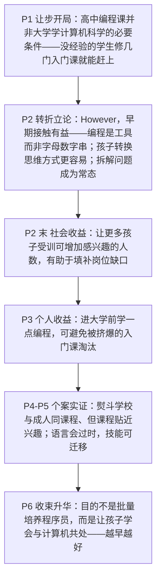

# High-School Coding Classes 精读笔记

## 背景

本文是 **2016 年考研英语（一）Text 1**（第 21—25 题），主题是**高中编程课与计算机科学教育**：高中该不该开编程课？学了到底有什么用？文章给出的答案是——**"学的是哪种语言"不重要，"什么时候开始学、把它当成什么来学"才重要**。

文章是一篇**业内人士代言式的报道**：作者本人几乎不表态，全篇由三段引语撑起观点（卡内基梅隆大学计算机科学学院副院长 **Tom Cortina** 两次、纽约熨斗学校讲师 **Victoria Friedman** 一次、北卡罗来纳州教育顾问 **Deborah Seehorn** 一次），信源全部带**机构头衔**——这种"**权威织网**"是考研阅读里最典型的**客观化手法**：观点由受访者说出，作者只负责编排顺序。**读到谁在说话、他的身份是什么，就等于拿到了命题坐标。**

作者的论证分五步推进：

1. **让步开局（P1）**：先承认 `high-school coding classes aren't essential for learning computer science in college`——高中编程课并非大学学计算机科学的必要条件，没经验的学生修几门入门课就能赶上。
2. **转折立论（P2）**：`However, Cortina said, early **exposure** is beneficial.` 转向"**早期接触有益**"，并给出三层理由——编程是**工具**（`a tool to build apps, or create artwork, or test hypotheses`）而非"令人困惑的字母数字串"；孩子**转换思维方式更容易**（`not as hard … as it is for older students`）；**把问题拆成小块、用代码去解决**会成为常态。
3. **收益升级（P2 末 + P3）**：先讲**社会层面**（`increase the number of people interested in the field and help fill the jobs gap`），再讲**个人层面**（大学入门课 `packed to the brim`，早学一点就不至于被挤掉）。
4. **个案实证（P4—P5）**：引入**熨斗学校（Flatiron School）**——从成人编程训练营起步，高中生与成人**同一套课程**，但 `gear lessons toward things they're interested in`（**贴近兴趣**），再用 `For instance`（按心情推荐电影的应用）落地。随后 Seehorn 补上关键一句：**语言会过时（`quick turnover`），但技能可迁移（`apply to any coding language`）**——这一句是全文的"**祛魅 + 保值**"。
5. **收束升华（P6）**：`But creating a future **army** of coders is not the **sole** purpose of the classes.`——课程的目的**不是**批量生产程序员，而是让这一代人**与计算机共处**（`surrounded by computers … for the rest of their lives`），最后用**三重比较**收尾：`The younger they learn … the earlier they learn … the better.`

> [!abstract] 文章概要
> 全文用**"让步 → 立论 → 收益 → 实证 → 升华"**五步推进，属于**观点论证型**议论文：先退一步承认"不学也能跟上"，再用 `However` 立起"**越早越好**"的主张，然后分别从**社会（填补岗位缺口）**与**个人（不被入门课挤掉）**两个层面给理由，接着用**熨斗学校**这一具体案例把主张落到地面，最后把"编程课"从**职业教育**升格为**数字时代的生存能力**。抓住这条链条，主旨题与推断题一望即知。

- **难度**：intermediate
- **体裁**：议论文（argumentation）——**引述体 / 报道体**
- **题源**：2016 年考研英语（一）Text 1（第 21—25 题）

| 题号 | 21 | 22 | 23 | 24 | 25 |
|------|----|----|----|----|----|
| 答案 | B | D | A | C | B |
| 定位 | P2 比较句 | P4 引语 | P5 结论句 | P6 收束段 | P6 词汇 |

> [!note] 本篇的三组关键对立
> ① **"不是必需的" vs "越早越好"**：`aren't essential`（P1 让步）与 `the younger … the better`（P6 收束）方向相反，**作者真正的主张在前者之后**——凡见 `It's true that` / `However`，一律以 **However 之后**为准。
> ② **"语言会过时" vs "技能可迁移"**：`Programming languages have a quick turnover`（现象）与 `the skills they learn … apply to any coding language`（判断）构成一组**祛魅—保值**；第 23 题的四个选项正是围绕这对关系设陷。
> ③ **"培养程序员" vs "培养会与计算机共处的人"**：`creating a future army of coders is not the sole purpose`——**"不是唯一目的"≠"不是目的"**，第 24 题 A、C 两项的取舍就压在这一处。

---

## 文章原文

# 2016 Passage 1

It's true that high-school **coding** classes aren't **essential** for learning computer science in college. Students without experience can catch up after a few **introductory** courses, said Tom Cortina, the assistant dean at Carnegie Mellon's School of Computer Science.

> [!abstract]- 长难句分析
> **原句**：Students without experience can catch up after a few **introductory** courses, said Tom Cortina, the assistant dean at Carnegie Mellon's School of Computer Science.
>
> **主干提取**：
>
> - 主语 S: Students without experience（没有经验的学生）
> - 谓语 V: can catch up（能够赶上来）
> - 状语 A: after a few introductory courses（在修完几门入门课程之后）
> - 引述句（**完全倒装**）: said Tom Cortina（汤姆·科尔蒂纳说）
> - 同位语: the assistant dean at Carnegie Mellon's School of Computer Science（卡内基梅隆大学计算机科学学院副院长）
>
> **修饰成分**：
>
> | 类型 | 引导词 | 修饰对象 |
> |------|--------|----------|
> | 介词短语（后置定语） | without | Students（"没有经验的"学生） |
> | 介词短语（时间状语） | after | can catch up（"修完……之后"） |
> | 引述句（**完全倒装**） | said | 全句（主谓倒装，主语后置） |
> | 同位语 | —（逗号） | Tom Cortina（交代身份） |
> | 介词短语（后置定语） | at | the assistant dean（"在……的"副院长） |
>
> **结构图解**：
>
> ```
> 主句: Students + can catch up + (after a few introductory courses)
>   ├── 后置定语: (without experience) → 修饰 Students
>   ├── 时间状语: (after a few introductory courses) → 修饰 can catch up
>   └── 引述句（完全倒装）: said + Tom Cortina
>         └── 同位语: (the assistant dean at Carnegie Mellon's School of Computer Science) → 说明 Tom Cortina 身份
> ```
>
> **参考译文**：没有经验的学生在修完几门**入门**课程后就能赶上来，卡内基梅隆大学计算机科学学院副院长汤姆·科尔蒂纳如是说。
>
> **考点提示**：① **引述句完全倒装**：`said Tom Cortina` 把谓语提到主语之前，是**新闻文体的固定套路**（本篇共三次）；翻译时须把主语提到动词前。**代词作主语时不倒装**（✅ He said；❌ said he）。② **同位语交代身份**：`the assistant dean at …` 用 **the**（该职位在学院中唯一），而 P4 的 `an instructor`、P5 的 `an education consultant` 用 **a/an**（身份之一）——**冠词差别是同位语考点细节**。③ **without experience 是后置定语**，不是状语；`catch up` 此处**单独使用不接宾语**，与 catch up with sb.（追上某人）、catch up on sth.（补做某事）不同。④ **本句人物即第 21 题的定位人物 Cortina**：考研阅读中"**人物 + 引述句**"是命题坐标，读到人名先圈出，再回题目对准题干里的名字。

However, Cortina said, early **exposure** is beneficial. When younger kids learn computer science, they learn that it's not just a confusing, endless string of letters and numbers—but a tool to build apps, or create artwork, or test **hypotheses**.

> [!abstract]- 长难句分析
> **原句**：When younger kids learn computer science, they learn that it's not just a confusing, endless string of letters and numbers—but a tool to build apps, or create artwork, or test **hypotheses**.
>
> **主干提取**：
>
> - 时间状语从句（前置）: When younger kids learn computer science（当年幼的孩子学习计算机科学时）
> - 主语 S: they（他们）
> - 谓语 V: learn（认识到）
> - 宾语 O（**宾语从句**）: that it's not just a confusing, endless string of letters and numbers—but a tool …（它不只是……而是……）
> - 表语 C（从句内部）: a tool to build apps, or create artwork, or test hypotheses（一个工具）
>
> **修饰成分**：
>
> | 类型 | 引导词 | 修饰对象 |
> |------|--------|----------|
> | 时间状语从句 | when | they learn（主句） |
> | 宾语从句 | that | learn（learn 的宾语） |
> | 并列结构（**递进否定**） | not just … but | a string of letters and numbers / a tool |
> | 不定式（后置定语，**三个并列**） | to | a tool（build / create / test 共用 to） |
> | 介词短语（后置定语） | of | a string（"一串……"） |
> | 介词短语（后置定语） | to | computer science（"关于计算机科学的"） |
>
> **结构图解**：
>
> ```
> 主句: they + learn + [that 宾语从句]
>   ├── 时间状语从句: (When younger kids learn computer science) → 全句
>   └── 宾语从句: it's not just [a confusing, endless string of letters and numbers] — but [a tool …]
>         └── 后置定语（三个并列不定式）: (to build apps, or create artwork, or test hypotheses) → 修饰 a tool
> ```
>
> **参考译文**：当年幼的孩子学习计算机科学时，他们会认识到，它并不只是一串令人困惑、没完没了的字母和数字——而是一个可以用来开发应用、创作艺术作品或检验假设的工具。
>
> **考点提示**：① **not just A—but B 是递进否定**（"不只是 A，而是 B"），破折号后的 but 表**递进**而非转折；**判断并列范围**：not just 与 but 后面各挂一个名词短语（a string … / a tool …）。② **三个并列不定式共用 to**：`to build apps, **or** create artwork, **or** test hypotheses` —— or 后**省略 to**，是并列不定式的常规用法；读时须**圈出三个动词**，否则会把 test 误当成别的成分。③ **宾语从句中的 it 指代 computer science**，而 `it's not just … but …` 的结构使**否定辖域只在 not just 之内**（否认的是"只是字母数字串"），**不能读成"它不是什么工具"**。④ **第 21 题的 C、D 两项均由本句偷换动词**：原文是 test（检验）与 create（创作），选项改成 formulate（提出）与 perfect（完善）——**读原文时把动词圈出来，是防这一手的唯一办法**。

It's not as hard for them to **transform** their thought processes as it is for older students.

> [!abstract]- 长难句分析
> **原句**：It's not as hard for them to **transform** their thought processes as it is for older students.
>
> **主干提取**：
>
> - 形式主语: It（占位，无实义）
> - 谓语 V: is not as hard（不像……那样难）
> - 真正主语（**不定式复合结构**，后置）: for them to transform their thought processes（对他们而言转换思维方式）
> - 比较状语从句: as it is for older students（对年龄更大的学生而言）
>
> **修饰成分**：
>
> | 类型 | 引导词 | 修饰对象 |
> |------|--------|----------|
> | 比较状语从句 | as | not as hard（比较基准） |
> | 不定式（**真正主语**） | to | It（形式主语） |
> | 介词短语（不定式的逻辑主语） | for | to transform（"对他们而言"） |
> | 代词替代 | it | 代替前面的不定式 to transform their thought processes |
> | 介词短语（比较从句内部） | for | it is（"对年长学生而言"） |
>
> **结构图解**：
>
> ```
> 主句: It + is + not as hard + (as it is for older students)
>   ├── 真正主语（后置）: (for them to transform their thought processes)
>   └── 比较状语从句: as + it is + (for older students)
>         └── it 代替 (to transform their thought processes)：替代与省略
> ```
>
> **参考译文**：对他们而言，**转换**思维方式不像对年龄更大的学生那样困难。
>
> **考点提示**：① **先圈出两个 as 之间的"整块"**：`not as hard **for them to transform their thought processes** as …` —— 两个 as 之间夹的不只是 hard，而是**一整个不定式复合结构**；漏读会把 for them 当成主句状语。② **从句中用 it 代替不定式**（= as transforming their thought processes is hard for older students），这是**替代与省略**的高频考点；**未替代时须重复动词，替代则用 it / so / do**。③ **比较对象必须一致**：比较的是 `for them` 与 `for older students`（同为"人"），若写成 `as older students` 则为**比较对象错位**。④ **本句是第 21 题的答案句**：题干 `makes it easier to ____` 正是 `not as hard for them` 的**同义改写**（as hard → easier 换极性），空格须填 `transform their thought processes` 的概括，即 **B 项 remodel the way of thinking**（transform ↔ remodel，thought processes ↔ the way of thinking）——**比较结构常被命题人用来"换一个比较方向"，读题时须核对比较的极性与对象是否被偷换**。

Breaking down problems into **bite-sized chunks** and using code to solve them becomes normal.

> [!abstract]- 长难句分析
> **原句**：Breaking down problems into **bite-sized chunks** and using code to solve them becomes normal.
>
> **主干提取**：
>
> - 主语 S（**两个动名词短语并列**）: Breaking down problems into bite-sized chunks and using code to solve them（把问题拆成小块并用代码解决它们）
> - 谓语 V: becomes（变成）
> - 表语 C: normal（常态）
>
> **修饰成分**：
>
> | 类型 | 引导词 | 修饰对象 |
> |------|--------|----------|
> | 动名词短语（**主语中心**） | Breaking down | 主语 |
> | 动名词短语（**并列主语**） | using | 与 Breaking down 并列（故谓语用单数） |
> | 介词短语（结果） | into | Breaking down（"拆成……"） |
> | 不定式（目的状语） | to | using code（"用代码去解决"） |
> | 复合形容词作定语 | bite-sized | chunks（"一口大小的"块） |
>
> **结构图解**：
>
> ```
> 主句: [Breaking down problems into bite-sized chunks] + and + [using code to solve them] + becomes + normal
>   ├── 介词短语: (into bite-sized chunks) → 修饰 Breaking down 的结果
>   └── 不定式: (to solve them) → 修饰 using code 的目的
> ```
>
> **参考译文**：把问题拆解成**小块**、并用代码去解决，会成为他们的常态。
>
> **考点提示**：① **动名词并列作主语时，谓语仍用单数**：`Breaking down … **and** using … **becomes** normal` —— 两个动名词短语被视为**一个整体事件**，故用 becomes 而非 become。② **远距离主谓一致**：主语长达 14 词，谓语 becomes 在此之前已出现 2 个动词形式（Breaking / using），**误把 using 当谓语是常见误读**；判断方法是**找"没有 to / -ing 作状语标记的那个动词"**。③ **bite-sized 是复合形容词作前置定语**（名词 + -ed 结构，另如 heart-shaped、hand-made），**连字符是识别标志**。④ **本句是观点句**：长主语（动名词短语）在考研阅读中**往往承载作者主张**，本篇三处动名词主语（本句、下句、P6 的 creating a future army of coders）无一是事实陈述，**全是作者的判断**，值得优先定位。

Giving more children this training could increase the number of people interested in the field and help fill the **jobs gap**, Cortina said.

> [!abstract]- 长难句分析
> **原句**：Giving more children this training could increase the number of people interested in the field and help fill the **jobs gap**, Cortina said.
>
> **主干提取**：
>
> - 主语 S（**动名词短语**）: Giving more children this training（让更多孩子接受这种训练）
> - 谓语 V（**并列**）: could increase … and help fill …（可以增加……并有助于填补……）
> - 宾语 O1: the number of people interested in the field（对这一领域感兴趣的人数）
> - 宾语 O2: the jobs gap（岗位缺口）
> - 引述句（尾置）: Cortina said（科尔蒂纳说）
>
> **修饰成分**：
>
> | 类型 | 引导词 | 修饰对象 |
> |------|--------|----------|
> | 动名词短语（**主语**） | Giving | 主语中心 |
> | 双宾语结构 | give sb. sth. | Giving more children this training |
> | 过去分词（**后置定语**） | interested in | people（"感兴趣的"人） |
> | 介词短语 | in | interested（"对这一领域"） |
> | 并列谓语 | and | could increase（与 help fill 并列） |
> | 引述句（**尾置**） | said | 全句（标明信息来源） |
>
> **结构图解**：
>
> ```
> 主句: [Giving more children this training] + could increase + [the number of people …] + and + help fill + [the jobs gap]
>   ├── 后置定语: (interested in the field) → 修饰 people
>   └── 引述句（尾置）: Cortina said → 标明信息来源
> ```
>
> **参考译文**：科尔蒂纳说，让更多孩子接受这种训练，可以增加对这一领域感兴趣的人数，有助于填补**岗位缺口**。
>
> **考点提示**：① **动名词作主语**（Giving …）而非祈使句；`give sb. sth.` 的**双宾语**在动名词中完整保留（Giving **more children** **this training**）。② **后置定语 interested in the field 把宾语中心词与并列谓语隔开**：`the number of people **interested in the field**` **and** `help fill …` —— 须先闭合第一个宾语，再读 and 后的第二个谓语，**否则会误把 help fill 当成 people 的定语**。③ **情态动词 could 表"可能性"**（不是断定），下文 P5 的 `may not even be relevant` 同理——**考研阅读中，凡情态动词处，选项若把"可能"写成"必然"即为过度推断**。④ **jobs gap 译"岗位缺口"**（岗位需求与合格人才之差），**不是"失业"**：本段的两项收益（增加兴趣人数、填补缺口）都落在**经济与产业层面**，是第 21 题之外的一个易混点。

Students also benefit from learning something about coding before they get to college, where **introductory** computer-science classes are ==packed to the brim==, which can drive the less-experienced or -determined students away.

> [!abstract]- 长难句分析
> **原句**：Students also benefit from learning something about coding before they get to college, where **introductory** computer-science classes are packed to the brim, which can drive the less-experienced or -determined students away.
>
> **主干提取**：
>
> - 主语 S: Students（学生）
> - 谓语 V: benefit from（受益于）
> - 宾语 O（**动名词**）: learning something about coding（学一点编程）
> - 时间状语从句: before they get to college（在他们进大学之前）
> - 非限制性定语从句 1: where introductory computer-science classes are packed to the brim（大学里的入门计算机课被挤得满满当当）
> - 非限制性定语从句 2: which can drive the less-experienced or -determined students away（这会把经验较少或决心不足的学生赶走）
>
> **修饰成分**：
>
> | 类型 | 引导词 | 修饰对象 |
> |------|--------|----------|
> | 动名词（**介词宾语**） | from | benefit（"从做某事中受益"） |
> | 时间状语从句 | before | benefit from learning（"在……之前"） |
> | 非限制性定语从句（**关系副词**） | where | college（从句缺状语，故用 where） |
> | 非限制性定语从句 | which | **前面整个主句**（"课被挤爆"这件事） |
> | 介词短语（程度） | to | packed（"满到边沿"） |
> | **后缀共享压缩** | less- … or -determined | students（= less experienced or **less** determined） |
>
> **结构图解**：
>
> ```
> 主句: Students + benefit from + [learning something about coding]
>   ├── 时间状语从句: (before they get to college) → 修饰 learning
>   ├── 非限制性定语从句: (where introductory computer-science classes are packed to the brim) → 修饰 college
>   └── 非限制性定语从句: (which can drive the less-experienced or -determined students away) → 说明前面整件事
> ```
>
> **参考译文**：学生在进大学之前学一点编程也是有好处的：大学里的**入门**计算机课==被挤得满满当当==，这会把经验较少或决心不足的学生赶走。
>
> **考点提示**：① **benefit from doing** 中 from 后**只能接动名词**（❌ benefit from to learn），from 表"来源"。② **where 与 which 的选用**：把先行词 college 代回从句 —— `introductory classes are packed **at** college` 需加 at，故用 **where**；若从句缺主语或宾语则用 which。③ **which 指代整个主句**（"课被挤爆"这件事），是本句的**最高频考点**：`which can drive … away` 的主语不是某个名词，而是前面那件事；**逗号是关键信号**（无逗号的 which 只能限定紧邻名词）。④ **the less-experienced or -determined 是后缀共享的压缩写法**：完整形式为 `the less experienced or **less** determined students`，第二个形容词借用前面的 less 并用连字符绑定 -determined；**看到词首带连字符（-determined / -based / -oriented）时，须回头找被共享的修饰语**，否则会把 -determined 误读为"被决定的"。⑤ 本段的作用是补一条**对个人更有利**的理由（避免被大学入门课挤掉），与第 2 段的"对社会有利"构成**两个层面的递进**。

The Flatiron School, where people pay to learn programming, started as one of the many coding **bootcamps** that's become popular for adults looking for a **career change**.

> [!abstract]- 长难句分析
> **原句**：The Flatiron School, where people pay to learn programming, started as one of the many coding **bootcamps** that's become popular for adults looking for a **career change**.
>
> **主干提取**：
>
> - 主语 S: The Flatiron School（熨斗学校）
> - 谓语 V: started（起初是）
> - 状语 A（**表语性质**）: as one of the many coding bootcamps（作为众多编程训练营中的一个）
> - 非限制性定语从句（**插入**）: where people pay to learn programming（一所人们付费学习编程的学校）
> - 定语从句: that's become popular for adults（在成年人中变得很受欢迎）
>
> **修饰成分**：
>
> | 类型 | 引导词 | 修饰对象 |
> |------|--------|----------|
> | 非限制性定语从句（**关系副词**） | where | The Flatiron School（补充说明学校性质） |
> | 介词短语（start 的补足成分） | as | started（"起初是 / 以……起步"） |
> | 限定性定语从句 | that's (= that has) | one of the many coding bootcamps |
> | 现在分词（**后置定语**） | looking for | adults（"寻求转行的"成年人） |
> | 不定式（pay to do） | to | pay（"付费学编程"） |
>
> **结构图解**：
>
> ```
> 主句: The Flatiron School + started + (as one of the many coding bootcamps)
>   ├── 非限制性定语从句: (where people pay to learn programming) → 补充说明该校性质
>   └── 后置定语从句: (that's become popular for adults)
>         └── 现在分词后置定语: (looking for a career change) → 修饰 adults
> ```
>
> **参考译文**：熨斗学校——一所人们付费学习编程的学校——起初只是众多编程**训练营**中的一个，这类训练营在寻求**转行**的成年人中变得很受欢迎。
>
> **考点提示**：① **where 引导非限制性定语从句**插在主语与谓语之间，**把主谓隔开**（主干是 The Flatiron School … started as …）；翻译时宜用破折号夹注。② **start as 与 start with 不同**：`start **as** + 身份/角色` 译"**起初是**"（此处 as one of the bootcamps = 起初是训练营之一）；`start **with** + 事物` 译"**以……开始做**"。③ **one of + 复数名词 + that 从句的谓语分歧**：规范语法中从句谓语常随复数名词用 have，**但作者用了单数 that's（= that has）随 one** —— 考研阅读**只需读懂指代**（受欢迎的是"这类训练营"），**不必据此判断正误**；需要动笔判断单复数的是完形与翻译。④ **现在分词 looking for 作后置定语**（= who are looking for），与 P5 的省略关系代词结构呼应：**分词短语与定语从句可互换**，是"从句降级为短语"的典型。

The high-schoolers get the same **curriculum**, but “we try to **gear** lessons toward things they're interested in,” said Victoria Friedman, an instructor.

> [!abstract]- 长难句分析
> **原句**：The high-schoolers get the same **curriculum**, but “we try to **gear** lessons toward things they're interested in,” said Victoria Friedman, an instructor.
>
> **主干提取**：
>
> - 分句 1: The high-schoolers get the same curriculum（高中生学的课程与成人相同）
> - 并列连词（**转折**）: but
> - 分句 2（**引语前置 + 完全倒装**）: “we try to gear lessons toward things they're interested in,” said Victoria Friedman（维克托利亚·弗里德曼说……）
> - 同位语: an instructor（一名讲师）
>
> **修饰成分**：
>
> | 类型 | 引导词 | 修饰对象 |
> |------|--------|----------|
> | 并列连词 | but | 两个分句（转折） |
> | 定语从句（**省略关系代词**） | (that / which) | things（作 interested in 的宾语） |
> | 介词短语（**固定搭配**） | toward | gear（"使课程针对……"） |
> | 不定式（try to do） | to | try（"设法做"） |
> | 引述句（**完全倒装**） | said | 引语（主谓倒装，主语后置） |
> | 同位语 | —（逗号） | Victoria Friedman（交代身份） |
>
> **结构图解**：
>
> ```
> 并列句: [The high-schoolers get the same curriculum] + but + [we try to gear lessons toward things …]
>   ├── 省略关系代词的定语从句: (they're interested in) → 修饰 things
>   └── 引述句（完全倒装）: said + Victoria Friedman
>         └── 同位语: (an instructor) → 说明身份
> ```
>
> **参考译文**：高中生学的**课程**与成人相同，但"我们努力让课程贴近他们感兴趣的东西，"该校讲师维多利亚·弗里德曼说。
>
> **考点提示**：① **but 是并列连词，只能连接分句**（与副词 however 不同，however 可插在主语之后）；此处 but 连接的是"课程相同"与"教学方式不同"两个分句。② **gear sth. toward sth. 是固定搭配**（"使……针对 / 向……靠拢"），**不是"齿轮"**；`gear lessons **toward** things they're interested in` 是本句的语义重心。③ **省略关系代词的定语从句**：`things **they're interested in**` —— 补出后为 `things (that) they're interested in`，**介词 in 的宾语正是 things**，故关系代词可省；**若介词留在关系代词之前（in which）则不省**。④ **本句是第 22 题的答案点**：题干 `Flatiron has considered their ____` 对应 `gear lessons toward things **they're interested in**`，答案 **D 项 interest**；而 B 项 academic backgrounds、C 项 career prospects **文中根本未提**，属"**领域词干扰**"（与教育话题同领域却无原文依据）。

For instance, one of the apps the students are developing suggests movies based on your **mood**.

The students in the Flatiron class probably won't **drop out** of high school and build the next Facebook. Programming languages have a quick **turnover**, so the “Ruby on Rails” language they learned may not even be **relevant** by the time they enter the job market.

> [!abstract]- 长难句分析
> **原句**：Programming languages have a quick **turnover**, so the “Ruby on Rails” language they learned may not even be **relevant** by the time they enter the job market.
>
> **主干提取**：
>
> - 分句 1: Programming languages have a quick turnover（编程语言的更新换代很快）
> - 并列连词（**结果**）: so
> - 分句 2: the “Ruby on Rails” language they learned may not even be relevant（他们学的"Ruby on Rails"语言甚至可能已经派不上用场）
> - 时间状语从句: by the time they enter the job market（等他们进入就业市场时）
>
> **修饰成分**：
>
> | 类型 | 引导词 | 修饰对象 |
> |------|--------|----------|
> | 并列连词（**结果**） | so | 两个分句（前者为因，后者为果） |
> | 定语从句（**省略关系代词**） | (that / which) | the "Ruby on Rails" language（作 learned 的宾语） |
> | 程度副词 | even | not（"甚至连……都"） |
> | 时间状语从句 | by the time | may not even be relevant（"到……的时候为止"） |
>
> **结构图解**：
>
> ```
> 并列句: [Programming languages have a quick turnover] + so + [the "Ruby on Rails" language … may not even be relevant]
>   ├── 省略关系代词的定语从句: (they learned) → 修饰 language
>   └── 时间状语从句: (by the time they enter the job market) → 修饰 may not be relevant
> ```
>
> **参考译文**：编程语言的更新换代很快，所以他们学的"Ruby on Rails"语言，等他们进入就业市场时甚至可能已经**派不上用场**。
>
> **考点提示**：① **so 是并列连词，引导结果分句**（不是从属连词），前后两个分句**地位对等**；与其对应的是 for（表原因，同属并列连词）。② **省略关系代词的定语从句**：`the language **they learned**` → 补出后为 `the language (that) they learned`，language 作 learned 的**宾语**，故可省。③ **by the time 从句用现在时表将来**（they **enter**，不是 will enter），**主句**才用情态（may not be relevant）——即"**主将从现**"在时间状语从句中的体现，与 when / before / after 一致。④ **relevant 是熟词生义**：此处**不是"相关的"而是"有用的、派得上用场的"**（否则"与什么相关"语义悬空），正好与前半句的 turnover（快速更替）严丝合缝。⑤ **本句是第 23 题 B 项的干扰来源**：原文说的是"**语言本身会过时**"，**不是说"学生学到的技能需要升级"**（have to be upgraded）——**把"局部事实"放大成"整体结论"是本题的核心陷阱**。

But the skills they learn—how to think **logically** through a problem and organize the results—apply to any coding language, said Deborah Seehorn, an education consultant for the state of North Carolina.

> [!abstract]- 长难句分析
> **原句**：But the skills they learn—how to think **logically** through a problem and organize the results—apply to any coding language, said Deborah Seehorn, an education consultant for the state of North Carolina.
>
> **主干提取**：
>
> - 并列连词（**转折**）: But（与上句"语言会过时"形成转折）
> - 主语 S: the skills they learn（他们学到的技能）
> - 同位语（**破折号插入**）: how to think logically through a problem and organize the results（如何有条理地思考一个问题并整理出结果）
> - 谓语 V: apply to（适用于）
> - 宾语 O: any coding language（任何编程语言）
> - 引述句（**完全倒装**）: said Deborah Seehorn（黛博拉·西霍恩说）
> - 同位语: an education consultant for the state of North Carolina（北卡罗来纳州的教育顾问）
>
> **修饰成分**：
>
> | 类型 | 引导词 | 修饰对象 |
> |------|--------|----------|
> | 并列连词 | but | 与上句转折 |
> | 定语从句（**省略关系代词**） | (that) | the skills（作 learn 的宾语） |
> | 同位语（**破折号插入**） | — | the skills（说明"技能"的具体所指） |
> | 两个并列的疑问词 + 不定式 | how to | 同位语内部（think … and organize …） |
> | 介词短语 | to | apply（"适用于"） |
> | 引述句（**完全倒装**） | said | 全句 |
> | 同位语 | —（逗号） | Deborah Seehorn（交代身份） |
>
> **结构图解**：
>
> ```
> 主句: But + [the skills they learn] + apply to + [any coding language]
>   ├── 省略关系代词的定语从句: (they learn) → 修饰 the skills
>   ├── 同位语（破折号插入）: (how to think logically through a problem and organize the results) → 说明 skills 的具体所指
>   └── 引述句（完全倒装）: said + Deborah Seehorn
>         └── 同位语: (an education consultant for the state of North Carolina) → 说明身份
> ```
>
> **参考译文**：但他们学到的技能——如何有条理地思考一个问题并整理出结果——适用于任何编程语言，北卡罗来纳州的教育顾问黛博拉·西霍恩说。
>
> **考点提示**：① **破折号插入同位语把主语与谓语隔开**：主干是 `the skills … **apply to** any coding language`，中间插了 10 词的同位语 —— **远距离搭配**，读时先跳过破折号内容再找谓语。② **省略关系代词的定语从句**：`the skills **they learn**` → 补出后为 `the skills (that) they learn`。③ **两个并列的 how to 不定式**（how to think … and organize …），第二个 how 不重复；`think **through** a problem` 译"把问题想透"（through 表"从头到尾穿过"），`logically` 修饰 think。④ **apply to 是不及物搭配**（"适用于"），**宾语不可省略**；此处宾语是 any coding language。⑤ **本句是第 23 题的答案句**：`**apply to any coding language**` 与 **A 项 help students learn other computer languages** 是标准的**同义改写**（apply to ↔ help learn，any coding language ↔ other computer languages）；C 项"找工作时要改进"、D 项"快速赚大钱"原文均无据。

Indeed, the Flatiron students might not go into **IT** at all. But creating a future **army** of coders is not the **sole** purpose of the classes. These kids are going to be surrounded by computers—in their pockets, in their offices, in their homes—for the rest of their lives.

> [!abstract]- 长难句分析
> **原句**：These kids are going to be surrounded by computers—in their pockets, in their offices, in their homes—for the rest of their lives.
>
> **主干提取**：
>
> - 主语 S: These kids（这些孩子）
> - 谓语 V（**被动语态**）: are going to be surrounded（将被包围）
> - 状语 A1（**施动者**）: by computers（被计算机）
> - 状语 A2（**时间**）: for the rest of their lives（在余生中）
> - 插入语（**破折号**）: in their pockets, in their offices, in their homes（在口袋里、在办公室里、在家里）
>
> **修饰成分**：
>
> | 类型 | 引导词 | 修饰对象 |
> |------|--------|----------|
> | 被动语态 | be + surrounded + by | These kids（施动者为 computers） |
> | 插入语（**三个并列介词短语**，破折号） | in | be surrounded（举例说明"被包围"） |
> | 介词短语（**时间状语**） | for | are going to be surrounded（"在余生中"） |
> | 将来结构 | be going to | 表**趋势性将来** |
>
> **结构图解**：
>
> ```
> 主句: These kids + are going to be surrounded + (by computers) + (for the rest of their lives)
>   ├── 插入语（三个并列介词短语）: (in their pockets, in their offices, in their homes) → 举例说明"被包围"
>   └── 时间状语: (for the rest of their lives) → 修饰整个谓语
> ```
>
> **参考译文**：这些孩子在余生中都将被计算机包围——口袋里的、办公室里的、家里的。
>
> **考点提示**：① **破折号插入语把 be + 过去分词与 by / for 状语隔开**：`are going to be surrounded **by computers** — … — **for the rest of their lives**` —— 若不先跳过插入语，容易把 for the rest of their lives 误挂到最近的 homes 上（**它是主句的时间状语**）。② **三个并列介词短语作插入语的功能是"举例"**（把"无处不在"具体化），与 P4 的 `For instance` 一脉相承 —— **本篇的论证方式是"抽象判断 + 具体例证"交替**。③ **are going to 表趋势性将来**（基于当前状况的推断），与 P5 的 will（单纯将来）、may（推测）分工不同。④ **本句是第 24 题 C 项 `become better prepared for the digitalized world` 的概括来源**（surrounded by computers ↔ the digitalized world）；而 **A 项 `compete with a future army of programmers` 则是对上一句比喻 `army of coders` 的曲解**。

==The younger they learn how computers think, how to **coax** the machine into producing what they want—the earlier they learn that they have the power to do that—the better.==

> [!abstract]- 长难句分析
> **原句**：The younger they learn how computers think, how to **coax** the machine into producing what they want—the earlier they learn that they have the power to do that—the better.
>
> **主干提取**：
>
> - 比例分句 1（**条件**）: The younger they learn how computers think, how to coax the machine into producing what they want（他们越早学会计算机如何思考、如何哄着机器产出他们想要的东西）
> - 比例分句 2（**条件**）: the earlier they learn that they have the power to do that（越早认识到自己拥有这种能力）
> - 主句（**结果，省略 it is**）: the better（就越好）
>
> **修饰成分**：
>
> | 类型 | 引导词 | 修饰对象 |
> |------|--------|----------|
> | the + 比较级（**比例句式**） | the younger | 第一个分句 |
> | 宾语从句 | how | learn（how computers think） |
> | **疑问词 + 不定式** | how to | learn 的第二个宾语（how to coax …） |
> | 介词短语 | into | coax（"哄进……"） |
> | 名词性从句 | what | producing（what they want 作 producing 的宾语） |
> | the + 比较级（**比例句式**） | the earlier | 第二个分句 |
> | 宾语从句 | that | learn（that they have the power …） |
> | **省略** | — | the better（后面省略 it is） |
>
> **结构图解**：
>
> ```
> 比例结构: The younger [分句1] + the earlier [分句2] + the better（结果，省略 it is）
>   ├── 分句 1: they learn + [how computers think] + [how to coax the machine into producing what they want]
>   │     └── 名词性从句: (what they want) → 作 producing 的宾语
>   └── 分句 2: they learn + [that they have the power to do that]
> ```
>
> **参考译文**：他们**越早**学会计算机如何思考、如何**哄劝**机器产出他们想要的东西——**越早**认识到自己拥有这种能力——就**越好**。
>
> **考点提示**：① **三重 the + 比较级并列**（the younger … the earlier … the better）：前两重是**条件**，最后一重是**结果**；**the 在此是副词（= by how much），不是冠词** —— 识别标志是 **the 后紧跟比较级**（younger / earlier / better）。② **末尾 the better 后省略 it is**：翻译时须补出"就越好"，**省略是英语比较句的常规操作**（另如 the more the merrier）。③ **learn 后挂了两个宾语**：一是 **how 从句**（how computers think），二是**疑问词 + 不定式**（how to coax …），**后者功能上等于一个名词短语**，是"从句降级为短语"的典型。④ **coax the machine into producing what they want** 内含 `coax sb. into doing` 与 `producing what they want` 的**双重嵌套**（what 从句作 producing 的宾语）。⑤ **本句是第 25 题的词义题来源**：题干问 `coax` 与哪个词最接近，**四个选项只有 persuade 与"哄劝"同向**（challenge 是对抗、frighten 是威吓、misguide 是误导，**方向或目的均不符**）；**解法是回到原句圈出"动作对象（机器）+ 目的（让它产出想要的）+ 力度（柔性地诱导）"**，而非查词典本义。⑥ 本句用**三重比较**收尾，语气远强于"It's good to learn early"，**末句的比较级本身就是强烈的价值判断**，与第 24 题 C 项 `better prepared` 呼应。

---

## 题目

### 21. Cortina holds that early exposure to computer science makes it easier to ____.

- [A] complete future job training
- [B] remodel the way of thinking
- [C] formulate logical hypotheses
- [D] perfect artwork production

### 22. In delivering lessons for high-schoolers, Flatiron has considered their ____.

- [A] experience
- [B] academic backgrounds
- [C] career prospects
- [D] interest

### 23. Deborah Seehorn believes that the skills learned at Flatiron will ____.

- [A] help students learn other computer languages
- [B] have to be upgraded when new technologies come
- [C] need improving when students look for jobs
- [D] enable students to make big quick money

### 24. According to the last paragraph, Flatiron students are expected to ____.

- [A] compete with a future army of programmers
- [B] stay longer in the information technology industry
- [C] become better prepared for the digitalized world
- [D] bring forth innovative computer technologies

### 25. The word “coax” (Para. 6) is closest in meaning to ____.

- [A] challenge
- [B] persuade
- [C] frighten
- [D] misguide

---

## 翻译对照

# 2016 Passage 1 中英对照

## 文章原文

It's true that high-school **coding** classes aren't **essential** for learning computer science in college. Students without experience can catch up after a few **introductory** courses, said Tom Cortina, the assistant dean at Carnegie Mellon's School of Computer Science.

诚然，高中的**编程**课对于在大学里学习计算机科学而言并非**必不可少**。没有经验的学生在修完几门**入门**课程后就能赶上来，卡内基梅隆大学计算机科学学院副院长汤姆·科尔蒂纳如是说。

> [!note] 翻译说明
> **It's true that…** 是**让步句式**（"诚然、的确……"），作者先用它承认对立面，为下一段的 `However` 转折铺路——**第 1 段让步、第 2 段转折**是本文最外层的"先退后进"结构，也是**第 21 题定位的起点**；**aren't essential for** 译"对……并非必不可少"，`essential` 是**绝对化形容词**，考研常与 `necessary` / `crucial` / `vital` 一起出现在**选项的同义改写**中；**catch up** 是"**赶上、跟上**"（不是"抓住"），`catch up after a few introductory courses` 译"修完几门入门课程后就能赶上"；**introductory** 由 introduce 派生（+ -ory），译"**入门的、导论性的**"，`introductory courses / classes` 在本文两次出现（另见第 3 段），是**贯穿全文的关键词**；**said Tom Cortina, the assistant dean at Carnegie Mellon's School of Computer Science** 是**引述句的完全倒装**（said + 主语 + 同位语），`the assistant dean at…` 是**同位语**交代身份，译时宜前置为"……副院长汤姆·科尔蒂纳如是说"；**Carnegie Mellon** 是美国的卡内基梅隆大学，其计算机学院是全美顶尖，**作者引它作信源是为了增强论述权威性**——考研阅读中**人物 + 机构头衔**往往就是该段观点的**归属标记**（第 21 题的 Cortina 即此处）。

However, Cortina said, early **exposure** is beneficial. When younger kids learn computer science, they learn that it's not just a confusing, endless string of letters and numbers—but a tool to build apps, or create artwork, or test **hypotheses**. It's not as hard for them to **transform** their thought processes as it is for older students. Breaking down problems into **bite-sized chunks** and using code to solve them becomes normal. Giving more children this training could increase the number of people interested in the field and help fill the **jobs gap**, Cortina said.

然而，科尔蒂纳说，**早期接触**是有益的。年纪更小的孩子学习计算机科学时，会认识到它并不只是一串令人困惑、没完没了的字母和数字——而是一个可以用来开发应用、创作艺术作品或**检验假设**的工具。对他们而言，**转换**思维方式不像对年龄更大的学生那样困难。把问题拆解成**小块**、并用代码去解决，会成为他们的常态。科尔蒂纳说，让更多孩子接受这种训练，可以增加对这一领域感兴趣的人数，有助于填补**岗位缺口**。

> [!note] 翻译说明
> **However, Cortina said,** 是**插入语**（主语与谓语被 however 与主语名隔开），翻译时把它提到句首即可；**early exposure** 译"**早期接触**"，exposure 由 expose 派生，是**熟词僻义高发词**：此处不是"曝光、暴露"，而是"**接触、涉猎**"（= the act of experiencing something），**第 21 题题干原文即用此词**——`early exposure to computer science`；**it's not just A—but B** 是"**不只是 A，而是 B**"的**递进否定**结构（not just… but…），破折号后 `a tool to build apps, or create artwork, or test hypotheses` 是**三个并列不定式**作 tool 的后置定语；**test hypotheses** 译"**检验假设**"，hypothesis 的复数是 **hypotheses**（-is → -es），**第 21 题 C 项 `formulate logical hypotheses` 与 D 项 `perfect artwork production` 都从本句取材，但偷换了动词**（原文是 test / create，选项改成 formulate / perfect）；**It's not as hard for them to transform their thought processes as it is for older students** 是 **as…as 比较结构**，比较对象为 `for them`（年幼孩子）与 `for older students`（年长学生），**第二个 as 从句中 it 代替前面的不定式**；**transform their thought processes** 译"**转换思维方式**"，**这是第 21 题 B 项 `remodel the way of thinking` 的同义改写**（transform ↔ remodel，thought processes ↔ the way of thinking）；**Breaking down problems into bite-sized chunks** 是**动名词短语作主语**（`Breaking down` 与 `using` 并列作主语，故谓语用单数 becomes），`bite-sized chunks` 译"**一口大小的块**"，比喻"把难题拆成小份"；**the jobs gap** 译"**岗位缺口 / 职位空缺**"（= 岗位需求与合格人才之间的差距），**第 2 段落脚在"填补缺口"，即经济与就业层面的收益**，这一点常被误读为"解决失业"。

Students also benefit from learning something about coding before they get to college, where **introductory** computer-science classes are ==packed to the brim==, which can drive the less-experienced or -determined students away.

学生在进大学之前学一点编程也是有好处的：大学里的**入门**计算机课==被挤得满满当当==，这会把经验较少或决心不足的学生赶走。

> [!note] 翻译说明
> **benefit from doing sth.** 是"**从……中受益**"的固定搭配，from 后接**动名词**（learning），**不是** to do；**where introductory computer-science classes are packed to the brim** 是 **where 引导的非限制性定语从句**，先行词是 college（**关系副词 where = at which**，指"在大学里"），**不能**译成"哪里"；**packed to the brim** 是**高分表达**"**装得满满当当**"（brim 指容器的边缘，`to the brim` 即"满到边沿"），此处形容**入门课报名人数爆满**；**which can drive … away** 是**第二个非限制性定语从句**，which 指代**前面整句话**（"课挤爆"这件事），`drive sb. away` 译"**把某人赶走、使某人不愿再来**"；**the less-experienced or -determined** 是**后缀共享的压缩写法**：完整形式为 `the less experienced or less determined`，第二个形容词**借用了 less 并与 -determined 用连字符绑定**（-determined），译"经验较少或决心不足的学生"，**这种"连字符省略重复成分"是考研长难句的常见压缩手法**，读到时须先**还原完整形式**再理解；本段的作用是**补一条"对个人更有利"的理由**（避免被大学入门课挤掉），与第 2 段的"对社会有利"形成**两个层面**的递进。

The Flatiron School, where people pay to learn programming, started as one of the many coding **bootcamps** that's become popular for adults looking for a **career change**. The high-schoolers get the same **curriculum**, but “we try to **gear** lessons toward things they're interested in,” said Victoria Friedman, an instructor. For instance, one of the apps the students are developing suggests movies based on your **mood**.

熨斗学校——一所人们付费学习编程的学校——起初只是众多编程**训练营**中的一个，这类训练营在寻求**转行**的成年人中变得很受欢迎。高中生学的**课程**与成人相同，但"我们努力让课程贴近他们感兴趣的东西，"该校讲师维多利亚·弗里德曼说。例如，学生们正在开发的一款应用会根据你的**心情**推荐电影。

> [!note] 翻译说明
> **The Flatiron School, where people pay to learn programming, started as…** 中 **where 引导非限制性定语从句**补充说明学校性质（**Flatiron** 本义"熨斗"，此处是纽约的一所编程学校，**专有名词不必直译地名含义**），`started as` 译"**起初是 / 以……起步**"（**start as = 开始时是**，与 start with"以……开始做"不同）；**one of the many coding bootcamps that's become popular** 中 `bootcamps` 译"**（短期）训练营**"，此处有一个**主谓一致的辨析点**：规范语法中 `one of + 复数名词 + that` 从句的谓语**通常随复数名词**用 have become，**但作者用了 that's（= that has）随 one 取单数**，属**"one of"结构的用法分歧**，考研阅读只需**读懂指代**（受欢迎的是"这类训练营"或"其中一个"），不必据此判断正误；**gear lessons toward** 是固定搭配"**使课程针对……、使教学向……靠拢**"（= gear sth. to/toward sth.），**第 22 题 B/C 两项的区别就在这一搭配**：原文 `gear lessons toward things **they're interested in**` 明确落在"**兴趣**"（interest）上，而 B 项 academic backgrounds（学业背景）、C 项 career prospects（职业前景）**文中均无依据**；**one of the apps the students are developing** 中 `the students are developing` 是**省略关系代词 that/which 的定语从句**（先行词 apps 在从句中作 developing 的**宾语**，故可省）；**suggests movies based on your mood** 译"**根据你的心情推荐电影**"，`suggest` 在此是"**推荐、建议**"（不是"暗示"），`based on your mood` 是**过去分词短语作后置定语**；本段引入**具体案例（Flatiron 学校）**，是全文从"泛论"转入"实证"的**结构分界**。

The students in the Flatiron class probably won't **drop out** of high school and build the next Facebook. Programming languages have a quick **turnover**, so the “Ruby on Rails” language they learned may not even be **relevant** by the time they enter the job market. But the skills they learn—how to think **logically** through a problem and organize the results—apply to any coding language, said Deborah Seehorn, an education consultant for the state of North Carolina.

熨斗学校课堂上的学生大概不会从高中**退学**去打造下一个 Facebook。编程语言的更新换代很快，所以他们学的"Ruby on Rails"语言，等他们进入就业市场时甚至可能已经**派不上用场**。但他们学到的技能——如何有条理地思考一个问题并整理出结果——适用于任何编程语言，北卡罗来纳州的教育顾问黛博拉·西霍恩说。

> [!note] 翻译说明
> **drop out of** 是"**退学、退出**"的固定搭配（**out of 不可省略**），`drop out of high school` 译"从高中退学"，**此处作者用"不会退学去创 Facebook"来幽默地否定"编程课 = 造独角兽"的功利预期**；**Programming languages have a quick turnover** 中 `turnover` 是**熟词生义**：此处不是"营业额、人员流动率"，而是"**更替（速度）、换代**"，译"**编程语言的更新换代很快**"，**紧接着的 Ruby on Rails 便是论据**；**may not even be relevant by the time they enter the job market** 中 `by the time + 从句` 是**时间状语从句**（"到……的时候"），主句用**情态动词 + 动词原形**（may not be）表示**将来可能**，`no longer relevant` 义即"**已经派不上用场**"，**这是第 23 题 B 项 `have to be upgraded when new technologies come` 的干扰来源**（原文说"语言本身会过时"，**不是说"学生学到的技能需要升级"**）；**How to think logically through a problem and organize the results** 是**两个 how to 不定式并列**作 skills 的同位语（**破折号插入语**），`think through` 译"**把……想透、从头到尾地想**"，`logically` 修饰 think，**第 23 题 A 项正出自本句**：`apply to any coding language` ↔ `help students learn other computer languages`（**apply to ↔ help learn，any coding language ↔ other computer languages**，是**标准的同义改写**）；**an education consultant for the state of North Carolina** 是**同位语**交代 Seehorn 身份，注意 `for the state of` 表"**为……州工作**"，**不是"国家的"**。

Indeed, the Flatiron students might not go into **IT** at all. But creating a future **army** of coders is not the **sole** purpose of the classes. These kids are going to be surrounded by computers—in their pockets, in their offices, in their homes—for the rest of their lives. ==The younger they learn how computers think, how to **coax** the machine into producing what they want—the earlier they learn that they have the power to do that—the better.==

的确，熨斗学校的学生也许根本不会进入 **IT** 行业。但培养一支未来的程序员**大军**并不是这些课程的**唯一**目的。这些孩子在余生中都将被计算机包围——口袋里的、办公室里的、家里的。他们越早学会计算机如何思考、如何**哄劝**机器产出他们想要的东西——越早认识到自己拥有这种能力——就越好。

> [!note] 翻译说明
> **go into IT** 中 `IT` 是 **information technology** 的缩写，译"**信息技术（行业）**"，`go into` 是"**进入（某行业）**"（= enter），**不是"走进"**；**But creating a future army of coders is not the sole purpose of the classes** 中 `creating…` 是**动名词作主语**（谓语用单数 is），`army of coders` 译"**程序员大军**"（army 此处是**比喻用法**，指"一大批人"），`sole` 译"**唯一的、仅有的**"（= only），**本句是全文的"让步—转折"枢纽**：承认"大多数人不会做程序员"，随后**否定"课程目的就是造程序员"**，**第 24 题必须读到这一层才不会误选 A 项**（A 项 `compete with a future army of programmers` 里的 army of programmers **正是从本句借去的字面词**，属**"偷换语义"型干扰**）；**These kids are going to be surrounded by computers—in their pockets, in their offices, in their homes—for the rest of their lives** 中破折号内是**三个并列介词短语**作**插入语**（列举"计算机无处不在"），破折号后的 `for the rest of their lives` 才是**主句的时间状语**（"余生都将被计算机包围"），**第 24 题 C 项 `become better prepared for the digitalized world` 即本句的同义概括**（surrounded by computers ↔ the digitalized world）；**The younger they learn… the earlier they learn… the better** 是 **"the + 比较级，the + 比较级"结构**（**越……越……**），此句**连用三重比较**（the younger / the earlier / the better），**the better 后有省略**（the better it is），**翻译时须补出"就越好"**；**coax the machine into producing what they want** 中 `coax` 是**第 25 题的词义题**，本义"**哄、劝诱**"（coax sb. into doing sth.），在此指"**把机器哄得听自己的话**"，**四个选项中只有 persuade（说服）与之最接近**（coax ≈ persuade gently），而 challenge（挑战）、frighten（吓唬）、misguide（误导）**都与"哄劝机器产出想要的结果"这一语境相悖**——**词义题的解法是回到上下文找"动作的方向与力度"**，而非查词典本义。

---

## 题目翻译

> [!note] 说明
> 本篇五题均可在原文中**逐句对应**：题干是原文的**同义改写**，干扰项则往往**借用原文的词面、偷换动词、方向或主体**。下表把题干与四个选项一起译出，并标出各自的**原文依据**（✅ 为正确答案）。
> 五题的定位依次落在 **P2 比较句 → P4 引语 → P5 结论句 → P6 收束段 → P6 词汇**，正好覆盖全文的五个要点段。

### 21. Cortina holds that early exposure to computer science makes it easier to ____.

**题干译文**：科尔蒂纳认为，**早期接触**计算机科学使（学生）更容易 ____。

| 选项 | 英文 | 译文 | 原文依据 |
|------|------|------|----------|
| A | complete future job training | 完成未来的职业培训 | 无据：原文只说修几门**入门课**就能 `catch up`（赶上），**不是"完成职业培训"** |
| B | remodel the way of thinking | 重塑思维方式 | ✅ `not as hard for them to **transform** their **thought processes**`（P2） |
| C | formulate logical hypotheses | 提出合乎逻辑的假设 | 动词被换：原文是 `**test** hypotheses`（**检验**假设） |
| D | perfect artwork production | 完善艺术创作 | 动词被换：原文是 `**create** artwork`（**创作**艺术作品） |

> [!note] 翻译说明
> 题干 `holds that` 译"**认为**"（= maintains / argues）；`early exposure to` 译"**早期接触**"——**exposure 此处不是"曝光、暴露"**；`makes it easier to` 是 `make + it（形式宾语）+ 形容词 + to do` 结构，译"**使做某事更容易**"。**本题的解法是把四个选项逐个回原文"对动词"**：B 项是唯一同时守住**动词方向**（transform ↔ remodel）与**宾语**（thought processes ↔ the way of thinking）的选项；C、D 两项都取材于 P2 的同一句，**只换掉了动词**。

### 22. In delivering lessons for high-schoolers, Flatiron has considered their ____.

**题干译文**：在为高中生**授课**时，熨斗学校考虑到了他们的 ____。

| 选项 | 英文 | 译文 | 原文依据 |
|------|------|------|----------|
| A | experience | 经验 | 无据：`the less-experienced` 说的是"**经验较少的学生**"，是 P3 的另一个话题，**不是学校"考虑了"的因素** |
| B | academic backgrounds | 学业背景 | 无据：全文未提 |
| C | career prospects | 职业前景 | **主体错位**：`looking for a **career change**` 说的是**成人学员**，不是高中生 |
| D | interest | 兴趣 | ✅ `we try to **gear** lessons **toward things they're interested in**`（P4） |

> [!note] 翻译说明
> `In delivering lessons for high-schoolers` 是**介词 + 动名词**作时间状语（= When it delivers lessons），译"**在为高中生授课时**"；`has considered` 用**现在完成时**，强调"**一直以来都考虑到了**"，不是"考虑过一次"。**代词的指代是本题的关键**：`their` 指 **high-schoolers**，而 C 项借来的 `career change` 属于**成人学员**——**把 A 的属性安到 B 身上，是细节题最常见的"主体错位"陷阱**。

### 23. Deborah Seehorn believes that the skills learned at Flatiron will ____.

**题干译文**：黛博拉·西霍恩认为，在熨斗学校**学到的技能**将 ____。

| 选项 | 英文 | 译文 | 原文依据 |
|------|------|------|----------|
| A | help students learn other computer languages | 帮助学生学**其他**编程语言 | ✅ `the skills they learn … **apply to any coding language**`（P5） |
| B | have to be upgraded when new technologies come | 新技术出现时**不得不升级** | **主体混淆**：会过时的是**语言**（`quick turnover`），**不是学生的技能** |
| C | need improving when students look for jobs | 找工作时需要改进 | 无据：`by the time they enter the job market` 修饰的是"**语言可能已派不上用场**" |
| D | enable students to make big quick money | 使学生快速赚大钱 | 无据：全文与"收入"无关 |

> [!note] 翻译说明
> `believes that` 后接**宾语从句**；`the skills **learned** at Flatiron` 中 learned 是**过去分词作后置定语**（= which are learned），**不要读成谓语**。**B 项的语气被悄悄拔高**：`have to be upgraded`（**不得不**升级）是"情态 + 被动"的强断言，而原文只有 `**may** not even be relevant`（**可能**已经派不上用场）——**从"可能过时"跳到"必须升级"，是两步跨越**，这是推断题的典型越界。

### 24. According to the last paragraph, Flatiron students are expected to ____.

**题干译文**：根据**最后一段**，熨斗学校的学生被期望 ____。

| 选项 | 英文 | 译文 | 原文依据 |
|------|------|------|----------|
| A | compete with a future army of programmers | 与未来的**程序员大军竞争** | **曲解比喻**：`a future **army** of coders` 指"**一大批程序员**"，**不是"竞争对手"** |
| B | stay longer in the information technology industry | 在信息技术行业**待得更久** | **反义**：原文是 `might **not go into IT at all**`（也许根本不会进 IT 业） |
| C | become better prepared for the digitalized world | 为**数字化世界**做更好的准备 | ✅ `surrounded by computers … for the rest of their lives` + `the younger … the better`（P6） |
| D | bring forth innovative computer technologies | 带来创新的计算机技术 | 无据：全文对"创新"零提及 |

> [!note] 翻译说明
> `are expected to` 是**被动语态**，译"**人们期望他们……**"（施动者被隐去，是报道体的标志）；`the last paragraph` 即 **P6**——**题干已限定范围**，凡依据落在 P1—P5 的选项一律先打问号（B 项的 `IT` 虽然也在 P6，但**方向被改成了"待得更久"**，属反义）。**A 项是"比喻误读"的标本**：把**量词比喻**（army = 很多很多）读成了**关系判断**（竞争）。**归纳一句**：末段题优先选**概括性最强、且与末段句意同向**的那一项。

### 25. The word "coax" (Para. 6) is closest in meaning to ____.

**题干译文**：第 6 段中 "coax" 一词与 ____ 意思最接近。

| 选项 | 英文 | 译文 | 判断 |
|------|------|------|------|
| A | challenge | 挑战 | **力度反向**：对抗，而非"顺向引导" |
| B | persuade | 说服 | ✅ `coax sb. **into doing** sth.` 与 `persuade sb. **into doing** sth.` 句法完全平行 |
| C | frighten | 吓唬 | **力度反向**：威吓，与 `into producing what they want` 的目的相悖 |
| D | misguide | 误导 | **目的反向**：误导产不出想要的结果 |

> [!note] 翻译说明
> **词义题的解法不是查词典本义，而是"回原句圈三件事"**：① **动作对象**（`the machine`——是机器不是人）；② **目的**（`into producing **what they want**`——产出**自己想要**的东西）；③ **力度**（**柔性地诱导**，不是压制）。`coax` 本义"**哄、劝诱**"，四个选项里**只有 persuade 与这三件事全部相容**；A、C 的问题在**力度方向**，D 的问题在**目的方向**——**三项都不是"词太生僻"，而是"方向不对"**，这正是词义题最稳的排除法。

---

## 语法要点

# 2016 Passage 1 语法要点整理

> [!note] 来源说明
> 本篇**用户未提供语法源笔记**，以下语法点由 `formatted-article.md` 与 `translation.md` **推断提取**，仅收录本篇实际出现的结构，不引入原文不存在的语法规则。
>
> **例句标注约定**：表格中**未加标注**的英文例句**全部取自本篇原文**；标注 **（自拟例）** 的是为讲清规则而编的中性短句，标注 **（改写自本篇）** 的是本篇原句的变形。标注 ❌ / ✅ 的是对错对照示例。

本篇是一篇**教育话题的评论性说明文**（education commentary）：先用**让步**承认"高中编程课并非大学学计算机的必需品"（P1），随即用 `However` **转折**提出"早期接触有益"（P2），再从**大学入门课爆满**的角补一条理由（P3），接着**引入 Flatiron 学校**这一具体案例（P4），最后用 `But` 与 `Indeed` 两次**修正读者的功利预期**（P5–P6），落在"**越早懂得计算机如何思考越好**"这一价值判断上。这一"**让步 → 转折 → 举例 → 修正 → 升华**"的推进方式，决定了本篇的语法主线是**从句的层层嵌套**（`where … , which …`、`before they get to college`、`by the time they enter the job market`）、**非谓语作主语**（`Breaking down problems … becomes normal`、`Giving more children this training could …`、`creating a future army of coders is not …`）与**比较结构**（`It's not as hard for them … as it is for older students`、`The younger … the earlier … the better`）。此外，P1、P4、P5 连续使用**引述句完全倒装 + 同位语**交代信源身份，是本文最典型、也最可迁移的句法套路。完整的固定搭配与词组释义、应用场景及辨析保存在 [[固定搭配与词组笔记]]；本笔记只提取可迁移的语法结构。

> [!tip] 本篇语法主线一句话
> **"让步从句起头、定语从句添枝、动名词主语发力、比较结构收尾"**——四类结构轮流出现，正好构成一篇教育评论的典型句法节奏。

---

### 从句：主语从句 It's true that … 与让步铺垫

**It is + 形容词 / 名词 + that 从句**是英语中最常见的**形式主语**结构：it 只是占位，真正的**主语从句**在后面。本篇首句 `**It's true that** high-school coding classes aren't essential …` 用的是其中的**让步变体**——先承认一个对立的观点，为下文的转折铺路。

| 结构 | 用法 | 例句 |
|------|------|------|
| **It is true that + 从句** | 让步：承认对方观点，通常后接 but / however 转折 | **It's true that** high-school coding classes aren't essential for learning computer science in college |
| **It is + adj. + that + 从句** | 评价：possible / important / necessary / likely 等 | **It's** not as hard for them to transform …（**本篇用不定式代替从句**） |
| **It + be + 名词 + that + 从句** | 判断：a fact / a pity / no wonder 等 | **It's** a fact **that** coding classes are popular（**自拟例**） |
| **that 在口语化文本中偶可省略** | 只说 It's true + 从句 | It's true coding classes help a lot（**自拟例**） |

> [!warning] 形式主语 ≠ 强调句
> `It is **true** that …` 中 it 是**形式主语**，去掉 it 后从句仍可作主语（That … is true）；强调句 `It is **Tom** that …` 中 it 是**强调引导词**，去掉后句子不成立。**判别方法：把 it is … that 去掉后能否还原成完整句子**——能还原的是形式主语，不能的是强调句。本篇首句属于前者。

> [!tip] 让步句是命题的"反向坐标"
> 本篇第 1 段先让步（`It's true that … aren't essential`），第 2 段用 `However` 转折。**考研阅读中，让步段里的内容往往就是干扰项的取材地**：本卷第 21 题 B 项 `remodel the way of thinking` 出自**转折后的第 2 段**（正确项所在），而"高中课不必要"这一对面的说法则**不构成答案**。

---

### 从句：非限制性定语从句 where（关系副词）

**where 引导非限制性定语从句**时，先行词是**表地点的名词**，where 在从句中作**地点状语**（= at / in which）。本篇两处都用它来**补充说明学校或大学**，而不缩小范围。

| 结构 | 用法 | 例句 |
|------|------|------|
| 名词（地点），**where** + 完整句 | 从句不完整则用 which，完整则用 where | Students also benefit from learning … before they get to college, **where** introductory computer-science classes are packed to the brim |
| 名词（地点），**where** + 主语 + 谓语 | 补充"在该处发生的事" | The Flatiron School, **where** people pay to learn programming, started as … |
| ❌ 该用 where 时误用 which | which 须在从句中作主语或宾语 | ❌ college, **which** classes are packed …（**自拟例**，从句不缺成分，故只能用 where） |
| 先行词为 **case / point / situation** 等抽象名词 | 也用 **where**（= 在这种情形下） | a situation **where** nobody has a choice（**自拟例**） |

> [!tip] 一眼判断用 where 还是 which
> **把先行词代回从句**：代回去后需要加 **in / at** 才通顺 → 用 **where**；直接就能当**主语或宾语**用 → 用 **which**。本篇验证：`g college, where introductory classes are packed` → "**在大学里**入门课被挤爆"，需要 in，故用 where。

---

### 从句：非限制性定语从句 which 指代整个主句

**which 有两个先行层次**：一是**前面的名词**，二是**前面的整个句子**。本篇 `which can drive the less-experienced or -determined students away` 中的 which **指代"入门课被挤得满满当当"这一整件事**，而不是某一个名词——这是判断 which 先行词的**最高频考点**。

| 结构 | 用法 | 例句 |
|------|------|------|
| …, **which** + 谓语（which 作主语） | **指代整句**，译"这……" | … classes are packed to the brim, **which** can drive the … students away |
| 名词, **which** + 谓语 | 指代**前面最后一个名词** | the app, **which** suggests movies based on your mood（**改写自本篇**） |
| which 指代整句时，**不可**用 what | what 不能引导定语从句 | ❌ … packed to the brim, **what** can drive them away（**自拟例**） |
| 指代整句也可用 **, and this / , which** 互换 | 书面语首选 which | … packed to the brim, **and this** can drive them away（**改写自本篇**） |

> [!warning] 逗号是关键信号
> **逗号 + which** 才可能指代整句；**无逗号**的 which 一律是**限定**关系，只能指代紧邻的名词（"……的那个"）。本篇的逗号表明作者是在**追加评价**（"这会把学生赶走"），而非限定"哪些课"。

---

### 从句：省略关系代词的定语从句（作宾语）

**关系代词在定语从句中作宾语时可省略**，本篇两处：`one of the apps **the students are developing**`（apps 作 developing 的宾语）与 `the skills **they learn**`（skills 作 learn 的宾语）。判断方法是**看到"名词 + 主 + 谓"紧挨着而没有连词**。

| 结构 | 用法 | 例句 |
|------|------|------|
| 先行词 + **（省略 that/which）** + 主 + 谓 | 关系代词作**宾语**时可省 | one of the apps **the students are developing** |
| 先行词 + **（省略 that）** + 主 + 谓 | 同上，主句动词后直接跟从句 | the skills **they learn**—how to think logically through a problem |
| 关系代词作**主语**时**不可省** | 省略后从句缺主语 | ❌ the apps **are being developed** by students（作主语须写 the apps **that are** …）（**自拟例**） |
| 先行词为 **all / the only / 序数词 / 最高级** 时只能用 that，且可省 | all (that) they can get 式结构 | these kids are going to be surrounded by computers—…… **the power to do that**（**本篇用不定式改写，未出现 all 从句**） |

> [!tip] 认出"省略关系代词"的固定动作
> 读到"**名词 + 主语 + 谓语**"且**中间无连词**时，立刻补出 that/which 再读一遍：`one of the apps (that) the students are developing` —— 补上后语义通顺，即可确认。**这类结构在考研长难句中极常见，漏读会导致把从句谓语误当主句谓语。**

---

### 从句：时间状语从句 by the time … 与 when …

本篇用了两个**时间状语从句**：`When younger kids learn computer science`（当……时）与 `by the time they enter the job market`（到……的时候）。前者引导**同时性**，后者引导**到某时为止**，两者对主句时态的要求不同。

| 结构 | 用法 | 例句 |
|------|------|------|
| **When** + 主 + 谓, 主句 | 主从句**同时**发生 | **When** younger kids learn computer science, they learn that it's not just a confusing … |
| **by the time** + 主 + 谓, 主句 | "**到……的时候（为止）**"，主句常用**情态 / 将来 / 完成** | the language they learned may not even be relevant **by the time they enter the job market** |
| **before** + 主 + 谓, 主句 | 主句动作在从句**之前** | learning something about coding **before they get to college** |
| **时间状语从句中不用将来时** | 用**一般现在时**代替 will | ❌ by the time they **will enter** the job market（**自拟例**） |

> [!warning] by the time 的时态分工
> `by the time` 从句**用一般现在时表将来**（they enter，不是 they will enter），**主句**才用将来时或情态动词（may not be relevant）。这是"**主将从现**"原则在时间状语从句中的体现，与 `when / before / after / until` 一致。

---

### 从句：宾语从句与 that 的省略（they learn that …）

本篇 P2 有一串**宾语从句**：`they learn that it's not just …`、`how computers think`、`how to coax the machine into producing what they want`、`that they have the power to do that`。其中 **that 引导陈述性宾语从句**（口语中常可省），**how 引导的从句**作 learn 的宾语，**whether / 疑问词**则不可省。

| 结构 | 用法 | 例句 |
|------|------|------|
| **learn that + 完整句** | that 在口语化文本中可省 | they learn **that** it's not just a confusing, endless string of letters and numbers—but a tool to build apps |
| **learn how + 从句 / how to do** | how 既引导从句也可接不定式 | The younger they **learn how computers think, how to coax the machine into producing what they want** |
| **learn that + 从句**（that 后接主谓） | 陈述内容，that 无实义 | the earlier they learn **that they have the power to do that** |
| **whether / if 引导宾语从句** | 表"是否"，**不可省** | The survey asks people **if** they worked less than 35 hours（**参 2015 P4 对照**） |

> [!tip] 从句"降级"现象
> 本篇 P6 末尾 `The younger they learn **how computers think**, **how to coax the machine** …, the better` 中，**两个宾语都挂在 learn 之后**，其中一个是从句（how computers think）、一个是**疑问词 + 不定式**（how to coax …）。**"疑问词 + 不定式"可以整体充当宾语**，功能上等于一个名词短语——这是考研中"从句降级为短语"的典型表现，翻译时按其**名词性**处理即可。

---

### 非谓语：动名词短语作主语

本篇是三处**动名词短语作主语**的高密度文本：`**Breaking down problems** into bite-sized chunks and using code to solve them **becomes** normal`、`**Giving more children this training** could increase the number of people …`、`**creating a future army of coders** is not the sole purpose of the classes`。动名词作主语时，谓语一律用**单数**。

| 结构 | 用法 | 例句 |
|------|------|------|
| **Doing A and doing B + 单数谓语** | 两个动名词并列仍视为**一个整体**，谓语单数 | **Breaking down** problems into bite-sized chunks and **using** code to solve them **becomes** normal |
| **Doing sth. + 单数谓语** | 陈述一件"习惯性动作" | **Giving** more children this training **could increase** the number of people interested in the field |
| **Doing sth. + is / was + 名词** | 定义或判断"做某事是什么" | **creating** a future army of coders **is** not the sole purpose of the classes |
| **形式主语改写** | 长主语可后置为 It is + adj. + to do | **It is** normal **to break** down problems into bite-sized chunks（**改写自本篇**） |

> [!warning] 动名词主语 ≠ 现在进行时
> `**Breaking** down problems **becomes** normal` 中，becomes 是**主句谓语**，Breaking 是**主语**——**整句是一个主谓结构**，不是"正在拆解问题"。**判断方法：找句子的主要动词**（此处 becomes），它前面的 -ing 形式就是**主语或状语**，而非谓语的一部分。

> [!tip] 动名词主语密集处就是"观点句"
> 本文三处动名词主语分别落在 P2（"拆问题成为常态"）、P2 末（"让更多孩子受训能增加兴趣人数"）、P6（"培养程序员大军不是唯一目的"）——**三句全部是作者的价值主张**。考研阅读中，**长主语（动名词 / 名词从句）往往承载作者观点**，值得优先定位。

---

### 非谓语：不定式作后置定语与并列不定式

**不定式作后置定语**时，与被修饰词之间存在**动宾或主谓关系**。本篇 `a tool **to build apps, or create artwork, or test hypotheses**` 是**三个并列不定式**共同修饰 tool，读时须识破并列的**三个动词**，而非一个。

| 结构 | 用法 | 例句 |
|------|------|------|
| 名词 + **to do**（动宾关系） | 被修饰词是动词的**宾语** | a tool **to build apps, or create artwork, or test hypotheses** |
| 名词 + **to do**（主谓关系） | 被修饰词是动词的**逻辑主语** | the less-experienced students **to be driven away**（**改写自本篇**） |
| 名词 + **to do** 表**目的** | 译"用来……的" | students pay **to learn programming**（此处表目的） |
| **三个并列不定式** | 后两个不定式**省去 to 或保留 to** 均可 | a tool to **build** apps, or **create** artwork, or **test** hypotheses |
| 名词 + **how to do** | 疑问词 + 不定式作后置定语 | the power **to do that**；learn **how to coax the machine** |

> [!warning] 并列不定式要看清单词边界
> `a tool to build apps, **or** create artwork, **or** test hypotheses` 中，`or` 联结的是**build / create / test 三个动词**，三者**共用前面的 to**。若误读为 "build apps or create artwork" 是一个整体、而 test 是别的成分，就会错解句意。**看到 "or + 动词原形" 时，先问这个动词与前面哪个 to 共享。**

---

### 非谓语：过去分词短语作后置定语

**过去分词短语作后置定语**表示**被动或完成**。本篇 `suggests movies **based on your mood**` 中，based on your mood 修饰 movies（"根据心情（推荐）的电影"）；`the students **interested in** the field` 中的 interested 则是**形容词化**的过去分词。

| 结构 | 用法 | 例句 |
|------|------|------|
| 名词 + **done**（被动） | = which is / are done | movies **based on your mood** |
| 名词 + **interested in**（形容词化） | 表"对……感兴趣的"人 | the number of people **interested in** the field |
| 名词 + **done** 表完成 | 动作已完成 | the language they **learned**（**此处为定语从句内的过去式，非分词**） |
| 过去分词作后置定语 vs 现在分词 | -ing 主动 / 进行，-ed 被动 / 完成 | movies **suggesting** your mood ❌（**自拟例**，语义不通） |

> [!warning] 后置定语与谓语的边界
> `one of the apps the students are developing **suggests** movies based on your mood` 一句中，**suggests 是主句谓语**（主语 one of the apps），**the students are developing 是省略关系代词的定语从句**，**based on your mood 后置定语**。**三个动作"is developing / suggests / based on"层次不同**，须按"从句谓语 → 主句谓语 → 后置定语"的顺序剥离。

---

### 非谓语：介词 + 动名词（benefit from doing / interested in doing）

**介词后一律接动名词（-ing）**，这是英语中最硬的规则之一。本篇 `benefit **from learning** something about coding` 与 `interested **in** doing` 结构都是典型例子。

| 结构 | 用法 | 例句 |
|------|------|------|
| **benefit from doing sth.** | 从……中受益，from 后接动名词 | Students also **benefit from learning** something about coding |
| **be interested in doing / sth.** | 对……感兴趣 | things they're **interested in** |
| **by the time of / before doing** | 介词 + 动名词作状语 | **before** they get to college（**此处为连词 + 从句**） |
| **coax sb. into doing sth.** | 哄劝某人做某事 | coax the machine **into producing** what they want |
| ❌ 介词 + 动词原形 | 介词后**不可**接 to do 或动词原形 | ❌ benefit from **learn** …（**自拟例**） |

> [!tip] 两个高频搭配一起记
> **benefit from doing**（受益于做某事）与 **coax sb. into doing**（哄某人做某事）都是本篇实际出现的**动词 + 介词 + 动名词**搭配，其中 into 表**结果性的动作方向**，from 表**来源**。二者的介词均**不可换成 to**。

---

### 比较结构：not as … as 比较状语从句

**as … as** 表示"**和……一样**"，否定式 `not as / so … as` 表示"**不如……**"。本篇 `It's not as hard for them to transform their thought processes **as it is for older students**` 是**完整比较结构**，**第二个 as 引导比较状语从句**，从句中用 **it 代替前面的不定式**，避免重复。

| 结构 | 用法 | 例句 |
|------|------|------|
| **not as + adj. + as + 从句** | 不如…… | It's **not as hard** for them to transform their thought processes **as it is for older students** |
| **as + adj. + as + 从句** | 和……一样 | coding is **as useful as** any other skill（**自拟例**） |
| **比较对象必须一致** | 比较的是"for them"与"for older students" | ❌ It's not as hard **for them** as **older students**（**自拟例**，比较对象错位） |
| **从句中的 it 代替不定式** | 避免重复 to transform … | …, **as it is** for older students（= as transforming is hard for older students） |
| **同级比较可用 so 替换第一个 as（否定句）** | not so … as 与 not as … as 等义 | It's **not so hard** for them as it is for older students（**改写自本篇**） |

> [!warning] 两个 as 之间的成分要整体看
> `not as hard **for them to transform their thought processes** as …` 中，**两个 as 之间夹了 for them to transform their thought processes**（一整个不定式复合结构），不是只夹了 hard。**读比较结构的第一步：先把两个 as（或 as … as / more … than）之间的"整块"圈出来。**

> [!tip] 本句就是第 21 题的答案句
> 题干 `early exposure to computer science makes it easier to ____` 中的 **makes it easier** 正是 `not as hard for them`（**改写：as hard → easier，not as … as → 更容易**）的同义改写；空格须填的则是 `transform their thought processes` 的**同义概括**——即 B 项 `remodel the way of thinking`。**比较结构常被命题人用来"换一个比较方向"**，读题时须注意**比较的极性与对象**是否被偷换。

---

### 比较结构：the + 比较级，the + 比较级

**"the + 比较级，the + 比较级"** 表示"**越……，越……**"，是英语中表达**比例关系**的固定句式。本篇末句连用**三重比较**：`**The younger** they learn how computers think, **the earlier** they learn that they have the power to do that—**the better**`，是全篇的**收束句**。

| 结构 | 用法 | 例句 |
|------|------|------|
| **The + 比较级 + 主 + 谓, the + 比较级 + 主 + 谓** | 越……越…… | **The younger** they learn …, **the earlier** they learn … |
| **the + 比较级（末尾省略主谓语）** | 后面常省略 it is | …, **the better**（= the better it is） |
| **三重比较可并列** | 前两个作条件、最后一个作结果 | **The younger** …, **the earlier** …, **the better** |
| **比较级的形式** | 单音节 + -er（younger / earlier / better） | younger / earlier / better |

> [!warning] 别把 the 当作冠词
> 这里的 **the 不是冠词，而是副词**（= by how much）。因此 `**The younger** they learn` 不可理解为"更年轻的那群人"——**the 之后必须紧跟比较级**，这是识别的唯一标志。

> [!tip] 收束句的"情感强度"
> 本篇末句用**三重比较**收尾，语气比 `It's good to learn early` 强得多。**考研阅读的末句常含作者最终态度**，而"越……越……"的句式本身就是**强烈的价值判断**——第 24 题 C 项 `become better prepared for the digitalized world` 与之呼应（**better prepared ↔ the better**）。

---

### 倒装：引述句完全倒装（said Tom Cortina, …）

**引述句的完全倒装**是新闻英语的固定套路：**动词（said）+ 主语（人名）+ 同位语（身份）**，主谓位置与正常语序相反。本篇用了**三次**：`said Tom Cortina, the assistant dean at …`、`said Victoria Friedman, an instructor`、`said Deborah Seehorn, an education consultant for …`。

| 结构 | 用法 | 例句 |
|------|------|------|
| **said + 人名 + 同位语** | 引述句完全倒装，主语后置 | **said Tom Cortina**, the assistant dean at Carnegie Mellon's School of Computer Science |
| **人名 + said** 为正常语序 | 主语在前时**不倒装** | **Tom Cortina said** early exposure is beneficial（**改写自本篇**） |
| **倒装时不可用代词作主语** | 代词须用正常语序 | ✅ **He said** …；❌ **said he** …（**自拟例**） |
| **也可用其他引述动词倒装** | explained / added / noted 等同理 | **added** Deborah Seehorn, an education consultant（**改写自本篇**） |

> [!warning] 倒装句的主语在动词之后
> 看到 `said **Tom Cortina**, the assistant dean at …` 时，"说话的人"是 **Tom Cortina**，**不是**前面的某个人。**翻译时须把主语提到动词之前**："卡内基梅隆大学计算机科学学院副院长汤姆·科尔蒂纳如是说"。

> [!tip] 谁说的话，就是谁的观点的"归属标记"
> 本篇三个引述句分别归属 **Cortina（P1–P2）、Friedman（P4）、Seehorn（P5）**，**正好对应第 21、22、23 题的三个定位人物**。考研阅读中**"人物 + 引述句"是命题的核心坐标**——先在文中圈出人物名，再回到题目对准题干里的名字，答案区间立刻收窄。

---

### 同位语：名词 + 逗号 + 名词短语（身份交代）

**同位语**用逗号并列在名词之后，**指同一对象**，用于补充身份、职业、性质。本篇的引述句里，人名后紧跟的同位语正是**信源可信度的说明**；此外 P4 的 `Victoria Friedman, an instructor` 与 P5 的 `Deborah Seehorn, an education consultant for the state of North Carolina` 也属此类。

| 结构 | 用法 | 例句 |
|------|------|------|
| 人名, **a/an + 职业**（作同位语） | 补充身份，**冠词用 a/an** | Victoria Friedman, **an instructor** |
| 人名, **the + 职位 + at + 机构** | 特指某机构的某职位 | Tom Cortina, **the assistant dean** at Carnegie Mellon's School of Computer Science |
| 名词, **a + 名词**（非限定） | 说明性质，可译"即……" | Ruby on Rails, **a language** they learned（**改写自本篇**） |
| **同位语从句**（that + 完整句） | 与同位语短语不同，须接完整句 | the idea **that** early exposure helps（**自拟例**） |

> [!warning] 同位语的 a/an 与 the
> **同位语通常用 a/an**（因为是"身份之一"）：`an instructor`、`an education consultant`。若用 **the**，则表示**该职位在该机构中是唯一的**（`the assistant dean` —— 一个学院通常只有一位副院长）。这一冠词差别是**同位语考点中的细节点**。

---

### 时态：现在完成时、一般将来与情态动词的分工

本篇的**时态层次**很值得拆：P4 用**现在完成时** `that's become popular` 交代"训练营已经流行起来"（延续到现在的结果）；P5 用**一般将来** `won't drop out`、P6 用 **be going to** `are going to be surrounded` 谈**趋势**；P5 用**情态** `may not even be relevant`、P2 用 `could increase` 表示**可能性与推测**。

| 结构 | 用法 | 例句 |
|------|------|------|
| **现在完成时 has/have + done** | 已完成且**对现在有影响** | one of the many coding bootcamps **that's become popular** for adults |
| **一般将来 will + do** | 单纯的将来事实 | The students … probably **won't drop out** of high school |
| **be going to + do** | 表**推测或既有趋势**的将来 | These kids **are going to be surrounded** by computers |
| **情态 + 动词原形**（may / could） | 推测或可能性 | they **may not even be relevant**；this training **could increase** the number of people |
| **将来时在时间 / 条件从句中用现在时表示** | 主将从现 | by the time they **enter** the job market（**不用 will enter**） |

> [!tip] 时态即"态度刻度"
> `may not even be relevant`（**可能派不上用场**）与 `**could** increase`（**有可能增加**）都是**留有余地**的说法，而 `**won't** drop out` 与 `**are going to** be surrounded` 则近乎**断定**。**作者用情态动词的强弱区分"推测"与"断言"**，这在考研**态度题与推理题**中是重要线索：凡是情态动词处，**选项若把"可能"写成"必然"，即为过度推断**。

---

### 主谓一致：one of + 复数名词 + 定语从句

`one of + 复数名词 + 定语从句` 的**谓语单复数**是经典考点。本篇 `one of the many coding bootcamps **that's become popular**` 中，作者用了**单数 that's（= that has）**，**随 one 取单数**；规范语法中该结构也可随**复数名词**用 have，属**使用分歧**。

| 结构 | 用法 | 例句 |
|------|------|------|
| **one of + 复数名词 + that + 单数谓语** | 强调"**其中之一**"（本篇用法） | one of the many coding bootcamps **that's become popular** |
| **one of + 复数名词 + that + 复数谓语** | 强调"**这些名词整体**"（传统语法倾向） | one of the many coding bootcamps **that have become popular** |
| **one of + 复数名词 + 单数谓语**（无从句时） | 主语核心是 **one** | **One** of the schools **is** in New York（**自拟例**） |
| **the only one of + 复数名词 + that + 单数谓语** | 加 the only 后**必须单数** | the only one of the apps **that suggests** movies（**自拟例**） |

> [!warning] 读到时不必纠结正误
> 考研阅读**只需读懂指代**（受欢迎的是"这类训练营"），**不需要据此判断语法正误**。真正需要**动笔判断单复数**的场合是**完形填空与翻译**；阅读题中若此处成为干扰项的依据，命题人通常会用**其他更明确的信息**来支撑。

---

### 被动语态：be + 过去分词（be packed / be surrounded by）

本篇的被动语态分两类：一类是**动作被动**（`are going to be surrounded **by** computers`，受动者有明确施动者），另一类是**状态被动**（`classes are packed to the brim`，几乎等于形容词，表"处于……状态"）。

| 结构 | 用法 | 例句 |
|------|------|------|
| **be + done + by + 施动者** | 动作被动，**by 引出施动者** | These kids are going to **be surrounded by** computers |
| **be + done**（无 by，表状态） | 状态被动，相当于形容词 | classes **are packed** to the brim |
| **be + done + 介词短语** | 介词短语补充状态的程度 | **are packed to** the brim |
| **主动改被动** | 翻译时常转成主动更自然 | "把学生赶走"（which can drive … away）较 "被赶走" 更自然 |

> [!tip] 被动语态在考研阅读中的作用
> 本文两处被动都在**弱化施动者**：`are packed`（谁挤爆的不重要，重要的是"挤爆"这一状态）与 `are going to be surrounded`（被计算机包围，无所谓"谁"）。**作者一说被动，往往是在陈述"客观处境"而非"某人做了什么"**——这是判断**客观描述 vs 主观评价**的一个形式标记。

---

### 介词与连词：however 的位置与转折逻辑

本篇是**转折逻辑的教科书式文本**：P1 让步（It's true that …）、P2 用 `**However**` 转折、P5 用 `**But**` 转折、P6 用 `**Indeed** … But` 再转折。`However` 是**副词**（可以插在主语后），`But` 是**并列连词**（只能置于分句句首），二者**不可互换位置**。

| 结构 | 用法 | 例句 |
|------|------|------|
| **However, + 主谓** | 副词作**独立语**，置句首加逗号 | **However,** Cortina said, early exposure is beneficial |
| **主, however, 谓** | 副词**插入**句中，两侧加逗号 | Cortina, **however**, said …（**改写自本篇**） |
| **But + 分句** | 并列连词，**连接两个分句** | **But** creating a future army of coders is not the sole purpose of the classes |
| **Indeed, + 主谓；But + 主谓** | Indeed 表"**的确**"（承认），But 再转折 | **Indeed**, the Flatiron students might not go into IT at all. **But** creating … |
| ❌ But 与 however 混用 | ❌ **But,** Cortina said（**自拟例**，but 后不加逗号单独置句首） |

> [!warning] But / However / Indeed 的逻辑方向
> 三者都表**语义转向**，但方向不同：`However` 与 `But` 是**相反**（前句说的不成立，或不是全部）；`Indeed` 是**同向加强**（"确实如此"），**再以 But 反拨**。本篇 P6 的 `Indeed, … not go into IT at all. **But** creating a future army of coders is not the sole purpose …` 是"**先承认、再修正**"的典型结构——**这是判断作者真正主张的关键位置**。

---

### 补充要点：后缀共享压缩写法（the less-experienced or -determined）

本篇 P3 出现一个**压缩到极限的写法**：`the less-experienced or **-determined** students`。完整形式是 `the less experienced or **less** determined students`，第二个形容词**借用了前面的 less，用连字符把 -determined 挂上去**。

| 结构 | 用法 | 例句 |
|------|------|------|
| **less-A or -B** | 共享 less，第二个形容词**加连字符** | the **less-experienced or -determined** students |
| 还原完整形式 | 补出第二个 less | the **less experienced or less determined** students |
| **复合形容词常在句中连字符化** | 作前置定语时更常见 | a **bite-sized** chunk；**high-school** coding classes |
| **"-determined" 前有连字符说明它是缩写形式** | 提示读者**补全被省略的重复成分** | 本处 -determined = less determined |

> [!warning] 少读一半的形容词
> 若不还原，容易把 `-determined` 误读成"**被决定的**"（过去分词），从而译出"经验较少的或被决定的"这类怪语。**正确读法：凡看到词首带连字符（-determined、-based、-oriented），立刻回头找它前面被共享的那个修饰语（此处是 less）。**

---

### 补充要点：构词法与派生（expose → exposure / introduce → introductory）

本篇的**派生词密度很高**，且都是题干或选项的用词来源，按"**词根 → 派生 → 文中义**"整理如下。

| 词根 | 派生词 | 篇中用法与释义 |
|------|--------|----------------|
| **expose**（使接触 / 暴露） | **exposure**（n. 接触） | early **exposure** is beneficial —— **不是"曝光"，而是"接触"** |
| **introduce**（引导入） | **introductory**（adj. 入门的） | **introductory** courses / computer-science classes |
| **benefit**（n./v. 益处；有益于） | **beneficial**（adj. 有益的） | early exposure is **beneficial** |
| **code**（n. 代码 / v. 编码） | **coding**（n. 编程）、**coder**（n. 程序员） | high-school **coding** classes；an army of **coders** |
| **logic**（逻辑） | **logically**（adv. 有条理地） | how to think **logically** through a problem |
| **hypothesis**（假设） | **hypotheses**（复数） | test **hypotheses** |
| **relevant**（相关的） | **relevant**（adj. 有用的 / 相关的） | may not even be **relevant** —— **此处译"派不上用场"** |

> [!tip] 派生词是"词义题的常备弹药"
> 第 25 题考 `coax`，四个选项 `challenge / persuade / frighten / misguide` **都与"施加影响于他人（机器）"有关**。掌握 `coax sb. into doing`（**哄劝**）这一搭配的**动作力度**（轻、柔、带诱导），就能判断只有 **persuade** 与之同向。**派生与搭配知识是词义题的最可靠依据。**

---

### 补充要点：不规则复数与缩略语（hypotheses / IT）

本篇有两处**形式特殊的名词**：`hypotheses`（hypothesis 的复数，-is → -es）与 `IT`（information technology 的缩略语）。

| 项目 | 规则 | 篇中用法 |
|------|------|----------|
| **-is → -es 的规则** | analysis → analyses；basis → bases；hypothesis → **hypotheses** | test **hypotheses** |
| **缩略语 IT** | information technology，**行业名，不加冠词** | might not go into **IT** at all |
| **Facebook 等专有名词** | 作普通名词用时可数化 | build the next **Facebook**（= 下一个 Facebook 式的公司） |
| **Ruby on Rails** | 专有技术名词，**引号标示** | the "**Ruby on Rails**" language they learned |

> [!warning] IT 不是代词 it
> `go into **IT**` 中的 IT **大写**，是**行业缩写**（信息技术），译"进入 IT 行业"；与代词 it（它）**完全不同**。**首字母大写的双字母词在考研文中一律先怀疑是缩略语**（另如 AI、CEO、GDP、WTO）。

---

### 跨节联动复习

> [!tip] 本节把本篇的语法点与**前几篇已整理的结构**串起来，形成可复用的"知识网"。横向对照见 `语法总结笔记.md` 中的对应类别。

| 本篇语法点 | 联动对象（既有语法点） | 联动要点 |
|------------|------------------------|----------|
| **省略关系代词的定语从句**（one of the apps the students are developing） | 2015 P4「定语从句省略关系代词」（jobs (that) the Labor Department reported） | **同一考点跨篇复现**：关系代词作**宾语**才可省；作主语不可省。两篇均以"名词 + 主 + 谓"的形态出现 |
| **非限制性定语从句 which 指代整句** | 2015 P4「There be 句型 + 定语从句」 | 两者都涉及 **which / that 的先行词层次**：本篇 which 指**整句**，2015 P4 的 that 指 **be 后的真主语** |
| **where 引导非限制性定语从句** | 2015 P3「关系副词 where 与抽象先行词」 | 都用 where 补充说明**处所或情形**；判据相同：**从句缺状语 → where，缺主宾 → which** |
| **not as … as 比较状语从句** | 2013 P1「比较结构与省略」、2015 P4「far + 比较级 + than」 | 比较结构的三要素一致：**比较对象一致、比较极性、省略与替代**（本处用 it 代替不定式） |
| **the + 比较级, the + 比较级** | 2014 P1「the more … the more … 比例句式」 | 同一句式的**三重并列**变体；识别标志是 **the 后紧跟比较级** |
| **动名词短语作主语** | 2012 P3「动名词与不定式作主语的区别」 | 本篇三处动名词主语均**用单数谓语**；若换成不定式（To break down …）语义稍有"具体一次"之别 |
| **被动语态（be packed / be surrounded by）** | 2015 P4「be + 过去分词 + 介词」 | 两篇都把**状态被动**（are packed / was overlooked）用于**客观陈述**，把**动作被动**（are surrounded by）用于**处境的被动性** |
| **引述句完全倒装 + 同位语** | 2011 P2「引述句的主谓位置」 | 引述句倒装的**唯一理由**是让"人名 + 身份"紧跟其说；**代词作主语时不倒装** |
| **However / But / Indeed 的逻辑分工** | 2015 P4「However 与 Whereas 的转折对比」 | However（副词，可插入）↔ But（连词，连接分句）；**Indeed 是同向加强，不是转折** |
| **是否定副词与限定副词的位置** | 2015 P4「no longer / only / still 的位置与语义」 | 本篇 `may **not even** be relevant` 中 **not even** 表"**甚至都不**"，语气的递进方向与 no longer 不同 |

> [!warning] 两处最容易混的横向对比
> **① not even vs no longer**：`may not even be relevant` 强调"**连'相关'都谈不上**"（递进否定，最轻的一档都够不上）；`no longer a link` 强调"**以前有、现在没有**"（时间对比）。**同一句子里若同时出现，先分时间轴、再分程度轴。**
> **② Indeed + But vs However**：`Indeed, … But …` 是"**先同意、再修正**"（作者的真正主张在 But 之后）；`However` 是"**直接反转**"（前面说的不是重点）。**判断作者立场时，But 之后的分句优先于 However 之前的分句。**

---

**本篇语法点合计**：21 个扁平小节 + 1 个跨节联动复习；覆盖从句（6）、非谓语（4）、比较结构（2）、倒装与同位语（2）、时态与主谓一致（2）、被动语态（1）、介词与连词（1）、补充要点（3）。

---

## 固定搭配与词组

# 2016 Passage 1 固定搭配与词组 合集

> 📌 **本笔记背景：** 本篇出自 2016 年考研英语阅读 Passage 1，是一篇**教育话题的评论性说明文**：作者先用让步承认"高中编程课不是大学学计算机的必需品"，随即转折指出**早期接触有益**——孩子学编程时会明白它"不只是令人困惑的字母数字串，而是**能造应用、能创作、能检验假设的工具**"，而且**越小的孩子越容易转换思维方式**；接着从**大学入门课爆满**补一条理由，再引入 **Flatiron 学校**这一案例（高中生与成人学同样的课程，但**课程会贴近他们的兴趣**）；最后两次修正读者的功利预期：**语言会过时，但"逻辑思考 + 组织结果"的能力可迁移**；**多数学生不会进 IT 行业，课程的目的也不是造程序员，而是让他们在余生被计算机包围的世界里"越早懂得如何哄着机器产出想要的东西越好"**。
>
> - *"However, Cortina said, **early exposure** is beneficial."*（然而，科尔蒂纳说，**早期接触**是有益的。）
> - *"the **introductory** computer-science classes are **packed to the brim**, which can **drive** the less-experienced or -determined students **away**."*（**入门**计算机课**被挤得满满当当**，这会把经验较少或决心不足的学生**赶走**。）
> - *"**The younger** they learn how computers think, how to **coax** the machine into producing what they want … **the better**."*（他们**越早**学会计算机如何思考、如何**哄劝**机器产出他们想要的东西……就**越好**。）
>
> 本篇是典型的"**让步 → 转折 → 举例 → 修正**"类教育评论：**逻辑层次多**（三次转向）、**用词克制**（大量情态动词留有余地）。因此本笔记的重点是**教育与技术类术语**（coding classes / computer science / curriculum / programming languages / IT）、**评价性搭配**（packed to the brim / the sole purpose / the better）以及**熟词生义**（exposure 接触、turnover 更替、relevant 有用、gear 使针对、army 大批）。

相关语法结构整理见 [[grammar-notes]]。

> 📎 **例句标注约定**：表格中**未加标注**的英文片段**全部取自本篇原文**；标注 **（自拟例）** 的是为对比辨析而编的中性短句，标注 **（改写自本篇）** 的是本篇原句的变形。辨析类表格中只有本篇实际使用的那个词带出处。

---

## 一、主题名词短语与术语

本篇围绕"**高中生该不该学编程**"展开，术语分四层：**教育环节**（high-school coding classes / introductory courses / curriculum）→ **技能与语言**（computer science / programming languages / coding language / Ruby on Rails）→ **职业与市场**（the job market / a career change / the jobs gap / IT 行业）→ **课程目的与未来处境**（an army of coders / the digitalized world）。抓住这条"**课程 → 技能 → 就业 → 目的**"的链条，主旨即可把握：**学编程的价值不在"学会某门会过时的语言"，而在"获得一种可迁移的思维方式"**。

| 短语 | 释义 | 例句 / 说明 |
|------|------|------|
| **high-school coding classes** | 高中编程课 | **high-school coding classes** aren't essential for learning computer science in college |
| **computer science** | 计算机科学（学科名，**不加冠词**） | learning **computer science** in college |
| **introductory courses / classes** | 入门课程、导论课 | catch up after a few **introductory courses**；**introductory** computer-science classes are packed |
| **the assistant dean** | （学院）副院长 | Tom Cortina, **the assistant dean** at Carnegie Mellon's School of Computer Science |
| **a string of letters and numbers** | 一串字母和数字 | it's not just a confusing, endless **string of letters and numbers** |
| **bite-sized chunks** | 一口大小的块（比喻"小份量"） | Breaking down problems into **bite-sized chunks** |
| **the jobs gap** | 岗位缺口（岗位需求与合格人才之差） | help fill the **jobs gap** |
| **coding bootcamps** | 编程训练营（短期密集培训） | started as one of the many **coding bootcamps** |
| **a career change** | 转行、职业转换 | popular for adults looking for a **career change** |
| **curriculum** | 课程（体系） | The high-schoolers get the same **curriculum** |
| **an instructor** | 讲师、教员 | said Victoria Friedman, **an instructor** |
| **programming language** | 编程语言 | **Programming languages** have a quick turnover |
| **the job market** | 就业市场 | by the time they enter the **job market** |
| **an education consultant** | 教育顾问 | Deborah Seehorn, **an education consultant** for the state of North Carolina |
| **IT (information technology)** | 信息技术（**缩写，不加冠词**） | the Flatiron students might not go into **IT** at all |
| **an army of coders** | 程序员大军（**army 为比喻用法**） | creating a future **army of coders** |

> [!tip] 术语的"四层链"
> **课程（classes / courses / curriculum）→ 技能（skills / thought processes）→ 就业（job market / jobs gap / career change）→ 目的（army of coders / the digitalized world）**。考研主旨题常把**第四层（目的）**误写成**第三层（就业）**——第 24 题 A 项 `compete with a future army of programmers` 就是把比喻性的 "army of coders" 读成"竞争关系"，**属典型的"术语曲解"**。

---

## 二、动词 + 介词 / 宾语搭配

本篇动词短语密集，且**多为"动词 + 介词 / 副词"的固定搭配**，其中 `gear … toward`、`drop out of`、`coax … into`、`apply to` 四处最易在选项中**被替换成近义表达**（第 22、23、25 题的命题手法）。

| 短语 | 释义 | 例句 / 说明 |
|------|------|------|
| **catch up** | 赶上来、跟上 | Students without experience can **catch up** after a few introductory courses |
| **benefit from doing sth.** | 从……中受益（**from 后接动名词**） | Students also **benefit from learning** something about coding |
| **break down … into …** | 把……拆解成…… | **Breaking down** problems **into** bite-sized chunks |
| **test hypotheses** | 检验假设（**hypotheses 为不规则复数**） | a tool to build apps, or create artwork, or **test hypotheses** |
| **transform one's thought processes** | 转换思维方式 | **transform their thought processes**（**第 21 题 B 项 remodel the way of thinking 的同义改写**） |
| **fill the jobs gap** | 填补岗位缺口 | help **fill the jobs gap** |
| **packed to the brim** | 挤得满满当当（**brim 指容器边缘**） | classes are **packed to the brim** |
| **drive sb. away** | 把某人赶走、使不愿再来 | **drive** the less-experienced or -determined students **away** |
| **gear lessons toward sth.** | 使课程针对……、向……靠拢 | we try to **gear lessons toward** things they're interested in |
| **drop out of** | 退学、退出（**out of 不可省**） | won't **drop out of** high school |
| **think logically through a problem** | 有条理地把问题想透 | how to **think logically through a problem** |
| **organize the results** | 整理结果 | how to think logically through a problem and **organize the results** |
| **apply to** | 适用于（**不及物，不接被适用的内容作宾语**） | the skills … **apply to** any coding language |
| **go into IT** | 进入 IT 行业 | might not **go into IT** at all |
| **coax sb. into doing sth.** | 哄劝某人做某事（**into 表动作结果**） | **coax** the machine **into producing** what they want |
| **be surrounded by** | 被……包围 | are going to **be surrounded by** computers |

> [!warning] 三组"差一个介词就变义"的搭配
> **① catch up（赶上）vs catch up with sb.（追上某人）vs catch up on sth.（补做某事）**：本篇用 `catch up` 单独表示"赶上来"，**不接宾语**。
> **② drop out of（退学）vs drop by / drop in（顺便拜访）vs drop off（打盹 / 放下）**：本篇用 `drop out of high school`，**out of 表"从……之中出来"**。
> **③ think through（想透）vs think about（考虑）vs think of（想到）**：本篇用 `think logically through a problem`，**through 表"从头到尾穿过"**，正是"想透"的关键。

---

## 三、形容词 / 名词 + 介词搭配

本篇的**形容词 + 介词**搭配与**名词 + 介词**搭配是命题的"换词区"：命题人常把 **for / to / in / with** 换成别的介词来制造干扰（如 `essential for` ↔ `essential to` 均对，但 `essential in` 不可）。

| 短语 | 释义 | 例句 / 说明 |
|------|------|------|
| **be essential for / to** | 对……必不可少（**for 与 to 均可**） | coding classes aren't **essential for** learning computer science |
| **be beneficial to / for** | 对……有益 | early exposure is **beneficial** |
| **be interested in** | 对……感兴趣 | things they're **interested in** |
| **be relevant to** | 与……相关 / 有用（**本篇为"有用"**） | may not even be **relevant** by the time they enter the job market |
| **be packed to the brim** | 满到边沿（**to 表程度**） | are **packed to the brim** |
| **based on** | 基于、根据 | suggests movies **based on** your mood |
| **the less-experienced or -determined** | 经验较少或决心不足的（**后缀共享压缩**） | **the less-experienced or -determined** students |
| **an army of** | 一大群（比喻量词） | an **army of** coders |
| **a string of** | 一串、一系列 | an endless **string of** letters and numbers |
| **in the field** | 在该领域 | people interested **in the field** |

> [!tip] 介词是"搭配的身份证"
> **essential **for** / beneficial **to** / interested **in** / relevant **to** / based **on** / apply **to** / benefit **from** / coax … **into** / drop out **of** / gear … **toward**——一篇短短的文章出现了十个不同的介词搭档。**考研阅读中，介词一旦被换，语义往往就变了**（如 `interested in` ↔ `interesting to`），**读题时把介词圈出来是最省力的核对方式。**

---

## 四、介词短语与逻辑连接表达

本篇的**逻辑连接词**是全文的骨架：`It's true that …`（让步）→ `However`（转折）→ `For instance`（例证）→ `But`（转折）→ `Indeed … But`（承认后修正）。**每一步转向都对应一道题**，是这类"多层转折"文章最典型的命题地图。

| 表达 | 释义 | 例句 / 说明 |
|------|------|------|
| **It's true that …** | 诚然、的确……（**让步句式**） | **It's true that** high-school coding classes aren't essential … |
| **However, S + V** | 然而（**副词**，可插入句中） | **However,** Cortina said, early exposure is beneficial |
| **For instance,** | 例如（**列举时的正式说法**） | **For instance,** one of the apps … suggests movies based on your mood |
| **But + 分句** | 但是（**并列连词**，连接两个分句） | **But** creating a future army of coders is not the sole purpose of the classes |
| **Indeed, S + V** | 的确（**同向加强，不是转折**） | **Indeed,** the Flatiron students might not go into IT at all |
| **not just A—but B** | 不只是 A，而是 B（**递进否定**） | it's **not just** a confusing, endless string of letters and numbers—**but** a tool to build apps |
| **by the time + 从句** | 到……的时候（**从句用现在时表将来**） | **by the time** they enter the job market |
| **at all** | （用于否定句）**根本、丝毫** | might not go into IT **at all** |
| **for the rest of their lives** | 在余生中 | surrounded by computers … **for the rest of their lives** |
| **the younger … the earlier … the better** | 越年轻……越早……就越好（**比例句式**） | **The younger** they learn … **the better** |

> [!warning] Indeed ≠ However
> `Indeed` 是**同向加强**（"确实如此"），`However` / `But` 是**反向转折**。本篇 P6 `**Indeed**, the Flatiron students might not go into IT at all. **But** creating a future army of coders is not the sole purpose …` 的结构是"**先承认、再修正**"：**作者的真正主张在 But 之后**，而不是 Indeed 之后。**判断作者立场时，一律以后一个转折词之后的分句为准。**

---

## 五、熟词生义

本篇的熟词生义是**阅读题干扰项的直接来源**：`exposure`（**接触**而非"曝光"）、`turnover`（**更替**而非"营业额"）、`relevant`（**有用**而非"相关"）、`gear`（**使针对**而非"齿轮"）、`army`（**大批**而非"军队"）。

| 词 | 常见义（易误读） | 本篇实际义 | 例句 |
|------|------------------|------------|------|
| **exposure** | 曝光、暴露 | **接触、涉猎**（= the act of experiencing sth.） | early **exposure** is beneficial（**第 21 题题干的用词**） |
| **string** | 绳子 | **一串、一系列** | an endless **string** of letters and numbers |
| **chunk** | 大块 | **（可处理的）小块、片段** | bite-sized **chunks** |
| **turnover** | 营业额、人员流动率 | **更替（速度）、换代** | Programming languages have a quick **turnover** |
| **relevant** | 相关的 | **有用的、派得上用场的** | may not even be **relevant** |
| **gear** | 齿轮、排挡 | **使适应、使针对**（v.） | **gear** lessons **toward** things they're interested in |
| **army** | 军队 | **一大群、一大批**（比喻） | a future **army** of coders |
| **sole** | 脚底、鞋底 | **唯一的、仅有的**（adj.） | not the **sole** purpose of the classes |
| **field** | 田野 | **领域、行业** | people interested in the **field** |
| **interest** | 兴趣 | **兴趣**（本篇即常用义，**但注意 interested / interesting 的分工**） | things they're **interested in** |
| **IT** | 代词"它" | **信息技术**（**缩写，大写**） | go into **IT** at all |
| **drive** | 驾驶 | **迫使、驱使**（drive sb. away） | **drive** the students **away** |

> [!tip] 熟词生义的三种"露馅"信号
> **① 词性与常见义不符**（gear 后面接了宾语 lessons，说明是动词）；**② 修饰语不合常理**（a quick **turnover** —— 营业额不会"快"，只有"更替"才论快慢）；**③ 上下文语义不通**（语言"**相关**"到何时？只有"**有用 / 派得上用场**"才通）。**读到疑似熟词生义时，先试这三个信号，再决定取哪个义项。**

---

## 六、易混辨析

### 1. essential / necessary / indispensable / vital

| 词 | 含义 | 语域与用法 |
|------|------|------|
| **essential** | **必不可少的**（缺了就活不了 / 不成立） | **最强调"本质必需"**，常接 **for / to**。本篇：coding classes aren't **essential** for learning computer science（**作者用它做出让步**） |
| **necessary** | **必要的**（客观需要） | 语域最中性，**程度弱于 essential**。如 a **necessary** condition（**自拟例**） |
| **indispensable** | **不可或缺的** | 语气**最重**，常指"人"或"关键角色"。如 an **indispensable** member（**自拟例**） |
| **vital** | **至关重要的** | 强调"**对存活 / 成败关键**"，常接 **to**。如 **vital** to the economy（**自拟例**） |

> [!tip] 程度阶梯：necessary < essential < vital < indispensable
> **本篇的让步之所以好笑又成立，就在于 essential 的"最高档"含义**：作者说"高中编程课**并非必不可少**"（可以没有），下一句立刻用 `However` 说"**但早期接触有益**"（有了更好）——**先把门槛抬到最高再否定，转折的落差才够大**。这正是考研阅读中"让步—转折"结构的**语义机制**，也是判断"作者到底主张什么"的关键：**让步句的内容永远不是作者的主张。**

> [!warning] essential 后接 for 还是 to？
> `essential **for** doing sth.` 与 `essential **to** sth. / sb.` 均可，**介词不同、侧重不同**：**for** 强调"**为了达成某事**"，**to** 强调"**对某对象而言**"。本篇 `essential for learning computer science` 用 for 是因为后面接的是**动名词所表的目的**。**若选项把 for 换成 in / on，即为错误搭配。**

### 2. exposure / expose / exposition / exposure to

| 词 | 含义 | 语域与用法 |
|------|------|------|
| **exposure**（n.） | **接触、暴露** | 本篇核心词：early **exposure** = 早期接触。`exposure **to** sth.` 表"**接触某物**" |
| **expose**（v.） | **使接触、使暴露**（be exposed to） | 如 be **exposed to** different cultures（**自拟例**），**被动态最常见** |
| **exposition**（n.） | **（系统）阐述、博览会** | 与"接触"无关。如 a clear **exposition** of the theory（**自拟例**） |
| **expansion**（n.） | **扩张、扩大** | **字形接近 exposure，语义无关**。如 the **expansion** of the market（**自拟例**） |

> [!warning] exposure 不是"曝光"
> 在**教育、文化、语言学习语境**中，`exposure` 几乎一律译"**接触**"（exposure to English = 接触英语 / 语言输入）。**本卷第 21 题题干正是 `early exposure to computer science`**，若译成"早期曝光于计算机科学"，语义完全走偏。**判断方法：看它后面接不接 to —— 接 to 时基本是"接触某事物"，不是"丑闻曝光"。**

### 3. beneficial / beneficent / benefit / advantage

| 词 | 含义 | 语域与用法 |
|------|------|------|
| **beneficial** | **有益的**（对……有好处） | **最常用**，接 **to / for**。本篇：early exposure is **beneficial** |
| **beneficent** | **行善的、仁慈的**（**指人**） | 描述**人的品格或施惠者**。如 a **beneficent** donor（**自拟例**） |
| **benefit**（n./v.） | 好处；**有益于** | 本篇：Students also **benefit from** learning …（**动词，接 from**） |
| **advantage** | **优势、有利条件**（**相对他人而言**） | 强调**比较优势**，不是"有好处"。如 a competitive **advantage**（**自拟例**） |

> [!warning] beneficial 与 benefit 的分工
> 同样一个词根，**beneficial 只作形容词**（be beneficial to），**benefit 既可作名词也可作动词**（benefit from / benefit sb.）。**本篇两句各用其一**：`beneficial`（形容词作表语）与 `benefit from`（动词 + 介词）。**若选项把 be beneficial to 写成 be benefit to，即为语法错误。**

### 4. relevant / related / relative / irrelevant

| 词 | 含义 | 语域与用法 |
|------|------|------|
| **relevant** | **有关的；**（**本篇为"有用的、派得上用场的"**） | 接 **to**。本篇：may not even be **relevant** |
| **related** | **有联系的、同族的** | 强调**关联性**，接 **to**。如 two **related** questions（**自拟例**） |
| **relative** | **相对的；亲属** | 强调**相对性**（≠ absolute）；名词义为"亲戚"。如 **relative** importance（**自拟例**） |
| **irrelevant** | **不相关的**（ir- 否定前缀） | 与 relevant **直接对立**。如 **irrelevant** to the topic（**自拟例**） |

> [!tip] relevant 在本篇取的是"有用"义
> `Programming languages have a quick turnover, so the "Ruby on Rails" language they learned **may not even be relevant** by the time they enter the job market.` —— 译"**等他们进入就业市场时，甚至可能已经派不上用场**"。**若译成"不相关"，读者会问"与什么不相关"，语义悬空；只有"没用 / 过时"才与前半句的 turnover（快速更替）严丝合缝。** 这是**语境定词义**的典型例子。

### 5. interest / interested / interesting / uninterested

| 词 | 含义 | 语域与用法 |
|------|------|------|
| **interest**（n./v.） | 兴趣；使感兴趣 | 本篇：**gear lessons toward things they're interested in**（**第 22 题答案词**） |
| **interested**（adj.） | **（人）感兴趣的** | 修饰**人**，接 **in**。如 **interested** students（**自拟例**） |
| **interesting**（adj.） | **（事物）有趣的** | 修饰**事物**。如 an **interesting** app（**自拟例**） |
| **uninterested** | **不感兴趣的**（un- + interested） | 与 **disinterested**（**公正无私的**）**含义完全不同**，勿混 |

> [!warning] 第 22 题的干扰项就是从这里来的
> 题干 "In delivering lessons for high-schoolers, Flatiron has considered their ____." 的定位句是 `we try to **gear lessons toward things they're interested in**`。**答案必然是 D 项 interest**；而 B 项 academic backgrounds（学业背景）、C 项 career prospects（职业前景）**文中根本没有提及**——它们在**语域上"看起来像教育话题的词"**，属于**"领域词干扰"**：与文章主题同领域、却无原文依据。**对策：任何选项都必须在原文找到"实义对应"，仅凭"领域相符"不能选。**

### 6. mood / emotion / feeling / temper

| 词 | 含义 | 语域与用法 |
|------|------|------|
| **mood** | **（一时的）心情、情绪** | **短时、可变化**。本篇：suggests movies based on your **mood** |
| **emotion** | **情感、情绪**（较强烈） | 语域更**正式、更泛**。如 a display of **emotion**（**自拟例**） |
| **feeling** | **感觉、（内心）感受** | 最**日常、最泛**。如 a **feeling** of relief（**自拟例**） |
| **temper** | **脾气、性情** | 强调**性格倾向**，常含"易怒"。如 lose one's **temper**（**自拟例**） |

> [!tip] 一词之差看出文章的"口吻"
> 应用根据 **your mood** 推荐电影，用的是 **mood**（**当下心情**），而不是 emotion（**深沉情感**）或 temper（**脾气**）——**这个选词让 P4 的例子带上轻快的口语感**，也与全文"贴近学生兴趣"的基调一致。**考研阅读中，作者在具体例子里选哪个同义词，往往透露段落的口吻（serious / casual）。**

### 7. drop out / drop off / drop by / drop in

| 短语 | 含义 | 语域与用法 |
|------|------|------|
| **drop out (of)** | **退学、退出** | 本篇：won't **drop out of** high school |
| **drop off** | **打盹；（顺路）放下** | 如 **drop off** to sleep / **drop** the kids **off** at school（**自拟例**） |
| **drop by / in** | **顺便拜访** | 如 **drop by** my office（**自拟例**） |
| **drop**（v. 单用） | 掉落；下降 | 如 sales **dropped** sharply（**自拟例**） |

> [!warning] 四个短语的宾语位置不同
> **`drop out of + 地点`**（退学）、**`drop off + 人 + at + 地点`**（送到某处）、**`drop by + 地点`**（顺便来某处）——**同样是 drop 开头，介词一换，动作方向完全相反**：out of 是"**从……里出来**"，off 是"**从车上卸下**"，by 是"**经过并停留**"。**考研完形与阅读中，这类"同一动词 + 不同小品词"的辨析几乎必考一组。**

### 8. sole / only / single / unique

| 词 | 含义 | 语域与用法 |
|------|------|------|
| **sole** | **唯一的、仅有的**（adj.） | **较正式**，多修饰"目的、权利、责任"。本篇：not the **sole purpose** of the classes |
| **only** | **唯一的**（adj./adv.） | 最通用，**也可作副词**。如 the **only** way（**自拟例**） |
| **single** | **单一的、单个的** | 强调"**数量为一个**"，不强调排他。如 a **single** example（**自拟例**） |
| **unique** | **独一无二的** | 强调"**没有第二个同类**"。如 a **unique** opportunity（**自拟例**） |

> [!tip] sole purpose 是作者的"退让用语"
> `creating a future army of coders is **not the sole purpose** of the classes` —— 作者先说"**这不是唯一目的**"（**承认它至少是目的之一**），再把重点推到下句的时间尺度（**余生被计算机包围**）。**这种"不是唯一"的句式是英语评论里典型的"部分让步"：既不否认对方，也不让对方独占。** 阅读时若把 `not the sole purpose` 读成"**不是目的**"，就会错解作者立场（**第 24 题 A 项的干扰正源于此**）。

### 9. coax / coach / cajole / persuade

| 词 | 含义 | 语域与用法 |
|------|------|------|
| **coax** | **哄、劝诱**（**柔性地诱导**） | 接 **into doing / out of**。本篇：**coax** the machine **into producing** what they want（**第 25 题考词**） |
| **coach** | **训练、辅导**（**与 coax 只差一个字母**） | 指**教与练**。如 **coach** the team（**自拟例**） |
| **cajole** | **哄骗、甜言劝诱**（**常含贬义**） | 与 coax 近义但**更强调"用奉承话骗"**。如 **cajole** him into signing（**自拟例**） |
| **persuade** | **说服**（**中性、常用**） | 接 **into doing / to do**。**第 25 题的正确项**（**coax ≈ persuade gently**） |

> [!tip] 第 25 题的解法：看"动作的方向与力度"
> 题干 "The word '**coax**' (Para. 6) is closest in meaning to ____."，四个选项 `challenge（挑战）/ persuade（说服）/ frighten（吓唬）/ misguide（误导）`。**回到原句 `coax the machine into producing what they want`**：动作的**对象是机器**、**目的是让它产出想要的东西**、**手段是"哄"而非"命令"**——只有 **persuade（说服）**方向一致、力度相符。**challenge 是"对抗"、frighten 是"威吓"、misguide 是"误导"**，三者要么方向相反，要么**目的不同**（不是"让它产出想要的"）。**词义题的通用解法：回到原句，圈出"动作对象 + 目的 + 力度"，再逐一比对选项。**

> [!warning] coax 与 coach 只差一个字母
> **coax（哄劝）** 与 **coach（训练）** 字形极近，且都能用于"人与技能"的语境。**分别方法：coach 后面多接"人或队伍"作宾语（coach the students）；coax 后面多接 into doing（coax sb. into doing sth.）。** 本篇指的是**跟机器打交道的"哄"**，不是"训练机器"。

---

## 七、速记卡片

> 🃏 **一页速览：2016 Passage 1 最该背下的 12 条**

| # | 短语 | 一句话记忆 |
|------|------|------|
| 1 | **It's true that … aren't essential for …** | **让步句**（先抬到最高门槛再否定）；**让步内容不是作者主张**，主张在下句 However 之后 |
| 2 | **early exposure is beneficial** | **exposure = 接触**（不是曝光）；**第 21 题题干用词** |
| 3 | **not just a confusing, endless string of letters and numbers—but a tool to build apps, or create artwork, or test hypotheses** | **not just A—but B** 递进否定；**三个并列不定式**共用 to |
| 4 | **It's not as hard for them to transform their thought processes as it is for older students** | **as…as 比较**（从句用 it 代替不定式）；**第 21 题 B 项 remodel the way of thinking 的出处** |
| 5 | **Breaking down problems into bite-sized chunks … becomes normal** | **动名词主语 + 单数谓语**；**观点句** |
| 6 | **help fill the jobs gap** | **jobs gap = 岗位缺口**（不是"失业"）；第 2 段落在"**经济收益**" |
| 7 | **classes are packed to the brim, which can drive … students away** | **which 指代整句**；**packed to the brim** 是高分表达 |
| 8 | **we try to gear lessons toward things they're interested in** | **gear … toward = 使针对**；**第 22 题答案点（interest）** |
| 9 | **the "Ruby on Rails" language … may not even be relevant** | **relevant = 有用 / 派得上用场**；**第 23 题 B 项的干扰来源**（说的是语言会过时，不是技能要升级） |
| 10 | **how to think logically through a problem and organize the results—apply to any coding language** | **第 23 题答案句**：`apply to any coding language` ↔ `help students learn other computer languages` |
| 11 | **creating a future army of coders is not the sole purpose of the classes** | **部分让步**（"不是唯一目的"≠"不是目的"）；**第 24 题 A 项由 army of coders 曲解而来** |
| 12 | **The younger they learn how computers think, how to coax the machine into producing what they want … the better** | **三重比较收尾**；**coax = 哄劝 ≈ persuade**（**第 25 题**）；第 24 题 C 项 `better prepared` 与之呼应 |

> [!tip] 本篇"五道题的定位地图"速查
> 记住每道题的**原文坐标与信号词**，可秒回原文核对：
> - **第 21 题（早期接触使什么更容易）** → 第 1–2 段：`It's true that … aren't essential`（让步骤）→ `However … It's not as hard for them to **transform their thought processes**`；**B 项 remodel the way of thinking 是同义改写**（transform ↔ remodel，thought processes ↔ the way of thinking）。**C 项 formulate logical hypotheses、D 项 perfect artwork production 均取自同段，但偷换了动词**（原文 test / create，选项改成 formulate / perfect）。
> - **第 22 题（Flatiron 考虑了学生的什么）** → 第 4 段 `we try to **gear lessons toward things they're interested in**`；**答案 D 项 interest**。B、C 项**属"领域词干扰"**（与教育话题同领域，但原文无实义对应）。
> - **第 23 题（Seehorn 认为技能会怎样）** → 第 5 段 `the skills they learn—**how to think logically through a problem and organize the results**—**apply to any coding language**`；**A 项 help students learn other computer languages 是同义改写**。B 项 `have to be upgraded` **把"语言会过时"错记成"技能要升级"**；C、D 项原文无据。
> - **第 24 题（末段期待学生如何）** → 第 6 段 `are going to be **surrounded by computers** … **for the rest of their lives**`；**C 项 become better prepared for the digitalized world 是概括**。**A 项 compete with a future army of programmers 曲解 `army of coders`**；B 项"在 IT 行业待更久"与 `might not go into IT at all` 相反；D 项原文无据。
> - **第 25 题（coax 的词义）** → 第 6 段 `**coax** the machine **into producing** what they want`；**答案 B 项 persuade**。**A 项 challenge、C 项 frighten、D 项 misguide 与"哄着机器产出想要的东西"的方向和目的均不符。**

> [!warning] 本篇三大命题陷阱（考前最后一遍）
> ① **偷换动词陷阱**：`test hypotheses`（**检验**假设）被写成 `formulate logical hypotheses`（**提出**假设）、`create artwork`（**创作**艺术作品）被写成 `perfect artwork production`（**完善**艺术创作）（第 21 题 C、D 项）——**对策：把原文的动词圈出来，只认原文那个动词的同义替换，不认"换了动词的漂亮话"。**
> ② **比喻误读陷阱**：`a future **army of coders**`（**一大批程序员**，比喻用法）被读成"**竞争对手的军队**"（第 24 题 A 项）——**对策：看到 army / wave / flood / explosion 这类量词比喻，一律先还原成"很多很多"，再判断选项是否在讲"对抗关系"。**
> ③ **局部代全局陷阱**：把"语言会过时"（**局部事实**）说成"学生学到的技能需要升级"（**第 23 题 B 项**），或把"不是唯一目的"（**部分让步**）说成"不是目的"（**第 24 题 A 项的读法**）——**对策：区分"局部事实"与"整体结论"，区分"不是唯一"与"不是"，这两处最容易在选项里被悄悄放大。**

---

<!-- VOCABULARY_SLOT -->

## 心得

> [!tip] 主旨把握
> 全文回答的是**"高中该不该开编程课、学了有什么用"**，行文是一条**"让步 → 立论 → 收益 → 实证 → 升华"**的链条：先承认**"不学也能跟上"**（P1 让步），再用 `However` 立起**"越早接触越有益"**（P2 立论，三层理由：工具而非乱码、思维转换更容易、拆解问题成常态），接着把收益**从社会讲到个人**（填补岗位缺口 / 不被入门课挤掉，P2 末—P3），然后用**熨斗学校**这一具体案例把主张落地（P4—P5：贴近兴趣 + 技能可迁移），最后把话题**从职业升格为生存**（P6：目的不是造程序员，而是与计算机共处，越早越好）。抓住这条链条——`让步 → 越早越好 → 社会+个人收益 → 熨斗学校实证 → 与机器共处`——全文骨架即清晰。
> **一句话概括**：这篇文章主张的**不是"早点学编程好找工作"，而是"早点学会把计算机当成听自己话的工具"**——`coax the machine into producing what they want` 才是全文的价值落点。

> [!tip] 命题线索
> - **细节题（第 21 题）**：P2 `It's not as hard for them to transform their thought processes as it is for older students.` → **[B] remodel the way of thinking**。**题干 `makes it easier to` 正是 `not as hard` 的同义改写**（比较极性换了说法）；[C][D] 都出自**同一段的另一句**（`test hypotheses` / `create artwork`），**只偷换了动词**；[A] 与 P1 的 `catch up after a few introductory courses` **方向相反**。**对策：比较结构处先核对"极性 + 对象"**。
> - **细节题（第 22 题）**：P4 引语 `we try to gear lessons toward things they're interested in` → **[D] interest**。**题干 `has considered` 对应 `try to gear lessons toward`**；[B][C] 属"**同领域无据词**"（教育/职业话题里的常见词，原文根本没提）；[A] 的 `experience` 来自 P3 的 `the less-experienced`，**是同词不同题**。**对策：选项词面越"眼熟"越要回原文确认它到底修饰谁**。
> - **细节题（第 23 题）**：P5 结论句 `the skills they learn … apply to any coding language` → **[A] help students learn other computer languages**。**apply to ↔ help learn，any coding language ↔ other computer languages**，是标准同义改写；[B] **把"语言过时"错安给"技能"**；[C] 把时间状语的修饰对象挪位；[D] 无据。**对策：主语与谓语的"归属"是这类题的一票否决项**。
> - **推断题（第 24 题）**：P6 `But creating a future army of coders is not the sole purpose of the classes. These kids are going to be surrounded by computers … for the rest of their lives.` → **[C] become better prepared for the digitalized world**。**surrounded by computers ↔ the digitalized world**；[A] **把量词比喻 `army` 读成"竞争对手"**；[B] 与 `might not go into IT at all` **反义**；[D] 无据。**对策：末段推断题只认"与末段同向、且能覆盖末段"的选项**。
> - **词义题（第 25 题）**：P6 `coax the machine into producing what they want` → **[B] persuade**。**coax 与 persuade 句法平行**（都接 `sb. into doing`）；A、C 的力度反向，D 的目的反向。**对策：词义题先定"对象—目的—力度"三要素，再看选项在哪一要素上偏离**。

> [!warning] 易错点
> - **引述句完全倒装的三处**：`said Tom Cortina, the assistant dean …`（P1）、`said Victoria Friedman, an instructor`（P4）、`said Deborah Seehorn, an education consultant …`（P5）——**主语都在动词之后**，翻译时须**把主语提到动词前**；**代词作主语时不倒装**（✅ He said / ❌ said he）。**同位语用 the 还是 a/an 也有讲究**：`the assistant dean`（职位在学院中唯一）vs `an instructor` / `an education consultant`（身份之一）。
> - **`where` 与 `which` 的分工**：P3 一句里**两个非限制性定语从句连用**——`where introductory classes are packed to the brim`（**先行词是 college**，从句缺**状语**故用 where）、`which can drive … away`（**逗号 + which 指代前面整件事**"课被挤爆"）。**把先行词代回从句测验**：需要补 at 就用 where，缺主语/宾语就用 which。
> - **`not as hard … as` 的"整块"**：两个 as 之间夹的是**一整个不定式复合结构**（`for them to transform their thought processes`），不是单个形容词；从句中 `it` **代替**前面的不定式。**比较对象必须同类**（`for them` vs `for older students`，都是"人"）。
> - **后缀共享压缩**：`the less-experienced or -determined students` = `the less experienced or **less** determined students`——**第二个形容词借用了前面的 less 并用连字符绑定**。凡见词首连字符（-determined / -based / -oriented），**先回头找被共享的修饰语**。
> - **`comma + which` 与 `that` 的天壤之别**：`which can drive … away` 指代**整句**；若改成 `that can drive … away`，则只能限定**紧邻的名词**（classes），语义完全不同。
> - **`one of + 复数名词 + that 从句`的谓语分歧**：`one of the many coding bootcamps **that's** become popular`——规范语法常随复数名词用 have，**作者此处随 one 用单数**。阅读时**只需读懂指代**（受欢迎的是"这类训练营"），不要据此判断正误；**需要动笔判断单复数的是完形与翻译**。
> - **熟词生义三连**：`exposure`（**接触**，非"曝光"）、`relevant`（**有用、派得上用场**，非"相关的"）、`turnover`（**更替、换代**，非"营业额"）——三个词都在**关键句**上，**误译即失分**。另注意 `Indeed, … But …` 这类逻辑副词：`Indeed` 是"**先同意**"，`But` 才"**再修正**"，**作者的主张在 But 之后**。
> - **`jobs gap` 不是"失业"**：指**岗位需求与合格人才之间的缺口**（= 招不到人，不是没人要）。P2 的两项收益（增加感兴趣的人数、填补缺口）都落在**产业层面**，**不要读成"解决失业问题"**。
> - **`army of coders` 是量词比喻**：`army / wave / flood / explosion` 这类词在考研阅读里通常只表"**很多**"，**不表"对抗关系"**；第 24 题 A 项正是把"很多"读成了"竞争"。
> - **动名词作主语时谓语用单数**：`Breaking down … and using … **becomes** normal`、`Giving more children this training **could** increase …`、`creating a future army of coders **is** not the sole purpose`——**主语是两个动名词短语并列也仍视为一个整体事件**，谓语单数。
> - **`the + 比较级` 的 `the` 是副词**：`The younger they learn … the earlier they learn … the better.`——`the` 后紧跟比较级即为比例句式，**末尾 `the better` 后省略了 `it is`**，翻译须补出"就越好"。
> - **反向干扰的两种典型**：**换极性**（`not as hard` → `easier` 是合法改写；`catch up` → `complete job training` 是非法改装）与**换主体**（把"语言过时"说成"技能要升级"、把"成人转行"说成"高中生职业前景"）。**对策：任何选项先问"它说的是谁、哪个动作"。**

### 论证结构



---

## 延伸

- **语体背景**：本篇是**引述体报道**（据报道 / 代言式），与同年及相邻年份的几篇恰好构成一组"**语体—句法**"对照：[[2015-passage4-voluntary-part-time-精读笔记]] 是**数据评述**（存在句 + 比较结构多）、[[2015-passage2-first-generation-students-精读笔记]] 是**学术论文转述**（从句嵌套 + 被动多）、[[2015-passage3-office-speak-精读笔记]] 是**评论性特稿**（直接引语多）、本篇则把**三段引语当作论证骨架**（引述句倒装 + 同位语多）。**同一题库里，"谁在说话"决定了句法选择**：数据文靠比较结构下判断，论文报道靠被动隐去施动者，而本篇靠**人名 + 头衔**把观点"外包"给权威。
- **读法建议**：本篇的**命题坐标就是三处人名**——Cortina（P1、P2 两次引语）、Friedman（P4）、Seehorn（P5）。**考研阅读的惯例是"题干点名谁，就回谁的引语里找"**：第 21 题问 Cortina、第 23 题问 Seehorn，**先圈人名、再定位，比通读全段快得多**。同时注意 P2 的分工：Cortina 的第二段引语**同时承担"立论"（early exposure is beneficial）与"给理由"（工具 / 思维 / 常态）**，这类"**一人多句**"的段落最容易出细节题。
- **概念延伸**：**`coding bootcamp`（编程训练营）** 是 2010 年代美国兴起的**短期密集职业培训**（数周至数月，主打就业转向），与**四年制学位**构成两条截然不同的技术人才路径——理解这一点，才能读懂 P4 为什么强调"**付费**学编程"（`where people pay to learn programming`）与"**寻求转行的成年人**"（`adults looking for a career change`）；**`Ruby on Rails`** 是 2000 年代中期流行的 Web 开发框架，**作者用它作"会过时的语言"的例子**（`quick turnover`），并非随意选词；**`Carnegie Mellon`** 的计算机学院是全美顶尖，作者引其副院长作信源，是**权威背书**；**`the jobs gap`** 指美国 STEM 领域的**岗位缺口（招不到合格的人）**，与"失业"是两个方向；**`the younger … the better`** 的假设在语言学与教育学里对应**关键期（critical period）假说**——**早学的外语/技能更容易"内化"，这与本篇"孩子转换思维方式更容易"的判断同源**。
- **对比阅读**：**"教育公平与技术门槛"这一母题在题库中反复出现**——[[2001-passage2-digital-divide-精读笔记]] 讲**数字鸿沟**（谁能用上技术、谁被落下），与本篇"**让更多孩子接受训练**"的主张是同一问题的两种问法（一个问"差距如何形成"，一个问"如何提前补上"）；[[2015-passage2-first-generation-students-精读笔记]] 讲**第一代大学生的成就差距**，与本篇 P3 的"**别让入门课把没准备的学生挤走**"直接呼应；[[2002-passage2-robots-精读笔记]] 讲**自动化与就业**，可对照本篇"填补岗位缺口"的乐观假设；[[2007-passage1-deliberate-practice-精读笔记]] 讲**技能靠刻意练习**，与本篇"**技能可迁移、语言会过时**"的判断互为补充（练的是能力，不是某个工具）；[[2007-passage2-intelligence-精读笔记]] 讲**智力与可塑性**，与本篇"孩子更容易转换思维方式"共享同一前提。**串起来读，可以看到考研阅读如何围绕"教育—技术—就业"三角反复命题。**
- **词汇复习**：`coding / computer science / introductory course / early exposure / catch up / beneficial / string of letters and numbers / test hypotheses / transform thought processes / bite-sized chunks / jobs gap / packed to the brim / drive … away / the less-experienced or -determined / coding bootcamp / career change / curriculum / gear … toward / drop out of / turnover / relevant / by the time / logically / apply to / consultant / army of coders / sole purpose / be surrounded by / coax … into producing / the younger … the better`。
- **联动复习**：语法结构见 [[语法总结笔记]]，固定搭配与辨析见 [[固定搭配与词组笔记]]；建议用 `benefit from doing`、`gear sth. toward sth.`、`apply to`、`coax sb. into doing`、`not as … as`、`the + 比较级` 各写一句，并用 `where` 与 `which` 各写一句非限制性定语从句（一句修饰名词、一句指代整句），以巩固本篇最核心的两组结构差异。

---

## 思考题

1. P1 先用 `It's true that …` 承认"**高中编程课并非必需**"，P2 立刻用 `However` 转向"**早期接触有益**"。作者为什么不把这一让步放到文末"先扬后抑"，而是**先退后进**？如果把 P1 整段删去，P2 的 `However` 会失去什么——**让步句的存在，究竟在说服谁**？
2. P2 的五个句子里，`It's not as hard … as it is for older students` 与 `Breaking down problems … becomes normal` 分别讲**思维**与**习惯**。这两句是并列关系，还是**因果递进**（因为思维转换更容易，所以拆解问题才成为常态）？作者用 `as … as` 而非直接说"孩子更容易"，**这一比较结构带来了什么修辞收益**？
3. P3 的结构是"**主句 + 两个非限制性定语从句**"，其中 `which` 指代**整句话**。如果把它改成 `which` 指代 `classes`（即 `that can drive … away`），第 3 段的论证方向会发生什么变化？**作者为什么必须让"挤爆"这件事本身（而非某一门课）成为元凶**？
4. P4 引入熨斗学校时，特意强调它"**从成人训练营起步**"（`started as one of the many coding bootcamps`）且"**人们付费**"（`where people pay to learn programming`）。这两处细节在论证中承担什么功能——**是在抬高它，还是在降低它的代表性，从而让"高中生同课程"这一事实更有冲击力**？
5. P5 先用 `Programming languages have a quick turnover` 抛出**贬值事实**，再用 `But the skills they learn … apply to any coding language` 给出**保值判断**。请说明：如果删去前半句，"技能可迁移"的结论是否依然成立？**作者为什么必须先承认"语言会过时"，才能把话说得可信**？这与 P1 的"让步开局"是否是同一种写法？

---

## 相关笔记

- [[语法总结笔记]]
- [[固定搭配与词组笔记]]
- [[2015-passage2-first-generation-students-精读笔记]]
- [[2015-passage4-voluntary-part-time-精读笔记]]
- [[2015-passage3-office-speak-精读笔记]]
- [[2001-passage2-digital-divide-精读笔记]]
- [[2002-passage2-robots-精读笔记]]
- [[2007-passage1-deliberate-practice-精读笔记]]
- [[2007-passage2-intelligence-精读笔记]]
- [[grammar-notes]]
- [[formatted-article]]
