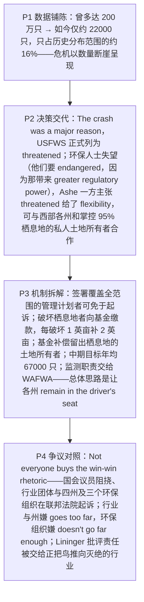

# Lesser Prairie Chicken Conservation 精读笔记

## 背景

本文是 **2016 年考研英语（一）Text 2**（第 26—30 题），主题是**小草原松鸡（lesser prairie chicken）的保护监管之争**：一种曾**多达 200 万只**的鸟，如今**只剩约 22000 只**（仅占历史分布范围的约 **16%**）；美国鱼类与野生动物管理局（**USFWS**）据此把它正式列为 **"threatened"（受威胁）**，而非一些环保人士要求的 **"endangered"（濒危）**，并配上一套"**免诉换合作**"的保护机制。文章末段给出**四方对立**——争议的焦点**不是"要不要保护"，而是"由谁管、管到哪一档"**。

文章是一篇**生态政策类新闻报道**，作者几乎不表态，观点由**四方信源**分担：USFWS 局长 **Daniel Ashe**（政策辩护）、**环保人士**（嫌力度不够）、**行业团体与各州**（嫌管得过头）、生物学家 **Jay Lininger**（尖锐批评）。全篇信源都带**机构或头衔**，是新闻文体的标准做法——**读到谁在说话、他的身份是什么，就等于拿到了命题坐标**（第 29 题问 Ashe、第 30 题问 Lininger，两题都直接考"人物立场"）。

作者的叙述分四步推进：

1. **数据铺陈（P1）**：`as many as 2 million` → `just some 22,000` / `about 16% of the species' historic range`——用**数量断崖**先渲染危机，全篇的事实底座由此奠定（第 26 题的答案依据就在这里）。
2. **决策交代（P2）**：`The crash was a major reason … decided to formally list the bird as "threatened."` 紧接着抛出**分歧**——环保人士 `were disappointed`，他们本想要 `"endangered"`，因为那一等级带来 `greater regulatory power`；Ashe 一方则说 `"threatened"` 给了联邦政府 `flexibility`，可以走 `less confrontational` 的路子，尤其要与**常对联邦行动不安的西部各州**和**掌控约 95% 栖息地的私人土地所有者**合作。
3. **机制拆解（P3）**：三项机制逐一亮出——**签署覆盖全范围的管理计划者可免于起诉**（`as long as they had signed …`）；**破坏栖息地者须向基金缴款，每破坏 1 英亩补 2 英亩**（`pay into a fund to replace every acre destroyed with 2 new acres`）；**基金还补偿留出栖息地的土地所有者**（`compensate landowners who set aside habitat`）。随后是**中期目标**（`an annual average of 67,000 birds`）与**监测职责外包给 WAFWA**（`the job of monitoring progress`），收在 Ashe 那句定性上：`let "states remain in the driver's seat"`。
4. **争议对照（P4）**：`Not everyone buys the win-win rhetoric.` 国会议员**阻挠**、十几个行业团体与四个州及三个环保组织**在联邦法院起诉**；行业与州嫌 `goes too far`，环保组织嫌 `doesn't go far enough`；Lininger 一句点破"**责任错置**"——`giving responsibility … to the same industries that are pushing it to extinction`。

> [!abstract] 文章概要
> 全文用**"数据铺陈 → 决策交代 → 机制拆解 → 争议对照"**四步推进，属于**新闻报道型说明文 + 观点对照文**：先以 **200 万 → 2.2 万**的数量断崖立起危机，再交代 USFWS 选择 **"threatened"** 而非 **"endangered"** 的决策与随之而来的分歧，接着把"**免诉 — 缴款 — 补偿 — 监测**"四项机制逐条拆开，最后用**四方对立**收束，并借 Lininger 之口把批评推到"**谁该掌权**"这一层。抓住这条链条，主旨题与推断题一望即知；而五道题中有三题（26、27、29）都压在"**法定等级**"与"**主体立场**"两层的交界处——这正是本篇的命题重心。

- **难度**：intermediate
- **体裁**：新闻报道（news report）——**生态政策 / 观点对照**
- **题源**：2016 年考研英语（一）Text 2（第 26—30 题）

| 题号 | 26 | 27 | 28 | 29 | 30 |
|------|----|----|----|----|----|
| 答案 | D | C | A | D | C |
| 定位 | P1 数量对比 + P2 决策句 | P2 `greater regulatory power` | P3 免诉门槛 + 缴款补偿 | P3 末 `in the driver's seat` | P4 末 Lininger 引语 |

> [!note] 本篇的三组关键对立
> ① **"threatened"（受威胁） vs "endangered"（濒危）**：不是近义词的程度差别，而是**《濒危物种法》里的两个法定等级**——`vulnerable < threatened < endangered < extinct`。等级决定**监管权的大小**，第 26、27 题都建立在这条链上。
> ② **"免诉换合作" vs "责任错置"**：USFWS 把"**不起诉**"当成激励机制（`would not prosecute … as long as …`），Lininger 却看到"**把管理权交给肇事者**"（`the same industries that are pushing it to extinction`）——同一套机制，两种读法。
> ③ **"管得过头" vs "管得不够"**：`goes too far` / `doesn't go far enough` 用同一个 `go far` 的两端划出两营；再加**阻挠**的国会议员与**嫌偏袒**的 Lininger，构成本篇末段的"四方阵营表"。

---

## 文章原文

# 2016 Passage 2

Biologists **estimate** that as many as 2 million lesser prairie chickens—a kind of bird living on **stretching** grasslands—once ==lent red to the often grey landscape== of the midwestern and southwestern United States.

> [!abstract]- 长难句分析
> **原句**：Biologists **estimate** that as many as 2 million lesser prairie chickens—a kind of bird living on **stretching** grasslands—once ==lent red to the often grey landscape== of the midwestern and southwestern United States.
>
> **主干提取**：
>
> - 主语 S: Biologists（生物学家）
> - 谓语 V: estimate（估计）
> - 宾语从句 O: that as many as 2 million lesser prairie chickens once lent red to the often grey landscape（多达 200 万只小草原松鸡曾为常常灰暗的景色添上一抹红色）
> - 后置定语 Attrib.: of the midwestern and southwestern United States（美国中西部和西南部的，修饰 landscape）
>
> **修饰成分**：
>
> | 类型 | 引导词 | 修饰对象 |
> |------|--------|----------|
> | 同位语（破折号插入） | —（破折号） | lesser prairie chickens（解释这是什么鸟） |
> | 非谓语（现在分词，后置定语） | living on | a kind of bird（"栖息在……的"） |
> | 数量修饰（副词性） | as many as | 2 million（强调上限"多达"） |
> | 介词短语（后置定语） | of | the often grey landscape（"美国中西部和西南部的"景色） |
>
> **结构图解**：
>
> ```
> 主句: Biologists + estimate + (that 宾语从句)
>   └── 宾语从句: as many as 2 million lesser prairie chickens + lent + red + (to the often grey landscape)
>         ├── 同位语: (—a kind of bird—) → 解释 lesser prairie chickens
>         │     └── 后置定语: (living on stretching grasslands) → 修饰 a kind of bird
>         └── 后置定语: (of the midwestern and southwestern United States) → 修饰 landscape
> ```
>
> **参考译文**：生物学家估计，多达 200 万只小草原松鸡——一种栖息在连绵草原上的鸟——曾为美国中西部和西南部常常灰暗的景色添上一抹红色。
>
> **考点提示**：① **破折号插入同位语把主干拦腰截断**：`estimate that` 之后不是直接接谓语，而是先插进一整块 `—a kind of bird living on stretching grasslands—`；读到 `that` 应先**跳过破折号整块**，直接找从句谓语 `lent`，否则会读成"松鸡是一种鸟"的断裂结构。② **`lend sth. to sth.` 是熟词生义**：lend 不是"借出"，而是"给……增添"；`red` 由形容词转为**名词**（借用颜色词作名词），翻译须补出量词"一抹红色"。③ **`as many as` 强调上限**（"多达"），与下文的 `some`（大约）、`an estimated`（估计的）构成本篇的"数量表达串烧"——第 26 题的数据对比正由此起笔：**200 万 → 2.2 万**。④ **`living on ...` 无逗号且紧跟名词，是后置定语而非伴随状语**：有逗号才是状语（对比第二句的 `, occupying ...` 即伴随状语）——**逗号是分水岭**。⑤ 同位语用 `a kind of bird`（**a** 表"众多鸟中的一类"），与 `the midwestern and southwestern United States`（**the** 表特指）形成**冠词对照**。

But just some 22,000 birds remain today, **occupying** about 16% of the species' **historic range**.

The **crash** was a major reason the U. S. Fish and Wildlife Service (USFWS) decided to formally **list** the bird as **threatened**.

> [!abstract]- 长难句分析
> **原句**：The **crash** was a major reason the U. S. Fish and Wildlife Service (USFWS) decided to formally **list** the bird as **threatened**.
>
> **主干提取**：
>
> - 主语 S: The crash（数量骤降）
> - 系动词 V: was（是）
> - 表语 C: a major reason（一个主要原因）
> - 定语从句（省略关系副词，修饰 reason）: the U. S. Fish and Wildlife Service (USFWS) decided to formally list the bird as threatened
> - 从句主语 S: the U. S. Fish and Wildlife Service (USFWS)（美国鱼类与野生动物管理局）
> - 从句谓语 V: decided（决定）
> - 从句宾语 O: to formally list the bird as threatened（正式将该鸟列为"受威胁"物种）
>
> **修饰成分**：
>
> | 类型 | 引导词 | 修饰对象 |
> |------|--------|----------|
> | 定语从句（省略关系副词 why / that） | —（省略） | a major reason（"作出决定的原因"） |
> | 非谓语（不定式，宾语） | to | decided（"决定去做"） |
> | 介词短语（宾语补足语） | as | list the bird（"把……列为……"） |
> | 副词（状语） | formally | list（"正式地"） |
> | 缩略语（同位式简称） | (USFWS) | the U. S. Fish and Wildlife Service |
>
> **结构图解**：
>
> ```
> 主句: The crash + was + a major reason
>   └── 定语从句: (the USFWS + decided + to formally list the bird as threatened) → 修饰 a major reason
>         ├── 宾语（不定式）: (to formally list the bird as threatened) → decided 的宾语
>         └── 宾语补足语: (as threatened) → 补充 the bird 的身份
> ```
>
> **参考译文**：数量骤降是美国鱼类与野生动物管理局（USFWS）决定正式将该鸟列为"受威胁"物种的一个主要原因。
>
> **考点提示**：① **reason 后省略 why / that 的定语从句是全句最大的阅读障碍**：主句到 `a major reason` 就**结束了**，`the U. S. Fish and Wildlife Service decided to ...` 是**修饰 reason 的从句**，绝不可读成 "The crash decided to list the bird"（"骤降决定把鸟列名"）。② **识别标志**：`reason` 后紧跟一个**完整的主谓结构**；若补出关系副词即 `a major reason **why** the USFWS decided ...`。③ **时态一致**：主句 `was` 与从句 `decided` 同为一般过去；从句用不定式 `to list` 表示"决定的内容"。④ **`list A as B`（把 A 列为 B）与下文 `designate A as B`（把 A 认定为 B）同型**，是考研**同义替换**的高频考点。⑤ **本句是第 26 题的定位句**：题干 `The major reason for listing the lesser prairie chicken as threatened is ____` **几乎照抄本句的 reason 结构**——**原词复现即定位坐标**，答案须回第 1 段找数据依据（D 项 its drastically decreased population ↔ `The crash` + 2.2 万只/16%）。

"The lesser prairie chicken is ==in a desperate situation==," said USFWS Director Daniel Ashe.

Some **environmentalists**, however, were disappointed.

They had pushed the agency to **designate** the bird as "**endangered**," a **status** that gives federal officials greater **regulatory** power to ==crack down on== threats.

> [!abstract]- 长难句分析
> **原句**：They had pushed the agency to **designate** the bird as "**endangered**," a **status** that gives federal officials greater **regulatory** power to ==crack down on== threats.
>
> **主干提取**：
>
> - 主语 S: They（他们，指环保人士）
> - 谓语 V: had pushed（曾力推）
> - 宾语 O: the agency（该机构）
> - 宾语补足语 C: to designate the bird as "endangered"（把该鸟认定为"濒危"）
> - 同位语: a status（一种地位）
> - 定语从句: that gives federal officials greater regulatory power to crack down on threats（赋予联邦官员更大的监管权力以打击各种威胁）
>
> **修饰成分**：
>
> | 类型 | 引导词 | 修饰对象 |
> |------|--------|----------|
> | 非谓语（不定式，宾语补足语） | to | the agency（push sb. to do） |
> | 介词短语（宾语补足语） | as | designate the bird（"认定为"） |
> | 同位语 | —（逗号） | "endangered"（解释这一身份的性质） |
> | 定语从句 | that | a status |
> | 非谓语（不定式，后置定语） | to crack down on | greater regulatory power（"用来打击……的权力"） |
> | 介词短语（固定搭配） | on | crack down（打击的对象 threats） |
>
> **结构图解**：
>
> ```
> 主句: They + had pushed + the agency + (to designate the bird as "endangered")
>   ├── 宾语补足语: (to designate the bird as "endangered") → 补充 the agency 的动作
>   └── 同位语: (a status) → 解释 "endangered" 的性质
>         └── 定语从句: (that gives federal officials greater regulatory power ...) → 修饰 a status
>               └── 后置定语: (to crack down on threats) → 修饰 greater regulatory power
> ```
>
> **参考译文**：他们曾力推该机构将该鸟认定为"濒危"——这一地位赋予联邦官员更大的监管权力以打击各种威胁。
>
> **考点提示**：① **过去完成时的"锚点"就在上一句**：`They **had pushed** the agency ... were disappointed` —— 锚点是 `were disappointed`，"失望"之前早已推过，**且未成功**。**过去完成时出现处几乎必是因果句**；第 27 题问"环保人士为何失望"，答案正藏在这一时间落差里。② **同位语 + 定语从句的连环结构**：`a status` 是 "endangered" 的**同位语**，其后 `that` 从句修饰 **a status**（判据：从句主语 `gives` 与"地位"搭配，而非与"濒危"搭配）。③ **`greater regulatory power` 是第 27 题的命题源**：原句说 "endangered" 给的是 **greater**（更大）权力，**反向推理**即 "threatened" 给的是 **less**——C 项 `granted less federal regulatory power` 正是这一反向改写的**正确答案**。④ **`crack down on` 为固定短语，on 不可省**；不定式 `to crack down on threats` 作 **power 的后置定语**（"用来……的权力"），**不是目的状语**。⑤ 与 P4 的 `doesn't go far enough` 构成**程度对照**：本篇凡遇 more / less / greater / too / enough 都应立即标注——**第 27、28 题都靠程度比较定位**。

But Ashe and others argued that the "threatened" tag gave the federal government **flexibility** to try out new, potentially less **confrontational** **conservation** approaches.

In particular, they called for **forging** closer **collaborations** with western state governments, which are often **uneasy** with federal action, and with the private **landowners** who control an estimated 95% of the prairie chicken's **habitat**.

> [!abstract]- 长难句分析
> **原句**：In particular, they called for **forging** closer **collaborations** with western state governments, which are often **uneasy** with federal action, and with the private **landowners** who control an estimated 95% of the prairie chicken's **habitat**.
>
> **主干提取**：
>
> - 状语 A: In particular（尤其）
> - 主语 S: they（他们，指 Ashe 一方）
> - 谓语 V: called for（呼吁）
> - 宾语 O: forging closer collaborations with western state governments ... and with the private landowners ...（与西部各州政府以及与私人土地所有者建立更紧密的合作）
>
> **修饰成分**：
>
> | 类型 | 引导词 | 修饰对象 |
> |------|--------|----------|
> | 介词短语（引出宾语） | for | called（call for doing） |
> | 非谓语（动名词，宾语） | forging | called for |
> | 介词短语（状语） | with | collaborations（合作对象①：州政府） |
> | 定语从句（非限制性） | which | western state governments |
> | 形容词短语（表语） | uneasy with | which（州政府"对联邦行动不安"） |
> | 介词短语（状语，与①平行） | and with | collaborations（合作对象②：私人土地所有者） |
> | 定语从句（限制性） | who | the private landowners |
> | 非谓语（过去分词，前置定语） | estimated | 95%（"估计的 95%"） |
>
> **结构图解**：
>
> ```
> 主句: they + called for + (forging closer collaborations)
>   ├── 状语: (In particular)
>   ├── 介词短语: (with western state governments) → 合作对象①
>   │     └── 非限制性定语从句: (, which are often uneasy with federal action,) → 修饰 western state governments
>   └── 介词短语（平行标志）: (and with the private landowners) → 合作对象②，与①并列
>         └── 限制性定语从句: (who control an estimated 95% of the prairie chicken's habitat) → 修饰 landowners
>               └── 前置定语: (an estimated) → 修饰 95%
> ```
>
> **参考译文**：他们尤其呼吁与西部各州政府以及私人土地所有者建立更紧密的合作——前者常常对联邦行动感到不安，后者则掌控着这种松鸡约 95% 的栖息地。
>
> **考点提示**：① **两个 with 是并列关系，第二个 `and with` 是平行标志**：漏读 `and with` 会把 `the private landowners` 误当成 collaborations 的**同位语**，或把 which 从句错挂到 collaborations 上。② **`which` 与 `who` 各有所指，人称是分水岭**：`which` 修饰 **western state governments**（机构），`who` 修饰 **the private landowners**（人），**不能互换**。③ **逗号决定信息权重**：`, which ...` 带逗号 = **非限制性**（补充说明，可删）；`who control ...` 不带逗号 = **限制性**（限定范围，不可删）——前者是旁白，后者特指"**掌控 95% 栖息地的那批人**"。④ **`call for doing` 是固定搭配**（for 后接动名词），与 `call on sb. to do`（号召某人做）不同。⑤ **本句是"插入语干扰平行"的典型**：读句时先把逗号内的 which 从句**整块括起**，再看主干 `called for forging collaborations with A ... and with B`——**先缩句、后还原**是考场最省时的处理法。⑥ **`forge` 本义"锻造"，此处取"建立（关系）"的熟词生义**，是考研词汇题的高频来源。

Under the plan, for example, the agency said it would not **prosecute** landowners or businesses that **unintentionally** kill, harm, or **disturb** the bird, ==as long as== they had signed a **range-wide** management plan to **restore** prairie chicken habitat.

> [!abstract]- 长难句分析
> **原句**：Under the plan, for example, the agency said it would not **prosecute** landowners or businesses that **unintentionally** kill, harm, or **disturb** the bird, ==as long as== they had signed a **range-wide** management plan to **restore** prairie chicken habitat.
>
> **主干提取**：
>
> - 状语 A: Under the plan, for example（按照该计划，例如）
> - 主语 S: the agency（该机构）
> - 谓语 V: said（表示）
> - 宾语从句 O（省略 that）: it would not prosecute landowners or businesses, as long as they had signed a range-wide management plan to restore prairie chicken habitat（只要……它就不会起诉……）
> - 从句主语 S: it（指该机构）
> - 从句谓语 V: would not prosecute（将不会起诉）
> - 从句宾语 O: landowners or businesses（土地所有者或企业）
> - 从句状语 A: as long as they had signed a range-wide management plan（只要他们签署了覆盖全范围的管理计划）
>
> **修饰成分**：
>
> | 类型 | 引导词 | 修饰对象 |
> |------|--------|----------|
> | 介词短语（状语） | Under | the plan（"按照该计划"） |
> | 宾语从句（省略 that） | —（省略） | said |
> | 定语从句 | that | landowners or businesses |
> | 三动词并列 | or | kill / harm / disturb（形式须一致） |
> | 条件状语从句 | as long as | would not prosecute（免诉的前提） |
> | 时态（过去完成） | had signed | they（签署先于免诉） |
> | 非谓语（不定式，后置定语） | to restore | a range-wide management plan（"用来恢复栖息地的计划"） |
>
> **结构图解**：
>
> ```
> 主句: the agency + said + (that 宾语从句，that 被省略)
>   ├── 状语: (Under the plan, for example)
>   └── 宾语从句: it + would not prosecute + landowners or businesses + (as long as 条件从句)
>         ├── 定语从句: (that unintentionally kill, harm, or disturb the bird) → 修饰 landowners or businesses
>         │     └── 三动词并列: (kill, harm, or disturb) → 同为动词原形
>         └── 条件状语从句: (as long as they had signed a range-wide management plan ...) → 免诉的前提
>               └── 后置定语: (to restore prairie chicken habitat) → 修饰 a management plan
> ```
>
> **参考译文**：例如，按照该计划，该机构表示，只要土地所有者或企业签署了一份覆盖全范围的管理计划以恢复松鸡栖息地，它就不会起诉那些非故意杀害、伤害或干扰这种鸟的土地所有者或企业。
>
> **考点提示**：① **宾语从句省略 that**：`the agency said **it** would not prosecute ...` 中 said 后的 that 被省略——**及物动词后的宾语从句 that 常可省，但并列的第二个 that 不可省**。② **`as long as` 引导条件状语从句**，意为"只要"，在法律法规、政策文本中远多于 if，**语气更强、更强调"唯一前提"**。③ **时态呼应即逻辑顺序**：从句 `had signed`（过去完成）→ 主句 `would not prosecute`（过去将来）——**签署在前、免诉在后**，"条件先行"这层逻辑由时态钉死。**这是第 28 题的定位钥匙。** ④ **三动词并列 `kill, harm, or disturb` 必须同为动词原形**（形式一致原则），不可改成 killing / to disturb。⑤ **第 28 题四个选项全是"换主体 / 换方向"的干扰**：A 项把"缴款补栖息地"说成"支付补偿金"；B 项把"2 英亩补偿"说成"设立同等大小的栖息地"；C 项把"赋予 WAFWA 监测职责"说成"企业支持 WAFWA 监测"；D 项把"向基金缴款"说成"为 USFWS 筹钱"。**对策：把机制写成"主体 + 动作 + 对象"三列，再与选项逐一对照。** ⑥ **`range-wide` 是"名词 + wide"构成的复合形容词**（"覆盖全范围的"），与 `nationwide`、`worldwide` 同构。

**Negotiated** by USFWS and the states, the plan requires individuals and businesses that damage habitat as part of their **operations** to pay into a **fund** to replace every **acre** destroyed with 2 new acres of **suitable** habitat.

> [!abstract]- 长难句分析
> **原句**：**Negotiated** by USFWS and the states, the plan requires individuals and businesses that damage habitat as part of their **operations** to pay into a **fund** to replace every **acre** destroyed with 2 new acres of **suitable** habitat.
>
> **主干提取**：
>
> - 状语 A（过去分词短语）: Negotiated by USFWS and the states（该计划由 USFWS 与各州协商达成）
> - 主语 S: the plan（该计划）
> - 谓语 V: requires（要求）
> - 宾语 O: individuals and businesses（个人和企业）
> - 宾语补足语 C: to pay into a fund（向一项基金缴款）
> - 目的状语 A: to replace every acre destroyed with 2 new acres of suitable habitat（以每破坏 1 英亩就用 2 英亩新的适宜栖息地来补偿）
>
> **修饰成分**：
>
> | 类型 | 引导词 | 修饰对象 |
> |------|--------|----------|
> | 非谓语（过去分词短语，状语） | Negotiated by | the plan（被动状语，交代计划的形成方式） |
> | 定语从句（**动宾分隔**） | that | individuals and businesses |
> | 介词短语（状语） | as part of | damage habitat（"作为经营活动的一部分"） |
> | 介词短语（固定搭配） | into | pay（"缴入"基金） |
> | 非谓语（不定式，目的状语） | to replace | pay into a fund |
> | 非谓语（过去分词，后置定语） | destroyed | every acre（"已被破坏的每一英亩"） |
> | 介词短语（固定搭配） | with | replace（replace A with B） |
> | 介词短语（后置定语） | of | 2 new acres |
>
> **结构图解**：
>
> ```
> 主句: the plan + requires + individuals and businesses + (to pay into a fund)
>   ├── 状语（过去分词短语）: (Negotiated by USFWS and the states) → 被动状语
>   ├── [动宾分隔] 定语从句: (that damage habitat as part of their operations) → 修饰 individuals and businesses
>   ├── 宾语补足语: (to pay into a fund) → require sb. to do 中的 to do
>   └── 目的状语: (to replace every acre destroyed with 2 new acres of suitable habitat)
>         └── 后置定语: (destroyed) → 修饰 every acre
> ```
>
> **参考译文**：该计划由 USFWS 与各州协商达成，要求那些在经营活动中破坏栖息地的个人和企业向一项基金缴款，以每破坏 1 英亩就用 2 英亩新的适宜栖息地来补偿。
>
> **考点提示**：① **全篇最难的动宾分隔**：`requires individuals and businesses **[that damage habitat as part of their operations]** to pay into a fund` —— `require sb. to do` 的 **sb. 与 to do 之间插入了定语从句**，必须先跳过整块修饰才能接回 `requires ... to pay`。② **破解三步法**：划出谓语 `requires` → 跳过 that 从句 → 接回 `individuals and businesses ... to pay into a fund`。**改写检验**：拿掉穿插的定语从句，句子仍须完整——`the plan requires individuals and businesses to pay into a fund` ✅，**这是验证自己是否读对的最快方法**。③ **句首过去分词作状语**表被动 + 完成，逻辑主语即主句主语 the plan；展开为 `Since/Because the plan was negotiated by USFWS and the states`，**翻译时先还原成完整从句再译，语序更顺**。④ **`replace A with B` 为"用 B 替换 A"，顺序不可颠倒**：此处 A = every acre destroyed，B = 2 new acres of suitable habitat；第 28 题 B 项 `equally big` 正是把"**2 倍补偿**"偷换成"**同等大小**"。⑤ **`every acre destroyed` 中的 destroyed 是过去分词作后置定语**（被动 + 完成，= which was destroyed），与 P1 的 `living on ...`（现在分词，主动 + 进行）形成**分工对照**：done 指向已然，doing 指向主动进行。⑥ **虚拟语气辨析**：`require` 接 **that 从句**时须用虚拟语气（should + do，should 可省），但接 **sb. to do** 时是普通不定式——本句是后者，所以是 `to pay`，**不要误加 should**。

The fund will also be used to **compensate** landowners who ==set aside== habitat.

USFWS also set an **interim** goal of restoring prairie chicken populations to an annual average of 67,000 birds over the next 10 years.

And it gives the Western Association of Fish and Wildlife Agencies (WAFWA), a **coalition** of state agencies, the job of **monitoring** progress.

> [!abstract]- 长难句分析
> **原句**：And it gives the Western Association of Fish and Wildlife Agencies (WAFWA), a **coalition** of state agencies, the job of **monitoring** progress.
>
> **主干提取**：
>
> - 主语 S: it（它，指 USFWS）
> - 谓语 V: gives（交给）
> - 间接宾语 O1: the Western Association of Fish and Wildlife Agencies (WAFWA)（西部鱼类与野生动物机构协会）
> - 直接宾语 O2: the job of monitoring progress（监测进展的工作）
> - 同位语: a coalition of state agencies（一个由各州机构组成的联盟）
>
> **修饰成分**：
>
> | 类型 | 引导词 | 修饰对象 |
> |------|--------|----------|
> | 同位语（**动宾分隔**） | —（逗号） | WAFWA（解释其性质） |
> | 介词短语（后置定语） | of | a coalition（"由……组成的"联盟） |
> | 非谓语（动名词，后置定语） | of monitoring | the job（"监测……的工作"） |
>
> **结构图解**：
>
> ```
> 主句: it + gives + the Western Association of Fish and Wildlife Agencies (WAFWA) + the job of monitoring progress
>   ├── [动宾分隔] 同位语: (, a coalition of state agencies,) → 解释 WAFWA 的性质
>   │     └── 后置定语: (of state agencies) → 修饰 a coalition
>   └── 直接宾语: (the job of monitoring progress)
>         └── 后置定语（动名词）: (of monitoring progress) → 修饰 the job
> ```
>
> **参考译文**：并且，它把监测进展的工作交给了西部鱼类与野生动物机构协会（WAFWA）——一个由各州机构组成的联盟。
>
> **考点提示**：① **双宾语被同位语隔开**，是动宾分隔的另一种形态：`give sb. sth.` 结构中，**sb.（WAFWA）与 sth.（the job）之间插入了逗号同位语**；读到 `gives ... ,` 时先跳过同位语，直接找 give 的第二个宾语。② **`of + 动名词`作后置定语**：`the job of monitoring progress` = "监测进展的工作"，**介词后必须接动名词而非原形**（❌ the job of monitor progress）。③ **冠词密码**：同位语用 **a coalition** —— **a** 说明 WAFWA 只是"众多同类联盟之一"，暗示还有别的同类组织；若写成 **the** coalition 则变为"唯一的联盟"，**语义被夸大**。**冠词差别是同位语考点细节。** ④ **第 28 题 C 项即由此句改写而来**：原文是"**USFWS 赋予** WAFWA 监测职责"，选项写成"**企业支持** WAFWA 监测工作"——**主体与动作方向双双改变**，是典型的"换主体"干扰。⑤ 与 P4 的 `are challenging it in federal court` 形成对照：**同一机构既被赋予监测职责、其计划又被各方起诉**——读懂这层"聚光灯同时打在两边"的关系，才算真正读透第 3、4 段的转折。

Overall, the idea is to let "states remain ==in the driver's seat== for managing the species," Ashe said.

Not everyone **buys** the ==win-win rhetoric==.

Some Congress members are trying to **block** the plan, and at least a dozen industry groups, four states, and three environmental groups are **challenging** it in **federal court**.

Not surprisingly, industry groups and states generally argue it ==goes too far==; environmentalists say it doesn't go far enough.

"The federal government is giving responsibility for managing the bird to the same industries that are ==pushing it to extinction==," says biologist Jay Lininger.

> [!abstract]- 长难句分析
> **原句**："The federal government is giving responsibility for managing the bird to the same industries that are ==pushing it to extinction==," says biologist Jay Lininger.
>
> **主干提取**：
>
> - 引语从句（宾语）: The federal government is giving responsibility for managing the bird to the same industries that are pushing it to extinction（联邦政府正把管理这种鸟的责任交给那些正把它推向灭绝的行业）
> - 从句主语 S: The federal government（联邦政府）
> - 从句谓语 V: is giving（正给予）
> - 从句宾语 O: responsibility for managing the bird（管理这种鸟的责任）
> - 从句状语 A: to the same industries（给那些行业）
> - 引述句（**完全倒装**）: says biologist Jay Lininger（生物学家杰伊·利宁格说）
> - 同位语: biologist（交代 Jay Lininger 的身份，头衔前零冠词）
>
> **修饰成分**：
>
> | 类型 | 引导词 | 修饰对象 |
> |------|--------|----------|
> | 非谓语（动名词，后置定语） | for managing | responsibility（"管理……的责任"） |
> | 介词短语（状语） | to | is giving（双宾语的介词式） |
> | 定语从句 | that | the same industries（**the same ... that** 含反讽） |
> | 引述句（完全倒装） | says | 全句（主谓倒装，主语后置） |
> | 同位语（头衔式） | —（零冠词） | Jay Lininger（职位直接贴在姓名前） |
>
> **结构图解**：
>
> ```
> 引语从句: The federal government + is giving + (responsibility for managing the bird) + (to the same industries)
>   ├── 后置定语（动名词）: (for managing the bird) → 修饰 responsibility
>   └── 定语从句: (that are pushing it to extinction) → 修饰 the same industries
>         └── [the same ... that] 强调"同一批"，含反讽
>
> 引述句（完全倒装）: says + biologist Jay Lininger
>   └── 同位语（头衔式）: (biologist) → 交代身份，职位前零冠词
> ```
>
> **参考译文**："联邦政府把管理这种鸟的责任交给了那些正在把它推向灭绝的行业，"生物学家杰伊·利宁格说。
>
> **考点提示**：① **引述句完全倒装**：`says biologist Jay Lininger` 把**谓语提到主语之前**，是新闻文体的固定套路；翻译时**必须把主语提到动词前**（"利宁格说"）。**代词作主语时不倒装**（✅ He said；❌ said he）——这是引述倒装唯一的禁区。② **头衔式同位语** `biologist Jay Lininger`：**职位直接贴在姓名前，不加冠词**，与 P2 的 `USFWS Director Daniel Ashe` 同型——**本篇共两处引述倒装（第三处 `Ashe said` 语序正常）**。③ **`the same ... that` 含反讽**：字面是"正是那些行业"，语境中是"**同一批**既被托付管理、又在推动灭绝的行业"——**the same 是作者的评价性武器**，点明"责任错置"的荒谬。④ **名词化 + 后置定语**：`responsibility for managing the bird` 用**名词化隐去施动者**，是政策文本压缩信息的常用手段，与 P3 的 `the job of monitoring progress` 同类。⑤ **人物立场 = 命题坐标**：本句对应**第 30 题**（`Jay Lininger would most likely support ____`）——他批评计划偏袒行业，**立场与环保组织同向，故 C 项 environmental groups 正确**；A 项 the plan under challenge 与 B 项 the win-win rhetoric 都是他批评的对象，D 项 industry groups 是他指责的一方。**读到人名先圈出，再回题干对准名字。** ⑥ **`push sth. to extinction`** = "把某物种推向灭绝"；与 P2 的 `list ... as threatened`、`designate ... as endangered` 同属"物种等级"语义场，而 **extinction 是这条链的终点**：vulnerable < threatened < endangered < extinct。

---

## 题目

### 26. The major reason for listing the lesser prairie chicken as threatened is ____.

- [A] the insistence of private landowners
- [B] the underestimate of the grassland acreage
- [C] a desperate appeal from some biologists
- [D] its drastically decreased population

### 27. The "threatened" tag disappointed some environmentalists in that it ____.

- [A] was a give-in to governmental pressure
- [B] would involve fewer agencies in action
- [C] granted less federal regulatory power
- [D] went against conservation policies

### 28. It can be learned from Paragraph 3 that unintentional harm-doers will not be prosecuted if they ____.

- [A] agree to pay a sum for compensation
- [B] volunteer to set up an equally big habitat
- [C] offer to support the WAFWA monitoring job
- [D] promise to raise funds for USFWS operations

### 29. According to Ashe, the leading role in managing the species is ____.

- [A] the federal government
- [B] the wildlife agencies
- [C] the landowners
- [D] the states

### 30. Jay Lininger would most likely support ____.

- [A] the plan under challenge
- [B] the win-win rhetoric
- [C] environmental groups
- [D] industry groups

---

## 翻译对照

# 2016 Passage 2 中英对照翻译

## Paragraph 1

Biologists estimate that as many as 2 million lesser prairie chickens—a kind of bird living on stretching grasslands—once lent red to the often grey landscape of the midwestern and southwestern United States. But just some 22,000 birds remain today, occupying about 16% of the species' historic range.

生物学家估计，多达 200 万只小草原松鸡——一种栖息在连绵草原上的鸟——曾为美国中西部和西南部常常灰暗的景色添上一抹红色。但如今仅存约 22000 只，只占该物种历史分布范围约 16%。

> [!note] 翻译说明
> `Biologists estimate that...` 中 `estimate` 后接**宾语从句**；`as many as 2 million` 修饰数量，"多达 200 万"。
> 破折号中间的 `a kind of bird living on stretching grasslands` 是**同位语**（对 lesser prairie chickens 作解释），其中 `living on...` 是**现在分词作后置定语**。
> `lent red to the often grey landscape` 是**拟物化的动词搭配**：`lend` 本义"借出"，此处 `lend sth. to sth.` 意为"给……增添（某种色彩）"。`red` 在此转为名词（借用颜色词作名词），翻译时要补出量词"一抹红色"。
> `some 22,000 birds` 中 `some` 是**副词**，意为"大约"（不是"一些"）。
> `occupying about 16% of the species' historic range` 是**现在分词作伴随状语**。`historic range` 为"历史（分布）范围"，指该物种曾有的分布区域。

## Paragraph 2

The crash was a major reason the U. S. Fish and Wildlife Service (USFWS) decided to formally list the bird as threatened. "The lesser prairie chicken is in a desperate situation," said USFWS Director Daniel Ashe. Some environmentalists, however, were disappointed. They had pushed the agency to designate the bird as "endangered," a status that gives federal officials greater regulatory power to crack down on threats. But Ashe and others argued that the "threatened" tag gave the federal government flexibility to try out new, potentially less confrontational conservation approaches. In particular, they called for forging closer collaborations with western state governments, which are often uneasy with federal action, and with the private landowners who control an estimated 95% of the prairie chicken's habitat.

数量骤降是美国鱼类与野生动物管理局（USFWS）决定正式将该鸟列为"受威胁"物种的一个主要原因。"小草原松鸡的处境岌岌可危，"USFWS 局长丹尼尔·阿什说。然而，一些环保人士感到失望。他们曾力推该机构将该鸟认定为"濒危"——这一地位赋予联邦官员更大的监管权力以打击各种威胁。但阿什等人主张，"受威胁"这一标签给了联邦政府灵活性，可以尝试新的、可能对抗性更小的保护路径。他们尤其呼吁与西部各州政府以及私人土地所有者建立更紧密的合作——前者常常对联邦行动感到不安，后者则掌控着这种松鸡约 95% 的栖息地。

> [!note] 翻译说明
> `a major reason the U. S. Fish and Wildlife Service decided to...` 中，`the U. S. Fish and Wildlife Service decided to...` 是**省略了 why / that 的定语从句**，修饰 reason（"作出决定的原因"）。这是本句最重要的结构点。
> `list the bird as threatened` 为 `list A as B` 结构，"把 A 列为 B"。注意 `threatened`（受威胁的）与 `endangered`（濒危的）是**美国《濒危物种法》中的两个法定等级**，"受威胁"的管制强度低于"濒危"。
> `"The lesser prairie chicken is in a desperate situation," said USFWS Director Daniel Ashe.` 是**引述句完全倒装**（主语后置），翻译时须把主语提到动词前。
> `a status that gives federal officials greater regulatory power to crack down on threats` 是**同位语 + 定语从句**：`a status` 作 "endangered" 的同位语，`that...` 修饰 status。
> `crack down on` 为固定短语，"打击、镇压"。
> `argued that the "threatened" tag gave...` 中 `tag` 是"标签"的比喻用法，指这一法定称谓。
> `they called for forging closer collaborations with A, which..., and with B, who...` 是**平行结构**：`call for doing` + 两个 with 短语并列；`which are often uneasy with federal action` 修饰 western state governments，`who control an estimated 95%...` 修饰 private landowners。

## Paragraph 3

Under the plan, for example, the agency said it would not prosecute landowners or businesses that unintentionally kill, harm, or disturb the bird, as long as they had signed a range-wide management plan to restore prairie chicken habitat. Negotiated by USFWS and the states, the plan requires individuals and businesses that damage habitat as part of their operations to pay into a fund to replace every acre destroyed with 2 new acres of suitable habitat. The fund will also be used to compensate landowners who set aside habitat. USFWS also set an interim goal of restoring prairie chicken populations to an annual average of 67,000 birds over the next 10 years. And it gives the Western Association of Fish and Wildlife Agencies (WAFWA), a coalition of state agencies, the job of monitoring progress. Overall, the idea is to let "states remain in the driver's seat for managing the species," Ashe said.

例如，按照该计划，该机构表示，只要土地所有者或企业签署了一份覆盖全范围的管理计划以恢复松鸡栖息地，它就不会起诉那些非故意杀害、伤害或干扰这种鸟的人。该计划由 USFWS 与各州协商达成，要求那些在经营活动中破坏栖息地的个人和企业向一项基金缴款，以每破坏 1 英亩就用 2 英亩新的适宜栖息地来补偿。这笔基金还将用于补偿那些留出栖息地的土地所有者。USFWS 还设定了一个中期目标：在未来 10 年内将松鸡种群恢复到年均 67000 只。并且，它把监测进展的工作交给了西部鱼类与野生动物机构协会（WAFWA）——一个由各州机构组成的联盟。阿什说，总体思路是让"各州继续在管理该物种上处于主导地位"。

> [!note] 翻译说明
> `it would not prosecute landowners or businesses that unintentionally kill... the bird, as long as they had signed...` 中，`that...` 是**定语从句**修饰 landowners or businesses；`as long as` 是**条件状语从句**，"只要"。注意 `had signed` 用**过去完成时**，表示"先签署"这一条件先于"不起诉"。
> `Negotiated by USFWS and the states, the plan requires...` 中 `Negotiated by...` 是**过去分词作定语/状语**（被动），说明该计划的形成方式。
> `requires individuals and businesses that damage habitat as part of their operations to pay into a fund` 是 `require sb. to do sth.` 结构，中间被 `that damage habitat as part of their operations`（**定语从句**）**隔开**——这是典型的"**动宾分隔**"考点，读句时要先找回 `requires ... to pay` 的主干。
> `to replace every acre destroyed with 2 new acres of suitable habitat` 中 `replace A with B` 为"用 B 替换 A"；`destroyed` 是**过去分词作后置定语**修饰 every acre。
> `the job of monitoring progress` 中 `of monitoring` 是**动名词作定语**（"监测这一工作"），`monitor progress` 意为"监测进展"。
> `a coalition of state agencies` 是 `WAFWA` 的**同位语**，插入解释其性质。
> `in the driver's seat` 是习语，"处于主导/驾驶位置"，即"掌握主动权"。

## Paragraph 4

Not everyone buys the win-win rhetoric. Some Congress members are trying to block the plan, and at least a dozen industry groups, four states, and three environmental groups are challenging it in federal court. Not surprisingly, industry groups and states generally argue it goes too far; environmentalists say it doesn't go far enough. "The federal government is giving responsibility for managing the bird to the same industries that are pushing it to extinction," says biologist Jay Lininger.

并非所有人都认同这种"双赢"的说法。一些国会议员正试图阻挠该计划，至少十几个行业团体、四个州和三个环保组织正在联邦法院对该计划提出质疑。不出所料，行业团体和各州一般认为它管得过头；环保人士则说它管得还不够。生物学家杰伊·利宁格说："联邦政府把管理这种鸟的责任交给了那些正在把它推向灭绝的行业。"

> [!note] 翻译说明
> `Not everyone buys the win-win rhetoric` 是**部分否定**（not 与 everyone 连用），意为"并非所有人都认同"，**不可译成"所有人都不同意"**。`buy` 在此为**动词**，"相信、接受（某种说法）"，不是"购买"。
> `win-win rhetoric` 中 `rhetoric` 常含贬义，"（华而不实的）说辞、花言巧语"，此处可译"'双赢'的说辞"。
> `are challenging it in federal court` 中 `challenge` 为"对……提出异议/质疑"，`in federal court` 指"在联邦法院（起诉）"。
> `argue it goes too far; environmentalists say it doesn't go far enough` 是**分号连接的对照句**，用 `too far` 与 `not ... far enough` 构成两个对立立场，翻译时保留对照关系。
> `giving responsibility for managing the bird to the same industries that are pushing it to extinction` 是 `give sth. to sb.` 结构，`responsibility for doing sth.` 表"做某事的责任"；`that are pushing it to extinction` 为**定语从句**修饰 industries。`push sth. to extinction` 意为"把某物种推向灭绝"。

## 题目翻译

### 26. The major reason for listing the lesser prairie chicken as threatened is ____.

26. 将小草原松鸡列为"受威胁"物种的主要原因是 ____。

- [A] the insistence of private landowners
- [B] the underestimate of the grassland acreage
- [C] a desperate appeal from some biologists
- [D] its drastically decreased population

- [A] 私人土地所有者的坚持
- [B] 对草原面积的低估
- [C] 一些生物学家的急切呼吁
- [D] 其种群数量的急剧下降

> [!note] 翻译说明
> `insistence` 为 insist 的名词形式，"坚持（要求）"；`acreage` 意为"英亩数、面积"；`drastically` = "急剧地"，drastically decreased population 即"急剧下降的种群数量"。

### 27. The "threatened" tag disappointed some environmentalists in that it ____.

27. "受威胁"这一标签令一些环保人士失望，是因为它 ____。

- [A] was a give-in to governmental pressure
- [B] would involve fewer agencies in action
- [C] granted less federal regulatory power
- [D] went against conservation policies

- [A] 是对政府压力的让步
- [B] 会让更少的机构参与行动
- [C] 授予的联邦监管权力更小
- [D] 违背了保护政策

> [!note] 翻译说明
> `in that` 是**复合连词**，"因为、在于"，引出原因从句——题干中的高频考点，勿与介词 in + that 误读。
> `give-in` 为名词，"让步、妥协"；`granted less federal regulatory power` 中 `grant` 意为"授予"。

### 28. It can be learned from Paragraph 3 that unintentional harm-doers will not be prosecuted if they ____.

28. 从第三段可以得知，非故意的损害者若 ____ 就不会被起诉。

- [A] agree to pay a sum for compensation
- [B] volunteer to set up an equally big habitat
- [C] offer to support the WAFWA monitoring job
- [D] promise to raise funds for USFWS operations

- [A] 同意支付一笔补偿金
- [B] 自愿设立一块同等大小的栖息地
- [C] 提出支持 WAFWA 的监测工作
- [D] 承诺为 USFWS 的运作筹集资金

> [!note] 翻译说明
> `harm-doers` 为**复合名词**，"造成损害的人"；`unintentional` = "非故意的"。
> `a sum for compensation` 中 `sum` 指"一笔钱"；`raise funds` 是"筹集资金"（与第三段 `pay into a fund`"向基金缴款"含义不同）。

### 29. According to Ashe, the leading role in managing the species is ____.

29. 根据阿什的说法，管理该物种的主导角色是 ____。

- [A] the federal government
- [B] the wildlife agencies
- [C] the landowners
- [D] the states

- [A] 联邦政府
- [B] 野生动物机构
- [C] 土地所有者
- [D] 各州

### 30. Jay Lininger would most likely support ____.

30. 杰伊·利宁格最有可能支持 ____。

- [A] the plan under challenge
- [B] the win-win rhetoric
- [C] environmental groups
- [D] industry groups

- [A] 受到质疑的那项计划
- [B] "双赢"的说辞
- [C] 环保组织
- [D] 行业团体

> [!note] 翻译说明
> `under challenge` 是**介词短语作后置定语**，意为"正受到质疑的"。

---

## 语法要点

# 2016 Passage 2 语法要点整理

> [!note] 来源说明
> 本篇**用户未提供语法源笔记**，以下语法点由 `formatted-article.md` 与 `translation.md` **推断提取**，仅收录本篇实际出现的结构，不引入原文不存在的语法规则。
>
> **例句标注约定**：表格中**未加标注**的英文例句**全部取自本篇原文**；标注 **（自拟例）** 的是为讲清规则而编的中性短句，标注 **（改写自本篇）** 的是本篇原句的变形。标注 ❌ / ✅ 的是对错对照示例。

本篇是一篇**生态保护话题的新闻报道**（environment/conservation news）：先以**数据对比**渲染危机（200 万只 → 2.2 万只），再交代**监管决策**（USFWS 将小草原松鸡列为 "threatened" 而非 "endangered"）及其**争议**，接着详述**计划的三项机制**（不起诉承诺 / 缴款补偿基金 / 州主导监测），最后以**四方对立**收尾（国会议员阻挠、行业团体与州起诉、环保组织嫌不够、生物学家抨击）。这一"**数据铺陈 → 决策交代 → 机制拆解 → 争议对照**"的推进方式，决定了本篇的语法主线是**定语从句的高密度使用**（`a status that gives …`、`governments, which are often uneasy …`、`landowners who control …`、`the same industries that are pushing it to extinction`）、**非谓语作后置定语与状语**（`living on stretching grasslands`、`occupying about 16% …`、`every acre destroyed`、`Negotiated by USFWS and the states`）与**动宾分隔**（`requires individuals and businesses that … to pay into a fund`）。此外，P2、P3、P4 连续使用**引述句完全倒装 + 同位语**交代信源身份，是本文最典型、也最可迁移的句法套路。完整的固定搭配与词组释义、应用场景及辨析保存在 [[固定搭配与词组笔记]]；本笔记只提取可迁移的语法结构。

> [!tip] 本篇语法主线一句话
> **"定语从句连缀、非谓语后置、动宾分隔设障、倒装引述收束"**——四类结构轮流出现，正好构成一篇生态政策报道的典型句法节奏。

---

### 从句：省略关系副词的定语从句（the reason the USFWS decided to …）

**reason 后的定语从句**是本篇最容易读错的一处：`the USFWS decided to formally list the bird as threatened` 前面**省略了关系副词 why / that**，它并不是主句的谓语，而是修饰 `reason` 的从句。识别标志是 **reason 后紧跟一个完整的"主语 + 谓语"结构**。

| 结构 | 用法 | 例句 |
|------|------|------|
| **the reason + (why / that) + 完整句** | 定语从句修饰 reason，**why / that 可省** | The crash was a major reason **the U. S. Fish and Wildlife Service (USFWS) decided to formally list the bird as threatened** |
| **the reason why + 完整句** | 关系副词 why 显性出现（本句若补出即为此形） | The crash was a major reason **why** USFWS decided to list the bird（改写自本篇） |
| **the reason is that + 完整句** | 表语从句：**须用 that，不能用 why / because** | The reason is **that** the bird's population crashed（自拟例） |

> [!warning] reason 后接从句的三个陷阱
> **① 省略了 why / that 时，容易把从句谓语误认成主句谓语**：主句主干是 `The crash was a major reason`，`decided to list` 属于定语从句，**不是** `The crash decided to list`。
> **② The reason is that …，不能用 The reason is why / because …**：❌ `The reason is because the bird is rare.` ✅ `The reason is that the bird is rare.`
> **③ 与同位语从句区分**：`the reason that he gave`（定语从句，that 作 gave 的宾语，可换 which）vs `the news that he came`（同位语从句，that 不作成分，不可换 which）。
> 本篇第一段与第二段是**因果链**：`The crash was a major reason …` 直接呼应第 26 题的问法 `The major reason for listing … is ____`，**题干几乎照抄原句的 reason 结构**——这是命题人最爱的"原词复现定位"手法。

---

### 从句：that 引导的限制性定语从句（修饰物）

本篇的定语从句密度极高，其中**修饰物的 that 从句**承担了"给名词附加限定信息"的功能。判断是否用 that 的实用准则是：**先行词前有最高级、序数词、the only / the same / the very，或先行词既有人又有物时，优先用 that**。

| 结构 | 用法 | 例句 |
|------|------|------|
| **the same + n. + that + 从句** | 先行词有 the same 修饰，**惯用 that** | giving responsibility for managing the bird to **the same industries that are pushing it to extinction** |
| **n. + that + 从句** | 限定：从句不可省，去掉后意义不完整 | a status **that gives federal officials greater regulatory power to crack down on threats** |
| **n. + that + 从句** | 限定，修饰 business/plan 等 | businesses **that unintentionally kill, harm, or disturb the bird** |
| **n. + that + 从句** | 限定，从句中 that 作主语 | individuals and businesses **that damage habitat as part of their operations** |

> [!tip] 限制性 vs 非限制性的一句话判据
> **有逗号 = 补充说明（可删）；无逗号 = 限定范围（不可删）**。本篇 `a status that gives …`（无逗号）限定的是"**只有**'濒危'这一身份才带来更大监管权"，暗示"'受威胁'就不行"——这正是第 27 题 C 项 `granted less federal regulatory power` 的原文依据。若改成 `a status, which gives …`（加逗号），就只是一句旁白，**考点逻辑随即瓦解**。**标点即考点**。

---

### 从句：非限制性定语从句 which / who（补充说明与身份交代）

非限制性定语从句**必须用逗号隔开**，**不能用 that**，也不能省略。本篇用它做了两件事：一是对**机构**作补充说明（`which are often uneasy with federal action`），二是对**人**作身份交代（`who control an estimated 95% of the prairie chicken's habitat`）。

| 结构 | 用法 | 例句 |
|------|------|------|
| **n., which + 从句** | 补充说明事物（先行词为 governments） | western state governments, **which are often uneasy with federal action** |
| **n., who + 从句** | 补充说明人（先行词为 landowners） | the private landowners **who control an estimated 95% of the prairie chicken's habitat** |
| **prep. + which + 从句** | 介词提前的定语从句 | the state from **which** the bird was reported（自拟例） |

> [!warning] 平行结构中的两个 which / who 别串线
> 原句：`they called for forging closer collaborations with western state governments, which are often uneasy with federal action, and with the private landowners who control an estimated 95% of the prairie chicken's habitat.`
> **`called for doing` 后面挂的是两个并列的 with 短语**：`with western state governments, which …` 与 `with the private landowners who …`。
> - **`which` 修饰 state governments**（州政府对联邦行动不安），**不能**指向 collaborations；
> - **`who` 修饰 landowners**（土地所有者掌控 95% 栖息地），**不能**指向州政府。
> 两句并列中间夹一个逗号 + which 从句，是**"插入语干扰主句平行"**的典型，读句时应先把**逗号内的 which 从句整块括起来**，再看主干 `called for forging collaborations with A … and with B`。

---

### 从句：as long as 条件状语从句

`as long as`（也可写作 `so long as`）引导**条件状语从句**，意为"只要"。它与 `if` 基本同义，但**语气更强、更强调"这是唯一前提"**，在法律法规、政策类文本中远多于 `if`。

| 结构 | 用法 | 例句 |
|------|------|------|
| **主句 + as long as + 从句** | 条件："只要……就……" | it would not prosecute landowners or businesses …, **as long as they had signed a range-wide management plan to restore prairie chicken habitat** |
| **as long as + 从句, 主句** | 条件前置 | **As long as** they signed the plan, they would not be prosecuted（改写自本篇） |
| **so long as** | 与 as long as 同义，语气略正式 | **So long as** the fund is used properly, the plan works（自拟例） |

> [!tip] as long as 的考试重心在"时态呼应"
> 本篇从句用 **`had signed`（过去完成时）**，主句用 **`would not prosecute`（过去将来）**：**签署在前、免诉在后**，时态把"条件先行"这层逻辑钉死了。
> **时态是第 28 题的定位钥匙**：题干问 `unintentional harm-doers will not be prosecuted if they ____`。本段的机制由两半构成——**签署覆盖全范围的管理计划**（免诉门槛）+ **就破坏的栖息地缴款补偿**（`pay into a fund to replace every acre destroyed with 2 new acres`），故 **A 项 `agree to pay a sum for compensation`** 正是对"缴款补偿"这一半的概括。**B 项** `volunteer to set up an equally big habitat` 把"**每破坏 1 英亩补 2 英亩**"偷换成"**同等大小**"，还用 `set up` 换掉了原文的 `set aside`；**C 项**把"**USFWS 赋予** WAFWA 监测职责"说成"**企业支持** WAFWA 监测"；**D 项**把"**向基金缴款**"说成"为 USFWS 筹钱"——**B/C/D 都是"换主体 / 换方向"的干扰**。

---

### 从句：that 引导的宾语从句（argued that …）

`argue / say / note / admit` 等**引述类动词**后接 `that` 宾语从句，是新闻文体交代各方立场的标准句式。本篇用 `argued that …` 一次带出"联邦政府为何选 threatened"的完整理由。

| 结构 | 用法 | 例句 |
|------|------|------|
| **sb. argued that + 从句** | 引出某方立场（从句可完整保留） | Ashe and others **argued that** the "threatened" tag gave the federal government flexibility to try out new, potentially less confrontational conservation approaches |
| **sb. said + 引语** | 引述（可接 that 从句或直接引语） | the agency **said** it would not prosecute landowners（**said 后的 that 被省略**） |
| **sb. notes that + 从句** | 引出补充信息 | Eberle **notes that** the plan works（自拟例） |

> [!note] 宾语从句的两个常考点
> **① that 的省略**：本篇 `the agency said **it** would not prosecute …` 中 that 被省略；**及物动词后的宾语从句 that 常可省**，但**并列第二个 that 不可省**（✅ He said (that) the plan works and **that** it is fair）。
> **② 时态呼应（时态一致）**：主句 `argued`（过去）→ 从句 `gave`（过去），保持一致；若从句陈述**客观事实**，则仍用现在时（✅ He argued that the earth **is** round）。
> **③ 主句谓语是** `argue / suggest / insist` **等"主张类"动词时，从句不用虚拟语气**（这是与 `demand / require` 的区别）：❌ `argued that the tag give` ✅ `argued that the tag gave`。

---

### 非谓语：现在分词作后置定语（a kind of bird living on …）

**现在分词短语作后置定语**，功能上等于一个**省略了 which / that 的定语从句**，且**主动、进行**。本篇用它给 `a kind of bird` 下定义。

| 结构 | 用法 | 例句 |
|------|------|------|
| **n. + doing + 其他** | 后置定语，= which does / is doing | a kind of bird **living on stretching grasslands** |
| **n. + doing** | **单个分词**可前置 | **stretching** grasslands（连绵的草原） |
| **n. + doing + 其他** | 后置定语（本篇 P2 另有同类） | the same industries **pushing it to extinction**（P4，见下） |

> [!warning] 现在分词作后置定语 vs 作伴随状语：先看有没有逗号
> **无逗号 + 紧跟名词 = 后置定语**（修饰前面那个名词）：`a kind of bird **living on stretching grasslands**` 修饰 **bird**。
> **有逗号 + 修饰整个主句 = 伴随/结果状语**：`But just some 22,000 birds remain today, **occupying about 16% of the species' historic range**.` 中 `occupying …` 修饰的是**"仅存 22000 只"这一整件事的伴随结果**，**不是**修饰 birds 的定语（否则就成了"22000 只占据了 16% 的鸟"，语义荒谬）。
> **一句话判据：逗号是分水岭。** 另外注意 `living on` 中 `on` 表"以……为生/栖息于"，与 `live on` 表"靠……生活"同源，但此处指**栖息地**。

---

### 非谓语：现在分词作伴随状语（occupying about 16% …）

与上一条互为对照。**现在分词作状语**时，其**逻辑主语 = 主句主语**，表示**同时发生的伴随动作或自然结果**。

| 结构 | 用法 | 例句 |
|------|------|------|
| **主句, doing + 其他** | 伴随 / 结果，逻辑主语为主句主语 | But just some 22,000 birds remain today, **occupying about 16% of the species' historic range** |
| **主句, doing** | 结果状语（= and this occupies …） | The fund grew, **compensating** more landowners（自拟例） |
| **doing + 其他, 主句** | 前置时**须与主句主语一致** | **Occupying only 16% of its range**, the bird is now threatened（改写自本篇） |

> [!tip] "分词状语"的独立主格变体
> 若分词逻辑主语**与主句主语不一致**，就必须给分词**自带主语**，构成**独立主格**：
> - 一致：`The bird remains, occupying 16% of its range.`（occupying 的主语 = the bird）
> - 不一致：`**The plan being negotiated**, the agency suspended prosecutions.`（plan 自带主语，构成独立主格）
> **考试判断口诀**：找到分词 → 找主句主语 → 试着"还给"分词 → **语义通顺则一致，不通顺则必是独立主格或后置定语**。

---

### 非谓语：过去分词作后置定语（every acre destroyed）

**过去分词作后置定语**表示**被动、完成**，等于省略了 `which is / was` 的定语从句。本篇用它构造了"**每破坏 1 英亩 → 补 2 英亩**"的补偿机制表述。

| 结构 | 用法 | 例句 |
|------|------|------|
| **n. + done** | 后置定语，= which is / was done | replace every acre **destroyed** with 2 new acres of suitable habitat |
| **n. + done + 其他** | 后置定语带附加成分 | the acres **destroyed by the company**（自拟例） |
| **n. + done** | 与 `to be done` 对照 | 不定式 `a resource **to be maximised**` 表"**有待**被……"，分词 `**maximised** resource` 表"**已被**最大化" |

> [!warning] destroy 的两种后置定语：done vs to be done
> `every acre **destroyed**` = "**已被**破坏的每一英亩"（被动 + 完成）
> `a resource **to be maximised**`（另见本篇对手题型的同类结构）= "**有待**被最大化的资源"（被动 + 将来）
> **区别在"时间指向"**：done 指向**已然**，to be done 指向**未然**。第 28 题 B 项 `volunteer to set up an equally big habitat` 之所以是干扰项，恰恰是因为原文的逻辑是"**已破坏多少、就补多少**"（done），而 B 项的 `equally big` 把"2 倍补偿"偷换成"同等大小"——**数量关系被改写**。

---

### 非谓语：过去分词短语作状语（Negotiated by USFWS and the states, …）

**过去分词短语置于句首作状语**，表示**被动 + 完成**，其逻辑主语同样是主句主语。本篇用它交代"该计划由谁谈成"。

| 结构 | 用法 | 例句 |
|------|------|------|
| **Done + by + 施动者, 主句** | 被动状语；= Since it was negotiated by … | **Negotiated by USFWS and the states**, the plan requires individuals and businesses … to pay into a fund |
| **Done, 主句** | 原因 / 时间 / 条件状语 | **Signed by both sides**, the plan took effect（自拟例） |
| **Having been done, 主句** | 强调**先于**主句动作完成 | **Having been negotiated for months**, the plan was finally approved（自拟例） |

> [!tip] 句首过去分词是"信息压缩器"
> 新闻文体常用句首过去分词**把一整句交代压成一个短语**：`Negotiated by USFWS and the states` 展开就是 `Since/Because the plan was negotiated by USFWS and the states`。**翻译时先还原成完整从句，再译为"该计划由……协商达成"**，语序更顺。
> **判据**：句首无主语、以 done 开头、其后紧跟逗号 + 主句 → 几乎必是**被动状语**。若 done 是**不及物动词**则不可这样用（❌ `Arrived the station, he …`）。

---

### 非谓语：动名词作介词宾语（responsibility for managing / the job of monitoring）

**介词后必须接名词性成分**，动词须变为**动名词（doing）**。本篇用 `for managing` 与 `of monitoring` 两个动名词短语高密度压缩了"职责"的表达。

| 结构 | 用法 | 例句 |
|------|------|------|
| **n. + for + doing** | "做某事的某物"（for 表用途/对象） | giving **responsibility for managing the bird** to the same industries |
| **n. + of + doing** | of + 动名词作定语 | the **job of monitoring progress** |
| **v. + prep. + doing** | 动词短语中的介词后接动名词 | called **for forging** closer collaborations |
| **be used to do vs be used to doing** | **to 为不定式符号 → do；to 为介词 → doing** | The fund will be **used to compensate** landowners（**此处为不定式**） |

> [!warning] 最经典的陷阱：be used to do / be used to doing / used to do
> **① be used to do sth.** = "被用来做某事"（被动 + 不定式）——本篇 **`The fund will also be used to compensate landowners`** 即此用法。
> **② be used to doing sth.** = "习惯于做某事"（to 为**介词**）。
> **③ used to do sth.** = "过去常常做某事"（无 be，指过去习惯）。
> **判断诀窍：看 to 后面是动词原形还是 doing——原形则是不定式，doing 则是介词。** 第 29 题 `the leading role in managing the species` 的题干本身也用了 `in + doing`，与此同类。

---

### 非谓语：不定式作后置定语与目的状语

不定式是**非谓语中最"多面"的一个**，本篇同时出现了它的**后置定语**用法（power to do）与**目的状语**用法（to restore habitat）。

| 结构 | 用法 | 例句 |
|------|------|------|
| **n. + to do** | 后置定语，表"要做的某物" | greater regulatory power **to crack down on threats** |
| **n. + to do** | 后置定语（表目的/用途，常可换 for doing） | a management plan **to restore prairie chicken habitat** |
| **主句 + (in order) to do** | 目的状语 | to **replace** every acre destroyed with 2 new acres of suitable habitat |
| **v. + to do** | 动词宾语 | decided to **formally list** the bird as threatened |
| **try out** | 动词短语 + 宾语（非不定式） | flexibility to **try out** new … conservation approaches |

> [!note] 不定式作定语的"主被动"与"时态"
> `power **to crack down on** threats` 是**主动**（联邦官员行使权力去打击）；若写成 `power **to be cracked down on**` 则成被动，语义荒谬。
> `a plan **to restore** habitat` 中的不定式**既表"做什么"，也表"用来做什么"**，所以常在选项里被替换成 `a plan **for restoring** habitat`——**两者同义，是合法改写**。
> **判断口诀**：不定式作定语时，**先看它和前面名词是"动宾关系"（a book to read）还是"主谓关系"（the man to do it）**，再定主被动。

---

### 倒装：引述句完全倒装（said USFWS Director Daniel Ashe）

**引述句完全倒装**（也称"引述倒装"）是把**谓语动词提到主语之前**，主语（通常是**带身份同位语的人名**）后置。这是**英语新闻文体的固定套路**，本篇共出现两次。

| 结构 | 用法 | 例句 |
|------|------|------|
| **"引语," said + 人名 + 同位语** | 完全倒装，主语后置 | "The lesser prairie chicken is in a desperate situation," **said USFWS Director Daniel Ashe** |
| **"引语," says + 人名** | 完全倒装（现在时） | "The federal government is giving responsibility …, " **says biologist Jay Lininger** |
| **人名 + said** | **代词作主语时不倒装** | **He said** it was unfair（✅）／**said he**（❌） |

> [!warning] 完全倒装的三条硬规则
> **① 代词主语一律不倒装**：✅ `He said` ❌ `said he`。这是引述倒装唯一的"禁区"。
> **② 时态可倒装，助动词也可**：`said / says / added / noted` 等**及物动词**均可参与；`did he say`（疑问句）另属部分倒装。
> **③ 目的就是"先给信息，后给信源"**：新闻和学术写作中，读者更关心"说了什么"，所以**引语先行、信源后置**。翻译时**必须把主语提到动词前**："USFWS 局长丹尼尔·阿什说"。
> **阅读策略**：**"人名 + 引述句"是命题坐标。** 本篇 P2 的 Ashe 对应第 29 题（`According to Ashe, the leading role …`），P4 的 Jay Lininger 对应第 30 题（`Jay Lininger would most likely support ____`）。**读到人名先圈出，再回题干对准名字**——五题中有两题直接考"人物立场"，这是本篇最大的应试特征。

---

### 同位语：名词 + 逗号 + 名词短语（a coalition of state agencies）

**同位语**用**逗号**插入，对前面的名词作**解释或身份交代**，去掉后句子依然完整。本篇用它解释 `WAFWA` 的性质。

| 结构 | 用法 | 例句 |
|------|------|------|
| **专名 + , + 名词短语 ,** | 解释机构性质 | the Western Association of Fish and Wildlife Agencies (WAFWA), **a coalition of state agencies**, the job of monitoring progress |
| **人名 + , + 身份 ,** | 交代身份（**the 用于唯一职位，a/an 用于身份之一**） | said **USFWS Director Daniel Ashe**（职位前**不加冠词**，为"头衔同位语"） |
| **n. + , + n. ,** | 抽象名词作同位语 | a status that gives …（`a status` 是 "endangered" 的同位语，**非逗号形式**） |

> [!tip] 两种同位语的"冠词密码"
> **① 头衔式同位语（职位前零冠词）**：`USFWS Director Daniel Ashe`、`biologist Jay Lininger`——**职位直接贴在姓名前，不加冠词**，是新闻文体的标准写法。
> **② 解释式同位语（用逗号 + a/an/the）**：`a coalition of state agencies`（用 **a**，因为它是**众多同类联盟之一**）；`the Western Association of Fish and Wildlife Agencies`（用 **the**，因为**专有名称唯一**）。
> **冠词差别即考点细节**：`a coalition` 说明 WAFWA **只是"一个"联盟**，暗示还有别的同类组织；若写成 `the coalition` 则变成"唯一的联盟"，语义被夸大。

---

### 时态：一般过去时与过去完成时的分工（had signed / had pushed）

本篇的时间线极为清晰，**过去完成时专用于"先发生"的动作**，共出现两处，都承担**因果铺垫**功能。

| 结构 | 用法 | 例句 |
|------|------|------|
| **had + done** | 过去完成："在某个过去时间点**之前**已完成" | only if they **had signed** a range-wide management plan（签署先于免诉） |
| **had + done** | 过去完成：更早的动作 | They **had pushed** the agency to designate the bird as "endangered"（推动先于失望） |
| **was / decided** | 一般过去：叙述主事件 | The **crash was** a major reason USFWS **decided** to list the bird |
| **would not prosecute** | 过去将来：在过去视角下的将来动作 | the agency said it **would not prosecute** landowners |

> [!tip] 过去完成时的"锚点"思维
> 过去完成时**不能单独成立**，必须有一个**过去的参照点（锚点）**：
> - `They **had pushed** the agency … was disappointed` —— 锚点是 **were disappointed**（"失望"之前，早就推过）。
> - `as long as they **had signed** … would not prosecute` —— 锚点是 **would not prosecute**（"不起诉"之前，须已签署）。
> **阅读与做题价值**：**过去完成时出现的地方，几乎必是因果句**。第 27 题问"环保人士为何失望"，答案就藏在这个 `had pushed … "endangered"` 的**"先推未成、退而求其次"**的时间落差里——他们想要 **endangered**，结果只得到 **threatened**，**监管权小了一档**（C 项 `granted less federal regulatory power`）。

---

### 语态：被动语态与 will be used to do

本篇被动语态集中在第三段（政策机制描述），因为**政策文本的施动者常被隐去**，强调"动作本身"。被动语态的识别公式：**be + 过去分词（+ by + 施动者）**。

| 结构 | 用法 | 例句 |
|------|------|------|
| **will be used to do** | 将来被动 + 不定式（表用途） | The fund **will also be used to compensate** landowners |
| **be + done** | 一般被动 | the bird was formally **listed** as threatened（改写自本篇） |
| **is + done + to do** | 被动 + 目的 | Responsibility **is given to** the same industries（改写自本篇） |
| **be + done + by** | 被动 + 施动者 | Negotiated **by** USFWS and the states（**分词形式**） |

> [!warning] 被动语态的两个易错点
> **① 不及物动词没有被动**：❌ `The crash was happened`；✅ `The crash happened`。`happen / occur / rise / remain` 等均不可被动。
> **② 主动形式表被动意义**：`The plan **requires** individuals to pay`（营销/需要类）——这是**主动**句，但 `the plan` 不是人，语义上"计划要求人"其实是"（按照计划）人们被要求"。**判断被动要看形式，不要靠语感**。
> **③ 与"被动意义的分词"区分**：`Negotiated by …`（分词短语）与 `the plan was negotiated by …`（完整被动句）**语义相同、句法地位不同**，前者作状语，后者是主句。

---

### 否定：部分否定 Not everyone buys …

**部分否定**是考研阅读的高频陷阱：`all / both / every / everyone / everything` 等**总括词与 not 连用**时，表示**"并非全部都……"**，而**不是**"全都不……"。

| 结构 | 含义 | 例句 |
|------|------|------|
| **Not everyone + 肯定谓语** | **部分否定**："并非每个人都……" | **Not everyone buys** the win-win rhetoric（并非所有人都认同"双赢"说辞） |
| **No one / Nobody + 肯定谓语** | **全部否定**："没有一个人……" | **No one buys** the win-win rhetoric = 所有人都不认同（改写自本篇） |
| **Not all + 复数名词** | 部分否定："并非所有……" | **Not all** industry groups opposed it（自拟例） |
| **All … not …** | **形式歧义**，通常理解为部分否定 | All that glitters **is not** gold（**并非**所有闪光者都是金子） |

> [!warning] 部分否定 = 命题陷阱的主要来源
> 本篇 `Not everyone buys the win-win rhetoric.` **不能**译成"所有人都不同意"。
> **考点推演**：若命题人问"人们对计划的态度"，正确项应是"**存在分歧**（some support, some oppose）"；干扰项则会把部分否定写成"**一致反对**"。第 30 题 `Jay Lininger would most likely support ____` 就建立在"**各方立场并不一致**"的前提之上——若把首句读成"全体反对"，就会把 Lininger 也划进"反对一切"，从而误选。
> **相关联动**：另见 [[固定搭配与词组笔记]] 中 `buy` 的**熟词生义**（"相信、接受"而非"购买"）——**部分否定 + 熟词生义叠加，是本句的双重陷阱**。

---

### 长难句：动宾分隔（requires … that … to pay into a fund）

**动宾分隔**指**谓语动词与其宾语（或宾语的补足成分）之间插入了较长的修饰成分**，导致读者"读着读着找不到主干"。本篇第三段的 `requires` 就是典型。

| 结构 | 用法 | 例句 |
|------|------|------|
| **requires + n. + that 从句 + to do** | **动宾分隔**：`require sb. to do` 中间插入定语从句 | the plan **requires** individuals and businesses **that damage habitat as part of their operations** **to pay into a fund** |
| **give + sth. + to + sb.** | 双宾语的介词式（中间也可插入长定语） | is **giving** responsibility for managing the bird **to** the same industries that are pushing it to extinction |
| **requires that + 从句（+ should do）** | **改写为从句形式时用虚拟语气** | the plan requires that they **(should) pay into a fund**（改写自本篇） |

> [!tip] 动宾分隔的破解三步法
> **第一步：划出谓语**——看到 `requires` 先停下。
> **第二步：跳过修饰块**——把 `that damage habitat as part of their operations`（定语从句）**整块括起或划掉**。
> **第三步：接回宾补**——剩下的 `individuals and businesses … to pay into a fund` 就是 **require sb. to do sth.** 的完整骨架。
> **改写检验**：若把穿插的定语从句拿掉，句子必须依然语法完整——`the plan requires individuals and businesses to pay into a fund` ✅。**这是验证自己是否读对的最快方法。**
> **同源考点提醒**：`require / demand / insist / suggest` 等"主张要求类"动词接 **that 从句**时**须用虚拟语气（should + do，should 可省）**，但接 **sb. to do** 时则是**普通不定式**。本句是后者，所以是 `to pay`，**不要误加 should**。

---

### 比较结构：less confrontational 与 doesn't go far enough

本篇的比较结构集中在**"程度"评价**上：`less confrontational`（对抗性更小）、`goes too far` / `doesn't go far enough`（管得过头 / 管得不够）。这正是 P4"四方对立"的**语言依托**。

| 结构 | 含义 | 例句 |
|------|------|------|
| **less + adj.** | "不那么……"（**less 修饰形容词，非比较句型**） | new, potentially **less confrontational** conservation approaches |
| **go too far** | "做得过头"（习语） | industry groups and states generally argue it **goes too far** |
| **not + v. + far enough** | "做得不够远、不够充分" | environmentalists say it **doesn't go far enough** |
| **fewer + 可数 / less + 不可数** | **数量比较的形式规则** | **less** flexibility（不可数）；**fewer** agencies（可数复数）（自拟例） |

> [!warning] 三组"程度对立"是本篇逻辑的骨架
> **① `less confrontational`**：`less` 在此**不是比较级句型**，而是**形容词的程度修饰词**（"对抗性**较低**的"）。若读成"比较级"，会误以为句中出现比较对象。
> **② `goes too far` ↔ `doesn't go far enough`**：**用同一个 `go far` 的两端构成对立**——行业与州嫌"过头"，环保组织嫌"不够"。`far` 在此是**程度副词**，不是"远"。
> **③ 第 27 题的比较关系**：`greater regulatory power`（"濒危"）处于**上位**，`the "threatened" tag` 处于**下位**，所以环保人士失望——**C 项 `granted less federal regulatory power` 是原文比较关系的直接改写**。
> **一句话**：本篇第 27 与第 28 题都靠"**程度比较**"定位，读文时凡遇 more / less / too / enough 都应立刻标注。

---

### 平行结构：三动词并列与形容词并列

**平行结构**要求并列成分**语法形式一致**。本篇有两处典型的"**形式不一致却仍成立**"的并列，是考试中易被误判的地方。

| 结构 | 用法 | 例句 |
|------|------|------|
| **A, B, or C**（三动词并列） | 动词原形并列，**最后一个前加 or** | businesses that unintentionally **kill**, **harm**, or **disturb** the bird |
| **adj., adj. + n.**（形容词并列） | 并列形容词共同修饰名词 | flexibility to try out **new**, potentially **less confrontational** conservation approaches |
| **A, B, and C**（三项以上并列） | 逗号分隔，最后一项前加 and | **a dozen industry groups, four states, and three environmental groups** |
| **with A, which … , and with B who …** | **介词短语的平行**（两个 with） | collaborations **with** western state governments, which … , **and with** the private landowners who … |

> [!tip] 平行结构的三个识别要点
> **① 形式一致原则**：并列项的词性、时态、语态应一致——`kill / harm / disturb` 全是**动词原形**，所以**不能**改成 `killing / harm / to disturb`。
> **② `not surprisingly` 是独立成分**：`Not surprisingly, industry groups and states generally argue …` 中 `Not surprisingly` 是**句子状语**（= It is not surprising that …），**不参与后面的平行**，不要误读成否定谓语。
> **③ 两个 with 的平行最易漏读**：`called for forging collaborations with A, which … , and with B who …` —— **第二个 with 是并列标志**，看到它就应回找第一个 with。**漏掉第二个 with 会把 `the private landowners` 误当成 `collaborations` 的同位语**。
> **联动复习**：平行结构与 [[固定搭配与词组笔记]] 中的"动词 + 介词固定搭配"（`crack down on`、`call for doing`）互为支撑——**介词决定平行项的起点**。

---

### 介词与连词：however 的插入位置与分号对照句

`however` 是本篇**唯一承担转折功能的副词**，其**位置灵活但用法固定**；同时本篇第 4 段用**分号**连接两个对立立场，构成"对照句"。

| 结构 | 用法 | 例句 |
|------|------|------|
| **主语 + , however, + 谓语** | **插入语式**（最常见） | Some environmentalists, **however**, were disappointed |
| **However, + 主句** | 句首式（后须逗号） | **However**, Ashe and others argued …（改写自本篇） |
| **主句 ; + 主句** | **分号**连接对照句（两方立场） | industry groups and states generally argue it goes too far**;** environmentalists say it doesn't go far enough |
| **but + 主句** | 连词转折（**but 前须有逗号，且连接的是分句**） | **But** Ashe and others argued that … |

> [!warning] however / but / although 的"三角关系"
> **① however 是副词，不是连词**：❌ `Some were disappointed, however they kept pushing.`（逗号连接两个句子 = 逗号粘连错误）✅ `Some were disappointed. **However**, they kept pushing.` 或 `… disappointed**;** however, they kept pushing.`
> **② but 是连词，不能与 however 连用**：❌ `But however, Ashe argued …`
> **③ although 与 but 不可同现**：❌ `Although the bird is rare, but the plan …`
> **④ 分号 = 句号 + 逻辑连接**：本篇 `argue it goes too far; environmentalists say it doesn't go far enough` 用**分号**把两个完整句并置，**逻辑上等于 `while / whereas`**，翻译时宜用"……；……则……"来保留对照。
> **阅读价值**：**分号与 however 出现处，几乎必是对立观点的切换点**——本篇第 4 段的分号，正好把"行业/州"与"环保组织"划为两营，是第 30 题判断 Lininger 立场的关键语境。

---

### 补充要点：构词法与派生（threaten → threatened / regulate → regulatory）

本篇出现了大量**同根派生词**，掌握构词规则可一次性记住成串单词。

| 派生链 | 词性变化 | 例句 |
|------|------|------|
| **threat → threaten → threatened → threatened（a.）** | 名词 → 动词 → 过去分词 → **形容词"受威胁的"** | formally list the bird as **threatened** |
| **regulate → regulation → regulatory** | 动词 → 名词 → **形容词"监管的"** | greater **regulatory** power |
| **conserve → conservation → conservationist** | 动词 → 名词 → **名词"环保主义者"** | **conservation** approaches；**environmentalist**（另源） |
| **compensate → compensation → compensatory** | 动词 → 名词 → **形容词** | used to **compensate** landowners / pay a sum for **compensation** |
| **negotiate → negotiation → negotiated** | 动词 → 名词 → **过去分词作定语/状语** | **Negotiated** by USFWS and the states |

> [!tip] 形容词后缀 -ory / -ed / -al 的分工
> **-ory**：表"与……有关的"（**regulatory** 监管的、**compensatory** 补偿的、**satisfactory** 令人满意的）
> **-ed**：由**过去分词转化**，表"**已被……的**"（**threatened** 受威胁的、**disappointed** 失望的、**dedicated** 专注的）
> **-al**：表"……的、与……相关的"（**confrontational** 对抗性的、**environmental** 环境的、**federal** 联邦的）
> **辨析要点**：**`threatened` 与 `endangered` 不是"程度不同的近义词"，而是《濒危物种法》中的两个法定等级**——这是第 26、27、29 题的共同知识背景。`threatened` = "likely to become endangered"（**有可能**濒危），`endangered` = "in danger of extinction"（**濒临**灭绝）。

---

### 补充要点：数量与近似表达（as many as / some / an estimated 95%）

新闻报道**大量使用模糊限制语**来表达"数量"，本篇首段几乎是一串数量表达的串烧。

| 表达 | 含义 | 例句 |
|------|------|------|
| **as many as + 数词** | "多达"（强调**上限**，暗示"数量惊人"） | **as many as** 2 million lesser prairie chickens |
| **some + 数词** | "大约"（**some 为副词**，非"一些"） | But just **some** 22,000 birds remain today |
| **just + 数词** | "仅仅"（强调**反差**） | But **just** some 22,000 birds remain today |
| **an estimated + 百分比** | "估计的"（**过去分词作定语**） | control **an estimated** 95% of the prairie chicken's habitat |
| **at least + a dozen** | "至少十几个"（**a dozen = 12**） | **at least a dozen** industry groups |
| **an annual average of** | "年均……" | restoring populations to **an annual average of** 67,000 birds |
| **about 16%** | "约 16%" | occupying **about** 16% of the species' historic range |

> [!warning] 数量表达的两大陷阱
> **① `some` 的双重身份**：`some birds`（一些鸟，**限定词**）vs `some 22,000 birds`（约 22000 只，**副词**）。**判据：some 后直接跟"数词"时 = 大约**；跟"名词"时 = 一些。
> **② `as many as` vs `as much as`**：`as many as 2 million **birds**`（可数）；`as much as 20% **of the land**`（不可数）。
> **③ 命题应用（第 26 题）**：题干问"列为 threatened 的**主要原因**"，原文首段的数据对比（**200 万 → 2.2 万**，**仅剩 16%**）就是答案的语境依据：**D 项 `its drastically decreased population`**。而 B 项 `the underestimate of the grassland acreage` 是**把"数量锐减"偷换成"面积低估"**——**数量词是定位锚，偷换对象是干扰项**。

---

### 跨节联动复习

> [!note] 本篇语法点的相互引用
> - **定语从句 ↔ 动宾分隔**：`a status that gives …`（定语从句）与 `requires … that damage … to pay`（动宾分隔）同为"**从句插入主干**"，前者插入**名词后**，后者插入**动宾之间**。参见本节"从句：that 引导的限制性定语从句"与"长难句：动宾分隔"。
> - **现在分词作后置定语 ↔ 现在分词作伴随状语**：`a kind of bird living on …`（后置）vs `remain today, occupying …`（伴随）。**分水岭是逗号**，见本节"非谓语：现在分词"两条。
> - **过去分词作后置定语 ↔ 过去分词作状语**：`every acre destroyed`（后置）vs `Negotiated by …, the plan`（状语）。**分水岭是位置**：名词后 = 定语，句首/主句前 = 状语。
> - **部分否定 ↔ 熟词生义**：`Not everyone buys …` 中 `Not everyone`（部分否定）与 `buy`（"相信"而非"购买"）**双重叠加**，任一处读错都会误解题意。参见 [[固定搭配与词组笔记]] 的"熟词生义"章节。
> - **引述倒装 ↔ 人物立场题**：`said USFWS Director Daniel Ashe`（P2，对应第 29 题）、`says biologist Jay Lininger`（P4，对应第 30 题）。**倒装句是"人名 + 立场"的定位器**，见本节"倒装"一条。
> - **比较结构 ↔ 分号对照句**：`goes too far` / `doesn't go far enough` 的**程度对立**，正由 P4 的**分号**分成两营。参见本节"比较结构"与"介词与连词"两条。
> - **被动语态 ↔ 名词化表达**：`will be used to compensate`（被动）与 `responsibility for managing`（名词化）同为**政策文本"隐去施动者"的手段**，见本节"语态"与"动名词作介词宾语"两条。
> - **时态呼应 ↔ as long as 条件句**：`had signed … would not prosecute` 的时态配置，是"条件先行、结果在后"的语法化。参见本节"时态"与"as long as 条件状语从句"两条。
>
> **交叉引用**：本篇所有**固定搭配、词组释义与易混辨析**（如 `crack down on`、`set aside`、`in the driver's seat`、`buy` 的熟词生义、`threatened / endangered` 辨析）见 [[固定搭配与词组笔记]]。本篇完整原文见 [[formatted-article]]，对照译文见 [[translation]]。

---

## 固定搭配与词组

# 2016 Passage 2 固定搭配与词组 合集

> 📌 **本笔记背景：** 本篇出自 2016 年考研英语阅读 Passage 2，是一篇**生态保护话题的新闻报道**：小草原松鸡（lesser prairie chicken）的数量从**多达 200 万只**锐减至**仅约 22000 只**（只剩历史分布范围的 **16%**）。美国鱼类与野生动物管理局（**USFWS**）据此决定把它正式列为 **"threatened"（受威胁）**——**但一些环保人士失望**，他们本想要更严厉的 **"endangered"（濒危）**，因为后者赋予联邦官员**更大的监管权力**；而 Ashe 一方认为 "threatened" 给了联邦政府**灵活性**，可以尝试**对抗性更小**的保护路径，尤其要与**常对联邦行动不安的西部各州**以及**掌控约 95% 栖息地的私人土地所有者**建立更紧密合作。第三段详述**三项机制**：签署了**覆盖全范围的管理计划**者**可免于起诉**；破坏栖息地者须**向基金缴款**（**每破坏 1 英亩补 2 英亩**）；基金也用于**补偿留出栖息地的土地所有者**；USFWS 设定**年均 67000 只**的中期目标，并把**监测进展**的职责交给 **WAFWA**——总体思路是让**"各州继续处于主导地位"**。末段给出**四方对立**：**国会议员试图阻挠**，**行业团体、四个州与三个环保组织在联邦法院提出质疑**——行业与州嫌它**管得过头**，环保组织嫌它**管得还不够**；生物学家 Lininger 更尖锐：**"联邦政府把管理这种鸟的责任交给了那些正把它推向灭绝的行业。"**
>
> - *"as many as 2 million lesser prairie chickens … once **lent red to the often grey landscape**"*（多达 200 万只小草原松鸡……曾为常常灰暗的景色**添上一抹红色**。）
> - *"They had pushed the agency to **designate** the bird as **'endangered'** … a status that gives federal officials greater **regulatory power** to **crack down on** threats."*（他们曾力推该机构将该鸟**认定为"濒危"**……这一地位赋予联邦官员更大的**监管权力**以**打击**各种威胁。）
> - *"the plan requires individuals and businesses … to **pay into a fund** to replace every **acre** destroyed with 2 new acres of suitable habitat."*（该计划要求个人和企业……**向一项基金缴款**，以每破坏 1 **英亩**就用 2 英亩新的适宜栖息地来补偿。）
> - *"the idea is to let 'states remain **in the driver's seat** for managing the species'"*（总体思路是让"各州继续**在管理该物种上处于主导地位**"。）
> - *"environmentalists say it **doesn't go far enough** … the same industries that are **pushing it to extinction**"*（环保人士说它**管得还不够**……那些正在**把它推向灭绝**的行业。）
>
> 本篇是典型的"**数据铺陈 → 决策交代 → 机制拆解 → 争议对照**"类生态政策报道：**数字多**（200 万 / 2.2 万 / 16% / 95% / 67000 / 十几个）、**机构名多**（USFWS / WAFWA）、**立场对立多**（联邦 vs 州、机构 vs 环保组织 vs 行业）。因此本笔记的重点是**生态与监管类术语**（threatened / endangered / habitat / range / conservation）、**政策机制类搭配**（pay into a fund / set aside habitat / monitor progress / in the driver's seat）以及**熟词生义**（crash 锐减、some 大约、tag 标签、buy 相信、operations 经营、acre 英亩）。

相关语法结构整理见 [[grammar-notes]]。

> 📎 **例句标注约定**：表格中**未加标注**的英文片段**全部取自本篇原文**；标注 **（自拟例）** 的是为对比辨析而编的中性短句，标注 **（改写自本篇）** 的是本篇原句的变形。辨析类表格中只有本篇实际使用的那个词带出处。

---

## 一、主题名词短语与术语

本篇围绕"**小草原松鸡的护与管**"展开，术语分四层：**物种与栖息地**（lesser prairie chicken / historic range / habitat / grasslands）→ **法定等级**（threatened / endangered / status / tag）→ **权力与机制**（regulatory power / flexibility / fund / interim goal / monitoring）→ **主体与立场**（USFWS / WAFWA / private landowners / industry groups / environmentalists）。抓住这条"**物种 → 等级 → 机制 → 主体**"的链条，主旨即可把握：**争议的焦点不在"要不要保护"，而在"由谁管、管到哪一档"**。

| 短语 | 释义 | 例句 / 说明 |
|------|------|------|
| **lesser prairie chicken** | 小草原松鸡（**lesser 指体型较小的一种**） | as many as 2 million **lesser prairie chickens** |
| **stretching grasslands** | 连绵的草原 | a kind of bird living on **stretching grasslands** |
| **historic range** | 历史分布范围（该物种曾有分布的区域） | about 16% of the species' **historic range** |
| **habitat** | 栖息地 | who control an estimated 95% of the prairie chicken's **habitat** |
| **the U. S. Fish and Wildlife Service (USFWS)** | 美国鱼类与野生动物管理局 | the **U. S. Fish and Wildlife Service (USFWS)** decided to formally list the bird |
| **threatened** | **受威胁（物种）**（< endangered，**法定等级**） | decided to formally list the bird as **threatened** |
| **endangered** | **濒危（物种）**（法定等级中更严重的一档） | pushed the agency to designate the bird as **"endangered"** |
| **a status** | 地位、身份（法律意义上的等级） | **a status** that gives federal officials greater regulatory power |
| **the "threatened" tag** | "受威胁"这一**标签**（**tag 为比喻用法**） | the "threatened" **tag** gave the federal government flexibility |
| **regulatory power** | 监管权力 | greater **regulatory power** to crack down on threats |
| **conservation approaches** | 保护路径 / 保护办法 | new, potentially less confrontational **conservation approaches** |
| **the Western Association of Fish and Wildlife Agencies (WAFWA)** | 西部鱼类与野生动物机构协会 | it gives the **Western Association of Fish and Wildlife Agencies (WAFWA)** … the job of monitoring progress |
| **a coalition of state agencies** | 一个由各州机构组成的联盟（**a 表"其中之一"**） | WAFWA, **a coalition of state agencies** |
| **private landowners** | 私人土地所有者 | with the **private landowners** who control an estimated 95% of … habitat |
| **industry groups** | 行业团体 | at least a dozen **industry groups** |
| **federal court** | 联邦法院 | are challenging it in **federal court** |

> [!tip] 术语的"四层链"
> **物种与栖息地（prairie chicken / range / habitat）→ 法定等级（threatened / endangered）→ 权力与机制（regulatory power / fund / interim goal）→ 主体与立场（USFWS / WAFWA / landowners / industry / environmentalists）**。考研主旨题与态度题常把**第二层（等级之争）**降格写成**第三层（机制细节）**，或把**第四层（主体立场）**混为一谈——**本篇五道题里有三题（26、27、29）都落在"等级"与"主体"两层的交界处**，这正是命题重心。

---

## 二、动词 + 介词 / 宾语搭配

本篇动词短语密集，且**多为"动词 + 介词 / 副词"的固定搭配**，其中 `crack down on`、`forge collaborations with`、`pay into`、`set aside`、`compensate … for`、`push … to` 六处最易在选项中**被替换成近义表达**（第 28、29、30 题的命题手法）。

| 短语 | 释义 | 例句 / 说明 |
|------|------|------|
| **lend sth. to sth.** | 给……增添（某种色彩）（**lend 为"借出"的引申**） | once **lent red to** the often grey landscape |
| **list sth. as sth.** | 把……列为…… | decided to formally **list** the bird **as threatened** |
| **designate sth. as sth.** | 把……认定为 / 指定为…… | pushed the agency to **designate** the bird **as "endangered"** |
| **crack down on** | 打击、镇压（**on 不可省**） | greater regulatory power to **crack down on** threats |
| **try out** | 试行、试验 | flexibility to **try out** new … approaches |
| **forge closer collaborations with** | 与……建立更紧密的合作（**forge 本义"锻造"**） | called for **forging closer collaborations with** western state governments |
| **be uneasy with / about** | 对……感到不安 / 不自在 | which are often **uneasy with** federal action |
| **prosecute sb. for sth.** | 因某事起诉某人 | would not **prosecute** landowners or businesses |
| **sign a plan** | 签署一份计划 | as long as they had **signed** a range-wide management plan |
| **restore habitat** | 恢复栖息地 | a range-wide management plan to **restore** prairie chicken habitat |
| **pay into a fund** | **向基金缴款**（**into 表"投入"**） | **pay into a fund** to replace every acre destroyed |
| **replace A with B** | 用 B 替换 A（**顺序不可颠倒**） | **replace** every acre destroyed **with** 2 new acres of suitable habitat |
| **compensate sb. for sth.** | 就某事补偿某人（**for 引出补偿的原因**） | used to **compensate** landowners **who set aside habitat** |
| **set aside** | **留出、拨出（专用）** | landowners who **set aside** habitat |
| **set a goal of doing** | 设定做某事的目标 | **set an interim goal of restoring** prairie chicken populations |
| **monitor progress** | 监测进展 | the job of **monitoring progress** |
| **block the plan** | 阻挠该计划 | Some Congress members are trying to **block** the plan |
| **challenge sth. in court** | 在法庭上对某事提出质疑 | **challenging** it in federal court |
| **go too far** | 做得过头 | argue it **goes too far** |
| **push sth. to extinction** | 把某物种推向灭绝 | the same industries that are **pushing it to extinction** |
| **buy sth.** | **相信、接受（某种说法）**（**熟词生义**） | Not everyone **buys** the win-win rhetoric |

> [!warning] 四组"差一个介词就变义"的搭配
> **① pay into a fund（向基金缴款）vs pay for sth.（为某物付款）vs pay off（还清 / 奏效）**：本篇用 `pay into a fund`，**into 表"资金流入某处"**——第 28 题 D 项把方向反过来写成 `raise funds for USFWS operations`（**为 USFWS 筹钱**），**主体和方向都反了**。
> **② set aside（留出专用）vs set up（设立）vs set off（出发 / 引爆）**：本篇用 `set aside habitat`（**留出**栖息地），**不是"设立"**。第 28 题 B 项 `volunteer to set up an equally big habitat` 用 set up 替换 set aside，**并把"2 英亩"改成"同等大小"**——**双重偷换**。
> **③ compensate sb. for sth.（补偿某人）vs compensate for sth.（弥补某缺陷）**：本篇是**前者**（基金补偿留出栖息地的土地所有者）。第 28 题 A 项 `agree to pay a sum for compensation`（同意支付一笔补偿金）说的是**缴款人的一侧**——缴入基金的钱正是"用于替换被毁栖息地的补偿款"，**与 compensate sb. 并不冲突**；只是别把"补偿他人"与"支付补偿金"混成一句。
> **④ crack down on（打击）vs crack up（大笑 / 崩溃）vs break down（故障 / 崩溃）**：本篇用 `crack down on threats`，**on 后才接打击对象**。

---

## 三、形容词 / 名词 + 介词搭配

本篇的**形容词 + 介词**搭配与**名词 + 介词**搭配是命题的"换词区"：命题人常把 **with / as / for / to** 换成别的介词来制造干扰。

| 短语 | 释义 | 例句 / 说明 |
|------|------|------|
| **be uneasy with / about** | 对……感到不安（**with 后接做法，about 后接事情**） | which are often **uneasy with** federal action |
| **be disappointed with / at / in** | 对……失望 | Some environmentalists … were **disappointed** |
| **be inclined to do** | 倾向于做 | the modern mind is **inclined** to interruption（另篇同源搭配） |
| **in a desperate situation** | 处境岌岌可危（**desperate 表"绝望的、极危急的"**） | The lesser prairie chicken is **in a desperate situation** |
| **be in danger of extinction** | 有灭绝的危险（**endangered 的释义来源**） | 释义：**endangered** = in danger of extinction（**自拟例**） |
| **be likely to become endangered** | 有可能变得濒危（**threatened 的释义来源**） | 释义：**threatened** = likely to become endangered（**自拟例**） |
| **responsible for doing sth.** | 对做某事负责 | giving **responsibility for managing** the bird to the same industries |
| **flexibility to do sth.** | 做某事的灵活性 | flexibility **to try out** new … approaches |
| **a major reason for doing sth.** | 做某事的主要原因（**for + 动名词**） | The crash was **a major reason** … decided to list the bird |
| **an interim goal of doing sth.** | 做某事的中期目标 | set **an interim goal of restoring** prairie chicken populations |
| **an annual average of + 数词** | 年均…… | to **an annual average of** 67,000 birds |

> [!tip] threatened / endangered 的"法定等级"差别（本篇最核心的知识点）
> **① endangered（濒危）**：处于**灭绝危险**中，是**更严重**的一档，对应**更大的联邦监管权**。
> **② threatened（受威胁）**：**有可能**在未来变成濒危，是**较轻**的一档，对应**较弱的监管权**，换来的好处是**灵活性**。
> **③ 命题映射**：第 27 题问"环保人士为何失望"，答案即 **C 项 `granted less federal regulatory power`**——它直接来自 `greater regulatory power` 的**反向改写**（greater → less）。**注意：原句说的是 "endangered" 给的是 "greater" 权力，那么相对地，"threatened" 给的自然是 less**，这一步推理就是命题人的出题点。
> **④ 易错**：不要靠"哪个词听起来更严重"来猜。**必须记住 threatened < endangered 这一等级顺序**，且 `threatened` **不是**"受到威胁而灭绝了"。

---

## 四、介词短语与逻辑连接表达

本篇的**逻辑连接词**是全文的骨架：`But`（转折引出危机）→ `however`（转折引出分歧）→ `In particular`（聚焦执法重点）→ `for example`（举例说明机制）→ `Overall`（总括）→ `Not surprisingly`（顺理成章地引出对立）→ **分号**（并置两方立场）。**每一次转向都对应一道题**，是这类"**决策 + 争议**"报道最典型的命题地图。

| 表达 | 释义 | 例句 / 说明 |
|------|------|------|
| **But + 分句** | 但是（**并列连词**，连接两个分句） | **But** just some 22,000 birds remain today |
| **however** | 然而（**副词**，可插入句中） | Some environmentalists, **however**, were disappointed |
| **In particular,** | 尤其、特别是（**聚焦式列举**，比 especially 更正式） | **In particular**, they called for forging closer collaborations |
| **for example,** | 例如（**本段引出机制说明**） | Under the plan, **for example**, the agency said … |
| **as long as** | 只要（**条件连词，须接完整从句**） | **as long as** they had signed a range-wide management plan |
| **Overall,** | 总的来说（**总括信号**） | **Overall**, the idea is to let "states remain in the driver's seat" |
| **Not surprisingly,** | 不出所料（**句子状语，不参与平行**） | **Not surprisingly**, industry groups and states generally argue … |
| **; 分号对照** | 并置两个对立立场（≈ whereas / while） | industry groups and states generally argue it goes too far**;** environmentalists say it doesn't go far enough |
| **the same … that …** | 正是那些……（**强调同一性，含反讽**） | giving responsibility … to **the same industries that** are pushing it to extinction |
| **in the driver's seat** | **处于主导地位**（**习语**，字面"在驾驶座上"） | let "states remain **in the driver's seat** for managing the species" |
| **the win-win rhetoric** | "双赢"的说辞（**rhetoric 常含贬义**） | Not everyone buys the **win-win rhetoric** |

> [!warning] 本篇的"转折地图"= 五道题的定位图
> `**But**` 后是**危机数据**（2.2 万只、16%）→ 第 26 题。
> `**however**` 后是**分歧的起点**（环保人士失望）→ 第 27 题。
> `for example` 的整段是**机制拆解**（免诉条件 / 缴款 / 补偿 / 监测）→ 第 28 题。
> `**Overall**` 后是**阿什的定性**（各州主导）→ 第 29 题。
> `**Not surprisingly**` + **分号**是**四方对立**→ 第 30 题。
> **一句话口诀**：**本篇的每一个连接词都是一个"题号路标"，读文时把连接词圈出来，等于把五道题的坐标一次性标好。**

---

## 五、熟词生义

本篇的熟词生义是**阅读题干扰项的直接来源**：`crash`（**锐减**而非"撞车"）、`some`（**大约**而非"一些"）、`tag`（**标签**而非"价签"）、`buy`（**相信**而非"购买"）、`operations`（**经营活动**而非"手术"）、`acre`（**英亩**）、`list`（**列为**而非"清单"）、`forge`（**建立**而非"锻造"）。

| 词 | 常见义（易误读） | 本篇实际义 | 例句 |
|------|------------------|------------|------|
| **crash** | 碰撞、坠毁 | **（数量）锐减、暴跌**（n.） | The **crash** was a major reason USFWS decided to list the bird |
| **some** | 一些 | **大约**（**后接数词时为副词**） | But just **some** 22,000 birds remain today |
| **list** | 清单（n.） | **把……列入名录**（v.） | decided to formally **list** the bird as threatened |
| **tag** | 标签、价签 | **（称谓上的）标签、名号**（n.） | the "threatened" **tag** gave the federal government flexibility |
| **buy** | 购买 | **相信、接受（某种说法）** | Not everyone **buys** the win-win rhetoric |
| **forge** | 锻造 | **建立（关系）、缔结**（v.） | **forging** closer collaborations with western state governments |
| **operations** | 手术、操作 | **（企业的）经营活动、业务** | damage habitat as part of their **operations** |
| **acre** | — | **英亩**（**面积单位**，约 4047 m²） | replace every **acre** destroyed with 2 new acres |
| **set aside** | 放在一边 | **留出、拨出（专用）** | landowners who **set aside** habitat |
| **range** | 范围、山脉 | **分布区、活动范围**（生物学术语） | 16% of the species' historic **range** |
| **lend** | 借出 | **增添、赋予（色彩）** | once **lent** red to the often grey landscape |
| **desperate** | 绝望的 | **极危急的、岌岌可危的** | in a **desperate** situation |
| **interim** | — | **临时的、中期的**（adj.） | set an **interim** goal of restoring populations |
| **rhetoric** | 修辞学 | **（华而不实的）说辞**（**常含贬义**） | the win-win **rhetoric** |
| **give-in** | — | **让步、妥协**（名词，**第 27 题 A 项**） | （选项词）was a **give-in** to governmental pressure |

> [!tip] 熟词生义的三种"露馅"信号
> **① 词性与常见义不符**（`list` 后接了宾语 the bird，说明是动词；`buy` 后接了 the rhetoric，说明是"相信"而非"购买"）；**② 修饰语不合常理**（`the win-win **rhetoric**`——"双赢"不会是"修辞学"，只能是"说法/说辞"）；**③ 上下文语义不通**（the **crash** 若是"撞车"，后文"USFWS 决定列它为受威胁物种"就无从解释；只有"**数量锐减**"才通）。**读到疑似熟词生义时，先试这三个信号，再决定取哪个义项。**

---

## 六、易混辨析

### 1. threatened / endangered / extinct / vulnerable

| 词 | 含义 | 严重程度 | 例句 |
|------|------|----------|------|
| **threatened** | **受威胁**（**有可能**变为濒危） | ② | listed the bird as **threatened** |
| **endangered** | **濒危**（**正处于**灭绝危险中） | ③ | pushed the agency to designate it as **"endangered"** |
| **extinct** | **已灭绝**（已经消失） | ④ | pushing it to **extinction** |
| **vulnerable** | **易危**（数量下降但尚未受威胁） | ① | a **vulnerable** species（**自拟例**） |

> [!warning] 等级顺序是本题的"隐形考点"
> **vulnerable（易危）< threatened（受威胁）< endangered（濒危）< extinct（灭绝）**。本篇的**争议核心就是这一条等级链**：环保人士要 **endangered**（③），得到的是 **threatened**（②），所以"**失望**"；而 `pushing it to extinction`（④）是批评行业"正在把它推向**已灭绝**"。**第 26、27 题都建立在这条链上**——把等级读倒，两题全错。

### 2. habitat / range / environment / ecosystem

| 词 | 含义 | 例句 |
|------|------|------|
| **habitat** | **栖息地**（某物种具体生活的地方） | 95% of the prairie chicken's **habitat** |
| **range** | **分布区**（某物种分布的地理范围） | 16% of the species' historic **range** |
| **environment** | 环境（泛称） | protect the **environment**（**自拟例**） |
| **ecosystem** | 生态系统（含生物与非生物的整体） | a fragile grassland **ecosystem**（**自拟例**） |

### 3. conservation / preservation / protection / reservation

| 词 | 含义 | 例句 |
|------|------|------|
| **conservation** | **（资源的）保护、保育**（**允许合理利用**） | less confrontational **conservation** approaches |
| **preservation** | **（原样）保存、保全**（**完全不动**） | the **preservation** of wilderness（**自拟例**） |
| **protection** | 保护（通用词） | species **protection**（**自拟例**） |
| **reservation** | 保留地、预订（**注意与上面三者不同源**） | an Indian **reservation**（**自拟例**） |

> [!tip] conservation vs preservation 的"政策含义"差别
> **conservation** 强调"**可持续地利用与保护**"，是**本篇的核心立场词**（`conservation approaches`）；**preservation** 强调"**原封不动地保存**"。**这套区分正好对应本篇的对立**：政府走的是 `conservation`（灵活、合作、允许经营活动），环保组织要的更接近 `preservation`（更硬的监管）。**第 27 题 D 项 `went against conservation policies`（违背保护政策）之所以是干扰项**，正是因为它把"**嫌保护力度不够**"曲解成"**违背保护政策**"——**方向完全相反**。

### 4. compensate / compensate for / offset / make up for

| 词 | 含义 | 例句 |
|------|------|------|
| **compensate sb. for sth.** | 就某事**补偿某人** | used to **compensate** landowners（**原文语境**） |
| **compensate for sth.** | **弥补**某缺陷（**无被补偿者**） | nothing can **compensate for** the loss（**自拟例**） |
| **offset** | 抵消（多指数量上的平衡） | **offset** the damage with new acres（**自拟例**） |
| **make up for** | 弥补（口语化） | **make up for** lost habitat（**自拟例**） |

### 5. prosecute / sue / charge / accuse

| 词 | 含义 | 例句 |
|------|------|------|
| **prosecute sb. (for sth.)** | **（检方）起诉、公诉** | would not **prosecute** landowners or businesses |
| **sue sb. (for sth.)** | **（当事人）起诉、状告** | **sued** the agency **for** overreach（**自拟例**） |
| **charge sb. with sth.** | 指控某人犯某事 | **charged** with destroying habitat（**自拟例**） |
| **accuse sb. of sth.** | 指责某人（**未必上法庭**） | **accused** the agency **of** giving in（**自拟例**） |

> [!warning] prosecute ≠ sue：主体不同
> **prosecute 的主体是"公诉机关"**（所以本篇是"**机构**不起诉土地所有者"）；**sue 的主体是"当事人"**（所以本篇末段是"行业团体、州、环保组织**在联邦法院起诉**"，可用 `challenge … in federal court` 或 `sue`）。**第 28 题题干用的是 prosecuted**，说明主语是**执法机构**——读对主体才能对准"免诉条件"。

### 6. block / challenge / oppose / object to

| 词 | 含义 | 例句 |
|------|------|------|
| **block sth.** | **阻挠、阻止（使无法通过）** | Some Congress members are trying to **block** the plan |
| **challenge sth.** | **对……提出质疑、挑战（法律上=提起诉讼）** | **challenging** it in federal court |
| **oppose sth.** | 反对（泛称） | **oppose** the plan（**自拟例**） |
| **object to sth.** | 反对（**须接 to**） | **object to** the plan（**自拟例**） |

### 7. flexibility / elastic / rigid / stiff

| 词 | 含义 | 例句 |
|------|------|------|
| **flexibility** | **灵活性**（**本篇的正面关键词**） | gave the federal government **flexibility** to try out new approaches |
| **elastic** | 有弹性的（**多指材料，也可引申**） | an **elastic** rule（**自拟例**） |
| **rigid** | 僵硬的、死板的（**flexibility 的反面**） | **rigid** rules（**自拟例**） |
| **stiff** | 硬的、生硬的（多指物或态度） | **stiff** opposition（**自拟例**） |

### 8. coalition / alliance / union / association

| 词 | 含义 | 例句 |
|------|------|------|
| **coalition** | **（为共同目的临时结成的）联盟** | WAFWA, a **coalition** of state agencies |
| **alliance** | 同盟（**比 coalition 更正式、更持久**） | a military **alliance**（**自拟例**） |
| **union** | 联合、工会 | a labor **union**（**自拟例**） |
| **association** | 协会（**常为行业或专业团体**） | the Western **Association** of Fish and Wildlife Agencies |

### 9. interim / temporary / provisional / transitional

| 词 | 含义 | 例句 |
|------|------|------|
| **interim** | **中期的、过渡期的**（**强调"两阶段之间"**） | set an **interim** goal of restoring populations |
| **temporary** | 临时的（**强调"短暂"**） | a **temporary** measure（**自拟例**） |
| **provisional** | 暂定的（**强调"可能修改"**） | a **provisional** agreement（**自拟例**） |
| **transitional** | 过渡的（**强调"由旧转新"**） | a **transitional** period（**自拟例**） |

> [!tip] interim 的"时间坐标"
> 本篇的 `interim goal` 是"**未来 10 年内的年均 67000 只**"——它不是"临时的"，而是"**在最终目标之前的中间目标**"。**判据**：若上文已有一个"最终目标"，那么中间那个就是 `interim`。**不要用"临时"去翻译 interim**，会丢掉"分阶段推进"的政策含义。

### 10. win-win / trade-off / zero-sum / lose-lose

| 词 | 含义 | 例句 |
|------|------|------|
| **win-win** | **双赢** | the **win-win** rhetoric |
| **trade-off** | 权衡取舍（**有得必有失**） | a **trade-off** between growth and protection（**自拟例**） |
| **zero-sum** | 零和的（**一方所得即他方所失**） | a **zero-sum** game（**自拟例**） |
| **lose-lose** | 双输 | a **lose-lose** outcome（**自拟例**） |

---

## 七、速记卡片

| # | 原文关键片段 | 考点速记 |
|------|--------------|----------|
| 1 | **as many as 2 million lesser prairie chickens … but just some 22,000 birds remain today** | **数量对比**（200 万 → 2.2 万）；`some` = **大约**；**第 26 题 D 项 drastically decreased population 的出处** |
| 2 | **occupying about 16% of the species' historic range** | **range = 分布区**（不是"山脉/范围"的泛义）；分词作**伴随状语** |
| 3 | **The crash was a major reason USFWS decided to formally list the bird as threatened** | **reason 后省略 why/that 的定语从句**；**第 26 题的定位句** |
| 4 | **The lesser prairie chicken is in a desperate situation** | **引述句完全倒装**（said Daniel Ashe）；`desperate` = **岌岌可危** |
| 5 | **They had pushed the agency to designate the bird as "endangered"** | **过去完成时**＝"先推未成"；**第 27 题"失望"的根因** |
| 6 | **a status that gives federal officials greater regulatory power to crack down on threats** | **greater 监管权 ↔ 第 27 题 C 项 less federal regulatory power 的反向改写** |
| 7 | **flexibility to try out new, potentially less confrontational conservation approaches** | `less + adj.` = **程度修饰**（非比较句型）；**conservation ≠ preservation** |
| 8 | **called for forging closer collaborations with western state governments, which are often uneasy … , and with the private landowners who …** | **两个 with 的平行**；**which 修饰州政府、who 修饰土地所有者**，勿串线 |
| 9 | **as long as they had signed a range-wide management plan to restore prairie chicken habitat** | **as long as 条件句 + 时态呼应**（had signed → would not prosecute）；**第 28 题的门槛条件** |
| 10 | **the plan requires individuals and businesses that damage habitat … to pay into a fund** | **动宾分隔**（require sb. to do 中间插从句）；`pay into` = **缴入** |
| 11 | **replace every acre destroyed with 2 new acres of suitable habitat** | **replace A with B**；**1 英亩 → 2 英亩**（**第 28 题 B 项"同等大小"是偷换**） |
| 12 | **The fund will also be used to compensate landowners who set aside habitat** | **be used to do**（被用来做）；`set aside` = **留出**；`compensate sb.`（**不是** compensate for） |
| 13 | **set an interim goal of restoring populations to an annual average of 67,000 birds** | **interim = 中期的**；**an annual average of = 年均**（数量题的定位锚） |
| 14 | **the job of monitoring progress** | **of + 动名词**作定语；**第 28 题 C 项"企业支持 WAFWA 监测"是换主体** |
| 15 | **the idea is to let "states remain in the driver's seat for managing the species"** | **in the driver's seat = 处于主导地位**；**第 29 题答案 D 项的出处** |
| 16 | **Not everyone buys the win-win rhetoric** | **部分否定**（并非所有人都认同）+ **buy = 相信**（熟词生义）**双重陷阱** |
| 17 | **are challenging it in federal court** | `challenge` = **提出质疑/起诉**；**第 30 题判断立场的语境** |
| 18 | **industry groups and states generally argue it goes too far; environmentalists say it doesn't go far enough** | **分号并置对立**；`go too far` ↔ `not go far enough`（**程度对立**） |
| 19 | **the same industries that are pushing it to extinction** | **the same … that**（含反讽）；**第 30 题 C 项 environmental groups 是唯一与 Lininger 立场同向的选项** |

> [!tip] 本篇"五道题的定位地图"速查
> 记住每道题的**原文坐标与信号词**，可秒回原文核对：
> - **第 26 题（列为 threatened 的主要原因）** → 第 1–2 段：`But just some 22,000 birds **remain** today, occupying about **16%** of the species' historic range.` + `The **crash** was a major reason …`；**D 项 its drastically decreased population 是概括**（crash ↔ drastically decreased，population ↔ 22,000 birds）。**A 项 landowners 是第 2 段后文才出现的主体**（属"人物串位"）；**B 项 the underestimate of the grassland acreage 把"数量锐减"偷换成"面积低估"**（原文的 16% 是**分布范围占比**，不是"低估的草原面积"）；**C 项 a desperate appeal from some biologists 把 `in a desperate situation`（处境危急）误读成"生物学家的呼吁"**。
> - **第 27 题（threatened 标签令环保人士失望的原因）** → 第 2 段 `They had pushed the agency to designate the bird as "endangered," a status that gives federal officials **greater regulatory power** to crack down on threats.`；**C 项 granted less federal regulatory power 是 greater 的反向改写**。**A 项 was a give-in to governmental pressure 原文无据**（原文说的是"机构没答应"）；**B 项 fewer agencies 与 D 项 went against conservation policies 均属"方向相反的曲解"**（政府自称是在做 conservation）。
> - **第 28 题（何种情况下非故意损害者不被起诉）** → 第 3 段 `it would not prosecute … **as long as they had signed a range-wide management plan to restore prairie chicken habitat**`，而该计划又要求 `**pay into a fund** to replace every acre destroyed with 2 new acres of suitable habitat`——**免诉门槛（签署计划）与配套动作（缴款补偿）合起来构成答案**，故选 **A 项 `agree to pay a sum for compensation`**。**B 项**把"2 英亩补偿"说成"设立同等大小的栖息地"（`set up` 偷换 `set aside`，`equally big` 偷换 `2 new acres`）；**C 项**把"赋予 WAFWA 监测职责"说成"企业支持 WAFWA 监测"；**D 项**把"向基金缴款"说成"为 USFWS 筹钱"——**B/C/D 三项均属"换主体 / 换方向"。**
> - **第 29 题（据 Ashe 说，管理该物种的主导角色是谁）** → 第 3 段末 `the idea is to let "**states remain in the driver's seat** for managing the species," **Ashe said**`；**答案 D 项 the states**。**A 项 the federal government 与原文立场相反**（把主导权交给州才是设计意图）；**B 项 the wildlife agencies 是"执行监测的手"而非"主导者"**；**C 项 the landowners 是被合作与补偿的对象**。**注意题干中的 According to Ashe——人名定位，答在其引语内。**
> - **第 30 题（Jay Lininger 最可能支持谁）** → 第 4 段末 `"The federal government is giving responsibility for managing the bird to the same industries that are **pushing it to extinction**," says **biologist Jay Lininger**.`；他**批评该计划偏袒行业**，立场与**环保组织同向**，故 **C 项 environmental groups** 正确。**A 项 the plan under challenge 与 B 项 the win-win rhetoric 都是他明确批评的对象**；**D 项 industry groups 是他指责的一方**。

> [!warning] 本篇三大命题陷阱（考前最后一遍）
> ① **等级偷换陷阱**：把 **threatened**（受威胁，较轻）与 **endangered**（濒危，较重）**对调严重程度**，或把 `greater regulatory power`（"濒危"带来的）**反向**写成 `less federal regulatory power` 却挂到"受威胁"上（第 27 题 C 项之所以是**正确答案**，正因为这一步反向推理是**正确的**）——**对策：先在心里排好 vulnerable < threatened < endangered < extinct 这条链，再判断选项的"多/少、轻/重"方向。**
> ② **机制换主体陷阱**：第 28 题有三个选项把第三段的机制**换了主体或方向**——"缴款进基金"变"为 USFWS 筹钱"（D）、"2 英亩补偿"变"同等大小"（B）、"赋予 WAFWA 监测"变"企业支持 WAFWA 监测"（C）——**对策：把第三段的"谁做什么"逐项写成"主体 + 动作 + 对象"三列，再与选项一一对照，凡主体或方向不符即排除；能覆盖"缴款补偿"这一半机制的，就是答案 A。**
> ③ **立场混淆陷阱**：末段**四方对立**（国会议员阻挠 / 行业与州嫌过头 / 环保组织嫌不够 / Lininger 批评偏袒行业），第 30 题考的就是**能否把 Lininger 归入"嫌不够"这一侧**——**对策：读完末段立刻画一张"阵营表"，把每个人/团体写进"嫌过头 / 嫌不够 / 阻挠"三栏，再回题干对准人名。**

---

## 生词表

本篇生词集中在四个语义场：**物种与栖息地**（prairie / lesser / habitat / historic range / acre）、**法定等级与监管**（threatened / endangered / status / regulatory / flexibility / conservation）、**政策机制**（fund / prosecute / compensate / restore / monitor / interim / range-wide）、**冲突与立场**（block / challenge / uneasy / confrontational / rhetoric / coalition）。另有若干**熟词生义**（crash / some / list / tag / buy / forge / operations / aside）是本篇干扰项的直接来源，务必单独记牢。

### A-C

| 词汇 | 词性 | 含义 | 原文例句 |
|------|------|------|----------|
| **acre** | n. | 英亩（面积单位，约 4047 m²） | "to replace every **acre** destroyed with 2 new acres of **suitable** habitat" |
| **aside** | adv. | （`set aside`）留出、拨出（专用） | "The fund will also be used to compensate landowners who ==set aside== habitat." |
| **block** | v. | 阻挠、阻止（使无法通过） | "Some Congress members are trying to **block** the plan" |
| **buy** | v. | 相信、接受（某种说法）——**熟词生义**（原文作 buys） | "Not everyone **buys** the ==win-win rhetoric==." |
| **challenge** | v. | 对……提出质疑；诉诸法律（原文作 challenging） | "at least a dozen industry groups, four states, and three environmental groups are **challenging** it in **federal court**" |
| **coalition** | n. | 联盟（为共同目的结成的联合体） | "the Western Association of Fish and Wildlife Agencies (WAFWA), a **coalition** of state agencies" |
| **collaboration** | n. | 合作（原文作 collaborations） | "they called for **forging** closer **collaborations** with western state governments" |
| **compensate** | v. | 补偿、赔偿 | "The fund will also be used to **compensate** landowners who set aside habitat." |
| **confrontational** | adj. | 对抗性的 | "flexibility to try out new, potentially less **confrontational** **conservation** approaches" |
| **conservation** | n. | （资源的）保护、保育（允许合理利用） | "potentially less confrontational **conservation** approaches" |
| **crack down on** | phr. | 打击、镇压（on 不可省） | "greater **regulatory** power to ==crack down on== threats" |
| **crash** | n. | （数量）锐减、暴跌——**熟词生义**（非"撞车"） | "The **crash** was a major reason the U. S. Fish and Wildlife Service (USFWS) decided to formally **list** the bird as **threatened**." |

### D-F

| 词汇 | 词性 | 含义 | 原文例句 |
|------|------|------|----------|
| **designate** | v. | 把……认定为 / 指定为 | "They had pushed the agency to **designate** the bird as "**endangered**"" |
| **disturb** | v. | 干扰、惊扰 | "landowners or businesses that **unintentionally** kill, harm, or **disturb** the bird" |
| **endangered** | adj. | 濒危的（**法定等级，高于 threatened**） | "pushed the agency to **designate** the bird as "**endangered**"" |
| **environmentalist** | n. | 环保人士（原文作 environmentalists） | "Some **environmentalists**, however, were disappointed." |
| **estimate** | v. | 估计 | "Biologists **estimate** that as many as 2 million lesser prairie chickens …" |
| **federal court** | n. | 联邦法院 | "are **challenging** it in **federal court**" |
| **flexibility** | n. | 灵活性 | "the "threatened" **tag** gave the federal government **flexibility** to try out new … approaches" |
| **forge** | v. | 建立（关系）、缔结——**熟词生义**（非"锻造"；原文作 forging） | "they called for **forging** closer **collaborations** with western state governments" |
| **fund** | n. | 基金、专项资金 | "to **pay into a fund** to replace every acre destroyed" |

### G-L

| 词汇 | 词性 | 含义 | 原文例句 |
|------|------|------|----------|
| **give-in** | n. | 让步、妥协（第 27 题 [A] 项） | "was a **give-in** to governmental pressure" |
| **grant** | v. | 授予、给予（第 27 题 [C] 项） | "granted less federal regulatory power" |
| **habitat** | n. | 栖息地 | "who control an estimated 95% of the prairie chicken's **habitat**" |
| **harm-doer** | n. | 造成损害的人（第 28 题题干） | "unintentional harm-doers will not be prosecuted if they ____" |
| **historic range** | n. | 历史分布范围（该物种曾有分布的区域） | "**occupying** about 16% of the species' **historic range**" |
| **insistence** | n. | 坚持（要求）（第 26 题 [A] 项） | "the **insistence** of private landowners" |
| **interim** | adj. | 中期的、过渡期的（强调"两阶段之间"） | "USFWS also set an **interim** goal of restoring prairie chicken populations to an annual average of 67,000 birds" |
| **landowner** | n. | 土地所有者（原文作 landowners） | "with the private **landowners** who control an estimated 95% of the prairie chicken's habitat" |
| **lesser** | adj. | 较小的（物种名中与 greater 相对） | "as many as 2 million **lesser** prairie chickens" |
| **list** | v. | 把……列入名录——**熟词生义**（非"清单"） | "decided to formally **list** the bird as **threatened**" |

### M-P

| 词汇 | 词性 | 含义 | 原文例句 |
|------|------|------|----------|
| **monitor** | v. | 监测（原文作 monitoring） | "the job of **monitoring** progress" |
| **negotiate** | v. | 协商、谈判（原文作 Negotiated） | "**Negotiated** by USFWS and the states, the plan requires individuals and businesses …" |
| **occupy** | v. | 占据（原文作 occupying） | "But just some 22,000 birds remain today, **occupying** about 16% of the species' historic range." |
| **operations** | n. | （企业的）经营活动、业务——**熟词生义**（非"手术"） | "individuals and businesses that damage habitat as part of their **operations**" |
| **prairie** | n. | 大草原（北美用语） | "who control an estimated 95% of the prairie chicken's **habitat**" |
| **prosecute** | v. | （检方）起诉、公诉 | "the agency said it would not **prosecute** landowners or businesses" |

### R-S

| 词汇 | 词性 | 含义 | 原文例句 |
|------|------|------|----------|
| **raise** | v. | 筹集（`raise funds` 筹集资金） | "promise to **raise funds** for USFWS operations" |
| **range-wide** | adj. | 覆盖全范围的（名词 + wide 构成的复合形容词） | "as long as they had signed a **range-wide** management plan to **restore** prairie chicken habitat" |
| **regulatory** | adj. | 监管的 | "greater **regulatory** power to ==crack down on== threats" |
| **restore** | v. | 恢复、修复 | "a range-wide management plan to **restore** prairie chicken habitat" |
| **rhetoric** | n. | （华而不实的）说辞（常含贬义） | "Not everyone buys the ==win-win rhetoric==." |
| **status** | n. | 地位、身份（法律意义上的等级） | "a **status** that gives federal officials greater **regulatory** power" |
| **stretching** | adj. | 连绵的、延展的 | "a kind of bird living on **stretching** grasslands" |
| **suitable** | adj. | 适宜的 | "2 new acres of **suitable** habitat" |

### T-Z

| 词汇 | 词性 | 含义 | 原文例句 |
|------|------|------|----------|
| **tag** | n. | （称谓上的）标签、名号——**熟词生义**（非"价签"） | "the "threatened" **tag** gave the federal government flexibility" |
| **threatened** | adj. | 受威胁的（**法定等级，低于 endangered**） | "decided to formally **list** the bird as **threatened**" |
| **uneasy** | adj. | 不安的、不自在的（`be uneasy with / about`） | "western state governments, which are often **uneasy** with federal action" |
| **unintentional** | adj. | 非故意的（原文作 unintentionally，adv.） | "businesses that **unintentionally** kill, harm, or **disturb** the bird" |
| **volunteer** | v. | 自愿（做）（第 28 题 [B] 项） | "volunteer to set up an equally big habitat" |
| **wildlife** | n. | 野生动物 | "the U. S. Fish and **Wildlife** Service (USFWS)" |
| **win-win** | adj. | 双赢的 | "Not everyone buys the **win-win** rhetoric." |

### 选项词速查（第 26—30 题）

| 词 / 短语 | 词性 | 释义 | 出处 |
|-----------|------|------|------|
| **insistence** | n. | 坚持（要求） | 26 [A] |
| **underestimate** | n./v. | 低估（under- 表"不足"） | 26 [B] |
| **acreage** | n. | 英亩数、土地面积（acre + -age） | 26 [B] |
| **drastically** | adv. | 急剧地、大幅度地 | 26 [D] |
| **appeal** | n. | 呼吁、恳求 | 26 [C] |
| **give-in** | n. | 让步、妥协 | 27 [A] |
| **involve** | v. | 使参与、牵涉 | 27 [B] |
| **grant** | v. | 授予、给予 | 27 [C] |
| **go against** | phr. | 违背、与……相抵触 | 27 [D] |
| **harm-doer** | n. | 造成损害的人 | 28 题干 |
| **compensation** | n. | 补偿（金） | 28 [A] |
| **volunteer** | v. | 自愿（做） | 28 [B] |
| **equally** | adv. | 同等地、同样地 | 28 [B] |
| **set up** | phr. | 设立、建立（≠ set aside 留出） | 28 [B] |
| **offer** | v. | 提出、主动给予 | 28 [C] |
| **raise funds** | phr. | 筹集资金 | 28 [D] |
| **promise** | v. | 承诺 | 28 [D] |
| **leading role** | n. | 主导作用、主要角色 | 29 题干 |
| **wildlife** | n. | 野生动物 | 29 [B] |
| **under challenge** | phr. | 正受到质疑的（介词短语作后置定语） | 30 [A] |
| **win-win** | adj. | 双赢的 | 30 [B] |
| **rhetoric** | n. | （华而不实的）说辞 | 30 [B] |
| **extinction** | n. | 灭绝（`push sth. to extinction` 把……推向灭绝） | 30 [D] |

### 生词练习

**一、选词填空**

从方框中选择合适的词汇填入空白处（每词限用一次）：

> compensate / disturb / interim / rhetoric / threatened / flexibility / acre / prosecute / coalition / conservation

1. The company agreed to ________ nearby residents for the noise and dust caused by the construction.

2. Please do not ________ the birds while they are nesting in the reeds.

3. The government has set an ________ target of cutting emissions by 30% within the next five years.

4. Calling the deal a "win-win" is just ________ if both sides end up worse off.

5. The species was classified as ________ rather than endangered, so federal oversight remained limited.

6. Small firms need more ________ in how they meet the standards, not less.

7. Every ________ of wetland destroyed must be replaced with two acres of new habitat.

8. Local authorities decided not to ________ the farmers who had accidentally damaged the reserve.

9. A ________ of state agencies will coordinate the monitoring work across the region.

10. ________ is not the same as preservation: it allows resources to be used, provided they are sustained.

> [!abstract]- 答案
> 1. **compensate** — "补偿"；`compensate sb. for sth.` 就某事补偿某人（for 引出补偿的原因）。
> 2. **disturb** — "干扰、惊扰"；与 `kill, harm, or disturb` 三动词并列同源。
> 3. **interim** — "中期的"（**不是"临时的"**）；`set an interim goal of doing sth.` 是政策文本的高频搭配。
> 4. **rhetoric** — "（华而不实的）说辞"，常含贬义；`the win-win rhetoric` 即本篇用法。
> 5. **threatened** — "受威胁的"；**法定等级低于 endangered**，监管强度也更弱。
> 6. **flexibility** — "灵活性"；`flexibility to do sth.`。
> 7. **acre** — "英亩"；本篇的补偿比例是"**每破坏 1 英亩补 2 英亩**"。
> 8. **prosecute** — "（检方）起诉"；主体是**执法机关**，与当事人 `sue`（起诉）不同。
> 9. **coalition** — "联盟"；`a coalition of state agencies` 是 WAFWA 的同位语。
> 10. **conservation** — "（资源的）保护、保育"（允许合理利用）；与 `preservation`（原样保存）相对。

**二、短语翻译**

将下列短语翻译成中文：

1. as long as they had signed a range-wide management plan to restore prairie chicken habitat

2. to pay into a fund to replace every acre destroyed with 2 new acres of suitable habitat

3. let "states remain in the driver's seat for managing the species"

> [!abstract]- 答案
> 1. **只要他们签署了一份覆盖全范围的管理计划以恢复松鸡栖息地** — `as long as` 引导条件状语从句，"只要"（比 if 更强调"唯一前提"）；`range-wide` = "覆盖全范围的"；时态 `had signed → would not prosecute` 表示"**签署在前、免诉在后**"，是第 28 题的门槛条件。
> 2. **向一项基金缴款，以每破坏 1 英亩就用 2 英亩新的适宜栖息地来补偿** — `pay into a fund` 中 `into` 表"资金流入某处"（≠ pay for 为某物付款）；`replace A with B` = "用 B 替换 A"，**顺序不可颠倒**。
> 3. **让"各州继续在管理该物种上处于主导地位"** — `in the driver's seat` 是习语，字面"在驾驶座上"，即"**处于主导地位**"；`for managing` 为动名词作介词宾语。这一句是第 29 题的答案出处，且是**引述句**（`Ashe said`）。

**三、语境理解**

根据上下文，选择正确的词义：

1. "The **crash** was a major reason the U. S. Fish and Wildlife Service (USFWS) decided to formally list the bird as threatened." 中 **crash** 的含义是：
   - A. 碰撞、坠毁
   - B. （数量）锐减、暴跌
   - C. 崩溃、精神失常
   - D. （机器的）故障

2. "Not everyone **buys** the win-win rhetoric." 中 **buys** 的含义是：
   - A. 购买
   - B. 相信、接受（某种说法）
   - C. 收买、贿赂
   - D. 换取、交换

3. "individuals and businesses that damage habitat as part of their **operations**" 中 **operations** 的含义是：
   - A. 手术
   - B. 操作步骤
   - C. （企业的）经营活动、业务
   - D. 运算、计算

> [!abstract]- 答案
> 1. **B** — 后文说的是"**物种数量下降**促使 USFWS 把它列入名录"，若取 A 项"撞车"则逻辑**无从衔接**；`the crash` 在此指**种群数量的暴跌**，正是第 26 题 [D] 项 `drastically decreased population` 的原词依据。**熟词生义题的通则：先看后文在讲什么，再选能补足语义的义项。**
> 2. **B** — 若取 A 项"购买"，则 `buy` 的宾语 `the win-win rhetoric`（"双赢的说辞"）**在语义上无法搭配**——"说辞"只能被**相信或接受**。此外本句还是**部分否定**：`Not everyone …` = "**并非所有人都……**"，**不能**译成"所有人都不同意"。**A、C、D 三项都是 buy 的常见义**，正是利用"熟悉义惯性"设陷。
> 3. **C** — 本句说的是"**作为经营活动的一部分**破坏栖息地"，主语是 `individuals and businesses`（个人和企业），故 `operations` 取"**经营活动、业务**"；A、B、D 三项都需要"医院 / 数学 / 工序"之类的语境，**在本句中均无支撑**。

## 心得

> [!tip] 主旨把握
> 全文回答的是**"一种鸟快没了，该怎么管"**，行文是一条**"数据铺陈 → 决策交代 → 机制拆解 → 争议对照"**的链条：先用 `as many as 2 million` → `just some 22,000` / `about 16%` 的**数量断崖**立起危机（P1），再交代 USFWS 选择 **"threatened"** 而非 **"endangered"** 的决策，并立刻把**分歧**摆出（环保人士失望 / Ashe 一方要灵活性，P2），接着把"**免诉门槛 — 缴款补偿 — 补偿留地 — 监测外包**"四项机制逐条拆开，收在 `states remain in the driver's seat` 这句定性上（P3），最后用**四方对立**收束，并借 Lininger 之口把批评推到"**谁该掌权**"这一层（P4）。
> **一句话概括**：这篇文章真正的争议点**不是"要不要保护"，而是"由谁管、管到哪一档"**——`threatened` 换来的是 `flexibility`，代价是 `less regulatory power`；而"免诉换合作"这一设计，在支持者眼里是**激励**，在批评者眼里是**把责任交给肇事者**（`the same industries that are pushing it to extinction`）。

> [!tip] 命题线索
> - **细节题（第 26 题）**：P1 末 `But just some 22,000 birds remain today, occupying about 16% of the species' historic range.` + P2 首 `The crash was a major reason … decided to formally list the bird as "threatened."` → **[D] its drastically decreased population**。**题干 `The major reason for listing … is ____` 几乎照抄原句的 `a major reason`**——原词复现即定位坐标，答案回 P1 找数据（`the crash` ↔ drastically decreased；22,000 只 / 16% ↔ population）。[A] 的 landowners 是 **P2 后文才出现的主体**（人物串位）；[B] 把"**数量锐减**"偷换成"**面积低估**"（原文的 16% 是**分布范围占比**，不是"被低估的草原面积"）；[C] 把 `in a desperate situation`（**处境**危急）误读成"生物学家的**呼吁**"。**对策：原因题先锁定 reason 结构，再回上一段核数据。**
> - **细节题（第 27 题）**：P2 `They had pushed the agency to designate the bird as "endangered," a status that gives federal officials greater regulatory power to crack down on threats.` → **[C] granted less federal regulatory power**。**原句说的是 "endangered" 给的是 `greater`（更大）权力，那么相对地 "threatened" 给的自然是 `less`**——"greater → less"这一步**反向推理**就是命题人的出题点；`had pushed … were disappointed` 的**时间落差**（先推未成）是"失望"的根因。[A] 原文无据（机构**并没有**答应他们）；[B] 说的是监管权大小，**不是机构数量**；[D] 方向相反（政府自称做的正是 conservation）。**对策：凡见 more / less / greater / too / enough，先标出来再判方向。**
> - **细节题（第 28 题）**：P3 `it would not prosecute … as long as they had signed a range-wide management plan to restore prairie chicken habitat`，而该计划又要求 `pay into a fund to replace every acre destroyed with 2 new acres of suitable habitat` → **[A] agree to pay a sum for compensation**。**免诉门槛（签署计划）+ 配套动作（缴款补偿）合起来才是完整答案**；其余三项**全是"换主体 / 换方向"**：[B] 把"**每破坏 1 英亩补 2 英亩**"换成"**同等大小**"（还用 `set up` 替掉 `set aside`）；[C] 把"**USFWS 赋予** WAFWA 监测职责"说成"**企业支持** WAFWA 监测"；[D] 把"**向基金缴款**"说成"为 USFWS 筹钱"。**对策：把第三段的机制写成"主体 + 动作 + 对象"三列，再与选项逐一对照。**
> - **细节题（第 29 题）**：P3 末 `the idea is to let "states remain in the driver's seat for managing the species," Ashe said.` → **[D] the states**。**题干 `According to Ashe` 就是人名定位信号**——答案必在他这句引语内；`in the driver's seat`（**处于主导地位**）直接对应"leading role"。[A] 与原文立场相反（把主导权交给州**才是设计意图**）；[B] wildlife agencies 是"**执行监测的手**"（WAFWA 被赋予的只是 `the job of monitoring progress`），不是主导者；[C] landowners 是**被合作与被补偿的对象**。**对策：引述倒装句里"人名 + 立场"成对出现，先圈人名再回题干。**
> - **推断题（第 30 题）**：P4 末 `"The federal government is giving responsibility for managing the bird to the same industries that are pushing it to extinction," says biologist Jay Lininger.` → **[C] environmental groups**。他批评该计划**偏袒行业**，立场与**嫌"管得不够"**的环保组织同向；[A] the plan under challenge 与 [B] the win-win rhetoric **都是他明确批评的对象**；[D] industry groups 是他**指责的一方**。**对策：读完末段立刻画"阵营表"（嫌过头 / 嫌不够 / 阻挠），归好阵营再回题干对准人名。**

> [!warning] 易错点
> - **法定等级不可读反**：`vulnerable（易危）< threatened（受威胁）< endangered（濒危）< extinct（灭绝）`。`threatened` = likely to become endangered（**有可能**濒危），`endangered` = in danger of extinction（**濒临**灭绝）。把它俩对调，第 26、27 题就会连错。
> - **反向推理是本题的命门**：原文说 `"endangered"` 给 **greater** 权力，问 `"threatened"` 则必是 **less**——第 27 题 C 项的正确性就压在这一步，**不要被"greater"的原词牵着走**。
> - **部分否定 + 熟词生义的双重陷阱**：`Not everyone buys the win-win rhetoric.` = "**并非所有人都认同**"（**不是**"所有人都不同意"），且 `buy` 是"**相信、接受**"而非"购买"。读到总括词与 not 连用，先默念"**并非全部**"。
> - **熟词生义连环**：`crash`（数量**锐减**）、`some`（**大约**，后接数词时为副词）、`list`（**列为**）、`tag`（**标签/称号**）、`buy`（**相信**）、`operations`（**经营活动**）、`set aside`（**留出**）、`forge`（**建立**）、`acre`（**英亩**）、`interim`（**中期的**）、`rhetoric`（**（华而不实的）说辞**）、`lend red to`（**增添一抹红色**）——**全都在关键句上，误译即失分**。
> - **动宾分隔两处，先跳过再回读**：`the plan requires individuals and businesses **that damage habitat as part of their operations** to pay into a fund`（`require sb. to do` 中间插定语从句）、`it gives WAFWA, **a coalition of state agencies**, the job of monitoring progress`（双宾语中间插同位语）。**改写检验**：拿掉穿插的那块，句子必须依然完整（`requires individuals and businesses to pay` ✅）。
> - **引述倒装两处，且"代词不倒装"**：`"…," said USFWS Director Daniel Ashe`（P2）、`"…," says biologist Jay Lininger`（P4）——**主谓倒装、主语后置**，翻译时把主语提到动词前；**本篇第三处 `Ashe said` 语序正常**（P3 末），不必倒装。**代词作主语时一律不倒装**（✅ He said / ❌ said he）。
> - **两个 with 的平行别串线**：`called for forging closer collaborations **with** western state governments, **which** are often uneasy with federal action, **and with** the private landowners **who** control an estimated 95% …`——**which 修饰州政府（机构），who 修饰土地所有者（人）**；漏读第二个 `and with` 就会把 `the private landowners` 误当成 collaborations 的同位语。
> - **`as long as` 的时态呼应 = 第 28 题的钥匙**：从句 `had signed`（过去完成）+ 主句 `would not prosecute`（过去将来），**签署在前、免诉在后**——"条件先行"这层逻辑由时态钉死；该结构在法律政策文本中远多于 if。
> - **分号 = 两方立场的分界线**：`industry groups and states generally argue it goes too far; environmentalists say it doesn't go far enough`——**逻辑上等于 whereas**，翻译宜用"……；……则……"保留对照；第 30 题的阵营判断正以此句为语境。
> - **分词的后置定语 vs 伴随状语，逗号是分水岭**：`a kind of bird living on stretching grasslands`（**无逗号** → 后置定语，修饰 bird）vs `But just some 22,000 birds remain today, occupying about 16% …`（**有逗号** → 伴随状语，修饰整件事）。有逗号才是状语。
> - **冠词密码**：`a coalition of state agencies` 用 **a**，说明 WAFWA 只是"**众多同类联盟之一**"；写成 `the coalition` 就成了"唯一的联盟"，**语义被夸大**。
> - **数量表达的精度**：`as many as`（强调**上限**，"多达"）／`some`（**大约**）／`an estimated 95%`（**估计的**，过去分词作定语）／`at least a dozen`（**至少十几个**，a dozen = 12）／`an annual average of`（**年均**）。第 26 题的数据对比（200 万 → 2.2 万）就是靠这类表达搭起来的。
> - **`the same … that` 是评价性武器**：字面"正是那些行业"，语境中暗含反讽——**同一批**既被托付管理、又在推动灭绝的行业；`the same` 点出了"责任错置"的荒谬，是 Lininger 这句引语的力度来源。

### 论证结构



---

## 延伸

- **语体背景**：本篇是**生态政策类新闻报道**，与相邻年份的几篇恰好构成一组"**题材—句法**"对照：[[2013-passage2-birds-of-passage-精读笔记]] 是**物种数量下降的经济学解释**（数据与因果链多），[[2006-passage3-overfishing-精读笔记]] 是**资源管理的博弈评述**（对立观点并置），[[2005-passage2-global-warming-精读笔记]] 是**科学争议报道**（引语 + 分歧多），[[2003-passage2-animal-rights-精读笔记]] 是**伦理立场论战**（态度词密集），而本篇则把**政策机制**拆成条款来讲，因此**动宾分隔、被动语态、名词化**格外多。**同一题库里，"文章在讲什么"决定了它的句法选择**：讲科学争议靠引语和态度词，讲政策机制靠长句与名词化。
- **读法建议**：本篇的**命题坐标是四处人名 / 群体**——Ashe（P2、P3 两次出场，对应第 29 题）、环保人士（P2、P4，对应第 27 题）、行业与各州（P4）、Lininger（P4，对应第 30 题）。**考研阅读的惯例是"题干点名谁，就回谁的话里找"**：第 29 题问 Ashe、第 30 题问 Lininger，**先圈人名、再定位，比通读全段快得多**。另外，**P4 的分号句值得反复读**——它用同一个 `go far` 的两端把两营划开，是判断"谁嫌什么"的唯一依据。
- **概念延伸**：**《濒危物种法》（ESA）** 把物种分为 **endangered**（濒危）与 **threatened**（受威胁）两级，前者管制更严、联邦话语权更大——本篇的整个冲突就建立在"**往上提一级还是停在原地**"上；**USFWS**（美国鱼类与野生动物管理局）是内政部下辖的联邦机构，而 **WAFWA** 是**各州机构的联合体**，二者一联邦一州，正好对应美国环境治理里"**联邦 vs 州**"的老矛盾（P2 的 `uneasy with federal action` 即是这一矛盾的注脚）；**小草原松鸡**栖息于美国中南部草原，其分布区与**油气开采、放牧、农垦**高度重叠，所以"**行业团体反对**"并非偶然——掌控 **95% 栖息地**的恰恰是私人土地所有者，这也解释了为什么政策必须走"**合作而非强制**"的路子（`less confrontational`）；**"缴款补偿"式的机制**在国际环境政策里通称**生物多样性补偿（biodiversity offset）**，即"**一地开发、异地补偿**"，本篇的"**每破坏 1 英亩补 2 英亩**"就是它的具体形态。
- **对比阅读**：**"物种保护 vs 经济利益"这一母题在题库中反复出现**——[[2013-passage2-birds-of-passage-精读笔记]] 问"**鸟为什么越来越少**"（成因），本篇问"**少了之后怎么管**"（对策），恰是一问一答；[[2006-passage3-overfishing-精读笔记]] 讲**渔业资源的过度开发**，与本篇的"**栖息地破坏**"同属资源耗竭的两种形态；[[2003-passage2-animal-rights-精读笔记]] 把争议推向**伦理层面**（动物是否有权利），比本篇的**监管层面**更激进；[[2005-passage2-global-warming-精读笔记]] 同样呈现"**科学结论受到产业质疑**"的格局，可与本篇末段"**行业起诉 / 环保嫌浅**"的对立并读；[[2012-passage3-gene-patent-精读笔记]] 与 [[2001-passage4-merger-精读笔记]] 都涉及**"监管该伸到多长"**，与 `regulatory power`（该给多大）的争论同构。**串起来读，可以看到考研阅读如何围绕"资源—利益—监管"三角反复命题。**
- **词汇复习**：`lesser prairie chicken / stretching grasslands / historic range / habitat / estimate / crash / remain / occupying / list … as threatened / endangered / a status / regulatory power / crack down on / flexibility / confrontational / conservation / forge closer collaborations / uneasy with / private landowners / habitat / prosecute / unintentionally / disturb / as long as / range-wide / restore / negotiate / operations / pay into a fund / replace A with B / acre / suitable / compensate / set aside / interim goal / an annual average of / coalition / monitor progress / in the driver's seat / win-win rhetoric / block / challenge … in federal court / go too far / not go far enough / push … to extinction`。
- **联动复习**：语法结构见 [[语法总结笔记]]，固定搭配与辨析见 [[固定搭配与词组笔记]]；建议用 `list A as B`、`pay into a fund`、`replace A with B`、`compensate sb. for sth.`、`crack down on`、`in the driver's seat` 各写一句，并用 `the reason (why) + 完整句` 与 `the same … that …` 各写一句，以巩固本篇最核心的两组结构差异。

---

## 思考题

1. P1 的两个数字之间隔着一个 `But just some 22,000 birds remain today`——**`just` 与 `some` 同时出现**，一个表"仅仅"、一个表"大约"。作者为什么要在一个"大约"之前再加一个"仅仅"？如果删去 `just`，第 26 题 D 项的"**drastically** decreased"还站得住吗？
2. P2 出现了两种"**不满意**"：环保人士 `were disappointed`（嫌轻），行业与州则在 P4 说 `it goes too far`（嫌重）。**同一份政策为什么会同时被嫌轻和被嫌重**？请用 P2 的 `greater regulatory power` 与 P3 的 `states remain in the driver's seat` 两处原文，说明这两种不满**各自针对政策的哪一半**。
3. P3 的机制是"**签署计划就免诉**"，而不是"**不许破坏栖息地**"。作者为什么用 `as long as`（只要）而不是 `if`（如果）来引出免诉条件？**这一差别对"这是不是一项强制性法规"的判断有什么影响**——把它读成"放松监管"还是"换一种监管"，对第 28 题的选择有何影响？
4. Lininger 的批评是"**把管理责任交给那些正在把它推向灭绝的行业**"。请检查 P3 的两项机制——**缴款补偿**与**监测职责交给 WAFWA**——哪一项最直接地支持了他的说法？如果只保留 `compensate landowners who set aside habitat` 一条，他的批评还成立吗？
5. 全文没有一句话直接说"这个计划好不好"。请找出**作者唯一露出态度的地方**（提示：`the same industries that are pushing it to extinction` 中的 `the same`，以及 `rhetoric` 一词的褒贬色彩），并说明：**作者是站在环保人士一侧，还是保持中立**？如果站队，他为什么不直接表态？

---

## 相关笔记

- [[语法总结笔记]]
- [[固定搭配与词组笔记]]
- [[单词辨析]]
- [[2013-passage2-birds-of-passage-精读笔记]]
- [[2006-passage3-overfishing-精读笔记]]
- [[2003-passage2-animal-rights-精读笔记]]
- [[2005-passage2-global-warming-精读笔记]]
- [[2012-passage3-gene-patent-精读笔记]]
- [[2001-passage4-merger-精读笔记]]
- [[2016-passage1-coding-classes-精读笔记]]
- [[grammar-notes]]
- [[formatted-article]]
