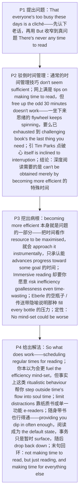

# Deep Reading 精读笔记

## 背景

本文是 **2016 年考研英语（一）Text 3**（第 31—35 题），主题是**"如何在忙碌中为深度阅读找到时间"**：作者先认下"人人都太忙"这句**陈词滥调（cliché）**，却把话锋收窄到唯一的真问题——**"永远没有时间读书"**；接着否掉两套流行办法（网上满是的 `"Give up TV"`、`"Carry a book with you at all times"`，以及**时间管理技巧**），理由是**深度阅读需要的不是"更多时间"，而是一种"靠变得更高效根本得不到的特殊时间"（`a special kind of time which can't be obtained merely by becoming more efficient`）**。末段给出解法：**把阅读固定排进日程**（这类"仪式化行为"帮人"走出时间的流动"，进入"灵魂时间"）、**只读纸质书或单一功能电子阅读器**以限制干扰，以及**让阅读成为"默认状态"**——**你只是暂时浮上来处理事务，随后再沉回去**。

文章是一篇**专栏评论（说理散文）**，作者**第一人称在场、立场鲜明**（`But in my experience`、`No mind-set could be worse`），与"客观报道"型文章不同：**它先驳（两套流行做法都不管用），再挖病根（把时间当成有待最大化的资源），最后立论（让阅读成为默认状态）**。全篇的论证支柱是**两处引语**——**小说家兼批评家 Tim Parks** 点破"**问题不只是人被打断了，而是人本身就倾向于被打断**"；**Gary Eberle**（《神圣的时间》作者）用"**传送带上的空瓶子**"的隐喻说明"**我们感到一种压力，要把经过的每只瓶子装满，否则就算把它们浪费掉了**"。

作者的论证分四步推进：

1. **提出问题（P1）**：`That everyone's too busy these days is a cliché.` 先认下"人人都忙"这句老话，再用 `But` 把话锋收窄到真问题——`There's never any time to read`。
2. **驳倒"时间管理"（P2）**：`What makes the problem thornier is that the usual time-management techniques don't seem sufficient.` 网上满是 `tips on making time to read`，但作者以自身经验否掉：`using such methods to free up the odd 30 minutes doesn't work`——**一坐下来，与工作相关的思绪这台 `flywheel`（飞轮）就转个不停，要么你已经累到一本烧脑的书恰是"你最不需要的"**；引 Parks 之语把问题推到"**心本身倾向于被打断**"；收在核心判断上——`Deep reading requires not just time, but a special kind of time which can't be obtained merely by becoming more efficient.`
3. **挖出病根（P3）**：`In fact, "becoming more efficient" is part of the problem.` 因为**把时间看成"有待最大化的资源"，就意味着你以工具化的方式对待它**——`judging any given moment as well spent only in so far as it advances progress toward some goal`；而 `Immersive reading, by contrast` 恰恰要你**愿意冒低效、无目标、甚至浪费时间的风险**。`Try to slot it in as a to-do list item and you'll manage only goal-focused reading`——**把阅读塞进待办清单，得到的只会是"以目标为导向的阅读"**。Eberle 的"空瓶子 / 传送带"隐喻在此登场，末句定性：`No mind-set could be worse for losing yourself in a book.`
4. **给出解法（P4）**：`So what does work? Perhaps surprisingly, scheduling regular times for reading.`——**你本以为这更会助长"效率至上"，但事实上这类"仪式化行为"帮我们进入"灵魂时间"**；可以 `limit distractions` by reading only physical books, or on single-purpose e-readers；而 `"Carry a book with you at all times"` **其实也行得通——只要你常去读上几页**，让阅读成为 `the default state`：**你只是暂时 `surface`（浮上来）处理事务，随后 `drop back down`（沉回去）**。末句收在**首尾呼应的回环**上：`it no longer feels as if you're "making time to read," but just reading, and making time for everything else.`

> [!abstract] 文章概要
> 全文用**"提出问题 → 驳倒时间管理 → 挖出病根 → 给出解法"**四步推进，属于**驳论型专栏评论**：先立起"没时间读书"这一具体抱怨，再拆掉两套流行办法（**时间管理技巧**与**随身带书**），随即把矛头转向**"把时间当成有待最大化的资源"这一思维定式**——它在"工具化"的尺度下只承认能推进目标的时间，而**沉浸式阅读恰恰要求你愿意低效、无目标、甚至浪费时间**；最后给出解法，把**排进日程的"仪式化行为" → 灵魂时间 → 阅读成为默认状态 → 事务只是临时上浮**串成一条链。抓住这条链条，**第 31 题（驳论理由）、第 33 题（引语主张）、第 34 题（默认状态下的"本体与例外"）**三题的位置就一目了然。

- **难度**：intermediate
- **体裁**：专栏评论（commentary）——**驳论型说理散文**
- **题源**：2016 年考研英语（一）Text 3（第 31—35 题）

| 题号 | 31 | 32 | 33 | 34 | 35 |
|------|----|----|----|----|----|
| 答案 | D | B | D | A | C |
| 定位 | P2 `can't be obtained merely by becoming more efficient` | P3 Eberle 引语 `fill ... as they pass` | P4 `helps us "step outside time's flow" into "soul time"` | P4 `reading becomes the default state ... before dropping back down` | 首段 `never any time to read` ↔ 末段 `making time for everything else` |

> [!note] 本篇的三组关键对立
> ① **"深度阅读" vs "以目标为导向的阅读"**：`deep reading` / `immersive reading`（作者要保护的）对 `goal-focused reading`（"有用，但不是最令人满足的一种"）。区别不在时间多少，而在**你是否允许这段时间"没有目标"**——第 31 题正压在这一对立上。
> ② **"把时间当资源最大化" vs "把阅读当默认状态"**：前者要求**每一刻都能折算成目标进度**（`judging any given moment as well spent only in so far as ...`），后者要求**阅读是常态、事务才是偶尔上浮的例外**（`the default state from which you temporarily surface ... before dropping back down`）。第 34 题的 [A] 与 [C] 之争，就是这两种读法的分水岭。
> ③ **"你本以为" vs "事实上"**：`You'd think this might fuel the efficiency mind-set, but in fact ...`——本篇最典型的态度转折句式，**前半句是被否定的预期，后半句才是真实主张**；第 33 题的 [B]（encourage the efficiency mind-set）之所以错，正因它停在了"你本以为"那一半。

---

## 文章原文

# 2016 Passage 3

That everyone's **too busy** these days is a ==cliché==.

> [!abstract]- 长难句分析
> **原句**：That everyone's **too busy** these days is a ==cliché==.
>
> **主干提取**：
>
> - 主语 S: That everyone's too busy these days（"如今人人都太忙"这一说法）— 主语从句
> - 系动词 V: is（是）
> - 表语 C: a cliché（一句陈词滥调）
> - 引导词: that（引导主语从句，不作任何成分，不可省略）
>
> **修饰成分**：
>
> | 类型 | 引导词 | 修饰对象 |
> |------|--------|----------|
> | 名词性从句（主语从句） | that | 整句主语（"……这件事"） |
> | 程度修饰（副词） | too | busy（"过于忙"） |
> | 时间状语 | these days | everyone's too busy（"如今"） |
>
> **结构图解**：
>
> ```
> 主句: (that 主语从句) + is + a cliché
>   └── 主语从句: that + everyone + is + too busy + these days
> ```
>
> **参考译文**：如今人人都太忙，这已是一句陈词滥调。
>
> **考点提示**：① **句首 that 主语从句**：`That ... is ...` 中的 that 只起引导作用、不作任何成分，**但不能省略**——一旦省略，读者会先把 `everyone` 当成主句主语，读到 `is` 才发现要回头重读。② **主谓一致**：主语从句整体作主语，谓语一律用**单数** is。③ **`cliché` 带重音符号**，读 /ˈkliːʃeɪ/，意为"陈词滥调"，**含贬义**——作者用它暗示"'忙'这个借口已经被说滥了"，为下一句"真正的抱怨其实是没时间读书"作铺垫。④ **首段立论句**：先承认"人人都忙"是老生常谈，再用 `But`（下一句）转到具体抱怨，第 35 题标题题的"提出问题"由此起步。

But one specific complaint is made especially **mournfully**: There's never any time to read.

What makes the problem **thornier** is that the usual **time-management** techniques don't seem sufficient.

> [!abstract]- 长难句分析
> **原句**：What makes the problem **thornier** is that the usual **time-management** techniques don't seem sufficient.
>
> **主干提取**：
>
> - 主语 S: What makes the problem thornier（让问题更加棘手的东西）— 主语从句
> - 系动词 V: is（是）
> - 表语 C: that the usual time-management techniques don't seem sufficient（通常的时间管理技巧似乎并不够用）— 表语从句
> - 从句主语 S: the usual time-management techniques（通常的时间管理技巧）
> - 从句谓语 V: don't seem（似乎不）
> - 从句表语 C: sufficient（足够的）
>
> **修饰成分**：
>
> | 类型 | 引导词 | 修饰对象 |
> |------|--------|----------|
> | 名词性从句（主语从句） | what | 整句主语（what 在从句中作 makes 的主语） |
> | 名词性从句（表语从句） | that | is 之后的表语（解释"棘手的是什么"） |
> | 名词修饰（复合名词作定语） | time-management | techniques（"时间管理的"技巧） |
> | 程度修饰（形容词比较级） | thornier（thorny 的比较级） | the problem（"更加棘手"） |
>
> **结构图解**：
>
> ```
> 主句: (what 主语从句) + is + (that 表语从句)
>   ├── 主语从句: What + makes + the problem + thornier
>   └── 表语从句: that + the usual time-management techniques + don't seem + sufficient
> ```
>
> **参考译文**：让问题更加棘手的是，通常的时间管理技巧似乎并不够用。
>
> **考点提示**：① **what 与 that 的分工**：`what` 在从句中**充当成分**（这里是 makes 的主语，"让问题更棘手的东西"），`that` **只引导、不充当任何成分**——这是名词性从句最常考的一对区别。② **两个从句夹一个 is，谓语仍用单数**：从句作主语一律按单数处理。③ **`thornier` 是 thorny 的比较级**（y → i + er），意为"更棘手的"；比较对象未明说，但隐含"问题本来就麻烦，现在更麻烦"。④ **本句是第 31 题的提问源头**：题干 `The usual time-management techniques don't work because ____` 直接来自 `don't seem sufficient`；而正确项 [D] 的落点在第 6 句的 `can't be obtained`——**两句必须连读，才能把"不够用"与"弄不到"连成完整因果**。

The web's full of articles offering tips on making time to read: "Give up TV" or "Carry a book with you at all times."

But in my experience, using such methods to free up the odd 30 minutes doesn't work.

Sit down to read and the **flywheel** of work-related thoughts keeps spinning—or else you're so **exhausted** that a challenging book's the last thing you need.

> [!abstract]- 长难句分析
> **原句**：Sit down to read and the **flywheel** of work-related thoughts keeps spinning—or else you're so **exhausted** that a challenging book's the last thing you need.
>
> **主干提取**：
>
> - 分句一（祈使句 + and ＝条件句）: Sit down to read and the flywheel of work-related thoughts keeps spinning
> - 分句一主语 S: the flywheel of work-related thoughts（与工作相关的思绪这台"飞轮"）
> - 分句一谓语 V: keeps spinning（转个不停）
> - 分句二主语 S: you（你）
> - 分句二系动词 V: are（处于……状态）
> - 分句二表语 C: so exhausted（如此疲惫）
> - 结果状语从句: that a challenging book's the last thing you need（以至于一本烧脑的书是你最不需要的）
>
> **修饰成分**：
>
> | 类型 | 引导词 | 修饰对象 |
> |------|--------|----------|
> | 条件（祈使句 + and，等价 if 条件句） | Sit down to read and | 整个分句一（"（一旦）坐下来读书，（那么）……"） |
> | 并列 / 选择（连词） | or else | 引出另一种可能（"要么就是……"） |
> | 结果状语从句 | so ... that | exhausted（"累到……的地步"） |
> | 非谓语（不定式作目的状语） | to read | Sit down（"坐下来是为了读书"） |
> | 同位修饰（复合形容词作前置定语） | work-related | thoughts（"与工作相关的"） |
>
> **结构图解**：
>
> ```
> 并列复合句:
> ├── 分句一: (Sit down to read) + and + the flywheel of work-related thoughts + keeps spinning
> └── 分句二: or else + you + are + so exhausted
>       └── 结果状语从句: that + a challenging book + is + the last thing (that) you need
> ```
>
> **参考译文**：你一坐下来读书，与工作相关的思绪就像飞轮一样转个不停——要么就是你已经疲惫不堪，一本烧脑的书恰恰是你最不需要的东西。
>
> **考点提示**：① **"祈使句 + and + 陈述句" ＝ 条件句**：`Sit down to read and ...` 相当于 `If you sit down to read, ...`。**and 之前是条件，and 之后是结果**，绝不能读成"坐下来读书，并且……"两条并列命令。② **`or else` 引出"另一种同样糟糕的可能"**：作者给的是**两条死路**（思绪停不下来 / 已经累到读不动），而不是一条。③ **`so ... that ...` 中 that 引导结果状语从句**；`a challenging book's` 是 `a challenging book is` 的缩写。④ **`the last thing you need` ＝"你最不需要的"**（字面"你最后需要的东西"），属**伪装否定**，同族表达还有 `the last person I'd trust`（我最不想信任的人）。⑤ **`flywheel`（飞轮）** 喻思绪**一旦转起来便带惯性、停不下来**——这个喻体与后文 Eberle 的"传送带"相互呼应，共同构成"时间与思绪都在自动运转"的意象。

The modern mind, Tim Parks, a novelist and critic, writes, "is **overwhelmingly** inclined toward communication... It is not simply that one is interrupted; it is that one is actually inclined to interruption."

> [!abstract]- 长难句分析
> **原句**：The modern mind, Tim Parks, a novelist and critic, writes, "is **overwhelmingly** inclined toward communication... It is not simply that one is interrupted; it is that one is actually inclined to interruption."
>
> **主干提取**：
>
> - 主语 S: The modern mind（现代人的心智）
> - 谓语 V: is（处于……状态）
> - 表语 C: overwhelmingly inclined toward communication（压倒性地倾向于交流）
> - 插入语（引述分句 + 身份同位语）: Tim Parks, a novelist and critic, writes（小说家兼批评家蒂姆·帕克斯写道）
> - 对举结构一: It is not simply that one is interrupted（问题不只是人被打断了）
> - 对举结构二: it is that one is actually inclined to interruption（而是人本身就倾向于被打断）
>
> **修饰成分**：
>
> | 类型 | 引导词 | 修饰对象 |
> |------|--------|----------|
> | 插入语（引述分句，主谓倒装） | writes | 提示整句内容为直接引语（"……写道"） |
> | 同位语（身份说明） | a novelist and critic | Tim Parks（"小说家兼批评家"） |
> | 对举结构（前否定） | It is not simply that ... | 弱化第一种解释（"不只是……"） |
> | 对举结构（后肯定，重心所在） | it is that ... | 强调第二种解释（"而是……"） |
> | 程度修饰（副词） | overwhelmingly | inclined（"压倒性地"） |
> | 泛指代词（表"人、我们"） | one | is interrupted / is inclined（泛指任何人） |
>
> **结构图解**：
>
> ```
> 主句: The modern mind + (—Tim Parks, a novelist and critic, writes—) + is + overwhelmingly inclined toward communication
>   └── 引语内部对举: It is not simply that + one is interrupted
>                     ; it is that + one is actually inclined to interruption
> ```
>
> **参考译文**：小说家兼批评家蒂姆·帕克斯写道，现代人的心智"压倒性地倾向于交流……问题不只是人被打断了，而是人本身就倾向于被打断"。
>
> **考点提示**：① **插入语切断主谓**：主语 `The modern mind` 之后插入整整一块 `, Tim Parks, a novelist and critic, writes,`，谓语 `is` 被推到很远——**读时必须先跳过插入语，把主谓接上**。② **引述倒装**：`writes` 提前、主语 Tim Parks 后置，是书面语常见的引述句式。引号内的 `"is ..."` **不是新句子，而是 The modern mind 的谓语延续**。③ **`It is not simply that ...; it is that ...` 是对举强调，重心在后半句**：作者把"被打断"（外部原因）降格为次要，把"倾向于被打断"（内部倾向）升格为要害。④ **`inclined toward communication` 与 `inclined to interruption` 介词不同**（toward / to），但都表"倾向于"——两句并列点出：**现代人的心智既向往交流，也就天然向往被打断**。⑤ **本句是全篇驳论的支点**：正因问题出在"心智倾向"而非"外部打断"，时间管理技巧（关手机、戒电视）才治不了本——**第 31 题的正确项就沿着这条逻辑展开**。

**Deep reading** requires not just time, but a special kind of time which can't be obtained merely by becoming more **efficient**.

> [!abstract]- 长难句分析
> **原句**：**Deep reading** requires not just time, but a special kind of time which can't be obtained merely by becoming more **efficient**.
>
> **主干提取**：
>
> - 主语 S: Deep reading（深度阅读）
> - 谓语 V: requires（需要）
> - 宾语 O: not just time, but a special kind of time（不只是时间，而是一种特殊的时间）
> - 定语从句（修饰 a special kind of time）: which can't be obtained merely by becoming more efficient
> - 从句主语 S: which（＝ a special kind of time）
> - 从句谓语 V: can't be obtained（无法被获得）
> - 方式状语 A: merely by becoming more efficient（仅仅靠变得更高效）
>
> **修饰成分**：
>
> | 类型 | 引导词 | 修饰对象 |
> |------|--------|----------|
> | 平行结构（递进，重心在后） | not just ... but ... | time / a special kind of time（"不只是……而是……"） |
> | 定语从句 | which | a special kind of time（"那种……的时间"） |
> | 被动语态 | be obtained | which（突出"被获得"而非"谁获得"） |
> | 方式状语（介词 + 动名词） | by becoming | can't be obtained（"靠变得……"） |
> | 程度限制（副词） | merely | by becoming more efficient（"仅仅"） |
>
> **结构图解**：
>
> ```
> 主句: Deep reading + requires + (not just time, but a special kind of time)
>   └── 定语从句: which + can't be obtained + merely by becoming more efficient
> ```
>
> **参考译文**：深度阅读需要的不仅仅是时间，而是一种特殊的时间——这种时间无法仅仅靠变得更高效就能获得。
>
> **考点提示**：① **`not just A but B` 是"递进式否定 + 肯定"，语义重心在 B**：作者不是说"既要时间也要效率"，而是说"**时间不够，需要的是另一种时间**"，并且这种时间**恰恰不是效率能换来的**。② **`which` 定语从句较长，须先读完从句再回主语**；从句用**被动语态** `can't be obtained`，**隐去施动者**，暗示"没有人能靠效率化把它取得"（是客观限制，而非某人不给）。③ **`merely` 是关键限定词**：它把"变高效"的作用**压到最低**（"仅仅"）；若删掉，句子会被误读为"变高效有点用但不够"——**原意更绝：根本得不到**。④ **本句是第 31 题正确项 [D] `what deep reading requires cannot be guaranteed` 的原句出处**：`can't be obtained` ↔ `cannot be guaranteed`（无法获得 ＝ 无法得到保证），**同义改写要一眼认出**。⑤ 与上文第 5 句合看：**问题出在心智倾向（内因）→ 效率化解决不了 → 深度阅读需要特殊时间（结论）**，这是第 2 段的完整论证链。

In fact, "becoming more efficient" is part of the problem.

Thinking of time as a resource to be **maximised** means you approach it **instrumentally**, judging any given moment as well spent only **in so far as** it advances progress toward some goal.

> [!abstract]- 长难句分析
> **原句**：Thinking of time as a resource to be **maximised** means you approach it **instrumentally**, judging any given moment as well spent only **in so far as** it advances progress toward some goal.
>
> **主干提取**：
>
> - 主语 S: Thinking of time as a resource to be maximised（把时间看作一种有待最大化的资源）— 动名词短语
> - 谓语 V: means（意味着）
> - 宾语从句 O（省略 that）: you approach it instrumentally（你以工具化的方式对待它）
> - 从句主语 S: you
> - 从句谓语 V: approach
> - 从句宾语 O: it（＝ time）
> - 方式状语 A: instrumentally（工具性地）
> - 伴随状语: judging any given moment as well spent only in so far as it advances progress toward some goal
>
> **修饰成分**：
>
> | 类型 | 引导词 | 修饰对象 |
> |------|--------|----------|
> | 非谓语（动名词短语作主语） | Thinking of | 整句主语（"把……看作……"） |
> | 非谓语（不定式被动作后置定语） | to be maximised | a resource（"有待被最大化的"资源） |
> | 宾语从句（省略 that） | —（省略） | means（解释"意味着什么"） |
> | 非谓语（现在分词作伴随状语） | judging | you approach it（"同时把……判定为……"） |
> | 宾语补足语（judge A as B） | as | any given moment（"把某刻判定为……"） |
> | 条件 / 程度状语从句 | in so far as | 限定"判定有价值"的条件（"只要……"） |
> | 介词短语（方向） | toward | advances progress（"朝某个目标"） |
>
> **结构图解**：
>
> ```
> 主句: (Thinking of time as a resource to be maximised) + means + (you approach it instrumentally)
>   ├── 动名词主语: Thinking of + time + as + a resource (to be maximised)
>   └── 宾语从句: you + approach + it + instrumentally
>         └── 伴随状语: judging + any given moment + as + well spent + (only in so far as ...)
>               └── 条件 / 程度状语从句: in so far as + it + advances + progress toward some goal
> ```
>
> **参考译文**：把时间看作一种有待最大化的资源，意味着你以工具化的方式对待它：只有当某个时刻推动你朝某个目标前进时，你才判定它过得有价值。
>
> **考点提示**：① **动名词短语作主语**：`Thinking of time as a resource ...` 整体是主语，谓语用**单数** means。② **`to be maximised` 是"不定式被动作后置定语"**，修饰 resource（"一种有待被最大化的资源"），**不可读成目的状语**。③ **`means` 后省略 that 的宾语从句**——`means you approach it instrumentally`，翻译时须补出"意味着（你……）"。④ **`judging ...` 是现在分词作伴随状语**，逻辑主语 ＝ you，与 approach 同时发生。⑤ **`in so far as`（＝ insofar as）是连词性短语，意为"只要、在……的范围内"**，引导**条件 / 程度状语从句**，把"这一时刻有价值"的判断**严格收窄在"能推进目标"之内**——**这是考研高频伪装连词，绝不能读成"到目前为止"**。⑥ `advance` 此处是**动词**"推动、促进"，不是形容词"提前的"。⑦ **本句是全篇的"病根诊断"句**：问题不是"你太忙"，而是"**你只承认能换回目标的时间才有价值**"——**第 31、33 题中带 efficiency mind-set 的干扰项都源自这里**。

**Immersive** reading, by contrast, depends on being willing to risk **inefficiency**, **goallessness**, even time-wasting.

Try to slot it in as a to-do list item and you'll manage only **goal-focused** reading—useful, sometimes, but not the most **fulfilling** kind.

"The future comes at us like empty bottles along an **unstoppable** and nearly **infinite** **conveyor belt**," writes Gary Eberle in his book *Sacred Time*, and "we feel a pressure to fill these different-sized bottles (days, hours, minutes) as they pass, for if they get by without being filled, we will have wasted them."

> [!abstract]- 长难句分析
> **原句**："The future comes at us like empty bottles along an **unstoppable** and nearly **infinite** **conveyor belt**," writes Gary Eberle in his book *Sacred Time*, and "we feel a pressure to fill these different-sized bottles (days, hours, minutes) as they pass, for if they get by without being filled, we will have wasted them."
>
> **主干提取**：
>
> - 引语一主语 S: The future（未来）
> - 引语一谓语 V: comes at us（向我们袭来）
> - 引语一方式状语（明喻）: like empty bottles along an unstoppable and nearly infinite conveyor belt（像空瓶子一样，沿着一条无法停止、近乎无限的传送带）
> - 引述插入语: writes Gary Eberle in his book Sacred Time（加里·埃伯利在《神圣的时间》中写道）— 主谓倒装
> - 引语二主语 S: we（我们）
> - 引语二谓语 V: feel（感到）
> - 引语二宾语 O: a pressure to fill these different-sized bottles (days, hours, minutes)（一种要把这些大小不一的瓶子装满的压力）
> - 引语二时间状语从句: as they pass（在它们经过时）
> - 引语二原因分句: for if they get by without being filled, we will have wasted them
> - 原因分句条件状语从句: if they get by without being filled（如果它们没被装满就过去了）
> - 原因分句主句: we will have wasted them（我们就算把它们浪费掉了）
>
> **修饰成分**：
>
> | 类型 | 引导词 | 修饰对象 |
> |------|--------|----------|
> | 明喻（simile） | like | The future comes at us（"像……一样"） |
> | 引述分句（主谓倒装） | writes | 提示为直接引语（"……写道"） |
> | 介词短语（出处） | in his book | writes（"在他的书里"） |
> | 书名（斜体标注） | *Sacred Time* | 书名《神圣的时间》 |
> | 非谓语（不定式作后置定语） | to fill | a pressure（"要把……装满的"压力） |
> | 时间状语从句 | as | fill these bottles（"在它们经过时"） |
> | 并列连词（表原因） | for | 引出原因分句（＝ because） |
> | 条件状语从句 | if | 限定"浪费"成立的条件 |
> | 将来完成时 | will have wasted | 表"到那时就已经浪费掉了" |
> | 插入语（括号补充） | (days, hours, minutes) | different-sized bottles（说明"大小"指什么） |
>
> **结构图解**：
>
> ```
> 引语一: The future + comes at us + like empty bottles along an unstoppable and nearly infinite conveyor belt
> 引述插入语: writes + Gary Eberle + in his book Sacred Time
> 引语二: we + feel + a pressure (to fill these different-sized bottles ...)
>   ├── 时间状语从句: as + they + pass
>   └── 原因分句: for + (if + they + get by + without being filled), + we + will have wasted + them
> ```
>
> **参考译文**：加里·埃伯利在《神圣的时间》一书中写道，"未来像空瓶子一样，沿着一条无法停止、近乎无限的传送带向我们涌来"；他还说，"我们感到一种压力，要在这些大小不一的瓶子（天、小时、分钟）经过时把它们装满，因为如果它们没被装满就过去了，我们就算把它们浪费掉了"。
>
> **考点提示**：① **`writes Gary Eberle in his book Sacred Time` 是引述倒装**（谓语在前、主语在后），并且它把**两段引语缝在一起**（由 and 连接）——读时须知：中间那一句是"作者标签"，**不属于引语内容**。② **`like empty bottles ...` 是明喻**，喻体为"传送带上的空瓶子"：**瓶子 ＝ 时间单位，传送带 ＝ 时间的流逝，装瓶子 ＝ 把时间填满**。③ **`for` 是并列连词表原因（＝ because）**，**绝不能读成介词"为了"**——判据：for 后面跟的是**完整的"主语 + 谓语"分句**，那就是连词。④ **`get by` 此处是"经过、通过"**（主语是 bottles，瓶子不会"勉强过活"）——**熟词生义**。⑤ **`will have wasted` 是将来完成时**："（等它们过去时）我们就已经把她们浪费掉了"——**用完成时把"未来的浪费"说成既定事实**，加重焦虑感。⑥ **本句是第 32 题正确项 [B] `make passing time fulfilling` 的出处**：`fill ... as they pass` ↔ `make passing time fulfilling`（fill ↔ make fulfilling；as they pass ↔ passing time）；干扰项 [A] 的 `to-do lists` 则是从上一句"抄词错位"来的。⑦ 紧接的下一句 `No mind-set could be worse ...` **对本句作出评价**：这种"必须把每只瓶子装满"的心态，正是**让人无法沉浸于书中的最糟心态**。

No **mind-set** could be worse for **losing yourself** in a book.

So what does work?

Perhaps surprisingly, **scheduling** regular times for reading.

You'd think this might **fuel** the efficiency mind-set, but in fact, Eberle notes, such **ritualistic** behaviour helps us "step outside time's flow" into "soul time."

> [!abstract]- 长难句分析
> **原句**：You'd think this might **fuel** the efficiency mind-set, but in fact, Eberle notes, such **ritualistic** behaviour helps us "step outside time's flow" into "soul time."
>
> **主干提取**：
>
> - 分句一主语 S: You（你）
> - 分句一谓语 V: 'd think（＝ would think，"会以为"）
> - 分句一宾语从句 O（省略 that）: this might fuel the efficiency mind-set（这也许会助长效率至上的心态）
> - 转折连词: but（但）
> - 分句二主语 S: such ritualistic behaviour（这类仪式化的行为）
> - 分句二谓语 V: helps（帮助）
> - 分句二宾语 O: us（我们）
> - 分句二宾语补足语 C: (to) step outside time's flow into soul time（走出时间的流动，进入"灵魂时间"）
> - 插入语: Eberle notes（埃伯利指出）
>
> **修饰成分**：
>
> | 类型 | 引导词 | 修饰对象 |
> |------|--------|----------|
> | 反预期标记（反事实惯用式） | You'd think | 全句（"你（本）会以为……"） |
> | 宾语从句（省略 that） | —（省略） | think（说明"你以为的内容"） |
> | 情态动词（表推测） | might | fuel（"也许会"） |
> | 插入语（出处提示） | Eberle notes | 提示下文为埃伯利的观点 |
> | 转折（与前句预期相反） | but in fact | 否定上句预期（"但事实上"） |
> | 宾语补足语（help sb. (to) do） | helps | us（"帮助我们……"） |
> | 引号（术语标注） | "..." | time's flow / soul time（作者借用的专门说法） |
>
> **结构图解**：
>
> ```
> 并列句:
> ├── 分句一: (You'd think) + (this might fuel the efficiency mind-set)
> │     └── 宾语从句: this + might fuel + the efficiency mind-set
> └── 分句二: but in fact + (Eberle notes) + such ritualistic behaviour + helps + us + (to step outside time's flow into soul time)
> ```
>
> **参考译文**：你可能会以为这会助长效率至上的心态，但埃伯利指出，事实上这类仪式化的行为帮助我们"走出时间的流动"，进入"灵魂时间"。
>
> **考点提示**：① **`You'd think ... but in fact ...` 是考研阅读最典型的"反预期"结构**：**前半句是被否定的预期，后半句才是作者 / 引者的真实主张**。凡见 `You'd think / It might seem / One would expect` + `but` 的句型，**答案永远在后半句**。② **`You'd think` ＝ `You would think`**，是**反事实的惯用式**（"你本来会这么以为"），不是过去时。③ **`Eberle notes` 是插入语**，把主语 `such ritualistic behaviour` 与谓语 `helps` 隔开——**读时跳过**，并注意 notes 后省略了 that 的宾语从句。④ **`fuel` 此处是动词"助长、加剧"**（熟词生义，非名词"燃料"），且**语气是"你以为是助长，其实不是"**。⑤ **`help sb. (to) do` 中 to 可省**；`step outside time's flow into soul time` 是**两个引号术语连用**——`time's flow`（时间的流动，受钟表支配）与 `soul time`（灵魂时间，不受钟表支配）**构成对照**。⑥ **本句是第 33 题的定位句**：正确项 [D] `achieve immersive reading` 对应"**进入灵魂时间**"这一目的；干扰项 [A] `promote ritualistic reading` 抄了 `ritualistic`，却把**手段**说成了**目的**；[B] `encourage the efficiency mind-set` 则被 `but in fact` **明确否定**。

You could limit **distractions** by reading only physical books, or on single-purpose **e-readers**.

"Carry a book with you at all times" can actually work, too—**providing** you dip in often enough, so that reading becomes the **default state** from which you temporarily **surface** to take care of business, before **dropping back down**.

> [!abstract]- 长难句分析
> **原句**："Carry a book with you at all times" can actually work, too—**providing** you dip in often enough, so that reading becomes the **default state** from which you temporarily **surface** to take care of business, before **dropping back down**.
>
> **主干提取**：
>
> - 主语 S: "Carry a book with you at all times"（"随身带一本书"这一做法）
> - 谓语 V: can actually work（其实也能行得通）
> - 条件状语从句: providing you dip in often enough（只要你常去读上几页）
> - 结果状语从句: so that reading becomes the default state ...（这样阅读就成为你的默认状态）
> - 从句主语 S（结果从句）: reading（阅读）
> - 从句系动词 V: becomes（成为）
> - 从句表语 C: the default state（默认状态）
> - 定语从句（修饰 the default state）: from which you temporarily surface to take care of business, before dropping back down
>
> **修饰成分**：
>
> | 类型 | 引导词 | 修饰对象 |
> |------|--------|----------|
> | 条件状语从句 | providing (that) | 主句 can work（"只要……"） |
> | 结果状语从句 | so that | 条件从句（"这样……"） |
> | 定语从句（介词 + which） | from which | the default state（"从这种状态中……"） |
> | 非谓语（不定式作目的状语） | to take care of | surface（"为了处理事务"） |
> | 时间状语（before + 动名词） | before dropping | surface to take care of business（"在重新沉回去之前"） |
> | 破折号（引出条件） | — | 提示后文是主句成立的条件 |
> | 程度修饰（加强语气） | actually | can work（"其实真的"） |
>
> **结构图解**：
>
> ```
> 主句: "Carry a book with you at all times" + can actually work, too
>   └── 条件状语从句: providing + you + dip in + often enough
>         └── 结果状语从句: so that + reading + becomes + the default state
>               └── 定语从句: from which + you + temporarily surface + to take care of business
>                     └── 时间状语: before + dropping back down
> ```
>
> **参考译文**："随身带一本书"其实也行得通——只要你常去读上几页，让阅读成为你的默认状态：你只是暂时浮上来处理事务，随后再沉回去。
>
> **考点提示**：① **`providing (that)` 是条件连词，＝ if / provided that**，**不是"提供"**——判据：`providing` 后面直接跟**主谓结构**，即为连词；这也解释了破折号的作用：**引出使主句成立的条件**。② **`so that` 在此引导结果状语从句**（"这样……"），不是目的——因为前有条件句，逻辑上是"条件 → 结果"。③ **`from which` 是"介词 + which"引导的定语从句**，修饰 the default state（"从这种默认状态中"），**from 不可省**。④ **`surface` 与 `drop back down` 是本文最精妙的一组隐喻动词**：`surface` ＝ 浮出水面（临时上浮处理事务），`drop back down` ＝ 重新沉下去（**回到阅读**）。⑤ **本体与例外的关系是第 34 题的胜负手**：**阅读 ＝ 默认状态（主业），事务 ＝ 临时的例外（上浮）**。正确项 [A] `reading becomes your primary business of the day` 正对应这一点；干扰项 [C] `you are able to drop back to business after reading` 把 `drop back down`（沉回去**读书**）偷换成"**回到事务**"，**整个颠倒了本体与例外**——**看到选项复现原文短语，务必核对"沉回去"的落点是谁**。⑥ `dip in` ＝"（翻开书）随便读几页"（熟词生义）；`at all times` ＝"随时、始终"。

On a really good day, it no longer feels as if you're "making time to read," but just reading, and making time for everything else.

> [!abstract]- 长难句分析
> **原句**：On a really good day, it no longer feels as if you're "making time to read," but just reading, and making time for everything else.
>
> **主干提取**：
>
> - 主语 S: it（指代整体情形）
> - 谓语 V: feels（感觉起来）
> - 表语从句: as if you're "making time to read," but just reading, and making time for everything else
> - 从句主语 S: you（你）
> - 从句系动词 V: are（正在）
> - 从句表语 C: making time to read / just reading / making time for everything else（三个并列）
> - 时间状语 A: On a really good day（碰上真正的好日子）
>
> **修饰成分**：
>
> | 类型 | 引导词 | 修饰对象 |
> |------|--------|----------|
> | 时间状语 | On a really good day | 全句（"碰上好日子时"） |
> | 表语从句 | as if | feels（"感觉好像……"） |
> | 对举结构（状态转变） | no longer ... but ... | making time to read / just reading（"不再是……而只是……"） |
> | 现在进行时（三处并列） | are making / are reading / are making | 表"当下正在做的事" |
> | 回环对照（与开头并置） | making time for everything else | 与 making time to read 形成对照 |
> | 程度修饰 | really / just | good day / reading（"真正的"好日子；"仅仅是"读书） |
>
> **结构图解**：
>
> ```
> 主句: (On a really good day) + it + feels + (as if 表语从句)
>   └── 表语从句: as if + you + are + (not) making time to read
>                               + but + just reading
>                               + and + making time for everything else
> ```
>
> **参考译文**：碰上真正的好日子，你就不再觉得自己是在"挤出时间读书"，而只是在读书，并且为其他一切腾出时间。
>
> **考点提示**：① **`feel as if ...` 是"感觉好像……"，as if 引导表语从句**（跟在系动词 feels 之后），**不是状语从句**。② **`no longer ... but ...` 构成对举，语义重心在后**："不再是（挤出时间读书），而只是（读书）"。③ **三个并列成分的层次**：`(not) making time to read` → `but just reading` → `and making time for everything else`；其中**最后的 `making time for everything else` 与开头的 `making time to read` 形成回环**——**读书不再是"挤出来的事"，其他事才需要"挤时间"**。④ **这是全篇的收束句，与首段遥相呼应**：首段说 `There's never any time to read`（没时间读书），末句说 `making time for everything else`（为其他事腾时间）——**问题与答案互为镜像**。⑤ **它是第 35 题标题题的依据**：正确项 [C] `How to Find Time to Read` 正是这条"首尾呼应"的主线；干扰项 [B] `How to Set Reading Goals` 与作者批判的 `goal-focused reading` **同向**，恰恰是被否定的那一路。

---

## 题目

### 31. The usual time-management techniques don't work because ____.

- [A] what they can offer does not ease the modern mind
- [B] what people often forget is carrying a book with them
- [C] what challenging books demand is repetitive reading
- [D] what deep reading requires cannot be guaranteed

### 32. The "empty bottles" metaphor illustrates that people feel a pressure to ____.

- [A] update their to-do lists
- [B] make passing time fulfilling
- [C] carry their plans through
- [D] pursue carefree reading

### 33. Eberle would agree that scheduling regular times for reading helps ____.

- [A] promote ritualistic reading
- [B] encourage the efficiency mind-set
- [C] develop online reading habits
- [D] achieve immersive reading

### 34. "Carry a book with you at all times" can work if ____.

- [A] reading becomes your primary business of the day
- [B] all the daily business has been promptly dealt with
- [C] you are able to drop back to business after reading
- [D] time can be evenly split for reading and business

### 35. The best title for this text could be ____.

- [A] How to Enjoy Easy Reading
- [B] How to Set Reading Goals
- [C] How to Find Time to Read
- [D] How to Read Extensively

## 翻译对照

# 2016 Passage 3 中英对照翻译

## Paragraph 1

That everyone's too busy these days is a cliché. But one specific complaint is made especially mournfully: There's never any time to read.

如今人人都太忙，这已是一句陈词滥调。但有一种抱怨被格外哀怨地反复提起：永远没有时间读书。

> [!note] 翻译说明
> `That everyone's too busy these days is a cliché.` 的主语是**主语从句** `That everyone's too busy these days`，谓语为 `is`。`cliché` 是"陈词滥调、老生常谈"（注意拼写与重音在第二个音节）。
> `one specific complaint is made especially mournfully` 是**被动语态**，`mournfully`（哀怨地）为方式状语；翻译时补出"被反复提起"以符合中文表达习惯。
> 冒号后的 `There's never any time to read.` 是**同位语性说明**（解释前面那个 complaint 的内容），中文用冒号直接引出即可。

## Paragraph 2

What makes the problem thornier is that the usual time-management techniques don't seem sufficient. The web's full of articles offering tips on making time to read: "Give up TV" or "Carry a book with you at all times." But in my experience, using such methods to free up the odd 30 minutes doesn't work. Sit down to read and the flywheel of work-related thoughts keeps spinning—or else you're so exhausted that a challenging book's the last thing you need. The modern mind, Tim Parks, a novelist and critic, writes, "is overwhelmingly inclined toward communication... It is not simply that one is interrupted; it is that one is actually inclined to interruption." Deep reading requires not just time, but a special kind of time which can't be obtained merely by becoming more efficient.

让这个问题更加棘手的是，通常的时间管理技巧似乎并不够用。网上满是教你挤出时间读书的文章："戒掉电视"，或者"随身带一本书"。但依我的经验，用这类办法硬挤出零星的 30 分钟并不奏效。坐下来读书，与工作相关的思绪就像飞轮一样转个不停——要么就是你已经疲惫不堪，一本烧脑的书恰恰是你最不需要的东西。小说家兼批评家蒂姆·帕克斯写道，现代人的心智"压倒性地倾向于交流……问题不只是人被打断了，而是人本身就倾向于被打断"。深度阅读需要的不仅仅是时间，而是一种特殊的时间，这种时间不是仅仅靠变得更高效就能获得的。

> [!note] 翻译说明
> `What makes the problem thornier is that...` 是**主语从句 + 表语从句**双从句叠用：`What makes the problem thornier` 作主语，`that the usual time-management techniques don't seem sufficient` 作表语。`thornier` 是 `thorny`（棘手的）的比较级。
> `articles offering tips on making time to read` 中 `offering...` 是**现在分词作后置定语**，修饰 articles。
> `free up the odd 30 minutes` 中 `free up` 意为"腾出、解放出"；`the odd 30 minutes` 的 `odd` 是**"零星的、额外的"**（不是"奇怪的"），这是本篇最容易误读的一处。
> `Sit down to read and the flywheel of work-related thoughts keeps spinning` 是**"祈使句 + and + 陈述句"结构**，等价于条件句："（只要你）坐下来读书，（那么）……就会……"。`flywheel` 是"飞轮"，比喻思绪一旦转起来就难以停下。
> `or else you're so exhausted that a challenging book's the last thing you need` 中 `or else` 意为"否则、要不然"；`so...that...` 是**结果状语从句**；`the last thing you need` 是**否定含义的固定说法**，字面是"你最后需要的东西"，实际意为"你最不需要的"。注意 `book's` 是 `book is` 的缩写。
> `The modern mind, Tim Parks, a novelist and critic, writes, "is..."` 中 `Tim Parks` 及其身份 `a novelist and critic` 是**插入语**，主干为 `The modern mind is overwhelmingly inclined toward...`。翻译时要先读出主干，再交代说话人。
> 引语中 `It is not simply that one is interrupted; it is that one is actually inclined to interruption.` 是 **`It is not simply that...; it is that...` 对举强调结构**，"不只是……而是……"。`one` 是**泛指代词**（指"人、我们"）。
> `Deep reading requires not just time, but a special kind of time which can't be obtained merely by becoming more efficient.` 中 `not just...but...` 为**平行结构**；`which can't be obtained merely by becoming more efficient` 是**定语从句**修饰 a special kind of time，`by becoming more efficient` 为方式状语。

## Paragraph 3

In fact, "becoming more efficient" is part of the problem. Thinking of time as a resource to be maximised means you approach it instrumentally, judging any given moment as well spent only in so far as it advances progress toward some goal. Immersive reading, by contrast, depends on being willing to risk inefficiency, goallessness, even time-wasting. Try to slot it in as a to-do list item and you'll manage only goal-focused reading—useful, sometimes, but not the most fulfilling kind. "The future comes at us like empty bottles along an unstoppable and nearly infinite conveyor belt," writes Gary Eberle in his book Sacred Time, and "we feel a pressure to fill these different-sized bottles (days, hours, minutes) as they pass, for if they get by without being filled, we will have wasted them." No mind-set could be worse for losing yourself in a book.

事实上，"变得更高效"本身就是问题的一部分。把时间看作一种有待最大化的资源，意味着你以工具化的方式对待它：只有当某个时刻推动你朝某个目标前进时，你才判定它过得有价值。相比之下，沉浸式阅读取决于你是否愿意冒低效、没有目标、甚至浪费时间的风险。试着把它塞进待办清单里，你得到的只会是以目标为导向的阅读——有时有用，但不是最令人满足的那一种。加里·埃伯利在《神圣的时间》一书中写道，"未来像空瓶子一样，沿着一条无法停止、近乎无限的传送带向我们涌来"；他还说，"我们感到一种压力，要在这些大小不一的瓶子（天、小时、分钟）经过时把它们装满，因为如果它们没被装满就过去了，我们就算把它们浪费掉了"。对于在一本书里迷失自己而言，没有比这更糟的心态了。

> [!note] 翻译说明
> `Thinking of time as a resource to be maximised means you approach it instrumentally` 中，主语是**动名词短语** `Thinking of time as a resource to be maximised`（`to be maximised` 是**不定式被动作后置定语**，修饰 resource）；`means` 后接**省略 that 的宾语从句** `you approach it instrumentally`。`instrumentally` 意为"工具性地、把……当手段地用"。
> `judging any given moment as well spent only in so far as it advances progress toward some goal` 是**现在分词短语作伴随状语**；`judge A as B`（把 A 判定为 B）；`in so far as`（亦作 `insofar as`）是**连词性短语**，意为"只要、在……的范围内"，引导**条件 / 程度状语从句**，它把"有价值"的判断限定在"能推动目标"这一条件之内。
> `Immersive reading, by contrast, depends on being willing to risk inefficiency, goallessness, even time-wasting.` 中 `by contrast` 是**插入语**提示对比；`depend on doing`（依赖、取决于做某事）；`risk` 后接三个并列名词，`goallessness` 由"goal + less + ness"构成，意为"无目标状态"。
> `Try to slot it in as a to-do list item and you'll manage only goal-focused reading` 再次使用**"祈使句 + and"结构**。`slot sth. in` 意为"把……塞进（某个位置 / 时段）"；`manage` 此处不是"管理"而是**"设法做到、勉强得到"**。
> `useful, sometimes, but not the most fulfilling kind` 是**省略结构**，补全为 `useful (kind), sometimes, but not the most fulfilling kind`；`fulfilling` 意为"令人满足的、有成就感的"。
> `The future comes at us like empty bottles along an unstoppable and nearly infinite conveyor belt` 是**明喻（simile）**，用 `like` 引出喻体；`come at sb.` 是"向某人袭来"；`conveyor belt` 是"传送带"。这句的喻义是：时间像传送带上的空瓶子一个接一个地涌来。
> `writes Gary Eberle in his book Sacred Time` 是**引述倒装**（谓语 writes 提前，主语后置），书名 *Sacred Time*（《神圣的时间》）斜体标出。
> `for if they get by without being filled, we will have wasted them` 中 `for` 是**并列连词，表原因**（相当于 because），不可误读为介词"为了"；`get by` 在此意为**"经过、通过"**（不是常见的"勉强过活"），`without being filled` 为介词短语作条件；主句用**将来完成时** `will have wasted`，表示"到那时就已经浪费掉了"。
> `No mind-set could be worse for losing yourself in a book.` 是**否定词 + 比较级表最高级**："没有比这更糟的心态了"。`mind-set` 意为"心态、思维定式"；`lose yourself in` 意为"沉浸于、迷失在……中"。

## Paragraph 4

So what does work? Perhaps surprisingly, scheduling regular times for reading. You'd think this might fuel the efficiency mind-set, but in fact, Eberle notes, such ritualistic behaviour helps us "step outside time's flow" into "soul time." You could limit distractions by reading only physical books, or on single-purpose e-readers. "Carry a book with you at all times" can actually work, too—providing you dip in often enough, so that reading becomes the default state from which you temporarily surface to take care of business, before dropping back down. On a really good day, it no longer feels as if you're "making time to read," but just reading, and making time for everything else.

那么，什么才管用呢？也许出乎意料：把阅读时间固定排进日程。你可能会以为这会助长"效率至上"的心态，但埃伯利指出，事实上这类仪式化的行为帮助我们"走出时间的流动"，进入"灵魂时间"。你可以只读纸质书，或者用单一功能的电子阅读器，以此限制干扰。"随身带一本书"其实也能行得通——只要你常去读上几页，让阅读成为你的默认状态：你只是暂时浮上来处理事务，随后再沉回去。碰上真正的好日子，你就不再觉得自己是在"挤出时间读书"，而只是在读书，并且为其他一切腾出时间。

> [!note] 翻译说明
> `So what does work?` 中 `does` 是**助动词表强调**，强调实义动词 `work`（起作用、管用），翻译为"到底什么才管用"。注意 `work` 在本篇出现多次，均取"奏效、起作用"义而非"工作"。
> `Perhaps surprisingly, scheduling regular times for reading.` 是**省略句**，补全为 `The answer is (perhaps surprisingly) scheduling regular times for reading`；`scheduling` 为**动名词**，作表语。
> `You'd think this might fuel the efficiency mind-set, but in fact...` 中 `You'd think` = `You would think`，意为"你（本）会以为"，常用来引出与事实相反的预期；`fuel` 此处作**动词**，"助长、加剧"。
> `such ritualistic behaviour helps us "step outside time's flow" into "soul time."` 中 `help sb. (to) do` 结构，`to` 省略；`ritualistic` 意为"仪式化的、例行公事般的"。
> `You could limit distractions by reading only physical books, or on single-purpose e-readers.` 中 `by doing` 表**方式**；`single-purpose` 意为"单一用途的"（与之相对的是多功能设备带来的干扰）。
> `providing you dip in often enough` 中 `providing (that)` 是**条件连词**，意为"只要"（相当于 if / provided that）；`dip in` 指"（翻开书）随便读上几页"。
> `so that reading becomes the default state from which you temporarily surface to take care of business, before dropping back down` 中 `so that` 引导**结果状语从句**；`from which...` 是**"介词 + which"引导的定语从句**，修饰 the default state（"从这种默认状态中"）；`surface` 作**动词**，本义"浮出水面"，此处喻"暂时上浮"；`before dropping back down` 是**时间状语**（`before` + 动名词）。
> `On a really good day, it no longer feels as if you're "making time to read," but just reading, and making time for everything else.` 中 `no longer...but...` 构成**对举**；`feel as if` 意为"感觉好像"；末句 `making time for everything else` 与 `making time to read` 形成**回环对照**——读书不再是"挤出来的事"，其他事才需要"挤时间"。

## 题目翻译

### 31. The usual time-management techniques don't work because ____.

- [A] what they can offer does not ease the modern mind
- [B] what people often forget is carrying a book with them
- [C] what challenging books demand is repetitive reading
- [D] what deep reading requires cannot be guaranteed

- [A] 它们所能提供的并不能让现代人的心智放松下来
- [B] 人们常常忘记的是随身带一本书
- [C] 烧脑的书要求的是重复阅读
- [D] 深度阅读所需的条件无法得到保证

> [!note] 翻译说明
> 题干中 `don't work` 的 `work` 意为"奏效"。
> 四个选项均由**主语从句** `what...` 引导，这是本题的显著形式特征。
> [A] 中 `ease` 为动词"缓解、使放松"；[C] 中 `demand` 为动词"要求"；[D] 中 `be guaranteed` 为被动语态"被保证、得到保证"。

### 32. The "empty bottles" metaphor illustrates that people feel a pressure to ____.

- [A] update their to-do lists
- [B] make passing time fulfilling
- [C] carry their plans through
- [D] pursue carefree reading

- [A] 更新他们的待办清单
- [B] 让流逝的时间变得充实
- [C] 把他们的计划坚持到底
- [D] 追求无忧无虑的阅读

> [!note] 翻译说明
> `metaphor` 意为"隐喻、比喻"；`illustrate` 意为"说明、表明"。
> [B] 中 `passing time` 是"正在流逝的时间"，`fulfilling` 是形容词"充实的"——对应原文 `if they get by without being filled, we will have wasted them`。
> [C] 中 `carry through` 是固定短语"完成、坚持到底"。

### 33. Eberle would agree that scheduling regular times for reading helps ____.

- [A] promote ritualistic reading
- [B] encourage the efficiency mind-set
- [C] develop online reading habits
- [D] achieve immersive reading

- [A] 推广仪式化的阅读
- [B] 助长效率至上的心态
- [C] 培养在线阅读习惯
- [D] 实现沉浸式阅读

> [!note] 翻译说明
> `scheduling regular times for reading` 为**动名词短语作主语**；`helps` 后省略了 `one`（help (one) do）。
> [A] 的 `ritualistic reading` 与原文 `such ritualistic behaviour` 用词相近，是利用原词复现设置的**干扰项**——原文说的是"这类仪式化行为有助于我们进入灵魂时间"，而非"推广仪式化阅读"。
> [B] 的 `efficiency mind-set` 出现在 `You'd think this might fuel...` 的**让步性预期**中，被 `but in fact` 否定，也是干扰项。

### 34. "Carry a book with you at all times" can work if ____.

- [A] reading becomes your primary business of the day
- [B] all the daily business has been promptly dealt with
- [C] you are able to drop back to business after reading
- [D] time can be evenly split for reading and business

- [A] 阅读成为你一天中的主要事务
- [B] 所有日常事务都已被迅速处理完毕
- [C] 你能够在阅读之后重新回到事务中去
- [D] 时间能在阅读和事务之间平均分配

> [!note] 翻译说明
> 题干对应原文 `"Carry a book with you at all times" can actually work, too—providing you dip in often enough...`。
> [A] 中 `primary business` 意为"主要事务、首要任务"；[B] 中 `promptly` 意为"迅速地"；[D] 中 `evenly split` 意为"平均分配"。
> 注意原文的逻辑是"阅读成为默认状态，事务才是偶尔上浮处理的例外"，与 [B]（先办完事务再读）方向相反。

### 35. The best title for this text could be ____.

- [A] How to Enjoy Easy Reading
- [B] How to Set Reading Goals
- [C] How to Find Time to Read
- [D] How to Read Extensively

- [A] 如何享受轻松阅读
- [B] 如何设定阅读目标
- [C] 如何找到读书的时间
- [D] 如何广泛阅读

> [!note] 翻译说明
> 标题题需回到全文主线：首段 `There's never any time to read` 提出问题，末段 `making time for everything else` 收束，全篇围绕"如何为阅读找到时间"展开。
> [B] 的 `set reading goals`（设定阅读目标）恰与原文批判的 `goal-focused reading` 相对立，是**反向干扰项**。

---

## 语法要点

# 2016 Passage 3 语法要点整理

> [!note] 来源说明
> 本篇**用户未提供语法源笔记**，以下语法点由 `formatted-article.md` 与 `translation.md` **推断提取**，仅收录本篇实际出现的结构，不引入原文不存在的语法规则。
>
> **例句标注约定**：表格中**未加标注**的英文例句**全部取自本篇原文**；标注 **（自拟例）** 的是为讲清规则而编的中性短句，标注 **（改写自本篇）** 的是本篇原句的变形。标注 ❌ / ✅ 的是对错对照示例。

本篇是一篇**专栏评论 / 说理散文**（opinion essay）：作者先否定"**靠时间管理技巧挤出时间读书**"这一通行办法（P1–P2），再指出"**把时间当资源来最大化**"本身就是病根（P3），最后给出真正的解法——"**把阅读固定排进日程、让阅读成为默认状态**"（P4）。全篇是**"驳论 → 立论"**的典型评论结构，**没有一处引经据典式的长从句堆叠**，其语法难度完全落在另一类地方：**主从句嵌得短而密**（`What makes … is that …`、`is that one is actually inclined to interruption`）、**非谓语层层叠加**（`articles offering tips on making time to read`、`judging any given moment as well spent only in so far as it advances …`）、以及**大量口语化但结构精巧的评论文句式**（`Sit down to read and …`、`You'd think this might … but in fact …`、`No mind-set could be worse …`）。因此本篇的语法主线是：**"双从句提问 → 分词递进论理 → 祈使句断言 → 否定比较收束"**。

本篇另有两条**可直接迁移到写作**的句式（考研作文高频）：**"祈使句 + and"**（一……就……）与 **"No + n. + could be worse"**（没有比这更糟的了），建议连同例句一起背下。完整的固定搭配、词组释义与易混辨析保存在 [[固定搭配与词组笔记]]；本笔记只提取可迁移的语法结构。

> [!tip] 本篇语法主线一句话
> **"短从句密集嵌、分词层层递进、祈使句下断言、否定比较作结"**——这是英文**说理散文**的标准句法节奏，也是考研**作文**最值得模仿的一种。

---

### 从句：that 引导的主语从句（That everyone's too busy … is a cliché）

句首的 `That` 引出一个**完整句子**充当全句主语，这是本篇开门见山的第一句，也是评论文章最典型的**"断言式开头"**。识别要点：`That` 后紧跟完整的主谓结构，且**整段结束后才出现主句谓语**（此处为 `is`）。

| 结构 | 用法 | 例句 |
|------|------|------|
| **That + 完整句 + 谓语（+ 表语）** | that 从句**直接置于句首**作主语，谓语用**单数** | **That everyone's too busy these days is** a cliché |
| **It is + n. / adj. + that + 完整句** | **形式主语** It 前置，that 从句后置（更常见的写法） | **It is** a cliché **that** everyone's too busy these days（改写自本篇） |
| **That + 完整句 + is why / the reason …** | 主语从句 + 表语从句连用 | **That** we are all busy **is why** we never read（自拟例） |

> [!warning] 句首 That 的三个陷阱
> **① 别把 That 当指示代词**："That everyone's too busy … is a cliché" 中若把 `That` 读成"那个"，后面 `is` 就找不到主语了。**判据：That 后面能不能接一个完整的主谓结构**——能，就是主语从句。
> **② 谓语必须用单数**：❌ `That everyone's too busy these days are a cliché.` ✅ `… is a cliché.`（主语是一个从句，视为单数整体，内部是否复数无关）。
> **③ 与"That 引导的定语从句"区分**：`the fact that everyone's too busy`（that 从句是**同位语**，说明 fact 的内容）vs `That everyone's too busy is a fact`（that 从句是**主语**）。
> **命题关联**：本篇首句 `everyone's too busy` 与末段 `making time for everything else` 首尾呼应，第 35 题（标题题）的正确答案 **C 项 How to Find Time to Read** 就建立在这条"首段提出问题—末段回答问题"的骨架之上。

---

### 从句：what 主语从句 + that 表语从句（What makes the problem thornier is that …）

本篇第二段首句是全篇**语法密度最高的一句**：主语是一个 `what` 从句，表语又是一个 `that` 从句，**两个从句共用一个 `is`**。读懂它的关键是**只数 `is`**：`is` 之前是主语从句，`is` 之后是表语从句。

| 结构 | 用法 | 例句 |
|------|------|------|
| **What + 谓语 + is that + 完整句** | `what` 从句作主语（what 兼作从句主语），`that` 从句作表语 | **What makes the problem thornier is that** the usual time-management techniques don't seem sufficient |
| **What + 谓语 + is + n.** | 表语为名词短语 | **What** he said **is** a cliché（自拟例） |
| **The problem is that + 完整句** | 只用 that 表语从句（不含 what 从句） | **The problem is that** the techniques don't work（自拟例） |

> [!warning] what 与 that 不能互换
> **① 主语位置只能用 what，不能用 that**：❌ `That makes the problem thornier is that …` ✅ `What makes the problem thornier is that …`——因为从句里 `makes` **缺主语**，必须由 `what` 兼任。若换成 `that`，从句成分齐全，就只能当**主语从句**（That makes the problem thornier 本身 = 那让问题更棘手），句子会变成两个谓语打架。
> **② 表语位置只能用 that，不能用 what / because**：❌ `The problem is what the techniques don't work.` ❌ `The problem is because the techniques don't work.` ✅ `The problem is that …`
> **③ `thornier` 是 `thorny` 的比较级**（辅音字母 + y → ier），意为"更棘手的"，与主语从句 `What makes …` 的"使役"含义配套：**what makes it thornier = 让它更棘手的东西**。
> **④ 与 "What makes the problem thornier" 的呼应**：P1 说抱怨是 "There's never any time to read"，P2 立刻用 `What makes the problem thornier is that …` 把讨论从"抱怨"推进到"原因"，**这一句式正是评论文章"递进论证"的语法标志**。

---

### 从句：省略 that 的宾语从句（means you approach it instrumentally）

`mean / think / say / note / know` 等动词后的宾语从句，`that` **可以省略**；本篇多处省略，使句子更口语、更"评论化"。识别要点：**动词后面直接跟了一个完整的主谓结构**。

| 结构 | 用法 | 例句 |
|------|------|------|
| **mean (that) + 完整句** | 省略 that 的宾语从句 | Thinking of time as a resource to be maximised **means you approach it instrumentally** |
| **You'd think (that) + 完整句** | 省略 that，`You'd think` 整体表"人们会以为" | **You'd think this might fuel** the efficiency mind-set |
| **主句 + , + 主语 + notes / writes, + 完整句** | **插在句中的引述动词**后接省略 that 的宾语从句 | but in fact, **Eberle notes, such ritualistic behaviour helps us** "step outside time's flow" |

> [!warning] 省略与不省略的取舍
> **① 省略 that 会让从句谓语"看起来像主句谓语"**：`Thinking of time as a resource to be maximised means you approach it instrumentally, judging …` 中，`means` 才是主句谓语，`you approach` 属于从句；若误判，后面 `judging` 的修饰对象就会串线。
> **② 句中有插入语时不要省 that**：本篇 `Eberle notes, such ritualistic behaviour helps us …` 之所以还能读懂，是因为 `notes` 后紧跟逗号 + 完整句；**若宾语从句很长且中间插入状语，正式书面语建议补出 that** 以免歧义。
> **③ `noted / said` 等引述动词是"观点归属器"**：`Eberle notes`、`Tim Parks writes` 一类结构告诉读者"**下面这句话是谁说的**"——第 33 题（Eberle would agree …）的定位就靠 `Eberle notes` 这两个词。

---

### 从句：which 与"介词 + which"定语从句（a special kind of time which … / the default state from which …）

本篇的定语从句共两处，**都不长，但都卡在句子的关键位置**：一处是 P2 结尾的 `which` 从句（限定"什么样的时间"），一处是 P4 的 `from which` 从句（说明"从哪种状态中浮出来"）。

| 结构 | 用法 | 例句 |
|------|------|------|
| **n. + which + 从句** | which 指物，在从句中作**主语**，限定性定语从句（无逗号） | a special kind of time **which can't be obtained merely by becoming more efficient** |
| **n. + from which + 从句** | **介词 + which**，which 指物，在从句中作**介词宾语**（from the default state） | reading becomes the default state **from which you temporarily surface to take care of business** |
| **n. + in / to / on which + 从句** | 介词由从句动词或搭配决定，不可乱配 | the book **in which** he writes about time（自拟例）；the goal **toward which** it advances（自拟例，呼应本篇 advance progress toward） |
| **n. + which + 从句（非限制性，加逗号）** | 补充说明，去掉不影响主句成立 | Immersive reading, **which depends on risk-taking**, is hard to schedule（自拟例） |

> [!warning] 定语从句的两个判断步骤
> **① 先找 which 指谁**：`the default state from which you temporarily surface` 中的 which 指 **the default state**（不是最近的 reading，也不是 surfacing）；判断方法：把 `from which` 还原成 `from the default state`，看语义是否通顺。
> **② 再看有无逗号**：无逗号 = **限制性**，是"哪一类"的必要限定（`a special kind of time which can't be obtained …` = 那种**无法靠变高效获得**的特殊时间）；有逗号 = **非限制性**，只是补充。
> **③ `from which you temporarily surface` 的语序**：还原为陈述句是 `you temporarily surface from the default state`，**介词提到了从句之前**才形成 `from which`。同理见本篇 P3 的 `in so far as it advances progress toward some goal`（介词 toward 未前置，因为它在从句内部作状语，不是关系词的介词）。

---

### 从句：省略关系代词的限制性定语从句（the last thing you need）

P2 结尾的 `a challenging book's the last thing you need` 中，**`you need` 前面省略了关系代词 that**（that 在从句中作 `need` 的宾语）。这是本篇最隐蔽的一处语法，也是"**the last thing you need**"这个否定习语的语法底座。

| 结构 | 用法 | 例句 |
|------|------|------|
| **the last + n. + (that) + 从句** | 关系代词 that 作从句宾语，**可省**；整体表"最不……的" | a challenging book's **the last thing you need** |
| **n. + (that) + 从句** | 关系代词作宾语，**可省**（最易漏读） | the pressure **(that) we feel** is self-imposed（自拟例） |
| **the last thing + 完整句（补出 that）** | 补出关系代词后的完整形态 | the last thing **that** you need（改写自本篇） |
| **n. + (that) + 从句** | 关系词作**主语**时**不可省** | the flywheel **that keeps** spinning（改写自本篇；不可省 that） |

> [!warning] 省略关系代词的辨识与陷阱
> **① 辨识法**：看到"**名词 + 主语 + 谓语**"这种"两个谓语挤在一起"的结构，就要想到**中间省略了一个关系代词**。`the last thing you need` = `the last thing`（名词）+ `you need`（主谓），中间省了 that。
> **② 只有作宾语（或作状语的关系副词）才能省**：`the thing (that) you need`（that 作宾语，可省）vs `the thing that is needed`（that 作主语，不可省）。
> **③ 命题意义**：`the last thing you need` 是**否定含义的固定说法**（= 你最不需要的），如果按字面读成"你最后需要的那件东西"，第 31 题所依托的 P2 语境（"书太烧脑，而你已经累到没法读"）就整个读反了。同类表达还有 `the last person I want to see`（我最不想见的人）。

---

### 从句：so … that 与 so that 结果状语从句

本篇有两处"结果"从句，形式上一个是 `so + 形容词 + that`，一个是 `so that + 完整句`，**都不要误读成"目的"**。

| 结构 | 用法 | 例句 |
|------|------|------|
| **so + adj. / adv. + that + 完整句** | 结果状语：**"如此……以致于……"** | you're **so exhausted that** a challenging book's the last thing you need |
| **so that + 完整句** | 结果状语：**"（结果是）……"**（本篇为结果非目的） | **so that** reading becomes the default state from which you temporarily surface |
| **so that + 完整句（表目的）** | 表"为了"，从句中常出现 can / could / may / will | read on an e-reader **so that** you **can** carry a library（自拟例） |
| **such + n. + that + 完整句** | 名词性结果结构 | **such** ritualistic behaviour **that** it removes the pressure（自拟例） |

> [!tip] 区分"结果"还是"目的"的一招
> **看从句里有没有情态动词（can / could / will / would）**：有 → 多半是**目的**（"为了能……"）；没有、只是客观陈述 → 是**结果**。本篇 `so that reading becomes the default state` 中 `becomes` 无情态动词，且前文已有 `providing you dip in often enough`（条件），所以是**结果**：条件满足后"结果就是阅读成了默认状态"。
> 另外注意：`so exhausted that …` 中间的 `that` **不能省**（区别于 `so that` 的连写形式）；而 `such … that` 中若名称为单数可数名词，需 `such a + n.`。

---

### 从句：条件与程度状语（in so far as / providing / for if）

本篇 P3–P4 连续出现三个"**看起来不像连词、其实引导从句**"的表达：`in so far as`、`providing`、`for`。它们是本篇**阅读题干扰项的高发区**——读错其中任何一个，句子逻辑就会反转。

| 结构 | 用法 | 例句 |
|------|------|------|
| **in so far as + 完整句** | **"只要、在……的范围内"**，限定前面判断的成立条件（= insofar as） | judging any given moment as well spent only **in so far as it advances progress toward some goal** |
| **providing (that) + 完整句** | **"只要"**，条件连词（= provided that / if） | **providing you dip in often enough** |
| **for + 完整句** | **并列连词表原因**（= because），**不能放句首** | **for if they get by without being filled, we will have wasted them** |
| **for if + 完整句** | `for`（原因）+ `if`（条件）**叠加**：因为如果……（则……） | **for if** they get by without being filled, we will have wasted them |
| **or else + 完整句** | **"否则、要不然"** | the flywheel … keeps spinning—**or else you're so exhausted** |

> [!warning] 三个最容易读错的词
> **① `in so far as` ≠ "到目前为止"**：它不表时间，而表**限定的范围**——"**只在它能推进目标这个限度内**，你才判定这一刻过得有价值"，是对前面 `as well spent` 的**收窄**，不是时间陈述。
> **② `providing` 不是"提供"**：这里是**条件连词**，等于 `if`。❌ 读成 `provide + ing`（"提供你在读……"）整句都会崩。
> **③ `for` 不是"为了"**：`for if they get by …` 中 `for` 是**并列连词**，等于 `because`；而且 `for` 表原因时**必须放在第一个分句之后**（❌ `For it was raining, we stayed home.` ✅ `We stayed home, for it was raining.`）。
> **④ `or else` 与前面破折号的配合**：`—or else you're so exhausted that …` 中的破折号把"另一种糟糕的情形"追加在"思维飞轮转不停"之后，构成**两种失败形态的并列**（心事太多 / 身体太累）。

---

### 从句：as if 引导的表语从句（it no longer feels as if …）

末段的 `it no longer feels as if you're "making time to read," but just reading` 用 `as if` 引出**表语从句**（跟在 `feels` 后），这是本篇"态度出现转折"的语法标记。

| 结构 | 用法 | 例句 |
|------|------|------|
| **feel + as if + 完整句** | as if 引导表语从句；从句**用陈述语气**＝"感觉像是真的" | it no longer **feels as if you're "making time to read," but just reading** |
| **look / seem / feel + as if + 过去式（虚拟）** | 从句用**虚拟语气**＝"其实并不是" | it **feels as if** reading **were** a luxury（自拟例） |
| **as if + had done** | 对**过去**的虚拟 | he talks **as if** he **had** read it（自拟例） |
| **feel like + n. / doing** | 另一套更口语的表达（注意 like 后不接从句） | it no longer **feels like** making time（自拟例） |

> [!tip] `as if` 后的语气决定意思
> **陈述语气**（本篇 `you're making time to read`）= 说话人**认同这种感觉是真的**：确实"像是在挤时间"；**虚拟语气**（`as if it were …`）= 说话人**明说这是假象**。本篇用陈述语气，是为了让后面的转折 `no longer … but just reading` 更有力：**过去真的像在挤时间，而现在不再像了**。

---

### 非谓语：动名词作主语（Thinking of time … means …）

P3 首句以**动名词短语作主语**，这是评论文章给"某种做法"定性时最常用的句式。判据：**句首的 -ing 短语后紧跟谓语 `means / is / makes / leads to`**。

| 结构 | 用法 | 例句 |
|------|------|------|
| **Doing sth. + means + (that) 从句** | 动名词短语作主语，**谓语用单数**；意为"做某事就意味着……" | **Thinking of time as a resource to be maximised means you approach it instrumentally** |
| **Doing sth. + is + n. / adj.** | 动名词短语作主语，表判断 | **Reading only physical books is** one option（自拟例） |
| **It is + adj. + to do / doing** | 形式主语替代表语 | **It is** hard **to** schedule immersive reading（自拟例） |
| **To do sth. + is + n.** | 不定式也可作主语，但多表示**具体一次性动作** | **To give up TV is** easier said than done（自拟例） |

> [!warning] 动名词作主语的三条硬规则
> **① 谓语用单数**：❌ `Thinking of time as a resource to be maximised mean …` ✅ `means`。
> **② 动名词主语与不定式主语的差别**：动名词多指**一般性、习惯性、抽象的做法**（本篇 "Thinking of time as a resource" 是一种普遍的思维方式）；不定式多指**具体、一次性的动作**。
> **③ `Thinking of time as a resource to be maximised` 内部还有一层**：`to be maximised` 是**不定式的被动态作后置定语**，修饰 resource（"一种有待被最大化的资源"）——详见本节"非谓语：不定式作后置定语"。

---

### 非谓语：动名词作介词宾语（tips on making time to read / by reading / before dropping back down）

本篇**介词 + 动名词**的用法极密集（`on / by / before / for / without`），这是"**介词后必须接名词性成分**"这条规则的集中体现，也是**写作时最容易写成 ❌ to do 的错误点**。

| 结构 | 用法 | 例句 |
|------|------|------|
| **on / about + doing** | "关于做某事" | articles offering tips **on making time to read** |
| **by + doing** | 表**方式手段** | You could limit distractions **by reading only physical books**, or on single-purpose e-readers |
| **before / after + doing** | 表时间（主语与主句一致） | **before dropping back down** |
| **for + doing** | 介词 for 后接动名词（此处 for 是**介词**，非上文的连词） | No mind-set could be worse **for losing yourself in a book** |
| **without + being done** | 介词的**被动**动名词形式 | if they get by **without being filled** |
| **depend on + doing** | 固定搭配，on 为介词 | Immersive reading depends on **being willing to risk inefficiency** |

> [!warning] 介词后接动词形式的四条纪律
> **① 介词后一律用动名词，不用不定式**：❌ `by to read` ❌ `before to drop` ✅ `by reading` / `before dropping`。
> **② `before / after` 作介词时后接动名词**，此时动名词的逻辑主语＝主句主语：`before dropping back down` = before **you** drop back down。
> **③ 动名词也有被动式 `being done`**：`without being filled` = "没有被装满"；本篇 `to be maximised` 则是不定式的被动式，**两者都是被动，但一个跟在介词后、一个跟在名词后**。
> **④ `depend on doing` 与 `depend on sb. to do` 不同**：`It depends on **being** willing …`（取决于"我是否愿意"）vs `You can depend on him **to** help`（指望他去做）。

---

### 非谓语：现在分词作后置定语与伴随状语（articles offering tips / judging any given moment）

现在分词在本篇承担两种截然不同的功能：**名词后的后置定语**（`articles offering tips …`）与**句子后的伴随 / 方式状语**（`judging any given moment as well spent …`）。**分水岭是逗号与位置**。

| 结构 | 用法 | 例句 |
|------|------|------|
| **n. + doing（后置定语）** | 分词紧贴名词后，**无逗号**，＝定语从句省略 | The web's full of **articles offering tips on making time to read** |
| **主句 + , + doing（伴随 / 方式状语）** | 有逗号，逻辑主语＝主句主语 | you approach it instrumentally, **judging any given moment as well spent** |
| **主句 + , + doing（伴随）** | 有逗号，补充同时发生的动作 | just **reading**, and **making time for everything else** |
| **keep + doing** | 固定搭配"不停地做"（**不是分词作定语**） | the flywheel of work-related thoughts **keeps spinning** |

> [!warning] 三道判断题
> **① 有逗号 = 状语，无逗号 = 定语**：`articles **offering** tips`（定语，说明"哪些文章"）vs `you approach it instrumentally, **judging** …`（状语，说明"你以什么方式对待"）。
> **② 分词的逻辑主语必须与主句主语一致**：`judging any given moment as well spent` 的逻辑主语是主句主语 **you**（= as you judge any given moment as well spent）。若不一致，就会形成**垂悬分词**（❌ `Walking home, the rain started.`）。
> **③ `keep + doing` 是谓语的一部分，别当分词修饰**：`keeps spinning` 中 `spinning` 是**动名词**作 keep 的宾语，`keeps` 才是谓语（第三人称单数）。

---

### 非谓语：不定式作后置定语与目的状语（a resource to be maximised / to free up the odd 30 minutes）

本篇的 `to do` 有三种身份：**名词后的后置定语**（含被动式 `to be maximised`）、**句尾的目的状语**（`to free up …`）、以及**时间名词后的"待做"定语**（`time to read`）。

| 结构 | 用法 | 例句 |
|------|------|------|
| **n. + to be done（后置定语，被动）** | "有待被……的"，含**将来 / 未完成**义 | a resource **to be maximised** |
| **n. + to do（后置定语）** | 常见的"……的" | There's never any **time to read** |
| **主句 + to do（目的状语）** | "为了……" | using such methods **to free up the odd 30 minutes** |
| **be willing to do** | 形容词 + 不定式 | being willing **to risk** inefficiency |
| **try to do** | 固定搭配（**尽力做**，区别于 try doing "试试看") | **Try to** slot it in as a to-do list item |
| **help sb. (to) do** | help 后 to **可省** | such ritualistic behaviour helps us "**step** outside time's flow" |

> [!tip] 不定式 vs 动名词作后置定语：一个"有待"、一个"正在"
> **不定式**作定语（`a resource **to be maximised**`、`time **to read**`）强调"**有待去做、尚未完成**"；**现在分词**作定语（`articles **offering** tips`）强调"**正在提供**、本身如此"。这条区分在翻译里体现为："有待最大化的资源" vs "提供建议的文章"。
> **注意 `try to do` 与 `try doing`**：本篇 `Try to slot it in …` 意为"**试着把它塞进（待办清单）**"，重点是"设法去做"，故用 `to do`；若是 `Try slotting it in`，则意为"**不妨试试塞进去看**"，语气是建议尝试某手段。考研翻译题偶尔以此设陷阱。

---

### 非谓语：过去分词作前置定语与宾补（any given moment / judge sth. as well spent）

过去分词在本篇出现在**名词前**（`any given moment`）与**宾补位置**（`as well spent`），另有**作形容词的 `exhausted`**，共同点是都表**被动 / 完成**。

| 结构 | 用法 | 例句 |
|------|------|------|
| **done + n.（前置定语）** | 过去分词修饰名词，含**被动 / 已给定**义 | **any given moment**（任何一个被给定的时刻） |
| **judge sth. as done（宾补）** | `judge A as B`，B 为过去分词短语，说明 A 的状态 | judging any given moment **as well spent** |
| **be + done（系表 / 被动）** | 过去分词作表语形容词 | you're so **exhausted** that … |
| **done + n.（前置定语）** | 另一种常见前置修饰 | a **time-management** technique（合成词；对比 a **well-spent** moment） |

> [!warning] -ing 与 -ed 作定语的"主动 / 被动"对照
> **`-ing`**：主动、进行 → `a **challenging** book`（一本**令人**费神的书，书"发出"挑战）；**`-ed`**：被动、完成 → `any **given** moment`（**被**给定的时刻）、`**work-related** thoughts`（与工作**相关联**的念头）。
> **判断口诀**："**令人……的用 -ing，感到……的用 -ed**"（`a **confusing** question` / `a **confused** student`）。本篇的 `exhausted`（感到疲惫的）正属后者——**主语是人，所以用 -ed**。
> **`judge A as B` 的 B 也可以是名词或形容词**：`judge it as a success`（自拟例）／`judge it as well spent`（本篇）。此处 `well spent` 是**过去分词短语作 B**，等于省略了 `(that is) well spent` 的定语从句。

---

### 时态：观点文的一般现在时基调与将来完成时（will have wasted）

本篇是评论文章，**通篇以一般现在时陈述观点与普遍事实**，只有两处例外：`You'd think this might fuel …`（反预期的过去将来）与 `we will have wasted them`（将来完成）。**这两处正是采分点。**

| 结构 | 用法 | 例句 |
|------|------|------|
| **一般现在时** | 评论文章陈述观点、普遍事实、他人恒常主张 | **Deep reading requires** not just time …；The web**'s** full of articles …；Eberle **notes** |
| **一般现在时（引述动词）** | 引述他人观点**惯用现在时**，即使原话是过去说的 | Tim Parks **writes**；Gary Eberle **writes** |
| **一般现在时（现在进行时 keep doing）** | 持续状态 | the flywheel of work-related thoughts **keeps spinning** |
| **将来完成时 will have wasted** | 到将来某时点"**已经**……了"（配合 `if` 条件） | for if they get by without being filled, we **will have wasted** them |
| **过去将来 You'd think … might** | 反预期："（人们）本来会以为……" | **You'd think** this **might** fuel the efficiency mind-set |

> [!tip] 将来完成时是"预言式论断"的语法标志
> `if they get by without being filled, we will have wasted them` 是**"条件 + 将来完成"**的组合：**只要瓶子空着过去（条件），我们（到那时）就已经把它们浪费掉了（结果）**。这种"**提前判定后果**"的语气，正是评论文章给读者施压的常用手法——第 32 题（"empty bottles" 隐喻说明人们感到压力要做什么）的答案 **B 项 make passing time fulfilling**，其语境依据就在这一句的时态张力里：**"已经浪费掉了"是一种不敢承受的后果**。

---

### 语态：被动语态与"隐去施动者"（is made / can't be obtained / to be maximised / without being filled）

本篇的被动语态构成一条**贯穿全篇的"被"字链**，而且**大部分被动句都没有 `by` 短语**——这正是评论文章淡化"谁在判断、谁在抱怨"的手法。

| 结构 | 用法 | 例句 |
|------|------|------|
| **be + done（被动，无施动者）** | 隐去施动者，突出"承受者" | one specific complaint **is made** especially mournfully |
| **情态动词 + be done** | "无法被……" | a special kind of time which **can't be obtained** merely by becoming more efficient |
| **不定式被动作后置定语** | "有待被……的" | a resource **to be maximised** |
| **动名词被动作介词宾语** | "没有被……" | if they get by **without being filled** |
| **one + be done** | 泛指主语 one + 被动，表"人（普遍）会被……" | one **is interrupted**；one **is actually inclined** to interruption |

> [!tip] 这条"被"字链恰好就是全篇的主题隐喻
> 按出现顺序连起来看：`complaint **is made**` → `one **is interrupted**` → `time which **can't be obtained**` → `a resource **to be maximised**` → `bottles … **without being filled**` → `we **will have wasted** them`。**前半篇全是"被时间推着走"的被动句，末段 `making time for everything else` 才转为主动**——语法形式的变化精准对应了文章"从被时间驱使，到主动安排时间"的转折。**读到末段语态变了，态度也就变了。**

---

### 倒装：引述句主谓倒装（writes Gary Eberle in his book Sacred Time）

本篇两次引述 **Tim Parks** 与 **Gary Eberle**，用的却是**两种不同的语序**，对比之下最能看出倒装的用法与限制。

| 结构 | 用法 | 例句 |
|------|------|------|
| **"引语," + writes + 主语 + 状语** | **主谓倒装**：动词在前、主语后置（主语带有较长同位语 / 出处说明时常用） | "The future comes at us like empty bottles along an unstoppable and nearly infinite conveyor belt," **writes Gary Eberle in his book Sacred Time** |
| **主语 + writes + 引语** | **不倒装**（主语后紧跟同位语身份说明，且引语被从句中途打断，用正序更清楚） | **The modern mind, Tim Parks, a novelist and critic, writes**, "is overwhelmingly inclined toward communication…" |
| **主语（代词）+ said / writes** | 主语为**人称代词**时**必须用正序** | **He writes** that …（自拟例；❌ writes he） |
| **"引语," + said + 主语** | 过去时同样可倒装 | "I agree," **said the director**（自拟例） |

> [!warning] 倒装引述句的三条规则
> **① 单复数由"后置的真正主语"决定**：`writes **Gary Eberle**`（单数），不可写成 `write`。
> **② 人称代词不倒装**：❌ `writes he` ✅ `he writes`。
> **③ 不倒装时主语带同位语更清楚**：`The modern mind, Tim Parks, a novelist and critic, writes, "is …"` 中句子被"主语 + 同位语 + 引述动词"层层切开，主干是 `The modern mind is overwhelmingly inclined toward communication`；**这类句子的读法是先跳过两个逗号之间的插入内容，把主干接上**。
> **命题关联**：**引述倒装是"观点归属器"**——第 33 题的题干 `Eberle would agree …` 对应 `Eberle notes`（P4），第 32 题依托 `writes Gary Eberle`（P3）。**看到人名后跟 observes / notes / writes / says，后面那句就是"他的观点"，题若问到他，答案必在其引语或紧邻句内。**

---

### 强调：So what does work? 的助动词强调与 It is not simply that … it is that … 对举

本篇有两处"**把对比顶到读者眼前**"的强调结构：一处靠**助动词 does**，一处靠 **It is … that 的对举**。

| 结构 | 用法 | 例句 |
|------|------|------|
| **what + 助动词 do + 动词?** | 助动词 **does** 强调实义动词（"到底／才"） | So what **does work**? |
| **It is not simply that … ; it is that …** | **对举强调**："不只是……，而是……"（后者才是要害） | **It is not simply that** one is interrupted; **it is that** one is actually inclined to interruption |
| **It is + 被强调成分 + that / who …** | 强调句型（本篇未出现，但为同类考点） | **It is** time, not efficiency, **that** deep reading requires（自拟例） |
| **do + 动词（肯定句）** | 一般强调 | I **do** want to read（自拟例） |

> [!warning] `does work` 与 `is work` 的区别
> **① `What does work?`** 中 `does` 是**助动词**，`work` 是**实义动词**（奏效）——整句意为"到底什么才管用？"。若写成 `What is work?`，意思变成"工作是什么？"，与上下文完全脱节。
> **② 对举结构的重心在后半句**：`It is not simply that one is interrupted; it is that one is actually inclined to interruption.` 作者真正要说的不是"人被打断"，而是"**人心本身向往被打断**"——这句是全篇驳论的支点，也是第 31 题所依托的语境（时间管理技巧解决不了"心智倾向被打断"的问题）。**读到 `not simply … but / it is that` 时，答案永远在后一项。**

---

### 情态动词：would / might / could 的反预期与委婉建议（You'd think this might fuel …）

本篇用了四个情态动词，功能各不相同，却都服务于"**软化 / 反预期 / 委婉**"的评论语气。

| 结构 | 用法 | 例句 |
|------|------|------|
| **You'd think + 从句 + might** | **反预期**："（你）本来会以为……"，实际相反 | **You'd think** this **might** fuel the efficiency mind-set, but in fact … |
| **could + do** | **委婉建议**（语气弱于 can / should） | You **could** limit distractions by reading only physical books |
| **No + n. + could be + 比较级** | could 表可能性的上限 → **"没有可能更……"**＝最高级 | **No mind-set could be worse** for losing yourself in a book |
| **can't + be done** | 客观"无法" | a time which **can't be obtained** merely by becoming more efficient |
| **might + do** | 推测（可能性较小） | this **might** fuel the efficiency mind-set |

> [!warning] 三个易错点
> **① `You'd think` ≠ "你会想"**：它是**反预期标记**，等于"**人们（本来）会以为**"，后文十有八九跟着 `but in fact` / `yet`。本篇正是 `You'd think this might fuel … **but in fact**, Eberle notes, such ritualistic behaviour helps us …`——**让步 + 反驳**。
> **② `could` 表建议比 `should` 客气**：`You could limit distractions by …`（"你可以……"）是**给选项**，不是**下命令**；评论文章给建议时多用 could，正是为了不显得说教。
> **③ `No … could be worse` 不是"没有更糟的可能"**：它是 **"没有比这更糟的了"**（＝这就是最糟的）。同类：`Nothing could be more important`（＝这就是最重要的）。**否定词 + 比较级 = 最高级含义**，见下一节。

---

### 否定：the last thing you need 与"否定词 + 比较级 = 最高级"（No mind-set could be worse）

本篇的否定表达**几乎全是"伪装过的否定"**：字面是"最后一件东西"没有更糟"并非最……"，实际意思都要反着读。这是考研阅读**最经典的一类"语义反转"陷阱**。

| 结构 | 字面 | 实际含义 | 例句 |
|------|------|----------|------|
| **the last + n. + (that) 从句** | "最后的……" | **"最不……的"** | a challenging book's **the last thing you need**（烧脑的书是你最不需要的） |
| **No + n. + could be + 比较级** | "没有……能更……" | **最高级**："没有比这更……的" | **No mind-set could be worse** for losing yourself in a book |
| **not + 最高级** | "不是最……的" | **"算不上最……"**（部分否定最高级） | useful, sometimes, but **not the most fulfilling kind** |
| **never** | — | 全否定（比 not 更强） | There's **never** any time to read |
| **no longer … but …** | "不再……而是……" | **状态转变** | it **no longer** feels as if you're "making time to read," **but** just reading |

> [!warning] 三个"读反了就全篇读反"的表达
> **① `the last thing you need`**：不是"最后需要的东西"，而是**最不需要的**。同族：`the last person to trust`（最不能信任的人）、`the last word in fashion`（时尚的极致——**这个例外：the last word 表"最新/最高"**，需按习语单独记）。
> **② `No mind-set could be worse`**：**负面最高级**——"没有比这更糟的心态了"。若理解为"没有更糟的可能性"（中性），就会错过作者明确的**谴责语气**。
> **③ `not the most fulfilling kind`**：**不是全盘否定**，而是"**算不上最令人满足的那一种**"——作者承认 `goal-focused reading` **有用**（useful），只是**不是最好的**。**部分否定是全篇论证的关键分寸**：作者从不全盘否定效率，只否定"把效率当成唯一标准"。第 31、33 题的选项设计都建立在这种分寸上。

---

### 平行与对照：not just … but … / no longer … but … / 三层递进并列

本篇是"**驳论—立论**"结构，因此**平行与对照结构异常密集**：几乎每个论点都是"先摆出 A，再推出 B"。掌握这些结构，等于拿到了全篇的逻辑骨架。

| 结构 | 用法 | 例句 |
|------|------|------|
| **not just A, but B** | 平行，**重心在 B** | requires **not just** time, **but** a special kind of time which can't be obtained merely by becoming more efficient |
| **not simply A ; it is that B** | 对举强调，**重心在 B** | **It is not simply that** one is interrupted; **it is that** one is actually inclined to interruption |
| **no longer A, but B** | 状态**由 A 转向 B** | it **no longer** feels as if you're "making time to read," **but** just reading |
| **A, B, even C** | 三层**递进**并列（even 表示"程度更甚"） | risk inefficiency, goallessness, **even** time-wasting |
| **A, or B** | 提供**两个选项** | reading only physical books, **or** on single-purpose e-readers |
| **（A, B, C）括号并列** | 括号内**同位补充** | these different-sized bottles **(days, hours, minutes)** |
| **useful, sometimes, but not the most fulfilling kind** | **省略结构**：补全为 `useful (kind), sometimes, but not the most fulfilling kind` | 同上 |

> [!tip] 平行结构的"数项法"读句技巧
> 遇到长句先**数平行项**：本篇 P3 的 `depends on being willing to risk **inefficiency**, **goallessness**, **even time-wasting**` 是**三项递进**（低效 → 无目标 → 干脆浪费时间），语义强度逐级加码；第 31 题的干扰项常在此处做手脚——**把三项中的某一项单独拎出来放大**（如 C 项 `what challenging books demand is repetitive reading`，把"烧脑"这一枝节偷换成"重复阅读"这一全篇未提的概念）。
> **答题口诀**：**看到 `not just A but B`、`not simply A but B`、`no longer A but B`，答案永远在 B 侧**；看到 `even`，注意"程度加码"的那一项往往就是作者真正的态度落点。

---

### 介词与连词：插入语与逻辑连接（by contrast / in fact / or else / perhaps surprisingly）

本篇的**插入语密度**是它最鲜明的语言特征之一：几乎每段都有一个"评论性插入语"标记作者的态度或信息来源。**判断插入语的标准动作是"删除测试"——删掉后主句依然完整。**

| 结构 | 功能 | 例句 |
|------|------|------|
| **, by contrast,** | 提示**对比**（本段与上段相反） | Immersive reading, **by contrast**, depends on being willing to risk inefficiency |
| **In fact,**（句首） | **递进 / 转折**（把前面的说法推进一步） | **In fact**, "becoming more efficient" is part of the problem |
| **but in fact,** | **反驳前一句的预期** | **but in fact**, Eberle notes, such ritualistic behaviour helps us … |
| **Perhaps surprisingly,** | 预告"结果与直觉相反" | **Perhaps surprisingly**, scheduling regular times for reading |
| **But in my experience,** | **限定信息来源**（个人经验，非普遍规律） | **But in my experience**, using such methods to free up the odd 30 minutes doesn't work |
| **On a really good day,** | **条件性时间状语**（"碰上好日子时"） | **On a really good day**, it no longer feels as if you're "making time to read" |
| **or else** | **否则**（引出另一种坏情形） | the flywheel … keeps spinning—**or else** you're so exhausted that … |
| **even** | 递进（"甚至"） | risk inefficiency, goallessness, **even** time-wasting |

> [!warning] 插入语的"删除测试"与两条陷阱
> **① 删除测试**：把两个逗号之间的内容删去，句子是否仍然完整？`Immersive reading, by contrast, depends on …` → `Immersive reading depends on …` ✅ 完整，所以 `by contrast` 是插入语。**若删掉后不完整，那它就不是插入语，而是句子的必要成分。**
> **② `But in my experience` 是"弱化断言"的标记**：作者把结论限定在**个人经验**范围，因此**不能等同于普遍规律**——第 31 题的 [A] 项 `what they can offer does not ease the modern mind` 正是把"我的经验"夸大为"普遍结论"，同时偷换了对象（原文说的是"这些方法**腾不出那种特殊的时间**"，而不是"不能**安抚现代心智**"）。
> **③ `perhaps surprisingly` 是作者的"预期管理"**：本节这句话就是这个信号——**你原以为"排日程"会助长效率至上，结果恰恰相反**（第 33 题的核心逻辑正是在此）。

---

### 标点功能：破折号、冒号、双引号与分号

本篇标点使用**极其讲究**，且直接参与命题（引号与破折号都出现在题目定位句里）。这是一节常被忽略、却对细读很有用的内容。

| 标点 | 功能 | 本篇用例 |
|------|------|----------|
| **冒号 `:`** | ①**引出说明 / 清单**；②**引出同位语式内容** | ① `offering tips on making time to read: "Give up TV" or "Carry a book…"`（引出两项建议）；② `one specific complaint … : There's never any time to read.`（引出抱怨的内容） |
| **破折号 `—`** | ①**追加解释**；②**转折式的"另一情形"** | ① `keeps spinning—or else you're so exhausted that …`（追加第二种失败情形）；② `can actually work, too—providing you dip in often enough`（追加**条件**）；③ `goal-focused reading—useful, sometimes, but not the most fulfilling kind`（追加**评价**） |
| **双引号 `" "`** | ①**直接引用他人原话**；②**标记"约定俗成的说法"（常含反讽）** | ① Tim Parks 与 Gary Eberle 的引语；② `"Give up TV"`、`"Carry a book with you at all times"`、`"making time to read"`、`"soul time"`（**都是"别人常说的话"，作者其实带保留**） |
| **分号 `;`** | **并置两个对立分句**（无连词） | `It is not simply that one is interrupted; it is that one is actually inclined to interruption.` |
| **括号 `( )`** | **补充例证 / 具体化** | `these different-sized bottles **(days, hours, minutes)**` |

> [!tip] 引号是"作者态度"的信号灯
> 本篇凡是作者**不完全认同**的说法都加了引号：`"Give up TV"`、`"Carry a book with you at all times"`、`"making time to read"`——它们都是**流行建议或流行话语**；而作者真正的主张（`Deep reading`、`Immersive reading`、`scheduling regular times`）**一律不加引号**。**读评论文章时，"谁的话被加了引号"往往比"说了什么"更能暴露作者的立场。** 第 35 题（标题题）排除 [A] `How to Enjoy Easy Reading`（"轻松阅读"与本篇"深度阅读"主旨相反）、[B] `How to Set Reading Goals`（与作者批判的 `goal-focused reading` 同向）、[D] `How to Read Extensively`（"泛读"全篇未提），留下的 [C] 与本篇引号外的关键词完全吻合。

---

### 长难句：祈使句 + and / or else 结构（Sit down to read and …）

本篇两次使用"**祈使句 + and**"这一**口语化但极有力量**的句法，是考研**写作**可以直接借用的高分句式。它形式上是"命令"，实质上是**条件句**。

| 结构 | 等价于 | 例句 |
|------|--------|------|
| **祈使句, and + 陈述句** | **If you do A, B will happen** | **Sit down to read and** the flywheel of work-related thoughts keeps spinning |
| **祈使句 + and + 陈述句** | 同上（用于"你这样做，就只会得到……"） | **Try to slot it in as a to-do list item and** you'll manage only goal-focused reading |
| **祈使句, or / or else + 陈述句** | **If you don't do A, B will happen**（**否定条件**） | the flywheel … keeps spinning—**or else you're so exhausted** that … |
| **Do A, and B（写作套用）** | 用于论证"某做法必然导致某后果" | **Give up TV and** you may still have no time to read（自拟例） |

> [!warning] 三个判断要点
> **① and / or else 的意思相反**：`… , **and** …`＝"**就会**……"；`… , **or else** …`＝"**否则**……"。本篇 P2 中两处连用（`keeps spinning—or else you're so exhausted`），构成**"要么心事翻涌，要么身体耗竭"的双重失败**。
> **② 祈使句的主语默认是 you**，翻译时补出"你"更顺：`Sit down to read and the flywheel … keeps spinning` = "**你**一坐下来读书，工作思绪的飞轮就转个不停"。
> **③ 表示"条件—结果"时，and 后的分句常用一般现在时或将来时**（`keeps spinning` / `you'll manage`），不用过去时——因为它讲的是一种**普遍规律**。
> **写作迁移**：`Do A and B inevitably follows.` 这一句式在考研大作文论证句里非常好用，比 `If you do A, B will happen` 更紧凑、更有力度。

---

### 长难句：多重修饰嵌套（the default state from which … before dropping back down）

本篇 P4 末句是全篇**结构最复杂的一句**：主句后接连挂了两个修饰成分（`from which` 定语从句 + `before doing` 时间状语），中间还夹着 `to take care of business` 的目的状语。拆句的关键是**按"悬挂顺序"倒着切**。

| 层级 | 成分 | 原文片段 | 说明 |
|------|------|----------|------|
| **主句** | 主 + 系 + 表 | reading **becomes** the **default state** | "阅读成为默认状态" |
| ① | **定语从句（from which）** | **from which** you temporarily surface | which 指 the default state："从这种状态中你暂时浮出来" |
| ② | **目的状语（to do）** | **to take care of business** | "去处理事务"（修饰 surface） |
| ③ | **时间状语（before doing）** | **before dropping back down** | "（然后）再沉回去"（逻辑主语仍为 you） |

> [!tip] 三个层次的拆解示范
> **第一步：剥离条件从句**。整句前面还有 `providing you dip in often enough, so that …`——`providing` 引出条件，`so that` 引出结果，**从 `so that` 开始才是"结果"部分**。
> **第二步：抓主句**。结果部分的主干是 `reading becomes the default state`（主 + 系 + 表），其余全是**修饰**。
> **第三步：按顺序挂回修饰**。`from which`（在哪状态中）→ `you temporarily surface`（做什么）→ `to take care of business`（为什么浮出来）→ `before dropping back down`（何时沉回去）。**翻译顺序与英语悬挂顺序一致**："阅读成为你的默认状态：你只是暂时浮上来处理事务，随后再沉回去。"
> **答题指向**：**第 34 题**（"随身带书"在什么条件下才管用）的**正确答案 A 项 `reading becomes your primary business of the day`**，正是对本句 `reading becomes the default state … you temporarily surface to take care of business` 的**正面概括**（阅读是"主业"，事务才是"临时上浮"）；而干扰项 **C 项 `you are able to drop back to business after reading`** 恰恰**把 `drop back down`（沉回去读书）偷换成 `drop back to business`（回去办公）**——把"本体"与"例外"整个颠倒。**读长难句时，介词后面那个词才是真正的落点。**

---

### 补充要点：构词法与合成词（inefficiency / goallessness / ritualistic / single-purpose）

本篇的**派生词与合成词非常密集**，且多为"**否定前缀 + 抽象名词后缀**"的组合，是考研词汇题的富矿。

| 构词方式 | 拆解 | 词义 | 本篇用例 |
|----------|------|------|----------|
| **in- + efficient → n.** | in-（否定）+ efficiency | **低效、无效率** | risk **inefficiency**, goallessness, even time-wasting |
| **goal + -less + -ness** | 词根 + 否定后缀 + 名词后缀 | **无目标状态** | risk inefficiency, **goallessness** |
| **ritual + -istic** | ritual（仪式）+ -istic（形容词后缀） | **仪式化的** | such **ritualistic** behaviour |
| **immerse + -ive** | immerse（使沉浸）+ -ive | **沉浸式的** | **Immersive** reading |
| **un- + stoppable** | un-（否定）+ stop + -able | **无法停止的** | an **unstoppable** and nearly infinite conveyor belt |
| **over- + whelm + -ing + -ly** | over-（过度）+ whelm + -ing + -ly | **压倒性地** | is **overwhelmingly** inclined toward communication |
| **single + purpose** | 合成形容词 | **单一用途的** | **single-purpose** e-readers |
| **e- + reader** | 前缀 e-（电子）+ reader | **电子阅读器** | single-purpose **e-readers** |
| **time + management / wasting** | 合成名词 | **时间管理 / 浪费时间** | the usual **time-management** techniques；even **time-wasting** |
| **to-do + list** | 口语合成词 | **待办事项清单** | as a **to-do list** item |
| **mind + set** | 合成名词 | **心态、思维定式** | No **mind-set** could be worse |
| **work + related** | 合成形容词（-related 后缀） | **与工作相关的** | the flywheel of **work-related** thoughts |
| **maximise → maximised** | -ise（动词后缀）→ -ed | **最大化（的）** | a resource to be **maximised** |
| **conveyor + belt** | 合成名词 | **传送带** | an unstoppable … **conveyor belt** |

> [!warning] 否定前缀与抽象名词后缀的两组易混
> **① 否定前缀 `in- / im- / un- / dis-`**：`in-` 用于拉丁词源（**inefficiency**、infinite）；`im-` 用于 b / m / p 前（**immersive** 的 im- 不是否定，是"进入"）；`un-` 用于日耳曼词源与 -able / -ed 结尾（**unstoppable**）；`dis-` 表"分离 / 反向"（**distraction** 的 dis- 表"拉开"）。
> **② `-ness / -ity / -tion` 三个抽象名词后缀**：`-ness` 最口语、可自由添加（**goallessness**）；`-ity` 多为拉丁词源（**inefficiency** 属"in- + efficiency"，而 efficiency 本身来自 efficient + -cy）；`-tion` 多表动作或结果（**distraction**、**communication**、**interruption**）。
> **③ 合成词先看"核心名词"**：`single-purpose e-readers` 的核心是 **e-readers**（电子阅读器），`single-purpose` 是**修饰成分**——翻译时按中文习惯前置："**单一功能的**电子阅读器"。

---

### 补充要点：熟词生义与词序（the odd 30 minutes / fuel / work / slot in / dip in）

本篇"**看起来认识、其实不是那个意思**"的词特别多，而且**每一个都出现在题目定位句里**。这里只从语法 / 语义角度提示，**详细释义与例句见 [[固定搭配与词组笔记]] 的"熟词生义"章节**。

| 词 / 短语 | 常见义（易误读） | 本篇实际义 | 本篇用例 |
|-----------|------------------|------------|----------|
| **the odd 30 minutes** | odd = 奇怪的 | **零星的、额外的**（形容词限定用法） | to free up **the odd 30 minutes** |
| **work** | 工作（n.） | **奏效、管用**（v.） | So what does **work**?；such methods … **doesn't work** |
| **fuel** | 燃料（n.） | **助长、加剧**（v.） | this might **fuel** the efficiency mind-set |
| **free up** | — | **腾出、释放出**（时间 / 资源） | to **free up** the odd 30 minutes |
| **slot sth. in** | slot = 投币口 | **把……塞进（某个时段）** | Try to **slot it in** as a to-do list item |
| **dip in** | dip = 蘸 | **（翻开书）随便读几页** | **providing you dip in** often enough |
| **surface** | 表面（n.） | **浮上来**（v.） | from which you temporarily **surface** |
| **get by** | 勉强过活 | **经过、通过**（此处） | if they **get by** without being filled |
| **manage** | 管理 | **设法做到；只能得到** | you'll **manage** only goal-focused reading |
| **advance** | 提前的（adj.） | **推动、促进**（v.） | **in so far as it advances progress toward some goal** |
| **step outside** | — | **走出、脱离** | helps us "**step outside** time's flow" |
| **lose yourself in** | lose = 丢失 | **沉浸于、迷失在……中** | **losing yourself in** a book |
| **cliché** | — | **陈词滥调**（**含贬义**） | is a **cliché** |

> [!warning] 本篇"熟词生义"的两条判别纪律
> **① 先看词性**：`work` 出现在 `does work` 中（助动词 does 之后）＝**动词**，不可能是"工作"这一名词义；`fuel` 后面直接跟宾语 `the efficiency mind-set` ＝**及物动词**，所以是"助长"。
> **② 再看搭配是否"异样"**：`the **odd** 30 minutes`——"奇怪的 30 分钟"在上下文中毫无意义；只有"**零星的 30 分钟**"才能与 `free up`（腾出）搭配。**当常见义与搭配不通时，优先怀疑熟词生义，而不是硬按常见义读。**
> **③ 命题直接取证**：第 31 题的干扰项 [C] `what challenging books demand is repetitive reading` 就是把 `a challenging book`（烧脑的书）与全篇从未出现的 `repetitive reading`（重复阅读）**硬拼在一起**；而正确项 [D] `what deep reading requires cannot be guaranteed` 则精确对应原文 `Deep reading requires not just time, but a special kind of time which **can't be obtained** merely by becoming more efficient`——**`requires` ↔ `requires`、`can't be obtained` ↔ `cannot be guaranteed`，是全篇最典型的一次"同义改写定位"。**

---

### 跨节联动复习

> [!note] 本篇语法点的相互引用
> - **主语从句 ↔ 表语从句**：`That everyone's too busy … is a cliché`（主语从句，§1）与 `What makes the problem thornier is that …`（what 主语从句 + that 表语从句，§2）用的是**同一套"断言"句法**，区别只在断言的主语是"一句陈述"还是"一个名词性疑问"。见本节 §1、§2。
> - **省略 that 的宾语从句 ↔ 省略关系代词的定语从句**：两者都是"**两个主谓挤在一起、中间省了一个连词 / 关系词**"（`means you approach it` vs `the last thing you need`）。**判据：省的是 that（连词，从句完整）还是 that（关系代词，从句缺宾语）**。见本节 §3、§5。
> - **which 定语从句 ↔ from which 定语从句**：`a special kind of time which can't be obtained`（which 作**主语**）vs `the default state from which you temporarily surface`（which 作**介词宾语**）。**分水岭是 which 在从句里充当什么成分**。见本节 §4、§21。
> - **so … that ↔ so that**：`so exhausted that …`（形容词性结果从句，that 不可省）vs `so that reading becomes …`（连写连词，从句完整）。**分水岭是有无情态动词、且 so 后是形容词还是直接接 that**。见本节 §6。
> - **in so far as ↔ for ↔ providing**：三个"伪装连词"（§7）都出现在论证的**转折关节**上，**任一处读错，第 31／34 题的逻辑就会反转**；建议与 [[固定搭配与词组笔记]] 的"介词短语与逻辑连接表达"对照复习。
> - **动名词作主语 ↔ 动名词作介词宾语**：`Thinking of time … means …`（主语）vs `tips on making time to read`（介词宾语）。**同一个 -ing，位置不同、功能不同**。见本节 §9、§10。
> - **现在分词作定语 ↔ 现在分词作状语**：`articles offering tips`（无逗号，后置定语）vs `you approach it instrumentally, judging …`（有逗号，伴随状语）。**分水岭是逗号**，与本篇第 2 篇（prairie chicken）的 `a kind of bird living on …` / `remain today, occupying …` 完全同构。
> - **不定式的三种身份**：`a resource to be maximised`（后置定语，被动）／`to free up the odd 30 minutes`（目的状语）／`Try to slot it in`（固定搭配）。见本节 §11。
> - **被动语态 ↔ 主题隐喻**：`is made → is interrupted → can't be obtained → to be maximised → without being filled` 这条"被"字链（§17），与末段转为主动的 `making time for everything else` 形成**语态—态度的同步转折**，是全篇最值得体会的一处形式与意义呼应。
> - **引述倒装 ↔ 观点归属题**：`writes Gary Eberle in his book Sacred Time`（P3，对应第 32 题）、`Eberle notes`（P4，对应第 33 题）、`Tim Parks … writes`（P2，第 31 题的语境来源）。**"人名 + 引述动词"是观点题的定位器**，见本节 §16。
> - **助动词强调 ↔ 对举强调**：`So what does work?`（§18，全文立论的起点）与 `It is not simply that … ; it is that …`（同节，驳论的支点）互为呼应——**先问"到底什么管用"，再说"问题不在被打断，而在心向往被打断"**。
> - **否定表达 ↔ 分寸感**：`the last thing you need`（最强否定）→ `No mind-set could be worse`（负面最高级）→ `not the most fulfilling kind`（部分否定）→ `no longer … but …`（状态转变），**四档否定强度层层递减**，正对应作者"不全盘否定效率、只否定唯效率论"的论证分寸。见本节 §19、§20。
> - **祈使句 + and ↔ 论证句式**：`Sit down to read and …`（§21）与 `Try to slot it in … and you'll manage only …`（同节）都用于"**证明某做法必然失败**"，与 `You'd think … but in fact …`（§18，反预期）构成一对**"否定错误做法"的组合拳**，也是写作可直接迁移的句式。
>
> **交叉引用**：本篇所有**固定搭配、词组释义与易混辨析**（如 `free up`、`slot in`、`dip in`、`get by`、`the odd 30 minutes`、`work` / `fuel` 的熟词生义、`efficient / effective` 辨析、`interrupt / disturb / disrupt` 辨析）见 [[固定搭配与词组笔记]]。本篇完整原文见 [[formatted-article]]，对照译文见 [[translation]]。

---

## 固定搭配与词组

# 2016 Passage 3 固定搭配与词组 合集

> 📌 **本笔记背景：** 本篇出自 2016 年考研英语阅读 Passage 3，是一篇**专栏评论（说理散文）**：作者先否定一个通行办法——**"靠时间管理技巧挤出时间读书"**（'Give up TV'、'Carry a book with you at all times'），因为**坐下来读，与工作有关的思绪就像飞轮一样转个不停**，或者你**已经累到一本烧脑的书恰恰是你最不需要的**。问题真正的症结在于：**把时间当成一种有待最大化的资源，本身就是问题的一部分**——你以**工具化的方式**对待它，只有在某个时刻**推进了某个目标**时才判定它过得有价值；而**沉浸式阅读**恰恰要求你愿意冒**低效、没有目标、甚至浪费时间**的风险。作者引 **Tim Parks** 的话点破现代人的心智："**问题不只是人被打断了，而是人本身就倾向于被打断。**"接着引 **Gary Eberle**《神圣的时间》里的**"空瓶子"隐喻**："**未来像空瓶子一样，沿着一条无法停止、近乎无限的传送带向我们涌来**"，我们感到一种压力，要在这些**大小不一的瓶子（天、小时、分钟）**经过时把它们装满，**否则它们没被装满就过去了，我们就算把它们浪费掉了**。
>
> 那么什么才管用？**把阅读时间固定排进日程**——这类**仪式化的行为**帮我们"**走出时间的流动**"，进入"**灵魂时间**"。也可以只读**纸质书**或**单一功能的电子阅读器**来限制干扰；而"**随身带一本书**"其实也行得通——**只要你常去读上几页**，让阅读成为你的**默认状态**：你只是**暂时浮上来处理事务**，随后**再沉回去**。**碰上真正的好日子，你就不再觉得是在"挤出时间读书"，而只是在读书，并且为其他一切腾出时间。**
>
> - *"What makes the problem thornier is that the usual **time-management** techniques don't seem sufficient."*（让问题更棘手的是，通常的时间管理技巧似乎并不够用。）
> - *"Sit down to read and the **flywheel** of work-related thoughts **keeps spinning**—or else you're so exhausted that a challenging book's **the last thing you need**."*（你一坐下来读书，与工作相关的思绪就像**飞轮**一样**转个不停**——要么就是你已经疲惫不堪，一本烧脑的书恰恰是你**最不需要的**。）
> - *"Deep reading requires not just time, but **a special kind of time which can't be obtained merely by becoming more efficient**."*（深度阅读需要的不仅仅是时间，而是一种**无法仅靠变得更高效就能获得的特殊时间**。）
> - *"immersive reading … **depends on being willing to risk** inefficiency, goallessness, even time-wasting."*（沉浸式阅读取决于你是否**愿意冒**低效、无目标、甚至浪费时间的**风险**。）
> - *"'Carry a book with you at all times' can actually work, too—**providing** you **dip in** often enough, so that reading becomes the **default state** from which you temporarily **surface** to take care of business, **before dropping back down**."*（"随身带一本书"其实也行得通——**只要你常去读上几页**，让阅读成为你的**默认状态**：你只是暂时**浮上来**处理事务，随后**再沉回去**。）
>
> 本篇是典型的"**驳论—立论**"类评论：**先否定两套流行做法**（时间管理技巧、随身带书），**再挖出共同的病根**（把时间当资源最大化），**最后给出解法**（排进日程、让阅读成为默认状态）。因此本笔记的重点是**阅读与时间类术语**（deep reading / immersive reading / time-management / soul time）、**心理与状态类搭配**（inclined to interruption / the flywheel keeps spinning / the default state）、以及**极高频的熟词生义**（the odd 30 minutes 零星的、work 奏效、fuel 助长、dip in 随便读几页、get by 经过、manage 只能得到）。

相关语法结构整理见 [[grammar-notes]]。

> 📎 **例句标注约定**：表格中**未加标注**的英文片段**全部取自本篇原文**；标注 **（自拟例）** 的是为对比辨析而编的中性短句，标注 **（改写自本篇）** 的是本篇原句的变形。辨析类表格中只有本篇实际使用的那个词带出处。

---

## 一、主题名词短语与术语

本篇围绕"**如何为深度阅读找到时间**"展开，术语分四层：**阅读方式**（deep reading / immersive reading / goal-focused reading）→ **时间观念**（time-management / a special kind of time / time's flow / soul time / the default state）→ **心理障碍**（the flywheel of work-related thoughts / the modern mind / a mind-set）→ **隐喻意象**（empty bottles / conveyor belt / soul time）。抓住这条"**阅读方式 → 时间观念 → 心理障碍 → 解法意象**"的链条，主旨即可把握：**问题不在于没有时间，而在于"把时间当资源"的思维方式本身，所以解法不是"挤时间"而是"把阅读变成默认状态"**。

| 短语 | 释义 | 例句 / 说明 |
|------|------|------|
| **deep reading** | **深度阅读**（与"以目标为导向的阅读"相对） | **Deep reading** requires not just time, but a special kind of time |
| **immersive reading** | **沉浸式阅读**（与 deep reading 同义，强调全身心投入） | **Immersive reading**, by contrast, depends on being willing to risk inefficiency |
| **goal-focused reading** | **以目标为导向的阅读**（作者认为"有用但非最令人满足"） | you'll manage only **goal-focused reading**—useful, sometimes, but not the most fulfilling kind |
| **the usual time-management techniques** | **通常的时间管理技巧**（本篇驳论的对象） | the usual **time-management** techniques don't seem sufficient |
| **the flywheel of work-related thoughts** | **与工作相关的思绪的"飞轮"**（flywheel 为"飞轮"，喻**一旦转起来就难以停下**） | Sit down to read and the **flywheel of work-related thoughts** keeps spinning |
| **the modern mind** | **现代人的心智**（Tim Parks 语，指倾向于被打断的心态） | **The modern mind** … is overwhelmingly inclined toward communication |
| **a special kind of time** | **一种特殊的时间**（全文核心概念：无法靠变高效获得） | a **special kind of time** which can't be obtained merely by becoming more efficient |
| **an unstoppable and nearly infinite conveyor belt** | **无法停止、近乎无限的传送带**（喻体：时间一个接一个地涌来） | like empty bottles along an **unstoppable and nearly infinite conveyor belt** |
| **different-sized bottles (days, hours, minutes)** | **大小不一的瓶子（天、小时、分钟）**（喻体：每个时间单位都有容量） | to fill these **different-sized bottles (days, hours, minutes)** as they pass |
| **a mind-set** | **心态、思维定式** | No **mind-set** could be worse for losing yourself in a book |
| **time's flow** | **时间的流动**（与 soul time 相对） | helps us "step outside **time's flow**" |
| **soul time** | **灵魂时间**（Eberle 语，指不受钟表支配的时间） | into "**soul time**" |
| **the default state** | **默认状态**（阅读成为常态，事务才是例外） | reading becomes the **default state** from which you temporarily surface |
| **single-purpose e-readers** | **单一功能的电子阅读器**（与易分心的多功能设备相对） | reading only physical books, or on **single-purpose e-readers** |
| **a to-do list item** | **待办清单上的一项** | Try to slot it in as a **to-do list item** |
| **a cliché** | **陈词滥调**（**含贬义**） | That everyone's too busy these days is a **cliché** |
| **a novelist and critic** | **小说家兼批评家**（**身份同位语**，用于交代信源） | Tim Parks, **a novelist and critic** |
| **Sacred Time** | **《神圣的时间》**（书名，**斜体**） | writes Gary Eberle in his book ***Sacred Time*** |

> [!tip] "阅读方式"三词的分工（本篇的术语骨架）
> **deep reading**（深度阅读）＝ 全篇要保护的对象；**immersive reading**（沉浸式阅读）＝ 它的同义替换，出现在"驳论"的转折处（`by contrast`）；**goal-focused reading**（以目标为导向的阅读）＝ **它的对立面**，是"把时间当资源"的产物。**这三词构成"想要—同义强调—不想要"的三角**：第 33 题（Eberle 认为排日程有助于实现什么）的正确项 **D 项 achieve immersive reading**，正是要你认出 immersive reading ＝ deep reading ＝ 作者要的那种阅读。

---

## 二、动词 + 介词 / 宾语搭配

本篇的动词短语**几乎都是"评论 + 论证"的功能型搭配**（否定某做法、指出其后果、给出替代方案），因此**多带否定或反预期色彩**。

| 短语 | 释义 | 例句 |
|------|------|------|
| **free up** | **腾出、释放出**（时间 / 资源） | using such methods to **free up** the odd 30 minutes doesn't work |
| **carry a book with you** | **随身带一本书** | "**Carry a book with you** at all times" |
| **keep spinning** | **转个不停**（keep + doing 表持续） | the flywheel of work-related thoughts **keeps spinning** |
| **incline toward sth.** | **倾向于（某事物）** | is overwhelmingly **inclined toward** communication |
| **incline to sth.** | **倾向于（做某事）**（**注意介词 to**） | one is actually **inclined to** interruption |
| **interrupt** | **打断、中断**（vt.，直接及物，**不加介词**） | It is not simply that one is **interrupted** |
| **require** | **需要、要求** | Deep reading **requires** not just time |
| **approach sth. instrumentally** | **以工具化的方式对待某事物** | you **approach it instrumentally** |
| **advance progress toward** | **推进向……的进展** | only in so far as it **advances progress toward** some goal |
| **depend on doing** | **取决于做某事** | **depends on** being willing to risk inefficiency |
| **risk sth.** | **冒……的风险**（后直接接名词或动名词） | **risk** inefficiency, goallessness, even time-wasting |
| **slot sth. in** | **把……塞进（某个时段 / 位置）** | Try to **slot it in** as a to-do list item |
| **manage only** | **只能得到、勉强做到**（manage 此处＝设法得到） | you'll **manage only** goal-focused reading |
| **come at sb.** | **向某人袭来** | The future **comes at us** like empty bottles |
| **fill the bottles** | **把瓶子装满**（喻"把时间填满"） | we feel a pressure to **fill these different-sized bottles** |
| **get by** | **经过、通过**（**此处不是"勉强过活"**） | if they **get by** without being filled |
| **lose yourself in** | **沉浸于、迷失在……中** | **losing yourself in** a book |
| **schedule regular times for reading** | **把阅读时间固定排进日程** | **scheduling regular times for reading** |
| **fuel sth.** | **助长、加剧**（**名词转动词**） | this might **fuel** the efficiency mind-set |
| **step outside** | **走出、脱离** | helps us "**step outside** time's flow" |
| **limit distractions** | **限制干扰** | You could **limit distractions** by reading only physical books |
| **dip in** | **（翻开书）随便读几页** | providing you **dip in** often enough |
| **surface** | **浮上来**（**名词转动词**） | from which you temporarily **surface** to take care of business |
| **take care of business** | **处理事务、办正事** | surface to **take care of business** |
| **drop back down** | **（重新）沉回去** | before **dropping back down** |
| **make time to read / make time for sth.** | **挤出时间读书 / 为……腾出时间** | it no longer feels as if you're "**making time to read**" |
| **give up TV** | **戒掉电视** | "**Give up TV**" |
| **become more efficient** | **变得更高效** | becoming more efficient |

> [!warning] 三组"看着眼熟、其实考细节"的搭配
> **① `incline toward` vs `incline to`**：本篇两句并列出现——`inclined **toward** communication`（倾向于**交流这件事**，toward 后接名词性对象）与 `inclined **to** interruption`（倾向于**被打断**，to 后接名词或动名词）。**两个介词都合法，但题眼在于两句话都是"现代人心智"的注脚**，共同指向"**心本身向往被打断**"。
> **② `get by` 在本篇不是"勉强过活"**：`if they get by without being filled` 的主语是 **bottles**（瓶子），瓶子不会"过活"，只能是"**经过**"。**判据：先看主语是不是人或拟人化的主体**——不是，就取"经过"义。
> **③ `manage only` 的 `only` 是"力度开关"**：`you'll manage **only** goal-focused reading`＝"**你只能得到**以目标为导向的阅读"，`only` 把这个做法**封顶在低档**；删掉 only 语气就从"贬"变成"中性陈述"。**阅读题常靠这类限定副词设选项。**

---

## 三、形容词 / 名词 + 介词搭配

| 短语 | 释义 | 例句 |
|------|------|------|
| **be inclined toward / to** | **倾向于** | is overwhelmingly inclined toward communication；inclined to interruption |
| **be full of** | **满是、充满** | The web's **full of** articles offering tips |
| **tips on doing sth.** | **关于做某事的建议**（**介词用 on**） | articles offering **tips on making time to read** |
| **be willing to do** | **愿意做某事** | being **willing to risk** inefficiency |
| **be exhausted** | **疲惫不堪**（**-ed 表"感到"**） | you're so **exhausted** that … |
| **a pressure to do sth.** | **做某事的压力** | we feel **a pressure to fill** these different-sized bottles |
| **no time to do sth.** | **没有时间做某事** | There's never any **time to read** |
| **the last thing you need** | **你最不需要的**（**否定习语，字面＝"最后一样东西"**） | a challenging book's **the last thing you need** |
| **be part of the problem** | **本身就是问题的一部分** | "becoming more efficient" **is part of the problem** |
| **be sufficient** | **足够的** | don't seem **sufficient** |
| **be thorny** | **棘手的**（比较级 thornier） | What makes the problem **thornier** |
| **no + n. + could be worse for** | **对……而言没有比这更糟的**（**否定 + 比较级＝最高级**） | **No mind-set could be worse for** losing yourself in a book |
| **be available / be obtainable** | 可获得（本篇用 obtain） | a time which **can't be obtained** merely by becoming more efficient |
| **be overwhelming** | 压倒性的（副词 overwhelmingly） | **overwhelmingly** inclined toward communication |

> [!warning] `the last thing you need` 是"伪装否定"
> 字面＝"最后一样你需要的东西"，实际＝"**你最不需要的**"。**同族表达**：`the last person I want to trust`（我最不想信任的人）、`the last place to look for help`（最不该去求助的地方）。**唯一例外**：`the last word in …` 表"**最新 / 最高水平**"（如 `the last word in technology`），须按习语单独记。
> **命题关联**：这句话（`a challenging book's the last thing you need`）是 P2 的收尾判断，第 31 题正确项 **D**（深度阅读所需的条件无法得到保证）与 P2 末句 `a special kind of time which can't be obtained merely by becoming more efficient` 直接对应，而 **`the last thing you need` 正是"你累到不适合读书"这一语境的语义锚点**。

---

## 四、介词短语与逻辑连接表达

本篇是"驳论—立论"结构，**逻辑连接词密度极高**，几乎每句都有一个"态度开关"。**其中 `in so far as` 与 `providing` 是考研阅读的高频陷阱词。**

| 短语 | 释义 | 例句 |
|------|------|------|
| **in fact** | **事实上**（递进 / 转折） | **In fact**, "becoming more efficient" is part of the problem |
| **but in fact** | **但实际上**（**反驳前一句的预期**） | **but in fact**, Eberle notes, such ritualistic behaviour helps us … |
| **by contrast** | **相比之下**（插入语，提示对比） | Immersive reading, **by contrast**, depends on being willing to risk inefficiency |
| **in my experience** | **依我的经验**（**限定信息来源**） | But **in my experience**, using such methods to free up the odd 30 minutes doesn't work |
| **perhaps surprisingly** | **也许出乎意料的是** | **Perhaps surprisingly**, scheduling regular times for reading |
| **in so far as** | **只要、在……的范围内**（**限定条件 / 程度**，＝insofar as） | judging any given moment as well spent only **in so far as** it advances progress toward some goal |
| **providing (that)** | **只要**（**条件连词**，＝provided that / if） | **providing** you dip in often enough |
| **so that** | **结果（是）**（本篇为结果，非目的） | **so that** reading becomes the default state |
| **or else** | **否则、要不然** | keeps spinning—**or else** you're so exhausted that … |
| **as if** | **好像、仿佛** | it no longer feels **as if** you're "making time to read" |
| **at all times** | **随时、始终** | Carry a book with you **at all times** |
| **on a really good day** | **碰上真正的好日子时** | **On a really good day**, it no longer feels as if you're "making time to read" |
| **the odd + 数词 + 名词** | **零星的 / 额外的（某个数量）** | to free up **the odd 30 minutes** |

> [!warning] 两个"伪装连词"与一个"伪装形容词"
> **① `in so far as` 不是"到目前为止"**：它表**限定范围**——"**只在它能推进目标的限度内**，这一刻才算过得有价值"，作用是把前面的结论**收窄**。若读成时间状语，第 31 题的因果链就断了。
> **② `providing` 不是"提供"**：它是**条件连词**，等于 `if`。`providing you dip in often enough` ＝"**只要你常去读上几页**"。考研真题中 `provided / providing (that)` 出现的频率很高，**看到 -ing 后面直接跟主谓结构，第一反应就是"条件连词"。**
> **③ `the odd 30 minutes` 的 `odd` 不是"奇怪的"**：`odd` 作**前置定语 + 数词**时意为"**零星的、额外的**"（如 `the odd glass of wine` 偶尔喝一杯酒）。**判据：odd 后面紧跟数词，就是"零星的"；odd 单独修饰名词才是"奇怪的"。**

---

## 五、熟词生义

本篇的熟词生义**几乎条条踩在题目定位句上**：`the odd`（**零星的**而非"奇怪的"）、`work`（**奏效**而非"工作"）、`fuel`（**助长**而非"燃料"）、`slot in`（**塞进时段**）、`dip in`（**随便读几页**）、`surface`（**浮上来**）、`get by`（**经过**而非"勉强过活"）、`manage`（**只能得到**而非"管理"）、`advance`（**推动**而非"提前的"）。

| 词 | 常见义（易误读） | 本篇实际义 | 例句 |
|------|------------------|------------|------|
| **the odd** | 奇怪的 | **零星的、额外的**（**后接数词时**） | using such methods to free up **the odd** 30 minutes |
| **work** | 工作（n.） | **奏效、管用**（v.） | So what does **work**?；such methods … **doesn't work** |
| **fuel** | 燃料（n.） | **助长、加剧**（v.） | this might **fuel** the efficiency mind-set |
| **slot** | 投币口（n.） | **把……塞进（时段）**（v.，+ in） | Try to **slot it in** as a to-do list item |
| **dip** | 蘸、浸 | **（翻开书）随便读几页**（**dip in**） | providing you **dip in** often enough |
| **surface** | 表面（n.） | **浮上来**（v.） | from which you temporarily **surface** to take care of business |
| **get by** | 勉强过活 | **经过、通过** | if they **get by** without being filled |
| **manage** | 管理 | **设法做到；只能得到** | you'll **manage only** goal-focused reading |
| **advance** | 提前的（adj.） | **推动、促进**（v.） | in so far as it **advances** progress toward some goal |
| **cliché** | — | **陈词滥调**（**含贬义**） | That everyone's too busy these days is a **cliché** |
| **sufficient** | — | **足够的**（**程度低于 adequate？不，语义相近，但常与 seem 连用表"显得不够"**） | don't seem **sufficient** |
| **thorny** | — | **棘手的、麻烦的** | What makes the problem **thornier** |
| **flywheel** | — | **飞轮**（喻"惯性一旦启动便难停"） | the **flywheel** of work-related thoughts keeps spinning |
| **ritualistic** | — | **仪式化的、例行公事般的** | such **ritualistic** behaviour |
| **fulfilling** | — | **令人满足的、有成就感的** | not the most **fulfilling** kind |
| **inefficiency** | — | **低效、无效率**（in- + efficiency） | risk **inefficiency**, goallessness, even time-wasting |
| **goallessness** | — | **无目标状态**（goal + -less + -ness） | risk inefficiency, **goallessness** |
| **default** | 违约（n.） | **默认的**（**default state**＝默认状态） | reading becomes the **default state** |

> [!tip] 熟词生义的三种"露馅"信号
> **① 词性与常见义不符**：`does **work**`（助动词后＝**动词**，不能是"工作"这一名词义）；`might **fuel** the mind-set`（后带宾语＝**及物动词**，所以是"助长"）。
> **② 搭配不合常理**：`the **odd** 30 minutes`——"奇怪的 30 分钟"于上下文无意义，只有"**零星的 30 分钟**"才能与 `free up`（腾出）搭配；`bottles **get by**`——瓶子不会"勉强过活"，只能是"**经过**"。
> **③ 上下文语义不通**：`the last thing you need` 若按字面读成"最后一样东西"，就与"你已经累到读不动"的语境完全脱节。**读到疑似熟词生义时，先试这三个信号，再决定取哪个义项。**

---

## 六、易混辨析

### 1. efficient / effective / efficacious / effectual

| 词 | 含义 | 例句 |
|------|------|------|
| **efficient** | **高效的**（**省时省力**，强调投入产出比） | becoming more **efficient**；the **efficiency** mind-set |
| **effective** | **有效的**（**能达到目的**，强调效果） | an **effective** method for deep reading（**自拟例**） |
| **efficacious** | 有疗效的（**多用于药物 / 疗法**，正式书面） | an **efficacious** remedy（**自拟例**） |
| **effectual** | 奏效的（**强调实现预期结果**，较书面） | an **effectual** check on distraction（**自拟例**） |

> [!warning] 本篇的论证**正是建立在这组辨析上**
> 作者不是反对"**高效**"（efficient）本身，而是反对"**把高效当成读书的标准**"：`"becoming more efficient" is part of the problem`——**"高效"解决的是"投入产出比"，而深度阅读要的是"愿不愿意低效"**。这就是为什么第 31 题的干扰项 [A] `what they can offer does not ease the modern mind` 是**换对象**（时间管理技巧的毛病不是"不能安抚心智"，而是"**弄不到那种特殊的时间**"），而正确项 [D] `what deep reading requires cannot be guaranteed` 精准落在 `can't be obtained` 上。**读懂 efficient ≠ 好，才算读懂本篇。**

### 2. exhausted / tired / weary / fatigued

| 词 | 含义 | 例句 |
|------|------|------|
| **exhausted** | **精疲力竭的**（**程度最强**，体力心力俱尽） | you're so **exhausted** that a challenging book's the last thing you need |
| **tired** | 累的（最常用，程度中性） | I'm **tired** after work（**自拟例**） |
| **weary** | 疲倦的（**常含"厌倦"义**，书面） | **weary** of the same routine（**自拟例**） |
| **fatigued** | 疲劳的（**医学 / 正式语境**） | suffering from **fatigue**（**自拟例**） |

> [!tip] 为什么作者用 exhausted 而不是 tired
> `so **exhausted** that …` 的 so … that 结构需要一个"**强度足够**"的形容词来支撑结果从句（"累到连烧脑的书都不想碰"）。**tired 撑不住这个结果**——只有 exhausted 才行。**写作启示：so … that 前面的形容词强度，决定从句的说服力。**

### 3. interrupt / disturb / disrupt / interfere

| 词 | 含义 | 例句 |
|------|------|------|
| **interrupt** | **打断（正在进行的谈话 / 动作）** | It is not simply that one is **interrupted** |
| **disturb** | **打扰（使人不安 / 妨碍安宁）** | Don't **disturb** him while he reads（**自拟例**） |
| **disrupt** | **扰乱（使秩序 / 进程中断）**（**程度重，多用于制度、流程**） | **disrupt** the workflow（**自拟例**） |
| **interfere** | **干涉（**须接 **with / in**）；妨碍 | noise **interferes with** reading（**自拟例**） |

> [!warning] 本篇把 interrupt 用到"心理层面"
> 原文 `It is not simply that one is **interrupted**; it is that one is actually **inclined to interruption**.` 前半句是**被动**（人被打断），后半句把 `interruption` 变成"**心本身向往的状态**"。**作者刻意从"被打断"推进到"向往被打断"——这是全篇驳论的支点**：如果问题只是外部打断，那么"关掉手机、戒掉电视"就能解决；正因为问题出在**心智倾向**，时间管理技巧才**治不了本**。第 31 题的正确项 [D] 正是沿着这条逻辑走的。

### 4. distraction / diversion / interruption / disturbance

| 词 | 含义 | 例句 |
|------|------|------|
| **distraction** | **使人分心的事物**（**注意力被拉走**） | You could limit **distractions** by reading only physical books |
| **diversion** | 消遣、转移（**中性甚至褒义**） | a pleasant **diversion**（**自拟例**） |
| **interruption** | **中断、打岔**（**动作本身**） | one is actually inclined to **interruption** |
| **disturbance** | 干扰、骚乱（**常含"扰动秩序"义**） | a loud **disturbance** outside（**自拟例**） |

### 5. goal-focused / goalless / aimless / pointless

| 词 | 含义 | 例句 |
|------|------|------|
| **goal-focused** | **以目标为导向的**（**中性偏褒**，本篇中含保留） | you'll manage only **goal-focused reading** |
| **goalless** | **没有目标的**（**作者笔下的中性词**，甚至是褒义） | risk inefficiency, **goallessness**, even time-wasting |
| **aimless** | 无目的的（**含贬义，指"漫无方向"**） | **aimless** wandering（**自拟例**） |
| **pointless** | 无意义的（**明确贬义**） | a **pointless** exercise（**自拟例**） |

> [!tip] 作者为什么敢用 goallessness（而无目的的阅读通常被贬）
> 因为本篇的立场是"**读书不必有目标**"：`being willing to risk inefficiency, **goallessness**, even time-wasting` 是**正面主张**。他选 `goalless`（中性描述"没有目标"）而**不用** `aimless`（"漫无方向"）或 `pointless`（"毫无意义"），正是为了**避免自我贬损**。**选词态度＝论证立场**，这是考研阅读判断作者态度的关键线索。

### 6. ritualistic / routine / habitual / customary

| 词 | 含义 | 例句 |
|------|------|------|
| **ritualistic** | **仪式化的**（**强调"被赋予仪式意味"**） | such **ritualistic** behaviour helps us "step outside time's flow" |
| **routine** | 例行的、日常的（**强调"照常"**） | a **routine** check（**自拟例**） |
| **habitual** | 习惯性的（**强调"已成习惯"**） | a **habitual** reader（**自拟例**） |
| **customary** | 惯常的（**强调"符合习俗"**） | it is **customary** to …（**自拟例**） |

> [!warning] 第 33 题的干扰项就出在这里
> 第 33 题问 "Eberle would agree that scheduling regular times for reading helps ____"，干扰项 **[A] promote ritualistic reading** 抄了原文的 `ritualistic` 一词，但把"**排日程这类仪式化行为帮助人进入灵魂时间**"偷换成"**推广仪式化阅读**"——**原词复现 ≠ 正确答案**。正确项是 **[D] achieve immersive reading**，它对应的是 `helps us "step outside time's flow" into "soul time"` 这一**目的**（＝沉浸式阅读），而非"仪式化"这一**手段**。**看到与原文用词高度重合的选项，先怀疑它是"偷换关系"。**

### 7. immersive / absorbing / engaging / engrossing

| 词 | 含义 | 例句 |
|------|------|------|
| **immersive** | **沉浸式的**（本篇用词，强调"整个人被吸入"） | **Immersive** reading, by contrast, depends on being willing to risk inefficiency |
| **absorbing** | 引人入胜的（强调"被吸收进注意力"） | an **absorbing** novel（**自拟例**） |
| **engaging** | 吸引人的（**强调"有吸引力"**，多形容内容） | an **engaging** style（**自拟例**） |
| **engrossing** | 使人全神贯注的（**程度最重，多指"占满全部心神"**） | an **engrossing** documentary（**自拟例**） |

### 8. fulfilling / satisfied / satisfying / rewarding

| 词 | 含义 | 例句 |
|------|------|------|
| **fulfilling** | **令人（内心）满足的、有成就感的** | not the most **fulfilling** kind |
| **satisfied** | 感到满意的（**-ed 修饰人**） | I am **satisfied** with the result（**自拟例**） |
| **satisfying** | 令人满意的（**-ing 修饰物**） | a **satisfying** ending（**自拟例**） |
| **rewarding** | 有回报的（**强调"付出得到回报"**） | a **rewarding** experience（**自拟例**） |

> [!warning] `not the most fulfilling kind` 是"部分否定"
> 作者说 goal-focused reading `useful, sometimes, but **not the most fulfilling kind**`——**承认它有用，只否认它是最好的一种**。这正是本篇论证的**分寸**：作者从不全盘否定效率与目标，只否定"把效率与目标当成唯一标准"。**第 33 题的 [B] encourage the efficiency mind-set 之所以是干扰项**，也是因为原文对该心态的态度是"**你本以为会助长它，其实没有**"（`You'd think this might fuel … but in fact …`），而不是"鼓励它"。

### 9. schedule / timetable / agenda / itinerary

| 词 | 含义 | 例句 |
|------|------|------|
| **schedule** | **（把某事）排进日程**（**v./n. 两用**） | **scheduling** regular times for reading；a busy **schedule**（**自拟例**） |
| **timetable** | 时间表（**多指课程 / 交通的固定表**） | the exam **timetable**（**自拟例**） |
| **agenda** | 议事日程（**多指会议议题；引申为"意图"**） | the **agenda** of the meeting（**自拟例**） |
| **itinerary** | 行程单（**旅行用**） | a detailed **itinerary**（**自拟例**） |

### 10. cliché / stereotype / commonplace / platitude

| 词 | 含义 | 例句 |
|------|------|------|
| **cliché** | **陈词滥调**（**被说烂的话**） | That everyone's too busy these days is a **cliché** |
| **stereotype** | **刻板印象**（**对某群体的固定看法**） | a racial **stereotype**（**自拟例**） |
| **commonplace** | 司空见惯的事（**中性，不带贬**） | Travel is a **commonplace** now（**自拟例**） |
| **platitude** | 老生常谈的话（**贬义，指空洞的道德说教**） | empty **platitudes**（**自拟例**） |

### 11. mind-set / mindset / mentality / outlook

| 词 | 含义 | 例句 |
|------|------|------|
| **mind-set** | **心态、思维定式**（**本篇核心词**） | No **mind-set** could be worse for losing yourself in a book |
| **mindset** | 同上（**拼写变体，无连字符**） | a growth **mindset**（**自拟例**） |
| **mentality** | 心态、观念（**多指群体性的思维方式**） | a siege **mentality**（**自拟例**） |
| **outlook** | 观点、前景（**可指"看法"或"前景"**） | a positive **outlook**（**自拟例**） |

---

## 七、速记卡片

| # | 原文关键片段 | 考点速记 |
|------|--------------|----------|
| 1 | **That everyone's too busy these days is a cliché** | **that 引导主语从句置于句首**；`is` 单数；`cliché` = **陈词滥调**（含贬义） |
| 2 | **But one specific complaint is made especially mournfully: There's never any time to read.** | **被动语态隐去施动者**；冒号引出**抱怨的具体内容**；开篇立论 |
| 3 | **What makes the problem thornier is that the usual time-management techniques don't seem sufficient** | **what 主语从句 + that 表语从句**（数 is）；`thornier` = 更棘手的；**第 31 题的提问源头** |
| 4 | **The web's full of articles offering tips on making time to read** | **现在分词作后置定语**；`tips **on** doing`（介词用 on） |
| 5 | **using such methods to free up the odd 30 minutes doesn't work** | **动名词作主语**（谓语单数）；`free up` = 腾出；**`the odd` = 零星的**（熟词生义） |
| 6 | **Sit down to read and the flywheel of work-related thoughts keeps spinning** | **祈使句 + and**（＝条件句）；`flywheel` = 飞轮；`keeps spinning` = 转个不停 |
| 7 | **or else you're so exhausted that a challenging book's the last thing you need** | **so … that 结果状语**；`or else` = 否则；**`the last thing you need` = 你最不需要的** |
| 8 | **The modern mind, Tim Parks, a novelist and critic, writes, "is overwhelmingly inclined toward communication…"** | **插入语（身份同位语）**；主干＝ The modern mind is …；**引述动词用现在时 writes** |
| 9 | **It is not simply that one is interrupted; it is that one is actually inclined to interruption.** | **对举强调**（重心在后）；`inclined **to** interruption`；**第 31 题的驳论支点** |
| 10 | **Deep reading requires not just time, but a special kind of time which can't be obtained merely by becoming more efficient.** | **not just … but …**（重心在 B）；`which` 定语从句；**第 31 题正确项 D 的出处（can't be obtained ↔ cannot be guaranteed）** |
| 11 | **"becoming more efficient" is part of the problem** | 引号表示"**流行话语**"（作者带保留）；`be part of the problem` = 本身就是问题的一部分 |
| 12 | **Thinking of time as a resource to be maximised means you approach it instrumentally** | **动名词作主语**；`to be maximised` **不定式被动作后置定语**；`means` 后**省略 that** 的宾语从句 |
| 13 | **judging any given moment as well spent only in so far as it advances progress toward some goal** | **现在分词作伴随状语**；`judge A as B`；**`in so far as` = 只要 / 在……范围内**（伪装连词） |
| 14 | **Immersive reading, by contrast, depends on being willing to risk inefficiency, goallessness, even time-wasting.** | **插入语 by contrast**；`depend on doing`；**三层递进并列**（even 表加码）；`goallessness` 为中性词 |
| 15 | **Try to slot it in as a to-do list item and you'll manage only goal-focused reading—useful, sometimes, but not the most fulfilling kind.** | **祈使句 + and**；`slot in` = 塞进时段；`manage only` = 只能得到；**`not the most fulfilling` = 部分否定** |
| 16 | **"The future comes at us like empty bottles along an unstoppable and nearly infinite conveyor belt," writes Gary Eberle in his book Sacred Time** | **引述句主谓倒装**（writes + 主语）；**明喻 like**；书名斜体；**第 32 题的定位处** |
| 17 | **we feel a pressure to fill these different-sized bottles (days, hours, minutes) as they pass, for if they get by without being filled, we will have wasted them** | **`for` 表原因（＝because）+ `if` 条件**；**将来完成时 will have wasted**；`get by` = **经过**（熟词生义）；**第 32 题正确项 B 的出处** |
| 18 | **No mind-set could be worse for losing yourself in a book.** | **否定词 + 比较级 = 最高级**（"没有比这更糟的"）；`lose yourself in` = 沉浸于 |
| 19 | **So what does work? Perhaps surprisingly, scheduling regular times for reading.** | **助动词 does 强调**（`work` = 奏效，熟词生义）；**省略句**（＝The answer is …）；`Perhaps surprisingly` 预告反直觉 |
| 20 | **You'd think this might fuel the efficiency mind-set, but in fact, Eberle notes, such ritualistic behaviour helps us "step outside time's flow" into "soul time."** | **`You'd think … but in fact …` 反预期**；`fuel` = 助长（熟词生义）；**`Eberle notes` 后接省略 that 的宾语从句**；**第 33 题的定位处** |
| 21 | **You could limit distractions by reading only physical books, or on single-purpose e-readers.** | **`could` 委婉建议**；`by doing` 表方式；`single-purpose` = 单一用途的 |
| 22 | **providing you dip in often enough, so that reading becomes the default state from which you temporarily surface to take care of business, before dropping back down** | **`providing` = 只要**（伪装连词）；**`from which` 定语从句**；`dip in` = 随便读几页；`surface` = 浮上来；**`before dropping back down` = 再沉回去（回到阅读）** |
| 23 | **On a really good day, it no longer feels as if you're "making time to read," but just reading, and making time for everything else.** | **`as if` 引导表语从句**；`no longer … but …` **状态转变**；末句与首段**首尾呼应**（首段说没时间读书，末段说为其他事腾时间）|

> [!tip] 本篇"五道题的定位地图"速查
> 记住每道题的**原文坐标与信号词**，可秒回原文核对：
> - **第 31 题（通常的时间管理技巧为何不管用）** → 第 2 段末尾：`Deep reading requires not just time, but **a special kind of time which can't be obtained merely by becoming more efficient**.` 加上第 2 段中段的 `It is not simply that one is **interrupted**; it is that one is actually **inclined to interruption**.`；**正确项 D `what deep reading requires cannot be guaranteed`** 是对 `can't be obtained` 的**同义改写**。**A 项 what they can offer does not ease the modern mind** 把原文"**弄不到那种特殊的时间**"偷换成"**不能安抚现代心智**"（换对象）；**B 项**把作者的否定建议（`Carry a book with you at all times`）**当成解决办法**；**C 项 repetitive reading 全篇未提**（**无中生有**）。
> - **第 32 题（"空瓶子"隐喻说明人们有压力要做什么）** → 第 3 段 Gary Eberle 的引语：`we feel a pressure to **fill** these different-sized bottles (days, hours, minutes) as they pass, **for if they get by without being filled, we will have wasted them**.`；**正确项 B `make passing time fulfilling`**（`fill` ↔ `make … fulfilling`，`as they pass` ↔ `passing time`）。**A 项 update their to-do lists** 是抄了上文的 `to-do list`（**原词错位**）；**C 项 carry their plans through** 与"把时间填满"无关；**D 项 pursue carefree reading** 把"无忧无虑的阅读"当成了压力内容（**方向相反**）。
> - **第 33 题（Eberle 会同意：排日程有助于什么）** → 第 4 段：`such ritualistic behaviour **helps us "step outside time's flow" into "soul time."**`；**正确项 D `achieve immersive reading`**（soul time / 投入状态 ↔ immersive reading）。**A 项 promote ritualistic reading** 是**原词复现偷换**（把手段说成目的）；**B 项 encourage the efficiency mind-set** 被 `You'd think … but in fact …` **明确否定**；**C 项 develop online reading habits 无中生有**（原文并未主张在线阅读）。
> - **第 34 题（"随身带书"在什么条件下可行）** → 第 4 段：`providing you dip in often enough, so that reading becomes **the default state** from which you temporarily surface to take care of business, before dropping back down`；**正确项 A `reading becomes your primary business of the day`**——**阅读是"主业"（默认状态），事务才是"临时上浮"**。**C 项 you are able to drop back to business after reading** 把 `**drop back down**`（沉回去**读书**）偷换成 `**drop back to business**`（回去**办公**），**本体与例外整个颠倒**；**B 项**（先办完所有事务）与原文"事务只是例外"相反；**D 项**（时间平均分配）全篇无据。
> - **第 35 题（最佳标题）** → 首段 `There's never any time to read`（提出问题）与末段 `making time for everything else`（回答问题）**首尾呼应**；**正确项 C `How to Find Time to Read`**。**A 项 How to Enjoy Easy Reading** 与本篇主张的"深度阅读"**方向相反**；**B 项 How to Set Reading Goals** 与作者批判的 `goal-focused reading` **同向**，恰是被否定的那一路；**D 项 How to Read Extensively**（泛读）**全篇未提**。

> [!warning] 本篇三大命题陷阱（考前最后一遍）
> ① **"原词复现"陷阱**：**A 项 promote ritualistic reading**（抄 `ritualistic`）、**A 项 update their to-do lists**（抄 `to-do list`）、**C 项 drop back to business**（抄 `drop back down`）——**三个干扰项都靠"抄原词"取胜**。**对策：看到选项与原文用词高度重合，先检查"关系有没有被偷换"（手段↔目的、本体↔例外、程度↔对象）。**
> ② **"换对象"陷阱**：**A 项 does not ease the modern mind** 把"**弄不到特殊的时间**"换成"**不能安抚心智**"；**C 项 what challenging books demand is repetitive reading** 把 `a challenging book`（烧脑的书）与全篇未提的 `repetitive reading` 硬拼。**对策：核对选项的主语 / 宾语是否与原文同一对象。**
> ③ **"方向反转"陷阱**：**B 项 encourage the efficiency mind-set**（原文恰恰否定）、**B 项 all the daily business has been promptly dealt with**（原文恰恰是"事务只是例外"）、**B 项 How to Set Reading Goals**（与作者批判方向一致）。**对策：先定作者态度（本篇：否定"唯高效论"、肯定"默认为阅读"），再判断选项方向是否与之一致。**
>
> **一句话总纲**：本篇五题，**31 考"驳论的理由"、32 考"隐喻的含义"、33 考"引语的主张"、34 考"条件句中的本体与例外"、35 考"首尾呼应下的主旨"**——**全部围绕"时间—效率—阅读"三者的关系展开，只要守住"作者反对把时间当资源最大化、主张把阅读变成默认状态"这条主线，五题的方向都不会错。**

---

## 生词表

本篇生词集中在四个语义场：**阅读方式**（deep reading / immersive / goal-focused / physical book / e-reader）、**时间的观念**（time-management / default state / soul time / time's flow / maximise / instrumentally）、**心理状态**（flywheel / exhausted / inclined / interruption / mind-set / ritualistic）、**动作与机理**（surface / drop back down / dip in / slot in / get by / fuel）。另有若干**熟词生义**（the odd / work / fuel / slot / dip / surface / get by / manage / advance）是本篇题目与干扰项的直接来源，务必单独记牢。

### A-C

| 词汇 | 词性 | 含义 | 原文例句 |
|------|------|------|----------|
| **advance** | v. | 推动、促进——**熟词生义**（非形容词"提前的"） | "only in so far as it **advances** progress toward some goal" |
| **Carry a book with you** | phr. | 随身带一本书 | "**Carry a book with you** at all times" |
| **cliché** | n. | 陈词滥调、老生常谈（**含贬义**，带重音符号，读 /ˈkliːʃeɪ/） | "That everyone's too busy these days is a **cliché**." |
| **conveyor belt** | n. | 传送带（喻"时间的流逝"，`conveyor` 传送装置 + `belt` 带） | "like empty bottles along an unstoppable and nearly infinite **conveyor belt**" |

### D-F

| 词汇 | 词性 | 含义 | 原文例句 |
|------|------|------|----------|
| **deep reading** | n. | 深度阅读（与 goal-focused reading 相对） | "**Deep reading** requires not just time, but a special kind of time …" |
| **default state** | n. | 默认状态（`default` = 默认的、预设的） | "reading becomes the **default state** from which you temporarily **surface**" |
| **dip in** | phr. | （翻开书）随便读上几页——**熟词生义**（非"浸一下"） | "**providing** you **dip in** often enough" |
| **distraction** | n. | 使人分心的事物（原文作 distractions） | "You could limit **distractions** by reading only physical books" |
| **drop back down** | phr. | （重新）沉回去——**指回到阅读**（与 `surface` 相对） | "before **dropping back down**" |
| **e-reader** | n. | 电子阅读器（原文作 e-readers） | "or on single-purpose **e-readers**" |
| **efficient** | adj. | 高效的（`efficiency` = 效率；`inefficiency` = 低效） | "which can't be obtained merely by becoming more **efficient**" |
| **exhausted** | adj. | 精疲力竭的（**-ed 表"感到"**；强度远高于 tired） | "or else you're so **exhausted** that a challenging book's the last thing you need" |
| **flywheel** | n. | 飞轮（喻"惯性一旦启动便难以停下"） | "the **flywheel** of work-related thoughts keeps spinning" |
| **fuel** | v. | 助长、加剧——**熟词生义**（非名词"燃料"） | "You'd think this might **fuel** the efficiency mind-set" |
| **fulfilling** | adj. | 令人（内心）满足的、有成就感的（`-ing` 修饰物） | "useful, sometimes, but not the most **fulfilling** kind" |

### G-L

| 词汇 | 词性 | 含义 | 原文例句 |
|------|------|------|----------|
| **get by** | phr. | 经过、通过——**熟词生义**（非"勉强过活"） | "if they **get by** without being filled" |
| **goal-focused** | adj. | 以目标为导向的（本篇中含保留：有用但非最令人满足） | "you'll manage only **goal-focused** reading" |
| **goallessness** | n. | 无目标状态（`goal` + `-less` + `-ness`，**本篇为中性甚至褒义**） | "risk inefficiency, **goallessness**, even time-wasting" |
| **immersive** | adj. | 沉浸式的（与 deep reading 同义） | "**Immersive** reading, by contrast, depends on being willing to risk inefficiency" |
| **in so far as** | phr. | 只要、在……的范围内（＝ insofar as）——**伪装连词**，表限定而非时间 | "judging any given moment as well spent only **in so far as** it advances progress toward some goal" |
| **inclined** | adj. | 倾向于……的（`be inclined to / toward`） | "is **overwhelmingly inclined toward** communication" |
| **inefficiency** | n. | 低效、无效率（`in-` + `efficiency`） | "depends on being willing to risk **inefficiency**" |
| **infinite** | adj. | 无限的、无穷的 | "along an unstoppable and nearly **infinite** conveyor belt" |
| **instrumentally** | adv. | 工具性地（把……当手段而非目的） | "means you approach it **instrumentally**" |
| **interruption** | n. | 打断、中断（`interrupt` v. 打断；`interruption` 指"被打断的状态"） | "it is that one is actually inclined to **interruption**" |
| **lose yourself in** | phr. | 沉浸于、迷失在……中 | "No mind-set could be worse for **losing yourself** in a book" |

### M-P

| 词汇 | 词性 | 含义 | 原文例句 |
|------|------|------|----------|
| **make time to read / make time for** | phr. | 挤出时间读书 / 为……腾出时间（**末句与前文形成回环对照**） | "no longer feels as if you're "**making time to read**," but just reading, and **making time for** everything else" |
| **manage** | v. | 设法做到；**只能得到**——**熟词生义**（非"管理"） | "you'll **manage only** goal-focused reading" |
| **maximise** | v. | 使最大化（原文作被动不定式 `to be maximised`） | "Thinking of time as a resource to be **maximised**" |
| **mind-set** | n. | 心态、思维定式（也写作 mindset） | "No **mind-set** could be worse for losing yourself in a book" |
| **mournfully** | adv. | 哀怨地、悲伤地（`mourn` 哀悼） | "But one specific complaint is made especially **mournfully**" |
| **overwhelmingly** | adv. | 压倒性地、绝大多数地 | "is **overwhelmingly** inclined toward communication" |
| **physical book** | n. | 纸质书（原文作 physical books） | "by reading only **physical books**" |
| **providing** | conj. | 只要（＝ if / provided that）——**伪装连词**，**不是"提供"** | "**providing** you dip in often enough" |

### R-S

| 词汇 | 词性 | 含义 | 原文例句 |
|------|------|------|----------|
| **ritualistic** | adj. | 仪式化的、例行公事般的（`ritual` 仪式） | "such **ritualistic** behaviour helps us 'step outside time's flow'" |
| **scheduling** | n./v. | 把……排进日程（动名词作主语） | "**scheduling** regular times for reading" |
| **single-purpose** | adj. | 单一用途的（与易分心的多功能设备相对） | "or on **single-purpose** e-readers" |
| **slot in** | phr. | 把……塞进（某个时段 / 位置）——**熟词生义** | "Try to **slot it in** as a to-do list item" |
| **soul time** | n. | 灵魂时间（不受钟表支配的时间，与 `time's flow` 相对） | "helps us 'step outside time's flow' into '**soul time**'" |
| **sufficient** | adj. | 足够的（常与 `seem` 连用，表"显得不够用"） | "the usual time-management techniques don't seem **sufficient**" |
| **surface** | v. | 浮上来——**熟词生义**（非名词"表面"） | "from which you temporarily **surface** to take care of business" |

### T-Z

| 词汇 | 词性 | 含义 | 原文例句 |
|------|------|------|----------|
| **take care of business** | phr. | 处理事务、办正事 | "surface to **take care of business**" |
| **the last thing you need** | phr. | 你最不需要的——**伪装否定**（字面"最后一样东西"） | "a challenging book's **the last thing you need**" |
| **the odd + 数词** | phr. | 零星的、额外的（某个数量）——**熟词生义**（非"奇怪的"） | "to free up **the odd** 30 minutes" |
| **thornier** | adj. | 更棘手的（`thorny` 的比较级，y → i + er） | "What makes the problem **thornier** is that …" |
| **time-management** | n. | 时间管理 | "the usual **time-management** techniques don't seem sufficient" |
| **time's flow** | n. | 时间的流动 | "helps us 'step outside **time's flow**'" |
| **unstoppable** | adj. | 无法停止的、不可阻挡的 | "along an **unstoppable** and nearly infinite conveyor belt" |
| **well spent** | phr. | 过得有价值的（花得值） | "judging any given moment as **well spent**" |
| **work** | v. | 奏效、管用——**熟词生义**（非名词"工作"） | "using such methods to free up the odd 30 minutes doesn't **work**" |

### 选项词速查（第 31—35 题）

| 词汇 | 词性 | 含义 | 出现处 |
|------|------|------|--------|
| **achieve** | v. | 实现、达到（第 33 题 [D] **正确项**） | "**achieve** immersive reading" |
| **carefree** | adj. | 无忧无虑的（第 32 题 [D] 干扰项） | "pursue **carefree** reading" |
| **carry through** | phr. | 完成、坚持到底（第 32 题 [C] 干扰项） | "**carry** their plans **through**" |
| **ease** | v. | 缓解、使放松（第 31 题 [A] 干扰项） | "does not **ease** the modern mind" |
| **evenly split** | phr. | 平均分配（第 34 题 [D] 干扰项） | "time can be **evenly split** for reading and business" |
| **extensively** | adv. | 广泛地、大量地（第 35 题 [D] 干扰项） | "How to Read **Extensively**" |
| **guarantee** | v. | 保证、确保（第 31 题 [D] **正确项**，`be guaranteed` 被动） | "what deep reading requires cannot be **guaranteed**" |
| **online** | adj. | 在线的（第 33 题 [C] 干扰项，**原文无据**） | "develop **online** reading habits" |
| **primary** | adj. | 主要的、首要的（第 34 题 [A] **正确项**） | "reading becomes your **primary** business of the day" |
| **promote** | v. | 推广、促进（第 33 题 [A] 干扰项，**手段被说成目的**） | "**promote** ritualistic reading" |
| **promptly** | adv. | 迅速地、及时地（第 34 题 [B] 干扰项） | "all the daily business has been **promptly** dealt with" |
| **repetitive** | adj. | 重复的（第 31 题 [C] 干扰项，**全篇未提**） | "what challenging books demand is **repetitive** reading" |
| **set goals** | phr. | 设定目标（第 35 题 [B] 干扰项，**与作者批判方向同向**） | "How to **Set Reading Goals**" |
| **update** | v. | 更新（第 32 题 [A] 干扰项，**抄上句原词**） | "**update** their to-do lists" |

### 生词练习

#### 一、选词填空（从下方词库中选词，必要时改变形式）

**词库**：`cliché` / `flywheel` / `fuel` / `exhausted` / `immersive` / `default state` / `surface` / `ritualistic` / `in so far as` / `providing` / `the last thing you need` / `manage`

1. The complaint that "everyone is too busy to read" has become a ____ — we hear it so often that we no longer ask whether it is true.
2. Sit down to read and the ____ of work-related thoughts keeps spinning; the mind cannot simply be switched off.
3. You would think that fixing a regular reading time might ____ the efficiency mind-set, but in fact it helps us step outside time's flow.
4. The techniques are useless not because readers are lazy, but because they are so ____ that a challenging book is ____.
5. ____ reading, by contrast, depends on being willing to risk inefficiency, goallessness, even time-wasting.
6. A moment is judged as well spent only ____ it advances progress toward some goal.
7. "Carry a book with you at all times" can actually work, too—____ you dip in often enough.
8. Seen that way, reading becomes the ____ from which you temporarily ____ to take care of business, before dropping back down.
9. "Give up TV" and "carry a book everywhere" are ____ behaviours of the kind that help us step outside time's flow.
10. Try to slot reading in as a to-do list item, and you will ____ only goal-focused reading.

> [!abstract]- 答案
> 1. **cliché** — "人人都太忙"已成陈词滥调；注意该词**含贬义**，作者用它暗示这个借口已被说滥。
> 2. **flywheel** — 喻"惯性一旦启动便难以停下"；`keep spinning` 与之搭配，表"转个不停"。
> 3. **fuel** — 此处为**动词**"助长、加剧"（熟词生义）；句子骨架是 `You'd think … but in fact …` 的反预期结构。
> 4. **exhausted** / **the last thing you need** — `so … that …` 结果状语；`the last thing you need` 是**伪装否定**，＝"你最不需要的"（此处作表语，`'s` ＝ `is`）。
> 5. **Immersive** — 与 `deep reading` 同义；`by contrast` 提示与上句"工具化时间观"的对照。
> 6. **in so far as** — **伪装连词**，＝"只要、在……的范围内"，把"有价值"的判断收窄到"能推进目标"这一条件内（**不是"到目前为止"**）。
> 7. **providing** — **条件连词**，＝ `if` / `provided that`（**不是"提供"**）；判据是它后面直接跟主谓结构。
> 8. **default state** / **surface** — `surface` 此处为**动词**"浮上来"；`from which` 引导定语从句修饰 the default state。
> 9. **ritualistic** — "仪式化的"；作者用它**中性甚至正面地**描述"把阅读固定排进日程"这类行为。
> 10. **manage** — 此处＝"**只能得到**、勉强做到"（熟词生义，非"管理"）；`only` 是把语气压到低档的限定词。

#### 二、短语翻译（译成中文）

1. free up the odd 30 minutes
2. the usual time-management techniques don't seem sufficient
3. a special kind of time which can't be obtained merely by becoming more efficient
4. approach time instrumentally
5. judging any given moment as well spent
6. be willing to risk inefficiency, goallessness, even time-wasting
7. slot it in as a to-do list item
8. the flywheel of work-related thoughts keeps spinning
9. It is not simply that one is interrupted; it is that one is actually inclined to interruption.
10. No mind-set could be worse for losing yourself in a book.
11. step outside time's flow into soul time
12. limit distractions by reading only physical books, or on single-purpose e-readers
13. dip in often enough
14. surface to take care of business, before dropping back down
15. it no longer feels as if you're "making time to read," but just reading, and making time for everything else

> [!abstract]- 答案
> 1. **硬挤出零星的 30 分钟**——`free up` 腾出、释放出；`the odd` 后接数词时意为"**零星的、额外的**"（**熟词生义**，非"奇怪的"）。
> 2. **通常的时间管理技巧似乎并不够用**——`sufficient` 足够的；`seem` 表"显得"，暗示作者的主观判断。
> 3. **一种无法仅仅靠变得更高效就能获得的特殊时间**——`not just A but B`（重心在 B）＋ `which` 定语从句 ＋ 被动语态；`merely`（仅仅）是关键的限定词。
> 4. **以工具化的方式对待时间**——`instrumentally`"工具性地"，即只把时间当手段而非目的。
> 5. **判定任何一个时刻都过得有价值**——`judge A as B`（把 A 判定为 B）；`any given moment`"任何一个特定的时刻"。
> 6. **愿意冒低效、无目标、甚至浪费时间的风险**——`be willing to do`；`risk` 后直接接三个并列名词；`goallessness` 在本篇为**中性甚至褒义**。
> 7. **把它塞进待办清单里当作一项任务**——`slot sth. in`"把……塞进（某个时段）"；`as` 表"作为"。
> 8. **与工作相关的思绪这台飞轮转个不停**——`keep doing` 表持续；`flywheel` 喻惯性难停。
> 9. **问题不只是人被打断了，而是人本身就倾向于被打断**——`It is not simply that …; it is that …` 对举强调，**重心在后半句**；`inclined to interruption` 用介词 **to**。
> 10. **对于在一本书里迷失自己而言，没有比这更糟的心态了**——**否定词 + 比较级 ＝ 最高级**；`lose yourself in` 沉浸于。
> 11. **走出时间的流动，进入"灵魂时间"**——`step outside` 走出、脱离；`soul time` 与 `time's flow` 构成对照（不受钟表支配 vs 受钟表支配）。
> 12. **靠只读纸质书、或只读单一功能的电子阅读器来限制干扰**——`by doing` 表方式；`single-purpose` 单一用途的（与多功能设备的干扰相对）。
> 13. **常去读上几页**——`dip in`"（翻开书）随便读几页"（**熟词生义**）。
> 14. **浮上来处理事务，随后再沉回去**——`surface` 作**动词**"浮上来"；`drop back down` 指**重新沉回去（回到阅读）**——第 34 题的关键正在"沉回去"的**落点是阅读**。
> 15. **你就不再觉得自己是在"挤出时间读书"，而只是在读书，并且为其他一切腾出时间**——`no longer … but …` 对举（重心在后）；`as if` 引导表语从句；末句与首段形成**首尾呼应**。

#### 三、语境理解（判断下列句中加粗词的语义，并说明判断依据）

1. "But one specific complaint is made especially **mournfully**: There's never any time to read."
2. "using such methods to free up **the odd** 30 minutes doesn't work"
3. "or else you're so **exhausted** that a challenging book's the last thing you need"
4. "**No mind-set could be worse** for losing yourself in a book."
5. "we feel a pressure to fill these different-sized bottles (days, hours, minutes) as they pass, **for** if they **get by** without being filled, we will have wasted them"
6. "useful, sometimes, but **not the most fulfilling** kind"

> [!abstract]- 答案
> 1. **哀怨地、悲伤地**（`mourn` 哀悼）——**依据**：`complaint is made … mournfully`，"抱怨"被以"哀怨的方式"提出，与后文"永远没有时间读书"这一无奈的抱怨相配；副词修饰的是"抱怨被提出"的方式，而非"被抱怨的内容"。
> 2. **零星的、额外的**（**不是"奇怪的"**）——**依据**：`odd` **后面紧跟数词** `30 minutes`；"奇怪的 30 分钟"与 `free up`（腾出）无法搭配，只有"零星的 30 分钟"才讲得通。
> 3. **精疲力竭的**（**不是一般的"累"**）——**依据**：前面有 `so`、后面有 `that` 结果从句，"累到连一本烧脑的书都不想碰"需要**强度足够**的形容词，`tired` 撑不住这个结果从句。
> 4. **"没有比这更糟的心态了"＝ 这是最糟的心态**——**依据**：`No … could be worse` 是**否定词 + 比较级**，形式上是否定、语义上是**最高级**；`for losing yourself in a book` 限定比较的范围（"就沉浸于书中而言"）。
> 5. `for` ＝ **因为**（**不是"为了"**）；`get by` ＝ **经过、通过**（**不是"勉强过活"**）——**依据**：`for` 后面跟的是**完整的"主语 + 谓语"分句**（`they get by`），故为**并列连词**表原因；`get by` 的主语是 `they`，指代前面的 `bottles`（瓶子），瓶子不会"勉强过活"，只能"经过"。
> 6. **"有时有用，但不是最令人满足的那一种"＝ 部分否定**——**依据**：`not the most …` 只否认"最好的那一档"，**承认它有用**；这与 `Not everyone …`（并非所有人都……）同属**部分否定**，不可读成"完全没有用"。**这一分寸正是作者既批判"唯高效论"又不全盘否定效率的立场所在。**

## 心得

> [!tip] 主旨把握
> 全文回答的是**"没时间读书怎么办"**，行文是一条**"提出问题 → 驳倒时间管理 → 挖出病根 → 给出解法"**的链条：先用 `That everyone's too busy these days is a cliché.` 认下"人人都忙"这句老话，再以 `But` 收窄到真问题 `There's never any time to read`（P1）；接着拆掉两套流行办法（`"Give up TV"` / `"Carry a book with you at all times"` / 时间管理技巧），理由是**一坐下来思绪就像飞轮转个不停、要么已经累到读不动**（P2）；随后把矛头转向**病根**——`"becoming more efficient" is part of the problem`，因为**把时间当成有待最大化的资源，就意味着你只承认"能推进目标"的时间**（P3）；最后给出解法：**排进日程的"仪式化行为" → 灵魂时间 → 阅读成为默认状态 → 事务只是临时上浮**（P4）。
> **一句话概括**：这篇文章真正的意思是**"问题不在于你没有时间，而在于'把时间当资源来最大化'这套思维本身"**——所以解法不是"挤时间"，而是**让阅读从"待办清单上的一项"变回"默认状态"**：你不是"挤出时间读书"，而是**读书，然后为其他一切腾出时间**（`just reading, and making time for everything else`）。

> [!tip] 命题线索
> - **因果细节题（第 31 题）**：P2 第 5 句 `It is not simply that one is interrupted; it is that one is actually inclined to interruption.` + P2 末句 `Deep reading requires not just time, but a special kind of time which can't be obtained merely by becoming more efficient.` → **[D] what deep reading requires cannot be guaranteed**。**题干问"时间管理技巧为什么不管用"，答案却落在"深度阅读要的那种时间弄不到"上**——`can't be obtained`（无法获得）↔ `cannot be guaranteed`（无法得到保证），是标准的**同义改写**。[A] `does not ease the modern mind` 是**换对象**（原文说的是"弄不到那种特殊的时间"，不是"安抚不了心智"）；[B] `what people often forget is carrying a book with them` 把**作者正在否定的建议**当成了原因；[C] `repetitive reading` **全篇未提**，是把 `a challenging book`（烧脑的书）与"重复阅读"硬拼。**对策：因果题先锁定 because 前的结论句，再回上一句找理由，并核对选项主语是否与原文同一对象。**
> - **隐喻含义题（第 32 题）**：P3 `we feel a pressure to fill these different-sized bottles (days, hours, minutes) as they pass, for if they get by without being filled, we will have wasted them.` → **[B] make passing time fulfilling**。**隐喻题的解法是"把喻体译回本体"**：`bottles` ＝ 时间单位（天 / 小时 / 分钟），`conveyor belt` ＝ 时间的流逝，`fill the bottles` ＝ **把时间填满 / 让时间过得充实**；`as they pass` ↔ `passing time`、`fill` ↔ `make ... fulfilling` 两处对得上。[A] `update their to-do lists` 是从**上一句** `slot it in as a to-do list item` **抄词错位**；[C] `carry their plans through` 与"把瓶子装满"无关；[D] `pursue carefree reading` **方向相反**——压力恰恰来自"不能让时间空过"。**对策：隐喻题先定位喻体句，再逐词把喻体映射回本体，不要在选项里找原词。**
> - **人物观点题（第 33 题）**：P4 `You'd think this might fuel the efficiency mind-set, but in fact, Eberle notes, such ritualistic behaviour helps us "step outside time's flow" into "soul time."` → **[D] achieve immersive reading**。**题干点名 Eberle，答案必在他这句里**：`step outside time's flow into soul time` ＝ **进入那种不受钟表支配的投入状态**，与 P3 的 `Immersive reading` 是同一件事。[A] `promote ritualistic reading` **抄了原文的 `ritualistic`**，却把**手段（仪式化行为）**说成了**目的（推广仪式化阅读）**；[B] `encourage the efficiency mind-set` 正被 `but in fact` **明确否定**；[C] `develop online reading habits` **无中生有**（原文主张的是纸质书与单一功能设备）。**对策：凡选项与原文用词高度重合，先查"关系有没有被偷换"（手段 / 目的、原因 / 结果）。**
> - **条件细节题（第 34 题）**：P4 `"Carry a book with you at all times" can actually work, too—providing you dip in often enough, so that reading becomes the default state from which you temporarily surface to take care of business, before dropping back down.` → **[A] reading becomes your primary business of the day**。**本体与例外的关系是本题的胜负手**：**阅读 ＝ 默认状态（主业）**，**事务 ＝ 偶尔上浮处理的例外（`temporarily surface`）**，处理完再 `drop back down`（**沉回去读书**）。[C] `you are able to drop back to business after reading` 把 `drop back down`（沉回**阅读**）偷换成"**回到事务**"，**整个颠倒了本体与例外**；[B] `all the daily business has been promptly dealt with` 与"事务只是例外"相反；[D] `evenly split` 全篇无据。**对策：条件题先把 providing 后面的条件与主句的"默认 / 例外"分层，再核对选项里"沉回去"的落点是谁。**
> - **主旨 / 标题题（第 35 题）**：首段 `There's never any time to read.`（提出问题）与末段 `it no longer feels as if you're "making time to read," but just reading, and making time for everything else.`（回答问题，**首尾呼应**）→ **[C] How to Find Time to Read**。全篇围绕"如何为阅读找到时间"展开。[A] `How to Enjoy Easy Reading` 与本篇主张的**深度阅读**方向相反；[B] `How to Set Reading Goals` 与作者批判的 `goal-focused reading` **同向**，恰是被否定的那一路；[D] `How to Read Extensively`（泛读）**全篇未提**。**对策：标题题回首尾段找"问题句 + 回答句"，再看选项是否与作者的态度方向一致。**

> [!warning] 易错点
> - **引号不是引用，而是"保持距离"**：`"becoming more efficient"`（P3）、`"making time to read"`（P4 末）、`"Give up TV"`（P2）——作者给这些**流行话语**加引号，是在**表态：这是别人的说法，我不认同**。读到引号先问一句"**谁在说？作者认不认？**"，第 31、33 题的干扰项正是利用读者"看到引号就当原文观点"的惯性设陷。
> - **三处"原词复现"陷阱，务必核关系**：第 33 题 [A] 抄 `ritualistic`（**手段 → 目的**）、第 32 题 [A] 抄 `to-do list`（**上句的词搬到本句**）、第 34 题 [C] 抄 `drop back`（**本体 ↔ 例外颠倒**）。**凡选项与原文用词高度重合，先怀疑"关系被偷换"，不要因为"眼熟"就选。**
> - **换对象陷阱**：第 31 题 [A] `does not ease the modern mind`——原文说的是"**弄不到那种特殊的时间**"，选项换成"**安抚不了现代心智**"；第 31 题 [C] 把 `a challenging book`（烧脑的书）与**全篇未提**的 `repetitive reading` 硬拼。**对策：逐项核对选项的主语 / 宾语是否与原文同一对象。**
> - **方向反转陷阱**：第 33 题 [B] `encourage the efficiency mind-set`（原文恰恰否定）、第 34 题 [B]（原文恰恰是"事务只是例外"）、第 35 题 [B] `How to Set Reading Goals`（与作者批判的方向一致）。**对策：先定作者态度——否定"唯高效论"、肯定"默认为阅读"——再判断选项方向。**
> - **两个"伪装连词"，判据要记牢**：`in so far as`（P3）＝"**只要、在……的范围内**"，把判断收窄到"能推进目标"这一条件内，**不是"到目前为止"**；`providing (that)`（P4）＝"**只要**"，**不是"提供"**——判据是**它后面直接跟主谓结构**。另有 `for`（P3）＝"**因为**"，判据是**它后面跟完整的"主语 + 谓语"分句**，故为并列连词，不是介词"为了"。
> - **`the odd 30 minutes` 的 `odd` 不是"奇怪的"**：`odd` 作**前置定语 + 数词**时意为"**零星的、额外的**"（如 `the odd glass of wine` 偶尔喝一杯）。**判据：odd 后紧跟数词＝"零星的"；odd 单独修饰名词＝"奇怪的"。**
> - **`the last thing you need` 是"伪装否定"**：字面"你最后需要的东西"，实义"**你最不需要的**"。**唯一例外**是 `the last word in ...`（最新 / 最高水平），须单独记。
> - **否定 + 比较级 ＝ 最高级**：`No mind-set could be worse for losing yourself in a book.` ＝"**没有比这更糟的心态了**"。同理 `Nothing is more important than ...` ＝"……最重要"。**看到 No / Nothing / Never + 比较级，先译成最高级。**
> - **部分否定别读成全否定**：`useful, sometimes, but not the most fulfilling kind` ＝"**有时有用，但不是最令人满足的那一种**"——**承认其有用，只否认它最好**。这与 `Not everyone ...`（并非所有人都……）同属"部分否定"，是本篇态度分寸的关键。
> - **"祈使句 + and" 出现两次**：`Sit down to read and the flywheel ... keeps spinning`（P2）、`Try to slot it in as a to-do list item and you'll manage only goal-focused reading`（P3）——**两处都等于条件句**（＝ If you …, …），**and 前是条件、and 后是结果**，不可读成两条并列命令。
> - **引述倒装一处，代词不倒装**：`writes Gary Eberle in his book Sacred Time`（P3）是**完全倒装**（谓语提前、主语后置）；而 P2 的 `The modern mind, Tim Parks, a novelist and critic, writes, "is ..."` 是**插入式**（把 `Tim Parks ... writes` 整块插进主谓之间），**引号内的 `is` 仍是 The modern mind 的谓语**。**代词作主语时一律不倒装**（✅ He said；❌ said he）。
> - **将来完成时把"未来的浪费"说成既定事实**：`if they get by without being filled, we will have wasted them`（P3）——`will have wasted` 表"**（等它们过去时）就已经浪费掉了**"，**用完成时加重焦虑感**，这是 Eberle 那套隐喻的力度来源。
> - **熟词生义连环，全在关键句上**：`the odd`（**零星的**）、`work`（**奏效**）、`fuel`（**助长**）、`slot in`（**塞进时段**）、`dip in`（**随便读几页**）、`surface`（**浮上来**）、`get by`（**经过**）、`manage`（**只能得到**）、`advance`（**推动**）、`cliché`（**陈词滥调**）、`fulfilling`（**令人满足的**）、`default`（**默认的**）——**误译即失分**。
> - **`conveyor belt` 与 `flywheel` 是同一套意象**：`flywheel`（飞轮）强调**思绪一旦转起来就有惯性、停不下来**，`conveyor belt`（传送带）强调**时间一个接一个地涌来、不由你控制**——**两个喻体都在说"自动运转"，正与"阅读需要你主动停下来沉浸"相对**。读到时把两处理解成一件事，第 32 题的喻义就不会跑偏。

### 论证结构



---

## 延伸

- **语体背景**：本篇是**专栏评论（commentary）**，与相邻年份的几篇恰好构成一组"**文体—句法**"对照：[[2016阅读/2016-passage1-coding-classes-精读笔记]] 是**教育改革报道**（观点引语多、政策主体多），[[2016阅读/2016-passage2-prairie-chicken-精读笔记]] 是**生态政策新闻**（数据与机制条款多、动宾分隔多），而本篇则是**第一人称的说理散文**——因此它的特征是**祈使句条件式（祈使句 + and）、反预期句式（You'd think … but in fact …）、引号表保留（"becoming more efficient"）、以及大量熟词生义**。**同一题库里，"文章在讲什么"决定了它的句法选择**：讲数据与政策靠长句与被动，讲道理与态度靠祈使句、反预期与引号。
- **读法建议**：本篇的**命题坐标是"两处引语 + 一条首尾呼应"**——Tim Parks（P2，对应第 31 题的驳论支点）、Gary Eberle（P3 与 P4 两次出场，对应第 32、33 题）、末段 `making time for everything else`（对应第 35 题）。**考研阅读的惯例是"题干点名谁，就回谁的话里找"**：第 33 题点名 Eberle，**先圈人名、再定位，比通读全段快得多**。此外，**P4 那句 `providing … so that … from which … before dropping back down` 值得反复读**——它用"默认状态 / 临时上浮"把**本体与例外**分层，是第 34 题唯一的判断依据。还要养成一个习惯：**读到引号，先问"这是谁的说法、作者认不认"**——本篇三处引号（`"Give up TV"`、`"becoming more efficient"`、`"making time to read"`）都是**作者保持距离的标记**。
- **概念延伸**：**"深度阅读"（deep reading）** 在认知科学中确有专门含义，指**需要慢速、专注、并调动推理与共情的那一类阅读**（与扫描式、目标导向的"浅阅读"相对），认知科学家 **Maryanne Wolf** 在《回归深阅读》（*Reader, Come Home*）中系统讨论过**数字环境如何侵蚀这种能力**，可与本篇"心智倾向于被打断"（`inclined to interruption`）的论断并读；**"时间贫困"（time poverty）** 是社会学用来说明"**忙不是时间不够，而是可支配时间的质量与自主性不足**"的概念，恰与作者否定的 `time-management techniques` 形成对照——**时间管理解决"分配"，本篇要解决的是"心态"**；**Eberle 的 "soul time"** 直接呼应**宗教传统中的"安息日 / 神圣时间"**观念，即**刻意划出一段不服务于任何功利目的的时间**，这与 `sacred` 一词的宗教色彩一致；此外，**"心流"（flow）** 是心理学家 **Mihaly Csikszentmihalyi** 描述的那种**全神贯注、忘记时间流逝的投入状态**，与本篇的 `losing yourself in a book`、`step outside time's flow` 高度同构——**同一个现象，认知科学叫 flow，本篇借 Eberle 之口叫 soul time**。
- **对比阅读**：**"注意力 / 时间 / 效率"这一母题在题库中反复出现**——[[2010阅读/2010-passage2-communication-精读笔记]] 讨论**沟通方式的变化**，与本篇 Parks 那句 `inclined toward communication` 恰成呼应（**交流的欲望 / 被打断的倾向**）；[[2009阅读/2009-passage1-habits-精读笔记]] 与 [[2010阅读/2010-passage3-habits-精读笔记]] 都讲**习惯的形成与改变**，可与本篇的 `ritualistic behaviour`、`the default state` 并读——**本篇主张的正是"把阅读变成一个无需决策的默认习惯"**；[[2015阅读/2015-passage1-stress-at-home-精读笔记]] 谈**压力与工作对私人时间的侵占**，与本篇的 `flywheel of work-related thoughts`、`take care of business` 属于同一困境；[[2007阅读/2007-passage1-deliberate-practice-精读笔记]] 讨论**刻意练习与时间投入**，则提供了另一端的答案——**那一篇讲"如何把时间用在刀刃上"，本篇恰好相反，讲"如何允许一段时间不用在刀刃上"**。**串起来读，可以看到考研阅读如何围绕"时间—注意力—效率"三角反复命题。**
- **词汇复习**：`cliché / mournfully / thornier / time-management / sufficient / tips on / free up / the odd / flywheel / work-related / keeps spinning / or else / exhausted / challengingly / the last thing you need / novelist and critic / overwhelmingly / inclined toward / inclined to / interruption / deep reading / not just ... but ... / merely / efficient / be part of the problem / resource to be maximised / approach ... instrumentally / well spent / in so far as / advance progress toward / immersive / by contrast / risk / inefficiency / goallessness / time-wasting / slot ... in / to-do list item / manage only / goal-focused / fulfilling / come at sb. / conveyor belt / unstoppable / infinite / different-sized / get by / mind-set / lose yourself in / scheduling / ritualistic / step outside / time's flow / soul time / limit distractions / single-purpose / e-reader / providing / dip in / default state / surface / take care of business / drop back down / as if / making time for`。
- **联动复习**：语法结构见 [[语法总结笔记]]，固定搭配与辨析见 [[固定搭配与词组笔记]]；建议用 `not just A but B`、`judge A as B`、`depend on doing`、`be willing to risk`、`provide (that) ...`、`no + 比较级 + could be worse` 各写一句，并用"祈使句 + and"与"You'd think … but in fact …"两种句式各写一段，以巩固本篇最核心的两组结构。

---

## 思考题

1. P2 里作者给了**两条死路**：`Sit down to read and the flywheel of work-related thoughts keeps spinning—or else you're so exhausted that a challenging book's the last thing you need.` 请分析 `or else` 在此连接的**是"先后"还是"二者必居其一"**？如果作者只保留前半句，"时间管理技巧不管用"这一结论是否依然成立？**`or else` 的存在，对第 31 题选项 [A]（不能安抚现代心智）的判断有什么影响？**
2. P3 说 `Thinking of time as a resource to be maximised means you approach it instrumentally, judging any given moment as well spent only in so far as it advances progress toward some goal.` 请用一句话概括**"工具化时间观"的判据**。再想：**如果把这句里的 `in so far as` 换成 `because`，句子意思会发生什么变化**？为什么作者必须用"限定范围"而不是"表示原因"？
3. P2 的 Parks 说 `It is not simply that one is interrupted; it is that one is actually inclined to interruption.` 请说明**这句话为什么是全篇的论证支点**——如果问题只是"被打断"（外部），作者会开出什么药方？正因为问题出在"心智倾向"（内部），时间管理技巧才为什么"治不了本"？请把这条逻辑与第 31 题的正确项 [D] 对应起来。
4. P3 的 Eberle 用"**传送带上的空瓶子**"作比，P2 的作者用"**飞轮**"作比。请分别写出这两个喻体的**本体与喻义**，并说明：**这两个意象为什么都指向"自动运转"**？它们在论证中**各自承担什么功能**（一个说明"思绪"，一个说明"时间"）？如果交换两个喻体，哪一句会读不通？
5. 全文共三处使用引号（`"Give up TV"`、`"becoming more efficient"`、`"making time to read"`）。请判断：**这三处引号里，哪一处是作者在"引用别人的话"，哪几处是作者在"标记我并不认同的流行说法"**？这种"**保持距离的引号**"在议论文中如何帮助作者**在不直接反驳的情况下表明态度**？请结合第 31 题 [B] 项被否定的理由说明。

---

## 相关笔记

- [[语法总结笔记]]
- [[固定搭配与词组笔记]]
- [[单词辨析]]
- [[2016阅读/2016-passage1-coding-classes-精读笔记]]
- [[2016阅读/2016-passage2-prairie-chicken-精读笔记]]
- [[2010阅读/2010-passage2-communication-精读笔记]]
- [[2009阅读/2009-passage1-habits-精读笔记]]
- [[2010阅读/2010-passage3-habits-精读笔记]]
- [[2015阅读/2015-passage1-stress-at-home-精读笔记]]
- [[2007阅读/2007-passage1-deliberate-practice-精读笔记]]
