# Young Americans' Success 精读笔记

## 背景

本文是 **2016 年考研英语（一）Text 4**（第 36—40 题），主题是**"美国年轻人正在绘制一幅全新的 21 世纪成功路线图"**：一项最新民调发现，**在经济与人口结构剧变的背景下，年轻一代在"成功人生"的终点线上与年长者依旧同心，但抵达路径已然分岔**——他们更看重**工作中的个人成就感**、更相信**靠定期换工作**最能推进职业、更偏爱**公共服务更多、节奏更快的社区**、主张**先实现财务稳定再结婚生子**，并认为**双亲都外出工作**对孩子最好（P3）；而这套在**大衰退（the Great Recession）余波**中形成的优先事项与期待，将**日益渗透进美国生活的几乎方方面面——从消费偏好到居住模式再到政治**（P4）。

文章的结构不是简单的"变与不变"，而是一套**"共识 → 差异 → 共识"的对称推进**：

1. **共识（P1–P2）**：`Across generational lines, Americans continue to prize many of the same traditional milestones of a successful life`——结婚、生子、买房、六十多岁退休，**终点线一致**（`agree on what constitutes the finish line of a fulfilling life`）。
2. **差异（P3–P4）**：但 `they offer strikingly different paths for reaching it`。P3 用**五个并列不定式**把差异逐项具体化（这正是第 37 题的全部依据）；P4 回答"这些差异意味着什么"——`these contrasts suggest that ... those just starting out in life are defining priorities and expectations that will increasingly spread through virtually all aspects of American life`。
3. **共识（P5–P6）**：`Young and old converge on one key point`——**两代人都认为，如今的年轻人比早先几代人更难以起步**；P6 再用 27 岁汽车技师 **Pete Schneider** 的个案把这条共识落地：即便已经工作稳定，他仍**独自负担不起房贷**，只能把房间租出去；而他的父母**两人都没读完大学**，却依然给了子女一个**中上阶层的家**——`I don't think people are capable of that anymore.`

也就是说，全篇的论证链条是：**"目标相同"（P2）→ "路径不同"（P3–P4）→ "困境相同"（P5–P6）**——先立共识，再讲分歧，最后又收回共识，而这份"最后的共识"（起步更难）恰是前两份差异的现实背景。

> [!abstract] 文章概要
> 全文用**"共识（传统里程碑一致）→ 差异（实现路径分歧）→ 共识（起步普遍更难）"**三步推进，属于**民调型社会报道**：开头以 `a latest poll has found` 交代信息来源，中间以**五重并列不定式**铺开年轻人的倾向，用 `these contrasts suggest that ...` 把差异升格为"将渗透美国生活几乎所有方面"的趋势判断，末段再用一个**具体人物**把统计数据还原成生活现场。抓住这条链条，**第 36 题（跨代的共同标志）、第 38 题（这些差异将波及多广）、第 39 题（两代人的共识）**三题的位置就一目了然；**第 37 题**只需回到 P3 的五个并列项，**第 40 题**只需回到 P6 的父母对照。

- **难度**：intermediate
- **体裁**：民调型社会报道（social-report news）——**数据 + 引语 + 个案**三段式支撑
- **题源**：2016 年考研英语（一）Text 4（第 36—40 题）

| 题号 | 36 | 37 | 38 | 39 | 40 |
|------|----|----|----|----|----|
| 答案 | A | C | B | D | B |
| 定位 | P2 `the same traditional milestones ... including getting married, having children` | P3 `financially secure before getting married or having children` | P4 `spread through virtually all aspects of American life` | P5 `converge on one key point ... harder ... to get started in life` | P6 `even though neither had completed college` / `an upper middle-class home with parents who didn't have college degrees` |

> [!note] 本篇的四组关键对立
> ① **"目标一致" vs "路径不同"**：`agree on what constitutes the finish line of a fulfilling life`（P2）对 `they offer strikingly different paths for reaching it`（P2）——**第 36 题考的是"一致的终点线"，第 37 题考的是"不同的路径"，两题同段而答案取向相反**，务必先看清题干问的是"共同点"还是"不同点"。
> ② **"差异（contrasts）" vs "共识（converge）"**：P4 的 `these contrasts` 与 P5 的 `Young and old converge on one key point` 是一对**统帅全文的枢纽词**——**先分后合**，前一段讲分歧如何扩散，后一段讲困境如何共同。第 38、39 题分别压在这两个词上。
> ③ **"多数"的分寸**：`Overwhelming majorities of both groups`（P5）、`big majorities in both groups`（P5）、`mostly agree`（P2）、`somewhat more optimistic`（P5）——**全是"压倒性多数 / 大体 / 略微"，不是"全部"**。选项把"多数"改写成"全部""更少"（如第 39 题 [A] 的 `less available`）即失分。
> ④ **"过去能" vs "现在不能"**：`his parents could provide a comfortable life for their children`（P6）对 `I don't think people are capable of that anymore`（P6）——**第 40 题的时间对比轴**；注意 `I don't think ...` 是**否定前移**，语义重心在从句。

---

## 文章原文

# 2016 Passage 4

Against a **backdrop** of **drastic** changes in economy and population structure, younger Americans are drawing a new 21st-century ==road map to success==, a latest **poll** has found.

> [!abstract]- 长难句分析
> **原句**：Against a **backdrop** of **drastic** changes in economy and population structure, younger Americans are drawing a new 21st-century ==road map to success==, a latest **poll** has found.
>
> **主干提取**：
>
> - 主语 S: younger Americans（美国年轻人）
> - 谓语 V: are drawing（正在绘制）— 现在进行时，表正在形成的趋势
> - 宾语 O: a new 21st-century road map to success（一幅全新的 21 世纪成功路线图）
> - 句首状语 A: Against a backdrop of drastic changes in economy and population structure（在经济与人口结构剧变的背景下）
> - 句末插入: a latest poll has found（一项最新民调发现）
>
> **修饰成分**：
>
> | 类型 | 引导词 / 形式 | 修饰对象 |
> |------|--------------|----------|
> | 句首状语（介词短语） | Against | 全句 |
> | 后置定语（介词短语） | of drastic changes | a backdrop |
> | 后置定语（介词短语） | in economy and population structure | changes |
> | 前置定语（合成形容词） | 21st-century | road map |
> | 引述插入（句末，交代信息来源） | — | 全句 |
>
> **结构图解**：
>
> ```
> 主句: younger Americans + are drawing + a new 21st-century road map to success
>   ├── 句首状语: Against a backdrop of …
>   │      └── of drastic changes in economy and population structure
>   └── 句末插入: a latest poll has found
> ```
>
> **参考译文**：在经济与人口结构发生剧变的背景下，美国年轻人正在绘制一幅全新的 21 世纪成功路线图——一项最新民调发现。
>
> **考点提示**：① **句首长状语先跳过**：`Against a backdrop of … , ` 只是背景设定，**主句主语 younger Americans 出现在逗号之后**，读句时先越过状语直接找主语，可避免被长介词短语带偏。② **句末引述插入**：`a latest poll has found` 是**交代信息来源的插入成分**，语义上统摄全句，翻译时前置为"一项最新民调发现……"更符合中文习惯；同类还有第 3 段的 `the survey found`、第 5 段的 `said they believe`。③ **`road map to success` 是隐喻**：把人生规划比作地图，`to` 表**方向**而非所属；它与第 2 段 `finish line`（终点线）、第 5 段 `climb`（攀登）、第 6 段 `get started`（起步）构成**全篇一套"行路 / 登山"意象**，抓住这条意象链，第 36 与 39 题可在同一画面里理解。④ **`Against a backdrop of` 是高频固定搭配**，介词只能用 `against`，不可换 `in / on`。⑤ **`drastic` 常与 changes / measures 搭配**，"剧烈的"，比 severe 更强调**幅度之大**。

Across **generational lines**, Americans continue to **prize** many of the same traditional **milestones** of a successful life, including getting married, having children, owning a home, and retiring in their sixties.

But while young and old mostly agree on what **constitutes** the ==finish line== of a fulfilling life, they offer **strikingly** different paths for reaching it.

> [!abstract]- 长难句分析
> **原句**：But while young and old mostly agree on what **constitutes** the ==finish line== of a fulfilling life, they offer **strikingly** different paths for reaching it.
>
> **主干提取**：
>
> - 让步状语从句 Adverbial: while young and old mostly agree on what constitutes the finish line of a fulfilling life（尽管年轻人和年长者在"什么才算圆满人生的终点线"上大体一致）
> - 从句主语 S: young and old（年轻人和年长者）— `the + 形容词` 名词化，指两类人
> - 从句谓语 V: agree on（就……达成一致）
> - 从句宾语 O: what constitutes the finish line of a fulfilling life（what 引导的介词宾语从句）
> - 主句主语 S: they（他们，指前文的年轻人与年长者）
> - 主句谓语 V: offer（给出）
> - 主句宾语 O: strikingly different paths for reaching it（截然不同的抵达路径）
>
> **修饰成分**：
>
> | 类型 | 引导词 / 形式 | 修饰对象 |
> |------|--------------|----------|
> | 让步 / 对比状语从句 | while | 主句 they offer … |
> | 名词性从句（介词 on 的宾语） | what | agree on 的宾语 |
> | 程度副词 | mostly | agree（"大体上"） |
> | 不定式（后置定语） | to reach / for reaching | paths（"通往……的路径"） |
> | 对照副词 | strikingly | different（"惊人地不同"） |
> | 并列连词（转折） | But | 与前一段形成转折 |
>
> **结构图解**：
>
> ```
> But [状语从句 while young and old + agree on + (what 宾语从句)]
>       + 主句: they + offer + strikingly different paths (for reaching it)
>   └── what 宾语从句: what + constitutes + the finish line of a fulfilling life
> ```
>
> **参考译文**：但是，尽管年轻人和年长者在"什么才算圆满人生的终点线"上大体一致，他们给出的抵达路径却截然不同。
>
> **考点提示**：① **`while` 在此表让步，不表时间**——从句放"让步信息"（两边大体一致），**真正的作者态度在主句**（路径截然不同）。考试中 `while` 的让步义与时间义必须靠语义判断，若换成 `Whereas` 语义几乎不变，换成 `When` 则句子立刻不通。② **`what` 从句作介词 on 的宾语**：`what` 在从句中作**主语**（what constitutes …）；`what` 从句也可换写成 `the thing that …`，但 `that` 前必须补先行词。③ **`young and old` 是 `the + 形容词` 的名词化用法**，指**两类人**，谓语用**复数**（agree / offer），不可改成单数。④ **`agree on / with / to` 三分**：`agree on` 指双方**共同商定**某事，`agree with` 是**赞同某人观点**，`agree to` 是**同意某提议**；出题人常在此**偷换介词**设陷阱。⑤ **本句是第 2 段的收束句**，`finish line`（终点线）与首句 `milestones`（里程碑）同属"行进隐喻"，共同铺垫第 36 题"跨代的成功标志"这一考点。

Young people who are still getting started in life were more likely than older adults to **prioritize** **personal fulfillment** in their work, to believe they will **advance** their careers most by regularly changing jobs, to **favor** communities with more public services and a faster pace of life, to agree that couples should be **financially secure** before getting married or having children, and to **maintain** that children are best **served** by two parents working outside the home, the **survey** found.

> [!abstract]- 长难句分析
> **原句**：Young people who are still getting started in life were more likely than older adults to **prioritize** **personal fulfillment** in their work, to believe they will **advance** their careers most by regularly changing jobs, to **favor** communities with more public services and a faster pace of life, to agree that couples should be **financially secure** before getting married or having children, and to **maintain** that children are best **served** by two parents working outside the home, the **survey** found.
>
> **主干提取**：
>
> - 主语 S: Young people who are still getting started in life（人生才刚刚起步的年轻人）
> - 系动词 V: were（是）— 与 more likely 构成比较结构
> - 表语 C: more likely than older adults to do A … and to do E（比年长者更可能做 A……做 E）
> - 比较对象: than older adults（比年长者）
> - 并列不定式 1: to prioritize personal fulfillment in their work（优先考虑工作中的个人成就感）
> - 并列不定式 2: to believe they will advance their careers most by regularly changing jobs（相信靠定期换工作最能推动职业发展）
> - 并列不定式 3: to favor communities with more public services and a faster pace of life（偏爱公共服务更多、生活节奏更快的社区）
> - 并列不定式 4: to agree that couples should be financially secure before getting married or having children（认同情侣应先实现财务稳定再结婚生子）
> - 并列不定式 5: to maintain that children are best served by two parents working outside the home（坚持认为双亲外出工作对孩子的成长最有利）
> - 句末插入: the survey found（调查发现）
>
> **修饰成分**：
>
> | 类型 | 引导词 / 形式 | 修饰对象 |
> |------|--------------|----------|
> | 限制性定语从句 | who | Young people（"仍在起步的"） |
> | 比较结构 | more … than | likely / older adults |
> | 五重并列不定式 | to do … and to do | more likely（五个并列补足成分） |
> | 省略 that 的宾语从句 | —（省略 that） | believe（they will advance …） |
> | 方式状语 | by + 动名词 | advance their careers（"靠换工作"） |
> | 程度副词 | most | advance（"最能推动"） |
> | that 宾语从句 | that | agree（couples should be …） |
> | 介词短语（时间） | before + 动名词 | getting married or having children |
> | that 宾语从句 | that | maintain（children are best served …） |
> | 现在分词后置定语 | working | two parents（"外出工作的"） |
> | 引述插入（句末） | — | 全句 |
>
> **结构图解**：
>
> ```
> 主句: Young people (who are still getting started in life)
>         + were + more likely than older adults
>              ├── to prioritize personal fulfillment in their work
>              ├── to believe (that) they will advance their careers
>              │        └── by regularly changing jobs
>              ├── to favor communities with more public services and a faster pace of life
>              ├── to agree that couples should be financially secure
>              │        └── before getting married or having children
>              └── to maintain that children are best served
>                       └── by two parents working outside the home
>   └── 句末插入: the survey found
> ```
>
> **参考译文**：调查发现，与年长者相比，人生才刚刚起步的年轻人更可能：在工作中优先考虑个人成就感；相信通过定期更换工作最能推动职业发展；偏爱公共服务更多、生活节奏更快的社区；认同情侣应先实现财务稳定再结婚生子；并且坚持认为双亲都外出工作对孩子的成长最为有利。
>
> **考点提示**：① **本句是第 37 题的题源，五个不定式逐一对应选项，必须逐项核对**：`a faster pace of life` → 选项 [A] `a slower life pace` 是**反义干扰**；`advance their careers most by regularly changing jobs` → 选项 [B] `hold an occupation longer`（更长久地做同一职业）是**反义干扰**；`financially secure before getting married` → 选项 [C] `attach importance to pre-marital finance` 是**同义改写（正确项）**；`children are best served by two parents working outside the home` → 选项 [D] `give priority to childcare outside the home` 把"**双亲都外出工作**对孩子有利"**偷换**为"优先考虑家庭之外的儿童照护"，属偷换概念。② **`be more likely to do` 是固定搭配**：`likely` 是**形容词**，后接**不定式**，不可写成 `likely do`，也不可用 `possible` 替换（`possible` 只能用于 `it is possible that / to do`）。③ **`maintain` 是熟词生义**：此处＝"**坚持认为、主张**"（＝ claim / assert），不是"维持、保养"；后接 that 从句时**一律先试"认为"义**。④ **`serve` 同样是熟词生义**：`children are best served by …` 中 `serve`＝"**对……有利**"，`best` 是**副词最高级**修饰 served；若按"服务"理解，译文会变成"孩子被父母服务"，语义崩塌——**第 37 题 [D] 的偷换正建立在这个误读之上**。⑤ **`financially secure` 后不接介词**，是"财务上有保障的"，`before getting married` 的方向是**先财务稳定、后结婚生子**，切勿读反。

From career to community and family, these **contrasts** suggest that in the **aftermath** of the **searing** ==Great Recession==, those just starting out in life are defining priorities and expectations that will increasingly spread through **virtually** all aspects of American life, from consumer preferences to housing patterns to politics.

> [!abstract]- 长难句分析
> **原句**：From career to community and family, these **contrasts** suggest that in the **aftermath** of the **searing** ==Great Recession==, those just starting out in life are defining priorities and expectations that will increasingly spread through **virtually** all aspects of American life, from consumer preferences to housing patterns to politics.
>
> **主干提取**：
>
> - 句首状语 A: From career to community and family（从职业到社区再到家庭）— 框定讨论范围
> - 主语 S: these contrasts（这些差异）
> - 谓语 V: suggest（表明）— 熟词生义：此处＝"说明、表明"，从句**不用虚拟语气**
> - 宾语从句 O: that … those just starting out in life are defining priorities and expectations …（刚刚起步的一代人正在定义优先事项与期待）
> - 从句主语 S: those just starting out in life（那些人生刚起步的人）
> - 从句谓语 V: are defining（正在定义）— 现在进行时
> - 从句宾语 O: priorities and expectations（优先事项与期待）
> - 定语从句 Attrib.: that will increasingly spread through virtually all aspects of American life（将日益渗透到美国生活的几乎方方面面）
>
> **修饰成分**：
>
> | 类型 | 引导词 / 形式 | 修饰对象 |
> |------|--------------|----------|
> | 句首状语（介词短语） | From … to … and … | 全句 |
> | 宾语从句引导词 | that | suggest 的宾语 |
> | 时间状语（介词短语） | in the aftermath of | 从句谓语 are defining |
> | 前置定语（形容词） | searing | the Great Recession |
> | 现在分词后置定语 | just starting out in life | those（指人的代词） |
> | 定语从句（关系代词作主语） | that | priorities and expectations |
> | 程度副词 | increasingly / virtually | spread / all aspects |
> | 范围状语（介词短语） | through | spread |
> | 扩展式并列（举例具体化） | from … to … to … | all aspects of American life |
>
> **结构图解**：
>
> ```
> [句首状语 From career to community and family]
>   + 主句: these contrasts + suggest + (that 宾语从句)
>        └── 宾语从句: in the aftermath of …, those (just starting out in life)
>                       + are defining + priorities and expectations
>                          └── 定语从句: that will increasingly spread
>                                 through virtually all aspects of American life
>                                    └── 具体化: from consumer preferences
>                                                    to housing patterns
>                                                    to politics
> ```
>
> **参考译文**：从职业到社区再到家庭，这些差异表明：在灼人的大衰退余波之下，刚刚起步的一代人所定义的优先事项与期待，将日益渗透到美国生活的几乎方方面面——从消费偏好到居住模式再到政治。
>
> **考点提示**：① **两个 `that` 功能完全不同**：第一个紧跟在**动词 suggest 之后**，是**宾语从句引导词**（不作成分）；第二个紧跟在**名词短语 priorities and expectations 之后**，是**关系代词**（在从句中作主语）。口诀：**"动词后的 that 是引导词，名词后的 that 是关系词"**。② **定语从句修饰 priorities and expectations，不是 American life**——若误判，译文会变成"美国生活的全部方面将日益扩散"，荒谬。**第 38 题**的题干 `The priorities and expectations defined by the young will ____` 正是在问这个定语从句的内容。③ **`virtually` = almost（几乎）**，**不是 literally（字面上、确实地）**；第 38 题正确项 [B] `reach almost all aspects of American life` 就是 `spread through virtually all aspects of American life` 的**同义改写**——出题人就在考这一个词，而干扰项 [D] `become increasingly clear` 偷换了 `increasingly spread`（扩散→清晰）。④ **`suggest` 此处是"表明、说明"**，从句用**陈述语气**；若按"建议"理解（从句用虚拟语气），全段论证逻辑立刻崩塌。⑤ **`in the aftermath of` 是固定搭配**，意为"在……的余波中"，介词只能用 `in`；`searing` 意为"灼热的、刻骨的"，渲染经济衰退的创痛之深。⑥ **句末 `from … to … to …` 是扩展式并列**，最后一项前**不加 and**，这是固定格式。

Young and old **converge** on one key point: **Overwhelming majorities** of both groups said they believe it is harder for young people today to get started in life than it was for earlier generations.

> [!abstract]- 长难句分析
> **原句**：Young and old **converge** on one key point: **Overwhelming majorities** of both groups said they believe it is harder for young people today to get started in life than it was for earlier generations.
>
> **主干提取**：
>
> - 主语 S: Young and old（年轻人和年长者）— `the + 形容词` 名词化，指两类人
> - 谓语 V: converge on（在……上趋同、达成一致）
> - 宾语 O: one key point（一个关键点）
> - 冒号后的同位 / 说明: Overwhelming majorities of both groups said they believe it is harder … than it was for earlier generations（两组人中都有压倒性多数表示……）
> - 从句主语 S: Overwhelming majorities of both groups（两组人中的压倒性多数）
> - 从句谓语 V: said（表示）— 后接省略 that 的宾语从句
> - 第二层从句: they believe it is harder for young people today to get started in life（他们相信如今的年轻人更难以起步）
> - 形式主语 it: it is harder for young people today to get started in life（对今天的年轻人来说，起步更难）
> - 不定式逻辑主语: for young people today（对今天的年轻人而言）
> - 第二层比较对象: than it was for earlier generations（比早先几代人当年）
>
> **修饰成分**：
>
> | 类型 | 引导词 / 形式 | 修饰对象 |
> |------|--------------|----------|
> | 冒号（同位 / 说明） | : | one key point 的具体内容 |
> | 第一层省略 that 的宾语从句 | —（省略 that） | said |
> | 第二层省略 that 的宾语从句 | —（省略 that） | believe |
> | 形式主语 it | it | 真正主语是后面的不定式 |
> | 不定式（真正主语） | to get started in life | it |
> | 不定式逻辑主语 | for young people today | to get started in life |
> | 比较结构（平行比较） | than it was for … | harder |
> | 指代 | it（第 2 个） | 回指 to get started in life |
>
> **结构图解**：
>
> ```
> 主句: Young and old + converge on + one key point
>   └── 冒号说明: Overwhelming majorities of both groups + said + (that 从句 1)
>         └── 从句 1: they + believe + (that 从句 2)
>               └── 从句 2: it + is harder + for young people today
>                             + to get started in life
>                             + than it was [hard] for earlier generations
>                                  └── it = to get started in life（指代）
> ```
>
> **参考译文**：年轻人和年长者在一点上不谋而合：两组人中都有压倒性的多数表示，他们相信如今的年轻人比早先几代人更难以起步。
>
> **考点提示**：① **冒号是"答案提示"**：英文议论文中，**冒号后面的内容通常就是对冒号前结论的解释或证据**，考试时见到冒号**先读冒号之后**，往往直接命中答案——**第 39 题**问"双方都同意什么"，答案就在冒号后。② **双层省略 that 的宾语从句**：`said (that) they believe (that) it is harder …`，**两层 that 均省略**，识别靠"新的主谓结构 + 内容动词（say / believe）"两个信号。③ **两个 `it` 身份不同**：第一个 `it is harder for sb. to do` 是**形式主语**（无实义）；第二个 `than it was for earlier generations` 是**指代**（指 to get started in life）。**同一个词在同一句里承担两种功能**，是考研长难句的经典设计。④ **比较结构必须补全**：还原为 `it is harder for young people today to get started in life than it was [hard] for earlier generations [to get started in life]`——**方括号里的省略成分正是考点所在**，看到 than 不补全必错。⑤ **`converge on` 意为"在……上趋同"**，隐含"两条线相向而行、最终交于一点"，与上文的 `contrasts`（差异）形成**对照**：先讲差异、再讲共识，这是本篇的论证节奏；`converge` 的反义词 `diverge`（分岔）建议成对记忆。

While younger people are **somewhat** more **optimistic** than their elders about the **prospects** for those starting out today, big majorities in both groups believe those "just getting started in life" face a tougher climb than earlier generations in reaching such **signpost** achievements as **securing** a good-paying job, starting a family, managing debt, and finding **affordable housing**.

> [!abstract]- 长难句分析
> **原句**：While younger people are somewhat more **optimistic** than their elders about the **prospects** for those starting out today, big majorities in both groups believe those "just getting started in life" face a tougher climb than earlier generations in reaching such **signpost** achievements as **securing** a good-paying job, starting a family, managing debt, and finding **affordable housing**.
>
> **主干提取**：
>
> - 让步状语从句 Adverbial: While younger people are somewhat more optimistic than their elders about the prospects for those starting out today（尽管年轻人对今天起步者的前景比年长者略微乐观）
> - 从句主语 S: younger people（较年轻的成年人）
> - 从句系动词 V: are（是）
> - 从句表语 C: somewhat more optimistic（略微更乐观）— somewhat 限定"乐观"的程度
> - 从句比较对象: than their elders（比他们的年长者）
> - 从句状语: about the prospects for those starting out today（对今天起步者的前景）
> - 主句主语 S: big majorities in both groups（两组人中的大多数）
> - 主句谓语 V: believe（认为）— 后接省略 that 的宾语从句
> - 宾语从句 O: those "just getting started in life" face a tougher climb（那些"人生刚刚起步"的人面对更艰难的攀登）
> - 从句主语 S: those "just getting started in life"（那些"人生刚刚起步"的人）
> - 从句谓语 V: face（面对）
> - 从句宾语 O: a tougher climb（更艰难的攀登）
> - 从句比较对象: than earlier generations（比早先几代人）
> - 从句状语: in reaching such signpost achievements（在达到那些标志性成就方面）
>
> **修饰成分**：
>
> | 类型 | 引导词 / 形式 | 修饰对象 |
> |------|--------------|----------|
> | 让步状语从句 | While | 主句 big majorities … believe … |
> | 程度副词 + 比较级 | somewhat + more | optimistic（"略微更乐观"） |
> | 介词短语（后置定语） | for those starting out today | the prospects |
> | 现在分词后置定语 | starting out | those（指人的代词） |
> | 省略 that 的宾语从句 | —（省略 that） | believe |
> | 引述性引号 | " " | just getting started in life（调查中的固定说法） |
> | 现在分词短语作后置定语 | just getting started | those |
> | 比较结构 | than | a tougher climb |
> | 介词短语（范围状语） | in + 动名词 | face a tougher climb |
> | 举例结构 | such … as | signpost achievements |
> | 四重并列动名词 | securing / starting / managing / finding | as 后的举例内容 |
>
> **结构图解**：
>
> ```
> [状语从句 While younger people + are + somewhat more optimistic
>                    + than their elders
>                    + about the prospects (for those starting out today)]
>   + 主句: big majorities in both groups + believe + (that 从句)
>        └── 从句: those "just getting started in life" + face + a tougher climb
>                    + than earlier generations
>                    + in reaching such signpost achievements
>                         └── as securing a good-paying job,
>                                 starting a family,
>                                 managing debt,
>                                 and finding affordable housing
> ```
>
> **参考译文**：尽管年轻人对今天起步者的前景比年长者略微乐观一些，但两组人中的大多数都认为，那些"人生刚刚起步"的人在抵达诸如获得一份高薪工作、组建家庭、管理债务、找到可负担住房这些标志性成就时，要面对比早先几代人更艰难的攀登。
>
> **考点提示**：① **`while` 在此是让步（尽管），不是时间（当……时）**：从句承认"年轻人略乐观"，主句立即转折到"但大多数人认为更难"——**让步内容常是干扰项来源，转折之后才是答案**，第 39 题的"共识"就落在主句。② **`somewhat` 意为"略微、有几分"**，把"乐观"限定在**温和程度**上，是作者刻意留出的让步余地；`optimistic` 的介词搭配是 **about**（`optimistic about`）。③ **`prospects` 与上段 `expectations` 并不同义**：`prospects` 指**客观的前景形势**，`expectations` 指**主观期待**，近义词辨义是典型考点；`prospects` 的介词搭配是 **for**（`the prospects for …`）。④ **`climb` 是熟词生义**（此处作名词，指"艰难的攀登 / 攀升过程"），与 `road map`、`finish line`、`signpost`、`get started` 同属**全篇的"行进 / 登山"隐喻链**。⑤ **`such A as B` 是举例结构**，与 `such A that 从句`（结果状语从句）不同：**看 as / that 后面是名词性成分还是完整句子**——本句 `as securing …` 后是**动名词短语**，故为举例。⑥ **四重并列动名词必须形式一致**（securing / starting / managing / finding）；`affordable housing`（可负担住房）是**政策术语**，不可换成 `cheap housing`，而第 39 题选项 [C] 把原文的"找到可负担住房"**偷换成"住房贷款容易获得"**（供给问题→金融问题），正是利用术语做干扰。

Pete Schneider considers the climb tougher today.

Schneider, a 27-year-old auto **technician** from the Chicago **suburbs** says he struggled to find a job after graduating from college.

Even now that he is working steadily, he said, "I can't afford to pay my monthly **mortgage** payments on my own, so I have to rent rooms out to people to make that happen."

> [!abstract]- 长难句分析
> **原句**：Even now that he is working steadily, he said, "I can't afford to pay my monthly **mortgage** payments on my own, so I have to rent rooms out to people to make that happen."
>
> **主干提取**：
>
> - 时间 / 原因状语从句 Adverbial: Even now that he is working steadily（即便如今他已经工作稳定）
> - 状语从句主语 S: he（他，指施奈德）
> - 状语从句谓语 V: is working（正在工作）— 现在进行时
> - 状语从句状语: steadily（稳定地）
> - 主句主语 S: he（他）
> - 主句谓语 V: said（说）
> - 引语 1: I can't afford to pay my monthly mortgage payments on my own（我无法独自负担每月的房贷还款）
> - 引语 1 主语 S: I（我）
> - 引语 1 谓语 V: can't afford to pay（无力负担支付）— 情态动词否定
> - 引语 1 宾语 O: my monthly mortgage payments（我每月的房贷还款）
> - 引语 1 方式状语: on my own（独自、靠自己）
> - 引语 2: so I have to rent rooms out to people to make that happen（所以我只好把房间出租给别人，才能做到这件事）
> - 引语 2 主语 S: I（我）
> - 引语 2 谓语 V: have to rent（不得不出租）— have to 表客观必要
> - 引语 2 宾语 O: rooms（房间）
> - 引语 2 宾补 / 状语: out to people（对外租给别人）
> - 引语 2 目的状语: to make that happen（为了实现那件事）
>
> **修饰成分**：
>
> | 类型 | 引导词 / 形式 | 修饰对象 |
> |------|--------------|----------|
> | 时间 / 原因状语从句（连词性短语） | even now that | 主句 he said … |
> | 让步加强副词 | even | now that（"即便如今"） |
> | 引述插入（主谓之间，交代说话人） | he said | 两段直接引语 |
> | 情态动词否定 | can't | afford（"无力负担"） |
> | 不定式（宾语） | to pay | afford |
> | 方式状语 | on my own | pay … payments |
> | 并列连词（结果） | so | 引出引语 2 |
> | 情态意义的 have to | have to | rent（客观必要的"不得不"） |
> | 副词（方向） | out | rent（"出租"） |
> | 不定式（目的状语） | to make … happen | 引语 2 的整个谓语 |
> | 指示代词（回指） | that | 回指 pay my monthly mortgage payments on my own |
> | 句末时间副词 | anymore（见下一句） | 与 not 呼应 |
>
> **结构图解**：
>
> ```
> [状语从句 Even now that he + is working + steadily]
>   + 主句: he + said + "引语 1" + "引语 2"
>        ├── 引语 1: I + can't afford to pay + my monthly mortgage payments
>        │              + on my own
>        └── 引语 2: so I + have to rent + rooms + out to people
>                       + to make that happen
>                            └── that = pay my monthly mortgage payments on my own
> ```
>
> **参考译文**：他说，即便现在工作稳定，"我也无法独自负担每月的房贷，所以只好把房间租出去才付得起。"
>
> **考点提示**：① **`now that` 是连词性短语**（"既然、如今"），必须**整体识别**，不可拆成 `now` + `that`；`even now that` 用 `even` 加强让步。同类必须整体识别的还有 `in that`（因为）、`in case`（以防）、`as long as`（只要）、`provided (that)`（只要）、`in so far as`（只要）。② **`he said` 是插在主谓之间的引述插入**，把两段直接引语隔开；翻译时**前置为"他说"**更符合中文习惯。③ **`afford` 只能接不定式**（`afford to do`），不可接动名词；`on my own`（独自、靠自己）是固定搭配，介词只能用 **on**。④ **`to make that happen` 是目的状语，不是修饰 people**：`that` 是**指示代词**，**回指前文的 `pay my monthly mortgage payments on my own`**——全句逻辑链为"不能独自还贷 → 所以出租房间 → 为了让（独自还贷）这件事发生"。若误读为修饰 people，语义变成"为了让人发生"，不通。⑤ **`rent sth. out` 与 `rent` 语义有别**：`rent out`＝"**出租（给别人）**"，`rent`＝"租（进）"；这是完形填空的高频二选一。

Looking back, he **is struck** that his parents could provide a comfortable life for their children even though neither had completed college when he was young.

> [!abstract]- 长难句分析
> **原句**：Looking back, he **is struck** that his parents could provide a comfortable life for their children even though neither had completed college when he was young.
>
> **主干提取**：
>
> - 状语（现在分词短语）A: Looking back（回望过去）— 逻辑主语＝主句主语 he
> - 主语 S: he（他，指施奈德）
> - 系动词 V: is（是）— 与 struck 构成系表结构
> - 表语 C: struck（被深深触动）— strike 的过去分词，起形容词作用
> - 内容从句 Comp.: that his parents could provide a comfortable life for their children even though neither had completed college when he was young（他的父母能给子女提供舒适的生活，尽管两人都没读完大学）
> - 从句主语 S: his parents（他的父母）
> - 从句谓语 V: could provide（当年能够提供）— 情态动词 could 表过去能力
> - 从句宾语 O: a comfortable life（舒适的生活）
> - 从句状语: for their children（为他们的子女）
> - 让步状语从句 Adverbial: even though neither had completed college（尽管两人都没读完大学）
> - 让步从句主语 S: neither（两者都不）— 代词
> - 让步从句谓语 V: had completed（已读完）— 过去完成时
> - 让步从句宾语 O: college（大学）
> - 时间状语从句 Adverbial: when he was young（在他小时候）
>
> **修饰成分**：
>
> | 类型 | 引导词 / 形式 | 修饰对象 |
> |------|--------------|----------|
> | 现在分词短语作状语 | Looking back | 全句（逻辑主语＝he） |
> | 系表结构（过去分词表心理状态） | be struck | he |
> | that 从句（说明触动的内容） | that | is struck |
> | 情态动词（过去能力） | could | provide |
> | 介词短语（状语） | for | provide（"为子女"） |
> | 让步状语从句（既成事实） | even though | 从句 his parents could provide … |
> | 代词作主语 | neither | had completed（"两者都不"） |
> | 过去完成时（过去的过去） | had + 过去分词 | 时间锚点＝when he was young |
> | 时间状语从句 | when | 让步从句谓语 had completed |
>
> **结构图解**：
>
> ```
> [状语 Looking back（逻辑主语＝he）]
>   + 主句: he + is struck + (that 内容从句)
>        └── 内容从句: his parents + could provide + a comfortable life
>                          + for their children
>                          + [让步状语从句 even though neither + had completed + college
>                                 + (时间状语从句 when he was young)]
> ```
>
> **参考译文**：回望过去，让他感触很深的是：父母当年能在两人都没读完大学的情况下，给子女提供舒适的生活。
>
> **考点提示**：① **`be struck that` 是"系表结构"而非真被动**：`struck` 是 strike 的过去分词，此处起**形容词**作用（"被深深触动"），后接 that 从句**说明触动的内容**——**句中没有任何施动者**，因此不能译成"被（谁）打击"。同类家族还有 `be convinced / be surprised / be worried / be pleased + that`。② **三个从句三层嵌套，从外往里剥**：第一层 `(that) his parents could provide …`（触动的内容）→ 第二层 `even though neither had completed college`（让步）→ 第三层 `when he was young`（时间）。每剥一层就问一次"这一层在修饰谁"。③ **`even though` 表让步且所述为既成事实**（父母确实都没大学学历），与 `even if`（假设，未必发生）、`even so`（即便如此，后接完整句子）必须区分——**这正是第 40 题 [B] 项的语法依据**。④ **`neither` 作主语时谓语可用单数或复数**，此处用 `had completed` 的**过去完成时**，表示在"他小时候"这一过去时点**之前**就已经如此——**没有 `when he was young` 这个时间锚点，过去完成时就无法成立**。⑤ **`could` 表过去能力**（父母**当年能**提供），与后文 `I don't think people are capable of that anymore` 构成**"过去能 / 现在不能"的对比**，是第 40 题的核心逻辑。

"I still grew up in an **upper middle-class** home with parents who didn't have college degrees," Schneider said.

"I don't think people are **capable** of that anymore."

> [!abstract]- 长难句分析
> **原句**："I don't think people are **capable** of that anymore."
>
> **主干提取**：
>
> - 主语 S: I（我）
> - 谓语 V: don't think（不认为）— **否定前移**：形式否定主句，语义否定从句
> - 宾语从句 O: (that) people are capable of that anymore（人们再也做不到这一点了）
> - 从句主语 S: people（人们）— 泛指
> - 从句系动词 V: are（是）
> - 从句表语 C: capable （of that）（有能力的）
> - 从句状语: anymore（再也）— 与否定语义呼应
>
> **修饰成分**：
>
> | 类型 | 引导词 / 形式 | 修饰对象 |
> |------|--------------|----------|
> | 否定前移（not + think） | don't | 语义上否定从句 |
> | 省略 that 的宾语从句 | —（省略 that） | think |
> | 形容词（表语） | capable | people |
> | 介词短语（固定搭配） | of | capable（`be capable of`） |
> | 指示代词（回指） | that | 回指上句"父母无学历却给孩子舒适生活"这件事 |
> | 时间副词（与 not 呼应） | anymore | 表"再也不" |
> | 引号（直接引语） | " " | 施奈德的原话 |
>
> **结构图解**：
>
> ```
> 主句: I + don't think + (that 宾语从句)
>   └── 宾语从句: people + are + capable + of that + anymore
>        └── that = 上句 his parents could provide a comfortable life
>                       even though neither had completed college
>   ⚠️ 语义还原: I think + people are NOT capable of that anymore
> ```
>
> **参考译文**："我觉得现在的人再也做不到这一点了。"
>
> **考点提示**：① **否定前移是本节的核心**：`I don't think people are capable of that anymore.` 形式上否定 `think`，**语义上否定从句**——正确理解是"**我认为人们再也做不到这一点了**"，而不是"我不认为（我对这件事没有看法）"。判断方法：**把 not 挪到从句里读一遍，取语义通顺的那个**。同类动词还有 `believe / suppose / expect / imagine`。② **反义疑问句的呼应**：否定前移的句子，其附加疑问部分**与从句保持一致**——`I don't think people are capable of that anymore, **are they**?`（而不是 `do I`），这一规则可直接用于语法选择题。③ **`be capable of` 后接名词或动名词，绝不接不定式**：本句是 `capable of that`（代词）；对比 `be able to do`（不定式）。`capable` 与 `able` 在表达同一意思时**语义相同、形式互斥**，是完形填空的经典二选一。④ **`that` 是回指前文事件的指示代词**：指上句"父母没有大学学历却仍让子女过上舒适生活"这件事——**读到 that 必须回到上一句找指代对象**，否则句义悬空。⑤ **`anymore` 与否定语义呼应**，意为"再也（不）"；它与上句 `could provide`（过去能）构成**"过去能 / 现在不能"的时间对比**，是第 40 题判断施奈德态度的关键；同时"我认为人们再也做不到"是**否定前移 + 态度判断**的双重考点，也是 2016 Passage 3 `the last thing you need`、`No mind-set could be worse` 之外的**第三种隐性否定形态**。

---

## 题目

### 36. One cross-generation mark of a successful life is ____.

- [A] having a family with children
- [B] trying out different lifestyles
- [C] working beyond retirement age
- [D] setting up a profitable business

### 37. It can be learned from Paragraph 3 that young people tend to ____.

- [A] favor a slower life pace
- [B] hold an occupation longer
- [C] attach importance to pre-marital finance
- [D] give priority to childcare outside the home

### 38. The priorities and expectations defined by the young will ____.

- [A] depend largely on political preferences
- [B] reach almost all aspects of American life
- [C] focus on materialistic issues
- [D] become increasingly clear

### 39. Both young and old agree that ____.

- [A] good-paying jobs are less available
- [B] the old made more life achievements
- [C] housing loans today are easy to obtain
- [D] getting established is harder for the young

### 40. Which of the following is true about Schneider?

- [A] He thinks his job as a technician quite challenging.
- [B] His parents' good life has little to do with a college degree.
- [C] His parents believe working steadily is a must for success.
- [D] He found a dream job after graduating from college.

## 翻译对照

# 2016 Passage 4 中英对照翻译

## Paragraph 1

Against a backdrop of drastic changes in economy and population structure, younger Americans are drawing a new 21st-century road map to success, a latest poll has found.

在经济与人口结构发生剧变的背景下，美国年轻人正在绘制一幅全新的 21 世纪成功路线图——一项最新民调发现。

> [!note] 翻译说明
> `Against a backdrop of...` 是**介词短语作状语**，"在……的背景下"；`backdrop` 本义是舞台背景幕布，引申为"（事件发生的）大背景"。`drastic` 意为"剧烈的、激烈的"，常与 changes / measures 搭配。
> `a latest poll has found` 是**引述倒装式插入**，放在句末交代信息来源，主干为 `younger Americans are drawing a new 21st-century road map to success`。翻译时把"民调发现"提前更符合中文习惯。
> `road map to success` 是**隐喻**，"通往成功的路线图"，`to` 表方向而非所属；`21st-century` 作**前置定语**修饰 road map。

## Paragraph 2

Across generational lines, Americans continue to prize many of the same traditional milestones of a successful life, including getting married, having children, owning a home, and retiring in their sixties. But while young and old mostly agree on what constitutes the finish line of a fulfilling life, they offer strikingly different paths for reaching it.

跨越代际界限，美国人依然看重许多相同的传统人生里程碑——结婚、生子、买房、六十多岁退休。但是，尽管年轻人和年长者在"什么才算圆满人生的终点线"上大体一致，他们给出的抵达路径却截然不同。

> [!note] 翻译说明
> `Across generational lines` 意为"跨越代际界限"，`lines` 此处指"界线、分野"，`cross / across ... lines` 是常见搭配。`prize` 在此是**动词**，意为"珍视、高度重视"（不是名词"奖品"）。
> `milestones of a successful life` 中 `milestone` 本义"里程碑"，比喻"人生重要节点"；`including...` 是**现在分词短语作后置定语 / 补充说明**，列举四项动名词并列，注意形式需保持一致（getting / having / owning / retiring）。
> `what constitutes the finish line of a fulfilling life` 是**宾语从句**，作 `agree on` 的宾语；`constitute` 意为"构成、算作"；`finish line` 是**赛跑隐喻**，"终点线"。`fulfilling` 意为"令人满足的、充实的"。
> `while young and old mostly agree on..., they offer...` 中 `while` 引导**让步 / 对比状语从句**，"尽管……但是……"，主句的重心在转折之后：路径"大不相同"。`strikingly` 意为"显著地、惊人地"。

## Paragraph 3

Young people who are still getting started in life were more likely than older adults to prioritize personal fulfillment in their work, to believe they will advance their careers most by regularly changing jobs, to favor communities with more public services and a faster pace of life, to agree that couples should be financially secure before getting married or having children, and to maintain that children are best served by two parents working outside the home, the survey found.

调查发现，与年长者相比，人生才刚刚起步的年轻人更可能：在工作中优先考虑个人成就感；相信通过定期更换工作最能推动职业发展；偏爱公共服务更多、生活节奏更快的社区；认同情侣应先实现财务稳定再结婚生子；并且坚持认为双亲都外出工作对孩子的成长最为有利。

> [!note] 翻译说明
> 全句主干为 `Young people ... were more likely than older adults to do A, to do B, ..., and to do E`，即 **`be more likely to do` 后接五个并列不定式短语**，`who are still getting started in life` 是**定语从句**修饰 Young people。`the survey found` 同样是句末交代来源的插入成分。
> 五个不定式各有难点：① `prioritize` 意为"优先考虑、把……放在首位"；② `advance one's career` 意为"推动职业发展"，`most` 是**副词**修饰 advance（"最能够"）；③ `favor` 是**动词**，"偏爱、支持"；④ `financially secure` 意为"财务上有保障的"；⑤ `maintain` 在此是**"坚持认为、主张"**（不是"维持"），后接 that 引导的**宾语从句**。
> `children are best served by two parents working outside the home` 中 `be served by` 意为"……对……最有利 / 最有益"（此处 `serve` 的主语是做法，不是"服务"）；`working outside the home` 是**现在分词短语作后置定语**修饰 two parents。
> 注意本段是**第 37 题的出题段**，五个并列项逐一对应选项，备考时应把每一项的英文原词都过一遍（见下方翻译说明与语法笔记）。

## Paragraph 4

From career to community and family, these contrasts suggest that in the aftermath of the searing Great Recession, those just starting out in life are defining priorities and expectations that will increasingly spread through virtually all aspects of American life, from consumer preferences to housing patterns to politics.

从职业到社区再到家庭，这些差异表明：在灼人的大衰退余波之下，刚刚起步的一代人所定义的优先事项与期待，将日益渗透到美国生活的几乎方方面面——从消费偏好到居住模式再到政治。

> [!note] 翻译说明
> `From career to community and family` 是**介词短语作状语**，"从……到……"，表示范围。`these contrasts` 指上文所列的种种不同。
> `suggest that...` 后接**宾语从句**，从句主干为 `those just starting out in life are defining priorities and expectations`；`those just starting out in life` 中 `those` 是**指人的代词**（"那些……的人"），`just starting out in life` 是**现在分词短语作后置定语**。
> `in the aftermath of the searing Great Recession` 是**时间状语**；`aftermath` 意为"（灾难、战争等的）余波、后果"；`searing` 意为"灼热的、刻骨的"，此处修饰经济衰退，强调其创痛之深；`the Great Recession` 特指 2007—2009 年全球金融危机引发的大衰退，**定冠词 + 大写**表示特定历史事件。
> `that will increasingly spread through virtually all aspects of American life` 是**定语从句**修饰 priorities and expectations（不是修饰 American life）；`virtually` 意为"几乎、实际上"，是**高考 / 考研高频副词**，此处不可理解为"虚拟地"。
> 句末 `from consumer preferences to housing patterns to politics` 用**三个并列名词**把"方方面面"具体化，`from...to...to...` 为**扩展式并列**。本段是**第 38 题的出题段**，答题关键正是 `virtually all aspects of American life` 与 `increasingly spread`。

## Paragraph 5

Young and old converge on one key point: Overwhelming majorities of both groups said they believe it is harder for young people today to get started in life than it was for earlier generations. While younger people are somewhat more optimistic than their elders about the prospects for those starting out today, big majorities in both groups believe those "just getting started in life" face a tougher climb than earlier generations in reaching such signpost achievements as securing a good-paying job, starting a family, managing debt, and finding affordable housing.

年轻人和年长者在一点上不谋而合：两组人中都有压倒性的多数表示，他们相信如今的年轻人比早先几代人更难以起步。尽管年轻人对今天起步者的前景比年长者略微乐观一些，但两组人中的大多数都认为，那些"人生刚刚起步"的人在抵达诸如获得一份高薪工作、组建家庭、管理债务、找到可负担住房这些标志性成就时，要面对比早先几代人更艰难的攀登。

> [!note] 翻译说明
> `converge on one key point` 中 `converge` 意为"趋同、汇聚"（`converge on / upon`＝"在……上达成一致"），与上文的 `contrasts`（差异）形成对照：先说差异，再讲共识。**`converge` 与 `contrast` 是本篇论证结构的一对枢纽词。**
> `Overwhelming majorities of both groups said they believe it is harder for young people today to get started in life than it was for earlier generations.` 中 `Overwhelming majorities` 意为"压倒性多数"；`said (that) they believe (that)...` 是**双层宾语从句**；`it is harder for sb. to do sth. than it was for...` 是 **`it` 作形式主语的比较结构**，`for young people today` 为不定式的**逻辑主语**，`than it was for earlier generations` 中的 `it` 指代前文 `to get started in life` 这件事。
> `While younger people are somewhat more optimistic than their elders about the prospects for those starting out today` 中 `while` 引导**让步状语从句**；`somewhat` 意为"略微、有几分"；`prospects` 意为"前景、前景展望"；`those starting out today` 指"今天起步的那些人"。
> `face a tougher climb than earlier generations in reaching such signpost achievements as ...` 中 `climb` 与上段 `road map`、本段 `get started` 同属**登山 / 行进隐喻**；`signpost` 本义"路标"，`signpost achievements` 即"标志性成就"，与第 2 段的 `milestones`、`finish line` **意象呼应**。`such A as B` 是**举例结构**，其后四个动名词并列（securing / starting / managing / finding）需保持形式一致。
> `securing a good-paying job`（获得一份高薪工作）、`managing debt`（管理债务）、`affordable housing`（可负担住房）都是本段与 **第 39 题**直接相关的表达。

## Paragraph 6

Pete Schneider considers the climb tougher today. Schneider, a 27-year-old auto technician from the Chicago suburbs says he struggled to find a job after graduating from college. Even now that he is working steadily, he said, "I can't afford to pay my monthly mortgage payments on my own, so I have to rent rooms out to people to make that happen." Looking back, he is struck that his parents could provide a comfortable life for their children even though neither had completed college when he was young. "I still grew up in an upper middle-class home with parents who didn't have college degrees," Schneider said. "I don't think people are capable of that anymore."

皮特·施奈德认为如今的攀登更加艰难。这位来自芝加哥郊区的 27 岁汽车技师说，他大学毕业后找工作十分艰难。他说，即便现在工作稳定，"我也无法独自负担每月的房贷，所以只好把房间租出去才付得起。"回望过去，让他感触很深的是：父母当年能在两人都没读完大学的情况下，给子女提供舒适的生活。"我仍然是在一个中上阶层的家庭里长大的，而我的父母并没有大学学历，"施奈德说，"我觉得现在的人再也做不到这一点了。"

> [!note] 翻译说明
> `Schneider, a 27-year-old auto technician from the Chicago suburbs says...` 中 `a 27-year-old auto technician from the Chicago suburbs` 是**同位语**，说明 Schneider 的身份；`27-year-old` 是**复合形容词作定语**，名词用**单数**。`auto technician` 意为"汽车技师 / 汽修工"；`suburbs` 恒用**复数**，意为"郊区"。
> `Even now that he is working steadily` 中 `now that` 是**连词性短语**，"既然、如今……"，引导状语从句；不要拆成 `now` + `that`。`working steadily` 意为"工作稳定"。
> `I can't afford to pay my monthly mortgage payments on my own` 中 `afford to do` 意为"负担得起做某事"；`mortgage` 意为"抵押贷款、房贷"；`on my own` 意为"独自、靠自己"。
> `so I have to rent rooms out to people to make that happen` 中 `rent sth. out` 是**"出租"**（`rent out` 与 `rent` 语义有别）；末句 `to make that happen` 是**目的状语**，指"为了做到（独自还贷）这件事"——`that` 回指上文的 `pay my monthly mortgage payments on my own`。
> `he is struck that...` 中 `be struck that / by` 意为"被……触动 / 深感震动"，`struck` 是 `strike` 的过去分词；`that` 引导**原因或内容从句**，说明他触动于何。
> `even though neither had completed college when he was young` 中 `neither` 是**代词**，"两者都不"，作主语时谓语用**单数 / 复数皆可**，此处用 `had completed` 的**过去完成时**，表示在"他小时候"这一过去时点**之前**就已发生。
> `an upper middle-class home` 中 `upper middle-class` 是**复合形容词**，"中上阶层的"；`home` 此处指"家庭"。末句 `I don't think people are capable of that anymore.` 是**否定前移**——形式上否定 `think`，语义上否定从句，实为"我认为人们再也做不到这一点了"；`be capable of` 意为"有能力做到"。
> 本段是**第 40 题的出题段**，重点是"父母没有大学学历却仍过得舒适"这一事实与选项 [B] 的对应关系，以及 `I don't think...` 的否定前移是否被正确理解。

## 题目翻译

### 36. One cross-generation mark of a successful life is ____.

- [A] having a family with children
- [B] trying out different lifestyles
- [C] working beyond retirement age
- [D] setting up a profitable business

- [A] 生儿育女、组建家庭
- [B] 尝试不同的生活方式
- [C] 退休年龄之后仍继续工作
- [D] 创办一家盈利的企业

> [!note] 翻译说明
> 题干对应第 2 段 `Across generational lines, Americans continue to prize many of the same traditional milestones of a successful life, including getting married, having children, owning a home, and retiring in their sixties.`
> `cross-generation` 意为"跨代的"，与原文 `Across generational lines` 同义。原文列举的四项里程碑中，[A] 与 `having children`（结合 `getting married`）对应。
> [C] `working beyond retirement age`（退休后继续工作）与原文 `retiring in their sixties`（六十多岁退休）**方向相反**，是典型**反义干扰项**；[B]、[D] 的表述文中均未出现。

### 37. It can be learned from Paragraph 3 that young people tend to ____.

- [A] favor a slower life pace
- [B] hold an occupation longer
- [C] attach importance to pre-marital finance
- [D] give priority to childcare outside the home

- [A] 偏爱更慢的生活节奏
- [B] 更长久地从事同一职业
- [C] 重视婚前财务状况
- [D] 优先考虑家庭之外的儿童照护

> [!note] 翻译说明
> 题干定位第 3 段，该段五个并列不定式逐一对应选项，答题靠**原词对应**：
> [A] `a slower life pace` 与原文 `a faster pace of life` **正相反**，干扰项。
> [B] `hold an occupation longer` 与原文 `advance their careers most by regularly changing jobs`（通过定期换工作推动职业发展）**正相反**，干扰项。
> [C] `pre-marital finance`（婚前财务）对应原文 `couples should be financially secure before getting married`，为**同义改写**。`pre-marital` 意为"婚前的"。
> [D] `childcare outside the home` 对应原文 `children are best served by two parents working outside the home`，字面接近，但原文落脚点是"**双亲都外出工作**对孩子最有利"，而非"优先考虑家庭之外的儿童照护"，属**偷换概念**的干扰项。

### 38. The priorities and expectations defined by the young will ____.

- [A] depend largely on political preferences
- [B] reach almost all aspects of American life
- [C] focus on materialistic issues
- [D] become increasingly clear

- [A] 在很大程度上取决于政治偏好
- [B] 波及美国生活的几乎所有方面
- [C] 集中在物质层面的问题上
- [D] 变得越来越清晰

> [!note] 翻译说明
> 题干对应第 4 段 `those just starting out in life are defining priorities and expectations that will increasingly spread through virtually all aspects of American life`。
> [B] 的 `almost all aspects` 是原文 `virtually all aspects` 的**同义替换**（`virtually` ≈ almost），为正确方向。
> [A] 把原文 `from consumer preferences to housing patterns to politics` 中**并列末项** `politics` 单独抽出放大，属**以偏概全**；[C] 的 `materialistic`（物质主义的）原文未提，属**无中生有**；[D] `become increasingly clear` 偷换了原文 `increasingly spread`（越来越扩散）——**"扩散"被改成"清晰"**，是换词干扰。

### 39. Both young and old agree that ____.

- [A] good-paying jobs are less available
- [B] the old made more life achievements
- [C] housing loans today are easy to obtain
- [D] getting established is harder for the young

- [A] 高薪工作更不容易获得
- [B] 年长者取得了更多的人生成就
- [C] 如今的住房贷款更容易获得
- [D] 年轻人安身立命更难

> [!note] 翻译说明
> 题干 `Both young and old agree` 对应第 5 段 `Young and old converge on one key point`，共识即 `it is harder for young people today to get started in life than it was for earlier generations`。
> [D] `getting established is harder for the young` 是对该共识的**同义概括**，`get established` 意为"安身立命、站稳脚跟"，与 `get started in life` 同义。
> [A] 曲解了原文 `securing a good-paying job`——原文说"获得高薪工作**更难**"是年轻人面临的`climb`中的一个环节，但全段共识落在"起步更难"这一整体判断上，[A] 把**举例**当成了**共识本身**，且漏掉了原文的比较对象；[B]、[C] 与原文 `housing loans / affordable housing`（可负担住房）方向相反或无据。

### 40. Which of the following is true about Schneider?

- [A] He thinks his job as a technician quite challenging.
- [B] His parents' good life has little to do with a college degree.
- [C] His parents believe working steadily is a must for success.
- [D] He found a dream job after graduating from college.

- [A] 他认为自己作为技师的这份工作相当有挑战性。
- [B] 他父母的优渥生活与大学学历没什么关系。
- [C] 他父母认为稳定工作是成功的必要条件。
- [D] 他大学毕业后找到了一份理想工作。

> [!note] 翻译说明
> 题干 `Which of the following is true about Schneider?` 是**细节判断题**，定位第 6 段。
> [A]：原文只说 `the climb tougher today`（起步攀登更难），并未评价技师工作本身"有挑战性"，属**偷换对象**。
> [B]：对应原文 `his parents could provide a comfortable life for their children even though neither had completed college` 与 `I still grew up in an upper middle-class home with parents who didn't have college degrees`——父母生活优渥而都**没有大学学历**，正是 [B] 的意思，`has little to do with`（与……关系不大）是**同义改写**，为正确项。
> [C]：`working steadily` 是**施奈德本人**的状态（`now that he is working steadily`），不是其父母的看法，属**张冠李戴**。
> [D]：原文 `he struggled to find a job after graduating from college`（毕业后找工作艰难）与 `dream job`（理想工作）**正相反**，干扰项。

---

## 语法要点

# 2016 Passage 4 语法要点整理

> [!note] 来源说明
> 本篇**用户未提供语法源笔记**，以下语法点由 `formatted-article.md` 与 `translation.md` **推断提取**，仅收录本篇实际出现的结构，不引入原文不存在的语法规则。
> 文中例句一律取自本篇原文；标注"（另见）"的句子来自同卷相邻篇目，仅用于对比，不属于本篇考试范围。

---

### 一、从句

### 从句：what 引导的介词宾语从句（agree on what constitutes the finish line）

`what` 引导的名词性从句可以作**介词的宾语**，此时从句本身相当于一个名词短语，`what` 在从句中**充当主语**，意为"……的东西 / 事情"。

| 结构 | 用法 | 例句 |
|------|------|------|
| `agree on what + 谓语 + 其他` | `what` 从句作介词 on 的宾语，`what` 在从句中作主语 | young and old mostly agree on what **constitutes** the finish line of a fulfilling life |
| `agree on sth.` | 就某事达成一致（on 后可为名词或名词性从句） | 同上；对比 `agree with sb.`（同意某人） |
| `what + 谓语单数` | 从句作主语时，主句谓语用**单数** | What makes the problem thornier **is** that … |

> [!tip] 判断 what 从句类型的方法
> 先看 `what` 在从句里**缺什么成分**：
> - 缺主语 → `what` 作主语（本篇 `what constitutes …`，what 就是 constitutes 的主语）
> - 缺宾语 → `what` 作宾语（`what they can offer`）
> - 缺表语 → `what` 作表语
> `what` 从不缺成分又无法还原为"the thing which"时，那是疑问词引导的疑问句，不是名词性从句。

> [!warning] agree on / agree with / agree to 三兄弟
> - `agree on sth.`：双方**共同商定**某事（主语常为复数或双方）——本篇 `young and old mostly agree on what constitutes …`
> - `agree with sb./sth.`：**赞同**某人、某观点
> - `agree to sth.`：**同意**某项提议、计划（含"接受"意味）
> 考试中的高频陷阱：题干用 `agree on`，选项改写为 `reach a consensus on`（同义）或 `agree with`（**偷换介词，常为干扰**）。

> [!note] 跨节联动
> 与本篇「从句：it 作形式主语的比较结构」「从句：that 引导的宾语从句」同属名词性从句家族；与上篇 2016 Passage 3 的 `What makes the problem thornier is that …`（what 主语从句 + that 表语从句）构成**同一考点的叠加形态**，建议一并复习。

---

### 从句：while 引导的让步 / 对比状语从句（while young and old mostly agree …）

`while` 在本篇出现两次，均不是"当……时候"，而是**让步或对比**，这是考研阅读最爱考的 `while` 用法之一。

| 结构 | 用法 | 例句 |
|------|------|------|
| `While + 从句, 主句` | **虽然、尽管**（让步），主句重心在转折之后 | **While** young and old mostly agree on what constitutes the finish line of a fulfilling life, they offer strikingly different paths for reaching it. |
| `While + 从句, 主句` | **然而、而**（对比），前后并列两个相反事实 | **While** younger people are somewhat more optimistic than their elders about the prospects … , big majorities in both groups believe … |
| `while + 时间` | 当……时候（本义） | 本篇**未**使用此义，注意不要默认选它 |

> [!tip] 考试技巧：先看主句态度
> `while` 引导的让步从句里常放**让步信息**（"虽然……"），真正的**作者态度**在**主句**里。
> 本篇第 1 处：从句说"年轻人和年长者大体一致"，主句说"路径**截然不同**"——出题点在第 2 段末尾的转折。
> 本篇第 2 处：从句承认"年轻人略乐观"，主句说"但两边大多数人都认为**更难**"——转折之后才是共识，这正是**第 39 题**的依据。

> [!warning] while / when / whereas 三分
> - `while`：让步（虽然）＋ 对比（而）＋ 时间（当……时）三义并存，**必须靠语义判断**。
> - `when`：时间为主；`when` 也可表**对比**，但语气弱于 while。
> - `whereas`：**纯对比**，"而、然而"，只用于并列相反事实，**不表让步、不表时间**。
> 本篇若把 `While younger people are somewhat more optimistic …` 换成 `Whereas …`，语义几乎不变；但换成 `When …` 则变成"当年轻人乐观时"，句子立刻不通。

> [!note] 跨节联动
> 参见上篇 2016 Passage 3 的 `Nevertheless ↔ Whereas` 对照，以及本篇「平行与对照」一节：`while` 的"对比"义与 `by contrast`、`in contrast to` 属**同一功能族**，可打包记忆。

---

### 从句：who 引导的限制性定语从句（Young people who are still getting started in life）

| 结构 | 用法 | 例句 |
|------|------|------|
| `先行词（人）+ who + 谓语` | 限制性定语从句，限定"哪一类人" | Young people **who are still getting started in life** were more likely than older adults to … |
| `先行词（人）+ who + 谓语` | 同上，修饰 parents | an upper middle-class home with parents **who didn't have college degrees** |
| `who` 的替代 | 人作先行词时 `who` 可换 `that`，非正式语境可省略 | 本篇两处均用 `who`；`that` 亦可，`which` **不可** |

> [!tip] 定语从句的"拆句法"
> 读长句时先**把定语从句括起来**，还原主干：
> `Young people (who are still getting started in life) were more likely than older adults to do A … and to do E.`
> 主干只剩 `Young people were more likely to do A … and to do E`，五个并列不定式一目了然。
> 这是本篇**第 37 题**读题的第一步。

> [!warning] 先行词的远近
> `an upper middle-class home with parents who didn't have college degrees` 中 `who` 就近修饰 **parents**（人），不是 home（物）。
> 判断规则：`who` 只能指人，`which` 只能指物，`that` 两者皆可——**关系代词的人称属性本身就是定位线索**。

> [!note] 跨节联动
> 本篇的 `that will increasingly spread …`（嵌套定语从句）与本节同属定语从句；区别在于**先行词是物、且从句距先行词较远**，需要跨越介词短语找回先行词。两节对照复习效果最好。

---

### 从句：省略 that 的宾语从句（believe they will advance their careers）

`believe / think / say / agree / maintain` 等动词后的 `that` 在**非正式语体中可以省略**，考研文章中大量出现，识别不当就会误读句子边界。

| 结构 | 用法 | 例句 |
|------|------|------|
| `believe (that) + 主语 + 谓语` | that 省略，从句作宾语 | to believe **(that)** they will advance their careers most by regularly changing jobs |
| `said (that) they believe (that) + 从句` | **双层**宾语从句，两层 that 均省略 | Overwhelming majorities of both groups said **they believe** it is harder for young people today to get started in life |
| `it is harder for sb. to do sth.` | 从句内部又套 `it` 形式主语 | 同上，见「从句：it 作形式主语的比较结构」 |

> [!tip] 找从句边界的三个信号
> 省略 `that` 后，从句边界靠**主谓结构**判断：
> 1. 出现新的**主语 + 谓语**组合（`they will advance`、`it is harder`）；
> 2. 前面的动词是 **believe / think / say / agree / maintain / suggest** 这类"内容动词"；
> 3. 语义上后一段话在**说明前面动词的内容**。
> 三个信号同时出现时，即可断定 that 被省略。

> [!warning] 别把宾语从句的 it 当成主句主语
> `said they believe it is harder for young people today to get started in life` 中，`it` 是**宾语从句里的形式主语**，真正的逻辑主语是后面的不定式 `to get started in life`。
> 误读成"他们认为它更难"就会丢掉全句的核心判断——**"起步更难"正是第 39 题的答案所在**。

> [!note] 跨节联动
> 与「从句：that 引导的宾语从句」（that 未省略的形态）对照记忆；与「否定：否定前移」（think 类动词的另一种句法行为）同属"内容动词的句法表现"专题。

---

### 从句：that 引导的宾语从句（agree that / maintain that / suggest that）

当 `that` **不省略**时，句子的层次感更强，也更容易成为长难句的骨架。

| 结构 | 用法 | 例句 |
|------|------|------|
| `agree that + 从句` | 认同某一内容 | to agree **that** couples should be financially secure before getting married or having children |
| `maintain that + 从句` | `maintain` 此处＝"**坚持认为、主张**"，非"维持" | and to **maintain that** children are best served by two parents working outside the home |
| `suggest that + 从句` | `suggest` 此处＝"**表明、说明**"，非"建议"，从句**不用虚拟语气** | these contrasts **suggest that** in the aftermath of the searing Great Recession, those just starting out in life are defining priorities and expectations … |

> [!warning] suggest / maintain 的熟词生义是本篇最大暗礁
> - `suggest`：作"建议"时从句用 `(should) + do`（虚拟）；作"**表明 / 说明**"时从句用**陈述语气**。本篇 `these contrasts suggest that … are defining …` 用的是陈述语气，说明**是"表明"义**——若按"建议"理解，全段论证逻辑立刻崩塌。
> - `maintain`：考研高频考点是"**坚持认为**"（＝insist / contend），而非常见的"维持、保养"。
> - 判断方法：看从句内容是**客观陈述**还是**主观主张**。`suggest` 后接客观现象（数据、事实）→ 表明；接做法要求 → 建议。

> [!note] 跨节联动
> 见本篇「补充要点：熟词生义与词义辨析」中 `maintain / claim / assert / contend` 的辨析；另与 2016 Passage 3 `maintain` 同类用法呼应。

---

### 从句：嵌套定语从句（priorities and expectations that will increasingly spread …）

| 结构 | 用法 | 例句 |
|------|------|------|
| `宾语从句 that + 先行词 + 定语从句 that` | **双层 that**，容易误以为是同一个 that 引导的两段并列 | these contrasts suggest **that** … those just starting out in life are defining priorities and expectations **that** will increasingly spread through virtually all aspects of American life |
| `spread through + 范围名词` | 穿过、遍及（本文引申为"渗透到"） | will increasingly spread **through** virtually all aspects of American life |

> [!tip] 两个 that 怎么分
> 第一个 `that` 紧跟在 **suggest** 之后 → **宾语从句引导词**，只起连接作用，不作成分。
> 第二个 `that` 紧跟在**名词短语** `priorities and expectations` 之后 → **关系代词**，在从句中**作主语**（that will spread）。
> 一句话：**"动词后的 that 是引导词，名词后的 that 是关系词"**，这一口诀能解决本篇最长的那个句子。

> [!warning] 定语从句修饰谁
> `that will increasingly spread through virtually all aspects of American life` 修饰的是**紧邻的** `priorities and expectations`，**不是** American life。
> 若误判成修饰 American life，译文会变成"美国生活的全部方面将日益扩散"——荒谬。**第 38 题**的题干 `The priorities and expectations defined by the young will ____` 正是在问这个定语从句的内容，选项 [B] `reach almost all aspects of American life` 就是 `spread through virtually all aspects of American life` 的改写。

> [!note] 跨节联动
> 与「从句：who 引导的限制性定语从句」合看，构成"定语从句定位先行词"专题；与「介词与连词：范围与路径表达」合看，`through` 与句末的 `from … to … to …` 共同界定了"扩散范围"。

---

### 从句：now that 引导的时间 / 原因状语从句（Even now that he is working steadily）

| 结构 | 用法 | 例句 |
|------|------|------|
| `now that + 从句` | "既然、如今……"，兼表**时间起点 + 原因** | Even **now that** he is working steadily, he said, "I can't afford …" |
| `even now that` | "即使如今……"，`even` 加强让步 | 同上 |

> [!warning] 不要拆成 now + that
> `now that` 是一个**连词性短语**，必须整体识别。
> 若拆读为 `now`（副词，现在）+ `that`（指示词），句子结构会彻底散架。
> 类似必须整体识别的连词性短语还有：`in that`（因为）、`in case`（以防）、`as long as`（只要）、`so long as`、`provided (that)`（只要）、`in so far as`（只要）。

> [!tip] now that 与 since 的替换
> `now that` 多数场合可用 `since`（既然）替换而语义基本不变：
> `Even since he is working steadily` ≈ `Even now that he is working steadily`。
> 考试中若选项把 `now that` 改写为 `because` 或 `although`，需警惕：**now that 的核心是"现状已改变"**，不等于纯粹的"因为"或"虽然"。

> [!note] 跨节联动
> 与本篇 2016 Passage 3 中出现过的 `in so far as / providing / for if` 同属"连词性短语"专题，建议合并成一张**连词性短语速记卡**。

---

### 从句：even though + when 的让步与时间状语从句（even though neither had completed college when he was young）

| 结构 | 用法 | 例句 |
|------|------|------|
| `even though + 从句` | 让步，"尽管、即使"（所述为**既成事实**） | **even though** neither had completed college when he was young |
| `when + 从句` | 时间状语从句，嵌在让步从句内部 | even though neither had completed college **when he was young** |
| `neither` 作主语 | 代词"两者都不"，谓语可用单数或复数 | **neither** had completed college（此处为**过去完成时**） |

> [!tip] 三层嵌套的拆解顺序
> `he is struck that his parents could provide a comfortable life for their children even though neither had completed college when he was young`
> 拆解：
> 1. 主句：`he is struck that …`（他被……触动）
> 2. 第一层从句：`(that) his parents could provide a comfortable life for their children`（父母能提供舒适生活）
> 3. 第二层从句：`even though neither had completed college`（尽管两人都没读完大学）
> 4. 第三层从句：`when he was young`（在他小时候）
> **从外往里剥**，每剥一层问一次"这一层在修饰谁"。

> [!warning] even though / even if / even so 区分
> - `even though`：**虽然、尽管**——所述**确有其事**（本篇：父母确实没有大学学历）。
> - `even if`：**即使**——所述为**假设**，未必发生。
> - `even so`：**即便如此**（＝ nevertheless），是**副词性连接语**，后面接完整句子，不接从句。
> 本篇用 `even though` 是因为父母没学历是**事实**，这是**第 40 题 [B] 项**的语法依据。

> [!note] 跨节联动
> 见「时态：现在完成时与过去完成时」——`neither had completed college when he was young` 的过去完成时正是"过去的过去"的教科书用例。

---

### 从句：it 作形式主语的比较结构（it is harder for young people today to get started in life than it was …）

| 结构 | 用法 | 例句 |
|------|------|------|
| `it is + 形容词 + for sb. + to do + than it was for …` | `it` 形式主语，真正主语是**不定式**；`for sb.` 是不定式的**逻辑主语** | it is harder **for young people today** to get started in life **than it was for earlier generations** |
| `than it was for earlier generations` | `it` 指代前面同一件事（to get started in life），构成**平行比较** | 同上 |
| `it is harder for today's young … than for earlier generations to do sth.` | 比较结构也可把两个 for 短语分置两端 | 同上 |

> [!tip] 比较结构的"还原法"
> 遇到 `than` 就**把被比较的内容补全**：
> `it is harder **for young people today to get started in life** than **it was [hard] for earlier generations [to get started in life]**`。
> 方括号里的是被省略的部分。**考研比较结构的正确答案往往就藏在这些省略成分里**，看到 than 不补全，必错。

> [!warning] 形式主语的 it 与指代用的 it 不要混
> 同一句里出现了两个 `it`：
> - 第一个 `it is harder for sb. to do` → **形式主语**，无实义；
> - 第二个 `than it was for earlier generations` → **指代**前面 `to get started in life` 这件事。
> 这是考研长难句的经典设计：**同一个词在同一句里承担两种功能**。

> [!note] 跨节联动
> 与本篇「从句：省略 that 的宾语从句」合看：`said they believe it is harder …` 中的 `it` 正是这个形式主语，两层结构叠在一起，是**本文最长的一句**，建议单独抄写成句。

---

### 从句：that 从句作形容词 / 分词补足（he is struck that …）

| 结构 | 用法 | 例句 |
|------|------|------|
| `be struck that + 从句` | `struck`（strike 的过去分词）此处＝"被深深触动"，`that` 从句说明**触动的内容** | Looking back, he **is struck that** his parents could provide a comfortable life for their children … |
| `be + 过去分词 + that` 家族 | 同类还有 `be convinced that`、`be surprised that`、`be aware that`、`be afraid that` | 本篇只用 `be struck that`；其余为常见扩展 |

> [!tip] 过去分词表"心理状态"的用法
> `be struck / be convinced / be worried / be pleased / be ashamed + that` 中的过去分词实际起**形容词**作用，后接 that 从句说明**情绪或认知的来源**。
> 翻译时不必逐字译成"被打动"，可译作"让他感触很深的是……"，**更符合中文表达**。

> [!warning] struck ≠ "打击"
> `strike` 的过去分词 `struck` 在此**不表示"被打"**，而是"使（人）产生强烈感受"。
> 本句若译成"他被打击了，因为他父母能提供舒适生活"，语义完全反向。
> 判断线索：`that` 从句内容是**令人感慨的事实**而非**打击**，且时间状语 `Looking back`（回望过去）提示这是**反思语气**。

> [!note] 跨节联动
> 与本篇「语态：系表结构中的过去分词」为同一现象的两种标签；也与「补充要点：熟词生义」中 `struck` 条目互相印证。

---

### 二、非谓语动词

### 非谓语：动名词并列作宾语与介词宾语（including getting married … / by regularly changing jobs / in reaching …）

| 结构 | 用法 | 例句 |
|------|------|------|
| `including + 动名词并列` | including 为**介词**，后接动名词，四项并列 | including **getting married, having children, owning a home, and retiring** in their sixties |
| `by + 动名词` | by 引导**方式状语**，动名词表示手段 | they will advance their careers most **by regularly changing jobs** |
| `before + 动名词` | before 作介词，后接动名词；也可接从句 | couples should be financially secure **before getting married or having children** |
| `in + 动名词` | in doing ＝"在做……时 / 在做……方面" | face a tougher climb than earlier generations **in reaching** such signpost achievements |
| `such as + 动名词并列` | such as 后接动名词，四项并列 | such signpost achievements as **securing** a good-paying job, **starting** a family, **managing** debt, and **finding** affordable housing |

> [!tip] 并列成分必须"形式一致"
> 本段四处并列都是**动名词**（getting / having / owning / retiring；securing / starting / managing / finding）。
> 做题时若看见并列结构里突然混进**不定式**或**名词**，要么是同位语，要么是出题人设置的**结构不一致陷阱**（如 37 题 [D] 的 `childcare outside the home` 就是**名词短语**替换原文的**分词结构**，属形式偷换）。

> [!warning] before 后接动名词 ≠ 时间顺序倒错
> `couples should be financially secure before getting married or having children`
> 注意 `before` 后是**动名词**（getting married or having children），逻辑主语与主句主语一致（couples）。
> 若理解为"先有孩子再财务稳定"，即把 before 的**方向**读反了——**正是第 37 题 [C] 项的判断依据**（原文要求婚前财务稳定）。

> [!note] 跨节联动
> 与「平行与对照：五重并列不定式与四重并列动名词」共同构成本篇的"并列专题"；另见 2016 Passage 3 中 `tips on making time to read`（介词 + 动名词）的同类结构。

---

### 非谓语：现在分词作后置定语（those just starting out in life / two parents working outside the home）

| 结构 | 用法 | 例句 |
|------|------|------|
| `those + 现在分词短语` | 分词短语作后置定语，**主动、进行**含义 | **those just starting out in life** are defining priorities and expectations |
| `名词 + 现在分词短语` | 同上，修饰 parents | two parents **working outside the home** |
| `those + 现在分词（省略 being）` | 可理解为省略 being 的定语从句 | those **starting out** today ＝ those who are starting out today |

> [!tip] 现在分词与过去分词做后置定语的区别
> - 现在分词作后置定语 = **主动 + 进行**：`parents working outside the home`（父母**在**外工作，父母是"工作"的施动者）。
> - 过去分词作后置定语 = **被动 + 完成**：`the job done by him`（被做的工作）。
> 一句话判断：**看中心名词是"做事的人"还是"被做的东西"**。

> [!warning] those 的两种身份
> - 作**指人代词**："那些……的人"——本篇 `those just starting out in life`、`those starting out today`。
> - 作**指示代词**："那些（东西）"，后面直接接名词——`those signpost achievements`（若有）。
> 本篇两处 `those` 都是**指人代词 + 后置修饰**，不能译成"那些"就完事，必须补出"那些人"。

> [!note] 跨节联动
> 见本篇「指人代词：those + 后置修饰与 the young / the old 的名词化用法」，两者是"形容词 / 分词名词化"的同一专题。

---

### 非谓语：现在分词短语作状语（Looking back, he is struck …）

| 结构 | 用法 | 例句 |
|------|------|------|
| `现在分词短语, 主句` | 分词短语作**时间 / 伴随状语**，逻辑主语＝主句主语 | **Looking back**, he is struck that … |
| `逻辑主语一致性检验` | 分词的逻辑主语必须与主句主语相同 | Looking back 的逻辑主语＝he（施奈德），成立 |

> [!tip] 分词状语的"还原测试"
> 把分词短语还原成从句，检查是否通顺：
> `Looking back` → `When he looked back`（回望过去时）→ 与主句主语 he 一致 ✓
> 若还原后主语不一致（如 `Looking back, the memory is sad`），则是**悬垂修饰语（dangling modifier）**，属语法错误。

> [!warning] doing 与 having done 的时间先后
> - `doing`：与主句谓语**同时**或**紧接**发生。
> - `having done`：**明显先于**主句谓语发生。
> 本篇 `Looking back` 与 `he is struck` 是**同时发生**（一边回望一边感慨），故用 `doing`。
> 若写成 `Having looked back, he is struck …`，则暗示"回望"已彻底完成，语义略偏。

> [!note] 跨节联动
> 另见本篇「非谓语：不定式作宾语与目的状语」（to make that happen），两者是非谓语作状语的"分词版"与"不定式版"。

---

### 非谓语：不定式并列作形容词补足（were more likely … to prioritize … and to maintain …）

| 结构 | 用法 | 例句 |
|------|------|------|
| `be more likely than sb. to do A, to do B, …, and to do E` | `likely` 后接**不定式**，五个不定式并列；`than older adults` 是比较对象 | Young people … were more likely than older adults **to prioritize … , to believe … , to favor … , to agree … , and to maintain …** |
| `be likely to do` | "很可能做某事"，`likely` 是形容词，**不是副词** | 对比错误写法 `~~likely do~~` |

> [!tip] 五个不定式＝五个考点
> 本句是**第 37 题**的题源，五个不定式逐一对应选项：
>
> | 不定式 | 关键内容 | 对应选项 |
> |--------|---------|---------|
> | to prioritize personal fulfillment in their work | 优先个人成就感 | — |
> | to believe they will advance their careers most by regularly changing jobs | 靠换工作推动职业 | [B] 反义干扰 |
> | to favor communities with more public services and a faster pace of life | 更快的生活节奏 | [A] 反义干扰 |
> | to agree that couples should be financially secure before getting married or having children | 婚前财务稳定 | **[C] 正确** |
> | to maintain that children are best served by two parents working outside the home | 双亲外出工作对孩子最有利 | [D] 偷换概念 |
>
> **对策：把五个不定式的关键词都写在题干旁边再选答案**，不要只挑一个顺眼的。

> [!warning] 并列不定式的省略规则
> 并列不定式可用 `to do A, do B, and do C`（后面省略 to），也可 `to do A, to do B, and to do C`（全部保留）。
> 本篇**全部保留 to**，属强调式并列，读起来更清晰；考试中两种写法都算正确，**但 "to do A, do B" 中省略的 to 恢复后要与前项形式一致**。

> [!note] 跨节联动
> 与「从句：省略 that 的宾语从句」合看：第三个、第四个、第五个不定式**内部又各套一个宾语从句**（believe they will…、agree that…、maintain that…），是多层结构的集中展示。

---

### 非谓语：不定式作宾语与目的状语（struggled to find / afford to pay / to make that happen）

| 结构 | 用法 | 例句 |
|------|------|------|
| `struggle to do sth.` | 不定式作**宾语**，struggle 后不能接动名词 | he **struggled to find** a job after graduating from college |
| `afford to do sth.` | 不定式作**宾语**，afford 后固定接不定式 | I can't **afford to pay** my monthly mortgage payments on my own |
| `主句 + to do`（句末） | 不定式作**目的状语** | so I have to rent rooms out to people **to make that happen** |
| `have to do` | 情态意义的 `have to`，后接动词原形 | I **have to rent** rooms out to people |

> [!tip] to make that happen 的 that 指什么
> `to make that happen` 中 `that` 是**指示代词**，回指前文的 `pay my monthly mortgage payments on my own`（独自还房贷）。
> 这种"**that 回指前文事件**"的用法在考研中频繁出现，**必须回到上一句找指代对象**，否则整句意思会漂移。
> 全句逻辑链：`不能独自还贷` → `所以出租房间` → `为了让（独自还贷）这件事发生`。

> [!warning] 后置修饰易被误读
> 大量考生会把 `to make that happen` 误读为修饰 `people`（"为了让人发生"），语义不通。
> 正确做法：**在 to do 前问一句"这个动作是谁的目的？"** 答案是 **I**（我出租房间的目的），因此修饰的是**整个主句谓语**，作目的状语。

> [!note] 跨节联动
> 与本篇「非谓语：现在分词短语作状语」对照：不定式状语表**目的**（尚未发生），分词状语表**时间 / 伴随**（同时发生）。

---

### 三、代词与名词化

### 指人代词：those + 后置修饰与 the young / the old 的名词化用法

| 结构 | 用法 | 例句 |
|------|------|------|
| `those + 后置修饰（分词 / 定语从句）` | 指人代词，"那些……的人" | **those** just starting out in life / **those** starting out today |
| `the + 形容词` | 形容词名词化，指**一类人**（谓语用**复数**） | **the young** and **the old** mostly agree … |
| `young and old`（省略 the） | 并列省略，仍指两类人 | **Young and old** converge on one key point |
| `older adults` | 相对"年轻人"的**年长者**称谓 | more likely than **older adults** to prioritize … |

> [!tip] 三种"人"的表达要分清
> - `the young / the old`：泛指**整代人**（年轻人群体 / 老年人群体），谓语复数。
> - `younger / older adults`：**成年个体**的年龄比较（更年轻的成年人 / 更年长的成年人）。
> - `those who …`：**特定条件的人**（符合后置修饰条件的人）。
> 本篇三者交替出现且都指"年轻 / 年长"两类人，翻译时若全部译成"年轻人"，会丢失**比较结构**的层次。

> [!warning] `the + 形容词` 的谓语数
> `The young are …`（复数谓语）≠ `The young man is …`（单数）。
> 本篇 `Young and old converge on one key point` 用**复数谓语 converge**，若写成 `converges` 即错。
> 同类高频短语：`the rich`、`the poor`、`the unemployed`、`the privileged`。

> [!note] 跨节联动
> 与「非谓语：现在分词作后置定语」互为表里：`those starting out` = those who are starting out，形式不同、功能相同。

---

### 四、时态

### 时态：一般现在时的事实基调与现在进行时的趋势表述（are drawing / are defining）

| 结构 | 用法 | 例句 |
|------|------|------|
| 一般现在时 | 陈述**研究报告 / 民调的既有结论**，全篇的时态基调 | Americans **continue** to prize … / young and old mostly **agree** … / these contrasts **suggest** … |
| 现在进行时 | 表示**正在形成中的趋势**，比一般现在时更有"动态感" | younger Americans **are drawing** a new 21st-century road map to success |
| 现在进行时 | 同上，强调"正在定义"的过程 | those just starting out in life **are defining** priorities and expectations |

> [!tip] 现在进行时的"评论性用法"
> 新闻与评论体裁常用 `are drawing / are defining / are spreading` 表达**尚在进行、尚未定型的社会变化**。
> 若换成一般现在时（`draw / define / spread`），语气会变成**永恒事实**，与"民调发现的最新趋势"这一语境不符。
> 因此**第 38 题**的正确项 [B] 用 `reach almost all aspects`（一般将来义的"将波及"），而非 `is reaching`，是**同义改写**而非时态错误。

> [!warning] 报道类动词的时态
> `a latest poll has found`（现在完成时）与 `the survey found`（一般过去时）**混用是允许的**：
> - 现在完成时强调**结论至今有效**；
> - 一般过去时强调**调查这一事件发生在前**。
> 这是英语新闻报道的常见写法，**不要以为时态不一致就是错误**。

> [!note] 跨节联动
> 见本篇「时态：现在完成时与过去完成时」，两节合看可覆盖全篇所有时态。

---

### 时态：现在完成时与过去完成时（has found / neither had completed）

| 结构 | 用法 | 例句 |
|------|------|------|
| 现在完成时 `has + done` | 过去发生、**对现在有影响**；此处报道调查结论 | a latest poll **has found** |
| 过去完成时 `had + done` | **过去的过去**：在过去某时点**之前**已完成 | even though neither **had completed** college **when he was young** |
| 过去完成时的时间锚点 | 常由 `when` / `before` / `by` 引导的时间从句提供 | 同上，锚点是 `when he was young` |

> [!tip] 找"时间锚点"是解过去完成时的唯一方法
> `neither had completed college when he was young`：
> - 时间锚点＝`when he was young`（施奈德小时候，过去某时点）
> - "没读完大学"发生在锚点**之前** → 用**过去完成时**
> 句中若无 `when he was young`，读者就无法判断"没读完"是在什么时候之前，句子的**时间层次**会丢失。

> [!warning] 完成时不能单看动词
> 完成时是**"时间关系"**而非**"时间点"**，必须和另一个时间参照物一起理解。
> 这与 2016 Passage 3 的 `will have wasted them`（将来完成时）逻辑相同：**"到那时就已经浪费掉了"**——都需要一个参照时点。

> [!note] 跨节联动
> 与「从句：even though + when 的让步与时间状语从句」同一例句，两节互为补充。

---

### 时态：一般过去时的叙事与 could 的过去能力（struggled to find / could provide）

| 结构 | 用法 | 例句 |
|------|------|------|
| 一般过去时（叙事） | 叙述个案经历，与全篇一般现在时的"统计事实"形成**个案 / 整体对照** | he **struggled** to find a job after graduating from college |
| `could + 动词原形` | **过去的能力 / 可能性** | his parents **could provide** a comfortable life for their children |
| `still grew up` | 一般过去时 + still，强调**状态的持续** | I **still grew up** in an upper middle-class home |

> [!tip] 个案段落为什么改用过去时
> 第 6 段整体转入**具体人物叙事**，故用一般过去时；而第 1–3、5 段是**民调结论**，用一般现在时。
> 这种**时态切换就是"论证层次切换"的信号**——第 40 题的定位段恰好就是过去时的第 6 段。

> [!warning] could 的两种含义
> - **过去能力**："能够"（本篇 `could provide`——父母**当时能**提供）。
> - **现在 / 将来的委婉推测**："可能、或许"。
> 判断依据是**上下文时态**：本篇主句用 `his parents could provide`，配合 `when he was young`，明确为**过去能力**。

> [!note] 跨节联动
> 与本篇「情态动词：should 表建议、could 表过去能力、can't 表能力否定」同一例句，可从"时态"与"情态"两个角度复习同一现象。

---

### 五、语态

### 语态：被动语态与副词最高级补语（children are best served by two parents working outside the home）

| 结构 | 用法 | 例句 |
|------|------|------|
| `主语 + be + 副词最高级 + 过去分词 + by + 施动者` | 被动语态，`best` 作**状语**修饰 served | children are **best served** by two parents working outside the home |
| `serve sb.` 的被动 `be served by sth.` | 此处 `serve` 意为"**对……有利 / 有益**"，被动后主语是**受益方** | 同上：children 是受益方 |
| `by + 名词 + 现在分词短语` | `by` 引出**方式**，后面的分词短语修饰名词 | by two parents **working outside the home** |

> [!warning] serve 的熟词生义决定本句能否读通
> - `serve`＝"服务"→ `children are served by parents`（孩子被父母服务）→ 语义别扭。
> - `serve`＝"**对……有利**"→ `children are best served by …`（……对孩子的成长最有利）→ 通顺，且与第 3 段"年轻人主张"的语境吻合。
> 判断方法：**若被动句译成中文后主语变成"接受服务的人"，语义就偏了；"得到好处的人"才对**。

> [!tip] best 的位置
> `are best served` 中的 `best` 修饰**动词 served**（副词最高级），不是修饰 children。
> 若误读为形容词，会译成"孩子是最好的"——结构崩塌。
> 对比：`the best-served children`（得到最好服务的孩子）才是形容词用法。

> [!note] 跨节联动
> 与「补充要点：熟词生义与词义辨析」中 `serve` 条目互为印证；另与第 3 段 `maintain that …`（年轻人坚持这一主张）构成**观点 + 语法**的双重考点。

---

### 语态：系表结构中的过去分词（he is struck that …）

| 结构 | 用法 | 例句 |
|------|------|------|
| `be + 过去分词（表心理状态）` | 形式上是被动，**功能上是系表结构**，过去分词相当于形容词 | he **is struck** that … |
| 同类家族 | `be surprised / be convinced / be worried / be pleased / be disappointed + that` | 本篇只用 `be struck`；其余为扩展 |

> [!tip] 被动语态与系表结构怎么区分
> - **能补出 by 短语且语义完整** → 真被动：`The letter was written by Tom.`
> - **补 by 后语义不通，或表"人的情绪状态"** → 系表结构：`he is struck that …`（不能说 "被父母 struck"）
> 本篇 `is struck` 后接 `that` 从句说明触动的内容，**没有施动者**，属典型系表结构。

> [!warning] 不要机械翻译成"被……"
> `he is struck that his parents could provide a comfortable life` 应译为"让他感触很深的是，父母当年能提供舒适的生活"。
> 硬译成"他被触动（他父母能提供舒适生活）"虽不算错，但中文不自然，且容易让读者去追问"被谁触动"——**英语的系表结构没有施动者**。

> [!note] 跨节联动
> 与「从句：that 从句作形容词 / 分词补足」同一例句；与本节「被动语态」条目对照，可归纳出"**过去分词在英语中的三种身份**"：被动、系表、定语。

---

### 六、情态与否定

### 情态动词：should 表建议、could 表过去能力、can't 表能力否定

| 结构 | 用法 | 例句 |
|------|------|------|
| `should do` | 表**建议 / 应当**（说话人认为理应如此） | couples **should be** financially secure before getting married |
| `could do` | 表**过去能力** | his parents **could provide** a comfortable life |
| `can't afford to do` | `can't` 表**能力 / 条件的否定**，"无法负担" | I **can't afford to pay** my monthly mortgage payments |
| `will do` | 表**将来趋势** | that **will** increasingly spread through … |

> [!tip] 三个情态动词对应三种考点
> - `should be financially secure` 是**年轻人的主张**（第 37 题 [C] 的依据），不是作者主张。
> - `could provide` 是**父母过去的能力**（第 40 题 [B] 的依据：生活优渥与学历无关）。
> - `can't afford` 是**施奈德当下的困境**（第 40 题 [D] 的反向依据：不是"理想工作"）。
> **同一段里三个情态动词，三个都出在选项中**——这是本篇最需要精读的一段。

> [!warning] should 的"主张归属"
> 阅读题常问"谁认为应该……"。`should` 出现时，务必确认**说话人是谁**：
> 本篇 `couples should be financially secure` 是**年轻人的看法**（整段主语为 Young people … were more likely to agree that …）。
> 若误认为是作者观点，涉及"态度题"时必然失分。

> [!note] 跨节联动
> 与「时态：一般过去时的叙事与 could 的过去能力」同一例句，从情态与时态双角度复习。

---

### 否定：否定前移（I don't think people are capable of that anymore）

| 结构 | 用法 | 例句 |
|------|------|------|
| `I don't think + 肯定从句` | **否定前移**：形式上否定主句动词，语义上否定从句 | I **don't think** people are capable of that anymore. |
| `I don't believe / suppose / expect + 从句` | 同类家族，均属否定前移 | 本篇只用 think；其余为扩展 |
| `no longer / not … anymore` | "再也不" | people are capable of that **anymore** |

> [!warning] 否定前移 ≠ 主句否定
> `I don't think people are capable of that anymore.`
> - ❌ 误读："我不认为"＋"人们有能力"（＝我对这件事没有看法）
> - ✅ 正解：**"我认为人们再也做不到这一点了"**（＝我持否定看法）
> 判断方法：**把 not 挪到从句里读一遍，取语义通顺的那个**。

> [!tip] 反义疑问句的呼应
> 否定前移的句子，其**附加疑问部分与从句保持一致**：
> `I don't think people are capable of that anymore, **are they**?`（而不是 "do I"）。
> 这一规则可直接用于语法选择题。

> [!note] 跨节联动
> 与上篇 2016 Passage 3 的 `the last thing you need`（否定含义的固定说法）、`No mind-set could be worse`（否定词 + 比较级表最高级）同属"**否定表达的隐性形态**"专题，建议合并成一张速记卡。

---

### 七、平行与结构

### 平行与对照：五重并列不定式与四重并列动名词

| 结构 | 用法 | 例句 |
|------|------|------|
| `to do A, to do B, to do C, to do D, and to do E` | **五重并列不定式**，全部保留 to | to prioritize …, to believe …, to favor …, to agree …, and to maintain … |
| `doing A, doing B, doing C, and doing D` | **四重并列动名词** | including getting married, having children, owning a home, and retiring |
| `such as doing A, doing B, doing C, and doing D` | such as 后**四重并列动名词** | as securing …, starting …, managing …, and finding … |
| `from A to B to C` | **扩展式并列**，最后一项前不用 and | from consumer preferences to housing patterns to politics |
| `A and B`（形容词并列） | 简单并列 | Young **and** old converge … ／ public services **and** a faster pace of life |

> [!tip] 并列结构的"三条铁律"
> 1. **形式一致**：不定式配不定式，动名词配动名词。
> 2. **成分一致**：若前项是"形容词 + 名词"，后项也应是"形容词 + 名词"。
> 3. **连接词收尾**：多项并列时，**只在最后一项前用 and**（牛津逗号可有可无）。
> 本篇 `from consumer preferences to housing patterns to politics` 是**扩展式并列**，用 `to … to …` 收尾而**不加 and**，这是固定格式，写作时可直接套用。

> [!warning] 并列项数最容易数错
> 本篇第 3 段有**两个不同的并列组**：
> - 主句层面：**5 个不定式**（to prioritize / to believe / to favor / to agree / to maintain）
> - `including` 后：**4 个动名词**（getting / having / owning / retiring）
> 数错并列项数 → 找错对应选项。建议**在题干旁画 1–5 的序号**再逐个核对。

> [!note] 跨节联动
> 与「非谓语：动名词并列作宾语与介词宾语」「非谓语：不定式并列作形容词补足」为同一现象的三个切面，建议三节连读。

---

### 举例结构：such A as B（such signpost achievements as securing …）

| 结构 | 用法 | 例句 |
|------|------|------|
| `such + 名词 + as + 名词 / 动名词` | **举例**，"诸如……这样的" | such signpost achievements **as** securing a good-paying job, starting a family, managing debt, and finding affordable housing |
| `such as + 名词` | 同上，such as 直接使用 | 本篇用 `such … as …` 的**分离式**，非直接连写 |
| `such + 名词 + that + 从句` | **结果**状语从句，"如此……以至于" | 本篇**未**使用，需与上面的举例结构区分 |

> [!warning] such as 与 such … that 的分水岭
> - `such A as B`：B 是 A 的**例子**（名词性成分）。
> - `such A that 从句`：从句表示 A 造成的**结果**（完整句子）。
> 判断方法：**看 as / that 后面是名词性成分还是完整句子**。
> 本篇 `as securing …` 后是动名词短语（**名词性成分**），因此是**举例**，不是结果。

> [!tip] 考试中 such as 的改写套路
> 正确选项常把 `such signpost achievements as A, B, C` 改写为 `milestones like A and B`、`goals including A`。
> 干扰项则常**只保留其中一项**并绝对化（如只说"高薪工作难求"，见第 39 题 [A]），或**把举例当结论**。

> [!note] 跨节联动
> 与「平行与对照」合看：`such … as …` 后接的是**并列动名词**，两个知识点在同一句里叠加出现。

---

### 八、介词与连词

### 介词与连词：范围与路径表达（From career to community and family / from consumer preferences to housing patterns to politics）

| 结构 | 用法 | 例句 |
|------|------|------|
| `From A to B and C` | "从 A 到 B、C"，界定**讨论范围** | **From career to community and family**, these contrasts suggest that … |
| `from A to B to C` | 扩展式并列，逐项扩展 | **from consumer preferences to housing patterns to politics** |
| `spread through + 范围` | 遍及、渗透到 | spread **through** virtually all aspects of American life |
| `in + 抽象名词` | 在……方面 / 领域 | face a tougher climb … **in** reaching such signpost achievements |

> [!tip] 首尾呼应：from … to … 的"框定"功能
> 第 4 段开头 `From career to community and family`（从职业到社区再到家庭）呼应第 3 段的三个领域；段末 `from consumer preferences to housing patterns to politics` 又扩展到三个**更宏观**的领域。
> 这种**由内向外、层层外扩**的排布是英文议论文的常见笔法，也是**第 38 题**"波及美国生活的几乎所有方面"这一结论的支撑。

> [!warning] from … to … 中的冠词与复数
> - `from career to community and family`：三项均为**单数抽象概念**（无冠词）。
> - `from consumer preferences to housing patterns to politics`：前两项用**复数**（具体偏好、模式），末项 `politics` 为**不可数**（政治）。
> 写作时可模仿，但**不要混用单复数造成不平行**（如 `from a career to communities`）。

> [!note] 跨节联动
> 与「从句：嵌套定语从句」同一句，两节分别从"范围"与"修饰"两个角度切入同一长句。

---

### 介词与连词：常用搭配与逻辑连接（against a backdrop of / in the aftermath of / across generational lines）

| 结构 | 用法 | 例句 |
|------|------|------|
| `against a backdrop of + 名词` | "在……的背景下"，常作**句首状语** | **Against a backdrop of** drastic changes in economy and population structure, younger Americans are drawing … |
| `in the aftermath of + 名词` | "在……的余波中" | **in the aftermath of** the searing Great Recession |
| `across generational lines` | "跨越代际界限" | **Across generational lines**, Americans continue to prize … |
| `in + 抽象名词（表示领域）` | "在……方面" | drastic changes **in** economy and population structure |
| `converge on + 名词` | "在……上趋同 / 达成一致" | Young and old **converge on** one key point |
| `on one's own` | "独自、靠自己" | pay my monthly mortgage payments **on my own** |

> [!tip] 句首介词的"框定"作用
> 本篇前四段中有三段以**介词短语开头**（Against a backdrop of… / Across generational lines, … / From career to community and family, …），作用都是**先立框架再给结论**。
> 阅读时**先跳过句首介词短语找主句主语**，可以显著提速：
> `Against a backdrop of drastic changes … , **younger Americans** are drawing …`

> [!warning] in / on / at 的固定搭配不要改
> - `in the aftermath of`（不用 `on`）
> - `on one's own`（不用 `in`）
> - `against a backdrop of`（不用 `in`）
> 这类搭配属于**必须整块记忆**的固定形式，考研完形填空与写作都在考。

> [!note] 跨节联动
> 与单篇 `固定搭配与词组笔记.md` 中的「介词短语与逻辑连接表达」章节互为详略两个版本，建议先看语法条目，再用搭配表巩固。

---

### 九、标点与长难句

### 标点功能：冒号引出同位解释、引号标示直接引语与引述位置

| 标点 | 用法 | 例句 |
|------|------|------|
| **冒号** | 引出**对前文的解释 / 具体化**（此处引出共识的具体内容） | Young and old converge on one key point**:** Overwhelming majorities of both groups said … |
| **双引号** | ① 标示**直接引语**；② 标示**原文引述的原文用词**（引用性引号） | "I can't afford to pay my monthly mortgage payments on my own" / those "just getting started in life" |
| **引述插入** | 引述动词置于句末，交代信息来源 | … , **a latest poll has found**. ／ … , **the survey found**. |
| **句号 + 引号** | 美式英语中，句号置于引号**内部** | "I don't think people are capable of that anymore**.**" |

> [!tip] 冒号的"答案提示"作用
> 英文议论文中，**冒号后面的内容通常就是对冒号前结论的解释或证据**。
> 本篇 `converge on one key point:` 之后整段都在说明这个"key point"是什么——**第 39 题**问"双方都同意什么"，答案就在冒号后。
> 做题技巧：**见到冒号，先读冒号后的内容，往往直接命中答案。**

> [!warning] 引号不总是"直接引语"
> 本篇 `those "just getting started in life"` 中的引号**不是**某人在说话，而是**引用调查问卷 / 报告中的固定说法**。
> 这类引号（所谓"**引述性引号**"）翻译时通常**不译出引号**，直译为"那些所谓'人生刚刚起步'的人"更自然。

> [!note] 跨节联动
> 与上篇 2016 Passage 3 的「标点功能：破折号、冒号、双引号与分号」合并成**标点专题速记卡**。

---

### 长难句：多层嵌套（these contrasts suggest that … that will increasingly spread …）

> [!abstract]- 结构拆解
> **原句**：From career to community and family, these contrasts suggest that in the aftermath of the searing Great Recession, those just starting out in life are defining priorities and expectations that will increasingly spread through virtually all aspects of American life, from consumer preferences to housing patterns to politics.
>
> **主干提取**：
>
> - 状语 A: From career to community and family（从职业到社区再到家庭）— 句首介词短语作状语
> - 主语 S: these contrasts（这些差异）
> - 谓语 V: suggest（表明）
> - 宾语从句 O: that … those just starting out in life are defining priorities and expectations …
> - 从句主语 S: those just starting out in life（那些人生刚起步的人）
> - 从句谓语 V: are defining（正在定义）
> - 从句宾语 O: priorities and expectations（优先事项与期待）
> - 定语从句: that will increasingly spread through virtually all aspects of American life（将日益渗透到美国生活的几乎方方面面）
>
> **修饰成分**：
>
> | 类型 | 引导词 / 形式 | 修饰对象 |
> |------|--------------|----------|
> | 句首状语 | From career to community and family | 全句 |
> | 宾语从句 | that | suggest 的宾语 |
> | 时间状语 | in the aftermath of the searing Great Recession | 从句谓语 are defining |
> | 现在分词后置定语 | just starting out in life | those |
> | 定语从句 | that | priorities and expectations |
> | 程度副词 | increasingly / virtually | spread / all aspects |
> | 范围状语 | through virtually all aspects of American life | spread |
> | 扩展式并列 | from … to … to … | all aspects 的具体化 |
>
> **结构图解**：
>
> ```
> [状语 From career to community and family]
>   + 主句: these contrasts + suggest + [宾语从句]
>        └── 宾语从句: in the aftermath of …, those (just starting out in life)
>                       + are defining + priorities and expectations
>                          └── 定语从句: that will increasingly spread
>                                 through virtually all aspects of American life
>                                    └── 具体化: from consumer preferences
>                                                    to housing patterns
>                                                    to politics
> ```
>
> **参考译文**：从职业到社区再到家庭，这些差异表明：在灼人的大衰退余波之下，刚刚起步的一代人所定义的优先事项与期待，将日益渗透到美国生活的几乎方方面面——从消费偏好到居住模式再到政治。
>
> **考点提示**：① **两个 that 功能不同**：第一个在 suggest 后作宾语从句引导词，第二个在名词后作定语从句的关系代词。② **定语从句修饰 priorities and expectations**，不是 American life。③ **`virtually` = almost**，"几乎"，是第 38 题正确项 [B] `almost all aspects` 的改写依据。④ **`in the aftermath of`** 意为"在……余波中"，是高频固定搭配。⑤ **句末三层 `from … to … to …`** 把"方方面面"具体化，注意不要误读为并列的独立成分。

> [!note] 跨节联动
> 本节与「从句：嵌套定语从句」为同一个句子的两种呈现方式：语法条目讲**规则**，本节讲**整句拆解**。

---

### 十、补充要点

### 补充要点：构词法与合成词（generational / cross-generation / good-paying / 27-year-old）

| 结构 | 构成 | 词义 |
|------|------|------|
| `generational` | generation + **-al**（形容词后缀） | 代际的、一代人的 |
| `cross-generation` | cross-（跨越）+ generation | 跨代的 |
| `cross-generation mark` | 合成名词短语 | 跨代的标志 |
| `good-paying` | good + paying（现在分词） | 高薪的、报酬优厚的 |
| `27-year-old` | 数词 + 名词**单数** + old | 27 岁的 |
| `upper middle-class` | upper + middle + class | 中上阶层的 |
| `time-management` | time + management（**名词 + 名词**） | 时间管理（另见 2016 P3） |
| `population structure` | population + structure | 人口结构 |
| `signpost` | sign（标志）+ post（柱） | 路标 → 标志性的 |
| `financially secure` | financially（副词）+ secure | 财务上有保障的 |

> [!tip] 复合形容词的两条规则
> 1. **用连字符连接，且名词用单数**：`a 27-year-old technician`（不是 `27-years-old`）。
> 2. **位置**：既可作**前置定语**（`a good-paying job`），也可作**表语**（`a job that is good-paying`）。
> 例外：`upper middle-class` 中的名词 `middle-class` 本身已是合成词，整体再作定语修饰 home。

> [!warning] 连字符的有无会改变词义
> - `cross-generation mark`（跨代的标志）≠ `a cross generation mark`（一个生气的世代表记，荒谬）。
> - `upper middle-class home`（中上阶层的家庭）≠ `upper middle class home`（中上层的阶级性的家）。
> 连字符是**合成词的识别标记**，考研阅读中常借此设置"是否是固定说法"的辨析题。

> [!note] 跨节联动
> 与上篇 2016 Passage 3 的「补充要点：构词法与合成词（inefficiency / goallessness / ritualistic / single-purpose）」构成**构词法专题**，建议合并成一张前后缀速查表。

---

### 补充要点：熟词生义与词义辨析（prize / constitute / favor / maintain / serve / secure / struck）

> [!warning] 本篇有 7 个"看着认识、其实读错"的词
>
> | 单词 | 常见义 | **本篇义** | 例句 |
> |------|--------|-----------|------|
> | `prize` | n. 奖品 | **v. 珍视、高度重视** | Americans continue to **prize** many of the same traditional milestones |
> | `constitute` | — | **v. 构成、算作** | agree on what **constitutes** the finish line |
> | `favor` | n. 恩惠 | **v. 偏爱、支持** | to **favor** communities with more public services |
> | `maintain` | v. 维持、保养 | **v. 坚持认为、主张** | to **maintain that** children are best served … |
> | `serve` | v. 服务 | **v. 对……有利** | children are best **served** by two parents working outside the home |
> | `secure` | adj. 安全的 | **adj. 有保障的**（financially secure）／另有 **v. 获得**（securing a good-paying job） | financially **secure** / **securing** a good-paying job |
> | `struck` | v. 打击 | **adj. 被深深触动** | he **is struck** that his parents could provide … |
>
> **对策**：每读到一个"太顺"的词，先问一句"**这个理解让整句通顺吗**"；不通就必须换义项。

> [!tip] 一词多义靠"搭配伙伴"判断
> - `prize` + **抽象名词**（milestones / freedom）→ 动词"珍视"；`prize` + **具体名词**（a medal）→ 名词"奖品"。
> - `favor` + **名词短语**（communities / a plan）→ 动词"支持"；`in favor of` → 介词短语"支持"。
> - `serve` + **人 / 事物 + by sth.** → "对……有利"；`serve` + **顾客** → "服务"。
> **搭配伙伴比词义本身更可靠。**

> [!note] 跨节联动
> 与单篇 `固定搭配与词组笔记.md` 的「熟词生义」与「易混辨析」两章互为详略版本；本节的 `serve`、`struck` 两条另与「语态」一节相互印证。

---

### 跨节联动复习

> [!tip] 本篇语法点的三条主线
>
> **主线一：名词性从句的多层叠加**
> `what` 介词宾语从句 →「what 引导的介词宾语从句」
> 省略 that 的宾语从句 →「省略 that 的宾语从句」
> `suggest / maintain / agree that` →「that 引导的宾语从句」
> 嵌套定语从句 →「嵌套定语从句」
> `it` 形式主语的比较结构 →「it 作形式主语的比较结构」
>
> **主线二：并列结构的"形式一致"铁律**
> 五重并列不定式 →「平行与对照」
> 四重并列动名词 →「非谓语：动名词并列」
> `such … as …` 举例并列 →「举例结构」
> `from … to … to …` 扩展式并列 →「介词与连词：范围与路径表达」
>
> **主线三：熟词生义决定句子能否读通**
> `prize / constitute / favor / maintain / serve / secure / struck` →「补充要点：熟词生义与词义辨析」
> 影响到的语态与情态条目 →「被动语态与副词最高级补语」「情态动词」
> 影响到的否定条目 →「否定前移」

> [!note] 与相邻篇目的联动
> - **2016 Passage 3**：`What makes the problem thornier is that …`（what 主语从句 + that 表语从句）、`in so far as / providing / for if`（连词性短语）、`writes Gary Eberle …`（引述倒装）、否定表达的隐性形态。与本篇的 `while`、`now that`、`suggest that`、否定前移属**同一考点家族**，可配对复习。
> - **本篇内部**：`while`（第 2 段让步）↔ `even though`（第 6 段让步）；`converge on`（共识）↔ `contrasts`（差异）——**一对反义词统帅全文结构**。

---

## 固定搭配与词组

# 2016 Passage 4 固定搭配与词组 合集

> [!note] 来源说明
> 以下词条均**取自本篇原文**，按功能分类整理；纯语法内容见同目录 `grammar-notes.md`，两份文件互为补充。

---

## 一、主题名词短语与术语

| 词组 | 释义 | 原文语境 |
|------|------|---------|
| `a road map to success` | 通往成功的路线图（**隐喻**：把人生规划比作地图） | younger Americans are drawing a new 21st-century **road map to success** |
| `a backdrop of drastic changes` | 剧变的背景（`backdrop` 本义"舞台背景幕布"） | Against **a backdrop of drastic changes** in economy and population structure |
| `population structure` | 人口结构 | drastic changes in economy and **population structure** |
| `generational lines` | 代际界限（`lines`＝界线、分野） | Across **generational lines**, Americans continue to prize … |
| `the traditional milestones of a successful life` | 成功人生的传统里程碑 | many of the same **traditional milestones of a successful life** |
| `the finish line of a fulfilling life` | 圆满人生的终点线（**赛跑隐喻**，与 road map 呼应） | what constitutes **the finish line of a fulfilling life** |
| `personal fulfillment` | 个人成就感（`fulfillment` 亦拼 `fulfilment`） | to prioritize **personal fulfillment** in their work |
| `a faster pace of life` | 更快的生活节奏（反义：`a slower pace of life`） | to favor communities with more public services and **a faster pace of life** |
| `financial security` | 财务保障（形容词形式 `financially secure`） | couples should be **financially secure** before getting married |
| `the searing Great Recession` | 灼人的大衰退（特指 2007—2009 年全球金融危机引发的大衰退） | in the aftermath of **the searing Great Recession** |
| `consumer preferences` | 消费偏好 | from **consumer preferences** to housing patterns to politics |
| `housing patterns` | 居住模式 | 同上 |
| `overwhelming majorities` | 压倒性多数 | **Overwhelming majorities** of both groups said … |
| `the prospects for` | ……的前景 | somewhat more optimistic than their elders about **the prospects for** those starting out today |
| `signpost achievements` | 标志性成就（`signpost` 本义"路标"，与 milestones / finish line 同属行进隐喻） | in reaching such **signpost achievements** as securing a good-paying job |
| `a good-paying job` | 高薪工作（同义：`a well-paid job`） | as securing **a good-paying job** |
| `affordable housing` | 可负担住房 | and finding **affordable housing** |
| `an auto technician` | 汽车技师、汽修工 | a 27-year-old **auto technician** from the Chicago suburbs |
| `mortgage payments` | 房贷还款（`mortgage`＝抵押贷款） | pay my monthly **mortgage payments** on my own |
| `the upper middle class` | 中上阶层（形容词形式 `upper middle-class`） | I still grew up in an **upper middle-class** home |
| `get started in life` | 人生起步（＝`get established`） | it is harder for young people today to **get started in life** |

> [!tip] 本篇的"隐喻家族"
> `road map`（路线图）→ `finish line`（终点线）→ `climb`（攀登）→ `signpost`（路标）→ `get started`（起步）：全篇用**一套"行路 / 登山"隐喻**贯穿"人生进程"这一主题。
> 抓住这个意象，第 36 题（什么是成功人生的标志）与第 39 题（起步更难）就能在同一画面里理解。

---

## 二、动词 + 介词 / 宾语搭配

| 词组 | 释义 | 原文语境 |
|------|------|---------|
| `converge on` | 在……上趋同、达成一致（反义对照：`diverge`） | Young and old **converge on** one key point |
| `prize sth.` | **珍视**某物（动词用法，非名词"奖品"） | Americans continue to **prize** many of the same traditional milestones |
| `constitute sth.` | 构成、算作（＝ make up / amount to） | what **constitutes** the finish line of a fulfilling life |
| `prioritize sth.` | 优先考虑、把……放在首位 | to **prioritize** personal fulfillment in their work |
| `advance one's career` | 推动职业发展 | they will **advance their careers** most by regularly changing jobs |
| `change jobs` | 换工作（`jobs` 用**复数**，指多份工作） | most by regularly **changing jobs** |
| `favor sth.` | **偏爱、支持**（动词用法） | to **favor** communities with more public services |
| `maintain that` | **坚持认为、主张**（从句用陈述语气） | to **maintain that** children are best served by two parents working outside the home |
| `be best served by` | 由……最为有利（`serve` 此处＝"对……有利"） | children **are best served by** two parents working outside the home |
| `spread through` | 渗透、遍及 | will increasingly **spread through** virtually all aspects of American life |
| `secure a job` | 获得一份工作（`secure` 作动词） | as **securing** a good-paying job |
| `start a family` | 组建家庭（＝结婚生子） | **starting a family** |
| `manage debt` | 管理债务 | **managing debt** |
| `struggle to do` | 艰难地做某事（后接**不定式**） | he **struggled to find** a job after graduating from college |
| `afford to do` | 负担得起做某事（后接**不定式**） | I can't **afford to pay** my monthly mortgage payments |
| `rent sth. out` | 把（房间等）**出租** | I have to **rent rooms out** to people |
| `make sth. happen` | 使某事实现 | to **make that happen** |
| `do sth. on one's own` | 独自做某事、靠自己 | pay my monthly mortgage payments **on my own** |
| `be capable of` | 有能力做到（后接**名词 / 动名词**） | I don't think people are **capable of** that anymore |

> [!warning] 三个"后接形式"陷阱
> - `struggle / afford / manage` 后接 **to do**：`struggle to find`、`afford to pay`。
> - `be capable of` 后接 **doing / 名词**：`capable of that`（不能说 ~~capable of to do~~）。
> - `rent out` 与 `rent` **语义有别**：`rent out`＝"出租（给别人）"，`rent`＝"租（进）"。
> 三类搭配形式在**完形填空**中都会考，务必整块记住。

---

## 三、形容词 / 名词 + 介词搭配

| 词组 | 释义 | 原文语境 |
|------|------|---------|
| `more likely than sb. to do` | 比某人更可能做（`than` 引出比较对象） | **more likely than older adults to** prioritize … |
| `optimistic about` | 对……乐观（**介词用 about**） | somewhat more **optimistic** than their elders **about** the prospects |
| `proud of` / `satisfied with` | 同类家族：形容词后介词的固定搭配 | 本篇未用，属扩展对比 |
| `capable of` | 有能力做（**介词用 of**） | people are capable **of** that anymore |
| `secure about`? | ❌ 本篇无此搭配；`financially secure` 后**不接介词** | couples should be financially secure |
| `tougher than` | 比……更艰难（`than` 引出比较对象） | face a **tougher climb than** earlier generations |
| `the prospects for` | ……的前景（**介词用 for**，不用 of） | the **prospects for** those starting out today |
| `in the aftermath of` | 在……的余波中 | **in the aftermath of** the searing Great Recession |
| `along generational lines` / `across generational lines` | 沿着 / 跨越代际界限 | **Across generational lines** |
| `by two parents working outside the home` | 由双亲外出工作（`by` 引出方式 / 施动者） | served **by two parents working outside the home** |

> [!tip] 形容词 + 介词的"三件套"记法
> 把形容词和它的介词当**一个整体词条**来背：
> `optimistic about` / `capable of` / `likely to do` / `secure against`。
> 考研完形最常考的就是这类**介词唯一性**（about 不能换 of、of 不能换 for）。

---

## 四、介词短语与逻辑连接表达

| 词组 | 释义 | 原文语境 |
|------|------|---------|
| `against a backdrop of` | 在……的背景下（**句首状语常客**） | **Against a backdrop of** drastic changes in economy and population structure |
| `Across generational lines` | 跨越代际界限 | Across generational lines, … |
| `From A to B and C` | 从 A 到 B、C（**框定讨论范围**） | **From career to community and family**, these contrasts suggest … |
| `from A to B to C` | 从 A 到 B 再到 C（**扩展式并列，末项不加 and**） | from consumer preferences to housing patterns to politics |
| `in the aftermath of` | 在……的余波中 | in the aftermath of the searing Great Recession |
| `in reaching sth.` | 在达到……方面（`in doing`＝"在做……时 / 方面"） | face a tougher climb … **in reaching** such signpost achievements |
| `such … as …` | 诸如……这样的（**举例**，as 后接名词性成分） | **such** signpost achievements **as** securing a good-paying job … |
| `even though` | 尽管（所述为**既成事实**） | **even though** neither had completed college |
| `now that` | 既然、如今（连词性短语，**勿拆读**） | Even **now that** he is working steadily |
| `while … , …` | 虽然……但是 / 而（**让步或对比**） | **While** younger people are somewhat more optimistic …, big majorities … believe … |
| `because of` / `due to` / `owing to` | 由于（三者中 `due to` 更偏表语用法） | 本篇未用，属扩展对比 |

> [!note] 逻辑连接词的功能地图
>
> | 功能 | 本篇用词 | 力度 |
> |------|---------|------|
> | 让步 | `while`、`even though` | 强 |
> | 原因 / 现状 | `now that` | 中 |
> | 对比（差异） | `these contrasts`、`strikingly different` | 强 |
> | 一致（共识） | `converge on one key point` | 强 |
> | 范围框定 | `Against a backdrop of`、`From … to …` | 结构功能 |
> | 举例 | `such … as …`、`including` | 结构功能 |
>
> 全文逻辑主线：**"传统目标一致（consensus）→ 实现路径不同（contrasts）→ 起步更难（converge on）"**，三条连接线索恰好构成文章的论证骨架。

---

## 五、熟词生义

| 单词 | 常见义 | 本篇义 | 原文语境 |
|------|--------|--------|---------|
| `prize` | n. 奖品、奖金 | **v. 珍视、高度重视** | Americans continue to **prize** many of the same traditional milestones |
| `constitute` | v.（较少见） | **v. 构成、算作** | what **constitutes** the finish line |
| `favor` | n. 恩惠、帮忙 | **v. 偏爱、支持** | to **favor** communities with more public services |
| `maintain` | v. 维持、保养 | **v. 坚持认为、主张** | to **maintain that** children are best served … |
| `serve` | v. 服务 | **v. 对……有利** | children are best **served** by two parents working outside the home |
| `secure` | adj. 安全的 | **adj. 有保障的**；**v. 获得** | financially **secure** / **securing** a good-paying job |
| `struck` | v. 打击（strike 的过去分词） | **adj. 被深深触动** | he **is struck** that his parents could provide … |
| `climb` | v. 攀登 | **n. 艰难的过程、攀升** | face a tougher **climb** than earlier generations |
| `signpost` | n. 路标 | **n.（引申）标志性的** | such **signpost** achievements as … |
| `assume`? | — | 本篇**未**出现，勿列入 | — |

> [!warning] 本篇最危险的一个词：`maintain`
> `to maintain that children are best served by two parents working outside the home`
> 若按"维持"理解 → "维持孩子被双亲服务"→ 完全说不通。
> **`maintain that` 是"坚持认为"的固定形式**，与 `claim / assert / contend` 同义。
> 判断口诀：**`maintain` 后接 that 从句 → 一律先试"认为"义**。

> [!tip] `serve` 的"受益方"测试
> 看到 `A is served by B`，先问"**A 是得到好处的一方吗**"：
> 是 → 译"B 对 A 有利"；否 → 译"B 为 A 服务"。
> 本篇 `children are best served by two parents working outside the home` 中 children 明显是**受益方**，故取前者。

---

## 六、易混辨析

### 1. prize / appreciate / value / cherish

| 词 | 核心义 | 侧重 | 例句 |
|----|--------|------|------|
| **prize** | 珍视、高度重视 | 强调**主观上看得重**，可接抽象名词 | Americans continue to **prize** traditional milestones |
| **appreciate** | 欣赏、感激 | 强调**理解其价值**；也可表"感激" | I **appreciate** your help. |
| **value** | 重视、珍视 | 强调**认为有价值**，最中性 | We **value** your opinion. |
| **cherish** | 珍惜、珍爱 | 强调**感情上的深厚眷恋** | She **cherished** the memory. |

> [!tip] 记忆口诀
> **prize 看得重，appreciate 懂其价，value 认其值，cherish 动真情。**
> 考试中 `prize` 的陷阱在于**词形像名词**，读到 `prize many of the same traditional milestones` 时要立刻意识到后面接了名词，`prize` 只能是**动词**。

### 2. milestone / landmark / breakthrough / watershed

| 词 | 核心义 | 侧重 | 例句 |
|----|--------|------|------|
| **milestone** | 里程碑 | 个人 / 事业**进程中的重要节点** | the traditional **milestones** of a successful life |
| **landmark** | 地标；里程碑事件 | 强调**具有标志意义**的事件、建筑或判决 | a **landmark** decision |
| **breakthrough** | 突破 | 强调**打破僵局、取得突破性进展** | a scientific **breakthrough** |
| **watershed** | 分水岭 | 强调**此后彻底转向**的转折点 | a **watershed** in his career |

> [!tip] 本篇为何用 milestone
> `milestones of a successful life` 谈的是**人生阶段**（结婚、生子、买房、退休），自然用 `milestone`；若用 `breakthrough` 则暗含"攻克难题"，与语境不符。
> 与文中 `signpost achievements`（标志性成就）**同义不同词**，是作者刻意的**同义替换**，也常被出题人用来做**同义改写选项**。

### 3. constitute / compose / comprise / consist of

| 词 | 用法 | 语态 | 例句 |
|----|------|------|------|
| **constitute** | A constitutes B（A 构成 B） | 主动 | what **constitutes** the finish line（什么才算终点线） |
| **compose** | A is composed of B（B 构成 A） | 常用**被动** | Water **is composed of** H and O. |
| **comprise** | A comprises B（A 包含 B） | 主动；**A is comprised of B** 亦常见（有争议） | The committee **comprises** ten members. |
| **consist of** | A consists of B（A 由 B 组成） | 主动，**无被动** | 篇中未用；注意 ~~is consisted of~~ 是错句 |

> [!warning] 主被动方向是唯一考点
> 这四个词只考一件事：**谁构成谁**。
> `constitute`：**部分 → 整体**（what constitutes the finish line：某些做法**构成**终点线）。
> `be composed of`：**整体 ← 部分**（终点线**由**某些做法**构成**）。
> 方向搞反必错，且完形填空常年在此设题。

### 4. maintain / claim / assert / contend

| 词 | 核心义 | 语气强度 | 例句 |
|----|--------|---------|------|
| **maintain** | 坚持认为 | 中，强调**立场不变** | to **maintain that** children are best served by … |
| **claim** | 声称 | 中，常含**未证实**意味 | He **claims** he saw it. |
| **assert** | 断言、明确主张 | 强，强调**自信地陈述** | She **asserted** her innocence. |
| **contend** | 主张、争辩 | 强，强调**有争议地论证** | Scientists **contend** that … |

> [!tip] 阅读题的"态度"线索
> 四个词都引出**主观主张**，但：
> - `maintain` → 立场**坚定**（作者常以此引出**重要观点**）
> - `claim` → 可能**可疑**（作者常以此引出**待批判的说法**）
> 本篇用 `maintain` 描述年轻人的主张，语气**中立偏肯定**，与第 37 题对年轻人看法的"客观描述"一致。

### 5. secure / obtain / acquire / attain

| 词 | 核心义 | 侧重 | 例句 |
|----|--------|------|------|
| **secure** | 获得（尤指**来之不易**） | 强调**经过努力争取到** | **securing** a good-paying job |
| **obtain** | 获得、得到 | 最中性、最正式 | **obtain** a visa |
| **acquire** | 获取、学到 | 强调**逐渐取得 / 积累** | **acquire** a skill |
| **attain** | 达到、实现 | 强调**达到目标 / 水平**（多接抽象名词） | **attain** success |

> [!tip] 本篇的 `secure` 一举两得
> 第 5 段 `securing a good-paying job` 用 `secure`（努力争取到），与全篇 `tougher climb`（更艰难的攀登）的**努力感**一致；同时第 3 段已出现形容词 `financially secure`（有保障的），形成**同根词的两副面孔**。
> 考试中若选项把 `securing a job` 改写为 `getting a job`，属**同义改写**；若改写为 `being given a job`（被给予），则**偷换成了"被动获得"**，是干扰项。

### 6. aftermath / consequence / fallout / result

| 词 | 核心义 | 侧重 | 例句 |
|----|--------|------|------|
| **aftermath** | 余波、（灾难的）后果 | 强调**大事件之后的混乱期**，多接灾难 / 战争 | in the **aftermath** of the searing Great Recession |
| **consequence** | 后果、结果 | 中性，可好可坏；常用 `as a consequence of` | as a **consequence** of the policy |
| **fallout** | （负面）后果、余波 | 强调**负面影响的扩散**，多用于政治 / 核事故 | the political **fallout** |
| **result** | 结果 | 最中性、最通用 | the **result** of the experiment |

> [!tip] 固定搭配只在 aftermath 这里叫得响
> `in the aftermath of` 是**固定搭配**，此时**不能用 consequence / fallout / result 替换**——这是搭配的唯一性。
> 而在一般语义层面，四者可就近替换。**"能不能换"取决于是否处在固定搭配中**，这是考研完形的高频判断点。

### 7. virtually / almost / practically / literally

| 词 | 核心义 | 侧重 | 例句 |
|----|--------|------|------|
| **virtually** | 几乎、实际上 | 强调**实质等同**（＝ almost, in effect） | spread through **virtually** all aspects of American life |
| **almost** | 几乎 | 最通用，只表**程度**接近 | **almost** everyone |
| **practically** | 几乎、实际上 | 口语色彩浓，兼"实际上"义 | **practically** impossible |
| **literally** | 字面上、确实地 | 强调**非比喻、真实如此**（常被滥用） | He **literally** ran home. |

> [!warning] virtually ≠ literally，这是核心考点
> 第 4 段 `virtually all aspects of American life` 若误读为"字面上的所有方面"，就是把 `virtually`（几乎）当成了 `literally`（确实）。
> **第 38 题**正确项 [B] 用 `almost all aspects` 正是 `virtually all aspects` 的**同义改写**——出题人就在考这一个词。
> 口诀：**virtually = almost，literally = 真·确确实实**。

### 8. converge / coincide / agree

| 词 | 核心义 | 侧重 | 例句 |
|----|--------|------|------|
| **converge (on)** | 趋同、汇集于 | 强调**从不同方向走到一起** | Young and old **converge on** one key point |
| **coincide** | 巧合；一致 | 强调**时间上同时**或**观点恰好相同** | Our views **coincide**. |
| **agree (on)** | 同意、达成一致 | 最通用 | both groups **agree on** what constitutes … |

> [!tip] converge 的"方向感"
> `converge` 隐含**两条线相向而行、最终交于一点**，因此它最适合描述"本来不同的两代人**在一点上**看法一致"。
> 若换成正面对比的 `agree on`，则丢掉"从差异走向共识"的**动态感**——而本篇的论证节奏恰恰是"**先讲差异（contrasts），再讲共识（converge on）**"。
> 与 `diverge`（分岔、分歧）互为反义，建议成对记忆。

### 9. prospect / perspective / outlook / expectation

| 词 | 核心义 | 侧重 | 例句 |
|----|--------|------|------|
| **prospect** | 前景、前途 | 常**复数**，指**未来的可能性** | the **prospects** for those starting out today |
| **perspective** | 视角、观点 | 强调**看问题的立场 / 维度** | from a historical **perspective** |
| **outlook** | 前景；看法 | 兼"未来的形势"与"个人的心态" | the economic **outlook** / a positive **outlook** |
| **expectation** | 期待、预期 | 强调**主观上期望发生的事** | priorities and **expectations** |

> [!warning] prospect 与 expectation 在本篇并不同义
> 第 4 段 `priorities and expectations`（优先事项与期待）指**年轻人自己的期待**；第 5 段 `the prospects for those starting out today`（今天起步者的前景）指**客观的未来形势**。
> 一个是**主观期望**，一个是**客观前景**，不能互换——这是典型的"**近义词辨义**"考点。

### 10. affordable / reasonable / economical / cheap

| 词 | 核心义 | 侧重 | 例句 |
|----|--------|------|------|
| **affordable** | 负担得起的 | 强调**相对于收入而言可承受** | finding **affordable** housing |
| **reasonable** | 合理的 | 强调**价格公道、不算贵** | a **reasonable** price |
| **economical** | 经济的、省钱的 | 强调**省钱、划算** | an **economical** car |
| **cheap** | 便宜的 | 中性偏贬，**常暗示质量差** | a **cheap** watch |

> [!tip] affordable housing 是政策术语
> `affordable housing`（可负担住房）是英美**政策与社会议题的固定说法**，指"政府认定普通家庭负担得起的住房"。
> 不能用 `cheap housing`（廉价住房，含贬义）替换——**固定术语不可替换**，这是第 39 题 [C]（住房贷款是否容易获得）与原文 `finding affordable housing`（找到可负担住房）之间的辨析要点：**原文谈的是"找到"住房（供给与价格问题），选项偷换成"贷款容易获得"（金融问题）**。

### 11. mortgage / loan / credit / debt

| 词 | 核心义 | 侧重 | 例句 |
|----|--------|------|------|
| **mortgage** | 抵押贷款（尤指**房贷**） | 以**房产作抵押**的贷款 | my monthly **mortgage** payments |
| **loan** | 贷款 | 最通用的"借款" | a student **loan** |
| **credit** | 信用；信贷 | 强调**信用额度 / 赊购** | pay by **credit** card |
| **debt** | 债务（**欠的钱本身**） | 强调**负债状态** | managing **debt** |

> [!tip] 本篇三个词同框出现
> `mortgage payments`（房贷还款）、`managing debt`（管理债务）、`housing loans`（第 39 题选项 [C] 用词）：三者关系为
> **loan（贷款，行为）→ mortgage（以房产抵押的那笔贷款）→ debt（欠下的债务，状态）**。
> 出题人常把 `mortgage / debt / loan` 互换设陷阱；本篇 39 题 [C] 就把原文的"找到可负担住房"偷换成"住房贷款容易获得"。

### 12. suburb / outskirts / countryside / downtown

| 词 | 核心义 | 侧重 | 例句 |
|----|--------|------|------|
| **suburb** | 郊区、市郊（**常复数**） | 指**城市边缘的居住区**，多中产社区 | from the Chicago **suburbs** |
| **outskirts** | 市郊、外围（**恒用复数**） | 强调**城市外围地带**，较中性 | on the **outskirts** of the city |
| **countryside** | 乡村、农村 | 强调**非城市的农业地带** | live in the **countryside** |
| **downtown** | 市中心 | 与 suburb 相对 | work **downtown** |

> [!tip] suburbs 与 outskirts 的语感差异
> `suburbs` 在美式英语中是**中产居住区的代名词**（"郊区生活"＝有房有车的美国梦）；`outskirts` 只是**地理位置描述**。
> 本篇写施奈德 `from the Chicago suburbs`（芝加哥郊区）——正是用词的**阶层暗示**：他来自典型中产社区，却在文中说"再也做不到父母那样了"，**落差感**由此建立。
> 另注意 `suburb` 与 `outskirts` **都用复数**，是固定的词形习惯。

### 13. capable / able / competent / qualified

| 词 | 核心义 | 搭配 | 例句 |
|----|--------|------|------|
| **capable** | 有能力的 | **capable of + doing / 名词** | people are **capable of** that anymore |
| **able** | 能够的 | **able to do**（不定式） | **able to** work |
| **competent** | 胜任的、有资格的 | 常作**前置定语**，强调**业务水平** | a **competent** technician |
| **qualified** | 有资格的 | 强调**具备正式条件 / 证书** | a **qualified** teacher |

> [!warning] capable of doing ≠ able to do
> 这是完形与语法题的**经典二选一**：
> `capable` 后**只能**接 `of + 动名词 / 名词`；`able` 后**只能**接 `to do`。
> 本篇 `people are capable of that anymore` 用的是 `of + 代词 that`，符合 capable 的搭配；若把 capable 换成 able，则必须改成 `people are able to do that anymore`。
> 二者在 `capable of doing` / `able to do` 表达同一意思时**语义相同、形式互斥**。

### 14. optimistic / hopeful / positive / sanguine

| 词 | 核心义 | 侧重 | 例句 |
|----|--------|------|------|
| **optimistic** | 乐观的 | 最常用，强调**对未来的积极预期** | younger people are somewhat more **optimistic** than their elders |
| **hopeful** | 抱有希望的 | 强调**当下的希望感** | **hopeful** about the future |
| **positive** | 积极的 | 最泛，可指态度、结果、检测等 | a **positive** attitude |
| **sanguine** | 乐观的（**书面 / 进阶**） | 强调**对困难估计不足地乐观**，常含**轻微保留** | He is **sanguine** about the outcome. |

> [!tip] 本篇为何用 somewhat more optimistic
> `somewhat`（略微、有几分）+ 比较级 `more optimistic`，把"乐观"限定在**温和程度**上，随后立刻用 `While …` 转折到"但大多数人仍认为更难"。
> 这个"**先让一步、再转折**"的写法是考研阅读**让步从句**的典型用途：**让步内容常是干扰项的来源，转折之后才是答案**——第 39 题的正确项就落在转折之后。

---

## 七、速记卡片

> [!tip] 卡片 1：本篇"熟词生义"八词
> `prize`＝珍视 ｜ `constitute`＝构成 ｜ `favor`＝偏爱 ｜ `maintain`＝坚持认为
> `serve`＝对……有利 ｜ `secure`＝有保障的／获得 ｜ `struck`＝被触动 ｜ `climb`＝艰难过程

> [!tip] 卡片 2：三个"后接形式"铁律
> `struggle / afford / manage` + **to do**
> `capable` + **of doing / 名词**
> `consist of` **无被动** ｜ `be composed of` **用被动**

> [!tip] 卡片 3：四个"唯一性介词"
> `optimistic **about**` ｜ `capable **of**` ｜ `likely **to do**` ｜ `prospects **for**`

> [!tip] 卡片 4：本篇"隐喻家族"
> `road map` → `finish line` → `climb` → `signpost` → `get started`（全程"行进 / 登山"意象）

> [!tip] 卡片 5：全文逻辑主线
> **传统目标一致（consensus）→ 实现路径不同（contrasts）→ 起步更难（converge on）**

> [!tip] 卡片 6：五题定位速查
>
> | 题号 | 定位段 | 关键表达 |
> |------|--------|---------|
> | 36 | 第 2 段 | `the same traditional milestones … including getting married, having children` |
> | 37 | 第 3 段 | `financially secure before getting married or having children` |
> | 38 | 第 4 段 | `spread through virtually all aspects of American life` |
> | 39 | 第 5 段 | `converge on one key point` + `harder … to get started in life` |
> | 40 | 第 6 段 | `even though neither had completed college` |

---

## 生词表

本篇生词集中在五个语义场：**代际与人生规划**（generational lines / milestone / road map to success / finish line / signpost / get started）、**经济与就业**（drastic / population structure / the Great Recession / aftermath / mortgage / debt / affordable / good-paying / technician）、**年龄与阶层**（upper middle-class / suburbs / retire / financially secure / capable）、**共识与差异的表达**（converge on / contrasts / strikingly / overwhelming / virtually）、以及**调查与表态的动词**（survey / poll / prioritize / favor / maintain / constitute / secure）。另有若干**熟词生义**（prize / constitute / favor / maintain / serve / secure / struck / advance）与**否定前移**（I don't think ...）是本篇题目与干扰项的直接来源，务必单独记牢。

### A-C

| 词汇 | 词性 | 含义 | 原文例句 |
|------|------|------|----------|
| **advance** | v. | 推动、促进——**熟词生义**（非形容词"提前的"） | "believe they will **advance** their careers most by regularly changing jobs" |
| **affordable** | adj. | 负担得起的（`afford` v. 负担得起） | "finding **affordable** housing" |
| **aftermath** | n. | （灾难、战争等的）余波、后果 | "in the **aftermath** of the searing Great Recession" |
| **backdrop** | n. | 背景（本义"舞台背景幕布"，`against a backdrop of` 为固定搭配） | "Against a **backdrop** of drastic changes in economy and population structure" |
| **capable** | adj. | 有能力的（`be capable of + n. / doing`，**不接不定式**） | "I don't think people are **capable** of that anymore." |
| **constitute** | v. | 构成、算作——**熟词生义**（非"制定"） | "what **constitutes** the finish line of a fulfilling life" |
| **contrasts** | n. | 差异、对照（`contrast` 作名词重音在前，作动词重音在后） | "From career to community and family, these **contrasts** suggest that …" |
| **converge** | v. | 趋同、汇聚（`converge on` ＝ 在……上达成一致） | "Young and old **converge on** one key point" |

### D-F

| 词汇 | 词性 | 含义 | 原文例句 |
|------|------|------|----------|
| **debt** | n. | 债务、欠款（`manage debt` 管理债务） | "starting a family, managing **debt**, and finding affordable housing" |
| **define** | v. | 界定、定义（此处指"确立"优先事项） | "those just starting out in life are **defining** priorities and expectations" |
| **drastic** | adj. | 剧烈的、激烈的（常与 changes / measures 搭配，比 severe 更强调幅度） | "a backdrop of **drastic** changes in economy and population structure" |
| **favor** | v. | 偏爱、支持——**熟词生义**（非名词"恩惠"） | "to **favor** communities with more public services" |
| **financially secure** | phr. | 财务上有保障的 | "couples should be **financially secure** before getting married" |
| **finish line** | n. | 终点线（**赛跑隐喻**，喻"人生的目标"） | "what constitutes the **finish line** of a fulfilling life" |
| **fulfilling** | adj. | 令人（内心）满足的（`-ing` 修饰物；`personal fulfillment` n. 个人成就感） | "the finish line of a **fulfilling** life" |
| **fulfillment** | n. | 成就感、满足感（`fulfill` v. 实现、履行） | "to prioritize personal **fulfillment** in their work" |

### G-L

| 词汇 | 词性 | 含义 | 原文例句 |
|------|------|------|----------|
| **generational** | adj. | 代际的（`generation` 一代 + `-al`） | "Across **generational** lines, Americans continue to prize …" |
| **generational lines** | phr. | 代际界限（`Across generational lines` ＝ 跨越代际） | "Across **generational lines**, Americans continue to prize many of the same traditional milestones" |
| **get started in life** | phr. | 人生起步、安身立命（第 39 题 [D] 的同义改写对象） | "it is harder for young people today to **get started in life**" |
| **good-paying** | adj. | 高薪的（复合形容词，`well-paying` 同义） | "such signpost achievements as securing a **good-paying** job" |
| **housing patterns** | n. | 居住模式（P4 并列末三项之一） | "from consumer preferences to **housing patterns** to politics" |
| **loan** | n. | 贷款（第 39 题 [C] 干扰项用词；原文相关表达是可负担住房） | "housing **loans** today are easy to obtain" |

### M-P

| 词汇 | 词性 | 含义 | 原文例句 |
|------|------|------|----------|
| **maintain** | v. | 坚持认为、主张——**熟词生义**（非"维持"），后接 that 宾语从句 | "and to **maintain** that children are best served by two parents working outside the home" |
| **milestone** | n. | 里程碑、人生重要节点（与 `signpost`、`finish line` 同属行进隐喻） | "the same traditional **milestones** of a successful life" |
| **mortgage** | n. | 抵押贷款、房贷 | "I can't afford to pay my monthly **mortgage** payments on my own" |
| **overwhelming** | adj. | 压倒性的（`overwhelming majorities` ＝ 压倒性多数） | "**Overwhelming** majorities of both groups said they believe …" |
| **personal fulfillment** | n. | 个人成就感（`prioritize personal fulfillment in their work`） | "to **prioritize personal fulfillment** in their work" |
| **poll** | n. | 民意调查（`a latest poll has found` 交代信息来源） | "a new 21st-century road map to success, a latest **poll** has found" |
| **population structure** | n. | 人口结构 | "drastic changes in economy and **population structure**" |
| **prioritize** | v. | 优先考虑、把……放在首位（`priority` n. 优先事项） | "to **prioritize** personal fulfillment in their work" |
| **prospects** | n. | 前景、前景展望（常用复数） | "younger people are somewhat more optimistic … about the **prospects** for those starting out today" |

### R-S

| 词汇 | 词性 | 含义 | 原文例句 |
|------|------|------|----------|
| **recession** | n. | 经济衰退（`the Great Recession` 特指 2007—2009 年大衰退，**定冠词 + 大写**） | "in the aftermath of the searing Great **Recession**" |
| **retire** | v. | 退休（`retiring in their sixties` 六十多岁退休，第 36 题 [C] 的反义对象） | "owning a home, and **retiring** in their sixties" |
| **road map to success** | phr. | 通往成功的路线图（**隐喻**：把人生规划比作地图，`to` 表方向） | "younger Americans are drawing a new 21st-century **road map to success**" |
| **searing** | adj. | 灼热的、刻骨的（此处修饰衰退，强调创痛之深） | "in the aftermath of the **searing** Great Recession" |
| **secure** | v. | 获得、争取到——**熟词生义**（非形容词"安全的"） | "**securing** a good-paying job" |
| **signpost** | n. | 路标（`signpost achievements` ＝ 标志性成就） | "in reaching such **signpost** achievements as …" |
| **steadily** | adv. | 稳定地（`working steadily` 工作稳定） | "Even now that he is working **steadily**" |
| **strikingly** | adv. | 显著地、惊人地 | "they offer **strikingly** different paths for reaching it" |
| **suburbs** | n. | 郊区（**恒用复数**） | "a 27-year-old auto technician from the Chicago **suburbs**" |
| **survey** | n. | 调查（`the survey found` 交代信息来源） | "two parents working outside the home, the **survey** found" |

### T-Z

| 词汇 | 词性 | 含义 | 原文例句 |
|------|------|------|----------|
| **technician** | n. | 技师、技术员（`auto technician` 汽车技师） | "Schneider, a 27-year-old auto **technician** from the Chicago suburbs" |
| **tougher climb** | phr. | 更艰难的攀登（`climb` 与 `road map`、`get started` 同属登山隐喻） | "face a **tougher climb** than earlier generations" |
| **upper middle-class** | adj. | 中上阶层的（复合形容词作定语） | "I still grew up in an **upper middle-class** home" |
| **virtually** | adv. | 几乎、实际上——**高频副词**，**不是"虚拟地"**（第 38 题 [B] 的 `almost` 即其同义替换） | "will increasingly spread through **virtually** all aspects of American life" |

### 选项词速查（第 36—40 题）

| 词汇 | 词性 | 含义 | 出现处 |
|------|------|------|--------|
| **available** | adj. | 可获得的、可得到的（第 39 题 [A] 干扰项，把"更难取得"偷换成"职位更少"） | "good-paying jobs are less **available**" |
| **beyond** | prep. | 超出、晚于（第 36 题 [C] 干扰项，与 `retiring in their sixties` **方向相反**） | "working **beyond** retirement age" |
| **childcare** | n. | 儿童照护（第 37 题 [D] 干扰项，原文落点是"双亲都外出工作"） | "give priority to **childcare** outside the home" |
| **cross-generation** | adj. | 跨代的（第 36 题题干用词，＝ 原文 `Across generational lines`） | "One **cross-generation** mark of a successful life" |
| **dream job** | phr. | 理想工作（第 40 题 [D] 干扰项，与 `struggled to find a job` **正相反**） | "He found a **dream job** after graduating from college." |
| **established** | adj. | 已立足的（第 39 题 [D] **正确项**，`get established` ＝ `get started in life`） | "getting **established** is harder for the young" |
| **lifestyle** | n. | 生活方式（第 36 题 [B] 干扰项，原文无据） | "trying out different **lifestyles**" |
| **materialistic** | adj. | 物质主义的（第 38 题 [C] 干扰项，**无中生有**） | "focus on **materialistic** issues" |
| **occupation** | n. | 职业（第 37 题 [B] 干扰项，与 `regularly changing jobs` **正相反**） | "hold an **occupation** longer" |
| **political preferences** | n. | 政治偏好（第 38 题 [A] 干扰项，把并列末项 `politics` **以偏概全**） | "depend largely on **political preferences**" |
| **pre-marital** | adj. | 婚前的（第 37 题 [C] **正确项**，＝ `before getting married`） | "attach importance to **pre-marital** finance" |
| **profitable** | adj. | 有盈利的（第 36 题 [D] 干扰项，原文无据） | "setting up a **profitable** business" |

### 生词练习

#### 一、选词填空（从下方词库中选词，必要时改变形式）

**词库**：`backdrop` / `converge on` / `aftermath` / `constitute` / `maintain` / `strikingly` / `virtually` / `mortgage` / `capable` / `signpost` / `affordable` / `struck`

1. Against a ____ of drastic changes in economy and population structure, younger Americans are drawing a new 21st-century road map to success.
2. Across generational lines, Americans still prize the same traditional milestones of a successful life, but they offer ____ different paths for reaching them.
3. While young and old mostly agree on what ____ the finish line of a fulfilling life, they disagree on how to get there.
4. Young people are more likely than older adults to ____ personal fulfillment in their work and to ____ that children are best served by two parents working outside the home.
5. In the ____ of the searing Great Recession, those just starting out in life are defining priorities and expectations that will spread through ____ all aspects of American life.
6. Two groups that disagree on almost everything can still ____ one key point: it is harder for young people today to get started in life.
7. Even now that he is working steadily, Schneider says he cannot pay his monthly ____ payments on his own and has to rent rooms out.
8. He is ____ that his parents could provide a comfortable life even though neither had completed college.
9. Finding ____ housing and securing a good-paying job are among the ____ achievements his generation finds hardest to reach.
10. "I don't think people are ____ of that anymore," Schneider says—a judgement about an entire generation's chances.

> [!abstract]- 答案
> 1. **backdrop** — `against a backdrop of` 是固定搭配，"在……的背景下"；介词只能用 `against`。
> 2. **strikingly** — 副词修饰 `different`，"惊人地不同"；`while` 从句放"共识"、主句放"差异"。
> 3. **constitutes** — "构成、算作"（**熟词生义**）；`what` 引导介词 `on` 的宾语从句。
> 4. **prioritize** / **maintain** — `maintain` 在此＝"**坚持认为**"（熟词生义，非"维持"），后接 that 宾语从句；两句同属 P3 的五重并列不定式。
> 5. **aftermath** / **virtually** — `aftermath`"余波"；`virtually` ＝ almost（**不是"虚拟地"**），与第 38 题 [B] 的 `almost all` 是同义替换。
> 6. **converge on** — "在……上达成一致"；与上文的 `contrasts`（差异）构成一对统帅全文的枢纽词。
> 7. **mortgage** — "房贷、抵押贷款"；`on my own` 意为"独自、靠自己"。
> 8. **struck** — `be struck that` ＝"被……触动"（`strike` 的过去分词）；`neither had completed college` 中 `neither` 表"两者都不"，用过去完成时。
> 9. **affordable** / **signpost** — `affordable housing` 可负担住房；`signpost achievements` 标志性成就（`signpost` 本义"路标"）。
> 10. **capable** — `be capable of + n. / doing`，"有能力做到"，**不接不定式**；注意全句是**否定前移**，语义重心在从句。

#### 二、短语翻译（译成中文）

1. against a backdrop of drastic changes in economy and population structure
2. draw a new 21st-century road map to success
3. prize the same traditional milestones of a successful life
4. agree on what constitutes the finish line of a fulfilling life
5. offer strikingly different paths for reaching it
6. prioritize personal fulfillment in their work
7. advance their careers most by regularly changing jobs
8. be financially secure before getting married or having children
9. children are best served by two parents working outside the home
10. in the aftermath of the searing Great Recession
11. spread through virtually all aspects of American life
12. Young and old converge on one key point
13. it is harder for young people today to get started in life than it was for earlier generations
14. face a tougher climb than earlier generations in reaching such signpost achievements as securing a good-paying job
15. I still grew up in an upper middle-class home with parents who didn't have college degrees.

> [!abstract]- 答案
> 1. **在经济与人口结构剧变的背景下**——`against a backdrop of` 固定搭配，介词只能用 `against`；`drastic` 强调幅度之大。
> 2. **绘制一幅全新的 21 世纪成功路线图**——`road map to success` 是隐喻，`to` 表**方向**而非所属；`21st-century` 为前置定语。
> 3. **看重同样的传统人生里程碑**——`prize` 此处是**动词**"珍视"（**熟词生义**，非"奖品"）；`milestones` 与下文 `finish line`、`signpost` 同属行进隐喻。
> 4. **在"什么才算圆满人生的终点线"上达成一致**——`agree on` 指双方**共同商定**某事；`constitute` ＝"构成"；`fulfilling` ＝"令人满足的"。
> 5. **给出截然不同的抵达路径**——`strikingly` 副词修饰 `different`；`for reaching it` 是不定式作后置定语，`it` 回指 the finish line。
> 6. **优先考虑工作中的个人成就感**——`prioritize`"把……放在首位"；`personal fulfillment` 个人成就感。
> 7. **相信靠定期更换工作最能推动职业发展**——`advance one's career` 推动职业发展；`most` 是**副词**修饰 `advance`（"最能够"）；`by + 动名词` 表方式。
> 8. **在结婚生子之前实现财务稳定**——`financially secure` 财务上有保障的；`before` 后接两个并列动名词，形式需一致。
> 9. **双亲都外出工作对孩子的成长最为有利**——`be best served by` ＝"对……最有利"（此处 `serve` 不是"服务"）；`working outside the home` 是现在分词作后置定语修饰 two parents。
> 10. **在灼人的大衰退余波之下**——`aftermath` ＝"余波、后果"；`searing` ＝"灼热的、刻骨的"，强调创痛之深；`the Great Recession` 定冠词 + 大写，特指 2007—2009 年大衰退。
> 11. **渗透到美国生活的几乎方方面面**——`virtually` ＝ almost（**不是"虚拟地"**）；`increasingly` 越来越。
> 12. **年轻人和年长者在一点上不谋而合**——`converge on`"在……上达成一致"；与上文 `contrasts`（差异）构成"先分后合"的结构。
> 13. **如今的年轻人比早先几代人更难以起步**——`it` 是**形式主语**（真主语是 `to get started in life`）；`than it was for earlier generations` 中的 `it` **回指同一件事**，不是指人。
> 14. **在获得一份高薪工作这类标志性成就上，要面对比早先几代人更艰难的攀登**——`such A as B` 为举例结构；`tougher climb` 与 `road map`、`get started` 同属登山隐喻。
> 15. **我仍然是在一个中上阶层的家庭里长大的，而我的父母并没有大学学历**——`upper middle-class` 是复合形容词；`with parents who didn't have college degrees` 中 `who` 引导定语从句修饰 parents；本句是第 40 题 [B] 的定位依据。

#### 三、语境理解（判断下列句中加粗部分的语义，并说明判断依据）

1. "Across generational lines, Americans continue to **prize** many of the same traditional milestones of a successful life."
2. "But while young and old mostly agree on what **constitutes** the finish line of a fulfilling life, they offer strikingly different paths for reaching it."
3. "to **favor** communities with more public services and a faster pace of life"
4. "and to **maintain** that children are best **served** by two parents working outside the home"
5. "From career to community and family, these **contrasts** suggest that … those just starting out in life are defining priorities and expectations that will increasingly spread through **virtually** all aspects of American life."
6. "Looking back, he **is struck** that his parents could provide a comfortable life for their children even though neither had completed college."
7. "**I don't think** people are **capable** of that anymore."

> [!abstract]- 答案
> 1. **珍视、高度重视**（**动词**，不是名词"奖品"）——**依据**：`prize` 后直接接宾语 `many of the same traditional milestones`，处于谓语位置；且与 `continue to` 连用构成不定式，只能是动词。
> 2. **构成、算作**（**不是"制定、建立"**）——**依据**：主语是 `what`（即"什么样的条件"），宾语是 `the finish line`；"构成终点线"讲得通，"制定终点线"则主宾错位。**同族词**：`constitution`（宪法 / 构成）。
> 3. **偏爱、支持**（**动词**，不是名词"恩惠"）——**依据**：它是五个并列不定式之一（`to favor …`），`to` 后必为动词原形；后接宾语 communities，语义为"偏爱某类社区"。
> 4. **maintain ＝ 坚持认为**（**不是"维持"**）；**served ＝ 对……最有利**（**不是"服务"**）——**依据**：`maintain` 后接 `that` 引导的**完整从句**，是典型的"主张、认为"义；`be served by` 的主语是做法（双亲外出工作），做法不能"服务"人，只能"对人有利"。
> 5. **contrasts ＝ 差异、对照**；**virtually ＝ 几乎、实际上**（**不是"虚拟地"**）——**依据**：`these contrasts` 回指上文五组"年轻人更倾向于……"的分歧；`virtually` 修饰 `all aspects`，只有"几乎全部"才与 `increasingly spread`（越来越扩散）相配——**第 38 题 [B] 的 `almost all aspects` 正是此处 virtually 的同义替换**，而 [D] 把它换成 `become increasingly clear`（变得清晰）就偏了方向。
> 6. **is struck ＝ 被触动、深感震动**（`strike` 的过去分词，**不是"被打"**）——**依据**：后接 `that` 从句说明"触动于何事"；主语是人，`be struck that …` 是固定表达，语义指向"内心受到触动"。
> 7. **否定前移**：形式上否定 `think`、语义上否定从句——实义是"**我认为人们再也做不到这一点了**"；**capable ＝ 有能力做到**（`be capable of + n./doing`，**不接不定式**）——**依据**：把 `not` 挪进从句读一遍即可确认（"我不认为人们能做到"→ 语义重心其实落在"做不到"）；`of` 后接代词 `that`（回指"父母没有大学学历却仍让子女过上舒适生活"这件事），若是 `be able` 则必须用 `be able to do`。

## 心得

> [!tip] 主旨把握
> 全文回答的是**"美国年轻人的成功路线图变了什么、没变什么"**，行文是一条**"共识 → 差异 → 共识"**的对称链条：先立共识——`Across generational lines, Americans continue to prize many of the same traditional milestones of a successful life`（结婚、生子、买房、六十多岁退休，P2）；再讲差异——`they offer strikingly different paths for reaching it`，并用**五重并列不定式**把路径差异逐项摊开（P3），随后升格为趋势判断：`these contrasts suggest that ... those just starting out in life are defining priorities and expectations that will increasingly spread through virtually all aspects of American life`（P4）；最后又收回共识——`Young and old converge on one key point`，**两代人都认为如今的年轻人更难以起步**（P5），并以 Schneider 的个案把这份共识落到地上（P6）。
> **一句话概括**：这篇文章真正的意思是**"变的是路径，不变的是目标；共同的是困境，分歧的是走法"**——它既不是"年轻人不认同传统成功"，也不是"两代人各说各话"，而是**同一张路线图被画出了不同的走法，而两代人对"这条路更难走"看法一致**。末段那句话最能定性：`I still grew up in an upper middle-class home with parents who didn't have college degrees ... I don't think people are capable of that anymore.`——**父母的成功不需要大学学历，而这一代人的成功成本已被抬高**。

> [!tip] 命题线索
> - **细节题（第 36 题）**：P2 首句 `Across generational lines, Americans continue to prize many of the same traditional milestones of a successful life, including getting married, having children, owning a home, and retiring in their sixties.` → **[A] having a family with children**。题干 `One cross-generation mark` 正是 `Across generational lines` + `many of the same traditional milestones` 的**同义改写**；四项里程碑中只有 [A] 在列（`having children`，且与 `getting married` 同组）。[C] `working beyond retirement age`（退休年龄后仍工作）与原文 `retiring in their sixties`（六十多岁退休）**方向相反**，是典型**反义干扰项**；[B] `trying out different lifestyles`、[D] `setting up a profitable business` 原文均未提及。**对策：细节题先认"共同点"三字，回段首找 `the same` 后面的并列清单，逐项核对。**
> - **段落推理题（第 37 题）**：P3 五个并列不定式 `to prioritize personal fulfillment in their work, to believe they will advance their careers most by regularly changing jobs, to favor communities with more public services and a faster pace of life, to agree that couples should be financially secure before getting married or having children, and to maintain that children are best served by two parents working outside the home` → **[C] attach importance to pre-marital finance**。`pre-marital finance` ≈ `financially secure before getting married`，是**同义改写**。[A] `favor a slower life pace` 与 `a faster pace of life` **正相反**；[B] `hold an occupation longer` 与 `advance their careers most by regularly changing jobs` **正相反**；[D] `give priority to childcare outside the home` 字面接近 `two parents working outside the home`，**但原文的落点是"双亲都外出工作对孩子最有利"，而非"优先考虑家庭之外的儿童照护"，属偷换概念**。**对策：五重并列项是"送分清单"也是"送命清单"——列一个选项、划一个原文项，凡找不到原词对应的一律先疑。**
> - **细节题（第 38 题）**：P4 `those just starting out in life are defining priorities and expectations that will increasingly spread through virtually all aspects of American life, from consumer preferences to housing patterns to politics.` → **[B] reach almost all aspects of American life**。`almost all` 是 `virtually all` 的**同义替换**（`virtually` ≈ almost，是本篇最重要的**熟词生义**之一）。[A] 把并列末项 `politics` 单独抽出放大，属**以偏概全**；[C] `materialistic issues` 原文未提，**无中生有**；[D] `become increasingly clear` 偷换了 `increasingly spread`——**"扩散"被换成"清晰"**，是换词干扰。**对策：看到 virtually / almost / practically 这类"程度副词对译"要敏感；看到 from A to B to C 的并列，绝不可只抓其中一项当选。**
> - **共识题（第 39 题）**：P5 `Young and old converge on one key point: Overwhelming majorities of both groups said they believe it is harder for young people today to get started in life than it was for earlier generations.` → **[D] getting established is harder for the young**。`get established`（安身立命）≈ `get started in life`，是**同义概括**。[A] `good-paying jobs are less available` 只是本段举例清单 `such signpost achievements as securing a good-paying job, starting a family, managing debt, and finding affordable housing` 中的**第一项**，**把举例当成共识本身**，且把"更难取得"（`a tougher climb`）偷换成"职位更少"（`less available`）；[B] `the old made more life achievements` 原文无据（原文只说"早先几代人更容易起步"）；[C] `housing loans today are easy to obtain` 与原文 `affordable housing`（可负担住房）的**艰难方向相反**。**对策：共识题认准 `converge on` / `agree` / `both groups`，答案必须在"两代人共同的判断"这一层，不能落到某一项的细节。**
> - **细节判断题（第 40 题）**：P6 `Looking back, he is struck that his parents could provide a comfortable life for their children even though neither had completed college when he was young. "I still grew up in an upper middle-class home with parents who didn't have college degrees," Schneider said.` → **[B] His parents' good life has little to do with a college degree**。`has little to do with`（与……关系不大）正是"**生活优渥而两人都没有大学学历**"的**同义改写**。[A] `thinks his job as a technician quite challenging` 属**偷换对象**——原文 `the climb tougher today` 说的是"起步攀登更难"，并未评价技师工作本身；[C] `His parents believe working steadily is a must` 是**张冠李戴**——`working steadily` 是**施奈德本人**的状态（`now that he is working steadily, he said`），不是父母的看法；[D] `found a dream job after graduating from college` 与原文 `he struggled to find a job after graduating from college` **正相反**。**对策：人物细节题先圈人（谁认为 / 谁的状态），再核对选项的"主体"是否错位。**

> [!warning] 易错点
> - **反义干扰三连，方向感是第一步**：第 36 题 [C] `working beyond retirement age` ↔ 原文 `retiring in their sixties`；第 37 题 [A] `slower life pace` ↔ 原文 `a faster pace of life`、[B] `hold an occupation longer` ↔ 原文 `regularly changing jobs`；第 40 题 [D] `dream job` ↔ 原文 `struggled to find a job`。**凡选项与原文说的是同一件事，先查方向是否被调转。**
> - **"举例"不是"结论"**：P5 的 `such signpost achievements as securing a good-paying job, starting a family, managing debt, and finding affordable housing` **是 `a tougher climb` 的例证**，不是共识本身；第 39 题 [A] 正是把其中第一项当成了答案。同样，第 38 题 [A] 把 `from consumer preferences to housing patterns to politics` 中**并列末项**单独当选，同属**以偏概全**。**对策：凡见 such ... as / from ... to ... 的列举，先在旁边标注"这是例子"。**
> - **程度副词的"对译陷阱"**：`virtually all aspects`（P4）＝"几乎方方面面"，对应第 38 题 [B] 的 `almost all aspects`——**`virtually` 在这里是"几乎、实际上"，不是"虚拟地"**；`somewhat more optimistic`（P5）、`mostly agree`（P2）、`Overwhelming majorities` / `big majorities`（P5）也都在**削弱绝对性**。**选项一旦把"多数 / 大体 / 略微"写成"全部 / 一定 / 更少"，即为失真。**
> - **否定前移（第 40 题的隐藏考点）**：`I don't think people are capable of that anymore.` 形式上否定 `think`，**语义上否定从句**——实义是"**我认为人们再也做不到这一点了**"。**判据：把 not 挪进从句读一遍，取语义通顺的那个**；同类动词还有 `believe / suppose / expect / imagine`。其反义疑问句也**与从句保持一致**：`I don't think ..., are they?`
> - **双宾语从句的"引述层级"**：P5 `they believe it is harder for young people today to get started in life than it was for earlier generations`——`said (that) they believe (that) ...` 是**双层引述**，`it is harder for sb. to do sth. than it was for ...` 中 **`it` 是形式主语**（真主语是 `to get started in life`），`than it was for earlier generations` 的 `it` **回指同一件事**而不是指人。**读引述句先剥一层 `said`，再剥一层 `believe`，剩下的才是真正的主张。**
> - **`while` 与 `now that` 两个"伪装连词"**：`while young and old mostly agree on ..., they offer ...`（P2）与 `While younger people are somewhat more optimistic ...`（P5）中的 `while` 都是**让步 / 对比**（"尽管……但……"），**不是时间状语**；判据是**换成 `when` 句子不通、换成 `whereas` 语义不变**。`Even now that he is working steadily`（P6）中的 `now that` 是**连词短语**（"既然、如今……"），**不可拆成 `now` + `that`**。
> - **一组六个熟词生义，全在关键句上**：`prize`（**珍视**，不是"奖品"）、`constitute`（**构成**）、`favor`（**偏爱**，动词）、`maintain`（**坚持认为**，不是"维持"）、`serve`（**对……有利**，此处不是"服务"）、`struck`（**被触动**，`strike` 的过去分词）；再加 `advance`（**推进**）、`secure`（**获得**）、`manage`（**管理 / 设法应付**）。**误译即失分。**
> - **`such ... as` 与"五重并列"的对应关系是第 37 题的全部难点**：`were more likely than older adults to do A, to do B, to do C, to do D, and to do E`——**五个不定式都在 `to` 之后平行**，`who are still getting started in life` 只是修饰 `Young people` 的定语从句，**不要把从句内容当成并列项之一**。

### 论证结构

```mermaid
graph TD
    A[P1 总起：Against a backdrop of drastic changes in economy and population structure，younger Americans are drawing a new 21st-century road map to success，a latest poll has found] --> B[P2 共识：Across generational lines 仍 prize 同样的传统里程碑——getting married / having children / owning a home / retiring in their sixties；agree on what constitutes the finish line，但 they offer strikingly different paths for reaching it]
    B --> C[P3 差异的具体化：五个并列不定式——prioritize personal fulfillment；advance careers most by regularly changing jobs；favor more public services 与 a faster pace of life；financially secure before getting married or having children；children are best served by two parents working outside the home]
    C --> D[P4 差异的意义：these contrasts suggest that in the aftermath of the searing Great Recession，those just starting out are defining priorities and expectations that will increasingly spread through virtually all aspects of American life，from consumer preferences to housing patterns to politics]
    D --> E[P5 共识：Young and old converge on one key point——Overwhelming majorities of both groups 认为 it is harder for young people today to get started in life than it was for earlier generations；虽 somewhat more optimistic，但 big majorities 认为 face a tougher climb：securing a good-paying job / starting a family / managing debt / finding affordable housing]
    E --> F[P6 个案落地：27 岁汽车技师 Pete Schneider——struggled to find a job；工作稳定仍无法独自负担 mortgage，只能 rent rooms out；父母 neither had completed college 却给了他 an upper middle-class home；收束于 I don't think people are capable of that anymore]
```



---

## 延伸

- **语体背景**：本篇是**民调型社会报道（social-report news）**，与相邻的几篇恰好构成一组"**文体—句法**"对照：[[2016阅读/2016-passage1-coding-classes-精读笔记]] 是**教育改革报道**（政策主体与引语多），[[2016阅读/2016-passage2-prairie-chicken-精读笔记]] 是**生态政策新闻**（数据与机制条款多），[[2016阅读/2016-passage3-deep-reading-精读笔记]] 是**第一人称专栏评论**（祈使句、反预期、引号表保留），而本篇则是**第三人称的社会调查报道**——因此它的特征是**引述插入密集**（`a latest poll has found`、`the survey found`、`said they believe`）、**并列清单化**（`including ...`、`such ... as ...`、`from A to B to C`）、**比较结构成对出现**（`more likely than`、`harder ... than`），以及**数据与个案的分工**（P1–P5 是数据，P6 是一个人物）。**同一题库里，"文章靠什么说话"决定了它的句法选择**：靠数据与调查说话的文章，句子必然向"并列 + 比较 + 引述"倾斜。
- **读法建议**：本篇的**命题坐标是"两处共识 + 一处差异"**——P2 的共识对应第 36 题，P3 的差异对应第 37 题，P5 的共识对应第 39 题，P4 的趋势判断对应第 38 题，P6 的个案对应第 40 题。**考研阅读的惯例是"题干问跨代 / 两代人，就回 P2 与 P5；题干点名某段，就只看那一段"**：第 37 题明确限定 `from Paragraph 3`，**五重并列不定式就是全部依据，不必通读全篇**。此外，**P6 那句 `his parents could provide a comfortable life for their children even though neither had completed college` 值得反复读**——它把"过去能 / 现在不能"的时间对比压缩在一个让步从句里，是第 40 题唯一的判断依据。还要养成一个习惯：**读到 `such ... as ...` 与 `from ... to ...`，先在旁边写"这是举例"，再去看选项有没有拿其中一项冒充结论**——第 38、39 两题的干扰项都由此而来。
- **概念延伸**：**"大衰退"（the Great Recession）** 特指 **2007—2009 年**由全球金融危机引发的衰退，它的显著特征之一是**"青年就业创伤"**——应届毕业生的起薪与职业轨道被长期压低，可与 [[2012阅读/2012-passage4-recession-精读笔记]] 并读（那一篇讨论的正是衰退对美国社会结构、阶级分化与**年轻人生命历程**的长期影响）。**"里程碑式的人生事件"（milestones）** 在代际研究中通常被称为 **"成年转型的标志"（markers of adulthood）**——结婚、生子、买房、退休这一组"传统四件套"正是 **Pew Research Center** 一类民调机构追踪的经典指标，可与本篇 `traditional milestones` 的措辞互证。**"人生路线图"（road map）与"起步 / 攀登"（get started / climb / signpost）** 构成一套完整的**行进隐喻**，这类隐喻在讨论**社会流动性（social mobility）** 的文章里反复出现——**隐喻的选择本身就是立场：用"攀登"谈成功，默认了机会存在但坡度不同**。此外，本篇反复出现的 **`financially secure`、`managing debt`、`affordable housing`** 指向的是美国年轻人当下最现实的三重压力（**学贷、房贷、育儿成本**），可与 [[2015阅读/2015-passage2-first-generation-students-精读笔记]]（高等教育与社会流动）、[[2015阅读/2015-passage4-voluntary-part-time-精读笔记]]（就业形态与被忽视的就业数据）串成一条"**教育与就业如何决定代际命运**"的阅读线索。
- **对比阅读**：**"代际差异与社会流动"这一母题在题库中反复出现**——[[2012阅读/2012-passage4-recession-精读笔记]] 谈**衰退如何改变一代人的机会结构**，与本篇 `in the aftermath of the searing Great Recession` 是同一历史背景；[[2015阅读/2015-passage2-first-generation-students-精读笔记]] 谈**第一代大学生如何靠教育向上流动**，与本篇的 `road map to success`、`get started in life` 互为映照；[[2015阅读/2015-passage4-voluntary-part-time-精读笔记]] 谈**就业图景中被忽视的一面**，可与本篇 `advance their careers most by regularly changing jobs`（**年轻人对"换工作"的策略性依赖**）并读——**当全职岗位的保障下降，"频繁跳槽"从贬义变成了策略**；[[2015阅读/2015-passage1-stress-at-home-精读笔记]] 谈**工作与家庭的边界**，正与本篇 P3 那句 `children are best served by two parents working outside the home`（**双职工家庭的育儿立场**）呼应。**串起来读，可以看到考研阅读如何围绕"经济—教育—家庭"三角反复命题。**
- **词汇复习**：`backdrop / drastic / population structure / road map to success / poll / generational lines / prize / milestone / constitute / finish line / fulfilling / strikingly / prioritize / personal fulfillment / advance one's career / favor / public services / pace of life / financially secure / maintain / be best served by / survey / contrasts / aftermath / searing / the Great Recession / define priorities and expectations / increasingly spread / virtually / consumer preferences / housing patterns / converge on / overwhelming majorities / optimistic / prospects / tougher climb / signpost achievements / secure a good-paying job / start a family / manage debt / affordable housing / auto technician / suburbs / steadily / mortgage / rent out / be struck / neither / upper middle-class / capable of / anymore`。
- **联动复习**：语法结构见 [[语法总结笔记]]，固定搭配与辨析见 [[固定搭配与词组笔记]]；建议用 `be more likely than sb. to do A, to do B, and to do C`、`while ... , ...`、`it is harder for sb. to do sth. than it was for ...`、`even though neither had ...` 各写一句，并用 `these contrasts suggest that ...` 与 `converge on one key point` 各写一段，以巩固本篇最核心的两组结构。

---

## 思考题

1. P2 说 `while young and old mostly agree on what constitutes the finish line of a fulfilling life, they offer strikingly different paths for reaching it.` 请说明这里的 `while` 表**让步**还是**时间**，并给出两条判断依据（换成 `whereas` 是否通、换成 `when` 是否通）。再想：**如果把这个 `while` 换成 `but`，句子的重心会不会移动？** 作者为什么要把"共识"放在从句里、"差异"放在主句里？
2. P3 的五个并列不定式是第 37 题的全部依据。请把五项**逐个翻译**，并为第 37 题的四个选项各找出一处**原文对应或原文反驳**（其中两项是"方向相反"，一项是"偷换概念"）。再想：**`who are still getting started in life` 这一定语从句如果被误当成并列项之一，会导致哪一种错误选项被选中？**
3. P5 的共识句 `it is harder for young people today to get started in life than it was for earlier generations` 用了 `it` 作形式主语的比较结构。请指出**两个 `it` 各自指代什么**，并把句子改写成不用形式主语的版本。再想：**后文 `face a tougher climb ... in reaching such signpost achievements as ...` 中列举的四项，为什么不能作为第 39 题的答案？** 请用"举例 / 结论"的关系说明。
4. 请回到 P6，写出**施奈德一家"过去"与"现在"的对照表**（人物 / 学历 / 住房与生活水平 / 能否负担）。再想：**`I don't think people are capable of that anymore.` 里的 `that` 指什么？** 如果把这句改成 `I think people are not capable of that anymore.`，**语义有无差别？** 为什么出题人偏偏要在此处用否定前移？
5. 本篇共用了**三类"信息来源标记"**：`a latest poll has found`（P1）、`the survey found`（P3）、`Schneider said`（P6）。请说明**这三处的层级关系**（民调 → 调查 → 受访者），并回答：**为什么 P1 的信息来源放在句末、而 P6 直接引语放在句首之后？** 如果文章去掉 P6 这个个案，只保留 P1–P5 的数据，**第 40 题会变成什么题？** 这说明了社会报道中"个案"承担什么功能？

---

## 相关笔记

- [[语法总结笔记]]
- [[固定搭配与词组笔记]]
- [[单词辨析]]
- [[2016阅读/2016-passage1-coding-classes-精读笔记]]
- [[2016阅读/2016-passage2-prairie-chicken-精读笔记]]
- [[2016阅读/2016-passage3-deep-reading-精读笔记]]
- [[2012阅读/2012-passage4-recession-精读笔记]]
- [[2015阅读/2015-passage2-first-generation-students-精读笔记]]
- [[2015阅读/2015-passage4-voluntary-part-time-精读笔记]]
- [[2015阅读/2015-passage1-stress-at-home-精读笔记]]
