# Parkrun 精读笔记

## 背景

本文是 **2017 年考研英语（一）Text 1**（第 21—25 题），主题是**"Parkrun 的成功，恰恰照出了伦敦 2012 奥运'遗产'的失败"**：十年前伦敦申奥时，规划文件**承诺**这场奥运会将把全国的体育爱好者"**从沙发上撬起来**"，让民众更健美、更健康、产出更多冠军；十年后，官方仍在不甘地反思（`Official retrospections continue as to why London 2012 failed to "inspire a generation."`）。与之形成刺眼对照的，是**每个周六上午九点、五万多人绕着自家公园跑 5 公里的 Parkrun**——免费、由志愿者运转、从四岁孩童到祖父母辈、从 13 分 48 秒的世界纪录到一小时，**它成功了，而奥运"遗产"失败了**。

文章的结构是**"现象 → 原因 → 评价与主张"**的三段推进：

1. **现象（P1–P2）**：P1 摆出 Parkrun 的基本事实（人数、赛事规模、免费、志愿者、年龄与成绩跨度），P2 完成对照与落差——`Parkrun is succeeding where London's Olympic "legacy" is failing`；当年的承诺用**过去将来时**（`pledged that … would be`、`would be fitter`），今天的事实却是一句**现在完成时**的短句 `It has not happened.`——**时态的落差就是批评本身**。随后三记实锤：`The number of adults doing weekly sport did rise … —but the general population was growing faster`（**绝对数升、占比降**）、`the numbers are now falling at an accelerating rate`、小学生每周两小时体育课"几乎减半"。段末 `The success of Parkrun offers answers.` 是一句**过渡句**，把文章从"失败何在"引向"成功何来"。
2. **原因（P3）**：答案在二者的目标结构里。Parkrun `is not a race but a time trial: Your only competitor is the clock`，`The ethos welcomes anybody`，新人被鼓掌迎过终点线与顶尖高手大放异彩**所获的喜悦是同等的**；而奥运申办者**既要更多人参与、又要更多精英**——`The dual aim was mixed up`，`The stress on success over taking part was intimidating for newcomers`（**重成绩必然吓退新人**）。
3. **评价与主张（P4）**：作者认为国家插手"草根"体育的规划**本身就有点荒谬**（`there is something a little absurd in the state getting involved in …`）；若政府还有角色，就应是**提供公共产品**——场地、资金、学校活动（`providing common goods—making sure there is space for playing fields and the money to pave tennis and netball courts, and encouraging the provision of all these activities in schools`）；但现实是 `successive governments have presided over selling green spaces, squeezing money from local authorities and declining attention on sport in education`。收束句斩钉截铁：`Instead of wordy, worthy strategies, future governments need to do more to provide the conditions for sport to thrive. Or at least not make them worse.`

也就是说，全篇的论证链条是：**"Parkrun 为什么值得说"（P1）→ "奥运遗产失败在哪里"（P2）→ "Parkrun 成功的机制是什么"（P3）→ "政府本该做什么、实际做了什么"（P4）**。**前两段立对照，第三段给解释，第四段落主张**——这正是评论型文章最标准的走法。

> [!abstract] 文章概要
> 全文用**"对照（Parkrun 的成功 vs 奥运遗产的失败）→ 归因（重参与 vs 重成绩）→ 主张（政府应提供公共条件，至少别再恶化）"**三步推进，属于**观点评论 / 新闻述评**：开篇以具体事实而非观点起笔，第二段用一个 `where` 状语从句把两种运动的成败**压进同一句**，再用一句 `It has not happened.` 完成否定；第三段揭示"机制"，第四段以 `absurd`、`wordy, worthy` 定调、以 `Or at least not make them worse.` 收尾。抓住这条链条，**第 21 题（Parkrun 的现象特征）、第 22 题（遗产失在哪里）、第 23 题（与奥运的差别）、第 24 题（政府该做什么）、第 25 题（作者对政府的态度）**的位置就一目了然：三题在 P3–P4，两题在 P1–P2。

- **难度**：intermediate
- **体裁**：观点评论 / 新闻述评（opinion-led news analysis）——**事实 → 对照 → 归因 → 主张**四步走
- **题源**：2017 年考研英语（一）Text 1（第 21—25 题）

| 题号 | 21 | 22 | 23 | 24 | 25 |
|------|----|----|----|----|----|
| 答案 | A | B | C | D | B |
| 定位 | P1 `more than 50,000 runners` + `has inspired 400 events in the UK and more abroad` + `Runners range from four years old to grandparents` | P2 `did rise … but the general population was growing faster` + `falling at an accelerating rate` | P3 `not a race but a time trial` + `The ethos welcomes anybody` + `elite athletes` | P4 `providing common goods` + `space for playing fields and the money to pave tennis and netball courts` | P4 `absurd` + `presided over selling green spaces, squeezing money from local authorities` + `not make them worse` |

> [!note] 本篇的四组关键对立
> ① **"Parkrun 成" vs "奥运败"**：`Parkrun is succeeding where London's Olympic "legacy" is failing.`（P2 首句）——**一对反义动词统帅全文**，也是第 22 题的反衬背景。注意 `"legacy"` 的**引号是反讽**：这份"遗产"名不副实。
> ② **"重参与" vs "重成绩"**：`Parkun is not a race but a time trial: Your only competitor is the clock.`（P3）对 `The stress on success over taking part`（P3）——**第 23 题的答案轴**。Parkrun 一方是 `welcomes anybody` + `as much joy over a first-timer … as … top talent`，奥运一方是 `produce more elite athletes`，两端一对比，[C] `does not emphasize elitism` 自然成立。
> ③ **"当年承诺（would）" vs "今日现实（has not happened）"**：`Planning documents pledged that the great legacy … would be to lever …` 对 `It has not happened.`——**时态的落差就是批评**。这是第 22 题的语境基础，也是本篇最漂亮的修辞设计。
> ④ **"空话（wordy, worthy strategies）" vs "实事（common goods）"**：P4 把政府该做的（**场地 + 资金 + 学校活动**）与政府实际做的（**卖绿地、挤经费、轻视体育**）并置，前者是第 24 题的答案来源（[D] `invest in public sports facilities`），后者连同 `absurd`、`presided over` 一起锁定第 25 题（critical 而非 tolerant）。

---

## 文章原文

# 2017 Passage 1

Every Saturday morning, at 9 am, more than 50,000 runners **set off** to run 5km around their local park.

The **Parkrun** phenomenon began with a dozen friends and has **inspired** 400 events in the UK and more abroad.

Events are free, **staffed** by thousands of **volunteers**.

Runners **range** from four years old to grandparents; their times range from Andrew Baddeley's world record 13 minutes 48 seconds up to an hour.

Parkrun is **succeeding** where London's Olympic "**legacy**" is failing.

> [!abstract]- 长难句分析
> **原句**：Parkrun is **succeeding** where London's Olympic "**legacy**" is failing.
>
> **主干提取**：
>
> - 主语 S: Parkrun（公园跑活动）
> - 谓语 V: is succeeding（正在取得成功）— 现在进行时，表当前趋势
> - 状语从句 A: where London's Olympic "legacy" is failing（而伦敦奥运"遗产"正在失败）
>
> **修饰成分**：
>
> | 类型 | 引导词 / 形式 | 修饰对象 |
> |------|--------------|----------|
> | 状语从句（连接副词，表对比） | where | 主句谓语 is succeeding |
> | 前置定语（名词所有格） | London's | Olympic "legacy" |
> | 引号（反讽） | "…" | legacy |
>
> **结构图解**：
>
> ```
> 主句: Parkrun + is succeeding
>   └── 状从（where 引导，表"在……的地方／方面"）: London's Olympic "legacy" + is failing
>         └── 引号反讽: "legacy" → 暗示"遗产"名不副实
> ```
>
> **参考译文**：Parkrun 正在伦敦奥运会"遗产"失灵的地方取得成功。
>
> **考点提示**：① **`where` 的三义判断法**：前面是**完整主句** → 状语从句（本句 `Parkrun is succeeding` 已完整）；前面是**表地点的名词** → 定语从句；前面是 `know / see` 等动词 → 名词性从句。② **`is succeeding` 与 `is failing` 是作者设置的一对反义词**，统帅全文的对比结构；这句为第 22 题提供了**反衬背景**——题干问的是 `has failed to ____`（未能做成什么），答案在第 2 段的证据句中，本句只负责把"Parkrun 成功 / 奥运遗产失败"的对照立起来。③ 引号表**反讽**，读引号时先问"作者是引述还是讽刺"。④ 若把 `where` 译成"在哪里"，中文立刻不通——**译不通即为理解错误的信号**。

Ten years ago on Monday, it was announced that the Games of the 30th Olympiad would be in London.

Planning documents **pledged** that the great legacy of the Games would be to **lever** a nation of sport lovers away from their **couches**.

> [!abstract]- 长难句分析
> **原句**：Planning documents **pledged** that the great legacy of the Games would be to **lever** a nation of sport lovers away from their **couches**.
>
> **主干提取**：
>
> - 主语 S: Planning documents（规划文件）
> - 谓语 V: pledged（承诺）— 一般过去时
> - 宾语 O: that 从句（承诺的内容）
> - 从句主语: the great legacy of the Games（这届奥运会的伟大遗产）
> - 从句谓语: would be（将是）— 过去将来时
> - 从句表语 C: to lever a nation of sport lovers away from their couches（把全国的体育爱好者从沙发上撬起来）
>
> **修饰成分**：
>
> | 类型 | 引导词 / 形式 | 修饰对象 |
> |------|--------------|----------|
> | 宾语从句 | that | pledged |
> | 过去将来时 | would + 动词原形 | be（从句谓语） |
> | 不定式作表语 | to lever | would be |
> | 后置定语（介词短语） | of the Games | the great legacy |
> | 名词动用 | lever | 从句表语位置 |
> | 介词短语（补足 lever 方向） | away from | lever |
>
> **结构图解**：
>
> ```
> 主句: Planning documents + pledged + [that 从句]
>   └── 宾从: the great legacy of the Games + would be + to lever …
>         ├── 介短: of the Games → 修饰 the great legacy
>         └── 不定式表语: to lever a nation of sport lovers away from their couches
>               └── 介短: away from their couches → 补足 lever 的移出方向
> ```
>
> **参考译文**：规划文件承诺，这届奥运会留下的伟大遗产将是把全国的体育爱好者从沙发上撬起来。
>
> **考点提示**：① `pledged` 后的 `that` 从句**整体作宾语**；从句谓语用 `would be`，是**站在当年视角看未来**（过去将来），而隔一句之后的 `It has not happened.` 用**现在完成时**把它当面推翻——**时态的落差就是批评本身**。② `to lever …` 位于 `be` 之后作**表语**（be to do 结构），不是目的状语。③ `lever` 是**名词动用**"撬动、用力挪开"；`couches`（沙发）是"久坐不动的生活方式"的**转喻**。④ 第 22 题把这一**被动引述的承诺**改写为**主动叙述**（`The author believes that … has failed to …`），是典型的同义转换考法。

The population would be fitter, healthier and produce more winners.

It has not happened.

The number of adults doing weekly sport did rise, by nearly 2 million in the ==run-up to== 2012—but the general population was growing faster.

> [!abstract]- 长难句分析
> **原句**：The number of adults doing weekly sport did rise, by nearly 2 million in the ==run-up to== 2012—but the general population was growing faster.
>
> **主干提取**：
>
> - 主语 S: The number of adults doing weekly sport（每周参加运动的成年人数量）
> - 谓语 V: did rise（**确实**上升了）— `do` 的强调用法
> - 状语 A（插入成分）: by nearly 2 million in the run-up to 2012（增加了近 200 万／在 2012 年前的筹备期）
> - 并列分句（转折）: the general population was growing faster（但总人口增长得更快）
>
> **修饰成分**：
>
> | 类型 | 引导词 / 形式 | 修饰对象 |
> |------|--------------|----------|
> | 后置定语（现在分词短语） | doing | adults |
> | 强调 | did + 动词原形 | rise |
> | 插入语（介词短语） | by / in the run-up to | 全句（补充幅度与时段） |
> | 破折号 | — | 标示插入结束、转入转折 |
> | 并列句（转折） | but | 与前面分句并列 |
>
> **结构图解**：
>
> ```
> 并列分句 1: The number of adults doing weekly sport + did rise
>   ├── 后置定语（现在分词）: doing weekly sport → 修饰 adults
>   ├── 强调: did rise（确实上升）
>   └── 插入语: by nearly 2 million in the run-up to 2012 → 表幅度与时段
> 并列分句 2（but 转折）: the general population + was growing faster
> ```
>
> **参考译文**：每周参加运动的成年人数量确实上升了——在 2012 年之前的筹备期里增加了近 200 万——但总人口增长得更快。
>
> **考点提示**：① **`did rise` 是 do 的强调用法**，表"确实如此"，与后面的 `but` 构成"**先承认、后否定**"的让步式批评。② 破折号内 `by nearly 2 million in the run-up to 2012` 是**插入成分**，整段拿掉主干不失；阅读时**先跳过破折号**抓主干。③ `the general population was growing faster` 才是作者落点：**绝对数上升、占比反而下降**——这是第 22 题的答题依据。④ 本句与 `Worse, the numbers are now falling …` 连用，构成"承认 → 转折 → 递进"三段式，为第 22 题（奥运遗产未能促进体育参与）提供**数据证据**；至于第 25 题的政府态度，证据在第 4 段，不要安到本句上。

Worse, the numbers are now falling at an **accelerating** rate.

The **opposition** claims primary school pupils doing at least two hours of sport a week have nearly **halved**.

**Obesity** has risen among adults and children.

Official **retrospections** continue as to why London 2012 failed to "inspire a generation."

> [!abstract]- 长难句分析
> **原句**：Official **retrospections** continue as to why London 2012 failed to "inspire a generation."
>
> **主干提取**：
>
> - 主语 S: Official retrospections（官方的反思）
> - 谓语 V: continue（持续进行）
> - 状语 A: as to why London 2012 failed to "inspire a generation."（关于伦敦 2012 为何未能"激励一代人"）
>
> **修饰成分**：
>
> | 类型 | 引导词 / 形式 | 修饰对象 |
> |------|--------------|----------|
> | 介词宾语从句 | as to + why | continue |
> | 不定式（fail to do） | to inspire | failed |
> | 引号（直接引用口号） | "…" | inspire a generation |
>
> **结构图解**：
>
> ```
> 主句: Official retrospections + continue
>   └── 介短 + 宾从: as to + why London 2012 failed to "inspire a generation."
>         └── 引号引用: "inspire a generation" → 伦敦奥组委官方口号
> ```
>
> **参考译文**：官方仍在反思伦敦 2012 为何未能"激励一代人"。
>
> **考点提示**：① `as to` 是**复合介词**"关于"，后接**疑问词引导的从句**作其宾语（`as to why …`），属**介词宾语从句**——判定关键是：`as to` 后不是名词，而是一个"疑问词 + 主语 + 谓语"的完整从句。② 近义替换：`as for`（语体更口语）、`regarding / concerning`（更书面）；考研常以**换用介词**设干扰项。③ 引号引**官方口号**，作用是**先立目标、再反衬**——紧接着的 `The success of Parkrun offers answers.` 才是作者的答案。④ `fail to do` 意为"未能做成某事"（结果未达成），对举记忆用 `succeed in doing`（成功地做成某事，介词 in 后接动名词）；`fail` **不接动名词**，故 `fail doing` 是错的写法。

The success of Parkrun offers answers.

Parkun is not a race but a **time trial**: Your only competitor is the clock.

The **ethos** welcomes anybody.

There is as much joy over a **puffed-out** first-timer being **clapped** over the line as there is about top talent shining.

> [!abstract]- 长难句分析
> **原句**：There is as much joy over a **puffed-out** first-timer being **clapped** over the line as there is about top talent shining.
>
> **主干提取**：
>
> - 存在句: There is … joy（有……喜悦）
> - 主语 S: joy（喜悦）— 由同级比较结构 `as much … as …` 框定比较的双方
> - 比较项 1: over a puffed-out first-timer being clapped over the line（新人被鼓掌迎过终点线）
> - 比较项 2: as there is about top talent shining（与顶尖高手大放异彩）
>
> **修饰成分**：
>
> | 类型 | 引导词 / 形式 | 修饰对象 |
> |------|--------------|----------|
> | 同级比较结构 | as much … as | joy |
> | 动名词复合结构（被动式） | being + 过去分词 | first-timer（逻辑主语） |
> | 介词短语 | over / about | joy |
> | 介词短语 | over the line | being clapped |
> | 动名词复合结构 | top talent + shining | 比较项 2 |
>
> **结构图解**：
>
> ```
> 主句: There is + as much joy …
>   ├── 比较项 1: over a puffed-out first-timer being clapped over the line
>   │      └── 动名词复合结构（被动）: first-timer（逻辑主语）+ being clapped
>   └── 比较项 2: as there is about top talent shining
>      └── 动名词复合结构: top talent（逻辑主语）+ shining
> ```
>
> **参考译文**：一个大口喘气的初次跑者被众人鼓掌迎过终点线，与顶尖高手大放异彩，所获得的喜悦是同等的。
>
> **考点提示**：① `as much A as B` 是**同级比较**——原文说的是"**同等**"，**不是"更多"**；第 23 题 [C] "不强调精英主义"正建立在此。② 比较的两端**都是 joy**，A / B 是两种带来喜悦的情形，**切不可把 `as much … as` 误读为"超过"**。③ `a first-timer being clapped` 是**动名词的被动式**：`first-timer` 是 `being clapped` 的**逻辑主语**、是"被鼓掌"的一方；若按"名词 + 介词 + 名词"的惯性去读，会读成"关于一条线上的初次参与者"，全句立刻失去意义。④ 两个动名词复合结构在 `as … as` 两端**形式对称**，这正是判断比较项边界的标志。⑤ `puffed-out` 意为"气喘吁吁的"，是合成过去分词，含被动意味。

The Olympic **bidders**, by contrast, wanted to get more people doing sport and to produce more **elite** athletes.

The **dual** aim was mixed up: The stress on success over taking part was **intimidating** for newcomers.

> [!abstract]- 长难句分析
> **原句**：The **dual** aim was mixed up: The stress on success over taking part was **intimidating** for newcomers.
>
> **主干提取**：
>
> - 分句 1 主语 S: The dual aim（这双重的目标）
> - 分句 1 谓语 V: was mixed up（被搞混了）— 被动语态
> - 分句 2 主语 S: The stress on success over taking part（对成功而非参与的强调）
> - 分句 2 谓语 V: was（是）— 系动词，连接主语与表语
> - 分句 2 表语 C: intimidating for newcomers（令新人望而生畏）
>
> **修饰成分**：
>
> | 类型 | 引导词 / 形式 | 修饰对象 |
> |------|--------------|----------|
> | 冒号 | : | 引出对前句的解释 |
> | 后置定语（介词短语） | on success / over taking part | The stress |
> | 动名词 | taking part | 介词 over 的宾语 |
> | 介词短语 | for newcomers | 补足 intimidating |
>
> **结构图解**：
>
> ```
> 分句 1: The dual aim + was mixed up
>   └── 冒号解释: The stress on success over taking part + was + intimidating for newcomers
>         ├── 介短: on success → 强调的对象
>         ├── 介短: over taking part → 被压下去的另一方
>         └── 介短: for newcomers → 补足 intimidating
> ```
>
> **参考译文**：这双重目标被混淆了：对成绩（而非参与）的强调，让新人望而生畏。
>
> **考点提示**：① 冒号后是**一个完整句子**（不是同位语从句、也不是列表），表**解释／因果**；翻译可用"："或"，即"。② `stress A over B` 是"**重 A 轻 B**"的固定搭配：A = `success`、B = `taking part`；若把 `over` 理解为"在……之上"，句意全错。③ 本句是**第 23 题的题眼**：奥组委"既要更多人参与、又要更多精英"的双重目标互相冲突，`intimidating for newcomers` 说明**重成绩必然吓退新人**。④ `dual`（双重的）与 `mixed up`（被搞混）都是**负面评价词**，属态度题证据链的一环。

Indeed, there is something a little **absurd** in the state getting involved in the planning of such a fundamentally "**grassroots**" concept as community sports associations.

> [!abstract]- 长难句分析
> **原句**：Indeed, there is something a little **absurd** in the state getting involved in the planning of such a fundamentally "**grassroots**" concept as community sports associations.
>
> **主干提取**：
>
> - 存在句骨架: there is something（有某种东西）
> - 定语 / 补足: a little absurd（有点荒谬）— 修饰 something
> - 句首评注状语（**非主干**）: Indeed（的确）— 加强语气
> - 介词宾语（动名词复合结构）: in the state getting involved in the planning of …（在于国家插手……的规划）
>
> **修饰成分**：
>
> | 类型 | 引导词 / 形式 | 修饰对象 |
> |------|--------------|----------|
> | 存在句 | there is | — |
> | 形容词补足 | a little absurd | something |
> | 动名词复合结构作介词宾语 | the state + getting involved in | 介词 in |
> | 后置定语（介词短语） | of such a … concept | the planning |
> | 举例结构 | such … as | concept |
> | 引号（术语限定） | "grassroots" | concept |
>
> **结构图解**：
>
> ```
> 主句: there is + something + a little absurd
>   └── 介词宾语（动名词复合结构）: in + the state getting involved in the planning of …
>         ├── 逻辑主语: the state（国家、政府）
>         ├── 动名词: getting involved in
>         └── 后置定语: of such a fundamentally "grassroots" concept as community sports associations
>               └── 举例结构: such … as → community sports associations 是"草根概念"的例证
> ```
>
> **参考译文**：的确，国家插手社区体育协会这样一种本质上"草根"的概念的规划，本身就有点荒谬。
>
> **考点提示**：① **"主干短、修饰长"的典型考研句**：全句最长的部分全在介词 `in` 之后，**主句骨架只有 `there is something a little absurd`**；读句时先抓骨架，再挂修饰。② 动名词复合结构中 `the state` 是 `getting` 的**逻辑主语**（"国家插手"），**不是** `in` 的宾语；`state` 在此作"**国家、政府**"解，判据是后面**没有** `of`（`the state of …` 才是"……的状态"）。③ `such … as` 表**举例**（后接名词短语）；若后接**从句**则为 `such … that`（表结果），二者一念之差。④ `Indeed` 居首加强语气，把第 3 段的暗示**挑明为"荒谬"**，为第 4 段的政府主张**定调**；但第 24 题的具体依据在**下一句**（公共产品：场地 + 资金），本句只是铺垫。

If there is a role for government, it should really be getting involved in providing **common goods**—making sure there is space for playing fields and the money to **pave** tennis and netball courts, and encouraging the **provision** of all these activities in schools.

> [!abstract]- 长难句分析
> **原句**：If there is a role for government, it should really be getting involved in providing **common goods**—making sure there is space for playing fields and the money to **pave** tennis and netball courts, and encouraging the **provision** of all these activities in schools.
>
> **主干提取**：
>
> - 条件状语从句: If there is a role for government（如果政府还有角色可扮演）
> - 主句主语 S: it（指 government）
> - 主句谓语 V: should really be getting involved in（应该确实参与）— 进行时，强调持续投入；`in` 为介词
> - 主句介词宾语 O: providing common goods（提供公共产品）— 作 `getting involved in` 中 `in` 的宾语
> - 补充说明: making sure … and encouraging …（两个现在分词短语并列）
>
> **修饰成分**：
>
> | 类型 | 引导词 / 形式 | 修饰对象 |
> |------|--------------|----------|
> | 条件状语从句 | if | 主句 |
> | 存在句后置定语 | for government | a role |
> | 动名词作介词宾语 | providing common goods | getting involved in |
> | 破折号 | — | 引出对"提供公共产品"的具体说明 |
> | 现在分词短语并列 | making sure … and encouraging … | 补充说明主句 |
> | 宾语从句（省略 that） | make sure (that) … | make sure 的宾语 |
> | 不定式作后置定语 | to pave | the money |
>
> **结构图解**：
>
> ```
> 条件状从: If there is a role for government
> 主句: it + should really be getting involved in + providing common goods
>   └── 破折号补充（两个分词短语并列）:
>         ├── making sure there is space for playing fields and the money to pave tennis and netball courts
>         │      ├── 名词短语并列: space for playing fields ｜ the money to pave …
>         │      └── 名词并列: tennis ｜ netball
>         └── encouraging the provision of all these activities in schools
> ```
>
> **参考译文**：如果说政府还有角色可扮演，那应该是参与提供公共产品——确保有场地可以建运动场，有钱铺设网球和篮网球场地，并鼓励学校提供所有这些活动。
>
> **考点提示**：① 主句用 `should be getting involved`（**进行时**），比 `should get involved` 更强调"**应该持续在做**"。② 破折号后是**两个现在分词短语并列**（`making sure …` / `encouraging …`），对"提供公共产品"作具体化说明，整段拿掉主干不失。③ 句中**三个 `and` 分属三层**：`space … and the money …`（名词短语并列）／`tennis and netball`（名词并列）／`making sure … and encouraging …`（分词短语并列）——读长句务必**先分层，再翻译**。④ **第 24 题的答案**（`invest in public sports facilities`）正是由"**场地 + 资金**"这一层信息**同义改写**而来；选项 [C] 的 `sports clubs` 则属**偷换对象**，因为原文的投向是**公共场地**，不是俱乐部。⑤ `the money to pave …` 是**后置定语**（"用来铺设……的钱"），不是目的状语。

But **successive** governments have **presided over** selling green spaces, **squeezing** money from local authorities and declining attention on sport in education.

> [!abstract]- 长难句分析
> **原句**：But **successive** governments have **presided over** selling green spaces, **squeezing** money from local authorities and declining attention on sport in education.
>
> **主干提取**：
>
> - 主语 S: successive governments（历届政府）
> - 谓语 V: have presided over（其任期内放任……发生）— 现在完成时，累积的责任
> - 宾语 O: 三个动名词短语并列
> - 并列宾语 1: selling green spaces（出售绿地）
> - 并列宾语 2: squeezing money from local authorities（挤压地方政府的经费）
> - 并列宾语 3: declining attention on sport in education（教育中对体育的重视下降）
>
> **修饰成分**：
>
> | 类型 | 引导词 / 形式 | 修饰对象 |
> |------|--------------|----------|
> | 现在完成时 | have + 过去分词 | 主语（表累积责任） |
> | 动名词并列（三项） | selling / squeezing / declining | presided over 的宾语 |
> | 动名词自带宾语 | green spaces | selling |
> | 介词短语 | from local authorities | squeezing |
> | 后置定语（介词短语） | on sport in education | attention |
>
> **结构图解**：
>
> ```
> 主句: successive governments + have presided over + [三个动名词短语并列]
>   ├── selling green spaces
>   ├── squeezing money from local authorities
>   │      └── 介短: from local authorities → 被盘剥的对象
>   └── declining attention on sport in education
>          └── 介短: on sport in education → 修饰 attention
> ```
>
> **参考译文**：但历届政府却眼看着绿地被出售、地方政府的经费被挤压、教育中对体育的重视不断下降。
>
> **考点提示**：① **三项动名词形式一致**（`selling / squeezing / declining`），这是判断并列结构的判据；`declining` 在此是**动名词**（"（重视程度的）下降"），**不是**修饰 `attention` 的现在分词——否则 `presided over` 只剩两个宾语，与 `and` 的**三项并列**逻辑不符。② `preside over` 本义"主持"，此处**带贬义**，意为"**任期内放任某事发生**"；它与 `squeeze … from …`（盘剥）、`get involved in`（插手）连用，构成一条"**政府失职清单**"。③ `successive` 意为"**接连的、历届的**"；若误读为 `successful`（成功的），**第 25 题的态度会完全反向**（误选 tolerant）——辨析记忆：`successive` 同族词有 `succession`（连续、继任）、`in succession`（接连地），词根义是"接着来"；`successful` 同族词是 `success`（成功）。**看后缀不如看同族词**——`-ion` 一头是"顺序"，`success` 一头是"成功"。④ 本句与后面的 `future governments need to do more … Or at least not make them worse.` 共同锁定**第 25 题**（critical）。

Instead of wordy, worthy strategies, future governments need to do more to provide the conditions for sport to **thrive**.

Or at least not make them worse.

## 题目

### 21. According to Paragraph 1, Parkrun has ____.

- [A] gained great popularity
- [B] created many jobs
- [C] strengthened community ties
- [D] become an official festival

### 22. The author believes that London's Olympic "legacy" has failed to ____.

- [A] boost population growth
- [B] promote sport participation
- [C] improve the city's image
- [D] increase sport hours in schools

### 23. Parkrun is different from Olympic games in that it ____.

- [A] aims at discovering talents
- [B] focuses on mass competition
- [C] does not emphasize elitism
- [D] does not attract first-timers

### 24. With regard to mass sports, the author holds that governments should ____.

- [A] organize "grassroots" sports events
- [B] supervise local sports associations
- [C] increase funds for sports clubs
- [D] invest in public sports facilities

### 25. The author's attitude to what UK governments have done for sports is ____.

- [A] tolerant
- [B] critical
- [C] uncertain
- [D] sympathetic

## 翻译对照

# 2017 Passage 1 中英对照翻译

## Paragraph 1

Every Saturday morning, at 9 am, more than 50,000 runners set off to run 5km around their local park. The Parkrun phenomenon began with a dozen friends and has inspired 400 events in the UK and more abroad. Events are free, staffed by thousands of volunteers. Runners range from four years old to grandparents; their times range from Andrew Baddeley's world record 13 minutes 48 seconds up to an hour.

每逢周六上午 9 点，五万多名跑者出发，绕着自家附近的公园跑 5 公里。"公园跑"（Parkrun）这一现象起初只是十几个朋友的相聚，如今已在英国催生了 400 场赛事，海外更多。赛事免费，由成千上万名志愿者来维持运转。跑者从四岁孩童到祖父母辈都有；成绩则从安德鲁·巴德利的 13 分 48 秒世界纪录，到长达一小时不等。

> [!note] 翻译说明
> `set off` 意为"出发、动身"，后接不定式表目的：`set off to run`。
> `a dozen friends` 中 `dozen` 表示"一打、十二个"，`a dozen + 复数名词` 表约数；`has inspired` 现在完成时，承接前半句的 `began`，说明**从起点延续至今的成果**（起点是十几个朋友，成果是 400 场赛事）。
> `staffed by thousands of volunteers` 是**过去分词短语作后置定语**（staff 作动词意为"为……配备人员"），补充说明 Events 的运转方式，`by` 表**施动者**。
> `range from … to …` 在本段**重复出现两次**，一是人（年龄跨度），二是成绩（快慢跨度），构成**平行对照**，翻译时可将第二个 `range` 省译为"成绩则从……到……"以免重复。
> 这是一句典型的"**数字密集段**"，命题人正是据此设计第 21 题（见文末题目翻译）。

## Paragraph 2

Parkrun is succeeding where London's Olympic "legacy" is failing. Ten years ago on Monday, it was announced that the Games of the 30th Olympiad would be in London. Planning documents pledged that the great legacy of the Games would be to lever a nation of sport lovers away from their couches. The population would be fitter, healthier and produce more winners. It has not happened. The number of adults doing weekly sport did rise, by nearly 2 million in the run-up to 2012—but the general population was growing faster. Worse, the numbers are now falling at an accelerating rate. The opposition claims primary school pupils doing at least two hours of sport a week have nearly halved. Obesity has risen among adults and children. Official retrospections continue as to why London 2012 failed to "inspire a generation." The success of Parkrun offers answers.

Parkrun 正在伦敦奥运会"遗产"失灵的地方取得成功。十年前的星期一（2005 年 7 月 6 日），第 30 届奥运会将在伦敦举办的消息被宣布。规划文件承诺，这届奥运会留下的伟大遗产将是把全国的体育爱好者从沙发上拽起来。民众将更健美、更健康，并产出更多冠军。但这一切并未发生。每周参加运动的成年人数量确实上升了——在 2012 年之前的筹备期里增加了近 200 万——可总人口增长得更快。更糟的是，如今这数字正以越来越快的速度下滑。反对党称，每周至少上两小时体育课的小学生人数几乎减少了一半。成年人与儿童中的肥胖率都上升了。官方仍在反思伦敦 2012 为何未能"激励一代人"。Parkrun 的成功提供了答案。

> [!note] 翻译说明
> `is succeeding where … is failing` 中 `where` 是**连接副词引导状语从句**，表"在……的地方 / 在……方面"，**succeed 与 fail 构成对照**，是本段的论证纲领：Parkrun 成功之处，恰是奥运"遗产"失败之处。
> `legacy` 加引号是**反讽**，指伦敦奥组委许诺却未兑现的"遗产"，故第 22 题问的正是这份遗产"失在哪里"。
> `it was announced that …` 是 **it 作形式主语**的被动结构，真正主语是 that 从句；翻译时用"……的消息被宣布"或"据宣布"更顺。
> `lever … away from their couches`：`lever` 本义"用杠杆撬"，此处**名词动用**，意为"撬动、用力挪开"；`couches`（沙发）是**懒散生活方式的转喻**，指代"久坐不动的一代"。
> `did rise` 是**do 的强调用法**，强调"确实上升了"，随后 `but` 立即转折，形成"**先承认、再否定**"的让步语气；`in the run-up to 2012` 意为"在 2012 年之前的筹备期"。
> `Worse,` 是**句首独立成分**，"更糟的是"，表示递进；`falling at an accelerating rate` 中 `at … rate` 表"以……的速度"，`accelerating` 作前置定语。
> `halved` 在此是**动词过去分词**（"减半"），不是名词；`The opposition claims … have nearly halved` 中 `claims` 后是**省略 that 的宾语从句**。
> `retrospections`（回顾、反思）与 `as to why …`（关于为何……）连用，后半句是 `as to` 引导的**介词宾语从句**。
> `"inspire a generation"` 是伦敦奥组委的官方口号，加引号表示**引用**，反讽意味从中而来。

## Paragraph 3

Parkun is not a race but a time trial: Your only competitor is the clock. The ethos welcomes anybody. There is as much joy over a puffed-out first-timer being clapped over the line as there is about top talent shining. The Olympic bidders, by contrast, wanted to get more people doing sport and to produce more elite athletes. The dual aim was mixed up: The stress on success over taking part was intimidating for newcomers.

Parkrun 不是比赛，而是计时挑战：你唯一的对手是时钟。它的精神气质是欢迎任何人。一个大口喘气的初次跑者被众人鼓掌迎过终点线，与顶尖高手大放异彩，所获得的喜悦是同等的。相比之下，奥运会的申办者们既要让更多人参与运动，也要培养出更多精英运动员。这双重目标被混淆了：对成绩而非参与的强调，让新人望而生畏。

> [!note] 翻译说明
> `not a race but a time trial` 是 **not … but … 并列否定结构**，"不是……而是……"，重心在 `but` 之后；`time trial` 是自行车／跑步术语，"计时赛、个人计时"，只与时钟赛跑，不与他人对抗——这正是第 23 题的题眼。
> `ethos` 意为"（群体或文化的）精神特质、风气、信条"，比 spirit 更强调**价值观层面的共同气质**。
> `There is as much joy over A as there is about B` 是 **as much … as … 的同级比较结构**；相比的双方 A = `a puffed-out first-timer being clapped over the line`（**动名词复合结构**：first-timer 是 being clapped 的逻辑主语），B = `top talent shining`（同样为动名词复合结构）。`puffed-out` 意为"气喘吁吁的、喘不上气的"。
> `The Olympic bidders, by contrast` 中 `by contrast` 是**插入性对比连接语**，把奥组委一方拉来对照；`bidders` 指"申办方"（bid = 申办、投标）。
> `wanted to get more people doing sport and to produce more elite athletes` 中 `get sb. doing sth.` 意为"让某人持续做某事"，两个 `to` 不定式**并列作 wanted 的宾语**。
> `The dual aim was mixed up` 中 `dual` 意为"双重的"，`mixed up` 意为"被混淆、被搞混"；冒号后是**解释说明**：`The stress on success over taking part` 意为"对成功（而非参与）的强调"，`stress A over B` 是"重 A 轻 B"的固定搭配。`intimidating` 意为"令人望而生畏的"。

## Paragraph 4

Indeed, there is something a little absurd in the state getting involved in the planning of such a fundamentally "grassroots" concept as community sports associations. If there is a role for government, it should really be getting involved in providing common goods—making sure there is space for playing fields and the money to pave tennis and netball courts, and encouraging the provision of all these activities in schools. But successive governments have presided over selling green spaces, squeezing money from local authorities and declining attention on sport in education. Instead of wordy, worthy strategies, future governments need to do more to provide the conditions for sport to thrive. Or at least not make them worse.

的确，国家插手社区体育协会这样一种本质上"草根"的概念的规划，本身就有点荒谬。如果说政府还有角色可扮演，那应该是参与提供公共产品——确保有场地可以建运动场，有钱铺设网球和篮网球场地，并鼓励学校提供所有这些活动。但历届政府却眼看着绿地被出售、地方政府的经费被挤压、教育中对体育的重视不断下降。未来的政府需要做的，不是空话连篇、看似高尚的战略，而是更多地创造条件，让体育蓬勃发展。或者至少，别把情况弄得更糟。

> [!note] 翻译说明
> 主干是 `there is something a little absurd in …`（在……之中有某种近乎荒唐的东西）；`in` 后的宾语是**动名词复合结构** `the state getting involved in the planning of …`（state 作 getting 的逻辑主语，意为"国家／政府"）。
> `such a fundamentally "grassroots" concept as community sports associations` 中 `such … as …` 意为"像……这样的"，`grassroots` 加引号，指"草根的、基层自发的"，与"自上而下规划"形成对照。
> `If there is a role for government` 是**条件句**，`it should really be getting involved in providing common goods` 中 `common goods` 意为"公共产品"（经济学概念，与私人物品相对）；破折号后 `making sure … and encouraging …` 是**现在分词短语作补充说明**，解释"提供公共产品"的含义。
> `the money to pave tennis and netball courts` 中 `pave` 意为"铺设（路面／场地）"，不定式 `to pave` 作后置定语修饰 money；`netball` 是"无板篮球／篮网球"（英联邦国家流行）。
> `But successive governments have presided over selling green spaces, squeezing money from local authorities and declining attention on sport in education` — `preside over` 原义"主持"，此处带**贬义**，意为"在其任期内放任某事发生"；其后是**三个动名词并列**：`selling`（出售绿地）、`squeezing`（挤压／榨取地方政府的经费）、`declining` 在此是**动名词**（"（对体育重视的）下降"），三者**同时是政府失职的清单**，本句是第 25 题"作者态度"的关键证据。
> `Instead of wordy, worthy strategies` 中 `wordy` 意为"冗长啰嗦的"，`worthy` 意为"（看似）可敬的、高尚的"，**两词并列带轻微讽刺**；`instead of A, … do more to …` 意为"与其 A，不如 B"。
> `thrive` 意为"茁壮成长、蓬勃发展"；末句 `Or at least not make them worse` 是**省略句**（省略主语 governments），`them` 指代上文 `the conditions for sport`，以短句收束，语气由讽刺转为冷峻。

## 题目翻译

### 21. According to Paragraph 1, Parkrun has ____.

- [A] gained great popularity
- [B] created many jobs
- [C] strengthened community ties
- [D] become an official festival

- [A] 大受欢迎
- [B] 创造了许多就业岗位
- [C] 加强了社区纽带
- [D] 成为了官方节日

> [!note] 翻译说明
> 答案 **[A]**。题干关键词 `According to Paragraph 1`，定位第 1 段的数字链：`more than 50,000 runners`（五万多跑者）、`has inspired 400 events in the UK and more abroad`（催生 400 场赛事、海外更多）、`Runners range from four years old to grandparents`（从四岁到祖父母辈），**参与人数多、赛事分布广、年龄跨度大**，共同说明"广受欢迎"。
> [B] `created many jobs`：原文只说 `staffed by thousands of volunteers`（由**志愿者**维持），志愿者不是雇员，属**偷换概念**。
> [C] `strengthened community ties`："加强社区纽带"文中未提，属**无中生有**（`local park` 只是场地，未涉及社区关系）。
> [D] `become an official festival`：原文 `Every Saturday morning` 说明是**每周例行活动**，`Events are free` 也不含"官方"之意，属**拼凑干扰**。

### 22. The author believes that London's Olympic "legacy" has failed to ____.

- [A] boost population growth
- [B] promote sport participation
- [C] improve the city's image
- [D] increase sport hours in schools

- [A] 推动人口增长
- [B] 促进体育参与
- [C] 提升城市形象
- [D] 增加学校体育课时

> [!note] 翻译说明
> 答案 **[B]**。定位第 2 段：承诺是 `to lever a nation of sport lovers away from their couches`（把全国体育爱好者从沙发上拽起来）、`The population would be fitter, healthier and produce more winners`，而结果是 `It has not happened`；紧接着 `The number of adults doing weekly sport did rise … but the general population was growing faster. Worse, the numbers are now falling at an accelerating rate`——**参与人数占比下降**，即"未能促进体育参与"。
> [A] `boost population growth` 与 `the general population was growing faster` **正相反**：原文是人口增长**更快**（而非需要奥运去推动），属**利用原词反向设置**的干扰项。
> [D] `increase sport hours in schools` 对应 `primary school pupils doing at least two hours of sport a week have nearly halved`，但这是**反对党（the opposition）的指控**，且文中说的是小学生课时**减少**，与题干"奥运遗产**未能**……"的因果链不对应，属**张冠李戴**。
> [C] `improve the city's image`："提升城市形象"文中未提，属**无中生有**。

### 23. Parkrun is different from Olympic games in that it ____.

- [A] aims at discovering talents
- [B] focuses on mass competition
- [C] does not emphasize elitism
- [D] does not attract first-timers

- [A] 旨在发现人才
- [B] 注重群众性竞赛
- [C] 不强调精英主义
- [D] 不吸引初次参与者

> [!note] 翻译说明
> 答案 **[C]**。定位第 3 段：Parkrun `is not a race but a time trial: Your only competitor is the clock`（唯一对手是时钟）、`The ethos welcomes anybody`（欢迎任何人）、`as much joy over a puffed-out first-timer … as there is about top talent shining`（新人与高手同等喜悦）；而奥运申办者要 `produce more elite athletes`（培养精英运动员），`The stress on success over taking part was intimidating for newcomers`（重成绩轻参与令新人却步）。**一重参与、一重精英**，故 [C] 正确。`elitism`（精英主义）由 `elite` 派生。
> [A] `aims at discovering talents`：**发现人才**恰是奥运会一方的目标（`produce more elite athletes`），**主体错位**。
> [B] `focuses on mass competition`：Parkrun 明确 `is not a race`（不是比赛），且不与他人竞争，属**与原文直接矛盾**。
> [D] `does not attract first-timers`：原文 `a puffed-out first-timer being clapped over the line` 说明**新人不但被吸引，还被鼓掌欢迎**，属**与原意相反**的干扰项。

### 24. With regard to mass sports, the author holds that governments should ____.

- [A] organize "grassroots" sports events
- [B] supervise local sports associations
- [C] increase funds for sports clubs
- [D] invest in public sports facilities

- [A] 组织"草根"体育活动
- [B] 监管地方体育协会
- [C] 增加对体育俱乐部的资助
- [D] 投资公共体育设施

> [!note] 翻译说明
> 答案 **[D]**。定位第 4 段：作者先指出 `there is something a little absurd in the state getting involved in the planning of such a fundamentally "grassroots" concept as community sports associations`——**国家插手"草根"活动的规划是荒谬的**；随后给出政府应有的角色：`providing common goods—making sure there is space for playing fields and the money to pave tennis and netball courts`（提供公共产品：确保有场地建运动场、有钱铺设网球场）。"场地 + 资金投入"正是 **[D] invest in public sports facilities（投资公共体育设施）** 的同义改写。
> [A] `organize "grassroots" sports events`：原文明确说政府**不该**去组织／规划这类草根活动，属**与作者主张相反**。
> [B] `supervise local sports associations`：`supervise`（监管）文中未提，属**无中生有**，且与"荒谬"的评断相悖。
> [C] `increase funds for sports clubs`：原文说的是给**场地与公共产品**投钱，并非增加对体育俱乐部的资助，属**偷换对象**。

### 25. The author's attitude to what UK governments have done for sports is ____.

- [A] tolerant
- [B] critical
- [C] uncertain
- [D] sympathetic

- [A] 宽容的
- [B] 批判的
- [C] 不确定的
- [D] 同情的

> [!note] 翻译说明
> 答案 **[B]**。定位第 4 段政府的所作所为：`have presided over selling green spaces, squeezing money from local authorities and declining attention on sport in education`（眼看着绿地被卖、地方经费被挤、教育中对体育的重视下降）；作者紧接着要求 `future governments need to do more to provide the conditions for sport to thrive`（未来政府该做得更多），并以 `Or at least not make them worse`（至少别把情况弄得更糟，含"现在正在弄得更糟"之意）收尾。**全段用词皆为负面**，故态度是**批判的**。
> [A] `tolerant`（宽容的）、[D] `sympathetic`（同情的）都表示对政府行为的**谅解或认可**，与 `absurd`、`wordy, worthy strategies`、`not make them worse` 等贬义表达不符。
> [C] `uncertain`（不确定的）：作者立场明确（"应该做得更多""至少别更糟"），并非含糊不表态。
> 提示：**态度题先找形容词与评价性动词**。本段 `absurd`（荒谬）、`wordy`（啰嗦）、`squeezing`（挤压）、`declining`（下降）连成一条贬义链，态度一目了然。

---

## 语法要点

# 2017 Passage 1 语法要点整理

> [!note] 来源说明
> 本篇**用户未提供语法源笔记**，以下语法点由 `formatted-article.md` 与 `translation.md` **推断提取**，仅收录本篇实际出现的结构，不引入原文不存在的语法规则。
> 文中例句一律取自本篇原文；标注"（另见）"的句子来自同卷相邻篇目，仅用于对比，不属于本篇考试范围。

---

### 一、从句

### 从句：where 引导的地点 / 对比状语从句（Parkrun is succeeding where London's Olympic "legacy" is failing）

`where` 除引导定语从句（修饰表地点的先行词）外，还可作**连接副词引导状语从句**，表"在……的地方／在……的方面"。本篇开篇第一句即用此结构，把两种运动的成败**在同一句内对照**。

| 结构 | 用法 | 例句 |
|------|------|------|
| `主句 + where + 从句` | 表"在……的地方／在……方面"，主句与从句形成**空间或领域上的对照** | Parkrun is succeeding **where** London's Olympic "legacy" is failing. |
| `where` 引导定语从句 | 先行词为表地点的名词，`where = in which` | 对比：`a country where sport is free`（本篇未用此义） |
| `where` 引导名词性从句 | 作主语／宾语／表语，"……的地方" | 对比：`This is where the problem lies.`（本篇未用此义） |

> [!tip] 判断 where 的三种身份：看它前面有没有名词
> - 前面是**完整的主句**、`where` 后接完整的"主语 + 谓语" → **状语从句**（本篇这一句：`Parkrun is succeeding` 已完整，`where` 只是把场景拉过去）
> - 前面是**表地点的名词**（city / country / place） → **定语从句**，可换成 `in which`
> - 前面是**动词（know / see / show 等）** → **名词性从句**，`where` 相当于"the place where"
> 本篇 `is succeeding where … is failing` 属第一类，翻译成"在……的地方"最贴切。

> [!warning] 最容易看错的陷阱
> 读到 `where` 就条件反射译成"哪里"（疑问）或"在……地方"（定语），本句就会读成"Parkrun 正在成功，在哪里伦敦奥运遗产正在失败"——**中文不通，说明理解错了**。
> 本句正确的语感是：**Parkrun 成功的地方，恰恰是伦敦奥运"遗产"失败的地方**。`succeeding` 与 `failing` 是作者设置的**一对反义词**，是本篇论证的起点。

> [!note] 跨节联动
> 与第 3 段的 `by contrast`（插入性对比连接语）属**同一功能族**：都把两个对比对象放进一句话里。区别是 `where` 靠**从句**负载对比，`by contrast` 靠**插入语**负载对比。

---

### 从句：that 引导的宾语从句（pledged that … / announced that … / claims … have halved）

本篇的宾语从句密集出现在**"承诺与事实"的对照**中，是第 22 题的语法基础。

| 结构 | 用法 | 例句 |
|------|------|------|
| `announce / pledge / claim + that 从句` | 引述他人**承诺、声明、主张**，从句说明内容 | Planning documents **pledged that** the great legacy of the Games would be to lever a nation of sport lovers away from their couches. |
| `it was announced that + 从句` | 形式主语 + 被动，"据宣布……" | Ten years ago on Monday, **it was announced that** the Games of the 30th Olympiad would be in London. |
| `claim + (that) 从句`（that 可省） | 主张、声称；**that 常被省略**，从句直接跟上 | The opposition **claims** primary school pupils doing at least two hours of sport a week **have nearly halved**. |
| `make sure (that) 从句` | 确保……（that 通常省略） | **making sure** there is space for playing fields … |

> [!tip] 引述动词决定"可信度"
> 作者用不同引述动词给信息**加注态度**：
> - `pledged`（承诺）——中性的**许诺**，作者随后用 `It has not happened` 反手否定，批评意味自现；
> - `claims`（声称）——常含**"未必属实"**的距离感，本篇用它引出反对党的指控，作者并未为其背书；
> - `announced`（宣布）——**客观事实**的转述，用于交代时间背景。
> 阅读题的"态度题"常考这种**引述动词的褒贬**。

> [!warning] claims 后省略 that 的识别
> `The opposition claims primary school pupils doing at least two hours of sport a week have nearly halved.`
> 句中 `doing at least two hours of sport a week` 是**现在分词短语作后置定语**修饰 `primary school pupils`；真正的从句谓语是后面的 `have nearly halved`。
> 若误把 `claims` 当主句谓语、把 `have halved` 当从句谓语之外的成分，句子会读断。**判别口诀：claims 后凡出现"名词短语 + 谓语"且语义完整，即为省略 that 的宾语从句。**

> [!note] 跨节联动
> 参见本篇「从句：it 作形式主语的被动结构」（同属"引述 + 从句"家族）与「非谓语：分词作前置定语 / 后置定语」，本句是**两者叠加**的典型长句。

---

### 从句：it 作形式主语的被动结构（it was announced that …）

| 结构 | 用法 | 例句 |
|------|------|------|
| `it + be + 过去分词 + that 从句` | it 为形式主语，真正主语是 that 从句；翻译时可译为"据……" | **It was announced that** the Games of the 30th Olympiad would be in London. |
| 同类高频动词 | `it is said / reported / believed / estimated / claimed that …` | 对比：`It is reported that …`（另见） |

> [!tip] 翻译与考点
> 这类结构译成中文时，**形式主语 it 不译**，通常处理为"据宣布……"或"宣布……"。
> 考研的**同义改写**套路：`It was announced that …` ↔ `The announcement was made that …` ↔ `According to an announcement, …`。第 22 题的题干 `The author believes that London's Olympic "legacy" has failed to …` 正是把原文的**被动引述**改成**主动叙述**。

> [!note] 跨节联动
> 与「从句：as to + 疑问词引导的介词宾语从句」同属**名词性从句**家族；与「语态：被动语态」在语态维度上交叉。

---

### 从句：as to + 疑问词引导的介词宾语从句（retrospections continue as to why …）

| 结构 | 用法 | 例句 |
|------|------|------|
| `as to + wh- 从句` | `as to` 为复合介词，"关于……"；后接**疑问词引导的从句**作其宾语 | Official retrospections continue **as to why** London 2012 failed to "inspire a generation." |
| `as to + 名词 / 名词短语` | 关于某人某事 | 对比：`questions as to the cost`（另见） |
| 近义替换 | `as for`（至于，口语化）｜ `regarding / concerning`（关于，书面） | 同题改写：`regarding why …` |

> [!tip] `as to` 与 `as for` 的分工
> - `as to`：多用于**书面、正式**语境，可后接从句，本篇即 `as to why …`。
> - `as for`：多用于**口语**，且常带"**转向新话题**、不关心"的语气（`As for me, I don't care.`）。
> 考试若把 `as to why` 改写成 `as for why`，语体已降级，一般作为干扰项处理。

> [!note] 跨节联动
> 本篇的名词性从句共三处：`as to why …`（介词宾语从句）、`it was announced that …`（形式主语从句）、`claims … have halved`（省略 that 的宾语从句）。三条合起来就是**名词性从句的三种典型位置**。

---

### 从句：if 引导的条件状语从句（If there is a role for government, it should …）

| 结构 | 用法 | 例句 |
|------|------|------|
| `If + 从句, 主句（should / need）` | 真实条件，"如果……那么……"，常用于**让步式提出主张** | **If** there is a role for government, it **should** really be getting involved in providing common goods … |
| `if` 从句中的 `there be` | 存在句型，`if there is / are` 表"若要存在……" | 同上；对比 `if there were`（虚拟，本篇未用） |

> [!tip] 作者用 if 的"软化"策略
> 第 4 段的主线是**批评政府**，但作者不直接说"政府必须做 X"，而是先以 `there is something a little absurd in …`（国家插手草根活动有点荒谬）**定调**，再用 `If there is a role for government` **留出余地**，最后才给出主张。
> 这种"**先讽刺、后让步、再主张**"的三段式，是议论文"态度题"的常见命题区（第 24、25 题同段出题）。

> [!note] 跨节联动
> 与「否定与比较：not … but …」构成**同一段的两种语气**：`not a race but a time trial` 是**直截了当的对比**（第 3 段），`If there is a role …` 是**留有余地的条件**（第 4 段），一硬一软。

---

### 举例结构：such A as B（such a fundamentally "grassroots" concept as community sports associations）

| 结构 | 用法 | 例句 |
|------|------|------|
| `such + a/an + 形容词 + 名词 + as + 名词（短语）` | 举例，"像……这样的……"，`as` 后是**具体例证** | the state getting involved in the planning of **such a fundamentally "grassroots" concept as** community sports associations |
| `such … as …` 与 `such as` | `such as` 直接举例；`such A as B` 把例子**夹在中间**，结构更正式 | 对比：`grassroots activities such as Parkrun` |
| 易混：`such … that …` | 表结果，"如此……以至于"，后接**从句**而非名词 | 对比：`such a good idea that everybody agreed` |

> [!warning] `such … as` 与 `such … that` 一念之差
> - 后面是**名词 / 名词短语** → `such … as`（举例）
> - 后面是**完整从句** → `such … that`（结果）
> 本篇 `such a fundamentally "grassroots" concept as community sports associations`，`as` 后是名词短语，故为**举例**：社区体育协会就是"草根概念"的一个例子。

> [!note] 跨节联动
> 与「介词与连词：range from … to …」同属**列举与范围**表达；`such … as` 是**内含举例**，`from … to …` 是**两端概括**。

---

### 二、非谓语动词

### 非谓语：过去分词短语作后置定语（staffed by thousands of volunteers）

| 结构 | 用法 | 例句 |
|------|------|------|
| `名词 + 过去分词短语` | 被动意义的后置定语，等于**定语从句的省略** | Events are free, **staffed by** thousands of volunteers. |
| `by` 引出**施动者** | 说明动作由谁发出 | 同上，`by thousands of volunteers` |
| 还原为定语从句 | 便于理解长难句 | Events …, **which** are **staffed by** thousands of volunteers. |

> [!tip] "by + 人"是识别被动后置定语的标志
> 见到 `名词 + 过去分词 + by + 人／机构`，基本可断定是**被动意义的定语**，翻译为"由……（提供／配备／维护）的……"。
> 本篇 `staffed by thousands of volunteers` 译作"由成千上万名志愿者来维持运转的"，作 `Events are free` 的**补充说明**（在句法上亦可分析为**状语性补充**），不必死抠成分名称，关键是**语义指向 Events**。

> [!warning] `staff` 的熟词生义
> `staff` 通常作名词"全体员工"，此处**名词动用**，意为"为……配备人员、使……由……运作"。
> 这类"**职业名词动用**"在考研中常见：`to nurse`（护理）、`to man`（配备人手）、`to police`（维持治安）。

> [!note] 跨节联动
> 与「非谓语：分词作前置定语」相对照：**前置分词多表性质／状态，后置分词短语多表被动动作**。与「语态：被动语态」共用"被动"这一语义。

---

### 非谓语：动名词复合结构作介词宾语（the state getting involved in / a first-timer being clapped over the line）

本篇两处动名词复合结构，是**第 23、24 题**的语法难点。

| 结构 | 用法 | 例句 |
|------|------|------|
| `there is something + 形容词 + in + 名词所有格／名词 + 动名词` | 动名词复合结构作介词 in 的宾语；该"名词"是动名词的**逻辑主语** | there is something a little absurd in **the state getting involved in** the planning of … |
| `名词 + being + 过去分词` | 动名词的**被动式**，表"被……" | as much joy over **a puffed-out first-timer being clapped** over the line |
| 逻辑主语的形式 | 名词／名词短语／代词宾格／物主代词均可 | 对比：`I don't mind him / his coming late.` |

> [!tip] 一句话看懂第 4 段首句
> `there is something a little absurd in the state getting involved in the planning of such a … concept as community sports associations`
> 骨架是 **`there is something absurd in X`**（在 X 之中有某种荒唐之处），X = `the state getting involved in the planning …`（国家插手……的规划）。
> 翻译顺序：**先把 X 译出来，再套"……本身就有点荒谬"**，即"**国家插手……的规划，本身就有点荒谬**"。

> [!warning] 动名词的"逻辑主语"不要误认
> `a first-timer being clapped over the line` 中：
> - `first-timer` 不是介词 `over` 的宾语，而是 `being clapped` 的**逻辑主语**；
> - `being clapped` 是**被动式**，因此"新人"是**被鼓掌**的一方。
> 若按"名词 + 介词 + 名词"的惯性去读，会读成"关于一条线上的初次参与者"，句子立即失去意义。

> [!note] 跨节联动
> 与「非谓语：动名词并列作宾语」同属**动名词**家族；与「否定与比较：as much … as」交叉——本篇 `as much joy over A as … about B` 的 A 项正是一个**动名词复合结构**，两个考点**嵌套在同一句里**。

---

### 非谓语：动名词并列作宾语（presided over selling … , squeezing … and declining …）

| 结构 | 用法 | 例句 |
|------|------|------|
| `动词短语 + 动名词 A, 动名词 B and 动名词 C` | 三个动名词**并列**作介词宾语，形式必须一致 | have presided over **selling** green spaces, **squeezing** money from local authorities and **declining** attention on sport in education |
| 动名词可带自己的宾语与状语 | 动名词短语内部仍有完整结构 | `selling **green spaces**` / `squeezing **money from local authorities**` |
| 与不定式并列的区别 | 动名词侧重**已发生／惯常**的事，不定式侧重**目的／未来** | 对比本篇第 4 段并列不定式 `to provide the conditions for sport to thrive` |

> [!tip] 第 25 题"态度题"的语法线索
> 三个动名词是作者的**"政府失职清单"**：
> - `selling green spaces`（出售绿地）
> - `squeezing money from local authorities`（挤压地方政府经费）
> - `declining attention on sport in education`（教育中对体育的重视下降）
> `preside over` 本义"主持"，此处**带贬义**，意为"在其任期内放任某事发生"。**贬义动词 + 三项负面并列**，态度题答案（critical）已由语法与词汇共同锁定。

> [!warning] `declining` 是动名词还是现在分词？
> 本句中 `selling / squeezing / declining` **三者地位相同**，都由 `presided over` 支配，故 `declining` 是**动名词**（"（对体育重视的）下降"这一名词化概念），**不是**修饰 attention 的现在分词。
> 判据：若它是分词定语，则 `presided over` 只剩两个并列宾语，与 `and` 的**三项并列**逻辑不符。

> [!note] 跨节联动
> 与「平行与结构：三重动名词并列、双重不定式并列与省略句」互补——本条讲**动名词并列**，那条讲**不定式并列**，正是本篇第 4 段的**双重并列结构**。

---

### 非谓语：不定式并列作宾语与后置定语（wanted to get … and to produce … / the money to pave …）

| 结构 | 用法 | 例句 |
|------|------|------|
| `want to do A and to do B` | 不定式**并列作宾语**，第二个 `to` **保留**以示并列 | wanted **to get** more people doing sport and **to produce** more elite athletes |
| `名词 + to do` | 不定式作**后置定语**，修饰名词 | the money **to pave** tennis and netball courts |
| `the great legacy … would be to lever …` | 不定式作**表语** | the great legacy of the Games would be **to lever** a nation of sport lovers away from their couches |
| `get sb. doing sth.` | 使役结构，"让某人做某事"（强调**持续**） | get more people **doing** sport |

> [!tip] 并列不定式中的 to 该不该省？
> - **保留第二个 to**：强调**两个并列的动作各自独立**，语气更清晰（本篇 `to get … and to produce …`，两个目标｛参与、精英｝明显不同，故保留）。
> - **省略第二个 to**：语气更紧凑，适合两个动作**关系紧密**时。
> 考研的**同义改写**常把 `wanted to get … and to produce …` 改成 `wanted to both get … and produce …`，语义不变。

> [!warning] `the money to pave …` 不是目的状语
> 它是 `the money` 的**后置定语**："用来铺设（网球和篮网球场）的钱"。
> 若误判为目的状语，会读成"为了铺场地而给钱"，丢掉 `making sure there is space for playing fields and the money to pave …` 中"**场地**与**资金**是并列的两类公共产品"这一关键信息，而第 24 题的 [D]（投资公共体育设施）正建立在此信息上。

> [!note] 跨节联动
> 与「非谓语：动名词并列作宾语」构成**并列结构的两大形态**；与「平行与结构」一节合看，可掌握"**并列项形式必须一致**"这条铁律。

---

### 非谓语：分词作前置定语（an accelerating rate / a puffed-out first-timer）

| 结构 | 用法 | 例句 |
|------|------|------|
| `现在分词 + 名词` | 表**主动、进行**，"正在……的" | falling at **an accelerating rate**（以越来越快的速度下滑） |
| `过去分词 + 名词` | 表**被动、完成**，"被……的／已经……的" | a **puffed-out** first-timer（一个气喘吁吁的初次跑者） |
| 分词前置 vs. 后置 | 单词前置；短语后置 | 对比：`staffed by thousands of volunteers`（后置） |

> [!tip] 一眼判定"主动还是被动"
> 把分词还原成**定语从句**，看名词在从句里是**主语**还是**宾语**：
> - `an accelerating rate` ← `a rate that **is** accelerating`：rate 是主语 → **现在分词**（主动）
> - `a puffed-out first-timer` ← `a first-timer that **is** puffed out`：first-timer 是受动者 → **过去分词**（被动）
> 这一招对 `puffed-out`（喘不上气的）这类**合成过去分词**尤其好用。

> [!note] 跨节联动
> 与「非谓语：过去分词短语作后置定语」合并记忆：**同一个分词，单词在前、短语在后**。

---

### 三、时态

### 时态：现在完成时与现在进行时（has inspired / is succeeding / are now falling）

本篇刻意用**两种"现在"时态**编织"成就与危机"的双线叙事，是第 21、22 题的语言底色。

| 结构 | 用法 | 例句 |
|------|------|------|
| `has / have + 过去分词` | **从过去到现在的成果或累积** | The Parkrun phenomenon began with a dozen friends and **has inspired** 400 events in the UK and more abroad. |
| `be + doing` | **当前正在发生的趋势** | Parkrun **is succeeding** where London's Olympic "legacy" **is failing**. |
| `have + 过去分词`（负面累积） | 已发生并持续存在的负面事实 | Obesity **has risen** among adults and children. |
| 现在完成 + 进行（趋势下滑） | 用进行时表现"正在加速恶化" | the numbers **are now falling** at an accelerating rate |
| `has / have presided over` | 完成时表示**历届政府累积的责任** | successive governments **have presided over** selling green spaces … |

> [!tip] 时态是"态度"的载体
> - 写 Parkrun 用 `has inspired`（**成果**）、`is succeeding`（**正在成功**）→ **褒义**；
> - 写奥运遗产用 `is failing`（**正在失败**）、`are now falling`（**正在下滑**）、`has risen`（**肥胖率上升**）→ **贬义**。
> 两条线在**同一现在时平面**上并行，形成本篇最基本的**对比修辞**：一定要在"文章原文"里把 `is succeeding` 与 `is failing` 这一对**并置**看清楚。

> [!warning] "began … and has inspired"的时态配合
> 前半句 `began with a dozen friends` 用**一般过去时**（起点），后半句 `has inspired 400 events` 用**现在完成时**（成果延续至今）。
> 这种"**过去起点 + 现在成果**"的搭配是命题人偏爱的出题点：第 21 题 [A] `gained great popularity`（大受欢迎）正是对 `has inspired 400 events` 的**同义改写**。

> [!note] 跨节联动
> 与「时态：过去将来时表未兑现的承诺」形成**时间轴上的对抗**：一边是 `would be`（当年许诺的未来），一边是 `has not happened`（如今落空的现实）。

---

### 时态：did 强调与一般过去时（did rise）

| 结构 | 用法 | 例句 |
|------|------|------|
| `do / did + 动词原形` | **强调句式**，强调谓语的确如此 | The number of adults doing weekly sport **did rise** … |
| `did` 用于过去 | 强调**过去确实发生**，常与 `but` 连用构成"**先承认、后否定**" | 同上，后接 `—but the general population was growing faster.` |
| 与 `do` 表强调的对比 | `do` 用于现在时 | 对比：`Parkrun does attract newcomers.`（另见） |

> [!tip] `did rise` 是全篇最"讲礼数"的一笔
> 作者先承认对方的成绩（`did rise`，"确实上升了"），再用 `but` 一笔否掉（`the general population was growing faster`），最后用 `Worse,` 追加（`the numbers are now falling`）。
> 这种"**让步—转折—递进**"三段式让批评显得**有理有据**，也解释了第 25 题为何是 critical 而非 tolerant：**作者不是不讲理，而是讲完理之后仍然批评。**

> [!warning] 不要漏看 `did rise` 后的破折号与 but
> `… did rise, by nearly 2 million in the run-up to 2012—but the general population was growing faster.`
> 破折号内的 `by nearly 2 million in the run-up to 2012` 是**插入成分**，说明上升的幅度与时段；真正的转折在 `but` 之后。
> 若把插入成分误当句子主干，就会漏掉作者真正想说的"**总人口增长更快，故占比下降**"。

> [!note] 跨节联动
> 与「否定与比较：not … but …」同属**转折与对比**家族；与「标点功能」中的**破折号插入**直接相关。

---

### 时态：过去将来时表未兑现的承诺（would be / would lever / would be fitter）

| 结构 | 用法 | 例句 |
|------|------|------|
| `would + 动词原形`（过去将来） | 从过去视角看"将要发生的事"，本篇专用于**当年的承诺** | Planning documents pledged that the great legacy of the Games **would be** to lever … |
| 并列的 would 结构 | 多项承诺并列，语势渐强 | The population **would be** fitter, healthier and produce more winners. |
| `was / were to do`（近义） | 表"按计划应该发生的事" | 对比：`The Games were to be held in London.`（另见） |

> [!tip] 为什么整段用 would？
> `would` 在这里是**"当年许诺、事后落空"**的专用时态：`pledged that … would be …`（承诺将是）、`The population would be fitter`（民众将会更健美）。
> 紧接着一句 `It has not happened.`（**一般现在完成时**）把过去的许诺**当面推翻**。**时态的落差就是批评本身**——这是本篇的修辞核心，也是第 22 题的语境基础。

> [!warning] 不要把 would 读成"将来时"
> `would` 在此**不是**"将要"，而是**过去视角的将来**（站在 2005 年看 2012）。若译成将来的"将会"，全段的时间线就乱了。
> 判别口诀：句中只要出现 `pledged / announced / said` 等**过去引述动词**，其后的 `would` 一律是**过去将来**。

> [!note] 跨节联动
> 与「从句：that 引导的宾语从句」绑定复习：`pledged / announced + that + would`，是**引述 + 过去将来**的固定组合。

---

### 四、语态

### 语态：被动语态与 it 形式主语（it was announced that …）

| 结构 | 用法 | 例句 |
|------|------|------|
| `be + 过去分词`（+ by 施动者） | 突出**受动者**或**不说出施动者** | Events are free, **staffed by** thousands of volunteers. |
| `it + be + 过去分词 + that 从句` | 被动 + 形式主语的组合式 | **It was announced that** the Games of the 30th Olympiad would be in London. |
| 被动 vs. 主动的选择 | 被动常用来**回避施动者**，语气更客观 | `it was announced`（谁宣布的？不重要） |

> [!tip] 被动语态在阅读题中的两大用法
> 1. **客观交代背景**：`it was announced that …`（十年前的宣布）——作者不愿也不必点名"谁"宣布，重在时间与内容。
> 2. **被动后置定语**：`staffed by thousands of volunteers`——把"志愿者"放在句末**信息焦点**处，正好与第 21 题 [B] `created many jobs` 的"**志愿者 ≠ 雇员**"形成辨析点。
> 解题提示：看到被动句，先问一句"**施动者是谁？为何不说？**"，往往就是命题点。

> [!warning] 被动语态中的平行结构
> `Events are free, staffed by thousands of volunteers.` 中 `are free`（系表）与 `staffed by …`（被动定语／补充说明）**共用一个主语 Events**。
> 中文若逐词硬译成"赛事是免费的，被上千名志愿者配备"，则不通；应译作"**赛事免费，由成千上万名志愿者来维持运转**"。

> [!note] 跨节联动
> 与「非谓语：过去分词短语作后置定语」共用"被动"语义；与「从句：it 作形式主语的被动结构」为**同一结构的两个视角**（语法结构 / 语态）。

---

### 五、否定与比较

### 否定与比较：not … but … 与 as much … as 同级比较

| 结构 | 用法 | 例句 |
|------|------|------|
| `not A but B` | 否定前者、肯定后者，**重心在 but 之后** | Parkun is **not a race but a time trial**: Your only competitor is the clock. |
| `as much + 名词 + over A + as + there is about B` | **同级比较**："A 带来的喜悦与 B 带来的喜悦一样多" | There is **as much joy** over a puffed-out first-timer being clapped over the line **as** there is about top talent shining. |
| `not … at all`（近义） | 完全否定 | 对比：`does not attract first-timers at all`（第 23 题 [D] 的表述） |
| `Or at least not make them worse.` | **否定祈使句的省略式**，"（至少）别……" | 同上，省略主语 future governments |

> [!tip] 第 23 题的语法抓手
> 第 3 段前两句把 Parkrun 的定位钉死：
> - `Parkun is not a race but a time trial: Your only competitor is the clock.`（**只与时钟赛跑，不与人竞争**）
> - `The ethos welcomes anybody.`（**欢迎任何人**）
> 再与奥运的 `produce more elite athletes`（**培养精英**）对照，第 23 题 [C] `does not emphasize elitism`（不强调精英主义）即由 `not a race but a time trial` 与 `welcomes anybody` **双重支撑**。

> [!warning] as much … as 的比较项容易找错
> `as much joy over A as there is about B` 中，比较的**两端都是"喜悦"**，A 与 B 是两种**带来喜悦的情况**：
> - A = `a puffed-out first-timer being clapped over the line`（新人被鼓掌迎过终点）
> - B = `top talent shining`（顶尖高手大放异彩）
> 若把 `as much` 误读成"超过"，就会得出"新人比高手更受重视"的错误结论——**原文说的是"同等"**，这正是 Parkrun"反精英主义"的证据。

> [!note] 跨节联动
> `not … but …`（第 3 段）↔ `Instead of wordy, worthy strategies, … need to do more to …`（第 4 段）：两者都是**"否定 + 肯定"**的结构，可打包记忆为"**对比句式三兄弟**"的第 1、2 位（第 3 位是本篇的 `by contrast`）。

---

### 六、平行与结构

### 平行与结构：三重动名词并列、双重不定式并列与省略句（Or at least not make them worse）

| 结构 | 用法 | 例句 |
|------|------|------|
| 三重动名词并列 | `V + doing A, doing B and doing C` | have presided over selling green spaces, squeezing money from local authorities and declining attention on sport in education |
| 双重不定式并列 | `want to do A and to do B` | wanted to get more people doing sport and to produce more elite athletes |
| 名词短语并列 | `名词 A, 名词 B and 名词 C` | making sure there is **space for playing fields** and the **money to pave** tennis and netball courts, and encouraging the provision of all these activities in schools |
| 省略句 | 省略主语或谓语，**语气干脆、富含评价** | **Or at least not make them worse.**（省略主语 future governments） |

> [!tip] "并列项的语法形式必须一致"——本篇的铁律
> 对照检查本篇三处并列：
> - 第 2 段：`fitter, healthier and produce more winners` —— **形容词 + 形容词 + 动词短语**（此处**并不一致**，因为 `The population would be fitter, healthier and produce more winners` 是"**主语共享**的两个谓语"，属可接受的**并列句压缩**，不是严格意义上的成分并列，读时不必苛求）
> - 第 3 段：`to get … and to produce …` —— **不定式 + 不定式**，一致 ✅
> - 第 4 段：`selling …, squeezing … and declining …` —— **动名词 + 动名词 + 动名词**，一致 ✅
> **一致是常态，不一致要看主语是否共享**——这是判断长难句并列关系的稳妥办法。

> [!warning] `Or at least not make them worse.` 的信息量
> 这是个**省略句**（省略主语 future governments），以**否定祈使**收束全篇。
> - `at least`（至少）暗示：**现状已经很糟**，作者对政府的最低要求是"别再恶化"；
> - `them` 指代上文的 `the conditions for sport`（体育发展的条件）。
> 这个短句是第 25 题态度题的**最后一个证据**：作者的底线式要求本身就是**批判**的另一种表达。

> [!note] 跨节联动
> 与「非谓语」两节（动名词并列、不定式并列）互为表里；与「否定与比较」中的 `not … but …` 共同支撑"**对比句式**"这条主线。

---

### 七、标点与长难句

### 标点功能：引号的反讽与引用、冒号引出解释、破折号插入

| 标点 | 用法 | 例句 |
|------|------|------|
| 引号（**反讽**） | 标示**名不副实**的说法，含作者讥讽 | London's Olympic "**legacy**" is failing |
| 引号（**术语限定**） | 标示**借用的概念词**，有"所谓"之意 | such a fundamentally "**grassroots**" concept |
| 引号（**直接引用**） | 引用官方口号／原话 | failed to "**inspire a generation**." |
| 冒号（**引出解释**） | 后句是对前句的**说明或具体化** | Parkun is not a race but a time trial: **Your only competitor is the clock.** |
| 冒号（**引出结论**） | 后句是前句的**必然结果** | The dual aim was mixed up: **The stress on success over taking part was intimidating for newcomers.** |
| 破折号（**插入说明**） | 补充数据或解释，可整段拿掉不影响主干 | —**but the general population was growing faster** / —**making sure there is space for playing fields …** |

> [!tip] 三个引号的三种读法——决定"态度题"成败
> - `"legacy"`（**反讽**）：奥运"遗产"其实是**空头支票**——第 22 题的题眼；
> - `"grassroots"`（**所谓草根**）：暗示政府越想"自上而下规划草根"，越显得荒谬；
> - `"inspire a generation"`（**引用口号**）：引出官方目标，紧接 `The success of Parkrun offers answers.`（答案在别处）——**反衬**。
> 一句话：**引号是作者态度的隐形标签**。读引号时问一句"作者是在引述，还是在讽刺？"

> [!warning] 冒号后不一定是从句
> `Parkun is not a race but a time trial: Your only competitor is the clock.` 冒号后是一个**完整句子**，不是同位语从句，也不是列表。
> `The dual aim was mixed up: The stress on success over taking part was intimidating for newcomers.` 同样是**独立句**，冒号在此表示"**解释／因果**"。
> 译法上，冒号常译为"**：**"（保持原样）或"**，即**"（更中文）。

> [!note] 跨节联动
> 与「长难句：there is something absurd in …」合用：第 4 段首句的**破折号**（`—making sure …`）与**冒号**同属**插入与解释**家族。

---

### 长难句：there is something absurd in … 的动名词复合结构主干

| 结构 | 用法 | 例句 |
|------|------|------|
| `There is something + 形容词 + in + 动名词复合结构` | 主干为存在句，`in` 后是**被评价的对象** | Indeed, there is something a little absurd in the state getting involved in the planning of such a fundamentally "grassroots" concept as community sports associations. |
| `主句 + 破折号补充 + and 并列分词` | 分词短语对主张做**具体化说明** | If there is a role for government, it should really be getting involved in providing common goods—making sure there is space for playing fields and the money to pave tennis and netball courts, and encouraging the provision of all these activities in schools. |
| `主句 + 冒号解释` | 冒号后说明原因或后果 | But successive governments have presided over selling green spaces, squeezing money from local authorities and declining attention on sport in education. |

> [!tip] 第 4 段首句的"三步拆解法"
> **第一步**：找存在句骨架 —— `there is something a little absurd in …`（在……之中有一点荒唐）。
> **第二步**：确认 `in` 后的宾语 —— `the state getting involved in the planning of such a … concept as community sports associations`（**动名词复合结构**：国家插手……的规划）。
> **第三步**：还原语序翻译 —— "**国家插手社区体育协会这样一种本质上'草根'的概念的规划，本身就有点荒谬。**"
> 全句最长，但**去掉介词短语后只剩 5 个词**，属"**主干短、修饰长**"的典型考研句。

> [!warning] 第 4 段第二句的"双 and"陷阱
> `making sure there is space for playing fields and the money to pave tennis and netball courts, and encouraging the provision of all these activities in schools`
> 本句有**三个 and**，层级不同：
> 1. `space for playing fields` **and** `the money to pave …` → **名词短语并列**（都在 `there is` 之后）
> 2. `tennis` **and** `netball` → **名词并列**
> 3. `making sure …` **and** `encouraging …` → **分词短语并列**（都在破折号之后，说明"提供公共产品"的含义）
> 读长句时**先分层，再翻译**；若把三层 and 拉平，句意必乱。

> [!note] 跨节联动
> 与「从句：if 引导的条件状语从句」同段；与「非谓语：动名词并列作宾语」共同构成第 4 段的**语法密集区**，也是第 24、25 题的命题段。

---

### 八、介词与连词

### 介词与连词：range from … to … / in the run-up to / by contrast / instead of / at an accelerating rate

| 结构 | 用法 | 例句 |
|------|------|------|
| `range from A to B` | 在 A 与 B 之间变动／分布，两端**含端点** | Runners **range from** four years old **to** grandparents. |
| `in the run-up to + 时间 / 事件` | 在……之前的**筹备期** | by nearly 2 million **in the run-up to** 2012 |
| `by contrast` | 插入性对比连接语，"相比之下" | The Olympic bidders, **by contrast**, wanted to … |
| `instead of + 名词 / 动名词` | "而不是……"，**替代**关系 | **Instead of** wordy, worthy strategies, future governments need to do more … |
| `at an accelerating rate` | "以越来越快的速度" | the numbers are now falling **at an accelerating rate** |
| `as to + wh- 从句` | 关于……（见「从句」一节） | Official retrospections continue **as to why** … |

> [!tip] 两个"程度副词"的语势：Worse 与 at least
> - `Worse,`（更糟的是）：**句首独立成分**，标志论证**递进**，把批评推到高点；
> - `at least`（至少）：**收敛语势**，把要求降到最低——"至少别弄得更糟"，反而更显讽刺。
> 一升一降，是本篇议论语气的**节拍器**。

> [!warning] `in the run-up to` ≠ `in the run of`
> `run-up` 是**合成名词**，意为"预备阶段、前奏"；`in the run-up to 2012` = "在 2012 年前的筹备期"。
> 易混：`in the long run`（从长远看）——`run` 在此意为"过程、期间"，**两者不可互换**。

> [!note] 跨节联动
> 与「补充要点：构词法」交叉（`run-up`、`grassroots`、`first-timer` 皆为合成词）；与「从句：where 引导的地点 / 对比状语从句」共同承担本篇的**对比表达**。

---

### 介词与连词：常用搭配与逻辑连接（preside over / squeeze … from … / provide … for …）

| 结构 | 用法 | 例句 |
|------|------|------|
| `preside over + 名词 / 动名词` | 本义"主持"；此处**贬义**，"任期内放任……发生" | successive governments have **presided over** selling green spaces … |
| `squeeze A from B` | 从 B 处**榨取** A，含**盘剥**意味 | **squeezing** money from local authorities |
| `get involved in + 名词 / 动名词` | 卷入、参与某事 | the state **getting involved in** the planning of … |
| `provide A for B` / `provide B with A` | 为 B 提供 A | **provide** the conditions **for** sport to thrive |
| `staffed by` / `clapped over the line` | 被动搭配（见「非谓语」「语态」） | Events are free, **staffed by** thousands of volunteers. |

> [!tip] 贬义词的"介词伙伴"
> 表达**负面行为**的动词常带固定介词，本篇可打包记：
> - `preside over`（放任）｜`squeeze … from …`（盘剥）｜`get involved in`（插手）
> 三者在第 4 段连用，共同塑造"**政府失职**"的画面。看到这类搭配，态度题基本无需犹豫。

> [!warning] `provide` 的两个句型别混
> - `provide sb. with sth.` = `provide sth. for sb.`（为某人提供某物）**均可**，但介词不同；
> - 本篇用 `provide the conditions for sport to thrive`（为体育蓬勃发展提供条件），其中 `for sport to thrive` 是**不定式复合结构作定语**，不是"for + 名词"。
> 若把 `for` 后的 `sport` 误当 provide 的宾语，会读成"为体育提供……"，丢掉 `to thrive` 这层目的。

> [!note] 跨节联动
> 与「非谓语：不定式并列作宾语与后置定语」合看：`the conditions for sport to thrive` 与 `the money to pave tennis and netball courts` 是**同一类"名词 + 不定式"后置定语**。

---

### 九、补充要点

### 补充要点：构词法（grassroots / puffed-out / first-timer / run-up / netball）

| 构词方式 | 词形 | 含义 |
|------|------|------|
| 合成形容词 | `grassroots` | 草根的、基层自发的（由 grass + roots 合成，喻"扎根泥土的"） |
| 合成形容词（分词） | `puffed-out` | 气喘吁吁的（puff out，"把气喷出来"） |
| 合成名词 | `first-timer` | 初次参与者（-er 表人；同类：`old-timer` 老手） |
| 合成名词 | `run-up` | 预备阶段、前奏（`in the run-up to 2012`） |
| 合成名词 | `time trial` | 计时赛（自行车／跑步术语，只与时钟竞速） |
| 派生词 | `netball` | 无板篮球、篮网球（英联邦国家流行，与 basketball 相区别） |
| 派生词 | `elite → elitism` | 精英 → 精英主义（-ism 表"主义、制度"） |
| 派生词 | `obese → obesity` | 肥胖的 → 肥胖症（-ity 表"性质、状态"） |
| 派生词 | `accelerate → accelerating` | 加速 → 不断加快的 |
| 派生词 | `retrospect → retrospection` | 回顾 → 反思（`retro-` 表"向后"） |

> [!tip] 合成词"看得见就能猜得出"
> 考研阅读允许**生词**存在，关键是从构词**猜出大意**：
> - `puffed-out first-timer` → "**喘着气的初次参加者**"
> - `in the run-up to 2012` → "**在 2012 年前的那段准备期**"
> - `elitism` → 由 `elite`（精英）+ `-ism`（主义）→ "**精英主义**"（第 23 题 [C] 的关键词）
> 若把 `elitism` 当成完全不认识的词而弃题，第 23 题就会失分。

> [!warning] `netball` 不必深究，但要会"跳过"
> `netball courts` 在句中与 `tennis courts`（网球场）并列，语法地位相同，**只需判断它是"一种球场"**即可，不影响任何题目的作答。
> 阅读中遇到这类**具体名词**，判断"**它是举例中的一项**"后即可继续，切忌卡住。

> [!note] 跨节联动
> 与「介词与连词：range from … to … / in the run-up to …」交叉；与「补充要点：熟词生义」合成本篇的**词汇语法联动区**。

---

### 补充要点：熟词生义（lever / staff / preside over / halve / state / opposition）

| 词 | 常见义 | 本篇义 | 例句 |
|------|------|------|------|
| `lever` | 名词：杠杆 | **动词：撬动、用力挪开** | would be to **lever** a nation of sport lovers away from their couches |
| `staff` | 名词：全体员工 | **动词：为……配备人员** | Events are free, **staffed** by thousands of volunteers |
| `preside over` | 主持（会议） | **任期内放任……发生**（贬义） | successive governments have **presided over** selling green spaces |
| `halve` | 减半（数学） | **动词：下降一半** | primary school pupils … have nearly **halved** |
| `state` | 状态 | **名词：国家、政府** | **the state** getting involved in the planning of … |
| `opposition` | 反对 | **名词：（英国）反对党** | The **opposition** claims … |
| `stress` | 压力 | **动词／名词：强调** | The **stress** on success over taking part |
| `inspire` | 激励、启发 | **动词：激励（此处为口号用词）** | failed to "**inspire** a generation." |
| `bidder` | 出价人 | **名词：申办方** | The Olympic **bidders**, by contrast … |

> [!tip] 三个"必须靠语境翻盘"的词
> - `lever`：读成名词"杠杆"→ 句子无谓语，**读不下去**；必须作动词"**撬动**"。
> - `staff`：读成名词"员工"→ `Events are free, staffed by …` 缺谓语；必须作动词"**配备人员**"。
> - `preside over`：读成中性"主持"→ 第 25 题会误选 tolerant；必须读出"**放任、坐视**"的贬义。
> 这三处正是本篇**"熟词生义决定成败"**的典型。

> [!warning] `the state` 与 `the state of …` 别混
> - `the state`（有定冠词、后无 of）＝ **国家、政府**，本篇即此义；
> - `the state of sth.` ＝ **某事物的状态**。
> 判据极简单：**后面有没有 of**。

> [!note] 跨节联动
> 与「非谓语：动名词并列作宾语」相扣（`presided over selling …` 的贬义正是态度题依据）；与「标点功能」（`"legacy"` 反讽）共同支撑"**态度题**"的作答链。

---

### 跨节联动复习

> [!tip] 本篇语法点的四条主线
>
> **主线一：对比是全文的骨架**
> `where … is succeeding / failing` →「从句：where 引导的地点 / 对比状语从句」
> `not a race but a time trial` →「否定与比较」
> `The Olympic bidders, by contrast` →「介词与连词：range from … to …」
> `Instead of wordy, worthy strategies` →「介词与连词」（同节）
>
> **主线二：名词性从句的三种位置**
> `it was announced that …`（形式主语）→「从句：it 作形式主语的被动结构」
> `claims … have halved`（省略 that 的宾语从句）→「从句：that 引导的宾语从句」
> `as to why …`（介词宾语从句）→「从句：as to + 疑问词引导的介词宾语从句」
>
> **主线三：并列结构"形式一致"铁律**
> 三重动名词并列 →「非谓语：动名词并列作宾语」
> 双重不定式并列 →「非谓语：不定式并列作宾语与后置定语」
> 名词短语并列（space … and the money …）→「平行与结构」
>
> **主线四：熟词生义 + 引号 = 态度题的双保险**
> `lever / staff / preside over / halve / state / opposition` →「补充要点：熟词生义」
> `"legacy" / "grassroots" / "inspire a generation"` →「标点功能」
> 二者合流指向第 25 题（critical）→「非谓语：动名词并列作宾语」中的"失职清单"

> [!note] 与相邻篇目的联动
> - **2016 Passage 4**：`while` 让步（本篇则以 `where` 从句 + `by contrast` 承担对比）、`preside over` 类的"动词 + 介词"贬义搭配、态度题靠**评价性形容词链**判定。两篇的**议论文态度题**解法可对照复习。
> - **本篇内部**：`is succeeding`（第 2 段，Parkrun）↔ `is failing`（同段，奥运遗产）——**一对反义动词统帅全文**；`has inspired`（成果）↔ `have presided over`（失职）——**两种现在完成时的对立**。

---

## 固定搭配与词组

# 2017 Passage 1 固定搭配与词组 合集

> [!note] 来源说明
> 本篇**用户未提供搭配源笔记**，以下词组由 `formatted-article.md` 与 `translation.md` **提取整理**，仅收录本篇实际出现的搭配。
> 每一条均给出**原文语境**，便于回原文核对；标注"（另见）"的例句来自同卷相邻篇目，仅供对比。

---

## 一、主题名词短语与术语

| 搭配 | 含义 | 原文语境 |
|------|------|---------|
| `the Parkrun phenomenon` | 公园跑现象 | The **Parkrun phenomenon** began with a dozen friends … |
| `events in the UK and more abroad` | 英国及海外更多的赛事 | has inspired 400 **events in the UK and more abroad** |
| `the Olympic "legacy"` | 奥运"遗产"（引号含反讽） | London's Olympic "**legacy**" is failing |
| `the Games of the 30th Olympiad` | 第 30 届奥运会 | the **Games of the 30th Olympiad** would be in London |
| `planning documents` | 规划文件 | **Planning documents** pledged that … |
| `a time trial` | 计时赛（只与时钟竞速） | Parkun is not a race but a **time trial** |
| `the ethos` | 精神气质、共同信条 | The **ethos** welcomes anybody |
| `top talent` | 顶尖高手 | as there is about **top talent** shining |
| `elite athletes` | 精英运动员 | to produce more **elite athletes** |
| `community sports associations` | 社区体育协会 | such a fundamentally "grassroots" concept as **community sports associations** |
| `common goods` | 公共产品（经济学概念） | getting involved in providing **common goods** |
| `playing fields` | 运动场、比赛场地 | there is space for **playing fields** |
| `tennis and netball courts` | 网球与篮网球场地 | the money to pave **tennis and netball courts** |
| `green spaces` | 绿地 | presided over selling **green spaces** |
| `local authorities` | 地方政府 | squeezing money from **local authorities** |
| `primary school pupils` | 小学生 | **primary school pupils** doing at least two hours of sport a week |
| `the opposition` | （英国）反对党 | The **opposition** claims … |
| `Olympic bidders` | 奥运申办方 | The **Olympic bidders**, by contrast, wanted to … |
| `a puffed-out first-timer` | 气喘吁吁的初次参加者 | as much joy over a **puffed-out first-timer** being clapped over the line |
| `successive governments` | 历届政府 | But **successive governments** have presided over … |

> [!tip] 主题名词是"定位词"的主力
> 阅读题的题干绝大多数靠**主题名词**定位。本篇五题的关键名词：
> 21 题 → `Parkrun`；22 题 → `London's Olympic "legacy"`；23 题 → `Parkrun / Olympic games`；24 题 → `mass sports / governments`；25 题 → `UK governments / sports`。
> 建议把这 20 个名词短语各写过一遍，考场上**扫读定位**的速度会明显提升。

---

## 二、动词 + 介词 / 宾语搭配

| 搭配 | 含义 | 原文语境 |
|------|------|---------|
| `set off` | 出发、动身 | more than 50,000 runners **set off** to run 5km |
| `set off to do sth.` | 动身去做某事 | 同上，`to run 5km` 表目的 |
| `range from A to B` | 在 A 到 B 之间分布／变动 | Runners **range from** four years old **to** grandparents |
| `be staffed by` | 由……配备人员／维持运转 | Events are free, **staffed by** thousands of volunteers |
| `pledge that …` | 承诺……（后接从句） | Planning documents **pledged that** … |
| `lever A away from B` | 把 A 从 B 处撬开／拉走 | **lever** a nation of sport lovers **away from** their couches |
| `get sb. doing sth.` | 让某人（持续）做某事 | wanted to **get** more people **doing** sport |
| `get involved in` | 参与、插手（含贬义时译"插手"） | the state **getting involved in** the planning of … |
| `preside over` | 主持；**任期内放任……发生**（贬义） | have **presided over** selling green spaces |
| `squeeze A from B` | 从 B 处榨取 A | **squeezing** money **from** local authorities |
| `provide A for B` | 为 B 提供 A | **provide** the conditions **for** sport to thrive |
| `encourage the provision of` | 鼓励（对……的）提供 | **encouraging the provision of** all these activities in schools |
| `take part in` | 参与 | The stress on success over **taking part** |
| `make sth. worse` | 使某事更糟 | Or at least not **make them worse** |

> [!tip] 动词搭配的"褒贬标签"
> 同样的"参与"，用词不同褒贬不同：
> - `get involved in`（插手，本篇贬义）｜`take part in`（参与，中性）
> 同样的"管"，用词不同责任不同：
> - `preside over`（放任，贬义）｜`supervise`（监管，中性，第 24 题 [B] 用它设干扰）
> **命题人常用"褒贬错位"造干扰项**，务必按原文用词判断。

> [!warning] `squeeze money from` 不要译成"挤压钱"
> `squeeze` 在此为**比喻用法**，意为"榨取、盘剥"，`from` 标出**被盘剥的对象**（地方政府）。
> 译作"**从地方政府那里挤压经费**"或"**削减地方政府的经费**"都比"挤压钱"通顺。

---

## 三、形容词 / 名词 + 介词搭配

| 搭配 | 含义 | 原文语境 |
|------|------|---------|
| `free, staffed by …` | 免费，由……维持 | Events are free, **staffed by** thousands of volunteers |
| `at an accelerating rate` | 以越来越快的速度 | the numbers are now falling **at an accelerating rate** |
| `the stress on A over B` | 重 A 轻 B | The **stress on** success **over** taking part |
| `intimidating for sb.` | 对某人来说令人生畏 | was **intimidating for** newcomers |
| `a role for sb./sth.` | 某人／某事物的角色 | If there is a **role for** government |
| `the conditions for sth. to do` | 某事得以……的条件 | the **conditions for** sport **to thrive** |
| `be best served by doing` | 由……做法最有利 | children are best served by two parents working outside the home（另见：2016 Passage 4） |
| `something absurd in …` | 在……之中有荒唐之处 | there is **something a little absurd in** the state getting involved in … |
| `the opposition to sth.` | 对……的反对 | 对比：`opposition to the plan`（另见） |

> [!tip] "名词 + for + 不定式"是高频后置定语
> `the conditions **for sport to thrive**`（体育得以蓬勃发展的条件）＝ `the conditions **that** allow sport **to thrive**`。
> 同类结构在本篇还有 `the money **to pave** tennis and netball courts`。**名词 + 不定式**常表"用途或内容"，翻译时加个"可／能／用来"就顺了。

> [!warning] `the stress on A over B` 的 over 是"优先于"
> `The stress on success over taking part` 不是"成功之上的压力"，而是"**对成功（而非参与）的强调**"。
> `stress` 在此是**名词**（强调），`on` 引出强调对象，`over` 引出被压下去的另一方。这一结构直接支撑第 23 题的 [C]。

---

## 四、介词短语与逻辑连接表达

| 搭配 | 含义 | 原文语境 |
|------|------|---------|
| `in the run-up to + 时间` | 在……之前的筹备期 | by nearly 2 million **in the run-up to** 2012 |
| `by contrast` | 相比之下（插入语） | The Olympic bidders, **by contrast**, wanted to … |
| `instead of + 名词 / 动名词` | 而不是…… | **Instead of** wordy, worthy strategies, future governments … |
| `as to + wh- 从句` | 关于…… | retrospections continue **as to why** … |
| `at least` | 至少 | Or **at least** not make them worse |
| `Worse, …` | 更糟的是（句首递进） | **Worse**, the numbers are now falling … |
| `Or …` | 或者（引出退让方案） | **Or** at least not make them worse |
| `Indeed, …` | 的确、事实上（句首加强） | **Indeed**, there is something a little absurd in … |
| `by nearly + 数量` | 增加了近…… | did rise, **by nearly 2 million** |

> [!tip] 四个"逻辑路标"串起全文
> - `Indeed,`（第 4 段首）——**加重语气**，把第 3 段的暗示挑明为"荒谬"；
> - `Worse,`（第 2 段）——**递进否定**；
> - `by contrast`（第 3 段）——**对比**；
> - `Instead of … / Or at least …`（第 4 段）——**主张 + 退让**。
> 把这四个词圈出来，全文的**论证走向**就清楚了：现象（第 1–2 段）→ 原因（第 3 段）→ 评价与主张（第 4 段）。

> [!warning] `by contrast` 与 `in contrast to` 的用法差别
> - `by contrast`：**独立使用**，后接完整句子，多置于句中或句首（本篇在句中，作插入语）。
> - `in contrast to / with + 名词`：后接**名词短语**，不能直接接句子。
> 若把本篇改成 `In contrast to Olympic bidders wanted to …`，即为**语法错误**，可作干扰项识别点。

---

## 五、熟词生义

| 词 | 常见义 | 本篇义 | 原文语境 |
|------|------|------|---------|
| `lever` | 名词：杠杆 | **动词：撬动、拉走** | to **lever** a nation of sport lovers away from their couches |
| `staff` | 名词：员工 | **动词：为……配备人员** | Events are free, **staffed** by thousands of volunteers |
| `preside over` | 主持（会议） | **任期内放任……发生**（贬义） | governments have **presided over** selling green spaces |
| `halve` | 减半（算术） | **动词：下降一半** | primary school pupils … have nearly **halved** |
| `state` | 状态 | **名词：国家、政府** | **the state** getting involved in the planning of … |
| `opposition` | 反对（抽象） | **名词：（英国）反对党** | The **opposition** claims … |
| `stress` | 压力 | **名词：强调** | The **stress** on success over taking part |
| `inspire` | 激励、启发 | **动词：激励**（此处为官方口号用词） | failed to "**inspire** a generation." |
| `bidder` | 出价人 | **名词：申办方** | The Olympic **bidders** … |
| `provision` | 供应（抽象） | **名词：提供、供给** | encouraging the **provision** of all these activities |
| `court` | 法庭 | **名词：球场** | tennis and netball **courts** |
| `trial` | 审判、试验 | **名词：竞速赛** | a **time trial** |

> [!tip] 本篇"一词之差，全句读不通"的三处
> 1. `lever`（动词"撬动"）——若读成名词，句子**无谓语**；
> 2. `staff`（动词"配备人员"）——若读成名词，`Events are free, staffed by …` **无谓语**；
> 3. `state`（名词"国家"）——若读成"状态"，`the state getting involved in …` 的动名词复合结构**失去逻辑主语**。
> 遇到这三处若卡住，请回到「补充要点：熟词生义」（语法笔记）与本表对照复习。

> [!warning] `court` 与 `trial` 的"双领域"词义
> - `court`：法庭 ↔ 球场；本篇 `tennis and netball courts` 取"**球场**"，判据是**前面的运动项目**。
> - `trial`：审判 / 试验 ↔ **竞速赛**；本篇 `time trial` 是**自行车、跑步项目的计时赛**，判据是**前面的 time**。

---

## 六、易混辨析

### 1. successive / successful / success / succession

| 词 | 含义 | 例句 / 提示 |
|------|------|------|
| `successive` | **连续的、接连的**（表顺序） | **successive** governments（历届政府） |
| `successful` | **成功的**（表结果） | a successful event |
| `succession` | 连续；继任 | in quick **succession**（接连不断地） |
| `success` | 成功（名词） | achieve **success** |

> [!warning] 本篇最大的一处"看错就全句错"
> 第 4 段 `successive governments`（**历届政府**）若误读为 `successful governments`（"成功的政府"），第 25 题的态度就会**完全反过来**（误选 tolerant）。
> 辨析记忆：看**同族词**而非后缀——`successive` 同族有 `succession`（连续、继任）、`in succession`（接连地）；`successful` 同族是 `success`（成功）。

### 2. lever / leverage / pull / drag

| 词 | 含义 | 例句 / 提示 |
|------|------|------|
| `lever` | 撬动（名词动用） | **lever** … away from their couches |
| `leverage` | 利用（资源、优势） | **leverage** the Olympic brand |
| `pull` | 拉（最普通） | **pull** the rope |
| `drag` | 拖拽（费力） | **drag** him out of bed |

> [!tip] `lever A away from B` 的画面感
> 名词动用保留了"**用杠杆撬**"的意象：把整个国家的体育爱好者"**从沙发上撬下来**"。比 `pull away` 更生动，也比 `encourage` 更强调**需要外力**。

### 3. halve / decline / shrink / plunge

| 词 | 含义 | 例句 / 提示 |
|------|------|------|
| `halve` | **下降一半**（精确） | pupils … have nearly **halved** |
| `decline` | 下降（泛指） | attention **declining** |
| `shrink` | 收缩（体积、数量） | the economy **shrank** |
| `plunge` | 骤降（幅度大） | prices **plunged** |

> [!warning] `halve` 常被当成形容词
> `have nearly halved` 中的 `halved` 是**动词的过去分词**（完成时），不是形容词。
> 判据：前面有 `have / has / had`。

### 4. ethos / ethics / ethic / morality

| 词 | 含义 | 例句 / 提示 |
|------|------|------|
| `ethos` | （群体／文化的）**精神气质、风气** | The **ethos** welcomes anybody |
| `ethics` | **伦理学**；道德准则（复数） | business **ethics** |
| `ethic` | **一种道德观念**（单数） | the work **ethic** |
| `morality` | 道德（体系） | a matter of **morality** |

> [!tip] 一篇一个 `ethos`
> 本篇用 `ethos` 而非 `spirit`，强调 Parkrun 有一套**共同信守的价值观**（欢迎任何人、不只重成绩），这正是它区别于奥运精英主义的根本。第 23 题的作答可回指该词。

### 5. elite / elitism / elitist

| 词 | 含义 | 例句 / 提示 |
|------|------|------|
| `elite` | 精英（名词）／精英的（形容词） | more **elite** athletes |
| `elitism` | **精英主义**（-ism 表主义） | does not emphasize **elitism**（第 23 题 [C]） |
| `elitist` | 精英主义者／精英主义的 | an **elitist** attitude |

> [!warning] 不会 `elitism` 就丢分
> 第 23 题 [C] `does not emphasize elitism` 的 `elitism` 未在原文出现，属**同义转换**（原文 `elite athletes` + `stress on success`）。
> 由 `elite` + `-ism` 推知"**精英主义**"即可作答；这是"**派生词推导**"的典型考法。

### 6. opposition / opponent / opposite / objection

| 词 | 含义 | 例句 / 提示 |
|------|------|------|
| `opposition` | **反对**；（英）**反对党** | The **opposition** claims … |
| `opponent` | 对手（个人） | his political **opponent** |
| `opposite` | 相反的（形容词）／对立面 | the **opposite** direction |
| `objection` | 反对意见 | raise an **objection** |

> [!tip] 加定冠词就是"党"
> `the opposition`（定冠词 + 单数）在英国政治语境中特指"**反对党**"；`opposition` 不加冠词则泛指"反对"。
> 判据：**有没有 the**。

### 7. absurd / ridiculous / foolish / irrational

| 词 | 含义 | 例句 / 提示 |
|------|------|------|
| `absurd` | **荒谬的**（不合逻辑，常用于评价制度、做法） | something a little **absurd** in the state getting involved in … |
| `ridiculous` | 可笑的（口语色彩更强） | a **ridiculous** idea |
| `foolish` | 愚蠢的（指人） | a **foolish** decision |
| `irrational` | 不理性的（心理学色彩） | **irrational** fear |

> [!tip] `absurd` 是态度题的"钉子"
> 作者用 `something a little absurd` 评断政府插手草根体育，语气**不重但很准**（a little 修饰，显得克制）；第 25 题 critical 由此定调。

### 8. thrive / flourish / prosper / boom

| 词 | 含义 | 例句 / 提示 |
|------|------|------|
| `thrive` | **茁壮成长、蓬勃发展**（植物／事业皆可） | the conditions for sport to **thrive** |
| `flourish` | 繁荣、兴旺（偏文化、艺术） | the arts **flourished** |
| `prosper` | 昌盛（偏经济、人） | the country **prospered** |
| `boom` | 激增、繁荣（偏经济数据） | the housing **boom** |

> [!note] 用词亦可作"定位"
> 第 24 题 [D] `invest in public sports facilities` 对应原文 `space for playing fields and the money to pave …`；而 [C] `increase funds for sports clubs` 的 `funds` 与原文的 `money` 虽近义，但**投向对象不同**（俱乐部 ≠ 公共场地），属**偷换对象**。

### 9. wordy / verbose / lengthy / redundant

| 词 | 含义 | 例句 / 提示 |
|------|------|------|
| `wordy` | **啰嗦的、冗长的**（贬义） | **wordy**, worthy strategies |
| `verbose` | 啰嗦的（书面、正式，贬义） | a **verbose** report |
| `lengthy` | 冗长的（中性，仅指长度） | a **lengthy** discussion |
| `redundant` | 多余的、累赘的 | **redundant** wording |

> [!tip] `wordy, worthy` 双形容词并置的讽刺
> `Instead of wordy, worthy strategies` 中，`wordy`（啰嗦）与 `worthy`（看似高尚）**并列押头韵**，形成"**听起来高尚、实际全是空话**"的讽刺效果。
> 考研中遇到**并置的两个形容词**，尤其是一个褒义一个贬义时，往往是作者**态度**的落脚点。

### 10. pride / prize / praise / price

| 词 | 含义 | 例句 / 提示 |
|------|------|------|
| `prize` | **动词：珍视**（另见 2016 Passage 4） | Americans continue to **prize** … |
| `praise` | 赞扬 | **praise** his courage |
| `pride` | 骄傲（名词）／使自豪（动词） | take **pride** in |
| `price` | 价格；定价 | the **price** of fame |

> [!warning] `prize` 的名动两义
> 名词"奖项"最常见，但考研阅读偏爱其**动词义"珍视"**（= value highly）。判据：**后面有没有宾语**——`prize sth.` 即动词。

---

## 七、速记卡片

> [!tip] 卡片 1：本篇"熟词生义"九词
> `lever`＝撬动 ｜ `staff`＝配备人员 ｜ `preside over`＝放任 ｜ `halve`＝下降一半 ｜ `state`＝国家
> `opposition`＝反对党 ｜ `stress`＝强调 ｜ `bidder`＝申办方 ｜ `provision`＝提供

> [!tip] 卡片 2：三个"看错就全句错"的词
> `successive`（历届，**不是成功**）｜`lever`（动词，**不是杠杆**）｜`staff`（动词，**不是员工**）

> [!tip] 卡片 3：四个"唯一性介词"
> `staffed **by**`（施动者） ｜ `squeeze … **from**`（来源） ｜ `involved **in**`（领域） ｜ `provide … **for**`（受益方）

> [!tip] 卡片 4：本篇"对比家族"
> `where … is succeeding / failing`（从句对比）→ `not a race but a time trial`（否定对比）→ `by contrast`（插入对比）→ `Instead of …`（替代对比）

> [!tip] 卡片 5：全文逻辑主线
> **现象（Parkrun 成功 / 奥运遗产失败）→ 原因（重成绩 vs. 重参与）→ 评价与主张（政府提供公共条件，至少别再恶化）**

> [!tip] 卡片 6：五题定位速查
>
> | 题号 | 定位段 | 关键表达 |
> |------|--------|---------|
> | 21 | 第 1 段 | `more than 50,000 runners` + `has inspired 400 events` |
> | 22 | 第 2 段 | `did rise … but the general population was growing faster` + `falling at an accelerating rate` |
> | 23 | 第 3 段 | `not a race but a time trial` + `The ethos welcomes anybody` + `elite athletes` |
> | 24 | 第 4 段 | `providing common goods` + `space for playing fields and the money to pave …` |
> | 25 | 第 4 段 | `absurd` + `presided over selling green spaces, squeezing …` + `not make them worse` |

> [!tip] 卡片 7：写作可迁移表达
> - 描述"某事在某处成功"：`A is succeeding where B is failing.`
> - 描述"先承认后否定"：`X did rise, but Y was growing faster.`
> - 描述"与其空谈不如实干"：`Instead of wordy, worthy strategies, we need to do more to …`

---

## 生词表

本篇生词集中在五个语义场：**体育与公共政策**（Parkrun / time trial / ethos / elite / grassroots / common goods / playing fields / netball / green spaces / local authorities / provision）、**活动与参与的表达**（set off / range from … to … / staffed by / volunteers / first-timer / clapped / puffed-out / top talent / take part）、**承诺与失职的动词**（pledge / lever / preside over / squeeze / halve / thrive / pave / preside）、**评价与态度的形容词**（absurd / dual / intimidating / wordy / worthy / accelerating / successive / fitter）、以及**回顾与申办的术语**（retrospections / opposition / bidders / Olympiad / obesity）。另有若干**熟词生义**（lever / staff / preside over / halve / state / opposition / stress / bidder / authority / court / trial / goods / pupil）与**"看错就全句错"的 `successive`** 是本篇题目与干扰项的直接来源，务必单独记牢。

### A-C

| 词汇 | 词性 | 含义 | 原文例句 |
|------|------|------|----------|
| **absurd** | adj. | 荒谬的（不合逻辑，多用于评价制度、做法） | "there is something a little **absurd** in the state getting involved in the planning of …" |
| **accelerating** | adj. | 不断加快的（`accelerate` v. 加速） | "the numbers are now falling at an **accelerating** rate" |
| **authority** | n. | **当局、管理机构**——**熟词生义**（非"权威"） | "squeezing money from local **authorities**"（`local authorities` ＝ 地方政府） |
| **bidders** | n. | 申办方（`bid` v. 申办、投标；**熟词生义**，非"出价人"） | "The Olympic **bidders**, by contrast, wanted to get more people doing sport" |
| **clapped** | v. | 鼓掌（`clap` 的过去分词） | "a puffed-out first-timer being **clapped** over the line" |
| **common goods** | phr. | 公共产品（经济学概念，非排他、非竞争，与私人物品相对） | "it should really be getting involved in providing **common goods**" |
| **couches** | n. | 沙发——**转喻**"久坐不动的生活方式" | "to lever a nation of sport lovers away from their **couches**" |
| **court** | n. | **球场**——**熟词生义**（非"法庭"） | "the money to pave tennis and netball **courts**" |

### D-F

| 词汇 | 词性 | 含义 | 原文例句 |
|------|------|------|----------|
| **dual** | adj. | 双重的（`dual aim` 双重目标） | "The **dual** aim was mixed up" |
| **elite** | adj. / n. | 精英的；精英（`elitism` n. 精英主义，第 23 题 [C] 用词） | "to produce more **elite** athletes" |
| **ethos** | n. | （群体／文化的）精神气质、共同信条（比 `spirit` 更强调价值观） | "The **ethos** welcomes anybody" |
| **first-timer** | n. | 初次参与者（`-er` 表人；同类 `old-timer` 老手） | "as much joy over a puffed-out **first-timer** being clapped over the line" |
| **fitter** | adj. | 更健美的（`fit` 的比较级） | "The population would be **fitter**, healthier and produce more winners." |

### G-L

| 词汇 | 词性 | 含义 | 原文例句 |
|------|------|------|----------|
| **goods** | n. | **商品、财物**——**恒用复数**，**熟词生义**（非形容词"好的"） | "getting involved in providing common **goods**"（`common goods` ＝ 公共产品） |
| **grassroots** | adj. | 草根的、基层自发的（合成词，喻"扎根泥土的"；引号表"所谓"） | "such a fundamentally \"**grassroots**\" concept as community sports associations" |
| **halve** | v. | **下降一半**（**熟词生义**，非数学名词；`have nearly halved` 中为过去分词） | "primary school pupils doing at least two hours of sport a week have nearly **halved**" |
| **inspired** | v. | 催生、激发（`inspire` 的过去分词；`has inspired` 现在完成时表成果延续） | "has **inspired** 400 events in the UK and more abroad" |
| **intimidating** | adj. | 令人生畏的、令人却步的（`intimidate` v. 吓唬） | "The stress on success over taking part was **intimidating** for newcomers" |
| **legacy** | n. | 遗产（引号表**反讽**：这份"遗产"名不副实） | "London's Olympic \"**legacy**\" is failing" |
| **lever** | v. | **撬动、用力挪开**（名词动用；**熟词生义**，非名词"杠杆"） | "would be to **lever** a nation of sport lovers away from their couches" |
| **local authorities** | phr. | 地方政府（`authority` 此处指"当局、管理机构"） | "squeezing money from **local authorities**" |

### M-P

| 词汇 | 词性 | 含义 | 原文例句 |
|------|------|------|----------|
| **mixed up** | phr. | 被搞混、被混淆（`mix up`） | "The **dual** aim was **mixed up**" |
| **netball** | n. | 无板篮球、篮网球（英联邦国家流行，与 basketball 相区别） | "the money to pave tennis and **netball** courts" |
| **newcomers** | n. | 新手、新来的人（此处指初次参加运动的人） | "was intimidating for **newcomers**" |
| **obesity** | n. | 肥胖（症）（`obese` adj. 肥胖的） | "**Obesity** has risen among adults and children" |
| **opposition** | n. | 反对；（**加 the 特指**）（英国）**反对党** | "The **opposition** claims primary school pupils … have nearly halved" |
| **pave** | v. | 铺设（路面、场地） | "the money to **pave** tennis and netball courts" |
| **playing field** | n. | 运动场、球场（**场地层面的公共体育设施**，第 24 题 [D] 的对应表达之一） | "making sure there is space for **playing fields**" |
| **pledged** | v. | 承诺（`pledge` v./n.；后接 that 从句） | "Planning documents **pledged** that the great legacy of the Games would be …" |
| **preside** | v. | 主持（`preside over sth.` 主持某事；**贬义**时指"任期内放任某事发生"） | 见下条 `presided over` |
| **presided over** | phr. | 主持；**任期内放任……发生**（**贬义**，是第 25 题的证据点） | "successive governments have **presided over** selling green spaces" |
| **provision** | n. | 提供、供给（`provide` v.） | "encouraging the **provision** of all these activities in schools" |
| **pupil** | n. | **小学生、学生**——**熟词生义**（非"瞳孔"） | "primary school **pupils** doing at least two hours of sport a week have nearly halved" |
| **puffed-out** | adj. | 气喘吁吁的（合成过去分词，`puff out` "把气喷出来"） | "as much joy over a **puffed-out** first-timer being clapped over the line" |

### R-S

| 词汇 | 词性 | 含义 | 原文例句 |
|------|------|------|----------|
| **range** | v. | （在一定范围内）变动、分布（`range from A to B`） | "Runners **range** from four years old to grandparents" |
| **retrospections** | n. | 回顾、反思（`retrospect` v./n.，`retro-` 表"向后"） | "Official **retrospections** continue as to why London 2012 failed to \"inspire a generation.\"" |
| **set off** | phr. | 出发、动身（`set off to do sth.` 动身去做某事） | "more than 50,000 runners **set off** to run 5km around their local park" |
| **squeeze** | v. | 挤压；**榨取、盘剥**（`squeeze A from B`） | "**squeezing** money from local authorities" |
| **staffed** | v. | 为……配备人员、维持运转（名词动用；**熟词生义**，非名词"员工"） | "Events are free, **staffed** by thousands of volunteers" |
| **state** | n. | **国家、政府**——**熟词生义**（非"状态、州"）；此处 `the state` 特指"公权力" | "there is something a little absurd in the **state** getting involved in the planning of …" |
| **stress** | v. / n. | **强调、重视**——**熟词生义**（非"压力"）；`stress A over B` ＝ 重 A 轻 B | "The **stress** on success over taking part was intimidating for newcomers" |
| **succeed** | v. | **成功**；亦表"继任、接替"（`succeeding` 为现在分词，与 `failing` 构成全篇第一组反义对照） | "Parkrun is **succeeding** where London's Olympic \"legacy\" is failing" |
| **successive** | adj. | **接连的、历届的**（**不是"成功的"**；同族 `succession` 连续、继任） | "But **successive** governments have presided over selling green spaces" |

### T-Z

| 词汇 | 词性 | 含义 | 原文例句 |
|------|------|------|----------|
| **thrive** | v. | 茁壮成长、蓬勃发展 | "the conditions for sport to **thrive**" |
| **time trial** | n. | 计时赛（自行车／跑步术语，只与时钟竞速，不与他人对抗） | "Parkun is not a race but a **time trial**: Your only competitor is the clock." |
| **trial** | n. | **试验；审判；比赛**——**熟词生义**（`time trial` 中取"比赛、测定"义） | 见上条 `time trial`；同类 `the Olympic trials` 奥运选拔赛 |
| **volunteers** | n. | 志愿者（**不是雇员**，第 21 题 [B] 的辨析点） | "Events are free, staffed by thousands of **volunteers**" |
| **wordy** | adj. | 啰嗦的、冗长的（**贬义**） | "Instead of **wordy**, worthy strategies, future governments need to do more" |
| **worthy** | adj. | （看似）可敬的、高尚的（此处与 `wordy` 并置，含轻微讽刺） | 同上，"Instead of wordy, **worthy** strategies" |

### 选项词速查（第 21—25 题）

| 选项词 | 词性 | 含义 | 备注 |
|------|------|------|------|
| **popularity** | n. | 受欢迎、普及（第 21 题 [A]） | `gained great popularity` 是 `has inspired 400 events` 的同义改写 |
| **community ties** | phr. | 社区纽带（第 21 题 [C]） | 原文未提，属**无中生有** |
| **festival** | n. | 节日（第 21 题 [D]） | 与 `Every Saturday morning`（每周例会）、`free`（非官方）不符 |
| **boost** | v. | 推动、促进（第 22 题 [A]） | `boost population growth` 把原文 `the general population was growing faster` 反向设置 |
| **participation** | n. | 参与（第 22 题 [B]） | `promote sport participation` 是正确项的概括表述 |
| **image** | n. | 形象（第 22 题 [C]） | 原文未提，属**无中生有** |
| **elitism** | n. | 精英主义（第 23 题 [C]，由 `elite` + `-ism` 派生） | 原文未出现原词，属**同义转换** |
| **supervise** | v. | 监管（第 24 题 [B]） | 原文只有 `preside over`（放任），**褒贬错位** |
| **funds** | n. | 资金（第 24 题 [C]） | 与原文 `the money to pave …` 近义，但**投向对象**不同（俱乐部 ≠ 公共场地） |
| **facilities** | n. | 设施（第 24 题 [D]） | `public sports facilities` 对应 `space for playing fields` + `the money to pave …` |
| **tolerant** | adj. | 宽容的（第 25 题 [A]） | 若把 `successive` 误读为 `successful`，极易误选此项 |
| **sympathetic** | adj. | 同情的（第 25 题 [D]） | 与 `absurd`、`wordy`、`worse` 的贬义链不符 |
| **uncertain** | adj. | 不确定的（第 25 题 [C]） | 作者立场明确（"该做得更多""至少别更糟"），并非含糊 |

### 生词练习

#### 一、选词填空（从下方词库中选词，必要时改变形式）

**词库**：`absurd` / `ethos` / `lever` / `preside over` / `successive` / `halve` / `thrive` / `retrospections` / `time trial` / `puffed-out` / `intimidating` / `squeeze`

1. Every Saturday morning, at 9 am, more than 50,000 runners set off to run 5km around their local park—and the ____ welcomes anybody, from four-year-olds to grandparents.
2. Parkrun is not a race but a ____: your only competitor is the clock, not the runner beside you.
3. There is as much joy over a ____ first-timer being clapped over the line as there is about top talent shining.
4. Planning documents pledged that the great legacy of the Games would be to ____ a nation of sport lovers away from their couches.
5. It has not happened: the number of adults doing weekly sport did rise, but the general population was growing faster—and the numbers are now falling at an accelerating rate.
6. The opposition claims primary school pupils doing at least two hours of sport a week have nearly ____.
7. Official ____ continue as to why London 2012 failed to "inspire a generation."
8. The dual aim was mixed up: the stress on success over taking part was ____ for newcomers.
9. Indeed, there is something a little ____ in the state getting involved in the planning of such a fundamentally "grassroots" concept as community sports associations.
10. But ____ governments have presided over selling green spaces, ____ money from local authorities and declining attention on sport in education—instead of creating the conditions for sport to ____.

> [!abstract]- 答案
> 1. **ethos** — "（群体的）精神气质、共同信条"；原句 `The ethos welcomes anybody` 与 `Runners range from four years old to grandparents` 共同支撑第 21 题。
> 2. **time trial** — "计时赛"，只与时钟竞速；`not a race but a time trial` 是**第 23 题的题眼**，`not … but …` 的重心在 `but` 之后。
> 3. **puffed-out** — "气喘吁吁的"，合成过去分词（含被动意味）；本句是 `as much … as …` **同级比较**，说的是"**同等**"喜悦，不是"更多"。
> 4. **lever** — **名词动用**"撬动"；`lever A away from B` 把 A 从 B 处撬开。此处若读成名词"杠杆"，句子就没有谓语了。
> 5. **（本句为原文陈述，无需填空）** — 请重点记住 `did rise` 的**强调用法**与"**绝对数升、占比降**"的区分，破折号内 `by nearly 2 million in the run-up to 2012` 是插入成分。
> 6. **halved** — "下降一半"（**熟词生义**，不是形容词）；`have nearly halved` 中 `halved` 是**过去分词**，判据是前面有 `have`。
> 7. **retrospections** — "回顾、反思"；`as to why …` 是**介词宾语从句**，`as to` 为复合介词"关于"。
> 8. **intimidating** — "令人生畏的"；`stress A over B` ＝ "重 A 轻 B"，此处 A = success、B = taking part。
> 9. **absurd** — "荒谬的"；`there is something a little absurd in …` 的骨架只有五个词，其余全是介词 `in` 之后的动名词复合结构。
> 10. **successive** / **squeezing** / **thrive** — `successive` ＝ "**历届的**"（**不是"成功的"**，看错就会把第 25 题误选成 tolerant）；`squeeze A from B` 表"从 B 处榨取 A"；`thrive` ＝ "蓬勃发展"，`the conditions for sport to thrive` 中 `for sport to thrive` 是不定式复合结构作定语。

#### 二、短语翻译（译成中文）

1. set off to run 5km around their local park
2. staffed by thousands of volunteers
3. Runners range from four years old to grandparents
4. Parkrun is succeeding where London's Olympic "legacy" is failing
5. lever a nation of sport lovers away from their couches
6. by nearly 2 million in the run-up to 2012
7. The number of adults doing weekly sport did rise—but the general population was growing faster
8. Official retrospections continue as to why London 2012 failed to "inspire a generation."
9. Parkun is not a race but a time trial: Your only competitor is the clock.
10. There is as much joy over a puffed-out first-timer being clapped over the line as there is about top talent shining.
11. The dual aim was mixed up: The stress on success over taking part was intimidating for newcomers.
12. there is something a little absurd in the state getting involved in the planning of such a fundamentally "grassroots" concept as community sports associations
13. providing common goods—making sure there is space for playing fields and the money to pave tennis and netball courts
14. have presided over selling green spaces, squeezing money from local authorities and declining attention on sport in education
15. Instead of wordy, worthy strategies, future governments need to do more to provide the conditions for sport to thrive. Or at least not make them worse.

> [!abstract]- 答案
> 1. **出发，绕着自家附近的公园跑 5 公里**——`set off to do sth.` 为"动身去做某事"，`to run …` 表目的；`local park` 是"社区公园"。
> 2. **由成千上万名志愿者来维持运转**——`staffed by` 是**被动意义的过去分词短语作后置定语**，"by + 人"是识别标志；`staff` 此处是**动词**"为……配备人员"。
> 3. **跑者从四岁孩童到祖父母辈都有**——`range from A to B` 表"在 A 与 B 之间分布"，两端含端点。
> 4. **Parkrun 正在伦敦奥运会"遗产"失灵的地方取得成功**——`where` 引导**状语从句**（表"在……的地方／方面"）；`is succeeding` 与 `is failing` 是作者设置的**一对反义词**；引号表**反讽**。
> 5. **把全国的体育爱好者从沙发上撬起来**——`lever` 为**名词动用**"撬动"；`couches`（沙发）是"久坐不动的生活方式"的**转喻**。
> 6. **在 2012 年之前的筹备期里增加了近 200 万**——`in the run-up to + 时间`＝"在……的筹备期"；`by + 数量`表增加的幅度。
> 7. **每周参加运动的成年人数量确实上升了——但总人口增长得更快**——`did rise` 是 `do` 的**强调用法**（"确实"），与 `but` 构成"先承认、后否定"；`the general population was growing faster` 才是作者落点（**占比下降**），是第 22 题的答题依据。
> 8. **官方仍在反思伦敦 2012 为何未能"激励一代人"**——`as to` 是**复合介词**"关于"，后接 `why` 引导的**宾语从句**；`fail to do` ＝"未能做成某事"（`fail` **不接动名词**）；引号引**官方口号**，逆接一句 `The success of Parkrun offers answers.`
> 9. **Parkrun 不是比赛，而是计时挑战：你唯一的对手是时钟**——`not … but …` 的重心在 `but` 之后；`time trial` 是"只与时钟竞速"的赛制，这正是第 23 题 [C] 的依据。
> 10. **一个大口喘气的初次跑者被众人鼓掌迎过终点线，与顶尖高手大放异彩，所获得的喜悦是同等的**——`as much A as B` 是**同级比较**，说的是"**同等**"；A 项 `a first-timer being clapped` 是**动名词的被动式复合结构**，`first-timer` 是 `being clapped` 的**逻辑主语**。
> 11. **这双重目标被混淆了：对成绩（而非参与）的强调，让新人望而生畏**——冒号引出**解释**；`stress A over B` ＝"重 A 轻 B"；`dual`、`mixed up`、`intimidating` 三个负面评价词连成一条态度链。
> 12. **国家插手社区体育协会这样一种本质上"草根"的概念的规划，本身就有点荒谬**——主干只有 `there is something a little absurd in …`（**主干短、修饰长**）；`in` 后的 `the state getting involved in …` 是**动名词复合结构**，`the state` 是 `getting` 的**逻辑主语**（此处 `state` ＝ 国家、政府）；`such … as …` 表**举例**。
> 13. **提供公共产品——确保有场地可以建运动场，有钱铺设网球和篮网球场地**——破折号后是两个**现在分词短语并列**，对"提供公共产品"作具体化说明；句中的三个 `and` 分属**名词短语并列 / 名词并列 / 分词短语并列**三层；`the money to pave …` 是**后置定语**（"用来铺设……的钱"），而"场地 + 资金"正是第 24 题 [D] 的同义改写来源。
> 14. **在其任期内放任绿地被出售、地方政府的经费被挤压、教育中对体育的重视不断下降**——三项**动名词并列**（`selling / squeezing / declining`）地位相同，`declining` 是**动名词**（"（重视的）下降"）而非修饰 `attention` 的现在分词；`preside over` 在此**带贬义**，是第 25 题（critical）的核心证据。
> 15. **未来的政府需要做的，不是空话连篇、看似高尚的战略，而是更多地创造条件，让体育蓬勃发展。或者至少，别把情况弄得更糟。**——`wordy`（啰嗦）与 `worthy`（看似高尚）并置含**讽刺**；末句是**省略句**（省略主语 `future governments`），`them` 指 `the conditions for sport`；`at least` 暗示现状已经很糟，**底线式的要求本身就是批判**。

#### 三、语境理解（结合语境写出下列句中划线词的确切含义，并说明判据）

1. `Events are free, **staffed** by thousands of volunteers.` 中 `staffed` 的词性与含义是什么？为什么不能理解成"员工"？
2. `primary school pupils … have nearly **halved**.` 中 `halved` 是形容词还是动词？判断依据是什么？
3. `But **successive** governments have presided over selling green spaces …` 中 `successive` 的含义是什么？如果误读为 `successful`，第 25 题的答案会如何变化？

> [!abstract]- 答案
> 1. **`staffed` 是动词（`staff` 的过去分词），意为"为……配备人员、使……由……运转"。** 判据有两条：一是句子结构上 `Events are free, staffed by …` 需要一个说明"由谁来维持运转"的谓语成分，读成名词"员工"则全句**没有谓语**；二是 `staffed by + 人`（**by 引施动者**）正是识别"被动意义的过去分词短语"的标志。相关辨析：第 21 题 [B] `created many jobs` 把 `volunteers`（志愿者）偷换成"就业岗位"，属**偷换概念**。
> 2. **`halved` 是动词（`halve` 的过去分词），意为"下降一半"。** 判据：前面有 `have`（`have nearly halved` 构成**现在完成时**），且 `nearly` 作为副词修饰的是动作完成的程度（"几乎减半"）。若读成形容词"半的"，句法上无处安放。同类：`halve` 比 `decline`（泛指下降）更精确，比 `plunge`（骤降）更克制。
> 3. **`successive` 意为"接连的、历届的"**（同族 `succession` 连续、继任；`in succession` 接连地），**与"成功的（successful）"无关**。此处指"历届政府接连如此"，正是"**积习**"而非"**功绩**"的表述。若误读为 `successful governments`，读者会把后文的 `selling green spaces, squeezing money from local authorities and declining attention on sport in education` 理解为"成功的政绩"，从而把作者态度误判为**宽容**，**第 25 题就会由 critical（[B]）误选为 tolerant（[A]）**——这是本篇最致命的一处词形混淆。


## 心得

> [!tip] 主旨把握
> 全文回答的是**"为什么 Parkrun 成了、而伦敦奥运的'遗产'没成，以及政府在这件事上该做什么"**，行文是一条**"摆事实 → 立对照 → 挖机制 → 下判断"**的推进链：先摆 Parkrun 的事实（`more than 50,000 runners`、`has inspired 400 events in the UK and more abroad`、`Events are free`、`Runners range from four years old to grandparents`，P1）；再立对照——`Parkrun is succeeding where London's Olympic "legacy" is failing`（P2 首句），并用**承诺与结果的时态落差**（`would be` / `It has not happened.`）把这份对照钉死；随后追问失败在何处（`did rise … but the general population was growing faster`、`falling at an accelerating rate`、小学体育课"几乎减半"、肥胖率上升），段末用 `The success of Parkrun offers answers.` 一句过渡；第三段挖出机制——`Parkun is not a race but a time trial`、`The ethos welcomes anybody`、新人与高手**喜悦同等**，而奥运方向的 `The dual aim was mixed up`（`The stress on success over taking part was intimidating for newcomers`）；末段下判断——国家插手草根体育的规划 `something a little absurd`，政府该做的是 `providing common goods`，实际做的却是 `presided over selling green spaces, squeezing money from local authorities and declining attention on sport in education`，收束于 `Instead of wordy, worthy strategies, future governments need to do more to provide the conditions for sport to thrive. Or at least not make them worse.`
> **一句话概括**：这篇文章真正的意思是**"让体育长起来的是低门槛的日常参与，而不是自上而下的宏大规划；奥运'遗产'败在把'成绩'压在'参与'之上，Parkrun 成在把门槛拆掉——而政府该做的是给场地和钱，不是发文件和喊口号"**。它不是"奥运一无是处"，也不是"Parkrun 十全十美"，而是**两种体育治理思路的对照**：一种重参与、讲免费与欢迎，一种重成绩、重精英、重宣传。最能定性的是两处：`The stress on success over taking part was intimidating for newcomers`（**重成绩吓退新人**）与 `Or at least not make them worse`（**底线式的要求本身就是批判**）。

> [!tip] 命题线索
> - **细节题（第 21 题）**：P1 数字链 `more than 50,000 runners` + `has inspired 400 events in the UK and more abroad` + `Runners range from four years old to grandparents` + `Events are free, staffed by thousands of volunteers` → **[A] gained great popularity**。**参与人数多、赛事分布广、年龄跨度大、免费开放**，共同说明"广受欢迎"。[B] `created many jobs` 把 `staffed by thousands of volunteers`（**志愿者**）偷换成"就业岗位"，属**偷换概念**；[C] `strengthened community ties` 原文未提（`local park` 只是场地），属**无中生有**；[D] `become an official festival` 与 `Every Saturday morning`（每周例行）、`Events are free`（非官方）均不符，属**拼凑干扰**。**对策：细节题先认题干限定（`According to Paragraph 1`），只在 P1 内找；看到 `volunteers`、`free` 这类限定词，警惕"就业""官方"式的拔高改写。**
> - **细节题（第 22 题）**：P2 先给承诺 `lever a nation of sport lovers away from their couches`、`The population would be fitter, healthier and produce more winners`，紧接 `It has not happened.`；证据是 `The number of adults doing weekly sport did rise … —but the general population was growing faster. Worse, the numbers are now falling at an accelerating rate.` → **[B] promote sport participation**。**参与人数占比不升反降**，即"未能促进体育参与"。[A] `boost population growth` 把 `the general population was growing faster`（人口增长更快，是**背景**）反转成"需要奥运去推动人口增长"，属**利用原词反向设置**；[D] `increase sport hours in schools` 对应 `primary school pupils doing at least two hours of sport a week have nearly halved`，但那是**反对党的指控**且方向为"减少"，属**张冠李戴 + 方向相反**；[C] `improve the city's image` 属**无中生有**。**对策：题干 `has failed to ____` 问"没能做成什么"，答案必须落在"承诺的那件事"上，而不是落在段中任何一句负面事实。**
> - **细节判断题（第 23 题）**：P3 两组信息对照——Parkrun 一侧 `is not a race but a time trial: Your only competitor is the clock`、`The ethos welcomes anybody`、`as much joy over a puffed-out first-timer being clapped over the line as there is about top talent shining`；奥运一侧 `wanted to get more people doing sport and to produce more elite athletes`、`The stress on success over taking part was intimidating for newcomers` → **[C] does not emphasize elitism**。`elitism`（精英主义）由 `elite` 派生，是**同义转换**考法。[A] `aims at discovering talents` **主体错位**（发现/培养人才是**奥运一方**的目标）；[B] `focuses on mass competition` 与 `is not a race`、`Your only competitor is the clock` **直接矛盾**（Parkrun 恰恰不搞群众性竞赛）；[D] `does not attract first-timers` 与 `a puffed-out first-timer being clapped over the line`（**新人不仅被吸引，还被鼓掌欢迎**）**完全相反**。**对策：比较型细节题先画两栏（A 方 / B 方），逐项归位；[A][D] 都是"把对方的特点安到自己头上"或"反着说"的经典干扰。**
> - **观点推断题（第 24 题）**：P4 先否定"国家插手草根活动的规划"（`something a little absurd in the state getting involved in the planning of such a fundamentally "grassroots" concept as community sports associations`），再给出政府应有的角色 `it should really be getting involved in providing common goods—making sure there is space for playing fields and the money to pave tennis and netball courts, and encouraging the provision of all these activities in schools` → **[D] invest in public sports facilities**。**"场地 + 资金"**正是"投资公共体育设施"的同义改写。[A] `organize "grassroots" sports events` 与作者"政府**不该**组织这类活动"的主张**正相反**；[B] `supervise local sports associations`（监管）原文未提，且与 `absurd` 的评断相悖；[C] `increase funds for sports clubs` 把投向**公共场地**的钱偷换成给**俱乐部**的资助，属**偷换对象**。**对策：观点题认准作者"该做 / 不该做"的分界线；[A] 是"该做与不该做的错位"，[C] 是"投给谁"的错位，两种都是高频干扰。**
> - **态度题（第 25 题）**：P4 的证据链 `have presided over selling green spaces, squeezing money from local authorities and declining attention on sport in education` + `Instead of wordy, worthy strategies, future governments need to do more` + `Or at least not make them worse.` → **[B] critical**。**三个动名词是作者的"政府失职清单"，`preside over` 带贬义（任期内放任），`wordy, worthy` 并置含讽刺，末句的底线式要求本身就是批判。** [A] `tolerant`（宽容）、[D] `sympathetic`（同情）都意味着对政府行为的谅解，与 `absurd` 的语气不符；[C] `uncertain` 与作者明确的"应该做得更多""至少别更糟"相悖。**对策：态度题先扫**评价性形容词与贬义动词**——本段有 `absurd`、`wordy`、`squeezing`、`declining`、`worse` 连成一条贬义链，答案一目了然；同时警惕 `successive`（历届）误读为 `successful`（成功的），**一处看错，态度就会反向**。**

> [!warning] 易错点
> - **`successive` ≠ `successful`（本篇最致命的一处）**：P4 `successive governments`（**历届政府**）若读成 `successful governments`（"成功的政府"），第 25 题态度会**完全反过来**（误选 tolerant）。**辨析记忆**：看同族词而非后缀——`successive` 同族有 `succession`（连续、继任）、`in succession`（接连地）；`successful` 同族是 `success`（成功）。
> - **两个"名词动用"的熟词生义，读错就断句**：`lever` 在本篇是**动词**"撬动"（`to lever a nation of sport lovers away from their couches`），若读成名词"杠杆"，句子**没有谓语**；`staff` 在本篇是**动词**"为……配备人员"（`Events are free, staffed by thousands of volunteers`），若读成名词"员工"，`Events are free, staffed by …` 同样**缺谓语**。**判据：看它在句中有没有承担谓语或后置定语的职能。**
> - **`the state` 与 `the state of …`**：`the state`（有定冠词、后面**没有** `of`）＝ **国家、政府**，本篇即此义；`the state of sth.` ＝ 某事物的状态。**判据极简：后面有没有 `of`。**
> - **`as much … as …` 是"同等"不是"更多"**：`There is as much joy over a puffed-out first-timer being clapped over the line as there is about top talent shining.` 说的正是**新人带来的喜悦与高手带来的喜悦一样多**，这是第 23 题 [C] 的直接依据。**若把 `as much … as` 误读为"超过"，结论会与作者立场相反。**同时注意两端都是 `joy`，`over …` / `about …` 引出的只是**两种带来喜悦的情形**。
> - **`stress A over B` 的 `over` 是"优先于"**：`The stress on success over taking part` 不是"成功之上的压力"，而是"**对成功（而非参与）的强调**"。理解错这一处，第 23 题的题眼就丢了。
> - **`fail to do` 与 `to` 不定式的分工**：`failed to "inspire a generation."`（未能"激励一代人"）—— `fail` **不接动名词**，对举记忆用 `succeed in doing`；两者是"结果未达成 / 成功达成"的一对，介词与形式都不同。
> - **三处引号三种读法**：`"legacy"`（**反讽**，这份"遗产"名不副实，第 22 题的题眼）、`"grassroots"`（**所谓草根**，暗示自上而下规划草根之荒谬）、`"inspire a generation"`（**引用官方口号**，先立目标再反衬）。**读引号时问一句："作者是在引述，还是在讽刺？"**
> - **三项动名词并列中的 `declining` 是动名词**：`presided over selling green spaces, squeezing money from local authorities and declining attention on sport in education` —— 三者**地位相同**，都由 `presided over` 支配，`declining` 是**动名词**（"（重视程度的）下降"），**不是**修饰 `attention` 的现在分词。**判据：若它是分词定语，`presided over` 只剩两个并列宾语，与 `and` 的三项并列逻辑不符。**
> - **"绝对数"与"占比"的混淆（第 22 题的隐藏考点）**：`did rise, by nearly 2 million in the run-up to 2012—but the general population was growing faster`——**上升的是绝对人数，下降的是参与占比**，作者的落点在后半句。破折号内是**插入成分**，阅读时**先跳过破折号抓主干**，否则很容易被"确实上升了"带走。

### 论证结构

```mermaid
graph TD
    A[P1 摆事实：Every Saturday morning，at 9 am，more than 50,000 runners set off to run 5km around their local park——Parkrun began with a dozen friends，has inspired 400 events in the UK and more abroad；Events are free，staffed by thousands of volunteers；Runners range from four years old to grandparents] --> B[P2 立对照 + 落差：Parkrun is succeeding where London's Olympic legacy is failing——pledged that the great legacy would be to lever a nation of sport lovers away from their couches；The population would be fitter，healthier and produce more winners；It has not happened；did rise … but the general population was growing faster；numbers are now falling at an accelerating rate；primary school pupils … have nearly halved；Obesity has risen；Official retrospections continue as to why London 2012 failed to inspire a generation]
    B --> C[P3 挖机制：Parkun is not a race but a time trial——Your only competitor is the clock；The ethos welcomes anybody；as much joy over a puffed-out first-timer being clapped over the line as there is about top talent shining；而 Olympic bidders wanted to get more people doing sport and to produce more elite athletes——The dual aim was mixed up；The stress on success over taking part was intimidating for newcomers]
    C --> D[P4 下判断与主张：there is something a little absurd in the state getting involved in the planning of such a fundamentally grassroots concept；If there is a role for government，it should be providing common goods——space for playing fields、the money to pave tennis and netball courts、the provision of all these activities in schools；But successive governments have presided over selling green spaces，squeezing money from local authorities and declining attention on sport in education；Instead of wordy，worthy strategies，future governments need to do more to provide the conditions for sport to thrive——Or at least not make them worse]
```



---

## 延伸

- **语体背景**：本篇是**观点评论 / 新闻述评（opinion-led news analysis）**，与相邻篇目恰好构成一组"**文体—句法**"对照：[[2016阅读/2016-passage4-young-americans-success-精读笔记]] 是**民调型社会报道**（并列清单 + 比较结构 + 引述插入密集），[[2016阅读/2016-passage3-deep-reading-精读笔记]] 是第一人称专栏评论（祈使句、反预期、引号表保留），[[2016阅读/2016-passage1-coding-classes-精读笔记]] 是教育改革报道（政策主体与引语多），而本篇是**第三人称的评论体**——它的句法特征是**一套贯穿全文的对照装置**（`where` 状语从句、`not … but …`、`by contrast`、`Instead of …`）、**时态的对抗**（`would` 的承诺 vs `has not happened` 的现实）、**三项并列动名词构成的"失职清单"**，以及**以短句收束**（`It has not happened.` / `Or at least not make them worse.`）。**同一题库里，"文章靠什么说话"决定了它的句法选择**：靠对照立论的文章，句子必然向"比较 + 并列 + 让步"倾斜。
- **读法建议**：本篇的**命题坐标是"一个对照 + 一张清单"**——P2 的成败对照对应第 21、22 题，P3 的"参与 vs 成绩"对照对应第 23 题，P4 的"该做 vs 实做"对应第 24、25 题。**考研阅读的惯例是"题干点名某段，就只看那一段"**：第 21 题明确限定 `According to Paragraph 1`，第 23 题指向 P3 的两组信息，第 24、25 题同在 P4——**不要把 P2 的失败清单搬去做 P4 的态度题**（那是常见的时间浪费）。此外，**遇到段落只有一句话或只有几个词时不要慌**：`It has not happened.` 与 `Or at least not make them worse.` 都是作者刻意安排的"重音"，前者推翻前文的承诺，后者是全文的底线式要求——**短句往往是态度的所在**。还要养成一个习惯：**读到 `such … as …`、`from … to …`、`X, Y and Z` 的列举，先在旁边写"这是清单"，再看选项有没有拿其中一项冒充结论**——第 22 题的 [D]、第 24 题的 [C] 都由"清单误读"而来。
- **概念延伸**：**Parkrun** 是 2004 年创始于英国伦敦 Bushy Park 的免费、每周、5 公里社区跑步活动，**完全由志愿者组织、不设名次奖励**，其官方口号与理念正是本篇 P3 那句 `Your only competitor is the clock`——它如今已是英国规模最大的群众体育活动，可与文章所述"从十几个朋友到 400 场赛事"的发展曲线互证。**"奥运遗产"（Olympic legacy）** 是国际奥委会自 2000 年代起推行的核心概念，要求主办城市承诺**场馆、参与率、青少年体育、城市更新**四类长期收益；伦敦 2012 的口号是 **"Inspire a Generation"**（本篇 P2 末句引号内即此），而学界与媒体对其"参与率是否真的提升"的质疑，正是本文的立论背景。**`common goods`（公共产品）** 是经济学概念，指**非排他、非竞争**的公共供给（场地、路灯、公园），与私人物品相对——作者用它给政府定角色，意味着"**政府负责搭台，不负责唱戏**"。此外，`west London's Bushy Park`、`playing fields`、`netball`（篮网球，英联邦国家流行）提示了**英国公共体育的空间与项目语境**，可与 [[2015阅读/2015-passage4-voluntary-part-time-精读笔记]]（就业形态与被忽视的数据）并读——**两篇都在追问"官方口径之外，真实发生了什么"。**
- **对比阅读**：**"公共政策与个体参与"这一母题在题库中反复出现**——[[2016阅读/2016-passage2-prairie-chicken-精读笔记]] 谈**环保政策的落地困境**，与本篇"承诺宏大、结果落空"的结构同构；[[2016阅读/2016-passage1-coding-classes-精读笔记]] 谈**教育政策与"人人该学编程"的口号**，与本篇 P4 "与其空话、不如实事"的主张可对照；[[2015阅读/2015-passage1-stress-at-home-精读笔记]] 谈**工作与生活的边界**，与本篇"让普通人动起来需要的是低门槛，不是口号"的关注点相通。**串起来读，可以看到考研阅读如何围绕"政府 / 政策—个体 / 参与"这一轴线反复命题**：政策文常考"作者是否认同某项政策"，而本篇是**典型的"部分认同 + 明确批评"**——认同政府有角色，批评政府做错了事。
- **词汇复习**：`set off / a dozen friends / the Parkrun phenomenon / inspired / staffed by / volunteers / range from … to … / succeeding / legacy / Olympiad / pledged / lever … away from / couches / fitter / run-up to / accelerating rate / halved / obesity / retrospections / inspire a generation / offers answers / time trial / competitor / ethos / puffed-out / first-timer / clapped / top talent / bidders / elite / dual / mixed up / stress on A over B / intimidating / newcomers / absurd / the state / grassroots / community sports associations / common goods / playing fields / pave / netball courts / provision / successive / presided over / squeezing / local authorities / declining attention / wordy / worthy / thrive / at least / worse`。
- **联动复习**：语法结构见 [[语法总结笔记]]，固定搭配与辨析见 [[固定搭配与词组笔记]]；建议用 `A is succeeding where B is failing.`、`X did rise, but Y was growing faster.`、`Instead of wordy, worthy strategies, we need to do more to …` 各写一句，并用 `there is something a little absurd in …` 与 `preside over doing A, doing B and doing C` 各写一段，以巩固本篇最核心的两组结构。

---

## 思考题

1. P2 首句 `Parkrun is succeeding where London's Olympic "legacy" is failing.` 中的 `where` 引导的是**定语从句**、**名词性从句**还是**状语从句**？请给出判断依据（`where` 前面是不是表地点的名词？前面是不是 `know / see` 一类动词？），并把它改写成用 `while`、`by contrast` 表达的同义句。再想：**为什么作者要把"成功"放主句、"失败"放从句？换成"失败"在前、"成功"在后，语气会有什么不同？**
2. P2 密集使用 `pledged that … would be`、`The population would be fitter` 这类**过去将来时**，紧接着却用 `It has not happened.` 一句推翻。请说明这两个时态**各自站在哪个时间点上说话**，并解释 **"时态的落差就是批评本身"** 这句话的含义。再想：**如果作者把 `It has not happened.` 改成 `It does not happen.`，语义有什么差别？**
3. 第 22 题的依据句是 `The number of adults doing weekly sport did rise, by nearly 2 million in the run-up to 2012—but the general population was growing faster.` 请指出**破折号内成分**、**`did` 的作用**与**真正的主干**，并说明"**绝对数上升 / 占比下降**"这对区分为何是本句的关键。再想：**题干 `has failed to ____` 的答案为什么不能选 [D] `increase sport hours in schools`？** 请从"信息来源（谁在说）"和"方向（增还是减）"两个角度说明。
4. P3 的 `There is as much joy over a puffed-out first-timer being clapped over the line as there is about top talent shining.` 中，两个**动名词复合结构**分别是什么？各自的**逻辑主语**是谁？为什么要用 `being clapped`（被动式）？再想：**`as much … as …` 表达的是"同等"还是"超过"？** 如果把 `a puffed-out first-timer being clapped over the line` 误读为"关于一条线上的初次参与者"，会导致第 23 题的哪一个选项被选中或排除？
5. 请把 P4 拆成"**政府该做**"与"**政府实做**"两栏，各列三个要点，并写出它们分别支撑第 24、25 题的哪一部分。再想：`successive` 与 `successful` 只差两个字母，**若读错，第 25 题会误选哪一项？为什么？** 最后：`Or at least not make them worse.` 为什么用**省略句**？它省掉了什么？这句话体现的是"宽容"还是"批判"？

---

## 相关笔记

- [[语法总结笔记]]
- [[固定搭配与词组笔记]]
- [[单词辨析]]
- [[阅读心得]]
- [[2016阅读/2016-passage1-coding-classes-精读笔记]]
- [[2016阅读/2016-passage2-prairie-chicken-精读笔记]]
- [[2016阅读/2016-passage3-deep-reading-精读笔记]]
- [[2016阅读/2016-passage4-young-americans-success-精读笔记]]
- [[2015阅读/2015-passage1-stress-at-home-精读笔记]]
- [[2015阅读/2015-passage4-voluntary-part-time-精读笔记]]
