# 屏幕使用与亲子互动 精读笔记

## 背景

本文是 **2017 年考研英语（一）Text 2**（第 26—30 题），主题是**父母的屏幕使用如何影响亲子互动**。文章从一个人人容易忽视的角度切入：人们担心"孩子玩屏幕"时，常常忘了**父母自己也在刷手机**（`it's easy for parents to forget about their own screen use`）。研究者 **Jenny Radesky** 在研究**数字游戏**（`digital play`）时发现，产品被设计来**把人牢牢吸住**（`suck you in`、`promote maximal engagement`）；她让**母子配对**做一项"食物试吃"任务，结果使用设备的母亲发起的**言语互动少了 20%、非言语互动少了 39%**；在另一场观察中，**手机成了家庭紧张的源头**——父母看邮件，孩子急着争取注意。她援引 1970 年代发展心理学家 **Ed Tronick** 设计的"**静止脸实验**"（`still face experiment`）说明：婴儿天生要读父母的脸，一旦那张脸**呆滞而无反应**，孩子会**极度不安、越来越痛苦**；但同时她给出分寸——父母**不必时刻无微不至**，关键是**有平衡、对孩子的情绪表达作出回应**（`there needs to be a balance`、`be responsive and sensitive to`）。

文章的结构是**"一方诊断 → 实验证据 → 分寸主张 → 另一方反驳"**的四段推进：

1. **Radesky 的诊断（P1–P2）**：P1 用直接引语给出判断——`Tech is designed to really suck you in`、`digital products are there to promote maximal engagement`、`It makes it hard to disengage, and leads to a lot of bleed-over into the family routine`；P2 以**两组数据**（20% / 39%）与一个观察场景（`phones became a source of tension`、`making excited bids for their attention`）把"诊断"落成"证据"。
2. **实验与分寸（P3）**：先讲**婴儿的生物学本能**（`Infants are wired to look at parents' faces`），再用**成对破折号的插入语**点破危险——`as they often are when absorbed in a device`；随后是"**静止脸实验**"的过程与结论（`The child becomes increasingly distressed as she tries to capture her mother's attention`），最后以 Radesky 的话给出**有分寸的主张**：`Parents don't have to be exquisitely present at all times, but there needs to be a balance and parents need to be responsive and sensitive to a child's verbal or nonverbal expressions of an emotional need.`
3. **Tronick 的反驳（P4）**：转身给出另一种立场——对屏幕的忧虑**源自一种"压迫性观念"**（`born out of an "oppressive ideology" that demands that parents should always be interacting`），这种观念**要求父母必须始终在互动**，而且是**被美化的、白人中上阶层的**（`a somewhat fantasized, very white, very upper-middle-class ideology`）；他认为**仅仅因为孩子没从屏幕学到东西，不等于屏幕没有价值**（`just because … doesn't mean there's no value to it`），因为屏幕**给父母腾出了喘息的时间**（冲澡、做家务、`simply have a break`），还能让他们**与朋友交谈、处理工作**，从而**感觉更快乐、其余时间更能陪伴孩子**（`make them feel happier, which lets them be more available to their child`）。

也就是说，全篇的论证链条是：**"父母的屏幕使用被忽视（P1）→ 它让亲子互动变少、家庭更紧张（P2）→ 婴儿需要被'看见'，父母需回应而非完美（P3）→ 但也别把标准拔到'必须时刻互动'（P4）"**。**前两段抛问题，第三段讲机制与分寸，第四段给反方立场**——这正是"**观点对照型说明文**"最标准的走法：作者不站队，而是把**两种声音并置**，让读者自己判断。

> [!abstract] 文章概要
> 全文用**"诊断（屏幕吸人）→ 证据（互动变少、家庭紧张）→ 机制与分寸（婴儿读脸；需平衡与回应）→ 反驳（'必须时刻互动'是压迫性观念，屏幕也有价值）"**四步推进，属于**观点对照型说明文 / 科普评述**：开篇以**直接引语**而非概括起笔，第二段以**精确数字**（20%、39%）立信，第三段用**心理学实验**（静止脸）说明机制，末段让**反方学者出场**，把前文的"担忧"重新框定为"一种意识形态"。抓住这条链条，**第 26 题（产品设计目的）、第 27 题（试吃实验结论）、第 28 题（静止脸实验的用意）、第 29 题（压迫性观念要求什么）、第 30 题（屏幕可能带来什么）**的位置就一目了然：两题在 P1–P2，一题在 P3，两题在 P4。

> [!note] 本篇的人物分工与"立场分界线"
> 本篇题干**反复出现两个人名**，**人名就是"观点归属"的分界线**：
> - **Jenny Radesky**（P1–P3）：讲**"危害与分寸"**——科技把人吸住、互动变少、婴儿需要被回应；她的话出现在 P1、P3 两处直接引语里。
> - **Ed Tronick**（P3 提及实验、P4 正面发声）：讲**"不必过虑"**——"必须时刻互动"是一种**压迫性观念**，屏幕也能**给父母喘息**。
> **先分清谁说什么，选项就不易混**：第 26、27 题问 Radesky，第 29、30 题问 Tronick，第 28 题问 Radesky 引用 Tronick 实验的用意（实验是 Tronick 的，结论由 Radesky 使用）。

- **难度**：intermediate
- **体裁**：观点对照型说明文 / 科普评述（two-sided expository article）——**诊断 → 证据 → 机制与分寸 → 反驳**四步走
- **题源**：2017 年考研英语（一）Text 2（第 26—30 题）

| 题号 | 26 | 27 | 28 | 29 | 30 |
|------|----|----|----|----|----|
| 答案 | B | D | D | C | A |
| 定位 | P1 `suck you in` + `promote maximal engagement` | P2 `20 percent fewer verbal and 39 percent fewer nonverbal interactions` | P3 `parents need to be responsive and sensitive to a child's … expressions of an emotional need` | P4 `an "oppressive ideology" that demands that parents should always be interacting` | P4 `gives parents time to have a shower, do housework or simply have a break from their child` |

> [!note] 本篇的四组关键对立
> ① **"产品要黏住你" vs "父母却忘了自己的屏幕使用"**：`Tech is designed to really suck you in … promote maximal engagement` 对 `it's easy for parents to forget about their own screen use`——**第 26 题的题眼**：`suck sb in`（吸进去）与 `promote maximal engagement`（促成最大参与）都是"**吸引注意力**"的生动说法。
> ② **"使用设备" vs "互动减少"**：`mothers who used devices … started 20 percent fewer verbal and 39 percent fewer nonverbal interactions`——**第 27 题的答案轴**：把两组具体数字**概括**为 `reduces mother-child communication`。注意 `verbal`（言语的）与 `nonverbal`（非言语的）是**一对对照词**，缺一不可。
> ③ **"婴儿要读脸（wired to）" vs "父母的脸呆滞（blank and unresponsive）"**：`Infants are wired to look at parents' faces` 对 `those faces are blank and unresponsive—as they often are when absorbed in a device`——**第 28 题的语境基础**；`extremely disconcerting`、`increasingly distressed` 是态度词，也是例证题的答句，**答案不在实验过程里，而在实验后 Radesky 的结论句里**。
> ④ **"必须时刻互动（always be interacting）" vs "其实也有价值（no value to it 的反面）"**：P4 把**压迫性观念**（`an "oppressive ideology" that demands that parents should always be interacting`）与 Tronick 的辩护（`just because … doesn't mean there's no value to it`、`get a lot out of using their devices`、`have a break from their child`）并置，前者锁定**第 29 题**（[C] `ensure constant interaction`），后者锁定**第 30 题**（[A] `give their parents some free time`）。

---

## 文章原文

# 2017 Passage 2

With so much **focus** on children's use of **screens**, it's easy for parents to forget about their own screen use.

> [!abstract]- 长难句分析
> **原句**：With so much **focus** on children's use of **screens**, it's easy for parents to forget about their own screen use.
>
> **主干提取**：
>
> - 形式主语 it: it（指代后面的不定式短语）
> - 谓语 V: is（系动词）
> - 表语 C: easy
> - 真主语（不定式复合结构）: for parents to forget about their own screen use
> - 状语 A: With so much focus on children's use of screens
>
> **修饰成分**：
>
> | 类型 | 引导词 / 形式 | 修饰对象 |
> |------|--------------|----------|
> | 状语（with 复合结构，介词短语作状语） | With | 整个主句，表原因或伴随 |
> | 形式主语 | it | 真主语（不定式短语） |
> | 不定式的逻辑主语 | for parents | to forget |
> | 介词短语作后置定语 | on … | focus |
> | 介词短语作后置定语 | of screens | use |
>
> **结构图解**：
>
> ```
> 主句: it (形式主语) + is + easy + [真主语: for parents to forget about their own screen use]
>   ├── 状语（with 复合结构，表原因／伴随）: With so much focus
>   │     └── 介短（后置定语）: on children's use of screens
>   │           └── 介短（后置定语）: of screens
>   └── 真主语（不定式复合结构）: for parents to forget about their own screen use
>         └── 介短: about their own screen use
> ```
>
> **参考译文**：由于人们对儿童使用屏幕如此关注，父母很容易忽略自己的屏幕使用。
>
> **考点提示**：① `it` 是**形式主语**，真主语是后面的不定式短语，翻译时 `it` 不译；② `with + 名词 + 介词短语` 是**with 复合结构（介词短语作状语）**，其逻辑主语与主句主语不同，多表原因或伴随，常译"由于／随着"；③ **不要把 `focus` 当成主句主语**——主句真正的主谓是 `it is easy`，`With so much focus on …` 只是状语。

"Tech is designed to really **suck you in**," says Jenny Radesky in her study of **digital play**, "and digital products are there to promote **maximal engagement**. It makes it hard to **disengage**, and leads to a lot of **bleed-over** into the family **routine**."

> [!abstract]- 长难句分析
> **原句**：It makes it hard to **disengage**, and leads to a lot of **bleed-over** into the family **routine**.
>
> **主干提取**：
>
> - 主语 S: It（指代上文"科技设计使人深陷"这一情形）
> - 谓语 V: makes … and leads（并列谓语）
> - 形式宾语 it: it（指代真宾语不定式）
> - 宾语补足语 C: hard
> - 真宾语（不定式）: to disengage
> - 宾语 O（第二分句）: a lot of bleed-over
>
> **修饰成分**：
>
> | 类型 | 引导词 / 形式 | 修饰对象 |
> |------|--------------|----------|
> | 形式宾语 | it | 真宾语 to disengage |
> | 不定式作真宾语 | to disengage | 形式宾语 it |
> | 介词短语作后置定语 | into … | bleed-over |
>
> **结构图解**：
>
> ```
> 主句（并列谓语）: It + makes it hard to disengage, and leads to a lot of bleed-over into the family routine
>   ├── 谓语 1: makes + 形式宾语 it + 宾补 hard + 真宾语 to disengage
>   └── 谓语 2: leads to + 宾语 a lot of bleed-over
>         └── 介短（后置定语）: into the family routine
> ```
>
> **参考译文**：它让人难以抽身，并导致大量渗入家庭日常之中。
>
> **考点提示**：① **一句之内两个 `it`**——第一个作**主语**（指代上文），第二个作**形式宾语**（真宾语是 `to disengage`）；② 第二个分句**承前省略主语**，`leads` 的主语仍是开头的 `It`，**不要把 `leads` 误判为无主句或另有主语**；③ `make + it + adj + to do` 是**形式宾语**的经典句式，与形式主语极易混淆。

Radesky has studied the use of mobile phones and tablets at **mealtimes** by giving mother-child pairs a food-testing exercise. She found that mothers who used devices during the exercise started 20 percent fewer **verbal** and 39 percent fewer **nonverbal** **interactions** with their children.

> [!abstract]- 长难句分析
> **原句**：She found that mothers who used devices during the exercise started 20 percent fewer **verbal** and 39 percent fewer **nonverbal** **interactions** with their children.
>
> **主干提取**：
>
> - 主语 S（主句）: She
> - 谓语 V（主句）: found
> - 宾语 O（主句）: that 从句
> - 主语 S（从句）: mothers（被 who 定语从句分隔）
> - 谓语 V（从句）: started
> - 宾语 O（从句）: 20 percent fewer verbal and 39 percent fewer nonverbal interactions
> - 后置定语（修饰 interactions）: with their children
>
> **修饰成分**：
>
> | 类型 | 引导词 / 形式 | 修饰对象 |
> |------|--------------|----------|
> | 名词性从句（宾语从句） | that | found |
> | 定语从句（限定主语） | who | mothers |
> | 介词短语作状语 | during … | used |
> | 比较级 + 数字差幅 | 20 percent fewer / 39 percent fewer | interactions |
> | 介词短语作后置定语 | with … | interactions |
>
> **结构图解**：
>
> ```
> 主句: She + found + [宾语从句]
>   └── 宾从: mothers + started + 20 percent fewer verbal and 39 percent fewer nonverbal interactions
>         ├── 定从（who）: who used devices during the exercise → 限定主语 mothers
>         │     └── 介短: during the exercise → 修饰 used
>         └── 介短（对象）: with their children → 修饰 interactions
> ```
>
> **参考译文**：她发现，在任务过程中使用电子设备的母亲，与孩子发起的言语互动少了 20%，非言语互动少了 39%。
>
> **考点提示**：① 主句谓语是 `found`，其后整个 `that` 从句作宾语；从句主语 `mothers` 被 `who` 定语从句分隔，**"主谓分隔"是长难句第一道坎**（`mothers … started`）；② `20 percent fewer` 是**比较级 + 数字差幅**，`20 percent` 作状语修饰 `fewer`，`fewer` 修饰可数名词 `interactions`；③ 第 27 题的答案就是把 `verbal + nonverbal` 两组数据概括为 `reduces mother-child communication`。④ `verbal`（言语的）与 `nonverbal`（非言语的）是本句的一对**对照词**。

During a separate observation, she saw that phones became a source of **tension** in the family. Parents would be looking at their emails while the children would be making excited **bids for** their attention.

**Infants** are **wired** to look at parents' faces to try to understand their world, and if those faces are **blank** and **unresponsive**—as they often are when **absorbed** in a device—it can be extremely **disconcerting** for the children.

> [!abstract]- 长难句分析
> **原句**：**Infants** are **wired** to look at parents' faces to try to understand their world, and if those faces are **blank** and **unresponsive**—as they often are when **absorbed** in a device—it can be extremely **disconcerting** for the children.
>
> **主干提取**：
>
> - 分句 1 主语 S: Infants
> - 谓语 V: are wired to look at parents' faces
> - 目的状语 A: to try to understand their world
> - 分句 2 状语从句: if those faces are blank and unresponsive
> - 分句 2 主语 S: it（人称代词，指代 if 从句所述"脸色呆滞"这一情形，**非形式主语**）
> - 谓语 V: can be
> - 表语 C: extremely disconcerting
> - 状语 A: for the children
>
> **修饰成分**：
>
> | 类型 | 引导词 / 形式 | 修饰对象 |
> |------|--------------|----------|
> | 被动语态 + 不定式 | be wired to | Infants |
> | 不定式作目的状语 | to try to … | look at parents' faces |
> | 状语从句（条件） | if | 分句 2 |
> | 插入语（成对破折号，方式状语） | as | blank and unresponsive |
> | 状语从句省略（时间） | when (they are) | as 从句 |
> | 代词（指代前文情形） | it | if 从句所述情形 |
>
> **结构图解**：
>
> ```
> 并列句:
>   ├── 分句 1: Infants + are wired + to look at parents' faces
>   │     └── 不定式（目的状语）: to try to understand their world
>   └── 分句 2: (and) if those faces are blank and unresponsive, it can be extremely disconcerting for the children
>         ├── 状从（if 条件）: if those faces are blank and unresponsive
>         │     └── 插入语（as，成对破折号，方式状语）: as they often are
>         │           └── 状从省略（when）: when absorbed in a device（= when they are absorbed …）
>         └── 主句: it (指代前文情形) + can be + extremely disconcerting
>               └── 介短（对象）: for the children
> ```
>
> **参考译文**：婴儿天生就会注视父母的脸，以试图理解自己的世界；而如果这些脸呆滞、毫无反应——当父母沉迷于电子设备时常常如此——这会让孩子极度不安。
>
> **考点提示**：① **成对破折号 = 可删除的插入语**，删掉 `—as they often are when absorbed in a device—` 后主干立刻显形；② `when absorbed in a device` 是**时间状语从句的省略**（= when they are absorbed in a device），**"连词 + 分词"要自动还原主语**；③ 第 2 分句中 `it` 是**指代性代词**（本句没有后置的真主语，故不是形式主语），指代"父母的脸色呆滞"这一情形，**不指代 `those faces`**；④ `be wired to` 中 `wired` 取"天生就会"的引申义（**熟词生义**）；⑤ `for the children` 是 `disconcerting` 的**对象状语**，不是分句 1（Infants are wired …）的状语。

Radesky cites the "**still face experiment**" **devised** by **developmental psychologist** Ed Tronick in the 1970s. In it, a mother is asked to interact with her child in a normal way before putting on a blank **expression** and not giving them any **visual social feedback**: The child becomes increasingly **distressed** as she tries to **capture** her mother's attention.

> [!abstract]- 长难句分析
> **原句**：The child becomes increasingly **distressed** as she tries to **capture** her mother's attention.
>
> **主干提取**：
>
> - 主语 S: The child
> - 谓语 V: becomes（系动词）
> - 表语 C: increasingly distressed
> - 状语从句 A: as she tries to capture her mother's attention
>
> **修饰成分**：
>
> | 类型 | 引导词 / 形式 | 修饰对象 |
> |------|--------------|----------|
> | 状语从句（时间／原因） | as | becomes |
> | 程度副词 | increasingly | distressed |
> | 不定式作宾语 | to capture … | tries |
>
> **结构图解**：
>
> ```
> 主句: The child + becomes + increasingly distressed
>   └── 状从（as，表时间／原因）: she + tries + to capture her mother's attention
>         └── 不定式（宾语）: to capture her mother's attention
> ```
>
> **参考译文**：孩子越是努力去捕捉母亲的注意，就越是痛苦。
>
> **考点提示**：① `as` 多义——此处表**时间／原因**（"当……／因为……"），须与表"正如"的**方式状语**区分（本段前句 `as they often are` 即方式状语）；② `become + adj` 表**状态转变**，`increasingly` 是程度副词修饰形容词，构成"越来越……"；③ 本句是"静止脸实验"的**结论句**，为第 28 题提供直接依据；④ `capture` 取"（努力地）争取到、吸引到"的**熟词生义**，非"捕获"。

"Parents don't have to be **exquisitely present** at all times, but there needs to be a **balance** and parents need to be **responsive** and **sensitive** to a child's verbal or nonverbal expressions of an emotional need," says Radesky.

On the other hand, Tronick himself is concerned that the worries about kids' use of screens are born out of an "**oppressive ideology** that demands that parents should always be interacting" with their children:

> [!abstract]- 长难句分析
> **原句**：On the other hand, Tronick himself is concerned that the worries about kids' use of screens are born out of an "**oppressive ideology** that demands that parents should always be interacting" with their children:
>
> **主干提取**：
>
> - 主语 S（主句）: Tronick himself
> - 谓语 V（主句）: is concerned
> - 宾语 O（主句）: that 从句
> - 主语 S（宾语从句）: the worries about kids' use of screens
> - 谓语 V（宾语从句）: are born out of
> - 宾语 O（宾语从句）: an "oppressive ideology"
>
> **修饰成分**：
>
> | 类型 | 引导词 / 形式 | 修饰对象 |
> |------|--------------|----------|
> | 名词性从句（宾语从句） | that | is concerned |
> | 介词短语作后置定语 | about … | the worries |
> | 定语从句 | that | ideology（that 作 demands 的主语） |
> | 名词性从句（虚拟语气宾语从句） | that | demands |
> | 反身代词（强调） | himself | Tronick |
>
> **结构图解**：
>
> ```
> 主句: Tronick + himself + is concerned + [宾语从句]
>   └── 宾从: the worries + are born out of + an "oppressive ideology"
>         ├── 介短（后置定语）: about kids' use of screens → 修饰 the worries
>         └── 定从（that）: that demands that parents should always be interacting with their children → 修饰 ideology
>               ├── 名从（虚拟语气宾语从句）: that parents should always be interacting → demands 的宾语
>               └── 介短（对象）: with their children → 修饰 interacting
> ```
>
> **参考译文**：另一方面，Tronick 本人担心，对儿童使用屏幕的忧虑源自一种"要求父母应当始终与孩子互动的压迫性观念"：
>
> **考点提示**：① **三重 `that` 逐层剥离**——第 1 层 `is concerned that …`（宾语从句）→ 第 2 层 `ideology that demands …`（**定语从句**，`that` 作 `demands` 的主语，故不是宾从）→ 第 3 层 `demands that parents should …`（**虚拟语气**宾语从句）；② `demand / require / insist / suggest` 等**"要求、建议"类动词**后的 that 从句用 **should + do**（should 常可省略）；③ 第 29 题问的是**最内层**"要求父母做什么"，答案即 `ensure constant interaction`；④ `be born out of`（源于）是被动式惯用表达，与下句 `be based on`（基于）同属一类。

"It's based on a somewhat **fantasized**, very white, very **upper-middle-class** ideology that says if you're failing to **expose** your child to 30,000 words you are **neglecting** them."

> [!abstract]- 长难句分析
> **原句**：It's based on a somewhat **fantasized**, very white, very **upper-middle-class** ideology that says if you're failing to **expose** your child to 30,000 words you are **neglecting** them.
>
> **主干提取**：
>
> - 主语 S: It（指代前文那种观念）
> - 谓语 V: is based on
> - 宾语 O: a somewhat fantasized, very white, very upper-middle-class ideology
>
> **修饰成分**：
>
> | 类型 | 引导词 / 形式 | 修饰对象 |
> |------|--------------|----------|
> | 三个并列形容词（前置定语） | somewhat fantasized / very white / very upper-middle-class | ideology |
> | 定语从句 | that | ideology |
> | 状语从句（条件） | if | 定语从句内部 |
> | 固定搭配 | expose sb to sth | — |
>
> **结构图解**：
>
> ```
> 主句: It + is based on + a somewhat fantasized, very white, very upper-middle-class ideology
>   └── 定从（that）: that says if you're failing to expose your child to 30,000 words you are neglecting them → 修饰 ideology
>         ├── 状从（if 条件）: if you're failing to expose your child to 30,000 words
>         │     └── 固定搭配（不定式）: to expose your child to 30,000 words → failing 的宾语
>         └── 主句（定从内部）: you are neglecting them
> ```
>
> **参考译文**：它基于某种被美化的、极具白人中上阶层色彩的意识形态——这种观念认为，如果你没能让孩子接触到 30,000 个词汇，你就是在忽视他们。
>
> **考点提示**：① `that says if …` 中 `that` 引导**定语从句**修饰 `ideology`，从句内部又套 `if` 条件句——**"从句套从句"要先切 `that`、再切 `if`**；② `expose sb to sth`（使某人接触某事物）是高频搭配，第 29 题 [B] 把它偷换成 `teach their kids at least 30,000 words a year`（**动作与数量双双篡改**）；③ `be based on`（基于）与 `be born out of`（源于）是本段一对易混被动式表达；④ `somewhat`（有点、某种程度上）带轻微贬义，与两个 `very` 的夸张并列，共同构成作者的**讽刺语气**。

Tronick believes that just because a child isn't learning from the screen doesn't mean there's no **value** to it—particularly if it gives parents time to have a shower, do housework or simply have a break from their child.

> [!abstract]- 长难句分析
> **原句**：Tronick believes that just because a child isn't learning from the screen doesn't mean there's no **value** to it—particularly if it gives parents time to have a shower, do housework or simply have a break from their child.
>
> **主干提取**：
>
> - 主语 S（主句）: Tronick
> - 谓语 V（主句）: believes
> - 宾语 O（主句）: that 从句
> - 主语 S（从句）: just because a child isn't learning from the screen
> - 谓语 V（从句）: doesn't mean
> - 宾语 O（从句）: (that) there's no value to it
>
> **修饰成分**：
>
> | 类型 | 引导词 / 形式 | 修饰对象 |
> |------|--------------|----------|
> | 名词性从句（宾语从句） | that | believes |
> | 主语从句（just because 从句整体作主语） | just because | doesn't mean |
> | 宾语从句（省略 that） | (that) | doesn't mean |
> | there be 结构 | there's | — |
> | 单用破折号（补充强调） | — | 宾语从句所述内容 |
> | 状语从句（条件） | particularly if | 破折号后补充 |
> | 不定式并列（后置定语） | to have … , do … or simply have … | time |
>
> **结构图解**：
>
> ```
> 主句: Tronick + believes + [宾语从句]
>   └── 宾从: [just because a child isn't learning from the screen] + doesn't mean + [(that) there's no value to it]
>         ├── 主语（just because 从句整体作主语）: just because a child isn't learning from the screen
>         ├── 宾语（省略 that 的从句）: (that) there's no value to it
>         │     └── 介短: to it → 修饰 value
>         └── 破折号（补充强调）: —particularly if it gives parents time to have a shower, do housework or simply have a break from their child
>               ├── 状从（if 条件）: if it gives parents time …
>               └── 不定式并列（后置定语）: to have a shower, do housework or simply have a break from their child
> ```
>
> **参考译文**：Tronick 认为，仅仅因为孩子没从屏幕上学到什么，并不意味着屏幕毫无价值——尤其是如果它能给父母时间冲个澡、做点家务，或者干脆从孩子那里休息一下。
>
> **考点提示**：① `just because A doesn't mean B` = "**仅仅因为 A 并不意味着 B**"，`just because` 从句**整体作主语**，**不可拆成两句翻译**；② 单用破折号后的 `particularly if …` 是**作者强调点**，也是第 30 题的答案区；③ `to have a shower, do housework or simply have a break` 是**三重不定式并列**，**共享一个 `to`**（`to do A, do B or do C`），不可误判为谓语；④ `there's no value to it` 中 `to it` 表"对它而言"。

Parents, he says, can get a lot out of using their devices to speak to a friend or get some work out of the way. This can make them feel happier, which lets them be more **available** to their child the rest of the time.

> [!abstract]- 长难句分析
> **原句**：This can make them feel happier, which lets them be more **available** to their child the rest of the time.
>
> **主干提取**：
>
> - 主语 S: This
> - 谓语 V: can make
> - 宾语 O: them
> - 宾语补足语 C: feel happier
>
> **修饰成分**：
>
> | 类型 | 引导词 / 形式 | 修饰对象 |
> |------|--------------|----------|
> | 非限定性定语从句（指代整句） | , which | 前面整个主句 |
> | 使役结构（从句内） | let sb do | which |
> | 介词短语（对象） | to their child | available |
> | 时间状语 | the rest of the time | 从句谓语 lets |
>
> **结构图解**：
>
> ```
> 主句: This + can make + them + feel happier（使役：make sb do）
>   └── 非限定性定语从句（which 指代整句）: which + lets + them + be more available to their child
>         ├── 使役结构（let sb do）: lets them be …
>         ├── 介短（对象）: to their child → 修饰 available
>         └── 时间状语: the rest of the time
> ```
>
> **参考译文**：这能让他们感觉更快乐，从而使他们在其余时间里能更好地陪伴孩子。
>
> **考点提示**：① `, which` 引导**非限定性定语从句，指代前面整个句子**（= and this），译为"这（使得）……"，**不要强行译成"这个"**；② `make sb do` 与 `let sb do` 是**使役结构，不定式省 `to`**（**主动省 to、被动补 to**）；③ 本句是第 30 题答案句的收束句，"感觉更快乐 → 更能陪伴孩子"构成 Tronick 的**正面立场**；④ `be available to sb` 取"能陪伴某人、能顾及某人"的**熟词生义**。

## 题目

### 26. According to Jenny Radesky, digital products are designed to ____.

- [A] simplify routine matters
- [B] absorb user attention
- [C] better interpersonal relations
- [D] increase work efficiency

### 27. Radesky's food-testing exercise shows that mothers' use of devices ____.

- [A] takes away babies' appetite
- [B] distracts children's attention
- [C] slows down babies' verbal development
- [D] reduces mother-child communication

### 28. Radesky cites the "still face experiment" to show that ____.

- [A] it is easy for children to get used to blank expressions
- [B] verbal expressions are unnecessary for emotional exchange
- [C] children are insensitive to changes in their parents' mood
- [D] parents need to respond to children's emotional needs

### 29. The oppressive ideology mentioned by Tronick requires parents to ____.

- [A] protect kids from exposure to wild fantasies
- [B] teach their kids at least 30,000 words a year
- [C] ensure constant interaction with their children
- [D] remain concerned about kids' use of screens

### 30. According to Tronick, kids' use of screens may ____.

- [A] give their parents some free time
- [B] make their parents more creative
- [C] help them with their homework
- [D] help them become more attentive

## 翻译对照

# 2017 Passage 2 中英对照翻译

## Paragraph 1

With so much focus on children's use of screens, it's easy for parents to forget about their own screen use. "Tech is designed to really suck you in," says Jenny Radesky in her study of digital play, "and digital products are there to promote maximal engagement. It makes it hard to disengage, and leads to a lot of bleed-over into the family routine."

人们对儿童使用屏幕的关注如此之多，以至于父母很容易忘记自己的屏幕使用。"科技产品的设计就是要真正把你吸进去，"Jenny Radesky 在她关于数字游戏的研究中说，"数字产品的存在就是为了促成最大程度的参与。它让人难以抽身，并大量渗入到家庭日常之中。"

> [!note] 翻译说明
> `suck sb in` 意为"把某人吸进去、使某人深陷其中"，此处 `suck you in` 用第二人称泛化，指"把人牢牢吸住"，与下句 `promote maximal engagement`（促成最大程度的参与）互为呼应，正是第 26 题的命题点。
> `there to promote …` 中 `be there to do sth` 表示"存在的目的就是做某事"，强调**设计意图**，翻译为"就是为了……"。
> `bleed-over` 是名词，本义"渗漏、溢出"，此处指**屏幕使用对家庭生活的渗透／外溢**，译为"渗入、蔓延"；`family routine` 指"家庭日常作息"。
> 本段引用直接使用了**引号内的两段独立引语**，注意第二处引语 `"and digital products …"` 是**接续同一句话**，`and` 承接前面的 `Tech is designed to …`。

## Paragraph 2

Radesky has studied the use of mobile phones and tablets at mealtimes by giving mother-child pairs a food-testing exercise. She found that mothers who used devices during the exercise started 20 percent fewer verbal and 39 percent fewer nonverbal interactions with their children. During a separate observation, she saw that phones became a source of tension in the family. Parents would be looking at their emails while the children would be making excited bids for their attention.

Radesky 研究过进餐时手机和平板电脑的使用情况，方法是让母子配对完成一项"食物试吃"任务。她发现，在任务过程中使用电子设备的母亲，与孩子发起的**言语**互动少了 20%，**非言语**互动少了 39%。在另一次独立观察中，她看到手机成了家庭中紧张的源头。父母会盯着自己的电子邮件，而孩子则在急切地争取他们的注意。

> [!note] 翻译说明
> `mother-child pairs` 中 `pair` 作名词意为"一对、组合"，`mother-child pairs` 即"母子配对"，是实验设计的**分组单位**。
> `20 percent fewer verbal and 39 percent fewer nonverbal interactions` 是**比较级 + 具体差幅**结构：`fewer` 修饰可数名词 `interactions`，`20 percent / 39 percent` 作程度状语修饰比较级。**注意 `verbal`（言语的）与 `nonverbal`（非言语的）是一对对照词**，第 27 题的 `reduces mother-child communication` 正是这两组数据的概括。
> `became a source of tension` 译作"成为紧张的源头"，`source of …` 是常见的"……的来源"结构。
> `would be looking … while … would be making …` 两个 `would` 表示**过去反复发生的动作**（过去习惯），并非虚拟语气，译作"会……而……则……"即可。
> `make bids for sth` 意为"为争取某物而做出的努力／尝试"，`bids for their attention` 即"争取他们（父母）的注意"。

## Paragraph 3

Infants are wired to look at parents' faces to try to understand their world, and if those faces are blank and unresponsive—as they often are when absorbed in a device—it can be extremely disconcerting for the children. Radesky cites the "still face experiment" devised by developmental psychologist Ed Tronick in the 1970s. In it, a mother is asked to interact with her child in a normal way before putting on a blank expression and not giving them any visual social feedback: The child becomes increasingly distressed as she tries to capture her mother's attention. "Parents don't have to be exquisitely present at all times, but there needs to be a balance and parents need to be responsive and sensitive to a child's verbal or nonverbal expressions of an emotional need," says Radesky.

婴儿天生就会注视父母的脸，以试图理解自己的世界；如果这些脸是呆滞、毫无反应的——当父母沉迷于电子设备时常常如此——这会让孩子极度不安。Radesky 引用了发展心理学家 Ed Tronick 在 20 世纪 70 年代设计的"静止脸实验"。实验中，母亲被要求先以正常方式与孩子互动，随后换上一副呆滞的表情，不再给孩子任何视觉上的社交反馈：孩子越是努力去捕捉母亲的注意，就越是痛苦。Radesky 说："父母不必时刻都无微不至地在场，但必须有平衡，父母需要对孩子在情绪需求上的言语或非言语表达作出回应、保持敏感。"

> [!note] 翻译说明
> `be wired to do sth` 中 `wired` 原义"接线的"，引申为"（天生）被设定为、本能地会"，此处译"天生就会"。这是**生物学／心理学类文章的高频表达**。
> `if those faces are blank and unresponsive—as they often are when absorbed in a device—it can be …` 是一个**插入语 + 指代代词**的复杂句：`as they often are …` 是插入的**方式状语**，`when absorbed in a device` 是**时间状语从句的省略**（= when they are absorbed …），`it` 为**人称代词**，指代 if 从句所述"脸色呆滞"这一情形（**不是**形式主语，本句没有后置真主语）。
> `put on a blank expression` 中 `put on` 意为"装出、摆出（表情）"，与 `wear an expression` 同义。
> `The child becomes increasingly distressed as she tries to capture her mother's attention`：`as` 引导**时间／原因状语从句**，`increasingly` 是程度副词修饰 `distressed`。这一句是"静止脸实验"结论的核心，为第 28 题提供依据。
> `exquisitely present` 中 `present` 作形容词意为"在场的、陪伴的"，`exquisitely` 意为"精致入微地、无微不至地"。
> `be responsive and sensitive to …` 是固定搭配"对……作出回应、对……敏感"，`to` 后接对象，正是第 28 题的答案落点。

## Paragraph 4

On the other hand, Tronick himself is concerned that the worries about kids' use of screens are born out of an "oppressive ideology that demands that parents should always be interacting" with their children: "It's based on a somewhat fantasized, very white, very upper-middle-class ideology that says if you're failing to expose your child to 30,000 words you are neglecting them." Tronick believes that just because a child isn't learning from the screen doesn't mean there's no value to it—particularly if it gives parents time to have a shower, do housework or simply have a break from their child. Parents, he says, can get a lot out of using their devices to speak to a friend or get some work out of the way. This can make them feel happier, which lets them be more available to their child the rest of the time.

另一方面，Tronick 本人担心，对儿童使用屏幕的忧虑源自一种"要求父母必须始终与孩子互动的压迫性观念"："它基于某种被美化的、极具白人中上阶层色彩的意识形态——这种观念认为，如果你没能让孩子接触到 30,000 个词汇，你就是在忽视他们。"Tronick 认为，仅仅因为孩子没从屏幕上学到什么，并不意味着屏幕毫无价值——尤其是如果它能给父母时间冲个澡、做点家务，或者干脆从孩子那里休息一下。他说，父母可以使用自己的设备与朋友交谈，或把一些工作处理掉，从中获益良多。这能让他们感觉更快乐，从而使他们在其余时间里能更好地陪伴孩子。

> [!note] 翻译说明
> `be born out of sth` 意为"产生于、源于某事物"，此处 `the worries … are born out of an "oppressive ideology"` 即"这些忧虑**源于**一种压迫性观念"。
> `an "oppressive ideology" that demands that parents should always be interacting with …`：`that` 引导**定语从句**修饰 `ideology`，从句中 `demand` 后接 **that 从句用 should + do**（虚拟语气），此处 `should always be interacting` 表示"应当始终在互动"。**"必须始终互动"正是第 29 题的答案**。
> `a somewhat fantasized, very white, very upper-middle-class ideology` 中 `somewhat` 意为"有点、某种程度上"，三个形容词并列修饰 `ideology`；`fantasized` 意为"被幻想化的、理想化的"。
> `failing to expose your child to 30,000 words` 中 `expose sb to sth` 意为"使某人接触到某事物"，此处指**让孩子接触大量词汇**。注意原文说的是"接触 30,000 个词（累计）"，**并非"一年教一万个词"**，这是第 29 题 [B] 的偷换陷阱。
> `just because … doesn't mean …` 是**"仅仅因为……并不意味着……"**的固定句式，翻译时不可拆成两个独立句子。
> `have a break from sb` 意为"从某人那里得到休息、暂时离开某人"；`get some work out of the way` 意为"把一些工作处理掉、解决掉"。
> `be more available to sb` 意为"更能陪伴某人、更能顾及某人"；此处 `which lets them be more available` 是**非限定性定语从句**，`which` 指代前面整句"他们感觉更快乐"这一事实。
> 全段是第 30 题的定位段：`gives parents time to have a shower, do housework or simply have a break` 与选项 **[A] give their parents some free time** 完全对应。

## 题目翻译

### 26. According to Jenny Radesky, digital products are designed to ____.

- [A] simplify routine matters
- [B] absorb user attention
- [C] better interpersonal relations
- [D] increase work efficiency

- [A] 简化日常事务
- [B] 吸引用户的注意力
- [C] 改善人际关系
- [D] 提高工作效率

> [!note] 翻译说明
> 答案 **[B]**。定位第 1 段 Radesky 的原话：`Tech is designed to really suck you in … digital products are there to promote maximal engagement`（科技产品的设计就是要真正把你吸进去……数字产品的存在就是为了促成最大程度的参与）。`suck sb in`（吸进去）与 `promote maximal engagement`（促成最大参与）都是"**吸引注意力**"的生动说法，与 **[B] absorb user attention（吸引用户注意力）** 同义。
> [A] `simplify routine matters`：`routine` 在第 1 段出现，但说的是屏幕使用 `leads to a lot of bleed-over into the family routine`（渗入家庭日常），并无"简化日常事务"，属**张冠李戴**。
> [C] `better interpersonal relations`：原文说互动减少、家庭紧张，恰恰相反。
> [D] `increase work efficiency`：`work` 只在第 4 段出现（`get some work out of the way`），且非"提高效率"，属**无中生有 + 定位错误**。

### 27. Radesky's food-testing exercise shows that mothers' use of devices ____.

- [A] takes away babies' appetite
- [B] distracts children's attention
- [C] slows down babies' verbal development
- [D] reduces mother-child communication

- [A] 夺走了婴儿的食欲
- [B] 分散了孩子的注意力
- [C] 减缓了婴儿的言语发展
- [D] 减少了母子交流

> [!note] 翻译说明
> 答案 **[D]**。定位第 2 段：`mothers who used devices … started 20 percent fewer verbal and 39 percent fewer nonverbal interactions with their children`（使用设备的母亲发起的言语互动少 20%、非言语互动少 39%）。**"verbal + nonverbal 互动双双减少"** 正是 **[D] reduces mother-child communication（减少母子交流）** 的概括。
> [A] `takes away babies' appetite`：实验名为 `food-testing exercise`，但 `appetite`（食欲）并非实验结论，属**利用 food 一词设置的干扰**。
> [B] `distracts children's attention`：文中说的是**父母**看手机、孩子争取注意（`children would be making excited bids for their attention`），**分散注意力的是父母而非孩子**，属**主客颠倒**。
> [C] `slows down babies' verbal development`：文中 `verbal` 指互动的**数量**减少，并未涉及孩子的"言语发展速度"，属**偷换概念**。
> 提示：数据题（20%、39%）几乎必然考**同义概括**，先锁定数字所在句，再把具体数字抽象成类别词。

### 28. Radesky cites the "still face experiment" to show that ____.

- [A] it is easy for children to get used to blank expressions
- [B] verbal expressions are unnecessary for emotional exchange
- [C] children are insensitive to changes in their parents' mood
- [D] parents need to respond to children's emotional needs

- [A] 孩子很容易习惯呆滞的表情
- [B] 言语表达对情感交流并不必要
- [C] 孩子对父母情绪的变化不敏感
- [D] 父母需要回应孩子的情感需求

> [!note] 翻译说明
> 答案 **[D]**。定位第 3 段：实验结论是 `The child becomes increasingly distressed as she tries to capture her mother's attention`（孩子越是努力争取注意就越痛苦），紧随其后的 Radesky 的话给出观点：`parents need to be responsive and sensitive to a child's verbal or nonverbal expressions of an emotional need`（父母需要对孩子的情绪需求表达作出回应、保持敏感）。二者直接对应 **[D]**。
> [A] `it is easy for children to get used to blank expressions`：恰恰相反，孩子**极度不安**（`extremely disconcerting`、`increasingly distressed`）。
> [B] `verbal expressions are unnecessary`：原文强调**言语与非言语**表达都要回应，从未说言语"不必要"。
> [C] `children are insensitive to changes in their parents' mood`：实验证明孩子**高度敏感**，正是反义干扰项。
> 提示：**例证题**（cite … to show that）的答案通常不在实验本身的描述里，而在实验后面**作者／说话人下的结论句**。

### 29. The oppressive ideology mentioned by Tronick requires parents to ____.

- [A] protect kids from exposure to wild fantasies
- [B] teach their kids at least 30,000 words a year
- [C] ensure constant interaction with their children
- [D] remain concerned about kids' use of screens

- [A] 保护孩子免于接触狂野的幻想
- [B] 每年至少教孩子 30,000 个词
- [C] 确保与孩子持续不断的互动
- [D] 一直对孩子使用屏幕感到担忧

> [!note] 翻译说明
> 答案 **[C]**。定位第 4 段：`an "oppressive ideology that demands that parents should always be interacting" with their children`（一种"要求父母应当始终与孩子互动的"压迫性观念）。`should always be interacting` = `ensure constant interaction`，**always / constant 同义**，故为 **[C]**。
> [A] `protect kids from exposure to wild fantasies`：`fantasized` 修饰的是**那种观念**（`a somewhat fantasized … ideology`），不是指"狂野幻想"这个东西，属**断章取义 + 偷换对象**。
> [B] `teach their kids at least 30,000 words a year`：原文是 `expose your child to 30,000 words`（让孩子接触 30,000 个词），**没有"一年"**，也非"教"，属**添加限定 + 偷换动作**。
> [D] `remain concerned about kids' use of screens`：Tronick 恰恰**质疑**这种担忧（`the worries … are born out of an oppressive ideology`），并非"要求父母担忧"，属**与作者立场相反**。

### 30. According to Tronick, kids' use of screens may ____.

- [A] give their parents some free time
- [B] make their parents more creative
- [C] help them with their homework
- [D] help them become more attentive

- [A] 给父母一些自由时间
- [B] 让父母更有创造力
- [C] 帮助孩子做功课
- [D] 帮助孩子变得更专注

> [!note] 翻译说明
> 答案 **[A]**。定位第 4 段：`it gives parents time to have a shower, do housework or simply have a break from their child`（它给父母时间冲澡、做家务，或干脆从孩子那里休息一下）——即"给父母腾出时间／自由时间"，对应 **[A] give their parents some free time**。
> [B] `make their parents more creative`：`creative` 文中从未出现，属**无中生有**。
> [C] `help them with their homework`：`homework` 文中亦未出现，属**无中生有**（原文是父母 `do housework`，且是父母做家务，不是孩子做功课）。
> [D] `help them become more attentive`：原文说的是屏幕使用让父母**感觉更快乐**（`feel happier`）、更能陪伴孩子，与"孩子更专注"无关，属**偷换主体 + 曲解**。
> 提示：含 `may`（可能）的题干多为**细节同义改写**题，答案句往往紧跟在观点动词（`believes`、`says`）之后。

---

## 语法要点

# 2017 Passage 2 语法要点整理

> [!note] 来源说明
> 本篇**用户未提供语法源笔记**，以下语法点由 `formatted-article.md` 与 `translation.md` **推断提取**，仅收录本篇实际出现的结构，不引入原文不存在的语法规则。
> 文中例句一律取自本篇原文；标注"（另见）"的句子来自同卷相邻篇目，仅用于对比，不属于本篇考试范围。

---

## 一、从句

### 从句：that 引导的宾语从句（She found that … / Tronick believes that …）

**概述**：`that` 引导的宾语从句作及物动词的宾语，`that` 无实义、不作成分，在**口语与部分书面语中可省略**。本篇共出现三处，其中 `believes` 后的从句内部又嵌套了 `just because … doesn't mean …` 特殊句式（见"否定与特殊句式"）。

| 结构 | 用法 | 例句 |
|------|------|------|
| 动词 + that + 完整句子 | `that` 只起连接作用，不作成分 | She found **that** mothers who used devices during the exercise started 20 percent fewer verbal … interactions. |
| 动词 + that + 完整句子 | 同上；此处从句整句作 `believes` 的宾语 | Tronick believes **that** just because a child isn't learning from the screen doesn't mean there's no value to it. |
| 动词 + that + 完整句子 | 表观察所得 | During a separate observation, she saw **that** phones became a source of tension in the family. |

> [!tip] 解题技巧
> **宾语从句的"断句法"**：遇到长句先找到主句谓语（found / saw / believes / says），在 `that` 处切开，主句在前、从句在后。考研阅读的**细节题定位句**多由 `found that`、`believes that`、`says that` 引出——**观点动词后面的 that 从句，往往就是答案句**（本篇第 30 题正是 `Tronick believes that …` 之后的一句）。

> [!warning] 易混淆点
> `that` 后若为**完整句子** → 宾语从句；若为**名词 + 不完整句（缺主语或宾语）** → 定语从句。本篇 `an ideology that demands …` 中 `that` 后句子缺主语，故是**定语从句**而非宾语从句（见下一条）。

---

### 从句：that 引导的定语从句（an ideology that demands … / an ideology that says …）

**概述**：`that` 在定语从句中充当**主语或宾语**，从句本身不完整。本篇第 4 段连续出现两个 `that` 定语从句，均修饰 `ideology`，是第 29 题的命题核心。

| 结构 | 用法 | 例句 |
|------|------|------|
| 先行词 + that + 不完整句（that 作主语） | 修饰抽象名词，说明其内容 | an "oppressive ideology **that demands** that parents should always be interacting" with their children |
| 先行词 + that + 不完整句（that 作主语） | 同上；从句内再套 `if` 条件句 | a somewhat fantasized, very white, very upper-middle-class ideology **that says** if you're failing to expose your child to 30,000 words you are neglecting them |

> [!tip] 解题技巧
> **"名词 + that + 缺主语"是定语从句的铁证**。`ideology that demands …` 若当作宾语从句读，`that` 就没着落；当作定语从句，则 `that` 是 `demands` 的主语，句意立刻通顺。
> 遇到 `that` 从句嵌 `that` 从句的"连环 that"（is concerned **that** … **that** demands **that** …），按**从外到内逐层剥洋葱**：最外层作 `concerned` 的宾语，中间层修饰 `ideology`，最内层是 `demand` 的虚拟语气宾语。

> [!note] 补充说明
> `demand / require / insist / suggest / propose` 等**"要求、建议"类动词**后接的 that 从句用 **should + do（should 常省略）**，构成**虚拟语气**。本篇 `demands that parents should always be interacting` 保留了 `should`，语气更重，译为"要求父母**应当**始终在互动"——第 29 题 [C] `ensure constant interaction` 即由此而来。

---

### 从句：who 引导的定语从句（mothers who used devices during the exercise）

**概述**：`who` 为关系代词，先行词指人，在从句中作主语。

| 结构 | 用法 | 例句 |
|------|------|------|
| 先行词（人）+ who + 谓语 | 限定范围，将主语"分组" | She found that mothers **who used devices during the exercise** started 20 percent fewer verbal and 39 percent fewer nonverbal interactions with their children. |

> [!tip] 解题技巧
> 本句骨架是 `mothers … started fewer interactions`（母亲发起的互动更少），`who used devices` 只是**限定主语的范围**（使用设备的母亲），不是句子主干。**定语从句越长，越容易把读者带偏**——先删掉 `who … exercise` 再读，主谓宾立刻显形。
> 本篇第 27 题考的正是**主句结论（互动减少）**，而非定语从句的限定条件。

---

### 从句：if 引导的条件状语从句（if those faces are blank and unresponsive / if you're failing to expose …）

**概述**：`if` 引导真实条件状语从句，主句表示在满足条件时的结果。本篇两处，一处夹在破折号解释之间（见"标点功能"），一处嵌在定语从句内部。

| 结构 | 用法 | 例句 |
|------|------|------|
| if + 一般现在时，主句 + 情态动词 / 一般现在时 | 真实条件，表普遍事实 | Infants are wired to look at parents' faces …, and **if those faces are blank and unresponsive** …, it can be extremely disconcerting for the children. |
| if + 现在进行时，主句 + 现在进行时 | 条件句内也可用进行时 | … **if you're failing to expose your child to 30,000 words** you are neglecting them. |

> [!warning] 易混淆点
> 第一处 `if` 从句嵌在 `and if … , it can be …` 中，主句是 `it can be extremely disconcerting for the children`，**`it` 是指代性代词**，指代 if 从句所述"父母脸色呆滞"这一情形（**本句没有后置的真主语，故不是形式主语**）。
> 第二处 `if` 从句**并不在句首**，而是藏在 `ideology that says …` 之后——**阅读时"条件句不一定在句首"**，要按 `if` 找配对的主句。

---

### 从句：as 引导的时间 / 方式状语从句（as she tries to … / as they often are）

**概述**：`as` 是多义连词：可引导**时间**状语从句（"当……时"）、**原因**状语从句（"因为"）、或**方式**状语从句（"正如……"）。本篇两处 `as` 用法不同，极易混淆。

| 结构 | 用法 | 例句 |
|------|------|------|
| as + 从句 | 表时间或原因，可译为"当……／因为……" | The child becomes increasingly distressed **as she tries to capture her mother's attention**. |
| as + 省略句 | 表方式，"正如（……那样）" | … if those faces are blank and unresponsive—**as they often are** when absorbed in a device—… |

> [!tip] 解题技巧
> **`as` 三个意思的判别法**：① 主句与从句动作**同时发生** → 时间/原因（本句"孩子越努力争取，就越痛苦"，两动作同步）；② 结构为 `as + 主谓（常省略）` 且**回指前面的形容词／短语** → 方式（`as they often are` 回指 `blank and unresponsive`）。
> 译不通就换意思试：本句 `as` 若译"因为"亦通（因为想争取注意），若译"正如"则语义错位——**上下文决定词义**。

---

### 从句：when 引导的时间状语从句的省略（when absorbed in a device）

**概述**：当时间状语从句的主语与主句主语一致、且谓语含 `be` 时，可**省略主语和 be**，只保留分词或形容词。

| 结构 | 用法 | 例句 |
|------|------|------|
| when + (主语 + be) + 分词 / 形容词 | 省略后直接跟分词，表"当……时" | … as they often are **when absorbed in a device**（= when they are absorbed in a device）. |

> [!note] 补充说明
> 此处 `when absorbed in a device` 是**插入语的一部分**，紧跟在 `as they often are` 之后，用来解释"脸为什么常常呆滞"。**还原法**：把省略的主语和 be 补回去（when **they are** absorbed in a device），句意即可看清。
> 同一规律还见于 `when` / `while` / `if` / `unless` / `although` 引导的从句——**"连词 + 分词"要养成自动还原主语的阅读习惯**。

---

### 从句：非限定性定语从句 which 指代整句（which lets them be more available to their child）

**概述**：`which` 可**回指前面整个主句所表达的事实**，此时从句用逗号与主句隔开，从句谓语用第三人称单数。

| 结构 | 用法 | 例句 |
|------|------|------|
| 主句, which + 单数谓语 | `which` 指代"前面这件事"，非限定 | This can make them feel happier, **which lets them be more available to their child** the rest of the time. |

> [!tip] 解题技巧
> `which` 前有逗号 → 非限定性定语从句，**几乎必然指代前面的整个句子**。判断依据：把 `which` 换成 `and this`，句意通顺即可。
> 本句 `which lets …` 承接的是"父母感觉更快乐"这一结果，而非某个单词——**译作"这（使得）……"**，不要强行译成"这个"。

---

## 二、非谓语动词

### 非谓语：过去分词短语作后置定语（devised by developmental psychologist Ed Tronick）

**概述**：过去分词（短语）作后置定语，**表被动或完成**，相当于"被……的"。

| 结构 | 用法 | 例句 |
|------|------|------|
| 名词 + 过去分词短语 | 被动含义，修饰前面的名词 | Radesky cites the "still face experiment" **devised by developmental psychologist Ed Tronick** in the 1970s. |

> [!note] 补充说明
> `devised by sb` 意为"由某人设计的"，`by` 后是**施动者**。还原成定语从句即 `the "still face experiment" that was devised by …`。
> 对比：**现在分词**作后置定语表**主动、进行**（the child capturing her mother's attention），**过去分词**表**被动、完成**——本篇用小括号自测：`experiment` 与 `devise` 是**被动**关系，故用 `devised`。

---

### 非谓语：不定式短语作目的状语与后置定语（to try to understand their world / time to have a shower）

**概述**：不定式可作**目的状语**（"为了……"），也可作**后置定语**（"要……的"），后者的逻辑宾语常由被修饰名词充当。

| 结构 | 用法 | 例句 |
|------|------|------|
| 主句 + to do | 目的状语，表意图 | Infants are wired to look at parents' faces **to try to understand their world**. |
| 名词 + to do | 后置定语，表该名词的用途 | … it gives parents **time to have a shower, do housework or simply have a break** from their child. |

> [!tip] 解题技巧
> 判断不定式是**目的状语**还是**后置定语**：看它前面是不是**名词**。`time to have a shower` 中 `time` 是名词 → 后置定语；`to try to understand their world` 前面是动词 `look` → 目的状语。
> 本句还有**不定式套不定式**：`are wired to look … to try to understand …`，前一个 `to look` 补足 `wired`，后一个 `to try` 表目的——**一层动作、一层目的**。

---

### 非谓语：动名词作介词宾语（before putting on … and not giving … / by giving mother-child pairs …）

**概述**：介词后接**动名词**（doing），可**并列**，也可**前置否定词 not**。

| 结构 | 用法 | 例句 |
|------|------|------|
| 介词 + doing | 动名词作介词宾语 | Radesky has studied the use of mobile phones … **by giving mother-child pairs a food-testing exercise**. |
| 介词 + not doing | **否定式动名词**，not 置于 doing 前 | … before **putting on a blank expression and not giving them any visual social feedback**. |

> [!warning] 易混淆点
> `before putting on … and not giving …` 中，`before` 后面并列了**两个动名词短语**：`putting on a blank expression` 与 `not giving them any visual social feedback`，由 `and` 连接。
> **否定词 not 必须放在动名词之前**（not giving），不能说 `giving not`——这是中式英语的高发错误点。
> `by giving …` 表示**方式**（"通过……的方法"），常用来回答"how"。

---

### 非谓语：动名词短语作介词宾语（get a lot out of using their devices）

**概述**：`get sth out of doing sth` 是固定搭配，`out of` 为复合介词，后接动名词。

| 结构 | 用法 | 例句 |
|------|------|------|
| get + 名词 + out of + doing | 表示"从做某事中获得……" | Parents, he says, can **get a lot out of using their devices** to speak to a friend or get some work out of the way. |

> [!note] 补充说明
> 本句中 `out of` 出现两次、用法不同：
> - `get a lot **out of** using their devices`——`out of + doing`（从……中获得）
> - `get some work **out of** the way`——`out of the way` 为**固定短语**（把……处理掉）
> **同一个介词短语在同一句里扮演两种角色**，是考研长难句的典型"陷阱设计"。

---

### 非谓语：不定式并列作宾语补足语（to have a shower, do housework or simply have a break）

**概述**：`time to do A, do B or do C` 中，并列的**第一个不定式带 to，后面可省略 to**，用逗号与 `or` 连接。

| 结构 | 用法 | 例句 |
|------|------|------|
| to do A, do B or do C | 并列不定式，to 只出现一次 | it gives parents time **to have a shower, do housework or simply have a break** from their child |

> [!tip] 解题技巧
> **并列不定式的"共享 to"规则**：`to do A, (to) do B or (to) do C`。阅读时看到 `or simply have a break` 不要误判为谓语动词——它与前面的 `have a shower`、`do housework` 并列，共同由 `time to` 统领。
> 该结构正是第 30 题的定位点：三项活动并列 = "给父母自由时间"。

---

## 三、时态

### 时态：现在完成时（has studied）

**概述**：现在完成时**强调过去动作对现在的影响或延续至今**，常与 `has studied / has found` 这类"研究类"动词搭配。

| 结构 | 用法 | 例句 |
|------|------|------|
| have / has + 过去分词 | 动作已完成，结果影响现在 | Radesky **has studied** the use of mobile phones and tablets at mealtimes by giving mother-child pairs a food-testing exercise. |

> [!note] 补充说明
> 用现在完成时引出"某人做过某项研究"，是**说明文介绍研究发现的标准时态**（另见 2017 Passage 1：`has inspired 400 events`）。
> 与一般过去时对比：**一般过去时**只陈述"过去做了什么"（`She found that …` 陈述一次具体发现），**现在完成时**强调"至今已有此成果"。

---

### 时态：过去反复发生的动作 would do（would be looking … while … would be making …）

**概述**：`would + do` 除表示**过去将来**外，还可表示**过去反复发生的习惯性动作**，相当于 `used to do`，但更强调"每次都如此"。

| 结构 | 用法 | 例句 |
|------|------|------|
| would + do | 过去习惯，反复发生 | Parents **would be looking** at their emails while the children **would be making** excited bids for their attention. |

> [!warning] 易混淆点
> **`would do` 的三种身份**：
> ① 过去将来（"（当时）将会……"）；
> ② 过去习惯（"过去常常……"）；
> ③ 虚拟语气（"（要是……就）会……"）。
> 本句两个 `would` 并列，且句首有 `During a separate observation` 的时间基调，故为**过去习惯**，译作"会……而……则……"。
> 对比 2017 Passage 1 的 `would be / would lever`（**表未兑现的承诺**，属过去将来）——**同为 would，语境决定归属**。

---

## 四、语态

### 语态：被动语态（Tech is designed to … / a mother is asked to interact …）

**概述**：被动语态强调**受动者**，在科技、心理类说明文中极常见，常与 `be designed to do`、`be asked to do` 等搭配。

| 结构 | 用法 | 例句 |
|------|------|------|
| be + 过去分词 + to do | 表"被设计来／被要求去……" | Tech **is designed to** really suck you in. |
| be + 过去分词 + to do | 同上 | In it, a mother **is asked to** interact with her child in a normal way. |

> [!tip] 解题技巧
> `be designed to do` 是**第 26 题的题眼**：题干 `digital products are designed to ____` 直接照搬原文被动结构，答案 `absorb user attention` 对应 `suck you in`。
> **被动语态的"译法"**：中文可译为"被……"，也可转成主动（"科技产品的设计就是要……"），后者更自然。
> 本篇还有 `be born out of`（源于）、`be wired to`（天生会）、`be based on`（基于）等**被动式惯用表达**，见"补充要点"。

---

## 五、否定与特殊句式

### 否定与特殊句式：just because … doesn't mean …

**概述**：`just because A doesn't mean B` 意为"**仅仅因为 A，并不意味着 B**"，是英语中极高频的**论证句式**，用于**先承认事实、再否定推论**。

| 结构 | 用法 | 例句 |
|------|------|------|
| just because + 从句, (主句) doesn't mean + 从句 | 表"不能由……推出……" | Tronick believes that **just because a child isn't learning from the screen doesn't mean there's no value to it**. |

> [!warning] 易混淆点
> **不可拆译成两句**（"仅仅因为孩子没学到东西。它不意味着没有价值。"）。这是**一个句子**：`just because …` 整体作 `doesn't mean` 的主语。
> 语义方向：**作者先让步（承认孩子可能没学到东西），再反转（但这不等于屏幕没价值）**——后半句才是作者立场。**遇到"just because …"要立刻预判"作者即将反转"**。
> 该句式直接支撑第 30 题：屏幕"仍有价值"，价值在于"给父母腾出时间"。

---

### 否定与特殊句式：no value to it 与 there be 结构（there needs to be a balance）

**概述**：`there be` 结构表示"存在"，可**与情态动词连用**（there needs to be = 需要有）；`no value to it` 中 `to it` 表"对它而言"。

| 结构 | 用法 | 例句 |
|------|------|------|
| there + 情态动词 + be | 表"（按需要／应当）有……" | … but **there needs to be a balance** and parents need to be responsive and sensitive to … |
| there is no + 名词 + to + 代词 | 表"某事没有……可言" | … doesn't mean **there's no value to it**. |

> [!tip] 解题技巧
> `there needs to be a balance` 中 `need` 是**实义动词**（需要），不是情态动词；`there` 是**形式主语**，真正的主语是 `a balance`。
> `there be` 句型的**主谓一致**由**后面的名词**决定：`there is no value`（单数）、`there needs to be a balance`（单数）。这是考研改错与完形的常考点。

---

## 六、平行与结构

### 平行与结构：三重不定式并列与或然并列（have a shower, do housework or simply have a break）

**概述**：并列结构要求**同类成分、同种形式**。本篇三重不定式并列，最后一项用 `or` 引出"或然／递进"含义。

| 结构 | 用法 | 例句 |
|------|------|------|
| A, B or C（三者并列） | 前两项用逗号，末项用 `or` | time to **have a shower, do housework or simply have a break** from their child |

> [!note] 补充说明
> `simply`（干脆、仅仅）插在末项之前，**起到"降调"作用**——把最后一项说得更"轻描淡写"（"哪怕只是歇一口气"），从而强化"父母也需要喘息"的论点。**副词插入并列项是议论文常见的语气手段**。

---

### 平行与结构：make / let + 宾语 + do 的使役结构（make them feel happier / lets them be more available）

**概述**：`make`、`let`、`have` 等使役动词后接**省 to 的不定式**作宾语补足语；`make` 侧重"致使"、`let` 侧重"容许"。

| 结构 | 用法 | 例句 |
|------|------|------|
| make + 宾语 + do | 致使（使……做／变得） | This can **make them feel** happier. |
| let + 宾语 + do | 容许（让……能够） | … which **lets them be** more available to their child the rest of the time. |

> [!warning] 易混淆点
> 使役结构中的不定式**必须省 to**：`make them feel`（不能 `make them to feel`）、`let them be`（不能 `let them to be`）。
> 但**变被动时要补 to**：`They were made to feel happier.`——**"主动省 to、被动补 to"** 是常考规则。
> 本句 `This can make them feel happier, which lets them be more available …` 中，`which` 从句又套一层使役结构，**使役 + 非限定从句叠加**，是第 30 题答案句的语法骨架。

---

## 七、标点与长难句

### 标点功能：破折号插入解释、冒号引出说明、引号标示引语

**概述**：本篇大量使用**破折号、冒号、引号**组织复杂的论证关系，标点本身就是"解题路标"。

| 标点 | 功能 | 例句 |
|------|------|------|
| 破折号（成对） | 插入解释，可**直接删除**不影响主干 | … if those faces are blank and unresponsive**—**as they often are when absorbed in a device**—**it can be extremely disconcerting for the children. |
| 破折号（单用） | 破折号后是**补充 / 转折的强调内容** | … doesn't mean there's no value to it**—**particularly if it gives parents time to have a shower … |
| 冒号 | 引出**解释或列举**，前项与后项是"总—分"关系 | … not giving them any visual social feedback**:** The child becomes increasingly distressed … |
| 引号 | 标示**直接引语**，或提示**特殊含义 / 反讽** | "**still face experiment**" / an "**oppressive ideology**" |

> [!tip] 解题技巧
> **成对破折号 = 可删除的插入语**。本段把 `—as they often are when absorbed in a device—` 删掉，句子立刻变成 `if those faces are blank and unresponsive, it can be extremely disconcerting for the children`——**主干显形**。
> **单用破折号 = 重点提示**：`—particularly if …` 后面往往是**作者真正想强调的内容**，也常是答案句（本篇第 30 题正落在破折号之后）。

---

### 长难句：插入语与形式主语叠加（it's easy for parents to forget about their own screen use）

**概述**：`it` 作形式主语，真正主语是**不定式短语**，`for sb` 引出不定式的**逻辑主语**，句首再用 `with` 复合结构作状语。

| 结构 | 用法 | 例句 |
|------|------|------|
| With + 名词 + 介词短语, it is + adj + for sb to do | with 状语 + 形式主语 + 不定式 | **With so much focus on children's use of screens**, **it's easy for parents to forget about their own screen use**. |

> [!tip] 解题技巧
> 主干还原：`it's easy for parents to forget about their own screen use` → **真主语** `for parents to forget about their own screen use`，**形式主语** `it`。
> 句首 `With so much focus on …` 是**伴随状语**（"由于……的关注如此之多"），**不是主语**——注意不要把 `focus` 误当主语。
> **`it … for sb to do` 的翻译**：中文说"（对某人来说）做某事很容易"，`it` 不译。

---

### 长难句：that 从句层层嵌套（is concerned that … that demands that … should always be interacting）

**概述**：本篇第 4 段首句把**三重 that 从句**叠在一起，是全文最复杂的一句，也是第 29 题的命题句。

| 结构 | 用法 | 例句 |
|------|------|------|
| 主句 + that（宾语从句） | 第 1 层：作 `concerned` 的宾语 | Tronick himself is concerned **that** the worries about kids' use of screens are born out of an "oppressive ideology" |
| 名词 + that（定语从句） | 第 2 层：修饰 `ideology` | … an "oppressive ideology" **that demands** |
| 动词 + that（虚拟宾语从句） | 第 3 层：`demand` 后的虚拟语气 | … that demands **that parents should always be interacting** with their children |

> [!tip] 解题技巧
> **三层剥法**：
> ① `is concerned that …`——Tronick **担心**什么？
> ② `an ideology that demands …`——这是**哪种观念**？
> ③ `demands that parents should always be interacting`——它**要求父母做什么**？
> **第 29 题问的正是第 ③ 层**：`requires parents to ensure constant interaction`。**题干问"最内层"，就别在最外层找答案。**
> 通用法则：`that` 从句每多一层，**语义就"向内收窄"一层**，题干问哪一层就锁定哪一层。

---

## 八、介词与连词

### 介词与连词：with 复合结构作状语（With so much focus on children's use of screens）

**概述**：`with + 名词 + 介词短语 / 分词 / 形容词` 构成**独立主格（with 复合结构）**作状语，表伴随、原因或条件。

| 结构 | 用法 | 例句 |
|------|------|------|
| with + 名词 + 介词短语 | 伴随 / 原因状语 | **With so much focus on children's use of screens**, it's easy for parents to forget … |
| with + 名词 + 分词 | 伴随状语（主被动看分词） | （另见）With the population growing faster, the numbers are now falling. |

> [!tip] 解题技巧
> with 复合结构的**逻辑主语与主句主语不一致**（此处是"关注"与"父母"），这是它与普通介词短语的本质区别。
> 译法上，with 复合结构常译为"**由于／随着……**"，比译为"带着……"更符合中文。
> 判别：`with` 后若是**名词 + 另一成分（短语/分词）** → 独立主格；若只是 `with + 名词` → 普通介词短语。

---

### 介词与连词：be wired to / be responsive and sensitive to / expose sb to sth

**概述**：本篇集中出现大量 `to` 结尾的固定搭配，`to` 后面接**名词或动名词**，是阅读与写作的高频考点。

| 结构 | 用法 | 例句 |
|------|------|------|
| be wired to do sth | 天生就会／本能地做某事 | Infants are **wired to** look at parents' faces. |
| be responsive and sensitive to sth | 对……作出回应、对……敏感 | parents need to be **responsive and sensitive to** a child's verbal or nonverbal expressions of an emotional need |
| expose sb to sth | 使某人接触到某事物 | … if you're failing to **expose your child to** 30,000 words you are neglecting them |
| be born out of sth | 源于、产生于某事 | the worries … are **born out of** an "oppressive ideology" |
| be based on sth | 基于某事 | It's **based on** a somewhat fantasized, very white, very upper-middle-class ideology |

> [!warning] 易混淆点
> `be sensitive to`（对……敏感）**不等于** `be sensible of`（意识到）；`be responsive to`（对……回应）**不等于** `respond to`（回应）——**形容词 + to** 与**动词 + to** 语义相近但词性不同，写作时不可混用。
> `to` 在此类搭配中均为**介词**，后接**名词或动名词**（`sensitive to a child's expressions`），**不接不定式**——注意不要写成 `sensitive to express`。

---

## 九、补充要点

### 补充要点：构词法（bleed-over / mealtimes / nonverbal / upper-middle-class / food-testing）

**概述**：本篇是心理与科技说明文，**复合词密集**，掌握构词法可显著降低阅读阻力。

| 构词 | 构成 | 含义 |
|------|------|------|
| bleed-over | bleed（渗）+ over（越过） | 溢出、渗入（屏幕使用对家庭生活的外溢） |
| mealtimes | meal（餐）+ times（时刻） | 用餐时间（复数形式固定） |
| nonverbal | non-（非）+ verbal（言语的） | 非言语的 |
| upper-middle-class | upper + middle + class | 中上阶层的（复合形容词，作定语） |
| food-testing | food（食物）+ testing（测试） | 食物试吃（的） |
| unresponsive | un-（否定）+ responsive（有反应的） | 毫无反应的 |
| developmental psychologist | developmental（发展的）+ psychologist（心理学家） | 发展心理学家 |

> [!tip] 解题技巧
> **复合形容词作定语时用连字符**（`upper-middle-class ideology`、`food-testing exercise`），**作表语时通常不加连字符**。
> `nonverbal` 中的 `non-` 与 `unresponsive` 中的 `un-` 都是**否定前缀**，但 `non-` 偏"类别上不属于"，`un-` 偏"性质上不具备"——**nonverbal（非言语的）≠ unable（不能的）**。

---

### 补充要点：熟词生义（present / wired / capture / bids / value / available）

**概述**：本篇多个"熟悉词"在文中取**非常见义**，是命题人设陷的常见手法。

| 单词 | 常见义 | 文中义 | 例句 |
|------|--------|--------|------|
| present | 现在的；礼物 | **在场的、陪伴的**（形） | Parents don't have to be exquisitely **present** at all times. |
| wired | 接线的 | **天生就会的**（形） | Infants are **wired** to look at parents' faces. |
| capture | 捕获、俘获 | **（努力地）争取到、吸引到** | … as she tries to **capture** her mother's attention. |
| bids | 出价、投标 | **（为争取而做的）努力／尝试** | the children would be making excited **bids** for their attention. |
| value | 价值（抽象） | **（某事的）好处、意义** | doesn't mean there's no **value** to it. |
| available | 可获得的 | **（对人）可陪伴的、可顾及的** | which lets them be more **available** to their child. |

> [!warning] 易混淆点
> `present` 在 `be present at`（出席）中表"在场"，在 `exquisitely present` 中**由空间概念引申为心理上的"陪伴、投入"**——第 3 段用它来形容"父母对孩子的专注陪伴"。
> `be available to sb` 若直译"对某人可得"会不通，须引申为"**能顾及某人、能陪伴某人**"——**译不通的搭配，往往是熟词生义**。

---

### 跨节联动复习

> [!tip] 联动索引
> **① 定语从句 `that` ↔ 宾语从句 `that`**（见"从句"两条）：判断标准是 `that` 后句子**完整**（宾从）还是**缺主语/宾语**（定从）。本篇 `ideology that demands` 缺主语 → 定从；`found that mothers … started` 完整 → 宾从。
> **② 虚拟语气 `demand that … (should) do` ↔ 否定与特殊句式 `just because … doesn't mean`**：前者是**"要求类动词"后的从句规则**，后者是**"让步 + 反转"的论证句式**，二者都出现在第 4 段，可对照记忆。
> **③ 形式主语 `it` ↔ 形式宾语 `it`**：本篇 `it's easy for parents to forget …` 是**形式主语**；`It makes it hard to disengage` 中**前一个 it 是形式主语、后一个 it 是形式宾语**，一句之内两种 it，务必分清。
> **④ 不定式三种身份**（见"非谓语"三条）：**目的状语**（to try to understand）、**后置定语**（time to have a shower）、**宾语补足语**（make them feel / let them be）——判别关键是**看它前面的词性**。
> **⑤ 标点与答案句的关系**（见"标点功能"）：单用破折号、冒号之后的内容常是**作者强调点与答案句**（第 30 题在破折号后）；成对破折号内的插入语**可删除**，删后主干显形。
> **⑥ 熟词生义与搭配**（见"补充要点"）：`present / wired / capture / bids / value / available` 六词均取非常见义，做题时**"译不通 = 熟词生义"**是重要信号。
> **⑦ 与 2017 Passage 1 的对照**：两篇同用 `would do`，但 Passage 1 表**未兑现的承诺**（过去将来），Passage 2 表**过去习惯**——**同一结构，语境定归属**。

---

> [!note] 本篇语法主线
> 全文语法难度集中在**"多层从句嵌套 + 形式主语/形式宾语 + 标点划分主干"**三件事上。做题时优先使用**"删插入语 → 找谓语 → 分层剥 that"**三步法，即可把本篇所有长难句拆解到位。

---

## 固定搭配与词组

# 2017 Passage 2 固定搭配与词组 合集

> [!note] 来源说明
> 本篇**用户未提供搭配源笔记**，以下词组由 `formatted-article.md` 与 `translation.md` **提取整理**，仅收录本篇实际出现的搭配。
> 每一条均给出**原文语境**，便于回原文核对；标注"（另见）"的例句来自同卷相邻篇目，仅供对比。

---

## 一、主题名词短语与术语

| 搭配 | 含义 | 原文语境 |
|------|------|---------|
| `screen use` | 屏幕使用（时间） | it's easy for parents to forget about their own **screen use** |
| `digital play` | 数字游戏、电子游戏活动 | Jenny Radesky in her study of **digital play** |
| `maximal engagement` | 最大程度的参与／黏着 | digital products are there to promote **maximal engagement** |
| `bleed-over into` | 渗入、外溢到……中 | leads to a lot of **bleed-over into** the family routine |
| `the family routine` | 家庭日常作息 | a lot of bleed-over into the **family routine** |
| `mobile phones and tablets` | 手机与平板电脑 | the use of **mobile phones and tablets** at mealtimes |
| `mother-child pairs` | 母子配对（实验分组） | by giving **mother-child pairs** a food-testing exercise |
| `a food-testing exercise` | 食物试吃任务 | giving mother-child pairs a **food-testing exercise** |
| `verbal and nonverbal interactions` | 言语与非言语互动 | started 20 percent fewer **verbal** and 39 percent fewer **nonverbal interactions** |
| `a source of tension` | 紧张的源头 | phones became a **source of tension** in the family |
| `visual social feedback` | 视觉社交反馈 | not giving them any **visual social feedback** |
| `the "still face experiment"` | "静止脸实验" | Radesky cites the "**still face experiment**" |
| `a developmental psychologist` | 发展心理学家 | devised by **developmental psychologist** Ed Tronick |
| `an "oppressive ideology"` | "压迫性观念" | born out of an "**oppressive ideology**" |
| `upper-middle-class ideology` | 中上阶层意识形态 | a very white, very **upper-middle-class ideology** |
| `an emotional need` | 情感需求 | expressions of an **emotional need** |
| `the rest of the time` | 其余时间 | be more available to their child **the rest of the time** |

> [!tip] 主题名词是"定位词"的主力
> 阅读题的题干绝大多数靠**主题名词**定位。本篇五题的关键名词：
> 26 题 → `Jenny Radesky / digital products`；27 题 → `food-testing exercise / mothers' use of devices`；28 题 → `the "still face experiment"`；29 题 → `the oppressive ideology / Tronick`；30 题 → `Tronick / kids' use of screens`。
> 注意本篇题干**反复出现两个人名**（Radesky 前四段、Tronick 末段），**人名即"观点归属"的分界线**——Radesky 讲"危害"，Tronick 讲"不必过虑"，先分清谁说什么，选项就不易混。

---

## 二、动词 + 介词 / 宾语搭配

| 搭配 | 含义 | 原文语境 |
|------|------|---------|
| `suck sb in` | 把某人吸进去、使某人深陷 | Tech is designed to really **suck you in** |
| `be designed to do sth` | 被设计来做某事（表意图） | Tech **is designed to** really suck you in |
| `promote maximal engagement` | 促成最大程度的参与 | digital products are there to **promote maximal engagement** |
| `disengage` | 抽身、脱离（不及物） | It makes it hard to **disengage** |
| `lead to` | 导致、引发 | … **leads to** a lot of bleed-over into the family routine |
| `be wired to do sth` | 天生就会做某事 | Infants **are wired to** look at parents' faces |
| `be absorbed in sth` | 全神贯注于某事、沉迷于 | when **absorbed in** a device |
| `put on a blank expression` | 摆出一副呆滞的表情 | before **putting on a blank expression** |
| `capture one's attention` | 吸引、争取到某人的注意 | as she tries to **capture her mother's attention** |
| `make bids for sth` | 为争取某物而做出努力 | making excited **bids for** their attention |
| `be sensitive to sth` | 对……敏感 | parents need to be responsive and **sensitive to** a child's expressions |
| `be born out of sth` | 源于、产生于某事 | the worries … are **born out of** an "oppressive ideology" |
| `be based on sth` | 基于某事 | It's **based on** a somewhat fantasized ideology |
| `expose sb to sth` | 使某人接触到某事物 | failing to **expose** your child **to** 30,000 words |
| `neglect sb` | 忽视、疏于照顾某人 | you are **neglecting** them |
| `have a break from sb` | 从某人那里得到喘息 | simply **have a break from** their child |
| `get some work out of the way` | 把一些工作处理掉 | **get some work out of the way** |
| `get a lot out of doing sth` | 从做某事中获益良多 | can **get a lot out of using** their devices |
| `be available to sb` | 能陪伴某人、能顾及某人 | which lets them **be more available to** their child |
| `make sb do sth` | 使某人做某事（使役） | This can **make them feel** happier |
| `let sb do sth` | 让某人能够做某事（使役） | which **lets them be** more available |
| `give sb time to do sth` | 给某人时间做某事 | it **gives parents time to** have a shower |
| `demand that … (should) do` | 要求……（虚拟语气） | an ideology that **demands that** parents **should** always be interacting |
| `be concerned that …` | 担心…… | Tronick himself **is concerned that** … |

> [!tip] 动词搭配的"褒贬与立场"
> 本篇两组关键动词都承载**立场**，不只是词义：
> - `suck sb in`（吸进去）、`promote maximal engagement`（促成最大参与）——Radesky 的**负面／警惕**立场，第 26 题答案据此得出。
> - `get a lot out of`（获益良多）、`have a break from`（休息一下）——Tronick 的**正面／辩护**立场，第 30 题答案据此得出。
> **同一话题、两种立场，命题人正是靠"谁说"来区分选项范围**——先圈定观点归属，再找同义改写。

> [!warning] `expose sb to sth` 与 `be exposed to`
> `expose` 表"使接触、使暴露"，`to` 后接**接触的对象**：`expose your child to 30,000 words`（让孩子接触 3 万个词）。
> 第 29 题 [B] `teach their kids at least 30,000 words a year` 正是对此**偷换**：原文是 `expose … to`（接触，累计），选项改成 `teach … a year`（每年教），**动作与数量双双被篡改**。

---

## 三、形容词 / 副词与固定表达

| 搭配 | 含义 | 原文语境 |
|------|------|---------|
| `be blank and unresponsive` | 呆滞而毫无反应的 | if those faces are **blank and unresponsive** |
| `be disconcerting (for sb)` | （使某人）不安的 | it can be extremely **disconcerting** for the children |
| `extremely / increasingly + adj` | 极其／越来越……（程度递进） | **extremely disconcerting** / **increasingly distressed** |
| `be distressed` | 痛苦的、苦恼的 | The child becomes increasingly **distressed** |
| `be exquisitely present` | 无微不至地在场陪伴 | don't have to be **exquisitely present** at all times |
| `be responsive to sth` | 对……作出回应 | parents need to be **responsive** and sensitive to … |
| `somewhat + adj` | 有点、某种程度上…… | a **somewhat** fantasized, very white ideology |
| `very + adj（并列强化）` | 极端夸张的并列修饰 | **very** white, **very** upper-middle-class ideology |
| `fantasized` | 被理想化／幻想化的 | a somewhat **fantasized** ideology |
| `there needs to be …` | 需要有…… | **there needs to be** a balance |
| `no value to it` | 对它而言没有价值 | doesn't mean there's **no value to it** |
| `just because … doesn't mean …` | 仅仅因为……并不意味着…… | **just because** a child isn't learning from the screen **doesn't mean** there's no value to it |

> [!tip] 程度副词是"作者态度"的信号灯
> `extremely`、`increasingly`、`very`、`somewhat` 这类程度副词，直接标出作者的**评价强度**：
> - `extremely disconcerting`、`increasingly distressed`——强化 Radesky 的**担忧**；
> - `a somewhat fantasized, very white, very upper-middle-class ideology`——`somewhat`（略带贬义的"有点"）加两个 `very`（夸张），是 Tronick 对那种观念的**讽刺与质疑**。
> **态度题、推断题先扫程度副词**，比逐句找形容词更快。

---

## 四、熟词生义与易混辨析

### 熟词生义

| 单词 | 常见义 | 文中义 | 原文语境 |
|------|--------|--------|---------|
| `present` | 现在的；礼物 | **在场的、陪伴的**（形） | don't have to be exquisitely **present** at all times |
| `wired` | 接线的 | **天生就会的**（形） | Infants are **wired** to look at parents' faces |
| `capture` | 捕获、俘获 | **（努力地）争取到、吸引到** | tries to **capture** her mother's attention |
| `bids` | 出价、投标 | **（为争取而做的）努力／尝试** | making excited **bids** for their attention |
| `value` | 价值（抽象） | **（某事的）好处、意义** | doesn't mean there's no **value** to it |
| `available` | 可获得的 | **（对人）可陪伴的、可顾及的** | lets them be more **available** to their child |
| `source` | 来源、出处 | **根源、起因（多指负面）** | phones became a **source of tension** |
| `routine` | 例行公事 | **日常作息、生活常态** | bleed-over into the family **routine** |

> [!warning] "译不通 = 熟词生义"是重要信号
> `be exquisitely present` 若按"精致地现在"直译，句子立刻崩掉；`be more available to their child` 若按"对孩子更可得到"直译，中文不通。
> **凡直译不通处，先怀疑熟词生义**：`present` → 陪伴，`available` → 能顾及，`source` → 起因。

### 易混辨析

| 词组 | 区别 | 记忆要点 |
|------|------|---------|
| `verbal` / `nonverbal` | 言语的 / 非言语的 | `non-` 表"类别上不属于"，`verbal` 指**用语言表达** |
| `value` / `worth` | 价值（可数利益·不可数价值） | `value to it` 指"（某事的）好处"，`worth` 多指"值……（钱/事）" |
| `neglect` / `ignore` | 疏于照顾 / 故意无视 | `neglect` 含**责任未尽**之意（如 neglect children），`ignore` 只是"不去理会" |
| `responsive` / `sensitive` | 有回应的 / 敏感的 | 本篇连用：`be responsive and sensitive to` 强调**既回应又敏锐** |
| `distressed` / `distressing` | 感到痛苦的 / 令人痛苦的 | `-ed` 表"人感到"，`-ing` 表"事物令人" |
| `disengage` / `detach` | 抽身（脱离活动） / 使分开（物理） | `disengage` 多指**从沉浸状态中抽离** |
| `present` / `absent` | 在场的 / 缺席的 | 本篇 `present` 引申为**心理上的"陪伴、投入"** |

> [!tip] `-ed` / `-ing` 形容词的"感受 vs 性质"
> `distressed`（孩子**感到**痛苦）↔ `distressing`（情形**令人**痛苦）、`concerned`（Tronick **感到**担心）↔ `concerning`（**令人**担心）。
> **人用 `-ed`，物用 `-ing`**——本篇 `The child becomes increasingly distressed` 用 `-ed`，因为主语是"孩子（人）"。

---

## 五、速记卡片

> [!note] 十组"最该背下来"的搭配
> 1. `suck sb in` 使某人深陷 —— 第 26 题题眼
> 2. `promote maximal engagement` 促成最大参与 —— 第 26 题题眼
> 3. `bleed-over into the family routine` 渗入家庭日常
> 4. `verbal / nonverbal interactions` 言语／非言语互动 —— 第 27 题题眼
> 5. `be wired to do sth` 天生就会做某事
> 6. `the "still face experiment"` 静止脸实验 —— 第 28 题定位
> 7. `be responsive and sensitive to` 对……作出回应、对……敏感 —— 第 28 题题眼
> 8. `an "oppressive ideology" that demands …` 要求……的压迫性观念 —— 第 29 题题眼
> 9. `expose sb to sth` 使某人接触到某事物 —— 第 29 题偷换点
> 10. `have a break from sb` 从某人那里休息一下 —— 第 30 题题眼

> [!tip] 一条记忆线索串起全文
> **"吸进去（suck in）→ 互动变少（fewer interactions）→ 表情呆滞（blank）→ 观念压迫（oppressive ideology）→ 其实有价值（value）"**
> 五个节点对应四个段落 + 五道题，**把搭配按"论证链条"记，比按字母记更牢。**

---

> [!note] 与 2017 Passage 1 的对照
> 两篇均为"**现象—研究—反思**"型说明文，搭配上有共同高频词：
> - `be designed to do`（Passage 2 表设计意图）↔ Passage 1 的 `wanted to do`（表诉求）；
> - 两篇都用 `would do`：Passage 1 表**未兑现的承诺**，Passage 2 表**过去习惯**；
> - 两篇都有 `be born out of` 类的被动式惯用表达。
> 建议把两篇的被动式惯用表达（`be wired to / be designed to / be born out of / be based on / be absorbed in / be available to`）**合并成一张"be + 分词/形容词 + to/out of/on/in"的介词搭配表**。

---

<!-- VOCABULARY_SLOT -->

## 心得

> [!tip] 主旨把握
> 全文回答的是**"父母的屏幕使用会带来什么后果，我们又该以什么标准要求父母"**，行文是一条**"抛问题 → 给证据 → 讲机制与分寸 → 请出反方"**的推进链：先点出被忽视的事实（`it's easy for parents to forget about their own screen use`，P1），再用 Radesky 的直接引语给出诊断（`Tech is designed to really suck you in … promote maximal engagement … leads to a lot of bleed-over into the family routine`）；随后用**数字**（`20 percent fewer verbal and 39 percent fewer nonverbal interactions`）和一个场景（`phones became a source of tension`、`making excited bids for their attention`）把诊断落成证据（P2）；第三段交代机制——婴儿**天生要看父母的脸**（`Infants are wired to look at parents' faces`），而"静止脸实验"证明**得不到回应的脸会让孩子极度不安**（`it can be extremely disconcerting for the children`、`The child becomes increasingly distressed as she tries to capture her mother's attention`），紧接着 Radesky 给出**有分寸的结论**：`Parents don't have to be exquisitely present at all times, but there needs to be a balance …`（P3）；末段换上 Tronick——那些忧虑**源于一种"要求父母必须始终互动"的压迫性观念**（`born out of an "oppressive ideology" that demands that parents should always be interacting`），而屏幕其实**给父母腾出了喘息、也让他们更能陪伴孩子**（`gives parents time to have a shower, do housework or simply have a break`、`which lets them be more available to their child the rest of the time`，P4）。
> **一句话概括**：这篇文章真正的意思是**"父母的屏幕使用确实会挤占亲子互动、让婴儿失去被回应的脸；但解决方案不是'父母必须时刻在线'，而是'有平衡、有回应'——把'时刻陪伴'的完美标准强加给父母，本身就是一种被理想化、带着阶层色彩的偏见"**。它不是"屏幕十恶不赦"，也不是"父母看手机无所谓"，而是**两种标准的对照**：一种重"随时在场"，一种重"有回应、也允许喘息"。最能定性的是两处：`there needs to be a balance and parents need to be responsive and sensitive to …`（**要的是回应，不是完美**）与 `born out of an "oppressive ideology"`（**完美标准本身可疑**）。

> [!tip] 命题线索
> - **细节题（第 26 题）**：P1 Radesky 的原话 `Tech is designed to really **suck you in** … and digital products are there to **promote maximal engagement**` → **[B] absorb user attention**。`suck sb in`（吸进去）与 `promote maximal engagement`（促成最大参与）都是"**吸引注意力**"的生动说法，是典型的**同义改写**。[A] `simplify routine matters` 借 P1 出现过的 `routine`（`bleed-over into the family routine`）设套，属**张冠李戴**；[C] 与原文"互动减少、家庭紧张"**正相反**；[D] `work` 只在 P4 出现且非"效率"，属**定位错误 + 无中生有**。**对策：题干照搬原文被动结构 `are designed to`，就回到那句话里找同义动词，别被同一个段落里的其他名词带偏。**
> - **细节概括题（第 27 题）**：P2 `mothers who used devices … started **20 percent fewer verbal and 39 percent fewer nonverbal interactions**` → **[D] reduces mother-child communication**。**"言语 + 非言语互动双双减少"**正是"减少母子交流"的概括。[A] 用实验名 `food-testing exercise` 的 `food` 造"食欲"干扰，属**利用同词设陷**；[B] `distracts children's attention` **主客颠倒**（分散注意力的是**父母**，原文是孩子 `making excited bids for their attention`）；[C] 把互动的**数量**减少偷换成孩子的"言语发展速度"，属**偷换概念**。**对策：数据题几乎必考"把具体数字抽象成类别词"，先锁定数字所在句，再找概括性选项。**
> - **例证题（第 28 题）**：题干问 Radesky **引用**静止脸实验**想说明什么**——答案不在实验描述本身，而在**实验之后 Radesky 的结论句**：`parents need to be responsive and sensitive to a child's verbal or nonverbal expressions of an emotional need` → **[D] parents need to respond to children's emotional needs**。[A] 与 `extremely disconcerting`、`increasingly distressed`（孩子**极度不安**）**完全相反**；[B] 原文强调**言语与非言语**表达都要回应，从未说言语"不必要"，属**无中生有**；[C] 实验证明孩子**高度敏感**，属**反义干扰**。**对策：`cite … to show that` 型例证题，答案在"引出例子的那句话之后"，而不是例子内部。**
> - **细节题（第 29 题）**：P4 的**三重 that 嵌套**中，题干问的是**最内层**"这种观念要求父母做什么"：`an "oppressive ideology" that demands that parents **should always be interacting** with their children` → **[C] ensure constant interaction with their children**（`always` = `constant`，**同义替换**）。[A] `fantasized` 修饰的是**那种观念**（`a somewhat fantasized … ideology`），不是"狂野幻想"，属**断章取义 + 偷换对象**；[B] 原文是 `expose your child to 30,000 words`（让孩子**接触**，累计，无"一年"），选项改成 `teach … a year`，属**添加限定 + 偷换动作**；[D] Tronick 恰恰**质疑**这种担忧，并非"要求父母担忧"，属**与作者立场相反**。**对策：题干问"最内层"，就别在最外层找答案；`that` 从句每多一层，语义就向内收窄一层。**
> - **细节题（第 30 题）**：P4 Tronick 的观点句 `it gives parents time to have a shower, do housework or simply **have a break from their child**` + `can get a lot out of using their devices to speak to a friend or get some work out of the way` → **[A] give their parents some free time**（"给父母腾出时间"的同义改写）。[B] `creative`、[C] `homework` 文中均未出现，属**无中生有**（原文是父母 `do housework`，不是孩子做功课）；[D] 原文说的是屏幕让父母**感觉更快乐**（`feel happier`）、更能陪伴孩子，与"孩子更专注"无关，属**偷换主体 + 曲解**。**对策：含 `may` 的题干多为细节同义改写，答案常紧跟观点动词（`believes`、`says`）之后。**

> [!warning] 易错点
> - **`it` 不是形式主语（P3 最隐蔽的一处）**：`if those faces are blank and unresponsive—as they often are when absorbed in a device—**it** can be extremely disconcerting for the children` 中的 `it` 是**指代性代词**，指代"父母脸色呆滞"这一情形，**本句没有后置的真主语，故不是形式主语**。若误判为形式主语，会去找一个并不存在的"真主语"，句子读不通。**对照 P1 的 `it's easy for parents to forget about their own screen use`——那一句才是真正的形式主语（真主语是 `for parents to forget …`）。**
> - **以 "as they often are" 的 `as` 是方式状语**：`as they often are when absorbed in a device` 回指前面的 `blank and unresponsive`，表**方式**（"正如它们常常那样"）；而 P3 后文的 `as she tries to capture her mother's attention` 表**时间／原因**。**同一个 `as`，两处不同**——判据是：**回指前面形容词／短语的，是方式；与主句动作同步的，是时间／原因。**
> - **`expose sb to sth` 被"动作 + 数量"双重篡改**：原文 `failing to expose your child to 30,000 words`（让孩子**接触** 3 万个词，是**累计**）；第 29 题 [B] 改成 `teach their kids at least 30,000 words **a year**`——**动词从"接触"变"教"、又凭空加了"每年"**，是命题人最常用的**双改陷阱**。
> - **"仅因 A 不意味着 B"不可拆译**：`just because a child isn't learning from the screen doesn't mean there's no value to it` 是**一个句子**，`just because …` 整体作 `doesn't mean` 的主语。**拆成两句译，作者"先让步、再反转"的逻辑就丢了**（后半句才是 Tronick 的立场）。
> - **`be available to sb` 与 `present` 是熟词生义**：`be more available to their child` 不是"对孩子更可得到"，而是"**更能陪伴、更能顾及**孩子"；`be exquisitely present` 不是"精致地现在"，而是"**无微不至地陪伴在场**"。**凡直译不通处，先怀疑熟词生义。**
> - **人名即立场，切勿张冠李戴**：静止脸实验是 **Tronick** 设计的，但**引用它是 Radesky**；第 26、27 题问 Radesky，第 29、30 题问 Tronick。**答题前先在题干旁标出"这是谁说的"，回原文找那个人的话**——第 29 题 [D] 正是"把 Tronick 质疑的担忧说成 Tronick 的要求"式干扰。

### 论证结构

```mermaid
graph TD
    A[P1 抛问题·Radesky 诊断：With so much focus on children's use of screens，it's easy for parents to forget about their own screen use——Tech is designed to really suck you in；digital products are there to promote maximal engagement；It makes it hard to disengage，and leads to a lot of bleed-over into the family routine] --> B[P2 给证据：Radesky has studied the use of mobile phones and tablets at mealtimes by giving mother-child pairs a food-testing exercise——mothers who used devices started 20 percent fewer verbal and 39 percent fewer nonverbal interactions with their children；phones became a source of tension；Parents would be looking at their emails while the children would be making excited bids for their attention]
    B --> C[P3 讲机制与分寸：Infants are wired to look at parents' faces——if those faces are blank and unresponsive（as they often are when absorbed in a device）it can be extremely disconcerting for the children；Radesky cites the still face experiment devised by Ed Tronick；The child becomes increasingly distressed as she tries to capture her mother's attention；Parents don't have to be exquisitely present at all times，but there needs to be a balance and parents need to be responsive and sensitive to a child's verbal or nonverbal expressions of an emotional need]
    C --> D[P4 请出反方·Tronick：the worries about kids' use of screens are born out of an oppressive ideology that demands that parents should always be interacting——It's based on a somewhat fantasized，very white，very upper-middle-class ideology；just because a child isn't learning from the screen doesn't mean there's no value to it——it gives parents time to have a shower，do housework or simply have a break from their child；can get a lot out of using their devices…；This can make them feel happier，which lets them be more available to their child the rest of the time]
```



---

## 延伸

- **语体背景**：本篇是**观点对照型说明文 / 科普评述**，与相邻篇目恰好构成一组"**文体—句法**"对照：[[2017阅读/2017-passage1-parkrun-精读笔记]] 是**观点评论 / 新闻述评**（对照装置 + 时态对抗 + 三项并列失职清单），本篇则是**两位学者并置的科普评述**——它的句法特征是**直接引语密度极高**（P1、P3 各有一处 Radesky 的长引语，P4 有两处 Tronick 的引语）、**精确数据 + 观察场景**（20% / 39%、看邮件 vs 争取注意）、**心理学实验的引用链**（`cites the "still face experiment" devised by …`）以及**"让步 + 反转"的论辩句式**（`just because … doesn't mean …`）。**同一题库里，"文章靠什么说话"决定了它的句法选择**：靠"多方观点"立论的文章，句子必然向"引述 + 对照 + 让步"倾斜。
- **读法建议**：本篇的**命题坐标是"一个人名 + 一处证据"**——Radesky 一侧对应第 26、27、28 题（诊断、数据、实验），Tronick 一侧对应第 29、30 题（观念、价值）。**考研阅读的惯例是"题干点名谁，就只看谁的话"**：第 26 题问 `According to Jenny Radesky`，第 30 题问 `According to Tronick`——**不要把 P1–P3 的"担忧"搬去做第 30 题的"价值"**（第 30 题的答案在 P4 破折号之后）。另外要养成一个习惯：**遇到直接引语，先在旁边写"这是谁在说"**，因为本篇五题中有四题的题干直接点名说话人；**遇到 `just because … doesn't mean …`、`the worries … are born out of …` 这类"先让步后反转"的句子，重心永远在后半句**——第 29 题的干扰项 [D] 恰恰是把"被质疑的担忧"说成"提出的要求"。
- **概念延伸**：**Jenny Radesky** 是密歇根大学的发展行为儿科医生，2014 年起因研究"**移动设备如何打断亲子互动**"而广受关注，其团队的研究正是对"餐桌上的手机"这类日常场景的实证化；文中 `digital play`、`food-testing exercise`、`still face experiment` 都属**发展心理学 / 儿童媒介研究**的典型术语。**"静止脸实验"（still face experiment）** 由 **Ed Tronick** 于 1970 年代提出，做法是让母亲先正常与婴儿互动，随后**突然面无表情**，婴儿会先努力争取、继而焦躁、最后退缩——它证明**婴儿对"面部回应"的依赖是生物学层面的**（对应文中 `Infants are wired to look at parents' faces`），也是本轮"屏幕与亲子关系"讨论中被引用得最多的经典实验。**"压迫性观念"（oppressive ideology）** 是 Tronick 对当时舆论的批评：把"好父母"标准定为"**always be interacting**"，既**被理想化**（`fantasized`），又带着**白人中上阶层的文化与经济前提**（`very white, very upper-middle-class`）——作者用 `somewhat`（略带贬义的"有点"）加两个 `very`（夸张并列）完成了**讽刺**。可与 [[2016阅读/2016-passage1-coding-classes-精读笔记]]（"人人该学编程"的口号与被忽视的现实）并读——**两篇都在追问"流行的教育口号是否有坚实依据"。**
- **对比阅读**：**"科技与日常生活的边界"这一母题在题库中反复出现**——[[2015阅读/2015-passage1-stress-at-home-精读笔记]] 谈**工作如何侵入家庭**，与本篇"屏幕使用渗入家庭日常"（`bleed-over into the family routine`）的结构同构；[[2016阅读/2016-passage3-deep-reading-精读笔记]] 谈**阅读方式与注意力**，与本篇"注意力被产品设计吸走"的关注点相通；[[2017阅读/2017-passage1-parkrun-精读笔记]] 谈**政策承诺与个体参与**，与本篇"宏大标准 vs 真实生活"的张力可对照。**串起来读，可以看到考研阅读如何围绕"技术 / 观念—日常 / 个体"这一轴线反复命题**：观念类文章常考"作者是否认同某种标准"，而本篇是**典型的"并置两种声音、不作裁决"**——呈现担忧，也呈现对担忧本身的质疑。
- **词汇复习**：`screen use / digital play / maximal engagement / suck sb in / disengage / bleed-over / the family routine / mealtimes / food-testing exercise / mother-child pairs / verbal / nonverbal / interactions / a source of tension / bids for / would be looking / while / absorbed in / Infants / be wired to / blank / unresponsive / disconcerting / still face experiment / devised by / developmental psychologist / visual social feedback / distressed / capture / exquisitely present / balance / responsive / sensitive / expressions of an emotional need / On the other hand / be concerned that / born out of / oppressive ideology / demands that / should always be interacting / somewhat / fantasized / upper-middle-class / expose sb to / neglecting / just because … doesn't mean … / no value to it / have a break from / get a lot out of / out of the way / available to / the rest of the time`。
- **联动复习**：语法结构见 [[语法总结笔记]]，固定搭配与辨析见 [[固定搭配与词组笔记]]；建议用 `X is designed to …`（意图）、`X started 20 percent fewer … than …`（比较级 + 数量差幅）、`just because A doesn't mean B`（让步反转）各写一句，并用 `an ideology that demands that … should always …` 与 `, which lets sb …` 各写一段，以巩固本篇最核心的两组结构。

---

## 思考题

1. P1 中 `"Tech is designed to really suck you in," says Jenny Radesky …` 属于**直接引语**还是**间接引语**？请指出引语的**起止位置**（注意第二段引语 `"and digital products …"` 是**接续同一句话**），并说明第 26 题的题干 `digital products are designed to ____` 与原文的 `suck you in`、`promote maximal engagement` 是如何**同义改写**的。再想：**`It makes it hard to disengage` 一句里有两个 `it`，它们分别是形式主语还是形式宾语？**
2. P2 的依据句是 `She found that mothers who used devices during the exercise started 20 percent fewer verbal and 39 percent fewer nonverbal interactions with their children.` 请划出**主句主谓**、**定语从句**与**比较级结构**，说明 `20 percent` 修饰的是什么，并解释为什么"言语 + 非言语"这一对词必须**同时出现**才能对应第 27 题的 [D]。再想：**第 27 题 [B] `distracts children's attention` 为什么错？**请从"谁在分散谁的注意力"的角度说明。
3. P3 的 `if those faces are blank and unresponsive—as they often are when absorbed in a device—it can be extremely disconcerting for the children` 中，**成对破折号内的成分**是什么？`as they often are` 的 `as` 表**方式**还是**时间／原因**？`when absorbed in a device` 省略了什么？**`it` 是形式主语吗？如果不是，它指代什么？**再想：**把破折号里的内容整体删除后，主干是什么？**
4. 第 29 题的答案句是 `an "oppressive ideology" that demands that parents should always be interacting with their children`。请指出这里的**三重 `that`**分别属于哪种从句（宾语从句 / 定语从句 / 虚拟语气宾语从句），说明 `demand` 后为什么用 `should`，并解释为什么题干问的是**最内层**。再想：**选项 [B] `teach their kids at least 30,000 words a year` 与原文 `expose your child to 30,000 words` 相比，被改动了哪两处？**
5. P4 中 `Tronick believes that just because a child isn't learning from the screen doesn't mean there's no value to it—particularly if it gives parents time to have a shower, do housework or simply have a break from their child.` 请说明 `just because …` 在句中作什么成分，为什么**不能拆成两句翻译**；并指出破折号后 `to have a shower, do housework or simply have a break` 的**并列关系与共享 `to`**。再想：**最后一句 `This can make them feel happier, which lets them be more available to their child the rest of the time.` 的 `which` 指代什么？**它如何支撑第 30 题 [A]？

---

## 相关笔记

- [[语法总结笔记]]
- [[固定搭配与词组笔记]]
- [[单词辨析]]
- [[阅读心得]]
- [[2017阅读/2017-passage1-parkrun-精读笔记]]
- [[2016阅读/2016-passage1-coding-classes-精读笔记]]
- [[2016阅读/2016-passage3-deep-reading-精读笔记]]
- [[2015阅读/2015-passage1-stress-at-home-精读笔记]]
