# 间隔年 精读笔记

## 背景

本文是 **2017 年考研英语（二）Text 3**（第 31—35 题），主题是**"间隔年"（gap year）该不该被推荐**——即学生是否应当在升入大学之前，先休学一年去积累经验。文章原标题为 **In Favor of the Gap Year**，刊于《赫芬顿邮报》（The Huffington Post），是一篇**旗帜鲜明为间隔年辩护**的议论文。

作者从一个人人熟悉却未必细想的心理切入：**社会压力**与**飞快世界的期待**叠加，让人"根本想不到还有间隔年这条路"（`widespread social pressure to immediately go to college in conjunction with increasingly high expectations … causes students to completely overlook the possibility of taking a gap year`）；更别说"别人秋天都上大学，你晚一年显得很傻"（`if everyone you know is going to college in the fall, it seems silly to stay back a year`）、"读了 12 年书，突然花一年做与学业无关的事太不自然"（`it doesn't feel natural to spend a year doing something that isn't academic`）——这是**第 31 题的定位区**。

但作者旋即**驳斥误解、亮明立场**：这些顾虑不足以否定间隔年（`it's not a good enough reason to condemn gap years`），因为**"落后于他人"的恐惧**本身来自一条被社会不断延续的"冲向终点的竞赛"（`the socially perpetuated "race to the finish line"`）；而**间隔年非但不妨碍学业成功，反而很可能有所助益**（`does not hinder the success of academic pursuits—in fact, it probably enhances it`）——这既是**第 2 段的核心论点句**，也是**第 35 题"支持间隔年"标题的依据**。

随后文章给出**证据**：美澳研究显示，选间隔年的学生**准备更充分、表现更好**（`better prepared for and perform better in college`），间隔年让他们为**独立、责任与环境的改变**做好准备——而这些恰是**大一新生最吃力的地方**（`all things that first-year students often struggle with the most`），还能**减轻适应全新环境的冲击**（`lessen the blow … making it easier to focus on academics`）——这是**第 32 题的定位区**，其中的 `acclimation` 则是**第 33 题的词义题眼**。最后补上**经济理由**：近 80% 的大学生至少换过一次专业（`end up changing their majors at least once`），转专业太晚**补学分代价高昂**（如波士顿学院要多读一年），而**及早用间隔年想清楚**就能省钱省力（`figure things out initially can help prevent stress and save money later on`）——这是**第 34 题的落点**。

全篇论证**四段递进**：**社会压力（P1）→ 驳斥误解、亮明立场（P2）→ 研究证据（P3）→ 经济理由（P4）**，是一篇结构清晰、态度鲜明的"现象—分析—主张"型议论文。

---

## 文章原文

# 2017 Passage 3

Today, widespread social **pressure** to immediately go to college in **conjunction with** increasingly high expectations in a fast-moving world often causes students to completely **overlook** the possibility of taking a **gap year**.

> [!abstract]- 长难句分析
> **原句**：Today, widespread social **pressure** to immediately go to college in **conjunction with** increasingly high expectations in a fast-moving world often causes students to completely **overlook** the possibility of taking a **gap year**.
>
> **主干提取**：
>
> - 状语 A（时间）: Today
> - 主语 S（中心词）: widespread social pressure（后接不定式与并列成分，构成超长主语）
> - 谓语 V: causes（一般现在时，主语单数）
> - 宾语 O: students
> - 宾语补足语 C: to completely overlook the possibility of taking a gap year
> - 并列成分（与 pressure 同为"施压因素"）: increasingly high expectations in a fast-moving world
>
> **修饰成分**：
>
> | 类型 | 引导词 / 形式 | 修饰对象 |
> |------|--------------|----------|
> | 不定式作后置定语 | to immediately go to college | pressure |
> | 并列连接（介词短语） | in conjunction with | 连接 pressure 与 expectations |
> | 形容词短语作前置定语 | increasingly high | expectations |
> | 介词短语作后置定语 | in a fast-moving world | expectations |
> | 不定式作宾语补足语 | to completely overlook … | students（causes 的宾补） |
> | 动名词短语作介词宾语 | of taking a gap year | the possibility |
>
> **结构图解**：
>
> ```
> 主句: [widespread social pressure … in conjunction with … expectations] + causes + students + to overlook the possibility
>   ├── 状语（时间）: Today
>   ├── 主语（超长）: widespread social pressure … in conjunction with increasingly high expectations
>   │     ├── 不定式（后置定语）: to immediately go to college → 修饰 pressure
>   │     ├── 并列连接: in conjunction with → 连接 pressure 与 expectations
>   │     └── 介短（后置定语）: in a fast-moving world → 修饰 expectations
>   └── 谓语 + 宾语 + 宾补: causes + students + to completely overlook the possibility of taking a gap year
>         └── 介短（后置定语）: of taking a gap year → 修饰 the possibility
> ```
>
> **参考译文**：如今，在一个飞速变化的世界里，"立刻上大学"的普遍社会压力，加上越来越高的期望，常常让学生完全无视"间隔年"这一选择的可能性。
>
> **考点提示**：① 主语中心词是 `pressure`，谓语 `causes` 远在其后，中间夹着不定式与 `in conjunction with …` 并列——**主谓分隔**是本句第一道坎，先拎出主干 `pressure causes students to overlook the possibility`；② `cause sb to do sth` **必须带 to**（区别于使役动词 `make/let/have` 的省 to），也是**被动语态补 to**的对照点；③ `in conjunction with` 连接的 `expectations` 与 `pressure` **同为施压因素**，二者合起来才"使学生忽略间隔年"。

After all, if everyone you know is going to college in the fall, it seems silly to stay back a year, doesn't it? And after going to school for 12 years, it doesn't feel natural to spend a year doing something that isn't **academic**.

> [!abstract]- 长难句分析
> **原句**：And after going to school for 12 years, it doesn't feel natural to spend a year doing something that isn't **academic**.
>
> **主干提取**：
>
> - 状语 A（时间）: after going to school for 12 years
> - 主语 S（形式主语）: it
> - 谓语 V: doesn't feel（系动词 feel 的否定式）
> - 表语 C: natural
> - 真主语（不定式）: to spend a year doing something that isn't academic
>
> **修饰成分**：
>
> | 类型 | 引导词 / 形式 | 修饰对象 |
> |------|--------------|----------|
> | 动名词作介词宾语 | after going to school | （时间状语） |
> | 形式主语 | it | 真主语（不定式短语） |
> | 不定式作真主语 | to spend a year doing … | 形式主语 it |
> | 动名词（spend time doing 固定结构） | doing something that … | spend（a year 为时间状语） |
> | 定语从句 | that | something（that 作主语） |
>
> **结构图解**：
>
> ```
> 主句: it (形式主语) + doesn't feel + natural + [真主语]
>   ├── 状语（时间）: after going to school for 12 years
>   │     └── 动名词（介词宾语）: going to school
>   └── 真主语（不定式）: to spend a year doing something that isn't academic
>         ├── 动名词（spend time doing 固定结构）: doing something → 承接 spend
>         └── 定从（that）: that isn't academic → 修饰 something
> ```
>
> **参考译文**：而且，上了 12 年学之后，花一年时间去做与学业无关的事情，总让人觉得不自然。
>
> **考点提示**：① `it` 是**形式主语**，真主语是后面的 `to spend a year …`，翻译时 `it` 不译；② `after + 动名词`（`after going`）是**介词后接动名词**，不可写成 `after to go`；③ `spend a year doing sth` 是**"花费时间做某事"的固定搭配**，`doing` 与 `spend` 呼应；④ `something that isn't academic` 中 `that` 引导**定语从句**（`that` 作主语，非宾语从句）。

But while this may be true, it's not a good enough reason to **condemn** gap years. There's always a constant fear of falling behind everyone else on the socially **perpetuated** "**race to the finish line**," whether that be toward graduate school, medical school or a **lucrative** career.

> [!abstract]- 长难句分析
> **原句**：There's always a constant fear of falling behind everyone else on the socially **perpetuated** "**race to the finish line**," whether that be toward graduate school, medical school or a **lucrative** career.
>
> **主干提取**：
>
> - 引导词: There
> - 谓语 V: 's（There is 的缩合，系动词）
> - 真正主语 S: a constant fear
> - 后置定语（修饰 fear）: of falling behind everyone else on the socially perpetuated "race to the finish line"
> - 状语 A（让步，be 式虚拟）: whether that be toward graduate school, medical school or a lucrative career
>
> **修饰成分**：
>
> | 类型 | 引导词 / 形式 | 修饰对象 |
> |------|--------------|----------|
> | there be 结构 | There's | 真正主语 a constant fear |
> | 介词短语（动名词）作后置定语 | of falling behind … | a constant fear |
> | 过去分词作前置定语（被动） | socially perpetuated | the "race to the finish line" |
> | 介词短语作后置定语 | on the … "race …" | falling behind |
> | 让步状语从句（be 式虚拟） | whether … be | 前述情形 |
> | 三项并列（介词宾语） | graduate school / medical school / a lucrative career | toward |
>
> **结构图解**：
>
> ```
> 主句: There + 's + [a constant fear] + (让步状语)
>   ├── 真正主语: a constant fear
>   │     └── 介短（动名词作后置定语）: of falling behind everyone else
>   │           └── 介短（后置定语）: on the socially perpetuated "race to the finish line"
>   │                 └── 过去分词（前置定语，被动）: socially perpetuated → 修饰 race
>   └── 让步状语从句（be 式虚拟）: whether that be toward graduate school, medical school or a lucrative career
>         └── 三项并列: graduate school / medical school / a lucrative career → 介词 toward 的宾语
> ```
>
> **参考译文**：在一条被社会不断延续的"冲向终点的竞赛"上——无论是奔着读研、读医学院，还是谋求一份高薪职业——人们始终有一种挥之不去的、唯恐落后于他人的恐惧。
>
> **考点提示**：① `there be` 结构中**真正的主语是 `a constant fear`**，`There's` 的**主谓一致由后方名词决定**（单数 fear → There's）；② `whether that be …` 是**让步状语从句中的 be 式虚拟**，`be` 用**原形**（不是 `is`），译"无论是……还是……"；③ `falling behind everyone else` 是**动名词作介词 `of` 的宾语**，`fall behind`（落后）是固定短语；④ `socially perpetuated` 是**过去分词作前置定语**（表被动），还原为 `the race which is socially perpetuated`。

But despite common **misconceptions**, a gap year does not **hinder** the success of **academic pursuits**—in fact, it probably **enhances** it.

> [!abstract]- 长难句分析
> **原句**：But despite common **misconceptions**, a gap year does not **hinder** the success of **academic pursuits**—in fact, it probably **enhances** it.
>
> **主干提取**：
>
> - 主语 S: a gap year
> - 谓语 V: does not hinder（助动词 does + not + 动词原形，构成否定）
> - 宾语 O: the success of academic pursuits
> - 状语 A（让步）: despite common misconceptions
> - 补充强调（破折号后）: in fact, it probably enhances it
>
> **修饰成分**：
>
> | 类型 | 引导词 / 形式 | 修饰对象 |
> |------|--------------|----------|
> | 介词短语作让步状语 | despite | 全句 |
> | 助动词构成否定 | does not + 动词原形 | hinder |
> | 介词短语作后置定语 | of academic pursuits | the success |
> | 破折号后补充句（强调） | —in fact, it probably enhances it | 全句（作者立场） |
>
> **结构图解**：
>
> ```
> 主句（让步 + 转折）: [despite common misconceptions], a gap year + does not hinder + the success of academic pursuits
>   ├── 状语（让步）: despite common misconceptions
>   ├── 谓语（助动词构成否定）: does not hinder
>   │     └── 宾语: the success of academic pursuits
>   │           └── 介短（后置定语）: of academic pursuits
>   └── 破折号后补充（作者立场）: in fact, it probably enhances it
>         └── 主语 it → 指代 "a gap year"
> ```
>
> **参考译文**：尽管存在普遍的误解，间隔年并不会妨碍学业上的成功——事实上，它很可能还对此有所助益。
>
> **考点提示**：① `does not hinder` 中 `does` 是**助动词**，与 `not` 合用**构成否定**（真正表强调应为 `does hinder`），其后动词用**原形**；② `despite + 名词短语`（`despite common misconceptions`）是**让步状语**，后**不接从句**（区别于 `although`）；③ 破折号后的 `—in fact, it probably enhances it` 是**作者的核心立场**，也是标题题（第 35 题）的依据；④ `it` 回指 `a gap year`（代词回指，非形式主语）。

Studies from the United States and Australia show that students who take a gap year are generally better prepared for and perform better in college than those who do not.

> [!abstract]- 长难句分析
> **原句**：Studies from the United States and Australia show that students who take a gap year are generally better prepared for and perform better in college than those who do not.
>
> **主干提取**：
>
> - 主语 S（主句）: Studies from the United States and Australia
> - 谓语 V（主句）: show
> - 宾语 O（主句）: that 从句
> - 主语 S（从句）: students（被 who 定语从句分隔）
> - 谓语 V（从句，并列）: are (better prepared) and perform (better)
> - 比较对象 B: those who do not（省略 take a gap year）
>
> **修饰成分**：
>
> | 类型 | 引导词 / 形式 | 修饰对象 |
> |------|--------------|----------|
> | 名词性从句（宾语从句） | that | show |
> | 定语从句 1 | who | students |
> | 并列谓语（共享比较结构） | are … and perform … | students |
> | 比较结构 | better … than | 两组学生 |
> | 省略 | do not（take a gap year） | 承前省略谓语 |
> | 定语从句 2 | who | those |
> | 介词短语作后置定语 | from the United States and Australia | Studies |
>
> **结构图解**：
>
> ```
> 主句: Studies + show + [宾语从句]
>   ├── 介短（后置定语）: from the United States and Australia → 修饰 Studies
>   └── 宾从: students … are better prepared for and perform better in college than those …
>         ├── 定从（who）: who take a gap year → 限定主语 students
>         ├── 谓语（并列）: are better prepared for … and perform better in college
>         └── 比较对象（than）: those who do not
>               └── 定从（who）: who do not (take a gap year) → 限定 those（省略谓语）
> ```
>
> **参考译文**：来自美国和澳大利亚的多项研究表明，选择间隔年的学生，通常比未选择的学生准备得更充分、在大学的学业表现也更好。
>
> **考点提示**：① 主句谓语 `show` 后整个 `that` 从句作宾语，从句主语 `students` 被 `who` 定语从句**分隔**——先拎出 `students … are/perform` 的主谓；② `are better prepared for and perform better …` 是**两个谓语并列**（`are` 与 `perform`），共享比较结构；③ `than those who do not` 中**省略了 `take a gap year`**，翻译须补全；④ 本句是**第 32 题的命题句**；干扰项 [A] "being unrealistic"、[B] "choosing careers"、[C] "financial burdens" 均**脱离本句"准备更充分、表现更好"的信息**，其中 [B]/[C] 更是把后文（第 4 段）的职业/经济话题搬来，属张冠李戴。

Rather than pulling students back, a gap year pushes them ahead by preparing them for **independence**, new **responsibilities** and environmental changes—all things that first-year students often **struggle with** the most.

> [!abstract]- 长难句分析
> **原句**：Rather than pulling students back, a gap year pushes them ahead by preparing them for **independence**, new **responsibilities** and environmental changes—all things that first-year students often **struggle with** the most.
>
> **主干提取**：
>
> - 主语 S: a gap year
> - 谓语 V: pushes
> - 宾语 O: them
> - 宾语补足语 C: ahead
> - 状语 A（对比）: Rather than pulling students back
> - 状语 A（方式）: by preparing them for independence, new responsibilities and environmental changes
> - 同位语（解释前三项）: all things that first-year students often struggle with the most
>
> **修饰成分**：
>
> | 类型 | 引导词 / 形式 | 修饰对象 |
> |------|--------------|----------|
> | 对比状语（rather than + 动名词） | Rather than | 全句 |
> | 介词短语作方式状语 | by preparing … | pushes |
> | 动名词（介词宾语） | pulling / preparing | rather than / by |
> | 三项并列（介词宾语） | independence, new responsibilities and environmental changes | for |
> | 同位语 | all things … | 前三项名词短语 |
> | 定语从句（介词 stranded 后置） | that … struggle with | all things |
>
> **结构图解**：
>
> ```
> 主句: a gap year + pushes + them + ahead
>   ├── 状语（对比，rather than + 动名词）: Rather than pulling students back
>   ├── 状语（方式，by + 动名词）: by preparing them for independence, new responsibilities and environmental changes
>   │     └── 三项并列: independence / new responsibilities / environmental changes → 共享介词 for
>   └── 同位语: all things that first-year students often struggle with the most
>         └── 定从（that，介词 stranded）: that … struggle with → 修饰 all things
> ```
>
> **参考译文**：间隔年非但不会拖学生的后腿，反而会让他们领先一步，因为它让他们为独立、新的责任和环境变化做好准备——而这些恰恰是一年级新生最常感到吃力的方面。
>
> **考点提示**：① `Rather than + 动名词`（`pulling`）表"**而不是**"，与主句 `pushes … ahead` 构成 `pull back ↔ push ahead` 的**反义对照**；② `by preparing …` 是**方式状语**，`preparing` 是动名词作介词 `by` 的宾语；③ 三项并列 `independence, new responsibilities and environmental changes` **共享一个介词 `for`**；④ 破折号后的 `all things that … struggle with` 是**同位语 + 定语从句**，`with` 被**后置（stranded）**在从句末尾——这是**定语从句的标志**。

Gap year experiences can **lessen the blow** when it comes to **adjusting to** college and being thrown into a brand new environment, making it easier to focus on academics and activities rather than **acclimation** **blunders**.

> [!abstract]- 长难句分析
> **原句**：Gap year experiences can **lessen the blow** when it comes to **adjusting to** college and being thrown into a brand new environment, making it easier to focus on academics and activities rather than **acclimation** **blunders**.
>
> **主干提取**：
>
> - 主语 S: Gap year experiences
> - 谓语 V: can lessen
> - 宾语 O: the blow
> - 状语 A（话题范围）: when it comes to adjusting to college and being thrown into a brand new environment
> - 结果状语: making it easier to focus on academics and activities rather than acclimation blunders
>
> **修饰成分**：
>
> | 类型 | 引导词 / 形式 | 修饰对象 |
> |------|--------------|----------|
> | 固定句式（when it comes to + doing） | when it comes to | lessen the blow |
> | 动名词并列（主动 + 被动） | adjusting … and being thrown … | it comes to |
> | 现在分词作结果状语 | making it easier … | 前面整个主句 |
> | 形式宾语 | it | 真宾语 to focus on … |
> | 不定式作真宾语 | to focus on … | 形式宾语 it |
> | 对比（rather than） | rather than | academics and activities |
>
> **结构图解**：
>
> ```
> 主句: Gap year experiences + can lessen + the blow
>   ├── 状语（话题，when it comes to + doing）: adjusting to college and being thrown into a brand new environment
>   │     ├── 动名词（主动）: adjusting to college
>   │     └── 动名词（被动）: being thrown into a brand new environment
>   └── 结果状语（现在分词）: making it easier to focus on academics and activities rather than acclimation blunders
>         ├── 形式宾语: it
>         ├── 宾补: easier
>         └── 真宾语（不定式）: to focus on academics and activities rather than acclimation blunders
> ```
>
> **参考译文**：在适应大学生活、被抛入一个全新环境之时，间隔年的经历能够减轻这种冲击，使人更容易专注于学业与活动，而不至于在适应过程中频频出错。
>
> **考点提示**：① `when it comes to doing sth` 是**固定句式**（"就……而论"），`to` 是介词，后接**动名词**；② `adjusting …` 与 `being thrown …` **并列**，前者**主动**、后者**被动**（`being + 过去分词`），同一并列内主动、被动并存是高频陷阱；③ `making it easier to focus …` 中 `it` 是**形式宾语**（真宾语 `to focus …`），与形式主语易混——**位置（及物动词后）决定身份**；④ `acclimation blunders`（适应过程中的失误）是**第 33 题词义题**的定位；⑤ 现在分词 `making` 可还原为**非限定性定语从句** `which makes …`。

If you're not **convinced** of the **inherent value** in taking a year off to explore interests, then consider its **financial impact** on future academic choices. According to the National Center for Education Statistics, nearly 80 percent of college students end up changing their **majors** at least once. This isn't surprising, considering the basic **mandatory** high school **curriculum** leaves students with a poor understanding of the vast academic possibilities that await them in college. Many students find themselves listing one major on their college **applications**, but switching to another after taking college classes. It's not necessarily a bad thing, but depending on the school, it can be costly to **make up credits** after switching too late in the game.

> [!abstract]- 长难句分析
> **原句**：It's not necessarily a bad thing, but depending on the school, it can be costly to **make up credits** after switching too late in the game.
>
> **主干提取**：
>
> - 主语 S（分句 1，代词回指）: It（指代前文"换专业"）
> - 谓语 V（分句 1）: is
> - 表语 C（分句 1）: not necessarily a bad thing
> - 状语 A（分句 2）: depending on the school
> - 主语 S（分句 2，形式主语）: it
> - 谓语 V（分句 2）: can be
> - 表语 C（分句 2）: costly
> - 真主语（分句 2，形式主语 it 之真主语）: to make up credits after switching too late in the game
>
> **修饰成分**：
>
> | 类型 | 引导词 / 形式 | 修饰对象 |
> |------|--------------|----------|
> | 代词回指 | It（分句 1） | 前文"换专业（switching majors）" |
> | 形式主语 | it（分句 2） | 真主语（不定式） |
> | 现在分词作条件状语 | depending on | 分句 2 |
> | 不定式作真主语 | to make up credits | 形式主语 it |
> | 动名词作介词宾语 | after switching | 时间状语 |
> | 固定短语 | too late in the game | switching |
> | 并列连词 | but | 连接两个分句 |
>
> **结构图解**：
>
> ```
> 并列句:
>   ├── 分句 1: It (代词回指) + is + not necessarily a bad thing
>   └── 分句 2: but [depending on the school], it (形式主语) + can be + costly + [真主语]
>         ├── 状语（条件，现在分词）: depending on the school
>         └── 真主语（不定式）: to make up credits after switching too late in the game
>               └── 动名词（介词宾语）: after switching too late in the game
> ```
>
> **参考译文**：这未必是坏事，但视学校而定，若是转专业转得太晚，补修学分可能会代价高昂。
>
> **考点提示**：① 分句 1 的 `It` 是**代词回指**（指代上文"转专业"），**不是**形式主语；分句 2 的 `it` 才是**形式主语**（真主语为 `to make up credits …`）——**"后面有无真主语"是区分二者的唯一标准**；② `depending on` 是**现在分词短语作条件状语**（"视……而定"），属已"介词化"的分词；③ `after switching` 是**介词 `after` + 动名词**；④ `too late in the game` 是**固定短语**（"为时已晚"），`game` 取"局面、这盘棋"的**熟词生义**，不可直译为"游戏里"。

At Boston College, for example, you would have to complete an extra year were you to switch to the nursing school from another department.

> [!abstract]- 长难句分析
> **原句**：At Boston College, for example, you would have to complete an extra year were you to switch to the nursing school from another department.
>
> **主干提取**：
>
> - 状语 A（地点）: At Boston College
> - 插入语（举例）: for example
> - 主语 S: you
> - 谓语 V: would have to complete
> - 宾语 O: an extra year
> - 虚拟条件（倒装）: were you to switch to the nursing school from another department
>
> **修饰成分**：
>
> | 类型 | 引导词 / 形式 | 修饰对象 |
> |------|--------------|----------|
> | 介词短语作地点状语 | At Boston College | 全句 |
> | 插入语（举例） | for example | 全句 |
> | 虚拟条件倒装（省略 if） | were you to switch … | you would have to complete … |
> | 不定式（虚拟条件中） | to switch … | were you |
> | 介词短语（对象 / 来源） | to the nursing school / from another department | switch |
>
> **结构图解**：
>
> ```
> 主句: you + would have to complete + an extra year
>   ├── 状语（地点）: At Boston College
>   ├── 插入语（举例）: for example
>   └── 虚拟条件（倒装，= if you were to switch …）: were you to switch to the nursing school from another department
>         ├── 不定式: to switch → were you
>         └── 介短: to the nursing school / from another department → switch
> ```
>
> **参考译文**：例如在波士顿学院，如果你要从别的院系转到护理学院，就必须多读一年。
>
> **考点提示**：① `were you to switch …` 是**省略 `if` 的虚拟条件倒装**（= if you were to switch …），主句用 `would` 呼应——**句首 `Were` 不是疑问句**；② 同类倒装：`Had I known …`、`Should it rain …`；③ 本句是第 4 段"**转专业太晚代价高**"的**具体例证**，是第 34 题 [D]（选定合适的专业→省钱）的反证支撑；④ `switch to … from …`（从……转到……）是固定搭配。

Taking a gap year to **figure things out** initially can help prevent stress and save money later on.

## 题目

### 31. One of the reasons for high-school graduates not taking a gap year is that ____.

- [A] they think it academically misleading
- [B] they have a lot of fun to expect in college
- [C] it feels strange to do differently from others
- [D] it seems worthless to take off-campus courses

### 32. Studies from the US and Australia imply that taking a gap year helps ____.

- [A] keep students from being unrealistic
- [B] lower risks in choosing careers
- [C] ease freshmen's financial burdens
- [D] relieve freshmen of pressures

### 33. The word "acclimation" (Para. 3) is closest in meaning to ____.

- [A] adaptation
- [B] application
- [C] motivation
- [D] competition

### 34. A gap year may save money for students by helping them ____.

- [A] avoid academic failures
- [B] establish long-term goals
- [C] switch to another college
- [D] decide on the right major

### 35. The most suitable title for this text would be ____.

- [A] In Favor of the Gap Year
- [B] The ABCs of the Gap Year
- [C] The Gap Year Comes Back
- [D] The Gap Year: A Dilemma

---

## 翻译对照

# 2017 Passage 3 中英对照翻译

## Paragraph 1

Today, widespread social pressure to immediately go to college in conjunction with increasingly high expectations in a fast-moving world often causes students to completely overlook the possibility of taking a gap year. After all, if everyone you know is going to college in the fall, it seems silly to stay back a year, doesn't it? And after going to school for 12 years, it doesn't feel natural to spend a year doing something that isn't academic.

如今，在一个飞速变化的世界里，"立刻上大学"的普遍社会压力，加上越来越高的期望，常常让学生完全无视"间隔年"（gap year）这一选择的可能性。毕竟，如果你认识的人秋天都要上大学，你却晚一年，似乎很傻，不是吗？而且，上了 12 年学之后，花一年时间去做与学业无关的事情，总让人觉得不自然。

> [!note] 翻译说明
> `in conjunction with` 意为"连同、与……一起"，此处连接两个并列的施压因素（`social pressure` 与 `high expectations`），可译"加上／再结合"。这是本句的第一个**并列结构信号词**。
> `causes students to completely overlook …` 是 **cause sb to do sth**（使某人做某事）结构；`overlook` 意为"忽视、忽略"，与后文 `overlook the possibility`（无视……的可能性）搭配。
> `gap year` 指"间隔年"，即学生在升学或毕业之间休学一年，是本文**核心话题词**，全文围绕它展开。
> `stay back a year` 意为"（比别人）晚一年、留级一年"，此处指"推迟一年入学"。
> `it doesn't feel natural to spend a year doing something that isn't academic` 中，`it` 是**形式主语**，真主语是 `to spend a year …`；`academic` 作形容词意为"学术的、学业的"。本句与上一句共同给出"高中生不愿选择间隔年"的两条理由，正是**第 31 题的定位区**。

## Paragraph 2

But while this may be true, it's not a good enough reason to condemn gap years. There's always a constant fear of falling behind everyone else on the socially perpetuated "race to the finish line," whether that be toward graduate school, medical school or a lucrative career. But despite common misconceptions, a gap year does not hinder the success of academic pursuits—in fact, it probably enhances it.

但即便这（种顾虑）可能属实，它也构不成否定间隔年的充分理由。在一条被社会不断延续的"冲向终点的竞赛"上——无论是奔着读研、读医学院，还是谋求一份高薪职业——人们始终有一种挥之不去的、唯恐落后于他人的恐惧。然而，与普遍存在的误解相反，间隔年并不会妨碍学业上的成功——事实上，它很可能还有所助益。

> [!note] 翻译说明
> `condemn` 本义"谴责、判刑"，此处取"（从道义上）否定、不认可"之意，译"否定"。
> `while` 引导**让步状语从句**（"虽然／尽管"），与后文 `But` 形成"先让步、再转折"的论证节奏，是本段**作者立场出现转折**的标志。
> `the socially perpetuated "race to the finish line"` 中 `perpetuate` 意为"使……持续、延续"，`socially perpetuated` 即"被社会不断延续的"；`race to the finish line` 直译"冲向终点的竞赛"，比喻**一味争先、竞争激烈的社会节奏**。
> `whether that be toward … or …` 是**让步状语从句的虚拟／省略形式**（= whether that is toward … or …），`that` 指代前面的 `race`；`lucrative` 意为"赚钱的、获利丰厚的"。
> `hinder` 意为"妨碍、阻碍"；`academic pursuits` 指"学业追求、学术事业"。`enhance` 意为"提高、增强"。本段 `does not hinder … in fact, it probably enhances it` 是**作者的核心论点句**：间隔年非但无害，反而有益。

## Paragraph 3

Studies from the United States and Australia show that students who take a gap year are generally better prepared for and perform better in college than those who do not. Rather than pulling students back, a gap year pushes them ahead by preparing them for independence, new responsibilities and environmental changes—all things that first-year students often struggle with the most. Gap year experiences can lessen the blow when it comes to adjusting to college and being thrown into a brand new environment, making it easier to focus on academics and activities rather than acclimation blunders.

来自美国和澳大利亚的多项研究表明，选择间隔年的学生，通常比未选择的学生准备得更充分、在大学的学业表现也更好。间隔年非但不会拖学生的后腿，反而会让他们领先一步，因为它让他们为独立、新的责任和环境变化做好准备——而这些恰恰是一年级新生最常感到吃力的方面。在适应大学生活、被抛入一个全新环境之时，间隔年的经历能够减轻这种冲击，使人更容易专注于学业与活动，而不至于在适应过程中频频出错。

> [!note] 翻译说明
> `students who take a gap year` 中 `who` 引导**定语从句**修饰 `students`；`those who do not` 中 `those` 指代 `students`，`do not` 后**承前省略** `take a gap year`，译为"未选择（间隔年）的学生"。
> `Rather than pulling students back, a gap year pushes them ahead`：`Rather than` 意为"而不是、非但……"，引出**对比**；`pull back`（拖后腿）与 `push ahead`（推动前进）是一对**对照短语**。
> `preparing them for independence, new responsibilities and environmental changes` 是**三项并列宾语**；`all things that first-year students often struggle with the most` 是**同位语**，解释前面三个名词短语，`that` 为**定语从句**（其后介词 `with` 不可省略，句末落于 `the most`）。
> `lessen the blow` 意为"减轻打击／冲击"，是**比喻性搭配**；`when it comes to doing sth` 意为"在……方面、就……而论"。
> `acclimation` 意为"（对新环境的）适应"，`blunders` 意为"（粗心的）错误、失误"，`acclimation blunders` 即"适应过程中出的错"。**第 33 题直接考 `acclimation` 的词义**，答案为其近义词 `adaptation`。

## Paragraph 4

If you're not convinced of the inherent value in taking a year off to explore interests, then consider its financial impact on future academic choices. According to the National Center for Education Statistics, nearly 80 percent of college students end up changing their majors at least once. This isn't surprising, considering the basic mandatory high school curriculum leaves students with a poor understanding of the vast academic possibilities that await them in college. Many students find themselves listing one major on their college applications, but switching to another after taking college classes. It's not necessarily a bad thing, but depending on the school, it can be costly to make up credits after switching too late in the game. At Boston College, for example, you would have to complete an extra year were you to switch to the nursing school from another department. Taking a gap year to figure things out initially can help prevent stress and save money later on.

如果你还不相信"休学一年去探索兴趣"的内在价值，那就想想它对未来学业选择的经济影响吧。根据美国国家教育统计中心的数据，近 80% 的大学生最终至少换过一次专业。这并不奇怪，因为高中阶段那套必修的基础课程，使学生对大学里等待着他们的广阔学业可能性了解甚少。许多学生发现，自己在大学申请时填报了一个专业，却在上了大学课程之后转到了另一个专业。这未必是坏事，但视学校而定，若是转专业转得太晚，补修学分可能会代价高昂。例如在波士顿学院，如果你要从别的院系转到护理学院，就必须多读一年。一开始就利用间隔年把问题想清楚，可以避免日后产生压力，也能省下钱来。

> [!note] 翻译说明
> `be convinced of sth` 意为"相信、确信某事"；`inherent value` 意为"内在价值"；`take a year off` 意为"休一年学／请一年假"。
> `financial impact on future academic choices` 中 `impact on …` 是"对……的影响"，本句把讨论从"价值层面"转入**"经济层面"**，是第 34 题的定位引导句。
> `end up doing sth` 意为"最终（结果）……"（含"出乎意料"意味）；`change one's major` 意为"换专业"。
> `the basic mandatory high school curriculum` 中 `mandatory` 意为"强制的、必修的"，`curriculum` 意为"课程（体系）"；`leaves students with a poor understanding of …` 是 **leave sb with sth**（使某人处于拥有某物的状态）结构。
> `make up credits` 意为"补修学分"；`too late in the game` 意为"为时已晚、错失时机"（`in the game` 表"在这件事／这盘棋中"）。
> `you would have to complete an extra year were you to switch to the nursing school from another department` 中 `were you to switch …` 是**省略 if 的虚拟条件倒装**（= if you were to switch …），译"如果你要转……"。`Boston College` 的补学分例子正是**"转专业太晚代价高"的具体证据**。
> `figure things out` 意为"把事情弄明白、想清楚"；`initially` 意为"最初、一开始"。末句 `can help prevent stress and save money later on` 是**第 34 题的答案落点**：间隔年→及早想清专业→省时省钱。

## 题目翻译

### 31. One of the reasons for high-school graduates not taking a gap year is that ____.

- [A] they think it academically misleading
- [B] they have a lot of fun to expect in college
- [C] it feels strange to do differently from others
- [D] it seems worthless to take off-campus courses

- [A] 他们认为它在学业上具有误导性
- [B] 他们期待在大学里有很多乐趣
- [C] 与别人做法不同让他们觉得别扭
- [D] 上校外课程似乎没有价值

> [!note] 翻译说明
> 答案 **[C]**。定位第 1 段给出的两条理由：`if everyone you know is going to college in the fall, it seems silly to stay back a year`（如果你认识的人秋天都上大学，你晚一年就很傻）与 `it doesn't feel natural to spend a year doing something that isn't academic`（休学一年做非学业的事让人觉得不自然）。**"与众人不同 → 显得傻／不自然"** 正是 **[C] it feels strange to do differently from others（与别人做法不同令人觉得别扭）** 的同义改写。
> [A] `academically misleading`：文中说休学与"学业"不同步感觉不自然，并**未**说间隔年"在学业上具有误导性"，属**曲解 + 无中生有**。
> [B] `have a lot of fun to expect in college`：文中没有"期待大学乐趣"之意，属**无中生有**。
> [D] `take off-campus courses`：`off-campus courses`（校外课程）文中从未提及，属**无中生有**（`academic` 一词被偷换成了"校外课程"）。
> 提示：**因果关系题**（reason … is that）的答案通常落在"理由引导词"（`After all`、`And`）之后的具体表述里，要注意把**形象化的说法**（silly / not natural）抽象成选项的**概括词**（strange）。

### 32. Studies from the US and Australia imply that taking a gap year helps ____.

- [A] keep students from being unrealistic
- [B] lower risks in choosing careers
- [C] ease freshmen's financial burdens
- [D] relieve freshmen of pressures

- [A] 让学生不再不切实际
- [B] 降低择业风险
- [C] 减轻新生的经济负担
- [D] 缓解新生的压力

> [!note] 翻译说明
> 答案 **[D]**。定位第 3 段的研究结论：间隔年 `preparing them for independence, new responsibilities and environmental changes—all things that first-year students often struggle with the most`（让他们为独立、责任、环境变化做准备，而这些正是一年级新生最吃力的地方），以及 `lessen the blow when it comes to adjusting to college`（在适应大学时减轻冲击）。**"为新生最吃力的方面做准备、减轻适应冲击"** 即 **[D] relieve freshmen of pressures（缓解新生的压力）**。
> [A] `keep students from being unrealistic`：文中无"不切实际"之说，属**无中生有**。
> [B] `lower risks in choosing careers`：谈"职业选择风险"的是**第 4 段的专业／学费话题**，与本段的美澳研究无关，属**张冠李戴 + 定位错误**（本题问的是 US and Australia studies）。
> [C] `ease freshmen's financial burdens`：`financial` 相关内容同样在第 4 段，**不在**本题定位段，属**张冠李戴**。
> 提示：`Studies … imply that …` 属**研究结论题**，务必**只在本段找依据**；选项若把后文（第 4 段经济话题）的内容搬来，即为典型干扰。

### 33. The word "acclimation" (Para. 3) is closest in meaning to ____.

- [A] adaptation
- [B] application
- [C] motivation
- [D] competition

- [A] 适应
- [B] 申请；应用
- [C] 动机
- [D] 竞争

> [!note] 翻译说明
> 答案 **[A]**。`acclimation` 出现在 `making it easier to focus on academics and activities rather than acclimation blunders`（更容易专注学业，而不至于在适应过程中出错）。`acclimation` 本义即"（对新气候、新环境的）适应、习服"，与其近义词 `adaptation`（适应）对应，故 **[A]**。
> [B] `application`（申请、应用）、[C] `motivation`（动机）、[D] `competition`（竞争）与本词义无关，均为**形近／义近干扰**。
> 提示：**词义题**要**回到上下文**判断——`acclimation` 与 `adjusting to college and being thrown into a brand new environment`（适应大学、被抛入全新环境）语义呼应，据此锁定"适应"义，不要仅凭词形猜测。

### 34. A gap year may save money for students by helping them ____.

- [A] avoid academic failures
- [B] establish long-term goals
- [C] switch to another college
- [D] decide on the right major

- [A] 避免学业不及格
- [B] 树立长期目标
- [C] 转到另一所大学
- [D] 选定合适的专业

> [!note] 翻译说明
> 答案 **[D]**。定位第 4 段：全段论述"近 80% 学生换专业、转专业太晚补学分代价高"（如波士顿学院要多读一年），末句点明 `Taking a gap year to figure things out initially can help prevent stress and save money later on`（一开始就用间隔年把问题想清楚，可避免压力、省钱）。**"想清楚 → 少走转专业的弯路 → 省钱"** 对应 **[D] decide on the right major（选定合适的专业）**。
> [A] `avoid academic failures`：文中谈的是**换专业、补学分的经济成本**，与"学业不及格"无关，属**偷换概念**。
> [B] `establish long-term goals`：`goals`（长期目标）文中未提，属**无中生有**（`figure things out` 被过度解读为"树立目标"）。
> [C] `switch to another college`：原文说的是换**专业**（`major`）而非换**学校**（`college`），注意 [C] 与题干 "switch to another college" 属**偷换对象**；且换专业本身正是"费钱"的原因，不是"省钱"的方式。
> 提示：**因果题**要抓住 `by helping them ____` 这一**方式**，答案须与"省钱"构成直接因果；原文重复出现的关键词（`changing their majors`、`switching`）往往就是答案所在。

### 35. The most suitable title for this text would be ____.

- [A] In Favor of the Gap Year
- [B] The ABCs of the Gap Year
- [C] The Gap Year Comes Back
- [D] The Gap Year: A Dilemma

- [A] 支持间隔年
- [B] 间隔年入门／常识
- [C] 间隔年的回归
- [D] 间隔年：一个两难困境

> [!note] 翻译说明
> 答案 **[A]**。全文脉络：第 1 段提出"社会压力使人回避间隔年"→ 第 2 段 `it's not a good enough reason to condemn gap years … it probably enhances it`（否定理由不充分，间隔年反而有助益）→ 第 3 段列举美澳研究证明其好处 → 第 4 段补充其经济价值。**通篇为间隔年辩护、持正面立场**，故标题应体现作者态度，选 **[A] In Favor of the Gap Year（支持间隔年）**。
> [B] `The ABCs of the Gap Year`（基础知识／入门）只强调"介绍常识"，**未体现作者的赞同立场**。
> [C] `The Gap Year Comes Back`（间隔年回归）暗示"曾经消失、如今复兴"，文中**无此时间线索**，属**无中生有**。
> [D] `The Gap Year: A Dilemma`（两难困境）与作者**旗帜鲜明的支持态度相反**，属**与主旨相悖**。
> 提示：**标题题**必须同时满足两点——**覆盖全文**且**贴合作者态度**；只描述话题而不表明立场的选项（[B]）以及立场相反的选项（[D]）都是常见干扰。

---

## 语法要点

# 2017 Passage 3 语法要点整理

> [!note] 来源说明
> 本篇**用户未提供语法源笔记**，以下语法点由 `formatted-article.md` 与 `translation.md` **推断提取**，仅收录本篇实际出现的结构，不引入原文不存在的语法规则。
> 文中例句一律取自本篇原文；标注"（另见）"的句子来自同卷相邻篇目，仅用于对比，不属于本篇考试范围。

---

## 一、从句

### 从句：that 引导的宾语从句（show that students who take a gap year …）

**概述**：`that` 引导的宾语从句作及物动词的宾语，`that` 无实义、不作成分。本篇第 3 段由 `show that` 引出全文最核心的研究结论。

| 结构 | 用法 | 例句 |
|------|------|------|
| 动词 + that + 完整句子 | `that` 只起连接作用，不作成分；从句内又套定语从句 | Studies from the United States and Australia show **that** students who take a gap year are generally better prepared for and perform better in college than those who do not. |

> [!tip] 解题技巧
> `show / find / believe / suggest / indicate` 后的 `that` 从句，**多数就是答案句**——本篇第 32 题（Studies … imply that …）的依据正落在 `show that …` 之后。
> 读长句先找主句谓语（`show`），在 `that` 处切开：`Studies … show` 在前，从句在后，主语 `students` 再被 `who` 从句包裹。

> [!warning] 易混淆点
> `that` 后若是**完整句子**（主谓宾齐全）→ 宾语从句；若为**名词 + 不完整句（缺主语或宾语）** → 定语从句。本篇 `all things that first-year students often struggle with` 中 `that` 后缺宾语，故是**定语从句**（见下一条）。

---

### 从句：who 引导的定语从句（students who take a gap year / those who do not）

**概述**：`who` 为关系代词，先行词指人，在从句中作主语。本篇第 3 段一句之内用**两个 `who` 从句**做对比，并伴随**省略**。

| 结构 | 用法 | 例句 |
|------|------|------|
| 先行词（人）+ who + 谓语 | 限定主语范围 | students **who take a gap year** are generally better prepared for … |
| those + who + 谓语 | `those` 指代前文 students，`who` 从句限定 | … than **those who do not**（= those who do not take a gap year，**承前省略**） |

> [!tip] 解题技巧
> 本句骨架是 `students … are better prepared for and perform better … than those …`（选间隔年的学生准备更充分、表现更好，胜过不选的），两个 `who` 从句只是**分组限定**。**定语从句越长，越要先把主谓拎出来**。
> `than those who do not` 中 `do not` 后**省略了重复的谓语**（take a gap year），翻译时须补全——**省略是第 32 题"研究结论"的同义改写源头**。

---

### 从句：that 引导的定语从句（all things that … struggle with / possibilities that await them）

**概述**：`that` 在定语从句中充当**主语或宾语**，从句本身不完整。本篇两处：一处作同位语 `all things` 的定语，一处修饰 `possibilities`。

| 结构 | 用法 | 例句 |
|------|------|------|
| 先行词 + that + 不完整句（that 作介词宾语，"介词 stranded 后置"） | 修饰同位语名词，说明其内容 | … all things **that first-year students often struggle with** the most（`with` 落于句末） |
| 先行词 + that + 不完整句（that 作主语） | 修饰抽象名词 | the vast academic possibilities **that await them** in college |

> [!tip] 解题技巧
> **"介词后置（stranded preposition）"是定语从句的标志之一**：`things that … struggle with` 中 `with` 被留在从句末尾，因为 `that` 已占据宾语位置。
> 判别：把 `that` 换成 `which`（或删掉 `that`）后，从句若**缺主语或宾语**，即为定语从句。

---

### 从句：省略关系代词的定语从句（everyone you know）

**概述**：当关系代词在定语从句中**作宾语**时，**可省略**。本篇 `everyone you know` 即 `everyone (that / who) you know`。

| 结构 | 用法 | 例句 |
|------|------|------|
| 先行词 + (省略关系词) + 主谓 | 关系词作宾语，省略后直接跟主语 | if **everyone you know** is going to college in the fall …（= everyone that you know） |

> [!note] 补充说明
> **省略关系代词后，从句主语紧跟先行词**，极易把 `everyone you know` 误读成两个并列词。还原法：先在心里补上 `that`/`who`，再确认从句——`everyone (who/that) you know is going to college`。
> 该结构是第 31 题定位句的一部分，`everyone you know is going to college` 正是"别人都去上大学"的社会压力写照。

---

### 从句：while 引导的让步状语从句（while this may be true）

**概述**：`while` 可引导**让步**状语从句（"虽然／尽管"），与后文 `But` 构成"**先让步、再转折**"的论证节奏，是作者立场出场的标志。

| 结构 | 用法 | 例句 |
|------|------|------|
| While + 从句, 主句 | 让步，主句表反转 | **But while this may be true**, it's not a good enough reason to condemn gap years. |

> [!tip] 解题技巧
> `while` 三义要分清：① **让步**（虽然）——从句与主句**语义相反**；② **时间**（当……时）——两个动作同时；③ **对比**（而）——前后两项对照。
> 本句主句 `it's not a good enough reason to condemn gap years` 与从句"这些顾虑或许属实"**方向相反**，故为**让步**。**看到 `while … , (主句)` 先按"虽然"试译，通顺即定**。

---

### 从句：if 引导的条件状语从句（if everyone you know is going to college …）

**概述**：`if` 引导真实条件状语从句，本句用**主将从现／主现从现**的时态呼应；原文出现两处 `if`，一处议论文开篇设问，一处提出假设请读者思考。

| 结构 | 用法 | 例句 |
|------|------|------|
| if + 一般现在时, 主句 + 一般现在时 | 真实条件，表普遍事实／推理 | **if everyone you know is going to college in the fall**, it seems silly to stay back a year, doesn't it? |
| if + 一般现在时（否定）, then + 祈使句 | 条件 + "那就（请）……"的推理句式 | **If you're not convinced of the inherent value in taking a year off to explore interests**, then consider its financial impact on future academic choices. |

> [!note] 补充说明
> 第一处 `if` 从句后紧跟**反义疑问句** `doesn't it?`——这是**口语化议论文**的典型手法，用反问把读者卷入（"难道不是吗？"），在第 31 题里正是"与众人不同令人别扭"的语气来源。
> `if` 条件句**不一定在句首**（对比 2017 Passage 2 藏于定语从句内的 `if`），**务必按 `if` 找配对主句**。

---

### 从句：whether 引导的让步状语从句（whether that be toward graduate school …）

**概述**：`whether … or …` 除表"是否／无论"外，可用于**让步**（"无论是……还是……"）；从句中用 **be 的原形**（`whether that be`）表示**泛指、不确定**。

| 结构 | 用法 | 例句 |
|------|------|------|
| whether + 主语 + be（原形）+ …, or + … | 让步，`be` 用原形表"无论……" | … whether that **be** toward graduate school, medical school or a lucrative career. |

> [!warning] 易混淆点
> `whether that be … or …` 中 **`be` 是原形，不是 `is`**——这是**虚拟／让步语气中的"be 式"**（同见于 `whether it be …`、`lest it be …`）。阅读中见到"`whether` + 主语 + `be`"**不要误以为语法错误**。
> `that` 在此指代前面的 `the … race to the finish line`，译作"无论是奔着读研、医学院，还是高薪职业"。

---

## 二、非谓语动词

### 非谓语：动名词作主语（Taking a gap year to figure things out …）

**概述**：动名词（短语）可作主语，谓语用**第三人称单数**。本篇末句以动名词短语作主语，总结全文主张。

| 结构 | 用法 | 例句 |
|------|------|------|
| Doing + … + 谓语（单数） | 动名词短语作主语，表一般性动作 | **Taking a gap year to figure things out initially** can help prevent stress and save money later on. |

> [!tip] 解题技巧
> 动名词作主语时**谓语用单数**：`Taking … can help …`（不是 can helps / can help 一样——注意主谓一致看的是动名词整体，为单数）。
> 本句与句首 `If … then consider …` 呼应，构成第 4 段"**提出问题 → 给出主张**"的收束，是**第 34 题答案句的分句**。

---

### 非谓语：动名词作介词宾语（after going to school / the value in taking a year off / by preparing them for …）

**概述**：介词后接**动名词**（doing）。本篇介词短语密集，动名词作宾语是主干识别的第一道关。

| 结构 | 用法 | 例句 |
|------|------|------|
| 介词 + doing | 动名词作介词宾语 | And **after going to school** for 12 years, it doesn't feel natural to spend a year doing something that isn't academic. |
| 名词 + in + doing | `the value in doing sth`＝"做某事的内在价值" | If you're not convinced of **the inherent value in taking a year off** to explore interests … |
| 介词 + doing | `by doing` 表方式（"通过……"） | a gap year pushes them ahead **by preparing them for** independence, new responsibilities and environmental changes |
| 动词短语 + doing | `end up doing`（最终……）、`when it comes to doing`（就……而论） | Many college students **end up changing their majors** at least once. |

> [!warning] 易混淆点
> **介词后面只能接名词或动名词，绝不接不定式**：`after going`（√）／`after to go`（×）。`the value in taking a year off` 中 `in` 是介词，故用 `taking`。
> `to` **既可能是介词、也可能是不定式符号**：`adjust to college`（to 是介词，后接名词）、`to explore interests`（to 是不定式）。判别法：`to` 后接**名词/动名词** → 介词；接**动词原形** → 不定式。

---

### 非谓语：动名词短语并列（adjusting to college and being thrown into … / listing one major … but switching to another）

**概述**：并列动名词须**形式一致**；本篇还用 `being + 过去分词` 构成**被动动名词**，与主动动名词并列。

| 结构 | 用法 | 例句 |
|------|------|------|
| doing … and being done … | 主动动名词与被动动名词并列（共享介词 `when it comes to`） | … when it comes to **adjusting to college and being thrown into a brand new environment** |
| doing … but doing … | 两个动名词短语由 `but` 连接，表转折 | Many students find themselves **listing one major … but switching to another** after taking college classes. |

> [!note] 补充说明
> `when it comes to` 是**固定句式**，其后 `adjusting …` 与 `being thrown …` **并列**：`being thrown` 是**被动动名词**（学生"被抛入"新环境），**主动、被动在同一并列结构内并存**，是考研长难句的高频陷阱。
> 第二处 `listing … but switching …` 由 `find themselves` 统领（见"特殊句式"），两动名词表"**先……后……**"的转变过程。

---

### 非谓语：现在分词短语作状语（making it easier to focus … / considering … / depending on the school）

**概述**：现在分词（短语）作状语，表**结果、原因、条件**等；其逻辑主语通常与主句主语一致。

| 结构 | 用法 | 例句 |
|------|------|------|
| 主句, doing … | 分词作**结果状语**（前因后果） | … making it easier to focus on academics and activities rather than acclimation blunders.（= which makes it easier …） |
| 主句, considering + 从句 | `considering` 作**原因状语**（"考虑到……"） | This isn't surprising, **considering** the basic mandatory high school curriculum leaves students with a poor understanding … |
| doing … , 主句 | `depending on` 作**条件状语**（"视……而定"） | **depending on the school**, it can be costly to make up credits … |

> [!tip] 解题技巧
> `making it easier to …` 可还原为**非限定性定语从句** `which makes it easier to …`（`which` 指代前面整句）——**分词作状语 ≈ 定语从句的省略**，是长难句化简的通用手段。
> `considering`、`depending on`、`according to` 一类**已"介词化"的分词**，习惯上按固定短语整体理解，不必逐字还原。

---

### 非谓语：不定式作后置定语（pressure to go to college / reason to condemn gap years / a year off to explore interests）

**概述**：不定式作后置定语，修饰其前的名词，表**该名词的内容或用途**，逻辑宾语常由被修饰名词充当。

| 结构 | 用法 | 例句 |
|------|------|------|
| 名词 + to do | 后置定语，说明名词内容 | widespread social pressure **to immediately go to college** / it's not a good enough reason **to condemn gap years** / a year off **to explore interests** |

> [!tip] 解题技巧
> 判断不定式是**后置定语**还是**目的状语**：看它前面是不是**名词**。`pressure to go`、`reason to condemn`、`a year off to explore` 前面都是名词 → **后置定语**。
> `reason to condemn` 中 `reason` 是抽象名词，不定式说明"**否定间隔年的理由**"，正是第 2 段论证的落脚点。

---

### 非谓语：不定式作宾语补足语（causes students to completely overlook …）

**概述**：`cause sb to do sth` 用**带 to 的不定式**作宾语补足语；与使役动词 `make / let / have` 后**省 to**不同，`cause` 后**必须带 to**。

| 结构 | 用法 | 例句 |
|------|------|------|
| cause + 宾语 + to do | 致使（使……做某事） | … often **causes students to completely overlook** the possibility of taking a gap year. |

> [!warning] 易混淆点
> **使役／感官动词的"省 to"清单**：`make / let / have / see / hear / watch / feel + sb + do`（省 to）；
> **`cause / force / get / allow / ask / tell / want` 后须带 to**：`cause students to overlook`（√），**不可**写成 `cause students overlook`。
> 被动语态中，省 to 的动词要**补回 to**（另见 2017 Passage 2：`were made to feel`）——**"主动省 to、被动补 to"**。

---

## 三、时态

### 时态：一般现在时与现在进行时表将来（is going to college in the fall）

**概述**：说明文介绍**普遍现象**用一般现在时；`be going to do` 表**按计划将要发生**的动作，此处并非"进行时"。

| 结构 | 用法 | 例句 |
|------|------|------|
| 一般现在时 | 陈述普遍规律／普遍现象 | widespread social pressure … **causes** students to completely overlook … |
| be going to + do | 表将来的计划／趋势 | if everyone you know **is going to college** in the fall … |
| be doing（现在进行时） | 表当前或习惯性动作 | Many students **find** themselves listing one major … |

> [!note] 补充说明
> `everyone … is going to college` 中的 `is going` **不是现在进行时**，而是 **be going to 将来结构**——判别法：`be going to` 后接**地点/动作**且表计划时，看作"将要"；若 `go` 是主要动作（如 `he is going home`）才可能是进行时。
> 说明文全篇用**一般现在时**论述（`causes / does not hinder / enhances / shows`），这是**议论文与说明文的时态基调**。

---

### 时态：would 表假设结果（you would have to complete an extra year）

**概述**：`would + do` 在**虚拟条件句**中表**假设条件下的结果**；本篇与倒装虚拟条件 `were you to switch …` 呼应。

| 结构 | 用法 | 例句 |
|------|------|------|
| would + do | 假设条件下的结果（虚拟语气） | At Boston College … you **would have to complete** an extra year were you to switch to the nursing school from another department. |

> [!warning] 易混淆点
> `would do` 的三种身份（对照 2017 Passage 1／Passage 2）：
> ① **假设结果（虚拟）**——本句，与 `were you to switch` 配套，译"（若转专业就）得……"；
> ② **过去将来**——"（当时）将会……"；
> ③ **过去习惯**——"过去常常……"（另见 Passage 2 的 `would be looking … while … would be making`）。
> **本句因有 `were you to …` 虚拟条件，`would` 必为假设结果**——语境决定归属。

---

## 四、语态

### 语态：被动语态与 be + 过去分词形容词化（be convinced of / isn't surprising / being thrown into）

**概述**：被动语态强调**受动者**；部分 `be + 过去分词` 已**形容词化**，作系表结构（如 `isn't surprising`）。

| 结构 | 用法 | 例句 |
|------|------|------|
| be + 过去分词 + of | 被动式惯用表达（"确信／摆脱不了"） | If you're not **convinced of** the inherent value in taking a year off … |
| be + 过去分词（形容词化）作表语 | 系表结构，"（这）并不令人意外" | This **isn't surprising**, considering … |
| 被动动名词 being + 过去分词 | 被动含义的动名词，与主动动名词并列 | when it comes to adjusting to college and **being thrown into** a brand new environment |
| be + 过去分词（表被动） | 一般被动 | （另见）the worries … **are born out of** an oppressive ideology（2017 Passage 2） |

> [!tip] 解题技巧
> `be convinced of sth` 中 `convinced` 已**形容词化**，可译"相信、确信"，**不必硬译"被说服"**。这类"**be + 过去分词 + 介词**"的搭配（`be convinced of / be prepared for / be absorbed in`）是阅读高频，须整体记忆（详见搭配笔记）。
> `isn't surprising` 是**系表结构**（`surprising` 描述"这件事"令人意外），与 `being thrown into`（真被动）**同形而不同用**，勿混。

---

### 语态：过去分词作前置定语（the socially perpetuated "race to the finish line"）

**概述**：过去分词（短语）可作**前置或后置定语**，表**被动或完成**。

| 结构 | 用法 | 例句 |
|------|------|------|
| 副词 + 过去分词 + 名词 | 过去分词作前置定语，表被动 | the **socially perpetuated** "race to the finish line"（= the race that is socially perpetuated） |

> [!note] 补充说明
> `socially perpetuated` 还原成定语从句即 `the race … which is socially perpetuated`（**被社会不断延续的**）。`perpetuate` 意为"使……持续"，是**被动 + 副词修饰**的复合定语。
> 与后置过去分词（另见 2017 Passage 2：`the "still face experiment" devised by …`）对照记忆：**单个分词常前置，分词短语常后置**。

---

## 五、虚拟语气与倒装

### 虚拟语气：省略 if 的虚拟条件倒装（were you to switch to the nursing school）

**概述**：虚拟条件句**省略 `if`** 时，将 `were / had / should` **提至句首**，构成**倒装**，句意不变。

| 结构 | 用法 | 例句 |
|------|------|------|
| Were + 主语 + to do, 主句 | 省略 if 的虚拟条件倒装（= If 主语 were to do） | … you would have to complete an extra year **were you to switch** to the nursing school from another department. |

> [!warning] 易混淆点
> **看见句首 `Were …` 不要当成疑问句**：`were you to switch …` = `if you were to switch …`（"如果你要转到……"），是**虚拟条件倒装**，其后主句用 `would`。
> 同类倒装还有 `Had I known …`（= If I had known）、`Should it rain …`（= If it should rain）。**"句首 Were/Had/Should + 主语"是虚拟倒装的三大信号**。
> 本句是第 4 段"**转专业太晚代价高**"的**具体例证**（波士顿学院要多读一年）。

---

### 虚拟语气：让步状语从句中的 be（whether that be toward graduate school …）

**概述**：`whether … or …` 让步从句中用 **be 的原形**表**泛指、不确定**，属"be 式虚拟"。

| 结构 | 用法 | 例句 |
|------|------|------|
| whether + 主语 + be + …, or + … | 让步，"无论是……还是……" | … whether that **be** toward graduate school, medical school or a lucrative career. |

> [!note] 补充说明
> 与 `if` 条件倒装同属**虚拟语气家族**：`whether it be …`、`be it …`、`lest … be …` 都用 **be 原形**。此处 `that` 指代 `the race to the finish line`，"无论是冲向读研、医学院还是高薪职业"。
> **并列三项**（graduate school / medical school / a lucrative career）用逗号与 `or` 连接，是 `whether … or …` 的标准并列形式。

---

## 六、特殊句式

### 特殊句式：it 作形式主语（it seems silly to stay back a year / it doesn't feel natural / it can be costly to make up credits）

**概述**：`it` 作**形式主语**，真正主语是后面的**不定式短语**，`it` 本身不译。本篇三处，均出现在"评价 + 动作"的表达中。

| 结构 | 用法 | 例句 |
|------|------|------|
| it + seems/feels + adj + to do | 形式主语 + 系动词 + 形容词 + 不定式 | **it seems silly to stay back a year** / **it doesn't feel natural to spend a year** doing something that isn't academic. |
| it + can be + adj + to do | 形式主语 + 情态 + 形容词 + 不定式 | depending on the school, **it can be costly to make up credits** after switching too late in the game. |

> [!tip] 解题技巧
> 主干还原：`it seems silly to stay back a year` → 真主语 `to stay back a year`，形式主语 `it`。**中文说"（休学一年）显得很傻"，`it` 不译**。
> `it doesn't feel natural to do …` 中 `feel` 是**系动词**（"感觉起来"），`natural` 作表语；`it` 仍是形式主语。
> 见"跨节联动"：本篇 `it` 既有**形式主语**，也有**形式宾语**（见下条），务必分清。

---

### 特殊句式：it 作形式宾语（making it easier to focus on academics）

**概述**：`make / find / think / consider + it + adj + to do` 中，`it` 作**形式宾语**，真宾语是后面的不定式，`adj` 为宾语补足语。

| 结构 | 用法 | 例句 |
|------|------|------|
| make + it + adj + to do | 形式宾语 + 宾补 + 真宾语（不定式） | … **making it easier to focus** on academics and activities rather than acclimation blunders. |

> [!warning] 易混淆点
> **形式宾语 vs 形式主语**：形式宾语出现在**及物动词之后**（`make / find / think … it + adj + to do`）；形式主语出现在**句首**（`it is/seems + adj + to do`）。
> 本句 `making it easier to focus …` 里 `it` 是**形式宾语**（真宾语 `to focus …`），而第 3 段其他句的 `it` 是**形式主语**——**同为 it，位置决定身份**。

---

### 特殊句式：there be 结构（There's always a constant fear of falling behind …）

**概述**：`there be` 表示"存在"，**真正的主语是 `be` 后的名词**，主谓一致由该名词决定。

| 结构 | 用法 | 例句 |
|------|------|------|
| There is + 名词 + 后置定语（of doing / 从句） | `there be` 表存在，主语为其后名词 | **There's always a constant fear of falling behind** everyone else on the socially perpetuated "race to the finish line" … |

> [!tip] 解题技巧
> `a constant fear of falling behind` 中 `of falling behind` 是**动名词作后置定语**；`fall behind`（落后）是本句的关键动词短语。
> `there be` 的**主谓一致由后方名词定**：此处 `a constant fear`（单数）→ `There's`。**这是完形、改错的常考点**。

---

### 特殊句式：find oneself doing sth（find themselves listing one major …）

**概述**：`find oneself doing sth` 意为"**发觉自己正在做某事**"（常含"不知不觉"意味），`oneself` 为反身代词，`doing` 为宾补。

| 结构 | 用法 | 例句 |
|------|------|------|
| find + oneself + doing | 反身代词 + 现在分词作宾补 | Many students **find themselves listing** one major on their college applications, but switching to another after taking college classes. |

> [!note] 补充说明
> `find oneself doing sth` 强调"**（结果）发现自己处在某种状态中**"，此处指"学生填报时选了一个专业，上完课却（不由自主地）转向另一个"。
> 该结构在本句中**统领两个并列动名词**（`listing … but switching …`），是全句骨架（见"非谓语"条）。

---

## 七、平行与结构

### 平行与结构：三项并列与共享介词（independence, new responsibilities and environmental changes）

**概述**：并列结构要求**同类成分、同种形式**。本篇多处三项并列，注意**共享的介词/限定词**。

| 结构 | 用法 | 例句 |
|------|------|------|
| A, B and C（名词并列） | 前两项逗号、末项 `and` | preparing them for **independence, new responsibilities and environmental changes** |
| A, B or C（名词并列） | 末项用 `or` 表任选 | toward **graduate school, medical school or a lucrative career** |

> [!tip] 解题技巧
> `preparing them for independence, new responsibilities and environmental changes` 中**三项共享一个介词 `for`**——阅读时不要以为 `for` 只管第一项。
> 三项并列常被命题人用来**概括为题目中的类别词**（如第 32 题把"为独立/责任/环境做准备"概括成"缓解新生压力"）。

---

### 平行与结构：rather than 引出的对比（Rather than pulling students back, a gap year pushes them ahead）

**概述**：`rather than` 表"**而不是**"，后接**动名词或名词**（与主句成分呼应）；本篇用 `pull back` 与 `push ahead` 构成**对照**。

| 结构 | 用法 | 例句 |
|------|------|------|
| Rather than + doing, 主句 | 否定前者、肯定后者 | **Rather than pulling students back**, a gap year pushes them ahead by preparing them for … |

> [!note] 补充说明
> `pull sb back`（拖后腿）与 `push sb ahead`（推动前进）是**一对反义对照短语**，构成"**不是……而是……**"的论证。`rather than` 后接动名词时**与主句谓语时态无关**，永远用 `-ing`。
> 同类对照还有 `in fact`（事实上）、`despite`（尽管），共同服务于第 2 段的"**驳斥误解、亮明立场**"。

---

### 平行与结构：并列不定式共享 to（help prevent stress and save money）

**概述**：并列不定式常**共享第一个 `to`**，后续省略；`help (to) do` 本身即可省 `to`。

| 结构 | 用法 | 例句 |
|------|------|------|
| help (to) do A and (to) do B | 并列不定式共享 to；`help` 后 to 可省 | can **help prevent stress and save money** later on |

> [!tip] 解题技巧
> `help prevent stress and save money` 中 `prevent` 与 `save` **并列**，共享 `help (to)`。看到 `and save money` 不要误判为谓语并列——**它只是第二个不定式短语**。
> 该结构是**第 34 题答案句**（间隔年 → 省钱）的句法骨架。

---

## 八、介词与连词

### 介词与连词：despite / in conjunction with / according to

**概述**：本篇介词短语密集，其中 `despite`（让步）、`in conjunction with`（并列叠加）、`according to`（数据来源）是论点展开的**路标词**。

| 结构 | 用法 | 例句 |
|------|------|------|
| despite + 名词短语 | 让步（"尽管……"），后接**名词**而非从句 | But **despite common misconceptions**, a gap year does not hinder … |
| in conjunction with + 名词 | "连同、与……一起"，表并列叠加 | social pressure … **in conjunction with** increasingly high expectations … |
| according to + 名词 | "根据……（的数据／说法）"，引出来源 | **According to the National Center for Education Statistics**, nearly 80 percent of college students … |

> [!warning] 易混淆点
> **`despite` / `in spite of` 后接名词或动名词，`although` / `though` 后接从句**：此处 `despite common misconceptions`（√，名词短语）；**不可**写成 `despite common misconceptions are widespread`。
> `in conjunction with` 是**书面高配版 `and`**，用于连接两个并列的施压因素，翻译时译"连同／加上"即可。

---

### 介词与连词：when it comes to doing sth

**概述**：`when it comes to sth / doing sth` 意为"**在……方面、就……而论**"，是**固定句式**，`to` 为介词，后接名词或动名词。

| 结构 | 用法 | 例句 |
|------|------|------|
| when it comes to + 名词 / doing | 引出话题范围（"说到……"） | Gap year experiences can lessen the blow **when it comes to adjusting to college** and being thrown into a brand new environment. |

> [!tip] 解题技巧
> `when it comes to` 中 `it` 是**无明确所指的形式成分**（不译），整个短语按固定搭配整体理解。
> `to` 后接**动名词**：`when it comes to adjusting …`（√）／`when it comes to adjust …`（×）——**凡 `to` 后跟 doing，`to` 即为介词**。

---

### 介词与连词：to 结尾的固定搭配（be convinced of / adjust to / switch to / be prepared for）

**概述**：本篇集中出现大量**"动词/形容词 + 介词"**搭配，`to` 后接名词或动名词，是阅读与写作的高频考点。

| 结构 | 用法 | 例句 |
|------|------|------|
| be convinced of sth | 相信、确信某事 | If you're not **convinced of** the inherent value … |
| adjust to sth | 适应某事 | lessens the blow when it comes to **adjusting to** college |
| switch to sth | 转到某处／某专业 | switching to another / **switch to** the nursing school |
| be prepared for sth | 为某事做好准备 | students … are generally better **prepared for** … |
| fall behind sb | 落后于某人 | a constant fear of **falling behind** everyone else |

> [!warning] 易混淆点
> **`to` 作介词 vs 作不定式符号**：`adjust to college`（to 是介词，后接名词）、`prepare to do sth`（to 是不定式）；本表中 `to` 均为**介词**，后接名词/动名词。
> `be prepared for`（做好准备）**不等于** `be prepared to do`（愿意做）；`fall behind`（落后）**不等于** `fall back on`（求助于）——**形近搭配要整体记忆**。

---

## 九、标点与长难句

### 标点功能：破折号引出补充与强调、引号标示术语

**概述**：本篇用**破折号**引出补充说明与作者强调，用**引号**标示比喻性术语，标点本身是"解题路标"。

| 标点 | 功能 | 例句 |
|------|------|------|
| 引号 | 标示**比喻性术语／专有说法** | the socially perpetuated "**race to the finish line**" / the "**gap year**" |
| 破折号（单用） | 后接**补充与转折强调**（常是作者观点） | a gap year does not hinder the success of academic pursuits**—**in fact, it probably enhances it. |
| 破折号（单用） | 后接**同位语解释** | … environmental changes**—**all things that first-year students often struggle with the most. |

> [!tip] 解题技巧
> **单用破折号 = 重点提示**：`—in fact, it probably enhances it` 是**作者的核心立场**（间隔年有益），也是第 35 题"支持间隔年"标题的依据。
> **破折号后接同位语**（`—all things that …`）时，删掉后主干仍成立；同位语常用来**把具体项概括为类别词**，是概括题的落点。

---

### 长难句：多重后置定语构成的长主语（widespread social pressure to … in conjunction with …）

**概述**：本篇首句主语极长：中心词 `pressure` 后接**不定式作后置定语**，再由 `in conjunction with` 引出**并列成分**，谓语远在其后。

| 结构 | 用法 | 例句 |
|------|------|------|
| 中心词 + to do + in conjunction with + 名词 + 谓语 | 多重修饰 + 并列，主谓被"拉开" | **Today, widespread social pressure to immediately go to college in conjunction with increasingly high expectations in a fast-moving world** often causes students to completely overlook the possibility of taking a gap year. |

> [!tip] 解题技巧
> **"主谓分隔"是第一道坎**：主语中心词是 `pressure`，谓语是 `causes`，二者之间塞进了 `to go to college` 与 `in conjunction with … expectations in a fast-moving world`。
> 三步还原：① 找谓语（`causes`）→ ② 往前找主语中心词（`pressure`）→ ③ 把 `to do` 与 `in conjunction with …` 当作**修饰/并列**先搁置，主干 `pressure causes students to overlook the possibility` 立刻显形。
> `in conjunction with` 连接的 `expectations` 与 `pressure` **同为施压因素**，共同充当"使役"的来源。

---

### 长难句：比较结构 + 定语从句 + 省略（better prepared for and perform better … than those who do not）

**概述**：本句在 `that` 宾语从句内叠加**比较结构**、**两个 `who` 定语从句**与**省略**，是全文语法密度最高的一句，也是第 32 题的命题句。

| 结构 | 用法 | 例句 |
|------|------|------|
| A + are better prepared for … and perform better … than B | 比较级 + 并列谓语（共享 `are`） | students who take a gap year **are** generally **better prepared for and perform better in college than** those who do not. |
| those + who + do not | 省略重复谓语 | … than **those who do not**（take a gap year） |

> [!tip] 解题技巧
> **四项难点逐层剥**：
> ① 主句 `Studies … show`；
> ② 宾从 `students … are better prepared for and perform better …`——**`are` 与 `perform` 并列**（共享比较对象）；
> ③ 两个 `who` 从句分别限定 `students`（选间隔年的）与 `those`（不选的）；
> ④ `than those who do not` 中**省略了 `take a gap year`**，翻译须补全。
> **第 32 题问的是"研究说明间隔年有助于什么"**，答案来自本句"更好准备、更好表现"及其后一句"为新生的难处做准备"——**比较结构之后常有结论**。

---

## 十、补充要点

### 补充要点：构词法（fast-moving / first-year / high-school / off-campus）

**概述**：本篇为教育话题说明文，出现多个**复合词**，掌握构词法可显著降低阅读阻力。

| 构词 | 构成 | 含义 |
|------|------|------|
| fast-moving | fast（快速）+ moving（变化中的） | 飞速变化的 |
| first-year | first（第一）+ year（年） | 一年级的（first-year students＝一年级新生） |
| high-school | high + school | 高中的（high-school graduates＝高中毕业生） |
| off-campus | off（在……之外）+ campus（校园） | 校外的（off-campus courses＝校外课程） |
| academic | academy（学院）+ -ic（形容词后缀） | 学术的、学业的 |

> [!tip] 解题技巧
> **复合形容词作定语多用连字符**（`fast-moving world`、`first-year students`、`high-school graduates`、`off-campus courses`），**作表语时通常不加连字符**。
> `academic` 与 `academy`（学院）、`academically`（学业上）同根，第 31 题 [A] `academically misleading` 就取此词根，属**词根干扰**。

---

### 补充要点：熟词生义（condemn / overlook / perpetuate / hinder / enhance / figure out / game）

**概述**：本篇多个"熟悉词"取**非常见义**或需结合语境，是命题人设陷的常见手法。

| 单词 | 常见义 | 文中义 | 例句 |
|------|--------|--------|------|
| condemn | 谴责、判刑 | **（从道义上）否定、不认可** | it's not a good enough reason to **condemn** gap years |
| overlook | 俯视、俯瞰 | **忽视、忽略** | causes students to completely **overlook** the possibility |
| perpetuate | 使永久、使不朽 | **使……持续、延续** | the socially **perpetuated** "race to the finish line" |
| hinder | （较少见） | **妨碍、阻碍** | a gap year does not **hinder** the success of academic pursuits |
| enhance | （较少见） | **提高、增强** | in fact, it probably **enhances** it |
| figure out | 算出（数目） | **把……弄明白、想清楚** | Taking a gap year to **figure things out** initially … |
| game | 游戏 | **（竞争的）局面、这盘棋** | after switching too late in the **game** |

> [!warning] 易混淆点
> `condemn` 本义"判刑、谴责"，此处取"**否定其价值**"的引申义——**译不通就换引申义**。
> `in the game` 是**固定短语**，表"在这件事／这盘棋中"，`too late in the game` 即"为时已晚"——**不要直译为"在游戏里"**。

> [!tip] 反义词组联动
> `hinder`（妨碍）↔ `enhance`（增强）、`pull sb back`（拖后腿）↔ `push sb ahead`（推动前进）——本篇第 2、3 段密集使用**反义对照**，是论证"间隔年无害且有益"的语言手段（见"跨节联动"）。

---

### 跨节联动复习

> [!tip] 联动索引
> **① 形式主语 `it` ↔ 形式宾语 `it`**：本篇 `it seems silly to stay back a year`（句首 → **形式主语**）与 `making it easier to focus on …`（及物动词后 → **形式宾语**）同形不同用，**位置决定身份**。
> **② 虚拟语气两处对照**：`were you to switch …`（**省略 if 的虚拟条件倒装**）与 `whether that be …`（**让步从句的 be 式**）同段出现，前者表"假设条件"，后者表"无论……"——**同属虚拟，功能不同**。
> **③ 定语从句 `that` ↔ 宾语从句 `that`**：判断标准仍是 `that` 后句子**完整**（宾从）还是**缺主语/宾语**（定从）。本篇 `show that students … are prepared` 完整 → 宾从；`all things that … struggle with` 缺宾语 → 定从。
> **④ 动名词判定 + `to` 的两副面孔**（见"非谓语"两条）：`to` 后接 **doing/名词** → 介词（`adjust to college`、`when it comes to adjusting`）；接**动词原形** → 不定式（`to explore interests`）。**这是本篇最容易误判的一处**。
> **⑤ 标点与答案句**（见"标点功能"）：单用破折号后的 `—in fact, it probably enhances it` 是**作者核心立场**（第 35 题依据）；破折号后的同位语 `—all things that …` 常把具体项**概括为类别词**。
> **⑥ 省略与比较**（见"长难句"条）：`than those who do not` 省略了 `take a gap year`，`help prevent stress and save money` 共享 `help (to)`——**"省略"往往是同义改写题的题眼**，读时要**主动补全**。
> **⑦ 与同卷相邻篇目的对照**：本篇 `would have to complete`（**虚拟假设结果**）与 2017 Passage 1 的 `would be`（未兑现承诺）、Passage 2 的 `would be looking`（过去习惯）**三种 `would` 各有归属**——**同一结构，语境定义**。

---

> [!note] 本篇语法主线
> 全文语法难度集中在**"长主语（多重后置定语）+ 比较结构嵌套 + `to` 的介词/不定式辨识 + 虚拟语气两式"**四件事上。做题时优先使用**"找谓语 → 拎主语中心词 → 剥 `that`/`who` → 补全省略"**四步法，即可把本篇长难句拆解到位。

---

## 固定搭配与词组

# 2017 Passage 3 固定搭配与词组 合集

> [!note] 来源说明
> 本篇**用户未提供搭配源笔记**，以下词组由 `formatted-article.md` 与 `translation.md` **提取整理**，仅收录本篇实际出现的搭配。
> 每一条均给出**原文语境**，便于回原文核对；标注"（另见）"的例句来自同卷相邻篇目，仅供对比。

---

## 一、主题名词短语与术语

| 搭配 | 含义 | 原文语境 |
|------|------|---------|
| `gap year` | 间隔年（升学或毕业之间休学一年） | completely overlook the possibility of taking a **gap year** |
| `social pressure` | 社会压力 | widespread **social pressure** to immediately go to college |
| `high expectations` | 很高的期望 | increasingly **high expectations** in a fast-moving world |
| `a fast-moving world` | 飞速变化的世界 | high expectations in a **fast-moving world** |
| `the possibility of taking a gap year` | 选择间隔年的可能性 | overlook **the possibility of taking a gap year** |
| `the "race to the finish line"` | "冲向终点的竞赛"（比喻激烈竞争） | on the socially perpetuated "**race to the finish line**" |
| `graduate school / medical school` | 研究生院／医学院 | toward **graduate school, medical school** or a lucrative career |
| `a lucrative career` | 高薪职业、赚钱的职业 | medical school or a **lucrative career** |
| `common misconceptions` | 普遍存在的误解 | despite **common misconceptions** |
| `academic pursuits` | 学业追求、学术事业 | hinder the success of **academic pursuits** |
| `environmental changes` | 环境变化 | preparing them for independence, new responsibilities and **environmental changes** |
| `first-year students` | 一年级新生 | all things that **first-year students** often struggle with |
| `gap year experiences` | 间隔年的经历 | **Gap year experiences** can lessen the blow |
| `a brand new environment` | 全新的环境 | being thrown into **a brand new environment** |
| `acclimation blunders` | 适应过程中的失误 | rather than **acclimation blunders** |
| `inherent value` | 内在价值 | not convinced of the **inherent value** in taking a year off |
| `financial impact` | 经济影响 | consider its **financial impact** on future academic choices |
| `future academic choices` | 未来的学业选择 | its financial impact on **future academic choices** |
| `the National Center for Education Statistics` | 美国国家教育统计中心 | According to **the National Center for Education Statistics** |
| `the basic mandatory high school curriculum` | 高中必修基础课程 | the basic **mandatory high school curriculum** |
| `college applications` | 大学申请（材料） | listing one major on their **college applications** |
| `the nursing school` | 护理学院 | switch to **the nursing school** from another department |

> [!tip] 主题名词是"定位词"的主力
> 阅读题题干大多靠**主题名词**定位。本篇五题的关键词：
> 31 题 → `high-school graduates / gap year`；32 题 → `Studies from the US and Australia`；33 题 → `acclimation`（Para. 3）；34 题 → `save money / major`；35 题 → 全文主旨（`title`）。
> 本篇论证**四段递进**：社会压力（Para 1）→ 驳斥误解、亮明立场（Para 2）→ 研究证据（Para 3）→ 经济理由（Para 4）。**先分清每段"在说什么"，选项就不易混**。

---

## 二、动词 + 介词 / 宾语搭配

| 搭配 | 含义 | 原文语境 |
|------|------|---------|
| `in conjunction with` | 连同、与……一起（并列叠加） | social pressure … **in conjunction with** increasingly high expectations |
| `go to college` | 上大学 | to immediately **go to college** |
| `overlook the possibility of` | 无视……的可能性 | completely **overlook the possibility of** taking a gap year |
| `stay back a year` | （比别人）晚一年、推迟一年入学 | it seems silly to **stay back a year** |
| `condemn gap years` | 否定、不认可间隔年 | not a good enough reason to **condemn gap years** |
| `fall behind sb` | 落后于某人 | a constant fear of **falling behind** everyone else |
| `hinder the success of` | 妨碍……的成功 | a gap year does not **hinder the success of** academic pursuits |
| `enhance sth` | 提高、增强某事 | in fact, it probably **enhances** it |
| `be prepared for` | 为……做好准备 | students … are generally better **prepared for** … |
| `perform better in` | 在……表现更好 | and **perform better in** college than those who do not |
| `pull sb back` | 拖某人的后腿 | Rather than **pulling students back** |
| `push sb ahead` | 推动某人前进／领先 | a gap year **pushes them ahead** by preparing them for … |
| `struggle with sth` | 对……感到吃力、挣扎 | all things that first-year students often **struggle with** the most |
| `lessen the blow` | 减轻打击、缓冲冲击 | Gap year experiences can **lessen the blow** |
| `adjust to sth` | 适应某事 | when it comes to **adjusting to** college |
| `be thrown into sth` | 被抛入（某种处境） | and **being thrown into** a brand new environment |
| `focus on sth` | 专注于某事 | easier to **focus on** academics and activities |
| `be convinced of sth` | 相信、确信某事 | If you're not **convinced of** the inherent value … |
| `take a year off` | 休一年学／请一年假 | the inherent value in **taking a year off** to explore interests |
| `end up doing sth` | 最终（结果）…… | college students **end up changing** their majors at least once |
| `change one's major` | 换专业 | end up **changing their majors** |
| `leave sb with sth` | 使某人处于（拥有某物）的状态 | **leaves students with** a poor understanding of … |
| `await sb` | 等待着某人 | the vast academic possibilities that **await them** in college |
| `find oneself doing sth` | 发觉自己正在做某事 | students **find themselves listing** one major … |
| `switch to sth` | 转到某处／某专业 | **switching to** another / **switch to** the nursing school |
| `make up credits` | 补修学分 | it can be costly to **make up credits** |
| `complete an extra year` | 多读（完成）一年 | you would have to **complete an extra year** |
| `figure things out` | 把事情弄明白、想清楚 | Taking a gap year to **figure things out** initially |
| `prevent stress` | 避免（产生）压力 | can help **prevent stress** and save money later on |
| `save money` | 省钱 | help prevent stress and **save money** later on |

> [!tip] 动词搭配的"褒贬与立场"
> 本篇两组关键动词承载**作者立场**，不只是词义：
> - `condemn`（否定）、`hinder`（妨碍）、`pull back`（拖后腿）——**作者要驳斥的负面判断**（第 2 段开头即先摆出这些说法）。
> - `enhance`（增强）、`push ahead`（助推）、`lessen the blow`（减轻冲击）、`save money`（省钱）——**作者的正面主张**（第 2、3、4 段的结论）。
> **"先驳斥（condemn/hinder）→ 再论证（enhance/lessen/save）"是本篇的立场推进线**，第 35 题"支持间隔年"的标题依据即在此。

> [!warning] `hinder` / `prevent` / `block` 的强度差
> `hinder`＝**妨碍、拖慢**（不妨碍结果本身，只增加难度）；`prevent`＝**阻止**（使其不发生）；`block`＝**阻断、阻塞**（较彻底）。
> 原文 `does not hinder the success of academic pursuits`（不妨碍学业成功）**语气比 `prevent` 轻**，作者留有余地——**选词即立场**。

---

## 三、形容词 / 副词与固定表达

| 搭配 | 含义 | 原文语境 |
|------|------|---------|
| `increasingly high` | 越来越高的 | **increasingly high** expectations |
| `generally` | 通常、一般来说 | are **generally** better prepared for … |
| `better prepared for` | 为……准备得更充分 | **better prepared for** and perform better in college |
| `despite common misconceptions` | 尽管有普遍的误解 | **despite common misconceptions**, a gap year does not hinder … |
| `in fact` | 事实上（强调反转） | **in fact**, it probably enhances it |
| `at least once` | 至少一次 | changing their majors **at least once** |
| `not necessarily` | 未必、不一定 | It's **not necessarily** a bad thing |
| `depending on the school` | 视学校而定 | but **depending on the school**, it can be costly … |
| `too late in the game` | 为时已晚、错失时机 | after switching **too late in the game** |
| `later on` | 日后、以后 | save money **later on** |
| `rather than` | 而不是 | **Rather than** pulling students back, a gap year pushes them ahead |
| `when it comes to` | 在……方面、就……而论 | **when it comes to** adjusting to college |
| `according to` | 根据……（的数据／说法） | **According to** the National Center for Education Statistics |
| `for example` | 例如 | At Boston College, **for example** |

> [!tip] 逻辑连接词是"作者态度"的信号灯
> `despite`（让步）→ `in fact`（反转）、`rather than`（对比）、`for example`（例证）——这一串连接词标出**论证的转折与展开**：
> - `despite common misconceptions, … does not hinder … in fact, it probably enhances it`——**先让步、再反转**，是第 2 段的立场核心句；
> - `for example` 引出波士顿学院的例证，是**第 34 题"转专业代价高"的具体支撑**。
> **态度题、标题题先扫连接词**，比逐句找形容词更快。

---

## 四、熟词生义与易混辨析

### 熟词生义

| 单词 | 常见义 | 文中义 | 原文语境 |
|------|--------|--------|---------|
| `condemn` | 谴责、判刑 | **（从道义上）否定、不认可** | not a good enough reason to **condemn** gap years |
| `overlook` | 俯视、俯瞰 | **忽视、忽略** | causes students to completely **overlook** the possibility |
| `perpetuate` | 使永久、使不朽 | **使……持续、延续** | the socially **perpetuated** "race to the finish line" |
| `pursuits` | （较少见） | **（对某事的）追求、事业** | the success of academic **pursuits** |
| `blow` | 吹、击打 | **（精神上的）打击、冲击** | can lessen the **blow** |
| `game` | 游戏 | **（竞争的）局面、这盘棋** | after switching too late in the **game** |
| `figure out` | 算出（数目） | **把……弄明白、想清楚** | Taking a gap year to **figure things out** |
| `mandatory` | （较少见） | **强制的、必修的** | the basic **mandatory** high school curriculum |

> [!warning] "译不通 = 熟词生义"是重要信号
> `condemn gap years` 若按"判刑"直译立刻崩掉；`too late in the game` 若按"游戏"直译，中文不通。
> **凡直译不通处，先怀疑熟词生义**：`condemn` → 否定，`game` → 局面，`blow` → 打击。

### 易混辨析

| 词组 | 区别 | 记忆要点 |
|------|------|---------|
| `condemn` / `blame` / `criticize` | 否定其价值 / 归咎责任 / 批评缺点 | `condemn` 语气最重，含**道义上的否定**（本篇即"否定间隔年"） |
| `hinder` / `prevent` / `block` | 妨碍（拖慢） / 阻止（使不发生） / 阻断（较彻底） | 本篇 `does not hinder`＝"不妨碍"，比 `prevent` 语气轻 |
| `overlook` / `ignore` / `neglect` | 忽视（疏忽漏看） / 故意无视 / 疏于照顾 | `overlook` 侧重**无意漏看**，`ignore` 侧重**有意不理** |
| `enhance` / `improve` | 增强（提升价值/程度） / 改进（变得更好） | `enhance` 多接抽象名词（`enhance the success`） |
| `adjust to` / `adapt to` / `acclimation` | 适应（口语通用） / 适应（书面） / 适应（名词，多指环境） | 第 33 题把 `acclimation` 换为 `adaptation`，**三者同义** |
| `pursue` / `pursuit` | 追求（动词） / 追求、事业（名词） | 本篇 `academic pursuits` 用**名词复数**，指"学业追求" |
| `be convinced of` / `be convincing` | 确信（人） / 有说服力的（事） | `-ed` 表"人感到"，`-ing` 表"事物令人" |
| `pull back` / `push ahead` | 拖后腿 / 推动前进 | 本篇**一对反义对照**，构成"不是……而是……"的论证 |

> [!tip] `-ed` / `-ing` 形容词的"感受 vs 性质"
> `convinced`（人**感到**确信）↔ `convincing`（论据**令人**信服）、`surprising`（**令人**意外）↔ `surprised`（人**感到**意外）。
> **人用 `-ed`，物用 `-ing`**——本篇 `This isn't surprising` 用 `-ing`，因为主语是"这件事"。

---

## 五、速记卡片

> [!note] 十组"最该背下来"的搭配
> 1. `gap year` 间隔年 —— 全文话题词
> 2. `overlook the possibility of` 无视……的可能性 —— 第 31 题定位
> 3. `stay back a year` 推迟一年入学 —— 第 31 题题眼
> 4. `condemn gap years` 否定间隔年 —— 第 2 段立场转折点
> 5. `the "race to the finish line"` 冲向终点的竞赛 —— 比喻社会竞争
> 6. `hinder the success of` 妨碍……的成功 —— 第 2 段驳斥的误解
> 7. `lessen the blow` 减轻冲击 —— 第 32 题题眼
> 8. `acclimation` 适应 —— 第 33 题词义题
> 9. `make up credits` 补修学分 / `too late in the game` 为时已晚 —— 第 34 题题眼
> 10. `in fact, it probably enhances it` 事实上它很可能有所助益 —— 第 35 题标题依据

> [!tip] 一条论证线索串起全文
> **"社会压力（social pressure）→ 驳斥误解（not hinder，in fact enhance）→ 研究证据（better prepared，lessen the blow）→ 经济理由（end up changing majors，save money）"**
> 四个节点对应四个段落 + 五道题，**把搭配按"论证链条"记，比按字母记更牢。**

---

> [!note] 与同卷相邻篇目的对照
> 三篇均为"**现象—分析—主张**"型文章，搭配上有共同高频词：
> - `be prepared for`（Passage 3）↔ Passage 2 的 `be wired to`、`be responsive to`（均为 **be + 分词/形容词 + 介词**）；
> - 三篇都用 `would do`，但归属不同：Passage 1 表**未兑现的承诺**，Passage 2 表**过去习惯**，Passage 3 表**虚拟假设结果**；
> - `end up doing`（Passage 3）、`get a lot out of doing`（Passage 2）同为**"动词 + doing"**的高频组合。
> 建议把三篇的"动词/形容词 + 介词"搭配（`adjust to / switch to / prepare for / be convinced of / be born out of / be based on`）**合并成一张"介词搭配表"**。

---

## 生词表

> [!note] 收录说明
> 以下词汇取自本文**文章原文**中用 `**粗体**` 标记的考研重点词，按字母顺序分组排列；短语中的关键单词也单独列出。
> 词义以**考研常考义项**优先，例句一律取自本篇原文，便于回原文核对。

### A-C

| 词汇 | 词性 | 含义 | 原文例句 |
|------|------|------|----------|
| **academic** | adj. | 学术的；学业的 | "after going to school for 12 years, it doesn't feel natural to spend a year doing something that isn't **academic**." |
| **acclimation** | n. | （对新环境的）适应 | "making it easier to focus on academics and activities rather than **acclimation** blunders." |
| **adjust (to)** | v. | 调整；适应 | "Gap year experiences can lessen the blow when it comes to **adjusting to** college." |
| **application** | n. | 申请（表／书）；应用 | "Many students find themselves listing one major on their college **applications**." |
| **blow** | n. | 打击，重击（此处指心理冲击） | "Gap year experiences can lessen the **blow** when it comes to adjusting to college." |
| **blunder** | n. | （粗心的）大错，失误 | "…making it easier to focus on academics and activities rather than acclimation **blunders**." |
| **condemn** | v. | 谴责；（此处）否定、不认可 | "it's not a good enough reason to **condemn** gap years." |
| **conjunction** | n. | 结合，连同（`in conjunction with` 连同、与……一起） | "widespread social pressure … in **conjunction with** increasingly high expectations in a fast-moving world." |
| **convinced** | adj. | 确信的，信服的 | "If you're not **convinced** of the inherent value in taking a year off to explore interests…" |
| **credit** | n. | 学分；信用 | "it can be costly to make up **credits** after switching too late in the game." |
| **curriculum** | n. | 课程（体系） | "the basic mandatory high school **curriculum** leaves students with a poor understanding of the vast academic possibilities…" |

### D-F

| 词汇 | 词性 | 含义 | 原文例句 |
|------|------|------|----------|
| **enhance** | v. | 提高，增强 | "in fact, it probably **enhances** it." |
| **figure (out)** | v. | 弄明白，想清楚 | "Taking a gap year to **figure things out** initially can help prevent stress and save money later on." |
| **financial** | adj. | 经济的，财务的 | "then consider its **financial impact** on future academic choices." |

### G-L

| 词汇 | 词性 | 含义 | 原文例句 |
|------|------|------|----------|
| **gap year** | n. | 间隔年（升学或毕业之间休学一年） | "often causes students to completely overlook the possibility of taking a **gap year**." |
| **hinder** | v. | 妨碍，阻碍 | "a gap year does not **hinder** the success of academic pursuits." |
| **independence** | n. | 独立 | "…by preparing them for **independence**, new responsibilities and environmental changes." |
| **inherent** | adj. | 内在的，固有的 | "the **inherent value** in taking a year off to explore interests." |
| **lessen** | v. | 减轻，减少 | "Gap year experiences can **lessen** the blow…" |
| **lucrative** | adj. | 赚钱的，获利丰厚的 | "whether that be toward graduate school, medical school or a **lucrative** career." |

### M-P

| 词汇 | 词性 | 含义 | 原文例句 |
|------|------|------|----------|
| **major** | n. / adj. | （大学）专业；主要的 | "nearly 80 percent of college students end up changing their **majors** at least once." |
| **mandatory** | adj. | 强制的，必修的 | "the basic **mandatory** high school curriculum leaves students with a poor understanding…" |
| **misconception** | n. | 误解，错误看法 | "But despite common **misconceptions**, a gap year does not hinder the success of academic pursuits." |
| **overlook** | v. | 忽视，忽略 | "…often causes students to completely **overlook** the possibility of taking a gap year." |
| **perpetuate** | v. | 使……持续、延续 | "on the socially **perpetuated** 'race to the finish line.'" |
| **pressure** | n. | 压力 | "widespread social **pressure** to immediately go to college…" |
| **pursuit** | n. | 追求，事业 | "a gap year does not hinder the success of academic **pursuits**." |

### Q-Z

| 词汇 | 词性 | 含义 | 原文例句 |
|------|------|------|----------|
| **race** | n. | 竞赛，赛跑 | "on the socially perpetuated '**race** to the finish line.'" |
| **responsibility** | n. | 责任 | "…by preparing them for independence, new **responsibilities** and environmental changes." |
| **struggle (with)** | v. / n. | 挣扎，努力；费力应对 | "all things that first-year students often **struggle with** the most." |

### 生词练习

**一、选词填空**

从方框中选择合适的词汇填入空白处（每词限用一次，注意词形变化）：

> hinder / overlook / condemn / enhance / mandatory / lucrative / misconception / inherent / perpetuate / lessen

1. Many people wrongly believe that a gap year will ________ their academic progress, but studies show the opposite.
2. The company offers a ________ salary to attract top graduates.
3. Don't ________ the importance of planning your major early—it can save you money later.
4. A common ________ is that taking time off means falling behind everyone else.
5. Regular physical exercise can greatly ________ your ability to concentrate.
6. The school requires all students to complete a ________ course in computer science.
7. There is an ________ value in travelling abroad that cannot be measured in money.
8. Social media can ________ stereotypes that are hard to change.
9. A gap year may ________ the shock of adjusting to college life.
10. It would be unfair to ________ someone simply for choosing a different path from the crowd.

> [!abstract]- 答案
> 1. **hinder**（妨碍，阻碍）
> 2. **lucrative**（赚钱的，获利丰厚的）
> 3. **overlook**（忽视，忽略）
> 4. **misconception**（误解）
> 5. **enhance**（提高，增强）
> 6. **mandatory**（强制的，必修的）
> 7. **inherent**（内在的，固有的）
> 8. **perpetuate**（使……持续）
> 9. **lessen**（减轻）
> 10. **condemn**（否定，不认可）

**二、短语翻译**

将下列短语翻译成中文：

1. in conjunction with

2. lessen the blow

3. make up credits

4. figure things out

> [!abstract]- 答案
> 1. **in conjunction with** = 连同；与……一起（表并列叠加）
> 2. **lessen the blow** = 减轻打击／缓冲冲击
> 3. **make up credits** = 补修学分
> 4. **figure things out** = 把事情弄明白；想清楚

**三、语境理解**

根据上下文，选择正确的词义：

1. "it can be costly to make up credits after switching too late in the **game**" 中 **game** 的含义是：
   - A. 游戏
   - B. 比赛项目
   - C. （竞争的）局面、时机
   - D. 策略

2. "it's not a good enough reason to **condemn** gap years" 中 **condemn** 的含义是：
   - A. 判刑
   - B. 谴责（某人）
   - C. 否定、不认可（其价值）
   - D. 定罪

3. "Gap year experiences can lessen the **blow**" 中 **blow** 的含义是：
   - A. 吹气
   - B. 击打（身体上的）
   - C. （精神上的）打击、冲击
   - D. 吹奏

> [!abstract]- 答案
> 1. **C** —— `too late in the game` 是固定短语，`game` 取"局面、这盘棋"的熟词生义，指"为时已晚、错失时机"，不可直译为"游戏"。
> 2. **C** —— 本句意为"这不足以构成否定间隔年的理由"，`condemn` 由"谴责、判刑"引申为"（从道义上）否定、不认可"，句中对象是"间隔年（一种做法）"而非"某人"，故不选 A/B/D。
> 3. **C** —— `lessen the blow` 意为"减轻打击"，此处指"减轻适应全新环境带来的心理冲击"，非身体上的"击打"或"吹气"。

## 心得

> [!tip] 主旨把握
> 全文回答的是**"该不该推荐间隔年，为什么"**，行文是一条**"摆压力 → 驳误解 → 给证据 → 算经济账"**的推进链：先点出人人熟悉却未必细想的社会心理——**社会压力与高期待叠加**，让人"根本想不到还有间隔年"（`widespread social pressure … in conjunction with increasingly high expectations … causes students to completely overlook the possibility of taking a gap year`，P1），并给出两条"不愿休学"的具体理由（`it seems silly to stay back a year`、`it doesn't feel natural to spend a year doing something that isn't academic`）；第二段先**让步**（`while this may be true`）再**反驳**（`it's not a good enough reason to condemn gap years`），点破"落后恐惧"来自一条被社会延续的"冲向终点的竞赛"（`the socially perpetuated "race to the finish line"`），随即亮出**核心论点**：`does not hinder the success of academic pursuits—in fact, it probably enhances it`；第三段用**美澳研究**给出证据——选间隔年的学生`better prepared for and perform better in college`，并说明机理是**为"独立、责任、环境变化"做准备**、`lessen the blow`，而这些恰是**新生最吃力处**；末段换上**经济视角**——近 80% 学生至少换一次专业、转专业太晚`make up credits`代价高（波士顿学院要多读一年），故**及早用间隔年想清楚能省钱**（`figure things out initially can help prevent stress and save money later on`）。
> **一句话概括**：这篇文章真正的意思是**"'别人都上大学、你晚一年很傻'只是社会惯性造成的错觉；间隔年不阻碍学业、反而让人准备更充分、更能适应大学生活，还能帮人及早定对专业、省时省钱——所以它值得被推荐"**。它不是"间隔年无所不能"，而是**逐条拆掉反对理由（怕落后 / 怕妨碍学业 / 怕费钱），再逐条补上正面证据**。最能定性的是两处：`it's not a good enough reason to condemn gap years`（**反对理由不成立**）与 `in fact, it probably enhances it`（**不但无害、反有助益**）。

> [!tip] 命题线索
> - **因果细节题（第 31 题）**：题干问"高中生不选间隔年的原因之一"。P1 给出两条理由：`if everyone you know is going to college in the fall, it seems silly to stay back a year`（与众人不同→显得傻）与 `it doesn't feel natural to spend a year doing something that isn't academic`（做非学业的事不自然）→ **[C] it feels strange to do differently from others**。**把形象化的 `silly` / `not natural` 抽象为概括词 `strange`，正是同义改写的常规手法。** [A]、[B]、[D] 均无中生有（`off-campus courses` 文中从未出现）。**对策：因果题答案落在理由引导词（`After all`、`And`）之后的具体表述里。**
> - **研究结论题（第 32 题）**：题干问"美澳研究说明间隔年有助于什么"。定位 P3 两句：`better prepared for and perform better in college` 与 `preparing them for independence, new responsibilities and environmental changes—all things that first-year students often struggle with the most` / `lessen the blow when it comes to adjusting to college` → **[D] relieve freshmen of pressures**（为新生最吃力处做准备、减轻适应冲击）。[B]、[C] 把第 4 段的"职业／经济"话题搬来，属**张冠李戴**；[A] 无中生有。**对策：`Studies … imply that` 型只在本段找依据。**
> - **词义题（第 33 题）**：`acclimation` 出现在 `rather than acclimation blunders`，与 `adjusting to college and being thrown into a brand new environment` 语义呼应 → **[A] adaptation**。**对策：词义题回上下文找同义线索，不凭词形猜。**
> - **因果题（第 34 题）**：题干问"间隔年如何帮学生省钱"。P4 末句 `Taking a gap year to figure things out initially can help prevent stress and save money later on`，且全段铺陈"换专业／补学分代价高"→ **[D] decide on the right major**（及早定对专业→少走弯路→省钱）。[C] 把 `major` 偷换成 `college`（换学校）；[A]、[B] 偷换概念／无中生有。**对策：抓住 `by helping them ____` 这一"方式"，须与"省钱"构成直接因果。**
> - **标题题（第 35 题）**：全文四段递进、通篇为间隔年辩护，作者态度**旗帜鲜明** → **[A] In Favor of the Gap Year**。[B] 只描述话题、不表立场；[C] 暗示"曾消失又复兴"，无时间线索；[D] "两难困境"与作者立场相反。**对策：标题题须同时满足"覆盖全文 + 贴合作者态度"。**

> [!warning] 易错点
> - **`hinder` 与 `prevent` 语气不同**：原文 `does not hinder the success of academic pursuits`（**不妨碍**）比 `prevent`（阻止）**轻**——作者刻意留有余地，**选词即立场**，别把"不妨碍"读成"促进"以外的更强断言。
> - **`it` 在两处身份不同（P4 最隐蔽）**：`It's not necessarily a bad thing` 中的 `It` 是**代词回指**上文"转专业"，**不是**形式主语；同一句后半 `it can be costly to make up credits …` 中的 `it` 才是**形式主语**（真主语 `to make up credits …`）。**判据：后面有无外置的真主语。**
> - **`were you to switch …` 不是疑问句**：句首 `Were` 是**省略 `if` 的虚拟条件倒装**（= if you were to switch …），主句用 `would` 呼应。同类：`Had I known …`、`Should it rain …`。
> - **`whether that be …` 的 `be` 是原形**：让步从句中的"be 式虚拟"，**不是语法错误**，译"无论是……还是……"。
> - **`too late in the game` 不可直译**：`game` 取"局面、这盘棋"的**熟词生义**（＝为时已晚）。**凡直译不通处，先怀疑熟词生义。**
> - **`acclimation` 与 `adaptation` 同义**：第 33 题正考此点，与 `adjust to` 呼应，均表"适应"。

### 论证结构

```mermaid
graph TD
    A[P1 摆压力：widespread social pressure to immediately go to college in conjunction with increasingly high expectations，often causes students to completely overlook the possibility of taking a gap year；if everyone you know is going to college in the fall，it seems silly to stay back a year；it doesn't feel natural to spend a year doing something that isn't academic] --> B[P2 驳误解·亮立场：while this may be true，it's not a good enough reason to condemn gap years；There's always a constant fear of falling behind everyone else on the socially perpetuated race to the finish line；But despite common misconceptions，a gap year does not hinder the success of academic pursuits—in fact，it probably enhances it]
    B --> C[P3 给证据：Studies from the US and Australia show that students who take a gap year are generally better prepared for and perform better in college than those who do not；a gap year pushes them ahead by preparing them for independence，new responsibilities and environmental changes—all things that first-year students often struggle with the most；can lessen the blow when it comes to adjusting to college and being thrown into a brand new environment，making it easier to focus on academics rather than acclimation blunders]
    C --> D[P4 算经济账：nearly 80 percent of college students end up changing their majors at least once；it can be costly to make up credits after switching too late in the game；At Boston College，you would have to complete an extra year were you to switch to the nursing school；Taking a gap year to figure things out initially can help prevent stress and save money later on]
```



---

## 延伸

- **语体背景**：本篇是**为某一做法辩护的议论文（argumentation in favor）**，与相邻篇目恰好构成一组"**文体—句法**"对照：[[2017阅读/2017-passage2-screen-time-精读笔记]] 是**两位学者并置的科普评述**（引语密度高、不轻易裁决），[[2017阅读/2017-passage1-parkrun-精读笔记]] 是**观点评论 / 新闻述评**，而本篇是**立场单一的论辩文**——它的句法特征是**"让步 + 反驳"的转折链**（`while this may be true, … but …`、`despite common misconceptions, … in fact …`）、**"拒绝—主张"的反义对照**（`pull back ↔ push ahead`、`hinder ↔ enhance`）、**研究引用 + 数字**（`Studies … show`、`nearly 80 percent`）以及**虚拟条件倒装**（`were you to switch …`）。**同一题库里，"文章靠什么说话"决定了它的句法选择**：靠"驳倒对方理由"立论的文章，句子必然向"让步 + 反转 + 反义对照"倾斜。
- **读法建议**：本篇的**命题坐标是"一段一个功能"**——P1 摆压力（第 31 题）、P2 亮立场（第 35 题的标题依据）、P3 给研究证据（第 32、33 题）、P4 算经济账（第 34 题）。**考研阅读的惯例是"题干问什么，就回哪一段找"**：第 32 题问 `Studies from the US and Australia`，答案只在 P3，切勿把 P4 的"经济／职业"内容搬来（这恰是 [B]、[C] 的干扰套路）。另外要养成两个习惯：① **遇到 `but`、`in fact`、`despite` 就在旁边标"转折点"**——本篇作者的核心立场几乎都出现在转折词之后（`in fact, it probably enhances it`）；② **遇到反义对照短语（`pull back`/`push ahead`、`hinder`/`enhance`）就记"这是一组论证"**，因为命题人最爱在此处做同义改写。
- **概念延伸**：**"间隔年"（gap year）** 指学生在高中毕业与升入大学之间（或大学期间）**主动休学一年**，用于旅行、志愿服务、实习或探索兴趣，在英美教育文化中并不罕见（如英国王子威廉、哈里都曾间隔年）。文章援引的 **The Huffington Post《赫芬顿邮报》** 是典型的观点平台，其议论文常"**先立靶、再推翻**"——本篇的靶子就是"怕落后、怕妨碍学业、怕费钱"这三条反对理由。**`race to the finish line`（冲向终点的竞赛）** 是一个**隐喻**：把人生比作一场有终点的赛跑，暗示"慢一步就输"，作者正借此揭示"焦虑是被社会制造出来的"。可与 [[2016阅读/2016-passage1-coding-classes-精读笔记]]（"人人该学编程"的口号与被忽视的现实）并读——**两篇都在追问"流行的教育选择口号是否有坚实依据"。**
- **对比阅读**：**"要不要走常规路径"这一母题在题库中反复出现**——[[2015阅读/2015-passage1-stress-at-home-精读笔记]] 谈**工作如何侵入生活**，与本篇"社会节奏如何挤压个人选择"的张力同构；[[2016阅读/2016-passage3-deep-reading-精读笔记]] 谈**阅读方式与注意力**，与本篇"不被社会惯性裹挟、主动选择"的关注点相通。**串起来读，可以看到考研阅读如何围绕"社会期待 / 主流路径 vs 个体选择 / 真实需求"这一轴线反复命题**：观念类文章常考"作者是否认同某种标准"，而本篇是**鲜明的"支持一方、逐条驳倒另一方"**——读者须紧跟作者立场，切勿被文中转述的"反对声音"带偏（第 35 题的 [D] 正是这样的陷阱）。
- **词汇复习**：`gap year / social pressure / in conjunction with / fast-moving world / overlook the possibility of / stay back a year / condemn gap years / the race to the finish line / a lucrative career / common misconceptions / academic pursuits / hinder the success of / enhance / better prepared for / perform better in / pull sb back / push sb ahead / struggle with / lessen the blow / adjust to / be thrown into / acclimation blunders / be convinced of / inherent value / take a year off / financial impact / end up doing sth / change one's major / mandatory / curriculum / leave sb with sth / await sb / find oneself doing sth / switch to / make up credits / too late in the game / complete an extra year / figure things out / prevent stress / save money`。
- **联动复习**：语法结构见 [[语法总结笔记]]，固定搭配与辨析见 [[固定搭配与词组笔记]]；建议用 `cause sb to do`（致使）、`not a good enough reason to do`（某理由不足以做某事）、`instead of / rather than + doing`（对比）与 `were you to … , would …`（虚拟条件倒装）各写一句，再用 `can help do A and do B`（并列不定式）写一段，以巩固本篇最核心的四组结构。

---

## 思考题

1. P1 的首句 `Today, widespread social pressure to immediately go to college in conjunction with increasingly high expectations in a fast-moving world often causes students to completely overlook the possibility of taking a gap year.` 主语中心词是什么？谓语动词是哪个？二者之间插入了哪两类成分？请说明 `in conjunction with` 连接的 `expectations` 与 `pressure` 是什么关系，并指出第 31 题的两条"理由"分别落在哪两句里。再想：**`cause sb to do sth` 与 `make sb do sth` 有什么关键差别？**
2. P2 的 `But while this may be true, it's not a good enough reason to condemn gap years.` 中 `while` 引导什么状语从句？它和句首的 `But` 一起构成怎样的论证节奏？请指出本段**作者亮明立场的核心句**，并说明 `hinder` 与 `enhance` 之间是什么关系。再想：**`whether that be toward graduate school, medical school or a lucrative career` 中 `be` 为什么用原形？**
3. P3 的 `Studies … show that students who take a gap year are generally better prepared for and perform better in college than those who do not.` 是全文语法密度最高的一句。请划出**主句主语 + 谓语**、**宾语从句的主语**、**两个 `who` 定语从句**与**比较结构**，说明 `are` 与 `perform` 是什么关系，并指出 `than those who do not` 中省略了什么。再想：**第 32 题 [B]、[C] 为什么错？**请从"本题定位在哪一段"的角度说明。
4. P4 的 `It's not necessarily a bad thing, but depending on the school, it can be costly to make up credits after switching too late in the game.` 中有两个 `it`，它们**分别是形式主语还是代词回指**？判断依据是什么？请进一步说明 `depending on the school` 和 `after switching` 各是什么成分。再想：**末句 `Taking a gap year to figure things out initially …` 用动名词短语作主语，谓语为什么用 `can help`（单数）？它如何支撑第 34 题 [D]？**
5. P4 的 `At Boston College, for example, you would have to complete an extra year were you to switch to the nursing school from another department.` 中 `were you to switch …` 是什么结构？请把它还原成带 `if` 的句子，并说明主句为什么用 `would have to`。再想：**这一句在全段论证中起什么作用？**它如何与 `too late in the game`、`make up credits` 一起支撑第 34 题的 [D]？

---

## 相关笔记

- [[语法总结笔记]]
- [[固定搭配与词组笔记]]
- [[单词辨析]]
- [[阅读心得]]
- [[2017阅读/2017-passage2-screen-time-精读笔记]]
- [[2017阅读/2017-passage1-parkrun-精读笔记]]
- [[2016阅读/2016-passage1-coding-classes-精读笔记]]
- [[2016阅读/2016-passage3-deep-reading-精读笔记]]
- [[2015阅读/2015-passage1-stress-at-home-精读笔记]]
