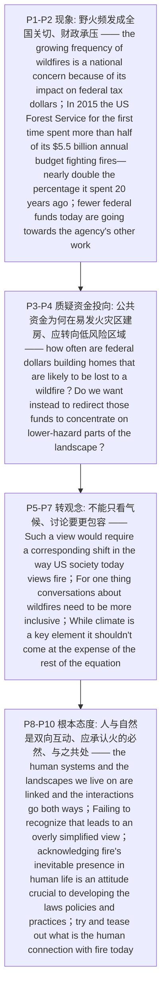

# 野火管理 精读笔记

## 背景

本文是 **2017 年考研英语（二）Text 4**（第 36—40 题），主题是**野火（wildfire）频发如何成为美国的全国性财政议题，以及社会应如何重新看待火**。文章不纠缠"气候变暖"这一常见切入，而是**从公共资金流向切入**——野火日益频繁，压在联邦税收与预算上，作者主张**重新审视并调整资金的投放去向，同时承认"火是自然的一部分"、学会与之共处**。

文章以**两位专家的论述**为骨架：火灾生态与管理专家**马克斯·莫里茨（Max Moritz）** 与科罗拉多大学的**鲍尔奇教授（Balch）**。莫里茨负责"**算账**"——2015 年美国林务局**首次把 55 亿美元年度预算的一半以上用来救火**（`spent more than half of its $5.5 billion annual budget fighting fires—nearly double the percentage it spent on such efforts 20 years ago`），致使**用于森林保护、流域管理、基础设施维护等其他工作的资金被挤压**（`fewer federal funds today are going towards the agency's other work`）——这是**第 36 题的定位区**；他进一步质疑**公共资金是否在往易发火灾地区"砸钱建房"**（`how often are federal dollars building homes that are likely to be lost to a wildfire?`），并主张**用放大镜审视、把资金转向危险性较低的区域**（`Do we want instead to redirect those funds to concentrate on lower-hazard parts of the landscape?`）——这是**第 37 题的关键句**。

文章随即将论点**从"钱"推进到"观念"**：莫里茨指出，过去十年人们**只盯着气候变化**（`the focus has been on climate change`），但**气候只是一个关键因素，不该以牺牲其他因素为代价**（`it shouldn't come at the expense of the rest of the equation`）——这是**第 38 题的定位区**；他强调**人类系统与所居景观相互关联、双向作用**（`The human systems and the landscapes we live on are linked, and the interactions go both ways`），**未能认识到这一点就会导致"对解决方案的看法过于简单化"**（`Failing to recognize that … leads to an overly simplified view`）——这是**第 39 题的答案句**。

最后**鲍尔奇教授**收束全文：人们仍把火当作**必须被完全控制、只在必要时才"放出"的事件**（`treat fire as an event that needs to be wholly controlled and unleashed only out of necessity`），而真正的关键在于**承认火在人类生活中不可避免**（`acknowledging fire's inevitable presence in human life`）、**把它当作必须与之共处的自然存在**——这是**第 40 题的落点**（`come to terms with`）。

全篇论证**四层递进**：**野火已成全国关切、财政承压（P1–P2）→ 公共资金流向存疑（P3–P4）→ 观念需转变、不能只看气候（P5–P7）→ 应承认火的必然、与之共处（P8–P10）**，是一篇结构清晰、态度鲜明的"现象—分析—主张"型评述文。

---

## 文章原文

# 2017 Passage 4

Though often viewed as a problem for western states, the growing **frequency** of **wildfires** is a national concern because of its impact on **federal tax dollars**, says Professor Max Moritz, a specialist in fire **ecology** and management.

> [!abstract]- 长难句分析
> **原句**：Though often viewed as a problem for western states, the growing **frequency** of **wildfires** is a national concern because of its impact on **federal tax dollars**, says Professor Max Moritz, a specialist in fire **ecology** and management.
>
> **主干提取**：
>
> - 让步状语 A（省略 it is）: Though (it is) often viewed as a problem for western states
> - 主语 S: the growing frequency of wildfires
> - 谓语 V（系动词）: is
> - 表语 C: a national concern
> - 原因状语 A: because of its impact on federal tax dollars
> - 引述句（主谓倒置）: says Professor Max Moritz
> - 同位语: a specialist in fire ecology and management
>
> **修饰成分**：
>
> | 类型 | 引导词 / 形式 | 修饰对象 |
> |------|--------------|----------|
> | 让步状语从句（省略 it is） | Though often viewed as … | 主句 |
> | 过去分词短语（让步从句中） | viewed as … | (it) = the growing frequency of wildfires |
> | 现在分词作前置定语 | growing | frequency |
> | 介词短语作后置定语 | of wildfires | frequency |
> | 介词短语作原因状语 | because of its impact on federal tax dollars | is a national concern |
> | 引述句（主谓倒置） | says Professor Max Moritz | 全句内容 |
> | 同位语 | a specialist in fire ecology and management | Professor Max Moritz |
>
> **结构图解**：
>
> ```
> 主句: the growing frequency of wildfires + is + a national concern
>   ├── 主语内部: the growing frequency of wildfires
>   │     ├── 现在分词（前置定语）: growing → frequency
>   │     └── 介短（后置定语）: of wildfires → frequency
>   ├── 让步状语（省略 it is）: Though often viewed as a problem for western states
>   │     └── 介短: for western states → a problem
>   ├── 原因状语: because of its impact on federal tax dollars
>   │     └── 介短: on federal tax dollars → its impact
>   └── 引述句（主谓倒置）: says Professor Max Moritz, a specialist in fire ecology and management
>         └── 同位语: a specialist in fire ecology and management → Professor Max Moritz
> ```
>
> **参考译文**：尽管野火常被视为西部各州的问题，但马克斯·莫里茨教授——一位火灾生态与管理专家——表示，野火日益频繁已成为一个全国性的关切，因为它影响到联邦税收。
>
> **考点提示**：① `Though often viewed as …` 是**让步状语从句的省略式**（= Though it is often viewed as …），**省略"主语 + be"**，逻辑主语是主句主语 `the growing frequency of wildfires`（**被看待** → 用过去分词）；② 句末 `says Professor Max Moritz, …` 是**引述句主谓倒置**，`Moritz` 才是主语，别把 `says` 当主语；③ `a specialist in fire ecology and management` 是**同位语**，解释莫里茨身份；④ 本句是**全文立论句**：先让步（"只是西部问题"）、再转出主旨（"已是全国关切"）；⑤ `because of + 名词短语` 表原因，区别于 `because + 从句`。

In 2015, the US Forest Service for the first time spent more than half of its $5.5 billion annual **budget** fighting fires—nearly double the **percentage** it spent on such efforts 20 years ago.

> [!abstract]- 长难句分析
> **原句**：In 2015, the US Forest Service for the first time spent more than half of its $5.5 billion annual **budget** fighting fires—nearly double the **percentage** it spent on such efforts 20 years ago.
>
> **主干提取**：
>
> - 时间状语 A: In 2015
> - 主语 S: the US Forest Service
> - 插入语（副词短语）: for the first time
> - 谓语 V: spent
> - 宾语 O: more than half of its $5.5 billion annual budget
> - 状语（方式）: fighting fires
> - 破折号补充（倍数比较）: nearly double the percentage it spent on such efforts 20 years ago
>
> **修饰成分**：
>
> | 类型 | 引导词 / 形式 | 修饰对象 |
> |------|--------------|----------|
> | 介词短语作时间状语 | In 2015 | 全句 |
> | 插入语（副词短语） | for the first time | spent |
> | 现在分词作状语（spend … doing） | fighting fires | spent |
> | 破折号插入语（倍数补充） | —nearly double the percentage …— | more than half of its … budget |
> | 省略关系词的定语从句 | (that/which) it spent on such efforts 20 years ago | the percentage |
> | 介词短语作后置定语 | of its $5.5 billion annual budget | more than half |
>
> **结构图解**：
>
> ```
> 主句: the US Forest Service + spent + more than half of its … annual budget
>   ├── 状语（时间）: In 2015
>   ├── 插入语: for the first time
>   ├── 分词状语（spend … doing）: fighting fires → spent
>   └── 破折号补充（倍数比较）: nearly double the percentage
>         └── 省略关系词的定从: (that) it spent on such efforts 20 years ago → the percentage
> ```
>
> **参考译文**：2015 年，美国林务局首次将其 55 亿美元年度预算的一半以上用于扑救火灾——这一比例几乎是 20 年前同类支出的两倍。
>
> **考点提示**：① `spend + 时间/金钱 + (in) doing` 是固定结构，`fighting fires` 为**现在分词（动名词）作状语**，**不能用 `to fight`**；② 破折号后 `nearly double the percentage …` 是**倍数补充说明**，`double` 作**限定词**修饰 `percentage`；③ `the percentage it spent on such efforts 20 years ago` 中**省略了关系词**（that/which），`it` 指 `the US Forest Service`；④ 本句是**第 36 题答案句**：`more than half of its … annual budget` + `nearly double … 20 years ago` = `a record-high percentage of budget`（[B]）。

In effect, fewer federal funds today are going towards the agency's other work—such as forest **conservation**, **watershed** and cultural resources management, and **infrastructure upkeep**—that affect the lives of all Americans.

> [!abstract]- 长难句分析
> **原句**：In effect, fewer federal funds today are going towards the agency's other work—such as forest **conservation**, **watershed** and cultural resources management, and **infrastructure upkeep**—that affect the lives of all Americans.
>
> **主干提取**：
>
> - 插入语（副词短语）: In effect
> - 主语 S: fewer federal funds
> - 时间状语 A: today
> - 谓语 V: are going
> - 方向状语 A: towards the agency's other work
> - 定语从句（that 作主语）: (that) affect the lives of all Americans
>
> **修饰成分**：
>
> | 类型 | 引导词 / 形式 | 修饰对象 |
> |------|--------------|----------|
> | 插入语（副词短语） | In effect | 全句 |
> | 形容词比较级作定语 | fewer | federal funds |
> | 介词短语作方向状语 | towards the agency's other work | are going |
> | 破折号插入语（举例） | —such as … upkeep— | the agency's other work |
> | 并列名词（such as 列举） | forest conservation / watershed … management / infrastructure upkeep | such as |
> | 定语从句（that 作主语） | that affect the lives of all Americans | the agency's other work |
>
> **结构图解**：
>
> ```
> 主句: fewer federal funds + are going + towards the agency's other work
>   ├── 插入语: In effect
>   ├── 状语（时间）: today
>   ├── 状短（方向）: towards the agency's other work
>   ├── 破折号插入语（举例）: such as forest conservation, watershed and cultural resources management, and infrastructure upkeep
>   │     └── 三项并列: forest conservation / watershed and cultural resources management / infrastructure upkeep
>   └── 定从（that 作主语）: that affect the lives of all Americans → the agency's other work
> ```
>
> **参考译文**：实际上，如今用于该机构其他工作的联邦资金更少了——例如森林保护、流域与文化资源管理以及基础设施维护——而这些工作影响着全体美国人的生活。
>
> **考点提示**：① 破折号**成对出现**，中间是 `such as` 引出的**三项并列举例**，读句时**先跳过**、再抓主干 `fewer federal funds … are going towards … work`；② 并列成分是 `forest conservation` / `watershed and cultural resources management` / `infrastructure upkeep`——**中间一项自带 `and`**，勿误判为四项；③ 句末 `that affect the lives of all Americans` 是**定语从句**，`that` 作从句主语，**谓语用复数 `affect`**（先行词 `other work` 在此指"多类工作"，视为复数）；④ 破折号列举是**第 36 题 [D] 的干扰来源**——它谈"被挤占的其他工作"，**不是"基础设施支出上升"**。

Another nationwide concern is whether public funds from other agencies are going into construction in **fire-prone** districts. As Moritz puts it, how often are federal dollars building homes that are likely to be lost to a wildfire?

> [!abstract]- 长难句分析
> **原句**：As Moritz puts it, how often are federal dollars building homes that are likely to be lost to a wildfire?
>
> **主干提取**：
>
> - 方式状语从句（插入语）: As Moritz puts it
> - 频率状语 A: how often
> - 谓语 V: are building
> - 主语 S: federal dollars
> - 宾语 O: homes
> - 定语从句（that 作主语）: that are likely to be lost to a wildfire
>
> **修饰成分**：
>
> | 类型 | 引导词 / 形式 | 修饰对象 |
> |------|--------------|----------|
> | 方式状语从句（插入语） | As Moritz puts it | 全句 |
> | 定语从句（that 作主语） | that are likely to be lost to a wildfire | homes |
> | 形容词短语 + 不定式 | (are) likely to be lost | that (= homes) |
> | 介词短语（被动施动者） | to a wildfire | lost |
>
> **结构图解**：
>
> ```
> 主句（疑问句）: how often + are + federal dollars + building + homes
>   ├── 方式状语从句（插入语）: As Moritz puts it
>   └── 定从（that 作主语）: that are likely to be lost to a wildfire → homes
>         ├── 形容词 + 不定式: are likely to be lost
>         └── 介短（被动施动者）: to a wildfire → lost
> ```
>
> **参考译文**：正如莫里茨所说，联邦资金究竟有多少次用在建造可能毁于野火的房屋上？
>
> **考点提示**：① `As Moritz puts it` 是**方式状语从句**作插入语，`put` 取**"表达、表述"**的熟词生义；② 主句是**疑问句**（`how often` 提前引起倒装：are + 主语 federal dollars …），**与宾语从句须用陈述语序不同**；③ `that are likely to be lost to a wildfire` 是**定语从句**，`that` 作主语 → 从句谓语用 `are`（先行词 `homes` 为复数）；④ `be likely to do` 是高频搭配；⑤ 句子是**反问**，不要求回答，实为强调"这种做法很成问题"，是第 3 段的质疑。

"It's already a huge problem from a **public expenditure** perspective for the whole country," he says. "We need to take a **magnifying glass** to that. Like, 'Wait a minute, is this OK?' Do we want instead to **redirect** those funds to concentrate on **lower-hazard** parts of the landscape?"

> [!abstract]- 长难句分析
> **原句**：Do we want instead to **redirect** those funds to concentrate on **lower-hazard** parts of the landscape?
>
> **主干提取**：
>
> - 助动词 A: Do
> - 主语 S: we
> - 谓语 V: want
> - 状语 A: instead
> - 宾语 O: to redirect those funds
> - 目的状语 A: to concentrate on lower-hazard parts of the landscape
>
> **修饰成分**：
>
> | 类型 | 引导词 / 形式 | 修饰对象 |
> |------|--------------|----------|
> | 不定式作宾语 | to redirect those funds | want |
> | 目的状语（不定式） | to concentrate on lower-hazard parts of the landscape | redirect those funds |
> | 介词短语 | on lower-hazard parts of the landscape | concentrate |
> | 复合形容词作定语 | lower-hazard | parts |
>
> **结构图解**：
>
> ```
> 主句（疑问句）: Do + we + want + (instead) + to redirect those funds
>   ├── 状语: instead
>   └── 宾语（不定式短语）: to redirect those funds
>         └── 目的状语（不定式）: to concentrate on lower-hazard parts of the landscape
>               └── 介短: on lower-hazard parts of the landscape → concentrate
> ```
>
> **参考译文**：我们要不要反过来把那些资金转向景观中危险较低的区域？
>
> **考点提示**：① `Do we want …?` 是**反问**，实为**提出建议**；`instead` 意为"转而、相反"，暗示**放弃现有做法**；② `to redirect those funds` 是 `want` 的**宾语**，`to concentrate on …` 是**目的状语**（说明重新调配资金的**意图**）；③ `lower-hazard` 是**复合形容词**（lower + hazard），意为"危险性较低的"，与 `fire-prone` 形成**危险程度对比**；④ 本句是**第 37 题关键句**——"审查并改进资金投向"对应 [D] guarantee safer spending of public funds。

Such a view would require a **corresponding shift** in the way US society today views fire, researchers say.

For one thing, conversations about wildfires need to be more **inclusive**. Over the past decade, the focus has been on climate change—how the warming of the Earth from **greenhouse gases** is leading to conditions that worsen fires.

> [!abstract]- 长难句分析
> **原句**：Over the past decade, the focus has been on climate change—how the warming of the Earth from **greenhouse gases** is leading to conditions that worsen fires.
>
> **主干提取**：
>
> - 时间状语 A: Over the past decade
> - 主语 S: the focus
> - 谓语 V: has been
> - 表语 C: on climate change
> - 同位语（破折号引出）: how the warming of the Earth from greenhouse gases is leading to conditions that worsen fires
>
> **修饰成分**：
>
> | 类型 | 引导词 / 形式 | 修饰对象 |
> |------|--------------|----------|
> | 介词短语作时间状语 | Over the past decade | 全句 |
> | 介词短语作表语 | on climate change | has been |
> | 破折号同位语（how 从句） | how the warming … is leading to conditions … | climate change |
> | 介词短语作后置定语 | of the Earth from greenhouse gases | the warming |
> | 定语从句（that 作主语） | that worsen fires | conditions |
>
> **结构图解**：
>
> ```
> 主句: the focus + has been + on climate change
>   ├── 状语（时间）: Over the past decade
>   └── 破折号同位语（解释 climate change）: how the warming of the Earth … is leading to conditions …
>         ├── 介短（后置定语）: of the Earth from greenhouse gases → the warming
>         └── 定从（that 作主语）: that worsen fires → conditions
> ```
>
> **参考译文**：过去十年里，人们的焦点一直放在气候变化上——即温室气体导致的地球变暖如何造成加剧火灾的条件。
>
> **考点提示**：① `Over the past decade` 是**现在完成时的固定时间状语**（`has been` 不可改成一般过去时）；② 破折号后的 `how … is leading to …` 是 `climate change` 的**同位语（how 引导的解释性从句）**；③ `that worsen fires` 是**定语从句**，`that` 作主语 → 谓语 `worsen` **用复数**（先行词 `conditions` 为复数）；④ 本句是**第 38 题**的背景：过去十年**只盯气候** → 下文"不该只看气候"（[C]）。

While climate is a key element, Moritz says, it **shouldn't come at the expense of** the rest of the **equation**.

"The human systems and the landscapes we live on are linked, and the interactions go **both ways**," he says. Failing to recognize that, he notes, leads to "an **overly simplified** view of what the solutions might be. Our **perception** of the problem and of what the solution is becomes very limited."

> [!abstract]- 长难句分析
> **原句**："The human systems and the landscapes we live on are linked, and the interactions go **both ways**," he says. Failing to recognize that, he notes, leads to "an **overly simplified** view of what the solutions might be."
>
> **主干提取**：
>
> - 主语 S（动名词短语）: Failing to recognize that
> - 插入语: he notes
> - 谓语 V: leads to
> - 宾语 O: an overly simplified view of what the solutions might be
>
> **修饰成分**：
>
> | 类型 | 引导词 / 形式 | 修饰对象 |
> |------|--------------|----------|
> | 省略关系词的定语从句 | (that/which) we live on | the landscapes |
> | 动名词短语作主语 | Failing to recognize that | leads to … |
> | 插入语 | he notes | 全句 |
> | 宾语从句（what 作表语） | of what the solutions might be | an overly simplified view |
>
> **结构图解**：
>
> ```
> 分句1（引语）: The human systems and the landscapes … are linked, and the interactions go both ways
>   └── 省略关系词的定从: (that) we live on → the landscapes
> 分句2（主句）: Failing to recognize that + leads to + an overly simplified view
>   ├── 动名词短语作主语: Failing to recognize that
>   ├── 插入语: he notes
>   └── 介短后置定语: of what the solutions might be → an overly simplified view
>         └── 宾语从句: what the solutions might be
> ```
>
> **参考译文**："人类系统与我们赖以生存的景观是相互联系的，而且这种相互作用是双向的，"他说。他指出，未能认识到这一点，就会导致"对可能解决方案的看法过于简单化"。
>
> **考点提示**：① `Failing to recognize that …` 是**动名词短语作主语**（视为单数 → 谓语 `leads`），`that` 指代前句"人类系统与景观相互关联"；② `he notes` 是**插入语**，不是主句谓语——**谓语是 `leads`**；③ `the landscapes we live on` 中**省略了关系词**（that/which），`live on` 意为"依赖……生存"；④ `of what the solutions might be` 是** what 宾语从句**（`what` 在从句中作表语）；⑤ 本句是**第 39 题答案句**——`Failing to recognize that`（未能认识到"人与自然相互关联"）对应 [D] understand the interrelations of man and nature。

At the same time, people continue to treat fire as an event that needs to be **wholly** controlled and **unleashed** only out of necessity, says Professor Balch at the University of Colorado. But acknowledging fire's **inevitable** presence in human life is an attitude **crucial** to developing the laws, policies, and practices that make it as safe as possible, she says.

> [!abstract]- 长难句分析
> **原句**：But acknowledging fire's **inevitable** presence in human life is an attitude **crucial** to developing the laws, policies, and practices that make it as safe as possible, she says.
>
> **主干提取**：
>
> - 连词: But
> - 主语 S（动名词短语）: acknowledging fire's inevitable presence in human life
> - 谓语 V（系动词）: is
> - 表语 C: an attitude
> - 后置定语: crucial to developing the laws, policies, and practices that make it as safe as possible
> - 引述语（后置）: she says
>
> **修饰成分**：
>
> | 类型 | 引导词 / 形式 | 修饰对象 |
> |------|--------------|----------|
> | 动名词短语作主语 | acknowledging fire's inevitable presence in human life | is an attitude |
> | 形容词短语作后置定语 | crucial to developing … | an attitude |
> | 介词 to + 动名词 | to developing the laws, policies, and practices | crucial |
> | 三项并列 | the laws, policies, and practices | developing |
> | 定语从句（that 作主语） | that make it as safe as possible | the laws, policies, and practices |
> | 引述语（后置） | she says | 全句 |
>
> **结构图解**：
>
> ```
> 主句: acknowledging fire's inevitable presence + is + an attitude
>   ├── 后置定语（形容词短语）: crucial to developing the laws, policies, and practices
>   │     ├── 介词 to + 动名词: to developing … → crucial
>   │     │     └── 三项并列: the laws, policies, and practices
>   │     └── 定从（that 作主语）: that make it as safe as possible → the laws, policies, and practices
>   └── 引述语（后置）: she says
> ```
>
> **参考译文**：但她说，承认火灾在人类生活中不可避免，这种态度对于制定尽可能安全的法律、政策和做法至关重要。
>
> **考点提示**：① `acknowledging fire's inevitable presence in human life` 是**动名词短语作主语**（视为单数 → 谓语 `is`）；② `crucial to` 中的 `to` 是**介词**（不是不定式符号），故后接**动名词 `developing`**——**判据：`to` 后换成名词成立（crucial to success）即介词**；③ `that make it as safe as possible` 是**定语从句**，`that` 作主语（先行词为三项并列名词，故谓语 `make` 用复数）；④ `as + 形容词原级 + as possible` 表"尽可能……"，形容词**用原级**；⑤ 本句是**第 40 题关键句**——"承认火的必然、与火共处"对应 [B] come to terms with。

"We've **disconnected** ourselves from living with fire," Balch says. "It is really important to understand and try and **tease out** what is the human connection with fire today."

> [!abstract]- 长难句分析
> **原句**：It is really important to understand and try and **tease out** what is the human connection with fire today.
>
> **主干提取**：
>
> - 主语 S（形式主语）: It
> - 谓语 V（系动词）: is
> - 表语 C: really important
> - 真主语（不定式短语）: to understand and try and tease out what is the human connection with fire today
>
> **修饰成分**：
>
> | 类型 | 引导词 / 形式 | 修饰对象 |
> |------|--------------|----------|
> | 形式主语 it | It | 真主语为后置不定式 |
> | 并列不定式（共享 to） | to understand and (try and) tease out … | 真主语 |
> | 口语惯用结构 | try and tease out（= try to tease out） | 真主语 |
> | 宾语从句（what 作表语） | what is the human connection with fire today | tease out |
> | 介词短语作后置定语 | with fire | the human connection |
>
> **结构图解**：
>
> ```
> 主句: It + is + really important
>   └── 真主语（不定式短语）: to understand and try and tease out …
>         ├── 并列不定式（共享 to）: to understand
>         ├── 口语惯用: (try and) tease out（= try to tease out）
>         └── 宾语从句: what is the human connection with fire today
>               └── 介短（后置定语）: with fire → the human connection
> ```
>
> **参考译文**："真正重要的是去理解并努力梳理出，今天人类与火之间究竟是怎样的联系。"
>
> **考点提示**：① `It` 是**形式主语**，真主语是后置的不定式短语 `to understand and try and tease out …`——**还原法**：`To understand … is really important.`；② `try and tease out` 是**口语惯用结构**（= try to tease out），常见于直接引语；③ `tease out` 意为"**梳理出、弄明白**"（熟词生义）；④ `what is the human connection with fire today` 是**宾语从句**，`what` 作从句表语、真正主语是 `the human connection`，**采用陈述语序**（不是疑问倒装）；⑤ 本句是鲍尔奇的**总结性主张**，与第 40 题"与火共处"的态度一致。

## 题目

### 36. More frequent wildfires have become a national concern because in 2015 they ____.

- [A] exhausted unprecedented management efforts
- [B] consumed a record-high percentage of budget
- [C] severely damaged the ecology of western states
- [D] caused a huge rise of infrastructure expenditure

### 37. Moritz calls for the use of "a magnifying glass" to ____.

- [A] raise more funds for fire-prone areas
- [B] avoid the redirection of federal money
- [C] find wildfire-free parts of the landscape
- [D] guarantee safer spending of public funds

### 38. While admitting that climate is a key element, Moritz notes that ____.

- [A] public debates have not settled yet
- [B] fire-fighting conditions are improving
- [C] other factors should not be overlooked
- [D] a shift in the view of fire has taken place

### 39. The overly simplified view Moritz mentions is a result of failing to ____.

- [A] discover the fundamental makeup of nature
- [B] explore the mechanism of the human systems
- [C] maximize the role of landscape in human life
- [D] understand the interrelations of man and nature

### 40. Professor Balch points out that fire is something man should ____.

- [A] do away with
- [B] come to terms with
- [C] pay a price for
- [D] keep away from

---

## 翻译对照

# 2017 Passage 4 中英对照翻译

## Paragraph 1

Though often viewed as a problem for western states, the growing frequency of wildfires is a national concern because of its impact on federal tax dollars, says Professor Max Moritz, a specialist in fire ecology and management.

尽管野火通常被视为西部各州的问题，但由于其对联邦税收的影响，野火日益频繁已成为一个全国性的关切，火灾生态与管理专家马克斯·莫里茨（Max Moritz）教授如是说。

> [!note] 翻译说明
> `Though often viewed as …` 是**让步状语**，省略了 `it is`（= Though it is often viewed as …），`viewed as` 的逻辑主语是后文的主语 `the growing frequency of wildfires`。
> `a national concern` 意为"全国性的关切／问题"，与前半句 `a problem for western states`（西部各州的问题）形成**地域范围的对比**，是本文立论的起点。
> `says Professor Max Moritz, a specialist in …` 中 `a specialist in …` 是**同位语**，用来解释莫里茨的身份；`says` 前置（主谓倒装）是**引述句式**的常见写法。

## Paragraph 2

In 2015, the US Forest Service for the first time spent more than half of its $5.5 billion annual budget fighting fires—nearly double the percentage it spent on such efforts 20 years ago. In effect, fewer federal funds today are going towards the agency's other work—such as forest conservation, watershed and cultural resources management, and infrastructure upkeep—that affect the lives of all Americans.

2015 年，美国林务局首次将其 55 亿美元年度预算的一半以上用于扑救火灾——这一比例几乎是 20 年前同类支出的两倍。实际上，如今用于该机构其他工作的联邦资金更少了——例如森林保护、流域与文化资源管理以及基础设施维护——而这些工作影响着全体美国人的生活。

> [!note] 翻译说明
> `spent more than half of its $5.5 billion annual budget fighting fires` 中 `spend + 时间/金钱 + doing` 表示"把……花在做某事上"，`fighting fires` 是**现在分词作状语**。
> `nearly double the percentage it spent on such efforts 20 years ago` 中省略了 `of`（= nearly double the percentage **of what** it spent …），`it spent … 20 years ago` 是省略关系词的**定语从句**修饰 `percentage`。
> `In effect` 意为"实际上、事实上"，用于引出**推论**；破折号中的 `such as …` 三个并列名词短语是对 `the agency's other work` 的**举例说明**。
> `watershed` 意为"流域"，`upkeep` 意为"维护、保养"，`infrastructure upkeep` 即"基础设施维护"。

## Paragraph 3

Another nationwide concern is whether public funds from other agencies are going into construction in fire-prone districts. As Moritz puts it, how often are federal dollars building homes that are likely to be lost to a wildfire?

另一个全国性的关切是，来自其他机构的公共资金是否会流入易发火灾地区的建设。正如莫里茨所说，联邦资金究竟有多少次用在建造可能毁于野火的房屋上？

> [!note] 翻译说明
> `whether … are going into construction` 是**表语从句**，`Another nationwide concern` 作主语，承接上段的 `a national concern`，构成"**第二个全国性关切**"。
> `As Moritz puts it` 意为"正如莫里茨所说／用他的话说"，`as` 引导**方式状语从句**（此处为插入语），`put` 意为"表达、表述"。
> `fire-prone` 是**复合形容词**（fire + prone），意为"易发火灾的"；`be likely to be lost to a wildfire` 意为"很可能毁于野火"，`be lost to` 意为"被……夺去／毁于……"。

## Paragraph 4

"It's already a huge problem from a public expenditure perspective for the whole country," he says. "We need to take a magnifying glass to that. Like, 'Wait a minute, is this OK?' Do we want instead to redirect those funds to concentrate on lower-hazard parts of the landscape?"

"从公共支出的角度看，这在全国范围内已经是个大问题了，"他说。"我们需要用放大镜仔细审视这件事。比如，'等一下，这样行不行？'我们要不要反过来把那些资金转向景观中危险较低的区域？"

> [!note] 翻译说明
> `from a … perspective` 意为"从……的角度看"，是**观点状语**；`public expenditure` 意为"公共支出"。
> `take a magnifying glass to that` 是**比喻性表达**，意为"对那件事仔细审查"，`magnifying glass` 意为"放大镜"；下文 `Wait a minute, is this OK?` 说明其含义是"停下来质疑、核实"。
> `Do we want instead to redirect those funds …` 中 `instead` 意为"转而、相反"，暗示**放弃目前做法、改走另一条路**；`redirect` 意为"改变方向、重新调配"。
> `lower-hazard parts of the landscape` 意为"危险性较低的景观区域"，`hazard` 意为"危险、隐患"，与 `fire-prone` 形成**危险程度对比**。

## Paragraph 5

Such a view would require a corresponding shift in the way US society today views fire, researchers say.

研究人员说，这样的观点将要求当今美国社会看待火灾的方式发生相应的转变。

> [!note] 翻译说明
> `a corresponding shift` 意为"相应的转变"，`corresponding` 与上文"重新调配资金"这一主张**相呼应**。
> `in the way (that) US society today views fire` 中 `the way` 后省略了关系词（that/in which），引导**定语从句**；`the way … views fire` 意为"……看待火灾的方式"。这是全文的**转折枢纽句**：既然要改变资金投向，社会观念也必须同步改变。

## Paragraph 6

For one thing, conversations about wildfires need to be more inclusive. Over the past decade, the focus has been on climate change—how the warming of the Earth from greenhouse gases is leading to conditions that worsen fires.

首先，关于野火的讨论需要更具包容性。过去十年里，人们的焦点一直放在气候变化上——即温室气体导致的地球变暖如何造成加剧火灾的条件。

> [!note] 翻译说明
> `For one thing` 意为"首先、一则"，用于**列举理由**（常与 `For another` 搭配），提示下文即将展开论述。
> `inclusive` 意为"包容的、涵盖面广的"，此处指**讨论不应只聚焦气候一个因素**。
> 破折号后的 `how the warming of the Earth from greenhouse gases is leading to conditions that worsen fires` 是 `climate change` 的**同位语**（解释其具体含义），其中 `that worsen fires` 是**定语从句**修饰 `conditions`，`lead to` 意为"导致"。

## Paragraph 7

While climate is a key element, Moritz says, it shouldn't come at the expense of the rest of the equation.

莫里茨说，虽然气候是关键因素，但不该以牺牲其他方面为代价。

> [!note] 翻译说明
> `While climate is a key element` 中 `while` 引导**让步状语从句**（= 虽然），与下文的 `shouldn't` 构成"**先承认、再转折**"的逻辑。
> `it shouldn't come at the expense of the rest of the equation` 中 `at the expense of` 意为"以……为代价、牺牲……"；`equation` 本义"方程、等式"，此处**比喻**整体问题的各方因素。本句是**第 38 题的定位区**。

## Paragraph 8

"The human systems and the landscapes we live on are linked, and the interactions go both ways," he says. Failing to recognize that, he notes, leads to "an overly simplified view of what the solutions might be. Our perception of the problem and of what the solution is becomes very limited."

"人类系统与我们赖以生存的景观是相互联系的，而且这种相互作用是双向的，"他说。他指出，未能认识到这一点，就会导致"对可能解决方案的看法过于简单化。我们对问题本身、以及对解决方案是什么的认知都会变得非常有限。"

> [!note] 翻译说明
> `the landscapes we live on` 中 `we live on` 是省略关系词的**定语从句**修饰 `landscapes`，`live on` 意为"以……为生、依赖……生存"。
> `the interactions go both ways` 意为"相互作用是双向的"，`go both ways` 意为"双向的、互动的"。
> `Failing to recognize that … leads to …` 中 `Failing to recognize` 是**动名词短语作主语**（主语为单数概念，动词用 `leads`）。
> `an overly simplified view of what the solutions might be` 意为"对解决方案可能是什么的过于简单化的看法"；`perception` 意为"认知、看法"，`what the solution is` 是**宾语从句**作 `of` 的宾语。本段与第 39 题直接相关。

## Paragraph 9

At the same time, people continue to treat fire as an event that needs to be wholly controlled and unleashed only out of necessity, says Professor Balch at the University of Colorado. But acknowledging fire's inevitable presence in human life is an attitude crucial to developing the laws, policies, and practices that make it as safe as possible, she says.

与此同时，科罗拉多大学的鲍尔奇（Balch）教授说，人们仍把火灾视为一种必须被完全控制、只有在必要时才"放出"的事件。但她说，承认火灾在人类生活中不可避免，这种态度对于制定尽可能安全的法律、政策和做法至关重要。

> [!note] 翻译说明
> `treat fire as an event that …` 中 `treat … as …` 意为"把……当作……"，`that needs to be wholly controlled and unleashed only out of necessity` 是**定语从句**修饰 `event`；`wholly` 意为"完全地"，`unleashed` 意为"被释放、被放出"，`out of necessity` 意为"出于必要"。
> `acknowledging fire's inevitable presence in human life` 是**动名词短语作主语**（单数概念 → `is`）；`inevitable` 意为"不可避免的"，`presence` 意为"存在、在场"。
> `an attitude crucial to developing …` 中 `crucial to` 意为"对……至关重要"，`to` 为介词，后接**动名词** `developing`；`make it as safe as possible` 意为"使其尽可能安全"。本句体现**第 40 题**的态度——与火灾"共处、妥协"。

## Paragraph 10

"We've disconnected ourselves from living with fire," Balch says. "It is really important to understand and try and tease out what is the human connection with fire today."

"我们已经把自己与'与火共存'割裂开了，"鲍尔奇说。"真正重要的是去理解并努力梳理出，今天人类与火之间究竟是怎样的联系。"

> [!note] 翻译说明
> `disconnect oneself from …` 意为"使某人自己与……脱离、割裂"，`living with fire` 意为"与火共存"。
> `try and tease out` 中 `try and do` 是**口语惯用**结构（= try to do）；`tease out` 意为"（从复杂信息中）梳理出、理清"，是**高频短语**。
> `what is the human connection with fire today` 是**宾语从句**作 `tease out` 的宾语，注意其中 `what` 作从句主语、采用**陈述语序**。

## 题目翻译

### 36. More frequent wildfires have become a national concern because in 2015 they ____.

- [A] exhausted unprecedented management efforts
- [B] consumed a record-high percentage of budget
- [C] severely damaged the ecology of western states
- [D] caused a huge rise of infrastructure expenditure

- [A] 使前所未有的管理努力耗尽
- [B] 占用了创纪录的预算比例
- [C] 严重破坏了西部各州的生态
- [D] 导致基础设施支出大幅上升

> [!note] 翻译说明
> 答案 **[B]**。定位第 1—2 段：第 1 段指出野火频发威胁 `federal tax dollars`（联邦税收），第 2 段给出数据——2015 年林务局首次把**年度预算的一半以上**用于救火，`nearly double the percentage it spent … 20 years ago`（几乎是 20 年前的两倍），即 `a record-high percentage of budget`，对应 **[B] consumed a record-high percentage of budget（占用了创纪录的预算比例）**。
> [A] `exhausted unprecedented management efforts`：文中谈的是**预算（资金）**，不是"管理努力的耗尽"，属**偷换概念**。
> [C] `severely damaged the ecology of western states`：原文说野火被视为 `a problem for western states`，但**成为全国性关切的原因是财政影响**，并非"破坏西部生态"，属**答非所问／张冠李戴**。
> [D] `caused a huge rise of infrastructure expenditure`：原文说基础设施维护**因救火占用资金而受挤压**，并非"基础设施支出上升"，属**因果倒置**。
> 提示：**细节题**注意题干 `because in 2015 they ____`，须紧扣 `2015` 这一时间点和 `national concern` 的原因，答案就在 `more than half of its … annual budget` 这句数据里。

### 37. Moritz calls for the use of "a magnifying glass" to ____.

- [A] raise more funds for fire-prone areas
- [B] avoid the redirection of federal money
- [C] find wildfire-free parts of the landscape
- [D] guarantee safer spending of public funds

- [A] 为易发火灾地区筹集更多资金
- [B] 避免联邦资金的重新调配
- [C] 寻找景观中无野火的区域
- [D] 确保公共资金得到更安全的支出

> [!note] 翻译说明
> 答案 **[D]**。定位第 4 段：莫里茨说公共支出"已是大问题"，需要 `take a magnifying glass to that`（用放大镜审视），并追问 `is this OK?`，再提出 `redirect those funds to concentrate on lower-hazard parts`（把资金转向低风险区域）。**本质是审查并改进公共资金的投放去向**，对应 **[D] guarantee safer spending of public funds（确保公共资金更安全的支出）**。
> [A] `raise more funds`：文中主张的是**重新调配（redirect）**既有资金，而非"筹集更多资金"，属**无中生有**。
> [B] `avoid the redirection of federal money`：原文恰恰**主张** `redirect those funds`，[B] 与原文**方向相反**，属**正反颠倒**。
> [C] `find wildfire-free parts of the landscape`：原文是 `lower-hazard parts`（危险较低的区域），**不等于**"完全没有野火的区域"，属**绝对化曲解**。
> 提示：**语义题／比喻题**要还原比喻义——`magnifying glass`（放大镜）暗示"**仔细审查、查证**"，落脚点在"钱花得对不对"。

### 38. While admitting that climate is a key element, Moritz notes that ____.

- [A] public debates have not settled yet
- [B] fire-fighting conditions are improving
- [C] other factors should not be overlooked
- [D] a shift in the view of fire has taken place

- [A] 公开辩论尚未有定论
- [B] 灭火条件正在改善
- [C] 其他因素不应被忽视
- [D] 看待火灾的观念已经发生转变

> [!note] 翻译说明
> 答案 **[C]**。定位第 7 段：`While climate is a key element …, it shouldn't come at the expense of the rest of the equation.`（虽然气候是关键因素，但不该以牺牲其他因素为代价）——`the rest of the equation` 即"其他因素"，对应 **[C] other factors should not be overlooked（其他因素不应被忽视）**。
> [A] `public debates have not settled yet`：文中未提"公开辩论是否定论"，属**无中生有**。
> [B] `fire-fighting conditions are improving`：文中谈的是"火情因变暖而加剧"，[B] 与原文**相反**。
> [D] `a shift in the view of fire has taken place`：第 5 段说的是这种转变"**将需要**（would require）"发生，尚未发生，属**时态／事实曲解**。
> 提示：**转折题**抓 `While … , it shouldn't …` 这一"**让步 + 转折**"结构，转折后才是作者真正强调的重点。`come at the expense of` 是判断本题的关键搭配。

### 39. The overly simplified view Moritz mentions is a result of failing to ____.

- [A] discover the fundamental makeup of nature
- [B] explore the mechanism of the human systems
- [C] maximize the role of landscape in human life
- [D] understand the interrelations of man and nature

- [A] 发现自然的根本构成
- [B] 探索人类系统的运行机制
- [C] 最大化景观在人类生活中的作用
- [D] 理解人与自然之间的相互关系

> [!note] 翻译说明
> 答案 **[D]**。定位第 8 段：`The human systems and the landscapes we live on are linked, and the interactions go both ways. Failing to recognize that … leads to an overly simplified view`。`that` 指代的就是"**人类系统与景观相互关联、相互作用**"，即"**人与自然的相互关系**"，对应 **[D] understand the interrelations of man and nature**。
> [A] `discover the fundamental makeup of nature`：文中强调"**相互关系（linked / interactions）**"，而非"自然的根本构成"，属**偷换重点**。
> [B] `explore the mechanism of the human systems`：只提"人类系统"一个方面，**漏掉了 landscape 一侧**，属**以偏概全**。
> [C] `maximize the role of landscape`：`maximize`（最大化）文中无据，属**无中生有**。
> 提示：**因果题**看 `Failing to recognize that … leads to …`——`that` 的指代内容就是答案的对应项，要回到上一句找"人—自然双向联系"。

### 40. Professor Balch points out that fire is something man should ____.

- [A] do away with
- [B] come to terms with
- [C] pay a price for
- [D] keep away from

- [A] 彻底废除、摆脱
- [B] 妥协接受、与之共处
- [C] 为其付出代价
- [D] 远离、避开

> [!note] 翻译说明
> 答案 **[B]**。定位第 9—10 段：鲍尔奇指出人们仍把火当作 `an event that needs to be wholly controlled`，但 `acknowledging fire's inevitable presence in human life`（承认火在人类生活中不可避免）才是关键态度，末段又批评 `We've disconnected ourselves from living with fire`（我们把自己与"与火共存"割裂开）。**"承认火的必然存在、与火共处"** 即 **[B] come to terms with（与……妥协、接受并与之共处）**。
> [A] `do away with`（彻底废除）与 [D] `keep away from`（远离）都强调"**彻底摆脱／控制火**"，正是文中**被批评的旧态度**，属**正反颠倒**。
> [C] `pay a price for`（为其付出代价）文中未提"代价"一说，属**无中生有**。
> 提示：**态度题**要依据全文立场判断。`come to terms with`（= accept and deal with）是常见考研短语，与作者主张的"acknowledge / live with fire"完全吻合；`disconnect … from` 的批评即是对 [A]、[D] 的否定。

---

## 语法要点

# 2017 Passage 4 语法要点整理

> [!note] 来源说明
> 本篇**用户未提供语法源笔记**，以下语法点由 `formatted-article.md` 与 `translation.md` **推断提取**，仅收录本篇实际出现的结构，不引入原文不存在的语法规则。
> 文中例句一律取自本篇原文；标注"（另见）"的句子来自同卷相邻篇目，仅用于对比，不属于本篇考试范围。

---

## 一、从句

### 从句：that 引导的定语从句（an event that needs to be wholly controlled / conditions that worsen fires / the laws, policies, and practices that make it as safe as possible）

**概述**：`that` 为关系代词，先行词多为物，在从句中作主语。本篇第 6、9 段连续使用 `that` 定语从句，是典型的**"名词 + that + 谓语（缺主语）"**结构。

| 结构 | 用法 | 例句 |
|------|------|------|
| 名词 + that + 谓语动词 | `that` 在从句中作主语，从句谓语**与先行词数一致** | people continue to treat fire as an event **that needs to be wholly controlled** … |
| 名词 + that + 谓语动词 | 同上，先行词由形容词修饰 | conditions **that worsen fires** |
| 名词短语 + that + 谓语动词 | `that` 从句紧跟**三项并列的名词**之后 | the laws, policies, and practices **that make it as safe as possible** |

> [!tip] 解题技巧
> `that` 后**缺主语** → 定语从句。本篇 `an event that needs to be wholly controlled` 中 `that` 后只有谓语 `needs`，无主语，故 `that` 作从句主语，先行词是 `an event`（不是 `fire`）。
> 遇到 `the laws, policies, and practices that make it as safe as possible`，先认出**三项并列名词**，再找共同的定语从句——`that` 指的是这三者整体。

> [!warning] 易混淆点
> 同为 `that`，引导**宾语从句**时其后是**完整句子**，引导**定语从句**时其后**不完整**（缺主语或宾语）。
> 对照本篇：`acknowledging … is an attitude crucial to developing the laws … that make it as safe as possible` 中，`that` 后缺主语 → **定语从句**；而第 1 段并无 `that` 宾语从句，不要见 `that` 就判宾语从句。

---

### 从句：though 引导的让步状语从句（省略 it is）（Though often viewed as a problem for western states …）

**概述**：`though / although` 引导让步状语从句；当从句主语与主句主语一致、且含 be 动词时，可**省略"主语 + be"**。本篇首句即用省略形式，`viewed` 的逻辑主语是主句主语。

| 结构 | 用法 | 例句 |
|------|------|------|
| Though + (省略主语与 be) + 过去分词 | 从句缩略为"连词 + 分词短语"，逻辑主语=主句主语 | **Though often viewed as** a problem for western states, the growing frequency of wildfires is a national concern … |

> [!tip] 解题技巧
> 句首 `Though + 分词` 是最常见的**让步省略式**。展开还原即 `Though it is often viewed as …`——**判断分词与主句主语的关系**：`the growing frequency of wildfires is viewed`（被看待）→ 用过去分词。
> 本句还是全文**立论句**：先承认"野火是西部问题"（`though`），再转出"它已是全国性关切"（主句），**让步 + 转折**是作者提出新视角的常用开局。

> [!warning] 易混淆点
> `though`（虽然）表**让步**，`because`（因为）表**原因**，两者逻辑相反。本篇同一句中还有一个 `because of its impact on federal tax dollars`（**原因状语**）——**句首让步、句中原因**，两层逻辑并行，切分时勿混。

---

### 从句：whether 引导的表语从句（Another nationwide concern is whether …）

**概述**：`whether` 引导**表语从句**，置于系动词 `is` 之后，说明主语的内容。`whether` 意为"是否"，不可换成 `if`（`if` 一般不出现在表语从句开头）。

| 结构 | 用法 | 例句 |
|------|------|------|
| 主语 + be + whether + 陈述语序从句 | 表语从句，`whether` 表"是否" | Another nationwide concern is **whether** public funds from other agencies are going into construction in fire-prone districts. |

> [!tip] 解题技巧
> 看到 `is / was + whether …`，即**表语从句**。`whether` 从句本身是**陈述语序**（主语 `public funds` → 谓语 `are going`），**不是疑问语序**——这是与直接疑问句的关键区别。
> 本句与第 1 段 `a national concern` 呼应，是"**第二个全国性关切**"的引出句，**段落首句往往承载新论点**。

> [!note] 补充说明
> `whether … or not` / `whether to do` 是常见扩展。本篇是 `whether + 完整陈述句`，属最基础形式。
> 关联复习：见「七、介词与连词」的 `whether` 与 `if` 辨析、「跨节联动复习」。

---

### 从句：the way (that) 引导的定语从句（the way US society today views fire）

**概述**：先行词为 `the way` 时，关系词可用 `that / in which`，也常**直接省略**。本篇 `the way US society today views fire` 中关系词省略，`the way` 在从句中作方式状语。

| 结构 | 用法 | 例句 |
|------|------|------|
| the way (that / in which) + 主语 + 谓语 | 关系词可省略；`the way` 后不能接 `how` | a corresponding shift in **the way** US society today views fire |

> [!tip] 解题技巧
> `the way …` 后**不能再加 `how`**（`the way how` 为典型错误）。本篇 `the way US society today views fire` 中，`US society today` 是从句主语、`views` 是从句谓语，中间夹着**时间状语 today**——读句时先把 `today` 括起来，主干立刻清楚。

> [!warning] 易混淆点
> `views` 在此是**动词**（看待），不是名词（观点）。判断依据：前面有主语 `US society`，后面有宾语 `fire` → `views` 是谓语动词。

---

### 从句：as 引导的方式状语从句（As Moritz puts it）

**概述**：`as` 引导方式状语从句，`as … puts it` 意为"正如……所说／用……的话说"，是**引述他人观点的固定句式**，常作插入语。

| 结构 | 用法 | 例句 |
|------|------|------|
| As + 主语 + puts it, + 主句 | 插入语，引出转述或解释 | **As Moritz puts it**, how often are federal dollars building homes that are likely to be lost to a wildfire? |

> [!tip] 解题技巧
> `As sb puts it` 后往往紧接**作者要强调的追问或概括**。本篇其后是**反问句** `how often are federal dollars building homes …?`——反问不要求回答，实为**强调"这种做法很成问题"**。

> [!note] 补充说明
> `put` 在此意为"**表达、表述**"（熟词生义，见「十、补充要点」）。同类表达：`as the saying goes`（俗话说）、`as I see it`（在我看来）。

---

### 从句：while 引导的让步状语从句（While climate is a key element …）

**概述**：`while` 既可引导**时间**状语从句（当……时），也可引导**让步**状语从句（虽然）。判据是**主从句逻辑是否相反**。本篇 `While climate is a key element, it shouldn't come at the expense of …` 中，`while` 表**让步**。

| 结构 | 用法 | 例句 |
|------|------|------|
| While + 从句, + 主句（逻辑相反） | 让步："虽然" | **While climate is a key element**, Moritz says, it shouldn't come at the expense of the rest of the equation. |
| While + 从句, + 主句（动作同时） | 时间："当……时" | （另见）While this may be true, it is not the whole story. |

> [!tip] 解题技巧
> `while` 的**让步义**是考研高频。本句 `While … is a key element`（承认气候重要）与 `it shouldn't …`（但不该牺牲其他）逻辑相反 → **让步**。
> 让步从句后的主句才是**作者真正的重点**，第 38 题正取材于主句 `it shouldn't come at the expense of the rest of the equation`。

> [!warning] 易混淆点
> 让步：`while / though / although / even though`；对比：`whereas`（而）。`whereas` **只表对比、不含让步**，且**多用于书面、前有逗号**。
> 关联复习：见「跨节联动复习」——`while`（让步）↔ `though`（让步省略）↔ `whereas`（对比）。

---

### 从句：what 引导的宾语从句（what the solutions might be / what is the human connection with fire today）

**概述**：`what` 引导名词性从句，`what` 在从句中**充当成分**（主语或表语），这是它与 `that`（不作成分）的根本区别。本篇出现两处 `what` 从句。

| 结构 | 用法 | 例句 |
|------|------|------|
| of + what + 主语 + be | `what` 作从句**表语**，跟在介词 `of` 后 | an overly simplified view of **what the solutions might be** |
| what + be + 主语 | `what` 作从句**表语**，采用**陈述语序** | try and tease out **what is the human connection with fire today** |

> [!tip] 解题技巧
> `what is the human connection with fire today` 看似疑问句，实为**宾语从句**——判据：它整体作 `tease out` 的宾语。**从句一律用陈述语序**：此处 `what` 是表语，真正主语是 `the human connection`，故写作 `what is the human connection`（不是 `what the human connection is` 之外另加疑问倒装）。
> `what` 从句**不能省略**、也**不能用 `that` 替换**——因为从句缺成分。

> [!warning] 易混淆点
> `what` = 先行词 + 关系词（融合词），本身有词义"……的东西／事情"；`that` 只作连接、无词义。
> 对比：`the view of what the solutions might be`（`what` 从句）vs. `the view that solutions might be wrong`（`that` 从句，`that` 后句子完整）。

---

## 二、非谓语动词

### 非谓语：动名词短语作主语（Failing to recognize that … leads to …；acknowledging fire's inevitable presence … is an attitude …）

**概述**：动名词（短语）可作主语，**视为单数**，谓语用**第三人称单数**。本篇第 8、9 段各有一例，是判断谓语的常见考点。

| 结构 | 用法 | 例句 |
|------|------|------|
| Doing + … + 单数谓语 | 动名词短语作主语，谓语用单数 | **Failing to recognize that**, he notes, **leads** to an overly simplified view … |
| Doing + … + is + 名词 | 同上，主句为系表结构 | **acknowledging fire's inevitable presence in human life is** an attitude crucial to … |

> [!tip] 解题技巧
> 长主语中**谓语单数**是信号：`Failing to recognize that … leads to …`——主语虽长，核心是**一个动名词短语**，故用 `leads`（不是 `lead`）。
> 与"不定式作主语"互为对照：**动名词多表泛指／既存事实，不定式多表具体／将来动作**。

> [!warning] 易混淆点
> 别把句中的插入语误当谓语：`Failing to recognize that, **he notes**, leads to …` 中 `he notes` 是**插入语**，真正谓语是 `leads`。

---

### 非谓语：动名词作介词宾语（crucial to developing … / from living with fire）

**概述**：介词后接动词须用**动名词**。本篇两处：`crucial to developing`（`to` 是介词）与 `disconnect … from living with fire`。

| 结构 | 用法 | 例句 |
|------|------|------|
| be crucial to + doing | `to` 为**介词**，后接动名词 | an attitude crucial to **developing** the laws, policies, and practices |
| disconnect sb from + doing | `from` 为介词，后接动名词 | We've disconnected ourselves from **living with fire** |
| at the expense of + 宾语 | `of` 为介词；后接名词或动名词 | it shouldn't come at the expense of the rest of the equation |

> [!tip] 解题技巧
> `crucial to` 的 `to` 是**介词**（不是不定式符号），故接 `developing` 而非 `develop`。同理：`be used to doing`、`look forward to doing`、`object to doing`。
> 判断法：把 `to` 后面换成名词——`crucial to success`（成立）→ `to` 是介词 → 后接动名词。

> [!warning] 易混淆点
> 易与"不定式符号 `to`"混淆的短语：`be crucial to`（介词）、`lead to`（介词）、`devote … to`（介词）；
> 真正接**不定式**的：`be able to do`、`decide to do`、`want to do`。

---

### 非谓语：现在分词作状语（spent more than half of its … budget fighting fires）

**概述**：`spend + 时间／金钱 + (in) doing` 是固定结构，`doing` 为**现在分词（动名词）**，表示"把……花在做某事上"。本篇第 2 段核心数据句即用此结构。

| 结构 | 用法 | 例句 |
|------|------|------|
| spend + 时间/金钱 + (in) doing sth | 表示"花费……做某事"，`in` 常省略 | spent more than half of its $5.5 billion annual budget **fighting fires** |

> [!tip] 解题技巧
> 同类结构：`spend … (in) doing`、`waste … (in) doing`、`have difficulty (in) doing`、`be busy (in) doing`——`in` 均可省略。
> 本句是**第 36 题的答案句**：`more than half of its $5.5 billion annual budget` 对应 `a record-high percentage of budget`。

> [!warning] 易混淆点
> `spend … doing` vs. `spend … to do`：**标准用法是 `spend … (in) doing`**，不用 `to do`（`take … to do` 另属他类）。

---

### 非谓语：现在分词作前置定语（the growing frequency of wildfires）

**概述**：现在分词（短语）可作**前置定语**，表**主动、进行**。本篇 `the growing frequency of wildfires` 中 `growing` 修饰 `frequency`。

| 结构 | 用法 | 例句 |
|------|------|------|
| 现在分词 + 名词 | 前置定语，表主动／正在发生 | **the growing frequency** of wildfires |
| 形容词化的分词 | 与名词构成固定搭配 | **the warming** of the Earth from greenhouse gases |

> [!tip] 解题技巧
> `growing`（正在增长的）↔ `grown`（已长大的）：**现在分词表进行／主动，过去分词表完成／被动**（见「四、语态」）。
> 本篇 `the growing frequency of wildfires` 是**全文话题**（野火日益频繁），是第 36 题的定位起点。

> [!note] 补充说明
> 现在分词作**前置定语**时多为单个分词（`growing / alarming / worsening`）；作**后置定语**时多为分词短语（`the conditions worsening fires`）。本篇两种形式均有。

---

### 非谓语：不定式作宾语与目的状语（need to take a magnifying glass / try and tease out / Do we want to redirect …）

**概述**：不定式 `to do` 可作**动词宾语**（如 `need to do`、`want to do`）、**目的状语**（表"为了……"）。本篇多次出现于**主张**句式中。

| 结构 | 用法 | 例句 |
|------|------|------|
| need to do / want to do / try to do | `to do` 作动词宾语 | We **need to take** a magnifying glass to that. |
| try and do（= try to do） | 口语惯用，`and` 代替 `to` | It is really important to understand and **try and tease out** … |
| Do we want (instead) to do …? | 不定式作宾语；反问表建议 | **Do we want instead to redirect** those funds to concentrate on lower-hazard parts of the landscape? |
| to do … 作目的状语 | 表目的"为了……" | fund construction **to concentrate on lower-hazard parts** of the landscape |

> [!tip] 解题技巧
> `try and do` 是**口语惯用结构**（= `try to do`），多见于直接引语，本篇即出现在莫里茨的原话中。
> `to concentrate on lower-hazard parts of the landscape` 是**目的状语**——说明"把资金转向"的**意图**，直接对应第 37 题 [D]（确保资金更安全的支出）。

> [!warning] 易混淆点
> `try to do`（努力去做）vs. `try doing`（尝试做做看）：前者强调**尽力**，后者强调**试一下**。本篇用 `try and do`（= try to do），表"努力弄清楚"。

---

### 非谓语：不定式作主语（It is really important to understand and try and tease out …）

**概述**：不定式作主语时，常用 **`it` 作形式主语**后置。本篇第 10 段末句为主干清晰的 `It is + adj. + to do` 结构。

| 结构 | 用法 | 例句 |
|------|------|------|
| It is + adj. + to do sth | `it` 为形式主语，真主语是不定式短语 | **It is** really important **to understand and try and tease out** what is the human connection with fire today. |

> [!tip] 解题技巧
> `It is important / necessary / difficult / possible + to do` 是高频句式。**先去掉 `it`，把 `to do` 提前**即还原真主语：`To understand and try and tease out … is really important.`
> 两个并列不定式 `to understand` 与 `try and tease out` 之间用 `and` 连接（**并列不定式可共享 `to`**）。

> [!note] 补充说明
> 关联复习：见「五、特殊句式：it 作形式主语」与「跨节联动复习」（**动名词作主语 ↔ 不定式作主语**的语用差异）。

---

## 三、时态与情态

### 时态：一般过去时与一般现在时对比（In 2015 … spent … / today are going towards …）

**概述**：本篇第 2 段用**一般过去时**（`spent`）交代 2015 年的历史数据，随即用**一般现在时**（`are going`）陈述当前结果，**时态对比即为论证对比**。

| 结构 | 用法 | 例句 |
|------|------|------|
| 一般过去时（+ 时间状语 In 2015） | 陈述过去特定时间的动作 | In 2015, the US Forest Service for the first time **spent** more than half of its … annual budget … |
| 一般现在时（+ today） | 陈述当前状况 | In effect, **fewer federal funds today are going** towards the agency's other work |

> [!tip] 解题技巧
> **时态切换点往往是"论点转折点"**：本篇由"2015 年的花费数据"（过去）转到"如今其他工作资金更少"（现在）——**数据 → 后果**的论证推进。
> 第 36 题题干 `because in 2015 they ____` 用**过去时**提问，答案句正是过去时的 `spent more than half of its … budget`。

> [!warning] 易混淆点
> `In 2015` 与**一般过去时**绑定；`today / now` 与**一般现在时／现在进行时**绑定。
> 本篇 `are going towards` 用**现在进行时**表**当前持续的趋势**，比 `go` 更强调"正在发生"。

---

### 时态：现在完成时 has been on（the focus has been on climate change）

**概述**：`Over the past decade + 现在完成时` 是固定的**时间状语搭配**，表"过去十年以来一直……"。本篇第 6 段即用此结构。

| 结构 | 用法 | 例句 |
|------|------|------|
| Over the past + 时间段 + 现在完成时 | 表"过去……以来一直（持续至今）" | Over the past decade, the focus **has been on** climate change … |

> [!tip] 解题技巧
> 见到 `over / in the past / last + 时间段`，谓语一律用**现在完成时**（不用过去时）。
> 本句是**第 38 题**的背景：`the focus has been on climate change`（过去十年只盯着气候）→ 下文 `shouldn't come at the expense of …`（不该只看气候）→ [C] other factors should not be overlooked。

> [!note] 补充说明
> `be on` 意为"（焦点／话题）在于、围绕"。`The focus is on …`（焦点在于……）是学术文章中极高频的表达。

---

### 情态：should + 动词原形（it shouldn't come at the expense of …）

**概述**：`should / shouldn't + do` 表**建议、应该或不该**。本篇 `it shouldn't come at the expense of the rest of the equation` 是作者**主张**的直接表达。

| 结构 | 用法 | 例句 |
|------|------|------|
| should / shouldn't + do | 表建议（该／不该） | Moritz says, it **shouldn't come** at the expense of the rest of the equation |

> [!tip] 解题技巧
> `shouldn't` 后的内容常是**作者反对外的主张**。本句即"**不该**以牺牲其他因素为代价"，与 [C] other factors should not be overlooked 构成**同义改写**（`shouldn't come at the expense of` ≈ `should not be overlooked`）。

> [!warning] 易混淆点
> `should have done`（本该做而没做）表**对过去的责备**；本篇是 `shouldn't do`（现在／一般主张），**不涉及过去**。

---

### 情态：would 表假设结果（Such a view would require a corresponding shift）

**概述**：`would + do` 在此表**假设条件下的结果**（"若如此，就会……"），与后文 `For one thing, … need to be …` 的**主张**相衔接。

| 结构 | 用法 | 例句 |
|------|------|------|
| would + do | 表假设／推论结果 | Such a view **would require** a corresponding shift in the way US society today views fire |

> [!tip] 解题技巧
> `would` 是**第 38 题 [D] 的排除依据**：转变"**将会需要**（would require）"，说明**尚未发生**；[D] `a shift … has taken place`（已经发生）与原文**时态不符**，属曲解。
> 凡选项出现 `has taken place / has already`，务必回原文核对**是"已发生"还是"将发生／需要发生"**。

> [!note] 补充说明
> 关联复习：见「跨节联动复习」——`would`（假设结果）↔ `should`（建议）的**情态差异**。

---

## 四、语态

### 语态：被动语态（is often viewed as / needs to be wholly controlled and unleashed）

**概述**：本篇被动语态多用于**客观陈述他人观点或普遍做法**，弱化施动者。`be + 过去分词` 为其基本形式，含情态时用 `need to be done`。

| 结构 | 用法 | 例句 |
|------|------|------|
| be + 过去分词 | 一般被动，施动者不明或不重要 | the growing frequency of wildfires **is** often **viewed as** a problem for western states |
| need to be + 过去分词 | 含 `need` 的被动不定式 | an event that **needs to be wholly controlled and unleashed** |
| be + 过去分词 + 状语 | 被动 + `only out of necessity`（仅出于必要） | … unleashed **only out of necessity** |

> [!tip] 解题技巧
> 被动语态常出现在**引述他人观点**处（`is viewed as`、`says …`）——作者借被动语态把"**普遍看法**"作为**待商榷的对象**，随后再提出自己的主张。
> `needs to be wholly controlled` 中的 `wholly`（完全地）修饰过去分词 `controlled`，暗示作者**反对"完全控制"这一旧思路**。

> [!warning] 易混淆点
> `be + 过去分词` 未必都是被动语态，也可能是**系表结构**（表状态）。判据：能否补出 `by …`。本篇 `is often viewed as a problem`（能被看待）→ **被动**；`is crucial to …`（是关键的）→ **系表**。

---

## 五、特殊句式

### 特殊句式：it 作形式主语（It is really important to understand …）

**概述**：当真主语是**不定式短语**或**从句**时，常用 `it` 占主语位置，真主语后置。本篇末句为典型 `It is + adj. + to do`。

| 结构 | 用法 | 例句 |
|------|------|------|
| It is + adj. + to do sth | `it` 为形式主语，真主语是后置不定式 | **It is** really important **to understand and try and tease out** what is the human connection with fire today. |

> [!tip] 解题技巧
> 还原法：把 `to do` 提到句首即真主语——`To understand … is really important.`
> 本篇 `It is really important to …` 是鲍尔奇的**总结性主张**，与第 40 题"与火共处"的态度一致。

> [!note] 补充说明
> 除不定式外，`it` 还可代**动名词**（`It's no use crying`）或**从句**（`It is obvious that …`）。
> 关联复习：见「跨节联动复习」（**形式主语 it ↔ 动名词作主语**）。

---

### 特殊句式：引述句式主谓倒置（says Professor Max Moritz … / says Professor Balch … she says）

**概述**：引述他人话语时，**谓语可提到主语之前**（主谓倒置），尤其当主语较长或带同位语时。本篇三种引述形式并存：**动词 + 主语（倒置）**、**主语 + 动词（正常）**、**主语 + 动词（句末补叙）**。

| 结构 | 用法 | 例句 |
|------|------|------|
| says + 主语（+ 同位语） | 主谓倒置，常见于句末或句首引述 | **says Professor Max Moritz, a specialist in fire ecology and management** |
| 主语 + says | 正常语序 | he **says** / she **says** / Balch **says** |
| 主句 + , says + 主语 | 引述语后置 | … unleashed only out of necessity, **says Professor Balch** at the University of Colorado |

> [!tip] 解题技巧
> 见到 `says / said + 人名`，**别把 `says` 当主语**——这是**主谓倒置**的引述句。本篇 `says Professor Max Moritz, a specialist in fire ecology and management` 中，`Moritz` 才是主语，`a specialist in …` 是其**同位语**。
> 引述句的**内容（引号内）往往是观点句**，也是阅读理解**观点题／态度题**的取材处。

> [!warning] 易混淆点
> 倒置只发生在**引述动词**（say / add / note / remark 等）上，且**主语不是代词**时更常见（`says he` 一般不用倒置，写作 `he says`）。本篇即 `he says / she says`（代词，用正常语序）。

---

### 特殊句式：同位语结构（a specialist in fire ecology and management；how the warming … 作 climate change 的同位语）

**概述**：同位语用于**解释、补充**前面的名词。本篇有两处典型：一为**名词同位语**（解释人物身份），一为**同位语从句／短语**（解释 `climate change`）。

| 结构 | 用法 | 例句 |
|------|------|------|
| 名词 + , + 名词短语（同位语） | 解释前面人物的身份 | Professor Max Moritz, **a specialist in fire ecology and management** |
| 名词 + 破折号 + 解释成分 | 破折号后的内容解释前面的名词 | the focus has been on climate change—**how the warming of the Earth from greenhouse gases is leading to conditions that worsen fires** |

> [!tip] 解题技巧
> 同位语**不是新信息的主体**，而是对前面的**解释**——读句时可先略读，抓住主干后再回填。
> 本篇 `climate change—how the warming … is leading to conditions …` 中，破折号后用 `how` 从句**具体解释**气候变化的机制，是**第 38 题**的背景信息。

> [!note] 补充说明
> 同位语常见形式：`名词, 名词短语`（如本篇人名的身份）、`名词 + 破折号 + 解释`、`名词 + that 从句`（同位语从句，本篇未出现，注意与定语从句区分：同位语从句 `that` 后句子完整且 `that` 不作成分）。

---

## 六、平行与结构

### 平行与结构：破折号插入语作补充说明（—nearly double the percentage …—；—such as forest conservation … —）

**概述**：破折号可引出一段**插入的补充说明**，前后**成对**（或单侧）出现，读句时可**先跳过**，抓住主干后再回读。

| 结构 | 用法 | 例句 |
|------|------|------|
| 名词 + — + 补充说明 + — | 破折号内为对前文数据的**补充／强调** | spent more than half of its $5.5 billion annual budget fighting fires**—nearly double the percentage it spent on such efforts 20 years ago** |
| 名词 + — + 列举 + — | 破折号内为 `such as` 列举 | the agency's other work**—such as forest conservation, watershed and cultural resources management, and infrastructure upkeep—**that affect the lives of all Americans |

> [!tip] 解题技巧
> 遇到破折号插入语，**先划掉、读主干**：`spent more than half of its … budget fighting fires` 是主干，破折号内 `nearly double the percentage …` 是**补充比较**（说明"是 20 年前的两倍"）。
> 破折号后的列举 `such as forest conservation, watershed … management, and infrastructure upkeep` 是**第 36 题 [D] 的干扰来源**——它谈的是"被挤占的其他工作"，**不是"基础设施支出上升"**。

> [!warning] 易混淆点
> 破折号（—）表**补充／强调**，逗号表**顺承**，冒号表**解释**。三者在长难句中功能不同，**跳过插入语前先看清是哪种符号**。

---

### 平行与结构：三项并列与共享中心词（forest conservation, watershed and cultural resources management, and infrastructure upkeep）

**概述**：三项以上并列时，通常在**最后一项前加 `and`**，前几项用逗号分隔（牛津逗号）。

| 结构 | 用法 | 例句 |
|------|------|------|
| A, B, and C | 三项并列，最后一项前加 `and` | forest conservation, watershed and cultural resources management, and infrastructure upkeep |

> [!tip] 解题技巧
> 识别并列结构时，先找**末项前的 `and`**，再往左依逗号切分。本篇三个并列成分是 `forest conservation`、`watershed and cultural resources management`、`infrastructure upkeep`——**中间一项本身还含 `and`**（watershed and cultural resources），切分时勿误判为四项。

> [!note] 补充说明
> 并列成分通常**词性、结构一致**（本篇均为名词短语），这是判断并列是否成立的重要依据。

---

### 平行与结构：as … as possible（make it as safe as possible）

**概述**：`as + 形容词/副词原级 + as possible` 意为"尽可能……"，是固定比较结构。

| 结构 | 用法 | 例句 |
|------|------|------|
| as + adj./adv. + as possible | 表"尽可能……" | … make it **as safe as possible** |

> [!tip] 解题技巧
> `as … as possible` 中的形容词**用原级**（不用比较级）：`as safe as possible`（√），`as safer as possible`（×）。
> 本句是鲍尔奇主张的落脚点——"使法律、政策、做法**尽可能安全**"，体现**与火共处而非消灭**的思路（第 40 题 [B]）。

> [!note] 补充说明
> 同类表达：`as soon as possible`（尽快）、`as much as possible`（尽可能多）、`as far as possible`（尽可能远）。

---

### 平行与结构：go both ways（the interactions go both ways）

**概述**：`go both ways` 意为"（相互作用）是双向的"，本篇用于强调**人类系统与景观相互影响**。

| 结构 | 用法 | 例句 |
|------|------|------|
| go both ways | 表"双向、相互" | The human systems and the landscapes we live on are linked, and **the interactions go both ways** |

> [!tip] 解题技巧
> `go both ways` 是**第 39 题的答案信号**：`linked`（相互关联）+ `go both ways`（双向作用）= **人与自然的相互关系**，对应 [D] understand the interrelations of man and nature。
> 凡选项含 `interrelations / interaction / two-way`，多半与 `go both ways` 一类表达呼应。

> [!note] 补充说明
> 同义表达：`be mutually related`、`interact with each other`、`be interconnected`。

---

## 七、介词与连词

### 介词与连词：at the expense of / in effect / from a … perspective / out of necessity

**概述**：本篇四处**固定介词短语**分别承担"让步代价、结论、立场、条件"等**逻辑功能**，是长难句与解题的关键节点。

| 搭配 | 含义 | 原文语境 | 逻辑功能 |
|------|------|---------|---------|
| `at the expense of` | 以……为代价、牺牲…… | it shouldn't come **at the expense of** the rest of the equation | **让步／代价**（第 38 题依据） |
| `in effect` | 实际上、事实上 | **In effect**, fewer federal funds today are going towards the agency's other work | **引出结论** |
| `from a … perspective` | 从……角度看 | **from a public expenditure perspective** | **表明立场** |
| `out of necessity` | 出于必要 | unleashed only **out of necessity** | **表条件** |
| `such as` | 例如 | **such as** forest conservation, watershed … management | **举例** |

> [!tip] 解题技巧
> **介词短语 = 逻辑路标**：`at the expense of`（代价）→ 第 38 题；`in effect`（结论）→ 第 36 题数据句。
> 读长句时先圈出这些短语，**逻辑关系立刻清楚**，比逐词翻译更快。

> [!warning] 易混淆点
> `in effect`（实际上）≠ `in effect` 的另一义"生效中"；本篇为**副词性短语**，意为"实际上"。
> `at the expense of` 后接**名词或动名词**（`at the expense of accuracy / of doing sth`）。

---

### 介词与连词：for one thing / at the same time / such as

**概述**：本篇用多个**连接性表达**推进论证：`For one thing`（列举理由）、`At the same time`（补充递进）、`such as`（举例）。

| 搭配 | 含义 | 原文语境 | 逻辑功能 |
|------|------|---------|---------|
| `for one thing` | 首先、一则 | **For one thing**, conversations about wildfires need to be more inclusive | **列举理由** |
| `at the same time` | 同时、与此同时 | **At the same time**, people continue to treat fire as an event … | **补充递进** |
| `such as` | 例如 | other work—**such as** forest conservation … | **举例说明** |
| `as Moritz puts it` | 正如莫里茨所说 | **As Moritz puts it**, how often are federal dollars … | **引述／转述** |
| `in fact` | 事实上 | （另见）in fact, it probably enhances it | **转折强调** |

> [!tip] 解题技巧
> `for one thing` 提示**将要列举理由**（常与 `for another` 呼应）；本篇第 6—8 段即"**首要理由 + 补充理由**"的展开。
> `at the same time` 表**补充**（不是转折），暗示作者要**再加上一个论点**（鲍尔奇的观点）。

> [!note] 补充说明
> 关联复习：见「跨节联动复习」——`for one thing`（列举）↔ `at the same time`（递进）↔ `in fact`（转折）三者逻辑功能对比。

---

### 介词与连词：whether 与 if 的辨析（whether … are going into construction）

**概述**：`whether` 与 `if` 均可表"是否"，但**`whether` 适用范围更广**：可引导**主语、表语、介词宾语、让步**从句，还可与 `or not` 连用。

| 结构 | 用法 | 例句 |
|------|------|------|
| 系动词 + whether + 从句 | 引导**表语从句**（`if` 不可） | Another nationwide concern is **whether** public funds … are going into construction … |
| whether + or not | 表"无论是否" | （另见）whether or not it is convenient |

> [!tip] 解题技巧
> 判据口诀：**"介词后、句首、表语位，一律用 whether"**。本篇 `is whether …` 是**表语从句**，只能用 `whether`，不能用 `if`。

> [!warning] 易混淆点
> `if` 可引导**条件**状语从句或**宾语**从句（且宾语从句不能用 `if … or not` 结构，`whether … or not` 才通用）；`whether` 用途更广。

---

## 八、标点与长难句

### 标点功能：破折号引出补充与强调、引号标示直接引语

**概述**：本篇标点承担两重功能：**破折号**引出补充说明与强调；**引号**标示专家**直接引语**。

| 标点 | 功能 | 原文语境 |
|------|------|---------|
| 破折号 `—` | 补充说明、强调、列举 | spent more than half of its … budget fighting fires**—nearly double the percentage …** |
| 双引号 `" "` | 标示**直接引语** | **"It's already a huge problem from a public expenditure perspective …"** he says. |
| 单引号 `' '` | 引语内**再引述**（引语中的引语） | Like, **'Wait a minute, is this OK?'** |

> [!tip] 解题技巧
> 引号内的内容多为**观点、主张或定义**，是**态度题／观点题**的高频取材处。本篇三段直接引语分别来自莫里茨（第 4、8 段）与鲍尔奇（第 10 段），**每位专家的核心主张都在引语内**。
> 引语中再嵌引语（`Like, 'Wait a minute …'`）时，**内层用单引号**——这是英文标点的规范写法。

> [!note] 补充说明
> 关联复习：见「跨节联动复习」——**引号（引语）↔ 引述句主谓倒置**（`says Professor …`）常同时出现。

---

### 长难句：让步状语从句 + 同位语 + because of 短语（Though often viewed as …；says Professor Max Moritz, a specialist in …）

**概述**：本篇首句把**让步省略、同位语、原因状语**三种结构叠在一句之内，是理解"作者如何提出新视角"的关键。

| 结构 | 用法 | 例句 |
|------|------|------|
| Though + (省略主语与 be) + 过去分词 | 让步省略式 | **Though often viewed as** a problem for western states, … |
| 主句 + because of + 名词短语 | 原因状语 | … is a national concern **because of its impact on federal tax dollars** |
| says + 主语 + , + 同位语 | 引述倒置 + 同位语 | … **says Professor Max Moritz, a specialist in fire ecology and management** |

> [!tip] 解题技巧
> **切分步骤**：① 划出句首让步 `Though often viewed as a problem for western states`（可略读）；② 抓主句 `the growing frequency of wildfires is a national concern`；③ 找原因 `because of its impact on federal tax dollars`；④ 末尾引述 `says Professor Max Moritz, a specialist in …` 是**出处**，可最后读。
> 理解顺序：**荒野问题（让步）→ 全国关切（主句）→ 因为财政影响（原因）→ 专家之口（出处）**。

> [!warning] 易混淆点
> `viewed as` 的逻辑主语是主句主语 `the growing frequency of wildfires`（**被看待**），故用**过去分词**；若逻辑主语主动，则用现在分词（`viewing …`）。

---

### 长难句：比较结构 + 省略（nearly double the percentage it spent on such efforts 20 years ago）

**概述**：本篇第 2 段用 `nearly double the percentage …` 做**倍数比较**，`percentage` 后接**省略关系词的定语从句**，是数据类长句的典型。

| 结构 | 用法 | 例句 |
|------|------|------|
| double + the + 名词 | 表"是……的两倍" | **nearly double the percentage** it spent on such efforts 20 years ago |
| 名词 + (省略关系词) + 从句 | 省略 `that/which` 的定语从句 | the percentage **(that)** it spent on such efforts 20 years ago |

> [!tip] 解题技巧
> `double` 可作**限定词**（"两倍"）直接修饰名词，此处 `nearly double the percentage`（几乎是……的两倍）。`the percentage` 后省略了关系词，`it spent … 20 years ago` 是**定语从句**，`it` 指代 `the US Forest Service`。
> 本句是**第 36 题**的核心数据句：`more than half of its … budget` + `nearly double … 20 years ago` = `a record-high percentage of budget`。

> [!note] 补充说明
> 倍数表达：`double / twice the number of`、`three times as many as`、`increase by 50%`。本篇用 `double + 名词`，属**最简单直接**的一种。

---

## 九、补充要点

### 补充要点：构词法（fire-prone / lower-hazard / nationwide / wildfire）

**概述**：本篇多个**复合词**由"名词 + 形容词／副词"或"形容词 + 名词"构成，是考研**构词法**题的常见素材。

| 单词 | 构词 | 含义 | 原文语境 |
|------|------|------|---------|
| `wildfire` | wild + fire | 野火 | the growing frequency of **wildfires** |
| `fire-prone` | fire + prone | 易发火灾的（`-prone` 表"易……的"） | construction in **fire-prone** districts |
| `lower-hazard` | lower + hazard | 危险性较低的（`lower-` 表"较低"） | **lower-hazard** parts of the landscape |
| `nationwide` | nation + wide | 全国性的（`-wide` 表"遍及……的"） | Another **nationwide** concern |
| `landscape` | land + scape | 景观、地貌 | parts of the **landscape** |
| `upkeep` | up + keep | 维护、保养 | infrastructure **upkeep** |

> [!tip] 解题技巧
> 记住高频**后缀**：`-prone`（易……的，如 `accident-prone` 易出事故的）、`-wide`（遍及……的，如 `worldwide` 全世界的）。
> `lower-hazard` 是**作者主张的关键词**——"把资金转向危险性较低的区域"，与第 37 题 [D] 呼应。

> [!warning] 易混淆点
> `hazard`（危险、隐患）↔ `hazardous`（危险的，形容词）。本篇 `lower-hazard` 用**名词 hazard** 作复合词成分，意为"低危险的"。

---

### 补充要点：熟词生义（equation / landscape / unleash / tease out / put）

**概述**：本篇数处**常见词在特定语境中取"生义"**，直译往往不通，是阅读理解的重要障碍点。

| 单词 | 常见义 | 文中义 | 原文语境 |
|------|--------|--------|---------|
| `equation` | 方程、等式 | **（问题的）整体、各方因素的综合** | it shouldn't come at the expense of the rest of the **equation** |
| `landscape` | 风景、景色 | **（区域的）整体格局、地貌** | lower-hazard parts of the **landscape** |
| `unleash` | 解开皮带（放狗） | **释放、放出（不加约束）** | fire … needs to be wholly controlled and **unleashed** only out of necessity |
| `tease out` | 梳理（毛线） | **（从复杂信息中）梳理出、弄明白** | try and **tease out** what is the human connection with fire today |
| `put` | 放、摆 | **表达、表述** | As Moritz **puts** it |
| `perception` | （较常见） | **认知、看法** | Our **perception** of the problem … becomes very limited |

> [!warning] "译不通 = 熟词生义"是重要信号
> `the rest of the equation` 若按"方程"直译立刻崩掉；`unleash fire` 若按"解开皮带"直译不通。
> **凡直译不通处，先怀疑熟词生义**：`equation` → 整体因素；`tease out` → 梳理出；`put` → 表达。

> [!tip] 解题技巧
> `tease out` 是**高频短语**，意为"梳理出（线索、含义）"，对应第 39 题"理解人与自然的相互关系"的**动作**。
> `perception`（认知）常与 `view / understanding` 同义替换，是态度题的常见考点词。

---

### 跨节联动复习

> [!tip] 相关语法点联动
> - **让步 vs. 对比**：`while`（让步："虽然"）↔ `though / although`（让步）↔ `whereas`（对比："而"，不含让步）。三者都可"先让步再转折"，但 `whereas` 只表对比。→ 见「一、从句」。
> - **名词性从句**：`whether`（表语从句）↔ `what`（宾语从句，`what` 作成分）↔ `that`（宾语从句，`that` 不作成分）。核心区别是**从句是否缺成分**。→ 见「一、从句」。
> - **两种主语**：`动名词作主语`（`Failing to recognize that …`，谓语用单数）↔ `不定式作主语`（`It is … to do`，用形式主语 `it`）。前者多表**泛指的既存事实**，后者多表**具体／待做的动作**。→ 见「二、非谓语」与「五、特殊句式」。
> - **情态对比**：`would`（假设结果："将会……"）↔ `should`（建议："应该……"）。`would` 常表**未发生的假设结果**，是排除"已完成"类选项的依据。→ 见「三、时态与情态」。
> - **标点与引述**：破折号插入语（`— nearly double the percentage … —`）↔ 引号直接引语（`"It's already a huge problem …"`）↔ 引述句主谓倒置（`says Professor Max Moritz`）。三者常**同现**于"引述专家观点"的段落。→ 见「六、平行与结构」与「八、标点与长难句」。
> - **固定搭配联动**：`at the expense of`（介词短语，牺牲）↔ `come at the expense of`（动词短语，以……为代价）。搭配不同，含义相近。→ 见「七、介词与连词」与《[[intermediate/2017-passage4-wildfire/固定搭配与词组笔记|固定搭配与词组笔记]]》。

> [!note] 本篇语法主线
> **"让步开局（though）→ 数据对比（过去时 vs. 现在时）→ 主张递进（for one thing / at the same time）→ 情态表态（shouldn't / would）"**。
> 把语法点按**论证推进线**串联记忆，比按类别孤立背更快，也更容易迁移到同类型的"现象—分析—主张"文章。

---

## 固定搭配与词组

# 2017 Passage 4 固定搭配与词组 合集

> [!note] 来源说明
> 本篇**用户未提供搭配源笔记**，以下词组由 `formatted-article.md` 与 `translation.md` **提取整理**，仅收录本篇实际出现的搭配。
> 每一条均给出**原文语境**，便于回原文核对；标注"（另见）"的例句来自同卷相邻篇目，仅供对比。

---

## 一、主题名词短语与术语

| 搭配 | 含义 | 原文语境 |
|------|------|---------|
| `wildfire` | 野火 | the growing frequency of **wildfires** |
| `federal tax dollars` | 联邦税收（税款） | its impact on **federal tax dollars** |
| `fire ecology and management` | 火灾生态与管理 | a specialist in **fire ecology and management** |
| `the US Forest Service` | 美国林务局 | the **US Forest Service** for the first time spent … |
| `annual budget` | 年度预算 | more than half of its $5.5 billion **annual budget** |
| `forest conservation` | 森林保护 | such as **forest conservation** … |
| `watershed and cultural resources management` | 流域与文化资源管理 | **watershed and cultural resources management** |
| `infrastructure upkeep` | 基础设施维护 | and **infrastructure upkeep** |
| `fire-prone districts` | 易发火灾的地区 | construction in **fire-prone districts** |
| `public funds` | 公共资金 | whether **public funds** from other agencies are going into construction |
| `public expenditure` | 公共支出 | a huge problem from a **public expenditure** perspective |
| `a magnifying glass` | 放大镜（喻"仔细审查"） | We need to take **a magnifying glass** to that. |
| `lower-hazard parts of the landscape` | 危险性较低的景观区域 | concentrate on **lower-hazard parts of the landscape** |
| `a corresponding shift` | 相应的转变 | require **a corresponding shift** in the way … |
| `greenhouse gases` | 温室气体 | the warming of the Earth from **greenhouse gases** |
| `the rest of the equation` | （问题的）其他因素 | at the expense of **the rest of the equation** |
| `the human systems` | 人类系统 | **The human systems** and the landscapes … are linked |
| `an overly simplified view` | 过于简单化的看法 | leads to **an overly simplified view** of what the solutions might be |
| `fire's inevitable presence` | 火灾不可避免的存在 | acknowledging **fire's inevitable presence** in human life |
| `the human connection with fire` | 人类与火的联系 | what is **the human connection with fire** today |

> [!tip] 主题名词是"定位词"的主力
> 阅读题题干大多靠**主题名词**定位。本篇五题的关键词：
> 36 题 → `federal tax dollars / budget / 2015`；37 题 → `a magnifying glass`；38 题 → `climate / key element`；39 题 → `overly simplified view`；40 题 → `fire / man should`。
> 本篇论证**四层递进**：野火已成全国关切（Para 1–2）→ 公共资金流向存疑（Para 3–4）→ 观念需转变、不能只看气候（Para 5–7）→ 应承认火的必然、与之共处（Para 8–10）。**先分清每段"在说什么"，选项就不易混**。

---

## 二、动词 + 介词 / 宾语搭配

| 搭配 | 含义 | 原文语境 |
|------|------|---------|
| `view … as …` | 把……看作…… | often **viewed as** a problem for western states |
| `spend … (in) doing sth` | 把（钱／时间）花在做某事上 | **spent** more than half of its … budget **fighting fires** |
| `go towards sth` | （资金）用于、流向 | fewer federal funds today are **going towards** the agency's other work |
| `go into sth` | （资金）投入、流入 | public funds … are **going into** construction |
| `be lost to sth` | 被……夺去、毁于…… | homes that are likely to be **lost to** a wildfire |
| `take a magnifying glass to sth` | 对……仔细审查 | We need to **take a magnifying glass to** that. |
| `redirect sth to do sth` | 把……重新调配去做…… | **redirect** those funds **to concentrate on** lower-hazard parts |
| `concentrate on sth` | 集中于、专注于 | to **concentrate on** lower-hazard parts of the landscape |
| `require a shift in` | 需要……的转变 | would **require a corresponding shift in** the way … |
| `lead to sth` | 导致、造成 | is **leading to** conditions that worsen fires |
| `come at the expense of sth` | 以……为代价、牺牲…… | it shouldn't **come at the expense of** the rest of the equation |
| `be linked` | 相互关联 | The human systems and the landscapes we live on are **linked** |
| `go both ways` | （相互作用）是双向的 | the interactions **go both ways** |
| `recognize sth` | 认识到、承认 | Failing to **recognize** that … |
| `treat … as …` | 把……当作…… | people continue to **treat** fire **as** an event … |
| `need to be done` | 需要被（做） | an event that **needs to be** wholly controlled and unleashed |
| `acknowledge sth` | 承认、认可 | **acknowledging** fire's inevitable presence in human life |
| `be crucial to doing sth` | 对做某事至关重要 | an attitude **crucial to developing** the laws, policies, and practices |
| `make it as safe as possible` | 使其尽可能安全 | that **make it as safe as possible** |
| `disconnect oneself from sth` | 使自己与……割裂 | We've **disconnected ourselves from** living with fire |
| `tease out sth` | 梳理出、弄明白 | try and **tease out** what is the human connection with fire today |

> [!tip] 动词搭配的"褒贬与立场"
> 本篇两组关键动词承载**作者立场**，不只是词义：
> - `treat … as an event that needs to be controlled`（把火当作须控制的事件）、`disconnect … from living with fire`（与火割裂）——**作者要批评的旧态度**。
> - `acknowledge fire's inevitable presence`（承认火的必然）、`tease out the human connection`（梳理人与火的联系）——**作者的正面主张**（第 9、10 段）。
> **"先摆旧态度（treat / disconnect）→ 再提新主张（acknowledge / tease out）"是本篇的立场推进线**，第 40 题"与火共处"的依据即在此。

> [!warning] `view … as` / `regard … as` / `think of … as` 的共同点
> 三者均表"把……看作……"，**`as` 后接名词或形容词**；区别在语体：`view as`（较正式、书面）＞ `regard as`（正式）＞ `think of as`（较口语）。
> 本篇用 `is viewed as`（**被动**：被看作），主体是 `the growing frequency of wildfires`。注意**不能用 `view … to be`** 取代 `view … as`。

---

## 三、形容词 / 副词与固定表达

| 搭配 | 含义 | 原文语境 |
|------|------|---------|
| `the growing frequency of` | ……日益频繁 | **the growing frequency of** wildfires |
| `a national concern` | 全国性的关切 | is **a national concern** |
| `a specialist in sth` | ……方面的专家 | a specialist in fire ecology and management |
| `for the first time` | 首次 | **for the first time** spent more than half of its … budget |
| `nearly double` | 几乎是……的两倍 | **nearly double the percentage** it spent … 20 years ago |
| `in effect` | 实际上、事实上 | **In effect**, fewer federal funds today … |
| `from a … perspective` | 从……角度看 | from a **public expenditure perspective** |
| `As sb puts it` | 正如……所说 | **As Moritz puts it**, how often are federal dollars … |
| `more inclusive` | 更具包容性 | conversations about wildfires need to be **more inclusive** |
| `a key element` | 关键因素 | While climate is **a key element** … |
| `out of necessity` | 出于必要 | unleashed only **out of necessity** |
| `as safe as possible` | 尽可能安全 | make it **as safe as possible** |
| `for one thing` | 首先、一则 | **For one thing**, conversations about wildfires … |
| `at the same time` | 与此同时 | **At the same time**, people continue to treat fire … |
| `such as` | 例如 | other work—**such as** forest conservation … |
| `over the past decade` | 在过去十年里 | **Over the past decade**, the focus has been on climate change |
| `be likely to do` | 很可能做 | homes that **are likely to be** lost to a wildfire |

> [!tip] 逻辑连接词是"作者态度"的信号灯
> `For one thing`（列举）→ `at the same time`（递进）、`in effect`（结论）、`such as`（举例）——这一串连接词标出**论证的展开**：
> - `For one thing, conversations … need to be more inclusive`——**引出第一个理由**（讨论要更包容）；
> - `At the same time, people continue to treat fire as …`——**再补一个理由**（人们仍把火当作须控制的事件）。
> **态度题、标题题先扫连接词**，比逐句找形容词更快。

> [!warning] `expense` / `expenditure` 形近义近
> `expense`＝**花费、代价**（常作抽象代价义，如 `at the expense of` 以……为代价）；`expenditure`＝**支出、开销**（多指财政、公共开支，如本篇 `public expenditure` 公共支出）。
> 本篇两者并存：`public expenditure perspective`（公共支出角度）与 `at the expense of the rest of the equation`（以其他因素为代价）——**勿混用**。

---

## 四、熟词生义与易混辨析

### 熟词生义

| 单词 | 常见义 | 文中义 | 原文语境 |
|------|--------|--------|---------|
| `equation` | 方程、等式 | **（问题的）整体、各方因素的综合** | at the expense of the rest of the **equation** |
| `landscape` | 风景、景色 | **（区域的）整体格局、地貌** | lower-hazard parts of the **landscape** |
| `unleash` | 解开皮带（放狗） | **释放、放出（不加约束）** | needs to be wholly controlled and **unleashed** only out of necessity |
| `tease out` | 梳理（毛线） | **（从复杂信息中）梳理出、弄明白** | try and **tease out** what is the human connection with fire today |
| `put` | 放、摆 | **表达、表述** | As Moritz **puts** it |
| `perception` | （视觉）知觉 | **认知、看法** | Our **perception** of the problem … becomes very limited |
| `hazard` | 危险、隐患 | **（复合词中）危险因素** | **lower-hazard** parts of the landscape |
| `prone` | （较少见） | **易于……的（`-prone`）** | **fire-prone** districts |
| `upkeep` | （较少见） | **维护、保养** | infrastructure **upkeep** |
| `wholly` | （较少见） | **完全地、全部地** | needs to be **wholly** controlled |

> [!warning] "译不通 = 熟词生义"是重要信号
> `the rest of the equation` 若按"方程"直译立刻崩掉；`unleash fire` 若按"解开皮带"直译不通。
> **凡直译不通处，先怀疑熟词生义**：`equation` → 整体因素；`tease out` → 梳理出；`put` → 表达。

### 易混辨析

| 词组 | 区别 | 记忆要点 |
|------|------|---------|
| `view as` / `regard as` / `think of as` | 把……看作（正式→口语） | 后接**名词／形容词**，不可接 `to be` |
| `expense` / `expenditure` | 花费、代价 / 支出、开销 | `at the expense of`（代价）↔ `public expenditure`（公共开支） |
| `perception` / `perspective` | 认知、看法 / 角度、视角 | `perception` 是**主观认识**，`perspective` 是**观察角度**（`from a … perspective`） |
| `hinder` / `prevent` / `block` | 妨碍（拖慢） / 阻止（使不发生） / 阻断（较彻底） | 本篇未直接用，但与 Passage 3 同卷对照 |
| `wildfire` / `fire` | 野火（自然、失控） / 火（一般） | 本篇 **wildfire** 指失控野火，`fire` 为泛称 |
| `unleash` / `release` / `let loose` | 释放（不加约束） / 释放（中性） / 放开 | `unleash` 含**"一旦放出便难控制"**之意 |
| `resource` / `resources` | 资源（单） / 资源、财力（复） | 本篇 `cultural resources`（文化资源）用**复数** |
| `acknowledge` / `recognize` / `admit` | 承认（认可存在） / 认识到 / 承认（不情愿） | 三者本篇均指向"**承认火的必然**"这一态度 |

> [!tip] `perception` / `perspective` 的"看"之别
> `perception`（认知）来自 `perceive`（感知），强调**主观如何理解**；`perspective`（视角）来自"透视"，强调**观察的角度／立场**。
> 本篇两词同现：`from a public expenditure **perspective**`（从公共支出**角度**）与 `Our **perception** of the problem …`（我们对问题的**认知**）——**角度 ≠ 认知**。

---

## 五、速记卡片

> [!note] 十组"最该背下来"的搭配
> 1. `wildfire` 野火 —— 全文话题词
> 2. `federal tax dollars` 联邦税收 —— 第 1 段"全国关切"的根因
> 3. `more than half of its … annual budget` 年度预算的一半以上 —— 第 36 题题眼
> 4. `take a magnifying glass to sth` 对……仔细审查 —— 第 37 题题眼（比喻）
> 5. `redirect sth to concentrate on` 把……转向集中于 —— 第 37 题主张
> 6. `come at the expense of` 以……为代价 —— 第 38 题依据
> 7. `the rest of the equation` 其他因素 —— 第 38 题 [C] 同义替换
> 8. `go both ways` 双向作用 —— 第 39 题 [D] 信号
> 9. `acknowledge fire's inevitable presence` 承认火的必然存在 —— 第 40 题题眼
> 10. `tease out` 梳理出 / `disconnect … from living with fire` 与火割裂 —— 第 40 题态度对照

> [!tip] 一条论证线索串起全文
> **"野火频发威胁联邦财政（federal tax dollars，more than half of budget）→ 公共资金流向存疑（public expenditure，redirect funds）→ 观念需转变、不能只看气候（corresponding shift，at the expense of）→ 应承认火的必然、与之共处（acknowledge，tease out）"**
> 四个节点对应十个段落 + 五道题，**把搭配按"论证链条"记，比按字母记更牢。**

---

> [!note] 与同卷相邻篇目的对照
> 三篇均为"**现象—分析—主张**"型文章，搭配上有共同高频词：
> - `be prepared for`（Passage 3）↔ `be likely to be lost to`（Passage 4）——均为 **be + 形容词/分词 + 介词** 结构；
> - 三篇都用 `would do`，但归属不同：Passage 1 表**未兑现的承诺**，Passage 2 表**过去习惯**，Passage 4 表**假设结果**（`would require`）；
> - `go both ways`（Passage 4）、`end up doing`（Passage 3）、`get a lot out of doing`（Passage 2）同为**"动词 + 状语/宾语"**的高频组合。
> 建议把三篇的"动词/形容词 + 介词"搭配（`view as / be crucial to / come at the expense of / go into / go towards / be lost to`）**合并成一张"介词搭配表"**。

> [!note] 与语法笔记的联动
> 本篇的**让步省略**（Though often viewed as …）、**动名词作主语**（Failing to recognize …）、**形式主语 it**（It is really important to …）与**介词 to 的动名词用法**（crucial to developing …）详见《[[intermediate/2017-passage4-wildfire/grammar-notes|语法要点整理]]》。

---

## 生词表

> [!note] 收录说明
> 以下词汇取自本文**文章原文**中用 `**粗体**` 标记的考研重点词，按字母顺序分组排列；短语中的关键单词也单独列出。
> 词义以**考研常考义项**优先，例句一律取自本篇原文，便于回原文核对。

### A-C

| 词汇 | 词性 | 含义 | 原文例句 |
|------|------|------|----------|
| **budget** | n. | 预算 | "the US Forest Service … spent more than half of its $5.5 billion annual **budget** fighting fires" |
| **conservation** | n. | 保护（森林保护） | "such as forest **conservation**, watershed and cultural resources management" |
| **corresponding** | adj. | 相应的，对应的 | "Such a view would require a **corresponding** shift in the way US society today views fire" |
| **crucial** | adj. | 至关重要的 | "an attitude **crucial** to developing the laws, policies, and practices" |
| **disconnect (from)** | v. | 使……脱离、割裂 | "We've **disconnected** ourselves from living with fire" |

### D-F

| 词汇 | 词性 | 含义 | 原文例句 |
|------|------|------|----------|
| **ecology** | n. | 生态（学） | "a specialist in fire **ecology** and management" |
| **equation** | n. | 等式；**（喻）整体、各方因素的综合** | "it shouldn't come at the expense of the rest of the **equation**" |
| **expenditure** | n. | 支出、开销 | "a huge problem from a **public expenditure** perspective" |
| **expense** | n. | 花费；代价（`at the expense of` 以……为代价） | "it shouldn't come at the **expense** of the rest of the equation" |
| **federal** | adj. | 联邦的 | "its impact on **federal tax dollars**" |
| **federal tax dollars** | n. | 联邦税收（税款） | "its impact on **federal tax dollars**" |
| **fire-prone** | adj. | 易发火灾的（`-prone` 表"易……的"） | "construction in **fire-prone** districts" |
| **frequency** | n. | 频率；频繁 | "the growing **frequency** of wildfires is a national concern" |

### G-L

| 词汇 | 词性 | 含义 | 原文例句 |
|------|------|------|----------|
| **greenhouse gases** | n. | 温室气体 | "the warming of the Earth from **greenhouse gases**" |
| **hazard** | n. | 危险，隐患 | "concentrate on lower-**hazard** parts of the landscape" |
| **inclusive** | adj. | 包容的，涵盖面广的 | "conversations about wildfires need to be more **inclusive**" |
| **inevitable** | adj. | 不可避免的 | "acknowledging fire's **inevitable** presence in human life" |
| **infrastructure upkeep** | n. | 基础设施维护 | "and **infrastructure upkeep**—that affect the lives of all Americans" |
| **lower-hazard** | adj. | 危险性较低的（与 `fire-prone` 相对） | "to concentrate on **lower-hazard** parts of the landscape" |

### M-P

| 词汇 | 词性 | 含义 | 原文例句 |
|------|------|------|----------|
| **magnifying glass** | n. | 放大镜（**喻"仔细审查"**） | "We need to take a **magnifying glass** to that." |
| **overly simplified** | adj. | 过于简单化的 | "leads to an **overly simplified** view of what the solutions might be" |
| **percentage** | n. | 百分比，比例 | "nearly double the **percentage** it spent on such efforts 20 years ago" |
| **perception** | n. | 认知，看法 | "Our **perception** of the problem and of what the solution is becomes very limited." |
| **public expenditure** | n. | 公共支出 | "a huge problem from a **public expenditure** perspective" |

### Q-Z

| 词汇 | 词性 | 含义 | 原文例句 |
|------|------|------|----------|
| **redirect** | v. | 改变方向；重新调配 | "Do we want instead to **redirect** those funds to concentrate on lower-hazard parts" |
| **shift** | n. | 转变，转移 | "require a corresponding **shift** in the way US society today views fire" |
| **tease out** | v. | （从复杂信息中）梳理出、弄明白 | "try and **tease out** what is the human connection with fire today" |
| **unleash** | v. | 释放、放出（不加约束） | "an event that needs to be wholly controlled and **unleashed** only out of necessity" |
| **watershed** | n. | 流域 | "**watershed** and cultural resources management" |
| **wholly** | adv. | 完全地，全部地 | "an event that needs to be **wholly** controlled" |
| **wildfire** | n. | 野火 | "the growing frequency of **wildfires** is a national concern" |

### 生词练习

**一、选词填空**

从方框中选择合适的词汇填入空白处（每词限用一次，注意词形变化）：

> frequency / budget / redirect / inevitable / perception / conservation / crucial / watershed / unleash / tease out

1. As wildfires grow in ________, more and more public money is being spent on firefighting.
2. The agency had to cut its annual ________ for forest protection because fire costs kept rising.
3. Instead of building homes in risky areas, we should ________ the funds to safer regions.
4. Fire's presence in nature is ________—we cannot simply wish it away.
5. Our ________ of the problem shapes how we look for solutions.
6. Investing in forest ________ can reduce the damage caused by future fires.
7. It is ________ to understand how human activities and the landscape affect each other.
8. Protecting the ________ is essential for keeping drinking water clean.
9. The old policy tried to ________ fire at will, which only made things worse.
10. Researchers must ________ the real connection between people and fire today.

> [!abstract]- 答案
> 1. **frequency**（频率；频繁）
> 2. **budget**（预算）
> 3. **redirect**（重新调配）
> 4. **inevitable**（不可避免的）
> 5. **perception**（认知，看法）
> 6. **conservation**（保护）
> 7. **crucial**（至关重要的）
> 8. **watershed**（流域）
> 9. **unleash**（释放、放出）
> 10. **tease out**（梳理出、弄明白）

**二、短语翻译**

将下列短语翻译成中文：

1. federal tax dollars

2. at the expense of

3. come to terms with

4. take a magnifying glass to

> [!abstract]- 答案
> 1. **federal tax dollars** = 联邦税收（税款）
> 2. **at the expense of** = 以……为代价；牺牲……
> 3. **come to terms with** = 接受并面对；与……妥协、共处
> 4. **take a magnifying glass to** = 对……仔细审查（比喻用法）

**三、语境理解**

根据上下文，选择正确的词义：

1. "it shouldn't come at the expense of the rest of the **equation**" 中 **equation** 的含义是：
   - A. 数学方程
   - B. 平衡状态
   - C. （问题的）整体、各方因素的综合
   - D. 计算过程

2. "**acknowledging** fire's inevitable presence in human life" 中 **acknowledge** 的含义是：
   - A. 感谢
   - B. 承认、认可（某事实的存在）
   - C. 收到（信件）
   - D. 致意，打招呼

3. "an event that needs to be wholly controlled and **unleashed** only out of necessity" 中 **unleash** 的含义是：
   - A. 解开皮带
   - B. 释放、放出（不加约束）
   - C. 加重负担
   - D. 收紧控制

> [!abstract]- 答案
> 1. **C** — `equation` 本义"方程"，此处由 `the rest of …` 可知指"其他（未提及的）因素"，即整个问题的**各方因素综合**；意为"不该牺牲其他因素"。
> 2. **B** — `acknowledge` 在学术/评述语境中常表"**承认、认可**某事实／某观点的存在"，此处指"承认火的不可避免"。
> 3. **B** — `unleash` 本义"解开皮带（放狗）"，此处用于 `fire`，指"**释放、放出**（一旦放出便难控制）"；与 `wholly controlled`（完全控制）形成对照。

## 心得

> [!tip] 主旨把握
> 全文回答的是**"野火频发为什么会成为全国性问题、我们该如何应对"**，行文是一条**"算财政账 → 疑资金流向 → 转观念 → 谈与火共处"**的推进链：开篇即用让步句立论——野火虽常被视为西部问题，**如今却已成全国性关切，因为它压在联邦税收上**（`the growing frequency of wildfires is a national concern because of its impact on federal tax dollars`，P1）；随即用**2015 年林务局的预算数据**印证：**首次把年度预算的一半以上用于救火**（`spent more than half of its $5.5 billion annual budget fighting fires—nearly double the percentage it spent … 20 years ago`），导致**其他工作（森林保护、流域管理、基础设施维护）资金被挤压**（`fewer federal funds today are going towards the agency's other work`，P2）。
> 第三、四段把矛头转向**资金投向的合理性**：莫里茨质疑**公共资金为何要在易发火灾地区建造注定毁于野火的房屋**（`how often are federal dollars building homes that are likely to be lost to a wildfire?`，P3），并主张**用放大镜审视、把资金转向危险较低的区域**（`Do we want instead to redirect those funds to concentrate on lower-hazard parts of the landscape?`，P4）。第五至七段**由钱及理**：社会观念需相应转变（`a corresponding shift`），**讨论要更包容**（`more inclusive`）、**不能只盯气候**（`While climate is a key element …, it shouldn't come at the expense of the rest of the equation`），因为**气候只是问题的一部分**（P5–P7）。
> 最后三段**转到根本态度**：莫里茨强调**人类系统与所居景观相互关联、双向作用**（`the interactions go both ways`），**认识不到这一点就会把解决方案看得过于简单**（`Failing to recognize that … leads to an overly simplified view`，P8）；鲍尔奇则批评人们仍把火当作**须完全控制的事件**（`treat fire as an event that needs to be wholly controlled`），主张**承认火的不可避免、与之共处**（`acknowledging fire's inevitable presence in human life is an attitude crucial to developing the laws, policies, and practices …`，P9），并点明核心在于**弄明白人与火的联系**（`tease out what is the human connection with fire today`，P10）。
> **一句话概括**：这篇文章真正的意思是**"野火频发已不只是西部的地方问题，而是压在联邦财政上的全国性议题；与其一味对抗，不如重新审视资金投向、把气候之外的'人—自然互动'纳入考量，并承认'火是自然的一部分'、学会与之共处"**。最能定性的是两处：`it shouldn't come at the expense of the rest of the equation`（**不能只盯气候**）与 `acknowledging fire's inevitable presence in human life is an attitude crucial to …`（**承认火的必然、与之共处**）。

> [!tip] 命题线索
> - **细节题（第 36 题）**：题干问"野火频发成为全国性关切是因为 2015 年它们做了什么"。定位 P1–P2：P1 指出威胁 `federal tax dollars`，P2 给出 `spent more than half of its $5.5 billion annual budget fighting fires—nearly double the percentage it spent … 20 years ago` → **[B] consumed a record-high percentage of budget**。**把具体数字概括为 `a record-high percentage`，是同义改写的常规手法。** [A] 偷换"资金"为"管理努力"；[C] 混淆"成为全国关切的原因"（财政）；[D] 把"基础设施经费被挤压"倒置为"支出上升"。**对策：`because in 2015` 锁定时间与因果，答案必在数据句。**
> - **语义／比喻题（第 37 题）**：`says "a magnifying glass"` 是**比喻**，还原其义为"**仔细审查、查证**"——莫里茨要审视的是"钱花得对不对"，并主张 `redirect those funds to concentrate on lower-hazard parts` → **[D] guarantee safer spending of public funds**。[B] 与"主张 redirect"正相反；[A] 无中生有（并非筹新钱）；[C] 把 `lower-hazard`（危险较低）绝对化为 `wildfire-free`（无火）。**对策：比喻题先还原喻义，再对齐选项。**
> - **转折题（第 38 题）**：题干 `While admitting that climate is a key element` 已抛出让步，答案须在**转折后的主句**。定位 P7：`it shouldn't come at the expense of the rest of the equation`（不该牺牲其他因素）→ **[C] other factors should not be overlooked**。[D] 的陷阱在于第 5 段用的是 `would require`（**将需要**，未发生），[D] 却说 `has taken place`（已发生）——**时态陷阱**。**对策：`While … , it shouldn't …` 抓转折；凡选项含 `has taken place` 必回原文核对时态。**
> - **因果题（第 39 题）**：题干问"过于简单化的看法源于未能做到什么"。定位 P8：`The human systems and the landscapes … are linked, and the interactions go both ways. Failing to recognize that … leads to an overly simplified view`——`that` 指代"**人与自然相互关联、双向作用**" → **[D] understand the interrelations of man and nature**。[A] 偷换为"自然的构成"；[B] 片面（只说 human systems，漏掉 landscape）；[C] `maximize` 无据。**对策：`Failing to recognize that` 中的 `that` 必回上一句找指代。**
> - **态度题（第 40 题）**：题干问"鲍尔奇指出火是人应该怎样对待的"。定位 P9–P10：`acknowledging fire's inevitable presence`（承认火的必然）+ 批评 `disconnected ourselves from living with fire`（与火割裂）→ **[B] come to terms with**（与……妥协、共处）。[A] `do away with`、[D] `keep away from` 恰是**被批评的旧态度**；[C] `pay a price for` 无据。**对策：态度题须整体把握作者立场，警惕"正反颠倒"选项。**

> [!warning] 易错点
> - **`other work` 后的 `that` 从句谓语用复数 `affect`**：`the agency's other work … that affect the lives of all Americans`——先行词在此表示"多类工作"，视为复数，**不能用 `affects`**。这是**语义一致**压过**语法形式**的典型。
> - **`crucial to developing` 的 `to` 是介词**：不是不定式符号，故接**动名词** `developing`。**判据：`to` 后换成名词成立（`crucial to success`）即为介词**。同理 `lead to doing`、`be used to doing`。
> - **`Failing to recognize that, he notes, leads to …` 的谓语是 `leads`**：`he notes` 是**插入语**，别误当谓语；`Failing …` 是**动名词短语作主语**（单数）。
> - **`acknowledging fire's inevitable presence … is an attitude` 同样是动名词作主语**：谓语用 `is`（单数）。
> - **`what is the human connection with fire today` 是宾语从句、用陈述语序**：`what` 是从句表语、真正主语是 `the human connection`，**不是疑问倒装**。
> - **`the way US society today views fire` 中关系词省略**：`the way` 后**不能加 `how`**；`views` 是**动词**（看待），不是名词。
> - **`would require` vs. `has taken place` 的时态陷阱（第 38 题 [D]）**：`would` 表**尚未发生的假设结果**，是排除"已完成"类选项的关键依据。
> - **`nearly double the percentage …` 中的省略**：`the percentage` 后**省略了关系词**（that/which），`it spent … 20 years ago` 是定语从句，`it` 指 `the US Forest Service`。

### 论证结构



---

## 延伸

- **语体背景**：本篇是**夹叙夹议的新闻评述 / 观点报道（news feature / commentary）**，与相邻篇目恰好构成一组"**文体—句法**"对照：[[2017阅读/2017-passage2-screen-time-精读笔记]] 是**两位学者并置的科普评述**，[[2017阅读/2017-passage1-parkrun-精读笔记]] 是**观点评论 / 新闻述评**，[[2017阅读/2017-passage3-gap-year-精读笔记]] 是**立场单一的论辩文**，而本篇是**借多位专家之口推进的评述**——它的句法特征是**高密度直接引语 + 引述句主谓倒置**（`says Professor Max Moritz, a specialist in …`、`says Professor Balch … she says`）、**数据对比**（`In 2015 … spent …` vs. `today are going towards`）、**反问推进论点**（`how often are federal dollars building homes …?`）、**让步转折**（`While climate is a key element … , it shouldn't …`）。**同一题库里，"文章靠什么说话"决定了它的句法选择**：靠"数据 + 专家观点"立论的文章，句子必然向"引语密集 + 反问 + 让步"倾斜。
- **读法建议**：本篇的**命题坐标是"一段一个功能"**——P1–P2 摆现象（第 36 题）、P3–P4 疑投向（第 37 题）、P5–P7 转观念（第 38 题）、P8–P10 谈态度（第 39、40 题）。**考研阅读的惯例是"题干问什么，就回哪一段找"**。另外要养成三个习惯：① **遇 `While`、`but` 就在旁边标"转折点"**——作者强调的常是转折后的主句（`it shouldn't come at the expense of …`）；② **遇数据与倍数（`more than half of … budget`、`nearly double …`）就圈出来**——细节题的答案常在此；③ **遇反问句别当真的发问**（`how often are federal dollars building homes …?`）——它是**强调"做法有问题"**，答案落脚在其后的主张。
- **概念延伸**：**野火（wildfire）** 在生态学上并非纯粹的"灾害"——许多生态系统（如北美西部的松林）本就依赖周期性火烧来维持平衡，**"完全灭火"反而积累可燃物、加剧未来的大火**，这正是文中鲍尔奇"承认火的必然（`inevitable presence`）、与之共处"主张的科学背景。文章谈的 **`federal tax dollars` / `annual budget` / `public expenditure`** 则揭示了一个现实张力：**救灾开支挤压了防火与生态管理**（`forest conservation, watershed … management, and infrastructure upkeep`），故莫里茨要问"钱是否花在了刀刃上"。可与 [[2016阅读/2016-passage1-coding-classes-精读笔记]]（"人人该学编程"的口号与现实）、[[2015阅读/2015-passage1-stress-at-home-精读笔记]]（公共议题如何渗入个体生活）并读——**几篇都在追问"看似局部的问题，其实牵动多大的公共系统"。**
- **对比阅读**：**"人类如何面对无法彻底消除的自然力量"这一母题在题库中反复出现**——本篇的"与火共处"与 [[2016阅读/2016-passage3-deep-reading-精读笔记]] 的"在信息洪流中回到慢阅读"形异而神同：**都主张不必强求'完全掌控'，而应调整自身与对象的关系**。**串起来读，可以看到考研阅读如何围绕"对抗 vs. 适应 / 控制 vs. 共处"这一轴线反复命题**：观念类文章常考"作者主张怎样的态度"，而本篇是**鲜明的'从对抗转向共处'**——读者须紧跟作者立场，切勿被文中转述的"旧态度"（`wholly controlled`、`disconnected … from living with fire`）带偏（第 40 题的 [A]、[D] 正是这样的陷阱）。
- **词汇复习**：`wildfire / federal tax dollars / fire ecology and management / annual budget / forest conservation / watershed / infrastructure upkeep / fire-prone / public expenditure / magnifying glass / lower-hazard / corresponding shift / inclusive / greenhouse gases / at the expense of / equation / both ways / overly simplified / perception / unleash / out of necessity / inevitable / crucial to / disconnect … from / tease out / come to terms with`。
- **联动复习**：语法结构见 [[语法总结笔记]]，固定搭配与辨析见 [[固定搭配与词组笔记]]；建议用 `spend … (in) doing`（花费做某事）、`be crucial to doing`（介词 to + 动名词）、`It is important to do`（形式主语）与 `While …, it shouldn't …`（让步 + 转折）各写一句，再用 `Failing to do … leads to …`（动名词作主语 + 因果）写一段，以巩固本篇最核心的四组结构。

---

## 思考题

1. P1 的首句 `Though often viewed as a problem for western states, the growing frequency of wildfires is a national concern because of its impact on federal tax dollars, says Professor Max Moritz, a specialist in fire ecology and management.` 中 `Though often viewed as …` 省略了哪两个成分？如何还原？`viewed` 的逻辑主语是谁、为什么用**过去分词**？请划出主句的**主语 + 系动词 + 表语**，指出 `because of …` 是什么状语，并说明句末 `says Professor Max Moritz, a specialist in …` 属于什么句式、`a specialist in …` 又是什么成分。再想：**`because of + 名词短语` 与 `because + 从句` 有何区别？**
2. P2 的 `In 2015, the US Forest Service for the first time spent more than half of its $5.5 billion annual budget fighting fires—nearly double the percentage it spent on such efforts 20 years ago.` 中 `spent … fighting fires` 属于什么结构？为什么不能用 `to fight`？请指出破折号后 `nearly double the percentage …` 的语法作用，并说明 `the percentage` 后**省略了什么**、`it` 指代谁。再想：**这一句如何支撑第 36 题的 [B]？题干中的 `in 2015` 提示我们用什么时态定位？**
3. P2 的 `In effect, fewer federal funds today are going towards the agency's other work—such as forest conservation, watershed and cultural resources management, and infrastructure upkeep—that affect the lives of all Americans.` 中成对的破折号起什么作用？请说明 `such as` 后面到底有**几项**并列（注意中间一项自带 `and`），并指出句末 `that affect the lives of all Americans` 是什么从句、先行词是谁、为什么谓语用复数 `affect`。再想：**第 36 题 [D] `caused a huge rise of infrastructure expenditure` 为什么会误选？**
4. P8 的 `Failing to recognize that, he notes, leads to an overly simplified view of what the solutions might be.` 中 `Failing to recognize that` 在句中作什么成分？谓语是哪个词？`he notes` 是什么成分？请说明 `that` 指代前文的哪一句，并指出 `of what the solutions might be` 是什么从句、`what` 在从句中作什么成分。再想：**这一句如何对应第 39 题的 [D]？`that` 的指代内容就是答案的对应项吗？**
5. P9–P10 的 `But acknowledging fire's inevitable presence in human life is an attitude crucial to developing the laws, policies, and practices that make it as safe as possible, she says.` 与 `It is really important to understand and try and tease out what is the human connection with fire today.` 分别用了什么句式？请说明前句中 `acknowledging …` 作什么成分、`crucial to` 的 `to` 为什么后接**动名词** `developing`；后句中 `It` 是什么、真主语是哪一部分，如何还原。再想：**这两句如何共同支撑第 40 题 [B] `come to terms with`，又为什么 [A]、[D] 是"正反颠倒"的陷阱？**

---

## 相关笔记

- [[语法总结笔记]]
- [[固定搭配与词组笔记]]
- [[单词辨析]]
- [[阅读心得]]
- [[2017阅读/2017-passage3-gap-year-精读笔记]]
- [[2017阅读/2017-passage2-screen-time-精读笔记]]
- [[2017阅读/2017-passage1-parkrun-精读笔记]]
- [[2016阅读/2016-passage1-coding-classes-精读笔记]]
- [[2016阅读/2016-passage3-deep-reading-精读笔记]]
- [[2015阅读/2015-passage1-stress-at-home-精读笔记]]
