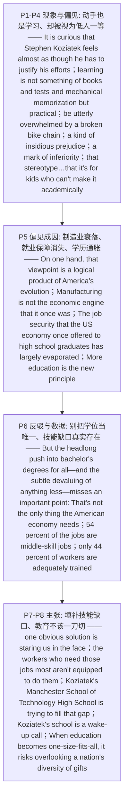

# 职业教育 精读笔记

## 背景

本文是 **2018 年考研英语（一）Text 1**（第 21—25 题），主题是**职业教育（vocational education）的价值与社会偏见之间的张力**。文章从新罕布什尔州教师**斯蒂芬·科兹亚特克（Stephen Koziatek）** 的困惑切入，层层追问"**为什么'动手也是学习'这件事，竟需要为自己辩解**"，最终收束为一记**警钟**：教育不该"一刀切"，一个国家的**天赋多样性**不该被忽视。

文章**先立现象、再剖成因、后亮主张**，是一条极清晰的"**偏见 → 成因 → 缺口 → 主张**"推进链。**开篇定调**即用 `It is curious that … he has to justify his efforts` 的**形式主语 + 好奇语气**，抛出作者的质疑（P1）；随即展示他所任教的新罕布什尔州高中——"**学习不是书本、考试和机械记忆，而是实践**"（`learning is not something of books and tests and mechanical memorization, but practical`），并用一连串反问点出**动手能力的缺失**：学生能背出美国总统却"被一根断掉的自行车链条彻底难倒"（`be utterly overwhelmed by a broken bike chain`）——这是**第 21 题的题眼**（[B] `practical ability`）。

**第二层是偏见的剖析（P4—P5）**：科兹亚特克发现一种**不易察觉的偏见**——`an insidious prejudice`，动手做事被看作"**低人一等的标志**"（`a mark of inferiority`），职业教育类学校背负"**那是给学业上不成器的孩子准备的**"的**刻板印象**（`have that stereotype…that it's for kids who can't make it academically`）——这是**第 22 题的答案区**（[D] `are not academically successful`）。作者**并不简单否定这种看法**，而是**先承认它有其合乎逻辑的来源**：制造业不再是当年的经济引擎（`Manufacturing is not the economic engine that it once was`），美国经济曾给高中毕业生的**就业保障已基本消失**（`The job security … has largely evaporated`）——这是**第 23 题的定位区**（[A] `used to have more job opportunities`）。

**第三层转向反驳（P6）**：作者用 `But` 亮出主张——"**让所有人都一头扎进学士学位的冒进之举**（`the headlong push into bachelor's degrees for all`），以及对**任何低于学士学历者的隐性贬低**（`the subtle devaluing of anything less`），**忽略了一个要点**"，即**学位并非经济的唯一所需**——这是**第 24 题的题眼**（[C] `indicates the overvaluing of higher education`）。紧接着用**数据对比**坐实"技能缺口"：全国 **54% 的岗位是中等技能岗位**（`middle-skill jobs`），而**只有 44% 的劳动者得到充分培训**（`adequately trained`）。

**末两段收束为解决方案与主张（P7—P8）**：作者断言**显而易见的答案就摆在眼前**（`one obvious solution is staring us in the face`）——**蓝领岗位存在缺口，而最需要这些工作的劳动者却没有能力胜任**（`aren't equipped to do them`），科兹亚特克的曼彻斯特技术高中正在**填补这一缺口**（`fill that gap`）。全文以**警钟**作结：`Koziatek's school is a wake-up call`——**当教育变成"一刀切"，它就有可能忽视一个国家天赋的多样性**（`risks overlooking a nation's diversity of gifts`），这既是**第 25 题**作者态度 [C] `supportive` 的收尾依据，也是全文主旨所在。

---

## 文章原文

# 2018 Passage 1

It is **curious** that Stephen Koziatek feels almost **as though** he has to **justify** his efforts to give his students a better future.

> [!abstract]- 长难句分析
> **原句**：It is **curious** that Stephen Koziatek feels almost **as though** he has to **justify** his efforts to give his students a better future.
>
> **主干提取**：
>
> - 形式主语 it: It
> - 谓语 V（系动词）: is
> - 表语 C: curious
> - 真正主语（主语从句）: that Stephen Koziatek feels almost as though he has to justify his efforts to give his students a better future
> - 从句主语 S: Stephen Koziatek
> - 从句谓语 V（系动词）: feels
> - 从句表语 C（as though 从句）: almost as though he has to justify his efforts
> - as though 从句主语 S: he
> - as though 从句谓语 V: has to justify
> - as though 从句宾语 O: his efforts
> - 后置定语（不定式）: to give his students a better future
>
> **修饰成分**：
>
> | 类型 | 引导词 / 形式 | 修饰对象 |
> |------|--------------|----------|
> | 主语从句（真正主语） | that | it（形式主语） |
> | 表语从句（比拟） | as though | feels |
> | 不定式作后置定语 | to give | his efforts |
> | 形容词作定语 | better | future |
>
> **结构图解**：
>
> ```
> 主句: It + is + curious
>   ├── 形式主语: it → 真正主语是 that 从句
>   └── 主语从句: Stephen Koziatek + feels + (表语从句)
>         └── 表语从句（比拟）: almost as though + he + has to justify + his efforts
>               └── 后置定语（不定式）: (to give his students a better future) → 修饰 his efforts
> ```
>
> **参考译文**：奇怪的是，斯蒂芬·科兹亚特克几乎觉得自己不得不为"给学生一个更好未来"的努力作出辩解。
>
> **考点提示**：① **形式主语 it**——真正主语是 `that` 从句（`It is curious that …`），翻译时把从句提到主语位置。② **`as though` 引导表语从句**，跟在系动词 `feels` 后表"仿佛"；此处表**事实可能**，故用陈述语气 `has to justify`，**不是虚拟语气**。③ **不定式 `to give` 作后置定语**，修饰 `his efforts`（"为学生争取更好未来的**努力**"）。④ 本句是**全文定调句**：`curious`（奇怪）一词透出作者对"职业教育竟需要辩解"这一现象的**质疑态度**，是第 25 题 `supportive` 态度的起点。

Mr. Koziatek is part of something **pioneering**. He is a teacher at a New Hampshire high school where learning is not something of books and tests and mechanical **memorization**, but **practical**.

> [!abstract]- 长难句分析
> **原句**：He is a teacher at a New Hampshire high school where learning is not something of books and tests and mechanical **memorization**, but **practical**.
>
> **主干提取**：
>
> - 主语 S: He
> - 谓语 V（系动词）: is
> - 表语 C: a teacher
> - 后置定语（介词短语）: at a New Hampshire high school
> - 定语从句（关系副词 where）: where learning is not something of books and tests and mechanical memorization, but practical
> - 从句主语 S: learning
> - 从句谓语 V（系动词）: is
> - 从句表语 C: not something of books and tests and mechanical memorization, but practical
>
> **修饰成分**：
>
> | 类型 | 引导词 / 形式 | 修饰对象 |
> |------|--------------|----------|
> | 介词短语作后置定语 | at | a teacher |
> | 定语从句（关系副词 where） | where | a New Hampshire high school |
> | 对照并列 | not … but … | something … / practical |
> | 三项并列 | and … and | books / tests / mechanical memorization |
> | 介词短语作后置定语 | of | something |
>
> **结构图解**：
>
> ```
> 主句: He + is + a teacher
>   └── 后置定语（介短）: (at a New Hampshire high school) → 修饰 a teacher
>         └── 定语从句（where）: learning + is + [not something … but practical] → 修饰 high school
>               ├── 对照并列: not (something of books and tests and mechanical memorization) but (practical)
>               └── 三项并列: books / tests / mechanical memorization
> ```
>
> **参考译文**：他是新罕布什尔州一所高中的教师，在这所学校里，学习不是书本、考试和机械记忆，而是实践。
>
> **考点提示**：① **`where` 引导定语从句**修饰 `high school`（= in which），`where` 在从句中作**地点状语**，从句主谓宾完整（`learning is practical`）。② **`not … but …` 对照并列**，语义重心在 `but` 之后——`practical`（实践的）是作者对"理想学习"的定义。③ 三项并列 `books and tests and mechanical memorization`，连用 `and` 表"琐碎列举"，带贬义，与 `but practical` 形成反差。④ 第 21 题 `practical ability` 的语义源头即在本句。

When did it become **accepted wisdom** that students should be able to name the 13th president of the United States but be **utterly overwhelmed** by a broken bike chain?

> [!abstract]- 长难句分析
> **原句**：When did it become **accepted wisdom** that students should be able to name the 13th president of the United States but be **utterly overwhelmed** by a broken bike chain?
>
> **主干提取**：
>
> - 疑问词（疑问状语）: When
> - 助动词: did
> - 形式主语 it: it
> - 谓语 V（系动词）: become
> - 表语 C: accepted wisdom
> - 真正主语（主语从句）: that students should be able to name the 13th president of the United States but be utterly overwhelmed by a broken bike chain
> - 从句主语 S: students
> - 从句谓语 V: should be able to name … but (should) be overwhelmed …
>
> **修饰成分**：
>
> | 类型 | 引导词 / 形式 | 修饰对象 |
> |------|--------------|----------|
> | 形式主语 it / 主语从句 | it / that | 从句为真正主语 |
> | 情态动词 | should | students |
> | 对照并列（but） | but | name … / (should) be overwhelmed … |
> | 过去分词作前置定语 | accepted / broken | wisdom / bike chain |
> | 介词短语作后置定语 | of the United States | the 13th president |
> | 被动语态 | be overwhelmed by | students |
>
> **结构图解**：
>
> ```
> 主句（疑问句）: When + did + it + become + accepted wisdom
>   ├── 形式主语: it → 真正主语是 that 从句
>   └── 主语从句: students + should be able to name + the 13th president … but (should) be overwhelmed by a broken bike chain
>         └── 对照并列: [name the 13th president] ↔ [be overwhelmed by a broken bike chain]
> ```
>
> **参考译文**：究竟从什么时候起，"学生应该能说出美国第 13 任总统是谁，却会被一根断掉的自行车链条彻底难倒"竟成了一种公认的智慧？
>
> **考点提示**：① **疑问句中的形式主语 `it`**：`When did it become … that …` 还原为陈述句即 `It became accepted wisdom that …`。② **`but` 后并列谓语共用情态动词**：`should be able to name … but (should) be overwhelmed …`，`but` 后省略了 `should`。③ `accepted wisdom` 带**反讽**——作者质疑这种"共识"凭什么成立。④ **第 21 题题眼**：`broken bike chain`（断掉的自行车链条）↔ [B] `practical ability`（动手能力），"能背总统却修不好车链"正是"**动手能力缺失**"的具象化。

As Koziatek knows, there is learning in just about everything. Nothing is necessarily gained by forcing students to learn geometry at a **graffitied** desk stuck with generations of discarded chewing gum.

> [!abstract]- 长难句分析
> **原句**：Nothing is necessarily gained by forcing students to learn geometry at a **graffitied** desk stuck with generations of discarded chewing gum.
>
> **主干提取**：
>
> - 主语 S: Nothing
> - 谓语 V（被动语态）: is necessarily gained
> - 方式状语 A: by forcing students to learn geometry at a graffitied desk …
> - 动名词（介词宾语）: forcing
> - 宾语 O: students
> - 宾语补足语（不定式）: to learn geometry
> - 地点状语: at a graffitied desk (stuck with …)
>
> **修饰成分**：
>
> | 类型 | 引导词 / 形式 | 修饰对象 |
> |------|--------------|----------|
> | 被动语态 | be + done | Nothing |
> | 副词作状语 | necessarily | is gained |
> | 介词短语作方式状语 | by | is gained |
> | 动名词作介词宾语 | forcing | by |
> | 不定式作宾语补足语 | to learn | forcing students |
> | 过去分词作前置定语 | graffitied / discarded | desk / chewing gum |
> | 过去分词短语作后置定语 | stuck with | a graffitied desk |
> | 介词短语作后置定语 | of | generations |
>
> **结构图解**：
>
> ```
> 主句: Nothing + is necessarily gained
>   └── 方式状语（介短）: (by forcing students to learn geometry …)
>         ├── 动名词: forcing
>         ├── 宾语 + 宾补: students + (to learn geometry)
>         └── 地点状语: (at a graffitied desk …)
>               └── 后置定语（过去分词短语）: (stuck with generations of discarded chewing gum) → 修饰 a graffitied desk
> ```
>
> **参考译文**：逼着学生在贴满涂鸦、粘着一代代人丢弃的口香糖的课桌上学习几何，未必有什么收获。
>
> **考点提示**：① **被动语态 + `by doing` 方式状语**：`is gained by forcing …`（通过……而获得）。② **过去分词短语 `stuck with …` 作后置定语**修饰 `a graffitied desk`（= which is stuck with …），**切勿误当主句谓语**，否则 `Nothing` 就没了谓语。③ `Nothing is necessarily gained`（未必有收获）是**部分否定语气**，为下句"组装自行车也能学几何"作铺垫。

They can also learn geometry by assembling a bicycle.

But he's also found a kind of **insidious prejudice**. Working with your hands is seen as almost a mark of **inferiority**. School in the family of **vocational education** "have that **stereotype**…that it's for kids who can't make it **academically**," he says.

> [!abstract]- 长难句分析
> **原句**：School in the family of **vocational education** "have that **stereotype**…that it's for kids who can't make it **academically**," he says.
>
> **主干提取**：
>
> - 引述句（主谓倒置）: he says
> - 引述内容（作 says 的宾语）: School in the family of vocational education "have that stereotype…that it's for kids who can't make it academically"
> - 引述内容主语 S: School in the family of vocational education
> - 引述内容谓语 V: have
> - 引述内容宾语 O: that stereotype
> - 同位语从句: that it's for kids who can't make it academically
> - 同位语从句主语 S: it
> - 同位语从句谓语 V（系动词）: is
> - 同位语从句表语 C: for kids
>
> **修饰成分**：
>
> | 类型 | 引导词 / 形式 | 修饰对象 |
> |------|--------------|----------|
> | 引述句（主谓倒置） | he says | 全句 |
> | 介词短语作后置定语 | in the family of | School |
> | 同位语从句（that 不作成分） | that | stereotype |
> | 定语从句（who 作主语） | who | kids |
> | 否定 + 习语 | can't make it | kids |
>
> **结构图解**：
>
> ```
> 主句（引述句）: he + says + [引述内容]
>   ├── 引述内容主语: School + (in the family of vocational education)
>   ├── 引述内容谓语 + 宾语: have + that stereotype
>   └── 同位语从句: that + it + is + for kids
>         └── 定语从句（who 作主语）: who can't make it academically → 修饰 kids
> ```
>
> **参考译文**：他说道，职业教育类的学校"都带有那种刻板印象……认为它是给那些学业上不成器的孩子准备的"。
>
> **考点提示**：① **引述句主谓倒置** `he says`——主语是 `he`，不是 `says`。② **`that it's for kids …` 是同位语从句**：`that` 只起连接作用、在从句中**不作成分**，说明 `stereotype`（刻板印象）的内容；区别于定语从句（`that` 须作主/宾/表）。③ **`who can't make it academically` 是定语从句**修饰 `kids`；`make it` = **成功、成器**（熟词生义）。④ **第 22 题题眼**：[D] `are not academically successful` 即 `can't make it academically` 的**同义复现**，与 `prejudice / stereotype` 直接对应。

On one hand, that viewpoint is a **logical product** of America's evolution. Manufacturing is not the economic **engine** that it once was. The job security that the US economy once offered to high school graduates has largely **evaporated**.

> [!abstract]- 长难句分析
> **原句**：The job security that the US economy once offered to high school graduates has largely **evaporated**.
>
> **主干提取**：
>
> - 主语 S: The job security
> - 定语从句: that the US economy once offered to high school graduates
> - 谓语 V: has largely evaporated
>
> **修饰成分**：
>
> | 类型 | 引导词 / 形式 | 修饰对象 |
> |------|--------------|----------|
> | 定语从句（that 作 offered 的宾语） | that | The job security |
> | 时间副词 | once | offered |
> | 介词短语（对象状语） | to | offered |
> | 现在完成时 + 程度副词 | has largely evaporated | 主语 |
>
> **结构图解**：
>
> ```
> 主句: The job security + has largely evaporated
>   └── 定语从句（that 作 offered 的宾语）: (that) the US economy once offered to high school graduates → 修饰 The job security
> ```
>
> **参考译文**：美国经济曾为高中毕业生提供的就业保障已基本消失。
>
> **考点提示**：① **定语从句把主语与谓语远远隔开**：剥离 `that the US economy once offered …` 后，主句是 `The job security … has largely evaporated`（就业保障……已消失）；**读长句先"找回主谓"。** ② `that` 在从句中作 `offered` 的**宾语**（故可省略），`offered` 的逻辑主语是 `the US economy`。③ **`once`（曾经，过去时）+ `has largely evaporated`（现在完成时）** 联手构成"**昔有今无**"，正是**第 23 题** [A] `used to have more job opportunities` 的依据。

More education is the new principle. We want more for our kids, and **rightfully** so.

But the **headlong push** into bachelor's degrees for all—and the **subtle devaluing** of anything less—misses an important point: That's not the only thing the American economy needs.

> [!abstract]- 长难句分析
> **原句**：But the **headlong push** into bachelor's degrees for all—and the **subtle devaluing** of anything less—misses an important point: That's not the only thing the American economy needs.
>
> **主干提取**：
>
> - 转折连词: But
> - 主语 S: the headlong push into bachelor's degrees for all
> - 谓语 V: misses
> - 宾语 O: an important point
> - 冒号解释（同位语/解释性从句）: That's not the only thing the American economy needs
>
> **修饰成分**：
>
> | 类型 | 引导词 / 形式 | 修饰对象 |
> |------|--------------|----------|
> | 介词短语作后置定语 | into | the headlong push |
> | 介词短语作后置定语 | for | bachelor's degrees |
> | 破折号插入语（与主语并列） | —and …— | 主语 the headlong push |
> | 介词短语作后置定语 | of | the subtle devaluing |
> | 冒号引出同位语/解释 | : | an important point |
> | 定语从句（省略关系代词） | (that) | the only thing |
>
> **结构图解**：
>
> ```
> 主句: the headlong push … + misses + an important point
>   ├── 后置定语（介短）: (into bachelor's degrees for all) → 修饰 the headlong push
>   ├── 破折号插入语（并列）: —and the subtle devaluing of anything less— → 与主语并列
>   └── 冒号解释（同位语从句）: That's not the only thing (that) the American economy needs
>         └── 定语从句（省略 that）: (that) the American economy needs → 修饰 the only thing
> ```
>
> **参考译文**：但是，这种让所有人都一头扎进学士学位的冒进之举——以及对任何低于学士学历者的隐性贬低——忽略了一个要点：这并非美国经济唯一需要的东西。
>
> **考点提示**：① **破折号插入语把主语与谓语隔开**：主语是 `the headlong push …`，谓语是 `misses`；若把插在中间的 `the subtle devaluing` 误当主语，主谓就配错。② **冒号引出同位语（解释性从句）**，`That` 指代"**普及学士学位**"这一做法；考研阅读中冒号、破折号后常是**观点的落点**。③ `the only thing (that) the American economy needs` 中**关系代词作宾语而省略**。④ **第 24 题题眼**：`the subtle devaluing of anything less`（对更低学历者的隐性贬低）↔ [C] `indicates the overvaluing of higher education`（暗示对高等教育的**高估**）。

Yes, a bachelor's degree opens more doors. But even now, 54 percent of the jobs in the country are **middle-skill jobs**, such as construction and high-skill manufacturing. But only 44 percent of workers are **adequately trained**.

In other words, at a time when the working class has turned the country on its political head, **frustrated** that the opportunity that once defined America is **vanishing**, one obvious solution is **staring us in the face**.

> [!abstract]- 长难句分析
> **原句**：In other words, at a time when the working class has turned the country on its political head, **frustrated** that the opportunity that once defined America is **vanishing**, one obvious solution is **staring us in the face**.
>
> **主干提取**：
>
> - 插入语: In other words
> - 时间状语 A: at a time when the working class has turned the country on its political head, frustrated that …
> - 主语 S: one obvious solution
> - 谓语 V（进行时）: is staring
> - 宾语 O: us
> - 状语: in the face
>
> **修饰成分**：
>
> | 类型 | 引导词 / 形式 | 修饰对象 |
> |------|--------------|----------|
> | 插入语（连接性状语） | In other words | 全句 |
> | 定语从句（关系副词 when） | when | a time |
> | 现在完成时 | has turned | the working class |
> | 过去分词短语作状语（原因/伴随） | frustrated that … | the working class |
> | 宾语从句 | that | frustrated |
> | 定语从句（that 作主语） | that | the opportunity |
> | 习语 | turn sth on its head | — |
> | 习语 | stare sb in the face | — |
>
> **结构图解**：
>
> ```
> 主句: one obvious solution + is staring + us + in the face
>   ├── 插入语: In other words
>   └── 时间状语: (at a time …)
>         └── 定语从句（when）: the working class + has turned + the country + on its political head → 修饰 a time
>               └── 分词状语（frustrated that …）: → 修饰 the working class
>                     └── 宾语从句（that）: the opportunity (that once defined America) + is vanishing
>                           └── 定语从句（that 作主语）: (that) once defined America → 修饰 the opportunity
> ```
>
> **参考译文**：换言之，在工人阶级已经把这个国家的政治格局彻底颠覆、并为曾定义美国的那种机会正在消失而深感挫败的当下，一个显而易见的解决方案就摆在眼前。
>
> **考点提示**：① **三层嵌套从句**（`when` 定语从句 → `frustrated that` 宾语从句 → `that once defined America` 定语从句），用"**括号法**"逐层剥离，**主句其实极短**：`one obvious solution is staring us in the face`。② `frustrated that …` 是**过去分词短语作状语**，逻辑主语是 `the working class`（= and it is frustrated that …）。③ **`turn sth on its head`** = 彻底颠覆（习语）；**`stare sb in the face`** = 明摆在某人眼前（习语）。④ 本句是全文最长句，也是**论证枢纽句**——由"偏见/成因"转向"技能缺口与解决方案"。

There is a **gap** in working-class jobs, but the workers who need those jobs most aren't **equipped** to do them. Koziatek's Manchester School of Technology High School is trying to fill that gap.

Koziatek's school is a **wake-up call**. When education becomes **one-size-fits-all**, it risks **overlooking** a nation's **diversity of gifts**.

> [!abstract]- 长难句分析
> **原句**：When education becomes **one-size-fits-all**, it risks **overlooking** a nation's **diversity of gifts**.
>
> **主干提取**：
>
> - 时间/条件状语从句: When education becomes one-size-fits-all
> - 主语 S: it（= education）
> - 谓语 V: risks
> - 宾语 O（动名词短语）: overlooking a nation's diversity of gifts
>
> **修饰成分**：
>
> | 类型 | 引导词 / 形式 | 修饰对象 |
> |------|--------------|----------|
> | 状语从句（when） | when | 主句 |
> | 表语（系动词 become） | one-size-fits-all | education |
> | 动名词作宾语（risk doing） | overlooking | risks |
> | 名词所有格 + of 后置定语 | a nation's / of gifts | diversity |
>
> **结构图解**：
>
> ```
> 主句: it + risks + [overlooking a nation's diversity of gifts]
>   ├── 状语从句（when）: education + becomes + one-size-fits-all
>   └── 动名词作宾语（risk doing）: (overlooking …) → risks
>         └── 后置定语: (of gifts) → 修饰 diversity
> ```
>
> **参考译文**：当教育变成"一刀切"时，它就有可能忽视一个国家天赋的多样性。
>
> **考点提示**：① **`when` 引导状语从句**，表"当……时（便会有……的风险）"。② **`risk doing sth`**（冒险做某事）——**`risk` 后接动名词，不能接 `to do`**。③ `it` 指代 `education`。④ `gifts` 此处指**天赋、才能**（熟词生义）。⑤ **末句点题**：作者在此收束为"**教育不该一刀切、应珍视天赋的多样性**"，是**第 25 题**作者态度 [C] `supportive` 的收尾依据。

---

## 题目

### 21. A broken bike chain is mentioned to show students' lack of ____.

- [A] academic training
- [B] practical ability
- [C] pioneering spirit
- [D] mechanical memorization

### 22. There exists the prejudice that vocational education is for kids who ____.

- [A] have a stereotyped mind
- [B] have no career motivation
- [C] are financially disadvantaged
- [D] are not academically successful

### 23. We can infer from Paragraph 5 that high school graduates ____.

- [A] used to have more job opportunities
- [B] used to have big financial concerns
- [C] are entitled to more educational privileges
- [D] are reluctant to work in manufacturing

### 24. The headlong push into bachelor's degrees for all ____.

- [A] helps create a lot of middle-skill jobs
- [B] may narrow the gap in working-class jobs
- [C] indicates the overvaluing of higher education
- [D] is expected to yield a better-trained workforce

### 25. The author's attitude toward Koziatek's school can be described as ____.

- [A] tolerant
- [B] cautious
- [C] supportive
- [D] disappointed

---

## 翻译对照

# 2018 Passage 1 中英对照翻译

## Paragraph 1

It is curious that Stephen Koziatek feels almost as though he has to justify his efforts to give his students a better future.

奇怪的是，斯蒂芬·科兹亚特克（Stephen Koziatek）几乎觉得自己不得不为自己"给学生一个更好未来"的努力作出辩解。

> [!note] 翻译说明
> - `It is curious that...` 中 `it` 是形式主语，真正主语是 `that` 从句。
> - `feels almost as though he has to justify` = "感觉自己几乎不得不去辩解"；`as though` 引导表语/方式状语，此处表示一种"仿佛"的心理状态。

## Paragraph 2

Mr. Koziatek is part of something pioneering. He is a teacher at a New Hampshire high school where learning is not something of books and tests and mechanical memorization, but practical. When did it become accepted wisdom that students should be able to name the 13th president of the United States but be utterly overwhelmed by a broken bike chain?

科兹亚特克先生参与着一件具有开创意义的事。他是新罕布什尔州一所高中的教师，在这所学校里，学习不是书本、考试和机械记忆，而是实践。究竟从什么时候起，"学生应该能说出美国第 13 任总统是谁，却会被一根断掉的自行车链条彻底难倒"竟成了一种公认的智慧？

> [!note] 翻译说明
> - `where` 引导定语从句修饰 `high school`，`not... but...` 结构译作"不是……而是……"。
> - `accepted wisdom` 意为"被普遍接受的（未必正确的）共识"，略带讽刺。
> - `be utterly overwhelmed by` = "被……彻底难住/压垮"，此处指动手能力极差。

## Paragraph 3

As Koziatek knows, there is learning in just about everything. Nothing is necessarily gained by forcing students to learn geometry at a graffitied desk stuck with generations of discarded chewing gum. They can also learn geometry by assembling a bicycle.

正如科兹亚特克所知，几乎一切事物中都蕴含着学习。逼着学生在贴满涂鸦、粘着一代代人丢弃的口香糖的课桌上学习几何，未必有什么收获。他们同样可以通过组装一辆自行车来学习几何。

> [!note] 翻译说明
> - `there is learning in just about everything` = "几乎万物皆可学习"。
> - `Nothing is necessarily gained by...` = "通过……未必能得到什么"；`by` 短语表方式。
> - `stuck with...` 是过去分词短语作后置定语，修饰 `a graffitied desk`。

## Paragraph 4

But he's also found a kind of insidious prejudice. Working with your hands is seen as almost a mark of inferiority. School in the family of vocational education "have that stereotype…that it's for kids who can't make it academically," he says.

但他也发现了一种不易察觉的偏见。动手做事几乎被视为一种低人一等的标志。他说道，职业教育类的学校"都带有那种刻板印象……认为它是给那些学业上不成器的孩子准备的"。

> [!note] 翻译说明
> - `insidious` = "暗中为害的、不易察觉的"，比普通的 `bad` 更强调隐蔽性。
> - `Working with your hands` 是动名词短语作主语。
> - `make it academically` = "在学业上取得成就/成功"，`make it` 意为"成功"。
> - 引语中 `School...have` 是原文口语化的主谓不一致表达，翻译时按复数处理。

## Paragraph 5

On one hand, that viewpoint is a logical product of America's evolution. Manufacturing is not the economic engine that it once was. The job security that the US economy once offered to high school graduates has largely evaporated. More education is the new principle. We want more for our kids, and rightfully so.

一方面，这种观点是美国发展演变的一个合乎逻辑的产物。制造业已不再是它曾经那样的经济引擎。美国经济曾为高中毕业生提供的就业保障已基本消失。接受更多教育成了新的准则。我们想让孩子得到更多，这也理所当然。

> [!note] 翻译说明
> - `On one hand` 与下段 `But` 构成"一方面……但是……"的让步转折结构。
> - `the economic engine that it once was` 中 `that` 引导定语从句，`it` 指代 `Manufacturing`。
> - `has largely evaporated` 用现在完成时，强调"（从过去持续到现在）已基本消失"。
> - `and rightfully so` = "而且理当如此"，是作者对这种心态的认可。

## Paragraph 6

But the headlong push into bachelor's degrees for all—and the subtle devaluing of anything less—misses an important point: That's not the only thing the American economy needs. Yes, a bachelor's degree opens more doors. But even now, 54 percent of the jobs in the country are middle-skill jobs, such as construction and high-skill manufacturing. But only 44 percent of workers are adequately trained.

但是，这种让所有人都一头扎进学士学位的冒进之举——以及对任何低于学士学历者的隐性贬低——忽略了一个要点：这并非美国经济唯一需要的东西。是的，学士学位能打开更多扇门。但即便到了现在，全国 54% 的岗位仍属于中等技能岗位，例如建筑和高技能制造。然而只有 44% 的劳动者得到了充分的培训。

> [!note] 翻译说明
> - `headlong push into` = "一头扎进、莽撞地涌向"，含贬义。
> - 破折号之间的 `and the subtle devaluing of anything less` 是插入的并列成分，作补充说明。
> - `That's not the only thing...needs` 中 `That` 指代"普及学士学位"这一做法。
> - 全段以数字对比（54% 岗位 vs 44% 受训劳动者）支撑"技能缺口"论点。

## Paragraph 7

In other words, at a time when the working class has turned the country on its political head, frustrated that the opportunity that once defined America is vanishing, one obvious solution is staring us in the face. There is a gap in working-class jobs, but the workers who need those jobs most aren't equipped to do them. Koziatek's Manchester School of Technology High School is trying to fill that gap.

换言之，在工人阶级已经把这个国家的政治格局彻底颠覆、并为自己曾定义美国的那种机会正在消失而深感挫败的当下，一个显而易见的解决方案就摆在眼前。蓝领工作存在缺口，但最需要这些工作的劳动者却没有能力胜任。科兹亚特克所在的曼彻斯特技术高中正在努力填补这一缺口。

> [!note] 翻译说明
> - `at a time when...` 中 `when` 引导定语从句修饰 `a time`；该从句内又嵌套两个 `that` 定语从句。
> - `has turned the country on its political head` = "把这个国家的政治彻底翻了个底朝天"，`turn sth on its head` 是习语，意为"彻底颠覆"。
> - `frustrated that...` 为过去分词短语作伴随/原因状语。
> - `is staring us in the face` = "就明摆在眼前"，形容方案显而易见。

## Paragraph 8

Koziatek's school is a wake-up call. When education becomes one-size-fits-all, it risks overlooking a nation's diversity of gifts.

科兹亚特克的学校是一记警钟。当教育变成"一刀切"时，它就有可能忽视一个国家天赋的多样性。

> [!note] 翻译说明
> - `a wake-up call` = "警钟、提醒人警觉的信号"。
> - `one-size-fits-all` 原指"均码适用"，引申为"一刀切的、千篇一律的"。
> - `a nation's diversity of gifts` = "这个国家（民众）天赋的多样性"，`gifts` 在此指"天赋、才能"。

---

## 题目翻译

### 21. A broken bike chain is mentioned to show students' lack of ____.

- [A] academic training
- [B] practical ability
- [C] pioneering spirit
- [D] mechanical memorization

- [A] 学术训练
- [B] 动手能力
- [C] 开拓精神
- [D] 机械记忆

> [!note] 翻译说明
> 答案 **[B]**。定位 P2—P3：作者反问"学生**该能说出美国第 13 任总统**，却会被一根断掉的自行车链条难倒"，并随即说"**逼学生在涂鸦课桌上背几何未必有收获**，他们也可以**通过组装自行车来学几何**"。`broken bike chain`（断掉的自行车链条）正指**动手能力（practical ability）的缺失**，与 P2 的 `but practical`（而是实践的）遥相呼应。
> [A] `academic training`（学术训练）：原文批评的恰是"只重书本、考试"而**轻动手**，方向**正相反**。
> [C] `pioneering spirit`（开拓精神）：`pioneering` 出现在 P2（`something pioneering`），但指的是**科兹亚特克所参与的开创性事业**，与"断掉的自行车链条"无关，属**张冠李戴**。
> [D] `mechanical memorization`（机械记忆）：这是原文中被**否定**的对象（`learning is not … mechanical memorization`），把它当作"学生所缺"是**正反倒置**。
> 提示：**例证题（举例说明型）** 的答案不在例子本身，而在**例子所服务的观点**——`broken bike chain` 服务于"动手能力被忽视"这一论点。

### 22. There exists the prejudice that vocational education is for kids who ____.

- [A] have a stereotyped mind
- [B] have no career motivation
- [C] are financially disadvantaged
- [D] are not academically successful

- [A] 思想刻板
- [B] 没有职业动力
- [C] 经济上处于劣势
- [D] 学业上不成功

> [!note] 翻译说明
> 答案 **[D]**。定位 P4：`School in the family of vocational education "have that stereotype…that it's for kids who can't make it **academically**"`——`can't make it academically` = **在学业上成不了器**，与 [D] `are not academically successful` 属**同义复现**（`make it` = 成功）。
> [A] `have a stereotyped mind`：张冠李戴——`stereotype`（刻板印象）是**外界对职业教育的看法**，不是"这些孩子本身思想刻板"。
> [B] `have no career motivation`（没有职业动力）：**无中生有**，原文只谈学业表现，未提职业动机。
> [C] `are financially disadvantaged`（经济上处于劣势）：**无中生有**，原文的偏见指向**学业能力**，不是家庭经济。
> 提示：**细节题**，题干 `the prejudice` 直接锁定 P4 的 `a kind of insidious prejudice` 与 `stereotype`，答案就在紧邻的定语从句里。

### 23. We can infer from Paragraph 5 that high school graduates ____.

- [A] used to have more job opportunities
- [B] used to have big financial concerns
- [C] are entitled to more educational privileges
- [D] are reluctant to work in manufacturing

- [A] 过去拥有更多就业机会
- [B] 过去有很大的经济压力
- [C] 有权享有更多教育特权
- [D] 不愿在制造业工作

> [!note] 翻译说明
> 答案 **[A]**。定位 P5：`The job security that the US economy **once offered** to high school graduates **has largely evaporated**`（美国经济**曾**为高中毕业生提供的就业保障**已基本消失**）——"**昔有今无**"的时间对照，正支撑 [A] `used to have more job opportunities`（**过去**有更多就业机会）。
> [B] `used to have big financial concerns`：原文说的是**就业保障消失**，不是"经济压力大"，属**概念偷换**。
> [C] `are entitled to more educational privileges`：**无中生有**，P5 未提"教育特权"。
> [D] `are reluctant to work in manufacturing`：原文只说**制造业不再是经济引擎**，未说毕业生"不愿"进入，属**无中生有 / 曲解**。
> 提示：**推断题**须抓时态线索——`once offered`（一般过去时）+ `has largely evaporated`（现在完成时）＝"**过去好、如今差**"，[A] 的 `used to` 正是这一时间逻辑的对应。

### 24. The headlong push into bachelor's degrees for all ____.

- [A] helps create a lot of middle-skill jobs
- [B] may narrow the gap in working-class jobs
- [C] indicates the overvaluing of higher education
- [D] is expected to yield a better-trained workforce

- [A] 有助于创造大量中等技能岗位
- [B] 可能缩小蓝领工作的缺口
- [C] 表明对高等教育的高估
- [D] 有望造就训练有素的劳动力

> [!note] 翻译说明
> 答案 **[C]**。定位 P6：`the headlong push into bachelor's degrees for all—and **the subtle devaluing of anything less**—misses an important point`（让所有人都一头扎进学士学位——以及**对更低学历者的隐性贬低**——忽略了要点）。`the subtle devaluing of anything less`（**贬低更低学历**）即**抬高高等教育**，与 [C] `indicates the overvaluing of higher education`（**表明对高等教育的高估**）同义替换。
> [A] `helps create a lot of middle-skill jobs`：**因果倒置**——`middle-skill jobs` 是客观存在的岗位缺口，**不是**"普及学士学位"带来的。
> [B] `may narrow the gap in working-class jobs`：**与作者主张正相反**——作者认为这种冒进**恰好忽视了**技能缺口，`narrow the gap` 是**解决方案**（`fill that gap`）的目标，而非这种做法的作用。
> [D] `is expected to yield a better-trained workforce`：与原文数据**相悖**——`only 44 percent of workers are adequately trained`，说明"受训不足"是现实问题。
> 提示：**态度／细节综合题**，抓 `But … misses an important point` 与破折号插入语 `the subtle devaluing of anything less`，即可锁定 [C]。

### 25. The author's attitude toward Koziatek's school can be described as ____.

- [A] tolerant
- [B] cautious
- [C] supportive
- [D] disappointed

- [A] 宽容的
- [B] 谨慎的
- [C] 支持的
- [D] 失望的

> [!note] 翻译说明
> 答案 **[C]**。定位全文末段：`Koziatek's school is a **wake-up call**`（是一记**警钟**）+ `When education becomes one-size-fits-all, it risks overlooking a nation's diversity of gifts`（教育"一刀切"就会忽视**天赋的多样性**）。作者既称其为**警醒社会的正面范例**，又用它引出**自己的主张**（应珍视天赋多样、填补技能缺口），态度明确为 **[C] `supportive`（支持的）**。
> [A] `tolerant`（宽容的）：指"容忍、不干涉"，语气**过弱**，未体现作者对它的**肯定**。
> [B] `cautious`（谨慎的）：原文对科兹亚特克的学校**毫无保留与疑虑**，`cautious` 与文意**不符**。
> [D] `disappointed`（失望的）：作者对其**赞赏有加**，与 [D] **正相反**。
> 提示：**态度题**先看作者用的**评价性词句**（`something pioneering`、`a wake-up call`、`fill that gap` 均为正面），再排除"正反颠倒"与"程度失当"的选项；开篇 `It is **curious** that … he has to justify his efforts` 的愤懑语气，针对的是**社会偏见**，而非科兹亚特克的学校。


---

## 语法要点

# 2018 Passage 1 语法要点整理

> [!note] 来源说明
> 本篇**用户未提供语法源笔记**，以下语法点由 `formatted-article.md` 与 `translation.md` **从本文推断提取**，仅收录本篇实际出现的语法现象。
> 每一条均给出**原文语境**，便于回原文核对；标注"（联动）"的条目与相邻专题互为参照。

---

## 一、从句

### 从句：that 引导的主语从句（It is curious that Stephen Koziatek feels …）

**概述**：`that` 从句作句子真正的主语，`it` 作形式主语前置。

| 结构 | 用法 | 例句 |
|------|------|------|
| `It is + adj. + that 从句` | `it` 为形式主语，`that` 从句是真正主语 | **It is curious that** Stephen Koziatek feels almost as though he has to justify his efforts. |
| `It + be + 过去分词 + that 从句` | 常见于 `It is said/reported/believed that …` | （同类引申）**It is accepted that** the system has failed. |

> [!tip] 解题技巧
> 读到 `It is curious/important/necessary that …` 时，**先跳过 `it` 找 `that` 后的真正主语**。本篇第 1 句的语义重心在 `that` 从句"（他）几乎不得不为自己的努力辩解"上，`curious` 是作者对"这种辩解心态"的评价。

### 从句：as though / as if 引导的表语从句（feels almost as though he has to justify …）

**概述**：`as though`（= as if）引导从句，常用在 `feel / look / seem / sound` 等系动词后，表示"仿佛……"的推测或比拟。

| 结构 | 用法 | 例句 |
|------|------|------|
| `feel + as though + 从句` | 表"感觉如此"的比拟 | he **feels almost as though** he has to justify his efforts |
| `as though + 虚拟语气` | 与现实相反时用过去式/过去完成 | （对比）he talks **as though** he **knew** everything. |

> [!warning] 易混点
> `as though` 从句若表**事实可能**，谓语用陈述语气（本篇 `has to justify` 是陈述，表"他确实感觉要辩解"）；若表**与事实相反**，才用虚拟语气。**别一见 `as though` 就套虚拟。**

### 从句：where 引导的定语从句（a New Hampshire high school where learning is … not … but practical）

**概述**：`where` = `in/at which`，先行词是表示**地点**的名词，在从句中作地点状语。

| 结构 | 用法 | 例句 |
|------|------|------|
| `n.(地点) + where + 完整句` | 关系副词作状语，从句不缺主/宾 | a high school **where** learning is not … but practical |

> [!tip] 解题技巧
> 判断用 `where` 还是 `which/that`：**看从句是否缺主语或宾语**。`where learning is practical` 中 `learning` 已是主语，不缺成分 → 用 `where`（= in which）。

### 从句：that 引导的定语从句（the economic engine that it once was 等）

**概述**：`that` 在定语从句中作**主语、宾语或表语**；作宾语时口语中可省略。

| 结构 | 用法 | 例句 |
|------|------|------|
| `n. + that + 不完整句`（作表语） | `that` 作从句表语（= which） | Manufacturing is not the economic engine **that it once was**. |
| `n. + that + 不完整句`（作宾语） | `that` 作从句宾语，可省 | the job security **that** the US economy once offered … / the opportunity **that** once defined America |
| `n. + that + 从句`（作主语） | `that` 作从句主语 | the **subtle devaluing** of anything less |

> [!warning] 常见错误
> `the economic engine that it once was` 中的 `it` **指代 `Manufacturing`**，`that` 是表语（= the economic engine）。若误以为 `that` 作宾语，会读成"引擎拥有它"，语义全错。**`that` 的句法角色要按"从句缺什么"反推。**

### 从句：when 引导的定语从句（at a time when the working class has turned …）

**概述**：`when` = `at/during which`，先行词是表**时间**的名词，在从句中作时间状语。本篇该从句内**再嵌套两个 `that` 定语从句**（`the opportunity that once defined America is vanishing`），是本篇最长的嵌套结构。

| 结构 | 用法 | 例句 |
|------|------|------|
| `a time + when + 完整句` | 关系副词作时间状语 | at **a time when** the working class has turned the country on its political head |
| `when 从句内再嵌 that 从句` | 多层嵌套，逐层剥离 | frustrated that the opportunity **that once defined America** is vanishing |

> [!tip] 解题技巧
> 遇到多层嵌套（第 7 段：`at a time when … frustrated that … that once defined America …`），用**"括号法"逐层剥离**：先划出 `at a time when [ …… ]`，再在方括号内划出 `frustrated that [ …… ]`，最后在方括号内划出 `the opportunity that once defined America`。**每次只处理一层，主干自然浮现。**

### 从句：that 引导的同位语从句（the stereotype … that it's for kids who can't make it）

**概述**：`that` 从句说明前面**抽象名词**的具体内容（如 `stereotype / fact / idea / belief / news / hope`），`that` 只起连接作用，不作成分。

| 结构 | 用法 | 例句 |
|------|------|------|
| `抽象 n. + that + 完整句` | `that` 不作成分，解释名词内容 | that **stereotype**…**that** it's for kids who can't make it academically |

> [!tip] 区分"定语从句"还是"同位语从句"
> **看 `that` 在从句中作不作成分**：作成分（主/宾/表）→ 定语从句（如 `the engine that it once was`）；不作成分、从句完整 → 同位语从句（如 `the stereotype that it's for kids …`）。**同位语从句还常可加 `namely`（即）来验证。**

### 从句：that 引导的宾语从句（frustrated that the opportunity … is vanishing）

**概述**：`that` 从句作形容词 `frustrated` 的宾语，说明"因何而受挫"。这类"形容词 + that 从句"常见于 `afraid / sure / glad / frustrated / worried that …`。

| 结构 | 用法 | 例句 |
|------|------|------|
| `be + adj.(情感) + that + 完整句` | `that` 从句说明情感原因 | **frustrated that** the opportunity … is vanishing |

> [!tip] 解题技巧
> `frustrated that …` 在本句中作**伴随/原因状语**（修饰 `the working class`）。翻译时补出"因……而"更通顺：**"（他们）因曾定义美国的那种机会正在消失而深感挫败"**。

---

## 二、非谓语动词

### 非谓语：动名词短语作主语（Working with your hands is seen as …）

**概述**：动名词短语作主语，谓语用**单数**。

| 结构 | 用法 | 例句 |
|------|------|------|
| `v-ing + is/was …` | 动名词短语作主语，谓语单数 | **Working with your hands** is seen as almost a mark of inferiority. |

> [!warning] 主谓一致陷阱
> 主语是 `Working with your hands`（一件事），谓语用 **`is`**，不能因靠近 `hands` 而用 `are`。**"动名词/不定式作主语 = 单数"。**（联动）与 [[intermediate/2017-passage4-wildfire/grammar-notes|2017 P4]] 的 `Failing to recognize … leads to …` 同型。

### 非谓语：动名词作介词宾语（by forcing / by assembling / of anything less）

**概述**：介词后接动名词（`by doing` 表方式；`of doing` 表内容）。

| 结构 | 用法 | 例句 |
|------|------|------|
| `by + v-ing` | 表"通过……（方式）" | Nothing is necessarily gained **by forcing** students to learn geometry. |
| `by + v-ing` | 表方式 | They can also learn geometry **by assembling** a bicycle. |
| `of + v-ing / n.` | 名词后接介词短语 | the subtle devaluing **of anything less** |

> [!tip] 解题技巧
> `by + doing` 是**方式状语**的高频信号，读到时问一句"**通过什么手段**"。本篇两句 `by forcing …` / `by assembling …` 恰好构成**正反对照**（强迫 vs 动手），作者立场由此透出。

### 非谓语：不定式作后置定语（efforts to give … / ability to name …）

**概述**：不定式常跟在抽象名词后作定语，说明其内容（`efforts / ability / attempt / chance / right / need to do …`）。

| 结构 | 用法 | 例句 |
|------|------|------|
| `n. + to do` | 不定式作后置定语 | his **efforts to give** his students a better future |
| `n. + to do` | 不定式作后置定语 | students should be able to **name** the 13th president |

> [!note] 补充说明
> `be able to do` 中的 `ability` 逻辑上隐含；`name` 在此为**动词**，义为"说出……的名字"（熟词生义，非"名字"）。

### 非谓语：不定式作目的状语（to give his students a better future）

**概述**：不定式表目的，常译为"为了/去"。

| 结构 | 用法 | 例句 |
|------|------|------|
| `to do sth` | 目的状语 | he has to justify his efforts **to give** his students a better future |

> [!warning] 易混点
> 本句 `to give` 究竟修饰 `efforts`（不定式定语）还是作 `justify` 的目的状语？—— 语义上"努力（是）为了给学生更好未来"，两者关系密切；**考试按"efforts to do"这个整体名词短语理解即可**，不必强行切分。

### 非谓语：过去分词作前置定语（a graffitied desk / a broken bike chain / discarded chewing gum）

**概述**：过去分词作前置定语，表**被动或已发生**。

| 结构 | 用法 | 例句 |
|------|------|------|
| `done + n.` | 被动/完成，作前置定语 | a **graffitied** desk / a **broken** bike chain / **discarded** chewing gum |
| `done + n.` | 同上 | **accepted** wisdom（被普遍接受的智慧） |

> [!tip] 解题技巧
> `a broken bike chain`（被弄断的链条）是**被动**意味的过去分词——链条是"被弄断的"，不是"自己断"。第 21 题正以此为眼，考查 `practical ability`（动手能力）。

### 非谓语：过去分词短语作后置定语（stuck with … / equipped to do them）

**概述**：过去分词短语后置作定语，相当于**省略了被动语态的定语从句**。

| 结构 | 用法 | 例句 |
|------|------|------|
| `n. + done + 介词短语` | 后置定语（= which is done） | a graffitied desk **stuck with generations of discarded chewing gum** |
| `n. + done + to do` | 后置定语（= who are done） | the workers … aren't **equipped to do them** |

> [!warning] 常见错误
> `stuck with …` 若误当作谓语动词，会读成"课桌粘住……"，整句主语就没了。**"名词 + 过去分词短语 + ，"多为后置定语**，真正的谓语还在后面。

### 非谓语：过去分词作状语（frustrated that …）

**概述**：过去分词短语作状语，表**伴随、原因或状态**，逻辑主语 = 主句主语。

| 结构 | 用法 | 例句 |
|------|------|------|
| `done …, 主句` | 原因/伴随状语 | the working class … , **frustrated that** the opportunity … is vanishing |

> [!tip] 解题技巧
> 分析时**补出逻辑主语与连词**：= `and the working class is frustrated that …`，即"工人阶级（因）……而受挫"。**补连词是判断分词状语功能的通法。**

---

## 三、时态与情态

### 时态：现在完成时（has largely evaporated / has turned … on its political head）

**概述**：现在完成时表**从过去持续到现在**或**对现在有影响**。

| 结构 | 用法 | 例句 |
|------|------|------|
| `have/has + done` | 动作完成并对现在有影响 | The job security … **has largely evaporated**. |
| `have/has + done` | 强调"已经（把……弄成……）" | the working class **has turned** the country on its political head |

> [!tip] 解题技巧
> `has largely evaporated`（已基本消失）是**第 23 题**（[A] `used to have more job opportunities`）的核心依据——"曾经拥有→如今消失"正是现在完成时 `has largely evaporated` + 一般过去时 `once offered` 的联手表达。

### 时态：一般过去时与一般现在时对比（is not the economic engine that it once was）

**概述**：**一般现在时 + 一般过去时**同句对照，用来刻画"**今昔之变**"。

| 结构 | 用法 | 例句 |
|------|------|------|
| `is not … + that it once was` | 现在时否定 + 过去时定语从句，凸显"已非昔日" | Manufacturing **is** not the economic engine that it **once was**. |
| `once did/offered … has done` | 过去时 + 现在完成时并用 | the US economy **once offered** … has largely **evaporated** |

> [!warning] 易混点
> `once`（曾经）是**过去时**的强信号；`has/have + done` 是**现在完成时**的标志。本篇两者密集出现，考的正是"**昔有今无**"的时间逻辑——**态度题与推断题常靠这条时间线立论。**

### 情态：should + 动词原形（students should be able to name …）

**概述**：`should` 表"应该"（义务/预期），后接动词原形。

| 结构 | 用法 | 例句 |
|------|------|------|
| `should + do` | 表应当、按理应 | students **should be able to name** the 13th president |

> [!note] 补充说明
> 本句 `When did it become accepted wisdom that students **should** …` 是**反问**，作者借 `should` 暗示这是**被质疑的"共识"**。同一句里 `should be able to name`（能说出建国元勋）与 `be utterly overwhelmed by a broken bike chain`（却被断链条难倒）形成**辛辣对照**。

---

## 四、语态

### 语态：被动语态（is seen as / are adequately trained / be overwhelmed by）

**概述**：本篇多处用被动，或突出**受动者**，或表示**普遍看法**。

| 结构 | 用法 | 例句 |
|------|------|------|
| `be + done + as` | 被动 + 补足语 | Working with your hands **is seen as** almost a mark of inferiority. |
| `be + done` | 被动，突出结果 | only 44 percent of workers **are adequately trained**. |
| `be + done + by` | 被动 + 施动者 | but **be utterly overwhelmed by** a broken bike chain |

> [!tip] 解题技巧
> `is seen as a mark of inferiority`（被视为低人一等）——**被动 + 泛指主语**，暗示这是"社会普遍偏见"而非某个人观点，正是第 22 题 `prejudice`（偏见）的语法依据。**被动语态常用来"隐去施动者"，从而表达"普遍看法"。**

---

## 五、特殊句式

### 特殊句式：it 作形式主语（It is curious that …）

**概述**：`it` 占主语位，真正主语（`that` 从句 / 不定式）后置，避免句子头重脚轻。

| 结构 | 用法 | 例句 |
|------|------|------|
| `It is + adj. + that 从句` | 形式主语，从句后置 | **It is curious that** Stephen Koziatek feels … |

> [!warning] 易混：`it` 作形式主语 vs. 作形式宾语
> 形式**主语**：`It is + adj. + that/不定式`；形式**宾语**：`sb finds it + adj. + 不定式`。本篇是前者。

### 特殊句式：特殊疑问句中的形式主语（When did it become accepted wisdom that …）

**概述**：疑问句中同样可用 `it` 作形式主语，`that` 从句后置；疑问词（`When`）置于句首。

| 结构 | 用法 | 例句 |
|------|------|------|
| `疑问词 + did + it + become + n. + that 从句` | 疑问句中的形式主语 | **When did it become** accepted wisdom **that** students should …? |

> [!tip] 解题技巧
> 还原为陈述句即为 `It became accepted wisdom that … at some point`。**遇到 `When did it … that …`，先按陈述句还原，再理解反问语气**——作者是在质疑这种"共识"何时、凭什么成了共识。

### 特殊句式：冒号引出同位语解释（misses an important point: That's not the only thing …）

**概述**：冒号后是对前文的**解释、列举或补充**，可视为同位语/解释性从句。

| 结构 | 用法 | 例句 |
|------|------|------|
| `… : 句子/短语` | 冒号后解释前文 | misses an important point**:** That's not the only thing the American economy needs. |

> [!note] 补充说明
> 冒号后的 `That` 指代前文"**普及学士学位**"这一做法；作者用冒号**直接亮出论点**。**考研阅读中，冒号、破折号、分号后常是"观点的落点"，是定位题的富矿。**

### 特殊句式：破折号插入语（—and the subtle devaluing of anything less—）

**概述**：破折号之间的成分是**插入语**，作补充说明；理解时可先**跳过**，句意仍完整。

| 结构 | 用法 | 例句 |
|------|------|------|
| `A —插入语— B` | 插入补充，可先略读 | the headlong push into bachelor's degrees for all **—and the subtle devaluing of anything less—** misses an important point |

> [!warning] 常见错误
> 破折号插入语会**把主语和谓语隔开**。本句主语是 `the headlong push into bachelor's degrees for all`，谓语是 `misses`；若把 `the subtle devaluing` 当主语，主谓就配错了。**读长句先"括起插入语，找回主谓"。**

### 特殊句式：让步—转折框架（On one hand … But …；Yes … But …）

**概述**：本篇用**两组让步转折**推进论证，是典型的议论文逻辑句式，也是作者立场的抓手。

| 结构 | 用法 | 例句 |
|------|------|------|
| `On one hand, … But the …` | 先让步承认、再转折反驳 | **On one hand**, that viewpoint is a logical product … **But** the headlong push … misses an important point. |
| `Yes, … But even now, …` | 先承认（部分正确）、再转折 | **Yes**, a bachelor's degree opens more doors. **But** even now, 54 percent of the jobs … |

> [!tip] 解题技巧
> **`But` 之后才是作者真正的主张。** 第 24 题（"普及学士学位"）与第 25 题（作者态度 `supportive`）都建立在这两处 `But` 上——**态度题回答"作者支持谁"，就看让步之后他站在哪一边。**

---

## 六、平行与结构

### 平行与结构：not … but … 对照并列（not something of books and tests and mechanical memorization, but practical）

**概述**：`not A but B` 表示"不是 A 而是 B"，A、B 须**结构对称**。

| 结构 | 用法 | 例句 |
|------|------|------|
| `not + A, but + B` | 对照否定，B 为强调点 | learning is **not** something of books and tests … , **but** practical |

> [!tip] 解题技巧
> `not A but B` 的**语义重心永远在 B**。本句 `but practical`（而是实践的）是作者对"理想学习"的定义——**第 21 题的 `practical ability` 正由此而来。**

### 平行与结构：三项及多项并列（books and tests and mechanical memorization；construction and high-skill manufacturing）

**概述**：用 `and` 连接多项，注意**并列项的词性/结构一致**，并识别**共享成分**。

| 结构 | 用法 | 例句 |
|------|------|------|
| `A and B and C` | 三项并列（多项列举） | of **books** and **tests** and **mechanical memorization** |
| `A, such as B and C` | 举例中的并列 | middle-skill jobs, such as **construction** and **high-skill manufacturing** |

> [!note] 补充说明
> `books and tests and mechanical memorization` 连用三个 `and`（而非 `A, B, and C`），**节奏拖长，暗含贬义**——作者用重复的 `and` 强调"死记硬背"的琐碎与枯燥，与 `but practical` 形成反差。**并列的"节奏"本身也能表态度。**

### 平行与结构：名词所有格与同位语（a nation's diversity of gifts）

**概述**：`'s 所有格` + `of 短语` 层层限定；`diversity of gifts` 是"of 短语作后置定语"的典型。

| 结构 | 用法 | 例句 |
|------|------|------|
| `n.'s + n. + of + n.` | 所有格 + of 后置定语 | a **nation's** diversity **of gifts** |
| `n. of n.` | of 短语作后置定语 | a mark **of inferiority** / a product **of America's evolution** / a **diversity** of gifts |

> [!warning] 易混点
> `a nation's diversity of gifts` = "一个国家天赋的多样性"（`gifts` 此处指**天赋、才能**，非"礼物"，熟词生义）。**`of` 短语密集处，先判断它修饰哪个名词**，再定句意。

---

> [!note] 本篇语法主线
> 全文围绕"**动手能力被贬低 vs. 技能缺口真实存在**"展开，语法上靠三样东西搭骨架：
> 1. **形式主语 `it`**（It is curious that …）——作者对"偏见"的冷静质疑；
> 2. **让步—转折框架**（On one hand … But …；Yes … But …）——先承认再反驳，亮出主张；
> 3. **今昔对比时态**（once offered … has largely evaporated）——用"昔有今无"支撑"技能缺口"的论证。
> **把"偏见（Paras 1–4）→ 成因与数据（Paras 5–6）→ 缺口与主张（Paras 7–8）"这条线记住，五道题都可回链。**

> [!note] 与固定搭配笔记的联动
> 本篇的**动词搭配**（`be seen as / make it academically / be equipped to do`）、**名词短语**（`vocational education / accepted wisdom / middle-skill jobs / diversity of gifts`）与**熟词生义**（`name / practical / gifts`）详见《[[intermediate/2018-passage1-vocational-education/固定搭配与词组笔记|2018 P1 固定搭配与词组笔记]]》。

---

## 固定搭配与词组

# 2018 Passage 1 固定搭配与词组 合集

> [!note] 来源说明
> 本篇**用户未提供搭配源笔记**，以下词组由 `formatted-article.md` 与 `translation.md` **提取整理**，仅收录本篇实际出现的搭配。
> 每一条均给出**原文语境**，便于回原文核对；标注"（联动）"的例句来自同卷相邻篇目，仅供对比。

---

## 一、主题名词短语与术语

| 搭配 | 含义 | 原文语境 |
|------|------|---------|
| `vocational education` | 职业教育 | School in the family of **vocational education** "have that stereotype…" |
| `accepted wisdom` | 被普遍接受的（未必正确的）共识 | When did it become **accepted wisdom** that students should … |
| `mechanical memorization` | 机械记忆 | learning is not something of books and tests and **mechanical memorization** |
| `something pioneering` | 开创性的事物 | Mr. Koziatek is part of **something pioneering**. |
| `a mark of inferiority` | 低人一等的标志 | Working with your hands is seen as almost **a mark of inferiority**. |
| `insidious prejudice` | 不易察觉的（暗中为害的）偏见 | he's also found a kind of **insidious prejudice** |
| `a logical product of` | ……合乎逻辑的产物 | that viewpoint is **a logical product of** America's evolution |
| `the economic engine` | 经济引擎 | Manufacturing is not **the economic engine** that it once was. |
| `job security` | 就业保障、工作稳定性 | The **job security** that the US economy once offered … |
| `middle-skill jobs` | 中等技能岗位 | 54 percent of the jobs … are **middle-skill jobs** |
| `high-skill manufacturing` | 高技能制造业 | such as construction and **high-skill manufacturing** |
| `a diversity of gifts` | 天赋的多样性 | risks overlooking a nation's **diversity of gifts** |
| `a wake-up call` | 警钟、警示 | Koziatek's school is **a wake-up call**. |
| `the working class` | 工人阶级 | at a time when **the working class** has turned the country … |

> [!tip] 主题名词是"定位词"的主力
> 阅读题题干大多靠**主题名词**定位。本篇五题的关键词：
> 21 题 → `broken bike chain`；22 题 → `prejudice / vocational education`；23 题 → `high school graduates / Paragraph 5`；24 题 → `headlong push / bachelor's degrees`；25 题 → `author's attitude / Koziatek's school`。
> 本篇论证**四层递进**：现象起疑（Para 1）→ 动手即学习、却遭偏见（Para 2–4）→ 观念成因与数据（Para 5–6）→ 技能缺口与主张（Para 7–8）。**先分清每段"在说什么"，选项就不易混**。

---

## 二、动词 + 介词 / 宾语搭配

| 搭配 | 含义 | 原文语境 |
|------|------|---------|
| `justify one's efforts` | 为自己的努力辩解 | he has to **justify his efforts** to give his students a better future |
| `be overwhelmed by` | 被……彻底难倒／压垮 | be utterly **overwhelmed by** a broken bike chain |
| `learn sth by doing` | 通过做某事学习 | They can also **learn geometry by assembling** a bicycle. |
| `be seen as` | 被视为 | Working with your hands **is seen as** almost a mark of inferiority. |
| `make it academically` | 在学业上取得成功 | kids who can't **make it academically** |
| `turn sth on its political head` | 彻底颠覆……的政治格局 | the working class has **turned the country on its political head** |
| `be frustrated that` | 因……而受挫／沮丧 | **frustrated that** the opportunity … is vanishing |
| `stare sb in the face` | （答案/方案）明摆在眼前 | one obvious solution is **staring us in the face** |
| `be equipped to do` | 有能力／有备去做 | the workers … aren't **equipped to do** them |
| `fill a gap` | 填补缺口 | is trying to **fill that gap** |
| `push into sth` | 一头扎进、涌入 | the headlong **push into** bachelor's degrees for all |
| `open more doors` | 打开更多机会之门 | a bachelor's degree **opens more doors** |
| `be adequately trained` | 得到充分培训 | only 44 percent of workers are **adequately trained** |
| `risk doing sth` | 有……的风险 | it **risks overlooking** a nation's diversity of gifts |

> [!tip] 动词搭配的"褒贬与立场"
> 本篇两组关键动词承载**作者立场**，不只是词义：
> - `be seen as a mark of inferiority`（被视为低人一等）、`devaluing of anything less`（贬低学历较低者）——**作者要批评的偏见**。
> - `fill a gap`（填补缺口）、`risk overlooking a nation's diversity of gifts`（有忽视天赋多样性的风险）——**作者的正面主张**（第 7、8 段）。
> **"先摆偏见（be seen as / devalue）→ 再提主张（fill a gap / overlook gifts）"是本篇的立场推进线**，第 25 题态度 `supportive` 的依据即在此。

> [!warning] `be equipped to do` / `be prepared for`
> `be equipped to do`＝**（能力/资源上）有备去做**，强调"胜任"；`be prepared for`＝**对……做好准备**，强调"心理/物质预备"。（联动）2017 P4 用过 `be likely to be lost to`，同属 **be + 形容词/分词 + 介词** 结构，可合并记忆。

---

## 三、形容词 / 副词与固定表达

| 搭配 | 含义 | 原文语境 |
|------|------|---------|
| `it is curious that` | 奇怪的是 | **It is curious that** Stephen Koziatek feels … |
| `part of sth` | 是……的一员／一部分 | Mr. Koziatek is **part of** something pioneering |
| `in the family of` | 属于……这一类 | School **in the family of** vocational education |
| `on one hand` | 一方面 | **On one hand**, that viewpoint is a logical product … |
| `largely` | 大体上、基本上 | has **largely** evaporated |
| `and rightfully so` | 而且理应如此 | We want more for our kids, and **rightfully so**. |
| `yes, … but …` | 是的（承认），但是…… | **Yes**, a bachelor's degree opens more doors. **But** even now, … |
| `even now` | 即便到现在 | **But even now**, 54 percent of the jobs … |
| `in other words` | 换言之 | **In other words**, at a time when the working class … |
| `at a time when` | 在……的时候 | **at a time when** the working class has turned … |
| `one-size-fits-all` | 一刀切的、千篇一律的 | When education becomes **one-size-fits-all** … |
| `such as` | 例如 | middle-skill jobs, **such as** construction … |

> [!tip] 逻辑连接词是"作者态度"的信号灯
> `On one hand`（让步）→ `But`（转折）、`Yes … But`（承认后反驳）、`In other words`（总述）、`such as`（举例）——这一串连接词标出**论证的展开**：
> - `On one hand, that viewpoint is a logical product …`——**先承认偏见有其成因**；
> - `But the headlong push … misses an important point`——**再转折亮出作者主张**。
> **态度题、主旨题先扫连接词**，比逐句找形容词更快。

> [!warning] `evaporate` 的比喻用法
> `evaporate`＝**蒸发**（本义）→ **（机会、信心、资金等）逐渐消失**（比喻义）。本篇 `The job security … has largely evaporated`（就业保障已基本消失）用其比喻义，比 `disappear` 更具"**悄然蒸散、无可挽回**"的画面感。

---

## 四、熟词生义与易混辨析

### 熟词生义

| 单词 | 常见义 | 文中义 | 原文语境 |
|------|--------|--------|---------|
| `name` | 名字（n.） | **说出……的名字、指名（v.）** | students should be able to **name** the 13th president |
| `practical` | 实际的 | **动手的、实践性的** | learning is not … but **practical** |
| `gifts` | 礼物 | **天赋、才能** | a nation's diversity of **gifts** |
| `engine` | 发动机 | **（经济）引擎、驱动力** | Manufacturing is not the economic **engine** that it once was. |
| `principle` | 原则、原理 | **准则、信条** | More education is the new **principle**. |
| `head` | 头 | **（习语）顶端、颠倒**（`on its political head`） | turned the country on its political **head** |
| `wisdom` | 智慧 | **（集体）见解、共识** | accepted **wisdom** |
| `mark` | 记号、分数 | **标志、特征** | a **mark** of inferiority |
| `family` | 家庭 | **类、族**（`the family of …`） | School in the **family** of vocational education |

> [!warning] "译不通 = 熟词生义"是重要信号
> `name the 13th president` 若按"名字"直译立刻崩掉；`a nation's diversity of gifts` 若按"礼物"直译不通。
> **凡直译不通处，先怀疑熟词生义**：`name` → 说出名字；`gifts` → 天赋；`mark` → 标志。

### 易混辨析

| 词组 | 区别 | 记忆要点 |
|------|------|---------|
| `justify` / `defend` | 辩解（证明有理） / 保卫、辩护（对抗攻击） | `justify` 重在**给出理由**，`defend` 重在**抵御指责** |
| `inferiority` / `inferior` | 低劣、下等（n.） / 较差的（adj.） | `a mark of inferiority`（低人一等的标志）；`inferior to`（比……差） |
| `equip` / `prepare` | 装备、使有能力 / 准备（心理/物质） | `be equipped to do`（**有能力**做）↔ `be prepared for`（**做好准备**） |
| `diversity` / `variety` | 多样性（强调**差异共存**） / 多样、种类（强调**种类多**） | `diversity of gifts`（天赋的各异）↔ `a variety of jobs`（各种工作） |
| `evaporate` / `disappear` / `vanish` | 蒸散（比喻渐渐消失） / 消失（中性） / 突然不见 | 本篇 `evaporate` 与 `vanishing` 并用，均指**机会/保障的流失** |
| `practical` / `practice` | 实践的、动手的（adj.） / 练习、实践（n./v.） | `practical` 是**形容词**，指"重动手的" |
| `academically` / `academic` | 学业上（adv.） / 学术的（adj.） | `make it academically`（在**学业上**成功） |
| `prejudice` / `stereotype` | 偏见（**先入的负面判断**） / 刻板印象（**简单化的类型化看法**） | 本篇两词同现，第 22 题即考 `prejudice` |

> [!tip] `prejudice` / `stereotype` 的"偏"之别
> `prejudice`（偏见）来自 `pre-`（预先）+ `judge`（判断），强调**未了解先下结论**；`stereotype`（刻板印象）原指"固定铅版"，强调**把复杂的人简单贴标签**。
> 本篇两词同现：`a kind of insidious **prejudice**`（不易察觉的**偏见**）与 `that **stereotype**…that it's for kids who can't make it`（"那是给学业不成器孩子的"**刻板印象**）——**偏见（态度）≠ 刻板印象（认知简化）**。

---

## 五、速记卡片

> [!note] 十组"最该背下来"的搭配
> 1. `vocational education` 职业教育 —— 全文话题词
> 2. `a mark of inferiority` 低人一等的标志 —— 第 22 题偏见的同义表达
> 3. `the job security … once offered … has largely evaporated` 曾经的就业保障已基本消失 —— 第 23 题题眼
> 4. `headlong push into bachelor's degrees for all` 让所有人一头扎进学士学位 —— 第 24 题题眼
> 5. `the subtle devaluing of anything less` 对更低学历者的隐性贬低 —— 第 24 题 [C] `overvaluing` 同义替换
> 6. `a wake-up call` 警钟 —— 第 25 题态度信号
> 7. `risk overlooking a nation's diversity of gifts` 有忽视天赋多样性的风险 —— 第 25 题依据
> 8. `be seen as` 被视为 —— 被动表"普遍偏见"
> 9. `make it academically` 在学业上成功 —— 第 22 题 [D] `not academically successful` 原词复现
> 10. `fill a gap` 填补（技能）缺口 —— 第 24 题 [B] `narrow the gap` 对照

> [!tip] 一条论证线索串起全文
> **"动手也是学习、却被视为低人一等（a mark of inferiority，be seen as）→ 偏见的成因合乎逻辑但并非全部（a logical product, on one hand … but …）→ 中等技能岗位缺口巨大而劳动者未受训（middle-skill jobs，be adequately trained）→ 应承认天赋多样、填补技能缺口（fill a gap，diversity of gifts）"**
> 三个阶段对应八个段落 + 五道题，**把搭配按"论证链条"记，比按字母记更牢。**

---

> [!note] 与同卷相邻篇目的对照
> 同为"**现象—分析—主张**"型文章，搭配上有共同高频词：
> - `be seen as`（Passage 1）↔ `be viewed as`（2017 P4）——均为 **be + 分词 + as** 结构，表"（被）看作"；
> - 两篇都用 `may/risk + do`，但归属不同：本篇 `risks overlooking` 表**潜在风险**，2017 P4 `would require` 表**假设结果**；
> - `fill a gap`（Passage 1）、`open more doors`（Passage 1）同为**动宾固定搭配**，是本篇主题词的高频搭档。
> 建议把相邻篇的"动词 + as/for/to"搭配（`be seen as / be viewed as / be equipped to / be prepared for`）**合并成一张"介词搭配表"**。

> [!note] 与语法笔记的联动
> 本篇的**形式主语 it**（It is curious that …）、**让步—转折**（On one hand … But …）、**今昔对比时态**（once offered … has largely evaporated）、**动名词作主语**（Working with your hands …）与**破折号插入语**详见《[[intermediate/2018-passage1-vocational-education/grammar-notes|语法要点整理]]》。

## 生词表

> [!note] 收录说明
> 以下词汇取自本文**文章原文**中用 `**粗体**` 标记的考研重点词，按字母顺序分组排列；短语中的关键单词也单独列出。
> 词义以**考研常考义项**优先，例句一律取自本篇原文，便于回原文核对。

### A-C

| 词汇 | 词性 | 含义 | 原文例句 |
|------|------|------|----------|
| **academically** | adv. | 在学业上，学术方面 | "that it's for kids who can't make it **academically**" |
| **accepted wisdom** | n. | 被普遍接受的（未必正确的）共识 | "When did it become **accepted wisdom** that students should be able to name the 13th president" |
| **adequately** | adv. | 充分地，足够地 | "only 44 percent of workers are **adequately** trained" |
| **as though** | conj. | 仿佛，好像（= as if） | "Stephen Koziatek feels almost **as though** he has to justify his efforts" |
| **curious** | adj. | 奇怪的，离奇的 | "It is **curious** that Stephen Koziatek feels almost as though he has to justify his efforts" |
| **devalue** | v. | 贬低，使贬值 | "the subtle **devaluing** of anything less" |
| **diversity** | n. | 多样性，差异 | "risks overlooking a nation's **diversity** of gifts" |

### D-F

| 词汇 | 词性 | 含义 | 原文例句 |
|------|------|------|----------|
| **engine** | n. | 发动机；**（经济）引擎、驱动力** | "Manufacturing is not the economic **engine** that it once was." |
| **equipped** | adj. | 有能力的，胜任的（`be equipped to do` 有能力做） | "the workers who need those jobs most aren't **equipped** to do them" |
| **evaporate** | v. | （使）蒸发；**（喻）消失、消逝** | "The job security that the US economy once offered to high school graduates has largely **evaporated**." |
| **frustrated** | adj. | 沮丧的，受挫的 | "**frustrated** that the opportunity that once defined America is vanishing" |

### G-L

| 词汇 | 词性 | 含义 | 原文例句 |
|------|------|------|----------|
| **gap** | n. | 缺口，差距 | "There is a **gap** in working-class jobs" |
| **gift** | n. | 礼物；**天赋、才能**（熟词生义） | "a nation's diversity of **gifts**" |
| **graffitied** | adj. | 被乱涂乱画的，涂鸦的 | "a **graffitied** desk stuck with generations of discarded chewing gum" |
| **headlong** | adj. | 轻率的，莽撞的（`headlong push into` 一头扎进） | "the **headlong** push into bachelor's degrees for all" |
| **inferiority** | n. | 低劣，下等（`a mark of inferiority` 低人一等的标志） | "Working with your hands is seen as almost a mark of **inferiority**." |
| **insidious** | adj. | 暗中为害的，不易察觉的 | "he's also found a kind of **insidious** prejudice" |
| **justify** | v. | 证明……有理，为……辩解 | "he has to **justify** his efforts to give his students a better future" |
| **logical** | adj. | 合乎逻辑的 | "that viewpoint is a **logical** product of America's evolution" |

### M-R

| 词汇 | 词性 | 含义 | 原文例句 |
|------|------|------|----------|
| **memorization** | n. | 记忆，背诵 | "learning is not something of books and tests and mechanical **memorization**" |
| **middle-skill** | adj. | 中等技能的（`middle-skill jobs` 中等技能岗位） | "54 percent of the jobs in the country are **middle-skill jobs**" |
| **one-size-fits-all** | adj. | 一刀切的，千篇一律的 | "When education becomes **one-size-fits-all**, it risks overlooking …" |
| **overlook** | v. | 忽视，忽略；俯视 | "it risks **overlooking** a nation's diversity of gifts" |
| **overwhelm** | v. | 压倒，使难以承受（`be overwhelmed by` 被……彻底难倒） | "be utterly **overwhelmed** by a broken bike chain" |
| **pioneering** | adj. | 开创性的，先驱的 | "Mr. Koziatek is part of something **pioneering**." |
| **practical** | adj. | 实际的；**动手的、实践性的** | "learning is not something of books and tests and mechanical memorization, but **practical**" |
| **prejudice** | n. | 偏见，成见 | "he's also found a kind of insidious **prejudice**" |
| **product** | n. | 产品；**（喻）产物、结果** | "that viewpoint is a logical **product** of America's evolution" |
| **push** | n. / v. | 推；（喻）推进、努力 | "the headlong **push** into bachelor's degrees for all" |
| **rightfully** | adv. | 理所当然地，正当地 | "We want more for our kids, and **rightfully** so." |

### S-Z

| 词汇 | 词性 | 含义 | 原文例句 |
|------|------|------|----------|
| **stare** | v. | 凝视（`stare sb in the face` 明摆在眼前） | "one obvious solution is **staring us in the face**" |
| **stereotype** | n. | 刻板印象，成见 | "School in the family of vocational education 'have that **stereotype**…that it's for kids who can't make it academically'" |
| **subtle** | adj. | 细微的，不易察觉的，微妙的 | "the **subtle** devaluing of anything less" |
| **trained** | adj. | 受过训练的（`train` 训练） | "only 44 percent of workers are adequately **trained**" |
| **utterly** | adv. | 完全地，彻底地 | "be **utterly** overwhelmed by a broken bike chain" |
| **vanishing** | v. | 消失，不复存在（`vanish` 的现在分词） | "the opportunity that once defined America is **vanishing**" |
| **vocational** | adj. | 职业的，职业培训的 | "School in the family of **vocational** education" |
| **wake-up call** | n. | 警钟，使人警醒的信号 | "Koziatek's school is a **wake-up call**." |
| **wisdom** | n. | 智慧；**（集体）见解、共识** | "When did it become accepted **wisdom** that students should …" |

### 生词练习

**一、选词填空**

从方框中选择合适的词汇填入空白处（每词限用一次）：

> justify / evaporate / prejudice / equipped / gap / stereotype / vocational / practical / overlook / frustrated

1. He felt he had to ________ his decision to give up a university place.
2. Once the factory closed, thousands of blue-collar jobs simply ________.
3. The school is trying to fill the ________ between the skills employers need and those workers have.
4. Many young people are not ________ to take on high-skill manufacturing jobs.
5. Colleges still struggle against the ________ that only a degree guarantees a good future.
6. She chose a ________ training course instead of a four-year degree.
7. The headmaster believes learning should be ________, not merely theoretical.
8. It is easy to ________ the value of hands-on skills.
9. The workers felt ________ that the opportunities that once defined their lives were disappearing.
10. He was quick to deny any ________ against students who prefer working with their hands.

> [!abstract]- 答案
> 1. **justify**（为……辩解）
> 2. **evaporated**（消失、消逝，此处用过去式）
> 3. **gap**（缺口、差距）
> 4. **equipped**（有能力的，`be equipped to do`）
> 5. **stereotype**（刻板印象）
> 6. **vocational**（职业的）
> 7. **practical**（动手的、实践性的）
> 8. **overlook**（忽视）
> 9. **frustrated**（受挫的、沮丧的）
> 10. **prejudice**（偏见）

**二、短语翻译**

将下列短语翻译成中文：

1. a mark of inferiority

2. make it academically

3. stare sb in the face

> [!abstract]- 答案
> 1. **a mark of inferiority** = 低人一等的标志
> 2. **make it academically** = 在学业上取得成功、成器（`make it` = 成功）
> 3. **stare sb in the face** = （答案、方案）明摆在某人眼前

**三、语境理解**

根据上下文，选择正确的词义：

1. "Manufacturing is not the economic **engine** that it once was." 中 **engine** 的含义是：
   - A. 发动机
   - B. 引擎、驱动力
   - C. 火车头
   - D. 消防车

2. "risks overlooking a nation's diversity of **gifts**" 中 **gifts** 的含义是：
   - A. 礼物
   - B. 天赋、才能
   - C. 赠品
   - D. 捐赠

3. "learning is not something of books and tests and mechanical memorization, but **practical**" 中 **practical** 的含义是：
   - A. 实用的
   - B. 动手的、实践性的
   - C. 可行的
   - D. 节约的

> [!abstract]- 答案
> 1. **B** — 这里是**比喻义**，指制造业曾是"经济的驱动力"，与 `that it once was`（昔日的引擎）呼应，A 是字面义，不符语境。
> 2. **B** — `a nation's diversity of gifts` 指"一个国家天赋的多样性"，`gifts` 为**熟词生义**（天赋、才能），按"礼物"直译不通。
> 3. **B** — 本句与 `books and tests and mechanical memorization` 对照，`practical` 指**重动手、重实践**，是作者对"理想学习"的定义，也是第 21 题 `practical ability` 的语义源头。

---

## 心得

> [!tip] 主旨把握
> 全文回答的是**"动手能力为何被轻视、教育为何不该一刀切"**，行文是一条**"偏见 → 成因 → 缺口 → 主张"**的推进链：开篇即以**形式主语 it + `curious`（奇怪）**立论——奇怪的是，科兹亚特克几乎**不得不为自己'给学生更好未来'的努力辩解**（`It is curious that Stephen Koziatek feels almost as though he has to justify his efforts to give his students a better future`，P1）；随即展示他所在的学校**"学习不是书本、考试和机械记忆，而是实践"**（`learning is not something of books and tests and mechanical memorization, but practical`，P2），并用反问点出**动手能力的缺失**——学生能说出第 13 任总统，却会被**一根断掉的自行车链条**彻底难倒（`be utterly overwhelmed by a broken bike chain`，P2）。
> 第三、四层**剖析偏见并转换视角**：科兹亚特克发现一种**不易察觉的偏见**（`a kind of insidious prejudice`）——动手做事被视为**低人一等的标志**（`a mark of inferiority`），职业教育被打上"**给学业不成器孩子准备的**"**刻板印象**（`have that stereotype…that it's for kids who can't make it academically`，P4）；作者**先承认偏见有其成因**：制造业**不再是当年的经济引擎**（`Manufacturing is not the economic engine that it once was`）、曾经的**就业保障已基本消失**（`The job security … has largely evaporated`，P5）。
> 第五、六层**亮出反驳与数据**：`But` 之后指出——"**让所有人都一头扎进学士学位**（`the headlong push into bachelor's degrees for all`）、**隐性贬低更低学历**（`the subtle devaluing of anything less`）**忽略了一个要点**"（P6），并用数字对比坐实缺口：**54% 的岗位是中等技能岗位**，而**只有 44% 的劳动者得到充分培训**（`54 percent … middle-skill jobs … only 44 percent … adequately trained`）。
> 末两层**收束为方案与态度**：**方案就摆在眼前**（`one obvious solution is staring us in the face`）——**蓝领岗位有缺口，而最需要的人却无能力胜任**（`aren't equipped to do them`），科兹亚特克的曼彻斯特技术高中正**填补这一缺口**（`fill that gap`，P7）；全文以**警钟**作结：`Koziatek's school is a **wake-up call**`——**教育一旦"一刀切"，就会忽视一个国家天赋的多样性**（`risks overlooking a nation's diversity of gifts`，P8）。
> **一句话概括**：这篇文章真正的意思是**"动手也是学习，却被社会视为低人一等；这种偏见的成因（制造业衰落、学历通胀）可以理解，却忽略了'技能缺口真实存在'这一事实——美国经济既需要学士，也需要中等技能人才，教育不该一刀切，应珍视天赋的多样性"**。最能定性的是两处：`misses an important point: That's not the only thing the American economy needs`（**学位不是唯一所需**）与 `When education becomes one-size-fits-all, it risks overlooking a nation's diversity of gifts`（**一刀切会忽视天赋多样性**）。

> [!tip] 命题线索
> - **例证题（第 21 题）**：题干问"提到断掉的自行车链条，是为了说明学生缺少什么"。定位 P2—P3：`be utterly overwhelmed by a broken bike chain` 与 `learn geometry by assembling a bicycle` 构成"**会背不会修**"的对照 → **[B] practical ability**。**例证题的答案在"例子说明的观点"，不在例子本身**。[A] 方向相反；[C] 张冠李戴（`pioneering` 指事业）；[D] 正反倒置（`mechanical memorization` 是被否定的对象）。
> - **细节题（第 22 题）**：题干 `the prejudice` 直指 P4 `a kind of insidious prejudice` 与 `that stereotype`，其内容是 `for kids who can't make it academically` → **[D] are not academically successful**（`make it` = 成功，**同义复现**）。[A] 混淆主体；[B]、[C] 无中生有。**对策：偏见／刻板印象的内容就在紧随的定语从句里，`can't make it academically` 与 `not academically successful` 逐词对应。**
> - **推断题（第 23 题）**：题干已限定 `from Paragraph 5`。P5 的 `once offered … has largely evaporated`（**曾提供 → 已基本消失**）是"**昔有今无**"的时间线 → **[A] used to have more job opportunities**。[A] 的 `used to` 正是**过去时**的信号。**对策：推断题先抓时态对比（`once` + `has … evaporated`），"过去有、现在无"必配 `used to`。**
> - **细节题（第 24 题）**：题干 `The headlong push into bachelor's degrees for all` 定位 P6。破折号插入语 `the subtle devaluing of anything less`（**贬低更低学历**）＝**高估高等教育** → **[C] indicates the overvaluing of higher education**。[A] 因果倒置；[B] 与作者主张相反；[D] 与 `only 44 percent … adequately trained` 相悖。**对策：注意破折号插入语与 `overvaluing`／`devaluing` 的**正反同义**转换。**
> - **态度题（第 25 题）**：题干问作者对科兹亚特克那所学校的态度。末段 `a wake-up call`（警钟，**正面**）+ `risks overlooking a nation's diversity of gifts`（作者主张） → **[C] supportive**。[A] 语气过弱；[D] 正反颠倒；[B] 无据。**对策：态度题先圈出作者的评价词（`pioneering`、`wake-up call`、`fill that gap`），再排除"正反颠倒／程度失当"的选项；开篇的 `curious` 愤懑针对的是社会偏见，不是这所学校。**

> [!warning] 易错点
> - **`spend … fighting fires` 用 `-ing` 而非 `to do`**：`spend + 时间/金钱 + (in) doing sth`，`in` 常省略。**判据：`spend` 表"花费"时，后接动名词**（对比 `spend money to buy …` 表"花钱去买"，是**目的**，语义不同）。
> - **`the economic engine that it once was` 的 `that` 是表语**：`it` 指代 `Manufacturing`，`that` 在从句中作**表语**（= which），**不是宾语**。**判据：按"从句缺什么"反推 `that` 的角色。**
> - **`stuck with …` 是后置定语，不是谓语**：`a graffitied desk stuck with generations of discarded chewing gum`——`stuck with` 修饰 `desk`（= which is stuck with …）；若误当谓语，`Nothing` 就没了动词。
> - **`Working with your hands is seen as …` 谓语用单数 `is`**：动名词短语作主语＝**一件事**，不能因靠近 `hands` 用 `are`。**"动名词/不定式作主语 = 单数"。**
> - **`frustrated that …` 是过去分词短语作状语**：逻辑主语是 `the working class`（= and it is frustrated that …），**不是**主句主语 `one obvious solution`。
> - **`risk doing sth` 后接动名词**：`it risks overlooking …`，**不能接 `to do`**。同类还有 `enjoy / avoid / suggest / mind + doing`。
> - **`as though` 未必是虚拟语气**：本篇 `feels almost as though he has to justify …` 表**事实可能**，故用陈述语气 `has to justify`；**只有与事实相反时才用虚拟**。
> - **`that` 引导同位语从句 vs. 定语从句**：`the stereotype that it's for kids …` 中 `that` **不作成分**（同位语从句）；`the engine that it once was` 中 `that` **作表语**（定语从句）。**判据：看 `that` 在从句里作不作成分。**
> - **`turn sth on its head` / `stare sb in the face` 是习语**：前者＝彻底颠覆，后者＝（方案）明摆在眼前；`on its political head` 是 `on its head` 的具化，**不可字面直译**。

### 论证结构



---

## 延伸

- **语体背景**：本篇是**观点评述 / 教育议题专栏（commentary / op-ed）**，与相邻篇目恰好构成一组"**文体—句法**"对照：[[2017阅读/2017-passage4-wildfire-精读笔记]] 是**借多位专家之口推进的评述**（高密度直接引语 + 反问），[[2017阅读/2017-passage2-screen-time-精读笔记]] 是**两位学者并置的科普评述**，[[2017阅读/2017-passage3-gap-year-精读笔记]] 是**立场单一的论辩文**；而本篇的句法特征是**"形式主语 + 反问 + 让步转折 + 数据对比"四件套**：用 `It is curious that …`（形式主语）冷峻开题、用 `When did it become accepted wisdom that …?`（反问）质疑共识、用 `On one hand … But …` 与 `Yes … But …`（让步—转折）推进论证、用 `54 percent … only 44 percent`（数据对比）坐实缺口。**"文章靠什么说话"决定了它的句法选择**：一篇"为被轻视的职业教育辩护"的评述，必然向"反问 + 让步后反驳"倾斜。
- **读法建议**：本篇的**命题坐标是"一段一个功能"**——P1 定调（`curious`）、P2—P3 现象与反问（第 21 题）、P4 偏见（第 22 题）、P5 成因（第 23 题）、P6 反驳与数据（第 24 题）、P7—P8 主张与态度（第 25 题）。考研阅读的惯例是**"题干问什么，就回哪一段找"**。三个好习惯：① **遇 `But`、`On one hand … But`、`Yes … But` 就在旁边标"转折点"**——作者真正的主张常在其后（`misses an important point`）；② **遇数字与百分比（`54 percent`、`44 percent`）就圈出来**——细节题与推断题的答案常在此；③ **遇反问句别当真的发问**（`When did it become accepted wisdom that …?`）——它是**强调"这种共识站不住脚"**。
- **概念延伸**：**职业教育（vocational education）** 与 **"人人上大学"（college-for-all）** 之争，是美国教育政策与劳动力市场的经典张力：一方面，制造业衰落（`Manufacturing is not the economic engine that it once was`）让**"高中毕业即有稳定工作"的时代终结**；另一方面，**中等技能岗位（middle-skill jobs，如建筑、高技能制造）仍有大量缺口，却缺乏受训人才**——这正是本文"技能缺口（skills gap）"论证的现实背景。文中 **`a mark of inferiority`、`stereotype`、`the subtle devaluing of anything less`** 则揭示了一条更隐蔽的线索：**某种学历的"贬值"（devaluing）往往伴随另一种学历的"高估"（overvaluing）**，文凭通胀（credential inflation）由此而生。可与 [[2016阅读/2016-passage1-coding-classes-精读笔记]]（"人人该学编程"的口号与现实）、[[2015阅读/2015-passage1-stress-at-home-精读笔记]]（公共议题如何渗入个体）并读——**几篇都在追问"被奉为'常识'的教育信条，是否真的经得起推敲"。**
- **对比阅读**：**"对抗一种流行观念"这一母题在题库中反复出现**——本篇为**职业教育**辩护、反对"学历一刀切"，与 [[2017阅读/2017-passage2-screen-time-精读笔记]]（为屏幕时间"翻案"、反对简单的"屏幕有害论"）**形异而神同**：**都主张打破非黑即白的流行判断，转而强调"多维度的平衡"**。**串起来读，可以看到考研阅读如何围绕"主流共识 vs. 被忽视的另一面"这一轴线反复命题**：观念类文章常考"作者真正支持什么"，而本篇是**鲜明的"为被贬低者正名"**——读者须紧跟作者立场，切勿被文中转述的"旧看法"（`a logical product`、`a mark of inferiority`）带偏。
- **词汇复习**：`vocational education / justify one's efforts / something pioneering / mechanical memorization / accepted wisdom / be overwhelmed by / insidious prejudice / a mark of inferiority / make it academically / a logical product of / economic engine / job security / evaporate / headlong push into / the subtle devaluing of / middle-skill jobs / be adequately trained / turn the country on its political head / stare sb in the face / be equipped to do / fill a gap / a wake-up call / one-size-fits-all / a diversity of gifts`。
- **联动复习**：语法结构见 [[语法总结笔记]]，固定搭配与辨析见 [[固定搭配与词组笔记]]；建议用 `It is + adj. + that …`（形式主语）、`spend … (in) doing`（花费做某事）、`risk doing sth`（冒险做某事）与 `On one hand …, But …`（让步 + 转折）各写一句，再用 `When …, it risks doing …`（条件 + 风险）写一段，以巩固本篇最核心的四组结构。

---

## 思考题

1. P1 的 `It is curious that Stephen Koziatek feels almost as though he has to justify his efforts to give his students a better future.` 中 `it` 是什么成分、真正的主语是哪一部分？请划出主句的**主语 + 系动词 + 表语**，说明 `feel` 后 `as though` 引导的是什么从句、本句为何用**陈述语气** `has to justify` 而非虚拟语气，并指出 `to give his students a better future` 修饰哪个词、属什么成分。再想：**`curious` 一词透出作者怎样的态度？它与第 25 题的 `supportive` 有何关系？**
2. P2 的 `He is a teacher at a New Hampshire high school where learning is not something of books and tests and mechanical memorization, but practical.` 中 `where` 引导什么从句、先行词是谁、在从句中作什么成分？请说明为何此处用 `where` 而非 `which/that`，并指出 `not … but …` 结构中语义重心在哪一项、`books and tests and mechanical memorization` 连用两个 `and` 有何表达效果。再想：**`practical` 与第 21 题 `practical ability` 有何关联？**
3. P4 的 `School in the family of vocational education "have that stereotype…that it's for kids who can't make it academically," he says.` 中 `he says` 属什么句式？`that it's for kids …` 是**定语从句**还是**同位语从句**，如何判别？句中第二个 `who` 引导的是什么从句、修饰哪个词？`make it` 在此是什么意思？再想：**这一从句如何与第 22 题 [D] `are not academically successful` 形成同义对应？**
4. P5 的 `Manufacturing is not the economic engine that it once was.` 与 `The job security that the US economy once offered to high school graduates has largely evaporated.` 中，两处 `that` 分别引导什么从句、在从句中各作什么成分（提示：一处作表语、一处作宾语）？请指出第二句的主语与谓语被什么隔开。再想：**`once offered` + `has largely evaporated` 的时态搭配，如何支撑第 23 题 [A] `used to have more job opportunities`？**
5. P7 的 `In other words, at a time when the working class has turned the country on its political head, frustrated that the opportunity that once defined America is vanishing, one obvious solution is staring us in the face.` 中，请用"**括号法**"逐层划出三层嵌套从句（`when` 定语从句 → `frustrated that` 宾语从句 → `that once defined America` 定语从句），指出主句的**主语 + 谓语 + 宾语**分别是什么，并说明 `frustrated that …` 是何种成分、逻辑主语是谁。再想：**这句话在全文论证中起什么作用？`staring us in the face` 为何意？**
6. P8 的 `When education becomes one-size-fits-all, it risks overlooking a nation's diversity of gifts.` 中 `when` 引导什么从句、`it` 指代什么？请说明 `risk` 后为何接**动名词** `overlooking` 而非不定式，并指出 `a nation's diversity of gifts` 中 `gifts` 的**熟词生义**。再想：**这一句与第 25 题作者态度 [C] `supportive` 有何关联？它如何收束全文主旨？**

---

## 相关笔记

- [[语法总结笔记]]
- [[固定搭配与词组笔记]]
- [[单词辨析]]
- [[阅读心得]]
- [[2017阅读/2017-passage4-wildfire-精读笔记]]
- [[2017阅读/2017-passage3-gap-year-精读笔记]]
- [[2017阅读/2017-passage2-screen-time-精读笔记]]
- [[2016阅读/2016-passage1-coding-classes-精读笔记]]
- [[2016阅读/2016-passage3-deep-reading-精读笔记]]
- [[2015阅读/2015-passage1-stress-at-home-精读笔记]]
