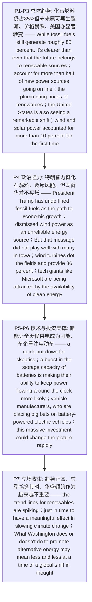

# 可再生能源 精读笔记

---

## 背景

本文是 **2018 年考研英语（一）Text 2**（第 26—30 题），主题是**可再生能源（renewable energy）在全球的崛起，与美国政治层面的迟疑之间的张力**。文章从"**化石燃料仍占约 85% 的能源供应，但未来属于风能、太阳能**"这一**开篇定调句**切入，层层铺开可再生能源"**势头正盛**"的证据，最终收束为一个耐人寻味的判断：**在全球观念转变的当下，华盛顿做了什么（或没做什么），其分量正变得越来越轻**。

结构上，全文是**"总体趋势 → 政治阻力 → 技术支撑 → 立场收束"**的四层递进链。**开篇即以让步—转折定调**：`While fossil fuels … still generate roughly 85 percent …, it's clearer than ever that the future belongs to renewable sources such as wind and solar`（P1），并用冒号抛出数据佐证——**可再生能源已占新增上网电力来源的一半以上**（`They now account for more than half of new power sources going on line`）。**第二层解释增长动力**（P2）：既来自政府与**有远见企业**的承诺（`a commitment by governments and farsighted businesses`），更是因为**可再生能源价格暴跌**（`the plummeting prices of renewables`）——这是**第 26 题的题眼**（`plummeting` = **[C] falling**）。

**第三层给出美国的"显著转变"（P3）**：`While the rest of the world takes the lead, notably China and Europe, the United States is also seeing a remarkable shift`——**第 27 题的答案区**（[A] `is progressing notably`）；并以**美国能源信息署**的报告坐实：**今年 3 月，风能与太阳能首次占到美国发电总量的 10% 以上**。**第四层转入政治阻力（P4）**：特朗普**力挺化石燃料**（`underlined fossil fuels … as the path to economic growth`）、**把风能贬为不可靠能源**（`dismissed wind power as an unreliable energy source`），但作者随即用 `But` 转折——**这一论调在爱荷华州并不受欢迎**，那里**风机遍布田野、贡献 36% 的发电量**，**微软等科技巨头正被清洁能源吸引来为数据中心供电**——这是**第 28 题的题眼**（[A] `wind is a widely used energy source`）。

**第五、六层转向技术与投资支撑（P5—P6）**：针对"**风不吹、太阳不照时怎么办**"这一怀疑者的说辞（`a quick put-down for skeptics`），作者指出**电池储能能力的提升**正让"**全天候持续供电**"（`keep power flowing around the clock`）更有可能——这是**第 29 题的答案区**（[C] `Its continuous supply is becoming a reality`）；并从**汽车制造商重注电动车**（`placing big bets on battery-powered electric vehicles`）看到投资动能（[B] `car manufacturing` 为干扰项）。**末段收束为立场（P7）**：**趋势线正急剧上扬**（`the trend lines for renewables are spiking`），能源转型"**或许恰逢其时**"（`just in time to have a meaningful effect in slowing climate change`），而**华盛顿的作为在全球观念转变下越来越不重要**（`may mean less and less`）——这既是**第 30 题**（[C] `is not really encouraged by the US government`）的收尾依据，也是全文主旨所在。**一句话概括**：这篇文章要表达的是**"可再生能源已是大势（价格暴跌、占比过半、美国亦在显著转变），尽管政治层面仍有阻力（特朗普力挺化石燃料、贬斥风能），但储能技术与产业投资正让'全天候供电'成为可能——趋势不可逆转，以至于华盛顿的作为都开始变得次要"**。

---

## 文章原文

# 2018 Passage 2

While **fossil fuels**—coal, oil, gas—still generate roughly 85 percent of the world's energy supply, it's clearer than ever that the future belongs to **renewable** sources such as wind and solar. The move to renewables is picking up **momentum** around the world: They now account for more than half of new power sources going on line.

> [!abstract]- 长难句分析
> **原句**：While **fossil fuels**—coal, oil, gas—still generate roughly 85 percent of the world's energy supply, it's clearer than ever that the future belongs to **renewable** sources such as wind and solar.
>
> **主干提取**：
>
> - 让步状语从句（While 引导）: While fossil fuels—coal, oil, gas—still generate roughly 85 percent of the world's energy supply
> - 形式主语 it: it
> - 谓语 V（系动词）: is
> - 表语 C: clearer (than ever)
> - 真正主语（主语从句）: that the future belongs to renewable sources such as wind and solar
> - 从句主语 S: the future
> - 从句谓语 V: belongs to
> - 从句宾语 O: renewable sources
>
> **修饰成分**：
>
> | 类型 | 引导词 / 形式 | 修饰对象 |
> |------|--------------|----------|
> | 让步状语从句 | While | 主句 |
> | 破折号插入语 | —coal, oil, gas— | fossil fuels |
> | 比较结构 | clearer than ever | is |
> | 形式主语 it / 主语从句 | it / that | 从句为真正主语 |
> | 介词短语作后置定语 | such as | renewable sources |
>
> **结构图解**：
>
> ```
> 主句: it + is + clearer (than ever)
>   ├── 让步状语从句（While）: fossil fuels (—coal, oil, gas—) + still generate + 85 percent of the world's energy supply
>   └── 主语从句: the future + belongs to + renewable sources (such as wind and solar)
> ```
>
> **参考译文**：尽管化石燃料——煤、石油、天然气——仍承担着全球约 85% 的能源供应，但未来的天下属于风能、太阳能等可再生能源，这一点比以往任何时候都更加清楚。
>
> **考点提示**：① **让步状语从句 `While …`** 与主句构成"让步—转折"。② **形式主语 `it`**：`it's clearer than ever that …` 中真正主语是 `that` 从句，`clearer than ever`（比以往更清楚）是程度强化。③ 破折号插入语 `—coal, oil, gas—` 解释 `fossil fuels`，可先略读。④ 本句是**全文开篇定调句**，暗示作者对可再生能源的肯定态度。

Some growth **stems** from a commitment by governments and **farsighted** businesses to fund cleaner energy sources. But increasingly the story is about the **plummeting** prices of renewables, especially wind and solar. The cost of solar panels has dropped by 80 percent and the cost of wind turbines by close to one-third in the past eight years.

> [!abstract]- 长难句分析
> **原句**：The cost of solar panels has dropped by 80 percent and the cost of wind turbines by close to one-third in the past eight years.
>
> **主干提取**：
>
> - 主语 S（并列一）: The cost of solar panels
> - 谓语 V: has dropped
> - 状语 A（幅度）: by 80 percent
> - 主语 S（并列二）: the cost of wind turbines
> - 谓语 V（省略）: 〔has dropped〕
> - 状语 A（幅度）: by close to one-third
> - 时间状语: in the past eight years
>
> **修饰成分**：
>
> | 类型 | 引导词 / 形式 | 修饰对象 |
> |------|--------------|----------|
> | 介词短语作后置定语 | of | The cost |
> | 现在完成时 | has dropped | The cost of solar panels |
> | 并列句省略 | and … | 后半句省略 has dropped |
> | 介词短语作状语 | by | dropped |
> | 时间状语 | in the past eight years | 全句 |
>
> **结构图解**：
>
> ```
> 主句（并列句）:
>   ├── 分句 1: The cost of solar panels + has dropped + by 80 percent
>   └── 分句 2: the cost of wind turbines + 〔has dropped〕+ by close to one-third
>         └── 时间状语: (in the past eight years) → 修饰两个分句
> ```
>
> **参考译文**：过去八年里，太阳能电池板的成本下降了 80%，风力发电机的成本则下降了近三分之一。
>
> **考点提示**：① **并列句中的省略**：`and` 后的分句省略了与前面相同的谓语 `has dropped`，须补全后理解，否则会读成破碎句。② 现在完成时 `has dropped … in the past eight years`（过去八年里已下降）与第 26 题 `plummeting = falling` 呼应。③ `by + 数字/比例` 表下降/上升的幅度。

In many parts of the world renewable energy is already a **principal** energy source. In Scotland, for example, wind turbines provide enough electricity to power 95 percent of homes.

While the rest of the world takes the lead, notably China and Europe, the United States is also seeing a **remarkable** shift.

> [!abstract]- 长难句分析
> **原句**：While the rest of the world takes the lead, notably China and Europe, the United States is also seeing a **remarkable** shift.
>
> **主干提取**：
>
> - 对比状语从句（While 引导）: While the rest of the world takes the lead
> - 插入语: notably China and Europe
> - 主语 S: the United States
> - 谓语 V（进行时）: is seeing
> - 宾语 O: a remarkable shift
> - 状语: also
>
> **修饰成分**：
>
> | 类型 | 引导词 / 形式 | 修饰对象 |
> |------|--------------|----------|
> | 对比状语从句 | While | 主句 |
> | 插入语（举例） | notably | the rest of the world |
> | 现在进行时 | is seeing | the United States |
> | 副词作状语 | also | is seeing |
>
> **结构图解**：
>
> ```
> 主句: the United States + is seeing + a remarkable shift
>   ├── 对比状语从句（While）: the rest of the world + takes + the lead
>   │     └── 插入语（举例）: (notably China and Europe) → 举例 the rest of the world
>   └── 副词状语: also
> ```
>
> **参考译文**：当世界其他地区（尤其是中国和欧洲）一路领先时，美国也在经历一场引人注目的转变。
>
> **考点提示**：① 同一个 `While` 在本篇有两种用法：第 1、7 段表**让步**（尽管），本句表**对比**（而／当……时）。② 插入语 `notably China and Europe` 把从句与主句隔开，先括起插入语即可找回主谓。③ 现在进行时 `is seeing` 与全篇的进行时一起渲染"变化正在发生"的动态感。

In March, for the first time, wind and solar power **accounted for** more than 10 percent of the power generated in the US, reported the US Energy Information Administration.

> [!abstract]- 长难句分析
> **原句**：In March, for the first time, wind and solar power **accounted for** more than 10 percent of the power generated in the US, reported the US Energy Information Administration.
>
> **主干提取**：
>
> - 时间状语: In March, for the first time
> - 主语 S: wind and solar power
> - 谓语 V: accounted for
> - 宾语 O: more than 10 percent of the power
> - 引述倒装: reported the US Energy Information Administration（= as the … reported）
>
> **修饰成分**：
>
> | 类型 | 引导词 / 形式 | 修饰对象 |
> |------|--------------|----------|
> | 介词短语作时间状语 | In March | 全句 |
> | 插入语 | for the first time | 全句 |
> | 过去分词短语作后置定语 | generated in the US | the power |
> | 引述句（主谓倒装） | reported … | 全句 |
>
> **结构图解**：
>
> ```
> 主句: wind and solar power + accounted for + more than 10 percent of the power
>   ├── 时间状语: (In March, for the first time)
>   ├── 后置定语（过去分词短语）: (generated in the US) → 修饰 the power
>   └── 引述倒装: reported the US Energy Information Administration (= as … reported)
> ```
>
> **参考译文**：据美国能源信息署报告，今年 3 月，风能和太阳能发电首次占到美国发电总量的 10% 以上。
>
> **考点提示**：① **过去分词短语 `generated in the US` 作后置定语**（= which is generated），修饰 `the power`。② **引述主语后置倒装**：`reported the US Energy Information Administration` 还原为 `as the US Energy Information Administration reported`。③ `account for` 此处是"占（比例）"，与"解释"义相区分。

President Trump has **underlined** fossil fuels—especially coal—as the path to economic growth.

> [!abstract]- 长难句分析
> **原句**：President Trump has **underlined** fossil fuels—especially coal—as the path to economic growth.
>
> **主干提取**：
>
> - 主语 S: President Trump
> - 谓语 V: has underlined
> - 宾语 O: fossil fuels
> - 宾语补足语: as the path to economic growth
>
> **修饰成分**：
>
> | 类型 | 引导词 / 形式 | 修饰对象 |
> |------|--------------|----------|
> | 现在完成时 | has underlined | President Trump |
> | 破折号插入语 | —especially coal— | fossil fuels |
> | 介词短语作宾语补足语 | as | fossil fuels |
> | 介词短语作后置定语 | to | the path |
>
> **结构图解**：
>
> ```
> 主句: President Trump + has underlined + fossil fuels + as the path to economic growth
>   ├── 破折号插入语: (—especially coal—) → 强调 fossil fuels
>   └── 宾语补足语（介词短语）: (as the path to economic growth) → 补足 fossil fuels
> ```
>
> **参考译文**：特朗普总统强调化石燃料——尤其是煤炭——是通向经济增长之路。
>
> **考点提示**：① **`underline A as B`**（把 A 强调为 B）是 `动词 + 宾语 + as + 名词` 的复合结构；同类还有 `dismiss A as B / regard A as B`。② 破折号插入语 `—especially coal—` 起强调作用，可先略读。③ 现在完成时 `has underlined` 表"（其立场）已明确"。④ 本句与下句 `dismissed wind power as an unreliable energy source` 对照，勾勒出特朗普的能源立场，为第 30 题铺垫。

In a recent speech in Iowa, he **dismissed** wind power as an **unreliable** energy source.

But that message did not **play well with** many in Iowa, where wind turbines **dot** the fields and provide 36 percent of the state's electricity generation—and where **tech giants** like Microsoft are being attracted by the availability of clean energy to power their data centers.

> [!abstract]- 长难句分析
> **原句**：But that message did not **play well with** many in Iowa, where wind turbines **dot** the fields and provide 36 percent of the state's electricity generation—and where **tech giants** like Microsoft are being attracted by the availability of clean energy to power their data centers.
>
> **主干提取**：
>
> - 主语 S: that message
> - 谓语 V: did not play well with
> - 宾语 O: many in Iowa
> - 定语从句一: where wind turbines dot the fields and provide 36 percent of the state's electricity generation
> - 定语从句二: where tech giants like Microsoft are being attracted by the availability of clean energy to power their data centers
>
> **修饰成分**：
>
> | 类型 | 引导词 / 形式 | 修饰对象 |
> |------|--------------|----------|
> | 定语从句（关系副词 where） | where | Iowa |
> | 现在进行时被动 | are being attracted by | tech giants |
> | 介词短语作后置定语 | like | tech giants |
> | 不定式作目的状语 | to power | are being attracted |
> | 并列定语从句 | and where | Iowa |
>
> **结构图解**：
>
> ```
> 主句: that message + did not play well with + many in Iowa
>   ├── 定语从句一（where）: wind turbines + dot + the fields + and provide + 36 percent of the state's electricity generation
>   └── 定语从句二（and where）: tech giants (like Microsoft) + are being attracted by + the availability of clean energy
>         └── 不定式作目的状语: (to power their data centers)
> ```
>
> **参考译文**：但这一论调在爱荷华州的许多人那里并不受欢迎——在那里，风力发电机遍布田野，贡献了该州 36% 的发电量；也正是在那里，微软等科技巨头正被充足、便于使用的清洁能源所吸引，用以为其数据中心供电。
>
> **考点提示**：① **并列的两个 `where` 定语从句**（`where … —and where …`）共同修饰先行词 `Iowa`，破折号后的 `and where` 是增量信息。② `are being attracted` 是**现在进行时被动**（正在被吸引），三词缺一不可。③ `to power their data centers` 是不定式作**目的状语**，`power` 为动词"供电"。④ 第 28 题题眼：`wind turbines dot the fields and provide 36 percent …` ↔ [A] `wind is a widely used energy source`。

The question "what happens when the wind doesn't blow or the sun doesn't shine?" has provided a quick **put-down** for **skeptics**.

> [!abstract]- 长难句分析
> **原句**：The question "what happens when the wind doesn't blow or the sun doesn't shine?" has provided a quick **put-down** for **skeptics**.
>
> **主干提取**：
>
> - 主语 S: The question
> - 同位语内容（引号内名词性结构）: "what happens when the wind doesn't blow or the sun doesn't shine?"
> - 谓语 V: has provided
> - 宾语 O: a quick put-down for skeptics
>
> **修饰成分**：
>
> | 类型 | 引导词 / 形式 | 修饰对象 |
> |------|--------------|----------|
> | 同位语（引号内 what 结构） | what | The question |
> | 时间/条件状语从句 | when | happens |
> | 并列（or） | or | doesn't blow / doesn't shine |
> | 现在完成时 | has provided | The question |
>
> **结构图解**：
>
> ```
> 主句: The question + has provided + a quick put-down for skeptics
>   └── 同位语（引号内名词性结构）: "what happens …?"
>         └── 状语从句（when）: the wind doesn't blow or the sun doesn't shine
> ```
>
> **参考译文**："风不吹、太阳不照的时候会怎样？"这一问题一直是怀疑论者随手可用的一个反驳说辞。
>
> **考点提示**：① 引号内的 `what happens when …` 表面是疑问句，实为**名词性结构**，作 `The question` 的同位内容。② `when` 引导时间状语从句，此处暗含**假设条件**（"当……时"≈"如果……"）。③ `put-down` = 贬低的话、反驳的说辞；`skeptics` = 怀疑论者。

But a boost in the storage capacity of batteries is making their ability to keep power flowing **around the clock** more likely.

> [!abstract]- 长难句分析
> **原句**：But a boost in the storage capacity of batteries is making their ability to keep power flowing **around the clock** more likely.
>
> **主干提取**：
>
> - 主语 S: a boost in the storage capacity of batteries
> - 谓语 V（进行时）: is making
> - 宾语 O: their ability to keep power flowing around the clock
> - 宾语补足语 C: more likely
>
> **修饰成分**：
>
> | 类型 | 引导词 / 形式 | 修饰对象 |
> |------|--------------|----------|
> | 介词短语作后置定语 | in | a boost |
> | 介词短语作后置定语 | of | the storage capacity |
> | 不定式作后置定语 | to keep | their ability |
> | 复合结构（keep sth doing） | keep … flowing | power |
> | 宾语补足语 | more likely | their ability |
>
> **结构图解**：
>
> ```
> 主句: a boost (in the storage capacity of batteries) + is making + their ability + more likely
>   ├── 后置定语: (in the storage capacity of batteries) → 修饰 a boost
>   └── 复合宾语（make … more likely）: their ability (to keep power flowing around the clock) + more likely
>         └── 后置定语（不定式）: (to keep power flowing around the clock) → 修饰 their ability
>               └── 复合结构: keep + power + flowing (around the clock)
> ```
>
> **参考译文**：但电池储能能力的提升，正让可再生能源"全天候持续供电"的能力更有可能实现。
>
> **考点提示**：① **复合宾语结构 `make + 宾语 + 宾补`**：宾语是 `their ability …`，宾补是 `more likely`。② `the storage capacity of batteries` 中 `of` 短语作后置定语。③ `ability to keep power flowing` 是不定式作定语 + `keep sth doing` 复合结构叠加。④ 第 29 题依据：`keep power flowing around the clock`（全天候供电）↔ [C] `Its continuous supply is becoming a reality`。

The advance is driven in part by vehicle manufacturers, who are **placing big bets on** battery-powered electric vehicles. Although electric cars are still a **rarity** on roads now, this **massive** investment could change the picture rapidly in coming years.

> [!abstract]- 长难句分析
> **原句**：The advance is driven in part by vehicle manufacturers, who are **placing big bets on** battery-powered electric vehicles.
>
> **主干提取**：
>
> - 主语 S: The advance
> - 谓语 V（被动语态）: is driven
> - 状语 A: in part by vehicle manufacturers
> - 定语从句（非限制性）: who are placing big bets on battery-powered electric vehicles
>
> **修饰成分**：
>
> | 类型 | 引导词 / 形式 | 修饰对象 |
> |------|--------------|----------|
> | 被动语态 | be + done | The advance |
> | 介词短语作状语 | in part / by | is driven |
> | 非限制性定语从句 | who | vehicle manufacturers |
> | 现在进行时 | are placing | vehicle manufacturers |
> | 复合形容词作定语 | battery-powered | electric vehicles |
>
> **结构图解**：
>
> ```
> 主句: The advance + is driven + (in part by vehicle manufacturers)
>   └── 非限制性定语从句（who）: vehicle manufacturers + are placing + big bets on (battery-powered electric vehicles)
> ```
>
> **参考译文**：这一进步部分是由汽车制造商推动的——它们正把重注押在电池驱动的电动汽车上。
>
> **考点提示**：① **被动语态 `is driven by`** 突出"进步是被推动的"，施动者 `vehicle manufacturers` 后置。② **非限制性定语从句**（逗号 + `who`）补充说明，不能用 `that` 替换。③ `in part` = 部分地。④ `placing big bets on`（在……押下重注）是比喻用法，为第 29 题 [B] `car manufacturing` 的干扰点提供语境。

While there's a long way to go, the **trend lines** for renewables are **spiking**. The pace of change in energy sources appears to be speeding up—perhaps just in time to have a **meaningful** effect in slowing climate change. What Washington does—or doesn't do—to promote **alternative** energy may mean less and less at a time of a global shift in thought.

> [!abstract]- 长难句分析
> **原句**：What Washington does—or doesn't do—to promote **alternative** energy may mean less and less at a time of a global shift in thought.
>
> **主干提取**：
>
> - 主语 S（主语从句）: What Washington does—or doesn't do—to promote alternative energy
> - 谓语 V: may mean
> - 宾语 O: less and less
> - 时间状语 A: at a time of a global shift in thought
>
> **修饰成分**：
>
> | 类型 | 引导词 / 形式 | 修饰对象 |
> |------|--------------|----------|
> | 主语从句 | What | 主句主语 |
> | 破折号插入语 | —or doesn't do— | does（从句谓语） |
> | 不定式作目的状语 | to promote | does |
> | 情态动词 | may | mean |
> | 比较结构 | less and less | mean |
> | 介词短语作时间状语 | at a time of | 全句 |
>
> **结构图解**：
>
> ```
> 主句: [What Washington does (—or doesn't do—) (to promote alternative energy)] + may mean + less and less
>   ├── 主语从句: What + Washington + does
>   │     ├── 破折号插入语: (—or doesn't do—)
>   │     └── 不定式作目的状语: (to promote alternative energy)
>   ├── 情态动词: may
>   └── 时间状语: (at a time of a global shift in thought)
> ```
>
> **参考译文**：在全球观念转变的当下，华盛顿为推广替代能源做了什么（或没做什么），其分量可能正变得越来越轻。
>
> **考点提示**：① **`what` 引导主语从句**作全句主语，`what` 在从句中作 `does` 的宾语。② 破折号插入语 `—or doesn't do—` 隔开了从句谓语与目的状语。③ `to promote alternative energy` 是不定式作**目的状语**。④ `less and less` 是末段的立场收束，第 30 题"美国政府并不真正鼓励可再生能源"的依据在此。

---

## 题目

### 26. The word "plummeting" (Para. 2) is closest in meaning to ____.

- [A] stabilizing
- [B] changing
- [C] falling
- [D] rising

### 27. According to Paragraph 3, the use of renewable energy in America ____.

- [A] is progressing notably
- [B] is as extensive as in Europe
- [C] faces many challenges
- [D] has proved to be impractical

### 28. It can be learned that in Iowa, ____.

- [A] wind is a widely used energy source
- [B] wind energy has replaced fossil fuels
- [C] tech giants are investing in clean energy
- [D] there is a shortage of clean energy supply

### 29. Which of the following is true about clean energy according to Paragraphs 5&6?

- [A] Its application has boosted battery storage.
- [B] It is commonly used in car manufacturing.
- [C] Its continuous supply is becoming a reality.
- [D] Its sustainable exploitation will remain difficult.

### 30. It can be inferred from the last paragraph that renewable energy ____.

- [A] will bring the US closer to other countries
- [B] will accelerate global environmental change
- [C] is not really encouraged by the US government
- [D] is not competitive enough with regard to its cost

---

## 翻译对照

# 2018 Passage 2 中英对照翻译

## Paragraph 1

While fossil fuels—coal, oil, gas—still generate roughly 85 percent of the world's energy supply, it's clearer than ever that the future belongs to renewable sources such as wind and solar. The move to renewables is picking up momentum around the world: They now account for more than half of new power sources going on line.

尽管化石燃料——煤、石油、天然气——仍承担着全球约 85% 的能源供应，但未来的天下属于风能、太阳能等可再生能源，这一点比以往任何时候都更加清楚。世界范围内，向可再生能源的转变正在提速：在新增的上网发电来源中，它们如今已占到一半以上。

> [!note] 翻译说明
> - `While` 引导让步状语从句，译作"尽管"。
> - `it's clearer than ever that...` 中 `it` 是形式主语，真正主语是 `that` 从句。
> - `picking up momentum` = "势头渐强、正在提速"，`momentum` 意为"势头、推动力"。
> - `account for` 此处是"占（比例）"，注意它在别处还可表"解释、说明"。
> - `going on line` 是现在分词短语作后置定语，修饰 `new power sources`，指"（发电后）并入电网的"。

## Paragraph 2

Some growth stems from a commitment by governments and farsighted businesses to fund cleaner energy sources. But increasingly the story is about the plummeting prices of renewables, especially wind and solar. The cost of solar panels has dropped by 80 percent and the cost of wind turbines by close to one-third in the past eight years.

部分增长源自各国政府与有远见的企业为资助更清洁能源所作的承诺。但如今越来越关键的一点，是可再生能源（尤其是风能和太阳能）价格的暴跌。过去八年里，太阳能电池板的成本下降了 80%，风力发电机的成本则下降了近三分之一。

> [!note] 翻译说明
> - `stem from` = "源自、由……引起"，相当于 `come from`。
> - `the story is about...` 是新闻惯用语，直译"故事在于……"，实指"关键/重点在于……"。
> - `by close to one-third` 中 `by` 表示下降的幅度；前半句省略了重复的 `has dropped`，即 the cost of wind turbines *has dropped* by close to one-third。

## Paragraph 3

In many parts of the world renewable energy is already a principal energy source. In Scotland, for example, wind turbines provide enough electricity to power 95 percent of homes. While the rest of the world takes the lead, notably China and Europe, the United States is also seeing a remarkable shift. In March, for the first time, wind and solar power accounted for more than 10 percent of the power generated in the US, reported the US Energy Information Administration.

在世界许多地区，可再生能源早已是主要的能源来源。例如在苏格兰，风力发电机提供的电力足以满足 95% 家庭的用电。当世界其他地区（尤其是中国和欧洲）一路领先时，美国也在经历一场引人注目的转变。据美国能源信息署报告，今年 3 月，风能和太阳能发电首次占到美国发电总量的 10% 以上。

> [!note] 翻译说明
> - `power 95 percent of homes` 中 `power` 是动词，"为……供电"。
> - `While the rest of the world takes the lead` 中 `while` 表对比（"而、当……时"），非让步；`take the lead` = "领先"。
> - `generated in the US` 是过去分词短语作后置定语，修饰 `the power`。
> - `reported the US Energy Information Administration` 为倒装结构（主语后置），`reported` 前省略了 `as`（as reported...）。

## Paragraph 4

President Trump has underlined fossil fuels—especially coal—as the path to economic growth. In a recent speech in Iowa, he dismissed wind power as an unreliable energy source. But that message did not play well with many in Iowa, where wind turbines dot the fields and provide 36 percent of the state's electricity generation—and where tech giants like Microsoft are being attracted by the availability of clean energy to power their data centers.

特朗普总统强调化石燃料——尤其是煤炭——是通向经济增长之路。在爱荷华州最近的一次演讲中，他把风能贬斥为一种不可靠的能源。但这一论调在爱荷华州的许多人那里并不受欢迎——在那里，风力发电机遍布田野，贡献了该州 36% 的发电量；也正是在那里，微软等科技巨头正被充足、便于使用的清洁能源所吸引，用以为其数据中心供电。

> [!note] 翻译说明
> - `underline...as...` = "强调……是……"，`underline` 此处引申为"突出、强调"。
> - `dismissed wind power as an unreliable energy source` = "把风能斥为不可靠的能源"，`dismiss A as B` 表示"把 A 贬为/否定为 B"。
> - `did not play well with` = "未能受到……的欢迎/好评"，`play well` 原指演出、表现得好。
> - `where...—and where...` 是两个并列的定语从句，均修饰 `Iowa`；`dot` 作动词，"散布于、点缀于"。
> - `tech giants` = "科技巨头"；`power their data centers` 中 `power` 又是动词，"为……供电"。

## Paragraph 5

The question "what happens when the wind doesn't blow or the sun doesn't shine?" has provided a quick put-down for skeptics. But a boost in the storage capacity of batteries is making their ability to keep power flowing around the clock more likely.

"风不吹、太阳不照的时候会怎样？"这一问题一直是怀疑论者随手可用的一个反驳说辞。但电池储能能力的提升，正让可再生能源"全天候持续供电"的能力更有可能实现。

> [!note] 翻译说明
> - `put-down` = "贬低的话、反驳的说辞"。
> - `skeptics` = "怀疑论者、持怀疑态度的人"。
> - `around the clock` = "全天候、昼夜不停"；`keep power flowing around the clock` 意为"让电力昼夜不停地输送"。
> - `make...more likely` 结构：`a boost in...is making their ability...more likely`，主语是 `a boost`，宾语是 `their ability to...`。

## Paragraph 6

The advance is driven in part by vehicle manufacturers, who are placing big bets on battery-powered electric vehicles. Although electric cars are still a rarity on roads now, this massive investment could change the picture rapidly in coming years.

这一进步部分是由汽车制造商推动的——它们正把重注押在电池驱动的电动汽车上。虽然眼下电动汽车在道路上仍十分罕见，但如此大规模的投资可能会在未来几年内迅速改变这一局面。

> [!note] 翻译说明
> - `in part` = "部分地、在一定程度上"。
> - `placing big bets on` = "在……上押下重注"，喻指投入巨额资金看好其前景。
> - `a rarity` = "罕见的事物"；`change the picture` = "改变局面/格局"。
> - `who` 引导非限制性定语从句，补充说明 `vehicle manufacturers`。

## Paragraph 7

While there's a long way to go, the trend lines for renewables are spiking. The pace of change in energy sources appears to be speeding up—perhaps just in time to have a meaningful effect in slowing climate change. What Washington does—or doesn't do—to promote alternative energy may mean less and less at a time of a global shift in thought.

尽管前路漫漫，但可再生能源的发展趋势线正急剧上扬。能源转型的步伐似乎正在加快——或许恰逢其时，能够对减缓气候变化产生实实在在的影响。在全球观念转变的当下，华盛顿为推广替代能源做了什么（或没做什么），其分量可能正变得越来越轻。

> [!note] 翻译说明
> - `the trend lines...are spiking` = "趋势线正在陡升"，`spike` 意为"急剧上升"。
> - `just in time to` = "恰好在……之前、正好来得及"。
> - `What Washington does—or doesn't do—` 是主语从句作主语，`Washington` 代指美国联邦政府。
> - `mean less and less` = "越来越不重要/分量越来越轻"；`at a time of` = "在……的时期"。

## 题目翻译

### 26. 与 "plummeting"（第 2 段）意思最接近的是 ____。

- [A] 趋于稳定
- [B] 变化
- [C] 下降
- [D] 上升

### 27. 根据第 3 段，美国可再生能源的使用 ____。

- [A] 正在显著推进
- [B] 与欧洲一样广泛
- [C] 面临诸多挑战
- [D] 已被证明不切实际

### 28. 从文中可知，在爱荷华州 ____。

- [A] 风能是一种被广泛使用的能源
- [B] 风能已经取代了化石燃料
- [C] 科技巨头正在投资清洁能源
- [D] 清洁能源供应存在短缺

### 29. 根据第 5、6 段，下列关于清洁能源的说法哪一项正确？

- [A] 其应用促进了电池储能。
- [B] 它常用于汽车制造。
- [C] 其持续供应正成为现实。
- [D] 其可持续开发仍将困难重重。

### 30. 从最后一段可以推断出，可再生能源 ____。

- [A] 将使美国与其他国家更接近
- [B] 将加速全球环境变化
- [C] 并未真正得到美国政府的鼓励
- [D] 就其成本而言竞争力不足

---

## 语法要点

# 2018 Passage 2 语法整理

> [!note] 来源说明
> 本篇**用户未提供语法源笔记**，以下语法点由 `formatted-article.md` 与 `translation.md` **从本文推断提取**，仅收录本篇实际出现的语法现象。
> 每一条均给出**原文语境**，便于回原文核对；标注"（联动）"的条目与相邻专题互为参照。

---

## 一、从句

### 从句：While 引导的让步状语从句（While fossil fuels … still generate …）

**概述**：`While` 表"虽然、尽管"，引导让步状语从句，主句意思与之相反。

| 结构 | 用法 | 例句 |
|------|------|------|
| `While + 从句, 主句` | 让步，译"尽管/虽然" | **While** fossil fuels—coal, oil, gas—**still generate** roughly 85 percent of the world's energy supply, it's clearer than ever that … |

> [!tip] 解题技巧
> `While` 兼有"**让步**（尽管）"与"**对比**（而、当……时）"两义，靠**语义**区分：主从句**相反/相让**→ 让步；主从句**并列对照**→ 对比（见下条）。本句"化石燃料仍占 85%"与"未来属于可再生能源"构成**相让**关系，故取"尽管"。

### 从句：While 引导的对比状语从句（While the rest of the world takes the lead …）

**概述**：`While` 表"而当……时、然而"，引导对比状语从句，主从句是**平行对照**的两件事。

| 结构 | 用法 | 例句 |
|------|------|------|
| `While + 从句, 主句` | 对比，译"而/当……时" | **While** the rest of the world **takes** the lead, notably China and Europe, the United States is also seeing a remarkable shift. |

> [!warning] 同一 `While`，两副面孔
> 本篇 `While` 出现三次（第 1、3、7 段），**第 1、7 段是让步（尽管），第 3 段是对比（而）**。判断法：把 `While` 换成"尽管"读一遍，通顺即让步；换成"而"更顺即对比。**别一律译"当……时"。**

### 从句：that 引导的主语从句（it's clearer than ever that the future belongs to …）

**概述**：`that` 从句是句子真正的主语，`it` 作形式主语前置，`clearer than ever` 是表语。

| 结构 | 用法 | 例句 |
|------|------|------|
| `It is + adj./比较级 + that 从句` | `it` 为形式主语，`that` 从句是真正主语 | **it's clearer than ever that** the future **belongs to** renewable sources such as wind and solar. |

> [!tip] 解题技巧
> 读到 `it's clearer than ever that …` 时**先跳过 `it` 找 `that` 后的真正主语**：主语是"the future belongs to renewable sources"。`than ever`（比以往任何时候）是**程度强化**，暗示作者对"可再生能源的崛起"高度肯定——这是全文的**立场基调**。

### 从句：what 引导的主语从句（What Washington does—or doesn't do—may mean less and less）

**概述**：`what` 引导主语从句，相当于"……的事/东西"，在从句中作 `does` 的宾语。

| 结构 | 用法 | 例句 |
|------|------|------|
| `What + 从句 + 谓语` | `what` 从句作主语，谓语用单数 | **What Washington does—or doesn't do—may mean** less and less. |

> [!warning] 易混：`what` 从句 vs 定语从句
> `what` 引导**名词性从句**时，`what` 不能换成 `that/which`，且**从句本身不完整**（缺宾语，如 `what … does`）；而定语从句有自己的先行词。本句 `What Washington does` 缺 `does` 的宾语 → 是**主语从句**。**"从句缺宾语且无先行词 → what 名词性从句"。**

### 从句：what 引导的宾语从句（what happens when the wind doesn't blow …）

**概述**：`what` 从句作 `The question` 的同位语内容，揭示"问题"的具体所指。

| 结构 | 用法 | 例句 |
|------|------|------|
| `n. + "what 从句?"` | 引号内的疑问句作同位语，解释名词内容 | The question **"what happens when the wind doesn't blow or the sun doesn't shine?"** has provided a quick put-down … |

> [!note] 补充说明
> 引号内的 `what happens when …` 表面是**疑问句**，实为**名词性结构**，作 `The question` 的同位内容。翻译时保持"问题是……"的框架，不必改成陈述句。

### 从句：where 引导的定语从句（并列两个 where）

**概述**：`where` = `in which`，先行词是表地点的 `Iowa`；本篇用 `where … —and where …` **并列两个定语从句**，共同修饰同一先行词。

| 结构 | 用法 | 例句 |
|------|------|------|
| `n.(地点) + where + 完整句, and where + 完整句` | 两个关系副词从句并列，修饰同一先行词 | many in Iowa, **where** wind turbines dot the fields …—**and where** tech giants like Microsoft are being attracted … |

> [!tip] 解题技巧
> 并列定语从句的判断：**先找先行词**（`Iowa`），再看两个 `where` 是否都缺地点状语。此处两个从句主谓宾齐全，均缺状语 → 都是 `where` 定语从句。**破折号后的 `and where` 是"增量信息"，是命题常客（第 28 题）。**

### 从句：who 引导的非限制性定语从句（vehicle manufacturers, who are placing big bets …）

**概述**：`who` 引导非限制性定语从句，用逗号与主句隔开，作**补充说明**（可译作"它们……"）。

| 结构 | 用法 | 例句 |
|------|------|------|
| `n. + , who + 完整句,` | 非限制性定语从句，补充说明先行词 | The advance is driven in part by vehicle manufacturers**, who are placing big bets on** battery-powered electric vehicles. |

> [!warning] 非限制性定语从句 ≠ 限制性
> 非限制性从句有逗号、**不能用 `that`**、不能省略，删除后主句仍完整；限制性从句无逗号、可省略、可替换成 `that`。本句逗号在 → 非限制性，`who` 不能换成 `that`。

### 从句：when 引导的时间状语从句（what happens when the wind doesn't blow）

**概述**：`when` 引导时间状语从句，`doesn't blow` / `doesn't shine` 用 `or` 并列。

| 结构 | 用法 | 例句 |
|------|------|------|
| `when + 从句 + (or) + 从句` | 时间状语，两个并列条件 | what happens **when the wind doesn't blow or the sun doesn't shine**? |

> [!tip] 解题技巧
> 此处 `when` = "**当……的时候**"，引导的其实是**假设性条件**（"风不吹、太阳不照时"），与第 29 题"清洁能源连续供应"直接对应。**时间状语从句在议论文里常暗含条件。**

---

## 二、非谓语动词

### 非谓语：现在分词短语作后置定语（new power sources going on line）

**概述**：现在分词短语后置作定语，相当于**省略了 `which/that are` 的定语从句**，表**主动、进行**。

| 结构 | 用法 | 例句 |
|------|------|------|
| `n. + v-ing + （介词短语）` | 后置定语（= which are doing） | more than half of new power sources **going on line** |

> [!warning] 常见错误
> `going on line` 若误当作谓语，会读成"电力来源去上网"，句子主干就乱了。**"名词 + 分词短语 + 句末/逗号"多为后置定语**，真正谓语在别处（此处谓语是 `account for`）。

### 非谓语：过去分词短语作后置定语（the power generated in the US）

**概述**：过去分词短语后置作定语，相当于**省略了 `which is` 的定语从句**，表**被动、完成**。

| 结构 | 用法 | 例句 |
|------|------|------|
| `n. + done + （介词短语）` | 后置定语（= which is done） | more than 10 percent of **the power generated in the US** |

> [!tip] 解题技巧
> `the power generated in the US` = "（被）在美国发出的电"。**过去分词 = 被动**是判断关键；`generated by/from …` 同理。

### 非谓语：不定式作后置定语（their ability to keep power flowing …）

**概述**：不定式常跟在抽象名词后作定语，说明其内容（`ability / efforts / attempt / chance / right / need to do …`）。

| 结构 | 用法 | 例句 |
|------|------|------|
| `n. + to do` | 不定式作后置定语 | their **ability to keep** power flowing around the clock |
| `keep sb/sth + doing` | 复合结构，表"使……持续做" | keep power **flowing** around the clock |

> [!note] 补充说明
> `ability to keep power flowing` 中是**不定式定语**（`to keep …` 修饰 `ability`）+ **复合宾语**（`keep power flowing`）叠加。**见到"ability/chance to do"，先把不定式挂到名词上。**

### 非谓语：不定式作目的状语（to power their data centers / to promote alternative energy）

**概述**：不定式表目的，常译"为了/去……"。

| 结构 | 用法 | 例句 |
|------|------|------|
| `to do sth` | 目的状语 | clean energy **to power** their data centers |
| `to do sth` | 目的状语 | What Washington does … **to promote** alternative energy may mean less and less. |

> [!warning] 易混点
> `clean energy to power their data centers` 中 `to power` 修饰 `energy`（不定式定语）还是表目的？—— 语义是"**用来给数据中心供电的清洁能源**"，按"**energy to do**"整体名词短语理解即可，不必强行切分。

### 非谓语：动名词作介词宾语（in slowing / in part / by …）

**概述**：介词后接动名词（`in doing` 表"在……方面/过程中"；`by doing` 表方式；`in part` 是固定短语）。

| 结构 | 用法 | 例句 |
|------|------|------|
| `in + v-ing` | 介词宾语，表"在……方面" | have a meaningful effect **in slowing** climate change |
| `in part` | 固定短语，"部分地" | The advance is driven **in part** by vehicle manufacturers … |

> [!tip] 解题技巧
> `have a meaningful effect **in** doing`（对……产生实质影响）是固定搭配，`in` 后必须接动名词。**"介词 + 动名词"是长难句中的高频收尾结构。**

---

## 三、时态与语态

### 时态：现在完成时（has dropped / has underlined）

**概述**：现在完成时表**从过去持续到现在**或**对现在有影响**。

| 结构 | 用法 | 例句 |
|------|------|------|
| `have/has + done` | 发生在过去、影响延续至今 | The cost of solar panels **has dropped** by 80 percent … in the past eight years. |
| `have/has + done` | 强调"已经（把……定为……）" | President Trump **has underlined** fossil fuels … as the path to economic growth. |

> [!tip] 解题技巧
> `has dropped … in the past eight years`（过去八年里已下降）正是第 26 题 `plummeting = falling` 的**时态依据**——"已完成且持续"对应"持续下跌"。**`in the past + 时间段` 是现在完成时的强信号。**

### 时态：现在进行时（is picking up / are placing / is speeding up）

**概述**：现在进行时表**此刻正在发生或近期持续进行**的动作，常用于报道"正在发生的趋势"。

| 结构 | 用法 | 例句 |
|------|------|------|
| `be + v-ing` | 正在发生/持续发展 | The move to renewables **is picking up** momentum around the world. |
| `be + v-ing` | 同上 | vehicle manufacturers … **are placing** big bets on … electric vehicles |
| `be + v-ing` | 同上 | The pace of change in energy sources **appears to be speeding up** |

> [!tip] 解题技巧
> 全文密集使用进行时，是在渲染一种"**变化正在进行中**"的**动态感**——这正是主旨"可再生能源势头正盛"的语言外衣。**进行时的密度本身可传递态度：变化正在发生。**

### 语态：现在进行时被动语态（are being attracted by）

**概述**：`be being done` 是**现在进行时的被动**，表"正在被……"。

| 结构 | 用法 | 例句 |
|------|------|------|
| `be being + done + by` | 进行时被动，正在被…… | **where tech giants like Microsoft are being attracted by** the availability of clean energy |

> [!warning] 时态陷阱
> `are being attracted` 是**进行时被动**（正在被吸引），不是"现在完成被动"（那是 `have been attracted`），也不是"一般被动"（`are attracted`）。**"be being done" = 进行时被动**，三词缺一不可。此处强调"（企业）正被吸引过来"的**当下动态**。

### 语态：一般现在时的普遍陈述（renewable energy is already a principal energy source）

**概述**：一般现在时用于陈述**客观事实、普遍情况**。

| 结构 | 用法 | 例句 |
|------|------|------|
| `is/are + n./adj.` | 陈述普遍事实 | In many parts of the world renewable energy **is** already a principal energy source. |

> [!tip] 解题技巧
> 与全篇"进行时"对照，此处突然用**一般现在时**，强调"这是**既成事实**（already）"——为第 27 题"美国可再生能源发展显著"提供"已在多地成为主流"的**背景铺垫**。

---

## 四、特殊句式

### 特殊句式：it 作形式主语（it's clearer than ever that …）

**概述**：`it` 占主语位，真正主语（`that` 从句）后置，避免句子头重脚轻。

| 结构 | 用法 | 例句 |
|------|------|------|
| `It is + adj. + that 从句` | 形式主语，从句后置 | **it's clearer than ever that** the future belongs to renewable sources … |

> [!warning] 易混：`it` 作形式主语 vs 作指代
> 形式主语的 `it` **无实义、不可指代前文**；指代用的 `it` 可换成前文名词。本句 `it` 无法指代任何名词 → 形式主语。**"it 后紧跟 be + adj. + that 从句"多是形式主语。**

### 特殊句式：冒号引出解释（The move to renewables is picking up momentum around the world: They now account for …）

**概述**：冒号后是对前文的**解释、列举或补充**，可视为同位语/解释性内容。

| 结构 | 用法 | 例句 |
|------|------|------|
| `… : 句子/短语` | 冒号后解释前文 | The move to renewables is picking up momentum around the world**:** They now account for more than half of new power sources going on line. |

> [!note] 补充说明
> 冒号后的 `They` 指代前文 `renewables`；作者用冒号**直接抛出数据佐证**。**考研阅读中，冒号、破折号、分号后常是"观点的落点"或"数据的展开"，是定位题的富矿。**

### 特殊句式：破折号插入语（fossil fuels—coal, oil, gas—；does—or doesn't do—）

**概述**：破折号之间的成分是**插入语**，作补充说明；理解时可先**跳过**，句意仍完整。

| 结构 | 用法 | 例句 |
|------|------|------|
| `A —插入语— B` | 插入补充，可先略读 | fossil fuels**—coal, oil, gas—**still generate … |
| `A —插入语— B` | 同上 | What Washington does**—or doesn't do—**to promote alternative energy may mean … |

> [!warning] 常见错误
> 破折号插入语会**把主谓或谓语与目的状语隔开**。第 4 段 `he dismissed wind power as an unreliable energy source` 中若把插入成分当主干就会误读；第 7 段 `What Washington does—or doesn't do—to promote …` 中插入语隔开了 `does` 与 `to promote`。**读长句先"括起插入语，找回主干"。**

### 特殊句式：主语后置倒装（reported the US Energy Information Administration）

**概述**：`reported + 主语` 是**主谓倒装**（正常语序为 `the US Energy Information Administration reported`），常见于**引述/报道**结构（省略了 `as`）。

| 结构 | 用法 | 例句 |
|------|------|------|
| `… , reported + 主语` | 引述倒装（= as the X reported） | … accounted for more than 10 percent of the power generated in the US, **reported the US Energy Information Administration**. |

> [!tip] 解题技巧
> 这类倒装还原为 `as the US Energy Information Administration reported`。**遇到"动词 + 专有名词"的句末排列，先怀疑引述倒装，把主语还原到动词前再理解。**

### 特殊句式：让步—转折框架（While … But …）

**概述**：本篇多处用**让步—转折**推进论证，是典型的议论文逻辑句式，也是作者立场的抓手。

| 结构 | 用法 | 例句 |
|------|------|------|
| `While …, 主句` | 先让步、再推出主句 | **While** fossil fuels … still generate 85 percent …, **it's clearer than ever that** the future belongs to renewables. |
| `A. But B.` | 先陈述、再转折反驳 | President Trump has underlined fossil fuels … **But** that message **did not play well with** many in Iowa. |

> [!tip] 解题技巧
> **`But` 之后才是作者真正的主张。** 第 4 段"特朗普力挺化石燃料"（让步）→ `But that message did not play well with many in Iowa`（转折，作者倾向可再生能源）。**态度题回答"作者支持谁"，就看让步之后他站在哪一边。**

---

## 五、平行、省略与结构

### 平行与结构：并列句中的省略（has dropped by 80 percent and … by close to one-third）

**概述**：并列句中**重复的助动词/谓语可省略**，后半句只保留差异部分。

| 结构 | 用法 | 例句 |
|------|------|------|
| `A + 谓语 + …, and B + （省略谓语）+ …` | 并列句省略相同成分 | The cost of solar panels **has dropped** by 80 percent and the cost of wind turbines **〔has dropped〕** by close to one-third … |

> [!warning] 常见错误
> 后半句 `the cost of wind turbines by close to one-third` 没有动词，若补不出 `has dropped`，就会读成破碎句。**"and 连接的两部分若结构对称，后段常省略与前段相同的谓语。"** 补全后再译："风力发电机的成本**降了**近三分之一"。

### 平行与结构：三项并列与并举（wind and solar / coal, oil, gas）

**概述**：`and` 连接并列项，注意**并列项的词性/结构一致**；三项以上常用逗号分隔。

| 结构 | 用法 | 例句 |
|------|------|------|
| `A and B` | 两项并列 | **wind and solar** |
| `A, B, and C` | 三项并列 | **coal, oil, gas** |
| `A and B … or C` | 并列中的选择 | the wind **doesn't blow** or the sun **doesn't shine** |

> [!note] 补充说明
> `coal, oil, gas` 的插入语用**逗号并列**而非 `and`，是列举的"紧凑写法"；`the wind doesn't blow or the sun doesn't shine` 用 `or` 表"两种不利情形任一"，共同构成怀疑论者的问题。**并列连词的选择（and/or）本身携带"并列 vs 选择"的逻辑。**

### 平行与结构：比较结构（clearer than ever / more than / less and less）

**概述**：比较级 + `than`；`more than` 表"多于"；`less and less` 表"越来越少"。

| 结构 | 用法 | 例句 |
|------|------|------|
| `adj.-er + than ever` | 程度强化，"比以往更……" | it's **clearer than ever** that … |
| `more than + 数词` | 多于 | **more than** half of new power sources |
| `less and less` | 越来越不…… | may mean **less and less** |

> [!tip] 解题技巧
> `may mean less and less`（分量可能越来越轻）是全篇**末段的立场收束**——作者判断"华盛顿的作为在全球观念转变下越来越不重要"。**比较级的递进（less and less）常暗示趋势判断。**

### 平行与结构：复合形容词（battery-powered / farsighted）

**概述**：`名词/形容词 + 分词` 构成复合形容词，作定语。

| 结构 | 用法 | 例句 |
|------|------|------|
| `n. + -ed` | 复合形容词（被动含义） | **battery-powered** electric vehicles |
| `adj./adv. + -ing/-ed` | 复合形容词 | **farsighted** businesses（有远见的） |

> [!warning] 易混点
> `battery-powered`（电池**驱动**的，被动）与 `powering`（正在供电，主动）**方向相反**。**-ed 复合形容词多表"被……的"，-ing 多表"主动/正在……的"。**

### 平行与结构：名词所有格与 of 短语（the world's energy supply / a global shift in thought）

**概述**：`'s 所有格` + `of 短语` 层层限定；`of 短语` 常作后置定语。

| 结构 | 用法 | 例句 |
|------|------|------|
| `n.'s + n.` | 所有格作定语 | **the world's** energy supply / **the state's** electricity generation |
| `n. + of + n.` | of 短语作后置定语 | a global **shift in thought** / the availability **of clean energy** / the storage capacity **of batteries** |

> [!warning] 易混点
> `a global shift in thought` = "全球**观念上**的转变"（`in thought` 限定 `shift` 的范围），不等于"思想转变的全球"。**`of/in` 短语密集处，先判断它修饰哪个名词**，再定句意。

---

> [!note] 本篇语法主线
> 全文围绕"**可再生能源的崛起 vs 华盛顿的迟疑**"展开，语法上靠三样东西搭骨架：
> 1. **让步—转折框架**（While … But …）——先摆对手（化石燃料/特朗普），再转折亮出主张；
> 2. **形式主语 `it` + that 从句**（it's clearer than ever that …）——开篇即定下"可再生能源是未来"的立场基调；
> 3. **密集的进行时 + 比较级递进**（is picking up / is speeding up / less and less）——渲染"变化正在发生"的**动态感**。
> **把"总体趋势（Paras 1–3）→ 政治阻力（Para 4）→ 技术与投资支撑（Paras 5–6）→ 立场收束（Para 7）"这条线记住，五道题都可回链。**

> [!note] 与固定搭配笔记的联动
> 本篇的**动词搭配**（`account for / stem from / play well with / place big bets on`）、**名词短语**（`fossil fuels / renewable sources / trend lines / tech giants`）与**熟词生义**（`power / account for / dot / story / giant`）详见《[[intermediate/2018-passage2-renewable-energy/固定搭配与词组笔记|2018 P2 固定搭配与词组笔记]]》。

---

## 固定搭配与词组

# 2018 Passage 2 固定搭配与词组 合集

> [!note] 来源说明
> 本篇**用户未提供搭配源笔记**，以下词组由 `formatted-article.md` 与 `translation.md` **提取整理**，仅收录本篇实际出现的搭配。
> 每一条均给出**原文语境**，便于回原文核对；标注"（联动）"的例句来自同卷相邻篇目，仅供对比。

---

## 一、主题名词短语与术语

| 搭配 | 含义 | 原文语境 |
|------|------|---------|
| `fossil fuels` | 化石燃料 | **fossil fuels**—coal, oil, gas—still generate roughly 85 percent … |
| `renewable sources / renewables` | 可再生能源 | the future belongs to **renewable sources** such as wind and solar |
| `solar panels` | 太阳能电池板 | The cost of **solar panels** has dropped by 80 percent … |
| `wind turbines` | 风力发电机 | the cost of **wind turbines** by close to one-third … |
| `a principal energy source` | 主要能源（来源） | renewable energy is already **a principal energy source** |
| `a remarkable shift` | 引人注目的转变 | the United States is also seeing **a remarkable shift** |
| `the US Energy Information Administration` | 美国能源信息署 | reported **the US Energy Information Administration** |
| `tech giants` | 科技巨头 | **tech giants** like Microsoft are being attracted … |
| `data centers` | 数据中心 | clean energy to power their **data centers** |
| `storage capacity` | 储能（容）量 | a boost in the **storage capacity** of batteries |
| `trend lines` | 趋势线 | the **trend lines** for renewables are spiking |
| `alternative energy` | 替代能源 | to promote **alternative energy** |
| `a global shift in thought` | 全球观念的转变 | at a time of **a global shift in thought** |
| `climate change` | 气候变化 | a meaningful effect in slowing **climate change** |

> [!tip] 主题名词是"定位词"的主力
> 阅读题题干大多靠**主题名词**定位。本篇五题的关键词：
> 26 题 → `plummeting`；27 题 → `renewable energy in America / Paragraph 3`；28 题 → `in Iowa`；29 题 → `clean energy / Paragraphs 5 & 6`；30 题 → `the last paragraph`。
> 本篇论证**四层递进**：总体趋势（Paras 1–3）→ 政治阻力（Para 4）→ 技术投资支撑（Paras 5–6）→ 立场收束（Para 7）。**先分清每段"在说什么"，选项就不易混**。

---

## 二、动词 + 介词 / 宾语搭配

| 搭配 | 含义 | 原文语境 |
|------|------|---------|
| `account for` | 占（比例） | They now **account for** more than half of new power sources |
| `stem from` | 源自、由……引起 | Some growth **stems from** a commitment by governments … |
| `fund sth` | 资助、为……提供资金 | a commitment … to **fund** cleaner energy sources |
| `take the lead` | 领先 | While the rest of the world **takes the lead** … |
| `underline A as B` | 强调 A 是 B | President Trump has **underlined** fossil fuels … **as** the path to economic growth |
| `dismiss A as B` | 把 A 贬斥／否定为 B | he **dismissed** wind power **as** an unreliable energy source |
| `play well with` | 受到……的欢迎／认可 | that message did not **play well with** many in Iowa |
| `dot the fields` | 遍布田野 | wind turbines **dot the fields** |
| `power sth` | 为……供电（v.） | to **power** 95 percent of homes / to **power** their data centers |
| `place big bets on` | 在……上押下重注 | who are **placing big bets on** battery-powered electric vehicles |
| `change the picture` | 改变局面／格局 | this massive investment could **change the picture** rapidly |
| `speed up` | 加速 | The pace of change … appears to be **speeding up** |
| `go on line` | 并入电网（发电上网） | more than half of new power sources **going on line** |
| `be attracted by` | 被……吸引 | Microsoft **are being attracted by** the availability of clean energy |

> [!tip] 动词搭配的"褒贬与立场"
> 本篇几组关键动词承载**作者立场**，不只是词义：
> - `underline … as`（力挺化石燃料）、`dismiss … as`（贬斥风能）——**作者用中性动词转述特朗普的立场**（第 4 段）。
> - `account for … more than half`（占比过半）、`place big bets on`（重注投向电动车）、`take the lead`（领先）——**作者用来支撑"可再生能源势头正盛"**。
> **"先摆对手言论（underline / dismiss）→ 再用数据与投资反衬（account for / place big bets on）"是本篇的立场推进线**，第 30 题"美国政府并不真正鼓励可再生能源"的依据即在此。

> [!warning] `account for` 的两义
> `account for` = **①占（比例）**（本篇：`account for more than half`）；**②解释、说明**（`How do you account for it?`）；（联动）2016 P1 用过 `account for` 的"解释"义。**先看宾语是"数字/比例"还是"原因"，再定词义。**

---

## 三、形容词 / 副词与固定表达

| 搭配 | 含义 | 原文语境 |
|------|------|---------|
| `farsighted` | 有远见的 | governments and **farsighted** businesses |
| `plummeting` | 暴跌的、急剧下降的 | the **plummeting** prices of renewables |
| `unreliable` | 不可靠的 | he dismissed wind power as an **unreliable** energy source |
| `principal` | 主要的（adj.） | renewable energy is already a **principal** energy source |
| `remarkable` | 引人注目的、显著的 | the United States is also seeing a **remarkable** shift |
| `a rarity` | 罕见之物 | electric cars are still **a rarity** on roads now |
| `massive` | 巨大的 | this **massive** investment could change the picture |
| `around the clock` | 全天候、昼夜不停 | keep power flowing **around the clock** |
| `in part` | 部分地、在一定程度上 | The advance is driven **in part** by vehicle manufacturers |
| `in time to` | 及时、赶得上 | perhaps just **in time to** have a meaningful effect |
| `meaningful` | 实质性的、有意义的 | have a **meaningful** effect in slowing climate change |
| `less and less` | 越来越少（越来越不重要） | may mean **less and less** |
| `at a time of` | 在……的时期 | **at a time of** a global shift in thought |

> [!tip] 逻辑与态度词是"作者立场"的信号灯
> `But`（转折）、`While`（让步/对比）、`though` 隐含、`not … but`（对照）、`in part`（留有余地）、`less and less`（趋势判断）——这一串词标出**论证的展开与作者的态度**：
> - `While fossil fuels … still generate 85 percent …, it's clearer than ever that the future belongs to renewables`——**先承认现状、再亮主张**；
> - `may mean less and less`——**末段的立场收束**。
> **态度题、主旨题先扫连接词与程度副词**，比逐句找形容词更快。

> [!warning] `plummeting` 的比喻用法
> `plummet`＝**垂直下坠**（本义）→ **（价格、数值）骤降、暴跌**（比喻义）。本篇 `the plummeting prices of renewables`（可再生能源价格暴跌）用其比喻义，比 `falling` 更具"**直线急跌**"的画面感。**第 26 题正是考 `plummeting ≈ falling`（[C]）。**

---

## 四、熟词生义与易混辨析

### 熟词生义

| 单词 | 常见义 | 文中义 | 原文语境 |
|------|--------|--------|---------|
| `power` | 力量、权力（n.） | **电力（n.）／为……供电（v.）** | to **power** 95 percent of homes / power sources |
| `account for` | 记账、解释 | **占（比例）** | **account for** more than half of new power sources |
| `story` | 故事 | **情况、关键所在** | increasingly the **story** is about the plummeting prices |
| `dot` | 点（n.） | **散布于、点缀于（v.）** | wind turbines **dot** the fields |
| `lead` | 领导、带领（v.） | **领先地位（n.）** | the rest of the world takes the **lead** |
| `giant` | 巨人 | **巨头、大公司** | tech **giants** like Microsoft |
| `line` | 线、行 | **（趋势）线；并网（go on line）** | the trend **lines** for renewables are spiking |
| `massive` | 大块的 | **巨大的、大规模的** | this **massive** investment |
| `picture` | 图画、照片 | **局面、情形** | could change the **picture** rapidly |
| `spike` | 尖刺、长钉（n.） | **急剧上升（v.）** | the trend lines for renewables are **spiking** |
| `boost` | 提振、促进（v.） | **提升、增长（n.）** | a **boost** in the storage capacity of batteries |

> [!warning] "译不通 = 熟词生义"是重要信号
> `the story is about the plummeting prices` 若按"故事"直译会崩掉；`wind turbines dot the fields` 若按"点"直译不通。
> **凡直译不通处，先怀疑熟词生义**：`story` → 情况；`dot` → 遍布；`power` → 供电。

### 易混辨析

| 词组 | 区别 | 记忆要点 |
|------|------|---------|
| `principal` / `principle` | 主要的（adj.）/ 原则、原理（n.） | 本篇 `a principal energy source`（**主要的**能源）↔ `a principle`（原则） |
| `alternative` / `alternate` | 可替代的、备选的（adj.）/ 交替的、轮流的（adj.） | `alternative energy`（**替代**能源）↔ `on alternate days`（隔天） |
| `plummet` / `plunge` / `fall` | 骤降（比喻急跌）/ 猛跌、投入 / 下降（中性） | `plummet` 强调**垂直急坠**；`fall` 最中性 |
| `dismiss` / `deny` | 贬斥、不予考虑 / 否认（事实） | `dismiss A as B`（把 A 贬为 B）≠ `deny`（否认存在） |
| `renewable` / `sustainable` | 可再生的（能自然补充）/ 可持续的（不破坏生态） | `renewable energy`（风、光等）↔ `sustainable development`（可持续） |
| `storage` / `store` | 储存、存储（n.）/ 储藏（v./n.） | `storage capacity`（**储能**量）用名词形式 |
| `momentum` / `movement` | 势头、推动力 / 运动、移动 | `picking up momentum`（**势头渐强**），非"移动" |
| `availability` / `available` | 可用性、可获得性（n.）/ 可用的（adj.） | `the availability of clean energy`（清洁能源的**可获得性**） |
| `thought` / `thinking` | 思想、想法 / 思维（过程） | `a global shift in thought`（**观念**的转变） |

> [!tip] `principal` / `principle` 的"形近之别"
> `principal` 作形容词是"主要的"，作名词是"校长、本金"；`principle` 只作名词，是"原则、原理"。**口诀："a princi**pal** 是校长／主要的，a princi**ple** 是原则"。** 本篇 `a principal energy source`（主要能源）用 `-pal`。

> [!tip] `dismiss A as B` 与 `regard A as B` 的"情感对立"
> `dismiss A as B` = "**把 A 贬为/否定为 B**"（含贬义、不屑）；`regard A as B` = "**把 A 视为 B**"（中性/肯定）。本篇 `he dismissed wind power as an unreliable energy source`（把风能贬为不可靠能源）——**动词本身就透露了说话人的态度**。

---

## 五、速记卡片

> [!note] 十组"最该背下来"的搭配
> 1. `renewable sources / renewables` 可再生能源 —— 全文话题词
> 2. `account for more than half of new power sources` 占新增电力来源的一半以上 —— 第 27 题"发展显著"的支撑
> 3. `the plummeting prices of renewables` 可再生能源价格的暴跌 —— 第 26 题题眼（`plummeting = falling`）
> 4. `take the lead` 领先 —— 第 27 题 [B] "as extensive as in Europe" 的对照点
> 5. `dismiss wind power as an unreliable energy source` 把风能贬为不可靠能源 —— 第 30 题"美国政府并不鼓励"的依据
> 6. `wind turbines dot the fields and provide 36 percent …` 风力发电机遍布田野、贡献 36% 发电量 —— 第 28 题题眼（`widely used`）
> 7. `storage capacity of batteries` 电池储能（容）量 —— 第 29 题"连续供应成为现实"的依据
> 8. `around the clock` 全天候、昼夜不停 —— 第 29 题 [C] `continuous supply` 的同义替换
> 9. `place big bets on … electric vehicles` 在电动汽车上押下重注 —— 第 29 题 [B] `car manufacturing` 的干扰源
> 10. `mean less and less` 分量越来越轻 —— 第 30 题"美国政府作用有限"的态度落点

> [!tip] 一条论证线索串起全文
> **"化石燃料仍占 85%，但可再生能源已是大势（fossil fuels, renewable sources, account for）→ 美国也在显著转变（remarkable shift, take the lead）→ 特朗普却力挺化石燃料、贬斥风能（underline … as, dismiss … as）→ 但储能技术进步、车企重注电动车（storage capacity, around the clock, place big bets on）→ 趋势正盛，华盛顿的作为越来越不重要（trend lines, spike, less and less）"**
> 四个阶段对应七个段落 + 五道题，**把搭配按"论证链条"记，比按字母记更牢。**

---

> [!note] 与同卷相邻篇目的对照
> 同为"**现象—分析—主张**"型文章，搭配上有共同高频词：
> - `take the lead`（Passage 2）↔ `a mark of inferiority`（Passage 1）——均为**主题名词/短语**，是定位题的锚点；
> - 两篇都用 `dismiss/miss` 类动词表**否定态度**：本篇 `dismissed … as unreliable`，P1 `misses an important point`；
> - `account for`（Passage 2，占比例）与 P1 `make it academically` 同属**动宾/动补高频搭配**。
> 建议把相邻篇的"动词 + as"搭配（`dismiss A as B / regard A as B / be seen as`）**合并成一张"as 搭配表"**。

> [!note] 与语法笔记的联动
> 本篇的**让步—转折框架**（While … But …）、**形式主语 it**（it's clearer than ever that …）、**并列定语从句**（where … —and where …）、**并列句省略**（has dropped by 80 percent and … by close to one-third）与**主语后置倒装**（reported the US Energy Information Administration）详见《[[intermediate/2018-passage2-renewable-energy/grammar-notes|语法要点整理]]》。

---

## 生词表

> [!note] 收录说明
> 以下词汇取自本文**文章原文**中用 `**粗体**` 标记的考研重点词，按字母顺序分组排列；短语中的关键单词也单独列出。
> 词义以**考研常考义项**优先，例句一律取自本篇原文，便于回原文核对。

### A-C

| 词汇 | 词性 | 含义 | 原文例句 |
|------|------|------|----------|
| **account for** | v. | 占（比例）；解释、说明 | "They now **account for** more than half of new power sources going on line." |
| **advance** | n. | 进步，进展 | "The **advance** is driven in part by vehicle manufacturers." |
| **alternative** | adj. | 可替代的，备选的 | "to promote **alternative** energy" |
| **around the clock** | adv. | 全天候，昼夜不停 | "keep power flowing **around the clock**" |
| **battery-powered** | adj. | 电池驱动的 | "**battery-powered** electric vehicles" |
| **bet** | n. | 赌注，下注（`place big bets on` 在……上押下重注） | "who are placing big **bets** on battery-powered electric vehicles" |
| **boost** | n. | 提升，增长；促进 | "But a **boost** in the storage capacity of batteries" |
| **capacity** | n. | 容量，能力 | "a boost in the storage **capacity** of batteries" |
| **commitment** | n. | 承诺，投入 | "Some growth stems from a **commitment** by governments and farsighted businesses" |

### D-F

| 词汇 | 词性 | 含义 | 原文例句 |
|------|------|------|----------|
| **data center** | n. | 数据中心 | "clean energy to power their **data centers**" |
| **dismiss** | v. | 贬斥，否定，不予考虑（`dismiss A as B` 把 A 贬为 B） | "he **dismissed** wind power as an unreliable energy source" |
| **dot** | v. | 散布于，点缀于 | "wind turbines **dot** the fields" |
| **drive** | v. | 推动，驱动（`be driven by` 由……推动） | "The advance is **driven** in part by vehicle manufacturers." |
| **farsighted** | adj. | 有远见的 | "governments and **farsighted** businesses" |
| **fossil fuel** | n. | 化石燃料 | "**fossil fuels**—coal, oil, gas—still generate roughly 85 percent" |

### G-L

| 词汇 | 词性 | 含义 | 原文例句 |
|------|------|------|----------|
| **generation** | n. | 发电；产生 | "provide 36 percent of the state's electricity **generation**" |
| **giant** | n. | 巨头，大公司（`tech giants` 科技巨头） | "tech **giants** like Microsoft" |
| **line** | n. | 线；（趋势）线 | "the trend **lines** for renewables are spiking" |

### M-R

| 词汇 | 词性 | 含义 | 原文例句 |
|------|------|------|----------|
| **massive** | adj. | 巨大的，大规模的 | "this **massive** investment could change the picture rapidly" |
| **meaningful** | adj. | 实质性的，有意义的 | "have a **meaningful** effect in slowing climate change" |
| **momentum** | n. | 势头，推动力 | "The move to renewables is picking up **momentum** around the world." |
| **pace** | n. | 步伐，速度 | "The **pace** of change in energy sources appears to be speeding up." |
| **play well with** | — | 受……的欢迎／认可 | "that message did not **play well with** many in Iowa" |
| **plummet** | v. | （价格、数值）暴跌，骤降 | "the **plummeting** prices of renewables" |
| **principal** | adj. | 主要的 | "renewable energy is already a **principal** energy source" |
| **put-down** | n. | 贬低的话，反驳的说辞 | "has provided a quick **put-down** for skeptics" |
| **rarity** | n. | 罕见之物 | "electric cars are still a **rarity** on roads now" |
| **remarkable** | adj. | 引人注目的，显著的 | "the United States is also seeing a **remarkable** shift" |
| **renewable** | adj. | 可再生的 | "the future belongs to **renewable** sources such as wind and solar" |

### S-Z

| 词汇 | 词性 | 含义 | 原文例句 |
|------|------|------|----------|
| **shift** | n. | 转变，变化 | "the United States is also seeing a remarkable **shift**" |
| **skeptic** | n. | 怀疑论者 | "has provided a quick put-down for **skeptics**" |
| **spike** | v. | 急剧上升 | "the trend lines for renewables are **spiking**" |
| **stem from** | v. | 源自，由……引起 | "Some growth **stems from** a commitment by governments." |
| **storage** | n. | 储存，储能 | "a boost in the **storage** capacity of batteries" |
| **take the lead** | — | 领先 | "While the rest of the world **takes the lead**" |
| **trend** | n. | 趋势，动向 | "the **trend lines** for renewables are spiking" |
| **underline** | v. | 强调；给……划底线 | "President Trump has **underlined** fossil fuels … as the path to economic growth." |
| **unreliable** | adj. | 不可靠的 | "he dismissed wind power as an **unreliable** energy source" |

### 生词练习

**一、选词填空**

从方框中选择合适的词汇填入空白处（每词限用一次）：

> momentum / spike / dismiss / capacity / fossil fuels / alternative / plummet / dot / meaningful / farsighted

1. The shift to renewables has been gaining ________ ever since the cost of solar panels fell sharply.
2. Electricity prices are expected to ________ this winter as demand keeps rising.
3. Critics often ________ wind power as unreliable, ignoring its rapid growth.
4. Batteries with greater storage ________ can keep the lights on around the clock.
5. Coal, oil and gas are all examples of ________.
6. Many governments now invest heavily in ________ energy such as solar and wind.
7. The cost of solar panels has ________ by 80 percent in less than a decade.
8. Scores of wind turbines ________ the fields across the state.
9. Few policies have had a more ________ effect on slowing climate change.
10. It was a ________ decision to fund clean energy so early.

> [!abstract]- 答案
> 1. **momentum**（势头，`gain momentum` 势头渐强）
> 2. **spike**（急剧上升）
> 3. **dismiss**（贬斥，`dismiss A as B`）
> 4. **capacity**（容量，`storage capacity` 储能容量）
> 5. **fossil fuels**（化石燃料）
> 6. **alternative**（替代的、可替代的）
> 7. **plummeted**（暴跌，此处用过去分词）
> 8. **dot**（散布于、点缀于）
> 9. **meaningful**（实质性的）
> 10. **farsighted**（有远见的）

**二、短语翻译**

将下列短语翻译成中文：

1. account for more than half of new power sources

2. keep power flowing around the clock

3. place big bets on battery-powered electric vehicles

> [!abstract]- 答案
> 1. **account for more than half of new power sources** = 占新增电力来源的一半以上（`account for` 在此为"占（比例）"）
> 2. **keep power flowing around the clock** = 让电力全天候、昼夜不停地输送（`around the clock` = 全天候）
> 3. **place big bets on battery-powered electric vehicles** = 在电池驱动的电动汽车上押下重注（喻指投入巨资看好其前景）

**三、语境理解**

根据上下文，选择正确的词义：

1. "They now **account for** more than half of new power sources going on line." 中 **account for** 的含义是：
   - A. 解释，说明
   - B. 占（比例）
   - C. 记账，核算
   - D. 对……负责

2. "wind turbines **dot** the fields" 中 **dot** 的用法和含义是：
   - A. 名词，圆点
   - B. 动词，散布于、点缀于
   - C. 动词，打点号
   - D. 名词，小数点

3. "clean energy to **power** their data centers" 中 **power** 的词性与含义是：
   - A. 名词，权力
   - B. 名词，电力
   - C. 动词，为……供电
   - D. 动词，授权

> [!abstract]- 答案
> 1. **B** — 本句宾语是比例数字（`more than half`），`account for` 取"**占（比例）**"义；"解释"义见 `How do you account for it?`。
> 2. **B** — 主语 `wind turbines` 是施动者，`dot` 由名词"点"活用为动词"**散布于、点缀于**"，按名词直译不通。
> 3. **C** — 此处 `power` 后接宾语 `their data centers`，是**动词"为……供电"**（同篇还有 `power 95 percent of homes`）；名词"电力"见 `power sources`。

---

## 心得

> [!tip] 主旨把握
> 全文回答的是**"可再生能源的崛起是否已成定局、美国在其中的位置如何"**，行文是一条**"总体趋势 → 政治阻力 → 技术支撑 → 立场收束"**的递进链：开篇即以**让步—转折 + 形式主语**立论——`While fossil fuels … still generate roughly 85 percent …, it's clearer than ever that the future belongs to renewable sources such as wind and solar`（**尽管化石燃料仍占约 85%，但未来属于可再生能源，这点比以往更清楚**，P1），并用冒号抛出数据：**可再生能源已占新增上网电力来源的一半以上**（`account for more than half of new power sources going on line`）。
> 第二、三层**铺陈"势头正盛"的证据**：增长源自政府与**有远见企业**的承诺（`a commitment by governments and farsighted businesses`），更因**价格暴跌**（`the plummeting prices of renewables`，P2）；**当世界其他地区（中国、欧洲）一路领先时，美国也在经历引人注目的转变**（`While the rest of the world takes the lead … the United States is also seeing a remarkable shift`），3 月风能与太阳能**首次占到美国发电总量的 10% 以上**（`accounted for more than 10 percent … for the first time`，P3）。
> 第四层**摆出政治阻力并当场反驳**：特朗普**力挺化石燃料**（`underlined fossil fuels … as the path to economic growth`）、**贬斥风能不可靠**（`dismissed wind power as an unreliable energy source`），但 `But` 一转——**这一论调在爱荷华州并不受欢迎**，那里**风机遍布田野、贡献 36% 的发电量**，**微软等科技巨头正被清洁能源吸引来为数据中心供电**（`wind turbines dot the fields and provide 36 percent …—and where tech giants like Microsoft are being attracted …`，P4）。
> 第五、六层**给出技术与投资支撑**：面对"**风不吹、太阳不照怎么办**"的怀疑（`a quick put-down for skeptics`），**电池储能能力的提升**正让"**全天候持续供电**"（`keep power flowing around the clock`）更有可能（P5）；**汽车制造商正把重注押在电池驱动的电动车上**（`placing big bets on battery-powered electric vehicles`，P6）。
> 末段**收束为立场**：**趋势线正急剧上扬**（`the trend lines for renewables are spiking`），转型"**或许恰逢其时**"（`just in time to have a meaningful effect in slowing climate change`），而**华盛顿的作为在全球观念转变下越来越不重要**（`may mean less and less`，P7）。
> **一句话概括**：这篇文章真正的意思是**"可再生能源已是大势——价格暴跌、占比过半、连美国也在显著转变；尽管政治层面仍有阻力，但储能技术与产业投资正让'全天候供电'成为可能，趋势不可逆，以至于华盛顿的作为都开始变得次要"**。最能定性的是两处：`it's clearer than ever that the future belongs to renewable sources`（**未来属于可再生能源**）与 `What Washington does—or doesn't do—to promote alternative energy may mean less and less`（**华盛顿的作为越来越不重要**）。

> [!tip] 命题线索
> - **词义题（第 26 题）**：题干 `plummeting`（Para. 2）定位 `the plummeting prices of renewables`。`plummet` 本义"**垂直下坠**"，此处为比喻义"**（价格）暴跌**"，同段 `has dropped by 80 percent … by close to one-third` 是**下降语境**的直接佐证 → **[C] falling**。[A] `stabilizing`、[D] `rising` 与下降语境**正反颠倒**；[B] `changing` 过于宽泛、丢失方向。**对策：词义题先看上下文搭配（`plummeting prices` + `has dropped`），"方向"往往由同段数据锁定。**
> - **细节题（第 27 题）**：题干已限定 `from Paragraph 3`。P3 的 `the United States is also seeing a remarkable shift` 与 `wind and solar power accounted for more than 10 percent … for the first time` 共同说明"**正在显著推进**" → **[A] is progressing notably**（`remarkable shift` ↔ `progressing notably`，**同义复现**）。[B] `as extensive as in Europe` 与 `While the rest of the world takes the lead`（**别处领先**）**相反**；[C]、[D] 无中生有。**对策：细节题先圈时间/程度词（`for the first time`、`remarkable`），再排除"与让步从句相反而错"的选项。**
> - **细节题（第 28 题）**：题干 `in Iowa` 定位 P4。`wind turbines dot the fields and provide 36 percent of the state's electricity generation`——**风机遍布田野、贡献 36% 的发电量** → **[A] wind is a widely used energy source**（`dot the fields` + `36 percent` ＝ **广泛使用**）。[B] "取代化石燃料"**过度推断**；[C] **主体偷换**（原文是科技巨头**被清洁能源吸引**，非"投资清洁能源"）；[D] 与"清洁能源充足"**相反**。**对策：细节题警惕"程度升级（replaced）"与"主体偷换"，逐词回原文核对。**
> - **细节题（第 29 题）**：题干限定 `Paragraphs 5&6`。P5 的 `keep power flowing around the clock`（**全天候、昼夜不停**）→ **[C] Its continuous supply is becoming a reality**（`around the clock` ↔ `continuous`，**同义替换**）。[A] **因果倒置**（是电池储能提升让清洁能源连续供应，而非"清洁能源应用提升电池储能"）；[B] 与 `electric cars are still a rarity on roads now` **相悖**；[D] 无据。**对策：注意"谁推动谁"的因果方向，以及 `rarity` 这类反证词。**
> - **推断题（第 30 题）**：题干限定 `the last paragraph`。P7 的 `What Washington does—or doesn't do—to promote alternative energy may mean less and less`——**华盛顿的作为（或不为）越来越不重要** → **[C] is not really encouraged by the US government**（**政府并未真正推动**）。[A]、[B]、[D] 均无据或反向。**对策：推断题回到"作者对政府的态度"，`less and less`＋第 4 段 `dismissed wind power as unreliable` 共同指向"政府并不积极"。**

> [!warning] 易错点
> - **同一个 `While`，两副面孔**：本篇 `While` 出现三次——第 1、7 段是**让步**（尽管），第 3 段是**对比**（而、当……时）。**判据：把 `While` 换成"尽管"读得通即让步，换成"而"更顺即对比。**
> - **并列句中的省略**：`The cost of solar panels has dropped by 80 percent and the cost of wind turbines by close to one-third …`——后半句**省略了相同的谓语 `has dropped`**，须补全后理解，否则会读成破碎句。
> - **`account for` 两义**：本篇是"**占（比例）**"（`account for more than half`），别处还可表"**解释、说明**"。**判据：宾语是"数字/比例"还是"原因"。**
> - **`power` 的两种词性**：名词"**电力**"（`power sources / wind and solar power`）与动词"**为……供电**"（`to power 95 percent of homes / to power their data centers`）。
> - **`dot` 熟词生义**：由名词"点"转为动词"**散布于、点缀于**"（`wind turbines dot the fields`），直译不通处即生义。
> - **`dismiss A as B` vs `regard A as B`**：前者"**把 A 贬为 B**"（含贬义），与 `underline A as B`（力挺）、`be seen as`（被视为）构成一组"**动词 + as**"结构，**动词本身透露说话人的态度**。
> - **引述主谓倒装**：`… , reported the US Energy Information Administration` 还原为 `as the US Energy Information Administration reported`；**遇"动词 + 专有名词"的句末排列先怀疑倒装**。
> - **`the story is about …` 熟词生义**：`story` 此处指"**情况、关键所在**"，非"故事"（`increasingly the story is about the plummeting prices`）。
> - **并列的两个 `where` 定语从句**：`where wind turbines dot the fields …—and where tech giants … are being attracted …` 共同修饰 `Iowa`，破折号后的 `and where` 是**增量信息**（第 28 题常客）。
> - **进行时被动 `are being attracted`**：是"**正在被吸引**"（三词缺一不可），既非一般被动也非完成被动。
> - **`plummet` 的比喻义**：由"垂直下坠"引申为"**（价格、数值）暴跌**"，比 `falling` 更具"**直线急跌**"的画面感（第 26 题）。

### 论证结构



---

## 延伸

- **语体背景**：本篇是**观点评述 / 趋势分析（commentary / trend analysis）**，与同卷相邻的 [[2018阅读/2018-passage1-vocational-education-精读笔记]] 恰好构成一组"**议题—句法**"对照：P1 那篇为"被轻视的职业教育"辩护，靠"**形式主语 + 反问 + 让步转折 + 数据对比**"推进；本篇则为"**势头正盛的可再生能源**"作证，其句法特征是**"让步—转折 + 冒号数据 + 进行时密度 + 比较级递进"四件套**：用 `While … still generate 85 percent …, it's clearer than ever that …`（让步—转折）开题、用**冒号**直接抛出数据（`The move to renewables …: They now account for more than half …`）、用密集的**进行时**（`is picking up / is seeing / are placing / is speeding up`）渲染"**变化正在发生**"的动态感、用**比较级递进**（`clearer than ever / less and less`）标记态度的强弱。**"文章靠什么说话"决定了它的句法选择**：一篇"为可再生能源的崛起作证"的评述，必然向"**让步后转折**"与"**数据 + 进行时**"倾斜。
- **读法建议**：本篇的**命题坐标是"一段一个功能"**——P1 定调、P2 动力、P3 美国转变（第 27 题）、P4 政治阻力（第 28 题）、P5—P6 技术投资（第 29 题）、P7 立场（第 30 题）。考研阅读的惯例是**"题干问什么，就回哪一段找"**。三个好习惯：① **遇 `But`、`While` 就在旁边标"让步/转折点"**——作者真正的主张常在其后（`the United States is also seeing a remarkable shift`、`did not play well with many in Iowa`）；② **遇数字与百分比（`85 percent`、`36 percent`、`10 percent`、`80 percent`）就圈出来**——细节题的答案常在此；③ **遇"被引述的立场"（特朗普的 `underlined … as` / `dismissed … as`）要分清"是谁在说"**——是转述对手，不是作者主张。
- **概念延伸**：**可再生能源（renewable energy）** 与 **化石燃料（fossil fuels）** 的此消彼长，是当代能源政策与气候治理的核心议题：一方面，**成本曲线陡降**（`solar panels` 降 80%、`wind turbines` 降近三分之一）让风、光在经济上开始"**自己站得住**"；另一方面，**其间歇性（intermittency）** 是最大软肋——"**风不吹、太阳不照时怎么办**"（`what happens when the wind doesn't blow or the sun doesn't shine?`）正是怀疑论者的立论支点，而**储能（battery storage）** 的进步（`keep power flowing around the clock`）被视为破解之道；**电动汽车（electric vehicles）** 则把能源转型与制造业投资绑在一起。文中 **`skeptics` / `put-down` / `a global shift in thought`** 揭示了一条更深的线索：**技术趋势一旦越过临界点，政治阻力（`What Washington does—or doesn't do—`）的相对分量就会下降**。可与 [[2016阅读/2016-passage2-prairie-chicken-精读笔记]]（环保与利益的博弈）、[[2017阅读/2017-passage4-wildfire-精读笔记]]（气候与治理的争议）并读——**几篇都在追问"环境议题中，谁在推动、谁在拖延"。**
- **对比阅读**：**"新趋势 vs 旧立场"这一母题在题库中反复出现**——本篇用"**化石燃料仍占 85%，但未来已属可再生能源**"的让步—转折，为**趋势作证**、看轻政治阻力，与 [[2017阅读/2017-passage2-screen-time-精读笔记]]（为屏幕时间"翻案"、反对简单的"有害论"）**形异而神同**：**都主张打破非黑即白的流行判断，转而强调"趋势/事实胜于成见"**。**串起来读，可以看到考研阅读如何围绕"主流共识 vs 正在发生的改变"反复命题**：趋势类文章常考"作者判断的趋势方向"，而本篇是**鲜明的"为正在崛起的可再生能源背书"**——读者须紧盯让步从句之后的转折，切勿被文中转述的"旧立场"（特朗普的化石燃料主张）带偏。
- **词汇复习**：`fossil fuels / renewable sources / pick up momentum / go on line / account for / stem from / farsighted / plummeting prices / solar panels / wind turbines / a principal energy source / take the lead / a remarkable shift / underline A as B / dismiss A as B / play well with / dot the fields / tech giants / data centers / a put-down for skeptics / storage capacity / around the clock / place big bets on / battery-powered / a rarity / trend lines / spike / just in time to / a meaningful effect / alternative energy / a global shift in thought`。
- **联动复习**：语法结构见 [[语法总结笔记]]，固定搭配与辨析见 [[固定搭配与词组笔记]]；建议用 `While …, it's clearer than ever that …`（让步 + 形式主语）、`has dropped by … and … by …`（并列句省略）、`where … and where …`（并列定语从句）与 `What … does—or doesn't do—may mean less and less`（主语从句 + 比较级递进）各写一句，以巩固本篇最核心的四组结构。

---

## 思考题

1. P1 的 `While fossil fuels—coal, oil, gas—still generate roughly 85 percent of the world's energy supply, it's clearer than ever that the future belongs to renewable sources such as wind and solar.` 中，`While` 引导什么从句、表什么逻辑关系？请划出主句的**形式主语 + 系动词 + 表语**，指出真正的主语是哪一部分、`than ever` 起什么作用，并说明破折号 `—coal, oil, gas—` 是什么成分、能否删去。再想：**这一句如何为全文"定调"？它与第 30 题的立场有何呼应？**
2. P2 的 `The cost of solar panels has dropped by 80 percent and the cost of wind turbines by close to one-third in the past eight years.` 中，后半句为什么"缺"了谓语？请补全省略成分，指出两个分句的主语分别是什么、`by` 在此表示什么、`in the past eight years` 与现在完成时 `has dropped` 有何配合。再想：**这一句是怎样成为第 26 题 `plummeting = falling` 的时态依据的？**
3. P3 的 `While the rest of the world takes the lead, notably China and Europe, the United States is also seeing a remarkable shift.` 中，`While` 在此是"让步"还是"对比"，如何判别？插入语 `notably China and Europe` 补充说明什么、把它括起来后主句的主谓宾是什么？请说明 `is seeing` 的时态含义。再想：**这一句与第 27 题 [A] `is progressing notably` 如何形成同义对应？第 27 题 [B] 为何是错的？**
4. P3 的 `In March, for the first time, wind and solar power accounted for more than 10 percent of the power generated in the US, reported the US Energy Information Administration.` 中，`generated in the US` 是什么成分、相当于省略了什么、为什么用过去分词？`reported the US Energy Information Administration` 是什么句式、还原成正常语序怎么说、省略了什么连词？再想：**`for the first time` 与 `accounted for more than 10 percent` 分别提供了什么信息？**
5. P4 的 `But that message did not play well with many in Iowa, where wind turbines dot the fields and provide 36 percent of the state's electricity generation—and where tech giants like Microsoft are being attracted by the availability of clean energy to power their data centers.` 中，两个 `where` 引导什么从句、共同修饰哪个词？请说明 `are being attracted` 的时态语态、`to power their data centers` 作什么成分、`dot` 的**熟词生义**。再想：**这一句如何支撑第 28 题 [A] `wind is a widely used energy source`？[C] 为何是错的？**
6. P5 的 `But a boost in the storage capacity of batteries is making their ability to keep power flowing around the clock more likely.` 与 P7 的 `What Washington does—or doesn't do—to promote alternative energy may mean less and less at a time of a global shift in thought.` 中，前句的 `is making … more likely` 属什么结构、宾语和宾语补足语分别是什么、`keep power flowing` 又是什么结构？后句的 `What Washington does` 是什么从句、`what` 在从句中作什么成分、破折号插入语 `—or doesn't do—` 隔开了哪两部分？再想：**这两句如何分别支撑第 29 题与第 30 题？`less and less` 表达了作者怎样的判断？**

---

## 相关笔记

- [[语法总结笔记]]
- [[固定搭配与词组笔记]]
- [[单词辨析]]
- [[阅读心得]]
- [[2018阅读/2018-passage1-vocational-education-精读笔记]]
- [[2017阅读/2017-passage4-wildfire-精读笔记]]
- [[2017阅读/2017-passage2-screen-time-精读笔记]]
- [[2016阅读/2016-passage2-prairie-chicken-精读笔记]]
- [[2016阅读/2016-passage1-coding-classes-精读笔记]]
- [[2016阅读/2016-passage3-deep-reading-精读笔记]]
- [[2015阅读/2015-passage1-stress-at-home-精读笔记]]
