# 数字经济巨头 精读笔记

---

## 背景

本文是 **2018 年考研英语（一）Text 3**（第 31—35 题），主题是**数字经济巨头对数据的垄断，与竞争法应对乏力之间的张力**。文章从"**数字经济巨头的实力与野心令人震惊**"这一**开篇定调句**切入——亚马逊以 135 亿美元收购高端连锁超市 Whole Foods，而 Facebook 更早以更高代价买下没有任何实体产品的通讯服务 WhatsApp，随即亮出全文的题眼：**WhatsApp 真正的价值不在产品，而在用户之间那张"友谊与社交生活的网"**。

结构上，全文是**"巨头攫取数据 → 承诺与背弃 → 竞争法的两重困境 → 数据即商品、用户被'圈养'"**的四层递进链，而**第 31 题的问点恰在第一段的落点**：`Facebook acquired WhatsApp for its ____` → **[B] user information**（`a web of its users' friendships and social lives`、`doesn't have any physical product at all`）。**第二段以"承诺—背弃"坐实数据的政治价值**：Facebook 曾向**欧盟委员会**（`the European commission`）承诺不把电话号码与账号**关联**（`link phone numbers to Facebook identities`），却在交易完成后**立刻背弃**（`broke the promise almost as soon as the deal went through`）；作者随即以**修辞性反问**扣住要害——`What political journalist, what party whip, would not want to know the makeup of the WhatsApp groups in which Theresa May's enemies are currently plotting?`，**第 32 题的答案正在此**（把手机号与账号关联会对用户构成风险 → **[C] pose a risk to Facebook users**），而段末 `the records of which customers have purchased what` 又把 Whole Foods 的价值引回**数据**。

**第三段转入竞争法的两重困境，是本篇的论证核心**：作者先承认 `Competition law appears to be the only way to address these imbalances of power`（竞争法似乎是唯一办法），随即用 `But` 接连反转——一是**太慢**（`it is very slow compared to the pace of change within the digital economy`；`By the time a problem has been addressed and remedied it may have vanished … to be replaced by new abuses of power`），二是**更深的概念性缺陷**（`there is a deeper conceptual problem, too`）：竞争法处理的是"**消费者的经济不利**（`financial disadvantage to consumers`）"，可这些服务的用户**并不付费**，因而并非法律意义上的**"顾客"**（`The users of their services are not their customers`）。**第 33 题**问作者对竞争法的态度 → **[D] cannot keep pace with the changing market**（`very slow compared to the pace of change`）；**第 34 题**问竞争法为何难以保护用户 → **[A] they are not defined as customers**（`The users of their services are not their customers`，与下句 `That would be the people who buy advertising from them` 互为定义）。

**末段以"蚂蚁—蚜虫—蜜露"的类比收束全文，既是点睛也是第 35 题的考点**：`Just as some ants farm the bugs called aphids for the honeydew they produce when they feed, so Google farms us for the data that our digital lives yield`——蚂蚁"饲养"蚜虫、为的是蜜露，Google"圈养"用户、为的是数据；`Ants keep predatory insects away …; Gmail keeps the spammers out of our inboxes` 又把"保护"这一互利面补齐，最终以 `It doesn't feel like a human or democratic relationship, even if both sides benefit` 揭示这层关系**不对等的本质**——**第 35 题**即问此类比意在说明什么 → **[D] the relationship between digital giants and their users**。**一句话概括**：这篇文章要表达的是**"数字经济巨头以'服务'为名攫取用户数据（WhatsApp 的价值是用户关系网，而非产品），它们曾承诺保护却随即背弃；作为唯一制衡手段的竞争法又太慢、且因'用户并非付费顾客'而难以适用；最终，用户与巨头的关系被比作'被饲养的蚜虫与饲养它们的蚂蚁'——即便互利，也谈不上人道与民主"**。

---

## 文章原文

# 2018 Passage 3

The **power** and **ambition** of the **giants** of the **digital economy** is astonishing—Amazon has just announced the purchase of the **upmarket** grocery chain Whole Foods for $13.5bn, but two years ago Facebook paid even more than that to **acquire** the WhatsApp messaging service, which doesn't have any **physical product** at all.

> [!abstract]- 长难句分析
> **原句**：The **power** and **ambition** of the **giants** of the **digital economy** is astonishing—Amazon has just announced the purchase of the **upmarket** grocery chain Whole Foods for $13.5bn, but two years ago Facebook paid even more than that to **acquire** the WhatsApp messaging service, which doesn't have any **physical product** at all.
>
> **主干提取**：
>
> - 主语 S（核心）: The power and ambition (of the giants of the digital economy)
> - 谓语 V（系动词）: is
> - 表语 C: astonishing
> - 破折号插入·分句 1 主语 S: Amazon
> - 破折号插入·分句 1 谓语 V: has just announced
> - 破折号插入·分句 1 宾语 O: the purchase of the upmarket grocery chain Whole Foods
> - 破折号插入·分句 2 主语 S: Facebook
> - 破折号插入·分句 2 谓语 V: paid
> - 状语 A（目的）: to acquire the WhatsApp messaging service
>
> **修饰成分**：
>
> | 类型 | 引导词 / 形式 | 修饰对象 |
> |------|--------------|----------|
> | 介词短语作后置定语 | of the giants of the digital economy | The power and ambition |
> | 破折号插入语（举例） | —Amazon has just announced … | astonishing |
> | 并列连词（转折） | but | 两个插入分句之间 |
> | 不定式作目的状语 | to acquire | paid |
> | 比较结构 | even more than that | paid（that 指代 $13.5bn） |
> | 非限制性定语从句 | which | the WhatsApp messaging service |
>
> **结构图解**：
>
> ```
> 主句: The power and ambition (of the giants of the digital economy) + is + astonishing
>   ├── 破折号插入·分句 1: Amazon + has just announced + the purchase of Whole Foods + for $13.5bn
>   └── 破折号插入·分句 2: Facebook + paid + even more than that (two years ago)
>         ├── 目的状语: to acquire the WhatsApp messaging service
>         └── 非限制性定语从句: which + doesn't have + any physical product at all
> ```
>
> **参考译文**：数字经济巨头们的实力与野心令人震惊——亚马逊刚刚宣布以 135 亿美元收购高端连锁超市 Whole Foods，而两年前 Facebook 为收购通讯服务 WhatsApp 所付的代价甚至更高，可后者根本没有任何实体产品。
>
> **考点提示**：① **主谓一致**：主语核心为 `The power and ambition`，被视为一个整体概念，谓语用单数 `is`（非 are）。② 破折号插入语举例支撑"令人震惊"，阅读时先跳过、抓主干 `The power and ambition … is astonishing`。③ **非限制性定语从句 `which`** 补充说明 WhatsApp，译时独立成句。④ `even more than that` 中的 `that` 指代前文 `$13.5bn`，是指代考点。

What WhatsApp offered Facebook was an **intricate** and finely detailed web of its users' friendships and social lives.

> [!abstract]- 长难句分析
> **原句**：What WhatsApp offered Facebook was an **intricate** and finely detailed web of its users' friendships and social lives.
>
> **主干提取**：
>
> - 主语 S（主语从句）: What WhatsApp offered Facebook
> - 谓语 V（系动词）: was
> - 表语 C: an intricate and finely detailed web
> - 后置定语: of its users' friendships and social lives
>
> **修饰成分**：
>
> | 类型 | 引导词 / 形式 | 修饰对象 |
> |------|--------------|----------|
> | what 引导主语从句 | What | 整句主语 |
> | 并列形容词作定语 | intricate and finely detailed | web |
> | 介词短语作后置定语 | of its users' friendships and social lives | web |
>
> **结构图解**：
>
> ```
> 主句: 〔What WhatsApp offered Facebook〕(主语从句) + was + an intricate and finely detailed web
>   └── 后置定语: of its users' friendships and social lives
> ```
>
> **参考译文**：WhatsApp 提供给 Facebook 的，是一张由用户之间的友谊与社交生活织成的复杂而精细的网。
>
> **考点提示**：① **`what` 引导主语从句**，无先行词，`what` 本身即"……的东西"，此处指"WhatsApp 提供给 Facebook 的东西"。② 系动词 `was` 连接主语从句与表语，**谓语用单数**。③ 本句是第 31 题的**答案句**——WhatsApp 的价值在于用户信息（user information），而非实体产品。

Facebook promised the European commission then that it would not **link** phone numbers to Facebook identities, but it broke the promise almost as soon as the deal went through.

> [!abstract]- 长难句分析
> **原句**：Facebook promised the European commission then that it would not **link** phone numbers to Facebook identities, but it broke the promise almost as soon as the deal went through.
>
> **主干提取**：
>
> - 主语 S: Facebook
> - 谓语 V: promised
> - 间接宾语 O: the European commission
> - 状语 A: then
> - 宾语从句: that it would not link phone numbers to Facebook identities
> - 并列分句主语 S: it
> - 并列分句谓语 V: broke
> - 并列分句宾语 O: the promise
> - 时间状语从句: almost as soon as the deal went through
>
> **修饰成分**：
>
> | 类型 | 引导词 / 形式 | 修饰对象 |
> |------|--------------|----------|
> | that 引导宾语从句 | that | promised |
> | 不定式短语（否定） | not to link … to … | would（从句谓语） |
> | 并列连词（转折） | but | 两个分句之间 |
> | 时间状语从句 | as soon as | broke the promise |
>
> **结构图解**：
>
> ```
> 主句（并列·转折）:
>   ├── 分句 1: Facebook + promised + the European commission + then
>   │       └── 宾语从句: that + it + would not link + phone numbers + to Facebook identities
>   └── 分句 2: but + it + broke + the promise
>           └── 时间状语从句: almost as soon as + the deal + went through
> ```
>
> **参考译文**：Facebook 当时向欧盟委员会承诺，不会把电话号码与 Facebook 账号关联起来，但交易刚一完成，它几乎立刻就背弃了这个承诺。
>
> **考点提示**：① **`that` 引导宾语从句**，作 `promised` 的宾语，此处不可省略。② **`link A to B`** 固定搭配，"把 A 与 B 关联起来"。③ **`as soon as`** 引导时间状语从句，表"一……就……"，`the deal went through` 中 `go through` 指交易"获通过、完成"。④ 本句是第 32 题的**答案句**——把手机号与账号关联会对 Facebook 用户构成风险（pose a risk to Facebook users）。

Even without knowing what was in the messages, the knowledge of who sent them and to whom was **enormously revealing** and still could be.

What political journalist, what party **whip**, would not want to know the **makeup** of the WhatsApp groups in which Theresa May's enemies are currently **plotting**?

> [!abstract]- 长难句分析
> **原句**：What political journalist, what party **whip**, would not want to know the **makeup** of the WhatsApp groups in which Theresa May's enemies are currently **plotting**?
>
> **主干提取**：
>
> - 主语 S（并列）: What political journalist, what party whip
> - 谓语 V: would not want to know
> - 宾语 O: the makeup of the WhatsApp groups
> - 定语从句: in which Theresa May's enemies are currently plotting
>
> **修饰成分**：
>
> | 类型 | 引导词 / 形式 | 修饰对象 |
> |------|--------------|----------|
> | 修辞性反问 | What …, what … ? | 全句 |
> | 不定式作宾语 | to know | want |
> | 介词短语作后置定语 | of the WhatsApp groups | the makeup |
> | 介词 + which 引导定语从句 | in which | the WhatsApp groups |
> | 现在进行时 | are currently plotting | Theresa May's enemies |
>
> **结构图解**：
>
> ```
> 主句（修辞性反问）: 〔What political journalist, what party whip〕+ would not want to know + the makeup (of the WhatsApp groups)
>   └── 介词 + which 定语从句: in which + Theresa May's enemies + are currently plotting
>         └── 先行词: the WhatsApp groups
> ```
>
> **参考译文**：有哪位政治记者、哪位党鞭，会不想了解 Theresa May 的敌人们眼下正在其中密谋的那些 WhatsApp 群组究竟由谁组成呢？
>
> **考点提示**：① **修辞性反问**：以否定疑问形式表达**强烈肯定**，实义为"任何政治记者、任何党鞭都会想知道……"，作者借此强调 WhatsApp 数据的情报价值。② **`in which` 引导定语从句**，先行词为 `the WhatsApp groups`，`in which` = `where`，介词由从句动词 `plot in a group` 的搭配决定。③ `party whip`（党鞭）与 `makeup`（构成）是本文重点词汇。

It may be that the value of Whole Foods to Amazon is not so much the 460 shops it owns, but the records of which customers have purchased what.

> [!abstract]- 长难句分析
> **原句**：It may be that the value of Whole Foods to Amazon is not so much the 460 shops it owns, but the records of which customers have purchased what.
>
> **主干提取**：
>
> - 形式主语 it: It
> - 谓语 V（系动词）: may be
> - 真正主语（that 主语从句）: that the value of Whole Foods to Amazon is not so much the 460 shops it owns, but the records of which customers have purchased what
> - 从句主语 S: the value of Whole Foods
> - 从句谓语 V（系动词）: is
> - 从句表语 C: not so much the 460 shops … but the records
> - 定语从句: it owns
> - 后置成分（介词 + which 从句）: of which customers have purchased what
>
> **修饰成分**：
>
> | 类型 | 引导词 / 形式 | 修饰对象 |
> |------|--------------|----------|
> | 形式主语 it | it | 后置的 that 从句 |
> | that 引导主语从句 | that | 真正主语 |
> | 介词短语作后置定语 | of Whole Foods / to Amazon | the value |
> | not so much A but B | not so much … but … | 从句表语 |
> | 定语从句（省略 that/which） | it owns | the 460 shops |
> | 介词 + which 引导的从句 | of which … | the records |
>
> **结构图解**：
>
> ```
> 主句: It + may be + 〔that 从句〕(真正主语)
>   └── 主语从句: the value (of Whole Foods, to Amazon) + is + not so much the 460 shops 〔it owns〕, but the records
>         ├── 定语从句（省略关系词）: 〔that〕it owns → 修饰 the 460 shops
>         └── 后置成分: of which customers have purchased what → 修饰 the records
> ```
>
> **参考译文**：对亚马逊而言，Whole Foods 的价值或许并不在于它拥有的 460 家门店，而在于"哪些顾客买过什么"的记录。
>
> **考点提示**：① **形式主语 `it`**：`It may be that …` 中 `it` 为形式主语，`that` 从句是真主语，此处 `that` **不可省略**。② **`not so much A but B`** 为 `not so much A as B` 的变体，译"与其说是 A，不如说是 B"，重在肯定 B。③ 定语从句 `it owns` 省略了关系代词 that/which。④ `of which customers have purchased what` 是对 the records 的补充说明，直译为"哪些顾客买过什么东西"。

**Competition law** appears to be the only way to address these **imbalances** of power. But it is **clumsy**. For one thing, it is very slow compared to the pace of change within the digital economy.

By the time a problem has been addressed and **remedied** it may have vanished in the marketplace, to be replaced by new **abuses** of power.

> [!abstract]- 长难句分析
> **原句**：By the time a problem has been addressed and **remedied** it may have vanished in the marketplace, to be replaced by new **abuses** of power.
>
> **主干提取**：
>
> - 时间状语从句（By the time 引导）: By the time a problem has been addressed and remedied
> - 主语 S: it
> - 谓语 V（情态 + 完成）: may have vanished
> - 状语 A（地点）: in the marketplace
> - 结果状语（不定式被动）: to be replaced by new abuses of power
>
> **修饰成分**：
>
> | 类型 | 引导词 / 形式 | 修饰对象 |
> |------|--------------|----------|
> | by the time 引导时间状语从句 | By the time | 主句 |
> | 现在完成时被动 | has been addressed and remedied | a problem |
> | 并列谓语省略 | and remedied | has been addressed |
> | 情态 + 完成 | may have vanished | it |
> | 不定式作结果状语（被动） | to be replaced | vanished in the marketplace |
>
> **结构图解**：
>
> ```
> 主句: By the time + a problem + has been addressed and remedied, + it + may have vanished (in the marketplace)
>   ├── 时间状语从句（By the time）: a problem + has been addressed 〔and remedied〕
>   └── 结果状语: to be replaced by new abuses of power
>         └── 施动者: by new abuses of power
> ```
>
> **参考译文**：等到一个问题被着手处理并得到纠正时，它可能早已从市场上消失，取而代之的是新的权力滥用。
>
> **考点提示**：① **`By the time` 引导时间状语从句**，从句用**现在完成时** `has been addressed and remedied` 替代将来完成时。② **不定式作结果状语**：`to be replaced by …` 说明"问题消失"带来的后果，**不要误读为目的状语**（若表目的"为了被取代"，语义不通）。③ 主句 `may have vanished` 是情态动词 + 完成式，表对"到那时"的推测。④ 本句对应第 33 题——竞争法**跟不上市场变化的速度**（cannot keep pace with the changing market）。

But there is a deeper **conceptual** problem, too.

Competition law as presently interpreted deals with financial **disadvantage** to consumers and this is not obvious when the users of these services don't pay for them.

> [!abstract]- 长难句分析
> **原句**：Competition law as presently interpreted deals with financial **disadvantage** to consumers and this is not obvious when the users of these services don't pay for them.
>
> **主干提取**：
>
> - 主语 S: Competition law as presently interpreted
> - 谓语 V: deals with
> - 宾语 O: financial disadvantage to consumers
> - 并列分句主语 S: this
> - 并列分句谓语 V（系动词）: is
> - 并列分句表语 C: not obvious
> - 条件状语从句（when 引导）: when the users of these services don't pay for them
>
> **修饰成分**：
>
> | 类型 | 引导词 / 形式 | 修饰对象 |
> |------|--------------|----------|
> | as + 过去分词作后置定语 | as presently interpreted | Competition law |
> | 介词短语作后置定语 | to consumers | financial disadvantage |
> | 并列连词 | and | 两个分句 |
> | when 引导条件状语从句 | when | this is not obvious |
>
> **结构图解**：
>
> ```
> 主句（并列）:
>   ├── 分句 1: Competition law 〔as presently interpreted〕+ deals with + financial disadvantage (to consumers)
>   └── 分句 2: and + this + is + not obvious
>           └── 条件状语从句: when + the users (of these services) + don't pay for them
> ```
>
> **参考译文**：按目前的解释，竞争法处理的是消费者在经济上所受的不利影响，而当这些服务的用户并不为其付费时，这种不利影响并不明显。
>
> **考点提示**：① **`as + 过去分词` 作后置定语**：`as presently interpreted` 修饰 `Competition law`，译"按目前所解释的"。② **`when` 此处表条件**（≈ if / considering that），而非时间，是常见易混点。③ `deals with` 意为"处理、涉及"。④ 本句对应第 34 题——用户不被视为"顾客"（not defined as customers）。

The users of their services are not their customers.

That would be the people who buy advertising from them—and Facebook and Google, the two **virtual** giants, **dominate** digital advertising to the disadvantage of all other media and entertainment companies.

> [!abstract]- 长难句分析
> **原句**：That would be the people who buy advertising from them—and Facebook and Google, the two **virtual** giants, **dominate** digital advertising to the disadvantage of all other media and entertainment companies.
>
> **主干提取**：
>
> - 主语 S（前句）: That
> - 谓语 V: would be
> - 表语 C: the people who buy advertising from them
> - 并列分句主语 S: Facebook and Google
> - 同位语: the two virtual giants
> - 并列分句谓语 V: dominate
> - 并列分句宾语 O: digital advertising
> - 状语 A: to the disadvantage of all other media and entertainment companies
>
> **修饰成分**：
>
> | 类型 | 引导词 / 形式 | 修饰对象 |
> |------|--------------|----------|
> | who 引导定语从句 | who | the people |
> | 破折号插入语（递进） | —and … | 承接前句 |
> | 同位语（双逗号） | the two virtual giants | Facebook and Google |
> | 介词短语作状语 | to the disadvantage of | dominate |
>
> **结构图解**：
>
> ```
> 主句（跨句递进）:
>   ├── 句 1: That + would be + the people 〔who buy advertising from them〕
>   └── 句 2（破折号承接）: and + Facebook and Google, 〔the two virtual giants〕, + dominate + digital advertising
>           └── 状语: to the disadvantage of all other media and entertainment companies
> ```
>
> **参考译文**：顾客应该是那些向它们购买广告投放的人——而 Facebook 和 Google 这两家虚拟巨头主导着数字广告，使所有其他媒体和娱乐公司都处于不利地位。
>
> **考点提示**：① **`who` 引导定语从句**修饰 `the people`；`That` 指代前文"顾客"这一概念。② **同位语** `the two virtual giants` 用双逗号插入，同指 Facebook and Google——注意与"非限制性定语从句"区分（此处插入的是名词短语，非带谓语的从句）。③ **`to the disadvantage of`** 固定搭配，"对……不利"。④ 破折号后的 `and` 引出递进，把论证从"什么是顾客"推进到"巨头如何损害他人"。

The product they're selling is **data**, and we, the users, convert our lives to data for the benefit of the digital giants.

**Just as** some ants farm the bugs called **aphids** for the **honeydew** they produce when they feed, **so** Google farms us for the data that our digital lives **yield**.

> [!abstract]- 长难句分析
> **原句**：**Just as** some ants farm the bugs called **aphids** for the **honeydew** they produce when they feed, **so** Google farms us for the data that our digital lives **yield**.
>
> **主干提取**：
>
> - 方式状语从句（Just as 引导）: Just as some ants farm the bugs called aphids for the honeydew they produce when they feed
> - 主句主语 S: Google
> - 主句谓语 V: farms
> - 主句宾语 O: us
> - 主句状语 A（目的）: for the data that our digital lives yield
>
> **修饰成分**：
>
> | 类型 | 引导词 / 形式 | 修饰对象 |
> |------|--------------|----------|
> | Just as … so … 方式状语从句 | Just as … so | 全句类比 |
> | 过去分词短语作后置定语 | called aphids | the bugs |
> | 定语从句（省略关系词） | 〔that〕they produce | the honeydew |
> | when 引导时间状语从句 | when | produce |
> | 定语从句 | that | the data |
>
> **结构图解**：
>
> ```
> 主句: 〔Just as some ants farm the bugs 〔called aphids〕for the honeydew 〔they produce when they feed〕〕, so + Google + farms + us + for the data 〔that our digital lives yield〕
>   ├── 方式状语从句（Just as）: some ants + farm + the bugs + for the honeydew
>   │       ├── 后置定语: called aphids → the bugs
>   │       └── 定语从句（省略关系词）: they produce → the honeydew
>   └── 主句: so + Google + farms + us + for the data
>           └── 定语从句: that our digital lives yield → the data
> ```
>
> **参考译文**：正如有些蚂蚁为了获取蚜虫进食时分泌的蜜露而"饲养"这种虫子，Google 也在"饲养"我们，以获取我们的数字生活所产出的数据。
>
> **考点提示**：① **`Just as …, so …`** 是考研**类比论证**的标志句式，表"正如……，……也同样"，见到即知前后为打比方。② **`called aphids`** 是过去分词短语作后置定语（= which are called aphids）。③ 从句 `they produce when they feed` 省略了关系代词 that/which，其中 `when they feed` 又是嵌套的时间状语从句。④ `farm` 一词双关：蚂蚁"饲养"蚜虫，Google"圈养"用户——暗指用户**被当作资源**，而非平等伙伴。

Ants keep **predatory** insects away from where their aphids feed; Gmail keeps the **spammers** out of our inboxes.

It doesn't feel like a human or **democratic** relationship, even if both sides benefit.

> [!abstract]- 长难句分析
> **原句**：It doesn't feel like a human or **democratic** relationship, even if both sides benefit.
>
> **主干提取**：
>
> - 主语 S: It
> - 谓语 V（否定）: doesn't feel like
> - 宾语 O: a human or democratic relationship
> - 让步状语从句（even if 引导）: even if both sides benefit
>
> **修饰成分**：
>
> | 类型 | 引导词 / 形式 | 修饰对象 |
> |------|--------------|----------|
> | 否定谓语 | doesn't feel like | It |
> | 并列形容词作定语 | a human or democratic | relationship |
> | even if 引导让步状语从句 | even if | 主句 |
>
> **结构图解**：
>
> ```
> 主句: It + doesn't feel like + a human or democratic relationship
>   └── 让步状语从句: even if + both sides benefit
> ```
>
> **参考译文**：这感觉不像是一种人道的、民主的关系，即便双方都从中受益。
>
> **考点提示**：① **`even if` 引导让步状语从句**，译"即便"，兼有假设意味（与 `even though` 表"已知事实"的让步有别）。② 本句是全文的**结论句**，作者以"甚至双方都受益"的让步收尾，反衬出这种关系的**不对等本质**。③ 本句与第 35 题呼应——蚂蚁类比最终指向**数字巨头与其用户之间的关系**（the relationship between digital giants and their users）。

---

## 题目

### 31. According to Paragraph 1, Facebook acquired WhatsApp for its ____.

- [A] digital products
- [B] user information
- [C] physical assets
- [D] quality service

### 32. Linking phone numbers to Facebook identities may ____.

- [A] worsen political disputes
- [B] mess up customer records
- [C] pose a risk to Facebook users
- [D] mislead the European commission

### 33. According to the author, competition law ____.

- [A] should serve the new market powers
- [B] may worsen the economic imbalance
- [C] should not provide just one legal solution
- [D] cannot keep pace with the changing market

### 34. Competition law as presently interpreted can hardly protect Facebook users because ____.

- [A] they are not defined as customers
- [B] they are not financially reliable
- [C] the services are generally digital
- [D] the services are paid for by advertisers

### 35. The ants analogy is used to illustrate ____.

- [A] a win-win business model between digital giants
- [B] a typical competition pattern among digital giants
- [C] the benefits provided for digital giants' customers
- [D] the relationship between digital giants and their users

---

## 翻译对照

# 2018 Passage 3 中英对照翻译

## Paragraph 1

The power and ambition of the giants of the digital economy is astonishing—Amazon has just announced the purchase of the upmarket grocery chain Whole Foods for $13.5bn, but two years ago Facebook paid even more than that to acquire the WhatsApp messaging service, which doesn't have any physical product at all. What WhatsApp offered Facebook was an intricate and finely detailed web of its users' friendships and social lives.

数字经济巨头们的实力与野心令人震惊——亚马逊刚刚宣布以 135 亿美元收购高端连锁超市 Whole Foods，而两年前 Facebook 为收购通讯服务 WhatsApp 所付的代价甚至更高，可后者根本没有任何实体产品。WhatsApp 提供给 Facebook 的，是一张由用户之间的友谊与社交生活织成的复杂而精细的网。

> [!note] 翻译说明
> - `$13.5bn` = 135 亿美元（bn = billion）。`upmarket` 意为"高端、高档的"。
> - 破折号后由 `but` 引出转折，`even more than that` 中的 `that` 指代前面亚马逊所付的 135 亿美元。
> - `which doesn't have any physical product at all` 是非限制性定语从句，修饰 WhatsApp messaging service，`physical product` 指"实体产品"。
> - `What WhatsApp offered Facebook was...` 中 `What` 引导主语从句，作整个句子的主语。
> - `intricate` = "错综复杂的、精密的"；`finely detailed` = "细节精细的"。

## Paragraph 2

Facebook promised the European commission then that it would not link phone numbers to Facebook identities, but it broke the promise almost as soon as the deal went through. Even without knowing what was in the messages, the knowledge of who sent them and to whom was enormously revealing and still could be. What political journalist, what party whip, would not want to know the makeup of the WhatsApp groups in which Theresa May's enemies are currently plotting? It may be that the value of Whole Foods to Amazon is not so much the 460 shops it owns, but the records of which customers have purchased what.

Facebook 当时向欧盟委员会承诺，不会把电话号码与 Facebook 账号关联起来，但交易刚一完成，它几乎立刻就背弃了这个承诺。即便不知道消息内容究竟是什么，仅凭知道谁向谁发了消息这一点就已经极具揭示性——而且今后仍可能如此。有哪位政治记者、哪位党鞭，会不想了解 Theresa May 的敌人们眼下正在其中密谋的那些 WhatsApp 群组究竟由谁组成呢？对亚马逊而言，Whole Foods 的价值或许并不在于它拥有的 460 家门店，而在于"哪些顾客买过什么"的记录。

> [!note] 翻译说明
> - `European commission` = 欧盟委员会（欧盟的行政机构）。
> - `identities` 此处指"（Facebook 上的）账号、身份"；`link...to...` = "把……与……关联起来"。
> - `as soon as the deal went through` 中 `go through` 指"（交易）获通过、完成"。
> - `enormously revealing` = "极具揭示性的、能说明大量内情的"；`and still could be` 是省略结构，补全为 and it still could be enormously revealing。
> - `party whip` = 党鞭，政党中负责督促本党议员按党意投票、维持纪律的官员，此处泛指政治操盘者。
> - `the makeup of the WhatsApp groups` 中 `makeup` 指"构成、成分"，即群组由哪些人组成。
> - `not so much A, but B` 结构表示"与其说是 A，不如说是 B"。
> - Theresa May = 特蕾莎·梅，时任英国首相。

## Paragraph 3

Competition law appears to be the only way to address these imbalances of power. But it is clumsy. For one thing, it is very slow compared to the pace of change within the digital economy. By the time a problem has been addressed and remedied it may have vanished in the marketplace, to be replaced by new abuses of power. But there is a deeper conceptual problem, too. Competition law as presently interpreted deals with financial disadvantage to consumers and this is not obvious when the users of these services don't pay for them. The users of their services are not their customers. That would be the people who buy advertising from them—and Facebook and Google, the two virtual giants, dominate digital advertising to the disadvantage of all other media and entertainment companies.

竞争法似乎是对付这些权力失衡的唯一办法。但它很笨拙。一方面，与数字经济内部的变革速度相比，它实在太慢。等到一个问题被着手处理并得到纠正时，它可能早已从市场上消失，取而代之的是新的权力滥用。不过，还存在着一个更深层的概念性问题。按目前的解释，竞争法处理的是消费者在经济上所受的不利影响，而当这些服务的用户并不为其付费时，这种不利影响并不明显。这些服务的用户并不是它们的顾客。顾客应该是那些向它们购买广告投放的人——而 Facebook 和 Google 这两家虚拟巨头主导着数字广告，使所有其他媒体和娱乐公司都处于不利地位。

> [!note] 翻译说明
> - `address` 此处作动词，意为"应对、处理（问题）"。
> - `For one thing` = "一方面"（通常与 for another 之类的另一理由相呼应）。
> - `By the time...` = "等到……的时候"，引导时间状语从句。
> - `remedied` = "被纠正、被补救"；`vanished in the marketplace` 指问题在市场上自行消失。
> - `to be replaced by...` 是结果状语（不定式），说明前一句动作的结果。
> - `as presently interpreted` = "按目前（法律）被解释的方式"，作后置定语修饰 competition law。
> - `deals with` 此处为"处理、涉及"；`financial disadvantage to consumers` 指消费者在经济上所处的不利处境。
> - `dominance ... to the disadvantage of ...` 表示"……占主导，令……处于不利地位"。

## Paragraph 4

The product they're selling is data, and we, the users, convert our lives to data for the benefit of the digital giants. Just as some ants farm the bugs called aphids for the honeydew they produce when they feed, so Google farms us for the data that our digital lives yield. Ants keep predatory insects away from where their aphids feed; Gmail keeps the spammers out of our inboxes. It doesn't feel like a human or democratic relationship, even if both sides benefit.

它们出售的产品是数据，而我们这些用户则把自己的生活转化为数据，让数字巨头从中获益。正如有些蚂蚁为了获取蚜虫进食时分泌的蜜露而"饲养"这种虫子，Google 也在"饲养"我们，以获取我们的数字生活所产出的数据。蚂蚁会赶走蚜虫进食处附近的掠食性昆虫；Gmail 则把垃圾邮件发送者挡在我们的收件箱之外。这感觉不像是一种人道的、民主的关系，即便双方都从中受益。

> [!note] 翻译说明
> - `convert...to...` = "把……转化为……"；`for the benefit of` = "为了……的利益"。
> - `Just as..., so...` = "正如……，……也同样"，是关联结构，`so` 后为主句。
> - `farm` 此处作动词，指"饲养、培育（动植物）"，与后文 `farm us`（把我们当作被饲养的对象）形成呼应。
> - `aphids` = 蚜虫；`honeydew` = 蜜露（蚜虫等分泌的甜液）。
> - `the data that our digital lives yield` 中 `yield` 意为"产生、出产"。
> - `predatory insects` = 掠食性昆虫；`spammers` = 垃圾邮件发送者；`keep...out of...` = "把……挡在……之外"。
> - `even if` = "即便"，引导让步状语从句。

## 题目翻译

### 31. 根据第 1 段，Facebook 收购 WhatsApp 是为了它的 ____。

- [A] 数字产品
- [B] 用户信息
- [C] 实体资产
- [D] 优质服务

### 32. 把电话号码与 Facebook 账号关联起来可能会 ____。

- [A] 加剧政治纷争
- [B] 弄乱顾客记录
- [C] 给 Facebook 用户带来风险
- [D] 误导欧盟委员会

### 33. 作者认为，竞争法 ____。

- [A] 应当服务于新的市场势力
- [B] 可能加剧经济失衡
- [C] 不应只提供一种法律解决方案
- [D] 无法跟上市场变化的步伐

### 34. 按目前解释的竞争法很难保护 Facebook 用户，因为 ____。

- [A] 他们不被界定为顾客
- [B] 他们在经济上不可靠
- [C] 这些服务通常是数字化的
- [D] 这些服务由广告商付费

### 35. 蚂蚁的类比用来说明 ____。

- [A] 数字巨头之间双赢的商业模式
- [B] 数字巨头之间典型的竞争格局
- [C] 为数字巨头的顾客提供的好处
- [D] 数字巨头与其用户之间的关系

---

## 语法要点

# 2018 Passage 3 语法整理

> [!note] 来源说明
> 本篇**用户未提供语法源笔记**，以下语法点由 `formatted-article.md` 与 `translation.md` **从本文推断提取**，仅收录本篇实际出现的语法现象。
> 每一条均给出**原文语境**，便于回原文核对；标注"（联动）"的条目与相邻专题互为参照。

---

## 一、从句

### 从句：what 引导的主语从句（What WhatsApp offered Facebook was …）

**概述**：`what` 兼具"先行词 + 关系代词"功能，引导主语从句，整个从句作句子主语，谓语用单数。

| 结构 | 用法 | 例句 |
|------|------|------|
| `What + 从句 + be + 名词` | 主语从句作主语 | **What WhatsApp offered Facebook** was an intricate and finely detailed web of its users' friendships and social lives. |
| `What + 从句 + 情态谓语` | 主语从句 + 反问 | **What** political journalist, **what** party whip, would not want to know the makeup of the WhatsApp groups …? |

> [!tip] 解题技巧
> `what` 引导的主语从句**没有先行词**，`what` 本身就是"……的东西 / ……的事"。若语义上需要一个已知名词作先行词（如 the thing that），且需要 from/of 等介词，才可能用 `which`；本句两句 `what` 均无先行词，故不能用 which。

> [!note] 联动复习
> 本篇同时出现 `what` 引导的**主语从句**与**宾语从句**（见下条），注意区分它们在句中的位置：主语从句位于谓语之前，宾语从句位于及物动词或介词之后。

### 从句：what 引导的宾语从句（knowing what was in the messages）

**概述**：`what` 从句作动词或介词的宾语。

| 结构 | 用法 | 例句 |
|------|------|------|
| `介词/动词 + what + 从句` | 宾语从句 | Even without knowing **what was in the messages**, the knowledge of who sent them … was enormously revealing. |

> [!tip] 解题技巧
> `What political journalist, what party whip, would not want to know the makeup of the WhatsApp groups …?` 中，`what` 修饰名词（what political journalist）而非引导从句，此处为**修辞性反问**（见"四、特殊句式"），与宾语从句 `what` 属不同用法，勿混淆。

### 从句：that 引导的主语从句（it 作形式主语，It may be that …）

**概述**：`It may be that …` 中 `it` 是形式主语，`that` 从句才是真正的主语。

| 结构 | 用法 | 例句 |
|------|------|------|
| `It may be that + 从句` | 形式主语 + 主语从句，表推测 | **It may be that** the value of Whole Foods to Amazon is not so much the 460 shops it owns, but the records of which customers have purchased what. |

> [!warning] 易混点
> 此处 `It may be that …` 的 `that` **不可省略**，因为它引导的是主语从句而非宾语从句。（宾语从句才常省略 that。）

### 从句：that 引导的宾语从句（promised … that …）

**概述**：`that` 引导宾语从句，常紧跟 say、promise、know 等动词，口语中可省略。

| 结构 | 用法 | 例句 |
|------|------|------|
| `V + (that) + 从句` | 宾语从句 | Facebook promised the European commission then **that it would not link phone numbers to Facebook identities**. |

> [!note] 联动复习
> 同为 `that` 从句，主语从句（It may be that…）不可省 that，而宾语从句（promised that…）可省 that，区别在于**是否作形式主语的后置真主语**。

### 从句：which 引导的非限制性定语从句（…, which doesn't have any physical product at all）

**概述**：`which` 前有逗号，作非限制性定语从句，补充说明先行词，可译为独立分句。

| 结构 | 用法 | 例句 |
|------|------|------|
| `名词, which + 从句` | 补充说明先行词 | … the WhatsApp messaging service, **which doesn't have any physical product at all**. |

> [!warning] 易混点
> 非限制性定语从句**不能用 that**，只能用 which；且从句与主句间必须有逗号，译成中文时常用"而……""它……"独立成句。

### 从句：in which 引导的定语从句（the WhatsApp groups in which … are plotting）

**概述**：`介词 + which` 引导定语从句，介词不可后置省略，相当于 where 的用法（先行词为地点/抽象场所）。

| 结构 | 用法 | 例句 |
|------|------|------|
| `名词 + in which + 从句` | 介词提前的定语从句 | … the makeup of the WhatsApp groups **in which** Theresa May's enemies are currently plotting. |

> [!tip] 解题技巧
> `in which` = `where`，但**介词提前比 where 更正式**；本句若改写为 `groups where … are plotting` 意思不变。注意介词是由从句内动词 `plot` 的搭配（plot in a group）决定的。

### 从句：who 引导的定语从句（the people who buy advertising from them）

**概述**：`who` 指人，引导定语从句修饰先行词 people。

| 结构 | 用法 | 例句 |
|------|------|------|
| `名词 + who + 从句` | 定语从句，who 作主语 | That would be the people **who buy advertising from them**. |

### 从句：that 引导的定语从句（the data that our digital lives yield）

**概述**：`that` 引导定语从句，先行词为物，可替换为 which。

| 结构 | 用法 | 例句 |
|------|------|------|
| `名词 + that + 从句` | 定语从句，that 作宾语（可省） | … the data **that our digital lives yield**. |

> [!note] 联动复习
> 本篇 `that` 出现两种身份：**引导宾语从句**（promised that…）与**引导定语从句**（the data that…）。区分的标志是先行词——从句紧跟在名词后、对其加以限定 → 定语从句；从句直接作动词宾语 → 宾语从句。

### 从句：who…to whom 引出的宾语从句（the knowledge of who sent them and to whom）

**概述**：介词 `of` 后接由 `who / to whom` 引出的宾语从句（名词性从句），整体作 `the knowledge` 的后置定语。

| 结构 | 用法 | 例句 |
|------|------|------|
| `of + who/whom 从句` | 介词宾语从句 | … the knowledge of **who sent them and to whom** was enormously revealing … |

> [!tip] 解题技巧
> `to whom` 是"介词 + 关系/疑问代词"结构，语序固定（介词在前）；此处两个从句并列，第二个省略了相同的 `the knowledge of` 部分，补全为 … and *the knowledge of* to whom *they were sent*。

### 从句：as soon as 引导的时间状语从句（as soon as the deal went through）

**概述**：`as soon as` 表"一……就……"，引导时间状语从句，主句常表突发动作。

| 结构 | 用法 | 例句 |
|------|------|------|
| `as soon as + 从句, 主句` | 时间状语从句 | … it broke the promise almost **as soon as the deal went through**. |

### 从句：by the time 引导的时间状语从句（By the time a problem has been addressed …）

**概述**：`By the time` 引导时间状语从句，从句用**现在完成时**，主句多用将来时或情态动词。

| 结构 | 用法 | 例句 |
|------|------|------|
| `By the time + 现在完成时, 主句(将来/情态)` | 时间状语从句 | **By the time** a problem has been addressed and remedied, it may have vanished in the marketplace. |

> [!tip] 解题技巧
> `By the time` 从句不用将来时，用**现在完成时**替代将来完成时；主句用 `may have vanished`（情态 + 完成）表示"到时可能已经……"，这是考研常见搭配。

### 从句：when 引导的时间状语从句（this is not obvious when … don't pay）

**概述**：`when` 在此不表时间"当……时"，而表**条件/前提**"在……情况下"，近于 if。

| 结构 | 用法 | 例句 |
|------|------|------|
| `主句 + when + 从句` | 表条件（= if） | … this is not obvious **when** the users of these services don't pay for them. |

> [!warning] 易混点
> `when` 既可表时间也可表条件（= considering that / if）。本句中 `when` 引导的从句解释"为何不明显"，属**条件性说明**，译为"当……时"或"考虑到……"皆可，切忌理解为纯时间。

### 从句：even if 引导的让步状语从句（even if both sides benefit）

**概述**：`even if` 表"即便、即使"，引导让步状语从句，兼有假设意味。

| 结构 | 用法 | 例句 |
|------|------|------|
| `主句 + even if + 从句` | 让步状语从句 | It doesn't feel like a human or democratic relationship, **even if both sides benefit**. |

> [!note] 联动复习
> `even if`（即便，假设+让步）与 `even though`（虽然，事实+让步）易混：`even if` 后所述**未必是事实**，`even though` 后所述**是已知事实**。本句"双方都受益"虽是事实，但作者用 `even if` 强调"退一步说"的让步语气。

### 从句：Just as… so… 方式状语从句（Just as some ants farm … so Google farms us）

**概述**：`Just as …, so …` 为关联结构，表"正如……，……也同样"，用于类比。

| 结构 | 用法 | 例句 |
|------|------|------|
| `Just as + 从句, so + 主句` | 方式/比较状语从句，表类比 | **Just as** some ants farm the bugs called aphids for the honeydew they produce when they feed, **so** Google farms us for the data that our digital lives yield. |

> [!tip] 解题技巧
> `Just as…, so…` 中 `so` 后可用**主谓倒装**，也可用正常语序；本句 `so Google farms us` 为正常语序。此结构是考研类比论证的标志句式，见到即知前后为**打比方**。

---

## 二、非谓语动词

### 非谓语：不定式作后置定语（the only way to address …）

**概述**：不定式作后置定语，修饰前面的名词，说明其内容或用途。

| 结构 | 用法 | 例句 |
|------|------|------|
| `名词 + to do` | 后置定语 | Competition law appears to be the only way **to address these imbalances of power**. |

> [!note] 联动复习
> "the way to do sth"为固定搭配（不定式作定语）；类似还有 "the ability to do"、"the power to do"，考研高频。

### 非谓语：不定式作目的状语（to acquire the WhatsApp messaging service）

**概述**：不定式表目的，常译"为了……"。

| 结构 | 用法 | 例句 |
|------|------|------|
| `主句 + to do` | 目的状语 | … two years ago Facebook paid even more than that **to acquire the WhatsApp messaging service**. |

> [!warning] 易混点
> 同一句中 `to acquire` 是**目的状语**（修饰 paid），而 `to address` 是**后置定语**（修饰 way）。二者形式相同，需靠**逻辑关系**判断：能改写为 in order to → 目的状语；能改写为 which is used to → 后置定语。

### 非谓语：不定式作结果状语（被动，to be replaced by …）

**概述**：不定式（尤其被动式）位于句末，表示前文动作带来的**结果**。

| 结构 | 用法 | 例句 |
|------|------|------|
| `主句, to be done` | 结果状语（被动） | … it may have vanished in the marketplace, **to be replaced by new abuses of power**. |

> [!tip] 解题技巧
> 结果状语的不定式**只用主动式或被动式**，不表目的。辨别方法：主句动作**已经/可能发生**，句末不定式说明其**后果** → 结果状语；主句为**未发生的意图**，句末不定式说明其**目的** → 目的状语。本句"问题消失"带来"被新滥用取代"的后果，故为结果状语。

### 非谓语：动名词作介词宾语（without knowing …）

**概述**：介词后用动名词（doing）作宾语，不可用不定式。

| 结构 | 用法 | 例句 |
|------|------|------|
| `介词 + doing` | 动名词作介词宾语 | Even **without knowing** what was in the messages, the knowledge of who sent them … was enormously revealing. |

> [!note] 联动复习
> "even + 介词短语（without knowing…）"整体作**让步**，可改写为 "even if one did not know what was in the messages"。这是"让步"概念的另一种表达形式，与 `even if` 从句（见一、从句）互相参照。

### 非谓语：过去分词短语作后置定语（as presently interpreted）

**概述**：过去分词短语作后置定语，表被动或状态，修饰前面名词。

| 结构 | 用法 | 例句 |
|------|------|------|
| `名词 + as + 过去分词` | 后置定语（表方式/状态） | Competition law **as presently interpreted** deals with financial disadvantage to consumers … |

> [!tip] 解题技巧
> `as + 过去分词` 是高频后置定语结构，译"按……所解释/所规定的"。类似 `as required`（按规定）、`as mentioned above`（如上所述）。

### 非谓语：现在分词短语作伴随状语（plotting / selling 等）

**概述**：现在分词短语作伴随状语，说明主句动作进行时的伴随情况。

| 结构 | 用法 | 例句 |
|------|------|------|
| `主句 + doing` | 伴随状语 | … the WhatsApp groups in which Theresa May's enemies are currently **plotting**. |
| `主句 + doing`（表特征） | 补足说明 | The product **they're selling** is data … |

> [!note] 联动复习
> "they're selling"是**省略关系代词 that/which 的定语从句**（= the product that they're selling），与上述"伴随状语"不同——判断标准仍是：分词/从句**修饰名词** → 定语；**修饰整句动作** → 状语。

---

## 三、时态与语态

### 时态：现在完成时（has just announced / has been addressed）

**概述**：现在完成时表已完成的动作对现在的影响，或持续到现在的状态。

| 结构 | 用法 | 例句 |
|------|------|------|
| `have/has + 过去分词` | 已完成、影响至今 | Amazon **has just announced** the purchase of the upmarket grocery chain Whole Foods for $13.5bn. |
| `have/has been + 过去分词` | 被动的完成时 | By the time a problem **has been addressed and remedied** … |

> [!tip] 解题技巧
> `has just announced`（刚刚宣布）+ `two years ago paid`（两年前支付）并用：**现在完成时**对应"刚刚"，**一般过去时**对应"两年前"，时间状语决定时态选择。

### 时态：一般过去时（paid / promised / broke / went through）

**概述**：一般过去时表过去某时发生的动作或存在的状态，常带明确的过去时间状语。

| 结构 | 用法 | 例句 |
|------|------|------|
| `V-ed` | 过去一次性动作 | But two years ago Facebook **paid** even more than that … |

### 时态：一般现在时（is / appears / doesn't / keeps）

**概述**：一般现在时表普遍事实、客观陈述或习惯。

| 结构 | 用法 | 例句 |
|------|------|------|
| `V/V-s` | 客观陈述、普遍事实 | Competition law **appears** to be the only way … |
| `V-s` | 普遍性动作 | Gmail **keeps** the spammers out of our inboxes. |

> [!warning] 易混点
> `The product they're selling is data` 中：从句 `they're selling` 用**现在进行时**表当前状态，主句 `is` 用**一般现在时**表普遍事实——同一句内时态不同，各司其职。

### 时态：现在进行时（are currently plotting）

**概述**：现在进行时表此刻或现阶段正在进行的动作，`currently` 等词为标志。

| 结构 | 用法 | 例句 |
|------|------|------|
| `am/is/are + doing` | 现阶段正在进行 | … the WhatsApp groups in which Theresa May's enemies **are currently plotting**. |

### 语态：被动语态（has been addressed / to be replaced / as interpreted）

**概述**：被动语态强调动作的承受者，或动作执行者不明/不重要。

| 结构 | 用法 | 例句 |
|------|------|------|
| `have/has been + 过去分词` | 完成时被动 | By the time a problem **has been addressed and remedied** … |
| `to be + 过去分词` | 不定式被动（结果状语） | … **to be replaced** by new abuses of power. |
| `as + 过去分词` | 后置定语（被动） | Competition law **as presently interpreted** … |

> [!note] 联动复习
> 本篇被动语态不出现 by 短语（施动者），因为动作执行者（法律适用者、市场）**不言自明**——这也是被动语态在议论文中的常见用法：转移焦点到**受事**上。

### 时态：情态动词表推测与评价（may have vanished / may be / could be / would not want）

**概述**：情态动词 + 各种形式，表推测、可能性或委婉评价。

| 结构 | 用法 | 例句 |
|------|------|------|
| `may have + 过去分词` | 对过去的推测 | … it **may have vanished** in the marketplace. |
| `may be` | 对现在的推测 | **It may be that** the value of Whole Foods to Amazon is not so much the 460 shops it owns … |
| `could be` | 表可能性（省略句） | … was enormously revealing and still **could be**. |
| `would not want to` | 委婉反问 | What political journalist … **would not want to** know …? |

> [!tip] 解题技巧
> `was enormously revealing and still could be` 是**省略结构**，补全后为 … and it still **could be enormously revealing**。情态动词后的**重复内容省略**是考研常见考点。

---

## 四、特殊句式

### 特殊句式：it 作形式主语（It may be that …）

**概述**：`it` 作形式主语，真正主语（that 从句）后置，避免头重脚轻。

| 结构 | 用法 | 例句 |
|------|------|------|
| `It + be + 形容词/名词 + that 从句` | 形式主语 | **It may be that** the value of Whole Foods to Amazon is not so much the 460 shops it owns … |

> [!note] 联动复习
> 本篇 `it` 出现两种用法：**形式主语**（It may be that…）与**指代前文**（…still could be，it 省略）。区分：形式主语后的 that 从句是真主语；指代用的 it 代替上文名词短语。

### 特殊句式：破折号插入语（—Amazon has just announced …）

**概述**：破折号引出插入语，起补充解释或转折引出新论据的作用。

| 结构 | 用法 | 例句 |
|------|------|------|
| `— 插入内容 —` | 补充说明 / 举例 | The power and ambition of the giants of the digital economy is astonishing**—Amazon has just announced the purchase of the upmarket grocery chain Whole Foods for $13.5bn** … |
| `— 插入内容` | 引出新论点 | That would be the people who buy advertising from them**—and Facebook and Google, the two virtual giants, dominate digital advertising** … |

> [!tip] 解题技巧
> 破折号插入语在本篇有三处，均用来**紧接举例或递进**。阅读时应先**跳过破折号内容**抓主干，再回头补读解释。

### 特殊句式：同位语（Facebook and Google, the two virtual giants, / we, the users,）

**概述**：名词短语用逗号隔开，对前面的名词作**同指解释**，即同位语。

| 结构 | 用法 | 例句 |
|------|------|------|
| `名词, 同位语, + 谓语` | 双逗号插入的同位语 | … **Facebook and Google, the two virtual giants,** dominate digital advertising … |
| `代词, 同位语, + 谓语` | 同位语 | … **we, the users,** convert our lives to data … |

> [!warning] 易混点
> 双逗号插入语既可以是**同位语**（同指同一事物，如 the two virtual giants = Facebook and Google），也可能是**非限制性定语从句**（如 …, which doesn't have…）。判断：插入内容是**名词短语** → 同位语；**是带谓语的从句** → 定语从句。

### 特殊句式：修辞性反问（What political journalist … would not want to know …?）

**概述**：以疑问形式表达**强烈肯定**，无需回答，作者借此强调论点。

| 结构 | 用法 | 例句 |
|------|------|------|
| `What + 名词 + would not …?` | 反问，实为肯定 | **What political journalist, what party whip, would not want to** know the makeup of the WhatsApp groups …? |

> [!tip] 解题技巧
> 本句实义为"**任何**政治记者、**任何**党鞭都会想知道……"，作者以反问强调 WhatsApp 数据的巨大情报价值。翻译时可用"有哪位……会不想……？"保留反问语气。

### 特殊句式：not so much A but B 比较结构（not so much the 460 shops … but the records …）

**概述**：`not so much A but/as B` 表"与其说是 A，不如说是 B"，重在肯定 B。

| 结构 | 用法 | 例句 |
|------|------|------|
| `not so much A (as/but) B` | 比较，肯定 B | It may be that the value of Whole Foods to Amazon is **not so much the 460 shops it owns, but the records** of which customers have purchased what. |

> [!warning] 易混点
> 标准形式为 `not so much A as B`，本篇用 `but`（= but rather），属**变体**。`much` 隐含比较；切勿与 `not so much...that...`（不至于……）混淆。

### 特殊句式：让步—转折框架（But it is clumsy. / But there is a deeper conceptual problem, too.）

**概述**：以 `But` 连续推进，先承认对方（竞争法是唯一办法）再转折指出缺陷，形成递进论证。

| 结构 | 用法 | 例句 |
|------|------|------|
| `肯定 + But + 否定1 + But + 更深层问题` | 层层递进的转折 | Competition law appears to be the only way … **But it is clumsy.** … **But there is a deeper conceptual problem, too.** |

> [!tip] 解题技巧
> 段落结构为"承认唯一性 → 反驳（太慢）→ 更深反驳（概念错误）"，两个 `But` 层层加深，是考研**段落主旨题**的常见命制点。

---

## 五、平行、省略与结构

### 平行与结构：并列—对照结构（Ants keep …; Gmail keeps …）

**概述**：两个结构对称的分句并列，形成**类比对照**，是议论文类比论证的典型手法。

| 结构 | 用法 | 例句 |
|------|------|------|
| `A + V + O; B + V + O` | 分号并列，类比 | **Ants keep** predatory insects away from where their aphids feed; **Gmail keeps** the spammers out of our inboxes. |

> [!note] 联动复习
> 本句与前面 `Just as some ants farm …, so Google farms us …` 呼应，构成"蚂蚁—Google"的完整类比链：`farm`（饲养）对应，`keep…away/out of` 对应，作者以此暗示 Google 与用户**并非平等关系**。

### 平行与结构：并列句中的省略（combined / addressed and remedied）

**概述**：并列结构中，相同成分可省略以避免重复。

| 结构 | 用法 | 例句 |
|------|------|------|
| `V1 and V2`（共用主语/宾语） | 并列动宾省略 | … a problem has been **addressed and remedied**. |
| `the knowledge of who sent them and to whom` | 并列从句省略 | … the knowledge of **who sent them and to whom**. |

### 平行与结构：比较结构（even more than that）

**概述**：比较级 + `than` 引出比较对象；`that` 指代前文名词（避免重复）。

| 结构 | 用法 | 例句 |
|------|------|------|
| `more than that` | 比较级 + 指代 | … Facebook paid **even more than that** to acquire the WhatsApp messaging service. |

> [!tip] 解题技巧
> 句中的 `that` 是**指代词**，指代前面提到的 `$13.5bn`（亚马逊收购价）。考研中 `that/those` 常用来替代**前面出现过的名词**，需回读定位所指。

### 平行与结构：名词所有格与 of 短语（users' friendships / the value of Whole Foods）

**概述**：`'s` 所有格与 `of` 短语均表所属，人称名词多用 `'s`，无生命名词多用 of。

| 结构 | 用法 | 例句 |
|------|------|------|
| `名词's + 名词` | 所有格（人称/时间） | … a web of its **users'** friendships and social lives. |
| `the + 名词 + of + 名词` | of 所属结构（无生命） | … **the value of Whole Foods** to Amazon … |

> [!note] 联动复习
> `the value of Whole Foods **to** Amazon` 中，`to` 表"对……而言"，属**评价对象**搭配，与 of 的所属关系不同：of 说明"价值属于谁"，to 说明"对谁有价值"。

### 平行与结构：复合形容词与名词短语作前置定语（party whip / physical product）

**概述**：名词短语以连字符或直接并列形式作前置定语，修饰后面名词。

| 结构 | 用法 | 例句 |
|------|------|------|
| `名词 + 名词` | 前置定语 | … what **party whip** … / any **physical product** at all. |

> [!tip] 解题技巧
> 英语中"名词 + 名词"作定语时，**前一个名词起修饰作用，读时重音在后**：`party whip`（党的鞭手→党鞭）、`physical product`（实体产品）。翻译时需注意词序与中文习惯的差异。

---

## 固定搭配与词组

# 2018 Passage 3 固定搭配与词组

> [!note] 来源说明
> 本篇**用户未提供词组源笔记**，以下词组由 `formatted-article.md` 与 `translation.md` 提取，收录本篇实际出现的**固定搭配、动词短语与重点表达**。
> 纯语法现象见 [[intermediate/2018-passage3-digital-giants/grammar-notes.md|2018 Passage 3 语法整理]]。

---

## 一、经济与商业主题词

| 词组 | 中文 | 原文语境 |
|------|------|----------|
| the digital economy | 数字经济 | The power and ambition of the giants of **the digital economy** is astonishing. |
| the giants of … | ……的巨头 | … the giants of the digital economy. |
| upmarket | 高端的、高档的 | Amazon has just announced the purchase of the **upmarket** grocery chain Whole Foods. |
| grocery chain | 连锁超市（食品杂货连锁） | … the upmarket **grocery chain** Whole Foods … |
| physical product | 实体产品 | … the WhatsApp messaging service, which doesn't have any **physical product** at all. |
| virtual giants | 虚拟巨头 | … Facebook and Google, the two **virtual giants** … |
| dominate | 主导、支配 | … the two virtual giants, **dominate** digital advertising … |

> [!tip] 解题技巧
> `upmarket` 是英式说法（美式常用 upscale），意为"面向高消费人群的"。Whole Foods 被译为"全食超市"，是主打高端有机食品的连锁超市。

---

## 二、法律与权力主题词

| 词组 | 中文 | 原文语境 |
|------|------|----------|
| competition law | 竞争法（反垄断法） | **Competition law** appears to be the only way to address these imbalances of power. |
| imbalance of power | 权力失衡 | … to address these **imbalances of power**. |
| abuse of power | 权力滥用 | … to be replaced by new **abuses of power**. |
| to the disadvantage of | 对……不利 | … to the disadvantage of all other media and entertainment companies. |
| European commission | 欧盟委员会 | Facebook promised the **European commission** then that it would not link phone numbers to Facebook identities. |
| party whip | 党鞭（政党纪律督导） | What political journalist, what **party whip**, would not want to know …? |
| remedy | 补救、纠正 | By the time a problem has been addressed and **remedied** … |
| clumsy | 笨拙的、不灵便的 | But it is **clumsy**. |

> [!warning] 易混点
> `party whip` 中 `whip` 本义"鞭子"，作名词指**政党中督促本党议员按规定投票、维持纪律的官员**（"党鞭"），引申可泛指政治操盘者。不要按字面理解为"鞭子"。

---

## 三、常用动词短语

| 词组 | 中文 | 原文语境 |
|------|------|----------|
| link A to B | 把 A 与 B 关联起来 | … it would not **link** phone numbers **to** Facebook identities. |
| go through | （交易、议案）获通过、完成 | … almost as soon as the deal **went through**. |
| keep A away from B | 使 A 远离 B | Ants **keep** predatory insects **away from** where their aphids feed. |
| keep A out of B | 把 A 挡在 B 之外 | Gmail **keeps** the spammers **out of** our inboxes. |
| convert A to B | 把 A 转化为 B | … we, the users, **convert** our lives **to** data … |
| yield | 产生、出产 | … the data that our digital lives **yield**. |
| farm | 饲养、培育 | … so Google **farms** us for the data … |

> [!tip] 解题技巧
> `link A to B` 与 `connect A with B`、`associate A with B` 近义，但 `link` 侧重"建立连接/关联"。本篇 `link phone numbers to Facebook identities` 指把手机号与 Facebook 账号**绑定关联**。
>
> `keep A away from B`（使远离）与 `keep A out of B`（使不进、挡在之外）结构相同、语义有别，本篇并列使用，可对照记忆。

---

## 四、固定句式与表达

| 词组 | 中文 | 原文语境 |
|------|------|----------|
| for one thing | 一方面、首先 | **For one thing**, it is very slow compared to the pace of change … |
| by the time | 到……的时候 | **By the time** a problem has been addressed and remedied, it may have vanished … |
| as soon as | 一……就 | … it broke the promise almost **as soon as** the deal went through. |
| even if | 即便、即使 | It doesn't feel like a human or democratic relationship, **even if** both sides benefit. |
| not so much A but B | 与其说是 A，不如说是 B | … the value of Whole Foods to Amazon is **not so much** the 460 shops it owns, **but** the records of which customers have purchased what. |
| for the benefit of | 为了……的利益 | … for the benefit of the digital giants. |
| the makeup of | ……的构成、组成 | … to know **the makeup of** the WhatsApp groups … |
| enormously revealing | 极具揭示性的 | … the knowledge of who sent them and to whom was **enormously revealing** … |

> [!note] 联动复习
> `not so much A but B` 的标准形式为 `not so much A as B`，本篇用 `but`（= but rather）是变体，属考研高频"让步/比较"句式，详见 [[intermediate/2018-passage3-digital-giants/grammar-notes.md|语法整理]] "四、特殊句式"。

---

## 五、重点名词与形容词

| 词组 | 中文 | 原文语境 |
|------|------|----------|
| ambition | 野心、雄心 | The power and **ambition** of the giants … |
| astonishing | 令人震惊的 | … is **astonishing** … |
| intricate | 错综复杂的、精密的 | What WhatsApp offered Facebook was an **intricate** and finely detailed web … |
| finely detailed | 细节精细的 | … an intricate and **finely detailed** web of its users' friendships … |
| conceptual | 概念上的 | But there is a deeper **conceptual** problem, too. |
| disadvantage | 不利、劣势 | … deals with financial **disadvantage** to consumers … |
| aphids | 蚜虫 | … the bugs called **aphids** … |
| honeydew | 蜜露（蚜虫等分泌的甜液） | … for the **honeydew** they produce when they feed. |
| predatory | 掠食的、捕食的 | Ants keep **predatory** insects away … |
| spammers | 垃圾邮件发送者 | … Gmail keeps the **spammers** out of our inboxes. |
| democratic | 民主的 | It doesn't feel like a human or **democratic** relationship … |

> [!tip] 解题技巧
> `aphids`（蚜虫）与 `honeydew`（蜜露）是本文类比论证的关键词。作者用"蚂蚁—蚜虫—蜜露"比喻"Google—用户—数据"：**蚂蚁饲养蚜虫取蜜露**，正如 **Google 圈养用户取数据**——注意这层"看似互利、实则不对等"的暗喻。

---

## 生词表

> [!note] 收录说明
> 以下词汇取自本文**文章原文**中用 `**粗体**` 标记的考研重点词，按字母顺序分组排列；短语中的关键单词也单独列出。
> 词义以**考研常考义项**优先，例句一律取自本篇原文，便于回原文核对。

### A-C

| 词汇 | 词性 | 含义 | 原文例句 |
|------|------|------|----------|
| **abuse** | n. | 滥用；虐待（`abuse of power` 滥用权力） | "to be replaced by new **abuses** of power" |
| **acquire** | v. | 获得，取得；收购 | "Facebook paid even more than that to **acquire** the WhatsApp messaging service" |
| **ambition** | n. | 野心，雄心，抱负 | "The power and **ambition** of the giants of the digital economy is astonishing" |
| **aphid** | n. | 蚜虫 | "some ants farm the bugs called **aphids** for the honeydew" |
| **clumsy** | adj. | 笨拙的，不灵便的，不得力的 | "Competition law appears to be the only way to address these imbalances of power. But it is **clumsy**." |
| **competition law** | n. | 竞争法（反垄断法） | "**Competition law** appears to be the only way to address these imbalances of power." |
| **conceptual** | adj. | 概念上的，观念上的 | "But there is a deeper **conceptual** problem, too." |

### D-F

| 词汇 | 词性 | 含义 | 原文例句 |
|------|------|------|----------|
| **data** | n. | 数据，资料 | "The product they're selling is **data**, and we, the users, convert our lives to data" |
| **democratic** | adj. | 民主的；平等的 | "It doesn't feel like a human or **democratic** relationship, even if both sides benefit." |
| **digital economy** | n. | 数字经济 | "the giants of the **digital economy**" |
| **disadvantage** | n. | 不利，劣势，损害（`to the disadvantage of` 对……不利） | "deals with financial **disadvantage** to consumers" |
| **dominate** | v. | 主导，支配，占优势 | "Facebook and Google, the two virtual giants, **dominate** digital advertising" |
| **enormously revealing** | adj. | 极具揭示性的，能说明大量内情的 | "the knowledge of who sent them and to whom was **enormously revealing**" |

### G-L

| 词汇 | 词性 | 含义 | 原文例句 |
|------|------|------|----------|
| **giant** | n. | 巨头，大公司 | "the **giants** of the digital economy" |
| **honeydew** | n. | 蜜露（蚜虫等分泌的甜液） | "for the **honeydew** they produce when they feed" |
| **imbalance** | n. | 失衡，不平衡 | "to address these **imbalances** of power" |
| **intricate** | adj. | 错综复杂的，精密的 | "an **intricate** and finely detailed web of its users' friendships and social lives" |
| **link** | v. | 连接，关联（`link A to B` 把 A 与 B 关联起来） | "it would not **link** phone numbers to Facebook identities" |

### M-R

| 词汇 | 词性 | 含义 | 原文例句 |
|------|------|------|----------|
| **makeup** | n. | 构成，组成，成分 | "want to know the **makeup** of the WhatsApp groups" |
| **physical product** | n. | 实体产品 | "which doesn't have any **physical product** at all" |
| **plot** | v. | 密谋，策划 | "Theresa May's enemies are currently **plotting**" |
| **power** | n. | 权力；实力；电力 | "The **power** and ambition of the giants of the digital economy is astonishing" |
| **predatory** | adj. | 掠食的，捕食的；掠夺性的 | "Ants keep **predatory** insects away from where their aphids feed" |
| **remedy** | v. | 补救，纠正（n. 补救办法） | "By the time a problem has been addressed and **remedied** it may have vanished" |

### S-Z

| 词汇 | 词性 | 含义 | 原文例句 |
|------|------|------|----------|
| **spammer** | n. | 垃圾邮件发送者 | "Gmail keeps the **spammers** out of our inboxes" |
| **upmarket** | adj. | 高端的，高档的 | "the purchase of the **upmarket** grocery chain Whole Foods for $13.5bn" |
| **virtual** | adj. | 虚拟的；事实上的 | "Facebook and Google, the two **virtual** giants, dominate digital advertising" |
| **whip** | n. | 党鞭（政党纪律督导）；鞭子 | "what party **whip**, would not want to know the makeup of the WhatsApp groups" |
| **yield** | v. | 产生，出产；屈服 | "the data that our digital lives **yield**" |

### 生词练习

**一、选词填空**

从方框中选择合适的词汇填入空白处（每词限用一次，必要时调整词形）：

> abuse / acquire / clumsy / dominate / intricate / predatory / remedy / upmarket / virtual / yield

1. Amazon has just announced the purchase of the ________ grocery chain Whole Foods for $13.5bn.

2. Two years ago Facebook paid even more than that to ________ the WhatsApp messaging service.

3. What WhatsApp offered Facebook was an ________ and finely detailed web of its users' friendships and social lives.

4. Competition law appears to be the only way to address these imbalances of power, but it is ________.

5. By the time a problem has been addressed and ________ it may have vanished in the marketplace.

6. Facebook and Google, the two ________ giants, dominate digital advertising to the disadvantage of all other media companies.

7. These two companies ________ digital advertising, leaving all other media and entertainment companies at a disadvantage.

8. Ants keep ________ insects away from where their aphids feed; Gmail keeps the spammers out of our inboxes.

9. Google farms us for the data that our digital lives ________.

10. A problem may vanish only to be replaced by new ________ of power.

> [!abstract]- 答案
> 1. **upmarket**（高端的）—— 修饰 grocery chain Whole Foods
> 2. **acquire**（收购，获得）—— `to acquire the WhatsApp messaging service`
> 3. **intricate**（错综复杂的）—— 与 `finely detailed` 并列
> 4. **clumsy**（笨拙的，不得力的）—— 作者对竞争法的评价
> 5. **remedied**（补救，纠正）—— 被动的完成时 `has been addressed and remedied`
> 6. **virtual**（虚拟的）—— `the two virtual giants`
> 7. **dominate**（主导）—— 一般现在时陈述事实
> 8. **predatory**（掠食的）—— 修饰 insects
> 9. **yield**（产生，出产）—— 定语从句 `that our digital lives yield`
> 10. **abuses**（滥用）—— `new abuses of power`，注意用复数

**二、短语翻译**

将下列短语翻译成中文：

1. link phone numbers to Facebook identities

2. to the disadvantage of all other media and entertainment companies

3. keep the spammers out of our inboxes

> [!abstract]- 答案
> 1. **link A to B** = 把 A 与 B 关联起来 → 把电话号码与 Facebook 账号关联起来
> 2. **to the disadvantage of** = 对……不利 → 令所有其他媒体和娱乐公司处于不利地位
> 3. **keep A out of B** = 把 A 挡在 B 之外 → 把垃圾邮件发送者挡在我们的收件箱之外（对比 `keep A away from B` 使 A 远离 B）

**三、语境理解**

根据上下文，选择划线词的准确含义：

1. "the data that our digital lives **yield**" 中 **yield** 的含义是：
   - A. 屈服，投降
   - B. 让路，退让
   - C. 产生，出产
   - D. 放弃，舍弃

2. "what party **whip**, would not want to know the makeup of the WhatsApp groups" 中 **party whip** 的含义是：
   - A. 党派的鞭子
   - B. 党鞭（政党中负责纪律、督促议员投票的官员）
   - C. 政党之间的激烈争斗
   - D. 临时拼凑的政党联盟

3. "want to know the **makeup** of the WhatsApp groups" 中 **makeup** 的含义是：
   - A. 化妆品
   - B. 补考，重考
   - C. 构成，组成（这里指群组由哪些人组成）
   - D. 性格，气质

> [!abstract]- 答案
> 1. **C** —— `yield` 在此为"产生、出产"，`the data that our digital lives yield` 即"我们的数字生活所产出的数据"；A、B、D 均为其"屈服/退让"义，与语境不符（**熟词生义**考点）。
> 2. **B** —— `party whip` 是政党组织中的"党鞭"，负责督促本党议员按党意投票；作者用它指代"任何关心政治内幕的人"，A 为**字面陷阱**。
> 3. **C** —— `makeup` 在此指"构成、成分"，`the makeup of the WhatsApp groups` 即"这些群组由谁组成"；A（化妆品）为最常见的**熟词生义误导项**。

---

## 心得

> [!tip] 主旨把握
> 全文回答的是**"数字经济巨头为何能攫取数据、竞争法为何制衡乏力、用户与巨头究竟是怎样的关系"**，行文是一条**"巨头攫取数据 → 承诺与背弃 → 竞争法两重困境 → 数据即商品、用户被圈养"**的递进链。
> 第一层**以惊人的收购案切入并点破数据的价值**：亚马逊以 135 亿美元买下高端连锁超市 Whole Foods，Facebook 更早以更高代价买下**毫无实体产品**的 WhatsApp（`which doesn't have any physical product at all`），而 WhatsApp 真正给 Facebook 的，是 `an intricate and finely detailed web of its users' friendships and social lives`（**一张由用户友谊与社交生活织成的网**，P1）。
> 第二层**以"承诺—背弃"坐实数据的政治价值**：Facebook 曾向**欧盟委员会**承诺不把电话号码与账号**关联**（`would not link phone numbers to Facebook identities`），却在交易完成后**几乎立刻背弃**（`broke the promise almost as soon as the deal went through`）；作者以**修辞性反问**强调这类数据的可怕价值——`What political journalist, what party whip, would not want to know the makeup of the WhatsApp groups in which Theresa May's enemies are currently plotting?`（P2）。
> 第三层**转入竞争法的两重困境，是全文论证核心**：先承认 `Competition law appears to be the only way to address these imbalances of power`，随即用两个 `But` 层层反转——一是**太慢**（`it is very slow compared to the pace of change within the digital economy`），二是**概念上的错位**（`a deeper conceptual problem`）：竞争法只管"**消费者的经济不利**（`financial disadvantage to consumers`）"，可用户**并不付费**，因而不是**"顾客"**（`The users of their services are not their customers`）；真正的顾客是那些**向它们购买广告投放的人**（`the people who buy advertising from them`），而 Facebook、Google **主导数字广告**、令其他媒体不利（`dominate digital advertising to the disadvantage of all other media and entertainment companies`，P3）。
> 第四层**以"蚂蚁—蚜虫—蜜露"类比收束**：`Just as some ants farm the bugs called aphids for the honeydew they produce when they feed, so Google farms us for the data that our digital lives yield`——蚂蚁"饲养"蚜虫为的是蜜露，Google"圈养"我们为的是数据；`Ants keep predatory insects away …; Gmail keeps the spammers out of our inboxes` 补上"保护"这一互利面，末句则以 `It doesn't feel like a human or democratic relationship, even if both sides benefit` 揭示这层关系**不对等的本质**（P4）。
> **一句话概括**：这篇文章真正的意思是**"数字经济巨头以'服务'之名攫取数据——WhatsApp 的价值是用户关系网而非产品；它们承诺保护却随即背弃；唯一可用的竞争法又太慢、且因'用户并非付费顾客'而难以适用；于是用户与巨头的关系，被比作被饲养的蚜虫与饲养它们的蚂蚁——即便互利，也谈不上人道与民主"**。最能定性的是三处：`What WhatsApp offered Facebook was an intricate and finely detailed web of its users' friendships and social lives`（**数据的价值在用户关系**）、`The users of their services are not their customers`（**用户不是顾客**）、`It doesn't feel like a human or democratic relationship, even if both sides benefit`（**互利但不对等**）。

> [!tip] 命题线索
> - **细节题（第 31 题）**：题干 `Paragraph 1` + `Facebook acquired WhatsApp for its ____`。P1 明确 WhatsApp `doesn't have any physical product at all`，其价值是 `a web of its users' friendships and social lives`——**用户关系网即"用户信息"** → **[B] user information**。[A] `digital products`、[C] `physical assets` 与"没有实体产品"**相反**或**无据**；[D] `quality service` 是**字面陷阱**。**对策：抓住否定信号 `doesn't have any physical product at all`，反推"价值不在产品，而在信息"。**
> - **细节题（第 32 题）**：题干 `Linking phone numbers to Facebook identities may ____`。P2 说明这类关联能让"谁知道谁给谁发了消息"变得 `enormously revealing`，对用户隐私构成威胁 → **[C] pose a risk to Facebook users**。[A] `worsen political disputes` **主体错位**（数据被政客利用 ≠ 加剧政治纷争）；[B] `mess up customer records` 无据；[D] `mislead the European commission` **是 Facebook 误导欧委会**，而非"关联动作误导"，属**偷换**。**对策：问"某动作会带来什么后果"，回原文找该动作的直接后果，勿被表面相关的名词干扰。**
> - **态度题（第 33 题）**：题干 `According to the author, competition law ____`。P3 作者称其 `very slow compared to the pace of change within the digital economy`，且问题常在处理完毕前已 `vanished` → **[D] cannot keep pace with the changing market**（`very slow compared to the pace of change` ↔ `cannot keep pace with`，**同义复现**）。[A]、[B] 与作者立场**相反**；[C] `should not provide just one legal solution` **无中生有**（作者并未主张"多种法律方案"）。**对策：态度题盯住评价词（`clumsy`、`very slow`）与让步后的转折（两个 `But`）。**
> - **细节题（第 34 题）**：题干 `Competition law as presently interpreted can hardly protect Facebook users because ____`。P3 原句 `The users of their services are not their customers`，紧接下句 `That would be the people who buy advertising from them` 给出"顾客"定义 → **[A] they are not defined as customers**。[B] `financially reliable` **曲解**（原文是 `financial disadvantage`，非"可靠"）；[C]、[D] 均为**因果错位**（"服务是数字化的""广告商付费"都不是"难以保护"的直接原因）。**对策：because 题须锁定"直接因果句"，本句的因果就是"用户不是顾客，所以法律保护落空"。**
> - **例证题（第 35 题）**：题干 `The ants analogy is used to illustrate ____`。P4 类比落点在末句 `It doesn't feel like a human or democratic relationship`，主句主语是 Google 与 us → 说明的是**巨头与用户之间的关系** → **[D] the relationship between digital giants and their users**。[A] `win-win business model` 是**作者明确的让步而非论点**（`even if both sides benefit`）；[B] `competition pattern among digital giants` **主体错位**；[C] `benefits provided for digital giants' customers` **对象错位**（用户不是顾客）。**对策：例证题问"例子说明什么"，答案在例子前后的**论点句**，尤其注意 `even if …` 让步从句——**让步是"不是论点"的信号**。**

> [!warning] 易错点
> - **一个句子里 `while`/`but` 与"数据"的反复出现**：本篇第 2 段 `but` 转折频繁，须分清**哪一层是作者主张**——政治记者"想知道"是**事实**，Facebook"背弃承诺"是**评判**。
> - **`link A to B` 的搭配**：`link phone numbers to Facebook identities`——介词固定用 `to`（非 with/of），考研常考。
> - **`as soon as` 与 `as long as` 之别**：本篇是 `as soon as the deal went through`（**一……就**），不同于 `as long as`（只要/只要……之久）。
> - **`By the time` 从句的时态**：`By the time a problem has been addressed and remedied` 用**现在完成时**替代将来完成时，主句用 `may have vanished`（情态 + 完成）。
> - **不定式作结果状语 vs 目的状语**：`it may have vanished …, to be replaced by new abuses of power` 是**结果**（`to be replaced` 说明"消失"的后果），切勿读成"为了被取代"。
> - **`when` 表"条件"而非"时间"**：`this is not obvious when the users of these services don't pay for them` 中 `when` ≈ if / considering that。
> - **`not so much A but B` 是变体**：标准形式为 `not so much A as B`，本篇用 `but`（= but rather），译"与其说是 A，不如说是 B"，**重在肯定 B**。
> - **`it may be that …` 的 `that` 不可省**：此处 `it` 是**形式主语**，`that` 从句是真主语，与可省 `that` 的宾语从句不同。
> - **`farm` 的一词双关**：蚂蚁"**饲养**"蚜虫、Google"**圈养**"用户——同一动词带出"用户被当作资源"的贬义，是第 35 题的**态度线索**。
> - **修辞性反问 = 强肯定**：`What political journalist, what party whip, would not want to know …?` 实义是"**任何**政治记者、**任何**党鞭都会想知道"，切勿按字面读成"没人想知道"。
> - **`to the disadvantage of` 是固定搭配**："对……不利"，`disadvantage` 此处是名词（非动词）。
> - **`That would be the people who …` 的指代**：`That` 指代上句的"顾客"概念，`would be` 表**推断性判断**（"那才（应该）是……"）。

### 论证结构

```mermaid
graph TD
    A[P1 巨头攫取数据: 亚马逊 135 亿美元收购 Whole Foods；Facebook 更高价买下无实体产品的 WhatsApp，真正价值是用户友谊与社交生活之网 —— Amazon has just announced the purchase of the upmarket grocery chain Whole Foods for 13.5bn；WhatsApp doesnt have any physical product at all；an intricate and finely detailed web of its users friendships and social lives] --> B[P2 承诺与背弃: 向欧盟委员会承诺不关联手机号与账号，交易完成即背弃；反问强调数据的政治价值 —— Facebook promised the European commission that it would not link phone numbers to Facebook identities；it broke the promise almost as soon as the deal went through；What political journalist, what party whip, would not want to know the makeup of the WhatsApp groups in which Theresa Mays enemies are currently plotting]
    B --> C[P3 竞争法两重困境: 太慢（跟不上数字化变化）+ 概念错位（只管付费消费者的经济不利，而用户并非顾客） —— Competition law appears to be the only way to address these imbalances of power；it is very slow compared to the pace of change within the digital economy；By the time a problem has been addressed and remedied it may have vanished；The users of their services are not their customers；Facebook and Google dominate digital advertising to the disadvantage of all other media and entertainment companies]
    C --> D[P4 数据即商品、用户被圈养: 蚂蚁饲养蚜虫取蜜露，Google 圈养用户取数据；即便互利也不人道不民主 —— Just as some ants farm the bugs called aphids for the honeydew they produce when they feed, so Google farms us for the data that our digital lives yield；Ants keep predatory insects away；Gmail keeps the spammers out of our inboxes；It doesnt feel like a human or democratic relationship, even if both sides benefit]
```



---

## 延伸

- **语体背景**：本篇是**观点评述 / 批判性分析（commentary / critical analysis）**，与同卷相邻的 [[2018阅读/2018-passage1-vocational-education-精读笔记]]（为被轻视的职业教育辩护）与 [[2018阅读/2018-passage2-renewable-energy-精读笔记]]（为势头正盛的可再生能源作证）恰好构成一组"**议题—句法**"对照：那两篇一为"翻案"、一为"作证"，本篇则是**批判与揭露**——**"看似厉害的数字巨头，实则在用'服务'换取我们的数据；唯一能制衡它们的竞争法，又太慢、且根本管不到'不付费的用户'"**。其句法特征是**"让步—转折 + 修辞反问 + 类比论证 + 形式主语"四件套**：用 `Competition law appears to be the only way … But it is clumsy`（**让步—转折**）开题批驳、用 `What political journalist … would not want to know …?`（**修辞反问**）放大论点、用 `Just as some ants farm … so Google farms us`（**类比**）收束点题、用 `It may be that …`（**形式主语**）引出谨慎判断。**"文章靠什么说话"决定了它的句法选择**：一篇"揭露不对等关系"的评述，必然向"**让步后转折**"与"**反问 + 类比**"倾斜。
- **读法建议**：本篇的**命题坐标是"一段一个功能"**——P1 点破数据价值（第 31 题）、P2 承诺与背弃（第 32 题）、P3 竞争法两重困境（第 33、34 题）、P4 蚂蚁类比收束（第 35 题）。考研阅读的惯例是**"题干问什么，就回哪一段找"**。三个好习惯：① **遇 `But`、`while` 就标"让步/转折点"**——作者真正的主张常在其后（`But it is clumsy`、`But there is a deeper conceptual problem, too`）；② **遇"引述与承诺"（`promised … that …`）要盯住它是否被兑现**——`broke the promise almost as soon as …` 是**关键评判**；③ **遇类比（`Just as …, so …`）先找"被比作什么"**——把 `ants : aphids :: Google : us` 的对应关系列出来，第 35 题即迎刃而解。
- **概念延伸**：**"数据即商品"（data as commodity）** 与 **"注意力经济"（attention economy）** 是当代数字经济批评的核心议题：平台以"免费服务"为名，把用户的**社交关系、行为记录、偏好**转化为可出售的**广告定向资产**；于是**用户不是顾客，而是被出售的商品**（`The users of their services are not their customers`）——这正是"**如果你不为产品付费，你就是产品**"的经济学版本。与之相伴的是**竞争法（competition law / antitrust）的滞后**：传统反垄断以"**消费者福利—价格**"为标尺，可当服务"免费"时，这套标尺**失灵**（`this is not obvious when the users of these services don't pay for them`），于是欧盟、美国近年反复讨论如何把**数据与隐私**纳入竞争分析。文中 **`imbalances of power` / `abuses of power` / `to the disadvantage of`** 揭示了一条更深的线索：**当市场权力高度集中，法律工具的"慢"本身就是一种结构性劣势**。可与 [[2017阅读/2017-passage4-wildfire-精读笔记]]（治理与责任的争议）、[[2016阅读/2016-passage2-prairie-chicken-精读笔记]]（利益与管制的博弈）并读——**几篇都在追问"谁掌握权力、规则能否跟上现实"。**
- **对比阅读**：**"强大的新主体 vs 滞后的旧规则"这一母题在题库中反复出现**——本篇用"**竞争法太慢、用户不是顾客**"揭穿制衡的失效，与 [[2017阅读/2017-passage2-screen-time-精读笔记]]（为屏幕时间"翻案"、反对简单的有害论）**形异而神同**：**都主张拒绝非黑即白的流行判断，转而在"事实与结构"上重新审视问题**。**串起来读，可以看到考研阅读如何围绕"主流叙事 vs 被忽略的真相"反复命题**：本篇是**鲜明的"揭露式评述"**——读者须紧盯让步从句之后的转折（`But it is clumsy` / `But there is a deeper conceptual problem, too`），切勿把作者承认的那句"竞争法是唯一办法"误当成主旨。
- **词汇复习**：`digital economy / the giants of / upmarket / grocery chain / physical product / European commission / link A to B / go through / party whip / the makeup of / competition law / imbalances of power / for one thing / by the time / abuse of power / to the disadvantage of / virtual giants / dominate / for the benefit of / convert A to B / farm / aphids / honeydew / yield / predatory insects / spammers / keep A away from B / keep A out of B / even if / as soon as / not so much A but B / enormously revealing / clumsy / remedy`。
- **联动复习**：语法结构见 [[语法总结笔记]]，固定搭配与辨析见 [[固定搭配与词组笔记]]；建议用 `By the time …, it may have vanished …, to be replaced by …`（时间状语从句 + 结果状语，标注"不定式不表目的"）、`Competition law as presently interpreted deals with … and this is not obvious when …`（as + 过去分词定语 + when 条件从句）、`Just as some ants farm …, so Google farms us for the data that …`（类比 + 双重定语从句）各写一句，以巩固本篇最核心的三组结构。

---

## 思考题

1. P1 的 `The power and ambition of the giants of the digital economy is astonishing—Amazon has just announced the purchase of the upmarket grocery chain Whole Foods for $13.5bn, but two years ago Facebook paid even more than that to acquire the WhatsApp messaging service, which doesn't have any physical product at all.` 中，主语的核心词是什么、谓语为何用**单数** `is`？破折号插入语里的两个分句各是什么、`even more than that` 中的 `that` 指代什么？`which` 引导什么从句、能否改成 `that`？再想：**这一句如何为第 31 题"Facebook 收购 WhatsApp 是为了用户信息"埋下伏笔？**
2. P2 的 `Facebook promised the European commission then that it would not link phone numbers to Facebook identities, but it broke the promise almost as soon as the deal went through.` 中，`that` 引导什么从句、能否省略？`link A to B` 的介词为何是 `to`？`as soon as` 引导什么从句、`went through` 在此是什么意思？请把 `but` 前后两个分句的主谓宾划出来。再想：**`broke the promise` 这一"背弃"如何支撑第 32 题"关联动作会给用户带来风险"的推断？**
3. P2 的 `What political journalist, what party whip, would not want to know the makeup of the WhatsApp groups in which Theresa May's enemies are currently plotting?` 中，这是什么句式、实义是肯定还是否定？`in which` 引导什么从句、先行词是什么、介词 `in` 由谁决定？`party whip` 与 `makeup` 分别是什么意思？再想：**作者为何要用"反问"而非直接陈述"这些数据很有价值"？**
4. P3 的 `By the time a problem has been addressed and remedied it may have vanished in the marketplace, to be replaced by new abuses of power.` 中，`By the time` 从句为何用**现在完成时**、主句为何用 `may have vanished`？`to be replaced by …` 是什么成分（目的还是结果）？如何验证你的判断？再想：**这一句与第 33 题 [D] `cannot keep pace with the changing market` 是何关系？**
5. P3 的 `Competition law as presently interpreted deals with financial disadvantage to consumers and this is not obvious when the users of these services don't pay for them.` 中，`as presently interpreted` 是什么成分、相当于什么从句？`when` 在此表"时间"还是"条件"、依据是什么？`this` 指代什么？再想：**这一句与 `The users of their services are not their customers.` 合起来，如何构成第 34 题 [A] `they are not defined as customers` 的完整依据？**
6. P4 的 `Just as some ants farm the bugs called aphids for the honeydew they produce when they feed, so Google farms us for the data that our digital lives yield.` 中，`Just as …, so …` 是什么结构、用于什么目的？`called aphids` 是什么成分？`they produce when they feed` 省略了什么、其中 `when they feed` 又是什么从句？`that our digital lives yield` 修饰什么？再想：**把"蚂蚁：蚜虫 = Google：用户"的对应关系列出来，第 35 题 [D] 为何正确、[A] 为何错误（提示：看末句的 `even if`）？**

---

## 相关笔记

- [[语法总结笔记]]
- [[固定搭配与词组笔记]]
- [[单词辨析]]
- [[阅读心得]]
- [[2018阅读/2018-passage1-vocational-education-精读笔记]]
- [[2018阅读/2018-passage2-renewable-energy-精读笔记]]
- [[2017阅读/2017-passage2-screen-time-精读笔记]]
- [[2017阅读/2017-passage4-wildfire-精读笔记]]
- [[2016阅读/2016-passage2-prairie-chicken-精读笔记]]
- [[2016阅读/2016-passage3-deep-reading-精读笔记]]
- [[2015阅读/2015-passage1-stress-at-home-精读笔记]]
