# 深度工作与休息 精读笔记

---

## 背景

本文是 **2018 年考研英语（一）Text 4**（第 36—40 题），主题是**用"深度工作"与"休息"来对抗"以忙碌为荣"的效率陷阱**。文章以 Cal Newport 的《Deep Work》切入——**要摆脱"把忙碌看得极有价值"这一陷阱**（`the trap of putting a premium on being busy`），就得养成"**深度工作**"的习惯，即 `the ability to focus without distraction`（**一种不受干扰、全神贯注的能力**）。

结构上，全文是一条**"提出深度工作 → 方法多样、关键在坚持 → 深度排期 → 日计划研究翻案 → 休息不可或缺 → 机制解释"**的推进链：P1 立论，P2 说明无论"闭关、每日习惯还是记者式做法"，**关键都在 `determine your length of focus time and stick to it`**（**第 36 题的答案句**）；P3 以 Newport 的 `deep scheduling` 为例，说明要把深度工作**预先排进日历**、像守护就医预约一样守护它。

文章的重心在 **P4—P5 的"预期 vs. 事实"翻案**：Tim Harford 援引 20 世纪 80 年代初的一项研究，把大学生分成**"按月设立目标"**与**"逐日详尽规划"**两组；研究者本以为 `the well-structured daily plans would be most effective`，结果却 `they were wrong: the detailed daily plans demotivated students`——**第 37 题**的答案正在此（**详尽的计划未必如预期那般有效** → [D] `detailed plans may not be as fruitful as expected`）。

P6—P7 转入**"休息"**：`we also need to embrace downtime, or as Newport suggests, "be lazy"`；Newport 以 `as indispensable to the brain as vitamin D is to the body`（**如维生素 D 之于身体般不可或缺**）为"无所事事"翻案——**第 38 题**的答案即此（idleness 是**完成任何工作不可或缺的因素** → [D] `an essential factor in accomplishing any work`）。

P8—P9 由哈佛医学院的 **Srini Pillay** 给出**机制解释**：`this counterintuitive link between downtime and productivity` 或许源于**大脑的运作方式**——`they need to use both the focus and unfocus circuits in their brain`，`they tend to be more efficient`（**第 39 题**：专注与非专注的切换**带来更高效率** → [B] `can bring about greater efficiency`）。

**一句话概括**：这篇文章真正想说的是——**"效率不是靠把日程塞满换来的：先养成不受干扰的深度工作习惯、并坚持既定专注时长，再坦然接受休息与'偷懒'，因为大脑需要在专注与非专注两种回路之间切换，才能更高效地完成工作。"**

---

## 文章原文

# 2018 Passage 4

To combat the **trap** of **putting a premium on being busy**, Cal Newport, author of *Deep Work: Rules for Focused Success in a Distracted World*, recommends building a habit of **“deep work”**—the ability to **focus without distraction**.

> [!abstract]- 长难句分析
> **原句**：To combat the **trap** of **putting a premium on being busy**, Cal Newport, author of *Deep Work: Rules for Focused Success in a Distracted World*, recommends building a habit of **“deep work”**—the ability to **focus without distraction**.
>
> **主干提取**：
>
> - 目的状语 A（不定式）: To combat the trap of putting a premium on being busy
> - 主语 S: Cal Newport
> - 同位语（双逗号插入）: author of Deep Work: Rules for Focused Success in a Distracted World
> - 谓语 V: recommends
> - 宾语 O（动名词短语）: building a habit of "deep work"
> - 同位语（破折号解释）: the ability to focus without distraction
>
> **修饰成分**：
>
> | 类型 | 引导词 / 形式 | 修饰对象 |
> |------|--------------|----------|
> | 不定式作目的状语 | To combat … | 主句 recommends |
> | 同位语（双逗号插入） | author of Deep Work … | Cal Newport |
> | 动名词短语作宾语 | building a habit of "deep work" | recommends |
> | 破折号同位语解释 | —the ability to focus without distraction | "deep work" |
>
> **结构图解**：
>
> ```
> 主句: 〔To combat the trap of putting a premium on being busy〕+ Cal Newport, 〔author of Deep Work…〕, + recommends + building a habit of "deep work"
>   ├── 目的状语: To combat the trap (of putting a premium on being busy)
>   └── 破折号同位语: —the ability (to focus without distraction)
> ```
>
> **参考译文**：为了摆脱"以忙碌为荣"这一陷阱，《Deep Work: Rules for Focused Success in a Distracted World》（《深度学习：在分心的世界里专注成功的法则》）的作者 Cal Newport 建议养成"深度工作"的习惯——即一种不受干扰、全神贯注的能力。
>
> **考点提示**：① 句首 `To combat …` 是**目的状语**，先抓主干 `Cal Newport … recommends …`。② 人名后的 `author of …` 是**同位语**，交代身份。③ 破折号后的 `the ability to focus without distraction` 是 `"deep work"` 的**同位语解释**，其中 `to focus without distraction` 为**不定式作后置定语**修饰 ability。④ `put a premium on` = "重视、推崇"，是本文第一处**熟词生义**。

There are a number of **approaches** to mastering the art of deep work—be it **lengthy retreats** dedicated to a specific task; developing a **daily ritual**; or taking a **“journalistic” approach** to **seizing** moments of deep work when you can throughout the day.

> [!abstract]- 长难句分析
> **原句**：There are a number of **approaches** to mastering the art of deep work—be it **lengthy retreats** dedicated to a specific task; developing a **daily ritual**; or taking a **“journalistic” approach** to **seizing** moments of deep work when you can throughout the day.
>
> **主干提取**：
>
> - 引导词there: There
> - 谓语 V: are
> - 主语 S: a number of approaches
> - 后置定语（介词短语）: to mastering the art of deep work
> - 破折号插入·让步列举: be it lengthy retreats …; developing a daily ritual; or taking a "journalistic" approach …
> - 时间状语从句: when you can throughout the day
>
> **修饰成分**：
>
> | 类型 | 引导词 / 形式 | 修饰对象 |
> |------|--------------|----------|
> | There be 句型 | There are | 全句 |
> | 介词 + 动名词作后置定语 | to mastering the art of deep work | approaches |
> | be it 让步（省略倒装） | be it A; B; or C | 列举三种方法 |
> | 过去分词短语作后置定语 | dedicated to a specific task | lengthy retreats |
> | 动名词短语并列 | developing a daily ritual / taking a "journalistic" approach | 与 lengthy retreats 并列 |
> | 介词 + 动名词 | to seizing moments of deep work | approach |
> | when 时间状语从句 | when | seizing |
>
> **结构图解**：
>
> ```
> 主句: There + are + a number of approaches (to mastering the art of deep work)
>   └── 破折号插入·让步列举: be it
>         ├── A: lengthy retreats 〔dedicated to a specific task〕
>         ├── B: developing a daily ritual
>         └── or C: taking a "journalistic" approach (to seizing moments of deep work)
>               └── 时间状语从句: when + you + can (throughout the day)
> ```
>
> **参考译文**：要掌握"深度工作"这门艺术，有若干种方法——无论是为某项特定任务而进行的长时间"闭关"；还是养成每日的固定习惯；抑或采取"记者式"的做法，在一天当中随时抓住可以深度工作的时机。
>
> **考点提示**：① `There are …` 主语为 `a number of approaches`，谓语用**复数**。② 破折号引出 `be it A; B; or C` 的**让步（虚拟）列举**（= whether it be A, B or C），`be` 用**原形**。③ 三项列举**词性不对称**：名词短语 `lengthy retreats` 与动名词短语 `developing…`、`taking…` 并列。④ 句末 `when you can throughout the day` 是**时间状语从句**，`can` 后省略了 `seize moments of deep work`。

Whichever approach, the key is to determine your length of focus time and **stick to it**.

> [!abstract]- 长难句分析
> **原句**：Whichever approach, the key is to determine your length of focus time and **stick to it**.
>
> **主干提取**：
>
> - 让步状语: Whichever approach
> - 主语 S: the key
> - 谓语 V（系动词）: is
> - 表语 C（不定式短语）: to determine your length of focus time and stick to it
> - 并列不定式（省略 to）: (to) stick to it
>
> **修饰成分**：
>
> | 类型 | 引导词 / 形式 | 修饰对象 |
> |------|--------------|----------|
> | Whichever 让步状语 | Whichever approach | 主句 |
> | 不定式作表语 | to determine … and (to) stick to it | the key |
> | 并列省略 to | (to) stick to it | 与 determine 并列 |
>
> **结构图解**：
>
> ```
> 主句: 〔Whichever approach〕, + the key + is + to determine your length of focus time and (to) stick to it
>   ├── 让步状语: Whichever approach
>   └── 表语（并列不定式）: to determine … + and (to) stick to it
> ```
>
> **参考译文**：无论采用哪种方法，关键在于确定你自己的专注时长，并坚持到底。
>
> **考点提示**：① `Whichever approach` 是**让步状语**（= No matter which approach）。② `the key is to do sth` 中不定式作**表语**。③ 两个并列不定式 `determine …` 与 `stick to`，第二个**省略了 to**（= and *to* stick to it）。④ 本句是**第 36 题的答案句**——关键是"确定并坚持自己的专注时长"（keep to your focus time）。

Newport also recommends **“deep scheduling”** to combat **constant interruptions** and get more done in less time. ==“At any given point, I should have deep work scheduled for roughly the next month. Once on the calendar, I protect this time like I would a doctor's appointment or important meeting,”== he writes.

Another approach to getting more done in less time is to **rethink** how you **prioritise** your day—in particular how we **craft** our to-do lists. Tim Harford, author of *Messy: The Power of Disorder to Transform Our Lives*, points to a study in the early 1980s that divided **undergraduates** into two groups: some were advised to set out **monthly goals** and study activities; others were told to plan activities and goals in much more detail, **day by day**.

> [!abstract]- 长难句分析
> **原句**：Tim Harford, author of *Messy: The Power of Disorder to Transform Our Lives*, points to a study in the early 1980s that divided **undergraduates** into two groups: some were advised to set out **monthly goals** and study activities; others were told to plan activities and goals in much more detail, **day by day**.
>
> **主干提取**：
>
> - 主语 S: Tim Harford
> - 同位语（双逗号插入）: author of Messy: The Power of Disorder to Transform Our Lives
> - 谓语 V: points to
> - 宾语 O: a study
> - 状语 A（时间）: in the early 1980s
> - 定语从句: that divided undergraduates into two groups
> - 冒号后·分句 1 主语 S: some
> - 冒号后·分句 1 谓语 V（被动）: were advised
> - 冒号后·分句 1 主语补足语: to set out monthly goals and study activities
> - 冒号后·分句 2 主语 S: others
> - 冒号后·分句 2 谓语 V（被动）: were told
> - 冒号后·分句 2 主语补足语: to plan activities and goals in much more detail, day by day
>
> **修饰成分**：
>
> | 类型 | 引导词 / 形式 | 修饰对象 |
> |------|--------------|----------|
> | 同位语（双逗号插入） | author of Messy: The Power of Disorder … | Tim Harford |
> | 介词短语作时间状语 | in the early 1980s | a study |
> | that 引导定语从句 | that | a study |
> | 冒号引出分句（展开说明） | : | a study |
> | 被动 + 主语补足语 | were advised to / were told to | some / others |
> | 并列分句（对照） | some … ; others … | 研究的两组 |
> | 介词短语作方式状语 | in much more detail | plan |
> | 时间状语 | day by day | plan |
>
> **结构图解**：
>
> ```
> 主句: Tim Harford, 〔author of Messy…〕, + points to + a study (in the early 1980s) 〔that divided undergraduates into two groups〕
>   └── 冒号展开（研究分组的对照）:
>         ├── 分句 1: some + were advised + to set out monthly goals and study activities
>         └── 分句 2: others + were told + to plan activities and goals in much more detail, day by day
> ```
>
> **参考译文**：Tim Harford——《Messy: The Power of Disorder to Transform Our Lives》（《混乱：无序改变人生的力量》）的作者——援引了 20 世纪 80 年代初的一项研究：该研究把大学生分成两组，一组被建议按月制定目标与学习活动，另一组则被要求以远为详尽的方式，逐日规划活动与目标。
>
> **考点提示**：① `Tim Harford, author of …` 中名词短语是**同位语**，先跳过它抓主干 `Tim Harford … points to a study`。② `that divided … into two groups` 是**定语从句**修饰 a study，与主句谓语之间**隔着时间状语** `in the early 1980s`，形成远距离修饰。③ 冒号后的 `some … ; others …` 是**并列—对照结构**。④ `were advised to` / `were told to` 是**被动语态 + 主语补足语**，不定式符号 to **必须保留**。⑤ 本句是**第 37 题的答案句**——"详尽的每日计划未必如预期那样有效"（detailed plans may not be as fruitful as expected）。

While the researchers **assumed** that the **well-structured** daily plans would be most effective when it came to the **execution** of tasks, they were wrong: the detailed daily plans **demotivated** students.

> [!abstract]- 长难句分析
> **原句**：While the researchers **assumed** that the **well-structured** daily plans would be most effective when it came to the **execution** of tasks, they were wrong: the detailed daily plans **demotivated** students.
>
> **主干提取**：
>
> - 让步状语从句（While 引导）: While the researchers assumed that the well-structured daily plans would be most effective when it came to the execution of tasks
> - 让步从句主语 S: the researchers
> - 让步从句谓语 V: assumed
> - 让步从句宾语（that 从句）: that the well-structured daily plans would be most effective
> - 时间/话题状语从句（when 引导）: when it came to the execution of tasks
> - 主句主语 S: they
> - 主句谓语 V（系动词）: were
> - 主句表语 C: wrong
> - 冒号后（结果说明）: the detailed daily plans demotivated students
>
> **修饰成分**：
>
> | 类型 | 引导词 / 形式 | 修饰对象 |
> |------|--------------|----------|
> | While 引导让步状语从句 | While | 主句 |
> | that 引导宾语从句 | that | assumed |
> | when it came to 时间/话题状语 | when it came to | most effective |
> | 冒号引出结果 | : | they were wrong |
> | 复合形容词作定语 | well-structured | daily plans |
>
> **结构图解**：
>
> ```
> 主句: 〔While 让步从句〕, + they + were + wrong: 〔结果说明〕
>   ├── 让步状语从句（While）: the researchers + assumed
>   │       └── 宾语从句: that + the well-structured daily plans + would be + most effective
>   │             └── 状语: when it came to the execution of tasks
>   └── 冒号结果: the detailed daily plans + demotivated + students
> ```
>
> **参考译文**：尽管研究人员原本以为，在任务的执行方面，结构良好的每日计划会最为有效，但他们错了：这些详尽的每日计划反而让学生失去了动力。
>
> **考点提示**：① `While` 在此**不表时间**，而引导**让步状语从句**，译"尽管"，与主句 `they were wrong` 构成转折。② `assumed that …` 是**宾语从句**。③ `when it came to …` 是固定表达，意为"**就……而言**"，`came` 用过去时。④ 冒号 `:` 引出**真实结果**，与让步从句的"设想"形成对比——考研**转折题**的标志框架。⑤ `well-structured` 是 `well + 过去分词` 构成的复合形容词。

Harford argues that **inevitable distractions** often **render** the daily to-do list **ineffective**, while leaving room for **improvisation** in such a list can **reap** the best results.

> [!abstract]- 长难句分析
> **原句**：Harford argues that **inevitable distractions** often **render** the daily to-do list **ineffective**, while leaving room for **improvisation** in such a list can **reap** the best results.
>
> **主干提取**：
>
> - 主语 S: Harford
> - 谓语 V: argues
> - 宾语从句（that 引导）: that inevitable distractions often render the daily to-do list ineffective
> - 宾语从句主语 S: inevitable distractions
> - 宾语从句谓语 V: render
> - 宾语从句宾语 O: the daily to-do list
> - 宾语从句宾语补足语 C: ineffective
> - 状语 A: often
> - 对比状语从句（while 引导）: while leaving room for improvisation in such a list can reap the best results
> - 对比从句主语 S（动名词短语）: leaving room for improvisation in such a list
> - 对比从句谓语 V: can reap
> - 对比从句宾语 O: the best results
>
> **修饰成分**：
>
> | 类型 | 引导词 / 形式 | 修饰对象 |
> |------|--------------|----------|
> | that 引导宾语从句 | that | argues |
> | render + 宾语 + 形容词（使动） | render … ineffective | the daily to-do list |
> | 名词短语作前置定语 | to-do / daily | list |
> | while 引导对比状语从句 | while | 主句 |
> | 动名词短语作主语 | leaving room for improvisation … | 从句主语 |
> | 介词短语作后置定语 | in such a list | leaving room … |
>
> **结构图解**：
>
> ```
> 主句: Harford + argues + 〔that 宾语从句〕, while + 〔对比从句〕
>   ├── 宾语从句: that + inevitable distractions + often + render + the daily to-do list + ineffective
>   │        └── 使动结构: render + O + C（使……变得无效）
>   └── 对比状语从句（while）: 〔leaving room for improvisation in such a list〕(动名词作主语) + can reap + the best results
> ```
>
> **参考译文**：Harford 认为，不可避免的打扰常常使每日待办清单失效，而在这种清单中留出即兴发挥的余地，才能收到最好的效果。
>
> **考点提示**：① `argues that …` 是**宾语从句**。② `render + 宾语 + 形容词`（**render** the daily to-do list **ineffective**）是"使动"结构，义为"使……变得无效"。③ `while` 在此表**对比**（"而……"），其从句主语是**动名词短语** `leaving room for improvisation`。④ `leave room for` = "为……留出余地"；`reap the best results` = "取得最好的效果"。

In order to make the most of our focus and energy, we also need to **embrace** **downtime**, or as Newport suggests, **“be lazy.”**

==“Idleness is not just a vacation, an **indulgence** or a **vice**; it is as **indispensable** to the brain as vitamin D is to the body…[idleness] is, **paradoxically**, necessary to getting any work done,”== he argues.

> [!abstract]- 长难句分析
> **原句**：“Idleness is not just a vacation, an **indulgence** or a **vice**; it is as **indispensable** to the brain as vitamin D is to the body…[idleness] is, **paradoxically**, necessary to getting any work done,” he argues.
>
> **主干提取**：
>
> - 分句 1 主语 S: Idleness
> - 分句 1 谓语 V（系动词）: is
> - 分句 1 表语 C: not just a vacation, an indulgence or a vice
> - 分句 2 主语 S: it
> - 分句 2 谓语 V（系动词）: is
> - 分句 2 表语 C: as indispensable to the brain as vitamin D is to the body
> - 分句 3 主语 S: [idleness]
> - 分句 3 谓语 V（系动词）: is
> - 分句 3 表语 C: necessary to getting any work done
> - 插入状语 A: paradoxically
> - 引述标记语: he argues
>
> **修饰成分**：
>
> | 类型 | 引导词 / 形式 | 修饰对象 |
> |------|--------------|----------|
> | 分号并列分句 | ; | 三个分句 |
> | as … as 同级比较 | as indispensable … as | the brain / the body |
> | 比较从句 | as vitamin D is to the body | 与 idleness is to the brain 对应 |
> | 插入副词 | paradoxically | is necessary |
> | 介词 + 动名词 | to getting any work done | necessary |
> | 方括号补词 | [idleness] | 补出分句 3 主语 |
> | 引述标记语 | he argues | 直接引语 |
>
> **结构图解**：
>
> ```
> 直接引语（分号并列三句）:
>   ├── 分句 1: Idleness + is + not just a vacation, an indulgence or a vice
>   ├── 分句 2: it + is + as indispensable to the brain as vitamin D is to the body…  ← as…as 同级比较
>   └── 分句 3: [idleness] + is, paradoxically, + necessary to getting any work done
>         └── 方括号补词 [idleness] 承前省略主语
> ```
>
> **参考译文**：他辩称："无所事事不仅仅是一段假期、一种放纵或一桩恶习；它对大脑而言，就如同维生素 D 对身体那样不可或缺……说来矛盾，[无所事事]却正是完成任何工作所必需的。"
>
> **考点提示**：① `as indispensable to the brain as vitamin D is to the body` 是 **as … as 同级比较**，比较双方为"无所事事之于大脑"与"维生素 D 之于身体"，属**类比说理**。② 引语以**分号**并列三个分句，第 2、3 分句主语 `it` / `[idleness]` 均**承前指代 Idleness**。③ 方括号 `[idleness]` 是**引用者补入**的词，非原话。④ `necessary to getting` 中 `to` 是**介词**，后接**动名词**。⑤ 本句是**第 38 题的答案句**——idleness 是"完成任何工作不可或缺的因素"（an essential factor in accomplishing any work）。

Srini Pillay, an assistant professor of **psychiatry** at Harvard Medical School, believes this **counterintuitive** link between downtime and **productivity** may be due to the way our brains operate.

> [!abstract]- 长难句分析
> **原句**：Srini Pillay, an assistant professor of **psychiatry** at Harvard Medical School, believes this **counterintuitive** link between downtime and **productivity** may be due to the way our brains operate.
>
> **主干提取**：
>
> - 主语 S: Srini Pillay
> - 同位语（双逗号插入）: an assistant professor of psychiatry at Harvard Medical School
> - 谓语 V: believes
> - 宾语从句（省略 that）主语 S: this counterintuitive link between downtime and productivity
> - 宾语从句谓语 V（系动词）: may be
> - 宾语从句表语 C: due to the way our brains operate
> - 定语从句（省略关系词）: our brains operate
>
> **修饰成分**：
>
> | 类型 | 引导词 / 形式 | 修饰对象 |
> |------|--------------|----------|
> | 同位语（双逗号插入） | an assistant professor of psychiatry … | Srini Pillay |
> | 省略 that 的宾语从句 | (that) | believes |
> | 介词短语作后置定语 | between downtime and productivity | link |
> | 情态 + 归因 | may be due to | 宾语从句谓语 |
> | 省略关系词的定语从句 | (in which / that) | the way |
>
> **结构图解**：
>
> ```
> 主句: Srini Pillay, 〔an assistant professor of psychiatry at Harvard Medical School〕, + believes + 〔宾语从句〕
>   └── 宾语从句（省略 that）: this counterintuitive link (between downtime and productivity) + may be + due to the way 〔our brains operate〕
>         └── 定语从句（省略 in which/that）: our brains operate → 修饰 the way
> ```
>
> **参考译文**：哈佛医学院精神病学助理教授 Srini Pillay 认为，这种存在于"休息时间"与"生产率"之间、有悖直觉的关联，或许源于我们大脑的运作方式。
>
> **考点提示**：① `Srini Pillay, an assistant professor of …` 中名词短语是**同位语**，交代身份。② `believes` 后的宾语从句**省略了 that**——因从句主语长，须先辨出从句起点 `this counterintuitive link …`。③ `the way our brains operate` 是**省略关系词的定语从句**（= the way in which / that our brains operate）；注意**不能用 the way how**。④ `may be due to` = "可能归因于"，后接名词或动名词。

When our brains switch between being focused and unfocused on a task, they tend to be more **efficient**.

==“What people don't realise is that in order to complete these tasks they need to use both the focus and unfocus **circuits** in their brain,”== says Pillay.

> [!abstract]- 长难句分析
> **原句**：“What people don't realise is that in order to complete these tasks they need to use both the focus and unfocus **circuits** in their brain,” says Pillay.
>
> **主干提取**：
>
> - 主语 S（主语从句）: What people don't realise
> - 谓语 V（系动词）: is
> - 表语（that 表语从句）: that in order to complete these tasks they need to use both the focus and unfocus circuits in their brain
> - 表语从句主语 S: they
> - 表语从句谓语 V: need to use
> - 表语从句宾语 O: both the focus and unfocus circuits in their brain
> - 目的状语 A: in order to complete these tasks
> - 引述标记语: says Pillay
>
> **修饰成分**：
>
> | 类型 | 引导词 / 形式 | 修饰对象 |
> |------|--------------|----------|
> | what 引导主语从句 | What | 全句主语 |
> | that 引导表语从句 | that | is |
> | in order to 目的状语 | in order to | need to use |
> | both … and … 并列 | both A and B | circuits |
> | 名词短语作前置定语 | unfocus | circuits |
> | 引述标记语 | says Pillay | 直接引语 |
>
> **结构图解**：
>
> ```
> 主句: 〔What people don't realise〕(主语从句) + is + 〔that 表语从句〕
>   ├── 主语从句: What + people + don't realise
>   └── 表语从句: that + they + need to use + both the focus and unfocus circuits (in their brain)
>         └── 目的状语: in order to complete these tasks
> ```
>
> **参考译文**：Pillay 说："人们没有意识到的是，为了完成这些任务，他们需要同时动用大脑中的'专注回路'和'非专注回路'。"
>
> **考点提示**：① `What people don't realise` 是**主语从句**，`what` 在从句中作 `realise` 的宾语；整个从句作主语，谓语用**单数 is**。② `is that …` 中 `that` 引导**表语从句**，**不可省略**。③ 两个名词性从句（what 主语从句 + that 表语从句）**首尾套叠**，是考研名词性从句的典型难题。④ `in order to` 表**目的**；`both … and …` 连接两个并列名词短语。⑤ 本句是**第 39 题的答案句**——大脑在专注与非专注间切换"往往更有效率"（bring about greater efficiency）。

---

## 题目

### 36. The key to mastering the art of deep work is to ____.

- [A] keep to your focus time
- [B] list your immediate tasks
- [C] make specific daily plans
- [D] seize every minute to work

### 37. The study in the early 1980s cited by Harford shows that ____.

- [A] distractions may actually increase efficiency
- [B] daily schedules are indispensable to studying
- [C] students are hardly motivated by monthly goals
- [D] detailed plans may not be as fruitful as expected

### 38. According to Newport, idleness is ____.

- [A] a desirable mental state for busy people
- [B] a major contributor to physical health
- [C] an effective way to save time and energy
- [D] an essential factor in accomplishing any work

### 39. Pillay believes that our brains' shift between being focused and unfocused ____.

- [A] can result in psychological well-being
- [B] can bring about greater efficiency
- [C] is aimed at better balance in work
- [D] is driven by task urgency

### 40. This text is mainly about ____.

- [A] ways to relieve the tension of busy life
- [B] approaches to getting more done in less time
- [C] the key to eliminating distractions
- [D] the cause of the lack of focus time

---

## 翻译对照

# 2018 Passage 4 中英对照翻译

## Paragraph 1

To combat the trap of putting a premium on being busy, Cal Newport, author of Deep Work: Rules for Focused Success in a Distracted World, recommends building a habit of "deep work"—the ability to focus without distraction.

为了摆脱"以忙碌为荣"这一陷阱，Cal Newport——《Deep Work: Rules for Focused Success in a Distracted World》（《深度学习：在分心的世界里专注成功的法则》）一书的作者——建议养成"深度工作（deep work）"的习惯，即一种不受干扰、全神贯注的能力。

> [!note] 翻译说明
> - `putting a premium on` = "重视、推崇"；`putting a premium on being busy` 即"把'忙碌'看得很有价值"，可译"以忙碌为荣"。
> - `combat` = "对抗、消除"；`the trap of ...` = "……的陷阱"。
> - 破折号后的 `the ability to focus without distraction` 是对 "deep work" 的**同位语解释**。
> - 书名中的 `Distracted World` = "令人分心的世界"。

## Paragraph 2

There are a number of approaches to mastering the art of deep work—be it lengthy retreats dedicated to a specific task; developing a daily ritual; or taking a "journalistic" approach to seizing moments of deep work when you can throughout the day. Whichever approach, the key is to determine your length of focus time and stick to it.

要掌握"深度工作"这门艺术，有若干种方法——无论是为某项特定任务而进行的长时间"闭关"；还是养成每日的固定习惯；抑或采取"记者式"的做法，在一天当中随时抓住可以深度工作的时机。无论采用哪种方法，关键在于确定你自己的专注时长，并坚持到底。

> [!note] 翻译说明
> - `be it ... ; ... ; or ...` = "无论是……；……；还是……"，是**让步/列举句式**（= whether it be），用于并列摆出多种可能。
> - `lengthy retreats` = "长时间的静修、闭关"；`ritual` = "惯例、固定仪式"；`journalistic approach` 指像记者一样**见缝插针**地工作。
> - `seizing moments` = "抓住时机"；`stick to it` = "坚持（既定的专注时长）"。

## Paragraph 3

Newport also recommends "deep scheduling" to combat constant interruptions and get more done in less time. "At any given point, I should have deep work scheduled for roughly the next month. Once on the calendar, I protect this time like I would a doctor's appointment or important meeting," he writes.

Newport 还推荐"深度排期（deep scheduling）"，以对抗持续不断的打扰，用更少的时间完成更多的事。他写道："无论何时，我都应当为接下来大约一个月内的深度工作排好日程。一旦写进日历，我就像守护一次就医预约或一场重要会议那样，守护这段时间。"

> [!note] 翻译说明
> - `deep scheduling` = "深度排期"，即预先为深度工作预留固定时段。
> - `constant interruptions` = "持续不断的干扰"；`roughly` = "大约"；`at any given point` = "在任何时候、无论何时"。
> - `Once on the calendar` = "一旦排进日历"；`protect this time like I would a doctor's appointment` 中 `would` 后省略了重复的动词 `protect`（= like I would protect a doctor's appointment）。
> - `doctor's appointment` = "就医预约"。

## Paragraph 4

Another approach to getting more done in less time is to rethink how you prioritise your day—in particular how we craft our to-do lists. Tim Harford, author of Messy: The Power of Disorder to Transform Our Lives, points to a study in the early 1980s that divided undergraduates into two groups: some were advised to set out monthly goals and study activities; others were told to plan activities and goals in much more detail, day by day.

要在更短时间内完成更多事的另一种方法，是重新思考你如何安排一天的轻重次序——尤其是我们如何拟定待办事项清单。Tim Harford——《Messy: The Power of Disorder to Transform Our Lives》（《混乱：无序改变人生的力量》）一书的作者——援引了 20 世纪 80 年代初的一项研究：该研究把大学生分成两组，一组被建议按月制定目标与学习活动，另一组则被要求以远为详尽的方式，逐日规划活动与目标。

> [!note] 翻译说明
> - `prioritise` = "排定优先次序"；`craft our to-do lists` = "精心拟定待办清单"；`to-do list` = "待办事项清单"。
> - `points to` = "指出、援引"；`divided ... into two groups` = "把……分成两组"。
> - `set out` = "制定、列出"；`day by day` = "逐日地"。
> - 冒号后 `some ... ; others ...` 为两个并列分句，构成对比。

## Paragraph 5

While the researchers assumed that the well-structured daily plans would be most effective when it came to the execution of tasks, they were wrong: the detailed daily plans demotivated students. Harford argues that inevitable distractions often render the daily to-do list ineffective, while leaving room for improvisation in such a list can reap the best results.

尽管研究人员原本以为，在任务的执行方面，结构良好的每日计划会最为有效，但他们错了：这些详尽的每日计划反而让学生失去了动力。Harford 认为，不可避免的打扰常常使每日待办清单失效，而在这种清单中留出即兴发挥的余地，才能收到最好的效果。

> [!note] 翻译说明
> - `While ...` 在此引导**让步状语从句**，译"尽管……"，与主句 `they were wrong` 形成转折。
> - `when it came to` = "在……方面、就……而言"；`execution` = "执行"。
> - `demotivated` = "使失去动力、打击积极性"。
> - `render + 宾语 + 形容词` = "使……变得……"；`ineffective` = "无效的"。
> - `leaving room for improvisation` 为动名词短语作从句主语；`reap the best results` = "获得最好的结果"。

## Paragraph 6

In order to make the most of our focus and energy, we also need to embrace downtime, or as Newport suggests, "be lazy."

为了最充分地利用我们的专注力和精力，我们还需要拥抱"休息时间"，或者用 Newport 的话说，"偷个懒"。

> [!note] 翻译说明
> - `make the most of` = "充分利用"。
> - `embrace` = "（欣然）接受、拥抱"；`downtime` = "（工作之余的）休息时间、停工期"。
> - `as Newport suggests` = "正如 Newport 所建议的"，`as` 引导**方式状语从句**。

## Paragraph 7

"Idleness is not just a vacation, an indulgence or a vice; it is as indispensable to the brain as vitamin D is to the body…[idleness] is, paradoxically, necessary to getting any work done," he argues.

他辩称："无所事事不仅仅是一段假期、一种放纵或一桩恶习；它对大脑而言，就如同维生素 D 对身体那样不可或缺……说来矛盾，[无所事事]却正是完成任何工作所必需的。"

> [!note] 翻译说明
> - `idleness` = "闲散、无所事事"；`indulgence` = "放纵"；`vice` = "恶习"。
> - `as indispensable to A as B is to C` = "正如 B 对 C 不可或缺一样，……对 A 也不可或缺"，是 **as ... as 同级比较**。
> - `paradoxically` = "自相矛盾地、看似矛盾地"；`necessary to doing sth` 中 `to` 为介词，后接**动名词**。

## Paragraph 8

Srini Pillay, an assistant professor of psychiatry at Harvard Medical School, believes this counterintuitive link between downtime and productivity may be due to the way our brains operate. When our brains switch between being focused and unfocused on a task, they tend to be more efficient.

哈佛医学院精神病学助理教授 Srini Pillay 认为，这种存在于"休息时间"与"生产率"之间、有悖直觉的关联，或许源于我们大脑的运作方式。当大脑在专注于某项任务与不专注于该项任务之间来回切换时，它往往会更有效率。

> [!note] 翻译说明
> - `Srini Pillay, an assistant professor of psychiatry ...` 中名词短语是**同位语**，补充说明人物身份。
> - `counterintuitive` = "反直觉的、有悖直觉的"；`link between A and B` = "A 与 B 之间的关联"。
> - `may be due to` = "可能归因于"；`the way our brains operate` 中省略了关系词，= `the way (in which) our brains operate`。
> - `switch between ... and ...` = "在……与……之间切换"；`tend to` = "往往"。

## Paragraph 9

"What people don't realise is that in order to complete these tasks they need to use both the focus and unfocus circuits in their brain," says Pillay.

Pillay 说："人们没有意识到的是，为了完成这些任务，他们需要同时动用大脑中的'专注回路'和'非专注回路'。"

> [!note] 翻译说明
> - `What people don't realise` 是**主语从句**，`What` 在从句中作 `realise` 的宾语。
> - `is that ...` 中 `that` 引导**表语从句**，说明"人们没有意识到的事"。
> - `in order to` = "为了"；`circuits` = "回路、神经回路"。

---

## 题目翻译

### 36. 掌握"深度工作"这门艺术的关键是 ____。

- [A] 坚守你的专注时长
- [B] 列出你的当务之急
- [C] 制定具体的每日计划
- [D] 抓住每一分钟去工作

### 37. Harford 援引的 20 世纪 80 年代初的那项研究表明 ____。

- [A] 干扰实际上可能提高效率
- [B] 每日计划对学习不可或缺
- [C] 学生几乎不会被月度目标激励
- [D] 详尽的计划未必如预期那般有效

### 38. 在 Newport 看来，"无所事事"是 ____。

- [A] 忙碌者的一种理想精神状态
- [B] 身体健康的一个主要贡献因素
- [C] 一种节省时间和精力的有效方式
- [D] 完成任何工作的一项必要因素

### 39. Pillay 认为，我们大脑在"专注"与"不专注"之间的切换 ____。

- [A] 能带来心理健康
- [B] 能带来更高的效率
- [C] 旨在实现工作中更好的平衡
- [D] 由任务的紧迫性所驱动

### 40. 本文主要讲的是 ____。

- [A] 缓解忙碌生活紧张感的方法
- [B] 用更少时间完成更多事的方法
- [C] 消除干扰的关键
- [D] 缺乏专注时间的原因

---

## 语法要点

# 2018 Passage 4 语法整理

> [!note] 来源说明
> 本篇**用户未提供语法源笔记**，以下语法点由 `formatted-article.md` 与 `translation.md` **从本文推断提取**，仅收录本篇实际出现的语法现象。
> 每一条均给出**原文语境**，便于回原文核对；标注"（联动）"的条目与相邻专题互为参照。
> 固定搭配与词组见 [[intermediate/2018-passage4-deep-work/固定搭配与词组笔记.md|2018 Passage 4 固定搭配与词组]]。

---

## 一、从句

### 从句：what 引导的主语从句（What people don't realise is …）

**概述**：`what` 兼具"先行词 + 关系代词"功能，引导主语从句，整个从句作句子主语，谓语用单数。

| 结构 | 用法 | 例句 |
|------|------|------|
| `What + 从句 + be + that 从句` | 主语从句作主语 | **What people don't realise** is that in order to complete these tasks they need to use both the focus and unfocus circuits in their brain. |

> [!tip] 解题技巧
> `what` 引导的主语从句**没有先行词**，`what` 本身就是"……的事"。本句 `What people don't realise` 在从句中作 `realise` 的宾语，意为"人们没有意识到的事"。

> [!note] 联动复习
> 本句同时含**主语从句**（What people don't realise）与**表语从句**（is that …，见下条），两个名词性从句一前一后，注意 `what` 与 `that` 的分工。

### 从句：that 引导的表语从句（… is that they need to use …）

**概述**：`that` 位于系动词 `be` 之后，引导表语从句，说明主语所指的内容，此处 `that` **不可省略**。

| 结构 | 用法 | 例句 |
|------|------|------|
| `主语 + be + that + 从句` | 表语从句 | What people don't realise **is that** in order to complete these tasks they need to use both the focus and unfocus circuits in their brain. |

> [!warning] 易混点
> 表语从句的 `that` 与主语从句的 `that` 一样**不能省略**；只有**宾语从句**的 `that` 才常省略。本句 `is that …` 中的 `that` 若删去，句子结构即被破坏。

### 从句：how 引导的宾语从句（how you prioritise your day）

**概述**：`how` 引导的从句作介词或动词的宾语，表"方式、如何"。

| 结构 | 用法 | 例句 |
|------|------|------|
| `V + how + 从句` | 宾语从句 | … is to rethink **how you prioritise your day**—in particular **how we craft our to-do lists**. |

> [!tip] 解题技巧
> 两个 `how` 从句由破折号连接、并列作 `rethink` 的宾语，第二个省去了重复的 `rethink`（= in particular *rethink* how we craft our to-do lists）。

### 从句：that 引导的宾语从句（assumed that … / argues that … / believes (that) …）

**概述**：`that` 引导宾语从句，紧跟 `assume、argue、believe、realise` 等动词，口语中常可省略。

| 结构 | 用法 | 例句 |
|------|------|------|
| `V + that + 从句` | 宾语从句（assumed/argues） | While the researchers **assumed that** the well-structured daily plans would be most effective when it came to the execution of tasks, they were wrong. |
| `V + that + 从句` | 宾语从句（argues） | Harford **argues that** inevitable distractions often render the daily to-do list ineffective. |
| `V + (that) + 从句` | 宾语从句（可省 that） | Srini Pillay … **believes** this counterintuitive link between downtime and productivity may be due to the way our brains operate. |

> [!note] 联动复习
> 本篇 `that` 出现三种身份：**表语从句**（is that…）、**宾语从句**（assumed that…）、**定语从句**（a study that…，见下条）。区分标志：从句前是 `be` → 表语从句；从句前是及物动词 → 宾语从句；从句紧跟名词并对其限定 → 定语从句。

### 从句：that 引导的定语从句（a study … that divided undergraduates …）

**概述**：`that` 引导定语从句，先行词为物，在从句中作主语，不可省略（作主语时）。

| 结构 | 用法 | 例句 |
|------|------|------|
| `名词 + that + 从句` | 定语从句，that 作主语 | … points to a study in the early 1980s **that divided undergraduates into two groups**: … |

> [!tip] 解题技巧
> 定语从句 `that divided undergraduates into two groups` 与主句谓语 `points to` 之间**隔着时间状语** `in the early 1980s`，造成"主谓远距离"的阅读障碍；先跳过状语、抓住 `a study … that divided …` 这条主线。

### 从句：省略关系词的定语从句（the way our brains operate）

**概述**：先行词为 `the way` 时，关系词常用 `in which / that`，且**常整体省略**，形成 `the way + 主谓` 的结构。

| 结构 | 用法 | 例句 |
|------|------|------|
| `the way + 从句`（省略 in which/that） | 定语从句 | … may be due to **the way our brains operate**. |

> [!warning] 易混点
> 本句若补全为 `the way in which our brains operate` 或 `the way that our brains operate` 意思完全不变。**`the way` 后不能用 how**（× the way how …），这是考研高频错误点。

### 从句：While 引导的让步状语从句（While the researchers assumed … , they were wrong）

**概述**：`While` 在此**不表时间**，而引导**让步状语从句**，译"尽管、虽然"，与主句构成转折。

| 结构 | 用法 | 例句 |
|------|------|------|
| `While + 从句, 主句` | 让步状语从句（= Although） | **While** the researchers assumed that the well-structured daily plans would be most effective …, **they were wrong**. |

> [!warning] 易混点
> `while` 有三种常见义：①"当……时"（时间）②"然而、而"（对比）③"尽管"（让步）。本句中从句所述与主句 `they were wrong` 语义相反，故为**让步**。判断口诀：若去掉 while 后两句仍能各自成立且语义相对 → 让步/对比。

> [!note] 联动复习
> 本句是全文的**论证转折点**：研究者"以为"结构良好的日计划最有效（assumed），事实"却错了"（were wrong）——`While … , they were wrong` 的让步—转折框架是考研**转折题**的标志，详见"四、特殊句式"。

### 从句：when 引导的时间状语从句（when it came to … / When our brains switch …）

**概述**：`when` 引导时间状语从句，表"当……时"。

| 结构 | 用法 | 例句 |
|------|------|------|
| `主句 + when + 从句` | 时间状语（固定表达） | … would be most effective **when it came to the execution of tasks**. |
| `When + 从句, 主句` | 时间状语 | **When our brains switch between being focused and unfocused on a task**, they tend to be more efficient. |
| `主句 + when + 从句` | 时间状语 | … taking a "journalistic" approach to seizing moments of deep work **when you can throughout the day**. |

> [!tip] 解题技巧
> `when it came to …` 是固定表达，意为"**在……方面、就……而言**"，此处 `came` 用**过去时**，不与将来时间搭配。注意它与表条件的 `when`（= if）区分：本句 `when it came to the execution of tasks` 是"就任务执行而言"，属**话题限定**，非条件。

### 从句：as 引导的方式状语从句（as Newport suggests）

**概述**：`as` 引导方式状语从句，表"正如……那样"。

| 结构 | 用法 | 例句 |
|------|------|------|
| `as + 主语 + 谓语` | 方式状语从句 | … or **as Newport suggests**, "be lazy." |

> [!tip] 解题技巧
> `as Newport suggests` 是插入式的**方式/评注状语**，译"正如 Newport 所建议的"。同类高频结构：`as we know`（正如我们所知）、`as the saying goes`（正如俗话所说）。

### 从句：whichever / be it 引导的让步状语（Whichever approach, … / be it …）

**概述**：`Whichever + 名词` 与 `be it …`（= whether it be）均表**让步**，译"无论……"。

| 结构 | 用法 | 例句 |
|------|------|------|
| `Whichever + 名词, 主句` | 让步状语 | **Whichever approach**, the key is to determine your length of focus time and stick to it. |
| `be it A; B; or C` | 让步（虚拟列举） | … a number of approaches to mastering the art of deep work—**be it** lengthy retreats dedicated to a specific task; developing a daily ritual; **or** taking a "journalistic" approach … |

> [!tip] 解题技巧
> `be it A, B or C` 是 `whether it be A, B or C` 的**省略倒装形式**，用**原形 be**（而非 is）体现"无论是哪一种"的让步/虚拟语气，是考研长难句高频结构。

---

## 二、非谓语动词

### 非谓语：不定式作目的状语（To combat the trap … / in order to …）

**概述**：不定式（含 `in order to`）表目的，常译"为了……"。

| 结构 | 用法 | 例句 |
|------|------|------|
| `To do …, 主句` | 句首目的状语 | **To combat the trap of putting a premium on being busy**, Cal Newport … recommends building a habit of "deep work". |
| `主句 + to do` | 句末目的状语 | … recommends "deep scheduling" **to combat constant interruptions and get more done in less time**. |
| `In order to do …, 主句` | 显性目的状语 | **In order to make the most of our focus and energy**, we also need to embrace downtime. |

> [!warning] 易混点
> 句首的 `To combat …` 与句末的 `to combat …` 都是**目的状语**，但 `In order to` 语气更显豁、多用于较长或与主句隔开的场合。三者判断法：能改写为 `so as to / in order to` 且语义为"为了" → 目的状语。

### 非谓语：不定式作后置定语（the ability to focus without distraction）

**概述**：不定式作后置定语，修饰前面的名词，说明其内容或用途。

| 结构 | 用法 | 例句 |
|------|------|------|
| `名词 + to do` | 后置定语 | … a habit of "deep work"—**the ability to focus without distraction**. |

> [!note] 联动复习
> `the ability to do sth` 是考研高频"名词 + 不定式"搭配，同类还有 `the power to do`、`the way to do`、`the right to do`。此处不定式与所修饰名词之间存在**同位**关系（ability 的内容就是"专注而不分心"）。

### 非谓语：不定式作表语（the key is to determine …）

**概述**：不定式位于系动词 `be` 之后作表语，说明主语的内容。

| 结构 | 用法 | 例句 |
|------|------|------|
| `主语 + be + to do` | 表语 | Whichever approach, **the key is to determine your length of focus time and stick to it**. |

> [!tip] 解题技巧
> `the key is to do sth` 中不定式作表语，两个并列动词 `determine` 与 `stick to` 共用句首的 `to`（= to determine … and *to* stick to it），属**并列不定式省略 to**。

### 非谓语：不定式作主语补足语（were advised to … / were told to …）

**概述**：被动语态 `be advised / be told` 后的不定式为主语补足语，说明主语被要求做的动作。

| 结构 | 用法 | 例句 |
|------|------|------|
| `be advised / told + to do` | 主语补足语 | Some **were advised to set out monthly goals and study activities**; others **were told to plan activities and goals in much more detail, day by day**. |

> [!warning] 易混点
> `advise sb to do`、`tell sb to do` 变被动后，原宾语补足语 `to do` 转为主语补足语，**不定式符号 to 必须保留**（不同于 make/let 被动后省略 to 的情况）。

### 非谓语：动名词作介词宾语（approaches to mastering … / necessary to getting …）

**概述**：介词后用动名词（doing）作宾语，不可用不定式。

| 结构 | 用法 | 例句 |
|------|------|------|
| `名词 + to + doing` | 动名词作介词宾语 | There are a number of **approaches to mastering** the art of deep work. |
| `名词 + of + doing` | 动名词作介词宾语 | … the trap **of putting a premium on being busy** … |
| `形容词 + to + doing` | 动名词作介词宾语 | … it is as indispensable to the brain as vitamin D is to the body … is necessary **to getting any work done**. |
| `介词 + doing` | 动名词作介词宾语 | When our brains switch between **being focused and unfocused** on a task … |

> [!tip] 解题技巧
> `approach to doing sth`（做某事的方法）、`the key to doing sth`、`be necessary to doing sth` 中的 `to` 都是**介词**，后接**动名词**而非动词原形——这是本篇最易失分的搭配点，务必与不定式 `to` 区分。

### 非谓语：动名词短语作主语 / 并列表语（leaving room … / developing a daily ritual）

**概述**：动名词（短语）可作主语或与名词并列作表语，兼有名词性质。

| 结构 | 用法 | 例句 |
|------|------|------|
| `doing …, while doing … can reap …` | 动名词短语作主语 | Harford argues that inevitable distractions often render the daily to-do list ineffective, **while leaving room for improvisation in such a list** can reap the best results. |
| `be it A; doing B; or doing C` | 动名词与名词并列 | … be it lengthy retreats dedicated to a specific task; **developing a daily ritual**; or **taking a "journalistic" approach** … |
| `recommends + doing` | 动名词作宾语 | Cal Newport … **recommends building a habit** of "deep work". |

> [!note] 联动复习
> `while leaving room …` 中的 `while` 表**对比**（"而……"），引导的从句主语是动名词短语 `leaving room for improvisation`。此处动名词短语作**主语**，与上一条"动名词作介词宾语"位置不同、作用不同。

### 非谓语：过去分词短语作后置定语（lengthy retreats dedicated to a specific task）

**概述**：过去分词短语作后置定语，表被动或状态，修饰前面名词。

| 结构 | 用法 | 例句 |
|------|------|------|
| `名词 + 过去分词短语` | 后置定语 | … be it **lengthy retreats dedicated to a specific task** … |

> [!tip] 解题技巧
> `dedicated to a specific task` = `which are dedicated to a specific task`，修饰 `lengthy retreats`。`be dedicated to` 意为"致力于、专用于"，其中 `to` 为介词。

### 非谓语：get / have + 宾语 + 过去分词（get more done / have deep work scheduled）

**概述**：`get / have + 宾语 + 过去分词` 表"使某事被完成"，宾语与过去分词之间是**被动**关系。

| 结构 | 用法 | 例句 |
|------|------|------|
| `get sth done` | 使某事被完成 | … to combat constant interruptions and **get more done** in less time. |
| `have sth done` | 预先安排某事被完成 | … I should **have deep work scheduled** for roughly the next month. |
| `get sth done` | 使某事被完成 | … it is … necessary to **getting any work done**. |

> [!warning] 易混点
> `have sth done` 有两义：①"请/让别人做"（= get sth done by others）②"遭遇（不愉快的事）"。本句 `I should have deep work scheduled` 属义①——**把深度工作预先排进日程**，非"被安排"。

---

## 三、时态与语态

### 时态：一般现在时（recommends / is / points / argues / believes / tend）

**概述**：一般现在时表普遍事实、客观陈述或习惯性动作，是说明文、议论文的主干时态。

| 结构 | 用法 | 例句 |
|------|------|------|
| `V/V-s` | 客观陈述、普遍事实 | Cal Newport … **recommends** building a habit of "deep work". |
| `V-s` | 普遍性判断 | … **the key is** to determine your length of focus time … |
| `V/V-s` | 普遍规律 | … they **tend to** be more efficient. |

> [!tip] 解题技巧
> 全文以**一般现在时**为主叙述研究结论与人物观点，只因 Harford 引述的**历史研究**（the early 1980s）才切换到**一般过去时**（divided / were advised / were told / assumed）——时态切换标记了"过去的研究事实"与"当下的论述"的分界。

### 时态：一般过去时（divided / were advised / were told / assumed / demotivated）

**概述**：一般过去时表过去某时发生的一次性动作或状态，常带明确过去时间状语。

| 结构 | 用法 | 例句 |
|------|------|------|
| `V-ed` | 过去一次性动作 | … a study in the early 1980s **that divided** undergraduates into two groups. |
| `V-ed` | 过去的判断（与事实相反） | While the researchers **assumed** … **they were wrong**. |
| `V-ed` | 过去的结果 | … the detailed daily plans **demotivated** students. |

### 语态：被动语态（were advised / were told）

**概述**：被动语态强调动作的承受者，或动作执行者不明、不重要。

| 结构 | 用法 | 例句 |
|------|------|------|
| `be + 过去分词 + to do` | 被动 + 主语补足语 | Some **were advised to set out** monthly goals and study activities; others **were told to plan** activities and goals … |

> [!note] 联动复习
> 本句被动**不出现 by 短语**，因为施动者（研究者）在上下文中已明确；这也使叙述焦点落在**受试学生**身上，符合"研究分组"的客观表述需要。

### 时态：情态动词（should have / may be / can reap / would protect）

**概述**：情态动词 + 各种形式，表推测、义务、能力或委婉，是议论文表达"可能性、建议"的常见手段。

| 结构 | 用法 | 例句 |
|------|------|------|
| `should have + 宾语 + 过去分词` | 表义务/建议 | … I **should have** deep work **scheduled** for roughly the next month. |
| `may be due to` | 对现在的推测 | … this counterintuitive link … **may be due to** the way our brains operate. |
| `can reap` | 表能力/可能 | … leaving room for improvisation in such a list **can reap** the best results. |
| `would protect`（省略） | 委婉假设 | … I protect this time like I **would** a doctor's appointment … |

> [!tip] 解题技巧
> `like I would a doctor's appointment` 中 `would` 后**省略了重复的动词 protect**（= like I would protect a doctor's appointment）。情态动词后的**重复成分省略**是考研常见考点。

---

## 四、特殊句式

### 特殊句式：同位语（Cal Newport, author of … / Srini Pillay, an assistant professor of …）

**概述**：名词短语用逗号隔开，对前面的名词作**同指解释**，即同位语。

| 结构 | 用法 | 例句 |
|------|------|------|
| `人名, 名词短语, + 谓语` | 双逗号插入的同位语 | Cal Newport, **author of *Deep Work: Rules for Focused Success in a Distracted World***, recommends building a habit of "deep work". |
| `人名, 名词短语, + 谓语` | 同位语说明身份 | Tim Harford, **author of *Messy: The Power of Disorder to Transform Our Lives***, points to a study … |
| `人名, 名词短语, + 谓语` | 同位语说明身份 | Srini Pillay, **an assistant professor of psychiatry at Harvard Medical School**, believes this counterintuitive link … |

> [!tip] 解题技巧
> 本篇三处同位语均用来**交代人物身份/头衔**。阅读时先**跳过同位语**抓住"人名 + 谓语"的主干（如 `Cal Newport … recommends …`），再回头补读头衔信息。

> [!warning] 易混点
> 双逗号插入语既可能是**同位语**（插入名词短语，同指同一人/物），也可能是**非限制性定语从句**（插入带谓语的从句）。判断：插入内容是**名词短语** → 同位语；**带主谓的从句** → 定语从句。

### 特殊句式：破折号插入语（—be it lengthy retreats …）

**概述**：破折号引出插入语，起补充解释、列举或递进的作用。

| 结构 | 用法 | 例句 |
|------|------|------|
| `名词—插入内容（列举/让步）` | 补充说明 + 列举 | There are a number of approaches to mastering the art of deep work**—be it lengthy retreats dedicated to a specific task; developing a daily ritual; or taking a "journalistic" approach** … |
| `名词—插入内容` | 同位解释 | … a habit of "deep work"**—the ability to focus without distraction**. |

> [!tip] 解题技巧
> 破折号插入语在本篇有两处：一处**列举方法**（be it A; B; or C），一处**解释术语**（deep work 是什么）。阅读时应先**跳过破折号内容**抓主干（There are a number of approaches …），再回头补读。

### 特殊句式：as … as 同级比较（as indispensable to the brain as vitamin D is to the body）

**概述**：`as + 形容词原级 + as` 表同级比较，译"和……一样……"。

| 结构 | 用法 | 例句 |
|------|------|------|
| `as + adj. + to A as + 名词 + is to B` | 同级比较 | … it is **as indispensable to the brain as vitamin D is to the body** … |

> [!tip] 解题技巧
> 本句是**双名词比较**：`idleness is to the brain` 对比 `vitamin D is to the body`，译"无所事事对大脑，正如维生素 D 对身体"那样不可或缺。比较对象一一对应，是考研**类比说理**的典型句式。

### 特殊句式：并列句中的省略（like I would (protect) …）

**概述**：并列结构或比较结构中，相同成分可省略以避免重复。

| 结构 | 用法 | 例句 |
|------|------|------|
| `主句 + like + 主语 + 情态动词`（省略谓语） | 省略重复动词 | … I protect this time like I **would** a doctor's appointment or important meeting. |

> [!note] 联动复习
> 省略的 `protect` 需从主句 `I protect this time` 中**回读补全**。这类"情态动词/助动词后省略重复动词"的现象，与上文"情态动词"专题互相参照。

### 特殊句式：引号直引（Newport 的三处引语）

**概述**：文中三处用引号**直接引用**人物原话，作为论据支撑观点。

| 结构 | 用法 | 例句 |
|------|------|------|
| `"…," he writes.` | 直接引语 + 出处动词 | **"At any given point, I should have deep work scheduled for roughly the next month. Once on the calendar, I protect this time like I would a doctor's appointment or important meeting,"** he writes. |
| `"…," he argues.` | 直接引语 + 出处动词 | **"Idleness is not just a vacation, an indulgence or a vice; it is as indispensable to the brain as vitamin D is to the body…[idleness] is, paradoxically, necessary to getting any work done,"** he argues. |
| `"…," says Pillay.` | 直接引语 + 出处动词 | **"What people don't realise is that in order to complete these tasks they need to use both the focus and unfocus circuits in their brain,"** says Pillay. |

> [!tip] 解题技巧
> 引语后的 **he writes / he argues / says Pillay** 是"引述标记语"。考研**观点细节题**常就引语设问（如第 38 题问 Newport 对 idleness 的看法），需精准定位引语并区分**谁说的**。

### 特殊句式：方括号补词（[idleness]）

**概述**：引语中用方括号 `[ ]` 补入原文省略或被替换的词，使语义完整。

| 结构 | 用法 | 例句 |
|------|------|------|
| `… [补词] …` | 引文补注 | "… as vitamin D is to the body…**[idleness]** is, paradoxically, necessary to getting any work done," he argues. |

> [!warning] 易混点
> 方括号 `[idleness]` 是**引用者补入**的词（说明第二个分句的主语仍是 idleness），**不属于原说话人的原话**；与需要保留原貌的引语内容区分开。

### 特殊句式：让步—转折框架（While … assumed … , they were wrong）

**概述**：先以 `While` 承认对方设想，再用 `they were wrong` 转折给出事实，形成"让步—转折"论证。

| 结构 | 用法 | 例句 |
|------|------|------|
| `While + [对方设想], [事实/反驳]` | 让步—转折 | **While the researchers assumed that the well-structured daily plans would be most effective** …, **they were wrong**: the detailed daily plans demotivated students. |

> [!tip] 解题技巧
> 段落结构为"设想（结构良好 → 更有效）→ 转折（事实相反 → 反而打击积极性）"。`While` 让步 + `they were wrong:` 后冒号引出**真实结果**，是考研**细节/推断题**（如第 37 题）的命制点。

---

## 五、平行、省略与结构

### 平行与结构：并列—对照结构（some were advised …; others were told …）

**概述**：两个结构对称的分句并列，形成**对比**，是说明研究分组的典型手法。

| 结构 | 用法 | 例句 |
|------|------|------|
| `some + V + O; others + V + O` | 分号并列，对照 | **Some were advised to** set out monthly goals and study activities; **others were told to** plan activities and goals in much more detail, day by day. |

> [!note] 联动复习
> 本句的"some … ; others …"对照结构，与后文 `While … they were wrong` 的转折呼应：**两组做法的对比**最终被研究结果推翻，构成"预期 vs. 事实"的完整论证链。

### 平行与结构：名词短语作前置定语（deep work / focus time / to-do list）

**概述**：名词短语以并列或直接组合形式作前置定语，修饰后面名词。

| 结构 | 用法 | 例句 |
|------|------|------|
| `名词 + 名词` | 前置定语 | … building a habit of **"deep work"** … / … determine your length of **focus time** … |
| `名词/复合词 + 名词` | 前置定语 | … how we craft our **to-do lists** … |

> [!tip] 解题技巧
> 英语"名词 + 名词"作定语时，**前一个名词起修饰作用、重音在后**：`deep work`（深度工作）、`focus time`（专注时长）、`to-do list`（待办清单）。翻译时需留意中英文词序差异。

### 平行与结构：复合形容词（well-structured / counterintuitive）

**概述**：复合形容词作前置定语，修饰名词。

| 结构 | 用法 | 例句 |
|------|------|------|
| `副词/词根 + 连字符 + 分词/形容词` | 复合形容词作定语 | While the researchers assumed that the **well-structured** daily plans would be most effective … |
| `前缀 + 词根` | 复合形容词作定语 | … this **counterintuitive** link between downtime and productivity … |

> [!note] 联动复习
> `well-structured`（结构良好的）由 `well + 过去分词` 构成；`counterintuitive`（反直觉的）由前缀 `counter-`（反、逆）+ `intuitive` 构成。考研常考这类**前缀/词根构成的形容词**辨析，另见"补充要点"。

---

## 补充要点

### 补充要点：熟词生义（premium / craft / render / reap / embrace）

**概述**：本篇多处出现"看似认识、实为生义"的词汇，是考研阅读的常规陷阱。

| 单词 | 常见义 | 本文义 | 例句 |
|------|--------|--------|------|
| premium | 保险费、溢价 | **重视、推崇**（put a premium on） | … the trap of **putting a premium on** being busy … |
| craft | 工艺、手艺 | **精心拟定、制作**（动词） | … how we **craft** our to-do lists. |
| render | 渲染、提供 | **使……变得** | … inevitable distractions often **render** the daily to-do list ineffective. |
| reap | 收割 | **获得、收获**（引申） | … leaving room for improvisation in such a list can **reap** the best results. |
| embrace | 拥抱 | **（欣然）接受、采纳** | … we also need to **embrace** downtime … |

> [!warning] 易混点
> `put a premium on` 意为"高度重视、推崇"，**不可**按字面理解为"给……加保险费"。`render + 宾语 + 形容词`（使……变成……）中 `render` 表"致使"，与"渲染"无关。

### 补充要点：词缀与派生（idleness / counterintuitive / demotivate）

**概述**：本篇重点词的构词可帮助记忆词义。

| 单词 | 构词 | 词义 |
|------|------|------|
| idleness | idle（闲散）+ **-ness**（名词后缀） | 闲散、无所事事 |
| counterintuitive | **counter-**（反、逆）+ intuitive（直觉的） | 反直觉的、有悖直觉的 |
| demotivate | **de-**（去除、降低）+ motivate（激励） | 使失去动力、打击积极性 |
| indispensable | **in-**（否定）+ dispensable（可省去的） | 不可或缺的 |
| improvisation | improvise（即兴）+ **-ation**（名词后缀） | 即兴发挥 |

> [!tip] 解题技巧
> 掌握常见词缀可**在语境中推断生词义**：`counter-`（counterattack 反击、counterproductive 适得其反）表"逆向"；`de-`（decline、degrade、demotivate）多表"下降/去除"；`-ness` 把形容词变抽象名词（idle → idleness）。

---

## 固定搭配与词组

# 2018 Passage 4 固定搭配与词组

> [!note] 来源说明
> 本篇**用户未提供词组源笔记**，以下词组由 `formatted-article.md` 与 `translation.md` 提取，收录本篇实际出现的**固定搭配、动词短语与重点表达**。
> 纯语法现象见 [[intermediate/2018-passage4-deep-work/grammar-notes.md|2018 Passage 4 语法整理]]。

---

## 一、效率与专注主题词

| 词组 | 中文 | 原文语境 |
|------|------|----------|
| put a premium on | 重视、推崇 | To combat the trap of **putting a premium on being busy** … |
| deep work | 深度工作 | … recommends building a habit of "**deep work**"—the ability to focus without distraction. |
| focus without distraction | 心无旁骛、不受干扰地专注 | … the ability to **focus without distraction**. |
| length of focus time | 专注时长 | … the key is to determine your **length of focus time** and stick to it. |
| deep scheduling | 深度排期 | Newport also recommends "**deep scheduling**" to combat constant interruptions … |
| constant interruptions | 持续不断的打扰 | … to combat **constant interruptions** and get more done in less time. |
| get more done in less time | 用更少的时间完成更多的事 | … to get **more done in less time**. |
| prioritise | 排定优先次序 | … to rethink how you **prioritise** your day … |
| to-do lists | 待办事项清单 | … in particular how we craft our **to-do lists**. |

> [!tip] 解题技巧
> `deep work`、`deep scheduling` 中的 `deep` 并非"深奥"，而是指"**高度专注、不受打断**"。全文围绕"如何在不被打扰的状态下高效工作"展开，是第 36、40 题的**核心概念**。

---

## 二、方法与策略主题词

| 词组 | 中文 | 原文语境 |
|------|------|----------|
| a number of approaches | 若干种方法 | There are **a number of approaches** to mastering the art of deep work … |
| lengthy retreats | 长时间的闭关、静修 | … be it **lengthy retreats** dedicated to a specific task … |
| daily ritual | 每日固定习惯 | … developing a **daily ritual** … |
| journalistic approach | 记者式的做法 | … or taking a "**journalistic**" approach to seizing moments of deep work … |
| stick to it | 坚持（既定安排） | … determine your length of focus time and **stick to it**. |
| set out goals | 制定目标 | … some were advised to **set out monthly goals** and study activities … |
| day by day | 逐日地 | … plan activities and goals in much more detail, **day by day**. |
| leave room for | 为……留出余地 | … while **leaving room for improvisation** in such a list can reap the best results. |
| improvisation | 即兴发挥 | … leaving room for **improvisation** in such a list … |

> [!note] 联动复习
> `journalistic approach` 指像记者一样**见缝插针**地在繁忙日程中抓住可深度工作的时机；与 `lengthy retreats`（整块时间的闭关）形成"零散时机 vs. 整块时间"的对照，对应第 36 题"掌握深度工作艺术的关键"。

---

## 三、常用动词短语

| 词组 | 中文 | 原文语境 |
|------|------|----------|
| combat | 对抗、消除 | **To combat** the trap of putting a premium on being busy … |
| recommend doing | 建议做（后接动名词） | … **recommends building** a habit of "deep work". |
| master the art of | 掌握……的艺术 | … approaches to **mastering the art of** deep work … |
| seize moments | 抓住时机 | … taking a "journalistic" approach to **seizing moments** of deep work … |
| point to | 指出、援引 | Tim Harford … **points to** a study in the early 1980s … |
| divide … into | 把……分成 | … a study … that **divided undergraduates into** two groups … |
| render … ineffective | 使……失效 | … inevitable distractions often **render** the daily to-do list **ineffective** … |
| reap the best results | 取得最好的效果 | … leaving room for improvisation … can **reap the best results**. |
| make the most of | 充分利用 | **In order to make the most of** our focus and energy … |
| embrace downtime | 拥抱（接受）休息时间 | … we also need to **embrace downtime** … |
| be due to | 归因于 | … this counterintuitive link … may **be due to** the way our brains operate. |
| switch between … and … | 在……与……之间切换 | When our brains **switch between** being focused and unfocused on a task … |

> [!tip] 解题技巧
> `render + 宾语 + 形容词`（**render** the daily to-do list **ineffective**）是"使动"结构，义为"使……变得无效"，与 `make` 类似但更正式。`reap the best results`（收获最好结果）中 `reap` 本义"收割"，此处引申为"获得"。

> [!warning] 易混点
> `point to` 在此意为"**援引、指出**（某研究为证）"，**不是**"指向"某处；`point out` 才是"指出（说明）"。
>
> `divide A into B`（把 A 分成 B）与 `divide A by B`（用 B 除 A）、`separate A from B`（把 A 与 B 分开）结构相近、语义不同，需按介词辨析。

---

## 四、固定句式与表达

| 词组 | 中文 | 原文语境 |
|------|------|----------|
| put a premium on | 高度重视、推崇 | … the trap of **putting a premium on** being busy … |
| it is the key to do | 关键在于做…… | … **the key is to determine** your length of focus time and stick to it. |
| whichever … | 无论哪一种…… | **Whichever approach**, the key is to determine … |
| when it came to | 就……而言 | … would be most effective **when it came to** the execution of tasks … |
| be it A, B or C | 无论是 A、B 还是 C | … be it lengthy retreats …; developing a daily ritual; or taking a "journalistic" approach … |
| as … as … | 和……一样…… | … it is **as indispensable to the brain as** vitamin D is to the body … |
| necessary to doing | 对做……是必需的 | … [idleness] is, paradoxically, **necessary to getting** any work done. |
| tend to do | 往往会做 | … they **tend to be** more efficient. |

> [!note] 联动复习
> `be it A, B or C` 是 `whether it be A, B or C` 的省略倒装形式，表"无论是哪一种"，属**让步**句式，详见 [[intermediate/2018-passage4-deep-work/grammar-notes.md|语法整理]]"一、从句"。
>
> `necessary to doing` 中 `to` 是**介词**，后接动名词——同类搭配还有 `approach to doing`、`the key to doing`，详见"二、非谓语动词"。

---

## 五、重点名词与形容词

| 词组 | 中文 | 原文语境 |
|------|------|----------|
| trap | 陷阱 | To combat the **trap** of putting a premium on being busy … |
| distraction | 分心、干扰 | … the ability to focus without **distraction**. |
| interruption | 打扰、中断 | … to combat constant **interruptions** … |
| well-structured | 结构良好的 | … the **well-structured** daily plans would be most effective … |
| execution | 执行 | … when it came to the **execution** of tasks … |
| inevitable | 不可避免的 | … **inevitable** distractions often render the daily to-do list ineffective … |
| ineffective | 无效的 | … render the daily to-do list **ineffective** … |
| downtime | 休息时间、停工期 | … we also need to embrace **downtime** … |
| idleness | 无所事事、闲散 | "**Idleness** is not just a vacation, an indulgence or a vice …" |
| indulgence | 放纵 | … an **indulgence** or a vice … |
| vice | 恶习 | … an indulgence or a **vice** … |
| indispensable | 不可或缺的 | … it is as **indispensable** to the brain as vitamin D is to the body … |
| paradoxically | 说来矛盾、看似矛盾地 | … [idleness] is, **paradoxically**, necessary to getting any work done. |
| counterintuitive | 反直觉的、有悖直觉的 | … this **counterintuitive** link between downtime and productivity … |
| psychiatry | 精神病学 | Srini Pillay, an assistant professor of **psychiatry** … |
| productivity | 生产率、效率 | … the link between downtime and **productivity** … |
| efficient | 有效率的 | … they tend to be more **efficient**. |
| circuits | 回路、神经回路 | … use both the focus and unfocus **circuits** in their brain … |

> [!tip] 解题技巧
> `idleness` / `indulgence` / `vice` 三词并列，构成 Newport 对"无所事事"的**常见偏见列举**，随后用 `not just … it is as indispensable …` 转折翻案——这正是第 38 题"idleness 是完成任何工作不可或缺的因素"的依据（[D] an essential factor in accomplishing any work）。

> [!warning] 易混点
> `downtime`（休息时间）与 `idleness`（无所事事）在本文近乎同指，但**语体色彩不同**：`downtime` 中性偏褒（"停工休整"），`idleness` 常带贬义（"懒散")，作者正是借 `idleness` 的"负面标签"来制造**反直觉**的论证效果。

---

## 生词表

> [!note] 收录说明
> 以下词汇取自本文**文章原文**中用 `**粗体**` 标记的考研重点词，按字母顺序分组排列；短语中的关键单词（如 `premium`、`ritual`、`retreat`、`interruption`、`distraction`、`inevitable`）也单独列出。
> 词义以**考研常考义项**优先，例句一律取自本篇原文，便于回原文核对。

### A-C

| 词汇 | 词性 | 含义 | 原文例句 |
|------|------|------|----------|
| **approaches** | n. | 方法、途径 | "There are a number of **approaches** to mastering the art of deep work…" |
| **assumed** | v. | 假定、认为（assume 的过去式） | "While the researchers **assumed** that the well-structured daily plans would be most effective…" |
| **be lazy** | phr. | 偷个懒、放空 | "… or as Newport suggests, **"be lazy."**" |
| **circuits** | n. | 回路、神经回路 | "… use both the focus and unfocus **circuits** in their brain." |
| **constant interruptions** | n. | 持续不断的打扰 | "… to combat **constant interruptions** and get more done in less time." |
| **counterintuitive** | adj. | 反直觉的、有悖直觉的 | "… this **counterintuitive** link between downtime and productivity…" |
| **craft** | v. | 精心拟定、制作 | "… in particular how we **craft** our to-do lists." |

### D-F

| 词汇 | 词性 | 含义 | 原文例句 |
|------|------|------|----------|
| **daily ritual** | n. | 每日固定习惯 | "… developing a **daily ritual**…" |
| **day by day** | adv. | 逐日地、一天天地 | "… plan activities and goals in much more detail, **day by day**." |
| **deep scheduling** | n. | 深度排期 | "Newport also recommends **"deep scheduling"** to combat constant interruptions…" |
| **deep work** | n. | 深度工作 | "… recommends building a habit of **"deep work"**—the ability to focus without distraction." |
| **demotivated** | v. | 使失去动力、打击积极性 | "… the detailed daily plans **demotivated** students." |
| **distraction** | n. | 分心、干扰 | "… the ability to focus without **distraction**." |
| **downtime** | n. | 休息时间、停工期 | "… we also need to **embrace downtime**…" |
| **efficient** | adj. | 有效率的 | "… they tend to be more **efficient**." |
| **embrace** | v. | （欣然）接受、拥抱 | "… we also need to **embrace** downtime…" |
| **execution** | n. | 执行、实施 | "… when it came to the **execution** of tasks…" |
| **focus without distraction** | phr. | 心无旁骛、不受干扰地专注 | "… the ability to **focus without distraction**." |

### G-L

| 词汇 | 词性 | 含义 | 原文例句 |
|------|------|------|----------|
| **improvisation** | n. | 即兴发挥 | "… leaving room for **improvisation** in such a list…" |
| **indispensable** | adj. | 不可或缺的 | "… it is as **indispensable** to the brain as vitamin D is to the body…" |
| **indulgence** | n. | 放纵、纵容 | "… not just a vacation, an **indulgence** or a vice…" |
| **ineffective** | adj. | 无效的、不起作用的 | "… render the daily to-do list **ineffective**…" |
| **inevitable** | adj. | 不可避免的 | "… **inevitable** distractions often render the daily to-do list ineffective…" |
| **interruption** | n. | 打扰、中断 | "… to combat constant **interruptions**…" |
| **journalistic approach** | n. | 记者式的做法 | "… or taking a **"journalistic" approach** to seizing moments of deep work…" |
| **lengthy retreats** | n. | 长时间的闭关、静修 | "… be it **lengthy retreats** dedicated to a specific task…" |

### M-R

| 词汇 | 词性 | 含义 | 原文例句 |
|------|------|------|----------|
| **monthly goals** | n. | 月度目标 | "… some were advised to set out **monthly goals** and study activities…" |
| **paradoxically** | adv. | 说来矛盾、看似矛盾地 | "… [idleness] is, **paradoxically**, necessary to getting any work done." |
| **premium** | n. | 重视、推崇（`put a premium on`） | "… the trap of **putting a premium on being busy**…" |
| **prioritise** | v. | 排定优先次序、分轻重缓急 | "… to rethink how you **prioritise** your day…" |
| **productivity** | n. | 生产率、效率 | "… this counterintuitive link between downtime and **productivity**…" |
| **psychiatry** | n. | 精神病学 | "Srini Pillay, an assistant professor of **psychiatry** at Harvard Medical School…" |
| **putting a premium on being busy** | phr. | 把"忙碌"看得极有价值、以忙碌为荣 | "… the trap of **putting a premium on being busy**…" |
| **reap** | v. | 获得、收获（引申自"收割"） | "… leaving room for improvisation in such a list can **reap** the best results." |
| **render** | v. | 使……变得、致使 | "… **inevitable distractions** often **render** the daily to-do list ineffective…" |
| **rethink** | v. | 重新思考、反思 | "… is to **rethink** how you prioritise your day…" |
| **retreat** | n. | 静修、闭关 | "… be it lengthy **retreats** dedicated to a specific task…" |
| **ritual** | n. | 惯例、固定仪式 | "… developing a daily **ritual**…" |

### S-Z

| 词汇 | 词性 | 含义 | 原文例句 |
|------|------|------|----------|
| **seizing** | v. | 抓住（seize 的现在分词） | "… taking a "journalistic" approach to **seizing** moments of deep work…" |
| **stick to it** | phr. | 坚持（既定安排） | "… determine your length of focus time and **stick to it**." |
| **trap** | n. | 陷阱、圈套 | "To combat the **trap** of putting a premium on being busy…" |
| **undergraduates** | n. | 本科生 | "… a study… that divided **undergraduates** into two groups…" |
| **vice** | n. | 恶习、缺点 | "… an indulgence or a **vice**…" |
| **well-structured** | adj. | 结构良好的 | "… the **well-structured** daily plans would be most effective…" |

### 生词练习

**一、选词填空**

从方框中选择合适的词汇填入空白处（每词限用一次）：

> approaches / render / inevitable / embrace / reap / indispensable / counterintuitive / demotivated / prioritise / improvisation

1. Faced with so many ________ to choose from, she decided to try the simplest one first.
2. A single careless mistake can ________ a well-prepared plan useless.
3. Change is ________; the only question is how we choose to respond to it.
4. We should ________ new ideas rather than reject them outright.
5. Those who stick with a good habit long enough will ________ the greatest rewards.
6. Sleep is as ________ to the brain as food is to the body.
7. It seems ________ that taking more breaks could actually make us more productive.
8. Harsh criticism ________ many young learners instead of encouraging them.
9. You must learn to ________ your tasks so that the most important ones come first.
10. Skilled jazz players rely on ________ as much as on careful rehearsal.

> [!abstract]- 答案
> 1. **approaches**（方法、途径）
> 2. **render**（使……变得：`render sth useless`）
> 3. **inevitable**（不可避免的）
> 4. **embrace**（（欣然）接受）
> 5. **reap**（获得、收获：`reap the rewards`）
> 6. **indispensable**（不可或缺的）
> 7. **counterintuitive**（反直觉的）
> 8. **demotivated**（使失去动力）
> 9. **prioritise**（排定优先次序）
> 10. **improvisation**（即兴发挥）

**二、短语翻译**

将下列短语翻译成中文：

1. put a premium on
2. leave room for
3. when it came to

> [!abstract]- 答案
> 1. **put a premium on** = 重视、推崇（`putting a premium on being busy` 即"以忙碌为荣"）
> 2. **leave room for** = 为……留出余地（`leave room for improvisation` 为即兴发挥留出余地）
> 3. **when it came to** = 就……而言、在……方面（`when it came to the execution of tasks` 在任务执行方面）

**三、语境理解**

根据上下文，选择正确的词义：

1. "the ability to focus without **distraction**" 中 **distraction** 的含义是：
   - A. 娱乐活动
   - B. 分心、干扰
   - C. 消遣方式
   - D. 分散（动词）
2. "inevitable distractions often **render** the daily to-do list ineffective" 中 **render** 的含义是：
   - A. 渲染、描绘
   - B. 提供、给予
   - C. 使……变得、致使
   - D. 归还、交还
3. "Idleness is not just a vacation, an **indulgence** or a vice" 中 **indulgence** 的含义是：
   - A. 宽容、谅解
   - B. 放纵、纵容自己
   - C. 纵容他人的行为
   - D. 豁免、免除

> [!abstract]- 答案
> 1. **B** — `distraction` 指"使人分心的事物/状态"，与"专注"相对；A、C 是"娱乐"义，D 混淆了名词与动词形式。
> 2. **C** — `render + 宾语 + 形容词` 是"使动"结构，`render the list ineffective` 即使清单失效；"渲染"是常见字面陷阱。
> 3. **B** — 此处 `indulgence` 与 `vice`（恶习）并列，指"放纵"这一负面行为；A、C 是 `indulge` 的"宽容"义，与语境不符。

---

## 心得

> [!tip] 主旨把握
> 全文回答的是**"怎样才算真正高效——是靠把日程排满，还是靠深度专注与充分休息"**，行文是一条**"提出深度工作 → 方法多样、关键在坚持 → 深度排期 → 日计划研究翻案 → 休息不可或缺 → 机制解释"**的递进链。
> 第一层**立论**：Cal Newport 主张摆脱 `the trap of putting a premium on being busy`（**以忙碌为荣的陷阱**），养成"**深度工作**"的习惯——`the ability to focus without distraction`（P1）。
> 第二层**给出方法并点出关键**：`There are a number of approaches to mastering the art of deep work—be it lengthy retreats …; developing a daily ritual; or taking a "journalistic" approach …`，但 `Whichever approach, the key is to determine your length of focus time and stick to it`（**无论哪种方法，关键在确定并坚持专注时长**，P2）；P3 以 `deep scheduling` 举例，`I protect this time like I would a doctor's appointment or important meeting`（**像守护就医预约一样守护深度工作时段**）。
> 第三层**是全文论证核心——"预期 vs. 事实"的翻案**：Harford 援引研究，一组 `were advised to set out monthly goals`、另一组 `were told to plan activities and goals in much more detail, day by day`；研究者 `assumed that the well-structured daily plans would be most effective`，结果 `they were wrong: the detailed daily plans demotivated students`，反是 `leaving room for improvisation in such a list can reap the best results`（P4—P5）。
> 第四层**转向"休息"并为它翻案**：`we also need to embrace downtime, or as Newport suggests, "be lazy"`；Newport 以 `Idleness … is as indispensable to the brain as vitamin D is to the body … necessary to getting any work done`（**无所事事之于大脑，如同维生素 D 之于身体，是完成任何工作所必需**，P6—P7）。
> 第五层**给出机制解释**：Srini Pillay 认为 `this counterintuitive link between downtime and productivity may be due to the way our brains operate`——`they need to use both the focus and unfocus circuits in their brain`，`they tend to be more efficient`（P8—P9）。
> **一句话概括**：这篇文章真正的意思是**"别再以忙碌为荣——先建立不受干扰的深度工作习惯、坚持既定专注时长（甚至预先排进日历），再坦然接受休息与'偷懒'；因为大脑是在专注与非专注两种回路的交替中，才更高效地完成工作的"**。最能定性的是三处：`the key is to determine your length of focus time and stick to it`（**关键在坚持专注时长**）、`necessary to getting any work done`（**休息是完成工作的必要条件**）、`they need to use both the focus and unfocus circuits in their brain`（**两种回路并用才高效**）。

> [!tip] 命题线索
> - **细节题（第 36 题）**：题干 `The key to mastering the art of deep work is to ____`。P2 末句 `the key is to determine your length of focus time and stick to it` → **[A] keep to your focus time**（`determine … and stick to it` ↔ `keep to your focus time`，**同义复现**）。[B] `list your immediate tasks`、[C] `make specific daily plans` 均属后文**被否定**的"日计划"路线；[D] `seize every minute to work` 与"**保护固定时段、反对塞满日程**"**正相反**。**对策：抓住 `stick to it`——题干问"关键"，答案在含 `the key is` 的句子。**
> - **细节题（第 37 题）**：题干 `The study in the early 1980s cited by Harford shows that ____`。P5 `the well-structured daily plans would be most effective …, they were wrong: the detailed daily plans demotivated students` → **[D] detailed plans may not be as fruitful as expected**（`were wrong` / `demotivated` ↔ `not as fruitful as expected`）。[A] `distractions may actually increase efficiency` 是 P8—P9 **另一话题**的**移花接木**；[B] `daily schedules are indispensable` 与原文**相反**；[C] `monthly goals` 未被否定，属**无中生有**。**对策：研究结论题盯住 `they were wrong:` 之后的冒号句——那才是结论。**
> - **细节题（第 38 题）**：题干 `According to Newport, idleness is ____`。P7 `[idleness] is, paradoxically, necessary to getting any work done` → **[D] an essential factor in accomplishing any work**（`necessary to getting any work done` ↔ `essential factor in accomplishing any work`）。[A] `a desirable mental state for busy people` **无据**；[B] `a major contributor to physical health` 系**类比陷阱**——`vitamin D is to the body` 只是类比，并非说 idleness 关涉"身体健康"；[C] `an effective way to save time and energy` **无据**。**对策：引语题须锁定"谁说的"（Newport vs Pillay），并警惕类比被误读为实体结论。**
> - **细节题（第 39 题）**：题干 `Pillay believes that our brains' shift between being focused and unfocused ____`。P8 末句 `they tend to be more efficient` → **[B] can bring about greater efficiency**（`more efficient` ↔ `greater efficiency`）。[A] `psychological well-being`、[C] `better balance in work`、[D] `driven by task urgency` 均**无据**。**对策：找与题干"切换"直接关联的结果句 `they tend to be more efficient`。**
> - **主旨题（第 40 题）**：全文由 `approaches to getting more done in less time`（P2）与 `Another approach to getting more done in less time`（P4）串起，落点在"如何在更少时间内完成更多事" → **[B] approaches to getting more done in less time**。[A] `relieve the tension of busy life` **无据**；[C] `eliminating distractions` 只是**手段之一**、以偏概全；[D] `the cause of the lack of focus time` **无据**。**对策：主旨题优先看首段话题 + 反复出现的 `approaches to getting more done in less time` 这一主线。**

> [!warning] 易错点
> - **`While` 表让步而非时间**：`While the researchers assumed … , they were wrong` 中 `While` = although（**尽管**），不是"当……时"；判断法见让步从句专题。
> - **`the way our brains operate` 省略关系词**：= `the way in which / that our brains operate`，**不能用** `the way how`——考研高频错误点。
> - **`necessary to getting` 中 `to` 是介词**：同类 `approach to doing`、`the key to doing`，后接**动名词**，勿写成动词原形。
> - **`be it A; B; or C` 是省略倒装**：= `whether it be A, B or C`，`be` 用**原形**，表让步列举。
> - **`render + 宾语 + 形容词` 是使动结构**：`render the daily to-do list ineffective` = 使待办清单**失效**，`render` 在此非"渲染"。
> - **`put a premium on` 是熟词生义**：意为"**重视、推崇**"，不可按字面读成"给……加保险费"。
> - **`like I would a doctor's appointment` 省略了谓语**：`would` 后省略 `protect`（= like I would protect a doctor's appointment）。
> - **引语中的方括号 `[idleness]` 是引用者补词**：补出第二分句的主语，**不是**原说话人的原话。
> - **`both the focus and unfocus circuits` 是名词作前置定语**：`focus / unfocus` 修饰 `circuits`，译"专注回路与非专注回路"。
> - **`he writes / he argues / says Pillay` 是引述标记语**：第 38 题问 Newport、第 39 题问 Pillay，务必分清**谁说的**。

### 论证结构

```mermaid
graph TD
    A[P1 提出核心: 摆脱以忙碌为荣的陷阱，养成深度工作习惯——一种专注而不分心的能力 —— the trap of putting a premium on being busy；recommends building a habit of deep work；the ability to focus without distraction] --> B[P2 方法多样、关键在坚持: 闭关、每日习惯、记者式做法皆可；关键在确定并坚持专注时长 —— There are a number of approaches to mastering the art of deep work；be it lengthy retreats；developing a daily ritual；or taking a journalistic approach；Whichever approach, the key is to determine your length of focus time and stick to it]
    B --> C[P3 深度排期: 预先排进日历，像守护就医预约般守护深度工作时段 —— Newport also recommends deep scheduling to combat constant interruptions；I should have deep work scheduled for roughly the next month；I protect this time like I would a doctors appointment or important meeting]
    C --> D[P4—P5 详尽日计划反而打击积极性: Harford 援引 1980 年代研究，月目标组 vs 逐日计划组；研究者预期落空 —— a study in the early 1980s that divided undergraduates into two groups；some were advised to set out monthly goals；others were told to plan activities and goals in much more detail, day by day；they were wrong；the detailed daily plans demotivated students；leaving room for improvisation in such a list can reap the best results]
    D --> E[P6—P7 休息不可或缺: 拥抱休息时间、be lazy；无所事事如维他命 D 之于身体般不可或缺 —— we also need to embrace downtime；or as Newport suggests, be lazy；Idleness is not just a vacation, an indulgence or a vice；as indispensable to the brain as vitamin D is to the body；necessary to getting any work done]
    E --> F[P8—P9 机制解释: 专注与非专注两种回路并用，大脑更高效 —— Srini Pillay believes this counterintuitive link between downtime and productivity；may be due to the way our brains operate；they need to use both the focus and unfocus circuits in their brain；they tend to be more efficient]
```



---

## 延伸

- **语体背景**：本篇是**观点评述 / 方法论科普（commentary / popular-science exposition）**，与同卷的 [[2018阅读/2018-passage1-vocational-education-精读笔记]]（为被轻视的职业教育辩护）、[[2018阅读/2018-passage2-renewable-energy-精读笔记]]（为势头正盛的可再生能源作证）、[[2018阅读/2018-passage3-digital-giants-精读笔记]]（揭露数字巨头以"服务"换数据）同属**议论文**，但本篇立场最为"**反直觉**"：**"忙碌不是美德、休息不是浪费"**。其句法特征是**"让步—转折 + 引语论证 + 同级比较 + 名词性从句套叠"四件套**：用 `While the researchers assumed …, they were wrong`（**让步—转折**）推翻常识、用 Newport 与 Pillay 的**直接引语**（`"…," he argues.` / `"…," says Pillay.`）立论、用 `as indispensable to the brain as vitamin D is to the body`（**同级比较**）类比说理、用 `What people don't realise is that …`（**主语从句 + 表语从句**）收束点题。**"文章想推翻什么"决定了它的句法选择**：一篇"为休息翻案"的评述，必然向"**让步后转折**"与"**类比 + 引语**"倾斜。
- **读法建议**：本篇的**命题坐标是"一段一个功能"**——P1 提出深度工作、P2 点出"关键在坚持专注时长"（第 36 题）、P3 深度排期举例、P4—P5 日计划研究翻案（第 37 题）、P6—P7 休息不可或缺（第 38 题）、P8—P9 机制解释（第 39 题）。考研阅读的惯例是**"题干问什么，就回哪一段找"**。三个好习惯：① **遇"研究"就找"结论句"**——`the researchers assumed … , they were wrong:` 中冒号后的 `the detailed daily plans demotivated students` 才是结论（第 37 题）；② **遇引语先辨"谁说的"**——`he argues`（Newport）与 `says Pillay` 分属不同观点，第 38、39 题各归其人；③ **遇类比（`as … as …`）要防止"类比被读成结论"**——`vitamin D is to the body` 只是比况，第 38 题 [B] `physical health` 正是就此处设下的**类比陷阱**。
- **概念延伸**：**"深度工作"（deep work）** 与 **"注意力经济"（attention economy）** 是当代效率话语的一体两面：一方面，Cal Newport 主张以**不受打扰的整块时间**（`lengthy retreats`、`daily ritual`）与**预先排期**（`deep scheduling`）对抗碎片化；另一方面，`downtime` / `idleness` 并非效率的敌人——正如 Srini Pillay 所述，大脑在 `focus and unfocus circuits` 之间的**交替**才是高效的前提（这亦与"**默认模式网络**（default mode network）在休息中整合记忆的研究相呼应）。文中 **`put a premium on being busy`、`demotivated`、`render … ineffective`、`counterintuitive`** 构成一条线索：**把"忙碌"本身当目标，反而损害产出**。可与 [[2018阅读/2018-passage3-digital-giants-精读笔记]]（注意力与数据的争夺）、[[2017阅读/2017-passage2-screen-time-精读笔记]]（对"屏幕时间有害论"的翻案）并读——**几篇都在追问"流行的效率/健康叙事是否可靠"。**
- **对比阅读**：**"常识与反例"这一母题在题库中反复出现**——本篇用"**详尽日计划反而打击积极性**"（`they were wrong`）与"**无所事事竟不可或缺**"（`necessary to getting any work done`）两次反转常识，与 [[2018阅读/2018-passage2-renewable-energy-精读笔记]]（为可再生能源的势头作证、反驳悲观论）**形异而神同**：**都主张在事实与机制上重新审视被想当然的结论**。串起来读，可以看到考研阅读如何围绕"**主流叙事 vs 反直觉的证据**"反复命题：本篇是典型的"**翻案式评述**"——读者须紧盯 `While … , they were wrong` 与 `paradoxically` 之后的转折，切勿把"日计划更有效"这一**被推翻的预设**误当成主旨。
- **词汇复习**：`put a premium on / deep work / focus without distraction / lengthy retreats / daily ritual / journalistic approach / seize moments / stick to it / deep scheduling / constant interruptions / prioritise / craft / to-do list / point to / divide … into / set out / monthly goals / day by day / well-structured / execution / assumed / demotivate / inevitable / render … ineffective / improvisation / reap the best results / make the most of / embrace downtime / be lazy / idleness / indulgence / vice / indispensable / paradoxically / counterintuitive / psychiatry / productivity / circuits / efficient`。
- **联动复习**：语法结构见 [[语法总结笔记]]，固定搭配与辨析见 [[固定搭配与词组笔记]]；建议用 `While the researchers assumed that …, they were wrong: …`（让步状语从句 + that 宾语从句 + 冒号结论）、`[idleness] is as indispensable to the brain as vitamin D is to the body`（as…as 同级比较 + 方括号补词）、`What people don't realise is that … they need to use both the focus and unfocus circuits …`（主语从句 + 表语从句套叠）各写一句，以巩固本篇最核心的三组结构。

---

## 思考题

1. P1 的 `To combat the trap of putting a premium on being busy, Cal Newport, author of Deep Work: Rules for Focused Success in a Distracted World, recommends building a habit of "deep work"—the ability to focus without distraction.` 中，句首 `To combat …` 是什么成分？`Cal Newport, author of …` 中 `author of …` 是什么成分、阅读时应如何处理？破折号后的 `the ability to focus without distraction` 是什么成分、`to focus without distraction` 又修饰谁？`put a premium on` 在此是什么意思？再想：**这一句为第 40 题"用更少时间完成更多事的方法"定下了什么基调？**
2. P2 的 `There are a number of approaches to mastering the art of deep work—be it lengthy retreats dedicated to a specific task; developing a daily ritual; or taking a "journalistic" approach to seizing moments of deep work when you can throughout the day.` 中，主语是什么、谓语为何用复数？破折号后的 `be it A; B; or C` 是什么结构、`be` 为何用原形？三项列举在词性上是否对称？`dedicated to a specific task` 是什么成分？`when you can` 省略了什么？再想：**这一句与 P2 末句 `the key is to determine your length of focus time and stick to it` 合起来，如何构成第 36 题的完整依据？**
3. P4 的 `Tim Harford, author of Messy: The Power of Disorder to Transform Our Lives, points to a study in the early 1980s that divided undergraduates into two groups: some were advised to set out monthly goals and study activities; others were told to plan activities and goals in much more detail, day by day.` 中，`that divided … into two groups` 修饰什么、它和主句谓语之间隔着什么成分？冒号后的 `some … ; others …` 是什么结构？`were advised to` / `were told to` 为何**必须保留 to**？请把主句的主谓宾划出来。再想：**这一句如何为第 37 题"详尽的计划未必如预期那般有效"埋下伏笔？**
4. P5 的 `While the researchers assumed that the well-structured daily plans would be most effective when it came to the execution of tasks, they were wrong: the detailed daily plans demotivated students.` 中，`While` 在此表"时间"还是"让步"、依据是什么？`assumed that …` 是什么从句、`that` 能否省略？`when it came to …` 该如何翻译、`came` 为何是过去时？冒号引出的是什么？再想：**作者为何要先"承认"研究者的预期、再用 `they were wrong` 推翻？这与第 37 题的命制有何关系？**
5. P7 的 `"Idleness is not just a vacation, an indulgence or a vice; it is as indispensable to the brain as vitamin D is to the body…[idleness] is, paradoxically, necessary to getting any work done," he argues.` 中，`as indispensable to the brain as vitamin D is to the body` 是什么结构、比较的双方各是什么？`paradoxically` 在句中起什么作用？`necessary to getting` 中 `to` 是什么词性、后接什么？方括号 `[idleness]` 是谁补入的、作用是什么？再想：**为什么第 38 题的 [B] `physical health` 是"类比陷阱"、而 [D] 才是答案？**
6. P9 的 `"What people don't realise is that in order to complete these tasks they need to use both the focus and unfocus circuits in their brain," says Pillay.` 中，`What people don't realise` 是什么从句、`what` 在从句中作什么成分、为何主句谓语用**单数** `is`？`is that …` 中 `that` 能否省略？`in order to …` 是什么状语？`both the focus and unfocus circuits` 中 `focus / unfocus` 作什么成分？再想：**这一句与 P8 的 `they tend to be more efficient` 合起来，如何支撑第 39 题 [B] `can bring about greater efficiency`？**

---

## 相关笔记

- [[语法总结笔记]]
- [[固定搭配与词组笔记]]
- [[单词辨析]]
- [[阅读心得]]
- [[2018阅读/2018-passage1-vocational-education-精读笔记]]
- [[2018阅读/2018-passage2-renewable-energy-精读笔记]]
- [[2018阅读/2018-passage3-digital-giants-精读笔记]]
- [[2017阅读/2017-passage2-screen-time-精读笔记]]
- [[2015阅读/2015-passage1-stress-at-home-精读笔记]]
