# 屏幕使用与亲子互动 精读笔记

## 背景

本文是 **2017 年考研英语（一）Text 2**（第 26—30 题），主题是**父母的屏幕使用如何影响亲子互动**。文章从一个人人容易忽视的角度切入：人们担心"孩子玩屏幕"时，常常忘了**父母自己也在刷手机**（`it's easy for parents to forget about their own screen use`）。研究者 **Jenny Radesky** 在研究**数字游戏**（`digital play`）时发现，产品被设计来**把人牢牢吸住**（`suck you in`、`promote maximal engagement`）；她让**母子配对**做一项"食物试吃"任务，结果使用设备的母亲发起的**言语互动少了 20%、非言语互动少了 39%**；在另一场观察中，**手机成了家庭紧张的源头**——父母看邮件，孩子急着争取注意。她援引 1970 年代发展心理学家 **Ed Tronick** 设计的"**静止脸实验**"（`still face experiment`）说明：婴儿天生要读父母的脸，一旦那张脸**呆滞而无反应**，孩子会**极度不安、越来越痛苦**；但同时她给出分寸——父母**不必时刻无微不至**，关键是**有平衡、对孩子的情绪表达作出回应**（`there needs to be a balance`、`be responsive and sensitive to`）。

文章的结构是**"一方诊断 → 实验证据 → 分寸主张 → 另一方反驳"**的四段推进：

1. **Radesky 的诊断（P1–P2）**：P1 用直接引语给出判断——`Tech is designed to really suck you in`、`digital products are there to promote maximal engagement`、`It makes it hard to disengage, and leads to a lot of bleed-over into the family routine`；P2 以**两组数据**（20% / 39%）与一个观察场景（`phones became a source of tension`、`making excited bids for their attention`）把"诊断"落成"证据"。
2. **实验与分寸（P3）**：先讲**婴儿的生物学本能**（`Infants are wired to look at parents' faces`），再用**成对破折号的插入语**点破危险——`as they often are when absorbed in a device`；随后是"**静止脸实验**"的过程与结论（`The child becomes increasingly distressed as she tries to capture her mother's attention`），最后以 Radesky 的话给出**有分寸的主张**：`Parents don't have to be exquisitely present at all times, but there needs to be a balance and parents need to be responsive and sensitive to a child's verbal or nonverbal expressions of an emotional need.`
3. **Tronick 的反驳（P4）**：转身给出另一种立场——对屏幕的忧虑**源自一种"压迫性观念"**（`born out of an "oppressive ideology" that demands that parents should always be interacting`），这种观念**要求父母必须始终在互动**，而且是**被美化的、白人中上阶层的**（`a somewhat fantasized, very white, very upper-middle-class ideology`）；他认为**仅仅因为孩子没从屏幕学到东西，不等于屏幕没有价值**（`just because … doesn't mean there's no value to it`），因为屏幕**给父母腾出了喘息的时间**（冲澡、做家务、`simply have a break`），还能让他们**与朋友交谈、处理工作**，从而**感觉更快乐、其余时间更能陪伴孩子**（`make them feel happier, which lets them be more available to their child`）。

也就是说，全篇的论证链条是：**"父母的屏幕使用被忽视（P1）→ 它让亲子互动变少、家庭更紧张（P2）→ 婴儿需要被'看见'，父母需回应而非完美（P3）→ 但也别把标准拔到'必须时刻互动'（P4）"**。**前两段抛问题，第三段讲机制与分寸，第四段给反方立场**——这正是"**观点对照型说明文**"最标准的走法：作者不站队，而是把**两种声音并置**，让读者自己判断。

> [!abstract] 文章概要
> 全文用**"诊断（屏幕吸人）→ 证据（互动变少、家庭紧张）→ 机制与分寸（婴儿读脸；需平衡与回应）→ 反驳（'必须时刻互动'是压迫性观念，屏幕也有价值）"**四步推进，属于**观点对照型说明文 / 科普评述**：开篇以**直接引语**而非概括起笔，第二段以**精确数字**（20%、39%）立信，第三段用**心理学实验**（静止脸）说明机制，末段让**反方学者出场**，把前文的"担忧"重新框定为"一种意识形态"。抓住这条链条，**第 26 题（产品设计目的）、第 27 题（试吃实验结论）、第 28 题（静止脸实验的用意）、第 29 题（压迫性观念要求什么）、第 30 题（屏幕可能带来什么）**的位置就一目了然：两题在 P1–P2，一题在 P3，两题在 P4。

> [!note] 本篇的人物分工与"立场分界线"
> 本篇题干**反复出现两个人名**，**人名就是"观点归属"的分界线**：
> - **Jenny Radesky**（P1–P3）：讲**"危害与分寸"**——科技把人吸住、互动变少、婴儿需要被回应；她的话出现在 P1、P3 两处直接引语里。
> - **Ed Tronick**（P3 提及实验、P4 正面发声）：讲**"不必过虑"**——"必须时刻互动"是一种**压迫性观念**，屏幕也能**给父母喘息**。
> **先分清谁说什么，选项就不易混**：第 26、27 题问 Radesky，第 29、30 题问 Tronick，第 28 题问 Radesky 引用 Tronick 实验的用意（实验是 Tronick 的，结论由 Radesky 使用）。

- **难度**：intermediate
- **体裁**：观点对照型说明文 / 科普评述（two-sided expository article）——**诊断 → 证据 → 机制与分寸 → 反驳**四步走
- **题源**：2017 年考研英语（一）Text 2（第 26—30 题）

| 题号 | 26 | 27 | 28 | 29 | 30 |
|------|----|----|----|----|----|
| 答案 | B | D | D | C | A |
| 定位 | P1 `suck you in` + `promote maximal engagement` | P2 `20 percent fewer verbal and 39 percent fewer nonverbal interactions` | P3 `parents need to be responsive and sensitive to a child's … expressions of an emotional need` | P4 `an "oppressive ideology" that demands that parents should always be interacting` | P4 `gives parents time to have a shower, do housework or simply have a break from their child` |

> [!note] 本篇的四组关键对立
> ① **"产品要黏住你" vs "父母却忘了自己的屏幕使用"**：`Tech is designed to really suck you in … promote maximal engagement` 对 `it's easy for parents to forget about their own screen use`——**第 26 题的题眼**：`suck sb in`（吸进去）与 `promote maximal engagement`（促成最大参与）都是"**吸引注意力**"的生动说法。
> ② **"使用设备" vs "互动减少"**：`mothers who used devices … started 20 percent fewer verbal and 39 percent fewer nonverbal interactions`——**第 27 题的答案轴**：把两组具体数字**概括**为 `reduces mother-child communication`。注意 `verbal`（言语的）与 `nonverbal`（非言语的）是**一对对照词**，缺一不可。
> ③ **"婴儿要读脸（wired to）" vs "父母的脸呆滞（blank and unresponsive）"**：`Infants are wired to look at parents' faces` 对 `those faces are blank and unresponsive—as they often are when absorbed in a device`——**第 28 题的语境基础**；`extremely disconcerting`、`increasingly distressed` 是态度词，也是例证题的答句，**答案不在实验过程里，而在实验后 Radesky 的结论句里**。
> ④ **"必须时刻互动（always be interacting）" vs "其实也有价值（no value to it 的反面）"**：P4 把**压迫性观念**（`an "oppressive ideology" that demands that parents should always be interacting`）与 Tronick 的辩护（`just because … doesn't mean there's no value to it`、`get a lot out of using their devices`、`have a break from their child`）并置，前者锁定**第 29 题**（[C] `ensure constant interaction`），后者锁定**第 30 题**（[A] `give their parents some free time`）。

---

## 文章原文

<!--BODY:formatted-article-->

## 题目

### 26. According to Jenny Radesky, digital products are designed to ____.

- [A] simplify routine matters
- [B] absorb user attention
- [C] better interpersonal relations
- [D] increase work efficiency

### 27. Radesky's food-testing exercise shows that mothers' use of devices ____.

- [A] takes away babies' appetite
- [B] distracts children's attention
- [C] slows down babies' verbal development
- [D] reduces mother-child communication

### 28. Radesky cites the "still face experiment" to show that ____.

- [A] it is easy for children to get used to blank expressions
- [B] verbal expressions are unnecessary for emotional exchange
- [C] children are insensitive to changes in their parents' mood
- [D] parents need to respond to children's emotional needs

### 29. The oppressive ideology mentioned by Tronick requires parents to ____.

- [A] protect kids from exposure to wild fantasies
- [B] teach their kids at least 30,000 words a year
- [C] ensure constant interaction with their children
- [D] remain concerned about kids' use of screens

### 30. According to Tronick, kids' use of screens may ____.

- [A] give their parents some free time
- [B] make their parents more creative
- [C] help them with their homework
- [D] help them become more attentive

## 翻译对照

<!--BODY:translation-->

---

## 语法要点

<!--BODY:grammar-->

---

## 固定搭配与词组

<!--BODY:collocations-->

---

<!-- VOCABULARY_SLOT -->

## 心得

> [!tip] 主旨把握
> 全文回答的是**"父母的屏幕使用会带来什么后果，我们又该以什么标准要求父母"**，行文是一条**"抛问题 → 给证据 → 讲机制与分寸 → 请出反方"**的推进链：先点出被忽视的事实（`it's easy for parents to forget about their own screen use`，P1），再用 Radesky 的直接引语给出诊断（`Tech is designed to really suck you in … promote maximal engagement … leads to a lot of bleed-over into the family routine`）；随后用**数字**（`20 percent fewer verbal and 39 percent fewer nonverbal interactions`）和一个场景（`phones became a source of tension`、`making excited bids for their attention`）把诊断落成证据（P2）；第三段交代机制——婴儿**天生要看父母的脸**（`Infants are wired to look at parents' faces`），而"静止脸实验"证明**得不到回应的脸会让孩子极度不安**（`it can be extremely disconcerting for the children`、`The child becomes increasingly distressed as she tries to capture her mother's attention`），紧接着 Radesky 给出**有分寸的结论**：`Parents don't have to be exquisitely present at all times, but there needs to be a balance …`（P3）；末段换上 Tronick——那些忧虑**源于一种"要求父母必须始终互动"的压迫性观念**（`born out of an "oppressive ideology" that demands that parents should always be interacting`），而屏幕其实**给父母腾出了喘息、也让他们更能陪伴孩子**（`gives parents time to have a shower, do housework or simply have a break`、`which lets them be more available to their child the rest of the time`，P4）。
> **一句话概括**：这篇文章真正的意思是**"父母的屏幕使用确实会挤占亲子互动、让婴儿失去被回应的脸；但解决方案不是'父母必须时刻在线'，而是'有平衡、有回应'——把'时刻陪伴'的完美标准强加给父母，本身就是一种被理想化、带着阶层色彩的偏见"**。它不是"屏幕十恶不赦"，也不是"父母看手机无所谓"，而是**两种标准的对照**：一种重"随时在场"，一种重"有回应、也允许喘息"。最能定性的是两处：`there needs to be a balance and parents need to be responsive and sensitive to …`（**要的是回应，不是完美**）与 `born out of an "oppressive ideology"`（**完美标准本身可疑**）。

> [!tip] 命题线索
> - **细节题（第 26 题）**：P1 Radesky 的原话 `Tech is designed to really **suck you in** … and digital products are there to **promote maximal engagement**` → **[B] absorb user attention**。`suck sb in`（吸进去）与 `promote maximal engagement`（促成最大参与）都是"**吸引注意力**"的生动说法，是典型的**同义改写**。[A] `simplify routine matters` 借 P1 出现过的 `routine`（`bleed-over into the family routine`）设套，属**张冠李戴**；[C] 与原文"互动减少、家庭紧张"**正相反**；[D] `work` 只在 P4 出现且非"效率"，属**定位错误 + 无中生有**。**对策：题干照搬原文被动结构 `are designed to`，就回到那句话里找同义动词，别被同一个段落里的其他名词带偏。**
> - **细节概括题（第 27 题）**：P2 `mothers who used devices … started **20 percent fewer verbal and 39 percent fewer nonverbal interactions**` → **[D] reduces mother-child communication**。**"言语 + 非言语互动双双减少"**正是"减少母子交流"的概括。[A] 用实验名 `food-testing exercise` 的 `food` 造"食欲"干扰，属**利用同词设陷**；[B] `distracts children's attention` **主客颠倒**（分散注意力的是**父母**，原文是孩子 `making excited bids for their attention`）；[C] 把互动的**数量**减少偷换成孩子的"言语发展速度"，属**偷换概念**。**对策：数据题几乎必考"把具体数字抽象成类别词"，先锁定数字所在句，再找概括性选项。**
> - **例证题（第 28 题）**：题干问 Radesky **引用**静止脸实验**想说明什么**——答案不在实验描述本身，而在**实验之后 Radesky 的结论句**：`parents need to be responsive and sensitive to a child's verbal or nonverbal expressions of an emotional need` → **[D] parents need to respond to children's emotional needs**。[A] 与 `extremely disconcerting`、`increasingly distressed`（孩子**极度不安**）**完全相反**；[B] 原文强调**言语与非言语**表达都要回应，从未说言语"不必要"，属**无中生有**；[C] 实验证明孩子**高度敏感**，属**反义干扰**。**对策：`cite … to show that` 型例证题，答案在"引出例子的那句话之后"，而不是例子内部。**
> - **细节题（第 29 题）**：P4 的**三重 that 嵌套**中，题干问的是**最内层**"这种观念要求父母做什么"：`an "oppressive ideology" that demands that parents **should always be interacting** with their children` → **[C] ensure constant interaction with their children**（`always` = `constant`，**同义替换**）。[A] `fantasized` 修饰的是**那种观念**（`a somewhat fantasized … ideology`），不是"狂野幻想"，属**断章取义 + 偷换对象**；[B] 原文是 `expose your child to 30,000 words`（让孩子**接触**，累计，无"一年"），选项改成 `teach … a year`，属**添加限定 + 偷换动作**；[D] Tronick 恰恰**质疑**这种担忧，并非"要求父母担忧"，属**与作者立场相反**。**对策：题干问"最内层"，就别在最外层找答案；`that` 从句每多一层，语义就向内收窄一层。**
> - **细节题（第 30 题）**：P4 Tronick 的观点句 `it gives parents time to have a shower, do housework or simply **have a break from their child**` + `can get a lot out of using their devices to speak to a friend or get some work out of the way` → **[A] give their parents some free time**（"给父母腾出时间"的同义改写）。[B] `creative`、[C] `homework` 文中均未出现，属**无中生有**（原文是父母 `do housework`，不是孩子做功课）；[D] 原文说的是屏幕让父母**感觉更快乐**（`feel happier`）、更能陪伴孩子，与"孩子更专注"无关，属**偷换主体 + 曲解**。**对策：含 `may` 的题干多为细节同义改写，答案常紧跟观点动词（`believes`、`says`）之后。**

> [!warning] 易错点
> - **`it` 不是形式主语（P3 最隐蔽的一处）**：`if those faces are blank and unresponsive—as they often are when absorbed in a device—**it** can be extremely disconcerting for the children` 中的 `it` 是**指代性代词**，指代"父母脸色呆滞"这一情形，**本句没有后置的真主语，故不是形式主语**。若误判为形式主语，会去找一个并不存在的"真主语"，句子读不通。**对照 P1 的 `it's easy for parents to forget about their own screen use`——那一句才是真正的形式主语（真主语是 `for parents to forget …`）。**
> - **以 "as they often are" 的 `as` 是方式状语**：`as they often are when absorbed in a device` 回指前面的 `blank and unresponsive`，表**方式**（"正如它们常常那样"）；而 P3 后文的 `as she tries to capture her mother's attention` 表**时间／原因**。**同一个 `as`，两处不同**——判据是：**回指前面形容词／短语的，是方式；与主句动作同步的，是时间／原因。**
> - **`expose sb to sth` 被"动作 + 数量"双重篡改**：原文 `failing to expose your child to 30,000 words`（让孩子**接触** 3 万个词，是**累计**）；第 29 题 [B] 改成 `teach their kids at least 30,000 words **a year**`——**动词从"接触"变"教"、又凭空加了"每年"**，是命题人最常用的**双改陷阱**。
> - **"仅因 A 不意味着 B"不可拆译**：`just because a child isn't learning from the screen doesn't mean there's no value to it` 是**一个句子**，`just because …` 整体作 `doesn't mean` 的主语。**拆成两句译，作者"先让步、再反转"的逻辑就丢了**（后半句才是 Tronick 的立场）。
> - **`be available to sb` 与 `present` 是熟词生义**：`be more available to their child` 不是"对孩子更可得到"，而是"**更能陪伴、更能顾及**孩子"；`be exquisitely present` 不是"精致地现在"，而是"**无微不至地陪伴在场**"。**凡直译不通处，先怀疑熟词生义。**
> - **人名即立场，切勿张冠李戴**：静止脸实验是 **Tronick** 设计的，但**引用它是 Radesky**；第 26、27 题问 Radesky，第 29、30 题问 Tronick。**答题前先在题干旁标出"这是谁说的"，回原文找那个人的话**——第 29 题 [D] 正是"把 Tronick 质疑的担忧说成 Tronick 的要求"式干扰。

### 论证结构

```mermaid
graph TD
    A[P1 抛问题·Radesky 诊断：With so much focus on children's use of screens，it's easy for parents to forget about their own screen use——Tech is designed to really suck you in；digital products are there to promote maximal engagement；It makes it hard to disengage，and leads to a lot of bleed-over into the family routine] --> B[P2 给证据：Radesky has studied the use of mobile phones and tablets at mealtimes by giving mother-child pairs a food-testing exercise——mothers who used devices started 20 percent fewer verbal and 39 percent fewer nonverbal interactions with their children；phones became a source of tension；Parents would be looking at their emails while the children would be making excited bids for their attention]
    B --> C[P3 讲机制与分寸：Infants are wired to look at parents' faces——if those faces are blank and unresponsive（as they often are when absorbed in a device）it can be extremely disconcerting for the children；Radesky cites the still face experiment devised by Ed Tronick；The child becomes increasingly distressed as she tries to capture her mother's attention；Parents don't have to be exquisitely present at all times，but there needs to be a balance and parents need to be responsive and sensitive to a child's verbal or nonverbal expressions of an emotional need]
    C --> D[P4 请出反方·Tronick：the worries about kids' use of screens are born out of an oppressive ideology that demands that parents should always be interacting——It's based on a somewhat fantasized，very white，very upper-middle-class ideology；just because a child isn't learning from the screen doesn't mean there's no value to it——it gives parents time to have a shower，do housework or simply have a break from their child；can get a lot out of using their devices…；This can make them feel happier，which lets them be more available to their child the rest of the time]
```

---

## 延伸

- **语体背景**：本篇是**观点对照型说明文 / 科普评述**，与相邻篇目恰好构成一组"**文体—句法**"对照：[[2017阅读/2017-passage1-parkrun-精读笔记]] 是**观点评论 / 新闻述评**（对照装置 + 时态对抗 + 三项并列失职清单），本篇则是**两位学者并置的科普评述**——它的句法特征是**直接引语密度极高**（P1、P3 各有一处 Radesky 的长引语，P4 有两处 Tronick 的引语）、**精确数据 + 观察场景**（20% / 39%、看邮件 vs 争取注意）、**心理学实验的引用链**（`cites the "still face experiment" devised by …`）以及**"让步 + 反转"的论辩句式**（`just because … doesn't mean …`）。**同一题库里，"文章靠什么说话"决定了它的句法选择**：靠"多方观点"立论的文章，句子必然向"引述 + 对照 + 让步"倾斜。
- **读法建议**：本篇的**命题坐标是"一个人名 + 一处证据"**——Radesky 一侧对应第 26、27、28 题（诊断、数据、实验），Tronick 一侧对应第 29、30 题（观念、价值）。**考研阅读的惯例是"题干点名谁，就只看谁的话"**：第 26 题问 `According to Jenny Radesky`，第 30 题问 `According to Tronick`——**不要把 P1–P3 的"担忧"搬去做第 30 题的"价值"**（第 30 题的答案在 P4 破折号之后）。另外要养成一个习惯：**遇到直接引语，先在旁边写"这是谁在说"**，因为本篇五题中有四题的题干直接点名说话人；**遇到 `just because … doesn't mean …`、`the worries … are born out of …` 这类"先让步后反转"的句子，重心永远在后半句**——第 29 题的干扰项 [D] 恰恰是把"被质疑的担忧"说成"提出的要求"。
- **概念延伸**：**Jenny Radesky** 是密歇根大学的发展行为儿科医生，2014 年起因研究"**移动设备如何打断亲子互动**"而广受关注，其团队的研究正是对"餐桌上的手机"这类日常场景的实证化；文中 `digital play`、`food-testing exercise`、`still face experiment` 都属**发展心理学 / 儿童媒介研究**的典型术语。**"静止脸实验"（still face experiment）** 由 **Ed Tronick** 于 1970 年代提出，做法是让母亲先正常与婴儿互动，随后**突然面无表情**，婴儿会先努力争取、继而焦躁、最后退缩——它证明**婴儿对"面部回应"的依赖是生物学层面的**（对应文中 `Infants are wired to look at parents' faces`），也是本轮"屏幕与亲子关系"讨论中被引用得最多的经典实验。**"压迫性观念"（oppressive ideology）** 是 Tronick 对当时舆论的批评：把"好父母"标准定为"**always be interacting**"，既**被理想化**（`fantasized`），又带着**白人中上阶层的文化与经济前提**（`very white, very upper-middle-class`）——作者用 `somewhat`（略带贬义的"有点"）加两个 `very`（夸张并列）完成了**讽刺**。可与 [[2016阅读/2016-passage1-coding-classes-精读笔记]]（"人人该学编程"的口号与被忽视的现实）并读——**两篇都在追问"流行的教育口号是否有坚实依据"。**
- **对比阅读**：**"科技与日常生活的边界"这一母题在题库中反复出现**——[[2015阅读/2015-passage1-stress-at-home-精读笔记]] 谈**工作如何侵入家庭**，与本篇"屏幕使用渗入家庭日常"（`bleed-over into the family routine`）的结构同构；[[2016阅读/2016-passage3-deep-reading-精读笔记]] 谈**阅读方式与注意力**，与本篇"注意力被产品设计吸走"的关注点相通；[[2017阅读/2017-passage1-parkrun-精读笔记]] 谈**政策承诺与个体参与**，与本篇"宏大标准 vs 真实生活"的张力可对照。**串起来读，可以看到考研阅读如何围绕"技术 / 观念—日常 / 个体"这一轴线反复命题**：观念类文章常考"作者是否认同某种标准"，而本篇是**典型的"并置两种声音、不作裁决"**——呈现担忧，也呈现对担忧本身的质疑。
- **词汇复习**：`screen use / digital play / maximal engagement / suck sb in / disengage / bleed-over / the family routine / mealtimes / food-testing exercise / mother-child pairs / verbal / nonverbal / interactions / a source of tension / bids for / would be looking / while / absorbed in / Infants / be wired to / blank / unresponsive / disconcerting / still face experiment / devised by / developmental psychologist / visual social feedback / distressed / capture / exquisitely present / balance / responsive / sensitive / expressions of an emotional need / On the other hand / be concerned that / born out of / oppressive ideology / demands that / should always be interacting / somewhat / fantasized / upper-middle-class / expose sb to / neglecting / just because … doesn't mean … / no value to it / have a break from / get a lot out of / out of the way / available to / the rest of the time`。
- **联动复习**：语法结构见 [[语法总结笔记]]，固定搭配与辨析见 [[固定搭配与词组笔记]]；建议用 `X is designed to …`（意图）、`X started 20 percent fewer … than …`（比较级 + 数量差幅）、`just because A doesn't mean B`（让步反转）各写一句，并用 `an ideology that demands that … should always …` 与 `, which lets sb …` 各写一段，以巩固本篇最核心的两组结构。

---

## 思考题

1. P1 中 `"Tech is designed to really suck you in," says Jenny Radesky …` 属于**直接引语**还是**间接引语**？请指出引语的**起止位置**（注意第二段引语 `"and digital products …"` 是**接续同一句话**），并说明第 26 题的题干 `digital products are designed to ____` 与原文的 `suck you in`、`promote maximal engagement` 是如何**同义改写**的。再想：**`It makes it hard to disengage` 一句里有两个 `it`，它们分别是形式主语还是形式宾语？**
2. P2 的依据句是 `She found that mothers who used devices during the exercise started 20 percent fewer verbal and 39 percent fewer nonverbal interactions with their children.` 请划出**主句主谓**、**定语从句**与**比较级结构**，说明 `20 percent` 修饰的是什么，并解释为什么"言语 + 非言语"这一对词必须**同时出现**才能对应第 27 题的 [D]。再想：**第 27 题 [B] `distracts children's attention` 为什么错？**请从"谁在分散谁的注意力"的角度说明。
3. P3 的 `if those faces are blank and unresponsive—as they often are when absorbed in a device—it can be extremely disconcerting for the children` 中，**成对破折号内的成分**是什么？`as they often are` 的 `as` 表**方式**还是**时间／原因**？`when absorbed in a device` 省略了什么？**`it` 是形式主语吗？如果不是，它指代什么？**再想：**把破折号里的内容整体删除后，主干是什么？**
4. 第 29 题的答案句是 `an "oppressive ideology" that demands that parents should always be interacting with their children`。请指出这里的**三重 `that`**分别属于哪种从句（宾语从句 / 定语从句 / 虚拟语气宾语从句），说明 `demand` 后为什么用 `should`，并解释为什么题干问的是**最内层**。再想：**选项 [B] `teach their kids at least 30,000 words a year` 与原文 `expose your child to 30,000 words` 相比，被改动了哪两处？**
5. P4 中 `Tronick believes that just because a child isn't learning from the screen doesn't mean there's no value to it—particularly if it gives parents time to have a shower, do housework or simply have a break from their child.` 请说明 `just because …` 在句中作什么成分，为什么**不能拆成两句翻译**；并指出破折号后 `to have a shower, do housework or simply have a break` 的**并列关系与共享 `to`**。再想：**最后一句 `This can make them feel happier, which lets them be more available to their child the rest of the time.` 的 `which` 指代什么？**它如何支撑第 30 题 [A]？

---

## 相关笔记

- [[语法总结笔记]]
- [[固定搭配与词组笔记]]
- [[单词辨析]]
- [[阅读心得]]
- [[2017阅读/2017-passage1-parkrun-精读笔记]]
- [[2016阅读/2016-passage1-coding-classes-精读笔记]]
- [[2016阅读/2016-passage3-deep-reading-精读笔记]]
- [[2015阅读/2015-passage1-stress-at-home-精读笔记]]