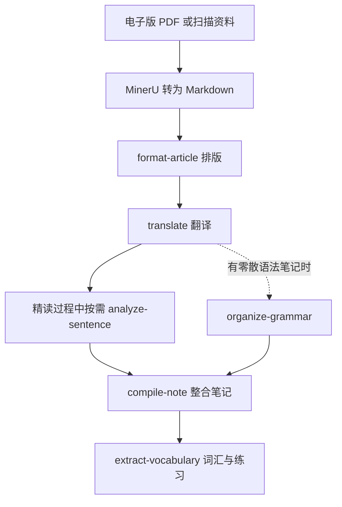

# 考研英语阅读精读 Vault 使用说明

这是一套在 Obsidian 中完成考研英语阅读精读的学习库。你只需准备电子版文章或扫描资料，再按下面的流程向 Codex 或 Claude Code 提出请求，即可逐步获得排版原文、翻译、长难句分析、综合笔记和词汇练习。

> [!tip] 先转成 Markdown，效果最好
> 对电子版 PDF 或扫描资料，建议先用 [MinerU](https://mineru.net/) 转换为 Markdown，再交给本 Vault 处理。这样能最大程度保留段落、标题与文字顺序，后续的排版、翻译和长难句定位会更稳定。

## 使用前准备

1. 用 Obsidian 打开本文件夹。
2. 为本篇文章确定一个完整 topic，例如 `2005-passage2-global-warming`。同一篇文章的中间目录、最终笔记文件名和 YAML 中的 `topic` 应使用同一个 topic。
3. 将 PDF 或扫描资料上传到 MinerU，导出 Markdown 文件；快速检查标题、段落和乱码，并保留原文件路径以便交给 AI 助手读取。

> [!note] 资料质量会影响后续效果
> MinerU 的转档结果不必完美。页眉页脚、题号、断行或识别错误可以先保留，`format-article` 会清理文章结构；但请先手动确认正文没有整段缺失或顺序颠倒。

## 一篇文章的主流程



| 阶段 | 使用的工具 | 主要产物 |
| --- | --- | --- |
| 0 | MinerU | 可编辑的 Markdown 原始资料 |
| 1 | `format-article` | `intermediate/<topic>/formatted-article.md` |
| 2 | `translate` | `intermediate/<topic>/translation.md` |
| 精读中 | `analyze-sentence` | 分析块内联到原文对应句子之后 |
| 整合前按需补齐 | `organize-grammar` | `intermediate/<topic>/grammar-notes.md` |
| 3 | `compile-note` | `<年份>阅读/<topic>-精读笔记.md` |
| 4 | `extract-vocabulary` | 最终笔记中的生词表与练习 |

下文用 `2005-passage2-global-warming` 作为示例 topic。把其中的路径替换成你自己的即可。

## 1. 用 MinerU 把资料转换为 Markdown

**什么时候用**：你拿到的是 PDF、扫描件或图片版电子资料时。

**需要什么**：原始电子资料。

**会得到什么**：一份可编辑的 Markdown 原文。你可以把它放在任何便于提供路径的位置。

**建议操作**：打开 [MinerU](https://mineru.net/)，完成转换后检查以下内容：

- 文章标题和各段文字是否齐全；
- 段落顺序是否正确；
- 表格、图片说明或试题选项是否被错误拼接；
- 是否存在明显乱码、断词或重复页眉页脚。

转换后的 Markdown 不需要自己精细排版；下一步会专门处理这件事。

## 2. 使用 `format-article` 模板化原文

**什么时候用**：拿到 MinerU 导出的 Markdown 后，先处理这一步。

**需要什么**：Markdown 原文文件路径，以及目标中间目录。

**会得到什么**：`intermediate/2005-passage2-global-warming/formatted-article.md`。它会保留英文原文，只清理格式、段落和标题层级。

**可直接复制的指令**：

```text
请使用 format-article 格式化“<MinerU 导出的 Markdown 文件路径>”中的英文文章。
目标文件夹为 intermediate/2005-passage2-global-warming/。
请只改善排版，不修改或删减原文内容。
```

> [!warning] 不要跳过这一步
> 先排版再翻译，能让中英对照与后续长难句定位保持正确的段落结构。

## 3. 使用 `translate` 生成中英对照

**什么时候用**：`formatted-article.md` 已生成后。

**需要什么**：排版后的文章文件路径，以及同一个目标中间目录。

**会得到什么**：`intermediate/2005-passage2-global-warming/translation.md`。每段英文后紧跟对应中文，翻译说明会使用 Obsidian callout 标注。

**可直接复制的指令**：

```text
请使用 translate 翻译
intermediate/2005-passage2-global-warming/formatted-article.md。
目标文件夹仍为 intermediate/2005-passage2-global-warming/，
请生成逐段中英对照翻译。
```

## 4. 在精读过程中使用 `analyze-sentence`

**什么时候用**：读原文或对照翻译时，遇到难以拆解的 1–5 个长难句就可以使用；不必等全文翻译完成后集中处理。

**需要什么**：待分析的英文句子。分析完成后，按提示提供这些句子所在的原文文件路径。

**会得到什么**：每个句子后紧跟一个可折叠的 `> [!abstract]- 长难句分析` 块，包含主干、修饰成分、结构图解、参考译文和考点提示。

**可直接复制的指令**：

```text
请使用 analyze-sentence 分析下面的长难句：

<粘贴 1–5 个英文句子>

这些句子来自
intermediate/2005-passage2-global-warming/formatted-article.md。
请在确认定位后，把每个分析块紧跟插入对应原句之后。
```

> [!important] 分析块的位置
> 同一段有多个长难句时，正确结构应是“原句 → 对应分析 → 下一句”。不要把多个分析统一堆放到段落末尾，也不要移到翻译部分或笔记底部。

## 5. 按需整理语法笔记

这不是你主流程中必须每次手动执行的一步，但 `compile-note` 整合时默认会读取 `grammar-notes.md`。如果你有做题时记下的零散语法点，建议在整合前补齐它。

**什么时候用**：想把零散语法、固定搭配或错题语法整理为可复习笔记时；或准备运行 `compile-note` 但中间目录还没有 `grammar-notes.md` 时。

**需要什么**：零散语法笔记或其文件路径，以及目标中间目录。

**会得到什么**：`intermediate/2005-passage2-global-warming/grammar-notes.md`，其中按从句、非谓语、语态等类别整理重点。

**可直接复制的指令**：

```text
请使用 organize-grammar 整理“<语法笔记文件路径>”中的内容。
目标文件夹为 intermediate/2005-passage2-global-warming/。
请保留原笔记中的例句、考点和易错提示。
```

## 6. 使用 `compile-note` 整合精读笔记

**什么时候用**：排版原文、翻译和语法笔记都准备好后。

**需要什么**：对应的 `intermediate/<topic>/` 资料目录，以及你明确指定的最终输出路径。

**会得到什么**：一份自包含的精读笔记，含背景、文章原文、翻译对照、语法要点、心得、延伸与思考题。原文中已经内联的长难句分析会保留在对应句子之后。

**可直接复制的指令**：

```text
请使用 compile-note 整合
intermediate/2005-passage2-global-warming/ 中的学习材料。
最终笔记请保存到：
2005阅读/2005-passage2-global-warming-精读笔记.md
```

> [!note] 输出路径必须说清楚
> `compile-note` 不会凭主题名猜测你想把最终笔记放在哪里。请始终在请求中给出完整输出路径。

## 7. 使用 `extract-vocabulary` 生成词汇表与练习

**什么时候用**：最终精读笔记生成后，作为收尾步骤执行。

**需要什么**：最终笔记的完整路径。笔记中应保留 `<!-- VOCABULARY_SLOT -->` 占位符，且需要学习的词汇应以 `**粗体**` 标记。

**会得到什么**：最终笔记中的“生词表”和“生词练习”。练习包含选词填空、短语翻译、语境理解及折叠答案。

**可直接复制的指令**：

```text
请使用 extract-vocabulary 处理
2005阅读/2005-passage2-global-warming-精读笔记.md。
请提取加粗生词，替换 VOCABULARY_SLOT，并补全生词表和三类练习。
```

> [!warning] 占位符不存在怎么办？
> 不要让 AI 随意改动笔记章节。先确认最终笔记中是否已有生词表与练习；若两者都没有，请先让 AI 说明建议插入的位置，再确认修改。

## 可选：跨篇汇总语法

完成多篇文章后，可以使用 `summarize-grammar` 扫描 `intermediate/` 下的所有 `grammar-notes.md`，生成或增量更新 `语法总结笔记.md`。适合阶段性复习，而非每完成一篇文章都必须执行。

```text
请使用 summarize-grammar 汇总 intermediate 下所有 grammar-notes.md，
生成或更新项目根目录的语法总结笔记。
```

## 完成检查清单

- [ ] MinerU 转出的正文没有明显缺段、乱序或乱码。
- [ ] `intermediate/<topic>/formatted-article.md` 已生成，英文原文的段落结构清晰。
- [ ] `intermediate/<topic>/translation.md` 已生成，且中英段落能一一对应。
- [ ] 需要分析的长难句都在原文对应句子后紧跟分析块。
- [ ] 整合前已具备 `grammar-notes.md`，或已确认本篇不需要独立语法整理的处理方式。
- [ ] 最终精读笔记已保存到你指定的目录。
- [ ] `<!-- VOCABULARY_SLOT -->` 已被替换为生词表和完整练习。
- [ ] 在 Obsidian 阅读视图中检查标题、表格、callout 和 Mermaid 流程图是否正常显示。

## 常见问题

### MinerU 转出的 Markdown 很乱，还能用吗？

可以。先确保正文没有遗漏或乱序，再把文件交给 `format-article`。它负责清理多余空行、断行和标题层级，但不会补回转档时丢失的原文。

### 可以直接翻译 PDF 吗？

可以，但推荐先经 MinerU 转成 Markdown，再依次使用 `format-article` 和 `translate`。这样对段落、题干和长难句位置的识别更稳定。

### 长难句分析应该放在翻译前还是翻译后？

不必固定。阅读原文或核对翻译时，遇到难句就立即使用 `analyze-sentence`。最重要的是，分析结果必须内联在原文的对应句子之后。

### 没有语法笔记，可以直接整合吗？

先检查 `intermediate/<topic>/` 中是否已有 `grammar-notes.md`。当前整合流程默认依赖它；没有时，先用 `organize-grammar` 整理你的零散语法笔记，再运行 `compile-note` 会更完整。

### 为什么 AI 反复询问目标文件夹或输出路径？

这是为了避免将笔记写入错误位置。`format-article`、`translate` 和 `organize-grammar` 需要目标中间目录；`compile-note` 还必须知道最终笔记的完整输出路径。

## 相关入口

- [[README]]：项目结构、目录命名与校验方式。
- [[AGENTS]]：完整项目规则与技能协作约定。
- [[语法总结笔记]]：跨篇语法复习入口（生成后可用）。
